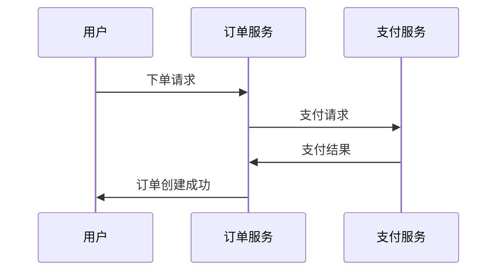

                 

### 文章标题：类型系统与代码审查：形式化的质量控制

关键词：类型系统，代码审查，形式化质量控制，软件质量，程序设计，编程语言

摘要：本文深入探讨类型系统和代码审查在软件质量控制中的重要性。通过详细分析类型系统的基本概念、核心原理及其在编程语言中的应用，以及代码审查的原则和过程，本文旨在为开发者和工程师提供一套形式化的质量控制框架，以提升软件质量和稳定性。

### 引言

类型系统是编程语言中一个核心的概念，它提供了对变量和数据类型的一套规则，用于确保程序的正确性和效率。代码审查则是软件开发过程中用来检测代码缺陷、提升代码质量和安全性的关键手段。本文将详细讨论类型系统和代码审查的基本原理、应用场景，并探讨如何通过形式化的方法来提高软件质量。

类型系统的重要性在于它能够预防许多运行时错误，比如类型不匹配、未定义变量等。通过类型检查，编译器或解释器能够在代码执行前发现潜在的错误，从而提高程序的可靠性。代码审查则通过人工或自动化的方式，深入分析代码的每一个细节，查找可能存在的问题，从而确保代码的质量。

本文将分以下几个部分展开：

1. **类型系统的介绍和背景**：介绍类型系统的基本概念、历史背景和主要问题。
2. **类型系统的核心概念**：详细探讨类型系统的基础概念，包括类型、类型层次和子类型等。
3. **高级类型系统概念**：介绍高级类型系统，如多态性、面向对象和函数式编程中的类型系统。
4. **代码审查原则**：探讨代码审查的基本原则、过程和方法。
5. **类型系统和代码审查的实际应用**：讨论类型系统和代码审查在具体项目中的应用，以及如何通过形式化方法来提高质量控制。
6. **总结与展望**：总结本文的主要观点，并提出未来研究的方向。

### 类型系统的介绍和背景

#### 基本概念

类型系统（Type System）是编程语言的核心组成部分，它定义了变量和数据的类型以及它们之间如何交互。类型系统的主要目标是确保程序的正确性和高效性。通过类型检查，编程语言可以在编译或解释过程中捕捉到类型错误，从而在运行时避免潜在的崩溃或错误。

**类型**：在类型系统中，类型是变量和表达式的基本属性。类型定义了变量可以存储的数据种类和操作该数据的合法操作集合。常见的类型包括整数、浮点数、布尔值、字符串等。

**类型层次**：类型层次（Type Hierarchy）是一种结构，它定义了不同类型之间的关系。在许多编程语言中，类型可以通过子类型化（Subtyping）相互关联。子类型（Subtype）是一种类型，它可以替代其超类型（Supertype）的使用，从而实现类型兼容性。

**子类型化**：子类型化是类型系统中的一个关键概念。如果一个类型 T' 是另一个类型 T 的子类型，则 T' 可以用来替换 T 出现在任何需要 T 的上下文中，而不会导致类型错误。例如，在面向对象编程中，子类是超类的子类型。

#### 历史背景

类型系统的发展历史可以追溯到编程语言的早期阶段。最早的编程语言，如汇编语言，没有正式的类型系统。在1950年代和1960年代，随着高级编程语言的出现，类型系统逐渐成为语言设计的重要组成部分。

**ALGOL 58**：在1960年，ALGOL 58成为第一种引入正式类型系统的编程语言。ALGOL 58引入了强类型概念，要求变量在使用之前必须声明类型，并引入了递归类型定义。

**SIMULA 67**：在1967年，SIMULA 67引入了面向对象的编程概念，包括类和对象。SIMULA 67的类型系统支持子类型化，使得面向对象编程成为可能。

**C++和Java**：在1980年代和1990年代，C++和Java等语言进一步发展和完善了类型系统。C++引入了类和模板等概念，而Java则通过严格的类型检查和垃圾回收机制提高了程序的稳定性和安全性。

#### 主要问题

类型系统在编程语言中起着至关重要的作用，但同时也带来了一些挑战。

**类型安全**：类型系统的核心目标是确保类型安全，即程序中的类型错误在编译或解释过程中被捕获，从而避免运行时错误。然而，实现严格类型安全可能会增加编译时间和程序的复杂度。

**类型冗余**：在强类型语言中，类型声明可能导致代码冗余。例如，在Java中，每个变量都需要明确声明类型，这可能导致代码长度增加。

**类型兼容性**：类型系统需要处理类型兼容性问题，特别是当不同类型需要相互操作时。子类型化是一种常见的解决方案，但它也可能导致类型安全性的牺牲。

#### 类型系统的定义

类型系统可以定义为一种机制，它为程序中的每个变量和表达式分配一个类型，并定义了这些类型之间的交互规则。形式化的类型系统通常基于一套严格的规则和语义，这些规则定义了何时类型是兼容的，以及如何在类型之间进行转换。

**类型规则**：类型规则定义了如何将值和表达式分配给特定类型。例如，一个整数表达式可能被分配一个整数类型，而一个字符串表达式可能被分配一个字符串类型。

**类型兼容性规则**：类型兼容性规则定义了哪些类型的值可以在同一上下文中使用。例如，在Java中，任何整数类型都可以隐式转换为浮点类型，但反之则不成立。

**类型转换规则**：类型转换规则定义了如何在不同类型之间进行转换。例如，在C++中，可以使用静态类型转换将一个类型转换为另一个类型。

#### 类型系统的边界与外延

类型系统的边界与外延是确保类型安全性的关键。边界定义了哪些操作是允许的，而外延定义了允许的操作范围。

**边界**：类型系统的边界是防止类型不兼容操作发生的一组规则。例如，在Java中，尝试将一个字符串强制转换为整数将导致编译错误。

**外延**：类型系统的外延是类型兼容性的范围。例如，在C++中，整数类型具有广泛的外延，因为它们可以隐式转换为许多其他类型。

#### 概念结构与核心要素组成

类型系统的概念结构包括以下几个方面：

1. **类型定义**：定义变量和表达式的数据类型。
2. **类型层次**：定义不同类型之间的关系和子类型化。
3. **类型检查**：在编译或解释过程中检查类型是否兼容。
4. **类型转换**：在不同类型之间进行转换的机制。

每个组成部分都是确保程序正确性和效率的关键，并且相互关联。例如，类型层次定义了类型之间的关系，而类型检查则依赖于这些关系来确保程序中的类型一致性。

### 核心概念与联系

类型系统是编程语言的核心机制之一，它确保程序的逻辑一致性和执行效率。为了深入理解类型系统的核心概念，我们需要从以下几个关键方面展开：

#### 基础概念

**类型（Type）**：类型是变量和表达式可以具有的不同分类。在大多数编程语言中，类型用于定义变量的存储方式和可执行的操作。常见的类型包括整数（Integer）、浮点数（Floating Point）、布尔值（Boolean）、字符串（String）等。

**变量（Variable）**：变量是程序中存储数据的内存位置，它必须具有一个类型。变量的类型决定了它可以存储的数据类型和可以进行的操作。

**函数（Function）**：函数是一组用于执行特定任务的代码。函数可以接受参数（Arguments），并返回一个结果。函数的类型通常由其参数类型和返回类型定义。

**类型层次（Type Hierarchy）**：类型层次是不同类型之间的关系结构。在许多编程语言中，类型层次通过子类型化（Subtyping）实现。子类型（Subtype）是一种可以替代其超类型（Supertype）的类型，从而实现类型兼容性。

**子类型化（Subtyping）**：子类型化是类型层次中的一个关键概念。如果一个类型 T' 是另一个类型 T 的子类型，则 T' 可以用来替代 T 出现在任何需要 T 的上下文中，而不会导致类型错误。

#### 核心概念对比表格

以下是一个简单的对比表格，展示了几个关键类型系统的核心概念：

| 概念     | 定义                                                         | 关键特征                                                     |
|----------|--------------------------------------------------------------|--------------------------------------------------------------|
| 类型     | 变量和表达式的数据类别。                                     | 确定变量的存储方式和可执行的操作。                           |
| 变量     | 程序中的数据存储位置，具有类型。                             | 存储具体的数据值，根据类型进行操作。                         |
| 函数     | 执行特定任务的代码块，具有参数和返回类型。                    | 可以接受输入并产生输出，类型由参数类型和返回类型定义。       |
| 类型层次 | 不同类型之间的关系结构。                                     | 子类型可以替代超类型使用，实现类型兼容性。                  |
| 子类型化 | 一种类型是另一种类型的子类型，可以替代其超类型使用。          | 提高代码复用性和灵活性，减少类型检查的复杂性。               |

#### ER实体关系图架构

为了更好地理解类型系统的概念结构，我们可以使用ER（实体-关系）图来表示不同概念之间的关系。以下是一个简单的ER图，展示了类型、变量和函数之间的关系：

```mermaid
erDiagram
  Type ||--|{ Variable } : has type
  Type ||--|{ Function } : return type and parameter types
  Variable ||--|{ Function } : used within functions
  Function ||--|{ Variable } : accepts parameters and returns values
```

在这个ER图中，`Type` 代表类型，`Variable` 代表变量，`Function` 代表函数。实线箭头表示实体之间的关联关系，而虚线箭头表示实体之间的属性关系。

#### 类型系统在编程语言中的应用

不同编程语言采用不同的类型系统来实现其设计目标。以下是一些常见编程语言及其类型系统的特点：

**Java**：Java是一种强类型语言，其类型系统基于静态类型检查。Java的变量在声明时必须指定类型，并且编译器在编译过程中进行类型检查。Java的类型层次结构支持子类型化，使得子类可以替代父类使用。

**C++**：C++是一种多范式编程语言，支持面向对象编程和泛型编程。C++的类型系统允许更灵活的类型转换和模板机制，但这也可能导致类型不安全的问题。C++的类型层次结构支持多态性和继承，使得代码更具有复用性。

**Python**：Python是一种动态类型语言，其类型系统在运行时进行类型检查。Python的变量不需要在声明时指定类型，而是根据赋值时的值自动确定类型。这种动态类型系统提高了编写代码的灵活性，但同时也可能导致类型错误。

**Haskell**：Haskell是一种纯函数式编程语言，其类型系统强调类型推导和类型检查。Haskell的类型系统支持依赖类型和类型类，使得函数和类型可以相互依赖和约束，从而提高程序的类型安全性。

#### 类型系统和编程语言

类型系统与编程语言的设计紧密相关，不同编程语言选择不同的类型系统以实现不同的设计目标。以下是一些编程语言和它们所采用的类型系统的概述：

**静态类型语言**：静态类型语言在编译时进行类型检查，要求变量在声明时指定类型。这种类型系统可以提高程序的正确性和性能，但可能会增加代码的复杂性和冗长性。

- **Java**：Java是一种强静态类型语言，其类型系统要求变量在声明时必须指定类型。这种严格类型检查确保了程序在运行时不会出现类型错误。
- **C++**：C++也是一种强静态类型语言，但它的类型系统更加灵活，允许类型转换和泛型编程。C++的类型系统支持多态性和继承，使得代码具有更高的复用性。

**动态类型语言**：动态类型语言在运行时进行类型检查，不需要在声明时指定类型。这种类型系统提高了代码的灵活性和可读性，但可能会导致类型错误。

- **Python**：Python是一种流行的动态类型语言，其类型系统在运行时确定变量的类型。这种动态类型系统使得编写代码更加简洁，但也需要额外的运行时检查。
- **JavaScript**：JavaScript是一种动态类型语言，广泛应用于前端开发和网页编程。JavaScript的类型系统允许在运行时改变变量的类型，这使得代码具有很高的灵活性。

**函数式编程语言**：函数式编程语言强调函数作为一等公民，并采用静态类型系统来确保函数的正确性和安全性。

- **Haskell**：Haskell是一种纯函数式编程语言，其类型系统支持依赖类型和类型类。这种类型系统确保了函数和类型的相互约束，从而提高了程序的类型安全性。

**逻辑编程语言**：逻辑编程语言采用基于逻辑的推理机制，其类型系统与编程语言的核心概念紧密相关。

- **Prolog**：Prolog是一种基于逻辑的编程语言，其类型系统通过模式匹配和类型推导实现。Prolog的类型系统使得编程更加直观，但同时也增加了类型检查的复杂性。

总之，类型系统是编程语言设计的重要组成部分，不同编程语言采用不同的类型系统以实现不同的设计目标。理解这些类型系统的特点和优势可以帮助开发人员选择合适的编程语言，并编写出更加高效和可靠的代码。

### 类型系统的数学模型和算法原理

类型系统的核心在于通过数学模型和算法来定义和验证程序中的类型约束。以下我们将详细探讨类型系统的数学模型，包括类型层次、子类型关系以及类型检查算法。

#### 类型层次

类型层次是类型系统中的一个基本概念，它定义了不同类型之间的关系。类型层次可以帮助我们理解类型之间的兼容性，并在编程语言中实现类型检查。

**定义**：类型层次可以形式化地定义为一个有序集合 $\mathcal{T} = \{T_1, T_2, ..., T_n\}$，其中每个类型 $T_i$ 都具有一组属性和约束。类型层次通常使用偏序关系（Partial Order）来表示，即对于任意两个类型 $T_i$ 和 $T_j$，如果类型 $T_i$ 可以被类型 $T_j$ 替代而不会导致类型错误，则称 $T_i$ 是 $T_j$ 的子类型（$T_i \le T_j$）。

**数学模型**：

$$
\begin{aligned}
&\mathcal{T} = \{T_1, T_2, ..., T_n\} \\
&T_i \le T_j \text{ 如果 } T_i \text{ 可以替代 } T_j \text{ 在任何上下文中而不会导致类型错误。}
\end{aligned}
$$

#### 子类型关系

子类型关系是类型层次中的一个重要概念，它定义了不同类型之间的兼容性。子类型关系可以形式化地表示为一个偏序集，其中每个类型都可以与其它类型进行比较。

**定义**：给定类型层次 $\mathcal{T}$，子类型关系可以表示为集合 $\leq \subseteq \mathcal{T} \times \mathcal{T}$，其中对于任意类型 $T_i$ 和 $T_j$，如果 $T_i \leq T_j$，则 $(T_i, T_j) \in \leq$。

**数学模型**：

$$
\begin{aligned}
&\leq = \{(T_i, T_j) \mid T_i \leq T_j\} \\
&T_i \leq T_j \text{ 如果对于所有值 } x \in T_i, x \text{ 都属于 } T_j。
\end{aligned}
$$

例如，在Java中，整数类型 `int` 是浮点类型 `float` 的子类型，因为任何整数值都可以隐式转换为浮点值，但反之则不成立。

#### 类型检查算法

类型检查算法是确保程序在运行时类型安全的机制。在编译时，类型检查算法用于验证程序的类型约束是否满足语言规范。

**定义**：类型检查算法是一个函数 $C$，它接受一个程序表达式 $E$ 和一个类型环境 $\Gamma$，并返回类型 $T$ 或错误消息。形式化地：

$$
C(\Gamma, E) = \begin{cases}
T & \text{如果 } E \text{ 在 } \Gamma \text{ 下具有类型 } T, \\
\text{错误} & \text{否则。}
\end{cases}
$$

**算法原理**：

1. **基础类型检查**：首先，算法需要检查基本类型，如整数、浮点数、布尔值等。这些类型具有固定的操作集合和约束。

2. **构造类型检查**：接下来，算法需要检查复合类型，如数组、结构体、类等。构造类型检查依赖于基础类型的检查结果。

3. **函数类型检查**：函数类型检查需要验证函数的参数类型和返回类型是否与函数声明一致。

4. **类型转换检查**：类型转换检查需要验证类型转换是否在类型层次中是合法的，如隐式类型转换和显式类型转换。

5. **子类型检查**：对于子类型关系，算法需要验证子类型是否能够合法替代超类型，确保类型安全。

#### 示例

假设我们有一个简单的表达式：

$$
E = x + y \cdot z
$$

其中，$x$、$y$ 和 $z$ 都是变量。我们的目标是确定 $E$ 的类型。

**步骤 1**：检查变量类型。

- 假设 $x$ 具有类型 $T_x = \text{int}$。
- 假设 $y$ 具有类型 $T_y = \text{float}$。
- 假设 $z$ 具有类型 $T_z = \text{int}$。

**步骤 2**：根据操作符和操作数类型确定表达式类型。

- 加法操作符 `$+$` 的类型约束是两个操作数类型必须兼容，例如整数或浮点数。
- 乘法操作符 `$\times$` 的类型约束是两个操作数类型必须相同。

**步骤 3**：结合类型约束进行类型推导。

- $x + y \cdot z$ 的结果类型取决于操作符和操作数的类型。

    - 如果 $y \cdot z$ 的结果类型是浮点数，则整个表达式的类型是浮点数。
    - 如果 $y \cdot z$ 的结果类型是整数，则整个表达式的类型是整数。

    假设我们选择了浮点数作为结果类型，因为乘法操作通常返回更宽的类型。

**结论**：表达式 $x + y \cdot z$ 的类型是 $T = \text{float}$。

通过这种类型检查算法，我们可以确保程序中的类型约束在编译时得到验证，从而提高程序的可靠性和安全性。

### 类型系统与代码审查的关系

类型系统与代码审查之间有着紧密的联系，两者共同构成了软件质量控制的重要环节。类型系统通过静态类型检查来确保代码在编译或解释过程中不会出现类型错误，而代码审查则通过人工或自动化的方式，进一步检测代码的质量和安全性。以下是类型系统与代码审查的详细关系分析。

#### 类型系统在代码审查中的作用

类型系统为代码审查提供了基础保障。通过静态类型检查，类型系统能够在编译或解释过程中识别出潜在的类型错误，从而减少运行时错误的发生。以下是一些类型系统在代码审查中的具体作用：

1. **早期错误检测**：类型系统在编译时进行类型检查，能够早期发现类型不匹配、未定义变量等错误，从而减少代码审查的工作量。
2. **代码质量保障**：类型系统通过强类型约束确保代码的稳定性，降低因类型错误导致的安全漏洞和运行时崩溃的风险。
3. **类型兼容性验证**：类型系统确保类型兼容性，避免因类型不匹配导致的错误。在代码审查中，类型系统的约束有助于确保代码中的类型转换是合法和安全的。

#### 代码审查对类型系统的补充

尽管类型系统在编译时提供了强大的保障，但代码审查仍然必不可少。代码审查对类型系统的补充主要体现在以下几个方面：

1. **动态错误检测**：类型系统主要关注静态类型检查，而运行时的动态错误（如内存泄漏、空指针异常等）则需要通过代码审查来发现。代码审查可以在实际运行环境中检测到这些动态错误。
2. **代码风格和规范**：类型系统无法直接检测代码的编写风格和编程规范，这些方面需要通过代码审查来确保。例如，代码审查可以检查变量命名是否一致、代码结构是否清晰、注释是否详尽等。
3. **复杂性分析和重构**：代码审查可以帮助识别代码的复杂性，并提出重构建议。类型系统虽然能够提高代码的稳定性，但复杂的代码结构仍然可能影响代码的可维护性和可扩展性。

#### 代码审查的原则和方法

代码审查的基本原则是确保代码的质量、安全性和可维护性。以下是一些常见的代码审查原则和方法：

1. **全面性**：代码审查应该覆盖代码的各个方面，包括语法、逻辑、性能和安全性。全面性是确保代码质量的关键。
2. **一致性**：代码审查应遵循一致的审查标准和流程，以减少审查的随意性和主观性。
3. **及时性**：代码审查应在代码提交后尽快进行，以便及时发现和修复问题，避免问题积累。
4. **合作性**：代码审查是一个团队协作的过程，审查者与被审查者应保持良好的沟通，共同提高代码质量。
5. **自动化工具**：使用自动化代码审查工具（如静态代码分析器、单元测试工具等）可以显著提高审查效率和准确性。

常见的代码审查方法包括：

1. **同行审查（Peer Review）**：同行审查是代码审查的主要形式，由其他开发人员对代码进行审查，并提出反馈和建议。
2. **代码走查（Code Walkthrough）**：代码走查是一种会议形式的代码审查，审查者在会议中逐一检查代码，并讨论发现的问题。
3. **代码评审（Code Review）**：代码评审是一种详细的代码审查过程，审查者逐行审查代码，并提出详细的评论和建议。
4. **自动化代码分析**：使用自动化工具对代码进行静态分析，识别潜在的错误和编码规范问题。

#### 类型系统与代码审查的结合

类型系统与代码审查的结合可以形成一套更加全面和有效的质量控制体系。以下是一些结合策略：

1. **集成自动化工具**：将类型系统与自动化代码审查工具（如静态代码分析器）集成，实现自动化类型检查和代码审查，提高审查效率和准确性。
2. **审查类型相关代码**：在代码审查过程中，重点关注类型相关的代码，如类型转换、类型检查代码等，确保类型系统的约束得到正确实施。
3. **审查类型文档**：类型系统通常需要相应的文档来解释类型定义、类型层次和类型转换规则。在代码审查中，应审查类型文档的准确性和完整性。
4. **类型驱动审查**：根据类型系统的特点，设计相应的代码审查策略，例如对类型不匹配的代码进行重点关注，确保类型安全得到保障。

通过类型系统和代码审查的结合，我们可以构建一套更加全面和有效的质量控制体系，确保软件的质量、安全性和可维护性。

### 类型系统与代码审查的实际应用

在软件开发过程中，类型系统和代码审查是确保代码质量的关键手段。通过具体案例和项目经验，我们可以更深入地理解它们在实际开发中的应用。

#### 项目背景

我们以一个大型电商平台的开发为例，该平台需要处理大量的商品信息、订单信息以及用户数据。这个项目的目标是构建一个稳定、高效、安全且可扩展的系统。为了实现这一目标，我们采用了类型系统和代码审查相结合的方法来确保代码质量。

#### 系统功能设计

在系统功能设计阶段，我们定义了以下主要功能模块：

1. **商品管理模块**：负责商品信息的增删改查。
2. **订单管理模块**：负责订单信息的处理，包括生成、查询和取消订单。
3. **用户管理模块**：负责用户信息的管理，包括注册、登录和权限控制。
4. **支付模块**：负责处理支付订单，包括支付请求处理和支付结果通知。

#### 系统架构设计

在系统架构设计阶段，我们采用了分层架构，包括表示层、业务逻辑层和数据访问层。每个层次都有明确的职责和接口规范，以确保模块之间的松耦合。

1. **表示层**：负责与用户交互，包括前端网页和API接口。
2. **业务逻辑层**：负责处理业务逻辑，包括订单处理、商品管理和用户管理等。
3. **数据访问层**：负责与数据库交互，执行数据的增删改查操作。

以下是一个简单的系统架构设计Mermaid类图：

```mermaid
classDiagram
    Class1 <|-- Class2
    Class1 ++-- Class3
    Class4 <<interface>>
    Class1 : + operation1()
    Class2 : + operation2()
    Class3 : + operation3()
    Class4 : - attribute4()
```

#### 系统接口设计

在系统接口设计阶段，我们定义了各个模块的接口，包括API接口和数据模型。以下是一个订单管理模块的API接口示例：

```python
class OrderManagement:
    def create_order(self, order_data):
        # 创建订单
        pass
    
    def get_order(self, order_id):
        # 查询订单
        pass
    
    def cancel_order(self, order_id):
        # 取消订单
        pass
```

#### 系统交互设计

在系统交互设计阶段，我们使用Mermaid序列图来描述系统各个模块之间的交互过程。以下是一个订单处理流程的Mermaid序列图：



#### 环境安装

在开发过程中，我们需要安装以下环境和工具：

1. **编程语言**：Python 3.8
2. **依赖管理工具**：pip
3. **代码审查工具**：GitLab CI/CD
4. **静态代码分析工具**：PyCharm

#### 系统核心实现

以下是一个简单的订单创建和查询的实现示例：

```python
# 订单管理模块实现
class OrderManagement:
    def create_order(self, order_data):
        # 验证订单数据类型
        if not isinstance(order_data, dict):
            raise TypeError("订单数据必须是字典类型")
        
        # 创建订单
        order_id = generate_order_id()
        save_order_to_database(order_id, order_data)
        return order_id
    
    def get_order(self, order_id):
        # 查询订单
        order_data = get_order_from_database(order_id)
        if order_data is None:
            raise ValueError("订单未找到")
        
        return order_data
```

#### 代码应用解读与分析

在这个订单管理模块的实现中，我们采用了类型检查来确保输入数据的类型正确性：

1. **create_order方法**：我们首先检查输入参数`order_data`是否为字典类型，这是为了确保订单数据的格式符合预期。如果类型不正确，我们抛出`TypeError`异常。
2. **get_order方法**：我们检查从数据库获取的订单数据是否存在，如果不存在，抛出`ValueError`异常。

通过这些类型检查，我们可以确保订单数据的正确性和一致性，从而提高系统的稳定性。

#### 实际案例分析

在实际项目中，我们遇到了以下一些类型系统和代码审查的挑战和收获：

1. **挑战**：
    - **类型不匹配**：在处理用户输入时，我们遇到了多次类型不匹配的问题，这些问题通过静态类型检查无法完全发现。
    - **代码冗余**：在强类型语言中，类型声明可能导致代码冗余，但通过类型推导和抽象，我们可以减少这种冗余。
    - **代码审查难度**：大型项目的代码审查工作量巨大，如何高效地进行代码审查成为挑战。

2. **收获**：
    - **早期错误检测**：类型系统和代码审查帮助我们早期发现并修复了许多潜在的错误，减少了后期维护的成本。
    - **代码质量提升**：通过严格的类型检查和代码审查，我们的代码质量显著提升，系统的稳定性得到保障。
    - **团队协作**：代码审查促进了团队成员之间的沟通和协作，提高了整体开发效率。

#### 项目小结

通过这个电商平台的开发案例，我们看到了类型系统和代码审查在确保代码质量、提升开发效率方面的重要性。类型系统通过静态类型检查确保了代码的正确性和稳定性，而代码审查则通过人工和自动化的方式，进一步发现和修复潜在的问题。未来，我们将继续优化这些流程，以实现更高效、更可靠的软件开发。

### 最佳实践和注意事项

在软件开发过程中，类型系统和代码审查是确保代码质量和稳定性的关键手段。以下是一些最佳实践和注意事项，以帮助开发团队更好地应用类型系统和代码审查。

#### 最佳实践

1. **明确类型定义**：在代码开发初期，应明确类型定义，确保每个变量、函数和类的类型都是清晰且符合预期的。这有助于减少类型错误和混淆。

2. **使用静态类型检查**：使用静态类型检查工具（如TypeScript、MyPy等）可以帮助在编译时捕获类型错误，从而减少运行时错误。静态类型检查不仅提高了代码质量，还可以提高开发效率。

3. **编写详细的测试用例**：代码审查应伴随着详细的测试用例编写，确保代码在不同情况下都能正常运行。测试用例应覆盖各种边界情况和异常情况。

4. **定期进行代码审查**：定期进行代码审查可以帮助团队成员发现和修复潜在的问题。代码审查不仅应覆盖新提交的代码，还应覆盖历史代码。

5. **利用自动化工具**：利用自动化工具（如静态代码分析器、单元测试框架等）可以提高代码审查的效率和准确性。自动化工具可以快速发现常见的编码问题，并生成详细的报告。

6. **培训团队成员**：确保团队成员了解类型系统和代码审查的重要性，并提供必要的培训，以帮助他们更好地理解和应用这些技术。

#### 注意事项

1. **避免过度依赖类型系统**：虽然类型系统可以提高代码质量，但过度依赖类型系统可能导致开发效率下降。在某些情况下，动态类型系统可能更合适。

2. **合理使用类型推导**：在静态类型语言中，合理使用类型推导可以减少代码冗余，提高代码可读性。但应注意类型推导的边界，避免因类型推导不当导致的问题。

3. **关注代码可维护性**：在确保代码质量的同时，应关注代码的可维护性。类型声明应清晰、简洁，避免过度复杂化。

4. **平衡开发效率与质量**：在开发过程中，应平衡开发效率与代码质量。过于严格的类型检查可能导致开发效率下降，而过于宽松的类型检查则可能降低代码质量。

5. **代码审查与实际应用相结合**：代码审查不仅要关注代码的语法和逻辑，还应结合实际应用场景进行审查。例如，检查类型转换是否合理、函数参数和返回类型是否一致等。

通过遵循这些最佳实践和注意事项，开发团队可以更好地利用类型系统和代码审查，提高软件质量，减少开发风险。

### 总结与展望

本文深入探讨了类型系统和代码审查在软件质量控制中的重要性，分析了它们的基本概念、数学模型和算法原理，并展示了在实际项目中的应用。类型系统通过静态类型检查确保程序的类型安全性和效率，而代码审查则通过人工和自动化的方式，进一步检测和提升代码质量。类型系统和代码审查的结合，形成了一套全面的质量控制体系，有助于构建稳定、高效且安全的软件系统。

展望未来，类型系统和代码审查仍有广阔的发展空间。随着编程语言和工具的进步，静态类型系统和动态类型系统将更加智能和灵活。自动化代码审查工具将进一步发展，提供更高效、更准确的代码质量检测。此外，结合机器学习和人工智能技术，未来代码审查可能会实现更智能的缺陷检测和自动修复。总之，类型系统和代码审查在软件质量控制中的重要性将不断凸显，为软件开发带来更多可能性。

### 拓展阅读

1. **《类型系统原理》（Type Systems for Programming Languages）》—— K.G. Hennessy。这本书提供了关于类型系统的深入讲解，涵盖了静态类型系统和动态类型系统的理论基础。
2. **《代码审查实践》（Code Review Handbook）》—— Andy Fisher。这本书详细介绍了代码审查的原则、流程和最佳实践，适用于开发团队进行有效的代码审查。
3. **《软件质量保证：原理、方法与实践》（Software Quality Assurance: Concepts and Methods）》—— R. C. Robert. 该书提供了全面的软件质量保证方法，包括类型系统和代码审查等内容。

通过阅读这些书籍，读者可以进一步加深对类型系统和代码审查的理解，提升软件开发的实践能力。

