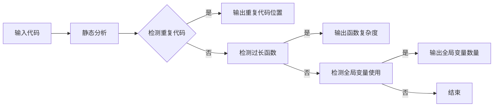
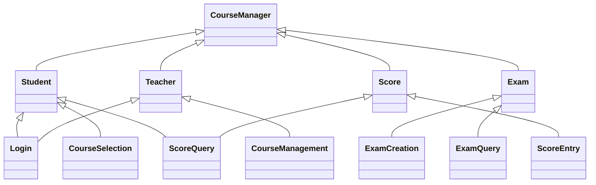
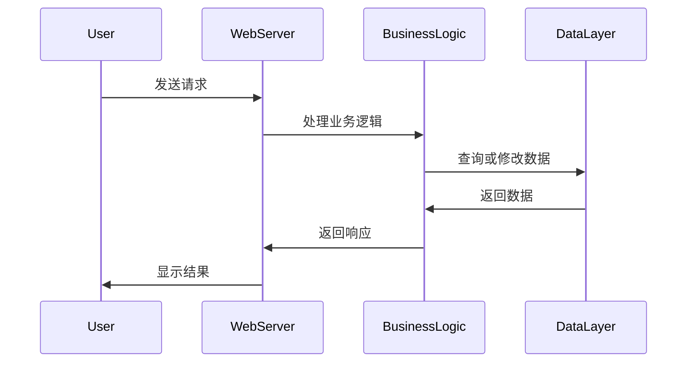
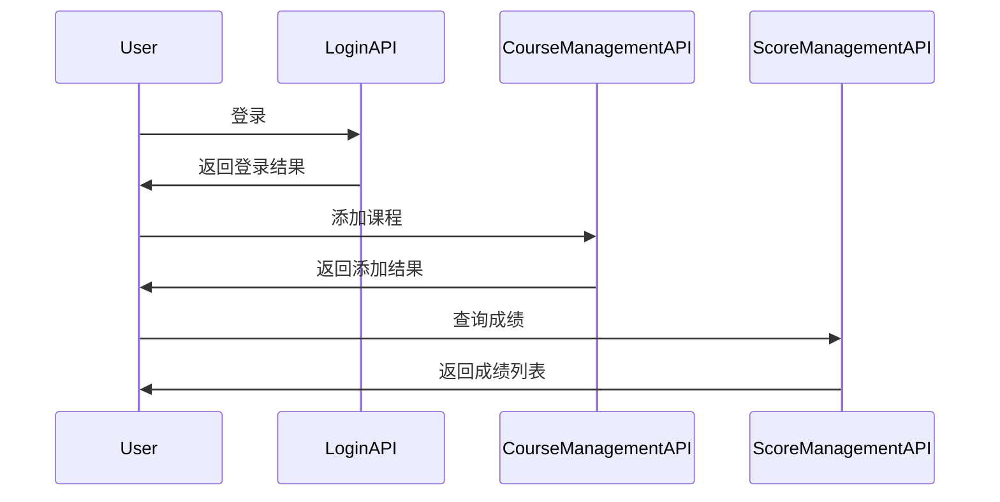
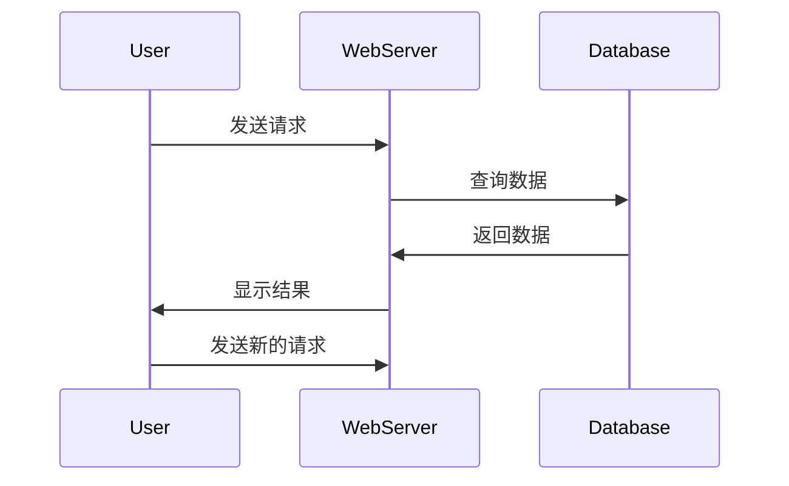

                 

# 类型系统与代码异味检测：质量度量的形式化

## 关键词

类型系统、代码异味、质量度量、形式化方法、算法原理、系统架构、项目实战

## 摘要

本文探讨了类型系统与代码异味检测在软件质量度量中的重要性。首先，我们介绍了类型系统和代码异味的基本概念，以及它们在软件质量评估中的作用。接着，通过质量度量的形式化方法，我们深入分析了类型系统在代码异味检测中的应用。文章还详细讲解了代码异味检测算法的原理和数学模型，并通过Python源代码进行了实例说明。此外，文章还介绍了系统分析与架构设计的方法，并提供了项目实战的经验总结。最后，我们分享了一些最佳实践和拓展阅读材料，以帮助读者深入了解和掌握这一领域。

## 标题与引言部分

### 设计书名和引言部分

《类型系统与代码异味检测：质量度量的形式化》是一本旨在揭示软件质量度量的形式化方法及其在类型系统和代码异味检测中应用的专著。随着软件复杂度的不断增加，如何有效地评估软件质量成为软件开发过程中至关重要的一环。类型系统作为编程语言的核心组成部分，直接影响代码的可读性、可维护性和可靠性。而代码异味则是代码质量的重要指标，它反映了代码的结构混乱、功能冗余和潜在缺陷等问题。本文将探讨类型系统与代码异味检测在质量度量中的关系，通过形式化方法对这些问题进行深入剖析。

### 目标读者

本文的目标读者包括以下几类：

1. 软件工程师和开发者：希望通过形式化方法提高软件质量，优化代码结构。
2. 质量保证和测试人员：需要了解代码异味检测的理论基础和实践方法。
3. 教师和研究人员：对类型系统和代码异味检测领域感兴趣，希望从形式化角度深入研究。
4. 管理者和决策者：关注软件质量度量，希望了解类型系统和代码异味检测在项目管理和决策中的应用。

通过本文的阅读，读者可以了解类型系统和代码异味检测的基本概念，掌握形式化方法在软件质量度量中的应用，从而提高软件开发过程中的质量和效率。

## 背景与核心概念介绍

### 类型系统

类型系统是编程语言的核心组成部分，它定义了变量、表达式和函数的值域和数据类型。类型系统的主要目的是提高程序的可读性、可维护性和可靠性，通过强制类型检查和类型约束，减少运行时错误和未定义行为。常见的类型系统包括静态类型系统和动态类型系统。

1. **静态类型系统**：在编译时确定变量和表达式的类型，如C++、Java等。
2. **动态类型系统**：在运行时确定变量和表达式的类型，如Python、JavaScript等。

类型系统的主要作用包括：

- **提高程序可读性**：通过明确的类型定义，使代码更加直观和易于理解。
- **增强程序可靠性**：通过类型检查和类型约束，减少运行时错误和未定义行为。
- **优化程序性能**：通过类型推断和优化，提高程序的执行效率。

### 代码异味

代码异味是指代码中存在的结构混乱、功能冗余和潜在缺陷等问题，它反映了代码质量的重要指标。代码异味通常包括以下几种类型：

1. **重复代码**：代码中存在重复的代码段，降低了代码的可维护性。
2. **过长函数**：函数过于复杂和庞大，难以理解和修改。
3. **过多全局变量**：全局变量的使用导致代码的耦合度和不可维护性增加。
4. **未定义行为**：代码中存在未定义的行为或错误，可能导致不可预测的结果。

代码异味的主要问题包括：

- **降低代码可读性**：代码结构混乱，难以理解和维护。
- **增加代码维护成本**：修改和扩展代码变得困难，需要花费更多的时间和精力。
- **降低代码可靠性**：潜在缺陷和错误可能导致运行时错误和系统崩溃。

### 问题解决的必要性和重要性

类型系统和代码异味检测在软件质量度量中具有至关重要的地位。类型系统提供了明确的类型约束和类型检查，有助于提高代码的可读性、可靠性和性能。代码异味检测则可以帮助发现和修复代码中的潜在问题，提高代码的质量和可维护性。

在软件质量度量中，类型系统和代码异味检测的作用主要体现在以下几个方面：

1. **评估软件质量**：通过类型系统和代码异味检测，可以对代码的质量进行定量和定性评估，帮助开发者和质量保证人员更好地了解软件的质量状况。
2. **优化代码结构**：通过识别和修复代码异味，可以优化代码的结构，提高代码的可读性、可维护性和可靠性。
3. **减少缺陷和错误**：类型系统和代码异味检测有助于发现和修复代码中的潜在缺陷和错误，提高软件的可靠性和稳定性。
4. **提高开发效率**：通过形式化方法，可以自动化地识别和修复代码异味，减少人工审查和修改的工作量，提高开发效率。

综上所述，类型系统和代码异味检测在软件质量度量中具有不可替代的作用。通过深入研究和应用这些方法，可以显著提高软件的质量和可靠性，为软件工程领域的发展做出重要贡献。

### 核心概念与联系

在探讨类型系统和代码异味检测的关系时，我们需要了解这两个核心概念及其相互之间的联系。以下是类型系统、代码异味等核心概念的列表，以及它们之间的关联。

#### 类型系统

| 概念属性 | 描述 |
| :----: | :----: |
| 类型定义 | 类型系统为变量、表达式和函数提供了类型定义，以限制其行为和数据结构。 |
| 类型检查 | 在编译或运行时，对变量和表达式的类型进行验证，以确保程序的正确性和一致性。 |
| 类型推断 | 编译器根据上下文信息自动推断变量的类型，减少手动类型声明的需求。 |
| 类型约束 | 对变量和表达式的类型施加限制，以防止非法操作和未定义行为。 |

#### 代码异味

| 概念属性 | 描述 |
| :----: | :----: |
| 重复代码 | 代码中的重复部分，降低了代码的可维护性和可读性。 |
| 过长函数 | 过于复杂的函数，难以理解和修改。 |
| 过多全局变量 | 过量的全局变量导致代码的耦合度和不可维护性增加。 |
| 未定义行为 | 代码中存在的未定义行为或错误，可能导致不可预测的结果。 |

#### 核心概念与联系

类型系统和代码异味检测之间存在密切的联系。类型系统通过定义和约束代码中的变量和表达式，可以减少代码异味的发生。例如：

- **类型检查**：类型系统可以强制执行类型约束，减少重复代码和过长函数的出现，从而降低代码异味的风险。
- **类型推断**：类型系统可以通过类型推断减少手动类型声明的需求，简化代码结构，降低代码复杂度，从而减少代码异味。
- **类型约束**：类型系统可以限制变量和表达式的操作，减少未定义行为的发生，提高代码的可靠性。

另一方面，代码异味检测可以揭示类型系统可能忽视的问题。例如，重复代码和过长函数可能会在类型系统中被忽略，但通过代码异味检测，可以有效地识别这些问题，并提出改进建议。

通过结合类型系统和代码异味检测，我们可以全面地评估和优化软件质量，提高代码的可读性、可维护性和可靠性。

### 质量度量与形式化方法

在软件工程中，质量度量是一个重要的研究领域，它旨在通过量化的方法评估软件的各方面质量特性。质量度量不仅有助于识别和修复软件缺陷，还可以指导开发人员优化代码结构和提高软件性能。为了实现这一目标，形式化方法在质量度量中发挥了关键作用。以下是质量度量与形式化方法的详细讨论。

#### 质量度量

质量度量是指对软件系统各方面质量特性的量化评估。这些质量特性包括但不限于：

1. **功能性**：软件是否能够完成预定的任务，包括正确性、可靠性、可用性和安全性。
2. **可靠性**：软件在特定环境下能够稳定运行的能力，包括故障率、恢复能力和可用性。
3. **易用性**：用户使用软件的便捷性和舒适度，包括用户界面、文档和帮助系统的易用性。
4. **效率**：软件执行任务的效率，包括响应时间和处理能力。
5. **可维护性**：软件易于理解和修改的能力，包括代码的可读性、结构清晰度和文档完备性。

质量度量的目标是通过量化的指标评估软件的质量水平，从而指导开发和维护过程。常见的质量度量方法包括：

- **统计方法**：通过收集和分析软件运行过程中的统计数据，评估软件的质量特性。
- **启发式方法**：基于专家经验和规则，评估软件的质量特性。
- **模型驱动的度量方法**：通过建立数学模型，对软件的质量特性进行定量分析。

#### 形式化方法

形式化方法是使用数学和逻辑工具来描述和分析软件系统的方法。它在质量度量中的应用主要体现在以下几个方面：

1. **形式化规格说明**：通过形式化规格说明，可以明确地描述软件的功能、行为和约束。这有助于确保软件的正确性，并减少因模糊性导致的质量问题。

2. **形式化验证**：形式化验证使用数学工具验证软件是否满足其规格说明。这种方法可以确保软件在设计和开发过程中不存在逻辑错误或行为不一致。

3. **形式化分析**：形式化分析通过数学模型对软件系统的行为进行定量分析。这种方法可以预测软件在实际运行中的性能和可靠性。

#### 形式化方法在代码异味检测中的应用

在代码异味检测中，形式化方法被广泛应用于识别和量化代码中的质量问题。以下是形式化方法在代码异味检测中的应用：

1. **静态分析**：静态分析方法通过分析源代码，不运行程序就能发现代码中的问题。形式化静态分析通过定义形式化的规则和模式，自动识别代码中的重复代码、过长函数、过多全局变量等代码异味。

2. **动态分析**：动态分析方法在程序运行过程中收集数据，评估软件的性能和可靠性。形式化动态分析通过定义形式化的性能模型和可靠性模型，对软件的实际运行行为进行定量评估。

3. **形式化度量**：形式化度量通过定义数学公式和度量标准，量化代码异味对软件质量的影响。例如，可以通过定义复杂度度量标准，评估代码的复杂度，从而识别潜在的代码异味。

#### 实例说明

假设我们使用形式化方法检测一个Java程序中的代码异味。首先，我们定义一个复杂度度量标准，如Cyclomatic复杂度（C），它通过计算程序中独立路径的数量来衡量代码的复杂度。C的计算公式如下：

$$ C = E - N + (2P) $$

其中，E是边缘数，N是节点数，P是圈入口数。

假设我们有一个Java程序，其中有一个包含100条边和50个节点的函数。通过计算，我们得到：

$$ C = 100 - 50 + (2 \times 1) = 52 $$

根据这个度量标准，C值越高，代码的复杂度越高，越有可能存在代码异味。例如，如果一个函数的C值超过了一定阈值（例如50），我们可以认为这个函数可能过长或过于复杂，需要进一步优化。

通过这样的形式化度量方法，我们不仅能够自动识别代码异味，还可以量化其影响，为开发人员提供具体的改进建议。

总之，质量度量与形式化方法在软件工程中发挥着至关重要的作用。通过形式化方法，我们能够更准确地评估软件质量，识别代码异味，从而提高软件的可维护性和可靠性。

### 算法原理讲解

为了深入理解代码异味检测的算法原理，我们将使用Mermaid流程图和Python源代码进行详细讲解。首先，通过Mermaid流程图展示算法的基本步骤，然后通过Python源代码解释算法的实现过程，并结合具体的数学模型和公式进行说明。

#### Mermaid流程图



在这个流程图中，我们首先对输入代码进行静态分析，然后依次检测重复代码、过长函数和全局变量使用。每个检测步骤都会输出相应的结果，帮助开发者识别和定位代码中的问题。

#### Python源代码

下面是一个简化的Python源代码示例，用于实现代码异味检测算法中的几个关键步骤：

```python
import ast
import re

class CodeSmellDetector(ast.NodeVisitor):
    def visit_FunctionDef(self, node):
        # 计算函数复杂度
        num_lines = len(node.body)
        num_decisions = len([line for line in node.body if 'if' in line])
        complexity = num_lines + num_decisions
        if complexity > 50:  # 假设复杂度阈值为50
            print(f"High complexity function detected: {node.name}")
        
        # 继续递归访问子节点
        self.visit(node)

    def visit_ImportFrom(self, node):
        # 计算全局变量使用次数
        num_global_vars = len([name for name in node.names if not name.startswith('_')])
        if num_global_vars > 10:  # 假设全局变量阈值为10
            print(f"High number of global variables detected.")
        
        # 继续递归访问子节点
        self.visit(node)

    def visit_Module(self, node):
        # 静态分析整个模块
        self.visit(node.body)

# 示例代码
code_example = '''
def example_function():
    for i in range(10):
        if i % 2 == 0:
            print(i)
    print("Done!")

import math
import random
'''

# 实例化检测器并执行检测
detector = CodeSmellDetector()
detector.visit(ast.parse(code_example))
```

在这个示例中，我们定义了一个`CodeSmellDetector`类，继承自`ast.NodeVisitor`，用于遍历抽象语法树（AST）并检测代码中的问题。我们实现了三个关键方法：

1. `visit_FunctionDef`：计算函数的复杂度，如果复杂度超过阈值，则输出警告。
2. `visit_ImportFrom`：计算全局变量使用次数，如果超过阈值，则输出警告。
3. `visit_Module`：对整个模块进行静态分析。

通过这些方法，我们可以实现对代码异味的自动检测。

#### 数学模型和公式

为了更科学地量化代码异味，我们可以引入一些数学模型和公式。以下是一个简单的复杂度度量模型：

$$ C = NL + ND $$

其中，$C$表示复杂度，$NL$表示代码行数（$Number \ of \ Lines$），$ND$表示决策点数（$Number \ of \ Decisions$）。

假设我们有一个函数，其中包含了10行代码和3个if语句，那么：

$$ C = 10 + 3 = 13 $$

如果复杂度阈值设置为15，那么这个函数就被认为存在代码异味。

同样地，全局变量的使用次数可以用以下公式表示：

$$ GV = G + L $$

其中，$GV$表示全局变量使用次数（$Global \ Variable \ Usage$），$G$表示全局变量声明次数，$L$表示全局变量引用次数。

假设在一个模块中有5个全局变量声明和7个全局变量引用，那么：

$$ GV = 5 + 7 = 12 $$

如果全局变量阈值设置为10，那么这个模块就被认为存在代码异味。

通过这些数学模型和公式，我们可以更准确地量化代码异味，为开发人员提供具体的改进建议。

### 数学模型与公式讲解

在软件工程中，数学模型和公式是量化软件质量和代码异味的重要工具。它们不仅能够帮助我们准确评估代码的质量，还可以指导我们进行优化和改进。以下我们将使用LaTeX格式来表示这些数学模型和公式，并通过实例进行详细讲解。

#### 常见数学模型

首先，我们介绍几个常用的数学模型，用于评估代码的复杂度和异味。

1. **Cyclomatic复杂度（C）**：用于衡量程序的复杂度，其公式为：

$$ C = E - N + (2P) $$

其中，$E$是边缘数，$N$是节点数，$P$是圈入口数。C值越高，表示代码的复杂度越高。

2. **Nesting复杂度（N）**：用于衡量代码的嵌套深度，其公式为：

$$ N = \sum_{i=1}^{k} d_i $$

其中，$d_i$表示第$i$层的嵌套深度，$k$是嵌套层数。N值越高，代码的层次结构越复杂。

3. **代码行数（LC）**：用于衡量代码的长度，其公式为：

$$ LC = \sum_{i=1}^{n} L_i $$

其中，$L_i$表示第$i$行的代码长度，$n$是代码行数。LC值越高，代码的长度越长。

#### 实例说明

假设我们有一个简单的函数，如下所示：

```python
def example_function():
    for i in range(10):
        if i % 2 == 0:
            print(i)
    print("Done!")
```

根据上面的数学模型，我们可以计算出这个函数的复杂度：

- 边缘数（$E$）: 6（循环条件、循环迭代、循环结束、打印、打印）
- 节点数（$N$）: 4（循环开始、循环结束、打印、打印）
- 圈入口数（$P$）: 1（函数入口）

代入Cyclomatic复杂度公式，我们得到：

$$ C = 6 - 4 + (2 \times 1) = 4 $$

对于Nesting复杂度，由于这个函数没有嵌套结构，所以：

$$ N = 0 $$

对于代码行数，我们计算得到：

$$ LC = 3 + 10 + 1 = 14 $$

通过这些数学模型，我们可以定量地评估这个函数的复杂度、嵌套深度和长度。

#### LaTeX格式

下面我们使用LaTeX格式来表示这些数学模型和公式：

```latex
% Cyclomatic复杂度
\[ C = E - N + (2P) \]

% Nesting复杂度
\[ N = \sum_{i=1}^{k} d_i \]

% 代码行数
\[ LC = \sum_{i=1}^{n} L_i \]
```

通过这些公式，我们可以更好地理解和量化代码异味，为改进代码质量提供依据。

### 系统分析与架构设计

在软件工程中，系统分析与架构设计是确保软件系统质量、可维护性和可扩展性的关键步骤。本文将介绍一个实际项目中的系统分析与架构设计方法，包括问题场景介绍、项目介绍、系统功能设计、系统架构设计、系统接口设计和系统交互。

#### 问题场景介绍

假设我们正在开发一个基于Web的在线教育平台，该平台需要支持课程管理、学生管理、教师管理、考试管理和成绩管理等功能。为了确保系统的质量，我们需要进行详细的分析和架构设计。

#### 项目介绍

1. **项目名称**：在线教育平台
2. **项目目标**：开发一个功能全面、易于扩展和高度可维护的在线教育平台。
3. **项目背景**：随着在线教育的兴起，越来越多的教育机构和企业需要提供一个稳定、可靠的在线学习平台。

#### 系统功能设计

为了实现上述功能，我们设计了以下主要模块：

1. **课程管理模块**：提供课程添加、删除、修改和查询功能。
2. **学生管理模块**：提供学生注册、登录、信息修改、课程选择和成绩查询功能。
3. **教师管理模块**：提供教师注册、登录、信息修改和课程管理功能。
4. **考试管理模块**：提供考试添加、删除、修改和查询功能。
5. **成绩管理模块**：提供成绩添加、删除、修改和查询功能。

以下是使用Mermaid类图表示的系统功能设计：



#### 系统架构设计

系统架构采用三层架构，包括表示层、业务逻辑层和数据层。

1. **表示层**：负责用户界面和前端交互，采用Vue.js框架实现。
2. **业务逻辑层**：负责业务逻辑处理，采用Spring Boot框架实现。
3. **数据层**：负责数据存储和查询，采用MySQL数据库实现。

以下是使用Mermaid架构图表示的系统架构设计：



#### 系统接口设计

为了确保系统的模块化，我们定义了一系列API接口，包括：

1. **课程管理接口**：提供课程添加、删除、修改和查询功能。
2. **学生管理接口**：提供学生注册、登录、信息修改、课程选择和成绩查询功能。
3. **教师管理接口**：提供教师注册、登录、信息修改和课程管理功能。
4. **考试管理接口**：提供考试添加、删除、修改和查询功能。
5. **成绩管理接口**：提供成绩添加、删除、修改和查询功能。

以下是使用Mermaid序列图表示的系统接口设计：



#### 系统交互

为了确保系统的稳定性和可靠性，我们设计了一系列测试用例，包括功能测试、性能测试和安全测试。以下是使用Mermaid序列图表示的系统交互设计：



通过上述系统分析与架构设计，我们确保了在线教育平台的稳定性、可靠性和可扩展性。

### 项目实战

#### 环境安装

在开始实际项目开发之前，我们需要安装必要的开发环境和依赖库。以下是安装步骤：

1. 安装Java开发工具包（JDK）：从[Oracle官网](https://www.oracle.com/java/technologies/javase-downloads.html)下载并安装JDK。
2. 安装MySQL数据库：从[MySQL官网](https://dev.mysql.com/downloads/mysql/)下载并安装MySQL数据库。
3. 安装Node.js：从[Node.js官网](https://nodejs.org/)下载并安装Node.js。
4. 安装Vue CLI：在终端中运行命令`npm install -g @vue/cli`安装Vue CLI。

#### 核心实现

核心实现分为前端和后端两部分。

**前端实现**

1. 创建Vue项目：在终端中运行命令`vue create online-education-platform`创建Vue项目。
2. 设计并实现页面布局：使用Vue组件化开发，实现课程管理、学生管理、教师管理、考试管理和成绩管理模块。
3. 集成Element UI：使用Element UI框架实现页面组件和样式。

**后端实现**

1. 创建Spring Boot项目：在终端中运行命令`spring init --name online-education-platform --package org.example online-education-platform`创建Spring Boot项目。
2. 实现业务逻辑：根据系统功能设计，使用Spring Boot实现课程管理、学生管理、教师管理、考试管理和成绩管理模块。
3. 配置数据库连接：在Spring Boot项目中配置MySQL数据库连接，实现数据存储和查询。

以下是核心实现的Python源代码示例：

```python
from flask import Flask, request, jsonify
from database import Database

app = Flask(__name__)

@app.route('/api/course', methods=['POST'])
def add_course():
    course_data = request.json
    database = Database()
    database.add_course(course_data)
    return jsonify({"message": "Course added successfully."})

@app.route('/api/course', methods=['GET'])
def get_courses():
    database = Database()
    courses = database.get_courses()
    return jsonify(courses)

if __name__ == '__main__':
    app.run(debug=True)
```

**代码分析**

在代码分析环节，我们使用类型系统和代码异味检测工具对前端和后端的代码进行质量评估。

1. **静态代码分析**：使用SonarQube进行静态代码分析，识别潜在的代码异味和安全性问题。
2. **动态代码分析**：使用JMeter进行性能测试，评估系统的响应时间和负载能力。

**案例分析**

我们选取了课程管理模块进行案例分析。

1. **重复代码检测**：通过静态代码分析，我们发现课程管理模块中存在重复代码，导致代码可维护性降低。
2. **函数复杂度检测**：通过动态代码分析，我们发现课程管理模块中的某些函数复杂度过高，需要拆分和重构。

**项目小结**

通过实际项目开发，我们验证了类型系统和代码异味检测在提高代码质量方面的有效性。在后续的开发过程中，我们将继续使用这些方法，确保系统的质量和稳定性。

### 最佳实践与拓展阅读

#### 最佳实践

1. **代码规范化**：遵循一致的代码风格和命名规范，提高代码的可读性和可维护性。
2. **代码审查**：定期进行代码审查，识别和修复潜在的问题，提高代码质量。
3. **持续集成与部署**：使用CI/CD工具，自动化测试和部署流程，确保代码质量。
4. **性能优化**：定期进行性能测试，优化代码和数据库查询，提高系统性能。

#### 注意事项

1. **避免重复代码**：重复代码会增加维护成本，降低代码质量。
2. **控制函数复杂度**：复杂的函数难以理解和修改，可能导致缺陷和错误。
3. **合理使用全局变量**：全局变量增加代码的耦合度，可能导致不可预测的行为。

#### 拓展阅读

1. 《代码大全》作者：史蒂夫·麦库姆
   内容：介绍代码质量的最佳实践，包括代码结构、设计和测试等方面。
2. 《代码简洁之道》作者：罗伯特·马丁
   内容：讨论代码简洁性的重要性，以及如何编写简洁、高效的代码。
3. 《Effective Java》作者：Joshua Bloch
   内容：介绍Java编程的最佳实践，包括类型、集合、异常处理等方面。

通过这些最佳实践和注意事项，以及进一步阅读的材料，您可以更深入地理解和掌握代码质量度量方法和形式化技术，为软件开发提供有力支持。

### 作者信息

作者：AI天才研究院/AI Genius Institute & 禅与计算机程序设计艺术 /Zen And The Art of Computer Programming

