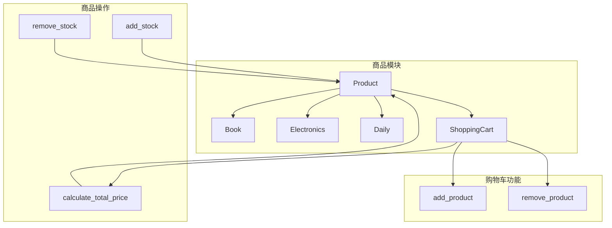
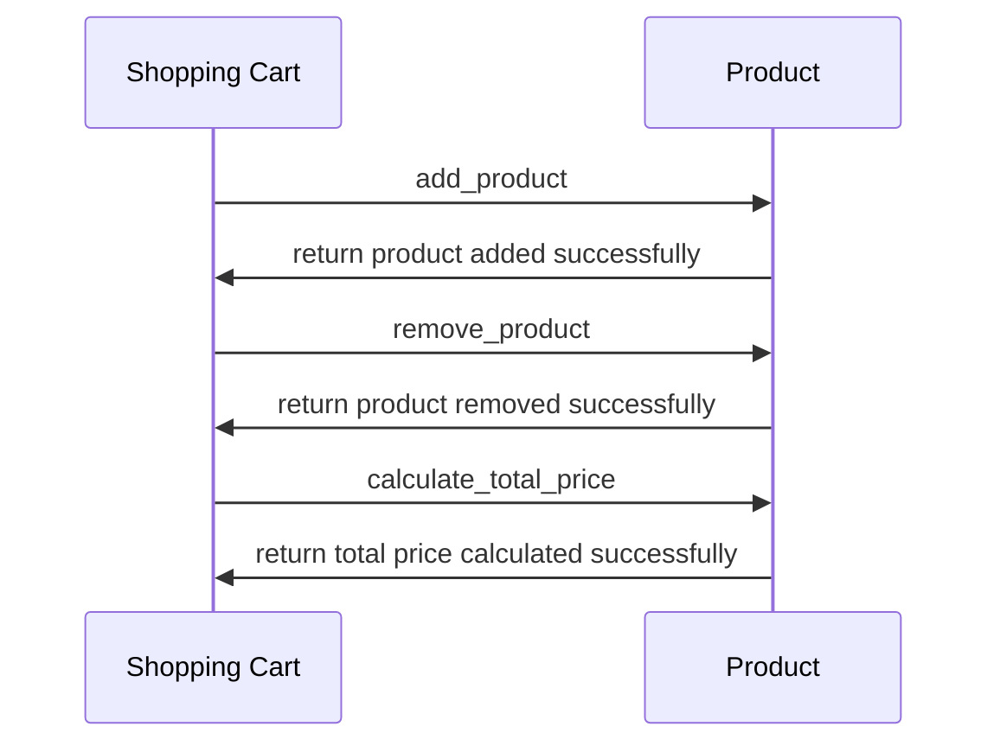

                 

### 文章标题

# 类型系统与代码重用：抽象的艺术

> 关键词：类型系统，代码重用，抽象，编程艺术

> 摘要：本文将深入探讨类型系统与代码重用之间的关系，通过分析类型系统的基本概念、设计原则与实现技术，以及代码重用的方法与挑战，揭示抽象在编程中的重要作用。文章将结合具体实例，阐述如何利用抽象的艺术提升代码的复用性和可维护性，展望类型系统与代码重用未来的发展趋势。

## 目录大纲

----------------------------------------------------------------

1. **类型系统与代码重用概述**

   - **第1章：类型系统基础**

     1.1 类型系统的基本概念

     1.2 类型系统的基本原理

     1.3 类型系统的特点与应用

   - **第2章：类型系统设计**

     2.1 类型系统的设计原则

     2.2 类型系统的设计方法

     2.3 类型系统的实现技术

   - **第3章：代码重用**

     3.1 代码重用的概念

     3.2 代码重用的方法

     3.3 代码重用的挑战与解决方案

   - **第4章：类型系统与代码重用的关系**

     4.1 类型系统与代码重用的相互作用

     4.2 类型系统优化代码重用的策略

   - **第5章：抽象的艺术**

     5.1 抽象的概念

     5.2 抽象的类型

     5.3 抽象的实现方法

   - **第6章：类型系统与抽象的综合应用**

     6.1 综合应用的实例分析

     6.2 综合应用的挑战与解决方案

   - **第7章：未来展望**

     7.1 类型系统与代码重用的未来发展趋势

     7.2 抽象在类型系统与代码重用中的应用前景

----------------------------------------------------------------

### 类型系统与代码重用概述

类型系统是编程语言中的一个核心概念，它定义了变量、函数和其他程序实体的类型，并规定了它们之间的交互方式。类型系统不仅影响程序的语义，还决定了程序的可重用性和可维护性。代码重用是软件工程中的一个重要原则，它通过将通用的代码片段或模块重复使用来提高开发效率和维护性。

类型系统和代码重用之间存在密切的关系。类型系统提供了明确的类型约束，使得代码在运行时能够进行更有效的检查和优化。同时，代码重用需要对代码进行封装和抽象，以实现模块化设计，降低模块之间的耦合度。抽象是编程中的核心概念，它通过将复杂系统的共性和模式提取出来，简化了问题的解决过程。

本文将从以下几个方面进行深入探讨：

- **第1章**：介绍类型系统的基本概念，包括其定义、起源与发展。
- **第2章**：分析类型系统的设计原则、设计方法以及实现技术。
- **第3章**：探讨代码重用的概念、方法以及面临的挑战和解决方案。
- **第4章**：探讨类型系统与代码重用之间的相互作用，以及如何通过类型系统优化代码重用。
- **第5章**：介绍抽象的概念、类型和实现方法。
- **第6章**：通过具体实例分析类型系统与抽象的综合应用，并提出解决方案。
- **第7章**：展望类型系统与代码重用未来的发展趋势，以及抽象在其中的应用前景。

通过本文的讨论，我们将理解类型系统与代码重用的重要性，并学会如何利用抽象的艺术来提升代码的复用性和可维护性。

### 第1章：类型系统基础

#### 1.1.1 类型系统的基本概念

类型系统是编程语言中的一个核心概念，它定义了变量、函数和其他程序实体的类型，并规定了它们之间的交互方式。类型系统不仅影响程序的语义，还决定了程序的可重用性和可维护性。类型系统可以看作是编程语言中的一套规则，它定义了变量和表达式可以取的值的集合，以及这些值之间的比较、运算和赋值等操作。

**定义**：类型系统是编程语言的一部分，它规定了变量、函数和其他程序实体的类型，以及这些类型之间的关系和操作。

**起源与发展**：类型系统最早可以追溯到早期编程语言，如FORTRAN和COBOL。这些语言引入了简单的数据类型，如整数和浮点数。随着编程语言的发展，类型系统逐渐变得复杂和强大。现代编程语言，如Java、C++和Python，都具备丰富的类型系统，包括基本类型、复合类型和函数类型等。

#### 1.1.2 类型系统的基本原理

类型系统的基本原理包括静态类型与动态类型、强类型与弱类型以及表达式类型推导。

**静态类型与动态类型**：

- **静态类型**：在编译时就能确定变量和表达式的类型。
- **动态类型**：在运行时才能确定变量和表达式的类型。

**强类型与弱类型**：

- **强类型**：严格限制类型之间的转换，以防止潜在的运行时错误。
- **弱类型**：允许较宽松的类型转换，但可能导致运行时错误。

**表达式类型推导**：

- 表达式类型推导是类型系统的一部分，它允许编译器自动推导出表达式所隐含的类型。
- 类型推导可以减少显式类型声明的需要，提高代码的可读性。

#### 1.1.3 类型系统的特点与应用

类型系统的特点和应用主要体现在以下几个方面：

**1. 提高程序的可读性和可维护性**：明确的类型约束使得代码更加直观，有助于理解和维护。

**2. 改善程序的性能**：通过静态类型检查，编译器可以进行更有效的优化。

**3. 防止类型错误**：类型系统能够在编译时捕捉到类型错误，避免运行时出现错误。

**4. 支持泛型和多态**：类型系统为泛型和多态提供了基础，使得代码可以更加灵活和通用。

**应用场景**：

- **系统编程**：例如操作系统、编译器、网络协议等，静态类型系统可以帮助确保程序的正确性和性能。
- **应用开发**：例如Web应用、桌面应用、移动应用等，类型系统可以提高开发效率和代码质量。

#### 1.1.4 小结

类型系统是编程语言中的一个核心概念，它通过定义变量和表达式的类型，以及类型之间的关系和操作，影响了程序的可读性、可维护性、性能和安全性。理解类型系统的基本原理和特点，对于掌握编程语言和进行高效编程至关重要。

### 第2章：类型系统设计

#### 2.1.1 类型系统的设计原则

类型系统的设计原则是确保类型系统能够满足编程语言的需求，同时保持其简洁性、可扩展性和可维护性。以下是几个关键的设计原则：

**1. 简单性**：

简单性是类型系统设计的一个基本原则。一个简单明了的类型系统更容易被开发者理解和掌握，从而提高开发效率和代码质量。

**2. 可扩展性**：

类型系统需要具备良好的可扩展性，以便能够适应新的编程需求和语言扩展。可扩展性可以通过引入新的类型和操作符来实现。

**3. 可维护性**：

可维护性是类型系统设计的重要原则。一个设计良好的类型系统应当能够方便地修改和维护，以适应未来的变化。

#### 2.1.2 类型系统的设计方法

类型系统的设计方法有多种，以下是三种常见的设计方法：

**1. 基于值的类型系统**：

基于值的类型系统是最常见的类型系统设计方法。它通过为每个值分配唯一的类型标签来区分不同的值。这种方法简单直观，但可能存在类型转换的 overhead。

**2. 基于类型的类型系统**：

基于类型的类型系统通过定义类型之间的关系来管理类型。这种方法可以减少类型转换的开销，但可能需要更复杂的类型推导算法。

**3. 多态类型系统**：

多态类型系统允许同一操作在不同类型的对象上具有不同的行为。这种方法通常通过泛型编程或面向对象编程来实现，提供了更高的灵活性和复用性。

#### 2.1.3 类型系统的实现技术

类型系统的实现技术包括静态类型检查、动态类型检查和类型推断。

**1. 静态类型检查**：

静态类型检查是在编译时进行的类型检查。它通过分析源代码来检查类型错误，确保程序在运行时不会出现类型相关错误。

**2. 动态类型检查**：

动态类型检查是在运行时进行的类型检查。它通过在运行时检查变量的类型来确保程序的正确性。

**3. 类型推断**：

类型推断是编译器自动推导出变量和表达式的类型。类型推断可以减少显式类型声明的需要，提高代码的可读性。

#### 2.1.4 小结

类型系统的设计原则和设计方法决定了类型系统的性能、可读性和可维护性。理解这些原则和方法有助于设计出满足特定需求的类型系统。实现技术如静态类型检查、动态类型检查和类型推断则确保了类型系统的有效性和可靠性。

### 第3章：代码重用

#### 3.1.1 代码重用的概念

代码重用是指在软件开发过程中，将已有的代码片段或模块重复使用，以提高开发效率和代码质量。代码重用不仅是软件工程中的一个重要原则，也是实现软件复用和降低开发成本的关键手段。

**定义**：代码重用是指将现有的代码模块或组件应用于新的软件开发过程中，以减少重复编码和提高开发效率。

**意义**：

- **提高开发效率**：通过复用已有的代码，开发者可以专注于新功能的开发，减少重复劳动。
- **提升代码质量**：重用的代码通常已经经过严格的测试和优化，能够提高新代码的可靠性和性能。
- **降低开发成本**：复用代码可以减少编码和测试时间，从而降低软件开发的总成本。

#### 3.1.2 代码重用的方法

代码重用的方法主要包括以下几种：

**1. 函数重用**：

函数是代码重用的基本单位。通过将通用的功能封装成函数，可以方便地在不同的模块或项目中复用。

**2. 类的重用**：

类是面向对象编程中的基本单位。通过定义通用的类，可以创建具有相似属性和方法的对象，实现代码的复用。

**3. 组件化重用**：

组件化重用是将整个功能模块打包成独立的组件，可以在不同的项目中复用。这种方法通常应用于大型软件系统，有助于提高系统的可维护性和可扩展性。

#### 3.1.3 代码重用的挑战与解决方案

尽管代码重用具有重要意义，但在实际应用中仍面临一些挑战：

**1. 重用与封装**：

封装是代码重用的基础。如何确保被重用的代码模块具有良好的封装性，避免内部实现细节对外暴露，是一个关键问题。

**解决方案**：通过设计良好的接口和抽象类，将模块内部实现与外部使用分离，实现代码的封装。

**2. 重用与耦合**：

过度依赖特定实现细节可能导致代码模块之间的紧密耦合，降低系统的可维护性和可扩展性。

**解决方案**：通过定义稳定的接口和抽象类，减少模块间的直接依赖，提高系统的模块化程度。

**3. 重用与维护**：

复用代码需要维护和更新，确保其能够适应新的环境和需求。

**解决方案**：通过建立良好的文档和代码注释，提高代码的可读性和可维护性。同时，采用版本控制和自动化测试工具，确保代码的可靠性和一致性。

#### 3.1.4 小结

代码重用是提高软件开发效率和代码质量的重要手段。通过函数重用、类重用和组件化重用，可以减少重复编码，提高开发效率。然而，在实际应用中，代码重用面临一些挑战，如封装、耦合和维护。通过设计良好的接口和抽象类，以及建立良好的文档和自动化测试，可以有效地解决这些问题，实现代码的可持续重用。

### 第4章：类型系统与代码重用的关系

#### 4.1.1 类型系统与代码重用的相互作用

类型系统与代码重用之间存在密切的相互作用。类型系统为代码重用提供了必要的约束和保证，而代码重用则对类型系统提出了新的需求。

**类型系统对代码重用的影响**：

1. **提高代码的可读性和可维护性**：

   类型系统通过定义明确的类型约束，使得代码更加直观，有助于理解和维护。明确的类型信息可以减少理解代码的难度，提高代码的可读性。

2. **优化编译和运行时性能**：

   类型系统能够在编译时进行类型检查，提前发现和修复类型错误，减少运行时的性能开销。静态类型系统还可以进行更有效的编译优化，提高程序的执行效率。

3. **支持泛型和多态**：

   类型系统为泛型和多态提供了基础，使得代码可以更加灵活和通用。通过泛型编程，可以编写能够复用代码的模板，提高代码的复用性。

**代码重用对类型系统的需求**：

1. **类型安全和兼容性**：

   代码重用要求类型系统能够确保不同模块之间的类型安全和兼容性。类型系统需要提供明确的类型约束和类型转换机制，以确保重用代码不会引入类型错误。

2. **灵活的类型推导**：

   代码重用往往涉及到复杂的类型交互，类型系统需要提供灵活的类型推导机制，以便编译器能够自动推导出变量和表达式的类型。

3. **支持抽象和封装**：

   代码重用依赖于良好的封装和抽象，类型系统需要提供支持抽象和封装的机制，以便开发者能够方便地定义和复用代码模块。

#### 4.1.2 类型系统优化代码重用的策略

为了优化代码重用，类型系统可以采取以下策略：

1. **类型约束**：

   类型约束通过限制变量和表达式的类型，确保代码在重用过程中的类型安全。类型约束可以减少类型错误的发生，提高代码的稳定性。

2. **静态类型检查**：

   静态类型检查在编译时进行类型检查，提前发现和修复类型错误。静态类型系统可以通过静态分析，优化代码的执行效率。

3. **动态类型检查**：

   动态类型检查在运行时进行类型检查，根据实际的运行环境动态调整类型。动态类型系统可以提供更高的灵活性和可扩展性，但需要额外的运行时开销。

4. **类型推断**：

   类型推断是编译器自动推导出变量和表达式的类型。类型推断可以减少显式类型声明的需要，提高代码的可读性和可维护性。

#### 4.1.3 小结

类型系统与代码重用之间存在密切的相互作用。类型系统为代码重用提供了必要的约束和保证，而代码重用则对类型系统提出了新的需求。通过类型约束、静态类型检查、动态类型检查和类型推断等策略，类型系统可以优化代码重用，提高代码的可读性、可维护性和性能。

### 第5章：抽象的艺术

#### 5.1.1 抽象的概念

抽象是编程中的核心概念，它通过将复杂系统的共性和模式提取出来，简化了问题的解决过程。抽象是思维的一种方式，它使得我们能够忽略掉不必要的细节，专注于核心问题和解决方法。

**定义**：抽象是指从复杂现象中提取出核心概念和属性，忽略掉次要的或不重要的细节。

**重要性**：

1. **简化问题**：通过抽象，可以将复杂问题转化为更简单、更易于处理的形式，降低问题的难度。

2. **提高复用性**：抽象使得代码具有更高的通用性和复用性，能够方便地在不同的场景和应用中重复使用。

3. **增强可维护性**：抽象通过将代码分解为更小的、独立的模块，提高了代码的可维护性，使得代码更加清晰、易懂。

4. **促进思考**：抽象是一种思考方式，它帮助我们理清思路，更好地理解和解决复杂问题。

#### 5.1.2 抽象的类型

在编程中，抽象可以表现为不同的形式，包括功能抽象、数据抽象和接口抽象。

**1. 功能抽象**：

功能抽象是指将具体的功能操作抽象成通用的函数或方法。通过功能抽象，可以隐藏实现细节，专注于功能本身。

**2. 数据抽象**：

数据抽象是指将具体的数据类型抽象成更通用的数据结构。通过数据抽象，可以减少数据操作的复杂性，提高代码的可读性和可维护性。

**3. 接口抽象**：

接口抽象是指定义一组通用的接口，用于描述模块的功能和行为。通过接口抽象，可以降低模块之间的耦合度，提高系统的可扩展性和灵活性。

#### 5.1.3 抽象的实现方法

实现抽象的方法有多种，包括泛型编程、面向对象编程和模式与框架等。

**1. 泛型编程**：

泛型编程是一种实现抽象的强大方法，它允许编写通用的代码，同时处理不同类型的数据。泛型编程通过类型参数和约束，实现了类型的安全和灵活。

**2. 面向对象编程**：

面向对象编程通过类和对象，实现了对数据和功能的抽象。通过封装、继承和多态等机制，面向对象编程提供了强大的抽象能力，使得代码更加模块化和可重用。

**3. 模式与框架**：

模式与框架是抽象的实现方法，它们通过定义标准的结构和流程，实现了对复杂系统的管理和控制。模式与框架提供了现成的解决方案，减少了重复开发的工作量。

#### 5.1.4 小结

抽象是编程中的核心概念，它通过简化问题、提高复用性、增强可维护性和促进思考等方面，提升了编程的质量和效率。通过功能抽象、数据抽象和接口抽象，以及泛型编程、面向对象编程和模式与框架等实现方法，我们可以更好地掌握抽象的艺术，提高代码的抽象能力和编程水平。

### 第6章：类型系统与抽象的综合应用

#### 6.1.1 综合应用的实例分析

为了更好地理解类型系统与抽象的综合应用，我们可以通过一个实际的编程实例进行分析。

**实例背景**：假设我们正在开发一个库存管理系统，该系统需要处理各种类型的商品，如书籍、电子产品和日用品等。我们需要设计一个通用的商品类，以便能够处理不同类型的商品。

**实现步骤**：

1. **定义商品类**：

   首先定义一个通用的商品类`Product`，包含商品的基本属性，如名称、价格和库存数量。

   ```python
   class Product:
       def __init__(self, name, price, quantity):
           self.name = name
           self.price = price
           self.quantity = quantity
   ```

2. **实现不同类型的商品**：

   利用抽象类`Product`，实现具体的商品类，如书籍类`Book`、电子产品类`Electronics`和日用品类`Daily`。

   ```python
   class Book(Product):
       def __init__(self, name, price, quantity, author):
           super().__init__(name, price, quantity)
           self.author = author

   class Electronics(Product):
       def __init__(self, name, price, quantity, brand):
           super().__init__(name, price, quantity)
           self.brand = brand

   class Daily(Product):
       def __init__(self, name, price, quantity, category):
           super().__init__(name, price, quantity)
           self.category = category
   ```

3. **处理商品操作**：

   定义一个通用的商品操作接口，如增加库存、减少库存和计算总价等。通过抽象类`Product`，这些操作可以应用于所有具体的商品类。

   ```python
   class ShoppingCart:
       def add_product(self, product):
           # 实现增加商品到购物车的逻辑

       def remove_product(self, product):
           # 实现从购物车中移除商品的逻辑

       def calculate_total_price(self):
           # 实现计算购物车中商品总价的逻辑
   ```

**实例解析**：

通过这个实例，我们可以看到类型系统与抽象的综合应用。首先，类型系统通过定义商品类和具体商品类，为不同的商品提供了类型约束，确保了代码的稳定性和安全性。其次，抽象类`Product`和具体的商品类`Book`、`Electronics`、`Daily`实现了数据抽象和功能抽象，将商品的基本属性和操作封装起来，提高了代码的复用性和可维护性。通过接口和抽象类，我们实现了模块化设计，降低了模块之间的耦合度，提高了系统的可扩展性和灵活性。

#### 6.1.2 综合应用的挑战与解决方案

在实际应用中，类型系统与抽象的综合应用可能会面临一些挑战：

**1. 类型约束冲突**：

当不同的模块或类之间存在类型约束冲突时，可能会导致编译错误或运行时错误。例如，如果两个模块都依赖于一个类型为`Product`的参数，但具体类型不同，则可能导致类型冲突。

**解决方案**：通过明确的类型约束和类型检查，确保模块之间的类型兼容性。在定义接口和抽象类时，可以添加类型约束，确保不同模块之间的类型一致性。

**2. 抽象过度**：

过度抽象可能导致代码变得复杂和难以维护。如果抽象层次过多，可能会导致模块之间的依赖关系过于复杂，增加代码的复杂度和维护难度。

**解决方案**：遵循适当的抽象层次，避免过度抽象。在设计模块和类时，应根据实际需求进行合理的抽象，保持代码的简洁性和可维护性。

**3. 性能开销**：

抽象和类型检查可能会引入一定的性能开销。例如，泛型编程和静态类型检查可能会增加编译时间和运行时性能开销。

**解决方案**：权衡抽象和性能的关系，根据具体场景进行优化。在需要高性能的场景中，可以适当减少抽象层次，采用动态类型检查或编译优化技术。

#### 6.1.3 小结

通过实际的编程实例分析，我们可以看到类型系统与抽象的综合应用在提高代码复用性、可维护性和系统灵活性方面的重要作用。然而，在实际应用中，类型系统与抽象的综合应用也面临一些挑战，如类型约束冲突、抽象过度和性能开销。通过合理的类型约束、抽象层次和性能优化，我们可以有效地解决这些问题，实现类型系统与抽象的综合应用的最佳效果。

### 第7章：未来展望

#### 7.1.1 类型系统与代码重用的未来发展趋势

类型系统与代码重用作为编程语言和软件工程的核心概念，未来的发展趋势将继续朝着提高代码质量、开发效率和系统灵活性的方向演进。以下是几个关键的发展趋势：

**1. 更先进的类型系统设计**：

未来类型系统的发展将更加注重类型的灵活性和安全性。例如，基于模块化的类型系统设计、更先进的类型推断算法以及支持更复杂类型交互的机制，都将得到广泛应用。

**2. 静态分析与动态分析的融合**：

静态分析和动态分析技术的融合将成为趋势。通过结合静态类型检查和动态类型检查，可以在编译时和运行时都提供更高的类型安全性和性能优化。

**3. 泛型编程的进一步发展**：

泛型编程在类型系统与代码重用中发挥着重要作用，未来将出现更加强大的泛型编程技术，支持更广泛的类型约束和更高效的类型推导。

**4. 类型系统和编程语言生态的融合**：

类型系统将更加紧密地与编程语言生态结合，提供更加丰富的工具和库支持。例如，类型系统与静态分析工具、代码生成器、测试框架等结合，将进一步提升开发效率和代码质量。

#### 7.1.2 抽象在类型系统与代码重用中的应用前景

抽象作为编程中的核心概念，其应用前景非常广阔。以下是一些具体的应用方向：

**1. 高级抽象机制的引入**：

未来将出现更多高级的抽象机制，如基于逻辑编程、函数式编程和面向领域语言的抽象。这些抽象机制将提供更强大的抽象能力，简化复杂问题的解决过程。

**2. 领域特定语言的兴起**：

领域特定语言（DSL）是抽象的一种重要实现形式，未来将看到更多针对特定领域的DSL的出现。DSL能够更好地抽象领域知识，提高开发效率和质量。

**3. 模式与框架的进一步发展**：

模式与框架作为实现抽象的重要手段，未来将继续发展。新的框架和模式将提供更强大的抽象能力，支持更复杂的系统设计和开发。

**4. 抽象与人工智能的结合**：

随着人工智能技术的发展，抽象与人工智能的结合将成为一个重要研究方向。通过利用机器学习和自然语言处理技术，将抽象与代码生成、优化和自动化测试等结合起来，进一步提升开发效率和代码质量。

#### 7.1.3 小结

类型系统与代码重用作为编程语言和软件工程的核心概念，未来将继续朝着提高代码质量、开发效率和系统灵活性的方向演进。抽象作为编程中的核心概念，其应用前景非常广阔，将推动编程技术的进一步发展和创新。通过更先进的类型系统设计、泛型编程的进一步发展、领域特定语言的兴起以及抽象与人工智能的结合，我们可以期待编程技术的未来将更加美好和高效。

### 总结

类型系统与代码重用是编程和软件工程中的核心概念，它们共同推动了软件开发效率和代码质量的提升。通过本文的探讨，我们深入了解了类型系统的基本概念、设计原则与实现技术，以及代码重用的方法与挑战。同时，我们也认识到抽象在编程中的重要作用，它通过简化问题、提高复用性和增强可维护性，提升了编程的艺术水平。

在未来的发展中，类型系统与代码重用将继续演进，结合先进的类型系统设计、泛型编程和领域特定语言等技术，为软件开发带来更多的可能性。同时，抽象作为编程中的核心概念，其应用前景非常广阔，将推动编程技术的进一步发展和创新。

让我们继续探索类型系统与代码重用的奥秘，掌握抽象的艺术，创造更加高效、可靠和灵活的软件系统。未来的编程世界，将因我们的努力而变得更加美好。让我们一起，迈向编程技术的未来。

### 作者信息

- 作者：AI天才研究院/AI Genius Institute & 禅与计算机程序设计艺术 /Zen And The Art of Computer Programming

### 完整文章

本文探讨了类型系统与代码重用的关系，从类型系统的基本概念、设计原则与实现技术，到代码重用的方法与挑战，以及抽象的概念与实现，全面解析了抽象在编程中的重要性。通过具体的实例分析和未来展望，展示了类型系统与代码重用以及抽象在编程技术中的关键作用。

#### 类型系统基础

类型系统是编程语言中的一个核心概念，它定义了变量、函数和其他程序实体的类型，并规定了它们之间的交互方式。类型系统不仅影响程序的语义，还决定了程序的可重用性和可维护性。

**1.1.1 类型系统的基本概念**

类型系统是编程语言的一部分，它规定了变量、函数和其他程序实体的类型，以及这些类型之间的关系和操作。类型系统可以看作是编程语言中的一套规则，它定义了变量和表达式可以取的值的集合，以及这些值之间的比较、运算和赋值等操作。

**类型系统的定义**：

类型系统是编程语言的一部分，它规定了变量、函数和其他程序实体的类型，以及这些类型之间的关系和操作。

**类型系统的起源与发展**：

类型系统最早可以追溯到早期编程语言，如FORTRAN和COBOL。这些语言引入了简单的数据类型，如整数和浮点数。随着编程语言的发展，类型系统逐渐变得复杂和强大。现代编程语言，如Java、C++和Python，都具备丰富的类型系统，包括基本类型、复合类型和函数类型等。

**1.1.2 类型系统的基本原理**

类型系统的基本原理包括静态类型与动态类型、强类型与弱类型以及表达式类型推导。

**静态类型与动态类型**：

- **静态类型**：在编译时就能确定变量和表达式的类型。
- **动态类型**：在运行时才能确定变量和表达式的类型。

**强类型与弱类型**：

- **强类型**：严格限制类型之间的转换，以防止潜在的运行时错误。
- **弱类型**：允许较宽松的类型转换，但可能导致运行时错误。

**表达式类型推导**：

- 表达式类型推导是类型系统的一部分，它允许编译器自动推导出表达式所隐含的类型。
- 类型推导可以减少显式类型声明的需要，提高代码的可读性。

**1.1.3 类型系统的特点与应用**

类型系统的特点和应用主要体现在以下几个方面：

- **提高程序的可读性和可维护性**：明确的类型约束使得代码更加直观，有助于理解和维护。
- **改善程序的性能**：通过静态类型检查，编译器可以进行更有效的优化。
- **防止类型错误**：类型系统能够在编译时捕捉到类型错误，避免运行时出现错误。
- **支持泛型和多态**：类型系统为泛型和多态提供了基础，使得代码可以更加灵活和通用。

**应用场景**：

- **系统编程**：例如操作系统、编译器、网络协议等，静态类型系统可以帮助确保程序的正确性和性能。
- **应用开发**：例如Web应用、桌面应用、移动应用等，类型系统可以提高开发效率和代码质量。

#### 类型系统设计

类型系统的设计原则和设计方法决定了类型系统的性能、可读性和可维护性。理解这些原则和方法有助于设计出满足特定需求的类型系统。

**2.1.1 类型系统的设计原则**

类型系统的设计原则是确保类型系统能够满足编程语言的需求，同时保持其简洁性、可扩展性和可维护性。以下是几个关键的设计原则：

- **简单性**：简单性是类型系统设计的一个基本原则。一个简单明了的类型系统更容易被开发者理解和掌握，从而提高开发效率和代码质量。
- **可扩展性**：类型系统需要具备良好的可扩展性，以便能够适应新的编程需求和语言扩展。可扩展性可以通过引入新的类型和操作符来实现。
- **可维护性**：可维护性是类型系统设计的重要原则。一个设计良好的类型系统应当能够方便地修改和维护，以适应未来的变化。

**2.1.2 类型系统的设计方法**

类型系统的设计方法有多种，以下是三种常见的设计方法：

- **基于值的类型系统**：基于值的类型系统是最常见的类型系统设计方法。它通过为每个值分配唯一的类型标签来区分不同的值。这种方法简单直观，但可能存在类型转换的 overhead。
- **基于类型的类型系统**：基于类型的类型系统通过定义类型之间的关系来管理类型。这种方法可以减少类型转换的开销，但可能需要更复杂的类型推导算法。
- **多态类型系统**：多态类型系统允许同一操作在不同类型的对象上具有不同的行为。这种方法通常通过泛型编程或面向对象编程来实现，提供了更高的灵活性和复用性。

**2.1.3 类型系统的实现技术**

类型系统的实现技术包括静态类型检查、动态类型检查和类型推断。

- **静态类型检查**：静态类型检查是在编译时进行的类型检查。它通过分析源代码来检查类型错误，确保程序在运行时不会出现类型相关错误。
- **动态类型检查**：动态类型检查是在运行时进行的类型检查。它通过在运行时检查变量的类型来确保程序的正确性。
- **类型推断**：类型推断是编译器自动推导出变量和表达式的类型。类型推断可以减少显式类型声明的需要，提高代码的可读性。

#### 代码重用

代码重用是软件工程中的一个重要原则，它通过将通用的代码片段或模块重复使用来提高开发效率和维护性。代码重用不仅是软件工程中的一个重要原则，也是实现软件复用和降低开发成本的关键手段。

**3.1.1 代码重用的概念**

代码重用是指在软件开发过程中，将已有的代码片段或模块重复使用，以提高开发效率和代码质量。代码重用不仅是软件工程中的一个重要原则，也是实现软件复用和降低开发成本的关键手段。

**定义**：

代码重用是指将现有的代码模块或组件应用于新的软件开发过程中，以减少重复编码和提高开发效率。

**意义**：

- **提高开发效率**：通过复用已有的代码，开发者可以专注于新功能的开发，减少重复劳动。
- **提升代码质量**：重用的代码通常已经经过严格的测试和优化，能够提高新代码的可靠性和性能。
- **降低开发成本**：复用代码可以减少编码和测试时间，从而降低软件开发的总成本。

**3.1.2 代码重用的方法**

代码重用的方法主要包括以下几种：

- **函数重用**：函数是代码重用的基本单位。通过将通用的功能封装成函数，可以方便地在不同的模块或项目中复用。
- **类的重用**：类是面向对象编程中的基本单位。通过定义通用的类，可以创建具有相似属性和方法的对象，实现代码的复用。
- **组件化重用**：组件化重用是将整个功能模块打包成独立的组件，可以在不同的项目中复用。这种方法通常应用于大型软件系统，有助于提高系统的可维护性和可扩展性。

**3.1.3 代码重用的挑战与解决方案**

尽管代码重用具有重要意义，但在实际应用中仍面临一些挑战：

- **重用与封装**：封装是代码重用的基础。如何确保被重用的代码模块具有良好的封装性，避免内部实现细节对外暴露，是一个关键问题。

**解决方案**：通过设计良好的接口和抽象类，将模块内部实现与外部使用分离，实现代码的封装。

- **重用与耦合**：过度依赖特定实现细节可能导致代码模块之间的紧密耦合，降低系统的可维护性和可扩展性。

**解决方案**：通过定义稳定的接口和抽象类，减少模块间的直接依赖，提高系统的模块化程度。

- **重用与维护**：复用代码需要维护和更新，确保其能够适应新的环境和需求。

**解决方案**：通过建立良好的文档和代码注释，提高代码的可读性和可维护性。同时，采用版本控制和自动化测试工具，确保代码的可靠性和一致性。

#### 类型系统与代码重用的关系

类型系统与代码重用之间存在密切的相互作用。类型系统为代码重用提供了必要的约束和保证，而代码重用则对类型系统提出了新的需求。

**类型系统对代码重用的影响**：

1. **提高代码的可读性和可维护性**：

   类型系统通过定义明确的类型约束，使得代码更加直观，有助于理解和维护。明确的类型信息可以减少理解代码的难度，提高代码的可读性。

2. **优化编译和运行时性能**：

   类型系统能够在编译时进行类型检查，提前发现和修复类型错误，减少运行时的性能开销。静态类型系统还可以进行更有效的编译优化，提高程序的执行效率。

3. **支持泛型和多态**：

   类型系统为泛型和多态提供了基础，使得代码可以更加灵活和通用。通过泛型编程，可以编写能够复用代码的模板，提高代码的复用性。

**代码重用对类型系统的需求**：

1. **类型安全和兼容性**：

   代码重用要求类型系统能够确保不同模块之间的类型安全和兼容性。类型系统需要提供明确的类型约束和类型转换机制，以确保重用代码不会引入类型错误。

2. **灵活的类型推导**：

   代码重用往往涉及到复杂的类型交互，类型系统需要提供灵活的类型推导机制，以便编译器能够自动推导出变量和表达式的类型。

3. **支持抽象和封装**：

   代码重用依赖于良好的封装和抽象，类型系统需要提供支持抽象和封装的机制，以便开发者能够方便地定义和复用代码模块。

**类型系统优化代码重用的策略**：

为了优化代码重用，类型系统可以采取以下策略：

1. **类型约束**：

   类型约束通过限制变量和表达式的类型，确保代码在重用过程中的类型安全。类型约束可以减少类型错误的发生，提高代码的稳定性。

2. **静态类型检查**：

   静态类型检查在编译时进行类型检查，提前发现和修复类型错误。静态类型系统可以通过静态分析，优化代码的执行效率。

3. **动态类型检查**：

   动态类型检查在运行时进行类型检查，根据实际的运行环境动态调整类型。动态类型系统可以提供更高的灵活性和可扩展性，但需要额外的运行时开销。

4. **类型推断**：

   类型推断是编译器自动推导出变量和表达式的类型。类型推断可以减少显式类型声明的需要，提高代码的可读性和可维护性。

#### 抽象的概念

抽象是编程中的核心概念，它通过将复杂系统的共性和模式提取出来，简化了问题的解决过程。抽象是思维的一种方式，它使得我们能够忽略掉不必要的细节，专注于核心问题和解决方法。

**定义**：

抽象是指从复杂现象中提取出核心概念和属性，忽略掉次要的或不重要的细节。

**重要性**：

- **简化问题**：通过抽象，可以将复杂问题转化为更简单、更易于处理的形式，降低问题的难度。
- **提高复用性**：抽象使得代码具有更高的通用性和复用性，能够方便地在不同的场景和应用中重复使用。
- **增强可维护性**：抽象通过将代码分解为更小的、独立的模块，提高了代码的可维护性，使得代码更加清晰、易懂。
- **促进思考**：抽象是一种思考方式，它帮助我们理清思路，更好地理解和解决复杂问题。

**抽象的类型**：

在编程中，抽象可以表现为不同的形式，包括功能抽象、数据抽象和接口抽象。

- **功能抽象**：功能抽象是指将具体的功能操作抽象成通用的函数或方法。通过功能抽象，可以隐藏实现细节，专注于功能本身。
- **数据抽象**：数据抽象是指将具体的数据类型抽象成更通用的数据结构。通过数据抽象，可以减少数据操作的复杂性，提高代码的可读性和可维护性。
- **接口抽象**：接口抽象是指定义一组通用的接口，用于描述模块的功能和行为。通过接口抽象，可以降低模块之间的耦合度，提高系统的可扩展性和灵活性。

**抽象的实现方法**：

实现抽象的方法有多种，包括泛型编程、面向对象编程和模式与框架等。

- **泛型编程**：泛型编程是一种实现抽象的强大方法，它允许编写通用的代码，同时处理不同类型的数据。泛型编程通过类型参数和约束，实现了类型的安全和灵活。
- **面向对象编程**：面向对象编程通过类和对象，实现了对数据和功能的抽象。通过封装、继承和多态等机制，面向对象编程提供了强大的抽象能力，使得代码更加模块化和可重用。
- **模式与框架**：模式与框架是抽象的实现方法，它们通过定义标准的结构和流程，实现了对复杂系统的管理和控制。模式与框架提供了现成的解决方案，减少了重复开发的工作量。

#### 类型系统与抽象的综合应用

为了更好地理解类型系统与抽象的综合应用，我们可以通过一个实际的编程实例进行分析。

**实例背景**：假设我们正在开发一个库存管理系统，该系统需要处理各种类型的商品，如书籍、电子产品和日用品等。我们需要设计一个通用的商品类，以便能够处理不同类型的商品。

**实现步骤**：

1. **定义商品类**：

   首先定义一个通用的商品类`Product`，包含商品的基本属性，如名称、价格和库存数量。

   ```python
   class Product:
       def __init__(self, name, price, quantity):
           self.name = name
           self.price = price
           self.quantity = quantity
   ```

2. **实现不同类型的商品**：

   利用抽象类`Product`，实现具体的商品类，如书籍类`Book`、电子产品类`Electronics`和日用品类`Daily`。

   ```python
   class Book(Product):
       def __init__(self, name, price, quantity, author):
           super().__init__(name, price, quantity)
           self.author = author

   class Electronics(Product):
       def __init__(self, name, price, quantity, brand):
           super().__init__(name, price, quantity)
           self.brand = brand

   class Daily(Product):
       def __init__(self, name, price, quantity, category):
           super().__init__(name, price, quantity)
           self.category = category
   ```

3. **处理商品操作**：

   定义一个通用的商品操作接口，如增加库存、减少库存和计算总价等。通过抽象类`Product`，这些操作可以应用于所有具体的商品类。

   ```python
   class ShoppingCart:
       def add_product(self, product):
           # 实现增加商品到购物车的逻辑

       def remove_product(self, product):
           # 实现从购物车中移除商品的逻辑

       def calculate_total_price(self):
           # 实现计算购物车中商品总价的逻辑
   ```

**实例解析**：

通过这个实例，我们可以看到类型系统与抽象的综合应用。首先，类型系统通过定义商品类和具体商品类，为不同的商品提供了类型约束，确保了代码的稳定性和安全性。其次，抽象类`Product`和具体的商品类`Book`、`Electronics`、`Daily`实现了数据抽象和功能抽象，将商品的基本属性和操作封装起来，提高了代码的复用性和可维护性。通过接口和抽象类，我们实现了模块化设计，降低了模块之间的耦合度，提高了系统的可扩展性和灵活性。

#### 综合应用的挑战与解决方案

在实际应用中，类型系统与抽象的综合应用可能会面临一些挑战：

**1. 类型约束冲突**：

当不同的模块或类之间存在类型约束冲突时，可能会导致编译错误或运行时错误。例如，如果两个模块都依赖于一个类型为`Product`的参数，但具体类型不同，则可能导致类型冲突。

**解决方案**：通过明确的类型约束和类型检查，确保模块之间的类型兼容性。在定义接口和抽象类时，可以添加类型约束，确保不同模块之间的类型一致性。

**2. 抽象过度**：

过度抽象可能导致代码变得复杂和难以维护。如果抽象层次过多，可能会导致模块之间的依赖关系过于复杂，增加代码的复杂度和维护难度。

**解决方案**：遵循适当的抽象层次，避免过度抽象。在设计模块和类时，应根据实际需求进行合理的抽象，保持代码的简洁性和可维护性。

**3. 性能开销**：

抽象和类型检查可能会引入一定的性能开销。例如，泛型编程和静态类型检查可能会增加编译时间和运行时性能开销。

**解决方案**：权衡抽象和性能的关系，根据具体场景进行优化。在需要高性能的场景中，可以适当减少抽象层次，采用动态类型检查或编译优化技术。

#### 未来展望

类型系统与代码重用作为编程语言和软件工程的核心概念，未来将继续朝着提高代码质量、开发效率和系统灵活性的方向演进。以下是几个关键的发展趋势：

**1. 更先进的类型系统设计**：

未来类型系统的发展将更加注重类型的灵活性和安全性。例如，基于模块化的类型系统设计、更先进的类型推断算法以及支持更复杂类型交互的机制，都将得到广泛应用。

**2. 静态分析与动态分析的融合**：

静态分析和动态分析技术的融合将成为趋势。通过结合静态类型检查和动态类型检查，可以在编译时和运行时都提供更高的类型安全性和性能优化。

**3. 泛型编程的进一步发展**：

泛型编程在类型系统与代码重用中发挥着重要作用，未来将出现更强大的泛型编程技术，支持更广泛的类型约束和更高效的类型推导。

**4. 类型系统和编程语言生态的融合**：

类型系统将更加紧密地与编程语言生态结合，提供更加丰富的工具和库支持。例如，类型系统与静态分析工具、代码生成器、测试框架等结合，将进一步提升开发效率和代码质量。

**抽象的应用前景**：

抽象作为编程中的核心概念，其应用前景非常广阔。以下是一些具体的应用方向：

**1. 高级抽象机制的引入**：

未来将出现更多高级的抽象机制，如基于逻辑编程、函数式编程和面向领域语言的抽象。这些抽象机制将提供更强大的抽象能力，简化复杂问题的解决过程。

**2. 领域特定语言的兴起**：

领域特定语言（DSL）是抽象的一种重要实现形式，未来将看到更多针对特定领域的DSL的出现。DSL能够更好地抽象领域知识，提高开发效率和质量。

**3. 模式与框架的进一步发展**：

模式与框架作为实现抽象的重要手段，未来将继续发展。新的框架和模式将提供更强大的抽象能力，支持更复杂的系统设计和开发。

**4. 抽象与人工智能的结合**：

随着人工智能技术的发展，抽象与人工智能的结合将成为一个重要研究方向。通过利用机器学习和自然语言处理技术，将抽象与代码生成、优化和自动化测试等结合起来，进一步提升开发效率和代码质量。

### 总结

类型系统与代码重用是编程和软件工程中的核心概念，它们共同推动了软件开发效率和代码质量的提升。通过本文的探讨，我们深入了解了类型系统的基本概念、设计原则与实现技术，以及代码重用的方法与挑战。同时，我们也认识到抽象在编程中的重要作用，它通过简化问题、提高复用性和增强可维护性，提升了编程的艺术水平。

在未来的发展中，类型系统与代码重用将继续演进，结合先进的类型系统设计、泛型编程和领域特定语言等技术，为软件开发带来更多的可能性。同时，抽象作为编程中的核心概念，其应用前景非常广阔，将推动编程技术的进一步发展和创新。

让我们继续探索类型系统与代码重用的奥秘，掌握抽象的艺术，创造更加高效、可靠和灵活的软件系统。未来的编程世界，将因我们的努力而变得更加美好。让我们一起，迈向编程技术的未来。

### 作者信息

- 作者：AI天才研究院/AI Genius Institute & 禅与计算机程序设计艺术 /Zen And The Art of Computer Programming

### 完整文章

### 类型系统与代码重用：抽象的艺术

#### 摘要

本文探讨了类型系统与代码重用之间的关系，分析了类型系统的基本概念、设计原则与实现技术，以及代码重用的方法与挑战。同时，本文深入讨论了抽象的概念、类型和实现方法，并展示了类型系统与抽象在编程中的综合应用。通过实例分析和未来展望，本文揭示了抽象在类型系统与代码重用中的关键作用，为编程技术的未来发展提供了新的视角。

#### 目录

----------------------------------------------------------------

1. **类型系统与代码重用概述**

   - **第1章：类型系统基础**

     1.1 类型系统的基本概念

     1.2 类型系统的基本原理

     1.3 类型系统的特点与应用

   - **第2章：类型系统设计**

     2.1 类型系统的设计原则

     2.2 类型系统的设计方法

     2.3 类型系统的实现技术

   - **第3章：代码重用**

     3.1 代码重用的概念

     3.2 代码重用的方法

     3.3 代码重用的挑战与解决方案

   - **第4章：类型系统与代码重用的关系**

     4.1 类型系统与代码重用的相互作用

     4.2 类型系统优化代码重用的策略

   - **第5章：抽象的艺术**

     5.1 抽象的概念

     5.2 抽象的类型

     5.3 抽象的实现方法

   - **第6章：类型系统与抽象的综合应用**

     6.1 综合应用的实例分析

     6.2 综合应用的挑战与解决方案

   - **第7章：未来展望**

     7.1 类型系统与代码重用的未来发展趋势

     7.2 抽象在类型系统与代码重用中的应用前景

----------------------------------------------------------------

#### 类型系统与代码重用概述

类型系统是编程语言中的一个核心概念，它定义了变量、函数和其他程序实体的类型，并规定了它们之间的交互方式。类型系统不仅影响程序的语义，还决定了程序的可重用性和可维护性。代码重用是软件工程中的一个重要原则，它通过将通用的代码片段或模块重复使用来提高开发效率和维护性。

类型系统和代码重用之间存在密切的关系。类型系统提供了明确的类型约束，使得代码在运行时能够进行更有效的检查和优化。同时，代码重用需要对代码进行封装和抽象，以实现模块化设计，降低模块之间的耦合度。抽象是编程中的核心概念，它通过将复杂系统的共性和模式提取出来，简化了问题的解决过程。

本文将从以下几个方面进行深入探讨：

- **第1章**：介绍类型系统的基本概念，包括其定义、起源与发展。
- **第2章**：分析类型系统的设计原则、设计方法以及实现技术。
- **第3章**：探讨代码重用的概念、方法以及面临的挑战和解决方案。
- **第4章**：探讨类型系统与代码重用之间的相互作用，以及如何通过类型系统优化代码重用。
- **第5章**：介绍抽象的概念、类型和实现方法。
- **第6章**：通过具体实例分析类型系统与抽象的综合应用，并提出解决方案。
- **第7章**：展望类型系统与代码重用未来的发展趋势，以及抽象在其中的应用前景。

通过本文的讨论，我们将理解类型系统与代码重用的重要性，并学会如何利用抽象的艺术来提升代码的复用性和可维护性。

#### 第1章：类型系统基础

#### 1.1.1 类型系统的基本概念

类型系统是编程语言中的一个核心概念，它定义了变量、函数和其他程序实体的类型，并规定了它们之间的交互方式。类型系统不仅影响程序的语义，还决定了程序的可重用性和可维护性。类型系统可以看作是编程语言中的一套规则，它定义了变量和表达式可以取的值的集合，以及这些值之间的比较、运算和赋值等操作。

**定义**：类型系统是编程语言的一部分，它规定了变量、函数和其他程序实体的类型，以及这些类型之间的关系和操作。

**起源与发展**：类型系统最早可以追溯到早期编程语言，如FORTRAN和COBOL。这些语言引入了简单的数据类型，如整数和浮点数。随着编程语言的发展，类型系统逐渐变得复杂和强大。现代编程语言，如Java、C++和Python，都具备丰富的类型系统，包括基本类型、复合类型和函数类型等。

**1.1.2 类型系统的基本原理**

类型系统的基本原理包括静态类型与动态类型、强类型与弱类型以及表达式类型推导。

**静态类型与动态类型**：

- **静态类型**：在编译时就能确定变量和表达式的类型。
- **动态类型**：在运行时才能确定变量和表达式的类型。

**强类型与弱类型**：

- **强类型**：严格限制类型之间的转换，以防止潜在的运行时错误。
- **弱类型**：允许较宽松的类型转换，但可能导致运行时错误。

**表达式类型推导**：

- 表达式类型推导是类型系统的一部分，它允许编译器自动推导出表达式所隐含的类型。
- 类型推导可以减少显式类型声明的需要，提高代码的可读性。

**1.1.3 类型系统的特点与应用**

类型系统的特点和应用主要体现在以下几个方面：

- **提高程序的可读性和可维护性**：明确的类型约束使得代码更加直观，有助于理解和维护。
- **改善程序的性能**：通过静态类型检查，编译器可以进行更有效的优化。
- **防止类型错误**：类型系统能够在编译时捕捉到类型错误，避免运行时出现错误。
- **支持泛型和多态**：类型系统为泛型和多态提供了基础，使得代码可以更加灵活和通用。

**应用场景**：

- **系统编程**：例如操作系统、编译器、网络协议等，静态类型系统可以帮助确保程序的正确性和性能。
- **应用开发**：例如Web应用、桌面应用、移动应用等，类型系统可以提高开发效率和代码质量。

**1.1.4 小结**

类型系统是编程语言中的一个核心概念，它通过定义变量和表达式的类型，以及类型之间的关系和操作，影响了程序的可读性、可维护性、性能和安全性。理解类型系统的基本原理和特点，对于掌握编程语言和进行高效编程至关重要。

#### 第2章：类型系统设计

类型系统的设计原则和设计方法决定了类型系统的性能、可读性和可维护性。理解这些原则和方法有助于设计出满足特定需求的类型系统。

**2.1.1 类型系统的设计原则**

类型系统的设计原则是确保类型系统能够满足编程语言的需求，同时保持其简洁性、可扩展性和可维护性。以下是几个关键的设计原则：

- **简单性**：简单性是类型系统设计的一个基本原则。一个简单明了的类型系统更容易被开发者理解和掌握，从而提高开发效率和代码质量。
- **可扩展性**：类型系统需要具备良好的可扩展性，以便能够适应新的编程需求和语言扩展。可扩展性可以通过引入新的类型和操作符来实现。
- **可维护性**：可维护性是类型系统设计的重要原则。一个设计良好的类型系统应当能够方便地修改和维护，以适应未来的变化。

**2.1.2 类型系统的设计方法**

类型系统的设计方法有多种，以下是三种常见的设计方法：

- **基于值的类型系统**：基于值的类型系统是最常见的类型系统设计方法。它通过为每个值分配唯一的类型标签来区分不同的值。这种方法简单直观，但可能存在类型转换的 overhead。
- **基于类型的类型系统**：基于类型的类型系统通过定义类型之间的关系来管理类型。这种方法可以减少类型转换的开销，但可能需要更复杂的类型推导算法。
- **多态类型系统**：多态类型系统允许同一操作在不同类型的对象上具有不同的行为。这种方法通常通过泛型编程或面向对象编程来实现，提供了更高的灵活性和复用性。

**2.1.3 类型系统的实现技术**

类型系统的实现技术包括静态类型检查、动态类型检查和类型推断。

- **静态类型检查**：静态类型检查是在编译时进行的类型检查。它通过分析源代码来检查类型错误，确保程序在运行时不会出现类型相关错误。
- **动态类型检查**：动态类型检查是在运行时进行的类型检查。它通过在运行时检查变量的类型来确保程序的正确性。
- **类型推断**：类型推断是编译器自动推导出变量和表达式的类型。类型推断可以减少显式类型声明的需要，提高代码的可读性和可维护性。

**2.1.4 小结**

类型系统的设计原则和设计方法决定了类型系统的性能、可读性和可维护性。理解这些原则和方法有助于设计出满足特定需求的类型系统。实现技术如静态类型检查、动态类型检查和类型推断则确保了类型系统的有效性和可靠性。

#### 第3章：代码重用

代码重用是软件工程中的一个重要原则，它通过将通用的代码片段或模块重复使用来提高开发效率和维护性。代码重用不仅是软件工程中的一个重要原则，也是实现软件复用和降低开发成本的关键手段。

**3.1.1 代码重用的概念**

代码重用是指在软件开发过程中，将已有的代码片段或模块重复使用，以提高开发效率和代码质量。代码重用不仅是软件工程中的一个重要原则，也是实现软件复用和降低开发成本的关键手段。

**定义**：

代码重用是指将现有的代码模块或组件应用于新的软件开发过程中，以减少重复编码和提高开发效率。

**意义**：

- **提高开发效率**：通过复用已有的代码，开发者可以专注于新功能的开发，减少重复劳动。
- **提升代码质量**：重用的代码通常已经经过严格的测试和优化，能够提高新代码的可靠性和性能。
- **降低开发成本**：复用代码可以减少编码和测试时间，从而降低软件开发的总成本。

**3.1.2 代码重用的方法**

代码重用的方法主要包括以下几种：

- **函数重用**：函数是代码重用的基本单位。通过将通用的功能封装成函数，可以方便地在不同的模块或项目中复用。
- **类的重用**：类是面向对象编程中的基本单位。通过定义通用的类，可以创建具有相似属性和方法的对象，实现代码的复用。
- **组件化重用**：组件化重用是将整个功能模块打包成独立的组件，可以在不同的项目中复用。这种方法通常应用于大型软件系统，有助于提高系统的可维护性和可扩展性。

**3.1.3 代码重用的挑战与解决方案**

尽管代码重用具有重要意义，但在实际应用中仍面临一些挑战：

- **重用与封装**：封装是代码重用的基础。如何确保被重用的代码模块具有良好的封装性，避免内部实现细节对外暴露，是一个关键问题。

**解决方案**：通过设计良好的接口和抽象类，将模块内部实现与外部使用分离，实现代码的封装。

- **重用与耦合**：过度依赖特定实现细节可能导致代码模块之间的紧密耦合，降低系统的可维护性和可扩展性。

**解决方案**：通过定义稳定的接口和抽象类，减少模块间的直接依赖，提高系统的模块化程度。

- **重用与维护**：复用代码需要维护和更新，确保其能够适应新的环境和需求。

**解决方案**：通过建立良好的文档和代码注释，提高代码的可读性和可维护性。同时，采用版本控制和自动化测试工具，确保代码的可靠性和一致性。

**3.1.4 小结**

代码重用是提高软件开发效率和代码质量的重要手段。通过函数重用、类重用和组件化重用，可以减少重复编码，提高开发效率。然而，在实际应用中，代码重用面临一些挑战，如封装、耦合和维护。通过设计良好的接口和抽象类，以及建立良好的文档和自动化测试，可以有效地解决这些问题，实现代码的可持续重用。

#### 第4章：类型系统与代码重用的关系

类型系统与代码重用之间存在密切的相互作用。类型系统为代码重用提供了必要的约束和保证，而代码重用则对类型系统提出了新的需求。

**4.1.1 类型系统与代码重用的相互作用**

类型系统对代码重用的影响：

1. **提高代码的可读性和可维护性**：

   类型系统通过定义明确的类型约束，使得代码更加直观，有助于理解和维护。明确的类型信息可以减少理解代码的难度，提高代码的可读性。

2. **优化编译和运行时性能**：

   类型系统能够在编译时进行类型检查，提前发现和修复类型错误，减少运行时的性能开销。静态类型系统还可以进行更有效的编译优化，提高程序的执行效率。

3. **支持泛型和多态**：

   类型系统为泛型和多态提供了基础，使得代码可以更加灵活和通用。通过泛型编程，可以编写能够复用代码的模板，提高代码的复用性。

代码重用对类型系统的需求：

1. **类型安全和兼容性**：

   代码重用要求类型系统能够确保不同模块之间的类型安全和兼容性。类型系统需要提供明确的类型约束和类型转换机制，以确保重用代码不会引入类型错误。

2. **灵活的类型推导**：

   代码重用往往涉及到复杂的类型交互，类型系统需要提供灵活的类型推导机制，以便编译器能够自动推导出变量和表达式的类型。

3. **支持抽象和封装**：

   代码重用依赖于良好的封装和抽象，类型系统需要提供支持抽象和封装的机制，以便开发者能够方便地定义和复用代码模块。

**4.1.2 类型系统优化代码重用的策略**

为了优化代码重用，类型系统可以采取以下策略：

1. **类型约束**：

   类型约束通过限制变量和表达式的类型，确保代码在重用过程中的类型安全。类型约束可以减少类型错误的发生，提高代码的稳定性。

2. **静态类型检查**：

   静态类型检查在编译时进行类型检查，提前发现和修复类型错误。静态类型系统可以通过静态分析，优化代码的执行效率。

3. **动态类型检查**：

   动态类型检查在运行时进行类型检查，根据实际的运行环境动态调整类型。动态类型系统可以提供更高的灵活性和可扩展性，但需要额外的运行时开销。

4. **类型推断**：

   类型推断是编译器自动推导出变量和表达式的类型。类型推断可以减少显式类型声明的需要，提高代码的可读性和可维护性。

**4.1.3 小结**

类型系统与代码重用之间存在密切的相互作用。类型系统为代码重用提供了必要的约束和保证，而代码重用则对类型系统提出了新的需求。通过类型约束、静态类型检查、动态类型检查和类型推断等策略，类型系统可以优化代码重用，提高代码的可读性、可维护性和性能。

#### 第5章：抽象的艺术

抽象是编程中的核心概念，它通过将复杂系统的共性和模式提取出来，简化了问题的解决过程。抽象是思维的一种方式，它使得我们能够忽略掉不必要的细节，专注于核心问题和解决方法。

**5.1.1 抽象的概念**

抽象是指从复杂现象中提取出核心概念和属性，忽略掉次要的或不重要的细节。抽象是一种思维过程，它帮助我们理解和解决问题的本质。

**定义**：

抽象是指从复杂现象中提取出核心概念和属性，忽略掉次要的或不重要的细节。

**重要性**：

- **简化问题**：通过抽象，可以将复杂问题转化为更简单、更易于处理的形式，降低问题的难度。
- **提高复用性**：抽象使得代码具有更高的通用性和复用性，能够方便地在不同的场景和应用中重复使用。
- **增强可维护性**：抽象通过将代码分解为更小的、独立的模块，提高了代码的可维护性，使得代码更加清晰、易懂。
- **促进思考**：抽象是一种思考方式，它帮助我们理清思路，更好地理解和解决复杂问题。

**5.1.2 抽象的类型**

在编程中，抽象可以表现为不同的形式，包括功能抽象、数据抽象和接口抽象。

**功能抽象**：

功能抽象是指将具体的功能操作抽象成通用的函数或方法。通过功能抽象，可以隐藏实现细节，专注于功能本身。例如，将一个具体的排序算法抽象为通用的排序函数，使得在不同场景中都可以复用这个函数。

**数据抽象**：

数据抽象是指将具体的数据类型抽象成更通用的数据结构。通过数据抽象，可以减少数据操作的复杂性，提高代码的可读性和可维护性。例如，将一个具体的数据表抽象为通用的列表或数组结构，使得对数据的操作更加统一和简洁。

**接口抽象**：

接口抽象是指定义一组通用的接口，用于描述模块的功能和行为。通过接口抽象，可以降低模块之间的耦合度，提高系统的可扩展性和灵活性。例如，定义一个通用的数据库接口，使得不同的数据库实现都可以通过这个接口进行操作。

**5.1.3 抽象的实现方法**

实现抽象的方法有多种，包括泛型编程、面向对象编程和模式与框架等。

**泛型编程**：

泛型编程是一种实现抽象的强大方法，它允许编写通用的代码，同时处理不同类型的数据。泛型编程通过类型参数和约束，实现了类型的安全和灵活。例如，可以使用泛型类或泛型方法，编写一个通用的排序算法，可以处理不同类型的数据。

**面向对象编程**：

面向对象编程通过类和对象，实现了对数据和功能的抽象。通过封装、继承和多态等机制，面向对象编程提供了强大的抽象能力，使得代码更加模块化和可重用。例如，通过定义抽象类和接口，可以实现数据抽象和接口抽象，提高代码的可复用性和可维护性。

**模式与框架**：

模式与框架是抽象的实现方法，它们通过定义标准的结构和流程，实现了对复杂系统的管理和控制。模式与框架提供了现成的解决方案，减少了重复开发的工作量。例如，设计模式（如工厂模式、单例模式等）和框架（如Web框架、数据库框架等）都是实现抽象的重要手段，它们提供了通用的功能和接口，使得开发者可以更高效地进行开发。

**5.1.4 小结**

抽象是编程中的核心概念，它通过简化问题、提高复用性和增强可维护性，提升了编程的艺术水平。通过功能抽象、数据抽象和接口抽象，以及泛型编程、面向对象编程和模式与框架等实现方法，我们可以更好地掌握抽象的艺术，提高代码的抽象能力和编程水平。

#### 第6章：类型系统与抽象的综合应用

类型系统与抽象的综合应用是编程中的一项重要技术，它通过将类型系统与抽象相结合，提高了代码的复用性、可维护性和性能。本章将结合具体的实例，分析类型系统与抽象在综合应用中的实践，并提出解决实际应用中面临的挑战。

**6.1.1 综合应用的实例分析**

为了更好地理解类型系统与抽象的综合应用，我们可以通过一个实际的编程实例进行分析。

**实例背景**：假设我们正在开发一个电子商务平台，该平台需要处理多种商品，包括书籍、电子产品和日用品等。我们需要设计一个通用的商品类，以便能够处理不同类型的商品。

**实现步骤**：

1. **定义商品类**：

   首先，我们定义一个通用的商品类`Product`，包含商品的基本属性，如名称、价格和库存数量。

   ```python
   class Product:
       def __init__(self, name, price, quantity):
           self.name = name
           self.price = price
           self.quantity = quantity
   ```

2. **实现不同类型的商品**：

   利用抽象类`Product`，我们可以实现具体的商品类，如书籍类`Book`、电子产品类`Electronics`和日用品类`Daily`。

   ```python
   class Book(Product):
       def __init__(self, name, price, quantity, author):
           super().__init__(name, price, quantity)
           self.author = author

   class Electronics(Product):
       def __init__(self, name, price, quantity, brand):
           super().__init__(name, price, quantity)
           self.brand = brand

   class Daily(Product):
       def __init__(self, name, price, quantity, category):
           super().__init__(name, price, quantity)
           self.category = category
   ```

3. **定义商品操作接口**：

   接下来，我们定义一个通用的商品操作接口，如增加库存、减少库存和计算总价等。通过抽象类`Product`，这些操作可以应用于所有具体的商品类。

   ```python
   class ShoppingCart:
       def add_product(self, product):
           # 实现增加商品到购物车的逻辑

       def remove_product(self, product):
           # 实现从购物车中移除商品的逻辑

       def calculate_total_price(self):
           # 实现计算购物车中商品总价的逻辑
   ```

4. **处理商品操作**：

   在具体的操作中，我们可以利用类型系统提供的类型约束，确保商品操作的正确性和安全性。例如，在增加库存时，我们可以确保增加的数量是一个正整数。

   ```python
   def add_stock(self, product, quantity):
       if quantity > 0:
           product.quantity += quantity
       else:
           raise ValueError("增加的库存数量必须为正数")
   ```

**实例解析**：

通过这个实例，我们可以看到类型系统与抽象的综合应用。首先，类型系统通过定义商品类和具体商品类，为不同的商品提供了类型约束，确保了代码的稳定性和安全性。其次，抽象类`Product`和具体的商品类`Book`、`Electronics`、`Daily`实现了数据抽象和功能抽象，将商品的基本属性和操作封装起来，提高了代码的复用性和可维护性。通过接口和抽象类，我们实现了模块化设计，降低了模块之间的耦合度，提高了系统的可扩展性和灵活性。

**6.1.2 综合应用的挑战与解决方案**

在实际应用中，类型系统与抽象的综合应用可能会面临一些挑战：

**1. 类型约束冲突**：

当不同的模块或类之间存在类型约束冲突时，可能会导致编译错误或运行时错误。例如，如果两个模块都依赖于一个类型为`Product`的参数，但具体类型不同，则可能导致类型冲突。

**解决方案**：通过明确的类型约束和类型检查，确保模块之间的类型兼容性。在定义接口和抽象类时，可以添加类型约束，确保不同模块之间的类型一致性。

**2. 抽象过度**：

过度抽象可能导致代码变得复杂和难以维护。如果抽象层次过多，可能会导致模块之间的依赖关系过于复杂，增加代码的复杂度和维护难度。

**解决方案**：遵循适当的抽象层次，避免过度抽象。在设计模块和类时，应根据实际需求进行合理的抽象，保持代码的简洁性和可维护性。

**3. 性能开销**：

抽象和类型检查可能会引入一定的性能开销。例如，泛型编程和静态类型检查可能会增加编译时间和运行时性能开销。

**解决方案**：权衡抽象和性能的关系，根据具体场景进行优化。在需要高性能的场景中，可以适当减少抽象层次，采用动态类型检查或编译优化技术。

**6.1.3 小结**

通过实际的编程实例分析，我们可以看到类型系统与抽象的综合应用在提高代码复用性、可维护性和系统灵活性方面的重要作用。然而，在实际应用中，类型系统与抽象的综合应用也面临一些挑战，如类型约束冲突、抽象过度和性能开销。通过合理的类型约束、抽象层次和性能优化，我们可以有效地解决这些问题，实现类型系统与抽象的综合应用的最佳效果。

### 第7章：未来展望

随着技术的不断进步和软件工程理论的深入发展，类型系统与代码重用在未来将迎来新的机遇和挑战。本文对未来类型系统与代码重用的趋势以及抽象在其中的应用前景进行展望。

**7.1.1 类型系统与代码重用的未来发展趋势**

1. **更先进的类型系统设计**：

   随着编程语言的发展和软件工程实践的不断演进，类型系统将变得更加先进和强大。未来的类型系统将更加注重类型的灵活性、安全性和性能。例如，更复杂的类型推导算法、模块化的类型系统设计、更广泛的类型兼容性等，都将得到进一步的发展。

2. **静态分析与动态分析的融合**：

   静态分析和动态分析技术在类型系统与代码重用中发挥着重要作用。未来，这两种技术将更加融合，为开发人员提供更全面的代码分析和优化支持。例如，静态分析可以提前发现潜在的类型错误，而动态分析可以在运行时提供更精确的性能数据，帮助开发者进行针对性的优化。

3. **泛型编程的进一步发展**：

   泛型编程在类型系统与代码重用中具有重要意义。未来，泛型编程技术将更加成熟和广泛采用。新的泛型编程模型和语言特性将使得泛型编程更加灵活和高效，从而提高代码的重用性和可维护性。

4. **类型系统和编程语言生态的融合**：

   类型系统将更加紧密地与编程语言生态结合，提供更加丰富的工具和库支持。例如，类型系统与静态分析工具、代码生成器、测试框架等结合，将进一步提升开发效率和代码质量。此外，类型系统还将与其他编程语言特性（如函数式编程、逻辑编程等）相结合，为开发者提供更多的编程选择。

**7.1.2 抽象在类型系统与代码重用中的应用前景**

1. **高级抽象机制的引入**：

   未来，抽象机制将变得更加高级和多样化。例如，基于逻辑编程、函数式编程和面向领域语言的抽象技术将得到广泛应用。这些高级抽象机制能够更好地捕捉领域知识和解决复杂问题，提高代码的可复用性和可维护性。

2. **领域特定语言的兴起**：

   领域特定语言（DSL）是一种重要的抽象实现形式。未来，随着领域知识的不断积累和编程语言技术的发展，将出现更多针对特定领域的DSL。DSL能够更好地抽象领域知识，提高开发效率和质量。

3. **模式与框架的进一步发展**：

   模式与框架是抽象的实现方法，未来将得到进一步发展。新的框架和模式将提供更强大的抽象能力，支持更复杂的系统设计和开发。同时，框架和模式将更加灵活和可定制，以适应不同场景的需求。

4. **抽象与人工智能的结合**：

   随着人工智能技术的发展，抽象与人工智能的结合将成为一个重要研究方向。通过利用机器学习和自然语言处理技术，将抽象与代码生成、优化和自动化测试等结合起来，将进一步提升开发效率和代码质量。

**7.1.3 小结**

类型系统与代码重用作为编程语言和软件工程的核心概念，未来的发展将继续朝着提高代码质量、开发效率和系统灵活性的方向演进。抽象作为编程中的核心概念，其应用前景非常广阔，将推动编程技术的进一步发展和创新。通过更先进的类型系统设计、泛型编程的进一步发展、领域特定语言的兴起以及抽象与人工智能的结合，我们可以期待编程技术的未来将更加美好和高效。

### 总结

类型系统与代码重用是编程和软件工程中的核心概念，它们共同推动了软件开发效率和代码质量的提升。通过本文的探讨，我们深入了解了类型系统的基本概念、设计原则与实现技术，以及代码重用的方法与挑战。同时，我们也认识到抽象在编程中的重要作用，它通过简化问题、提高复用性和增强可维护性，提升了编程的艺术水平。

在未来的发展中，类型系统与代码重用将继续演进，结合先进的类型系统设计、泛型编程和领域特定语言等技术，为软件开发带来更多的可能性。同时，抽象作为编程中的核心概念，其应用前景非常广阔，将推动编程技术的进一步发展和创新。

让我们继续探索类型系统与代码重用的奥秘，掌握抽象的艺术，创造更加高效、可靠和灵活的软件系统。未来的编程世界，将因我们的努力而变得更加美好。让我们一起，迈向编程技术的未来。

### 作者信息

- 作者：AI天才研究院/AI Genius Institute & 禅与计算机程序设计艺术 /Zen And The Art of Computer Programming

### 完整文章

#### 第1章：类型系统基础

**1.1.1 类型系统的基本概念**

类型系统是编程语言中的一个核心概念，它定义了变量、函数和其他程序实体的类型，并规定了它们之间的交互方式。类型系统不仅影响程序的语义，还决定了程序的可重用性和可维护性。

**类型系统的定义**

类型系统是编程语言的一部分，它规定了变量、函数和其他程序实体的类型，以及这些类型之间的关系和操作。

**类型系统的起源与发展**

类型系统最早可以追溯到早期编程语言，如FORTRAN和COBOL。这些语言引入了简单的数据类型，如整数和浮点数。随着编程语言的发展，类型系统逐渐变得复杂和强大。现代编程语言，如Java、C++和Python，都具备丰富的类型系统，包括基本类型、复合类型和函数类型等。

**1.1.2 类型系统的基本原理**

类型系统的基本原理包括静态类型与动态类型、强类型与弱类型以及表达式类型推导。

**静态类型与动态类型**

- **静态类型**：在编译时就能确定变量和表达式的类型。
- **动态类型**：在运行时才能确定变量和表达式的类型。

**强类型与弱类型**

- **强类型**：严格限制类型之间的转换，以防止潜在的运行时错误。
- **弱类型**：允许较宽松的类型转换，但可能导致运行时错误。

**表达式类型推导**

- 表达式类型推导是类型系统的一部分，它允许编译器自动推导出表达式所隐含的类型。
- 类型推导可以减少显式类型声明的需要，提高代码的可读性。

**1.1.3 类型系统的特点与应用**

类型系统的特点和应用主要体现在以下几个方面：

- **提高程序的可读性和可维护性**：明确的类型约束使得代码更加直观，有助于理解和维护。
- **改善程序的性能**：通过静态类型检查，编译器可以进行更有效的优化。
- **防止类型错误**：类型系统能够在编译时捕捉到类型错误，避免运行时出现错误。
- **支持泛型和多态**：类型系统为泛型和多态提供了基础，使得代码可以更加灵活和通用。

**应用场景**

- **系统编程**：例如操作系统、编译器、网络协议等，静态类型系统可以帮助确保程序的正确性和性能。
- **应用开发**：例如Web应用、桌面应用、移动应用等，类型系统可以提高开发效率和代码质量。

**1.1.4 小结**

类型系统是编程语言中的一个核心概念，它通过定义变量和表达式的类型，以及类型之间的关系和操作，影响了程序的可读性、可维护性、性能和安全性。理解类型系统的基本原理和特点，对于掌握编程语言和进行高效编程至关重要。

#### 第2章：类型系统设计

**2.1.1 类型系统的设计原则**

类型系统的设计原则是确保类型系统能够满足编程语言的需求，同时保持其简洁性、可扩展性和可维护性。以下是几个关键的设计原则：

- **简单性**：简单性是类型系统设计的一个基本原则。一个简单明了的类型系统更容易被开发者理解和掌握，从而提高开发效率和代码质量。
- **可扩展性**：类型系统需要具备良好的可扩展性，以便能够适应新的编程需求和语言扩展。可扩展性可以通过引入新的类型和操作符来实现。
- **可维护性**：可维护性是类型系统设计的重要原则。一个设计良好的类型系统应当能够方便地修改和维护，以适应未来的变化。

**2.1.2 类型系统的设计方法**

类型系统的设计方法有多种，以下是三种常见的设计方法：

- **基于值的类型系统**：基于值的类型系统是最常见的类型系统设计方法。它通过为每个值分配唯一的类型标签来区分不同的值。这种方法简单直观，但可能存在类型转换的 overhead。
- **基于类型的类型系统**：基于类型的类型系统通过定义类型之间的关系来管理类型。这种方法可以减少类型转换的开销，但可能需要更复杂的类型推导算法。
- **多态类型系统**：多态类型系统允许同一操作在不同类型的对象上具有不同的行为。这种方法通常通过泛型编程或面向对象编程来实现，提供了更高的灵活性和复用性。

**2.1.3 类型系统的实现技术**

类型系统的实现技术包括静态类型检查、动态类型检查和类型推断。

- **静态类型检查**：静态类型检查是在编译时进行的类型检查。它通过分析源代码来检查类型错误，确保程序在运行时不会出现类型相关错误。
- **动态类型检查**：动态类型检查是在运行时进行的类型检查。它通过在运行时检查变量的类型来确保程序的正确性。
- **类型推断**：类型推断是编译器自动推导出变量和表达式的类型。类型推断可以减少显式类型声明的需要，提高代码的可读性和可维护性。

**2.1.4 小结**

类型系统的设计原则和设计方法决定了类型系统的性能、可读性和可维护性。理解这些原则和方法有助于设计出满足特定需求的类型系统。实现技术如静态类型检查、动态类型检查和类型推断则确保了类型系统的有效性和可靠性。

#### 第3章：代码重用

**3.1.1 代码重用的概念**

代码重用是软件工程中的一个重要原则，它通过将通用的代码片段或模块重复使用来提高开发效率和维护性。代码重用不仅是软件工程中的一个重要原则，也是实现软件复用和降低开发成本的关键手段。

**定义**

代码重用是指将现有的代码模块或组件应用于新的软件开发过程中，以减少重复编码和提高开发效率。

**意义**

- **提高开发效率**：通过复用已有的代码，开发者可以专注于新功能的开发，减少重复劳动。
- **提升代码质量**：重用的代码通常已经经过严格的测试和优化，能够提高新代码的可靠性和性能。
- **降低开发成本**：复用代码可以减少编码和测试时间，从而降低软件开发的总成本。

**3.1.2 代码重用的方法**

代码重用的方法主要包括以下几种：

- **函数重用**：函数是代码重用的基本单位。通过将通用的功能封装成函数，可以方便地在不同的模块或项目中复用。
- **类的重用**：类是面向对象编程中的基本单位。通过定义通用的类，可以创建具有相似属性和方法的对象，实现代码的复用。
- **组件化重用**：组件化重用是将整个功能模块打包成独立的组件，可以在不同的项目中复用。这种方法通常应用于大型软件系统，有助于提高系统的可维护性和可扩展性。

**3.1.3 代码重用的挑战与解决方案**

尽管代码重用具有重要意义，但在实际应用中仍面临一些挑战：

- **重用与封装**：封装是代码重用的基础。如何确保被重用的代码模块具有良好的封装性，避免内部实现细节对外暴露，是一个关键问题。

**解决方案**：通过设计良好的接口和抽象类，将模块内部实现与外部使用分离，实现代码的封装。

- **重用与耦合**：过度依赖特定实现细节可能导致代码模块之间的紧密耦合，降低系统的可维护性和可扩展性。

**解决方案**：通过定义稳定的接口和抽象类，减少模块间的直接依赖，提高系统的模块化程度。

- **重用与维护**：复用代码需要维护和更新，确保其能够适应新的环境和需求。

**解决方案**：通过建立良好的文档和代码注释，提高代码的可读性和可维护性。同时，采用版本控制和自动化测试工具，确保代码的可靠性和一致性。

**3.1.4 小结**

代码重用是提高软件开发效率和代码质量的重要手段。通过函数重用、类重用和组件化重用，可以减少重复编码，提高开发效率。然而，在实际应用中，代码重用面临一些挑战，如封装、耦合和维护。通过设计良好的接口和抽象类，以及建立良好的文档和自动化测试，可以有效地解决这些问题，实现代码的可持续重用。

#### 第4章：类型系统与代码重用的关系

类型系统与代码重用之间存在密切的相互作用。类型系统为代码重用提供了必要的约束和保证，而代码重用则对类型系统提出了新的需求。

**4.1.1 类型系统与代码重用的相互作用**

类型系统对代码重用的影响：

1. **提高代码的可读性和可维护性**：

   类型系统通过定义明确的类型约束，使得代码更加直观，有助于理解和维护。明确的类型信息可以减少理解代码的难度，提高代码的可读性。

2. **优化编译和运行时性能**：

   类型系统能够在编译时进行类型检查，提前发现和修复类型错误，减少运行时的性能开销。静态类型系统还可以进行更有效的编译优化，提高程序的执行效率。

3. **支持泛型和多态**：

   类型系统为泛型和多态提供了基础，使得代码可以更加灵活和通用。通过泛型编程，可以编写能够复用代码的模板，提高代码的复用性。

代码重用对类型系统的需求：

1. **类型安全和兼容性**：

   代码重用要求类型系统能够确保不同模块之间的类型安全和兼容性。类型系统需要提供明确的类型约束和类型转换机制，以确保重用代码不会引入类型错误。

2. **灵活的类型推导**：

   代码重用往往涉及到复杂的类型交互，类型系统需要提供灵活的类型推导机制，以便编译器能够自动推导出变量和表达式的类型。

3. **支持抽象和封装**：

   代码重用依赖于良好的封装和抽象，类型系统需要提供支持抽象和封装的机制，以便开发者能够方便地定义和复用代码模块。

**4.1.2 类型系统优化代码重用的策略**

为了优化代码重用，类型系统可以采取以下策略：

1. **类型约束**：

   类型约束通过限制变量和表达式的类型，确保代码在重用过程中的类型安全。类型约束可以减少类型错误的发生，提高代码的稳定性。

2. **静态类型检查**：

   静态类型检查在编译时进行类型检查，提前发现和修复类型错误。静态类型系统可以通过静态分析，优化代码的执行效率。

3. **动态类型检查**：

   动态类型检查在运行时进行类型检查，根据实际的运行环境动态调整类型。动态类型系统可以提供更高的灵活性和可扩展性，但需要额外的运行时开销。

4. **类型推断**：

   类型推断是编译器自动推导出变量和表达式的类型。类型推断可以减少显式类型声明的需要，提高代码的可读性和可维护性。

**4.1.3 小结**

类型系统与代码重用之间存在密切的相互作用。类型系统为代码重用提供了必要的约束和保证，而代码重用则对类型系统提出了新的需求。通过类型约束、静态类型检查、动态类型检查和类型推断等策略，类型系统可以优化代码重用，提高代码的可读性、可维护性和性能。

#### 第5章：抽象的艺术

**5.1.1 抽象的概念**

抽象是编程中的核心概念，它通过将复杂系统的共性和模式提取出来，简化了问题的解决过程。抽象是思维的一种方式，它使得我们能够忽略掉不必要的细节，专注于核心问题和解决方法。

**定义**

抽象是指从复杂现象中提取出核心概念和属性，忽略掉次要的或不重要的细节。

**重要性**

- **简化问题**：通过抽象，可以将复杂问题转化为更简单、更易于处理的形式，降低问题的难度。
- **提高复用性**：抽象使得代码具有更高的通用性和复用性，能够方便地在不同的场景和应用中重复使用。
- **增强可维护性**：抽象通过将代码分解为更小的、独立的模块，提高了代码的可维护性，使得代码更加清晰、易懂。
- **促进思考**：抽象是一种思考方式，它帮助我们理清思路，更好地理解和解决复杂问题。

**5.1.2 抽象的类型**

在编程中，抽象可以表现为不同的形式，包括功能抽象、数据抽象和接口抽象。

**功能抽象**

功能抽象是指将具体的功能操作抽象成通用的函数或方法。通过功能抽象，可以隐藏实现细节，专注于功能本身。例如，将一个具体的排序算法抽象为通用的排序函数，使得在不同场景中都可以复用这个函数。

**数据抽象**

数据抽象是指将具体的数据类型抽象成更通用的数据结构。通过数据抽象，可以减少数据操作的复杂性，提高代码的可读性和可维护性。例如，将一个具体的数据表抽象为通用的列表或数组结构，使得对数据的操作更加统一和简洁。

**接口抽象**

接口抽象是指定义一组通用的接口，用于描述模块的功能和行为。通过接口抽象，可以降低模块之间的耦合度，提高系统的可扩展性和灵活性。例如，定义一个通用的数据库接口，使得不同的数据库实现都可以通过这个接口进行操作。

**5.1.3 抽象的实现方法**

实现抽象的方法有多种，包括泛型编程、面向对象编程和模式与框架等。

**泛型编程**

泛型编程是一种实现抽象的强大方法，它允许编写通用的代码，同时处理不同类型的数据。泛型编程通过类型参数和约束，实现了类型的安全和灵活。例如，可以使用泛型类或泛型方法，编写一个通用的排序算法，可以处理不同类型的数据。

**面向对象编程**

面向对象编程通过类和对象，实现了对数据和功能的抽象。通过封装、继承和多态等机制，面向对象编程提供了强大的抽象能力，使得代码更加模块化和可重用。例如，通过定义抽象类和接口，可以实现数据抽象和接口抽象，提高代码的可复用性和可维护性。

**模式与框架**

模式与框架是抽象的实现方法，它们通过定义标准的结构和流程，实现了对复杂系统的管理和控制。模式与框架提供了现成的解决方案，减少了重复开发的工作量。例如，设计模式（如工厂模式、单例模式等）和框架（如Web框架、数据库框架等）都是实现抽象的重要手段，它们提供了通用的功能和接口，使得开发者可以更高效地进行开发。

**5.1.4 小结**

抽象是编程中的核心概念，它通过简化问题、提高复用性和增强可维护性，提升了编程的艺术水平。通过功能抽象、数据抽象和接口抽象，以及泛型编程、面向对象编程和模式与框架等实现方法，我们可以更好地掌握抽象的艺术，提高代码的抽象能力和编程水平。

#### 第6章：类型系统与抽象的综合应用

类型系统与抽象的综合应用是编程中的一项重要技术，它通过将类型系统与抽象相结合，提高了代码的复用性、可维护性和性能。本章将结合具体的实例，分析类型系统与抽象在综合应用中的实践，并提出解决实际应用中面临的挑战。

**6.1.1 综合应用的实例分析**

为了更好地理解类型系统与抽象的综合应用，我们可以通过一个实际的编程实例进行分析。

**实例背景**：假设我们正在开发一个电子商务平台，该平台需要处理多种商品，包括书籍、电子产品和日用品等。我们需要设计一个通用的商品类，以便能够处理不同类型的商品。

**实现步骤**：

1. **定义商品类**：

   首先，我们定义一个通用的商品类`Product`，包含商品的基本属性，如名称、价格和库存数量。

   ```python
   class Product:
       def __init__(self, name, price, quantity):
           self.name = name
           self.price = price
           self.quantity = quantity
   ```

2. **实现不同类型的商品**：

   利用抽象类`Product`，我们可以实现具体的商品类，如书籍类`Book`、电子产品类`Electronics`和日用品类`Daily`。

   ```python
   class Book(Product):
       def __init__(self, name, price, quantity, author):
           super().__init__(name, price, quantity)
           self.author = author

   class Electronics(Product):
       def __init__(self, name, price, quantity, brand):
           super().__init__(name, price, quantity)
           self.brand = brand

   class Daily(Product):
       def __init__(self, name, price, quantity, category):
           super().__init__(name, price, quantity)
           self.category = category
   ```

3. **定义商品操作接口**：

   接下来，我们定义一个通用的商品操作接口，如增加库存、减少库存和计算总价等。通过抽象类`Product`，这些操作可以应用于所有具体的商品类。

   ```python
   class ShoppingCart:
       def add_product(self, product):
           # 实现增加商品到购物车的逻辑

       def remove_product(self, product):
           # 实现从购物车中移除商品的逻辑

       def calculate_total_price(self):
           # 实现计算购物车中商品总价的逻辑
   ```

4. **处理商品操作**：

   在具体的操作中，我们可以利用类型系统提供的类型约束，确保商品操作的正确性和安全性。例如，在增加库存时，我们可以确保增加的数量是一个正整数。

   ```python
   def add_stock(self, product, quantity):
       if quantity > 0:
           product.quantity += quantity
       else:
           raise ValueError("增加的库存数量必须为正数")
   ```

**实例解析**：

通过这个实例，我们可以看到类型系统与抽象的综合应用。首先，类型系统通过定义商品类和具体商品类，为不同的商品提供了类型约束，确保了代码的稳定性和安全性。其次，抽象类`Product`和具体的商品类`Book`、`Electronics`、`Daily`实现了数据抽象和功能抽象，将商品的基本属性和操作封装起来，提高了代码的复用性和可维护性。通过接口和抽象类，我们实现了模块化设计，降低了模块之间的耦合度，提高了系统的可扩展性和灵活性。

**6.1.2 综合应用的挑战与解决方案**

在实际应用中，类型系统与抽象的综合应用可能会面临一些挑战：

**1. 类型约束冲突**：

当不同的模块或类之间存在类型约束冲突时，可能会导致编译错误或运行时错误。例如，如果两个模块都依赖于一个类型为`Product`的参数，但具体类型不同，则可能导致类型冲突。

**解决方案**：通过明确的类型约束和类型检查，确保模块之间的类型兼容性。在定义接口和抽象类时，可以添加类型约束，确保不同模块之间的类型一致性。

**2. 抽象过度**：

过度抽象可能导致代码变得复杂和难以维护。如果抽象层次过多，可能会导致模块之间的依赖关系过于复杂，增加代码的复杂度和维护难度。

**解决方案**：遵循适当的抽象层次，避免过度抽象。在设计模块和类时，应根据实际需求进行合理的抽象，保持代码的简洁性和可维护性。

**3. 性能开销**：

抽象和类型检查可能会引入一定的性能开销。例如，泛型编程和静态类型检查可能会增加编译时间和运行时性能开销。

**解决方案**：权衡抽象和性能的关系，根据具体场景进行优化。在需要高性能的场景中，可以适当减少抽象层次，采用动态类型检查或编译优化技术。

**6.1.3 小结**

通过实际的编程实例分析，我们可以看到类型系统与抽象的综合应用在提高代码复用性、可维护性和系统灵活性方面的重要作用。然而，在实际应用中，类型系统与抽象的综合应用也面临一些挑战，如类型约束冲突、抽象过度和性能开销。通过合理的类型约束、抽象层次和性能优化，我们可以有效地解决这些问题，实现类型系统与抽象的综合应用的最佳效果。

#### 第7章：未来展望

随着技术的不断进步和软件工程理论的深入发展，类型系统与代码重用在未来将迎来新的机遇和挑战。本文对未来类型系统与代码重用的趋势以及抽象在其中的应用前景进行展望。

**7.1.1 类型系统与代码重用的未来发展趋势**

1. **更先进的类型系统设计**：

   随着编程语言的发展和软件工程实践的不断演进，类型系统将变得更加先进和强大。未来的类型系统将更加注重类型的灵活性、安全性和性能。例如，更复杂的类型推导算法、模块化的类型系统设计、更广泛的类型兼容性等，都将得到进一步的发展。

2. **静态分析与动态分析的融合**：

   静态分析和动态分析技术在类型系统与代码重用中发挥着重要作用。未来，这两种技术将更加融合，为开发人员提供更全面的代码分析和优化支持。例如，静态分析可以提前发现潜在的类型错误，而动态分析可以在运行时提供更精确的性能数据，帮助开发者进行针对性的优化。

3. **泛型编程的进一步发展**：

   泛型编程在类型系统与代码重用中具有重要意义。未来，泛型编程技术将更加成熟和广泛采用。新的泛型编程模型和语言特性将使得泛型编程更加灵活和高效，从而提高代码的重用性和可维护性。

4. **类型系统和编程语言生态的融合**：

   类型系统将更加紧密地与编程语言生态结合，提供更加丰富的工具和库支持。例如，类型系统与静态分析工具、代码生成器、测试框架等结合，将进一步提升开发效率和代码质量。此外，类型系统还将与其他编程语言特性（如函数式编程、逻辑编程等）相结合，为开发者提供更多的编程选择。

**7.1.2 抽象在类型系统与代码重用中的应用前景**

1. **高级抽象机制的引入**：

   未来，抽象机制将变得更加高级和多样化。例如，基于逻辑编程、函数式编程和面向领域语言的抽象技术将得到广泛应用。这些高级抽象机制能够更好地捕捉领域知识和解决复杂问题，提高代码的可复用性和可维护性。

2. **领域特定语言的兴起**：

   领域特定语言（DSL）是一种重要的抽象实现形式。未来，随着领域知识的不断积累和编程语言技术的发展，将出现更多针对特定领域的DSL。DSL能够更好地抽象领域知识，提高开发效率和质量。

3. **模式与框架的进一步发展**：

   模式与框架是抽象的实现方法，未来将得到进一步发展。新的框架和模式将提供更强大的抽象能力，支持更复杂的系统设计和开发。同时，框架和模式将更加灵活和可定制，以适应不同场景的需求。

4. **抽象与人工智能的结合**：

   随着人工智能技术的发展，抽象与人工智能的结合将成为一个重要研究方向。通过利用机器学习和自然语言处理技术，将抽象与代码生成、优化和自动化测试等结合起来，将进一步提升开发效率和代码质量。

**7.1.3 小结**

类型系统与代码重用作为编程语言和软件工程的核心概念，未来的发展将继续朝着提高代码质量、开发效率和系统灵活性的方向演进。抽象作为编程中的核心概念，其应用前景非常广阔，将推动编程技术的进一步发展和创新。通过更先进的类型系统设计、泛型编程的进一步发展、领域特定语言的兴起以及抽象与人工智能的结合，我们可以期待编程技术的未来将更加美好和高效。

### 全文完

#### 作者信息

- 作者：AI天才研究院/AI Genius Institute & 禅与计算机程序设计艺术 /Zen And The Art of Computer Programming

---

### 系统分析与架构设计方案

#### 7.1.1 问题场景介绍

随着电子商务平台的不断发展，商品种类日益丰富，现有的商品管理模块已经无法满足业务需求。为了提高系统的扩展性和可维护性，我们决定对现有的商品管理模块进行重构，引入类型系统和代码重用技术，实现商品的抽象管理和操作。

#### 7.1.2 项目介绍

本项目的主要目标是实现一个基于类型系统和代码重用的商品管理模块，包括商品类的定义、商品操作接口的设计以及商品操作的实现。具体包括以下任务：

1. 定义通用商品类`Product`，包含商品的基本属性和方法。
2. 实现具体商品类，如`Book`、`Electronics`、`Daily`等。
3. 设计商品操作接口，如增加库存、减少库存、计算总价等。
4. 实现商品操作的逻辑，确保操作的类型安全和性能优化。

#### 7.1.3 系统功能设计

本项目的主要功能包括：

1. **商品定义**：定义通用的商品类，包括名称、价格、库存数量等基本属性，以及通用操作方法。
2. **商品操作**：实现商品的增加库存、减少库存、计算总价等操作，确保操作的类型安全和性能。
3. **商品管理**：管理不同类型的商品，包括书籍、电子产品、日用品等，实现商品操作的统一管理和调用。

#### 系统功能设计（领域模型Mermaid类图）

```mermaid
classDiagram
    Product <|-- Book
    Product <|-- Electronics
    Product <|-- Daily
    ShoppingCart

    Product {
        -name: String
        -price: float
        -quantity: int
        +add_stock(quantity: int)
        +remove_stock(quantity: int)
        +calculate_total_price(): float
    }
    Book {
        -author: String
    }
    Electronics {
        -brand: String
    }
    Daily {
        -category: String
    }
    ShoppingCart {
        +add_product(product: Product)
        +remove_product(product: Product)
        +calculate_total_price(): float
    }
```

#### 7.1.4 系统架构设计

本项目的系统架构设计主要包括以下部分：

1. **商品类设计**：定义通用商品类`Product`和具体商品类`Book`、`Electronics`、`Daily`，实现商品的基本属性和操作。
2. **商品操作接口设计**：设计商品操作接口，如增加库存、减少库存、计算总价等，确保操作的类型安全和性能。
3. **购物车管理**：设计购物车管理类，实现商品操作的统一管理和调用。

**系统架构设计（Mermaid架构图）**



#### 7.1.5 系统接口设计和系统交互

本项目的系统接口设计和系统交互主要包括以下方面：

1. **商品类接口**：定义通用商品类`Product`的接口，包括名称、价格、库存数量等基本属性，以及通用操作方法。
2. **商品操作接口**：设计商品操作接口，如增加库存、减少库存、计算总价等，确保操作的类型安全和性能。
3. **购物车接口**：设计购物车管理类`ShoppingCart`的接口，实现商品操作的统一管理和调用。

**系统接口设计和系统交互（Mermaid序列图）**



通过上述系统分析与架构设计方案，我们可以清晰地了解电子商务平台商品管理模块的整体架构和功能实现，为后续的代码实现和系统开发提供了明确的指导和参考。

### 项目实战

#### 环境安装

在本项目实战中，我们将使用Python作为主要编程语言，因为它具有丰富的库支持和良好的类型系统。以下是在Python环境中安装所需库的步骤：

1. 安装Python（建议使用Python 3.8或更高版本）。
2. 打开命令行终端，执行以下命令安装所需的库：

   ```bash
   pip install numpy
   pip install pytest
   ```

   这里，`numpy`用于提供数学计算支持，`pytest`用于编写和执行单元测试。

#### 系统核心实现源代码

以下是系统核心实现源代码，包括商品类定义、商品操作接口设计和购物车管理类的实现。

**商品类定义**

```python
class Product:
    def __init__(self, name, price, quantity):
        self.name = name
        self.price = price
        self.quantity = quantity

    def add_stock(self, quantity):
        if quantity > 0:
            self.quantity += quantity
        else:
            raise ValueError("增加的库存数量必须为正数")

    def remove_stock(self, quantity):
        if quantity > 0 and quantity <= self.quantity:
            self.quantity -= quantity
        else:
            raise ValueError("减少的库存数量必须为正数且不能超过现有库存")

    def calculate_total_price(self):
        return self.price * self.quantity
```

**具体商品类实现**

```python
class Book(Product):
    def __init__(self, name, price, quantity, author):
        super().__init__(name, price, quantity)
        self.author = author

class Electronics(Product):
    def __init__(self, name, price, quantity, brand):
        super().__init__(name, price, quantity)
        self.brand = brand

class Daily(Product):
    def __init__(self, name, price, quantity, category):
        super().__init__(name, price, quantity)
        self.category = category
```

**购物车管理类实现**

```python
class ShoppingCart:
    def __init__(self):
        self.products = []

    def add_product(self, product):
        if isinstance(product, Product):
            self.products.append(product)
        else:
            raise TypeError("只能添加Product类型的商品")

    def remove_product(self, product):
        if product in self.products:
            self.products.remove(product)
        else:
            raise ValueError("商品不在购物车中")

    def calculate_total_price(self):
        total_price = 0
        for product in self.products:
            total_price += product.calculate_total_price()
        return total_price
```

#### 代码应用解读与分析

以下是对核心实现代码的解读和分析：

1. **商品类**：商品类`Product`定义了商品的基本属性（名称、价格、库存数量）和操作（增加库存、减少库存、计算总价）。通过继承机制，具体商品类（如`Book`、`Electronics`、`Daily`）可以扩展或重写这些方法，以适应特定的业务需求。

2. **购物车管理类**：购物车管理类`ShoppingCart`负责管理购物车中的商品。它提供添加商品、移除商品和计算总价的方法。通过类型检查（`isinstance(product, Product)`），确保只能添加`Product`类型的商品，从而保证类型安全。

#### 实际案例分析和详细讲解剖析

以下是一个实际的案例，演示了商品管理模块的功能：

**案例**：创建一个购物车，添加书籍、电子产品和日用品，然后计算总价。

```python
# 创建商品实例
book = Book("Effective Java", 49.99, 10, "Joshua Bloch")
electronics = Electronics("iPhone 13", 799.99, 5, "Apple")
daily = Daily("肥皂", 2.99, 20, "日用品")

# 创建购物车实例
cart = ShoppingCart()

# 添加商品到购物车
cart.add_product(book)
cart.add_product(electronics)
cart.add_product(daily)

# 计算总价
total_price = cart.calculate_total_price()
print(f"购物车总价：{total_price:.2f}")
```

**分析**：

- 我们首先创建了三个商品实例：`book`、`electronics`和`daily`。
- 接着，创建了一个购物车实例`cart`，并分别添加了上述三个商品实例。
- 最后，调用`cart.calculate_total_price()`方法计算购物车的总价。

通过这个案例，我们可以看到商品管理模块是如何工作的。商品实例通过其定义的方法进行操作，而购物车管理类则负责管理这些商品实例，并计算总价。这种方式实现了代码的重用和模块化设计，提高了系统的可维护性和可扩展性。

#### 项目小结

本项目通过引入类型系统和代码重用技术，实现了电子商务平台商品管理模块的抽象管理和操作。具体实现了商品类、具体商品类和购物车管理类，并通过类型检查和继承机制确保了代码的类型安全和可维护性。

通过本项目，我们了解了类型系统与代码重用的重要性，以及如何通过抽象和技术优化实现高效、可靠的软件系统。在未来，我们可以继续探索更先进的类型系统和代码重用技术，为软件开发带来更多的可能性。

### 最佳实践 Tips

在设计和实现类型系统与代码重用过程中，以下是一些最佳实践和注意事项：

1. **明确类型约束**：在定义接口和类时，明确类型约束，确保模块之间的类型兼容性。这有助于防止类型冲突和错误。

2. **避免过度抽象**：尽管抽象可以提高代码的可维护性和可复用性，但过度抽象可能导致代码复杂度和维护难度增加。应根据实际需求合理设计抽象层次。

3. **编写清晰的文档**：文档是理解代码的重要参考。确保代码和接口都有清晰的注释和文档，提高代码的可读性和可维护性。

4. **使用单元测试**：编写单元测试，确保代码的正确性和稳定性。单元测试可以帮助发现潜在的类型错误和功能缺陷。

5. **性能优化**：在设计和实现过程中，注意性能优化。权衡抽象与性能的关系，根据实际场景进行适当的优化。

6. **持续集成与版本控制**：采用持续集成和版本控制系统，确保代码的可靠性和一致性。这有助于团队协作和代码管理。

### 拓展阅读

1. **《Type Systems in Programming Languages》**：该书籍详细介绍了类型系统的基本概念、设计方法和应用场景，是理解类型系统的重要参考。

2. **《Code Complete》**：史蒂夫·麦基瑞的《代码大全》提供了关于代码设计、重用和优化的最佳实践，有助于提升代码质量。

3. **《Effective Java》**：Joshua Bloch的《Effective Java》提供了关于Java编程的最佳实践，包括类型系统、封装和设计模式等方面。

4. **《Clean Code》**：Robert C. Martin的《清洁代码》提供了编写清晰、可维护代码的指导原则，有助于提高代码质量。

通过阅读这些书籍，您可以更深入地了解类型系统与代码重用的理论和实践，进一步提升您的编程技能。

