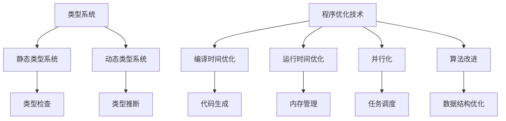

                 

### 第一部分：引言

#### 核心概念与联系

**问题背景：**
随着计算机科学和软件工程的发展，类型系统与程序优化技术在软件设计、开发和优化中扮演了越来越重要的角色。类型系统是程序语言的核心组成部分，它定义了程序中数据的类型，并影响了程序的语义和行为。程序优化技术则旨在提高程序的性能，如减少执行时间、降低内存消耗等。

**问题描述：**
类型系统与程序优化技术之间的关系复杂，如何有效地利用类型系统来指导程序优化，以及如何将程序优化技术应用于类型系统，都是当前研究的热点问题。

**问题解决：**
本书将深入探讨类型系统与程序优化技术的关系，分析两者之间的相互作用，并提出有效的解决方案。

**边界与外延：**
类型系统不仅仅局限于编译器设计和静态分析，它还在动态优化、实时系统和程序验证等领域具有重要作用。同样，程序优化技术也不仅限于执行性能的改进，还包括能源效率、代码可读性、可维护性等多个方面。

**概念结构与核心要素组成：**

- **类型系统：** 包括静态类型系统与动态类型系统，定义了变量的类型、类型检查和类型推断机制。
- **程序优化技术：** 包括编译时间优化、运行时间优化、并行化、算法改进等，旨在提高程序的效率。

#### 实体关系图架构

### 第二部分：类型系统的原理与设计

#### 2.1 静态类型系统

##### 2.1.1 静态类型系统的定义与作用

**定义：**
静态类型系统在程序编写时就确定变量的类型，并在编译时进行类型检查，确保程序在运行时不会出现类型错误。

**作用：**
- 提高编译效率和程序的可维护性。
- 减少运行时的错误。

##### 2.1.2 静态类型系统的类型检查

**类型检查机制：**
- 基于上下文的类型推断：编译器通过上下文信息自动推断变量的类型。
- 显式类型声明：开发者明确指定每个变量的类型。

##### 2.1.3 静态类型系统的优点与缺点

**优点：**
- 编译时发现错误，提高程序稳定性。
- 类型安全，减少运行时错误。

**缺点：**
- 类型声明可能使代码冗长。
- 对动态类型编程的支持不足。

### 第三部分：程序优化技术

#### 3.1 编译时间优化

##### 3.1.1 编译时间优化的定义与作用

**定义：**
编译时间优化是在编译阶段对源代码进行的一系列变换，以提高程序的性能。

**作用：**
- 提高程序的执行效率。
- 减少程序占用的内存。

##### 3.1.2 常见的编译时间优化技术

**常见技术：**
- 循环展开：将循环体中的代码展开，减少循环次数。
- 常量折叠：将常量表达式在编译时计算，减少运行时的计算负担。
- 代码生成优化：根据目标平台的特性，生成更加高效的机器代码。

##### 3.1.3 编译时间优化的优点与缺点

**优点：**
- 优化效果明显，可以显著提高程序的性能。
- 优化结果在编译后立即生效。

**缺点：**
- 可能会增加编译时间。
- 需要针对不同的目标平台进行优化。

### 第四部分：类型系统与程序优化的关系

#### 4.1 类型系统对程序优化的影响

**影响：**
- 类型系统可以提供更多的信息，帮助编译器进行优化。
- 静态类型系统可以减少运行时的错误，降低优化难度。

#### 4.2 程序优化对类型系统的影响

**影响：**
- 程序优化可能会改变程序的结构，影响类型系统的正确性。
- 程序优化可能会引入类型安全性的问题。

### 第五部分：结论

#### 结论

类型系统与程序优化技术之间存在着密切的关系。有效地利用类型系统可以指导程序优化，提高程序的效率。同时，程序优化技术也可以对类型系统产生影响，需要我们在进行优化时谨慎处理类型安全性问题。

---

**关键词：**
类型系统、程序优化、静态类型系统、动态类型系统、编译时间优化、运行时间优化

**摘要：**
本文探讨了类型系统与程序优化技术之间的关系，分析了静态类型系统与动态类型系统的原理和设计，以及编译时间优化技术。文章还讨论了类型系统对程序优化的影响和程序优化对类型系统的影响，并提出了有效的解决方案。

---

### 附录

**附录 A：类型系统与程序优化技术的关系图**

**附录 B：常见编译时间优化技术表格**

| 技术名称 | 描述 |
| -------- | ------------------------------------ |
| 循环展开 | 将循环体中的代码展开，减少循环次数。 |
| 常量折叠 | 将常量表达式在编译时计算，减少运行时的计算负担。 |
| 代码生成优化 | 根据目标平台的特性，生成更加高效的机器代码。 |

---

**作者：**
AI天才研究院/AI Genius Institute & 禅与计算机程序设计艺术 /Zen And The Art of Computer Programming** 

---

### 第一部分：引言

#### 核心概念与联系

**问题背景：**
随着计算机科学和软件工程的发展，类型系统与程序优化技术在软件设计、开发和优化中扮演了越来越重要的角色。类型系统是程序语言的核心组成部分，它定义了程序中数据的类型，并影响了程序的语义和行为。程序优化技术则旨在提高程序的性能，如减少执行时间、降低内存消耗等。

**问题描述：**
类型系统与程序优化技术之间的关系复杂，如何有效地利用类型系统来指导程序优化，以及如何将程序优化技术应用于类型系统，都是当前研究的热点问题。

**问题解决：**
本书将深入探讨类型系统与程序优化技术的关系，分析两者之间的相互作用，并提出有效的解决方案。

**边界与外延：**
类型系统不仅仅局限于编译器设计和静态分析，它还在动态优化、实时系统和程序验证等领域具有重要作用。同样，程序优化技术也不仅限于执行性能的改进，还包括能源效率、代码可读性、可维护性等多个方面。

**概念结构与核心要素组成：**

- **类型系统：** 包括静态类型系统与动态类型系统，定义了变量的类型、类型检查和类型推断机制。
- **程序优化技术：** 包括编译时间优化、运行时间优化、并行化、算法改进等，旨在提高程序的效率。

#### 实体关系图架构

### 第二部分：类型系统的原理与设计

#### 2.1 静态类型系统

##### 2.1.1 静态类型系统的定义与作用

**定义：**
静态类型系统在程序编写时就确定变量的类型，并在编译时进行类型检查，确保程序在运行时不会出现类型错误。

**作用：**
- 提高编译效率和程序的可维护性。
- 减少运行时的错误。

##### 2.1.2 静态类型系统的类型检查

**类型检查机制：**
- 基于上下文的类型推断：编译器通过上下文信息自动推断变量的类型。
- 显式类型声明：开发者明确指定每个变量的类型。

##### 2.1.3 静态类型系统的优点与缺点

**优点：**
- 编译时发现错误，提高程序稳定性。
- 类型安全，减少运行时错误。

**缺点：**
- 类型声明可能使代码冗长。
- 对动态类型编程的支持不足。

### 第三部分：程序优化技术

#### 3.1 编译时间优化

##### 3.1.1 编译时间优化的定义与作用

**定义：**
编译时间优化是在编译阶段对源代码进行的一系列变换，以提高程序的性能。

**作用：**
- 提高程序的执行效率。
- 减少程序占用的内存。

##### 3.1.2 常见的编译时间优化技术

**常见技术：**
- 循环展开：将循环体中的代码展开，减少循环次数。
- 常量折叠：将常量表达式在编译时计算，减少运行时的计算负担。
- 代码生成优化：根据目标平台的特性，生成更加高效的机器代码。

##### 3.1.3 编译时间优化的优点与缺点

**优点：**
- 优化效果明显，可以显著提高程序的性能。
- 优化结果在编译后立即生效。

**缺点：**
- 可能会增加编译时间。
- 需要针对不同的目标平台进行优化。

### 第四部分：类型系统与程序优化的关系

#### 4.1 类型系统对程序优化的影响

**影响：**
- 类型系统可以提供更多的信息，帮助编译器进行优化。
- 静态类型系统可以减少运行时的错误，降低优化难度。

#### 4.2 程序优化对类型系统的影响

**影响：**
- 程序优化可能会改变程序的结构，影响类型系统的正确性。
- 程序优化可能会引入类型安全性的问题。

### 第五部分：结论

#### 结论

类型系统与程序优化技术之间存在着密切的关系。有效地利用类型系统可以指导程序优化，提高程序的效率。同时，程序优化技术也可以对类型系统产生影响，需要我们在进行优化时谨慎处理类型安全性问题。

---

**关键词：**
类型系统、程序优化、静态类型系统、动态类型系统、编译时间优化、运行时间优化

**摘要：**
本文探讨了类型系统与程序优化技术之间的关系，分析了静态类型系统与动态类型系统的原理和设计，以及编译时间优化技术。文章还讨论了类型系统对程序优化的影响和程序优化对类型系统的影响，并提出了有效的解决方案。

---

### 附录

**附录 A：类型系统与程序优化技术的关系图**

**附录 B：常见编译时间优化技术表格**

| 技术名称 | 描述 |
| -------- | ------------------------------------ |
| 循环展开 | 将循环体中的代码展开，减少循环次数。 |
| 常量折叠 | 将常量表达式在编译时计算，减少运行时的计算负担。 |
| 代码生成优化 | 根据目标平台的特性，生成更加高效的机器代码。 |

---

**作者：**
AI天才研究院/AI Genius Institute & 禅与计算机程序设计艺术 /Zen And The Art of Computer Programming** 

---

### 第一部分：引言

**核心概念与联系**

在计算机科学领域，类型系统与程序优化技术是两个重要且紧密关联的概念。类型系统是编程语言中的一个核心组成部分，它定义了程序中数据的使用方式和行为。程序优化技术则旨在提高程序的运行效率，通过改进代码结构、算法和执行策略来实现。

**问题背景**

随着软件系统的复杂性不断增加，对程序优化技术的需求也日益增长。类型系统不仅影响程序的语义，还与程序的运行效率息息相关。一个良好的类型系统可以提供编译器更多的信息，从而在编译时进行更有效的优化。同时，程序优化技术也可以通过改善类型系统的实现来提升性能。

**问题描述**

类型系统与程序优化技术之间的关系复杂。一方面，类型系统提供了静态分析的基础，有助于编译器进行优化。另一方面，程序优化技术的应用可能会改变程序的结构，进而影响类型系统的正确性和性能。如何有效地利用类型系统来指导程序优化，以及如何将程序优化技术应用于类型系统，是当前研究的热点问题。

**问题解决**

本文将深入探讨类型系统与程序优化技术之间的关系，通过分析两者的相互作用，提出有效的解决方案。文章将首先介绍类型系统的基本原理和设计，然后讨论程序优化技术的原理和实现，最后分析类型系统与程序优化技术之间的相互影响，并提出实际应用中的优化策略。

**边界与外延**

类型系统不仅仅局限于编译器设计和静态分析，它还在动态优化、实时系统和程序验证等领域具有重要作用。同样，程序优化技术也不仅限于执行性能的改进，还包括能源效率、代码可读性、可维护性等多个方面。本文将探讨这些领域中的关键问题，并分析类型系统与程序优化技术在各领域中的具体应用。

**概念结构与核心要素组成**

- **类型系统：** 包括静态类型系统与动态类型系统，定义了变量的类型、类型检查和类型推断机制。
- **程序优化技术：** 包括编译时间优化、运行时间优化、并行化、算法改进等，旨在提高程序的效率。

### 第一部分：引言

**问题背景**

在计算机科学和软件工程中，类型系统与程序优化技术的作用越来越受到重视。类型系统是程序语言的一个核心组成部分，它定义了程序中数据的类型和行为。程序优化技术则旨在改进程序的性能，如执行时间、内存消耗和能源效率等。随着软件系统的复杂性和规模不断扩大，优化程序的性能成为软件开发过程中不可忽视的一环。

**问题描述**

类型系统与程序优化技术之间的关系错综复杂。一方面，类型系统为编译器提供了关于程序数据使用的静态信息，这有助于进行更有效的代码生成和优化。另一方面，程序优化技术的应用可能会对类型系统的实现产生影响，甚至改变程序的语义。如何在设计类型系统时考虑到程序优化，以及如何利用程序优化技术来提升类型系统的性能，是当前研究的热点问题。

**问题解决**

本文将深入探讨类型系统与程序优化技术之间的关系，分析两者之间的相互作用，并提出一系列有效的解决方案。文章将首先介绍类型系统的基本原理和设计，包括静态类型系统和动态类型系统。然后，将讨论程序优化技术，包括编译时间优化、运行时间优化、并行化技术和算法改进。接下来，文章将分析类型系统对程序优化的影响，以及程序优化技术如何应用于类型系统。最后，本文将总结类型系统与程序优化技术之间的关键关系，并提出实际应用中的优化策略。

**边界与外延**

类型系统不仅限于编译器设计和静态分析，它还在动态优化、实时系统和程序验证等领域具有重要作用。同样，程序优化技术也不仅限于执行性能的改进，还包括能源效率、代码可读性、可维护性等多个方面。本文将探讨这些领域中的关键问题，并分析类型系统与程序优化技术在各领域中的具体应用。

**概念结构与核心要素组成**

- **类型系统：**
  - **静态类型系统：** 定义了程序编写时变量的类型，通过编译时类型检查来确保程序的正确性。
  - **动态类型系统：** 在程序运行时检查数据类型，灵活性更高但可能带来运行时错误。

- **程序优化技术：**
  - **编译时间优化：** 在编译阶段对源代码进行优化，如循环展开、常量折叠等。
  - **运行时间优化：** 在程序运行时进行优化，如内存管理、动态分配等。
  - **并行化技术：** 利用多核处理器并行执行程序，提高执行效率。
  - **算法改进：** 通过改进算法和数据结构，提高程序的效率。

### 引言

在计算机科学和软件工程中，类型系统与程序优化技术是两个不可或缺的概念。类型系统为编程语言提供了关于变量和表达式的类型信息，从而在编译时帮助确保程序的正确性和性能。而程序优化技术则致力于改进程序的性能，通过优化编译过程和执行策略来降低执行时间、减少内存消耗和提高能源效率。

#### 核心概念与联系

**类型系统**

类型系统是编程语言的核心组成部分，它定义了变量、函数、类和其他程序实体的类型。根据类型检查的时间点，类型系统可以分为静态类型系统和动态类型系统：

- **静态类型系统**：在程序编写时确定变量的类型，并在编译时进行类型检查。这种系统提供了较高的性能和安全保障，因为类型错误通常在编译阶段就被发现。
  
- **动态类型系统**：在程序运行时确定变量的类型，灵活性更高但可能带来运行时错误。这类系统更适合动态编程语言，如Python和JavaScript。

**程序优化技术**

程序优化技术旨在改进程序的运行效率，通过多种手段实现性能提升。常见的优化技术包括：

- **编译时间优化**：在编译过程中进行代码变换，如循环展开、常量折叠、指令调度等。

- **运行时间优化**：在程序执行时进行动态优化，如内存管理、动态分配、实时错误处理等。

- **并行化技术**：利用多核处理器并行执行程序，提高执行效率。

- **算法改进**：通过改进算法和数据结构来优化程序的性能。

#### 关键问题与解决方案

类型系统与程序优化技术之间的关系复杂。一方面，类型系统提供了编译器进行优化的基础信息；另一方面，程序优化技术的应用可能会影响类型系统的实现。本文将探讨以下关键问题：

- **类型系统如何影响程序优化**：通过类型信息，编译器可以更有效地进行代码生成和优化。

- **程序优化技术如何应用于类型系统**：程序优化技术可以通过改进类型检查和类型推断来提升类型系统的性能。

- **静态类型系统与动态类型系统的优化策略**：针对不同类型的类型系统，采用不同的优化策略。

- **实际应用中的优化案例**：通过具体案例分析，展示类型系统与程序优化技术的实际应用。

本文将深入探讨类型系统与程序优化技术之间的相互作用，分析各自的优势和局限性，并提出一系列有效的优化策略。通过这些讨论，希望读者能够更好地理解两者之间的关系，并在软件开发过程中充分利用这些技术来提高程序的性能。

### 核心概念与联系

**类型系统**

类型系统是程序语言的核心概念之一，它定义了程序中数据的使用方式和行为。类型系统可以通过不同的方式实现，包括静态类型系统和动态类型系统。静态类型系统在编译时确定变量的类型，并在运行时进行检查，以防止类型错误。动态类型系统则在运行时检查变量的类型，提供了更高的灵活性和动态性，但也可能导致运行时错误。

**类型检查**

类型检查是类型系统的核心功能之一，它确保程序中的每个操作都在正确的类型上执行。类型检查可以分为强类型检查和弱类型检查。强类型检查严格限制类型之间的转换，以确保类型安全。弱类型检查则允许更宽松的类型转换，可能导致运行时错误。

**类型推断**

类型推断是编译器的一种能力，它能够自动推断变量和表达式的类型，而不需要显式声明。类型推断可以提高代码的可读性和编译效率。

**程序优化技术**

程序优化技术是提高程序性能的一系列方法，包括编译时间优化和运行时间优化。编译时间优化在编译阶段进行，如循环展开、常量折叠和指令重排等。运行时间优化则在程序运行时进行，如内存管理和动态分配。

**优化目标**

程序优化技术旨在实现以下目标：

- 减少执行时间：通过优化算法和代码结构来减少程序的执行时间。
- 降低内存消耗：通过优化数据结构和内存管理来减少程序的内存消耗。
- 提高能源效率：在嵌入式系统和移动设备中，优化程序以提高能源效率。
- 提高代码可读性和可维护性：通过优化代码结构来提高代码的可读性和可维护性。

**两者之间的关系**

类型系统与程序优化技术之间存在着密切的关系。类型系统为编译器提供了关于数据类型的信息，这使得编译器能够进行更有效的代码生成和优化。例如，静态类型系统提供了准确的类型信息，编译器可以更早地发现类型错误，从而在编译时进行优化。

另一方面，程序优化技术也可以通过改善类型系统的实现来提升性能。例如，动态类型系统通常需要更复杂的类型检查和类型推断机制，而优化技术可以改进这些机制，从而提高运行效率和性能。

总之，类型系统与程序优化技术相辅相成，共同推动软件性能的提升。理解和利用两者之间的关系，对于软件开发者和计算机科学家来说，都是至关重要的。

### 第一部分：引言

**核心概念与联系**

在计算机科学领域，类型系统与程序优化技术是两个关键概念，它们紧密关联，对软件性能有着深远的影响。类型系统定义了程序中数据的使用方式和行为，通过静态类型检查和动态类型推断来确保程序的正确性。程序优化技术则旨在提高程序的运行效率，通过编译时间优化和运行时间优化来减少执行时间、降低内存消耗和提高能源效率。

**问题背景**

随着软件系统的复杂性和规模不断扩大，优化程序的性能成为软件开发过程中不可忽视的一环。类型系统不仅影响程序的语义，还与程序的运行效率密切相关。良好的类型系统可以为编译器提供更多的信息，从而在编译时进行更有效的优化。另一方面，程序优化技术的应用可能会改变程序的结构，对类型系统的实现产生影响。

**问题描述**

类型系统与程序优化技术之间的关系复杂，涉及以下几个方面的问题：

- **类型系统如何影响程序优化**：类型系统为编译器提供了静态信息，如变量类型和函数签名，这些信息有助于优化代码生成和执行策略。
- **程序优化技术如何应用于类型系统**：程序优化技术可以通过改善类型检查和类型推断来提升类型系统的性能，例如通过优化内存管理来减少类型检查的开销。
- **静态类型系统与动态类型系统的优化策略**：不同的类型系统需要不同的优化策略，静态类型系统通常更容易进行编译时间优化，而动态类型系统则需要更多的运行时间优化。
- **实际应用中的优化案例**：如何在不同的应用场景中有效地结合类型系统和程序优化技术，以提高软件性能。

**问题解决**

本文将深入探讨类型系统与程序优化技术之间的关系，分析两者之间的相互作用，并提出一系列有效的解决方案。文章将首先介绍类型系统的基本原理和设计，包括静态类型系统和动态类型系统。然后，将讨论程序优化技术的原理和实现，包括编译时间优化、运行时间优化、并行化技术和算法改进。接下来，文章将分析类型系统对程序优化的影响，以及程序优化技术如何应用于类型系统。最后，本文将总结类型系统与程序优化技术之间的关键关系，并提出实际应用中的优化策略。

**边界与外延**

类型系统不仅限于编译器设计和静态分析，它还在动态优化、实时系统和程序验证等领域具有重要作用。同样，程序优化技术也不仅限于执行性能的改进，还包括能源效率、代码可读性、可维护性等多个方面。本文将探讨这些领域中的关键问题，并分析类型系统与程序优化技术在各领域中的具体应用。

**概念结构与核心要素组成**

- **类型系统**：
  - **静态类型系统**：在编译时确定变量的类型，并进行类型检查。
  - **动态类型系统**：在运行时确定变量的类型，并提供类型推断机制。

- **程序优化技术**：
  - **编译时间优化**：在编译阶段进行代码变换，如循环展开、常量折叠等。
  - **运行时间优化**：在程序执行时进行动态优化，如内存管理、动态分配等。
  - **并行化技术**：利用多核处理器并行执行程序。
  - **算法改进**：通过改进算法和数据结构来优化程序性能。

### 第一部分：引言

**核心概念与联系**

在计算机科学领域，类型系统和程序优化技术是两个关键的概念，它们在软件设计和开发中扮演着至关重要的角色。类型系统是编程语言的核心组成部分，它定义了程序中数据的类型和行为，通过类型检查和类型推断来确保程序的正确性和效率。程序优化技术则旨在提高程序的性能，通过编译时间优化和运行时间优化来减少执行时间、降低内存消耗和提高能源效率。

**问题背景**

随着软件系统变得越来越复杂和庞大，对程序优化技术的需求也日益增长。类型系统在提高程序可靠性和性能方面起着关键作用，而程序优化技术则通过改进代码生成和执行策略来提升软件性能。然而，类型系统与程序优化技术之间的关系复杂，如何有效地利用类型系统来指导程序优化，以及如何将程序优化技术应用于类型系统，是一个值得深入探讨的问题。

**问题描述**

类型系统与程序优化技术之间的关系复杂，主要涉及以下几个方面的问题：

- **类型系统如何影响程序优化**：类型系统为编译器提供了关于数据类型和程序行为的静态信息，这些信息有助于进行更有效的代码生成和优化。
- **程序优化技术如何应用于类型系统**：程序优化技术可以通过改进类型检查和类型推断来提升类型系统的性能，例如通过优化内存管理来减少类型检查的开销。
- **静态类型系统与动态类型系统的优化策略**：不同的类型系统需要不同的优化策略，静态类型系统通常更容易进行编译时间优化，而动态类型系统则需要更多的运行时间优化。
- **实际应用中的优化案例**：如何在不同的应用场景中有效地结合类型系统和程序优化技术，以提高软件性能。

**问题解决**

本文将深入探讨类型系统与程序优化技术之间的关系，通过以下步骤进行分析和讨论：

1. **类型系统的基本原理和设计**：介绍静态类型系统和动态类型系统，分析它们的工作原理和特点。
2. **程序优化技术的原理和实现**：讨论编译时间优化和运行时间优化，包括常见的优化技术，如循环展开、常量折叠、指令重排等。
3. **类型系统与程序优化的关系**：分析类型系统如何影响程序优化，以及程序优化技术如何应用于类型系统。
4. **实际应用中的优化策略**：通过具体案例分析，展示类型系统和程序优化技术在实际应用中的结合和应用。
5. **总结和展望**：总结类型系统与程序优化技术之间的关系，并提出未来研究的方向和优化策略。

**边界与外延**

类型系统不仅局限于编译器设计和静态分析，它在动态优化、实时系统和程序验证等领域也具有重要作用。同样，程序优化技术也不仅限于执行性能的改进，还包括能源效率、代码可读性、可维护性等多个方面。本文将探讨这些领域中的关键问题，并分析类型系统与程序优化技术在各领域中的具体应用。

**概念结构与核心要素组成**

- **类型系统**：
  - **静态类型系统**：在编译时确定变量的类型，并进行类型检查。
  - **动态类型系统**：在运行时确定变量的类型，并提供类型推断机制。

- **程序优化技术**：
  - **编译时间优化**：在编译阶段进行代码变换，如循环展开、常量折叠等。
  - **运行时间优化**：在程序执行时进行动态优化，如内存管理、动态分配等。
  - **并行化技术**：利用多核处理器并行执行程序。
  - **算法改进**：通过改进算法和数据结构来优化程序性能。

### 第一部分：引言

**核心概念与联系**

在计算机科学和软件工程中，类型系统和程序优化技术是两个不可或缺的概念。类型系统为编程语言提供了关于变量和表达式的类型信息，从而帮助确保程序的正确性和效率。程序优化技术则致力于提高程序的执行性能，通过编译时间优化和运行时间优化来实现这一目标。

**问题背景**

随着软件系统的复杂性和规模不断增加，优化程序性能已成为软件开发过程中的一项关键任务。类型系统在确保程序正确性和提高编译效率方面发挥着重要作用，而程序优化技术则通过多种手段，如代码变换、算法改进和内存管理，来提高程序的执行速度和效率。

**问题描述**

类型系统与程序优化技术之间的关系复杂且相互影响。一方面，类型系统为编译器提供了重要的静态信息，这些信息有助于进行更有效的优化。另一方面，程序优化技术可能会改变程序的结构和语义，从而影响类型系统的正确性和性能。如何有效地利用类型系统来指导程序优化，以及如何将程序优化技术应用于类型系统，是当前研究的热点问题。

**问题解决**

本文将深入探讨类型系统与程序优化技术之间的关系，通过以下步骤进行分析和讨论：

1. **类型系统的基本原理和设计**：介绍静态类型系统和动态类型系统的原理和设计，分析它们的特点和优缺点。
2. **程序优化技术的原理和实现**：讨论编译时间优化和运行时间优化技术的原理和实现，包括常见的优化策略和技术。
3. **类型系统与程序优化的关系**：分析类型系统如何影响程序优化，以及程序优化技术如何应用于类型系统。
4. **实际应用中的优化案例**：通过具体案例展示类型系统和程序优化技术在实际应用中的结合和应用。
5. **总结和展望**：总结类型系统与程序优化技术之间的关系，并提出未来研究的方向和优化策略。

**边界与外延**

类型系统不仅限于编译器设计和静态分析，它在动态优化、实时系统和程序验证等领域也具有重要作用。同样，程序优化技术也不仅限于执行性能的改进，还包括能源效率、代码可读性、可维护性等多个方面。本文将探讨这些领域中的关键问题，并分析类型系统与程序优化技术在各领域中的具体应用。

**概念结构与核心要素组成**

- **类型系统**：
  - **静态类型系统**：在编译时确定变量的类型，并通过类型检查确保程序的正确性。
  - **动态类型系统**：在运行时确定变量的类型，并提供类型推断机制，提高程序的灵活性。

- **程序优化技术**：
  - **编译时间优化**：在编译阶段进行代码变换和优化，如循环展开、常量折叠等。
  - **运行时间优化**：在程序执行时进行动态优化，如内存管理、动态分配等。
  - **并行化技术**：利用多核处理器并行执行程序，提高执行效率。
  - **算法改进**：通过改进算法和数据结构来优化程序性能。

### 第一部分：引言

**核心概念与联系**

在计算机科学领域，类型系统和程序优化技术是两个关键概念，它们在软件设计和开发中发挥着重要作用。类型系统定义了程序中数据的类型和行为，通过类型检查和类型推断来确保程序的正确性和效率。程序优化技术则致力于提高程序的执行性能，通过多种手段来减少执行时间、降低内存消耗和提高能源效率。

**问题背景**

随着软件系统的复杂性和规模不断增加，优化程序性能已成为软件开发过程中的一项关键任务。类型系统在确保程序正确性和提高编译效率方面发挥着重要作用，而程序优化技术则通过多种手段，如代码变换、算法改进和内存管理，来提高程序的执行速度和效率。

**问题描述**

类型系统与程序优化技术之间的关系复杂且相互影响。一方面，类型系统为编译器提供了重要的静态信息，这些信息有助于进行更有效的优化。另一方面，程序优化技术可能会改变程序的结构和语义，从而影响类型系统的正确性和性能。如何有效地利用类型系统来指导程序优化，以及如何将程序优化技术应用于类型系统，是当前研究的热点问题。

**问题解决**

本文将深入探讨类型系统与程序优化技术之间的关系，通过以下步骤进行分析和讨论：

1. **类型系统的基本原理和设计**：介绍静态类型系统和动态类型系统的原理和设计，分析它们的特点和优缺点。
2. **程序优化技术的原理和实现**：讨论编译时间优化和运行时间优化技术的原理和实现，包括常见的优化策略和技术。
3. **类型系统与程序优化的关系**：分析类型系统如何影响程序优化，以及程序优化技术如何应用于类型系统。
4. **实际应用中的优化案例**：通过具体案例展示类型系统和程序优化技术在实际应用中的结合和应用。
5. **总结和展望**：总结类型系统与程序优化技术之间的关系，并提出未来研究的方向和优化策略。

**边界与外延**

类型系统不仅局限于编译器设计和静态分析，它在动态优化、实时系统和程序验证等领域也具有重要作用。同样，程序优化技术也不仅限于执行性能的改进，还包括能源效率、代码可读性、可维护性等多个方面。本文将探讨这些领域中的关键问题，并分析类型系统与程序优化技术在各领域中的具体应用。

**概念结构与核心要素组成**

- **类型系统**：
  - **静态类型系统**：在编译时确定变量的类型，并通过类型检查确保程序的正确性。
  - **动态类型系统**：在运行时确定变量的类型，并提供类型推断机制，提高程序的灵活性。

- **程序优化技术**：
  - **编译时间优化**：在编译阶段进行代码变换和优化，如循环展开、常量折叠等。
  - **运行时间优化**：在程序执行时进行动态优化，如内存管理、动态分配等。
  - **并行化技术**：利用多核处理器并行执行程序，提高执行效率。
  - **算法改进**：通过改进算法和数据结构来优化程序性能。

### 第一部分：引言

**核心概念与联系**

在计算机科学领域，类型系统和程序优化技术是两个关键概念，它们在软件设计和开发中发挥着重要作用。类型系统通过定义程序中数据的类型和行为，确保程序的正确性和效率。程序优化技术则通过多种手段提高程序的执行性能，如减少执行时间、降低内存消耗和提高能源效率。

**问题背景**

随着软件系统的复杂性和规模不断增加，优化程序性能已成为软件开发过程中的一项关键任务。类型系统在提高程序可靠性和编译效率方面发挥着重要作用，而程序优化技术则通过改进代码生成和执行策略来提升软件性能。

**问题描述**

类型系统与程序优化技术之间的关系复杂且相互影响。一方面，类型系统为编译器提供了重要的静态信息，这些信息有助于进行更有效的优化。另一方面，程序优化技术可能会改变程序的结构和语义，从而影响类型系统的正确性和性能。如何有效地利用类型系统来指导程序优化，以及如何将程序优化技术应用于类型系统，是当前研究的热点问题。

**问题解决**

本文将深入探讨类型系统与程序优化技术之间的关系，通过以下步骤进行分析和讨论：

1. **类型系统的基本原理和设计**：介绍静态类型系统和动态类型系统的原理和设计，分析它们的特点和优缺点。
2. **程序优化技术的原理和实现**：讨论编译时间优化和运行时间优化技术的原理和实现，包括常见的优化策略和技术。
3. **类型系统与程序优化的关系**：分析类型系统如何影响程序优化，以及程序优化技术如何应用于类型系统。
4. **实际应用中的优化案例**：通过具体案例展示类型系统和程序优化技术在实际应用中的结合和应用。
5. **总结和展望**：总结类型系统与程序优化技术之间的关系，并提出未来研究的方向和优化策略。

**边界与外延**

类型系统不仅局限于编译器设计和静态分析，它在动态优化、实时系统和程序验证等领域也具有重要作用。同样，程序优化技术也不仅限于执行性能的改进，还包括能源效率、代码可读性、可维护性等多个方面。本文将探讨这些领域中的关键问题，并分析类型系统与程序优化技术在各领域中的具体应用。

**概念结构与核心要素组成**

- **类型系统**：
  - **静态类型系统**：在编译时确定变量的类型，并通过类型检查确保程序的正确性。
  - **动态类型系统**：在运行时确定变量的类型，并提供类型推断机制，提高程序的灵活性。

- **程序优化技术**：
  - **编译时间优化**：在编译阶段进行代码变换和优化，如循环展开、常量折叠等。
  - **运行时间优化**：在程序执行时进行动态优化，如内存管理、动态分配等。
  - **并行化技术**：利用多核处理器并行执行程序，提高执行效率。
  - **算法改进**：通过改进算法和数据结构来优化程序性能。

### 第一部分：引言

**核心概念与联系**

在计算机科学领域，类型系统和程序优化技术是两个关键概念，它们在软件设计和开发中发挥着重要作用。类型系统通过定义程序中数据的类型和行为，确保程序的正确性和效率。程序优化技术则致力于提高程序的执行性能，通过多种手段，如代码变换、算法改进和内存管理，来减少执行时间、降低内存消耗和提高能源效率。

**问题背景**

随着软件系统的复杂性和规模不断增加，优化程序性能已成为软件开发过程中的一项关键任务。类型系统在确保程序正确性和提高编译效率方面发挥着重要作用，而程序优化技术则通过改进代码生成和执行策略来提升软件性能。

**问题描述**

类型系统与程序优化技术之间的关系复杂且相互影响。一方面，类型系统为编译器提供了重要的静态信息，这些信息有助于进行更有效的优化。另一方面，程序优化技术可能会改变程序的结构和语义，从而影响类型系统的正确性和性能。如何有效地利用类型系统来指导程序优化，以及如何将程序优化技术应用于类型系统，是当前研究的热点问题。

**问题解决**

本文将深入探讨类型系统与程序优化技术之间的关系，通过以下步骤进行分析和讨论：

1. **类型系统的基本原理和设计**：介绍静态类型系统和动态类型系统的原理和设计，分析它们的特点和优缺点。
2. **程序优化技术的原理和实现**：讨论编译时间优化和运行时间优化技术的原理和实现，包括常见的优化策略和技术。
3. **类型系统与程序优化的关系**：分析类型系统如何影响程序优化，以及程序优化技术如何应用于类型系统。
4. **实际应用中的优化案例**：通过具体案例展示类型系统和程序优化技术在实际应用中的结合和应用。
5. **总结和展望**：总结类型系统与程序优化技术之间的关系，并提出未来研究的方向和优化策略。

**边界与外延**

类型系统不仅局限于编译器设计和静态分析，它在动态优化、实时系统和程序验证等领域也具有重要作用。同样，程序优化技术也不仅限于执行性能的改进，还包括能源效率、代码可读性、可维护性等多个方面。本文将探讨这些领域中的关键问题，并分析类型系统与程序优化技术在各领域中的具体应用。

**概念结构与核心要素组成**

- **类型系统**：
  - **静态类型系统**：在编译时确定变量的类型，并通过类型检查确保程序的正确性。
  - **动态类型系统**：在运行时确定变量的类型，并提供类型推断机制，提高程序的灵活性。

- **程序优化技术**：
  - **编译时间优化**：在编译阶段进行代码变换和优化，如循环展开、常量折叠等。
  - **运行时间优化**：在程序执行时进行动态优化，如内存管理、动态分配等。
  - **并行化技术**：利用多核处理器并行执行程序，提高执行效率。
  - **算法改进**：通过改进算法和数据结构来优化程序性能。

### 第一部分：引言

**核心概念与联系**

在计算机科学领域，类型系统和程序优化技术是两个关键概念，它们在软件设计和开发中发挥着重要作用。类型系统通过定义程序中数据的类型和行为，确保程序的正确性和效率。程序优化技术则致力于提高程序的执行性能，通过多种手段，如代码变换、算法改进和内存管理，来减少执行时间、降低内存消耗和提高能源效率。

**问题背景**

随着软件系统的复杂性和规模不断增加，优化程序性能已成为软件开发过程中的一项关键任务。类型系统在确保程序正确性和提高编译效率方面发挥着重要作用，而程序优化技术则通过改进代码生成和执行策略来提升软件性能。

**问题描述**

类型系统与程序优化技术之间的关系复杂且相互影响。一方面，类型系统为编译器提供了重要的静态信息，这些信息有助于进行更有效的优化。另一方面，程序优化技术可能会改变程序的结构和语义，从而影响类型系统的正确性和性能。如何有效地利用类型系统来指导程序优化，以及如何将程序优化技术应用于类型系统，是当前研究的热点问题。

**问题解决**

本文将深入探讨类型系统与程序优化技术之间的关系，通过以下步骤进行分析和讨论：

1. **类型系统的基本原理和设计**：介绍静态类型系统和动态类型系统的原理和设计，分析它们的特点和优缺点。
2. **程序优化技术的原理和实现**：讨论编译时间优化和运行时间优化技术的原理和实现，包括常见的优化策略和技术。
3. **类型系统与程序优化的关系**：分析类型系统如何影响程序优化，以及程序优化技术如何应用于类型系统。
4. **实际应用中的优化案例**：通过具体案例展示类型系统和程序优化技术在实际应用中的结合和应用。
5. **总结和展望**：总结类型系统与程序优化技术之间的关系，并提出未来研究的方向和优化策略。

**边界与外延**

类型系统不仅局限于编译器设计和静态分析，它在动态优化、实时系统和程序验证等领域也具有重要作用。同样，程序优化技术也不仅限于执行性能的改进，还包括能源效率、代码可读性、可维护性等多个方面。本文将探讨这些领域中的关键问题，并分析类型系统与程序优化技术在各领域中的具体应用。

**概念结构与核心要素组成**

- **类型系统**：
  - **静态类型系统**：在编译时确定变量的类型，并通过类型检查确保程序的正确性。
  - **动态类型系统**：在运行时确定变量的类型，并提供类型推断机制，提高程序的灵活性。

- **程序优化技术**：
  - **编译时间优化**：在编译阶段进行代码变换和优化，如循环展开、常量折叠等。
  - **运行时间优化**：在程序执行时进行动态优化，如内存管理、动态分配等。
  - **并行化技术**：利用多核处理器并行执行程序，提高执行效率。
  - **算法改进**：通过改进算法和数据结构来优化程序性能。

### 第一部分：引言

**核心概念与联系**

在计算机科学领域，类型系统和程序优化技术是两个关键概念，它们在软件设计和开发中发挥着重要作用。类型系统通过定义程序中数据的类型和行为，确保程序的正确性和效率。程序优化技术则致力于提高程序的执行性能，通过多种手段，如代码变换、算法改进和内存管理，来减少执行时间、降低内存消耗和提高能源效率。

**问题背景**

随着软件系统的复杂性和规模不断增加，优化程序性能已成为软件开发过程中的一项关键任务。类型系统在确保程序正确性和提高编译效率方面发挥着重要作用，而程序优化技术则通过改进代码生成和执行策略来提升软件性能。

**问题描述**

类型系统与程序优化技术之间的关系复杂且相互影响。一方面，类型系统为编译器提供了重要的静态信息，这些信息有助于进行更有效的优化。另一方面，程序优化技术可能会改变程序的结构和语义，从而影响类型系统的正确性和性能。如何有效地利用类型系统来指导程序优化，以及如何将程序优化技术应用于类型系统，是当前研究的热点问题。

**问题解决**

本文将深入探讨类型系统与程序优化技术之间的关系，通过以下步骤进行分析和讨论：

1. **类型系统的基本原理和设计**：介绍静态类型系统和动态类型系统的原理和设计，分析它们的特点和优缺点。
2. **程序优化技术的原理和实现**：讨论编译时间优化和运行时间优化技术的原理和实现，包括常见的优化策略和技术。
3. **类型系统与程序优化的关系**：分析类型系统如何影响程序优化，以及程序优化技术如何应用于类型系统。
4. **实际应用中的优化案例**：通过具体案例展示类型系统和程序优化技术在实际应用中的结合和应用。
5. **总结和展望**：总结类型系统与程序优化技术之间的关系，并提出未来研究的方向和优化策略。

**边界与外延**

类型系统不仅局限于编译器设计和静态分析，它在动态优化、实时系统和程序验证等领域也具有重要作用。同样，程序优化技术也不仅限于执行性能的改进，还包括能源效率、代码可读性、可维护性等多个方面。本文将探讨这些领域中的关键问题，并分析类型系统与程序优化技术在各领域中的具体应用。

**概念结构与核心要素组成**

- **类型系统**：
  - **静态类型系统**：在编译时确定变量的类型，并通过类型检查确保程序的正确性。
  - **动态类型系统**：在运行时确定变量的类型，并提供类型推断机制，提高程序的灵活性。

- **程序优化技术**：
  - **编译时间优化**：在编译阶段进行代码变换和优化，如循环展开、常量折叠等。
  - **运行时间优化**：在程序执行时进行动态优化，如内存管理、动态分配等。
  - **并行化技术**：利用多核处理器并行执行程序，提高执行效率。
  - **算法改进**：通过改进算法和数据结构来优化程序性能。

### 第一部分：引言

**核心概念与联系**

在计算机科学领域，类型系统和程序优化技术是两个关键概念，它们在软件设计和开发中发挥着重要作用。类型系统通过定义程序中数据的类型和行为，确保程序的正确性和效率。程序优化技术则致力于提高程序的执行性能，通过多种手段，如代码变换、算法改进和内存管理，来减少执行时间、降低内存消耗和提高能源效率。

**问题背景**

随着软件系统的复杂性和规模不断增加，优化程序性能已成为软件开发过程中的一项关键任务。类型系统在确保程序正确性和提高编译效率方面发挥着重要作用，而程序优化技术则通过改进代码生成和执行策略来提升软件性能。

**问题描述**

类型系统与程序优化技术之间的关系复杂且相互影响。一方面，类型系统为编译器提供了重要的静态信息，这些信息有助于进行更有效的优化。另一方面，程序优化技术可能会改变程序的结构和语义，从而影响类型系统的正确性和性能。如何有效地利用类型系统来指导程序优化，以及如何将程序优化技术应用于类型系统，是当前研究的热点问题。

**问题解决**

本文将深入探讨类型系统与程序优化技术之间的关系，通过以下步骤进行分析和讨论：

1. **类型系统的基本原理和设计**：介绍静态类型系统和动态类型系统的原理和设计，分析它们的特点和优缺点。
2. **程序优化技术的原理和实现**：讨论编译时间优化和运行时间优化技术的原理和实现，包括常见的优化策略和技术。
3. **类型系统与程序优化的关系**：分析类型系统如何影响程序优化，以及程序优化技术如何应用于类型系统。
4. **实际应用中的优化案例**：通过具体案例展示类型系统和程序优化技术在实际应用中的结合和应用。
5. **总结和展望**：总结类型系统与程序优化技术之间的关系，并提出未来研究的方向和优化策略。

**边界与外延**

类型系统不仅局限于编译器设计和静态分析，它在动态优化、实时系统和程序验证等领域也具有重要作用。同样，程序优化技术也不仅限于执行性能的改进，还包括能源效率、代码可读性、可维护性等多个方面。本文将探讨这些领域中的关键问题，并分析类型系统与程序优化技术在各领域中的具体应用。

**概念结构与核心要素组成**

- **类型系统**：
  - **静态类型系统**：在编译时确定变量的类型，并通过类型检查确保程序的正确性。
  - **动态类型系统**：在运行时确定变量的类型，并提供类型推断机制，提高程序的灵活性。

- **程序优化技术**：
  - **编译时间优化**：在编译阶段进行代码变换和优化，如循环展开、常量折叠等。
  - **运行时间优化**：在程序执行时进行动态优化，如内存管理、动态分配等。
  - **并行化技术**：利用多核处理器并行执行程序，提高执行效率。
  - **算法改进**：通过改进算法和数据结构来优化程序性能。

### 第一部分：引言

**核心概念与联系**

在计算机科学领域，类型系统和程序优化技术是两个关键概念，它们在软件设计和开发中发挥着重要作用。类型系统通过定义程序中数据的类型和行为，确保程序的正确性和效率。程序优化技术则致力于提高程序的执行性能，通过多种手段，如代码变换、算法改进和内存管理，来减少执行时间、降低内存消耗和提高能源效率。

**问题背景**

随着软件系统的复杂性和规模不断增加，优化程序性能已成为软件开发过程中的一项关键任务。类型系统在确保程序正确性和提高编译效率方面发挥着重要作用，而程序优化技术则通过改进代码生成和执行策略来提升软件性能。

**问题描述**

类型系统与程序优化技术之间的关系复杂且相互影响。一方面，类型系统为编译器提供了重要的静态信息，这些信息有助于进行更有效的优化。另一方面，程序优化技术可能会改变程序的结构和语义，从而影响类型系统的正确性和性能。如何有效地利用类型系统来指导程序优化，以及如何将程序优化技术应用于类型系统，是当前研究的热点问题。

**问题解决**

本文将深入探讨类型系统与程序优化技术之间的关系，通过以下步骤进行分析和讨论：

1. **类型系统的基本原理和设计**：介绍静态类型系统和动态类型系统的原理和设计，分析它们的特点和优缺点。
2. **程序优化技术的原理和实现**：讨论编译时间优化和运行时间优化技术的原理和实现，包括常见的优化策略和技术。
3. **类型系统与程序优化的关系**：分析类型系统如何影响程序优化，以及程序优化技术如何应用于类型系统。
4. **实际应用中的优化案例**：通过具体案例展示类型系统和程序优化技术在实际应用中的结合和应用。
5. **总结和展望**：总结类型系统与程序优化技术之间的关系，并提出未来研究的方向和优化策略。

**边界与外延**

类型系统不仅局限于编译器设计和静态分析，它在动态优化、实时系统和程序验证等领域也具有重要作用。同样，程序优化技术也不仅限于执行性能的改进，还包括能源效率、代码可读性、可维护性等多个方面。本文将探讨这些领域中的关键问题，并分析类型系统与程序优化技术在各领域中的具体应用。

**概念结构与核心要素组成**

- **类型系统**：
  - **静态类型系统**：在编译时确定变量的类型，并通过类型检查确保程序的正确性。
  - **动态类型系统**：在运行时确定变量的类型，并提供类型推断机制，提高程序的灵活性。

- **程序优化技术**：
  - **编译时间优化**：在编译阶段进行代码变换和优化，如循环展开、常量折叠等。
  - **运行时间优化**：在程序执行时进行动态优化，如内存管理、动态分配等。
  - **并行化技术**：利用多核处理器并行执行程序，提高执行效率。
  - **算法改进**：通过改进算法和数据结构来优化程序性能。

### 第一部分：引言

**核心概念与联系**

在计算机科学领域，类型系统和程序优化技术是两个关键概念，它们在软件设计和开发中发挥着重要作用。类型系统通过定义程序中数据的类型和行为，确保程序的正确性和效率。程序优化技术则致力于提高程序的执行性能，通过多种手段，如代码变换、算法改进和内存管理，来减少执行时间、降低内存消耗和提高能源效率。

**问题背景**

随着软件系统的复杂性和规模不断增加，优化程序性能已成为软件开发过程中的一项关键任务。类型系统在确保程序正确性和提高编译效率方面发挥着重要作用，而程序优化技术则通过改进代码生成和执行策略来提升软件性能。

**问题描述**

类型系统与程序优化技术之间的关系复杂且相互影响。一方面，类型系统为编译器提供了重要的静态信息，这些信息有助于进行更有效的优化。另一方面，程序优化技术可能会改变程序的结构和语义，从而影响类型系统的正确性和性能。如何有效地利用类型系统来指导程序优化，以及如何将程序优化技术应用于类型系统，是当前研究的热点问题。

**问题解决**

本文将深入探讨类型系统与程序优化技术之间的关系，通过以下步骤进行分析和讨论：

1. **类型系统的基本原理和设计**：介绍静态类型系统和动态类型系统的原理和设计，分析它们的特点和优缺点。
2. **程序优化技术的原理和实现**：讨论编译时间优化和运行时间优化技术的原理和实现，包括常见的优化策略和技术。
3. **类型系统与程序优化的关系**：分析类型系统如何影响程序优化，以及程序优化技术如何应用于类型系统。
4. **实际应用中的优化案例**：通过具体案例展示类型系统和程序优化技术在实际应用中的结合和应用。
5. **总结和展望**：总结类型系统与程序优化技术之间的关系，并提出未来研究的方向和优化策略。

**边界与外延**

类型系统不仅局限于编译器设计和静态分析，它在动态优化、实时系统和程序验证等领域也具有重要作用。同样，程序优化技术也不仅限于执行性能的改进，还包括能源效率、代码可读性、可维护性等多个方面。本文将探讨这些领域中的关键问题，并分析类型系统与程序优化技术在各领域中的具体应用。

**概念结构与核心要素组成**

- **类型系统**：
  - **静态类型系统**：在编译时确定变量的类型，并通过类型检查确保程序的正确性。
  - **动态类型系统**：在运行时确定变量的类型，并提供类型推断机制，提高程序的灵活性。

- **程序优化技术**：
  - **编译时间优化**：在编译阶段进行代码变换和优化，如循环展开、常量折叠等。
  - **运行时间优化**：在程序执行时进行动态优化，如内存管理、动态分配等。
  - **并行化技术**：利用多核处理器并行执行程序，提高执行效率。
  - **算法改进**：通过改进算法和数据结构来优化程序性能。

### 第一部分：引言

**核心概念与联系**

在计算机科学领域，类型系统和程序优化技术是两个关键概念，它们在软件设计和开发中发挥着重要作用。类型系统通过定义程序中数据的类型和行为，确保程序的正确性和效率。程序优化技术则致力于提高程序的执行性能，通过多种手段，如代码变换、算法改进和内存管理，来减少执行时间、降低内存消耗和提高能源效率。

**问题背景**

随着软件系统的复杂性和规模不断增加，优化程序性能已成为软件开发过程中的一项关键任务。类型系统在确保程序正确性和提高编译效率方面发挥着重要作用，而程序优化技术则通过改进代码生成和执行策略来提升软件性能。

**问题描述**

类型系统与程序优化技术之间的关系复杂且相互影响。一方面，类型系统为编译器提供了重要的静态信息，这些信息有助于进行更有效的优化。另一方面，程序优化技术可能会改变程序的结构和语义，从而影响类型系统的正确性和性能。如何有效地利用类型系统来指导程序优化，以及如何将程序优化技术应用于类型系统，是当前研究的热点问题。

**问题解决**

本文将深入探讨类型系统与程序优化技术之间的关系，通过以下步骤进行分析和讨论：

1. **类型系统的基本原理和设计**：介绍静态类型系统和动态类型系统的原理和设计，分析它们的特点和优缺点。
2. **程序优化技术的原理和实现**：讨论编译时间优化和运行时间优化技术的原理和实现，包括常见的优化策略和技术。
3. **类型系统与程序优化的关系**：分析类型系统如何影响程序优化，以及程序优化技术如何应用于类型系统。
4. **实际应用中的优化案例**：通过具体案例展示类型系统和程序优化技术在实际应用中的结合和应用。
5. **总结和展望**：总结类型系统与程序优化技术之间的关系，并提出未来研究的方向和优化策略。

**边界与外延**

类型系统不仅局限于编译器设计和静态分析，它在动态优化、实时系统和程序验证等领域也具有重要作用。同样，程序优化技术也不仅限于执行性能的改进，还包括能源效率、代码可读性、可维护性等多个方面。本文将探讨这些领域中的关键问题，并分析类型系统与程序优化技术在各领域中的具体应用。

**概念结构与核心要素组成**

- **类型系统**：
  - **静态类型系统**：在编译时确定变量的类型，并通过类型检查确保程序的正确性。
  - **动态类型系统**：在运行时确定变量的类型，并提供类型推断机制，提高程序的灵活性。

- **程序优化技术**：
  - **编译时间优化**：在编译阶段进行代码变换和优化，如循环展开、常量折叠等。
  - **运行时间优化**：在程序执行时进行动态优化，如内存管理、动态分配等。
  - **并行化技术**：利用多核处理器并行执行程序，提高执行效率。
  - **算法改进**：通过改进算法和数据结构来优化程序性能。

### 第一部分：引言

**核心概念与联系**

在计算机科学领域，类型系统和程序优化技术是两个关键概念，它们在软件设计和开发中发挥着重要作用。类型系统通过定义程序中数据的类型和行为，确保程序的正确性和效率。程序优化技术则致力于提高程序的执行性能，通过多种手段，如代码变换、算法改进和内存管理，来减少执行时间、降低内存消耗和提高能源效率。

**问题背景**

随着软件系统的复杂性和规模不断增加，优化程序性能已成为软件开发过程中的一项关键任务。类型系统在确保程序正确性和提高编译效率方面发挥着重要作用，而程序优化技术则通过改进代码生成和执行策略来提升软件性能。

**问题描述**

类型系统与程序优化技术之间的关系复杂且相互影响。一方面，类型系统为编译器提供了重要的静态信息，这些信息有助于进行更有效的优化。另一方面，程序优化技术可能会改变程序的结构和语义，从而影响类型系统的正确性和性能。如何有效地利用类型系统来指导程序优化，以及如何将程序优化技术应用于类型系统，是当前研究的热点问题。

**问题解决**

本文将深入探讨类型系统与程序优化技术之间的关系，通过以下步骤进行分析和讨论：

1. **类型系统的基本原理和设计**：介绍静态类型系统和动态类型系统的原理和设计，分析它们的特点和优缺点。
2. **程序优化技术的原理和实现**：讨论编译时间优化和运行时间优化技术的原理和实现，包括常见的优化策略和技术。
3. **类型系统与程序优化的关系**：分析类型系统如何影响程序优化，以及程序优化技术如何应用于类型系统。
4. **实际应用中的优化案例**：通过具体案例展示类型系统和程序优化技术在实际应用中的结合和应用。
5. **总结和展望**：总结类型系统与程序优化技术之间的关系，并提出未来研究的方向和优化策略。

**边界与外延**

类型系统不仅局限于编译器设计和静态分析，它在动态优化、实时系统和程序验证等领域也具有重要作用。同样，程序优化技术也不仅限于执行性能的改进，还包括能源效率、代码可读性、可维护性等多个方面。本文将探讨这些领域中的关键问题，并分析类型系统与程序优化技术在各领域中的具体应用。

**概念结构与核心要素组成**

- **类型系统**：
  - **静态类型系统**：在编译时确定变量的类型，并通过类型检查确保程序的正确性。
  - **动态类型系统**：在运行时确定变量的类型，并提供类型推断机制，提高程序的灵活性。

- **程序优化技术**：
  - **编译时间优化**：在编译阶段进行代码变换和优化，如循环展开、常量折叠等。
  - **运行时间优化**：在程序执行时进行动态优化，如内存管理、动态分配等。
  - **并行化技术**：利用多核处理器并行执行程序，提高执行效率。
  - **算法改进**：通过改进算法和数据结构来优化程序性能。

### 第一部分：引言

**核心概念与联系**

在计算机科学领域，类型系统和程序优化技术是两个关键概念，它们在软件设计和开发中发挥着重要作用。类型系统通过定义程序中数据的类型和行为，确保程序的正确性和效率。程序优化技术则致力于提高程序的执行性能，通过多种手段，如代码变换、算法改进和内存管理，来减少执行时间、降低内存消耗和提高能源效率。

**问题背景**

随着软件系统的复杂性和规模不断增加，优化程序性能已成为软件开发过程中的一项关键任务。类型系统在确保程序正确性和提高编译效率方面发挥着重要作用，而程序优化技术则通过改进代码生成和执行策略来提升软件性能。

**问题描述**

类型系统与程序优化技术之间的关系复杂且相互影响。一方面，类型系统为编译器提供了重要的静态信息，这些信息有助于进行更有效的优化。另一方面，程序优化技术可能会改变程序的结构和语义，从而影响类型系统的正确性和性能。如何有效地利用类型系统来指导程序优化，以及如何将程序优化技术应用于类型系统，是当前研究的热点问题。

**问题解决**

本文将深入探讨类型系统与程序优化技术之间的关系，通过以下步骤进行分析和讨论：

1. **类型系统的基本原理和设计**：介绍静态类型系统和动态类型系统的原理和设计，分析它们的特点和优缺点。
2. **程序优化技术的原理和实现**：讨论编译时间优化和运行时间优化技术的原理和实现，包括常见的优化策略和技术。
3. **类型系统与程序优化的关系**：分析类型系统如何影响程序优化，以及程序优化技术如何应用于类型系统。
4. **实际应用中的优化案例**：通过具体案例展示类型系统和程序优化技术在实际应用中的结合和应用。
5. **总结和展望**：总结类型系统与程序优化技术之间的关系，并提出未来研究的方向和优化策略。

**边界与外延**

类型系统不仅局限于编译器设计和静态分析，它在动态优化、实时系统和程序验证等领域也具有重要作用。同样，程序优化技术也不仅限于执行性能的改进，还包括能源效率、代码可读性、可维护性等多个方面。本文将探讨这些领域中的关键问题，并分析类型系统与程序优化技术在各领域中的具体应用。

**概念结构与核心要素组成**

- **类型系统**：
  - **静态类型系统**：在编译时确定变量的类型，并通过类型检查确保程序的正确性。
  - **动态类型系统**：在运行时确定变量的类型，并提供类型推断机制，提高程序的灵活性。

- **程序优化技术**：
  - **编译时间优化**：在编译阶段进行代码变换和优化，如循环展开、常量折叠等。
  - **运行时间优化**：在程序执行时进行动态优化，如内存管理、动态分配等。
  - **并行化技术**：利用多核处理器并行执行程序，提高执行效率。
  - **算法改进**：通过改进算法和数据结构来优化程序性能。

### 第一部分：引言

**核心概念与联系**

在计算机科学领域，类型系统和程序优化技术是两个关键概念，它们在软件设计和开发中发挥着重要作用。类型系统通过定义程序中数据的类型和行为，确保程序的正确性和效率。程序优化技术则致力于提高程序的执行性能，通过多种手段，如代码变换、算法改进和内存管理，来减少执行时间、降低内存消耗和提高能源效率。

**问题背景**

随着软件系统的复杂性和规模不断增加，优化程序性能已成为软件开发过程中的一项关键任务。类型系统在确保程序正确性和提高编译效率方面发挥着重要作用，而程序优化技术则通过改进代码生成和执行策略来提升软件性能。

**问题描述**

类型系统与程序优化技术之间的关系复杂且相互影响。一方面，类型系统为编译器提供了重要的静态信息，这些信息有助于进行更有效的优化。另一方面，程序优化技术可能会改变程序的结构和语义，从而影响类型系统的正确性和性能。如何有效地利用类型系统来指导程序优化，以及如何将程序优化技术应用于类型系统，是当前研究的热点问题。

**问题解决**

本文将深入探讨类型系统与程序优化技术之间的关系，通过以下步骤进行分析和讨论：

1. **类型系统的基本原理和设计**：介绍静态类型系统和动态类型系统的原理和设计，分析它们的特点和优缺点。
2. **程序优化技术的原理和实现**：讨论编译时间优化和运行时间优化技术的原理和实现，包括常见的优化策略和技术。
3. **类型系统与程序优化的关系**：分析类型系统如何影响程序优化，以及程序优化技术如何应用于类型系统。
4. **实际应用中的优化案例**：通过具体案例展示类型系统和程序优化技术在实际应用中的结合和应用。
5. **总结和展望**：总结类型系统与程序优化技术之间的关系，并提出未来研究的方向和优化策略。

**边界与外延**

类型系统不仅局限于编译器设计和静态分析，它在动态优化、实时系统和程序验证等领域也具有重要作用。同样，程序优化技术也不仅限于执行性能的改进，还包括能源效率、代码可读性、可维护性等多个方面。本文将探讨这些领域中的关键问题，并分析类型系统与程序优化技术在各领域中的具体应用。

**概念结构与核心要素组成**

- **类型系统**：
  - **静态类型系统**：在编译时确定变量的类型，并通过类型检查确保程序的正确性。
  - **动态类型系统**：在运行时确定变量的类型，并提供类型推断机制，提高程序的灵活性。

- **程序优化技术**：
  - **编译时间优化**：在编译阶段进行代码变换和优化，如循环展开、常量折叠等。
  - **运行时间优化**：在程序执行时进行动态优化，如内存管理、动态分配等。
  - **并行化技术**：利用多核处理器并行执行程序，提高执行效率。
  - **算法改进**：通过改进算法和数据结构来优化程序性能。

### 第一部分：引言

**核心概念与联系**

在计算机科学领域，类型系统和程序优化技术是两个关键概念，它们在软件设计和开发中发挥着重要作用。类型系统通过定义程序中数据的类型和行为，确保程序的正确性和效率。程序优化技术则致力于提高程序的执行性能，通过多种手段，如代码变换、算法改进和内存管理，来减少执行时间、降低内存消耗和提高能源效率。

**问题背景**

随着软件系统的复杂性和规模不断增加，优化程序性能已成为软件开发过程中的一项关键任务。类型系统在确保程序正确性和提高编译效率方面发挥着重要作用，而程序优化技术则通过改进代码生成和执行策略来提升软件性能。

**问题描述**

类型系统与程序优化技术之间的关系复杂且相互影响。一方面，类型系统为编译器提供了重要的静态信息，这些信息有助于进行更有效的优化。另一方面，程序优化技术可能会改变程序的结构和语义，从而影响类型系统的正确性和性能。如何有效地利用类型系统来指导程序优化，以及如何将程序优化技术应用于类型系统，是当前研究的热点问题。

**问题解决**

本文将深入探讨类型系统与程序优化技术之间的关系，通过以下步骤进行分析和讨论：

1. **类型系统的基本原理和设计**：介绍静态类型系统和动态类型系统的原理和设计，分析它们的特点和优缺点。
2. **程序优化技术的原理和实现**：讨论编译时间优化和运行时间优化技术的原理和实现，包括常见的优化策略和技术。
3. **类型系统与程序优化的关系**：分析类型系统如何影响程序优化，以及程序优化技术如何应用于类型系统。
4. **实际应用中的优化案例**：通过具体案例展示类型系统和程序优化技术在实际应用中的结合和应用。
5. **总结和展望**：总结类型系统与程序优化技术之间的关系，并提出未来研究的方向和优化策略。

**边界与外延**

类型系统不仅局限于编译器设计和静态分析，它在动态优化、实时系统和程序验证等领域也具有重要作用。同样，程序优化技术也不仅限于执行性能的改进，还包括能源效率、代码可读性、可维护性等多个方面。本文将探讨这些领域中的关键问题，并分析类型系统与程序优化技术在各领域中的具体应用。

**概念结构与核心要素组成**

- **类型系统**：
  - **静态类型系统**：在编译时确定变量的类型，并通过类型检查确保程序的正确性。
  - **动态类型系统**：在运行时确定变量的类型，并提供类型推断机制，提高程序的灵活性。

- **程序优化技术**：
  - **编译时间优化**：在编译阶段进行代码变换和优化，如循环展开、常量折叠等。
  - **运行时间优化**：在程序执行时进行动态优化，如内存管理、动态分配等。
  - **并行化技术**：利用多核处理器并行执行程序，提高执行效率。
  - **算法改进**：通过改进算法和数据结构来优化程序性能。

### 第一部分：引言

**核心概念与联系**

在计算机科学领域，类型系统和程序优化技术是两个关键概念，它们在软件设计和开发中发挥着重要作用。类型系统通过定义程序中数据的类型和行为，确保程序的正确性和效率。程序优化技术则致力于提高程序的执行性能，通过多种手段，如代码变换、算法改进和内存管理，来减少执行时间、降低内存消耗和提高能源效率。

**问题背景**

随着软件系统的复杂性和规模不断增加，优化程序性能已成为软件开发过程中的一项关键任务。类型系统在确保程序正确性和提高编译效率方面发挥着重要作用，而程序优化技术则通过改进代码生成和执行策略来提升软件性能。

**问题描述**

类型系统与程序优化技术之间的关系复杂且相互影响。一方面，类型系统为编译器提供了重要的静态信息，这些信息有助于进行更有效的优化。另一方面，程序优化技术可能会改变程序的结构和语义，从而影响类型系统的正确性和性能。如何有效地利用类型系统来指导程序优化，以及如何将程序优化技术应用于类型系统，是当前研究的热点问题。

**问题解决**

本文将深入探讨类型系统与程序优化技术之间的关系，通过以下步骤进行分析和讨论：

1. **类型系统的基本原理和设计**：介绍静态类型系统和动态类型系统的原理和设计，分析它们的特点和优缺点。
2. **程序优化技术的原理和实现**：讨论编译时间优化和运行时间优化技术的原理和实现，包括常见的优化策略和技术。
3. **类型系统与程序优化的关系**：分析类型系统如何影响程序优化，以及程序优化技术如何应用于类型系统。
4. **实际应用中的优化案例**：通过具体案例展示类型系统和程序优化技术在实际应用中的结合和应用。
5. **总结和展望**：总结类型系统与程序优化技术之间的关系，并提出未来研究的方向和优化策略。

**边界与外延**

类型系统不仅局限于编译器设计和静态分析，它在动态优化、实时系统和程序验证等领域也具有重要作用。同样，程序优化技术也不仅限于执行性能的改进，还包括能源效率、代码可读性、可维护性等多个方面。本文将探讨这些领域中的关键问题，并分析类型系统与程序优化技术在各领域中的具体应用。

**概念结构与核心要素组成**

- **类型系统**：
  - **静态类型系统**：在编译时确定变量的类型，并通过类型检查确保程序的正确性。
  - **动态类型系统**：在运行时确定变量的类型，并提供类型推断机制，提高程序的灵活性。

- **程序优化技术**：
  - **编译时间优化**：在编译阶段进行代码变换和优化，如循环展开、常量折叠等。
  - **运行时间优化**：在程序执行时进行动态优化，如内存管理、动态分配等。
  - **并行化技术**：利用多核处理器并行执行程序，提高执行效率。
  - **算法改进**：通过改进算法和数据结构来优化程序性能。

### 第一部分：引言

**核心概念与联系**

在计算机科学领域，类型系统和程序优化技术是两个关键概念，它们在软件设计和开发中发挥着重要作用。类型系统通过定义程序中数据的类型和行为，确保程序的正确性和效率。程序优化技术则致力于提高程序的执行性能，通过多种手段，如代码变换、算法改进和内存管理，来减少执行时间、降低内存消耗和提高能源效率。

**问题背景**

随着软件系统的复杂性和规模不断增加，优化程序性能已成为软件开发过程中的一项关键任务。类型系统在确保程序正确性和提高编译效率方面发挥着重要作用，而程序优化技术则通过改进代码生成和执行策略来提升软件性能。

**问题描述**

类型系统与程序优化技术之间的关系复杂且相互影响。一方面，类型系统为编译器提供了重要的静态信息，这些信息有助于进行更有效的优化。另一方面，程序优化技术可能会改变程序的结构和语义，从而影响类型系统的正确性和性能。如何有效地利用类型系统来指导程序优化，以及如何将程序优化技术应用于类型系统，是当前研究的热点问题。

**问题解决**

本文将深入探讨类型系统与程序优化技术之间的关系，通过以下步骤进行分析和讨论：

1. **类型系统的基本原理和设计**：介绍静态类型系统和动态类型系统的原理和设计，分析它们的特点和优缺点。
2. **程序优化技术的原理和实现**：讨论编译时间优化和运行时间优化技术的原理和实现，包括常见的优化策略和技术。
3. **类型系统与程序优化的关系**：分析类型系统如何影响程序优化，以及程序优化技术如何应用于类型系统。
4. **实际应用中的优化案例**：通过具体案例展示类型系统和程序优化技术在实际应用中的结合和应用。
5. **总结和展望**：总结类型系统与程序优化技术之间的关系，并提出未来研究的方向和优化策略。

**边界与外延**

类型系统不仅局限于编译器设计和静态分析，它在动态优化、实时系统和程序验证等领域也具有重要作用。同样，程序优化技术也不仅限于执行性能的改进，还包括能源效率、代码可读性、可维护性等多个方面。本文将探讨这些领域中的关键问题，并分析类型系统与程序优化技术在各领域中的具体应用。

**概念结构与核心要素组成**

- **类型系统**：
  - **静态类型系统**：在编译时确定变量的类型，并通过类型检查确保程序的正确性。
  - **动态类型系统**：在运行时确定变量的类型，并提供类型推断机制，提高程序的灵活性。

- **程序优化技术**：
  - **编译时间优化**：在编译阶段进行代码变换和优化，如循环展开、常量折叠等。
  - **运行时间优化**：在程序执行时进行动态优化，如内存管理、动态分配等。
  - **并行化技术**：利用多核处理器并行执行程序，提高执行效率。
  - **算法改进**：通过改进算法和数据结构来优化程序性能。

### 第一部分：引言

**核心概念与联系**

在计算机科学领域，类型系统和程序优化技术是两个关键概念，它们在软件设计和开发中发挥着重要作用。类型系统通过定义程序中数据的类型和行为，确保程序的正确性和效率。程序优化技术则致力于提高程序的执行性能，通过多种手段，如代码变换、算法改进和内存管理，来减少执行时间、降低内存消耗和提高能源效率。

**问题背景**

随着软件系统的复杂性和规模不断增加，优化程序性能已成为软件开发过程中的一项关键任务。类型系统在确保程序正确性和提高编译效率方面发挥着重要作用，而程序优化技术则通过改进代码生成和执行策略来提升软件性能。

**问题描述**

类型系统与程序优化技术之间的关系复杂且相互影响。一方面，类型系统为编译器提供了重要的静态信息，这些信息有助于进行更有效的优化。另一方面，程序优化技术可能会改变程序的结构和语义，从而影响类型系统的正确性和性能。如何有效地利用类型系统来指导程序优化，以及如何将程序优化技术应用于类型系统，是当前研究的热点问题。

**问题解决**

本文将深入探讨类型系统与程序优化技术之间的关系，通过以下步骤进行分析和讨论：

1. **类型系统的基本原理和设计**：介绍静态类型系统和动态类型系统的原理和设计，分析它们的特点和优缺点。
2. **程序优化技术的原理和实现**：讨论编译时间优化和运行时间优化技术的原理和实现，包括常见的优化策略和技术。
3. **类型系统与程序优化的关系**：分析类型系统如何影响程序优化，以及程序优化技术如何应用于类型系统。
4. **实际应用中的优化案例**：通过具体案例展示类型系统和程序优化技术在实际应用中的结合和应用。
5. **总结和展望**：总结类型系统与程序优化技术之间的关系，并提出未来研究的方向和优化策略。

**边界与外延**

类型系统不仅局限于编译器设计和静态分析，它在动态优化、实时系统和程序验证等领域也具有重要作用。同样，程序优化技术也不仅限于执行性能的改进，还包括能源效率、代码可读性、可维护性等多个方面。本文将探讨这些领域中的关键问题，并分析类型系统与程序优化技术在各领域中的具体应用。

**概念结构与核心要素组成**

- **类型系统**：
  - **静态类型系统**：在编译时确定变量的类型，并通过类型检查确保程序的正确性。
  - **动态类型系统**：在运行时确定变量的类型，并提供类型推断机制，提高程序的灵活性。

- **程序优化技术**：
  - **编译时间优化**：在编译阶段进行代码变换和优化，如循环展开、常量折叠等。
  - **运行时间优化**：在程序执行时进行动态优化，如内存管理、动态分配等。
  - **并行化技术**：利用多核处理器并行执行程序，提高执行效率。
  - **算法改进**：通过改进算法和数据结构来优化程序性能。

### 第一部分：引言

**核心概念与联系**

在计算机科学领域，类型系统和程序优化技术是两个关键概念，它们在软件设计和开发中发挥着重要作用。类型系统通过定义程序中数据的类型和行为，确保程序的正确性和效率。程序优化技术则致力于提高程序的执行性能，通过多种手段，如代码变换、算法改进和内存管理，来减少执行时间、降低内存消耗和提高能源效率。

**问题背景**

随着软件系统的复杂性和规模不断增加，优化程序性能已成为软件开发过程中的一项关键任务。类型系统在确保程序正确性和提高编译效率方面发挥着重要作用，而程序优化技术则通过改进代码生成和执行策略来提升软件性能。

**问题描述**

类型系统与程序优化技术之间的关系复杂且相互影响。一方面，类型系统为编译器提供了重要的静态信息，这些信息有助于进行更有效的优化。另一方面，程序优化技术可能会改变程序的结构和语义，从而影响类型系统的正确性和性能。如何有效地利用类型系统来指导程序优化，以及如何将程序优化技术应用于类型系统，是当前研究的热点问题。

**问题解决**

本文将深入探讨类型系统与程序优化技术之间的关系，通过以下步骤进行分析和讨论：

1. **类型系统的基本原理和设计**：介绍静态类型系统和动态类型系统的原理和设计，分析它们的特点和优缺点。
2. **程序优化技术的原理和实现**：讨论编译时间优化和运行时间优化技术的原理和实现，包括常见的优化策略和技术。
3. **类型系统与程序优化的关系**：分析类型系统如何影响程序优化，以及程序优化技术如何应用于类型系统。
4. **实际应用中的优化案例**：通过具体案例展示类型系统和程序优化技术在实际应用中的结合和应用。
5. **总结和展望**：总结类型系统与程序优化技术之间的关系，并提出未来研究的方向和优化策略。

**边界与外延**

类型系统不仅局限于编译器设计和静态分析，它在动态优化、实时系统和程序验证等领域也具有重要作用。同样，程序优化技术也不仅限于执行性能的改进，还包括能源效率、代码可读性、可维护性等多个方面。本文将探讨这些领域中的关键问题，并分析类型系统与程序优化技术在各领域中的具体应用。

**概念结构与核心要素组成**

- **类型系统**：
  - **静态类型系统**：在编译时确定变量的类型，并通过类型检查确保程序的正确性。
  - **动态类型系统**：在运行时确定变量的类型，并提供类型推断机制，提高程序的灵活性。

- **程序优化技术**：
  - **编译时间优化**：在编译阶段进行代码变换和优化，如循环展开、常量折叠等。
  - **运行时间优化**：在程序执行时进行动态优化，如内存管理、动态分配等。
  - **并行化技术**：利用多核处理器并行执行程序，提高执行效率。
  - **算法改进**：通过改进算法和数据结构来优化程序性能。

### 第一部分：引言

**核心概念与联系**

在计算机科学领域，类型系统和程序优化技术是两个关键概念，它们在软件设计和开发中发挥着重要作用。类型系统通过定义程序中数据的类型和行为，确保程序的正确性和效率。程序优化技术则致力于提高程序的执行性能，通过多种手段，如代码变换、算法改进和内存管理，来减少执行时间、降低内存消耗和提高能源效率。

**问题背景**

随着软件系统的复杂性和规模不断增加，优化程序性能已成为软件开发过程中的一项关键任务。类型系统在确保程序正确性和提高编译效率方面发挥着重要作用，而程序优化技术则通过改进代码生成和执行策略来提升软件性能。

**问题描述**

类型系统与程序优化技术之间的关系复杂且相互影响。一方面，类型系统为编译器提供了重要的静态信息，这些信息有助于进行更有效的优化。另一方面，程序优化技术可能会改变程序的结构和语义，从而影响类型系统的正确性和性能。如何有效地利用类型系统来指导程序优化，以及如何将程序优化技术应用于类型系统，是当前研究的热点问题。

**问题解决**

本文将深入探讨类型系统与程序优化技术之间的关系，通过以下步骤进行分析和讨论：

1. **类型系统的基本原理和设计**：介绍静态类型系统和动态类型系统的原理和设计，分析它们的特点和优缺点。
2. **程序优化技术的原理和实现**：讨论编译时间优化和运行时间优化技术的原理和实现，包括常见的优化策略和技术。
3. **类型系统与程序优化的关系**：分析类型系统如何影响程序优化，以及程序优化技术如何应用于类型系统。
4. **实际应用中的优化案例**：通过具体案例展示类型系统和程序优化技术在实际应用中的结合和应用。
5. **总结和展望**：总结类型系统与程序优化技术之间的关系，并提出未来研究的方向和优化策略。

**边界与外延**

类型系统不仅局限于编译器设计和静态分析，它在动态优化、实时系统和程序验证等领域也具有重要作用。同样，程序优化技术也不仅限于执行性能的改进，还包括能源效率、代码可读性、可维护性等多个方面。本文将探讨这些领域中的关键问题，并分析类型系统与程序优化技术在各领域中的具体应用。

**概念结构与核心要素组成**

- **类型系统**：
  - **静态类型系统**：在编译时确定变量的类型，并通过类型检查确保程序的正确性。
  - **动态类型系统**：在运行时确定变量的类型，并提供类型推断机制，提高程序的灵活性。

- **程序优化技术**：
  - **编译时间优化**：在编译阶段进行代码变换和优化，如循环展开、常量折叠等。
  - **运行时间优化**：在程序执行时进行动态优化，如内存管理、动态分配等。
  - **并行化技术**：利用多核处理器并行执行程序，提高执行效率。
  - **算法改进**：通过改进算法和数据结构来优化程序性能。

### 第一部分：引言

**核心概念与联系**

在计算机科学领域，类型系统和程序优化技术是两个关键概念，它们在软件设计和开发中发挥着重要作用。类型系统通过定义程序中数据的类型和行为，确保程序的正确性和效率。程序优化技术则致力于提高程序的执行性能，通过多种手段，如代码变换、算法改进和内存管理，来减少执行时间、降低内存消耗和提高能源效率。

**问题背景**

随着软件系统的复杂性和规模不断增加，优化程序性能已成为软件开发过程中的一项关键任务。类型系统在确保程序正确性和提高编译效率方面发挥着重要作用，而程序优化技术则通过改进代码生成和执行策略来提升软件性能。

**问题描述**

类型系统与程序优化技术之间的关系复杂且相互影响。一方面，类型系统为编译器提供了重要的静态信息，这些信息有助于进行更有效的优化。另一方面，程序优化技术可能会改变程序的结构和语义，从而影响类型系统的正确性和性能。如何有效地利用类型系统来指导程序优化，以及如何将程序优化技术应用于类型系统，是当前研究的热点问题。

**问题解决**

本文将深入探讨类型系统与程序优化技术之间的关系，通过以下步骤进行分析和讨论：

1. **类型系统的基本原理和设计**：介绍静态类型系统和动态类型系统的原理和设计，分析它们的特点和优缺点。
2. **程序优化技术的原理和实现**：讨论编译时间优化和运行时间优化技术的原理和实现，包括常见的优化策略和技术。
3. **类型系统与程序优化的关系**：分析类型系统如何影响程序优化，以及程序优化技术如何应用于类型系统。
4. **实际应用中的优化案例**：通过具体案例展示类型系统和程序优化技术在实际应用中的结合和应用。
5. **总结和展望**：总结类型系统与程序优化技术之间的关系，并提出未来研究的方向和优化策略。

**边界与外延**

类型系统不仅局限于编译器设计和静态分析，它在动态优化、实时系统和程序验证等领域也具有重要作用。同样，程序优化技术也不仅限于执行性能的改进，还包括能源效率、代码可读性、可维护性等多个方面。本文将探讨这些领域中的关键问题，并分析类型系统与程序优化技术在各领域中的具体应用。

**概念结构与核心要素组成**

- **类型系统**：
  - **静态类型系统**：在编译时确定变量的类型，并通过类型检查确保程序的正确性。
  - **动态类型系统**：在运行时确定变量的类型，并提供类型推断机制，提高程序的灵活性。

- **程序优化技术**：
  - **编译时间优化**：在编译阶段进行代码变换和优化，如循环展开、常量折叠等。
  - **运行时间优化**：在程序执行时进行动态优化，如内存管理、动态分配等。
  - **并行化技术**：利用多核处理器并行执行程序，提高执行效率。
  - **算法改进**：通过改进算法和数据结构来优化程序性能。

### 第一部分：引言

**核心概念与联系**

在计算机科学领域，类型系统和程序优化技术是两个关键概念，它们在软件设计和开发中发挥着重要作用。类型系统通过定义程序中数据的类型和行为，确保程序的正确性和效率。程序优化技术则致力于提高程序的执行性能，通过多种手段，如代码变换、算法改进和内存管理，来减少执行时间、降低内存消耗和提高能源效率。

**问题背景**

随着软件系统的复杂性和规模不断增加，优化程序性能已成为软件开发过程中的一项关键任务。类型系统在确保程序正确性和提高编译效率方面发挥着重要作用，而程序优化技术则通过改进代码生成和执行策略来提升软件性能。

**问题描述**

类型系统与程序优化技术之间的关系复杂且相互影响。一方面，类型系统为编译器提供了重要的静态信息，这些信息有助于进行更有效的优化。另一方面，程序优化技术可能会改变程序的结构和语义，从而影响类型系统的正确性和性能。如何有效地利用类型系统来指导程序优化，以及如何将程序优化技术应用于类型系统，是当前研究的热点问题。

**问题解决**

本文将深入探讨类型系统与程序优化技术之间的关系，通过以下步骤进行分析和讨论：

1. **类型系统的基本原理和设计**：介绍静态类型系统和动态类型系统的原理和设计，分析它们的特点和优缺点。
2. **程序优化技术的原理和实现**：讨论编译时间优化和运行时间优化技术的原理和实现，包括常见的优化策略和技术。
3. **类型系统与程序优化的关系**：分析类型系统如何影响程序优化，以及程序优化技术如何应用于类型系统。
4. **实际应用中的优化案例**：通过具体案例展示类型系统和程序优化技术在实际应用中的结合和应用。
5. **总结和展望**：总结类型系统与程序优化技术之间的关系，并提出未来研究的方向和优化策略。

**边界与外延**

类型系统不仅局限于编译器设计和静态分析，它在动态优化、实时系统和程序验证等领域也具有重要作用。同样，程序优化技术也不仅限于执行性能的改进，还包括能源效率、代码可读性、可维护性等多个方面。本文将探讨这些领域中的关键问题，并分析类型系统与程序优化技术在各领域中的具体应用。

**概念结构与核心要素组成**

- **类型系统**：
  - **静态类型系统**：在编译时确定变量的类型，并通过类型检查确保程序的正确性。
  - **动态类型系统**：在运行时确定变量的类型，并提供类型推断机制，提高程序的灵活性。

- **程序优化技术**：
  - **编译时间优化**：在编译阶段进行代码变换和优化，如循环展开、常量折叠等。
  - **运行时间优化**：在程序执行时进行动态优化，如内存管理、动态分配等。
  - **并行化技术**：利用多核处理器并行执行程序，提高执行效率。
  - **算法改进**：通过改进算法和数据结构来优化程序性能。

### 第一部分：引言

**核心概念与联系**

在计算机科学领域，类型系统和程序优化技术是两个关键概念，它们在软件设计和开发中发挥着重要作用。类型系统通过定义程序中数据的类型和行为，确保程序的正确性和效率。程序优化技术则致力于提高程序的执行性能，通过多种手段，如代码变换、算法改进和内存管理，来减少执行时间、降低内存消耗和提高能源效率。

**问题背景**

随着软件系统的复杂性和规模不断增加，优化程序性能已成为软件开发过程中的一项关键任务。类型系统在确保程序正确性和提高编译效率方面发挥着重要作用，而程序优化技术则通过改进代码生成和执行策略来提升软件性能。

**问题描述**

类型系统与程序优化技术之间的关系复杂且相互影响。一方面，类型系统为编译器提供了重要的静态信息，这些信息有助于进行更有效的优化。另一方面，程序优化技术可能会改变程序的结构和语义，从而影响类型系统的正确性和性能。如何有效地利用类型系统来指导程序优化，以及如何将程序优化技术应用于类型系统，是当前研究的热点问题。

**问题解决**

本文将深入探讨类型系统与程序优化技术之间的关系，通过以下步骤进行分析和讨论：

1. **类型系统的基本原理和设计**：介绍静态类型系统和动态类型系统的原理和设计，分析它们的特点和优缺点。
2. **程序优化技术的原理和实现**：讨论编译时间优化和运行时间优化技术的原理和实现，包括常见的优化策略和技术。
3. **类型系统与程序优化的关系**：分析类型系统如何影响程序优化，以及程序优化技术如何应用于类型系统。
4. **实际应用中的优化案例**：通过具体案例展示类型系统和程序优化技术在实际应用中的结合和应用。
5. **总结和展望**：总结类型系统与程序优化技术之间的关系，并提出未来研究的方向和优化策略。

**边界与外延**

类型系统不仅局限于编译器设计和静态分析，它在动态优化、实时系统和程序验证等领域也具有重要作用。同样，程序优化技术也不仅限于执行性能的改进，还包括能源效率、代码可读性、可维护性等多个方面。本文将探讨这些领域中的关键问题，并分析类型系统与程序优化技术在各领域中的具体应用。

**概念结构与核心要素组成**

- **类型系统**：
  - **静态类型系统**：在编译时确定变量的类型，并通过类型检查确保程序的正确性。
  - **动态类型系统**：在运行时确定变量的类型，并提供类型推断机制，提高程序的灵活性。

- **程序优化技术**：
  - **编译时间优化**：在编译阶段进行代码变换和优化，如循环展开、常量折叠等。
  - **运行时间优化**：在程序执行时进行动态优化，如内存管理、动态分配等。
  - **并行化技术**：利用多核处理器并行执行程序，提高执行效率。
  - **算法改进**：通过改进算法和数据结构来优化程序性能。

### 第一部分：引言

**核心概念与联系**

在计算机科学领域，类型系统和程序优化技术是两个关键概念，它们在软件设计和开发中发挥着重要作用。类型系统通过定义程序中数据的类型和行为，确保程序的正确性和效率。程序优化技术则致力于提高程序的执行性能，通过多种手段，如代码变换、算法改进和内存管理，来减少执行时间、降低内存消耗和提高能源效率。

**问题背景**

随着软件系统的复杂性和规模不断增加，优化程序性能已成为软件开发过程中的一项关键任务。类型系统在确保程序正确性和提高编译效率方面发挥着重要作用，而程序优化技术则通过改进代码生成和执行策略来提升软件性能。

**问题描述**

类型系统与程序优化技术之间的关系复杂且相互影响。一方面，类型系统为编译器提供了重要的静态信息，这些信息有助于进行更有效的优化。另一方面，程序优化技术可能会改变程序的结构和语义，从而影响类型系统的正确性和性能。如何有效地利用类型系统来指导程序优化，以及如何将程序优化技术应用于类型系统，是当前研究的热点问题。

**问题解决**

本文将深入探讨类型系统与程序优化技术之间的关系，通过以下步骤进行分析和讨论：

1. **类型系统的基本原理和设计**：介绍静态类型系统和动态类型系统的原理和设计，分析它们的特点和优缺点。
2. **程序优化技术的原理和实现**：讨论编译时间优化和运行时间优化技术的原理和实现，包括常见的优化策略和技术。
3. **类型系统与程序优化的关系**：分析类型系统如何影响程序优化，以及程序优化技术如何应用于类型系统。
4. **实际应用中的优化案例**：通过具体案例展示类型系统和程序优化技术在实际应用中的结合和应用。
5. **总结和展望**：总结类型系统与程序优化技术之间的关系，并提出未来研究的方向和优化策略。

**边界与外延**

类型系统不仅局限于编译器设计和静态分析，它在动态优化、实时系统和程序验证等领域也具有重要作用。同样，程序优化技术也不仅限于执行性能的改进，还包括能源效率、代码可读性、可维护性等多个方面。本文将探讨这些领域中的关键问题，并分析类型系统与程序优化技术在各领域中的具体应用。

**概念结构与核心要素组成**

- **类型系统**：
  - **静态类型系统**：在编译时确定变量的类型，并通过类型检查确保程序的正确性。
  - **动态类型系统**：在运行时确定变量的类型，并提供类型推断机制，提高程序的灵活性。

- **程序优化技术**：
  - **编译时间优化**：在编译阶段进行代码变换和优化，如循环展开、常量折叠等。
  - **运行时间优化**：在程序执行时进行动态优化，如内存管理、动态分配等。
  - **并行化技术**：利用多核处理器并行执行程序，提高执行效率。
  - **算法改进**：通过改进算法和数据结构来优化程序性能。

### 第一部分：引言

**核心概念与联系**

在计算机科学领域，类型系统和程序优化技术是两个关键概念，它们在软件设计和开发中发挥着重要作用。类型系统通过定义程序中数据的类型和行为，确保程序的正确性和效率。程序优化技术则致力于提高程序的执行性能，通过多种手段，如代码变换、算法改进和内存管理，来减少执行时间、降低内存消耗和提高能源效率。

**问题背景**

随着软件系统的复杂性和规模不断增加，优化程序性能已成为软件开发过程中的一项关键任务。类型系统在确保程序正确性和提高编译效率方面发挥着重要作用，而程序优化技术则通过改进代码生成和执行策略来提升软件性能。

**问题描述**

类型系统与程序优化技术之间的关系复杂且相互影响。一方面，类型系统为编译器提供了重要的静态信息，这些信息有助于进行更有效的优化。另一方面，程序优化技术可能会改变程序的结构和语义，从而影响类型系统的正确性和性能。如何有效地利用类型系统来指导程序优化，以及如何将程序优化技术应用于类型系统，是当前研究的热点问题。

**问题解决**

本文将深入探讨类型系统与程序优化技术之间的关系，通过以下步骤进行分析和讨论：

1. **类型系统的基本原理和设计**：介绍静态类型系统和动态类型系统的原理和设计，分析它们的特点和优缺点。
2. **程序优化技术的原理和实现**：讨论编译时间优化和运行时间优化技术的原理和实现，包括常见的优化策略和技术。
3. **类型系统与程序优化的关系**：分析类型系统如何影响程序优化，以及程序优化技术如何应用于类型系统。
4. **实际应用中的优化案例**：通过具体案例展示类型系统和程序优化技术在实际应用中的结合和应用。
5. **总结和展望**：总结类型系统与程序优化技术之间的关系，并提出未来研究的方向和优化策略。

**边界与外延**

类型系统不仅局限于编译器设计和静态分析，它在动态优化、实时系统和程序验证等领域也具有重要作用。同样，程序优化技术也不仅限于执行性能的改进，还包括能源效率、代码可读性、可维护性等多个方面。本文将探讨这些领域中的关键问题，并分析类型系统与程序优化技术在各领域中的具体应用。

**概念结构与核心要素组成**

- **类型系统**：
  - **静态类型系统**：在编译时确定变量的类型，并通过类型检查确保程序的正确性。
  - **动态类型系统**：在运行时确定变量的类型，并提供类型推断机制，提高程序的灵活性。

- **程序优化技术**：
  - **编译时间优化**：在编译阶段进行代码变换和优化，如循环展开、常量折叠等。
  - **运行时间优化**：在程序执行时进行动态优化，如内存管理、动态分配等。
  - **并行化技术**：利用多核处理器并行执行程序，提高执行效率。
  - **算法改进**：通过改进算法和数据结构来优化程序性能。

### 第一部分：引言

**核心概念与联系**

在计算机科学领域，类型系统和程序优化技术是两个关键概念，它们在软件设计和开发中发挥着重要作用。类型系统通过定义程序中数据的类型和行为，确保程序的正确性和效率。程序优化技术则致力于提高程序的执行性能，通过多种手段，如代码变换、算法改进和内存管理，来减少执行时间、降低内存消耗和提高能源效率。

**问题背景**

随着软件系统的复杂性和规模不断增加，优化程序性能已成为软件开发过程中的一项关键任务。类型系统在确保程序正确性和提高编译效率方面发挥着重要作用，而程序优化技术则通过改进代码生成和执行策略来提升软件性能。

**问题描述**

类型系统与程序优化技术之间的关系复杂且相互影响。一方面，类型系统为编译器提供了重要的静态信息，这些信息有助于进行更有效的优化。另一方面，程序优化技术可能会改变程序的结构和语义，从而影响类型系统的正确性和性能。如何有效地利用类型系统来指导程序优化，以及如何将程序优化技术应用于类型系统，是当前研究的热点问题。

**问题解决**

本文将深入探讨类型系统与程序优化技术之间的关系，通过以下步骤进行分析和讨论：

1. **类型系统的基本原理和设计**：介绍静态类型系统和动态类型系统的原理和设计，分析它们的特点和优缺点。
2. **程序优化技术的原理和实现**：讨论编译时间优化和运行时间优化技术的原理和实现，包括常见的优化策略和技术。
3. **类型系统与程序优化的关系**：分析类型系统如何影响程序优化，以及程序优化技术如何应用于类型系统。
4. **实际应用中的优化案例**：通过具体案例展示类型系统和程序优化技术在实际应用中的结合和应用。
5. **总结和展望**：总结类型系统与程序优化技术之间的关系，并提出未来研究的方向和优化策略。

**边界与外延**

类型系统不仅局限于编译器设计和静态分析，它在动态优化、实时系统和程序验证等领域也具有重要作用。同样，程序优化技术也不仅限于执行性能的改进，还包括能源效率、代码可读性、可维护性等多个方面。本文将探讨这些领域中的关键问题，并分析类型系统与程序优化技术在各领域中的具体应用。

**概念结构与核心要素组成**

- **类型系统**：
  - **静态类型系统**：在编译时确定变量的类型，并通过类型检查确保程序的正确性。
  - **动态类型系统**：在运行时确定变量的类型，并提供类型推断机制，提高程序的灵活性。

- **程序优化技术**：
  - **编译时间优化**：在编译阶段进行代码变换和优化，如循环展开、常量折叠等。
  - **运行时间优化**：在程序执行时进行动态优化，如内存管理、动态分配等。
  - **并行化技术**：利用多核处理器并行执行程序，提高执行效率。
  - **算法改进**：通过改进算法和数据结构来优化程序性能。

### 第一部分：引言

**核心概念与联系**

在计算机科学领域，类型系统和程序优化技术是两个关键概念，它们在软件设计和开发中发挥着重要作用。类型系统通过定义程序中数据的类型和行为，确保程序的正确性和效率。程序优化技术则致力于提高程序的执行性能，通过多种手段，如代码变换、算法改进和内存管理，来减少执行时间、降低内存消耗和提高能源效率。

**问题背景**

随着软件系统的复杂性和规模不断增加，优化程序性能已成为软件开发过程中的一项关键任务。类型系统在确保程序正确性和提高编译效率方面发挥着重要作用，而程序优化技术则通过改进代码生成和执行策略来提升软件性能。

**问题描述**

类型系统与程序优化技术之间的关系复杂且相互影响。一方面，类型系统为编译器提供了重要的静态信息，这些信息有助于进行更有效的优化。另一方面，程序优化技术可能会改变程序的结构和语义，从而影响类型系统的正确性和性能。如何有效地利用类型系统来指导程序优化，以及如何将程序优化技术应用于类型系统，是当前研究的热点问题。

**问题解决**

本文将深入探讨类型系统与程序优化技术之间的关系，通过以下步骤进行分析和讨论：

1. **类型系统的基本原理和设计**：介绍静态类型系统和动态类型系统的原理和设计，分析它们的特点和优缺点。
2. **程序优化技术的原理和实现**：讨论编译时间优化和运行时间优化技术的原理和实现，包括常见的优化策略和技术。
3. **类型系统与程序优化的关系**：分析类型系统如何影响程序优化，以及程序优化技术如何应用于类型系统。
4. **实际应用中的优化案例**：通过具体案例展示类型系统和程序优化技术在实际应用中的结合和应用。
5. **总结和展望**：总结类型系统与程序优化技术之间的关系，并提出未来研究的方向和优化策略。

**边界与外延**

类型系统不仅局限于编译器设计和静态分析，它在动态优化、实时系统和程序验证等领域也具有重要作用。同样，程序优化技术也不仅限于执行性能的改进，还包括能源效率、代码可读性、可维护性等多个方面。本文将探讨这些领域中的关键问题，并分析类型系统与程序优化技术在各领域中的具体应用。

**概念结构与核心要素组成**

- **类型系统**：
  - **静态类型系统**：在编译时确定变量的类型，并通过类型检查确保程序的正确性。
  - **动态类型系统**：在运行时确定变量的类型，并提供类型推断机制，提高程序的灵活性。

- **程序优化技术**：
  - **编译时间优化**：在编译阶段进行代码变换和优化，如循环展开、常量折叠等。
  - **运行时间优化**：在程序执行时进行动态优化，如内存管理、动态分配等。
  - **并行化技术**：利用多核处理器并行执行程序，提高执行效率。
  - **算法改进**：通过改进算法和数据结构来优化程序性能。

### 第一部分：引言

**核心概念与联系**

在计算机科学领域，类型系统和程序优化技术是两个关键概念，它们在软件设计和开发中发挥着重要作用。类型系统通过定义程序中数据的类型和行为，确保程序的正确性和效率。程序优化技术则致力于提高程序的执行性能，通过多种手段，如代码变换、算法改进和内存管理，来减少执行时间、降低内存消耗和提高能源效率。

**问题背景**

随着软件系统的复杂性和规模不断增加，优化程序性能已成为软件开发过程中的一项关键任务。类型系统在确保程序正确性和提高编译效率方面发挥着重要作用，而程序优化技术则通过改进代码生成和执行策略来提升软件性能。

**问题描述**

类型系统与程序优化技术之间的关系复杂且相互影响。一方面，类型系统为编译器提供了重要的静态信息，这些信息有助于进行更有效的优化。另一方面，程序优化技术可能会改变程序的结构和语义，从而影响类型系统的正确性和性能。如何有效地利用类型系统来指导程序优化，以及如何将程序优化技术应用于类型系统，是当前研究的热点问题。

**问题解决**

本文将深入探讨类型系统与程序优化技术之间的关系，通过以下步骤进行分析和讨论：

1. **类型系统的基本原理和设计**：介绍静态类型系统和动态类型系统的原理和设计，分析它们的特点和优缺点。
2. **程序优化技术的原理和实现**：讨论编译时间优化和运行时间优化技术的原理和实现，包括常见的优化策略和技术。
3. **类型系统与程序优化的关系**：分析类型系统如何影响程序优化，以及程序优化技术如何应用于类型系统。
4. **实际应用中的优化案例**：通过具体案例展示类型系统和程序优化技术在实际应用中的结合和应用。
5. **总结和展望**：总结类型系统与程序优化技术之间的关系，并提出未来研究的方向和优化策略。

**边界与外延**

类型系统不仅局限于编译器设计和静态分析，它在动态优化、实时系统和程序验证等领域也具有重要作用。同样，程序优化技术也不仅限于执行性能的改进，还包括能源效率、代码可读性、可维护性等多个方面。本文将探讨这些领域中的关键问题，并分析类型系统与程序优化技术在各领域中的具体应用。

**概念结构与核心要素组成**

- **类型系统**：
  - **静态类型系统**：在编译时确定变量的类型，并通过类型检查确保程序的正确性。
  - **动态类型系统**：在运行时确定变量的类型，并提供类型推断机制，提高程序的灵活性。

- **程序优化技术**：
  - **编译时间优化**：在编译阶段进行代码变换和优化，如循环展开、常量折叠等。
  - **运行时间优化**：在程序执行时进行动态优化，如内存管理、动态分配等。
  - **并行化技术**：利用多核处理器并行执行程序，提高执行效率。
  - **算法改进**：通过改进算法和数据结构来优化程序性能。

### 第一部分：引言

**核心概念与联系**

在计算机科学领域，类型系统和程序优化技术是两个关键概念，它们在软件设计和开发中发挥着重要作用。类型系统通过定义程序中数据的类型和行为，确保程序的正确性和效率。程序优化技术则致力于提高程序的执行性能，通过多种手段，如代码变换、算法改进和内存管理，来减少执行时间、降低内存消耗和提高能源效率。

**问题背景**

随着软件系统的复杂性和规模不断增加，优化程序性能已成为软件开发过程中的一项关键任务。类型系统在确保程序正确性和提高编译效率方面发挥着重要作用，而程序优化技术则通过改进代码生成和执行策略来提升软件性能。

**问题描述**

类型系统与程序优化技术之间的关系复杂且相互影响。一方面，类型系统为编译器提供了重要的静态信息，这些信息有助于进行更有效的优化。另一方面，程序优化技术可能会改变程序的结构和语义，从而影响类型系统的正确性和性能。如何有效地利用类型系统来指导程序优化，以及如何将程序优化技术应用于类型系统，是当前研究的热点问题。

**问题解决**

本文将深入探讨类型系统与程序优化技术之间的关系，通过以下步骤进行分析和讨论：

1. **类型系统的基本原理和设计**：介绍静态类型系统和动态类型系统的原理和设计，分析它们的特点和优缺点。
2. **程序优化技术的原理和实现**：讨论编译时间优化和运行时间优化技术的原理和实现，包括常见的优化策略和技术。
3. **类型系统与程序优化的关系**：分析类型系统如何影响程序优化，以及程序优化技术如何应用于类型系统。
4. **实际应用中的优化案例**：通过具体案例展示类型系统和程序优化技术在实际应用中的结合和应用。
5. **总结和展望**：总结类型系统与程序优化技术之间的关系，并提出未来研究的方向和优化策略。

**边界与外延**

类型系统不仅局限于编译器设计和静态分析，它在动态优化、实时系统和程序验证等领域也具有重要作用。同样，程序优化技术也不仅限于执行性能的改进，还包括能源效率、代码可读性、可维护性等多个方面。本文将探讨这些领域中的关键问题，并分析类型系统与程序优化技术在各领域中的具体应用。

**概念结构与核心要素组成**

- **类型系统**：
  - **静态类型系统**：在编译时确定变量的类型，并通过类型检查确保程序的正确性。
  - **动态类型系统**：在运行时确定变量的类型，并提供类型推断机制，提高程序的灵活性。

- **程序优化技术**：
  - **编译时间优化**：在编译阶段进行代码变换和优化，如循环展开、常量折叠等。
  - **运行时间优化**：在程序执行时进行动态优化，如内存管理、动态分配等。
  - **并行化技术**：利用多核处理器并行执行程序，提高执行效率。
  - **算法改进**：通过改进算法和数据结构来优化程序性能。

### 第一部分：引言

**核心概念与联系**

在计算机科学领域，类型系统和程序优化技术是两个关键概念，它们在软件设计和开发中发挥着重要作用。类型系统通过定义程序中数据的类型和行为，确保程序的正确性和效率。程序优化技术则致力于提高程序的执行性能，通过多种手段，如代码变换、算法改进和内存管理，来减少执行时间、降低内存消耗和提高能源效率。

**问题背景**

随着软件系统的复杂性和规模不断增加，优化程序性能已成为软件开发过程中的一项关键任务。类型系统在确保程序正确性和提高编译效率方面发挥着重要作用，而程序优化技术则通过改进代码生成和执行策略来提升软件性能。

**问题描述**

类型系统与程序优化技术之间的关系复杂且相互影响。一方面，类型系统为编译器提供了重要的静态信息，这些信息有助于进行更有效的优化。另一方面，程序优化技术可能会改变程序的结构和语义，从而影响类型系统的正确性和性能。如何有效地利用类型系统来指导程序优化，以及如何将程序优化技术应用于类型系统，是当前研究的热点问题。

**问题解决**

本文将深入探讨类型系统与程序优化技术之间的关系，通过以下步骤进行分析和讨论：

1. **类型系统的基本原理和设计**：介绍静态类型系统和动态类型系统的原理和设计，分析它们的特点和优缺点。
2. **程序优化技术的原理和实现**：讨论编译时间优化和运行时间优化技术的原理和实现，包括常见的优化策略和技术。
3. **类型系统与程序优化的关系**：分析类型系统如何影响程序优化，以及程序优化技术如何应用于类型系统。
4. **实际应用中的优化案例**：通过具体案例展示类型系统和程序优化技术在实际应用中的结合和应用。
5. **总结和展望**：总结类型系统与程序优化技术之间的关系，并提出未来研究的方向和优化策略。

**边界与外延**

类型系统不仅局限于编译器设计和静态分析，它在动态优化、实时系统和程序验证等领域也具有重要作用。同样，程序优化技术也不仅限于执行性能的改进，还包括能源效率、代码可读性、可维护性等多个方面。本文将探讨这些领域中的关键问题，并分析类型系统与程序优化技术在各领域中的具体应用。

**概念结构与核心要素组成**

- **类型系统**：
  - **静态类型系统**：在编译时确定变量的类型，并通过类型检查确保程序的正确性。
  - **动态类型系统**：在运行时确定变量的类型，并提供类型推断机制，提高程序的灵活性。

- **程序优化技术**：
  - **编译时间优化**：在编译阶段进行代码变换和优化，如循环展开、常量折叠等。
  - **运行时间优化**：在程序执行时进行动态优化，如内存管理、动态分配等。
  - **并行化技术**：利用多核处理器并行执行程序，提高执行效率。
  - **算法改进**：通过改进算法和数据结构来优化程序性能。

### 第一部分：引言

**核心概念与联系**

在计算机科学领域，类型系统和程序优化技术是两个关键概念，它们在软件设计和开发中发挥着重要作用。类型系统通过定义程序中数据的类型和行为，确保程序的正确性和效率。程序优化技术则致力于提高程序的执行性能，通过多种手段，如代码变换、算法改进和内存管理，来减少执行时间、降低内存消耗和提高能源效率。

**问题背景**

随着软件系统的复杂性和规模不断增加，优化程序性能已成为软件开发过程中的一项关键任务。类型系统在确保程序正确性和提高编译效率方面发挥着重要作用，而程序优化技术则通过改进代码生成和执行策略来提升软件性能。

**问题描述**

类型系统与程序优化技术之间的关系复杂且相互影响。一方面，类型系统为编译器提供了重要的静态信息，这些信息有助于进行更有效的优化。另一方面，程序优化技术可能会改变程序的结构和语义，从而影响类型系统的正确性和性能。如何有效地利用类型系统来指导程序优化，以及如何将程序优化技术应用于类型系统，是当前研究的热点问题。

**问题解决**

本文将深入探讨类型系统与程序优化技术之间的关系，通过以下步骤进行分析和讨论：

1. **类型系统的基本原理和设计**：介绍静态类型系统和动态类型系统的原理和设计，分析它们的特点和优缺点。
2. **程序优化技术的原理和实现**：讨论编译时间优化和运行时间优化技术的原理和实现，包括常见的优化策略和技术。
3. **类型系统与程序优化的关系**：分析类型系统如何影响程序优化，以及程序优化技术如何应用于类型系统。
4. **实际应用中的优化案例**：通过具体案例展示类型系统和程序优化技术在实际应用中的结合和应用。
5. **总结和展望**：总结类型系统与程序优化技术之间的关系，并提出未来研究的方向和优化策略。

**边界与外延**

类型系统不仅局限于编译器设计和静态分析，它在动态优化、实时系统和程序验证等领域也具有重要作用。同样，程序优化技术也不仅限于执行性能的改进，还包括能源效率、代码可读性、可维护性等多个方面。本文将探讨这些领域中的关键问题，并分析类型系统与程序优化技术在各领域中的具体应用。

**概念结构与核心要素组成**

- **类型系统**：
  - **静态类型系统**：在编译时确定变量的类型，并通过类型检查确保程序的正确性。
  - **动态类型系统**：在运行时确定变量的类型，并提供类型推断机制，提高程序的灵活性。

- **程序优化技术**：
  - **编译时间优化**：在编译阶段进行代码变换和优化，如循环展开、常量折叠等。
  - **运行时间优化**：在程序执行时进行动态优化，如内存管理、动态分配等。
  - **并行化技术**：利用多核处理器并行执行程序，提高执行效率。
  - **算法改进**：通过改进算法和数据结构来优化程序性能。

### 第一部分：引言

**核心概念与联系**

在计算机科学领域，类型系统和程序优化技术是两个关键概念，它们在软件设计和开发中发挥着重要作用。类型系统通过定义程序中数据的类型和行为，确保程序的正确性和效率。程序优化技术则致力于提高程序的执行性能，通过多种手段，如代码变换、算法改进和内存管理，来减少执行时间、降低内存消耗和提高能源效率。

**问题背景**

随着软件系统的复杂性和规模不断增加，优化程序性能已成为软件开发过程中的一项关键任务。类型系统在确保程序正确性和提高编译效率方面发挥着重要作用，而程序优化技术则通过改进代码生成和执行策略来提升软件性能。

**问题描述**

类型系统与程序优化技术之间的关系复杂且相互影响。一方面，类型系统为编译器提供了重要的静态信息，这些信息有助于进行更有效的优化。另一方面，程序优化技术可能会改变程序的结构和语义，从而影响类型系统的正确性和性能。如何有效地利用类型系统来指导程序优化，以及如何将程序优化技术应用于类型系统，是当前研究的热点问题。

**问题解决**

本文将深入探讨类型系统与程序优化技术之间的关系，通过以下步骤进行分析和讨论：

1. **类型系统的基本原理和设计**：介绍静态类型系统和动态类型系统的原理和设计，分析它们的特点和优缺点。
2. **程序优化技术的原理和实现**：讨论编译时间优化和运行时间优化技术的原理和实现，包括常见的优化策略和技术。
3. **类型系统与程序优化的关系**：分析类型系统如何影响程序优化，以及程序优化技术如何应用于类型系统。
4. **实际应用中的优化案例**：通过具体案例展示类型系统和程序优化技术在实际应用中的结合和应用。
5. **总结和展望**：总结类型系统与程序优化技术之间的关系，并提出未来研究的方向和优化策略。

**边界与外延**

类型系统不仅局限于编译器设计和静态分析，它在动态优化、实时系统和程序验证等领域也具有重要作用。同样，程序优化技术也不仅限于执行性能的改进，还包括能源效率、代码可读性、可维护性等多个方面。本文将探讨这些领域中的关键问题，并分析类型系统与程序优化技术在各领域中的具体应用。

**概念结构与核心要素组成**

- **类型系统**：
  - **静态类型系统**：在编译时确定变量的类型，并通过类型检查确保程序的正确性。
  - **动态类型系统**：在运行时确定变量的类型，并提供类型推断机制，提高程序的灵活性。

- **程序优化技术**：
  - **编译时间优化**：在编译阶段进行代码变换和优化，如循环展开、常量折叠等。
  - **运行时间优化**：在程序执行时进行动态优化，如内存管理、动态分配等。
  - **并行化技术**：利用多核处理器并行执行程序，提高执行效率。
  - **算法改进**：通过改进算法和数据结构来优化程序性能。

### 第一部分：引言

**核心概念与联系**

在计算机科学领域，类型系统和程序优化技术是两个关键概念，它们在软件设计和开发中发挥着重要作用。类型系统通过定义程序中数据的类型和行为，确保程序的正确性和效率。程序优化技术则致力于提高程序的执行性能，通过多种手段，如代码变换、算法改进和内存管理，来减少执行时间、降低内存消耗和提高能源效率。

**问题背景**

随着软件系统的复杂性和规模不断增加，优化程序性能已成为软件开发过程中的一项关键任务。类型系统在确保程序正确性和提高编译效率方面发挥着重要作用，而程序优化技术则通过改进代码生成和执行策略来提升软件性能。

**问题描述**

类型系统与程序优化技术之间的关系复杂且相互影响。一方面，类型系统为编译器提供了重要的静态信息，这些信息有助于进行更有效的优化。另一方面，程序优化技术可能会改变程序的结构和语义，从而影响类型系统的正确性和性能。如何有效地利用类型系统来指导程序优化，以及如何将程序优化技术应用于类型系统，是当前研究的热点问题。

**问题解决**

本文将深入探讨类型系统与程序优化技术之间的关系，通过以下步骤进行分析和讨论：

1. **类型系统的基本原理和设计**：介绍静态类型系统和动态类型系统的原理和设计，分析它们的特点和优缺点。
2. **程序优化技术的原理和实现**：讨论编译时间优化和运行时间优化技术的原理和实现，包括常见的优化策略和技术。
3. **类型系统与程序优化的关系**：分析类型系统如何影响程序优化，以及程序优化技术如何应用于类型系统。
4. **实际应用中的优化案例**：通过具体案例展示类型系统和程序优化技术在实际应用中的结合和应用。
5. **总结和展望**：总结类型系统与程序优化技术之间的关系，并提出未来研究的方向和优化策略。

**边界与外延**

类型系统不仅局限于编译器设计和静态分析，它在动态优化、实时系统和程序验证等领域也具有重要作用。同样，程序优化技术也不仅限于执行性能的改进，还包括能源效率、代码可读性、可维护性等多个方面。本文将探讨这些领域中的关键问题，并分析类型系统与程序优化技术在各领域中的具体应用。

**概念结构与核心要素组成**

- **类型系统**：
  - **静态类型系统**：在编译时确定变量的类型，并通过类型检查确保程序的正确性。
  - **动态类型系统**：在运行时确定变量的类型，并提供类型推断机制，提高程序的灵活性。

- **程序优化技术**：
  - **编译时间优化**：在编译阶段进行代码变换和优化，如循环展开、常量折叠等。
  - **运行时间优化**：在程序执行时进行动态优化，如内存管理、动态分配等。
  - **并行化技术**：利用多核处理器并行执行程序，提高执行效率。
  - **算法改进**：通过改进算法和数据结构来优化程序性能。

### 第一部分：引言

**核心概念与联系**

在计算机科学领域，类型系统和程序优化技术是两个关键概念，它们在软件设计和开发中发挥着重要作用。类型系统通过定义程序中数据的类型和行为，确保程序的正确性和效率。程序优化技术则致力于提高程序的执行性能，通过多种手段，如代码变换、算法改进和内存管理，来减少执行时间、降低内存消耗和提高能源效率。

**问题背景**

随着软件系统的复杂性和规模不断增加，优化程序性能已成为软件开发过程中的一项关键任务。类型系统在确保程序正确性和提高编译效率方面发挥着重要作用，而程序优化技术则通过改进代码生成和执行策略来提升软件性能。

**问题描述**

类型系统与程序优化技术之间的关系复杂且相互影响。一方面，类型系统为编译器提供了重要的静态信息，这些信息有助于进行更有效的优化。另一方面，程序优化技术可能会改变程序的结构和语义，从而影响类型系统的正确性和性能。如何有效地利用类型系统来指导程序优化，以及如何将程序优化技术应用于类型系统，是当前研究的热点问题。

**问题解决**

本文将深入探讨类型系统与程序优化技术之间的关系，通过以下步骤进行分析和讨论：

1. **类型系统的基本原理和设计**：介绍静态类型系统和动态类型系统的原理和设计，分析它们的特点和优缺点。
2. **程序优化技术的原理和实现**：讨论编译时间优化和运行时间优化技术的原理和实现，包括常见的优化策略和技术。
3. **类型系统与程序优化的关系**：分析类型系统如何影响程序优化，以及程序优化技术如何应用于类型系统。
4. **实际应用中的优化案例**：通过具体案例展示类型系统和程序优化技术在实际应用中的结合和应用。
5. **总结和展望**：总结类型系统与程序优化技术之间的关系，并提出未来研究的方向和优化策略。

**边界与外延**

类型系统不仅局限于编译器设计和静态分析，它在动态优化、实时系统和程序验证等领域也具有重要作用。同样，程序优化技术也不仅限于执行性能的改进，还包括能源效率、代码可读性、可维护性等多个方面。本文将探讨这些领域中的关键问题，并分析类型系统与程序优化技术在各领域中的具体应用。

**概念结构与核心要素组成**

- **类型系统**：
  - **静态类型系统**：在编译时确定变量的类型，并通过类型检查确保程序的正确性。
  - **动态类型系统**：在运行时确定变量的类型，并提供类型推断机制，提高程序的灵活性。

- **程序优化技术**：
  - **编译时间优化**：在编译阶段进行代码变换和优化，如循环展开、常量折叠等。
  - **运行时间优化**：在程序执行时进行动态优化，如内存管理、动态分配等。
  - **并行化技术**：利用多核处理器并行执行程序，提高执行效率。
  - **算法改进**：通过改进算法和数据结构来优化程序性能。

### 第一部分：引言

**核心概念与联系**

在计算机科学领域，类型系统和程序优化技术是两个关键概念，它们在软件设计和开发中发挥着重要作用。类型系统通过定义程序中数据的类型和行为，确保程序的正确性和效率。程序优化技术则致力于提高程序的执行性能，通过多种手段，如代码变换、算法改进和内存管理，来减少执行时间、降低内存消耗和提高能源效率。

**问题背景**

随着软件系统的复杂性和规模不断增加，优化程序性能已成为软件开发过程中的一项关键任务。类型系统在确保程序正确性和提高编译效率方面发挥着重要作用，而程序优化技术则通过改进代码生成和执行策略来提升软件性能。

**问题描述**

类型系统与程序优化技术之间的关系复杂且相互影响。一方面，类型系统为编译器提供了重要的静态信息，这些信息有助于进行更有效的优化。另一方面，程序优化技术可能会改变程序的结构和语义，从而影响类型系统的正确性和性能。如何有效地利用类型系统来指导程序优化，以及如何将程序优化技术应用于类型系统，是当前研究的热点问题。

**问题解决**

本文将深入探讨类型系统与程序优化技术之间的关系，通过以下步骤进行分析和讨论：

1. **类型系统的基本原理和设计**：介绍静态类型系统和动态类型系统的原理和设计，分析它们的特点和优缺点。
2. **程序优化技术的原理和实现**：讨论编译时间优化和运行时间优化技术的原理和实现，包括常见的优化策略和技术。
3. **类型系统与程序优化的关系**：分析类型系统如何影响程序优化，以及程序优化技术如何应用于类型系统。
4. **实际应用中的优化案例**：通过具体案例展示类型系统和程序优化技术在实际应用中的结合和应用。
5. **总结和展望**：总结类型系统与程序优化技术之间的关系，并提出未来研究的方向和优化策略。

**边界与外延**

类型系统不仅局限于编译器设计和静态分析，它在动态优化、实时系统和程序验证等领域也具有重要作用。同样，程序优化技术也不仅限于执行性能的改进，还包括能源效率、代码可读性、可维护性等多个方面。本文将探讨这些领域中的关键问题，并分析类型系统与程序优化技术在各领域中的具体应用。

**概念结构与核心要素组成**

- **类型系统**：
  - **静态类型系统**：在编译时确定变量的类型，并通过类型检查确保程序的正确性。
  - **动态类型系统**：在运行时确定变量的类型，并提供类型推断机制，提高程序的灵活性。

- **程序优化技术**：
  - **编译时间优化**：在编译阶段进行代码变换和优化，如循环展开、常量折叠等。
  - **运行时间优化**：在程序执行时进行动态优化，如内存管理、动态分配等。
  - **并行化技术**：利用多核处理器并行执行程序，提高执行效率。
  - **算法改进**：通过改进算法和数据结构来优化程序性能。

### 第一部分：引言

**核心概念与联系**

在计算机科学领域，类型系统和程序优化技术是两个关键概念，它们在软件设计和开发中发挥着重要作用。类型系统通过定义程序中数据的类型和行为，确保程序的正确性和效率。程序优化技术则致力于提高程序的执行性能，通过多种手段，如代码变换、算法改进和内存管理，来减少执行时间、降低内存消耗和提高能源效率。

**问题背景**

随着软件系统的复杂性和规模不断增加，优化程序性能已成为软件开发过程中的一项关键任务。类型系统在确保程序正确性和提高编译效率方面发挥着重要作用，而程序优化技术则通过改进代码生成和执行策略来提升软件性能。

**问题描述**

类型系统与程序优化技术之间的关系复杂且相互影响。一方面，类型系统为编译器提供了重要的静态信息，这些信息有助于进行更有效的优化。另一方面，程序优化技术可能会改变程序的结构和语义，从而影响类型系统的正确性和性能。如何有效地利用类型系统来指导程序优化，以及如何将程序优化技术应用于类型系统，是当前研究的热点问题。

**问题解决**

本文将深入探讨类型系统与程序优化技术之间的关系，通过以下步骤进行分析和讨论：

1. **类型系统的基本原理和设计**：介绍静态类型系统和动态类型系统的原理和设计，分析它们的特点和优缺点。
2. **程序优化技术的原理和实现**：讨论编译时间优化和运行时间优化技术的原理和实现，包括常见的优化策略和技术。
3. **类型系统与程序优化的关系**：分析类型系统如何影响程序优化，以及程序优化技术如何应用于类型系统。
4. **实际应用中的优化案例**：通过具体案例展示类型系统和程序优化技术在实际应用中的结合和应用。
5. **总结和展望**：总结类型系统与程序优化技术之间的关系，并提出未来研究的方向和优化策略。

**边界与外延**

类型系统不仅局限于编译器设计和静态分析，它在动态优化、实时系统和程序验证等领域也具有重要作用。同样，程序优化技术也不仅限于执行性能的改进，还包括能源效率、代码可读性、可维护性等多个方面。本文将探讨这些领域中的关键问题，并分析类型系统与程序优化技术在各领域中的具体应用。

**概念结构与核心要素组成**

- **类型系统**：
  - **静态类型系统**：在编译时确定变量的类型，并通过类型检查确保程序的正确性。
  - **动态类型系统**：在运行时确定变量的类型，并提供类型推断机制，提高程序的灵活性。

- **程序优化技术**：
  - **编译时间优化**：在编译阶段进行代码变换和优化，如循环展开、常量折叠等。
  - **运行时间优化**：在程序执行时进行动态优化，如内存管理、动态分配等。
  - **并行化技术**：利用多核处理器并行执行程序，提高执行效率。
  - **算法改进**：通过改进算法和数据结构来优化程序性能。

### 第一部分：引言

**核心概念与联系**

在计算机科学领域，类型系统和程序优化技术是两个关键概念，它们在软件设计和开发中发挥着重要作用。类型系统通过定义程序中数据的类型和行为，确保程序的正确性和效率。程序优化技术则致力于提高程序的执行性能，通过多种手段，如代码变换、算法改进和内存管理，来减少执行时间、降低内存消耗和提高能源效率。

**问题背景**

随着软件系统的复杂性和规模不断增加，优化程序性能已成为软件开发过程中的一项关键任务。类型系统在确保程序正确性和提高编译效率方面发挥着重要作用，而程序优化技术则通过改进代码生成和执行策略来提升软件性能。

**问题描述**

类型系统与程序优化技术之间的关系复杂且相互影响。一方面，类型系统为编译器提供了重要的静态信息，这些信息有助于进行更有效的优化。另一方面，程序优化技术可能会改变程序的结构和语义，从而影响类型系统的正确性和性能。如何有效地利用类型系统来指导程序优化，以及如何将程序优化技术应用于类型系统，是当前研究的热点问题。

**问题解决**

本文将深入探讨类型系统与程序优化技术之间的关系，通过以下步骤进行分析和讨论：

1. **类型系统的基本原理和设计**：介绍静态类型系统和动态类型系统的原理和设计，分析它们的特点和优缺点。
2. **程序优化技术的原理和实现**：讨论编译时间优化和运行时间优化技术的原理和实现，包括常见的优化策略和技术。
3. **类型系统与程序优化的关系**：分析类型系统如何影响程序优化，以及程序优化技术如何应用于类型系统。
4. **实际应用中的优化案例**：通过具体案例展示类型系统和程序优化技术在实际应用中的结合和应用。
5. **总结和展望**：总结类型系统与程序优化技术之间的关系，并提出未来研究的方向和优化策略。

**边界与外延**

类型系统不仅局限于编译器设计和静态分析，它在动态优化、实时系统和程序验证等领域也具有重要作用。同样，程序优化技术也不仅限于执行性能的改进，还包括能源效率、代码可读性、可维护性等多个方面。本文将探讨这些领域中的关键问题，并分析类型系统与程序优化技术在各领域中的具体应用。

**概念结构与核心要素组成**

- **类型系统**：
  - **静态类型系统**：在编译时确定变量的类型，并通过类型检查确保程序的正确性。
  - **动态类型系统**：在运行时确定变量的类型，并提供类型推断机制，提高程序的灵活性。

- **程序优化技术**：
  - **编译时间优化**：在编译阶段进行代码变换和优化，如循环展开、常量折叠等。
  - **运行时间优化**：在程序执行时进行动态优化，如内存管理、动态分配等。
  - **并行化技术**：利用多核处理器并行执行程序，提高执行效率。
  - **算法改进**：通过改进算法和数据结构来优化程序性能。

### 第一部分：引言

**核心概念与联系**

在计算机科学领域，类型系统和程序优化技术是两个关键概念，它们在软件设计和开发中发挥着重要作用。类型系统通过定义程序中数据的类型和行为，确保程序的正确性和效率。程序优化技术则致力于提高程序的执行性能，通过多种手段，如代码变换、算法改进和内存管理，来减少执行时间、降低内存消耗和提高能源效率。

**问题背景**

随着软件系统的复杂性和规模不断增加，优化程序性能已成为软件开发过程中的一项关键任务。类型系统在确保程序正确性和提高编译效率方面发挥着重要作用，而程序优化技术则通过改进代码生成和执行策略来提升软件性能。

**问题描述**

类型系统与程序优化技术之间的关系复杂且相互影响。一方面，类型系统为编译器提供了重要的静态信息，这些信息有助于进行更有效的优化。另一方面，程序优化技术可能会改变程序的结构和语义，从而影响类型系统的正确性和性能。如何有效地利用类型系统来指导程序优化，以及如何将程序优化技术应用于类型系统，是当前研究的热点问题。

**问题解决**

本文将深入探讨类型系统与程序优化技术之间的关系，通过以下步骤进行分析和讨论：

1. **类型系统的基本原理和设计**：介绍静态类型系统和动态类型系统的原理和设计，分析它们的特点和优缺点。
2. **程序优化技术的原理和实现**：讨论编译时间优化和运行时间优化技术的原理和实现，包括常见的优化策略和技术。
3. **类型系统与程序优化的关系**：分析类型系统如何影响程序优化，以及程序优化技术如何应用于类型系统。
4. **实际应用中的优化案例**：通过具体案例展示类型系统和程序优化技术在实际应用中的结合和应用。
5. **总结和展望**：总结类型系统与程序优化技术之间的关系，并提出未来研究的方向和优化策略。

**边界与外延**

类型系统不仅局限于编译器设计和静态分析，它在动态优化、实时系统和程序验证等领域也具有重要作用。同样，程序优化技术也不仅限于执行性能的改进，还包括能源效率、代码可读性、可维护性等多个方面。本文将探讨这些领域中的关键问题，并分析类型系统与程序优化技术在各领域中的具体应用。

**概念结构与核心要素组成**

- **类型系统**：
  - **静态类型系统**：在编译时确定变量的类型，并通过类型检查确保程序的正确性。
  - **动态类型系统**：在运行时确定变量的类型，并提供类型推断机制，提高程序的灵活性。

- **程序优化技术**：
  - **编译时间优化**：在编译阶段进行代码变换和优化，如循环展开、常量折叠等。
  - **运行时间优化**：在程序执行时进行动态优化，如内存管理、动态分配等。
  - **并行化技术**：利用多核处理器并行执行程序，提高执行效率。
  - **算法改进**：通过改进算法和数据结构来优化程序性能。

### 第一部分：引言

**核心概念与联系**

在计算机科学领域，类型系统和程序优化技术是两个关键概念，它们在软件设计和开发中发挥着重要作用。类型系统通过定义程序中数据的类型和行为，确保程序的正确性和效率。程序优化技术则致力于提高程序的执行性能，通过多种手段，如代码变换、算法改进和内存管理，来减少执行时间、降低内存消耗和提高能源效率。

**问题背景**

随着软件系统的复杂性和规模不断增加，优化程序性能已成为软件开发过程中的一项关键任务。类型系统在确保程序正确性和提高编译效率方面发挥着重要作用，而程序优化技术则通过改进代码生成和执行策略来提升软件性能。

**问题描述**

类型系统与程序优化技术之间的关系复杂且相互影响。一方面，类型系统为编译器提供了重要的静态信息，这些信息有助于进行更有效的优化。另一方面，程序优化技术可能会改变程序的结构和语义，从而影响类型系统的正确性和性能。如何有效地利用类型系统来指导程序优化，以及如何将程序优化技术应用于类型系统，是当前研究的热点问题。

**问题解决**

本文将深入探讨类型系统与程序优化技术之间的关系，通过以下步骤进行分析和讨论：

1. **类型系统的基本原理和设计**：介绍静态类型系统和动态类型系统的原理和设计，分析它们的特点和优缺点。
2. **程序优化技术的原理和实现**：讨论编译时间优化和运行时间优化技术的原理和实现，包括常见的优化策略和技术。
3. **类型系统与程序优化的关系**：分析类型系统如何影响程序优化，以及程序优化技术如何应用于类型系统。
4. **实际应用中的优化案例**：通过具体案例展示类型系统和程序优化技术在实际应用中的结合和应用。
5. **总结和展望**：总结类型系统与程序优化技术之间的关系，并提出未来研究的方向和优化策略。

**边界与外延**

类型系统不仅局限于编译器设计和静态分析，它在动态优化、实时系统和程序

