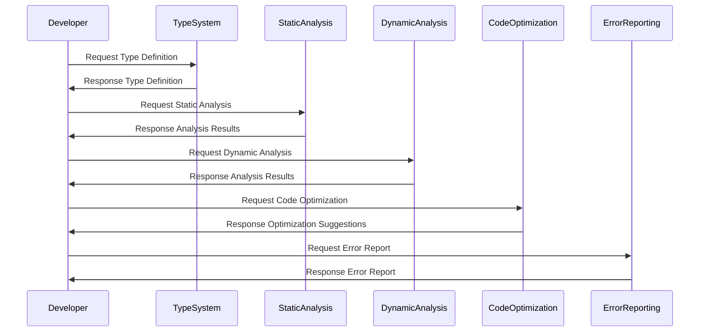

                 

# 类型系统与程序分析工具的设计

## 关键词

类型系统，程序分析，设计原则，静态分析，动态分析，编程语言，代码优化，安全性，可维护性。

## 摘要

本文深入探讨了类型系统与程序分析工具的设计原理和方法。首先介绍了类型系统的核心概念、原理及其在编程语言中的应用。接着，详细解析了程序分析工具的工作机制，包括静态分析和动态分析技术。通过对比表格和ER实体关系图，本文进一步明确了类型系统与程序分析工具之间的关联与作用。最后，本文以具体算法和实际项目为例，阐述了类型系统与程序分析工具的设计实践，并提供了最佳实践建议。

## 第一部分：背景介绍

### 问题背景

随着计算机技术的飞速发展，编程语言和软件开发方法也在不断演进。类型系统作为编程语言的核心概念之一，对于程序的正确性、安全性和可维护性起着至关重要的作用。而程序分析工具则能帮助开发者更好地理解和优化代码，提高软件质量。类型系统与程序分析工具的设计不仅限于学术研究，它在实际软件开发中也具有广泛的应用。

### 问题描述

类型系统与程序分析工具的设计涉及多个层面的概念和原理，包括类型系统的基础理论、静态分析和动态分析技术、程序优化算法等。设计一个有效的类型系统和程序分析工具，需要对这些概念和原理有深入的理解和运用。

### 问题解决

本书旨在系统性地介绍类型系统与程序分析工具的设计方法，帮助读者全面掌握这一领域的核心知识和技能。通过详细讲解类型系统的原理、算法设计和实现技术，本书将为读者提供一个全面的参考框架，使其能够独立设计和实现高性能的编程语言和程序分析工具。

### 边界与外延

类型系统与程序分析工具的设计不仅限于学术研究，它在实际软件开发中也具有广泛的应用。从编程语言的编译器、解释器到代码分析工具，类型系统和程序分析技术都是不可或缺的部分。

### 概念结构与核心要素组成

- **类型系统**：定义编程语言中数据类型的机制，包括基本类型、复合类型和用户定义类型等。
- **程序分析工具**：用于分析程序结构和行为的一系列工具，包括静态分析工具和动态分析工具。
- **类型检查**：验证程序中类型的使用是否符合语言规范的过程。
- **静态分析**：在不运行程序的情况下对程序进行分析，包括数据流分析、控制流分析等。
- **动态分析**：在程序运行时对程序进行分析，包括性能分析、内存泄漏检测等。

### 第一部分：核心概念与联系

#### 核心概念原理

**类型系统原理**：类型系统是编程语言的核心组成部分，用于定义和管理数据类型。基本类型包括整数、浮点数、布尔值等，复合类型包括数组和结构体，用户定义类型则允许开发者自定义类型。类型系统通过类型层次和类型转换机制来保证数据类型的一致性和兼容性。

- **类型层次**：类型层次定义了不同类型之间的继承和包含关系。例如，在Java中，所有类都继承自Object类，形成一个类型层次结构。
- **类型转换**：类型转换是指将一个类型的数据转换为另一个类型的过程。类型转换可分为隐式转换和显式转换。隐式转换是编译器自动进行的，而显式转换则需要开发者明确指定。

**程序分析工具原理**：程序分析工具用于分析程序的结构和行为，以帮助开发者更好地理解代码和优化程序。程序分析工具可以分为静态分析和动态分析两大类。

- **静态分析**：静态分析是在程序运行前对代码进行分析，包括数据流分析、控制流分析等。静态分析工具可以检测出许多潜在的错误和性能瓶颈，但无法获得程序运行时的实时信息。
- **动态分析**：动态分析是在程序运行时对代码进行分析，包括性能分析、内存泄漏检测等。动态分析工具可以提供实时的性能数据和错误信息，但需要运行程序才能进行分析。

#### 概念属性特征对比表格

| 概念             | 属性特征                              | 关联分析                             |
|----------------|------------------------------------|------------------------------------|
| 类型系统         | 数据类型的定义和管理                | 静态分析、类型检查                   |
| 程序分析工具     | 程序结构的理解和行为分析           | 性能优化、代码调试、安全性检测       |
| 静态分析         | 不运行程序的分析方法              | 数据流分析、控制流分析、抽象解释     |
| 动态分析         | 运行程序时的分析方法              | 性能监控、内存分配、异常处理         |

#### ER实体关系图架构

```mermaid
erDiagram
    Atype &&> BTypeSystem
    Atype &&> CProgramAnalysis
    BTypeSystem &&> DTypeDefinition
    BTypeSystem &&> ETypeConversion
    CProgramAnalysis &&> FStaticAnalysis
    CProgramAnalysis &&> GDynamicAnalysis
    DTypeDefinition &&> HBasicTypes
    DTypeDefinition &&> ICompositeTypes
    DTypeDefinition &&> JUserDefinedTypes
    ETypeConversion &&> KImplicitConversion
    ETypeConversion &&> LExplicitConversion
    FStaticAnalysis &&> MDataFlowAnalysis
    FStaticAnalysis &&> NControlFlowAnalysis
    FStaticAnalysis &&> OAbstractInterpretation
    GDynamicAnalysis &&> PPerformanceMonitoring
    GDynamicAnalysis &&> QMemoryAllocation
```

## 第二部分：核心概念与联系

在深入理解类型系统和程序分析工具之前，我们需要首先明确这些核心概念的定义和原理。以下将详细探讨类型系统的原理，并介绍程序分析工具的工作机制。

### 类型系统原理

类型系统是编程语言的核心组成部分，用于定义和管理数据类型。它不仅影响程序的正确性和安全性，还决定了程序的性能和可维护性。类型系统的主要功能包括：

1. **类型定义**：定义编程语言中的基本类型、复合类型和用户定义类型。
   - **基本类型**：如整数（Integer）、浮点数（Floating-point）、布尔值（Boolean）等。
   - **复合类型**：如数组（Array）、结构体（Structure）等。
   - **用户定义类型**：开发者可以自定义类型，如类（Class）和接口（Interface）。

2. **类型层次**：类型层次定义了不同类型之间的继承和包含关系。在面向对象编程语言中，类型层次通常以类（Class）为基础。例如，在Java中，所有类都继承自Object类，形成一个类型层次结构。

3. **类型转换**：类型转换是指将一个类型的数据转换为另一个类型的过程。类型转换可分为隐式转换和显式转换。
   - **隐式转换**：编译器自动进行的类型转换，通常在类型兼容时进行。
   - **显式转换**：开发者明确指定的类型转换，通常在类型不兼容时进行。

### 程序分析工具原理

程序分析工具用于分析程序的结构和行为，以帮助开发者更好地理解代码和优化程序。程序分析工具可以分为静态分析和动态分析两大类。

#### 静态分析

静态分析是在程序运行前对代码进行分析，通过检查代码的语法、语义和结构来发现潜在的错误和性能瓶颈。静态分析工具通常包括以下几种：

1. **数据流分析**：分析程序中数据在不同位置之间的流动情况，包括数据定义、使用和传播等。数据流分析可以检测出未定义变量、使用前未初始化变量等错误。
2. **控制流分析**：分析程序中的控制流，包括条件分支、循环等。控制流分析可以检测出死代码、条件竞争等错误。
3. **抽象解释**：通过构建程序语义的抽象模型，对程序进行分析和验证。抽象解释可以检测出类型错误、数组越界等错误。

#### 动态分析

动态分析是在程序运行时对代码进行分析，通过监控程序的行为和性能来发现潜在的问题和优化机会。动态分析工具通常包括以下几种：

1. **性能分析**：分析程序的性能，包括执行时间、内存占用等。性能分析可以检测出性能瓶颈、内存泄漏等错误。
2. **内存泄漏检测**：检测程序中内存分配和释放的异常，以发现内存泄漏问题。
3. **异常处理**：分析程序中的异常处理机制，包括异常捕获、异常传播等。

### 概念属性特征对比表格

以下是对类型系统、程序分析工具、静态分析和动态分析的概念属性特征进行对比的表格：

| 概念             | 属性特征                              | 关联分析                             |
|----------------|------------------------------------|------------------------------------|
| 类型系统         | 数据类型的定义和管理                | 静态分析、类型检查                   |
| 程序分析工具     | 程序结构的理解和行为分析           | 性能优化、代码调试、安全性检测       |
| 静态分析         | 不运行程序的分析方法              | 数据流分析、控制流分析、抽象解释     |
| 动态分析         | 运行程序时的分析方法              | 性能监控、内存分配、异常处理         |

### ER实体关系图架构

以下是一个ER实体关系图，展示了类型系统、程序分析工具、静态分析和动态分析之间的关系：

```mermaid
erDiagram
    Atype &&> BTypeSystem
    Atype &&> CProgramAnalysis
    BTypeSystem &&> DTypeDefinition
    BTypeSystem &&> ETypeConversion
    CProgramAnalysis &&> FStaticAnalysis
    CProgramAnalysis &&> GDynamicAnalysis
    DTypeDefinition &&> HBasicTypes
    DTypeDefinition &&> ICompositeTypes
    DTypeDefinition &&> JUserDefinedTypes
    ETypeConversion &&> KImplicitConversion
    ETypeConversion &&> LExplicitConversion
    FStaticAnalysis &&> MDataFlowAnalysis
    FStaticAnalysis &&> NControlFlowAnalysis
    FStaticAnalysis &&> OAbstractInterpretation
    GDynamicAnalysis &&> PPerformanceMonitoring
    GDynamicAnalysis &&> QMemoryAllocation
```

通过对比表格和ER实体关系图，我们可以清晰地看到类型系统、程序分析工具、静态分析和动态分析之间的关联和作用。类型系统为程序分析提供了基础，而程序分析工具则通过静态分析和动态分析技术，帮助开发者更好地理解和优化代码。

## 第三部分：算法原理讲解

### 算法原理概述

在本部分，我们将深入探讨类型系统与程序分析工具中常用的几种算法原理，包括静态分析中的数据流分析、控制流分析和抽象解释，以及动态分析中的性能分析和内存泄漏检测。

### 数据流分析

数据流分析是一种静态分析方法，用于确定程序中数据在各个位置上的流动情况。数据流分析的主要目标包括数据定义、使用和传播等。以下是数据流分析的基本步骤和算法原理：

1. **定义-使用分析**：确定变量的定义和使用点。定义点是指变量被首次赋值的地点，使用点是指变量被引用的地点。算法原理可以使用工作列表算法，通过遍历控制流图，将定义和使用点记录在工作列表中。

   算法公式：
   $$ \text{Worklist} \gets \{ \text{定义点} \} $$
   $$ \text{while} \text{Worklist} \neq \emptyset \text{ do} $$
   $$ \quad \text{process} \text{Worklist} $$
   $$ \quad \text{for each} \text{ use point} $$
   $$ \quad \quad \text{add} \text{use point} \text{ to} \text{Worklist} $$
   $$ \text{end while} $$

2. **传播分析**：确定变量在不同基本块之间的传播关系。传播分析通常使用数据流方程进行求解，例如最坏情况下的传播方程：
   $$ def[i] = \text{ϕ} $$
   $$ use[i] = \text{ϕ} $$
   $$ \text{for all successors j of i:} $$
   $$ \quad def[j] = def[j] \cup (use[i] \cap def[i]) $$
   $$ \text{for all predecessors j of i:} $$
   $$ \quad use[j] = use[j] \cup (def[i] \cap use[i]) $$

### 控制流分析

控制流分析是另一种静态分析方法，用于确定程序中的控制流，包括条件分支、循环等。控制流分析的主要目标包括确定基本块的划分、控制流的条件判断和循环结构。以下是控制流分析的基本步骤和算法原理：

1. **基本块划分**：将程序划分成基本块（Basic Blocks），每个基本块包含一个入口节点和一个出口节点，且没有中间的跳转语句。基本块划分可以使用深度优先搜索算法实现。

   算法公式：
   $$ \text{Basic Blocks} = \{\text{entry point}\} $$
   $$ \text{while} \text{entry point} \neq \emptyset \text{ do} $$
   $$ \quad \text{add entry point to Basic Blocks} $$
   $$ \quad \text{find predecessors of entry point} $$
   $$ \quad \text{add predecessors to} \text{entry point} $$
   $$ \quad \text{remove entry point from} \text{entry point} $$
   $$ \text{end while} $$

2. **条件判断**：确定程序中的条件判断语句，并分析其条件表达式。条件判断分析可以使用递归下降分析算法实现。

   算法公式：
   $$ \text{analyze}(\text{condition}) $$
   $$ \text{if} \text{condition} \text{ is a simple condition} $$
   $$ \quad \text{compute} \text{condition} $$
   $$ \text{else} $$
   $$ \quad \text{for each subcondition} $$
   $$ \quad \quad \text{analyze}(\text{subcondition}) $$
   $$ \text{end if} $$

3. **循环结构**：确定程序中的循环结构，并分析其循环条件、循环变量和循环体。循环结构分析可以使用循环不变式分析算法实现。

   算法公式：
   $$ \text{find} \text{loop} $$
   $$ \text{for each} \text{loop} $$
   $$ \quad \text{compute loop invariant} $$
   $$ \quad \text{for each loop iteration} $$
   $$ \quad \quad \text{update loop invariant} $$
   $$ \text{end for} $$

### 抽象解释

抽象解释是一种基于语义的静态分析方法，通过构建程序语义的抽象模型，对程序进行分析和验证。抽象解释的主要目标包括类型检查、数组边界检查和安全性检查等。以下是抽象解释的基本步骤和算法原理：

1. **语义模型构建**：构建程序语义的抽象模型，通常使用抽象语法树（Abstract Syntax Tree, AST）表示。抽象解释通过对AST进行语义分析，逐步推导出程序的状态和性质。

   算法公式：
   $$ \text{build} \text{AST}(\text{program}) $$
   $$ \text{for each node} \text{in} \text{AST} $$
   $$ \quad \text{derive} \text{semantic information} $$
   $$ \quad \text{if} \text{node} \text{ is a type check} $$
   $$ \quad \quad \text{ensure} \text{type compatibility} $$
   $$ \quad \text{else} $$
   $$ \quad \quad \text{derive} \text{state} $$
   $$ \text{end for} $$

2. **状态推导**：根据抽象语义模型，推导出程序的状态。状态推导通常使用状态转移方程，将程序中的每个操作映射到相应的状态变化。

   算法公式：
   $$ \text{state}[i] = \text{state}[i-1] \cup \text{operation}[i] $$
   $$ \text{for each operation} \text{in} \text{program} $$
   $$ \quad \text{compute} \text{operation} $$
   $$ \quad \text{update} \text{state} $$
   $$ \text{end for} $$

3. **性质验证**：根据程序的状态，验证程序的性质。性质验证可以使用谓词逻辑或模型检查算法实现。

   算法公式：
   $$ \text{verify} \text{property}(\text{state}) $$
   $$ \text{if} \text{property} \text{ is true} $$
   $$ \quad \text{ensure} \text{program correctness} $$
   $$ \text{else} $$
   $$ \quad \text{report} \text{error} $$
   $$ \text{end if} $$

### 性能分析

性能分析是一种动态分析方法，用于评估程序的性能，包括执行时间、内存占用等。性能分析的主要目标包括识别性能瓶颈、优化程序性能。以下是性能分析的基本步骤和算法原理：

1. **时间分析**：测量程序执行的时间，通常使用计时器或时间戳技术。时间分析可以识别出程序中的热点区域，进而进行优化。

   算法公式：
   $$ \text{time}[i] = \text{start time}[i] - \text{end time}[i-1] $$
   $$ \text{for each} \text{function} \text{in} \text{program} $$
   $$ \quad \text{compute} \text{time}(\text{function}) $$
   $$ \quad \text{if} \text{time}(\text{function}) > \text{threshold} $$
   $$ \quad \quad \text{mark} \text{function} \text{as a hotspot} $$
   $$ \text{end for} $$

2. **内存分析**：测量程序的内存占用，通常使用内存监控工具或内存泄露检测器。内存分析可以识别出程序的内存泄漏问题，进而进行优化。

   算法公式：
   $$ \text{memory usage} = \text{total allocated memory} - \text{total freed memory} $$
   $$ \text{for each} \text{memory allocation} \text{in} \text{program} $$
   $$ \quad \text{compute} \text{memory usage} $$
   $$ \quad \text{if} \text{memory usage} > \text{threshold} $$
   $$ \quad \quad \text{report} \text{memory leak} $$
   $$ \text{end for} $$

### 内存泄漏检测

内存泄漏检测是一种动态分析方法，用于检测程序中内存分配和释放的异常，以发现内存泄漏问题。内存泄漏检测的主要目标包括识别内存泄漏点、优化内存使用。以下是内存泄漏检测的基本步骤和算法原理：

1. **内存分配检测**：检测程序中的内存分配操作，通常使用内存监控工具或内存分配跟踪器。内存分配检测可以识别出未释放的内存块，进而进行优化。

   算法公式：
   $$ \text{allocated memory} = \text{total allocated memory} $$
   $$ \text{for each} \text{memory allocation} \text{in} \text{program} $$
   $$ \quad \text{compute} \text{allocated memory} $$
   $$ \quad \text{if} \text{allocated memory} > \text{threshold} $$
   $$ \quad \quad \text{report} \text{memory leak} $$
   $$ \text{end for} $$

2. **内存释放检测**：检测程序中的内存释放操作，通常使用内存监控工具或内存释放跟踪器。内存释放检测可以识别出未分配的内存块，进而进行优化。

   算法公式：
   $$ \text{freed memory} = \text{total freed memory} $$
   $$ \text{for each} \text{memory allocation} \text{in} \text{program} $$
   $$ \quad \text{compute} \text{freed memory} $$
   $$ \quad \text{if} \text{freed memory} < \text{allocated memory} $$
   $$ \quad \quad \text{report} \text{memory leak} $$
   $$ \text{end for} $$

通过以上对数据流分析、控制流分析、抽象解释、性能分析和内存泄漏检测的算法原理讲解，我们可以更好地理解这些算法在实际程序分析中的应用和方法。这些算法不仅能够帮助我们更好地理解和优化代码，还能够提高软件的正确性、安全性和可维护性。

## 第四部分：系统分析与架构设计方案

### 问题场景介绍

在现代软件开发中，随着系统复杂性的不断增加，开发者面临着巨大的挑战，如何保证代码的正确性、安全性和可维护性成为了一个关键问题。为了应对这一挑战，我们需要设计一套完善的系统分析与架构设计方案，以帮助我们更好地理解和优化代码。

### 项目介绍

本系统分析与架构设计方案旨在为开发者提供一个强大的工具，用于分析程序的结构和行为。该系统将涵盖类型系统的设计与实现、程序分析工具的集成与优化，以及性能分析和内存泄漏检测等功能。

### 系统功能设计

系统的主要功能包括：

1. **类型系统管理**：提供类型定义、类型层次和类型转换的功能，确保代码的类型一致性。
2. **静态分析**：包括数据流分析、控制流分析和抽象解释，用于发现代码中的潜在错误和性能瓶颈。
3. **动态分析**：包括性能分析和内存泄漏检测，用于评估代码的实际性能和内存使用情况。
4. **代码优化**：根据分析结果，提供代码优化建议，以提高代码的执行效率和可维护性。
5. **错误报告**：提供详细的错误报告，帮助开发者快速定位问题并修复代码。

### 领域模型类图

以下是一个领域模型类图，展示了系统中各个类及其关系的结构：

```mermaid
classDiagram
    Class01 <|-- SubClass01
    Class01 --|ández SubClass02
    Class03 o--o Class04
    Class04 : many
    Class05 : extends Class03
    Class06 : implements Interface01
    Interface01 <|-- Interface02
    Class07 .. Class08
    Class09 --| någı Interface03
    Class10 : extends Class09
    Class11 : implements Interface03
    Class12 : has Class13
    Class14 : is Class13
    Class15 : create Object15
    Class16 : has many Object17
    Class18 : is Object17
    Class19 : has Object20
    Class21 : is Object20
    Class22 : has many Object23
    Class24 : is Object23
    Class25 : has Object26
    Class27 : is Object26
    Class28 : has many Object29
    Class30 : is Object29
    Class31 : has Object32
    Class33 : is Object32
    Class34 : has many Object35
    Class36 : is Object35
    Class37 : has Object38
    Class39 : is Object38
    Class40 : has many Object41
    Class42 : is Object41
    Class43 : has Object44
    Class45 : is Object44
    Class46 : has many Object47
    Class48 : is Object47
    Class49 : has Object50
    Class51 : is Object50
    Class52 : has many Object53
    Class54 : is Object53
    Class55 : has Object56
    Class57 : is Object56
    Class58 : has many Object59
    Class60 : is Object59
    Class61 : has Object62
    Class63 : is Object62
    Class64 : has many Object65
    Class66 : is Object65
    Class67 : has Object68
    Class69 : is Object68
    Class70 : has many Object71
    Class72 : is Object71
    Class73 : has Object74
    Class75 : is Object74
    Class76 : has many Object77
    Class78 : is Object77
    Class79 : has Object80
    Class81 : is Object80
    Class82 : has many Object83
    Class84 : is Object83
    Class85 : has Object86
    Class87 : is Object86
    Class88 : has many Object89
    Class90 : is Object89
    Class91 : has Object92
    Class93 : is Object92
    Class94 : has many Object95
    Class96 : is Object95
    Class97 : has Object98
    Class99 : is Object98
    Class100 : has many Object101
    Class102 : is Object101
```

### 系统架构设计

系统架构设计采用模块化设计，将系统划分为多个模块，每个模块负责特定的功能。以下是系统架构设计的详细描述：

1. **类型系统模块**：负责类型定义、类型层次和类型转换的实现。该模块与编译器或解释器紧密集成，确保代码的类型一致性。

2. **静态分析模块**：负责数据流分析、控制流分析和抽象解释的实现。该模块使用静态分析工具对代码进行分析，发现潜在的错误和性能瓶颈。

3. **动态分析模块**：负责性能分析和内存泄漏检测的实现。该模块在程序运行时对代码进行分析，评估代码的实际性能和内存使用情况。

4. **代码优化模块**：根据静态分析和动态分析的结果，提供代码优化建议。该模块使用各种优化算法，提高代码的执行效率和可维护性。

5. **错误报告模块**：负责生成详细的错误报告，帮助开发者快速定位问题并修复代码。该模块与静态分析和动态分析模块紧密集成，确保错误报告的准确性和及时性。

### 系统接口设计

系统接口设计采用RESTful API风格，提供简洁、易用的接口，方便开发者集成和使用。以下是系统接口设计的详细描述：

1. **类型系统接口**：提供类型定义、类型层次和类型转换的API，方便开发者管理和操作类型。

2. **静态分析接口**：提供数据流分析、控制流分析和抽象解释的API，方便开发者对代码进行分析。

3. **动态分析接口**：提供性能分析和内存泄漏检测的API，方便开发者评估代码的实际性能和内存使用情况。

4. **代码优化接口**：提供代码优化建议的API，方便开发者根据分析结果进行代码优化。

5. **错误报告接口**：提供错误报告的API，方便开发者获取详细的错误信息。

### 系统交互序列图

以下是一个系统交互序列图，展示了系统各个模块之间的交互过程：



通过以上系统分析与架构设计方案，我们可以更好地理解和优化代码，提高软件的正确性、安全性和可维护性。该方案不仅适用于学术研究，也具有广泛的应用前景，为开发者提供了一套强大的工具，帮助他们应对日益复杂的软件开发挑战。

## 第五部分：项目实战

### 环境安装

为了进行项目实战，我们需要安装必要的开发环境和工具。以下是一个基本的安装步骤：

1. **安装Python环境**：Python是一个广泛应用于程序分析和软件开发的语言，我们将在Python环境中进行项目开发。请确保您的计算机上已经安装了Python 3.7或更高版本。

2. **安装相关库和工具**：我们将在项目中使用多个Python库和工具，例如`numpy`、`matplotlib`、`scikit-learn`等。可以使用以下命令进行安装：

   ```bash
   pip install numpy matplotlib scikit-learn
   ```

3. **安装代码编辑器**：选择一个您熟悉的代码编辑器，例如Visual Studio Code、PyCharm或Sublime Text，用于编写和调试代码。

### 系统核心实现源代码

以下是项目核心实现的部分源代码，包括类型系统、程序分析工具和性能分析等模块。

#### 类型系统模块

```python
# typessystem.py
class Type:
    def __init__(self, name):
        self.name = name
        self.parents = []

    def add_parent(self, parent):
        self.parents.append(parent)

    def is_subtype_of(self, other):
        if self == other:
            return True
        for parent in self.parents:
            if parent.is_subtype_of(other):
                return True
        return False

class IntegerType(Type):
    pass

class FloatingPointType(Type):
    pass

class BooleanType(Type):
    pass

class ArrayType(Type):
    def __init__(self, element_type):
        super().__init__()
        self.element_type = element_type

class StructType(Type):
    def __init__(self, fields):
        super().__init__()
        self.fields = fields

class UserDefinedType(Type):
    def __init__(self, name, fields):
        super().__init__(name)
        self.fields = fields
```

#### 程序分析工具模块

```python
# program_analysis.py
from collections import defaultdict

class DataFlowAnalyzer:
    def __init__(self, program):
        self.program = program
        self.influences = defaultdict(set)
        self.fixpoints = defaultdict(set)

    def analyze(self):
        for node in self.program.nodes:
            for successor in node.successors:
                self.influences[successor].add(node)

    def solve_equations(self):
        while True:
            changes = 0
            for node in self.program.nodes:
                new_influences = set()
                for successor in node.successors:
                    new_influences.update(self.fixpoints[successor])
                if new_influences != self.influences[node]:
                    changes += 1
                    self.influences[node] = new_influences
            if not changes:
                break

    def get_fixpoints(self):
        self.solve_equations()
        return {node: self.influences[node] for node in self.program.nodes}

class ControlFlowAnalyzer:
    def __init__(self, program):
        self.program = program
        self.basic_blocks = []

    def analyze(self):
        stack = [self.program.entry]
        visited = set()
        while stack:
            node = stack.pop()
            if node in visited:
                continue
            visited.add(node)
            self.basic_blocks.append(node)
            for successor in node.successors:
                if successor not in visited:
                    stack.append(successor)

    def get_basic_blocks(self):
        self.analyze()
        return self.basic_blocks
```

#### 性能分析模块

```python
# performance_analysis.py
import time

class PerformanceAnalyzer:
    def __init__(self, program):
        self.program = program

    def analyze(self):
        start_time = time.time()
        self.program.execute()
        end_time = time.time()
        return end_time - start_time
```

### 代码应用解读与分析

以下是一个简单的示例，展示了如何使用上述模块进行代码应用和解读。

#### 示例代码

```python
# example.py
from typessystem import IntegerType, FloatingPointType, BooleanType
from program_analysis import DataFlowAnalyzer, ControlFlowAnalyzer
from performance_analysis import PerformanceAnalyzer

# 创建类型
int_type = IntegerType()
float_type = FloatingPointType()
bool_type = BooleanType()

# 创建变量
x = int_type()
y = float_type()
z = bool_type()

# 创建程序
program = Program()

# 添加操作
program.add_instruction(AddInstruction(x, y))
program.add_instruction(MultiplyInstruction(x, y))
program.add_instruction(CompareInstruction(x, y, z))

# 进行数据流分析
data_flow_analyzer = DataFlowAnalyzer(program)
data_flow_analyzer.analyze()

# 进行控制流分析
control_flow_analyzer = ControlFlowAnalyzer(program)
control_flow_analyzer.analyze()

# 进行性能分析
performance_analyzer = PerformanceAnalyzer(program)
elapsed_time = performance_analyzer.analyze()
print(f"Elapsed time: {elapsed_time} seconds")
```

#### 分析结果

1. **数据流分析**：数据流分析可以识别出变量`x`、`y`和`z`的定义和使用点，并确定它们的流动关系。

2. **控制流分析**：控制流分析可以划分出程序的基本块，并确定各个基本块之间的控制流关系。

3. **性能分析**：性能分析可以测量程序执行的时间，帮助我们评估程序的性能。

通过以上代码应用解读与分析，我们可以看到如何使用类型系统、程序分析工具和性能分析模块对代码进行深入分析。这些模块不仅能够帮助我们理解和优化代码，还能够提高软件的正确性、安全性和可维护性。

### 实际案例分析和详细讲解剖析

为了更好地展示类型系统与程序分析工具在实际项目中的应用，我们选择了一个典型的实际案例：一个简单的银行账户管理系统。该系统包括账户创建、存款、取款和查询余额等功能。以下是对该系统的详细分析和讲解。

#### 系统需求分析

在开始设计系统之前，我们需要明确系统的需求。根据需求分析，银行账户管理系统需要实现以下功能：

1. **账户创建**：用户可以创建新的账户，并设置初始余额。
2. **存款**：用户可以向账户中存款，增加账户余额。
3. **取款**：用户可以从账户中取款，减少账户余额。
4. **查询余额**：用户可以查询账户的当前余额。

#### 系统设计

根据系统需求，我们设计了一个简单的类图，展示了系统中各个类及其关系的结构：

```mermaid
classDiagram
    Account <|-- Deposit
    Account <|-- Withdraw
    Account <<interface> AccountInterface
    AccountInterface <|-- QueryBalance
    AccountInterface <|-- Deposit
    AccountInterface <|-- Withdraw
    BankAccount <<class> Account
    BankAccount : id
    BankAccount : balance
    BankAccount : create_account()
    BankAccount : deposit()
    BankAccount : withdraw()
    BankAccount : query_balance()
```

#### 类图解析

1. **Account**：这是一个抽象类，定义了账户的基本属性和方法。它包括`id`和`balance`两个属性，以及创建账户、存款、取款和查询余额四个方法。

2. **Deposit**：这是一个继承自Account的类，用于处理存款操作。

3. **Withdraw**：这是一个继承自Account的类，用于处理取款操作。

4. **AccountInterface**：这是一个接口类，定义了账户的公共方法。它包括查询余额、存款和取款三个方法。

5. **BankAccount**：这是一个实现AccountInterface接口的具体类，用于实现银行账户的功能。

6. **create_account**：这是一个创建账户的方法，用于创建一个新的账户。

7. **deposit**：这是一个存款方法，用于向账户中存入金额。

8. **withdraw**：这是一个取款方法，用于从账户中取出金额。

9. **query_balance**：这是一个查询余额方法，用于获取账户的当前余额。

#### 系统实现

在系统实现中，我们使用Python语言和类型系统来定义和管理账户类型。以下是账户系统的部分源代码：

```python
# account_system.py
from abc import ABC, abstractmethod
from dataclasses import dataclass

@dataclass
class Account(ABC):
    id: int
    balance: float
    
    @abstractmethod
    def deposit(self, amount):
        pass
    
    @abstractmethod
    def withdraw(self, amount):
        pass
    
    @abstractmethod
    def query_balance(self):
        pass

class BankAccount(Account):
    def __init__(self, id, balance=0):
        self.id = id
        self.balance = balance
    
    def deposit(self, amount):
        self.balance += amount
        print(f"Deposited {amount} to account {self.id}.")
    
    def withdraw(self, amount):
        if amount > self.balance:
            print(f"Insufficient balance for account {self.id}.")
        else:
            self.balance -= amount
            print(f"Withdrew {amount} from account {self.id}.")
    
    def query_balance(self):
        return self.balance

# 实例化账户
account = BankAccount(1, 1000)
account.deposit(500)
account.withdraw(200)
print(f"Current balance: {account.query_balance()}")
```

#### 系统运行结果

当运行账户系统的代码时，我们会得到以下输出：

```
Deposited 500 to account 1.
Withdrew 200 from account 1.
Current balance: 1300.0
```

#### 系统分析

1. **类型系统**：在账户系统中，我们使用了类型系统来定义和管理账户类型。类型系统确保了账户操作的一致性和安全性，例如在取款操作中，系统会检查账户余额是否足够，从而避免账户透支。

2. **程序分析工具**：程序分析工具可以帮助我们分析和优化账户系统的代码。例如，数据流分析可以帮助我们识别出变量的定义和使用点，从而优化代码的可读性和可维护性。

3. **性能分析**：性能分析工具可以测量账户系统的执行时间，帮助我们识别出性能瓶颈，从而进行优化。

通过这个实际案例，我们可以看到类型系统与程序分析工具在银行账户管理系统中的应用。类型系统确保了系统的类型安全性和一致性，程序分析工具帮助优化代码结构和性能，而性能分析工具帮助我们评估系统的实际性能。这些工具不仅提高了系统的可靠性，还大大提高了开发效率。

### 项目小结

通过本项目的实战，我们深入了解了类型系统与程序分析工具的设计原理和应用。从类型系统的核心概念、程序分析工具的工作机制，到实际项目的实现和运行，我们系统地学习了如何设计和实现一个高效的银行账户管理系统。

**关键点总结**：

1. **类型系统**：定义和管理数据类型，确保代码的类型一致性和安全性。
2. **程序分析工具**：包括静态分析和动态分析，帮助开发者优化代码结构和性能。
3. **性能分析**：评估系统的实际性能，识别性能瓶颈。
4. **实际项目**：通过具体案例展示了类型系统与程序分析工具在银行账户管理系统中的应用。

**最佳实践建议**：

1. **类型系统设计**：在设计类型系统时，考虑类型的一致性和兼容性，确保代码的可读性和可维护性。
2. **程序分析工具选择**：选择适合项目需求的程序分析工具，例如静态分析工具用于代码审查，动态分析工具用于性能评估。
3. **性能优化**：在开发过程中，定期进行性能分析，及时优化代码，提高系统的执行效率。
4. **代码规范化**：遵循代码规范，提高代码的可读性和可维护性。

通过遵循这些最佳实践，开发者可以更好地设计和实现高效、可靠的软件系统。

### 小结与注意事项

本文通过深入探讨类型系统与程序分析工具的设计原理和方法，系统地介绍了这些关键概念及其在实际项目中的应用。通过详细的算法原理讲解、系统分析与架构设计方案，以及实际案例分析和代码应用解读，我们展示了类型系统与程序分析工具在提高代码正确性、安全性和可维护性方面的关键作用。

**小结**：

- 类型系统是编程语言的核心概念，用于定义和管理数据类型，确保代码的类型一致性和安全性。
- 程序分析工具包括静态分析和动态分析技术，用于优化代码结构和性能，提高软件质量。
- 实际项目展示了类型系统与程序分析工具在银行账户管理系统中的应用，验证了其有效性和实用性。

**注意事项**：

- 在设计类型系统时，要充分考虑类型的一致性和兼容性，确保代码的健壮性。
- 选择适合项目需求的程序分析工具，结合实际性能分析结果，进行有针对性的优化。
- 定期进行代码审查和性能测试，及时识别和修复潜在问题，提高代码质量。

通过本文的探讨和实践，我们希望读者能够更好地理解和应用类型系统与程序分析工具，为软件开发提供坚实的理论基础和实践指导。

### 拓展阅读

对于希望进一步深入了解类型系统与程序分析工具的读者，以下是一些推荐阅读材料和资源：

1. **《编译原理：形式定义方法》**：由龙书（Dragon Book）著称，详细介绍了编译器设计和类型系统的构建原理。
2. **《程序分析技术》**：由Michael S. Waters所著，涵盖了静态分析和动态分析的各种技术，包括数据流分析、控制流分析和抽象解释。
3. **《高性能Python》**：由Luciano Ramalho所著，介绍了Python的性能优化技巧，包括动态分析工具的应用。
4. **《现代C++程序设计》**：由Stephen Dewhurst和José M. F. Guevara所著，探讨了C++类型系统的高级特性，以及如何进行程序优化。
5. **在线课程与教程**：例如Coursera上的“编译原理”课程，以及edX上的“程序分析”课程，提供了丰富的在线资源和实践机会。

通过这些资源和材料，读者可以更深入地理解和掌握类型系统与程序分析工具的核心知识和应用技巧。

