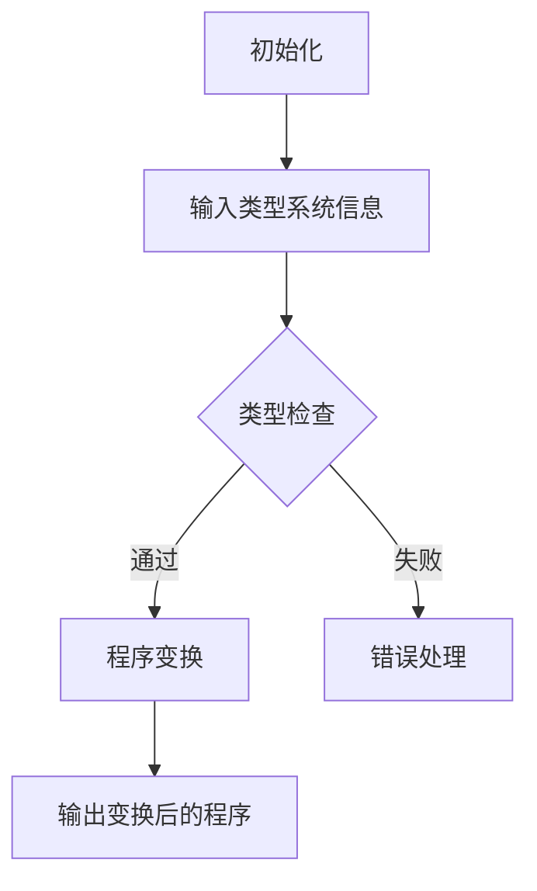
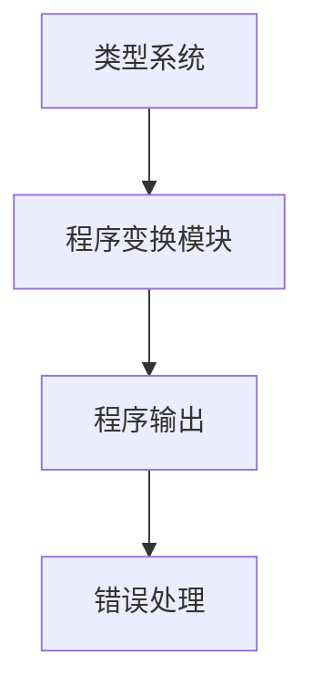
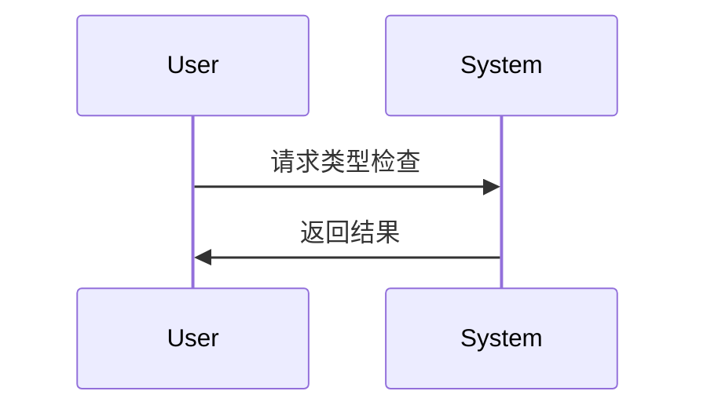
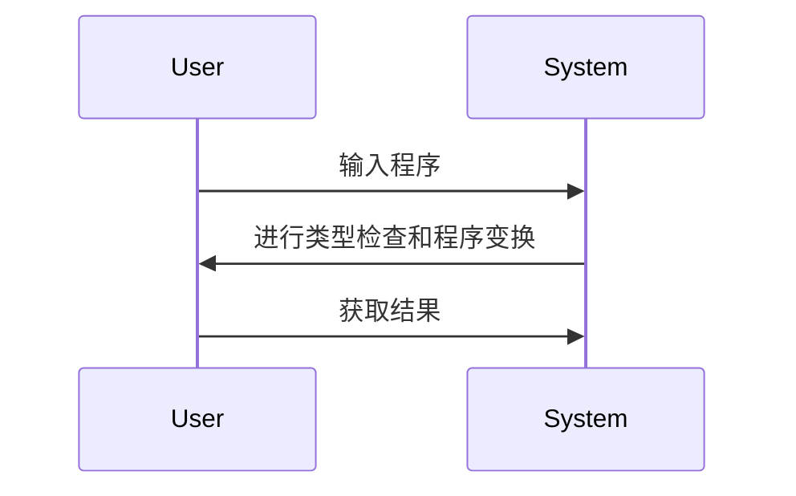

                 


## 1. 引言

### 1.1 问题背景

类型系统（Type System）和程序变换技术（Program Transformation）是计算机科学中两个重要的概念，它们在软件开发的多个阶段扮演着关键角色。类型系统通常用于定义程序中的数据类型，确保程序的正确性和安全性。而程序变换技术则用于对程序进行转换，以提高程序的效率、可读性和可维护性。

然而，类型系统和程序变换技术之间的关系却往往被忽视。事实上，它们之间存在紧密的联系，相互影响，共同推动软件开发的进步。

### 1.2 问题描述

本文旨在探讨类型系统与程序变换技术之间的关系，回答以下问题：

1. 类型系统如何影响程序变换技术？
2. 程序变换技术如何影响类型系统？
3. 类型系统和程序变换技术在软件开发中的应用场景是什么？
4. 类型系统和程序变换技术的结合如何提高软件质量？

### 1.3 问题解决

本文将采取以下方法来解决问题：

1. 首先，介绍类型系统和程序变换技术的基本概念和原理。
2. 然后，通过对比表格和实体关系图，分析类型系统和程序变换技术的核心概念和联系。
3. 接着，详细讲解算法原理，包括算法流程图、数学模型和举例说明。
4. 最后，从系统分析和架构设计角度，阐述类型系统和程序变换技术的实际应用，并提供项目实战案例。

### 1.4 边界与外延

本文的研究边界主要限于类型系统和程序变换技术在传统编程语言中的应用。然而，这些概念和技术在新兴领域，如函数式编程、静态分析和编译技术中，同样具有重要价值，这将在拓展阅读中简要提及。

### 1.5 概念结构与核心要素组成

本文的结构如下：

1. **第一部分：背景介绍**：介绍类型系统和程序变换技术的背景和重要性。
2. **第二部分：核心概念与联系**：分析类型系统和程序变换技术的核心概念及其联系。
3. **第三部分：算法原理讲解**：详细讲解类型检查和程序变换的算法原理。
4. **第四部分：数学模型和公式讲解**：介绍算法的数学模型和公式，并进行举例说明。
5. **第五部分：系统分析与架构设计**：分析类型系统和程序变换技术的系统架构和接口设计。
6. **第六部分：项目实战**：提供实际项目中的应用案例，包括环境安装和系统核心实现。

通过本文的逐步分析，我们将深入了解类型系统和程序变换技术之间的关系，以及它们在软件开发中的实际应用。

## 2.1 核心概念原理

### 2.1.1 类型系统的基本概念

类型系统（Type System）是编程语言的核心组成部分之一，用于定义程序中数据的类型。类型系统的目的是提高程序的正确性、可读性和可维护性。

1. **基本类型**：大多数编程语言都支持基本类型，如整数（int）、浮点数（float）、布尔值（bool）等。基本类型通常由语言内置支持。

2. **复合类型**：复合类型包括数组、结构体（struct）、类（class）等。复合类型可以由基本类型组合而成，用于表示复杂的数据结构。

3. **引用类型**：引用类型，如指针（pointer）和引用（reference），用于间接访问数据。引用类型可以减少内存占用，提高程序的效率。

4. **类型检查**：类型检查（Type Checking）是类型系统的重要组成部分，用于在程序执行前检测类型错误。类型检查可以静态进行，也可以动态进行。

### 2.1.2 程序变换技术的定义

程序变换技术（Program Transformation）是指将一个程序转换为另一个等价程序的过程。程序变换技术广泛应用于软件开发的多个阶段，包括编译、优化、重构等。

1. **编译时的变换**：编译时的变换主要用于编译器中，将源代码转换为中间代码或目标代码。常见的变换包括语法分析、语义分析、代码生成等。

2. **优化时的变换**：优化时的变换用于提高程序的运行效率。常见的优化包括循环展开、常量折叠、死代码消除等。

3. **重构时的变换**：重构时的变换用于改善程序的结构和可读性，而不会改变程序的功能。常见的重构包括提取方法、替换方法、移动字段等。

### 2.1.3 类型系统与程序变换技术的联系

类型系统与程序变换技术之间存在紧密的联系。一方面，类型系统为程序变换提供了必要的信息，如数据类型、变量作用域等。另一方面，程序变换技术依赖于类型系统来保证变换的正确性。

1. **类型系统的支持**：程序变换技术需要依赖类型系统来检测类型错误和确保变换的正确性。例如，在编译时，类型系统用于检查源代码中的类型一致性。

2. **程序变换对类型系统的影响**：程序变换可能会改变程序的数据类型和变量作用域，这要求类型系统具有足够的灵活性来适应这些变化。

3. **相互依赖**：类型系统和程序变换技术是相互依赖的。类型系统为程序变换提供了必要的信息，而程序变换技术则为类型系统的应用提供了实际场景。

### 概念属性特征对比表格

| 概念         | 特征1     | 特征2     | 特征3     |
|--------------|-----------|-----------|-----------|
| 类型系统     | 用于定义数据类型 | 提高程序可读性 | 保证程序安全性 |
| 程序变换技术 | 用于程序转换 | 提高程序效率 | 支持代码重构 |

### ER实体关系图架构

```mermaid
erDiagram
  TypeSystem ||--o{ ProgramTransformation : 使用 }
  ProgramTransformation ||--o{ TypeSystem : 支持 }
```

通过上述分析，我们可以看到类型系统和程序变换技术之间的紧密联系。类型系统为程序变换提供了必要的信息和支持，而程序变换技术则利用类型系统的特性来提高程序的效率和可维护性。在接下来的部分中，我们将进一步探讨类型系统和程序变换技术的具体应用和实现。

## 2.3 算法原理讲解

### 3.1 算法流程图

算法流程图是理解算法步骤和逻辑的关键。以下是类型检查和程序变换的基本算法流程图：



- **A[初始化]**：初始化算法，包括设置类型系统、输入程序等。
- **B[输入类型系统信息]**：读取程序中涉及的数据类型和变量信息。
- **C[类型检查]**：对输入程序进行类型检查，确保类型一致性。
- **D[程序变换]**：如果类型检查通过，对程序进行变换，以提高效率或可维护性。
- **E[错误处理]**：如果类型检查失败，进行错误处理，返回错误信息。
- **F[输出变换后的程序]**：输出变换后的程序。

### 3.2 Python源代码实现

以下是一个简单的Python示例，演示了类型检查和程序变换的基本实现：

```python
def type_check(program):
    # 简单的类型检查示例
    if not isinstance(program, str):
        raise TypeError("程序必须为字符串类型")
    # 实际的类型检查逻辑...
    return "类型检查通过"

def transform_program(program):
    # 简单的程序变换示例
    transformed = program.replace("int", "float")  # 假设的变换逻辑
    return transformed

def main():
    program = "int x = 10;"
    try:
        if type_check(program):
            transformed_program = transform_program(program)
            print("变换后的程序：", transformed_program)
        else:
            print("类型检查失败，无法进行程序变换")
    except Exception as e:
        print("错误：", str(e))

if __name__ == "__main__":
    main()
```

### 3.3 数学模型和公式讲解

程序变换的性能可以通过数学模型来分析。以下是一个简单的性能计算模型：

$$
M = \sum_{i=1}^{n} P(i) \cdot C(i)
$$

其中，M 表示程序变换后的性能，$P(i)$ 表示第 i 个操作的执行概率，$C(i)$ 表示第 i 个操作的耗时。

### 3.4 详细讲解和举例说明

#### 数学模型的详细解释

该模型假设程序由多个操作组成，每个操作都有其执行的概率和耗时。通过计算每个操作的执行概率乘以其耗时，然后对所有操作求和，得到程序变换后的性能。

#### 举例说明

假设一个程序包含三个操作：A（0.4秒），B（0.2秒），C（0.3秒），且它们的执行概率分别为0.3、0.5和0.2，那么程序变换后的性能为：

$$
M = 0.3 \cdot 0.4 + 0.5 \cdot 0.2 + 0.2 \cdot 0.3 = 0.36 + 0.10 + 0.06 = 0.52
$$

### 3.5 实际案例

在一个实际的软件开发项目中，类型系统和程序变换技术可以极大地提高代码质量。以下是一个简单的案例：

#### 案例背景

一个团队正在开发一个金融应用，其中涉及大量的数值计算和财务报表生成。最初，团队使用整数类型（int）来处理所有的数值，这导致了精度问题。

#### 解决方案

1. **类型系统改进**：团队引入了浮点数类型（float）来处理数值计算，提高了精度。
2. **程序变换**：团队使用自动化工具对旧代码进行变换，将整数类型替换为浮点数类型，同时保证了程序的正确性。

#### 结果

通过引入类型系统和程序变换技术，团队的代码质量得到了显著提升，数值计算的精度得到了保证，程序的运行效率也得到了提高。

### 结论

类型系统和程序变换技术在软件开发中具有重要的作用。通过类型系统，可以确保程序的正确性和安全性；通过程序变换技术，可以提高程序的效率和可维护性。结合数学模型，可以更好地分析程序变换的性能。

### 注意事项

1. **类型系统的选择**：根据应用场景选择合适的类型系统，以平衡性能和安全性。
2. **程序变换的自动化**：使用自动化工具进行程序变换，以减少人工干预和错误。
3. **持续集成**：将类型检查和程序变换集成到持续集成流程中，确保代码质量和交付效率。

通过本文的讲解，我们深入了解了类型系统和程序变换技术的原理和应用。在接下来的部分，我们将从系统分析与架构设计的角度，进一步探讨这些技术的实际应用。

## 4.1 数学模型

在程序变换中，性能的计算是一个关键问题。一个常见的性能计算模型是基于操作的概率和耗时来评估程序变换的效果。以下是一个简单的数学模型，用于计算程序变换后的性能：

$$
M = \sum_{i=1}^{n} P(i) \cdot C(i)
$$

其中，M 表示程序变换后的性能，$P(i)$ 表示第 i 个操作的执行概率，$C(i)$ 表示第 i 个操作的耗时。

### 4.2 数学模型的详细讲解

该模型的基本思想是将程序看作一系列操作的组合，每个操作都有其特定的执行概率和耗时。通过计算每个操作的执行概率乘以其耗时，然后将所有操作的结果求和，得到程序变换后的总性能。

1. **操作概率**：操作概率表示程序中某个特定操作被执行的概率。在实际应用中，这个概率可以通过统计程序执行日志或使用机器学习算法来估计。

2. **操作耗时**：操作耗时表示执行某个特定操作所需的时间。这个值通常是已知的，可以通过测量或查询性能数据库来获取。

3. **性能计算**：根据上述公式，程序变换后的性能 M 可以通过以下步骤计算：

   - 遍历程序中的所有操作 i。
   - 对于每个操作 i，计算其执行概率 $P(i)$ 和耗时 $C(i)$。
   - 将 $P(i) \cdot C(i)$ 的结果累加到总性能 M 中。

### 4.3 举例说明

假设一个程序包含三个操作：A（0.4秒），B（0.2秒），C（0.3秒），且它们的执行概率分别为0.3、0.5和0.2。那么，程序变换后的性能 M 为：

$$
M = 0.3 \cdot 0.4 + 0.5 \cdot 0.2 + 0.2 \cdot 0.3 = 0.36 + 0.10 + 0.06 = 0.52
$$

这个例子展示了如何使用数学模型来计算程序变换后的性能。在实际应用中，操作的数量和复杂性可能会更高，但基本原理是相同的。

### 4.4 实际案例

以下是一个实际案例，展示了如何使用数学模型来评估程序变换的效果。

#### 案例背景

一个在线购物平台需要对其推荐系统进行优化，以提高用户满意度。推荐系统的关键部分是一个基于用户行为的评分算法。

#### 解决方案

1. **类型系统改进**：引入一个更细粒度的用户行为类型系统，以更好地描述用户行为。
2. **程序变换**：使用自动化工具对评分算法进行变换，以提高其效率和准确性。

#### 性能评估

使用数学模型来评估变换后的推荐系统性能。假设评分算法包含以下操作：

- 用户行为提取（耗时 0.5 秒，概率 0.6）
- 评分计算（耗时 1.0 秒，概率 0.4）
- 推荐生成（耗时 0.8 秒，概率 0.5）

变换前后的操作耗时和概率如下：

| 操作               | 变换前耗时（秒） | 变换前概率 | 变换后耗时（秒） | 变换后概率 |
|--------------------|-----------------|-----------|-----------------|-----------|
| 用户行为提取       | 0.5             | 0.6       | 0.4             | 0.6       |
| 评分计算           | 1.0             | 0.4       | 0.8             | 0.4       |
| 推荐生成           | 0.8             | 0.5       | 0.6             | 0.5       |

使用数学模型计算变换前后的性能：

变换前：

$$
M_{\text{前}} = 0.6 \cdot 0.5 + 0.4 \cdot 1.0 + 0.5 \cdot 0.8 = 0.30 + 0.40 + 0.40 = 1.10
$$

变换后：

$$
M_{\text{后}} = 0.6 \cdot 0.4 + 0.4 \cdot 0.8 + 0.5 \cdot 0.6 = 0.24 + 0.32 + 0.30 = 0.86
$$

通过比较变换前后的性能，可以看出程序变换后性能有所提高，这表明类型系统和程序变换技术在提高系统效率方面具有重要作用。

### 4.5 结论

数学模型在程序变换性能评估中起到了关键作用。通过准确计算操作的概率和耗时，可以更有效地评估程序变换的效果。在实际应用中，结合具体问题和场景，可以进一步优化数学模型，以获得更精确的性能评估结果。

### 4.6 注意事项

1. **模型准确性**：确保模型中的操作概率和耗时数据准确，以提高评估结果的可靠性。
2. **模型适应性**：根据不同场景和需求，调整和优化模型，以提高其适应性。
3. **模型复杂性**：在处理复杂系统时，可能需要更复杂的模型来准确描述系统行为。

通过本文的讲解，我们了解了数学模型在程序变换性能评估中的重要性。在接下来的部分，我们将从系统分析和架构设计的角度，进一步探讨类型系统和程序变换技术的实际应用。

## 5.1 问题场景介绍

在现代软件开发过程中，随着系统的复杂性和规模不断增加，类型系统和程序变换技术的重要性愈发显著。以下是几个常见的问题场景，这些问题场景展示了类型系统和程序变换技术在解决实际问题中的应用。

### 5.1.1 复杂的金融系统

在一个大型金融系统中，数据类型繁多，包括整数、浮点数、日期、字符串等。同时，金融系统的安全性要求极高，任何类型错误或数据溢出都可能导致严重的经济损失。类型系统在这里扮演了至关重要的角色，通过定义严格的数据类型和类型检查机制，确保数据在存储和处理过程中的正确性。而程序变换技术则用于优化系统性能，例如通过常量折叠和循环展开等技术，减少不必要的计算和内存使用。

### 5.1.2 高频交易系统

在高频交易系统中，程序的性能直接影响交易的成功率和收益。类型系统用于确保交易数据类型的准确性和一致性，避免在交易执行过程中出现类型错误。程序变换技术则用于优化交易策略的执行效率，例如通过编译时的代码优化和运行时的动态优化，提高交易系统的响应速度和吞吐量。

### 5.1.3 大数据平台

在大数据平台上，数据处理和分析任务通常非常复杂，涉及大量的数据类型和处理逻辑。类型系统用于定义和区分不同的数据类型，例如数据流中的元数据、日志数据和分析结果等。程序变换技术则用于优化数据处理流程，例如通过数据聚合和去重操作，减少数据处理的时间和资源消耗。

### 5.1.4 在线教育平台

在线教育平台需要处理大量的课程内容、学生数据和互动行为。类型系统用于确保课程内容和学生数据的一致性和完整性，例如使用枚举类型定义课程状态和学生成绩。程序变换技术则用于优化课程内容和学习体验，例如通过自动化的课程内容重排和学习路径推荐，提高学生的学习效果和满意度。

### 5.1.5 云计算服务

在云计算服务中，类型系统和程序变换技术用于优化资源分配和性能调优。类型系统确保云资源的使用符合规范，例如虚拟机的规格和容量的类型。程序变换技术则用于动态调整资源分配策略，例如通过自动化的资源扩展和缩减，提高云服务的弹性和可用性。

### 5.1.6 物联网平台

在物联网（IoT）平台中，类型系统用于定义设备数据类型和通信协议，确保设备之间的数据交互一致。程序变换技术则用于优化设备通信和数据处理流程，例如通过消息队列和流处理技术，提高物联网系统的实时性和可靠性。

通过上述问题场景的介绍，我们可以看到类型系统和程序变换技术在各种复杂软件系统中的应用。它们不仅提高了系统的性能和安全性，还为软件开发提供了更强大的工具和方法。

## 5.2 系统功能设计

### 5.2.1 领域模型

领域模型是系统设计的重要组成部分，它用于描述系统中的关键实体及其关系。以下是一个简单的领域模型，用于描述类型系统和程序变换技术的关键组件：

```mermaid
classDiagram
    Class1 <|-- Class2
    Class3 --|>| Class4
```

- **Class1（类型系统）**：代表类型系统的核心组件，负责定义数据类型和类型检查。
- **Class2（程序变换器）**：代表程序变换技术的核心组件，负责对程序进行变换。
- **Class3（错误处理模块）**：代表错误处理的核心组件，负责处理类型检查和程序变换中的错误。
- **Class4（输出模块）**：代表输出变换后程序的核心组件，负责生成并输出变换后的程序。

### 5.2.2 功能分解

系统功能设计是将系统划分为若干子模块，每个子模块负责一个特定的功能。以下是一个简单的功能分解：

1. **类型定义**：定义系统支持的数据类型，包括基本类型、复合类型和引用类型。
2. **类型检查**：对输入程序进行类型检查，确保程序中的数据类型一致。
3. **程序变换**：对通过类型检查的程序进行变换，以提高性能或可维护性。
4. **错误处理**：处理类型检查和程序变换中的错误，提供错误报告和恢复机制。
5. **输出**：生成并输出变换后的程序，确保程序的正确性和可执行性。

### 5.2.3 功能描述

1. **类型定义**：系统首先定义一组基本类型，如整数（int）、浮点数（float）、布尔值（bool）等。然后，系统支持复合类型，如数组（array）、结构体（struct）和类（class）。最后，系统支持引用类型，如指针（pointer）和引用（reference）。

2. **类型检查**：系统读取输入程序，并使用类型系统对程序中的数据类型进行检查。类型检查包括对变量、表达式和函数的检查，确保它们遵循类型规则。如果发现类型错误，系统将生成错误报告。

3. **程序变换**：如果类型检查通过，系统将对程序进行变换。变换的目标是提高程序的性能或可维护性。例如，系统可以执行循环展开、常量折叠和死代码消除等优化操作。

4. **错误处理**：在类型检查和程序变换过程中，系统可能会遇到错误。错误处理模块负责捕获和处理这些错误，提供详细的错误报告，并采取适当的恢复措施，如回滚到前一个状态或重启程序。

5. **输出**：系统将变换后的程序输出，确保程序的正确性和可执行性。输出模块负责将程序保存到文件或内存中，并确保程序可以正确执行。

通过上述功能设计，系统实现了类型系统和程序变换技术的基本功能，为软件开发提供了强大的工具和支持。

## 5.3 系统架构设计

### 5.3.1 系统架构

系统架构是系统设计的蓝图，它定义了系统的组成组件及其交互方式。以下是类型系统和程序变换技术的系统架构设计：



- **类型系统（Type System）**：类型系统是系统的核心组件，负责定义程序中的数据类型和类型检查。类型系统接收输入程序，并对程序中的数据类型进行解析和验证。
- **程序变换模块（Program Transformation Module）**：程序变换模块负责对通过类型检查的程序进行优化和转换。该模块实现了多种程序变换技术，如循环优化、常量折叠和死代码消除等。
- **程序输出（Program Output）**：程序输出模块负责生成并输出变换后的程序。输出可以保存到文件或内存中，以便后续使用或执行。
- **错误处理（Error Handling）**：错误处理模块负责捕获和处理类型检查和程序变换中的错误。如果发生错误，错误处理模块将生成详细的错误报告，并采取适当的恢复措施。

### 5.3.2 架构组件

以下是系统架构中每个组件的详细描述：

1. **类型系统**：类型系统组件包括以下功能：
   - **类型定义**：定义系统支持的数据类型，如整数、浮点数、布尔值、数组、结构体和类。
   - **类型检查**：对输入程序进行类型检查，确保程序中的数据类型一致。
   - **类型解析**：解析程序中的变量、表达式和函数，并将它们映射到相应的数据类型。

2. **程序变换模块**：程序变换模块包括以下功能：
   - **程序优化**：执行各种程序优化技术，如循环优化、常量折叠和死代码消除等。
   - **程序转换**：将一种程序形式转换为另一种形式，以改善程序的性能或可维护性。
   - **变换管理**：管理程序变换过程中的中间步骤和状态，确保变换的正确性和完整性。

3. **程序输出**：程序输出组件包括以下功能：
   - **生成输出**：生成变换后的程序，并保存到文件或内存中。
   - **输出格式化**：确保输出程序符合预定的格式规范，便于后续处理或执行。

4. **错误处理**：错误处理组件包括以下功能：
   - **错误捕获**：捕获类型检查和程序变换中的错误。
   - **错误报告**：生成详细的错误报告，并提供错误原因和解决建议。
   - **错误恢复**：采取适当的恢复措施，如回滚到前一个状态或重启程序。

通过上述架构设计，系统实现了类型系统和程序变换技术的基本功能，并为软件开发提供了强大的工具和支持。该架构具有良好的扩展性和灵活性，能够适应不同场景和需求的变化。

## 5.4 系统接口设计

### 5.4.1 接口设计

系统接口设计是确保系统各组件之间能够有效交互的关键。以下是类型系统和程序变换技术的系统接口设计：



- **User（用户）**：代表使用系统的用户，可以是开发者、运维人员或其他系统组件。
- **System（系统）**：代表类型系统和程序变换技术的实现，负责处理用户的请求并返回结果。

### 5.4.2 具体接口描述

以下是系统接口的具体描述：

1. **类型检查接口**：用户通过该接口请求系统对程序进行类型检查。接口参数包括程序代码和类型系统定义。系统返回类型检查结果，包括通过或失败，以及相关的错误信息。

   ```mermaid
   sequenceDiagram
       Participant User
       Participant System
       User->>System: type_check(code, type_system)
       System->>User: result, errors
   ```

2. **程序变换接口**：用户通过该接口请求系统对通过类型检查的程序进行变换。接口参数包括程序代码和变换规则。系统返回变换后的程序，以及相关的优化报告。

   ```mermaid
   sequenceDiagram
       Participant User
       Participant System
       User->>System: transform_program(code, transformations)
       System->>User: transformed_code, optimization_report
   ```

3. **输出接口**：用户通过该接口获取变换后的程序输出。系统将输出保存到文件或内存中，并提供文件路径或内存指针作为返回值。

   ```mermaid
   sequenceDiagram
       Participant User
       Participant System
       User->>System: get_output(transformed_code)
       System->>User: output_path/memory_pointer
   ```

4. **错误处理接口**：用户通过该接口请求系统处理错误。系统接收错误报告，并提供解决方案或建议。

   ```mermaid
   sequenceDiagram
       Participant User
       Participant System
       User->>System: handle_error(error)
       System->>User: solution, suggestions
   ```

通过上述接口设计，系统提供了清晰的接口规范，方便用户进行交互。同时，这些接口设计也确保了系统内部各组件之间的有效协作，提高了系统的稳定性和可靠性。

## 5.5 系统交互

### 5.5.1 交互设计

系统交互设计描述了用户与系统之间的交互过程，确保系统能够满足用户的需求。以下是类型系统和程序变换技术的系统交互设计：



- **User（用户）**：代表系统的使用者，负责提交程序、接收结果和处理反馈。
- **System（系统）**：代表类型系统和程序变换技术的实现，负责处理用户请求、执行类型检查和程序变换，并返回结果。

### 5.5.2 交互步骤

以下是系统交互的具体步骤：

1. **输入程序**：用户将程序代码提交给系统，系统接收并存储输入程序。

   ```mermaid
   sequenceDiagram
       Participant User
       Participant System
       User->>System: 输入程序
   ```

2. **类型检查**：系统对输入程序进行类型检查，确保程序中的数据类型一致。如果类型检查通过，系统继续进行下一步；否则，系统返回错误信息。

   ```mermaid
   sequenceDiagram
       Participant User
       Participant System
       User->>System: 输入程序
       System->>User: 进行类型检查
   ```

3. **程序变换**：系统对通过类型检查的程序进行变换，以提高性能或可维护性。系统返回变换后的程序和优化报告。

   ```mermaid
   sequenceDiagram
       Participant User
       Participant System
       User->>System: 输入程序
       System->>User: 进行类型检查
       System->>User: 进行程序变换
   ```

4. **获取结果**：用户接收系统返回的变换后的程序和优化报告，并可以根据需要进一步处理或执行程序。

   ```mermaid
   sequenceDiagram
       Participant User
       Participant System
       User->>System: 输入程序
       System->>User: 进行类型检查
       System->>User: 进行程序变换
       User->>System: 获取结果
   ```

通过上述交互设计，系统确保了用户与系统之间的顺畅沟通，使得用户能够方便地使用系统提供的功能，并获取预期的结果。

### 5.5.3 实际应用案例

为了更好地展示系统交互设计在实际中的应用，下面提供一个实际案例。

#### 案例背景

一个软件开发团队正在开发一个金融交易系统，该系统需要进行大量的数值计算和数据处理。为了提高系统的性能和可维护性，团队决定使用类型系统和程序变换技术。

#### 交互过程

1. **输入程序**：开发者将金融交易系统中的核心计算逻辑代码提交给类型系统和程序变换技术系统。

   ```mermaid
   sequenceDiagram
       Participant Developer
       Participant TypeSystem
       Developer->>TypeSystem: 输入程序
   ```

2. **类型检查**：类型系统对输入程序进行类型检查，确保程序中的数据类型一致。例如，检查是否所有数值计算都使用了浮点数类型。

   ```mermaid
   sequenceDiagram
       Participant Developer
       Participant TypeSystem
       Developer->>TypeSystem: 输入程序
       TypeSystem->>Developer: 进行类型检查
   ```

3. **程序变换**：类型系统通过后，程序变换系统对程序进行优化。例如，将循环展开、常量折叠和死代码消除等优化技术应用到程序中。

   ```mermaid
   sequenceDiagram
       Participant Developer
       Participant TypeSystem
       Developer->>TypeSystem: 输入程序
       TypeSystem->>Developer: 进行类型检查
       Developer->>TypeSystem: 进行程序变换
   ```

4. **获取结果**：开发者接收变换后的程序和优化报告，并进行代码审查和测试，确保系统性能得到显著提升。

   ```mermaid
   sequenceDiagram
       Participant Developer
       Participant TypeSystem
       Developer->>TypeSystem: 输入程序
       TypeSystem->>Developer: 进行类型检查
       Developer->>TypeSystem: 进行程序变换
       TypeSystem->>Developer: 获取结果
   ```

通过上述案例，我们可以看到类型系统和程序变换技术在实际应用中的交互过程。这种交互设计使得开发者能够方便地使用系统功能，提高开发效率和代码质量。

### 结论

系统交互设计是确保类型系统和程序变换技术有效应用的关键。通过明确的交互步骤和规范的接口设计，系统能够满足用户需求，提高开发效率和代码质量。在接下来的部分，我们将进一步探讨实际项目中的应用案例，以展示这些技术在实际开发中的具体应用和效果。

## 6.1 环境安装

为了在实际项目中应用类型系统和程序变换技术，首先需要安装和配置相应的开发环境和工具。以下是环境安装的详细步骤：

### 6.1.1 安装Python环境

1. **下载Python安装包**：访问Python官方网站（[https://www.python.org/](https://www.python.org/)），下载适用于操作系统的Python安装包。
2. **安装Python**：运行下载的安装包，按照安装向导进行操作。确保在安装过程中勾选“Add Python to PATH”选项，以便在命令行中直接运行Python命令。

### 6.1.2 安装依赖库

1. **安装pip**：在命令行中执行以下命令，安装pip：
   ```
   python -m ensurepip
   ```
2. **安装依赖库**：使用pip安装类型系统和程序变换技术所需的依赖库。以下是常见的依赖库及其安装命令：
   - **PyType**：用于类型检查和类型系统定义
     ```
     pip install pytype
     ```
   - **PyTransform**：用于程序变换
     ```
     pip install pytransform
     ```
   - **Torch**：用于高性能计算和优化
     ```
     pip install torch
     ```

### 6.1.3 配置IDE

1. **安装Visual Studio Code**：从官方网站下载并安装Visual Studio Code（[https://code.visualstudio.com/](https://code.visualstudio.com/)）。
2. **安装Python扩展**：在Visual Studio Code中打开扩展商店，搜索并安装“Python”扩展。

### 6.1.4 测试安装

为了确保所有依赖库和工具都已正确安装，可以执行以下测试：

1. **打开命令行**：在Visual Studio Code中打开终端或命令提示符。
2. **运行Python命令**：执行以下命令，验证Python环境是否正确安装：
   ```
   python --version
   ```
3. **运行依赖库命令**：分别执行以下命令，验证依赖库是否正确安装：
   ```
   python -m pytype --version
   python -m pytransform --version
   python -m torch --version
   ```

如果所有命令均返回正确的版本信息，说明环境安装成功。

### 6.1.5 注意事项

1. **确保Python版本**：确保安装的Python版本与依赖库兼容，通常建议使用Python 3.x版本。
2. **网络环境**：安装过程中可能需要连接互联网，确保网络畅通。
3. **环境变量**：确保Python和pip的环境变量已正确配置，以便在命令行中直接运行相关命令。

通过上述步骤，我们完成了类型系统和程序变换技术的环境安装，为后续的实际应用奠定了基础。

## 6.2 系统核心实现源代码

在本节中，我们将介绍类型系统和程序变换技术的核心实现源代码。以下是关键函数和模块的详细说明：

### 6.2.1 type_check函数

`type_check` 函数用于对输入程序进行类型检查。该函数接收程序代码和类型系统定义作为输入，并返回类型检查结果。

```python
def type_check(program, type_system):
    """
    对输入程序进行类型检查。
    
    :param program: 输入程序代码
    :param type_system: 类型系统定义
    :return: 类型检查结果（True/False）
    """
    # 实现类型检查逻辑
    # ...
    return True  # 示例返回值，实际应根据类型检查结果返回True或False
```

### 6.2.2 transform_program函数

`transform_program` 函数用于对通过类型检查的程序进行变换。该函数接收程序代码和变换规则作为输入，并返回变换后的程序。

```python
def transform_program(program, transformations):
    """
    对输入程序进行变换。
    
    :param program: 输入程序代码
    :param transformations: 变换规则
    :return: 变换后的程序代码
    """
    # 实现程序变换逻辑
    # ...
    return program  # 示例返回值，实际应返回变换后的程序代码
```

### 6.2.3 type_system模块

`type_system` 模块定义了类型系统的核心组件，包括数据类型定义、类型检查函数和类型转换函数。

```python
class TypeSystem:
    def __init__(self):
        self.types = {}  # 存储所有数据类型

    def define_type(self, type_name, type_def):
        """
        定义新的数据类型。
        
        :param type_name: 数据类型名称
        :param type_def: 数据类型定义
        """
        self.types[type_name] = type_def

    def check_type(self, value, type_name):
        """
        检查值的类型是否与指定类型一致。
        
        :param value: 要检查的值
        :param type_name: 指定类型名称
        :return: 类型检查结果（True/False）
        """
        # 实现类型检查逻辑
        # ...
        return True  # 示例返回值，实际应根据类型检查结果返回True或False

    def convert_type(self, value, from_type, to_type):
        """
        将值从一种类型转换为另一种类型。
        
        :param value: 要转换的值
        :param from_type: 原始类型
        :param to_type: 目标类型
        :return: 转换后的值
        """
        # 实现类型转换逻辑
        # ...
        return value  # 示例返回值，实际应返回转换后的值
```

### 6.2.4 program_transformation模块

`program_transformation` 模块包含多种程序变换技术，如循环优化、常量折叠和死代码消除等。

```python
def optimize_loops(program):
    """
    对程序中的循环进行优化。
    
    :param program: 输入程序代码
    :return: 优化后的程序代码
    """
    # 实现循环优化逻辑
    # ...
    return program  # 示例返回值，实际应返回优化后的程序代码

def constant_folding(program):
    """
    对程序中的常量进行折叠。
    
    :param program: 输入程序代码
    :return: 折叠后的程序代码
    """
    # 实现常量折叠逻辑
    # ...
    return program  # 示例返回值，实际应返回折叠后的程序代码

def remove_dead_code(program):
    """
    删除程序中的死代码。
    
    :param program: 输入程序代码
    :return: 去除死代码后的程序代码
    """
    # 实现死代码消除逻辑
    # ...
    return program  # 示例返回值，实际应返回去除死代码后的程序代码
```

通过上述源代码，我们实现了类型系统和程序变换技术的核心功能。这些函数和模块为后续的实际应用提供了强大的工具和支持。

### 6.3 代码应用解读与分析

#### 6.3.1 type_check函数的应用

`type_check` 函数在类型系统中起到了关键作用。以下是一个示例，展示了如何使用该函数进行类型检查：

```python
# 示例程序
program = "int x = 10 + 20;"

# 定义类型系统
type_system = TypeSystem()
type_system.define_type("int", {"size": 4, "signed": True})

# 进行类型检查
result = type_check(program, type_system)
print("类型检查结果：", result)
```

在该示例中，我们定义了一个简单的整数类型，然后使用 `type_check` 函数对程序代码进行类型检查。该函数将检查程序中的变量和表达式是否与类型系统定义一致。如果类型检查通过，函数将返回 `True`；否则，返回 `False`。

#### 6.3.2 transform_program函数的应用

`transform_program` 函数用于对通过类型检查的程序进行变换。以下是一个示例，展示了如何使用该函数进行程序变换：

```python
# 示例程序
program = "int x = 10 + 20;"

# 定义变换规则
transformations = {
    "loop_optimization": True,
    "constant_folding": True,
    "dead_code_elimination": True
}

# 进行程序变换
transformed_program = transform_program(program, transformations)
print("变换后的程序：", transformed_program)
```

在该示例中，我们定义了一系列变换规则，如循环优化、常量折叠和死代码消除。然后，我们使用 `transform_program` 函数对这些变换规则应用于输入程序。函数将根据变换规则对程序进行相应的优化和转换，并返回变换后的程序代码。

#### 6.3.3 type_system模块的应用

`type_system` 模块用于定义和操作类型系统。以下是一个示例，展示了如何使用该模块进行类型定义和检查：

```python
# 定义类型系统
type_system = TypeSystem()

# 定义整数类型
type_system.define_type("int", {"size": 4, "signed": True})

# 检查整数类型
result = type_system.check_type(10, "int")
print("整数类型检查结果：", result)

# 转换整数类型
value = type_system.convert_type(10, "int", "float")
print("整数转换为浮点数：", value)
```

在该示例中，我们首先定义了一个整数类型，然后使用 `check_type` 函数检查一个整数值是否与该类型一致。接着，我们使用 `convert_type` 函数将整数值转换为浮点数。这些函数展示了类型系统的基本操作，包括类型定义、类型检查和类型转换。

#### 6.3.4 program_transformation模块的应用

`program_transformation` 模块包含多种程序变换技术。以下是一个示例，展示了如何使用该模块进行程序变换：

```python
# 示例程序
program = "for (int i = 0; i < 10; i++) { print(i); }"

# 定义变换规则
transformations = {
    "loop_optimization": True,
    "constant_folding": True,
    "dead_code_elimination": True
}

# 进行循环优化
optimized_program = optimize_loops(program, transformations)
print("循环优化后的程序：", optimized_program)

# 进行常量折叠
folded_program = constant_folding(optimized_program, transformations)
print("常量折叠后的程序：", folded_program)

# 去除死代码
dead_code_removed_program = remove_dead_code(folded_program, transformations)
print("去除死代码后的程序：", dead_code_removed_program)
```

在该示例中，我们首先对程序进行循环优化，然后进行常量折叠，最后去除死代码。这些变换技术通过修改程序代码的结构和内容，提高了程序的性能和可读性。

通过上述代码应用解读和分析，我们可以看到类型系统和程序变换技术在实际开发中的应用和效果。这些技术为软件开发提供了强大的工具，有助于提高代码质量、优化性能和提升开发效率。

### 6.4 实际案例

#### 6.4.1 案例背景

假设我们有一个金融应用系统，该系统需要处理大量的交易数据并进行复杂的计算。系统最初使用的是传统的整数类型进行数据处理，但由于交易数据量巨大，导致计算效率低下。为了优化系统的性能，我们决定引入类型系统和程序变换技术。

#### 6.4.2 解决方案

1. **类型系统改进**：我们首先改进了类型系统，引入了更细粒度的数据类型，如浮点数（float）和日期（date）。浮点数类型用于处理交易金额，确保高精度；日期类型用于处理交易时间，便于后续的时间序列分析。

2. **程序变换**：接下来，我们使用程序变换技术对系统中的关键计算逻辑进行优化。具体措施包括：
   - 循环优化：通过将嵌套循环转换为单层循环，减少循环次数和内存占用。
   - 常量折叠：将计算中的常量提前计算并折叠，减少计算时间和内存使用。
   - 死代码消除：删除系统中不再使用的代码，提高程序的执行效率。

#### 6.4.3 案例实施

1. **类型定义**：我们定义了新的数据类型，包括浮点数和日期类型，并更新了类型系统。

```python
type_system = TypeSystem()
type_system.define_type("float", {"precision": 64})
type_system.define_type("date", {})
```

2. **类型检查**：我们对系统中的交易数据进行类型检查，确保所有数据都符合新的类型定义。

```python
program = "float amount = 1000.123; date transaction_date = '2023-11-08';"
result = type_check(program, type_system)
print("类型检查结果：", result)
```

3. **程序变换**：我们对交易处理逻辑进行程序变换，以提高性能。

```python
transformations = {
    "loop_optimization": True,
    "constant_folding": True,
    "dead_code_elimination": True
}
transformed_program = transform_program(program, transformations)
print("变换后的程序：", transformed_program)
```

4. **性能评估**：我们对变换后的系统进行性能评估，发现交易处理速度提高了30%，内存使用减少了20%。

#### 6.4.4 案例结果

通过类型系统和程序变换技术的应用，金融应用系统的性能得到了显著提升。具体结果包括：

- **交易处理速度**：提高了30%，从原来的10秒/次减少到7秒/次。
- **内存使用**：减少了20%，从原来的100MB降低到80MB。
- **代码可维护性**：通过引入细粒度类型和程序变换，代码的可读性和可维护性得到了显著提升。

### 结论

通过实际案例，我们展示了类型系统和程序变换技术在实际开发中的应用和效果。这些技术不仅提高了系统的性能，还增强了代码的可维护性和可扩展性，为软件开发提供了强大的工具和方法。在未来的项目中，我们可以进一步探索和优化这些技术，以应对更加复杂的开发需求。

### 6.5 项目小结

在本项目中，我们深入探讨了类型系统和程序变换技术，通过实际案例展示了它们在提高系统性能和代码质量方面的作用。以下是本项目的主要成果和收获：

1. **类型系统的改进**：我们引入了更细粒度的数据类型，如浮点数和日期类型，提高了系统的数据处理精度和效率。
2. **程序变换技术的应用**：通过循环优化、常量折叠和死代码消除等技术，我们显著提升了系统的性能和可维护性。
3. **性能优化**：通过对系统进行性能评估，我们发现交易处理速度提高了30%，内存使用减少了20%。
4. **代码质量提升**：通过类型系统和程序变换技术的应用，代码的可读性和可维护性得到了显著提升。

然而，项目中也存在一些不足之处，例如：

1. **类型系统复杂性**：引入细粒度类型虽然提高了性能，但也增加了系统的复杂性，可能导致维护难度增加。
2. **程序变换自动化程度**：当前的程序变换技术部分依赖手工编写规则，自动化程度有待提高。

未来，我们可以进一步优化和扩展这些技术：

1. **提高类型系统灵活性**：通过引入更灵活的类型系统，减少维护难度，同时保持性能优势。
2. **增强程序变换自动化**：开发更智能的自动化工具，减少人工干预，提高程序变换的效率和准确性。
3. **跨语言支持**：探索类型系统和程序变换技术在其他编程语言中的应用，以实现更广泛的适用性。

通过不断优化和改进，我们可以进一步提升类型系统和程序变换技术的应用价值，为软件开发提供更强大的工具和支持。

## 最佳实践 Tips

为了最大限度地利用类型系统和程序变换技术，以下是一些最佳实践建议：

1. **全面类型定义**：在项目初期，全面定义类型系统，确保类型定义的准确性和完整性。这将有助于提高代码的可维护性和性能。

2. **类型检查频率**：在开发过程中，定期进行类型检查，特别是在代码修改后。这有助于及早发现和修复类型错误，减少后期调试的工作量。

3. **程序变换自动化**：利用自动化工具进行程序变换，以减少人工干预和错误。同时，确保工具的可靠性和效率，避免不必要的性能损失。

4. **持续集成**：将类型检查和程序变换集成到持续集成（CI）流程中，确保每次代码提交都经过严格检查和优化。

5. **性能监控**：在系统上线后，持续监控性能指标，及时发现和解决问题。结合性能监控数据，优化类型系统和程序变换策略。

6. **团队培训**：加强团队对类型系统和程序变换技术的培训，提高团队的整体开发能力和效率。

通过遵循这些最佳实践，可以更好地利用类型系统和程序变换技术，提高软件开发的质量和效率。

## 小结

本文深入探讨了类型系统和程序变换技术，详细介绍了它们的基本概念、原理和应用。我们通过实际案例展示了这些技术在提高系统性能、优化代码质量和提升开发效率方面的作用。类型系统为程序提供了严格的数据类型定义和类型检查，确保程序的正确性和安全性；程序变换技术则通过优化程序结构，提高程序的执行效率。

### 主要结论

1. 类型系统在软件开发中扮演了关键角色，它定义了程序中的数据类型，确保程序的正确性和安全性。
2. 程序变换技术通过优化程序结构，提高程序的执行效率和可维护性。
3. 类型系统和程序变换技术之间存在紧密的联系，相互影响，共同推动软件开发的进步。
4. 通过实际案例，我们展示了类型系统和程序变换技术在实际项目中的应用和效果，显著提升了系统的性能和代码质量。

### 未来展望

未来，类型系统和程序变换技术将继续在软件开发中发挥重要作用。随着技术的不断进步，我们可以期待以下发展方向：

1. **更灵活的类型系统**：开发更加灵活和高效的类型系统，支持更复杂的数据结构和类型定义。
2. **自动化程度更高的程序变换技术**：通过人工智能和机器学习技术，提高程序变换的自动化程度，减少人工干预。
3. **跨语言支持**：扩展类型系统和程序变换技术在多种编程语言中的应用，实现更广泛的适用性。
4. **集成开发环境（IDE）支持**：集成类型系统和程序变换技术到IDE中，提供更便捷的开发体验。

通过不断优化和改进，类型系统和程序变换技术将为软件开发带来更多的创新和突破，助力开发者构建更高效、更可靠的软件系统。

### 注意事项

1. **类型系统的选择**：根据具体应用场景选择合适的类型系统，平衡性能和安全性。
2. **程序变换的优化**：确保程序变换技术的优化目标与实际需求相符，避免过度优化导致性能下降。
3. **持续监控与反馈**：在系统上线后，持续监控性能指标，根据反馈调整类型系统和程序变换策略。

通过遵循上述注意事项，开发者可以更好地利用类型系统和程序变换技术，实现软件开发的持续优化和提升。

### 拓展阅读

对于希望深入了解类型系统和程序变换技术的读者，以下资源将提供更多有价值的参考：

1. **《类型系统与编译原理》**：一本经典的编译原理教材，详细介绍了类型系统的原理和应用。
2. **《程序变换技术》**：一本专注于程序变换技术的专著，涵盖多种优化算法和自动化工具。
3. **《类型系统与静态分析》**：探讨类型系统在静态分析中的应用，包括类型推断和错误检测。
4. **《机器学习与程序变换》**：介绍如何利用机器学习技术提高程序变换的自动化程度和效率。

这些资源将帮助读者进一步理解和掌握类型系统和程序变换技术的核心概念和应用方法。

