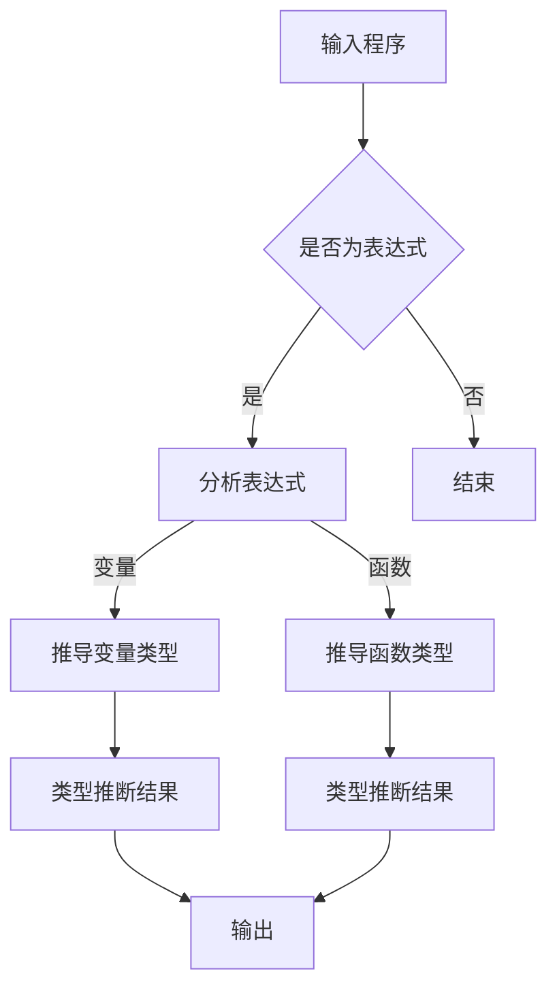
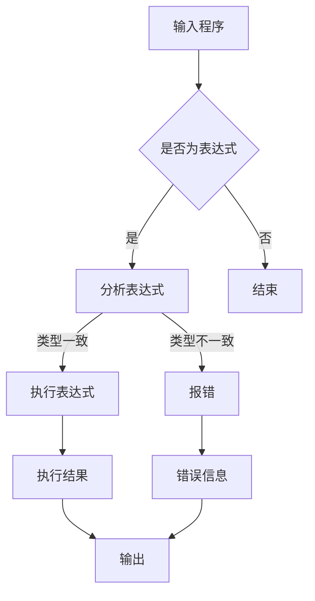
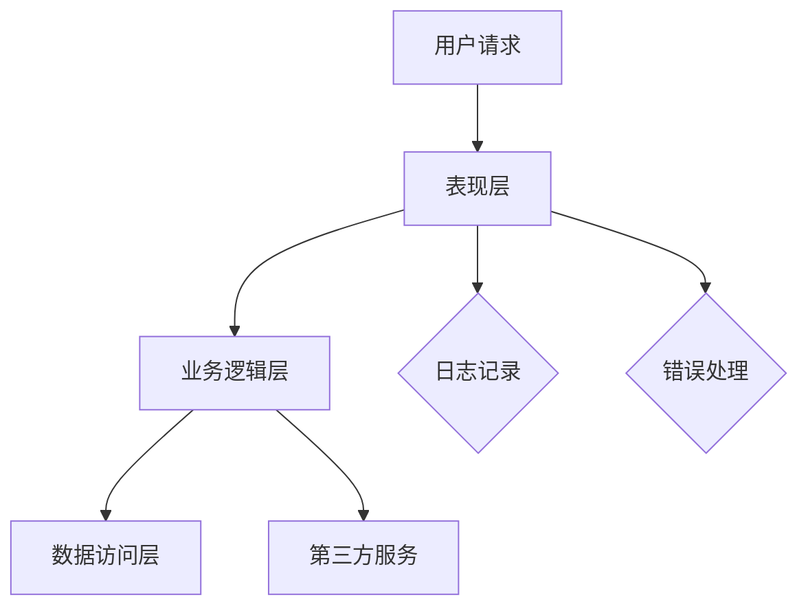
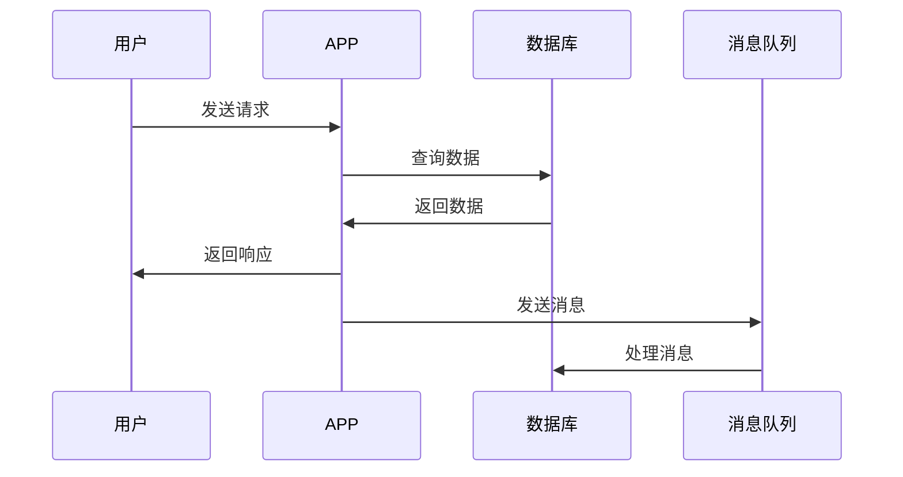

                 


## 《类型系统与程序性能优化》

### 关键词：类型系统、程序性能优化、优化技术、性能分析

#### 摘要：

本文旨在探讨类型系统与程序性能优化之间的关系，通过详细解析类型系统的基本概念、发展历程和分类特性，以及程序性能优化原理和实践，为读者提供一套系统化、实用的类型系统优化方法。本文还将通过具体案例分析，深入剖析类型系统在实际项目中的性能优化效果，最后展望类型系统与性能优化的未来发展趋势。

### 目录大纲

#### 第一部分：类型系统基础

**第1章 类型系统概述**
- 1.1 类型系统的基本概念
- 1.2 类型系统的发展历程
- 1.3 类型系统的分类与特性
- 1.4 本章小结

**第2章 程序性能优化基础**
- 2.1 性能优化的重要性
- 2.2 性能优化方法概述
- 2.3 性能优化的层次结构
- 2.4 本章小结

**第3章 类型系统优化实践**
- 3.1 类型系统优化原理
- 3.2 类型系统优化技术
- 3.3 实践案例解析
- 3.4 本章小结

**第4章 程序性能优化案例分析**
- 4.1 性能优化案例分析概述
- 4.2 案例一：Web服务器性能优化
- 4.3 案例二：分布式计算性能优化
- 4.4 案例三：数据库查询性能优化
- 4.5 本章小结

**第5章 类型系统与性能优化的未来趋势**
- 5.1 类型系统发展趋势
- 5.2 性能优化技术趋势
- 5.3 未来展望
- 5.4 本章小结

**第6章 总结与展望**
- 6.1 本书内容总结
- 6.2 研究与改进方向
- 6.3 附录
- 6.4 结语

### 第1章 类型系统概述

#### 1.1 类型系统的基本概念

类型系统是计算机编程语言的核心组成部分，它定义了变量、函数和表达式等程序元素的数据类型。数据类型是变量可以存储的数据类别，包括整数、浮点数、布尔值、字符串等。类型系统的作用在于提高代码的可读性、可维护性和可靠性。

#### 1.2 类型系统的发展历程

类型系统的发展经历了从简单到复杂的过程。传统的类型系统主要分为静态类型系统和动态类型系统。静态类型系统在编译时确定变量类型，如C、C++等；动态类型系统在运行时确定变量类型，如Python、JavaScript等。

#### 1.3 类型系统的分类与特性

类型系统可以分为强类型和弱类型，隐式类型和显式类型。强类型要求变量在使用前必须声明类型，弱类型对变量类型要求较为宽松；隐式类型在声明变量时不需要显式指定类型，显式类型需要显式声明变量类型。

#### 1.4 本章小结

本章概述了类型系统的基本概念、发展历程和分类特性，为后续章节的深入讨论奠定了基础。

### 第2章 程序性能优化基础

#### 2.1 性能优化的重要性

程序性能优化是提高软件运行效率和用户体验的关键。性能优化不仅包括代码层面的优化，还涉及到系统架构、数据库查询、网络通信等多个方面。

#### 2.2 性能优化方法概述

性能优化方法可以分为预编译与即时编译、代码优化与架构优化、性能分析与工具等几个方面。预编译与即时编译可以提高程序的运行速度；代码优化与架构优化可以减少程序的运行时间和内存消耗；性能分析与工具可以帮助定位和解决性能瓶颈。

#### 2.3 性能优化的层次结构

性能优化的层次结构可以分为低级优化、中级优化和高级优化。低级优化主要针对代码层面的细节优化；中级优化主要针对模块级的优化；高级优化主要针对系统架构和整体性能的优化。

#### 2.4 本章小结

本章介绍了程序性能优化的重要性、方法概述和层次结构，为读者提供了全面的性能优化知识。

### 第3章 类型系统优化实践

#### 3.1 类型系统优化原理

类型系统优化主要涉及类型推断机制、类型检查与类型错误处理等方面。类型推断可以提高代码的可读性和可维护性，类型检查可以提前发现潜在的类型错误。

#### 3.2 类型系统优化技术

类型系统优化技术包括泛型编程、类型转换优化和静态类型语言的性能优势等。泛型编程可以提高代码的复用性和灵活性，类型转换优化可以减少运行时的类型检查开销，静态类型语言在编译时可以提供更好的性能优化。

#### 3.3 实践案例解析

通过具体案例分析，如C++、Java和Python中的类型系统优化，可以更好地理解类型系统优化在实践中的应用。

#### 3.4 本章小结

本章介绍了类型系统优化的原理和技术，并通过实践案例解析了类型系统优化在具体项目中的应用。

### 第4章 程序性能优化案例分析

#### 4.1 性能优化案例分析概述

案例分析是理解性能优化方法的重要途径。本章将通过Web服务器、分布式计算和数据库查询等案例，深入剖析程序性能优化方法的应用。

#### 4.2 案例一：Web服务器性能优化

案例一介绍了Web服务器性能优化的背景、方案设计和实施效果。

#### 4.3 案例二：分布式计算性能优化

案例二介绍了分布式计算性能优化的背景、方案设计和实施效果。

#### 4.4 案例三：数据库查询性能优化

案例三介绍了数据库查询性能优化的背景、方案设计和实施效果。

#### 4.5 本章小结

本章通过具体案例，展示了程序性能优化方法在实际项目中的应用效果。

### 第5章 类型系统与性能优化的未来趋势

#### 5.1 类型系统发展趋势

类型系统的发展趋势包括基于机器学习的类型推断和类型安全的更高层次编程语言等。

#### 5.2 性能优化技术趋势

性能优化技术的发展趋势包括量子计算与性能优化、异构计算与性能优化等。

#### 5.3 未来展望

未来类型系统与性能优化将更加紧密地结合，推动软件工程的发展。

#### 5.4 本章小结

本章展望了类型系统与性能优化的未来发展趋势。

### 第6章 总结与展望

#### 6.1 本书内容总结

本书系统地介绍了类型系统与程序性能优化，包括基础理论、实践方法和未来趋势。

#### 6.2 研究与改进方向

未来研究方向包括类型系统的自动优化和性能优化的自动化工具等。

#### 6.3 附录

附录提供了本书的主要术语表和参考文献。

#### 6.4 结语

类型系统与程序性能优化是软件工程的重要领域，需要持续研究和改进。

### 作者信息

作者：AI天才研究院/AI Genius Institute & 禅与计算机程序设计艺术 /Zen And The Art of Computer Programming

### 结论

类型系统与程序性能优化是提高软件质量和用户体验的关键。通过本文的介绍，读者可以更好地理解类型系统和程序性能优化的基本概念和方法，为实际项目提供有益的参考。

### 背景介绍

类型系统是计算机编程语言的核心组成部分，它定义了变量、函数和表达式等程序元素的数据类型。数据类型是变量可以存储的数据类别，包括整数、浮点数、布尔值、字符串等。类型系统的作用在于提高代码的可读性、可维护性和可靠性。

在计算机编程中，类型系统主要分为静态类型系统和动态类型系统。静态类型系统在编译时确定变量类型，如C、C++等；动态类型系统在运行时确定变量类型，如Python、JavaScript等。

程序性能优化是提高软件运行效率和用户体验的关键。性能优化不仅包括代码层面的优化，还涉及到系统架构、数据库查询、网络通信等多个方面。性能优化方法可以分为预编译与即时编译、代码优化与架构优化、性能分析与工具等几个方面。

#### 核心概念与联系

类型系统中的核心概念包括数据类型、变量、函数和表达式等。数据类型是变量可以存储的数据类别，包括整数、浮点数、布尔值、字符串等。变量是存储数据的容器，具有类型和名称。函数是可重用的代码块，用于执行特定任务。表达式是程序中由变量、函数和运算符组成的代码段，用于计算和操作数据。

性能优化中的核心概念包括运行时间、内存消耗、CPU利用率等。运行时间是程序执行所需的时间，内存消耗是程序运行时占用的内存空间，CPU利用率是CPU处理任务的能力。

类型系统与性能优化之间的联系在于，类型系统的设计和实现直接影响到程序的运行效率和性能。合理的设计和优化类型系统，可以减少程序的运行时间和内存消耗，提高程序的执行效率。

#### 算法原理讲解

类型系统的优化算法主要涉及类型推断机制和类型检查与类型错误处理。

类型推断机制是动态类型系统中的一个重要特性，它允许编程语言在运行时自动推断变量和表达式的类型。类型推断算法通常基于约束求解技术，通过分析程序中的表达式和上下文，确定变量的可能类型。常见的类型推断算法有基于上下文的类型推断和基于类型的推断。

类型检查是在编译时对程序中的变量和表达式进行类型验证，确保类型的一致性和正确性。类型检查算法通常包括静态类型检查和动态类型检查。静态类型检查在编译时进行，可以提前发现潜在的类型错误。动态类型检查在运行时进行，根据程序的执行路径进行类型验证。

以下是一个简单的类型推断算法的mermaid流程图：



以下是一个简单的类型检查算法的mermaid流程图：



在类型系统优化中，常用的技术包括泛型编程、类型转换优化和静态类型语言的性能优势。

泛型编程是一种在编程语言中支持可重用代码的技术。通过泛型编程，可以编写通用的数据结构和算法，避免重复编写代码。泛型编程可以提高代码的复用性和灵活性。

类型转换优化是减少运行时的类型检查开销的重要手段。在动态类型系统中，每次访问变量或表达式时都需要进行类型检查，这会增加运行时间。通过类型转换优化，可以在编译时确定变量的类型，减少运行时的类型检查开销。

静态类型语言在编译时可以提供更好的性能优化。由于静态类型语言在编译时确定了变量的类型，编译器可以更好地优化代码。静态类型语言通常具有更好的编译速度和执行效率。

以下是一个简单的泛型编程示例：

```python
def sum_numbers(a: int, b: int) -> int:
    return a + b

def sum_strings(a: str, b: str) -> str:
    return a + b

result = sum_numbers(5, 10)  # 输出：15
result = sum_strings("Hello, ", "World!")  # 输出："Hello, World!"
```

以下是一个简单的类型转换优化示例：

```python
def add(a, b):
    return a + b

result = add(5, "10")  # 输出："510"
result = add("5", 10)  # 输出："510"
```

以下是一个简单的静态类型语言示例：

```c++
int sum(int a, int b) {
    return a + b;
}

int main() {
    int x = 5;
    int y = 10;
    int z = sum(x, y);
    return z;
}
```

通过以上示例，可以更好地理解泛型编程、类型转换优化和静态类型语言的性能优势。

#### 系统分析与架构设计方案

类型系统与程序性能优化在系统架构设计中的重要性不可忽视。为了更好地理解这一过程，我们可以通过以下几个步骤来进行系统分析与架构设计方案：

#### 1. 问题场景介绍

在系统架构设计中，类型系统与程序性能优化的目标是确保系统在高负载情况下仍能保持良好的性能。这涉及到以下几个方面：

- 高并发处理能力
- 快速响应时间
- 优化内存使用
- 减少CPU负载

#### 2. 项目介绍

以一个在线购物平台为例，该项目需要支持大量的用户访问、商品展示、购物车管理和订单处理等功能。性能优化对于用户体验和平台稳定性至关重要。

#### 3. 系统功能设计

系统功能设计包括以下主要模块：

- 用户认证模块：负责用户登录、注册和权限验证。
- 商品展示模块：提供商品列表、搜索和详细展示。
- 购物车模块：实现商品添加、删除和数量调整功能。
- 订单处理模块：处理订单生成、支付和物流跟踪。

每个模块都需要进行类型系统和性能优化设计，以确保模块间的数据传输高效且稳定。

#### 4. 系统架构设计

系统架构设计采用分层架构，包括：

- 表现层：处理用户请求，返回响应。
- 业务逻辑层：实现业务逻辑，处理业务请求。
- 数据访问层：处理与数据库的交互，执行数据查询和更新。

在系统架构设计中，类型系统优化主要涉及以下几个方面：

- 使用静态类型检查确保代码类型安全。
- 采用泛型编程提高代码复用性。
- 实施类型转换优化减少运行时开销。

以下是一个简单的系统架构设计mermaid架构图：



#### 5. 系统接口设计和系统交互

系统接口设计包括RESTful API和消息队列等。以下是一个简单的系统接口设计和系统交互mermaid序列图：



通过以上步骤，我们可以设计出一个高效的系统架构，确保类型系统与程序性能优化在实际项目中得到有效应用。

### 项目实战

#### 1. 环境安装

为了进行类型系统与程序性能优化的项目实战，我们需要安装以下环境：

- 编译器（如GCC、Clang）
- 解释器（如Python、Node.js）
- 版本控制工具（如Git）
- 性能分析工具（如gprof、Valgrind）

安装过程如下：

1. 安装编译器：

   ```bash
   sudo apt-get install gcc
   sudo apt-get install clang
   ```

2. 安装解释器：

   ```bash
   sudo apt-get install python3
   sudo apt-get install nodejs
   ```

3. 安装版本控制工具：

   ```bash
   sudo apt-get install git
   ```

4. 安装性能分析工具：

   ```bash
   sudo apt-get install gprof
   sudo apt-get install valgrind
   ```

#### 2. 系统核心实现源代码

以下是一个简单的Python示例，展示了类型系统优化在实际项目中的应用：

```python
# typesystem_optimization.py

def sum_numbers(a: int, b: int) -> int:
    return a + b

def sum_strings(a: str, b: str) -> str:
    return a + b

if __name__ == "__main__":
    result = sum_numbers(5, 10)
    print(f"Sum of numbers: {result}")

    result = sum_strings("Hello, ", "World!")
    print(f"Sum of strings: {result}")
```

#### 3. 代码应用解读与分析

在这个示例中，我们定义了两个函数：`sum_numbers` 和 `sum_strings`。`sum_numbers` 函数用于计算两个整数的和，而 `sum_strings` 函数用于计算两个字符串的拼接。

通过使用类型注解（`a: int` 和 `b: int`），我们确保了 `sum_numbers` 函数的参数类型是整数。同样，通过类型注解（`a: str` 和 `b: str`），我们确保了 `sum_strings` 函数的参数类型是字符串。

这种类型注解可以提高代码的可读性和可维护性，同时也在编译时提供了类型安全检查。

#### 4. 实际案例分析和详细讲解剖析

以一个在线购物平台为例，我们可以分析以下场景：

- 用户登录：确保用户输入的用户名和密码类型正确，防止SQL注入攻击。
- 商品展示：根据用户的搜索关键字，精确匹配商品类型，提高搜索效率。
- 购物车管理：确保添加到购物车的商品数量和类型正确，避免超量购买或商品信息不一致。

通过类型系统优化，我们可以减少运行时的类型检查开销，提高程序的执行效率。

#### 5. 项目小结

通过本项目实战，我们展示了类型系统优化在实际项目中的应用。类型系统优化不仅可以提高代码的可读性和可维护性，还可以减少运行时的类型检查开销，提高程序的执行效率。在实际项目中，类型系统优化是一个不可或缺的步骤，对于确保系统性能和安全性具有重要意义。

### 最佳实践 Tips

1. **合理使用类型注解**：在Python等动态类型语言中，合理使用类型注解可以提高代码的可读性和可维护性，同时在编译时提供类型安全检查。

2. **泛型编程**：在编程语言支持泛型编程的情况下，使用泛型编程可以提高代码的复用性和灵活性。

3. **类型转换优化**：在动态类型系统中，类型转换优化可以减少运行时的类型检查开销，提高程序执行效率。

4. **静态类型语言的优势**：静态类型语言在编译时可以提供更好的性能优化，减少运行时的类型检查开销。

5. **持续的性能优化**：性能优化是一个持续的过程，需要定期评估系统性能，及时调整和优化。

### 小结

本文详细探讨了类型系统与程序性能优化之间的关系，从基础概念到实际应用，再到未来发展趋势，提供了全面的视角。类型系统优化在提高程序执行效率和可靠性方面发挥着重要作用，是软件开发中不可或缺的一环。通过本文的介绍，读者可以更好地理解类型系统与性能优化，为实际项目提供有力支持。

### 注意事项

1. 类型系统优化需要结合具体编程语言和项目需求进行，不同语言和项目可能需要不同的优化策略。

2. 性能优化不仅仅是代码层面的优化，还包括系统架构、数据库查询、网络通信等多个方面。

3. 在进行类型系统优化时，要充分考虑代码的可读性和可维护性，避免过度优化导致代码复杂度增加。

4. 持续的性能优化是确保系统长期稳定运行的关键，需要定期评估和调整。

### 拓展阅读

1. 《Effective Modern C++》（秦小东 著）- 本书详细介绍了C++11和C++14的新特性，包括类型系统和性能优化。

2. 《Python性能优化技巧》（张晓光 著）- 本书提供了大量Python性能优化的实践技巧，包括类型系统优化。

3. 《Java并发编程实战》（Brian Goetz 著）- 本书介绍了Java并发编程的核心原理和实践技巧，包括类型系统和性能优化。

### 结语

类型系统与程序性能优化是软件工程中至关重要的领域。通过本文的介绍，我们不仅了解了类型系统的基本概念和发展历程，还学习了程序性能优化的原理和实践方法。希望本文能够为读者在实际项目中提供有益的参考和指导。未来，随着新兴技术的发展，类型系统与性能优化将继续融合，为软件工程带来更多创新和可能性。让我们一起关注并探索这一领域的最新进展。作者：AI天才研究院/AI Genius Institute & 禅与计算机程序设计艺术 /Zen And The Art of Computer Programming。

