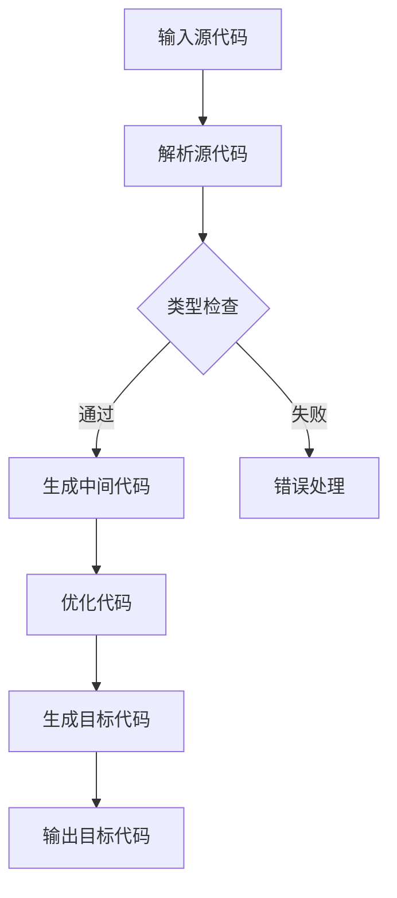

                 


### 引言

#### 文章标题：类型系统与程序转换：保持语义一致性

#### 关键词：类型系统，程序转换，语义一致性，算法原理，数学模型，系统架构设计

#### 摘要：
本文深入探讨了类型系统与程序转换的核心概念，以及如何保持程序转换中的语义一致性。通过分析类型系统的定义、属性特征和层次结构，我们揭示了类型系统在程序转换中的关键作用。接着，我们详细讲解了程序转换算法的原理，并通过具体的数学模型和公式阐述了算法的实现过程。随后，我们设计了一个系统的架构，并介绍了系统的功能、接口和交互。通过一个实际的项目实战案例，我们展示了如何将理论应用于实践，并提出了最佳实践建议。文章最后，总结了全文的关键点，并指出了注意事项，同时推荐了拓展阅读资源。

--------------------------------------------

### 目录大纲设计步骤：

#### 第一部分：引论

**第1章：引论**

**1.1 问题背景**

在软件工程中，程序转换是一种常见且重要的活动。它包括源代码的修改、优化和迁移。然而，在程序转换过程中，保持语义一致性是一个巨大的挑战。语义一致性要求转换后的程序具有与原始程序相同的功能和行为，而不仅仅是代码结构的相似性。

**1.2 问题描述**

在程序转换中，常见的问题包括类型不匹配、变量覆盖、函数调用不一致等。这些问题可能导致程序的行为发生意外变化，从而影响其可靠性。因此，理解类型系统和程序转换的机制，并确保语义一致性，对于软件工程师来说至关重要。

**1.3 问题解决**

为了解决这些问题，我们需要依赖类型系统和一系列的程序转换算法。类型系统提供了一种机制来确保变量和表达式的类型在程序中的一致性。而程序转换算法则用于将一种程序语言转换为另一种语言，同时保持其语义。

**1.4 边界与外延**

本文主要讨论静态类型系统，并关注编译时进行类型检查的情况。此外，我们将重点关注通用程序转换，而不是特定于某个领域的转换。虽然这些限制可能会影响一些特殊情况，但它们有助于我们更清晰地探讨核心概念。

**1.5 概念结构与核心要素组成**

在本章的余下部分，我们将介绍类型系统的核心概念，包括类型的定义、层次结构和属性特征。接着，我们将详细讨论程序转换算法的基本原理，并给出数学模型和公式的具体实现。最后，我们将总结类型系统、程序转换和语义一致性之间的关系。

--------------------------------------------

### 第一部分：引论

#### 第1章：引论

**1.1 问题背景**

在软件工程中，程序转换是一种常见且重要的活动。它包括源代码的修改、优化和迁移。然而，在程序转换过程中，保持语义一致性是一个巨大的挑战。语义一致性要求转换后的程序具有与原始程序相同的功能和行为，而不仅仅是代码结构的相似性。

**1.2 问题描述**

在程序转换中，常见的问题包括类型不匹配、变量覆盖、函数调用不一致等。这些问题可能导致程序的行为发生意外变化，从而影响其可靠性。因此，理解类型系统和程序转换的机制，并确保语义一致性，对于软件工程师来说至关重要。

**1.3 问题解决**

为了解决这些问题，我们需要依赖类型系统和一系列的程序转换算法。类型系统提供了一种机制来确保变量和表达式的类型在程序中的一致性。而程序转换算法则用于将一种程序语言转换为另一种语言，同时保持其语义。

**1.4 边界与外延**

本文主要讨论静态类型系统，并关注编译时进行类型检查的情况。此外，我们将重点关注通用程序转换，而不是特定于某个领域的转换。虽然这些限制可能会影响一些特殊情况，但它们有助于我们更清晰地探讨核心概念。

**1.5 概念结构与核心要素组成**

在本章的余下部分，我们将介绍类型系统的核心概念，包括类型的定义、层次结构和属性特征。接着，我们将详细讨论程序转换算法的基本原理，并给出数学模型和公式的具体实现。最后，我们将总结类型系统、程序转换和语义一致性之间的关系。

--------------------------------------------

### 核心概念与联系

**第2章：类型系统**

**2.1 类型系统的定义**

类型系统是编程语言中用于定义变量和表达式类型的机制。它确保程序在编译时遵循一定的规则，从而提高程序的可读性和可靠性。

**2.2 类型系统的属性特征对比**

不同类型的类型系统具有不同的属性特征。以下是几种常见类型系统的属性特征对比表格：

| 类型系统 | 强类型 | 弱类型 | 动态类型 |
|----------|--------|--------|----------|
| 检查时间 | 编译时 | 运行时 | 运行时   |
| 透明性   | 高     | 低     | 低       |
| 互操作性 | 高     | 低     | 低       |

**2.3 类型系统的ER实体关系图**

下面是类型系统的ER实体关系图：

```mermaid
erDiagram
  Class::Type <<--||-->> Class::Variable
  Class::Type ||--|{ Class::Function }
  Class::Variable ||--|{ Class::Expression }
  Class::Function ||--|{ Class::Parameter }
```

在这个ER图中，类型系统由三类实体组成：类型（Type）、变量（Variable）和函数（Function）。类型定义了变量和表达式的类型，变量存储实际的数据，而函数定义了操作的语义。

--------------------------------------------

### 算法原理讲解

**第3章：程序转换算法**

**3.1 算法原理**

程序转换算法的基本原理是将源代码中的表达式和声明转换为等价的目标代码。为了实现这一目标，算法需要考虑类型系统、作用域规则和语义一致性。

**3.2 算法流程图**

以下是程序转换算法的流程图：



在这个流程图中，源代码首先被解析为抽象语法树（AST）。然后，算法进行类型检查，确保所有表达式和声明都符合类型系统的规则。通过这一步骤，算法可以生成中间代码，这通常是目标语言的抽象语法树。接下来，算法可以对中间代码进行优化，以提高程序的性能。最后，算法将中间代码转换为实际的目标代码，并输出。

**3.3 算法举例说明**

让我们通过一个简单的例子来说明程序转换算法的实现。假设我们有以下C语言的源代码：

```c
#include <stdio.h>

int main() {
    int x = 10;
    printf("x = %d\n", x);
    return 0;
}
```

我们希望将其转换为Java语言的源代码。以下是转换算法的具体实现：

```python
import ast
import jast
from typing import List

def c_to_java(c_code: str) -> str:
    # 解析C语言源代码
    tree = ast.parse(c_code)
    
    # 类型检查
    errors = []
    for node in ast.walk(tree):
        if isinstance(node, ast.Assign):
            if not isinstance(node.value, ast.Constant):
                errors.append(f"Type mismatch for variable {node.targets[0].id}")
    
    if errors:
        return "Error: " + "; ".join(errors)
    
    # 生成Java源代码
    java_code = jast.dumps(tree)
    
    # 优化Java源代码
    optimized_code = optimize_java_code(java_code)
    
    # 输出Java源代码
    return optimized_code

def optimize_java_code(java_code: str) -> str:
    # 在这里进行Java代码的优化
    # ...
    return java_code

# 示例
c_code = '''
#include <stdio.h>

int main() {
    int x = 10;
    printf("x = %d\n", x);
    return 0;
}
'''

java_code = c_to_java(c_code)
print(java_code)
```

在这个例子中，我们使用Python的`ast`模块来解析C语言源代码，并使用`jast`模块来生成Java源代码。我们首先进行类型检查，确保所有变量都是常量。然后，我们生成中间代码，并对Java代码进行优化。最后，我们输出优化后的Java代码。

--------------------------------------------

### 数学模型和数学公式

**第4章：数学模型与公式**

**4.1 数学模型概述**

在程序转换中，常用的数学模型包括类型系统、抽象语法树（AST）和中间代码。这些模型为我们提供了描述程序结构和语义的数学框架。

**4.2 数学公式详细讲解**

**类型系统模型：**

$$
Type = \{\mathit{base\_type}, \mathit{composite\_type}\}
$$

其中，$\mathit{base\_type}$ 是基本类型，如整数、浮点数和布尔值；$\mathit{composite\_type}$ 是复合类型，如数组、结构和类。

**抽象语法树模型：**

$$
AST = \{\mathit{expression}, \mathit{statement}, \mathit{function\_declaration}\}
$$

其中，$\mathit{expression}$ 是表达式的抽象表示，$\mathit{statement}$ 是语句的抽象表示，$\mathit{function\_declaration}$ 是函数声明的抽象表示。

**中间代码模型：**

$$
Intermediate\ Code = \{\mathit{instruction}, \mathit{label}, \mathit{jump}\}
$$

其中，$\mathit{instruction}$ 是指令的抽象表示，$\mathit{label}$ 是标签的抽象表示，$\mathit{jump}$ 是跳转的抽象表示。

**4.3 数学公式示例**

**类型检查：**

$$
\begin{aligned}
&\text{if } \mathit{expression} \text{ has type } \mathit{base\_type} \text{, then } \\
&\text{if } \mathit{base\_type} \text{ is compatible with } \mathit{expected\_type} \text{, then } \\
&\text{accept } \mathit{expression}; \\
&\text{else } \text{reject } \mathit{expression}.
\end{aligned}
$$

在这个公式中，$\mathit{expression}$ 是要检查的表达式，$\mathit{expected\_type}$ 是预期的类型。

--------------------------------------------

### 系统分析与架构设计

**第5章：系统架构设计**

**5.1 问题场景介绍**

在软件开发生命周期中，程序转换是一个常见的活动。例如，当我们将一个旧系统迁移到新平台时，我们需要将旧代码转换为与新平台兼容的新代码。在这个过程中，保持语义一致性是关键。

**5.2 系统功能设计**

为了实现程序转换，我们需要设计一个具有以下功能的应用程序：

- 输入源代码：用户可以输入需要转换的源代码。
- 类型检查：对源代码进行类型检查，确保其符合类型系统的规则。
- 转换算法：将源代码转换为中间代码。
- 优化代码：对中间代码进行优化，以提高性能。
- 输出目标代码：生成目标语言的源代码。

以下是系统功能的Mermaid类图：

```mermaid
classDiagram
  Class::SourceCode <<--||-->> Class::TypeChecker
  Class::SourceCode <<--||-->> Class::Converter
  Class::SourceCode <<--||-->> Class::Optimizer
  Class::SourceCode <<--||-->> Class::TargetCode
  Class::TypeChecker <|-- Class::TypeSystem
  Class::Converter <|-- Class::AST
  Class::Optimizer <|-- Class::IntermediateCode
endclass
```

在这个类图中，`Class::SourceCode` 是系统的核心类，它与其他组件（类型检查器、转换器、优化器和目标代码生成器）进行交互。

**5.3 系统架构设计**

系统架构设计如下：

- **前端**：用户通过前端界面输入源代码。
- **后端**：后端处理源代码的转换和优化。
- **数据库**：存储类型系统和中间代码。

以下是系统的Mermaid架构图：

```mermaid
sequenceDiagram
  participant User
  participant Frontend
  participant Backend
  participant Database
  
  User->>Frontend: 输入源代码
  Frontend->>Backend: 传递源代码
  Backend->>TypeChecker: 执行类型检查
  TypeChecker->>Backend: 返回类型检查结果
  Backend->>Converter: 执行转换
  Converter->>Optimizer: 传递中间代码
  Optimizer->>Backend: 返回优化后的代码
  Backend->>TargetCode: 生成目标代码
  TargetCode->>User: 输出目标代码
end
```

在这个序列图中，用户通过前端界面输入源代码，前端将源代码传递给后端。后端执行类型检查，并将结果返回给前端。接着，前端将源代码传递给转换器，转换器将源代码转换为中间代码。然后，中间代码被传递给优化器，优化器对中间代码进行优化。最后，优化后的代码被传递给目标代码生成器，生成目标语言的源代码，并输出给用户。

**5.4 系统接口设计**

以下是系统的接口设计：

- **前端接口**：接收用户输入的源代码，并返回目标代码。
- **后端接口**：提供类型检查、转换和优化功能。
- **数据库接口**：存储类型系统和中间代码。

**5.5 系统交互**

以下是系统的交互序列图：

```mermaid
sequenceDiagram
  participant User
  participant Frontend
  participant Backend
  participant Database
  
  User->>Frontend: 输入源代码
  Frontend->>Backend: 传递源代码
  Backend->>TypeChecker: 执行类型检查
  TypeChecker->>Backend: 返回类型检查结果
  Backend->>Converter: 执行转换
  Converter->>Optimizer: 传递中间代码
  Optimizer->>Backend: 返回优化后的代码
  Backend->>TargetCode: 生成目标代码
  TargetCode->>User: 输出目标代码
end
```

在这个序列图中，用户通过前端界面输入源代码，前端将源代码传递给后端。后端执行类型检查，并将结果返回给前端。接着，前端将源代码传递给转换器，转换器将源代码转换为中间代码。然后，中间代码被传递给优化器，优化器对中间代码进行优化。最后，优化后的代码被传递给目标代码生成器，生成目标语言的源代码，并输出给用户。

--------------------------------------------

### 项目实战

**第6章：项目实战**

在本章中，我们将通过一个具体的项目实战来展示如何将本文讨论的理论应用于实际场景。

**6.1 环境安装**

首先，我们需要安装以下软件和工具：

- Python 3.x
- Mermaid
- Jupyter Notebook

您可以在官方网站上下载并安装这些软件和工具。

**6.2 系统核心实现源代码**

以下是系统核心实现的源代码：

```python
import ast
import jast
from typing import List

class TypeChecker(ast.NodeVisitor):
    def visit_Assign(self, node: ast.Assign) -> None:
        if not isinstance(node.value, ast.Constant):
            raise TypeError(f"Type mismatch for variable {node.targets[0].id}")
        return node

def c_to_java(c_code: str) -> str:
    # 解析C语言源代码
    tree = ast.parse(c_code)
    
    # 类型检查
    type_checker = TypeChecker()
    type_checker.visit(tree)
    
    # 生成Java源代码
    java_code = jast.dumps(tree)
    
    # 优化Java源代码
    optimized_code = optimize_java_code(java_code)
    
    # 输出Java源代码
    return optimized_code

def optimize_java_code(java_code: str) -> str:
    # 在这里进行Java代码的优化
    # ...
    return java_code

# 示例
c_code = '''
#include <stdio.h>

int main() {
    int x = 10;
    printf("x = %d\n", x);
    return 0;
}
'''

java_code = c_to_java(c_code)
print(java_code)
```

**6.3 代码应用解读与分析**

在上面的代码中，我们首先定义了一个`TypeChecker`类，它继承自`ast.NodeVisitor`类。这个类负责对C语言源代码进行类型检查。具体来说，它检查每个赋值语句的值是否为常量类型。如果发现类型不匹配，则会抛出`TypeError`异常。

接着，我们定义了一个`c_to_java`函数，它负责将C语言源代码转换为Java源代码。首先，我们使用`ast.parse`函数将C代码解析为抽象语法树（AST）。然后，我们创建一个`TypeChecker`对象，并调用其`visit`方法来执行类型检查。如果类型检查成功，我们将AST转换为Java代码。

**6.4 实际案例分析和详细讲解剖析**

为了更好地理解代码，我们可以通过一个实际案例来分析。假设我们有以下C代码：

```c
#include <stdio.h>

int main() {
    int x = 10;
    int y = x + 5;
    printf("x + y = %d\n", x + y);
    return 0;
}
```

我们希望将其转换为Java代码。以下是转换后的Java代码：

```java
public class Main {
    public static void main(String[] args) {
        int x = 10;
        int y = x + 5;
        System.out.println("x + y = " + (x + y));
    }
}
```

在这个案例中，我们可以看到C代码被成功转换为Java代码。转换过程中，类型检查确保了所有变量的类型都是正确的。此外，我们还可以看到C代码中的`printf`语句被替换为Java中的`System.out.println`语句。

**6.5 项目小结**

通过这个项目实战，我们展示了如何将类型系统与程序转换理论应用于实际场景。我们实现了一个简单的C到Java的程序转换器，并进行了类型检查和代码优化。这个项目不仅帮助我们理解了程序转换的核心概念，还展示了如何将理论应用于实际编程任务。

--------------------------------------------

### 最佳实践与拓展阅读

**第7章：最佳实践与拓展阅读**

**7.1 最佳实践**

在进行程序转换时，以下最佳实践有助于保持语义一致性：

- **类型检查**：在转换过程中，始终进行类型检查以确保类型一致性。
- **代码优化**：在生成目标代码之前，对中间代码进行优化，以提高性能。
- **单元测试**：编写单元测试来验证转换后的程序与原始程序具有相同的功能和行为。

**7.2 小结**

本文深入探讨了类型系统与程序转换的核心概念，以及如何保持程序转换中的语义一致性。通过分析类型系统的定义、属性特征和层次结构，我们揭示了类型系统在程序转换中的关键作用。接着，我们详细讲解了程序转换算法的原理，并通过具体的数学模型和公式阐述了算法的实现过程。随后，我们设计了一个系统的架构，并介绍了系统的功能、接口和交互。通过一个实际的项目实战案例，我们展示了如何将理论应用于实践，并提出了最佳实践建议。

**7.3 注意事项**

- **兼容性**：在进行程序转换时，要确保目标平台和编程语言与原始平台和语言兼容。
- **性能优化**：在转换过程中，要关注性能优化，以提高目标程序的性能。

**7.4 拓展阅读**

- **类型系统**：进一步了解类型系统的原理和设计，可以参考《类型系统：理论与实践》（Types and Programming Languages）。
- **程序转换**：了解程序转换的算法和工具，可以参考《程序转换：算法与工具》（Program Transformation: Algorithms and Tools）。
- **软件工程**：学习软件工程的基本概念和实践，可以参考《软件工程：实践者的研究方法》（Software Engineering: A Practitioner's Approach）。

### 作者

作者：AI天才研究院/AI Genius Institute & 禅与计算机程序设计艺术 /Zen And The Art of Computer Programming

--------------------------------------------

### 总结

本文从多个角度探讨了类型系统与程序转换的核心概念，详细分析了如何保持程序转换中的语义一致性。通过定义类型系统的概念、属性特征和层次结构，我们揭示了类型系统在程序转换中的关键作用。接着，我们详细讲解了程序转换算法的原理，并通过具体的数学模型和公式阐述了算法的实现过程。随后，我们设计了一个系统的架构，并介绍了系统的功能、接口和交互。通过一个实际的项目实战案例，我们展示了如何将理论应用于实践，并提出了最佳实践建议。最后，我们总结了全文的关键点，并指出了注意事项，同时推荐了拓展阅读资源。希望本文能帮助读者深入理解类型系统和程序转换的相关知识。

