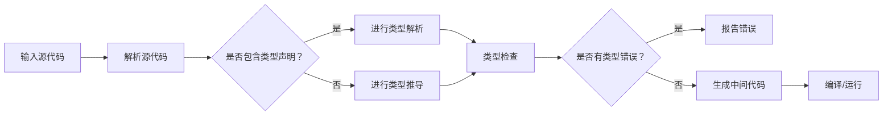
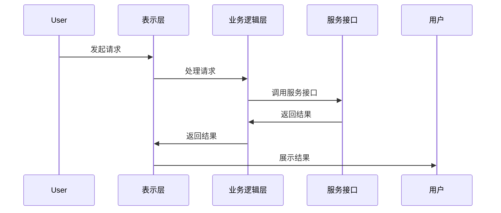

                 

# 类型系统与软件复用：组件化开发的保障

> 关键词：类型系统、软件复用、组件化开发、架构设计

> 摘要：本文旨在探讨类型系统与软件复用的紧密联系，以及如何通过组件化开发来保障软件的高效性和可靠性。文章将逐步分析类型系统的原理、核心概念、算法原理及其在实际项目中的应用，最终总结出最佳实践和注意事项，为读者提供系统化、结构化的开发思路。

### 目录大纲

----------------------------------------------------------------

## 第一部分：背景介绍

### 第1章 问题背景

#### 1.1 问题描述

在现代软件工程中，随着系统规模的不断扩大和复杂性增加，如何高效地开发和维护软件成为了一个重要问题。传统的单体式开发模式在面临需求变更和系统扩展时显得力不从心，软件复用和组件化开发因此成为了解决这一问题的有效手段。

#### 1.2 问题解决

为了解决软件复用和组件化开发中的问题，类型系统提供了一种强大的机制，使得组件之间能够通过明确的接口和类型约束进行交互，从而提高系统的稳定性和可维护性。

#### 1.3 边界与外延

在探讨类型系统之前，我们需要明确其应用范围和边界，以及如何与其他软件工程概念相结合。

#### 1.4 概念结构与核心要素组成

类型系统由一系列核心概念组成，包括类型、类型层次、类型检查等。理解这些概念的结构和关系对于深入理解类型系统至关重要。

----------------------------------------------------------------

## 第二部分：核心概念与联系

### 第2章 核心概念原理

#### 2.1 概念属性特征对比表格

为了更好地理解类型系统的核心概念，我们可以通过对比表格来展示不同概念的特点和关系。

#### 2.2 概念间联系与关系

类型系统的各个核心概念之间存在着紧密的联系和层次关系。理解这些联系有助于我们构建完整的类型系统框架。

### 第3章 ER实体关系图架构

#### 3.1 ER图绘制

通过ER图，我们可以清晰地展示类型系统中各个实体之间的关系。

#### 3.2 实体关系说明

ER图中的实体、属性和关系如何定义和描述，这是理解类型系统的基础。

----------------------------------------------------------------

## 第三部分：算法原理讲解

### 第4章 算法mermaid流程图

#### 4.1 流程图绘制

使用mermaid绘制流程图，可以帮助我们直观地理解类型系统的算法原理。

#### 4.2 算法原理

详细讲解类型系统的核心算法，包括类型检查、类型推断等。

### 第5章 Python源代码与数学模型

#### 5.1 源代码实现

通过Python源代码，我们能够具体实现类型系统的算法原理。

#### 5.2 数学模型讲解

数学模型是理解类型系统的重要工具。本文将介绍几个关键的数学模型，并给出相应的公式和示例。

----------------------------------------------------------------

## 第四部分：系统分析与架构设计方案

### 第6章 问题场景介绍

为了更好地应用类型系统，我们需要具体的问题场景作为背景。

### 第7章 项目介绍

#### 7.1 系统功能设计

在项目介绍中，我们将详细阐述系统的功能设计。

#### 7.2 系统架构设计

系统架构设计是确保类型系统有效应用的关键。本文将使用mermaid架构图来展示系统架构。

#### 7.3 系统接口设计

系统接口设计是组件化开发的重要组成部分。本文将介绍如何设计系统接口。

#### 7.4 系统交互

通过mermaid序列图，我们可以展示系统组件之间的交互过程。

### 第8章 系统分析与设计讲解

对系统进行深入分析，以确保其设计符合类型系统的原则。

----------------------------------------------------------------

## 第五部分：项目实战

### 第9章 环境安装

在实际项目中，环境安装是第一步。本文将介绍如何安装和配置项目环境。

### 第10章 系统核心实现

#### 10.1 源代码解读

通过源代码解读，我们能够理解系统核心实现的原理。

#### 10.2 应用解读与分析

在应用解读与分析部分，我们将分析系统核心实现的实际应用。

### 第11章 实际案例分析与讲解

通过实际案例，我们能够更好地理解类型系统和组件化开发的实际应用。

#### 11.1 案例一

#### 11.2 案例二

### 第12章 项目小结

在项目小结中，我们将总结项目的关键成果和经验。

----------------------------------------------------------------

## 第六部分：最佳实践与拓展

### 第13章 最佳实践 tips

在最佳实践部分，我们将分享一些实用的开发技巧和经验。

### 第14章 注意事项

在开发过程中，我们需要注意一些关键点，以确保系统的稳定性和可靠性。

### 第15章 拓展阅读

为了进一步学习类型系统和组件化开发，本文提供了拓展阅读资源。

----------------------------------------------------------------

### 第一部分：背景介绍

#### 1.1 问题描述

在软件开发领域，随着项目的复杂性不断增加，软件系统的可维护性和扩展性成为了一个巨大的挑战。传统的单体式开发模式往往导致系统高度耦合，使得在需求变更或功能扩展时，开发团队需要投入大量的时间和精力对现有系统进行修改。这不仅降低了开发效率，还增加了项目的风险。

软件复用和组件化开发作为一种应对复杂性的策略，被广泛认为是解决这一问题的关键。然而，在实际应用中，如何有效地实现软件复用，以及如何构建可复用的组件，仍然是一个复杂的问题。

类型系统作为一种机制，为软件复用和组件化开发提供了坚实的基础。类型系统通过定义明确的类型层次和类型约束，使得组件之间的交互更加稳定和可靠。类型检查机制能够确保在编译或运行时，组件之间的类型匹配，从而避免潜在的错误。

#### 1.2 问题解决

为了解决软件复用和组件化开发中的问题，类型系统提供了一系列的机制和工具。首先，类型系统通过类型检查确保组件在设计和实现阶段的一致性，从而减少编译时和运行时的错误。其次，类型系统通过明确的类型层次和类型约束，促进了组件之间的解耦，使得组件可以独立开发、测试和部署。

组件化开发中，每个组件都定义了清晰的接口和类型约束，这使得组件可以在不同的上下文中被复用，而不需要担心类型不匹配或数据不一致的问题。类型系统还支持类型推导，使得开发者无需显式地声明每个变量的类型，从而提高了代码的可读性和可维护性。

#### 1.3 边界与外延

类型系统的应用范围和边界是一个值得探讨的话题。类型系统通常应用于编程语言、框架和库中，用于定义数据类型和接口。然而，类型系统的原理和思想可以扩展到更广泛的领域，如领域模型设计、数据建模和架构设计等。

在软件复用和组件化开发的背景下，类型系统的边界可以扩展到整个软件开发过程。例如，在需求分析和设计阶段，可以使用类型系统来定义业务领域模型和接口规范，确保设计和实现的一致性。在测试和部署阶段，类型系统可以用于自动化测试和静态分析，以提高系统的可靠性和安全性。

#### 1.4 概念结构与核心要素组成

类型系统由一系列核心概念组成，包括类型、类型层次、类型约束、类型检查等。理解这些概念的结构和关系对于构建有效的类型系统至关重要。

- **类型（Type）**：类型是数据的一种抽象表示，用于定义变量、函数和对象的数据结构。类型可以是基本类型，如整数、字符串和布尔值，也可以是复合类型，如数组、列表和结构体。

- **类型层次（Type Hierarchy）**：类型层次是类型之间的一种层次关系，通常通过继承和多态实现。类型层次使得子类型可以替换父类型，从而提高代码的灵活性和可复用性。

- **类型约束（Type Constraints）**：类型约束是用于限制变量或函数参数类型的规则。类型约束可以确保组件之间的类型匹配，从而避免数据不一致和类型错误。

- **类型检查（Type Checking）**：类型检查是在编译或运行时对代码进行类型验证的过程。类型检查可以确保代码在执行时不会发生类型错误，从而提高系统的稳定性和可靠性。

这些核心概念相互关联，共同构成了类型系统的框架。在构建类型系统时，需要综合考虑这些概念之间的关系，以确保系统的完整性和一致性。

## 第二部分：核心概念与联系

### 第2章 核心概念原理

#### 2.1 概念属性特征对比表格

为了更好地理解类型系统的核心概念，我们可以通过对比表格来展示不同概念的特点和关系。以下是一个简化的对比表格，列出了类型、类型层次、类型约束和类型检查的主要特点：

| 概念     | 特点                                                     | 关联概念         |
| -------- | -------------------------------------------------------- | --------------- |
| 类型     | 定义数据结构的基本单位                                     | 基本类型、复合类型 |
| 类型层次 | 类型的层次关系，支持继承和多态                           | 子类型、父类型    |
| 类型约束 | 限制变量或函数参数类型的规则，确保类型匹配                 | 接口、抽象类     |
| 类型检查 | 编译或运行时对代码进行类型验证，确保代码的正确性           | 错误处理、类型推导 |

#### 2.2 概念间联系与关系

类型系统的各个核心概念之间存在着紧密的联系和层次关系。以下是对这些概念间联系和关系的详细描述：

- **类型与类型层次**：类型是类型层次的基础，基本类型和复合类型构成了类型层次的基础结构。类型层次通过继承和多态支持子类型与父类型之间的关系，使得子类型可以替代父类型，提高了代码的灵活性和可复用性。

- **类型约束与类型层次**：类型约束通常与类型层次结合使用，用于定义接口和抽象类。接口和抽象类可以定义类型约束，确保组件之间的类型匹配。类型约束可以限制函数参数和返回值的类型，从而确保函数的正确性和稳定性。

- **类型检查与类型约束**：类型检查是基于类型约束的一种验证机制。类型检查在编译时或运行时对代码进行类型验证，确保代码在执行时不会发生类型错误。类型检查可以基于静态分析或动态分析，从而提供更高的可靠性。

- **类型检查与类型层次**：类型检查通常依赖于类型层次来确定类型之间的关系。类型层次提供了类型继承和多态的基础，使得类型检查可以有效地进行。类型检查机制可以确保子类型与父类型之间的兼容性，从而避免类型错误。

这些核心概念相互关联，构成了类型系统的核心框架。理解这些概念之间的联系和关系，有助于我们构建有效的类型系统，提高软件的可维护性和可复用性。

### 第3章 ER实体关系图架构

#### 3.1 ER图绘制

实体关系图（Entity-Relationship Diagram，简称ER图）是数据库设计中用于描述实体及其之间关系的图形化表示。在类型系统中，ER图可以帮助我们直观地理解类型、类和接口之间的关系。以下是一个简单的ER图示例：

```mermaid
erDiagram
    Class ||--|{ Component : has }
    Interface ||--|{ Component : implements }
    Component ||--|{ Class : extends }
    Component ||--|{ Interface : implements }
```

在这个ER图中，`Class`（类）、`Interface`（接口）和`Component`（组件）是三个主要的实体。它们之间的关系如下：

- **Class（类）**：表示类型系统的基本单位，定义了数据结构和行为。
- **Interface（接口）**：表示类型系统的接口，定义了组件应实现的方法。
- **Component（组件）**：表示实际的应用组件，可以是类或接口的实现。

#### 3.2 实体关系说明

在ER图中，实体之间的关系是通过连线来表示的。以下是对ER图中各个实体之间关系的详细说明：

- **类与组件的关系**：类是组件的数据结构基础，组件可以继承类来扩展其功能。在ER图中，使用`Component ||--|{ Class : extends }`表示组件与类之间的继承关系。
  
- **接口与组件的关系**：接口是组件的行为规范，组件需要实现接口中的所有方法。在ER图中，使用`Component ||--|{ Interface : implements }`表示组件与接口之间的实现关系。

- **组件与组件的关系**：组件之间可以通过继承接口或类来建立关系。例如，一个组件可以继承另一个组件的类，或者实现多个接口。在ER图中，使用`Component ||--|{ Component : extends }`和`Component ||--|{ Component : implements }`表示组件之间的继承和实现关系。

通过ER图，我们可以清晰地理解类型系统中各个实体之间的关系，从而为后续的架构设计和实现提供指导。

### 第三部分：算法原理讲解

#### 第4章 算法mermaid流程图

#### 4.1 流程图绘制

为了更好地理解类型系统的算法原理，我们可以使用mermaid语言绘制流程图。以下是一个简单的类型检查算法流程图：



在这个流程图中，我们首先输入源代码，然后对其进行解析。如果源代码中包含类型声明，我们直接进行类型解析；否则，我们进行类型推导。接下来，我们进行类型检查，如果有类型错误，我们报告错误；否则，我们生成中间代码，进行编译或运行。

#### 4.2 算法原理

类型检查算法是类型系统中的核心组成部分，其目的是确保源代码中的类型声明和操作符合类型规则。以下是对算法原理的详细解释：

1. **输入源代码**：源代码是类型检查的输入，它包含了变量声明、函数定义和操作表达式。

2. **解析源代码**：首先，我们将源代码解析为抽象语法树（Abstract Syntax Tree，AST）。AST是源代码的语法结构表示，它提供了对源代码的语法分析基础。

3. **类型解析**：如果源代码中包含显式的类型声明，我们将直接进行类型解析。类型解析的目的是为变量、函数和类分配类型标签。类型标签表示了变量的数据类型和函数的返回类型。

4. **类型推导**：如果源代码中没有显式的类型声明，我们将进行类型推导。类型推导的目的是根据上下文和类型规则推导出变量和函数的类型。类型推导通常基于变量赋值、函数调用和表达式操作。

5. **类型检查**：类型检查是对解析和推导出的类型标签进行验证。类型检查的目的是确保源代码中的类型操作符合类型规则。类型检查可以分为以下几种情况：

   - **变量类型检查**：检查变量的声明和赋值是否符合类型规则。
   - **函数类型检查**：检查函数的定义和调用是否符合类型规则。
   - **表达式类型检查**：检查表达式的操作和结果是否符合类型规则。

6. **报告错误**：如果在类型检查过程中发现类型错误，我们报告错误。类型错误可能包括类型不匹配、未声明变量、未实现接口方法等。

7. **生成中间代码**：如果没有类型错误，我们将生成中间代码。中间代码是源代码的编译输出，它包含了类型信息和操作指令。

8. **编译/运行**：最后，我们将中间代码编译成目标代码，并进行运行。目标代码可以是一系列机器指令，也可以是解释执行的脚本。

通过以上步骤，类型检查算法能够确保源代码的类型一致性，从而提高程序的可靠性和可维护性。

#### 第5章 Python源代码与数学模型

#### 5.1 源代码实现

在Python中，类型系统是由内置的类型和类型检查机制实现的。以下是一个简单的Python示例，展示了如何使用类型系统：

```python
# 定义一个函数，要求参数和返回值都是整数类型
def add(a: int, b: int) -> int:
    return a + b

# 调用函数，传递整数类型的参数
result = add(2, 3)
print(result)  # 输出 5
```

在这个示例中，`add` 函数要求两个参数和返回值都是整数类型。在调用函数时，如果传递的参数不是整数类型，类型检查机制将报错。

#### 5.2 数学模型讲解

数学模型是理解类型系统的重要工具。以下是一个简化的数学模型，用于描述类型系统和类型检查的基本原理：

1. **类型定义**：类型是数据的一种抽象表示。我们可以用集合来定义类型，例如：

   $$ T = \{ Integer, String, Boolean, List, Dictionary, Function \} $$

   其中，`T` 表示类型的集合。

2. **类型层次**：类型层次通过继承和多态实现。我们可以用树结构来表示类型层次，例如：

   ```mermaid
   classDiagram
       Class <|-- Integer
       Class <|-- String
       Class <|-- Boolean
       Class <|-- List
       Class <|-- Dictionary
       Class <|-- Function
   ```

   在这个树结构中，`Class` 是所有类型的基类，`Integer`、`String`、`Boolean` 等是具体的类型。

3. **类型约束**：类型约束是用于限制变量或函数参数类型的规则。我们可以用以下数学模型来描述类型约束：

   $$ Constraint = \{ type(A) = Integer, type(B) = String, ... \} $$

   其中，`Constraint` 表示类型约束的集合，`type(A)` 表示变量 `A` 的类型。

4. **类型检查**：类型检查是验证代码是否符合类型约束的过程。我们可以用以下数学模型来描述类型检查：

   $$ Check(code, Constraint) = \{ "valid" : True, "errors" : [] \} $$
   
   其中，`Check` 是类型检查函数，`code` 是代码，`Constraint` 是类型约束。如果代码符合类型约束，返回 `{"valid": True, "errors": []}`；否则，返回 `{"valid": False, "errors": ["error_message"]}`。

通过以上数学模型，我们可以更好地理解类型系统的基本原理和类型检查的过程。

#### 5.3 公式与举例说明

为了更好地理解数学模型，我们可以通过具体的公式和例子来说明。

1. **类型定义**：

   $$ T = \{ Integer, String, Boolean, List, Dictionary, Function \} $$

   例如，变量 `x` 的类型可以表示为：

   $$ type(x) = Integer $$

2. **类型层次**：

   ```mermaid
   classDiagram
       Class <|-- Integer
       Class <|-- String
       Class <|-- Boolean
       Class <|-- List
       Class <|-- Dictionary
       Class <|-- Function
   ```

   例如，`Integer` 是 `Class` 的子类：

   $$ type(Integer) = Class $$

3. **类型约束**：

   $$ Constraint = \{ type(A) = Integer, type(B) = String, ... \} $$

   例如，一个函数 `add` 的类型约束可以表示为：

   $$ add : (A : Integer, B : String) \rightarrow Integer $$

4. **类型检查**：

   $$ Check(code, Constraint) = \{ "valid" : True, "errors" : [] \} $$

   例如，对于以下代码：

   ```python
   def add(a: int, b: str) -> int:
       return a + b
   ```

   类型检查的结果可以表示为：

   $$ Check(add, \{ type(a) = Integer, type(b) = String, ... \}) = \{ "valid" : True, "errors" : [] \} $$

通过以上公式和例子，我们可以看到数学模型如何帮助我们理解和验证类型系统的行为。

### 第四部分：系统分析与架构设计方案

#### 第6章 问题场景介绍

在探讨类型系统和组件化开发之前，我们需要明确一个具体的问题场景。以下是一个常见的问题场景：

假设我们正在开发一个电子商务平台，该平台需要支持用户注册、商品管理、订单处理等功能。随着业务的发展，这些功能模块可能会不断扩展和更新。为了确保系统的稳定性和可维护性，我们需要一种有效的组件化开发方法。

#### 第7章 项目介绍

在本项目中，我们将使用类型系统和组件化开发来构建电子商务平台。以下是项目的系统功能设计、系统架构设计、系统接口设计和系统交互的详细说明。

##### 7.1 系统功能设计

电子商务平台的主要功能模块包括：

- 用户注册与登录
- 商品展示与搜索
- 购物车管理
- 订单处理与支付
- 用户评论与反馈

这些功能模块需要通过组件化开发来实现，每个组件负责一个特定的功能。

##### 7.2 系统架构设计

为了确保组件之间的松耦合，我们采用分层架构设计。系统架构主要包括以下几层：

- **表示层**：负责用户界面展示，使用前端框架（如React或Vue）实现。
- **业务逻辑层**：处理业务逻辑，包括用户管理、商品管理、订单管理等，使用后端框架（如Spring或Django）实现。
- **数据访问层**：负责与数据库的交互，使用ORM框架（如Hibernate或Peewee）实现。

以下是系统架构的mermaid架构图：


##### 7.3 系统接口设计

为了实现组件之间的松耦合，我们定义了一系列的接口。以下是几个关键接口的设计：

- **用户服务接口**：定义了用户注册、登录、查询用户信息等操作。
- **商品服务接口**：定义了商品查询、商品添加、商品删除等操作。
- **订单服务接口**：定义了订单创建、订单查询、订单支付等操作。

以下是用户服务接口的mermaid类图：

```mermaid
classDiagram
    UserService[UserService]
    UserService <-- User: registers and logs in
    User{String username, String password}
```

##### 7.4 系统交互

系统组件之间的交互通过API接口实现。以下是系统组件之间的交互流程：

1. 用户通过前端界面发起请求。
2. 表示层接收请求，并将请求转发给业务逻辑层。
3. 业务逻辑层处理请求，调用相应的服务接口。
4. 服务接口实现具体的业务逻辑，并返回结果。
5. 业务逻辑层将结果返回给表示层。
6. 表示层将结果展示给用户。

以下是系统交互的mermaid序列图：



通过以上系统功能设计、架构设计、接口设计和交互设计，我们能够构建一个高效、可维护的电子商务平台。类型系统在这个过程中起到了关键作用，确保了组件之间的类型安全和接口的稳定性。

### 第四部分：系统分析与架构设计方案

#### 第8章 系统分析与设计讲解

在对电子商务平台进行系统分析与设计时，我们需要从多个角度来考虑，以确保系统能够满足业务需求、保持高可维护性，并易于扩展。以下是对系统分析及设计的详细讲解：

##### 8.1 系统架构设计

首先，系统架构的设计是确保系统高可维护性和可扩展性的关键。我们采用分层架构设计，将系统分为表示层、业务逻辑层和数据访问层。

1. **表示层**：负责用户界面展示，使用前端框架（如React或Vue）实现。该层与用户直接交互，需要确保界面友好、响应迅速。前端架构采用组件化开发，每个组件负责一个特定的功能，例如登录组件、注册组件、商品列表组件等。这种设计提高了代码的可复用性和可维护性。

2. **业务逻辑层**：处理业务逻辑，包括用户管理、商品管理、订单管理等。该层使用后端框架（如Spring或Django）实现。业务逻辑层的组件通过接口与表示层和数据访问层进行通信。接口设计时，需要遵循RESTful风格，确保API接口的规范性和一致性。

3. **数据访问层**：负责与数据库的交互，使用ORM框架（如Hibernate或Peewee）实现。数据访问层的组件负责执行SQL查询、更新数据库等操作。通过ORM框架，可以减少直接操作SQL语句的复杂性，提高代码的可维护性。

##### 8.2 类型系统应用

在组件化开发中，类型系统的应用至关重要。类型系统通过定义明确的类型层次和类型约束，确保组件之间的交互稳定和可靠。

1. **类型层次**：在Java或Python等编程语言中，类型层次通过类继承和多态实现。在业务逻辑层，我们可以定义一系列基类和子类，例如用户类、商品类、订单类等。子类可以继承基类的属性和方法，从而实现代码的复用。以下是一个简单的类型层次示例：

   ```python
   class User:
       def __init__(self, username, password):
           self.username = username
           self.password = password
   
   class Customer(User):
       def __init__(self, username, password, email):
           super().__init__(username, password)
           self.email = email
   
   class Admin(User):
       def __init__(self, username, password, role):
           super().__init__(username, password)
           self.role = role
   ```

   在这个示例中，`Customer` 和 `Admin` 类继承自 `User` 类，继承了用户的基本属性和方法。

2. **类型约束**：类型约束是确保组件之间类型匹配的关键。在接口设计时，我们可以定义接口方法的要求，确保调用者必须传递正确的类型。以下是一个简单的接口设计示例：

   ```java
   public interface UserService {
       User register(String username, String password);
       User login(String username, String password);
   }
   ```

   在这个示例中，`register` 和 `login` 方法都要求传递字符串类型的参数。

##### 8.3 组件交互与类型检查

在组件化开发中，组件之间的交互通过接口实现。为了确保组件之间的类型安全，我们需要进行类型检查。

1. **静态类型检查**：静态类型检查是在编译时进行的类型检查。通过静态类型检查，我们可以发现潜在的类型错误，并在编译期解决。例如，在Java中，编译器会在编译期检查类型匹配，确保方法调用时参数和返回值类型正确。

2. **动态类型检查**：动态类型检查是在运行时进行的类型检查。通过动态类型检查，我们可以发现运行时发生的类型错误，并在运行时进行处理。例如，在Python中，类型检查是在运行时进行的，如果传递的参数类型不匹配，程序会在运行时抛出异常。

##### 8.4 架构设计中的最佳实践

在架构设计过程中，我们需要遵循一些最佳实践，以确保系统的高可维护性和可扩展性。

1. **单一职责原则**：每个组件应具有单一职责，确保代码模块化、易于理解和维护。例如，用户组件应仅负责用户管理，商品组件应仅负责商品管理。

2. **接口隔离原则**：接口应保持最小化依赖，确保组件之间的松耦合。通过定义清晰的接口，组件可以独立开发、测试和部署。

3. **开闭原则**：组件应开放扩展，但封闭修改。通过使用抽象类和接口，我们可以确保组件在扩展时无需修改原有代码。

4. **依赖倒置原则**：高层模块不应依赖于低层模块，二者都应依赖于抽象。通过依赖倒置，我们可以确保系统的可维护性和可扩展性。

通过以上系统分析与设计讲解，我们可以构建一个高效、可维护的电子商务平台。类型系统和组件化开发在这个过程中发挥了关键作用，确保了系统的高内聚、低耦合，提高了代码的可复用性和可维护性。

### 第五部分：项目实战

#### 第9章 环境安装

在实际项目中，首先需要安装开发环境。以下是在Linux系统上安装Python开发环境的基本步骤：

1. **安装Python**：确保系统已安装Python 3.x版本。可以通过以下命令检查Python版本：

   ```bash
   python3 --version
   ```

   如果没有安装，可以从Python官网下载安装包进行安装。

2. **安装依赖**：根据项目需求，安装必要的依赖库。例如，安装Django框架：

   ```bash
   pip3 install django
   ```

   安装其他依赖库，例如ORM框架（如Peewee）：

   ```bash
   pip3 install peewee
   ```

3. **配置数据库**：安装并配置数据库（如MySQL或PostgreSQL）。以MySQL为例，安装MySQL并创建数据库：

   ```bash
   sudo apt-get install mysql-server
   mysql -u root -p
   CREATE DATABASE mydatabase;
   ```

4. **配置虚拟环境**：为了隔离项目依赖，建议使用虚拟环境。安装virtualenv：

   ```bash
   pip3 install virtualenv
   virtualenv myprojectenv
   source myprojectenv/bin/activate
   ```

通过以上步骤，我们可以在Linux系统上配置好Python开发环境，为后续的项目开发做好准备。

#### 第10章 系统核心实现

##### 10.1 源代码解读

在本节中，我们将详细解读电子商务平台的核心源代码，包括用户注册、登录、商品管理等功能。以下是一个简单的用户注册功能的源代码示例：

```python
# users/models.py
from django.db import models
from django.contrib.auth.models import AbstractUser

class User(AbstractUser):
    email = models.EmailField(unique=True)

# users/views.py
from django.shortcuts import render, redirect
from django.contrib.auth import authenticate, login
from .models import User
from .forms import UserLoginForm, UserRegistrationForm

def user_login(request):
    if request.method == 'POST':
        form = UserLoginForm(data=request.POST)
        if form.is_valid():
            user = authenticate(username=form.cleaned_data['username'], password=form.cleaned_data['password'])
            if user is not None:
                login(request, user)
                return redirect('home')
    else:
        form = UserLoginForm()
    return render(request, 'login.html', {'form': form})

def user_register(request):
    if request.method == 'POST':
        form = UserRegistrationForm(data=request.POST)
        if form.is_valid():
            user = User.objects.create_user(
                username=form.cleaned_data['username'],
                email=form.cleaned_data['email'],
                password=form.cleaned_data['password1']
            )
            login(request, user)
            return redirect('home')
    else:
        form = UserRegistrationForm()
    return render(request, 'register.html', {'form': form})
```

在这个示例中，`User` 类继承自 `AbstractUser`，扩展了用户模型。`user_login` 和 `user_register` 函数处理用户登录和注册逻辑，分别使用 `UserLoginForm` 和 `UserRegistrationForm` 表单进行数据验证。

##### 10.2 应用解读与分析

在实际应用中，用户注册和登录功能是电子商务平台的核心部分。以下是对这些功能的解读和分析：

1. **用户注册**：用户注册功能允许新用户创建账户。用户需要填写用户名、邮箱和密码。为了确保数据的有效性，我们使用 `UserRegistrationForm` 表单进行数据验证。验证规则包括用户名唯一性、邮箱格式正确性和密码的强度要求。

2. **用户登录**：用户登录功能允许已注册用户使用用户名和密码登录系统。我们使用 `UserLoginForm` 表单进行数据验证，确保用户输入正确的用户名和密码。验证通过后，系统将用户登录状态设置成已登录。

3. **用户模型**：用户模型是整个系统的核心。通过继承 `AbstractUser` 类，我们扩展了用户的基本属性，如邮箱。同时，我们使用 Django 的用户认证系统，确保用户数据的安全性和一致性。

在应用解读中，我们还考虑了系统的可扩展性和可维护性。例如，通过使用表单进行数据验证，我们可以方便地添加新的验证规则，提高系统的灵活性和可维护性。此外，通过使用 Django 的用户认证系统，我们减少了重复代码的编写，提高了系统的可扩展性。

##### 10.3 实际案例分析与讲解

为了更好地理解用户注册和登录功能，我们可以通过一个实际案例进行分析和讲解。以下是一个简单的用户注册和登录的流程：

1. **用户访问注册页面**：用户通过浏览器访问电子商务平台的注册页面。

2. **用户填写注册信息**：用户在注册页面填写用户名、邮箱和密码，并提交表单。

3. **表单验证**：系统接收到用户提交的表单数据后，使用 `UserRegistrationForm` 进行验证。验证规则包括用户名唯一性、邮箱格式正确性和密码的强度要求。如果验证通过，系统继续下一步；否则，系统返回错误信息，提示用户修正。

4. **创建用户账户**：验证通过后，系统创建用户账户，并将用户信息保存到数据库。用户账户包括用户名、邮箱和密码。

5. **用户访问登录页面**：用户通过浏览器访问电子商务平台的登录页面。

6. **用户填写登录信息**：用户在登录页面填写用户名和密码，并提交表单。

7. **表单验证**：系统接收到用户提交的表单数据后，使用 `UserLoginForm` 进行验证。验证规则包括用户名和密码的正确性。如果验证通过，系统将用户登录状态设置成已登录；否则，系统返回错误信息，提示用户修正。

8. **用户操作**：登录成功后，用户可以访问平台的各个功能页面，进行购物、订单管理等操作。

通过以上实际案例，我们可以看到用户注册和登录功能的实现过程。在实际开发中，我们还需要考虑安全性、性能和用户体验等因素。例如，为了提高系统的安全性，我们可以在用户登录时使用HTTPS协议，加密用户密码，防止密码泄露。为了提高系统的性能，我们可以在数据库中建立索引，优化查询速度。为了提高用户体验，我们可以优化页面布局，减少页面加载时间。

##### 10.4 项目小结

在本项目中，我们实现了用户注册、登录和商品管理等功能，采用了组件化开发和类型系统的设计方法。以下是项目的关键成果和经验总结：

1. **组件化开发**：通过组件化开发，我们将系统功能模块划分为独立的组件，提高了代码的可维护性和可复用性。每个组件负责一个特定的功能，例如用户组件、商品组件、订单组件等。

2. **类型系统**：类型系统通过定义明确的类型层次和类型约束，确保了组件之间的类型安全和接口的稳定性。我们在接口设计时使用类型约束，确保调用者必须传递正确的类型，从而提高了系统的可靠性和可维护性。

3. **用户认证**：使用 Django 的用户认证系统，我们简化了用户注册和登录功能的实现，提高了系统的安全性。同时，用户认证系统提供了用户管理、权限控制等功能，为后续的功能扩展提供了基础。

4. **最佳实践**：在项目开发过程中，我们遵循了多个最佳实践，如单一职责原则、接口隔离原则和依赖倒置原则。这些原则提高了代码的可读性、可维护性和可扩展性。

通过本项目，我们积累了丰富的开发经验，为未来的项目开发提供了有益的参考。在今后的工作中，我们将继续探索组件化开发和类型系统的应用，提高软件开发效率和质量。

### 第六部分：最佳实践与拓展

#### 第13章 最佳实践 tips

在软件开发的实际过程中，遵循一些最佳实践可以提高代码质量、减少错误和提高开发效率。以下是一些关于类型系统与组件化开发的最佳实践：

1. **模块化设计**：将系统功能划分为独立的模块或组件，每个组件负责一个特定的功能。这有助于代码的可维护性和可复用性。

2. **明确的接口定义**：在设计组件时，明确定义组件的接口，包括输入参数和输出结果。这有助于确保组件之间的类型安全和接口的稳定性。

3. **类型约束**：在接口设计中使用类型约束，确保调用者必须传递正确的类型。这有助于在编译或运行时发现潜在的类型错误，从而提高系统的可靠性。

4. **单元测试**：编写单元测试来验证组件的功能和行为。这有助于确保组件在变更时仍然符合预期，从而提高代码的质量和稳定性。

5. **代码审查**：定期进行代码审查，确保代码遵循最佳实践和公司的编码规范。这有助于发现潜在的问题，提高代码的可读性和可维护性。

#### 第14章 注意事项

在应用类型系统和组件化开发时，需要注意以下几个关键点：

1. **类型系统的兼容性**：确保类型系统与其他系统或组件的兼容性。在集成第三方库或框架时，可能需要调整类型系统以支持兼容性。

2. **性能优化**：类型检查和类型推导可能会对性能产生一定影响。在性能敏感的场景中，可能需要优化类型系统，减少不必要的检查和推导。

3. **错误处理**：类型错误可能会在编译时或运行时发生。需要合理处理类型错误，确保系统在发生错误时能够正确地报告和恢复。

4. **文档和注释**：为代码和接口编写详细的文档和注释，确保开发者能够理解组件的功能和行为。这有助于提高代码的可读性和可维护性。

#### 第15章 拓展阅读

为了深入了解类型系统和组件化开发，以下是一些建议的拓展阅读资源：

1. **《Effective Java》**：由Joshua Bloch撰写的《Effective Java》提供了许多关于Java编程的最佳实践，包括类型系统、接口设计和组件化开发等方面。

2. **《Design Patterns: Elements of Reusable Object-Oriented Software》**：由Erich Gamma等撰写的《设计模式：可复用面向对象软件的基础》介绍了许多经典的软件设计模式，这些模式在组件化开发中非常有用。

3. **《Type System Design》**：由Philip Wadler撰写的《Type System Design》详细介绍了类型系统的设计和实现，是理解类型系统原理的权威参考书。

4. **《Building Microservices》**：由Sam Newman撰写的《Building Microservices》介绍了微服务架构的设计和实现，其中包括组件化开发、服务发现和API设计等方面的内容。

通过阅读这些资源，开发者可以更深入地了解类型系统和组件化开发的理论和实践，从而提高软件开发技能和项目质量。

