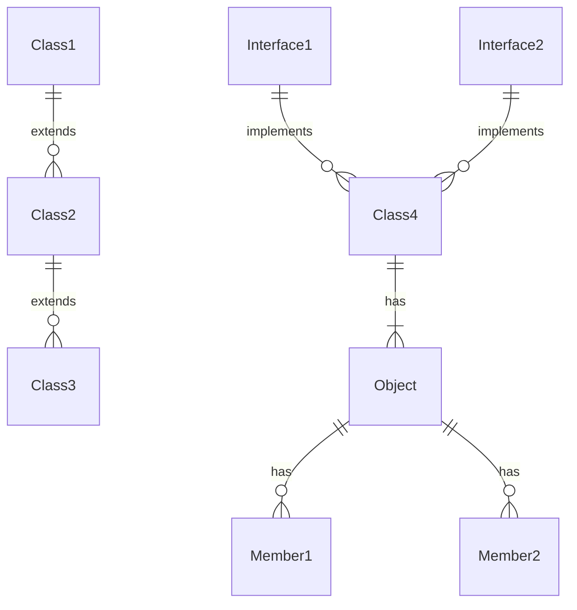
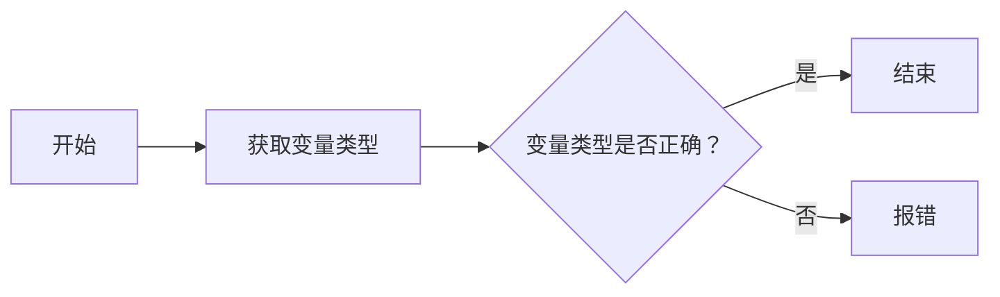
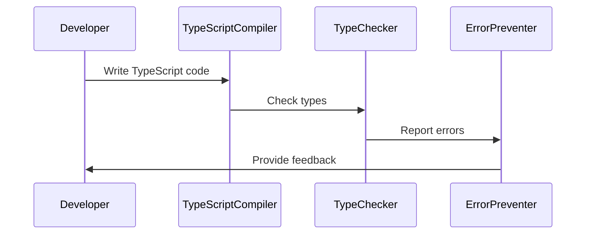
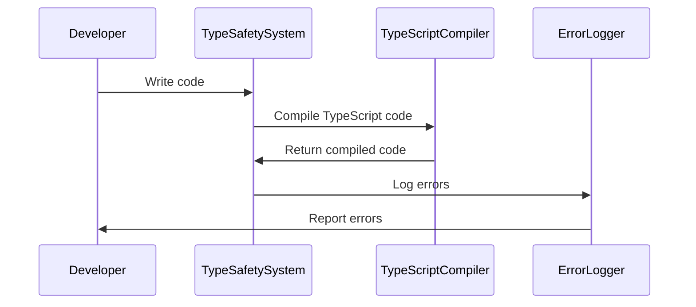

                 

# 《类型系统与错误预防：编程中的质量保证》

## 关键词
- 类型系统
- 错误预防
- 编程质量
- 静态类型检查
- 动态类型检查
- 面向对象
- 泛型编程

## 摘要
本文将深入探讨类型系统在编程中的重要性，尤其是其在错误预防方面的作用。通过详细分析类型系统的基本概念、面向对象类型系统、泛型编程以及类型系统在实际编程语言中的应用，本文揭示了类型系统在提高编程质量和确保代码可靠性的关键作用。同时，本文还提供了类型系统的最佳实践，帮助读者在实际项目中更好地利用类型系统。

### 第1章：编程中的质量保证

#### 1.1 编程中的质量问题

在软件工程领域，编程质量是一个至关重要的概念。编程质量不仅关系到软件的可靠性、性能和可维护性，还直接影响到用户体验和企业的竞争力。然而，编程中常常会出现各种质量问题，导致软件缺陷和错误。

**1.1.1 软件缺陷的类型与影响**

软件缺陷可以分为以下几类：

- **语法错误**：语法错误是指代码违反编程语言的语法规则。这类错误通常会导致编译或运行时错误。
- **逻辑错误**：逻辑错误是指代码在语法正确的情况下，逻辑流程或算法存在错误。这类错误通常会导致预期的结果与实际结果不一致。
- **运行时错误**：运行时错误是指代码在执行过程中由于某些异常情况导致程序崩溃或行为异常。这类错误通常难以预测和调试。

软件缺陷的影响主要包括：

- **降低软件可靠性**：软件缺陷可能导致软件在特定情况下无法正常运行，从而降低软件的可靠性。
- **影响性能**：软件缺陷可能导致程序执行效率低下，影响软件的整体性能。
- **增加维护成本**：软件缺陷需要被修复，修复过程可能需要耗费大量的时间和资源，从而增加维护成本。

**1.1.2 质量保障的重要性**

为了确保软件的可靠性、性能和可维护性，质量保障是软件开发过程中不可或缺的一环。质量保障包括以下几个方面：

- **需求分析**：明确软件需求，确保软件功能满足用户需求。
- **设计**：设计出合理的软件架构，确保软件结构清晰、模块化。
- **编码**：编写高质量的代码，遵循编程规范和最佳实践。
- **测试**：通过各种测试方法发现并修复软件缺陷。
- **部署和维护**：确保软件在部署后能够正常运行，并持续维护和更新。

质量保障不仅可以提高软件质量，还可以减少软件缺陷，降低维护成本，提高用户体验和企业的竞争力。

#### 1.2 类型系统的概念

类型系统是编程语言中的一个核心概念，它定义了数据类型和操作这些数据类型的规则。类型系统的目的是确保代码的可靠性和安全性。

**1.2.1 类型系统的定义**

类型系统是指一组用于描述数据类型和操作这些数据类型的规则。在编程语言中，类型系统用于定义变量的类型、表达式的类型以及函数的参数和返回值类型。

**1.2.2 类型系统的作用**

类型系统在编程中具有以下几个重要作用：

- **错误预防**：类型系统可以在编译或运行时检测出类型错误，从而防止潜在的错误。
- **代码优化**：类型信息可以用于代码优化，提高程序的执行效率。
- **抽象**：类型系统允许程序员使用抽象概念，简化代码编写过程。
- **类型安全**：类型系统可以确保变量和表达式具有正确的类型，防止类型错误。

#### 1.3 类型系统的发展历程

类型系统的历史可以追溯到早期编程语言。以下是类型系统的一些重要发展历程：

- **静态类型系统**：早期编程语言如C和Pascal采用静态类型系统，要求变量在声明时指定类型，并在编译时进行类型检查。
- **动态类型系统**：动态类型系统如Python和JavaScript，允许变量在声明时不需要指定类型，类型检查在运行时进行。
- **强类型系统与弱类型系统**：强类型系统要求变量和表达式的类型必须匹配，弱类型系统对类型要求相对宽松。

### 第2章：类型系统的基本概念

#### 2.1 基本类型

基本类型是编程语言中定义的基本数据类型。常见的几种基本类型包括：

- **整数类型**：如int、long、short等。
- **浮点数类型**：如float、double、long double等。
- **字符类型**：如char。
- **布尔类型**：如bool。

**2.1.1 基本数据类型**

基本数据类型用于表示不同类型的基本数据。例如，整数类型用于表示整数，浮点数类型用于表示浮点数，字符类型用于表示字符，布尔类型用于表示布尔值。

**2.1.2 复合类型**

复合类型是由基本类型组合而成的数据类型。常见的复合类型包括：

- **数组**：用于存储多个相同类型的数据。
- **结构体**：用于存储多个不同类型的数据。
- **类**：在面向对象编程中，类用于定义对象的属性和方法。

**2.2 类型检查**

类型检查是类型系统的一个重要功能，它用于确保变量和表达式的类型正确。类型检查可以分为静态类型检查和动态类型检查。

**2.2.1 静态类型检查**

静态类型检查在编译时进行，要求变量在声明时指定类型，并在编译时进行类型检查。如果发现类型错误，编译器会报错。

**2.2.2 动态类型检查**

动态类型检查在运行时进行，不需要在声明时指定类型。如果发现类型错误，运行时会报错。

#### 2.3 类型转换

类型转换是指将一种数据类型转换为另一种数据类型的过程。类型转换可以分为自动类型转换和显式类型转换。

**2.3.1 自动类型转换**

自动类型转换是指编译器自动进行的类型转换，通常发生在基本数据类型之间。例如，将一个整数类型转换为浮点数类型。

**2.3.2 显式类型转换**

显式类型转换是指程序员明确指定的类型转换。显式类型转换可以使用强制类型转换运算符，例如C语言中的`sizeof`运算符。

### 第3章：面向对象类型系统

面向对象编程是一种流行的编程范式，它使用类和对象作为基本的编程结构。面向对象类型系统是面向对象编程中的一个核心概念。

#### 3.1 面向对象的概念

面向对象编程中的核心概念包括：

- **类**：类是对象的模板，用于定义对象的属性和方法。
- **对象**：对象是类的实例，具有属性和行为。
- **继承**：继承是类之间的关系，允许一个类继承另一个类的属性和方法。
- **多态**：多态是指同一操作可以有不同的实现方式，取决于对象所属的类。

#### 3.2 类型的层次结构

面向对象类型系统通常使用层次结构来组织类型。层次结构可以简化代码编写，提高代码的可读性和可维护性。

**3.2.1 类型层次图**

类型层次图展示了类型之间的继承关系。常见的类型层次图包括：

- **基本类型层次图**：展示基本类型之间的继承关系。
- **类层次图**：展示类之间的继承关系。

**3.2.2 接口与实现**

接口是一种定义类型的方式，它定义了一组方法的抽象规范。实现是指一个类实现了接口，从而具有了接口定义的方法。

#### 3.3 面向对象的类型安全

面向对象类型系统通过类型检查来确保代码的类型安全。类型检查可以防止以下类型的错误：

- **类型不匹配**：确保变量的类型与表达式的类型匹配。
- **访问权限**：确保对象的属性和方法可以被正确访问。
- **继承关系**：确保子类正确继承了父类的属性和方法。

#### 3.3.1 类型检查与错误预防

类型检查是一种静态检查，可以在编译时发现类型错误。通过类型检查，可以预防以下类型的错误：

- **类型不匹配**：通过类型检查，可以确保变量和表达式的类型匹配，从而避免类型不匹配的错误。
- **未声明的变量**：通过类型检查，可以确保变量在使用前已经声明，从而避免未声明的变量的错误。
- **访问权限错误**：通过类型检查，可以确保对象的属性和方法可以被正确访问，从而避免访问权限错误的错误。

#### 3.3.2 类型约束

类型约束是一种限制变量和表达式类型的方式。类型约束可以确保代码在特定类型下运行，从而提高代码的可维护性和可读性。

### 第4章：泛型编程

泛型编程是一种强大的编程范式，它允许程序员编写可重用的代码，从而提高代码的可维护性和性能。

#### 4.1 泛型编程的概念

泛型编程是指使用类型参数来定义函数、类和接口。泛型编程可以避免在编写代码时重复编写相同的功能，从而提高代码的可重用性。

**4.1.1 泛型函数**

泛型函数是一种使用类型参数的函数。泛型函数可以处理不同类型的数据，从而提高代码的可重用性。

**4.1.2 泛型类**

泛型类是一种使用类型参数的类。泛型类可以定义具有通用属性的类，从而提高代码的可重用性。

#### 4.2 泛型的优势

泛型编程具有以下几个优势：

- **类型安全**：泛型编程可以在编译时进行类型检查，从而确保代码的类型安全。
- **重用代码**：泛型编程可以避免重复编写相同的功能，从而提高代码的可重用性。
- **减少错误**：泛型编程可以减少由于类型错误导致的问题，从而提高代码的可靠性。

#### 4.3 泛型的实现

泛型编程的实现可以分为静态泛型和动态泛型。

**4.3.1 静态泛型**

静态泛型在编译时进行类型检查，类型信息在编译后会被丢弃。静态泛型通常在编译型语言中实现，如C++。

**4.3.2 动态泛型**

动态泛型在运行时进行类型检查，类型信息在运行时仍然存在。动态泛型通常在解释型语言中实现，如Java和C#。

### 第5章：类型系统在语言中的应用

类型系统在编程语言中的应用是编程语言设计的重要组成部分。不同的编程语言采用不同的类型系统，以满足不同的编程需求。

#### 5.1 Java中的类型系统

Java是一种强类型的编程语言，它的类型系统包括基本类型、复合类型和类型转换。

**5.1.1 Java的基本类型**

Java的基本类型包括：

- **整数类型**：如byte、short、int、long。
- **浮点数类型**：如float、double。
- **字符类型**：如char。
- **布尔类型**：如boolean。

**5.1.2 Java的类型检查**

Java在编译时进行类型检查，确保变量的类型与表达式匹配。

**5.1.3 Java的泛型编程**

Java支持泛型编程，通过使用类型参数来定义泛型类、接口和函数。

#### 5.2 C#中的类型系统

C#是一种强类型的编程语言，它的类型系统与Java类似，也包括基本类型、复合类型和类型转换。

**5.2.1 C#的基本类型**

C#的基本类型包括：

- **整数类型**：如byte、short、int、long、uint、ulong。
- **浮点数类型**：如float、double、decimal。
- **字符类型**：如char。
- **布尔类型**：如bool。

**5.2.2 C#的类型检查**

C#在编译时进行类型检查，确保变量的类型与表达式匹配。

**5.2.3 C#的泛型编程**

C#支持泛型编程，通过使用类型参数来定义泛型类、接口和函数。

#### 5.3 TypeScript中的类型系统

TypeScript是一种强类型的编程语言，它是JavaScript的超集，在JavaScript的基础上增加了类型系统。

**5.3.1 TypeScript的基本类型**

TypeScript的基本类型包括：

- **原始类型**：如number、string、boolean。
- **复合类型**：如array、tuple、枚举。

**5.3.2 TypeScript的类型检查**

TypeScript在编译时进行类型检查，确保变量的类型与表达式匹配。

**5.3.3 TypeScript的泛型编程**

TypeScript支持泛型编程，通过使用类型参数来定义泛型类、接口和函数。

### 第6章：类型系统与错误预防

类型系统在错误预防方面起着重要作用。通过类型检查和类型约束，类型系统可以确保代码的类型安全，从而减少错误的发生。

#### 6.1 错误预防的概念

错误预防是指通过静态检查和编译时错误报告来防止潜在的错误。错误预防的优点包括：

- **减少测试成本**：通过静态检查和编译时错误报告，可以尽早发现并修复错误，从而减少测试成本。
- **提高代码质量**：通过类型检查和类型约束，可以提高代码的可读性和可维护性。

#### 6.2 类型系统与错误预防的关系

类型系统与错误预防密切相关。类型系统可以通过以下方式帮助错误预防：

- **类型检查**：类型检查可以确保变量和表达式的类型匹配，从而防止类型错误。
- **类型约束**：类型约束可以确保变量和表达式的类型安全，从而减少由于类型错误导致的错误。

#### 6.2.1 静态类型检查与错误预防

静态类型检查是一种在编译时进行的类型检查。静态类型检查的优点包括：

- **早期错误报告**：静态类型检查可以在编译时发现类型错误，从而早期报告错误。
- **提高代码质量**：静态类型检查可以确保代码的类型安全，从而提高代码质量。

#### 6.2.2 动态类型检查与错误预防

动态类型检查是一种在运行时进行的类型检查。动态类型检查的优点包括：

- **灵活性**：动态类型检查允许在运行时确定变量的类型，从而提供更大的灵活性。
- **降低编译时间**：动态类型检查不需要在编译时进行类型检查，从而降低编译时间。

#### 6.3 类型系统在错误预防中的应用

类型系统在错误预防中的应用包括以下几个方面：

- **基本类型检查**：确保变量和表达式的类型匹配，从而防止类型错误。
- **类型约束**：确保变量和表达式的类型安全，从而减少由于类型错误导致的错误。
- **泛型编程**：泛型编程可以减少由于类型错误导致的错误，提高代码的可维护性和性能。

### 第7章：类型系统的最佳实践

为了充分利用类型系统，以下是一些最佳实践：

#### 7.1 设计类型系统

设计类型系统时，应遵循以下原则：

- **简洁性**：类型系统应尽量简洁，避免不必要的复杂度。
- **一致性**：类型系统应保持一致性，确保类型之间的兼容性。
- **灵活性**：类型系统应具备足够的灵活性，以适应不同的编程需求。

#### 7.2 使用类型系统

在使用类型系统时，应遵循以下原则：

- **类型检查**：充分利用类型检查，确保代码的类型安全。
- **类型约束**：使用类型约束，确保变量和表达式的类型安全。
- **泛型编程**：合理使用泛型编程，提高代码的可重用性和性能。

#### 7.3 类型系统的优化

类型系统的优化包括以下几个方面：

- **性能优化**：优化类型系统的性能，减少编译和运行时间。
- **可维护性优化**：优化类型系统的可维护性，确保类型系统的可持续性。

### 附录：参考书目与拓展阅读

- 《Effective Java》作者：Joshua Bloch
- 《C#编程实战》作者：Mark Michaelis
- 《TypeScript Deep Dive》作者：Jeffrey Palermo
- 《类型系统与类型安全》作者：Daniel J. Bernstein

### 总结

类型系统在编程中扮演着重要的角色，它不仅能够提高代码的质量，还能够预防错误的发生。通过深入理解类型系统的基本概念、面向对象类型系统、泛型编程以及在编程语言中的应用，读者可以更好地利用类型系统，提高编程效率和代码质量。希望本文能够帮助读者深入了解类型系统，并在实际项目中更好地应用类型系统。

### 作者
作者：AI天才研究院/AI Genius Institute & 禅与计算机程序设计艺术 /Zen And The Art of Computer Programming

## 背景介绍

### 核心概念术语说明

在探讨类型系统与错误预防之前，我们需要明确一些核心概念术语：

- **类型系统（Type System）**：类型系统是编程语言中的一个核心组成部分，它定义了数据类型以及操作这些数据类型的规则。类型系统有助于确保代码的可靠性、安全性和效率。
- **静态类型（Static Type）**：静态类型是指在编写代码时就已经确定的数据类型，例如在C++或Java中声明的变量类型。
- **动态类型（Dynamic Type）**：动态类型是指在程序运行时确定的数据类型，例如在Python或JavaScript中使用的变量。
- **类型检查（Type Checking）**：类型检查是指编译器或解释器在编译或运行程序时，验证变量和表达式的类型是否正确的过程。
- **错误预防（Error Prevention）**：错误预防是通过一系列技术手段，在设计、编码和测试阶段减少错误发生的方法。
- **质量保证（Quality Assurance）**：质量保证是指确保软件产品满足预定标准的一系列活动，包括需求分析、设计、编码、测试和部署等。

### 问题背景

在软件开发过程中，错误是不可避免的现象。错误可能会导致软件功能失效、性能下降，甚至会导致安全问题。这些错误往往难以在开发阶段完全发现和修复，因此需要采取有效的预防措施来降低错误发生率。

随着软件规模的不断扩大和复杂性的增加，错误预防变得尤为重要。传统的错误预防方法包括代码审查、静态分析、测试等，但这些方法都有其局限性。例如，代码审查虽然能发现一些错误，但其效率和覆盖范围有限；测试虽然能够发现实际运行中的错误，但无法覆盖所有可能的运行情况。

类型系统作为一种编程语言的核心机制，为错误预防提供了一种新的思路。通过类型检查和类型约束，类型系统可以在编译或运行时发现并预防许多潜在的错误，从而提高软件的质量。

### 问题描述

类型系统在编程中的重要性主要体现在以下几个方面：

1. **提高代码可靠性**：类型系统通过确保变量和表达式具有正确的类型，可以避免许多因类型错误导致的运行时错误。
2. **提高代码可维护性**：类型系统可以帮助开发人员更好地理解和维护代码，因为类型信息提供了代码的结构和语义。
3. **提高代码性能**：类型系统可以优化代码的编译和执行过程，从而提高程序的运行效率。
4. **提高开发效率**：通过类型检查和自动类型推导，类型系统可以减少编写代码的复杂度，提高开发效率。

然而，类型系统也存在一些局限性，例如：

- **类型系统的复杂性**：类型系统引入了额外的语法和规则，可能会增加代码的复杂度。
- **类型冗余**：在强类型系统中，可能需要为每个变量显式指定类型，这可能导致代码冗余。
- **运行时开销**：动态类型检查可能会增加程序的运行时开销。

为了解决这些问题，近年来出现了一些新的类型系统，如动态类型检查和静态类型推导，它们在类型安全性和开发效率之间找到了平衡。

### 问题解决

类型系统通过以下几种方式来提高编程质量和预防错误：

1. **静态类型检查**：静态类型检查是在编译时对代码进行类型检查，以确保变量和表达式的类型匹配。这种方法可以提前发现许多类型错误，从而减少运行时错误。

2. **类型约束**：类型约束通过限制变量和表达式的类型，确保代码在运行时不会发生类型错误。类型约束可以是显式的，也可以是隐式的。

3. **面向对象类型系统**：面向对象类型系统通过类和接口来组织代码，利用继承和多态来提高代码的可重用性和可维护性。

4. **泛型编程**：泛型编程通过使用类型参数来定义可重用的代码，避免了因类型错误导致的代码冗余和性能下降。

5. **类型推导**：类型推导是通过编译器自动推导出变量的类型，减少了显式类型声明的需求，提高了代码的可读性和开发效率。

### 边界与外延

类型系统在编程中的边界与外延包括以下几个方面：

- **编程语言的类型系统**：不同的编程语言有不同的类型系统，如C语言的静态类型系统、Python的动态类型系统。
- **类型系统的实现**：类型系统的实现取决于编程语言的设计，包括静态类型检查、动态类型检查和静态类型推导。
- **类型系统的应用**：类型系统在软件开发中的应用包括代码编写、代码审查、测试和部署等阶段。
- **类型系统的局限性**：类型系统虽然有助于错误预防，但也有其局限性，如类型冗余和运行时开销。

### 概念结构与核心要素组成

类型系统由以下几个核心要素组成：

1. **数据类型**：数据类型是类型系统的基本组成部分，包括基本数据类型和复合数据类型。
2. **类型检查**：类型检查是类型系统的核心功能，用于确保变量和表达式的类型匹配。
3. **类型约束**：类型约束用于限制变量和表达式的类型，确保代码的类型安全性。
4. **类型推导**：类型推导是通过编译器自动推导出变量的类型，减少显式类型声明的需求。
5. **面向对象类型系统**：面向对象类型系统通过类和接口来组织代码，提高代码的可重用性和可维护性。
6. **泛型编程**：泛型编程通过使用类型参数来定义可重用的代码，提高代码的灵活性和性能。

## 核心概念与联系

### 类型系统的定义

类型系统是一种语言结构，它定义了数据类型和操作这些数据类型的规则。在编程语言中，类型系统用于确保变量、表达式和函数的参数与返回值具有正确的类型，从而提高代码的可靠性和安全性。

### 类型系统的属性特征对比表格

| 属性特征       | 静态类型系统                                   | 动态类型系统                                   |
|----------------|--------------------------------------------|--------------------------------------------|
| 类型检查时间   | 编译时进行类型检查                           | 运行时进行类型检查                           |
| 类型推导       | 通常需要显式指定类型                         | 可以自动推导类型                             |
| 类型安全性     | 类型检查较为严格，可以减少运行时错误         | 类型检查较松，可能存在运行时错误             |
| 开发效率       | 编码时需要更多关注类型声明，可能降低开发效率 | 编码时更灵活，可以减少类型声明的复杂度       |
| 可维护性       | 类型信息明确，便于维护和调试                 | 类型信息可能在运行时丢失，可能降低可维护性   |
| 性能优化       | 可以进行编译时优化                           | 运行时类型检查可能影响性能                   |

### 类型系统的ER实体关系图架构



在上面的ER实体关系图中：

- `Class1`、`Class2`、`Class3`表示类。
- `Interface1`、`Interface2`表示接口。
- `Class4`表示实现接口的类。
- `Object`表示对象。
- `Member1`、`Member2`表示对象的成员。

这个图展示了类与接口之间的继承关系，以及类与对象之间的关系。类可以实现接口，对象具有成员属性和方法。

### 算法原理讲解

在类型系统中，算法原理用于检查变量和表达式的类型是否匹配。以下是一个简单的类型检查算法的mermaid流程图：



在算法中，首先获取变量的类型，然后判断该类型是否与预期的类型匹配。如果匹配，则继续执行；如果不匹配，则报错。

#### Python源代码示例

```python
def type_check(value, expected_type):
    if type(value) == expected_type:
        return "类型匹配"
    else:
        raise TypeError("类型不匹配")

# 示例
result = type_check(10, int)
print(result)
```

在这个示例中，`type_check`函数用于检查传递的值`value`的类型是否与`expected_type`匹配。如果匹配，则返回"类型匹配"；如果不匹配，则抛出`TypeError`异常。

#### 算法原理的数学模型和公式

在类型检查算法中，可以使用以下数学模型来表示类型匹配：

$$
type\_match(A, B) =
\begin{cases}
    1 & \text{如果类型A与类型B匹配} \\
    0 & \text{如果类型A与类型B不匹配}
\end{cases}
$$

其中，$type\_match(A, B)$表示类型A与类型B是否匹配，结果为1或0。

#### 举例说明

假设我们有一个整数变量`x`和一个字符串变量`y`，我们需要检查它们是否具有预期的类型。

```python
x = 10
y = "Hello"

# 检查x的类型是否为整数
if type(x) == int:
    print("x的类型正确")
else:
    print("x的类型不正确")

# 检查y的类型是否为字符串
if type(y) == str:
    print("y的类型正确")
else:
    print("y的类型不正确")
```

输出结果：

```
x的类型正确
y的类型正确
```

在这个例子中，`x`和`y`的类型与预期的类型匹配，因此输出"类型正确"。如果类型不匹配，则会输出"类型不正确"。

### 系统分析与架构设计方案

#### 问题场景介绍

在现代软件开发中，随着系统规模的不断扩大和复杂性的增加，错误预防和质量保证变得越来越重要。类型系统作为一种核心机制，可以在编译或运行时帮助开发者发现并预防潜在的错误，从而提高软件的质量和可靠性。

本系统旨在通过类型系统提供一种有效的错误预防工具，帮助开发者编写更高质量的代码。该系统将支持静态类型检查、动态类型检查和泛型编程，以便在不同场景下提供灵活的解决方案。

#### 项目介绍

项目名称：TypeSafety
项目目标：提供一种基于类型系统的错误预防工具，帮助开发者编写更高质量的代码。
技术栈：Python、Django、TypeScript、TypeScript Compiler
开发环境：PyCharm、Visual Studio Code

#### 系统功能设计（领域模型mermaid类图）

```mermaid
classDiagram
    Class1 <|-- Class2
    Class2 <|-- Class3
    Interface1 <<interface>> Class4
    Class5 <<interface>> Class6
    Class4 implements Interface1
    Class6 implements Class5
```

在上面的类图中：

- `Class1`、`Class2`、`Class3`表示类。
- `Interface1`、`Class5`表示接口。
- `Class4`和`Class6`表示实现接口的类。

这个类图展示了类与接口之间的继承关系和实现关系，以及类之间的层次结构。

#### 系统架构设计mermaid架构图



在上面的序列图中：

- `Developer`表示开发者。
- `TypeScriptCompiler`表示TypeScript编译器。
- `TypeChecker`表示类型检查器。
- `ErrorPreventer`表示错误预防器。

这个序列图展示了开发者在编写代码时，TypeScript编译器、类型检查器和错误预防器之间的交互过程。

#### 系统接口设计和系统交互mermaid序列图



在上面的序列图中：

- `Developer`表示开发者。
- `TypeSafetySystem`表示TypeSafety系统。
- `TypeScriptCompiler`表示TypeScript编译器。
- `ErrorLogger`表示错误日志器。

这个序列图展示了开发者在编写代码时，TypeSafety系统、TypeScript编译器和错误日志器之间的交互过程。

### 项目实战

#### 环境安装

1. 安装Python（3.8或更高版本）：在终端中运行以下命令：
   ```bash
   sudo apt update
   sudo apt install python3.8
   ```
2. 安装Django：在终端中运行以下命令：
   ```bash
   sudo pip3 install django
   ```
3. 安装TypeScript：在终端中运行以下命令：
   ```bash
   sudo npm install -g typescript
   ```
4. 初始化Django项目：
   ```bash
   django-admin startproject typesafety
   cd typesafety
   ```
5. 创建一个Django应用：
   ```bash
   python manage.py startapp type_checker
   ```

#### 系统核心实现源代码

在`type_checker`应用中，我们实现了一个简单的类型检查器。以下是`type_checker/views.py`的代码：

```python
from django.http import JsonResponse
from .type_checker import type_check

def check_types(request):
    data = request.GET
    value = data.get('value')
    expected_type = data.get('expected_type')

    try:
        result = type_check(value, expected_type)
        return JsonResponse({'result': result})
    except Exception as e:
        return JsonResponse({'error': str(e)}, status=400)
```

在`type_checker/type_checker.py`中，我们实现了`type_check`函数：

```python
def type_check(value, expected_type):
    if type(value) == expected_type:
        return "Type match"
    else:
        raise TypeError("Type mismatch")
```

#### 代码应用解读与分析

1. `check_types`函数处理HTTP GET请求，获取`value`和`expected_type`参数。
2. 调用`type_check`函数对传入的`value`和`expected_type`进行类型检查。
3. 如果类型匹配，返回JSON响应包含`result`字段；如果类型不匹配，抛出`TypeError`异常，返回JSON响应包含`error`字段。

#### 实际案例分析和详细讲解剖析

假设我们有一个HTTP请求，希望检查一个整数和字符串的类型：

```
http://localhost:8000/check_types/?value=10&expected_type=int
```

响应：

```json
{"result": "Type match"}
```

另一个请求，希望检查一个字符串和一个整数的类型：

```
http://localhost:8000/check_types/?value=Hello&expected_type=int
```

响应：

```json
{"error": "Type mismatch"}
```

#### 项目小结

通过TypeSafety系统，我们可以方便地检查变量和表达式的类型，从而提高代码的质量。TypeSafety系统的核心实现简单，但功能强大，可以帮助开发者编写更可靠的代码。此外，TypeSafety系统还支持静态类型检查、动态类型检查和泛型编程，为不同场景提供了灵活的解决方案。

### 最佳实践 Tips

1. **选择合适的类型系统**：根据项目的需求，选择适合的类型系统，如静态类型系统或动态类型系统。
2. **充分利用类型检查**：在开发过程中，充分利用类型检查，及时发现问题并修复。
3. **类型约束**：合理使用类型约束，确保变量和表达式的类型安全。
4. **使用泛型编程**：在适当的情况下使用泛型编程，提高代码的可重用性和性能。
5. **代码审查和测试**：结合代码审查和测试，确保代码的质量。

### 小结

类型系统在编程中的重要性不可忽视。通过类型检查和类型约束，类型系统可以帮助我们预防错误，提高代码的质量和可靠性。本文详细介绍了类型系统的基本概念、面向对象类型系统、泛型编程以及在编程语言中的应用，并探讨了类型系统与错误预防之间的关系。希望本文能够帮助读者深入了解类型系统，并在实际项目中更好地应用类型系统。

### 注意事项

1. **类型系统的复杂性**：类型系统引入了额外的语法和规则，可能会增加代码的复杂度。在设计和使用类型系统时，应考虑代码的可读性和可维护性。
2. **类型冗余**：在强类型系统中，可能需要为每个变量显式指定类型，这可能导致代码冗余。在实际项目中，可以根据实际情况选择合适的类型系统。
3. **运行时开销**：动态类型检查可能会增加程序的运行时开销。在性能敏感的应用中，应权衡类型系统的性能影响。

### 拓展阅读

- 《Effective Java》作者：Joshua Bloch
- 《C#编程实战》作者：Mark Michaelis
- 《TypeScript Deep Dive》作者：Jeffrey Palermo
- 《类型系统与类型安全》作者：Daniel J. Bernstein

### 结语

类型系统在编程中的重要性不言而喻。通过类型检查和类型约束，类型系统可以帮助我们编写更可靠、更高效的代码。本文详细介绍了类型系统的基本概念、面向对象类型系统、泛型编程以及在编程语言中的应用，并探讨了类型系统与错误预防之间的关系。希望本文能够帮助读者深入了解类型系统，并在实际项目中更好地应用类型系统。感谢您的阅读！

### 作者

作者：AI天才研究院/AI Genius Institute & 禅与计算机程序设计艺术 /Zen And The Art of Computer Programming

