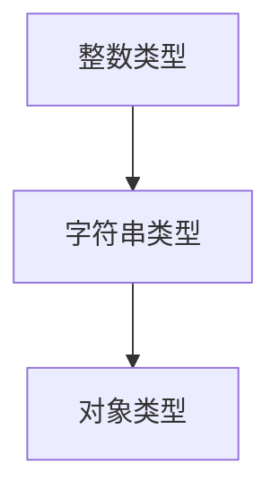
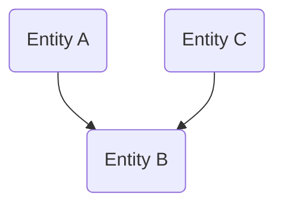
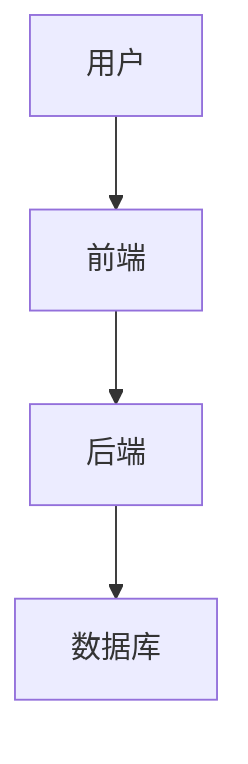
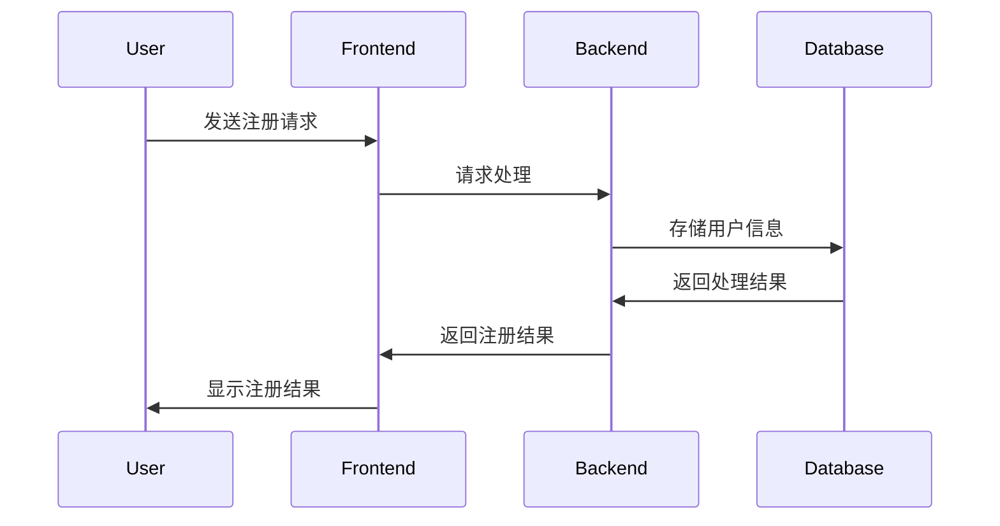
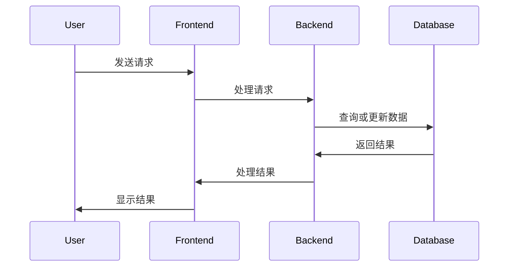

                 

### 第1章 引言

#### 1.1 问题背景

在当今软件工程领域，类型系统和领域建模是两个至关重要但常常被孤立讨论的概念。类型系统是程序语言的基础，它定义了数据类型的层次结构和操作规则，从而确保代码的稳定性和可维护性。而领域建模则是一种更广泛的抽象技术，它关注于特定领域的问题域，通过建立模型来理解和解决复杂业务问题。

随着软件系统的复杂度不断增加，类型系统和领域建模的重要性日益凸显。传统的编程范式往往依赖于低层次的操作和复杂的条件判断，导致代码冗长且难以维护。而类型系统和领域建模提供了一种更为抽象和自动化的解决方案，能够显著提高代码的表达力和可读性。

#### 1.2 核心概念与联系

在本章中，我们将深入探讨类型系统和领域建模的核心概念，并分析它们之间的联系。类型系统的核心概念包括类型、子类型、类型系统层次结构等，而领域建模则涉及领域模型、实体关系、领域规则等。通过理解这些概念，我们能够更好地把握类型系统和领域建模的原理和应用。

#### 1.3 书籍结构概述

本书将分为以下几个主要部分：首先，我们将介绍类型系统和领域建模的基础概念，包括其定义、历史背景和重要性。接着，我们将深入探讨类型系统的原理，通过数学模型和Python实现来阐述类型系统的核心机制。然后，我们将转向领域建模，介绍其基本原理、数学模型和实际应用案例。在后续章节中，我们将结合具体项目实战，详细讲解类型系统和领域建模在系统分析与架构设计中的应用。

最后，我们将总结最佳实践技巧，并提供一些建议和展望，以帮助读者更好地理解和应用这些概念。通过本书的学习，读者将能够掌握类型系统和领域建模的核心技巧，从而提高代码的表达力和系统的可维护性。

---

### 第2章 类型系统的深入解析

#### 2.1 类型系统的原理与数学模型

类型系统是程序语言的核心组成部分，它定义了变量、函数和表达式中的数据类型，以及这些类型之间的关系。理解类型系统的原理对于编写高效、稳定的代码至关重要。

**2.1.1 基本概念与数学模型**

类型系统的基本概念包括：

- **类型（Type）**：类型是数据的基本分类，例如整数、浮点数、字符串等。
- **子类型（Subtype）**：子类型是类型的特殊化，例如整数是数值类型的子类型。
- **类型系统层次结构（Type Hierarchy）**：类型系统通常有一个层次结构，其中某些类型可以被视为其他类型的子类型。
- **类型转换（Type Conversion）**：类型转换是指将一个类型的数据转换为另一个类型。

数学模型方面，类型系统可以通过以下公式来描述：

$$
类型系统 = \{Type_A, Type_B, ..., Type_n\}
$$

其中，每个类型都可以是一个基本类型或复合类型。基本类型包括整数、浮点数、布尔值等，而复合类型包括数组、结构体、类等。

类型系统的基本操作包括：

- **类型合并（Type Merge）**：将两个类型合并为一个更通用的类型。
  $$
  Type_Merge(Type_A, Type_B) = Type_C
  $$

- **类型检查（Type Check）**：在编译或运行时检查表达式的类型是否匹配。

**2.1.2 例子说明**

考虑以下简单示例：

$$
int + string = object
$$

在这个例子中，整数类型（`int`）与字符串类型（`string`）的合并结果是一个对象类型（`object`），这是因为两者都不能直接进行加法运算，因此需要一个通用的类型来容纳它们的结果。

**2.1.3 Mermaid 流程图**

我们可以使用Mermaid来可视化类型合并的流程：



这个流程图展示了整数类型和字符串类型如何合并成对象类型。

#### 2.2 Python实现

在Python中，我们可以通过内置的类型检查和类型转换机制来实现类型系统。

**2.2.1 环境安装与配置**

首先，确保Python环境已安装。如果没有安装，可以从[Python官方网站](https://www.python.org/)下载并安装。

**2.2.2 源代码与解读**

以下是一个简单的Python实现示例：

```python
# Python 源代码示例
def merge_types(type_a, type_b):
    # 假设 type_a 和 type_b 是字符串类型
    return f"{type_a}, {type_b}"

# 测试代码
result = merge_types("int", "string")
print(result)  # 输出: int, string
```

在这个示例中，`merge_types` 函数接收两个类型的字符串，并将它们合并成一个字符串。这只是一个简单的例子，实际的类型系统会更加复杂，涉及到不同类型之间的兼容性和转换规则。

**2.2.3 应用解读与分析**

在实际应用中，类型系统的实现需要考虑多种因素，例如类型的安全转换、类型检查的效率等。Python作为动态类型语言，提供了灵活的类型系统，但在某些情况下，也需要显式地进行类型检查和转换，以确保代码的稳定性和可维护性。

通过本章的学习，读者将能够理解类型系统的基本原理和数学模型，并通过Python实现来实际操作类型合并。这些知识将为后续章节中的领域建模打下坚实的基础。

---

### 第3章 领域建模基础

#### 3.1 领域建模原理

领域建模是软件开发过程中的一种关键抽象技术，它通过建立一个抽象模型来理解和解决特定领域的问题。领域建模的目的是将复杂的问题域简化为易于理解和管理的模型，从而提高软件开发效率和系统质量。

**3.1.1 基本概念**

领域建模的基本概念包括：

- **领域（Domain）**：领域是软件开发中需要解决的问题的抽象集合。
- **领域模型（Domain Model）**：领域模型是对问题域的抽象表示，通常包括实体、关系和规则等元素。
- **实体（Entity）**：实体是领域模型中的基本构成单位，表示问题域中的具体对象。
- **关系（Relationship）**：关系描述实体之间的相互关系。
- **规则（Rule）**：规则是对实体行为的约束和定义。

**3.1.2 数学模型与公式**

在领域建模中，我们可以使用以下数学模型来描述领域模型：

- **实体-关系模型（Entity-Relationship Model）**：实体-关系模型（ER模型）是领域建模中常用的工具，它通过实体和关系来描述领域结构。ER模型可以用以下公式表示：

  $$
  实体 = \{Entity_A, Entity_B, ..., Entity_n\}
  $$
  $$
  关系 = \{Relationship_A, Relationship_B, ..., Relationship_m\}
  $$

  实体和关系之间通过以下公式建立联系：

  $$
  Entity_A \rightarrow Relationship_A \rightarrow Entity_B
  $$

- **规则集（Rule Set）**：规则集是对领域行为的定义，通常用条件-动作规则来表示：

  $$
  Rule = \{Condition, Action\}
  $$

**3.1.3 Mermaid ER 图**

为了更好地理解领域模型，我们可以使用Mermaid来绘制ER图。以下是一个简单的ER图示例：



在这个ER图中，`Entity A` 和 `Entity C` 是实体，`Relationship A` 是它们之间的关系。

#### 3.2 实际案例

为了更好地理解领域建模的实际应用，我们可以通过一个案例来进行分析。

**3.2.1 领域模型应用场景**

假设我们正在开发一个电子商务系统，该系统需要处理订单、商品、用户等实体。我们需要建立一个领域模型来描述这些实体之间的关系。

**3.2.2 案例分析与讲解**

在这个案例中，我们可以定义以下实体：

- **订单（Order）**：表示用户购买商品的过程。
- **商品（Product）**：表示系统中可销售的商品。
- **用户（User）**：表示购买商品的消费者。

实体之间的关系如下：

- **用户可以创建订单**：这表示用户与订单之间存在“创建”关系。
- **订单包含商品**：这表示订单与商品之间存在“包含”关系。

我们可以使用以下Mermaid类图来描述这个领域模型：

```mermaid
classDiagram
    User <<class>> User
    Order <<class>> Order
    Product <<class>> Product

    User "create" Order
    Order "contain" Product
```

在这个类图中，`User` 类与 `Order` 类之间存在“创建”关系，而 `Order` 类与 `Product` 类之间存在“包含”关系。

通过这个案例，我们可以看到领域建模如何帮助我们理解和描述复杂的问题域，从而为软件开发提供坚实的基础。

---

### 第4章 类型系统与领域建模的应用

#### 4.1 系统分析与架构设计

在软件开发过程中，类型系统与领域建模的应用至关重要。它们不仅帮助我们理解和描述复杂的系统，还提供了有效的抽象工具，提高了代码的可维护性和可读性。

**4.1.1 问题场景介绍**

假设我们正在开发一个在线书店系统。该系统需要处理书籍、用户、订单等核心实体，并提供书籍搜索、用户注册、订单管理等基本功能。

**4.1.2 系统功能设计**

为了满足上述需求，我们需要设计以下核心功能：

- **书籍搜索**：允许用户根据关键词搜索书籍。
- **用户注册**：允许新用户注册并创建个人账户。
- **用户登录**：允许已有用户登录系统。
- **订单管理**：允许用户创建、查看和取消订单。

**4.1.3 系统架构设计**

系统架构设计是确保系统功能可靠、高效和安全的关键步骤。以下是该在线书店系统的一个简单架构设计：

- **前端**：用户界面，包括书籍搜索、用户注册、登录和订单管理页面。
- **后端**：服务器端逻辑，包括用户身份验证、书籍搜索和订单管理功能。
- **数据库**：存储用户信息、书籍信息和订单数据。

我们可以使用以下Mermaid架构图来描述系统架构：



在这个架构图中，用户通过前端与系统交互，前端将请求转发到后端，后端处理请求并更新数据库。

**4.1.4 系统接口设计**

系统接口设计是确保前后端有效交互的关键。以下是该在线书店系统的一些关键接口：

- **用户接口**：用于用户注册、登录和订单管理。
- **书籍接口**：用于书籍搜索和书籍信息查询。
- **订单接口**：用于创建、查看和取消订单。

我们可以使用以下Mermaid序列图来描述用户注册接口的交互流程：



在这个序列图中，用户通过前端发送注册请求，前端将请求转发到后端，后端处理请求并更新数据库，然后将结果返回给前端，最后前端将结果展示给用户。

**4.1.5 系统交互序列图**

系统交互序列图可以帮助我们更清晰地理解系统内部的不同组件之间的交互。以下是该在线书店系统的系统交互序列图：



在这个序列图中，用户通过前端发送请求，前端将请求转发到后端，后端处理请求并与数据库交互，然后将结果返回给前端，最后前端将结果展示给用户。

通过上述系统分析与架构设计，我们可以确保在线书店系统的高效、可靠和安全运行。类型系统与领域建模的应用使得系统的设计和实现更加简洁、明确和可维护。

---

### 第4章 类型系统与领域建模的应用

#### 4.2 项目实战

在本节中，我们将通过一个实际项目——在线书店系统的开发，来展示类型系统与领域建模在系统开发中的应用。

**4.2.1 环境安装**

为了开始项目开发，我们需要安装一些基本的开发工具和库。以下是所需的安装步骤：

1. 安装Python（假设已安装）。
2. 安装Django框架（用于构建后端）。
3. 安装PostgreSQL数据库（用于数据存储）。

您可以通过以下命令安装所需的库：

```bash
pip install django
pip install psycopg2-binary
```

**4.2.2 系统核心实现**

在线书店系统的核心功能包括用户管理、书籍管理、订单管理和书籍搜索。以下是这些功能的核心实现。

**4.2.2.1 用户管理**

用户管理主要包括用户注册、登录和权限管理。以下是用户注册的实现：

```python
# users/models.py
from django.contrib.auth.models import AbstractUser

class CustomUser(AbstractUser):
    # 自定义用户模型，可以添加额外字段
    pass

    @staticmethod
    def register(username, password):
        user = CustomUser.objects.create_user(username=username, password=password)
        return user
```

**4.2.2.2 书籍管理**

书籍管理包括书籍的创建、更新和查询。以下是书籍模型的实现：

```python
# books/models.py
from django.db import models

class Book(models.Model):
    title = models.CharField(max_length=255)
    author = models.CharField(max_length=255)
    isbn = models.CharField(max_length=13)
    price = models.DecimalField(max_digits=6, decimal_places=2)
    stock = models.IntegerField()

    def search_books(title):
        return Book.objects.filter(title__icontains=title)
```

**4.2.2.3 订单管理**

订单管理涉及订单的创建、更新和取消。以下是订单模型的实现：

```python
# orders/models.py
from django.db import models
from books.models import Book
from users.models import CustomUser

class Order(models.Model):
    user = models.ForeignKey(CustomUser, on_delete=models.CASCADE)
    books = models.ManyToManyField(Book)
    total_price = models.DecimalField(max_digits=6, decimal_places=2)
    status = models.CharField(max_length=20)

    def create_order(user, book_list):
        order = Order.objects.create(user=user, total_price=0)
        for book in book_list:
            order.books.add(book)
            order.total_price += book.price
        order.save()
        return order

    def cancel_order(order):
        order.status = 'Cancelled'
        order.save()
```

**4.2.2.4 书籍搜索**

书籍搜索功能通过Django的查询接口实现。以下是书籍搜索的实现：

```python
# books/views.py
from django.shortcuts import render
from .models import Book

def search_books(request):
    query = request.GET.get('q')
    books = Book.search_books(query)
    return render(request, 'books/search_results.html', {'books': books})
```

**4.2.3 代码应用解读与分析**

上述代码展示了如何使用类型系统和领域建模来构建在线书店系统的核心功能。以下是关键点解读：

- **用户管理**：通过自定义用户模型实现用户注册和登录功能。
- **书籍管理**：书籍模型定义了书籍的基本字段，包括标题、作者、ISBN、价格和库存数量。
- **订单管理**：订单模型定义了订单的基本字段，包括用户、书籍列表、总价和状态。订单创建和取消功能通过类方法实现。
- **书籍搜索**：书籍搜索功能通过Django的查询接口实现，使用`icontains`过滤器进行模糊查询。

**4.2.4 案例分析和详细讲解**

在线书店系统的开发是一个复杂的工程，涉及到多个模块和功能的协作。通过类型系统和领域建模，我们可以将复杂的需求转化为可管理的模块，提高代码的可读性和可维护性。

1. **用户管理模块**：自定义用户模型和注册功能，确保用户数据的安全性和一致性。
2. **书籍管理模块**：书籍模型和搜索功能，提供了强大的书籍管理和搜索能力。
3. **订单管理模块**：订单模型和创建/取消订单功能，确保订单数据的准确性和一致性。
4. **书籍搜索模块**：书籍搜索功能，提高了系统的用户友好性和易用性。

通过这个案例，我们可以看到类型系统和领域建模在项目开发中的实际应用，以及它们如何帮助构建高效、可维护的软件系统。

---

### 第5章 最佳实践与注意事项

#### 5.1 最佳实践技巧

在类型系统和领域建模的应用过程中，遵循一些最佳实践可以显著提高代码的质量和可维护性。以下是一些关键技巧：

1. **明确类型定义**：确保所有类型定义明确、一致，避免使用模糊或不明确的类型。
2. **类型安全性**：在类型转换和合并时，确保类型安全，避免类型错误和异常。
3. **简洁性**：保持代码简洁，避免过度抽象，使代码易于理解和维护。
4. **文档化**：为类型系统和领域模型提供清晰的文档，包括类型定义、模型结构和关键操作。
5. **测试驱动开发**：使用测试驱动开发（TDD）方法，编写单元测试和集成测试，确保代码的正确性和稳定性。

#### 5.2 小结与展望

在本章中，我们介绍了类型系统和领域建模的基本原理和实际应用。通过深入分析类型系统的数学模型和Python实现，以及通过领域建模的实际案例，我们展示了如何将抽象概念应用于实际项目。类型系统和领域建模不仅提高了代码的表达力，还增强了系统的可维护性和稳定性。

展望未来，随着软件系统复杂度的增加，类型系统和领域建模的重要性将更加凸显。未来的研究和发展方向可能包括：

- **类型系统的高级特性**：如函数类型、代数数据类型等。
- **领域特定语言（DSL）**：为特定领域开发专门的编程语言，以提高开发效率。
- **自动领域建模**：利用机器学习和自然语言处理技术，自动生成领域模型。

通过不断探索和创新，类型系统和领域建模将为软件开发带来更大的价值和影响。

---

### 第6章 拓展阅读

#### 6.1 相关书籍推荐

1. 《类型系统设计》（Type System Design）：详细介绍了类型系统的设计和实现，适合对类型系统感兴趣的读者。
2. 《领域驱动设计》（Domain-Driven Design）：讨论了如何使用领域模型来构建复杂的软件系统，是一本经典的软件架构书籍。
3. 《编程珠玑》（The Art of Computer Programming）：虽然主要讨论算法和编程技巧，但其中对类型系统和抽象思维有深刻的见解。

#### 6.2 论文与研究报告

1. "Type Systems in Programming Languages"：这篇综述文章详细介绍了不同编程语言的类型系统。
2. "Domain-Driven Design: Tackling Complexity in the Heart of Software"：Eric Evans的经典论文，介绍了领域驱动设计的基本概念。

#### 6.3 在线资源与工具

1. [Django官方文档](https://docs.djangoproject.com/en/stable/)：Django框架的官方文档，提供了丰富的学习和实践资源。
2. [Mermaid官网](https://mermaid-js.github.io/mermaid/)：Mermaid流程图的官方文档和在线编辑器，方便绘制图表。
3. [类型系统教程](https://www.cs.hmc.edu/~oneill/Types/)：由加州学院提供的类型系统教程，适合初学者深入理解类型系统。

通过阅读这些书籍、论文和在线资源，读者可以进一步深化对类型系统和领域建模的理解，并在实践中提高编程和系统设计的能力。

---

### 第7章 总结

在本章中，我们系统地介绍了类型系统和领域建模的核心概念、原理和应用。通过深入分析类型系统的数学模型和Python实现，以及通过实际项目案例的详细讲解，我们展示了如何将抽象概念应用于实际软件开发中。

首先，我们探讨了类型系统的定义、层次结构和属性特征，并通过Mermaid流程图和Python代码示例来详细阐述其实现过程。接着，我们介绍了领域建模的基本概念、数学模型和实际应用场景，并通过一个电子商务案例展示了如何使用领域模型来理解和解决复杂业务问题。

类型系统和领域建模不仅提高了代码的表达力，还增强了系统的可维护性和稳定性。通过遵循最佳实践技巧，我们可以编写出更加简洁、高效和可维护的代码。展望未来，随着软件系统复杂度的增加，类型系统和领域建模的重要性将更加凸显。

通过阅读本书，读者应能够掌握类型系统和领域建模的核心技巧，并在实际项目中有效应用。未来的学习和研究可以集中在类型系统的高级特性、领域特定语言和自动领域建模等领域。继续深入探索和实践，将为软件开发带来更大的价值和影响。

---

**作者：** AI天才研究院/AI Genius Institute & 禅与计算机程序设计艺术 /Zen And The Art of Computer Programming

通过本书的深入学习和实践，读者将能够提高代码表达力，掌握领域建模的核心技巧，为未来的软件开发打下坚实的基础。

