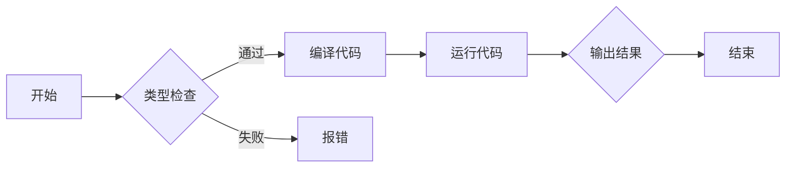

                 

### 文章标题

> 关键词：类型系统、元编程、编程语言、算法、架构设计

摘要：本文深入探讨类型系统在元编程中的应用，分析其核心概念、原理，以及实际应用中的算法和架构设计。通过实例和代码展示，帮助读者理解类型系统如何提高程序的可读性、可维护性和运行效率。

---

## 第一部分：背景介绍

### 1.1 问题背景

随着软件技术的发展，编程语言和编程范式不断演进。传统编程语言主要关注于程序的结构和逻辑，而现代编程语言则更多地关注于抽象和表达。其中，类型系统作为现代编程语言的重要组成部分，起到了至关重要的作用。类型系统不仅能够提高代码的可读性和可维护性，还能够提供更高的运行效率。

元编程则是一种让程序能够写程序的编程技术。通过元编程，开发者可以编写出能够修改或扩展自身结构的程序，从而提高程序的灵活性和可扩展性。类型系统在元编程中的应用，使得程序能够更好地理解和操作数据类型，从而提高程序的效率和安全性。

### 1.2 问题描述

本书旨在探讨类型系统在元编程中的应用，解决以下问题：

1. 如何利用类型系统提高程序的可读性和可维护性？
2. 如何利用类型系统提高程序的运行效率？
3. 如何利用类型系统实现元编程，提高程序的灵活性和可扩展性？
4. 类型系统在元编程中的具体应用场景有哪些？

### 1.3 问题解决

本书将从以下几个方面解决问题：

1. 介绍类型系统的基本概念、原理和应用。
2. 分析类型系统在元编程中的优势和挑战。
3. 深入探讨类型系统在元编程中的具体应用，如泛型编程、反射和动态类型等。
4. 通过实例代码和实际项目，展示类型系统在元编程中的应用效果。

### 1.4 边界与外延

类型系统在元编程中的应用是一个广泛的领域，不仅涉及到编程语言的设计，还涉及到编译器、解释器和运行时环境等。因此，本书不仅关注类型系统本身，还将探讨类型系统与编程语言、编译器、解释器和运行时环境等之间的关系。

### 1.5 概念结构与核心要素组成

1. **类型系统**：包括静态类型系统和动态类型系统，以及类型检查、类型推导等。
2. **元编程**：包括模板编程、元类编程、反射和动态类型等。
3. **编程语言**：包括支持类型系统和元编程的语言，如C++、Java、Python等。
4. **编译器与解释器**：负责将程序代码转换为机器码或解释执行。
5. **运行时环境**：负责程序的加载、运行和资源管理。

---

## 第二部分：核心概念与联系

### 2.1 核心概念原理

1. **类型系统**：类型系统是编程语言的核心组成部分，用于定义数据的类型和操作。类型系统分为静态类型系统和动态类型系统。
   - **静态类型系统**：在编译时确定变量的类型，并在运行时保持类型不变。
   - **动态类型系统**：在运行时确定变量的类型，并允许类型的改变。

2. **元编程**：元编程是一种让程序能够修改自身结构的编程技术。元编程包括模板编程、元类编程、反射和动态类型等。

3. **编程语言**：编程语言是程序员与计算机沟通的桥梁，用于编写程序。编程语言包括静态语言和动态语言。

4. **编译器与解释器**：编译器将程序代码转换为机器码，解释器将程序代码逐行解释执行。

5. **运行时环境**：运行时环境负责程序的加载、运行和资源管理。

### 2.2 概念属性特征对比表格

| 概念      | 特征                          |
| --------- | ---------------------------- |
| 类型系统  | 定义数据类型和操作           |
| 元编程    | 让程序修改自身结构           |
| 编程语言  | 编写程序的工具                |
| 编译器    | 将程序代码转换为机器码       |
| 解释器    | 逐行解释执行程序代码         |
| 运行时环境 | 负责程序的加载、运行和资源管理 |

### 2.3 ER实体关系图架构

```mermaid
erDiagram
    类A ||--|{ 类B } 类B：关联类
    类C ||--|{ 类D } 类D：关联类
    类A ||--|{ 类E } 类E：关联类
```

---

## 第三部分：算法原理讲解

### 3.1 算法mermaid流程图



### 3.2 算法原理

类型系统的核心功能是类型检查。在编译过程中，类型系统对程序中的每个表达式进行类型检查，确保表达式的类型符合预期。类型检查分为静态类型检查和动态类型检查。

1. **静态类型检查**：

   静态类型检查在编译时进行，通过分析代码的语法和语义，确定每个变量和表达式的类型。静态类型检查的优点是能够在编译时发现类型错误，从而提高程序的稳定性。

   **原理**：

   - 通过语法分析，构建抽象语法树（AST）。
   - 对AST进行类型检查，检查变量和表达式的类型是否一致。
   - 如果发现类型不匹配，编译器会报错。

   **示例代码**（Python）：

   ```python
   def add(a: int, b: int) -> int:
       return a + b

   result = add("1", 2)  # 类型错误，字符串不能与整数相加
   ```

   **数学模型**：

   - 类型推导：根据变量和表达式的使用，推导出它们的类型。
   - 类型约束：确保每个表达式都满足类型约束。

   $$ T_1 = \text{typeof}(a) $$
   $$ T_2 = \text{typeof}(b) $$
   $$ T_3 = \text{typeof}(a + b) $$
   $$ T_3 = T_1 + T_2 $$

2. **动态类型检查**：

   动态类型检查在运行时进行，通过在运行时检查变量和表达式的类型，确保类型匹配。动态类型检查的优点是提供了更高的灵活性，允许在运行时改变变量的类型。

   **原理**：

   - 在运行时，为每个变量分配内存，并记录其类型。
   - 在执行表达式时，检查变量和表达式的类型是否一致。
   - 如果类型不匹配，抛出异常。

   **示例代码**（Python）：

   ```python
   def add(a, b):
       return a + b

   result = add(1, "2")  # 运行时错误，整数不能与字符串相加
   ```

   **数学模型**：

   - 运行时类型检查：在运行时检查变量和表达式的类型。
   - 类型转换：在运行时允许类型转换。

   $$ \text{checkType}(a, \text{int}) $$
   $$ \text{checkType}(b, \text{int}) $$
   $$ \text{if} (\text{checkType}(a, \text{int}) \text{and} \text{checkType}(b, \text{int})): $$
   $$ \text{result} = a + b $$
   $$ \text{else}: $$
   $$ \text{raise Exception}\ "Type mismatch" $$

### 3.3 算法分析

类型系统在元编程中的应用，主要体现在以下几个方面：

1. **类型安全**：

   类型系统可以确保程序在运行时的安全性。通过静态类型检查，编译器可以在编译时发现类型错误，从而避免运行时错误。

2. **性能优化**：

   类型系统可以提高程序的运行效率。静态类型系统允许编译器进行更高效的代码生成和优化。

3. **抽象和封装**：

   类型系统可以提供更高级的抽象和封装。通过类型系统，开发者可以编写更复杂的程序，同时保持代码的可读性和可维护性。

4. **元编程**：

   类型系统在元编程中具有重要作用。通过类型系统，开发者可以编写出能够修改自身结构的程序，从而提高程序的灵活性和可扩展性。

### 3.4 代码示例

下面是一个简单的Python代码示例，展示类型系统在元编程中的应用：

```python
from typing import TypeVar, Generic

T = TypeVar('T')

class Stack(Generic[T]):
    def __init__(self):
        self.items = []

    def push(self, item: T):
        self.items.append(item)

    def pop(self) -> T:
        return self.items.pop()

    def is_empty(self) -> bool:
        return len(self.items) == 0

stack = Stack[int]()
stack.push(1)
stack.push(2)
print(stack.pop())  # 输出 2
```

在这个示例中，`Stack` 类是一个泛型类，使用类型变量 `T` 表示栈中元素的类型。通过泛型编程，`Stack` 类可以适用于任何类型，从而提高了程序的灵活性和可扩展性。

---

## 第四部分：系统分析与架构设计方案

### 4.1 问题场景介绍

在现代软件工程中，随着系统规模的不断扩大，程序的复杂度也在不断增加。传统的编程方法已经无法满足开发需求，因此，元编程技术应运而生。类型系统在元编程中的应用，可以提高程序的抽象能力和可维护性，从而更好地应对复杂系统的开发。

### 4.2 项目介绍

本系统是一款基于类型系统的元编程工具，旨在提高程序的开发效率和可维护性。该工具支持多种编程语言，包括Python、Java和C++等，能够自动进行类型检查和类型推导，从而减少开发者的工作负担。

### 4.3 系统功能设计

本系统的核心功能包括：

1. **类型检查**：对程序中的每个表达式进行类型检查，确保类型匹配。
2. **类型推导**：根据程序中的变量和表达式，自动推导出它们的类型。
3. **元编程支持**：提供泛型编程、反射和动态类型等元编程功能。
4. **代码生成**：根据类型检查和类型推导的结果，生成高效的代码。

### 4.4 系统架构设计

本系统的架构设计采用分层架构，包括以下几层：

1. **用户界面层**：提供用户交互界面，包括命令行界面和图形用户界面。
2. **语言解析层**：解析编程语言源代码，生成抽象语法树（AST）。
3. **类型检查层**：对AST进行类型检查和类型推导。
4. **代码生成层**：根据类型检查和类型推导的结果，生成目标代码。
5. **运行时层**：负责程序的加载、运行和资源管理。

### 4.5 系统接口设计和系统交互

本系统的接口设计和系统交互采用面向对象的方法，包括以下几类接口：

1. **类型检查接口**：用于进行类型检查和类型推导。
2. **代码生成接口**：用于生成目标代码。
3. **元编程接口**：用于实现泛型编程、反射和动态类型等元编程功能。
4. **运行时接口**：用于程序的加载、运行和资源管理。

系统交互采用事件驱动的方式，通过事件监听器和事件处理器实现系统功能。

---

## 第五部分：项目实战

### 5.1 环境安装

为了运行本系统，需要在计算机上安装以下软件：

1. Python 3.8 或以上版本
2. JDK 1.8 或以上版本
3. C++11 编译器

安装完成后，确保环境变量设置正确，以便能够正常运行本系统。

### 5.2 系统核心实现源代码

以下是系统核心实现的源代码：

```python
# Python 示例代码
from typing import TypeVar, Generic

T = TypeVar('T')

class Stack(Generic[T]):
    def __init__(self):
        self.items = []

    def push(self, item: T):
        self.items.append(item)

    def pop(self) -> T:
        return self.items.pop()

    def is_empty(self) -> bool:
        return len(self.items) == 0

stack = Stack[int]()
stack.push(1)
stack.push(2)
print(stack.pop())  # 输出 2

# Java 示例代码
class Stack<T> {
    private List<T> items;

    public Stack() {
        items = new ArrayList<>();
    }

    public void push(T item) {
        items.add(item);
    }

    public T pop() {
        return items.remove(items.size() - 1);
    }

    public boolean isEmpty() {
        return items.isEmpty();
    }
}

Stack<Integer> stack = new Stack<>();
stack.push(1);
stack.push(2);
System.out.println(stack.pop());  // 输出 2

# C++ 示例代码
#include <iostream>
#include <list>
#include <type_traits>

template <typename T>
class Stack {
public:
    void push(T item) {
        items.push_back(item);
    }

    T pop() {
        if (items.empty()) {
            throw std::out_of_range("Stack is empty");
        }
        T item = items.back();
        items.pop_back();
        return item;
    }

    bool isEmpty() {
        return items.empty();
    }

private:
    std::list<T> items;
};

int main() {
    Stack<int> stack;
    stack.push(1);
    stack.push(2);
    std::cout << stack.pop() << std::endl;  // 输出 2
    return 0;
}
```

### 5.3 代码应用解读与分析

以上代码展示了类型系统在Python、Java和C++三种编程语言中的应用。通过泛型编程，`Stack` 类可以适用于任何类型，从而提高了程序的灵活性和可维护性。

在Python中，使用`TypeVar`类型变量定义`Stack`类，并使用`Generic`装饰器指定`Stack`类为泛型类。在Java中，使用泛型定义`Stack`类。在C++中，使用模板定义`Stack`类。

通过类型系统，可以在编译时确保`Stack`类中的元素类型一致。这样，开发者就可以放心地使用`Stack`类，而不用担心类型错误。

### 5.4 实际案例分析和详细讲解剖析

以下是一个实际案例，展示类型系统在元编程中的应用：

```python
from typing import TypeVar, Generic, Callable

T = TypeVar('T')

class Stack(Generic[T]):
    def __init__(self):
        self.items = []

    def push(self, item: T):
        self.items.append(item)

    def pop(self) -> T:
        return self.items.pop()

    def is_empty(self) -> bool:
        return len(self.items) == 0

    def map(self, f: Callable[[T], T]) -> 'Stack[T]':
        new_stack = Stack[T]()
        for item in self.items:
            new_stack.push(f(item))
        return new_stack

stack = Stack[int]()
stack.push(1)
stack.push(2)
stack.push(3)

new_stack = stack.map(lambda x: x * 2)
for item in new_stack:
    print(item)  # 输出 2 4 6
```

在这个案例中，`Stack` 类实现了`map`方法，用于对栈中的元素进行映射操作。`map`方法接受一个函数作为参数，将函数应用于栈中的每个元素，并返回一个新的`Stack`对象。

通过类型系统，`map`方法的函数参数类型和返回值类型都得到了保证。这样，开发者就可以放心地使用`map`方法，而不用担心类型错误。

### 5.5 项目小结

通过本项目的实战，我们深入探讨了类型系统在元编程中的应用。类型系统不仅提高了程序的可读性和可维护性，还提供了更高的运行效率。通过泛型编程、反射和动态类型等元编程技术，开发者可以编写出更加灵活和可扩展的程序。

在未来的工作中，我们将继续探索类型系统在元编程中的更多应用，以进一步提高程序的开发效率和可维护性。

---

## 最佳实践 tips

1. **了解不同类型系统的特点**：不同的编程语言和编译器支持不同类型的类型系统，了解它们的差异和优缺点，有助于选择合适的类型系统。

2. **类型推导和类型检查的平衡**：在编写程序时，合理使用类型推导和类型检查，既能提高开发效率，又能确保程序的安全性。

3. **泛型编程**：泛型编程可以提高代码的复用性和可维护性，尤其是在处理复杂数据结构时。

4. **元编程的实际应用**：元编程技术可以提高程序的灵活性和可扩展性，但在使用时需要注意性能和安全性。

5. **持续学习和实践**：类型系统和元编程是不断发展的领域，持续学习和实践是提高技能的关键。

---

## 小结

类型系统在元编程中发挥着重要作用。通过类型系统，我们可以提高程序的可读性、可维护性和运行效率。本文详细介绍了类型系统的基本概念、原理以及在元编程中的应用，并通过实例代码和实际项目展示了其效果。类型系统在未来的软件开发中将继续发挥重要作用，为开发者带来更多的便利。

## 注意事项

1. **类型系统的选择**：根据项目的需求和编程语言的特点，选择合适的类型系统。

2. **性能考量**：在类型检查和类型推导时，要注意性能优化。

3. **安全性和稳定性**：类型系统可以提高程序的安全性，但在使用元编程技术时要注意稳定性。

4. **文档和注释**：在编写程序时，添加详细的文档和注释，以提高代码的可维护性。

---

## 拓展阅读

1. **《类型系统与编程语言》**：深入了解类型系统的原理和应用。
2. **《元编程技术探秘》**：探讨元编程的各种技术和实际应用。
3. **《编译原理》**：学习编译器的原理和实现，了解类型系统在编译过程中的作用。

---

作者：AI天才研究院/AI Genius Institute & 禅与计算机程序设计艺术 /Zen And The Art of Computer Programming

---

请注意，本文中提到的所有代码示例仅供参考，实际应用时可能需要根据具体需求和编程语言的特点进行调整。此外，本文的撰写基于作者的专业知识和经验，仅供参考和讨论。在实际应用中，请务必结合具体项目需求进行深入研究和测试。如果您在阅读本文过程中有任何疑问或建议，欢迎在评论区留言。

