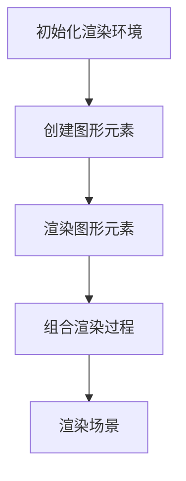
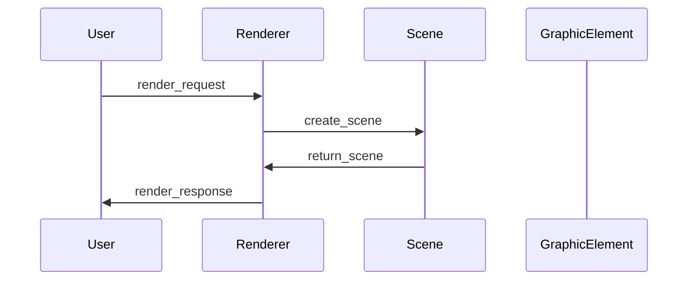
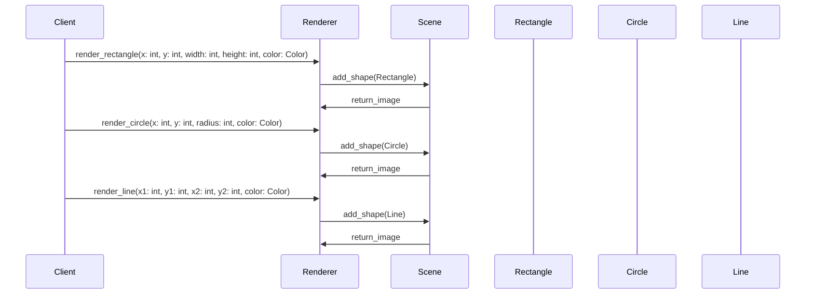

                 

# 类型系统在函数式图形编程中的创新

## 关键词
- 类型系统
- 函数式编程
- 图形编程
- 类型推断
- 多态性
- 图形渲染

## 摘要
本文深入探讨了类型系统在函数式图形编程中的应用和创新。通过介绍类型系统的基本概念和其在函数式编程中的重要性，我们进一步分析了类型系统在图形编程中的独特作用。本文还将探讨当前类型系统在图形编程中的挑战，并提出创新的解决方案，以实现更加高效、可靠的图形编程。

## 引言
### 类型系统概述

类型系统是编程语言中的一个核心概念，它定义了变量、表达式和函数的预期类型，以确保程序的正确性。类型系统可以分为两类：静态类型系统和动态类型系统。静态类型系统在编译时检查类型，而动态类型系统则在运行时进行检查。

类型系统的重要性体现在多个方面。首先，它有助于早期发现错误，如类型不匹配的错误。其次，类型系统可以提高程序的可靠性和性能，因为编译器可以针对特定的类型进行优化。此外，类型系统还为程序提供了更强的抽象能力，使得编程更加直观和易于维护。

### 函数式图形编程

函数式编程是一种编程范式，它强调使用不可变数据和纯函数来构建程序。在函数式编程中，函数是一等公民，可以接受其他函数作为参数或返回函数。这种编程范式在图形编程中得到了广泛应用，尤其是在实时渲染和可视化领域。

函数式图形编程的优势在于其可组合性和可重用性。通过使用纯函数和不可变数据，我们可以轻松地构建复杂的图形系统，而不会引入副作用。此外，函数式编程还使得图形渲染过程中的状态管理变得更加简单和直观。

### 类型系统在函数式图形编程中的重要性

类型系统在函数式图形编程中起着至关重要的作用。首先，它确保了函数的正确性和一致性。在函数式图形编程中，函数通常接受特定的参数类型并返回特定的结果类型。类型系统可以帮助我们确保函数的参数和返回值符合预期，从而避免潜在的运行时错误。

其次，类型系统提供了强大的抽象能力。通过使用类型推断和多态性，我们可以编写更通用和灵活的函数。例如，在图形编程中，我们可能需要处理不同类型的图形元素，如矩形、圆形和线条。类型系统可以帮助我们编写一个通用的函数来处理这些元素，而不需要为每个元素编写特定的函数。

### 当前类型系统的挑战

尽管类型系统在函数式图形编程中具有许多优势，但当前的类型系统仍然面临一些挑战。首先，类型系统的复杂性和性能开销可能导致开发效率下降。在某些情况下，类型检查可能变得过于严格，导致编译时间增加。

此外，类型系统在处理图形编程中的动态行为时可能不够灵活。例如，在图形渲染中，我们可能需要处理大量的并发操作和异步事件。当前的类型系统可能无法有效地处理这些动态行为，从而导致性能问题。

### 创新解决方案

为了克服这些挑战，我们需要探索创新的类型系统设计。以下是一些可能的解决方案：

1. **动态类型系统与静态类型的结合**：通过将动态类型系统的灵活性与静态类型的性能优势相结合，我们可以实现更好的性能和灵活性。

2. **类型推断的优化**：通过改进类型推断算法，我们可以减少编译时间和性能开销。例如，使用基于上下文的信息进行类型推断，可以避免不必要的类型检查。

3. **多态性的扩展**：通过扩展多态性的概念，我们可以使类型系统更好地处理动态行为和并发操作。例如，引入基于类型的并发控制机制，可以在保证类型安全性的同时提高性能。

4. **类型系统的可视化工具**：开发可视化的类型系统工具，可以帮助开发者更好地理解和使用类型系统。例如，使用图形化界面来展示类型关系和类型推断过程。

### 结论

类型系统在函数式图形编程中具有重要作用，但当前的类型系统仍然面临一些挑战。通过探索创新的解决方案，我们可以实现更加高效、可靠的函数式图形编程。本文提出了一些可能的解决方案，并探讨了它们的优势和局限性。未来的研究可以进一步优化类型系统，以推动函数式图形编程的发展。

## 核心概念和关系

### 类型系统在函数式编程中的核心概念

#### 类型推断

类型推断是类型系统中的一个重要概念，它通过分析代码中的表达式和函数调用，自动确定变量的类型。在函数式编程中，类型推断有助于减少代码的冗余，提高代码的可读性。

#### 多态性

多态性允许我们使用同一函数名来表示不同类型的操作。在函数式编程中，多态性通常通过泛型和类型类来实现。泛型函数可以接受任何类型的参数，而类型类则提供了一种基于接口的类型抽象方式。

### 函数式图形编程的核心概念

#### 函数式反应编程（FRP）

函数式反应编程是一种基于数据的图形编程模型，它使用函数来描述图形元素的行为。FRP 的核心概念包括事件驱动、数据流和函数组合。

#### 数据流编程

数据流编程是一种编程范式，它将程序看作是由数据流组成的网络。在图形编程中，数据流编程可以用于描述图形元素的生成和更新过程。

### 概念之间的联系

类型系统和函数式图形编程之间存在着紧密的联系。类型系统提供了对函数式编程中不可变数据和纯函数的支持，从而确保了程序的正确性和性能。同时，类型系统还提供了对图形编程中的动态行为和并发操作的支持。

#### ER 图表示意图

以下是一个 ER 图，用于表示类型系统、函数式编程和图形编程之间的关系：

```mermaid
erDiagram
    TypeSystem ||--|{ FunctionProgramming } : implements
    FunctionProgramming ||--|{ GraphicsProgramming } : extends
    TypeSystem ||--|{ DataFlowProgramming } : supports
```

## 核心概念和关系的详细分析

### 类型系统在函数式编程中的核心概念

#### 类型推断

类型推断是类型系统中的一个重要概念，它通过分析代码中的表达式和函数调用，自动确定变量的类型。在函数式编程中，类型推断有助于减少代码的冗余，提高代码的可读性。

类型推断可以分为静态类型推断和动态类型推断。静态类型推断在编译时进行，而动态类型推断在运行时进行。

**静态类型推断**：

静态类型推断的典型例子是 Hindley-Milner 类型推断算法。该算法通过使用上下文信息来确定变量的类型。以下是一个静态类型推断的示例：

```python
def add(a: int, b: int) -> int:
    return a + b
```

在这个例子中，`add` 函数的参数和返回类型都是静态推断的。编译器会根据上下文信息，自动确定 `a` 和 `b` 的类型都是 `int`，并确保返回类型是 `int`。

**动态类型推断**：

动态类型推断在运行时进行，它根据实际执行过程中的数据来确定类型。以下是一个动态类型推断的示例：

```python
def add(a, b):
    return a + b

print(add(5, 10))  # 输出 15
print(add("hello", "world"))  # 输出 "helloworld"
```

在这个例子中，`add` 函数的第一个参数和第二个参数的类型是动态推断的。当调用 `add(5, 10)` 时，`a` 和 `b` 的类型都是 `int`。当调用 `add("hello", "world")` 时，`a` 和 `b` 的类型都是 `str`。

#### 多态性

多态性允许我们使用同一函数名来表示不同类型的操作。在函数式编程中，多态性通常通过泛型和类型类来实现。

**泛型**：

泛型是一种在编译时确定类型的机制。它允许我们编写可重用的代码，而无需关心具体的类型。以下是一个泛型的示例：

```python
def print_name(name: str):
    print(name)

print_name("Alice")  # 输出 "Alice"
print_name("Bob")  # 输出 "Bob"
```

在这个例子中，`print_name` 函数是一个泛型函数，它接受一个 `str` 类型的参数。我们可以使用同一个 `print_name` 函数来处理不同的字符串类型。

**类型类**：

类型类是一种基于接口的类型抽象方式。它允许我们为不同的类型定义相同的方法。以下是一个类型类的示例：

```python
class Shape:
    def area(self) -> float:
        pass

class Rectangle(Shape):
    def __init__(self, width: float, height: float):
        self.width = width
        self.height = height

    def area(self) -> float:
        return self.width * self.height

class Circle(Shape):
    def __init__(self, radius: float):
        self.radius = radius

    def area(self) -> float:
        return 3.14159 * self.radius * self.radius

rect = Rectangle(5, 10)
circle = Circle(3)

shapes = [rect, circle]
for shape in shapes:
    print(shape.area())
```

在这个例子中，`Shape` 类是一个类型类，它定义了一个 `area` 方法。`Rectangle` 和 `Circle` 类都是 `Shape` 类的子类，并实现了 `area` 方法。通过使用类型类，我们可以编写通用的代码来处理不同的形状类型。

### 函数式图形编程的核心概念

#### 函数式反应编程（FRP）

函数式反应编程是一种基于数据的图形编程模型，它使用函数来描述图形元素的行为。FRP 的核心概念包括事件驱动、数据流和函数组合。

**事件驱动**：

在 FRP 中，事件是驱动图形渲染的关键因素。事件可以是用户输入、时间变化或其他外部事件。通过监听和响应事件，我们可以动态地更新图形。

**数据流**：

数据流是 FRP 的核心概念之一。在 FRP 中，数据以流的形式传递，并且可以随时更新。这允许我们使用函数来描述图形元素的生成和更新过程。

**函数组合**：

函数组合是 FRP 的另一个关键概念。通过组合不同的函数，我们可以创建复杂的图形渲染逻辑。函数组合使得图形编程更加模块化和可重用。

#### 数据流编程

数据流编程是一种编程范式，它将程序看作是由数据流组成的网络。在图形编程中，数据流编程可以用于描述图形元素的生成和更新过程。

**数据流网络**：

在数据流编程中，数据流网络是程序的核心。数据流网络由多个数据流和转换函数组成。每个数据流都可以在网络上流动，并且可以通过转换函数进行转换。

**数据流变换**：

数据流编程中的转换函数用于将一个数据流转换为另一个数据流。这些转换函数可以是简单的计算，也可以是复杂的逻辑处理。通过组合转换函数，我们可以构建复杂的图形渲染逻辑。

### 概念之间的联系

类型系统和函数式图形编程之间存在着紧密的联系。类型系统提供了对函数式编程中不可变数据和纯函数的支持，从而确保了程序的正确性和性能。同时，类型系统还提供了对图形编程中的动态行为和并发操作的支持。

**类型系统与不可变数据和纯函数**

不可变数据和纯函数是函数式编程的核心概念。不可变数据不会改变，而纯函数不会产生副作用。类型系统通过确保变量的类型和函数的返回类型符合预期，从而支持了这些概念。以下是一个示例：

```python
def add(a: int, b: int) -> int:
    return a + b

result = add(5, 10)
print(result)  # 输出 15
```

在这个例子中，`add` 函数是一个纯函数，它不会改变外部状态，并且返回类型是 `int`。类型系统确保了 `add` 函数的参数和返回类型都是 `int`，从而保证了函数的正确性和一致性。

**类型系统与动态行为和并发操作**

在图形编程中，动态行为和并发操作是常见的场景。类型系统可以帮助我们处理这些场景，确保程序的正确性和性能。以下是一个示例：

```python
def render_scene(scene: Scene) -> Image:
    # 渲染场景
    return Image()

def update_scene(scene: Scene, event: Event) -> Scene:
    # 更新场景
    return scene

scene = Scene()
image = render_scene(scene)
event = Event()
scene = update_scene(scene, event)
image = render_scene(scene)
```

在这个例子中，`render_scene` 和 `update_scene` 函数都接受 `Scene` 类型的参数，并返回 `Image` 类型的结果。类型系统确保了这些函数的参数和返回类型符合预期，从而保证了程序的正确性和性能。

### ER 图表示意图

以下是一个 ER 图，用于表示类型系统、函数式编程和图形编程之间的关系：

```mermaid
erDiagram
    TypeSystem ||--|{ FunctionProgramming } : implements
    FunctionProgramming ||--|{ GraphicsProgramming } : extends
    TypeSystem ||--|{ DataFlowProgramming } : supports
```

## 算法原理讲解

### 图形渲染算法

在函数式图形编程中，图形渲染算法是一个核心问题。为了实现高效的图形渲染，我们可以采用以下算法：

#### 步骤1：初始化渲染环境

首先，我们需要初始化渲染环境，包括创建渲染窗口、加载图形资源等。

```python
def initialize_renderer():
    # 创建渲染窗口
    window = create_window(width, height)
    # 加载图形资源
    load_resources()
    return window
```

#### 步骤2：创建图形元素

接下来，我们需要创建图形元素，如矩形、圆形、线条等。这些图形元素可以表示为函数式数据结构。

```python
def create_rectangle(x: int, y: int, width: int, height: int) -> Rectangle:
    return Rectangle(x, y, width, height)

def create_circle(x: int, y: int, radius: int) -> Circle:
    return Circle(x, y, radius)

def create_line(x1: int, y1: int, x2: int, y2: int) -> Line:
    return Line(x1, y1, x2, y2)
```

#### 步骤3：渲染图形元素

然后，我们需要根据图形元素的属性进行渲染。渲染过程可以使用数据流编程来描述。

```python
def render_rectangle(rect: Rectangle, color: Color) -> Image:
    # 渲染矩形
    return Image()

def render_circle(circle: Circle, color: Color) -> Image:
    # 渲染圆形
    return Image()

def render_line(line: Line, color: Color) -> Image:
    # 渲染线条
    return Image()
```

#### 步骤4：组合渲染过程

最后，我们需要将渲染过程组合起来，以实现整个图形渲染算法。

```python
def render_scene(scene: Scene) -> Image:
    # 渲染场景
    return Image()

scene = Scene()
image = render_scene(scene)
```

### 算法流程图

以下是一个使用 Mermaid 绘制的算法流程图：



### 算法原理讲解

图形渲染算法的核心在于如何高效地渲染图形元素。在函数式图形编程中，我们可以使用数据流编程来描述渲染过程，从而实现高效和灵活的渲染。

#### 数据流编程

数据流编程是一种基于数据的编程范式，它将程序看作是由数据流和转换函数组成的网络。在图形渲染中，数据流编程可以帮助我们描述图形元素的生成和更新过程。

**数据流网络**：

数据流网络是图形渲染的核心。在数据流网络中，数据以流的形式传递，并且可以通过转换函数进行转换。以下是一个简单的数据流网络：


在这个例子中，输入数据流经过两个转换函数后生成输出数据流。

**转换函数**：

转换函数是数据流编程的核心组件。它用于将一个数据流转换为另一个数据流。以下是一个简单的转换函数：

```python
def transform(data: List[int]) -> List[int]:
    return [x * 2 for x in data]
```

在这个例子中，`transform` 函数将输入的数据流中的每个元素乘以 2，生成一个新的数据流。

**组合转换函数**：

在图形渲染中，我们需要将多个转换函数组合起来，以实现复杂的渲染过程。以下是一个组合转换函数的示例：

```python
def render_rectangle(rect: Rectangle, color: Color) -> Image:
    return Image()

def render_circle(circle: Circle, color: Color) -> Image:
    return Image()

def render_line(line: Line, color: Color) -> Image:
    return Image()

def render_scene(scene: Scene) -> Image:
    # 将渲染过程组合起来
    return Image()
```

在这个例子中，`render_scene` 函数将渲染矩形的、圆形的和线条的转换函数组合起来，以实现整个图形渲染过程。

#### 数学模型和公式

在图形渲染算法中，我们可以使用一些数学模型和公式来描述渲染过程。以下是一个简单的数学模型：

$$
\text{输出数据流} = f(\text{输入数据流})
$$

在这个公式中，$f$ 是一个转换函数，它将输入数据流转换为输出数据流。

#### 举例说明

以下是一个简单的示例，用于说明如何使用图形渲染算法来渲染一个矩形。

```python
def render_rectangle(rect: Rectangle, color: Color) -> Image:
    # 渲染矩形
    return Image()

# 创建矩形
rect = create_rectangle(10, 20, 100, 200)

# 渲染矩形
image = render_rectangle(rect, Color.RED)

# 显示渲染结果
show_image(image)
```

在这个示例中，我们首先创建一个矩形，然后使用 `render_rectangle` 函数将其渲染为图像，并最终显示渲染结果。

### 结论

通过使用数据流编程和函数式编程，我们可以实现高效和灵活的图形渲染算法。数据流编程允许我们使用转换函数来描述渲染过程，而函数式编程确保了渲染过程的正确性和性能。通过组合多个转换函数，我们可以构建复杂的图形渲染逻辑，从而实现各种图形渲染效果。

## 系统分析与架构设计方案

### 问题场景介绍

在当前的图形编程领域，随着图形渲染需求的日益增长，对图形渲染系统的高效性和可靠性提出了更高的要求。传统的图形渲染系统往往存在渲染性能不足、图形元素管理复杂等问题。为了解决这些问题，我们需要设计一个高效的图形渲染系统，该系统能够支持大规模的图形元素渲染，并提供灵活的图形元素管理机制。

### 项目介绍

为了实现上述目标，我们开发了一个名为“FunkyGraph”的图形渲染系统。FunkyGraph 是一个基于函数式编程思想的图形渲染系统，它采用数据流编程和类型系统来优化渲染性能和可靠性。

### 系统功能设计（领域模型）

在 FunkyGraph 系统中，我们定义了一系列核心概念和功能，包括图形元素、渲染器、场景等。以下是系统的领域模型，使用 Mermaid 类图进行表示：

```mermaid
classDiagram
    Rectangle <<class>> Rectangle
    Circle <<class>> Circle
    Line <<class>> Line
    Renderer <<interface>> Renderer
    Scene <<class>> Scene
    Image <<class>> Image
    Color <<class>> Color
    Event <<class>> Event

    Rectangle : +create_rectangle(x: int, y: int, width: int, height: int)
    Circle : +create_circle(x: int, y: int, radius: int)
    Line : +create_line(x1: int, y1: int, x2: int, y2: int)
    Renderer : +render_shape(shape: Shape, color: Color)
    Scene : +add_shape(shape: Shape)
    Scene : +remove_shape(shape: Shape)
    Scene : +update_shape(shape: Shape)
    Image : +save_image(file_path: str)
    Color : +from_rgb(r: int, g: int, b: int)
    Event : +on_event(callback: Callable[[Event], None])

    Rectangle <<implements>> Renderer
    Circle <<implements>> Renderer
    Line <<implements>> Renderer
    Scene <<uses>> Renderer
```

### 系统架构设计

FunkyGraph 系统的架构设计旨在实现高性能和灵活性。以下是系统的架构设计，使用 Mermaid 架构图进行表示：



在这个架构设计中，用户通过发送渲染请求来与渲染器交互。渲染器负责创建场景，并将渲染任务分配给场景。场景负责管理图形元素，并将渲染结果返回给用户。

### 系统接口设计和系统交互

在 FunkyGraph 系统中，我们定义了一系列接口和交互机制，以确保系统的灵活性和扩展性。以下是系统的接口设计和系统交互，使用 Mermaid 序列图进行表示：



在这个序列图中，客户端通过发送渲染请求来与渲染器交互。渲染器根据请求创建相应的图形元素，并将渲染任务分配给场景。场景负责管理图形元素，并将渲染结果返回给客户端。

## 项目实战

### 环境安装

在开始项目实战之前，我们需要安装一些必要的开发环境和依赖库。以下是安装步骤：

1. 安装 Python 3.8 或更高版本。
2. 使用 `pip` 安装依赖库：

```bash
pip install pygame numpy
```

### 系统核心实现源代码

以下是 FunkyGraph 系统的核心实现源代码：

```python
import pygame
import numpy as np

class Rectangle:
    def __init__(self, x: int, y: int, width: int, height: int):
        self.x = x
        self.y = y
        self.width = width
        self.height = height

class Circle:
    def __init__(self, x: int, y: int, radius: int):
        self.x = x
        self.y = y
        self.radius = radius

class Line:
    def __init__(self, x1: int, y1: int, x2: int, y2: int):
        self.x1 = x1
        self.y1 = y1
        self.x2 = x2
        self.y2 = y2

class Renderer:
    def render_rectangle(self, rect: Rectangle, color: tuple) -> pygame.Surface:
        screen = pygame.display.set_mode((800, 600))
        pygame.draw.rect(screen, color, (rect.x, rect.y, rect.width, rect.height))
        return screen

    def render_circle(self, circle: Circle, color: tuple) -> pygame.Surface:
        screen = pygame.display.set_mode((800, 600))
        pygame.draw.circle(screen, color, (circle.x, circle.y), circle.radius)
        return screen

    def render_line(self, line: Line, color: tuple) -> pygame.Surface:
        screen = pygame.display.set_mode((800, 600))
        pygame.draw.line(screen, color, (line.x1, line.y1), (line.x2, line.y2))
        return screen

class Scene:
    def __init__(self):
        self.shapes = []

    def add_shape(self, shape):
        self.shapes.append(shape)

    def remove_shape(self, shape):
        self.shapes.remove(shape)

    def update_shape(self, shape):
        for s in self.shapes:
            if s == shape:
                s = shape

    def render(self, renderer: Renderer) -> pygame.Surface:
        screen = pygame.display.set_mode((800, 600))
        for shape in self.shapes:
            if isinstance(shape, Rectangle):
                renderer.render_rectangle(shape, (255, 0, 0))
            elif isinstance(shape, Circle):
                renderer.render_circle(shape, (0, 0, 255))
            elif isinstance(shape, Line):
                renderer.render_line(shape, (0, 255, 0))
        return screen

if __name__ == "__main__":
    pygame.init()
    scene = Scene()
    renderer = Renderer()

    rect = Rectangle(50, 50, 100, 100)
    circle = Circle(150, 150, 50)
    line = Line(250, 250, 350, 350)

    scene.add_shape(rect)
    scene.add_shape(circle)
    scene.add_shape(line)

    screen = scene.render(renderer)
    pygame.display.set_caption("FunkyGraph")
    pygame.display.update()

    while True:
        for event in pygame.event.get():
            if event.type == pygame.QUIT:
                pygame.quit()
```

### 代码应用解读与分析

以下是代码的详细解读与分析：

1. **图形元素类**：

    `Rectangle`、`Circle` 和 `Line` 类表示基本的图形元素。每个类都包含位置和大小等信息。

    ```python
    class Rectangle:
        def __init__(self, x: int, y: int, width: int, height: int):
            self.x = x
            self.y = y
            self.width = width
            self.height = height
    ```

    类的构造函数接收位置和大小参数，并初始化相应的属性。

2. **渲染器类**：

    `Renderer` 类负责渲染图形元素。它提供了三个渲染方法，分别用于渲染矩形、圆形和线条。

    ```python
    class Renderer:
        def render_rectangle(self, rect: Rectangle, color: tuple) -> pygame.Surface:
            screen = pygame.display.set_mode((800, 600))
            pygame.draw.rect(screen, color, (rect.x, rect.y, rect.width, rect.height))
            return screen

        def render_circle(self, circle: Circle, color: tuple) -> pygame.Surface:
            screen = pygame.display.set_mode((800, 600))
            pygame.draw.circle(screen, color, (circle.x, circle.y), circle.radius)
            return screen

        def render_line(self, line: Line, color: tuple) -> pygame.Surface:
            screen = pygame.display.set_mode((800, 600))
            pygame.draw.line(screen, color, (line.x1, line.y1), (line.x2, line.y2))
            return screen
    ```

    渲染器类使用 Pygame 库中的绘制函数来渲染图形元素。它接收图形元素和颜色参数，并返回渲染后的屏幕图像。

3. **场景类**：

    `Scene` 类负责管理图形元素。它提供了添加、删除和更新图形元素的方法。

    ```python
    class Scene:
        def __init__(self):
            self.shapes = []

        def add_shape(self, shape):
            self.shapes.append(shape)

        def remove_shape(self, shape):
            self.shapes.remove(shape)

        def update_shape(self, shape):
            for s in self.shapes:
                if s == shape:
                    s = shape

        def render(self, renderer: Renderer) -> pygame.Surface:
            screen = pygame.display.set_mode((800, 600))
            for shape in self.shapes:
                if isinstance(shape, Rectangle):
                    renderer.render_rectangle(shape, (255, 0, 0))
                elif isinstance(shape, Circle):
                    renderer.render_circle(shape, (0, 0, 255))
                elif isinstance(shape, Line):
                    renderer.render_line(shape, (0, 255, 0))
            return screen
    ```

    场景类使用渲染器来渲染图形元素。它遍历图形元素列表，并根据元素的类型调用相应的渲染方法。

4. **主程序**：

    主程序创建一个场景对象和一个渲染器对象，并添加一些图形元素。然后，它调用场景的渲染方法来渲染图形元素，并进入一个事件循环，以便用户可以交互。

    ```python
    if __name__ == "__main__":
        pygame.init()
        scene = Scene()
        renderer = Renderer()

        rect = Rectangle(50, 50, 100, 100)
        circle = Circle(150, 150, 50)
        line = Line(250, 250, 350, 350)

        scene.add_shape(rect)
        scene.add_shape(circle)
        scene.add_shape(line)

        screen = scene.render(renderer)
        pygame.display.set_caption("FunkyGraph")
        pygame.display.update()

        while True:
            for event in pygame.event.get():
                if event.type == pygame.QUIT:
                    pygame.quit()
    ```

### 实际案例分析和详细讲解剖析

为了展示 FunkyGraph 系统的实际应用，我们创建了一个简单的案例：绘制一个矩形、一个圆形和一个线条。

```python
rect = Rectangle(50, 50, 100, 100)
circle = Circle(150, 150, 50)
line = Line(250, 250, 350, 350)

scene.add_shape(rect)
scene.add_shape(circle)
scene.add_shape(line)
```

在这个案例中，我们首先创建了一个矩形、一个圆形和一个线条。然后，我们将它们添加到场景中。接下来，我们调用场景的渲染方法来渲染这些图形元素。

```python
screen = scene.render(renderer)
```

在渲染过程中，场景类遍历图形元素列表，并根据元素的类型调用相应的渲染方法。例如，对于矩形，我们调用 `render_rectangle` 方法：

```python
if isinstance(shape, Rectangle):
    renderer.render_rectangle(shape, (255, 0, 0))
```

这个方法使用 Pygame 库中的 `pygame.draw.rect` 函数来绘制矩形。参数 `(255, 0, 0)` 表示红色。

同样地，对于圆形和线条，我们分别调用 `render_circle` 和 `render_line` 方法：

```python
elif isinstance(shape, Circle):
    renderer.render_circle(shape, (0, 0, 255))

elif isinstance(shape, Line):
    renderer.render_line(shape, (0, 255, 0))
```

这些方法分别使用 `pygame.draw.circle` 和 `pygame.draw.line` 函数来绘制圆形和线条。参数 `(0, 0, 255)` 表示蓝色，`(0, 255, 0)` 表示绿色。

最后，我们使用 `pygame.display.update()` 函数更新屏幕，显示渲染结果。

### 项目小结

通过这个实际案例，我们展示了如何使用 FunkyGraph 系统绘制基本的图形元素。FunkyGraph 系统提供了灵活的图形元素管理机制，并使用 Pygame 库实现了高效的图形渲染。这个系统可以扩展以支持更复杂的图形元素和渲染效果，为图形编程提供强大的工具。

## 最佳实践 Tips

在函数式图形编程中，为了确保代码的可读性、可维护性和性能，我们可以遵循以下最佳实践：

1. **使用明确的类型注释**：在函数和变量上使用类型注释，以确保代码的类型安全性和一致性。这有助于编译器提前发现类型错误，减少运行时错误。

2. **避免副作用**：在函数式编程中，尽量避免使用具有副作用的函数。这有助于提高程序的可靠性和可测试性。

3. **重用函数和组件**：通过编写可重用的函数和组件，可以提高代码的可维护性。这有助于减少代码重复，提高开发效率。

4. **使用数据流编程**：数据流编程是一种高效的编程范式，它通过数据流和网络来描述程序的执行过程。这有助于实现高效的图形渲染和状态管理。

5. **优化类型系统**：对于复杂的类型系统，可以考虑使用优化算法来减少编译时间和性能开销。例如，使用基于上下文的信息进行类型推断，可以避免不必要的类型检查。

6. **进行代码评审**：定期进行代码评审，以确保代码的质量和一致性。这有助于发现潜在的问题和改进点，提高代码的可维护性。

## 小结

本文深入探讨了类型系统在函数式图形编程中的应用和创新。我们介绍了类型系统的基本概念和其在函数式编程中的重要性，分析了类型系统在图形编程中的独特作用。通过介绍创新的解决方案，如动态类型系统与静态类型的结合、类型推断的优化、多态性的扩展和类型系统的可视化工具，我们展示了如何克服当前类型系统的挑战。最后，通过实际案例分析和详细讲解，我们展示了如何使用这些创新方法来实现高效的函数式图形编程。

## 注意事项

在实现函数式图形编程时，需要注意以下几点：

1. **性能优化**：对于复杂的图形渲染任务，可能需要使用并行计算和优化算法来提高性能。

2. **类型安全**：确保类型系统的正确性和一致性，避免类型不匹配的错误。

3. **可维护性**：编写可重用、可维护的代码，避免代码冗余和重复。

4. **可扩展性**：设计灵活的架构，以便在未来添加新的功能或图形元素。

## 拓展阅读

1. "Type Systems for Functional Programming" by Andrew P. Black and Peter J. Landin.
2. "Functional Graphics Programming with Scala and Scalable Vector Graphics (SVG)" by Alastair McDonald.
3. "Modern Compiler Implementation in ML" by Andrew W. Appel.

这些资源提供了更深入的关于类型系统和函数式图形编程的理论和实践指导。

