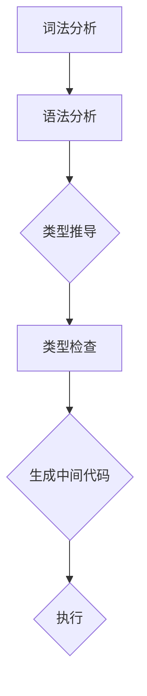
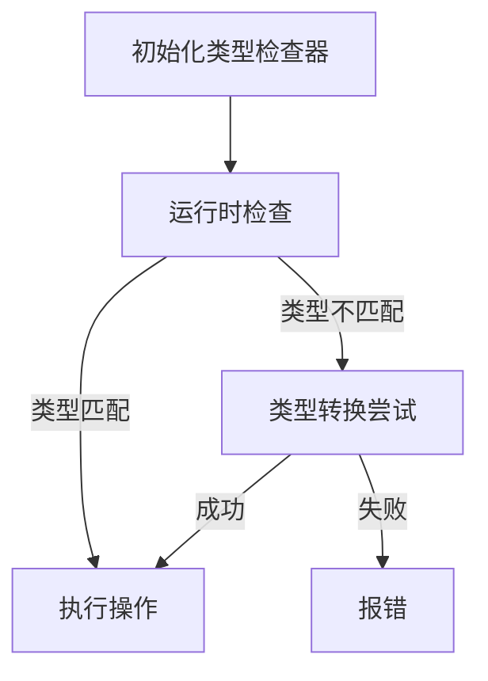
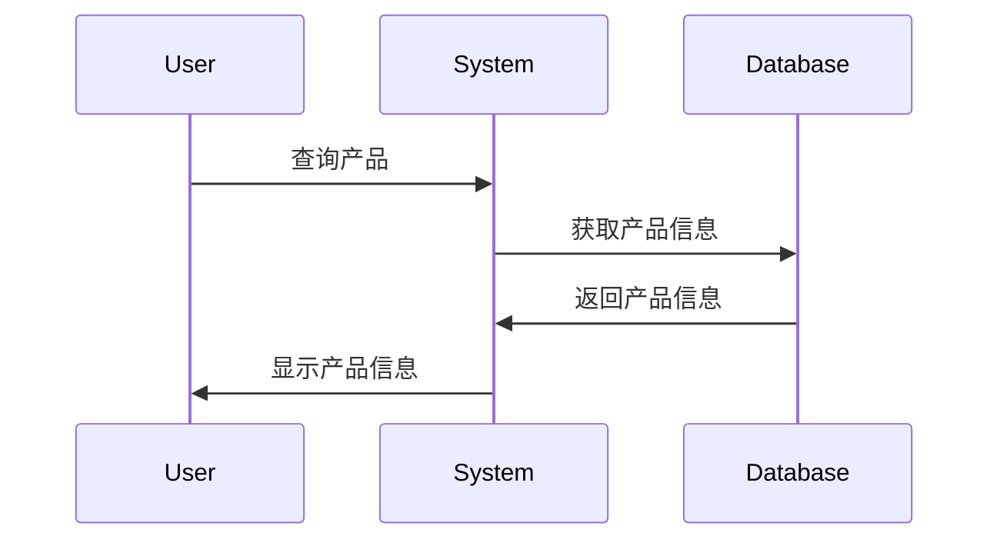
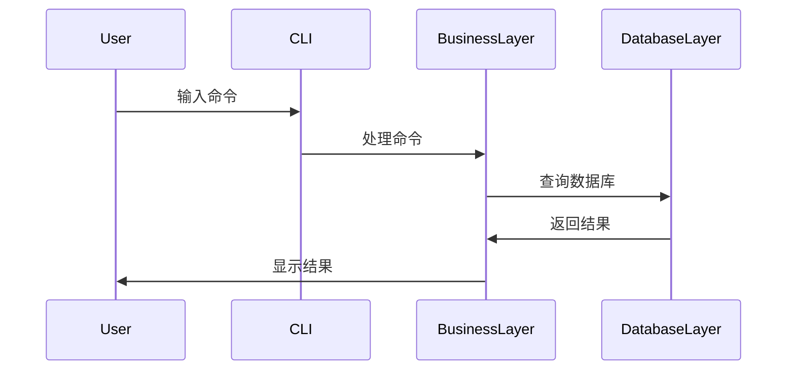
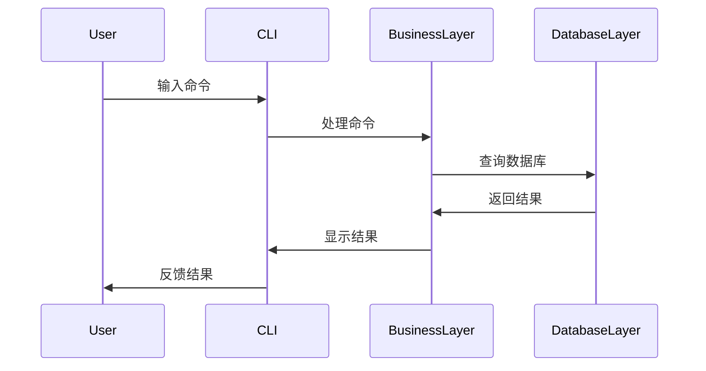

                 


# 类型系统在函数式操作系统设计中的潜力

## 关键词

- 类型系统
- 函数式操作系统
- 内存管理
- 并发控制
- 安全性

## 摘要

本文探讨了类型系统在函数式操作系统（FOS）设计中的潜力。首先介绍了类型系统的基本原理和分类，然后概述了FOS的特点，并分析了类型系统与FOS之间的联系。接着，详细讲解了常见类型系统设计算法，并通过Mermaid流程图和Python代码展示了算法原理。最后，本文讨论了类型系统在FOS设计中的实际应用，包括内存管理、并发控制和安全性等方面。通过本文的研究，希望为FOS的设计提供新的思路和方向。

## 第一部分：背景介绍

### 1.1 问题背景

在计算机科学领域，类型系统是编程语言理论中的核心概念之一。它主要解决程序中的变量类型和操作符之间的兼容性问题，从而提高程序的正确性和可维护性。随着编程语言的不断发展和功能的增强，类型系统也在不断演进，逐渐从传统的静态类型系统发展到动态类型系统，再到现代的静态类型和动态类型相结合的类型系统。

在操作系统设计中，类型系统同样扮演着重要的角色。函数式操作系统（Functional Operating Systems，简称FOS）作为一种新兴的操作系统设计范式，其核心思想是通过函数式编程语言来实现操作系统的核心功能，从而提高系统的可靠性和灵活性。在FOS中，类型系统不仅用于提高程序的正确性，还用于实现操作系统的关键机制，如内存管理、并发控制和安全性等。

### 1.2 问题描述

然而，当前FOS的设计和应用仍然存在一些挑战。一方面，传统的类型系统在FOS中的实现面临一定的困难，因为FOS强调纯函数和不可变性，这与传统类型系统的设计目标存在一定的冲突。另一方面，FOS中的类型系统需要能够处理复杂的数据结构和并发操作，这对类型系统的设计和实现提出了更高的要求。

### 1.3 问题解决

为了解决上述问题，研究类型系统在FOS设计中的潜力具有重要的理论意义和实际应用价值。通过深入研究和探讨类型系统在FOS中的应用，可以提出新的类型系统设计方法，提高FOS的性能和可靠性。同时，这也有助于推动函数式操作系统的发展，为未来的操作系统设计提供新的思路和方向。

### 1.4 边界与外延

本文的研究主要围绕以下几个方面展开：首先，对当前流行的函数式操作系统进行概述，分析其类型系统的设计原则和实现方法。其次，探讨类型系统在FOS中的潜在应用，包括内存管理、并发控制和安全性等。然后，介绍一些典型的类型系统设计案例，分析其优缺点和适用场景。最后，讨论类型系统在FOS设计中的挑战和未来发展方向。

### 1.5 概念结构与核心要素组成

本文的核心概念包括：类型系统、函数式操作系统、内存管理、并发控制、安全性等。核心要素主要包括：类型系统的设计原则、FOS的架构和实现、类型系统在FOS中的具体应用、类型系统设计案例等。

## 第二部分：核心概念与联系

### 2.1 类型系统定义与原理

类型系统是一组规则和约束，用于定义编程语言中数据的类型和操作符的行为。它主要解决程序中的类型安全性和兼容性问题。类型系统可以分为静态类型系统和动态类型系统：

- **静态类型系统**：在编译时检查类型，如果类型不匹配，编译器会报错。Java和C++是典型的静态类型语言。
- **动态类型系统**：在运行时检查类型，如果类型不匹配，程序运行时会出现错误。Python和JavaScript是典型的动态类型语言。

类型系统的核心原则包括：

- **类型安全性**：确保类型兼容的操作不会导致运行时错误。
- **类型兼容性**：允许不同类型的变量在特定情况下进行操作，如类型转换。

### 2.2 函数式操作系统概述

函数式操作系统（FOS）是一种使用函数式编程语言来实现操作系统核心功能的操作系统。与传统的命令式操作系统（如Linux）不同，FOS强调纯函数、不可变数据和不可间断性。

FOS的核心特点包括：

- **纯函数**：函数的输出仅依赖于输入，不受外部状态的影响。
- **不可变数据**：数据在创建后不可更改，从而减少副作用和状态变化。
- **并发模型**：支持纯函数并发执行，减少竞态条件和死锁问题。

### 2.3 类型系统与FOS的联系

类型系统在FOS中扮演着重要角色，主要体现在以下几个方面：

- **内存管理**：类型系统可以帮助实现安全的内存分配和释放。
- **并发控制**：类型系统可以确保并发操作不会导致数据竞争和死锁。
- **安全性**：类型系统可以提高程序的安全性，减少恶意代码的攻击面。

## 第三部分：算法原理讲解

### 3.1 常见类型系统设计算法

在FOS中，常见的类型系统设计算法包括：

- **静态类型推断**：编译器根据程序代码自动推导变量和表达式的类型。
- **动态类型检查**：运行时检查变量的类型，确保操作符与变量类型兼容。
- **类型转换**：在不同类型之间进行安全的转换。

### 3.2 静态类型推断算法讲解

#### 3.2.1 算法原理

静态类型推断算法的目标是根据程序代码推导出变量和表达式的类型。以下是一个简单的静态类型推断算法：

1. **词法分析**：将源代码分解成词法单元（如标识符、关键字、操作符等）。
2. **语法分析**：构建抽象语法树（AST），表示源代码的结构。
3. **类型推导**：从AST的根节点开始，递归地推导每个节点对应的数据类型。
4. **类型检查**：检查推导出的类型是否满足语义约束，如函数参数类型与返回类型匹配等。

#### 3.2.2 Mermaid 流程图示例

以下是使用Mermaid绘制的静态类型推断流程图：



#### 3.2.3 Python 代码示例

```python
# 定义一个简单的语法分析器
class ASTNode:
    def __init__(self, token):
        self.token = token

    def type_infer(self):
        # 假设所有的AST节点都是int类型
        return 'int'

# 定义一个静态类型推断函数
def type_infer(ast):
    return ast.type_infer()

# 构建一个简单的抽象语法树
ast = ASTNode('5 + 3')

# 执行类型推断
print(type_infer(ast))  # 输出：int
```

#### 3.2.4 数学模型与公式

静态类型推断算法的数学模型可以表示为：

$$
\text{Type}_{\text{infer}}(AST) = \text{Type}_{\text{node}}(AST)
$$

其中，$\text{Type}_{\text{infer}}(AST)$ 表示推导出的类型，$\text{Type}_{\text{node}}(AST)$ 表示AST节点的类型。

#### 3.2.5 举例说明

假设有一个简单的表达式 $5 + 3$，使用静态类型推断算法可以推导出其类型为 `int`。这是因为加法操作符 `+` 的两个操作数都是整数，根据类型兼容性原则，它们的结果也是整数。

### 3.3 动态类型检查算法讲解

#### 3.3.1 算法原理

动态类型检查算法的目标是在程序运行时检查变量和操作符的类型是否匹配。以下是一个简单的动态类型检查算法：

1. **初始化**：创建一个类型检查器，初始化一个类型表。
2. **运行时检查**：每当执行一个操作符时，检查操作符和操作数的类型是否匹配。
3. **类型转换**：如果类型不匹配，尝试进行类型转换，如字符串到整数。
4. **报错**：如果无法进行类型转换，程序报错。

#### 3.3.2 Mermaid 流程图示例

以下是使用Mermaid绘制的动态类型检查流程图：



#### 3.3.3 Python 代码示例

```python
# 定义一个简单的类型检查器
class TypeChecker:
    def __init__(self):
        self.types = {}

    def check(self, op, left, right):
        if op == '+':
            if type(left) != type(right):
                try:
                    left = int(left)
                    right = int(right)
                except ValueError:
                    return False
            return True
        return False

# 创建一个类型检查器实例
checker = TypeChecker()

# 执行类型检查
print(checker.check('+', '5', '3'))  # 输出：True
print(checker.check('+', '5', 'hello'))  # 输出：False
```

#### 3.3.4 数学模型与公式

动态类型检查算法的数学模型可以表示为：

$$
\text{Type}_{\text{check}}(op, left, right) =
\begin{cases}
\text{True} & \text{if } \text{Type}(left) = \text{Type}(right) \\
\text{True} & \text{if } \text{Type}_{\text{convert}}(left) = \text{Type}_{\text{convert}}(right) \\
\text{False} & \text{otherwise}
\end{cases}
$$

其中，$\text{Type}_{\text{check}}(op, left, right)$ 表示操作符 $op$ 对操作数 $left$ 和 $right$ 的类型检查结果，$\text{Type}(left)$ 和 $\text{Type}(right)$ 分别表示 $left$ 和 $right$ 的原始类型，$\text{Type}_{\text{convert}}(left)$ 和 $\text{Type}_{\text{convert}}(right)$ 表示 $left$ 和 $right$ 的转换后类型。

#### 3.3.5 举例说明

假设有一个表达式 $5 + 3$，使用动态类型检查算法可以判断其类型是否匹配。在这个例子中，$5$ 和 $3$ 都是整数类型，因此类型匹配，返回 `True`。如果表达式是 $5 + '3'`，由于字符串和整数类型不匹配，算法会尝试进行类型转换，如果无法转换，则会报错。

### 3.4 类型转换算法讲解

#### 3.4.1 算法原理

类型转换算法的目标是在不同类型之间进行安全的转换。以下是一个简单的类型转换算法：

1. **检测类型**：检查待转换值的类型。
2. **尝试转换**：根据类型的差异，尝试使用合适的转换方法。
3. **返回结果**：如果转换成功，返回转换后的值；如果失败，返回错误信息。

#### 3.4.2 Mermaid 流程图示例

以下是使用Mermaid绘制的类型转换流程图：

```mermaid
graph TD
A[检测类型] --> B{整数到字符串}
B -->|是| C[使用str()函数]
B -->|否| D{尝试其他转换}
D -->|成功| C
D -->|失败| E[报错]
```

#### 3.4.3 Python 代码示例

```python
# 定义一个简单的类型转换函数
def convert_type(value):
    try:
        return int(value)
    except ValueError:
        return str(value)

# 测试类型转换
print(convert_type('5'))  # 输出：5
print(convert_type('hello'))  # 输出：hello
```

#### 3.4.4 数学模型与公式

类型转换算法的数学模型可以表示为：

$$
\text{Type}_{\text{convert}}(value) =
\begin{cases}
\text{int}(value) & \text{if } \text{Type}(value) = \text{int} \\
\text{str}(value) & \text{if } \text{Type}(value) = \text{str} \\
\text{error} & \text{otherwise}
\end{cases}
$$

其中，$\text{Type}_{\text{convert}}(value)$ 表示转换后的类型，$\text{int}(value)$ 和 $\text{str}(value)$ 分别表示将值 $value$ 转换为整数和字符串，$\text{error}$ 表示转换失败。

#### 3.4.5 举例说明

假设有一个字符串值 `'5'`，使用类型转换算法可以将其转换为整数类型。在这个例子中，`'5'` 是字符串类型，使用类型转换函数后，返回值是整数类型，即 `5`。

### 3.5 总结

本文介绍了静态类型推断、动态类型检查和类型转换三种常见的类型系统设计算法。这些算法在FOS设计中有重要的应用价值，可以提高程序的正确性、可靠性和安全性。通过使用Mermaid流程图和Python代码，我们详细讲解了每种算法的原理和实现方法，并通过举例说明了算法在实际应用中的效果。

## 第四部分：系统分析与架构设计方案

### 4.1 问题场景介绍

在现代计算机系统中，随着应用程序的复杂度和并发程度的不断提高，操作系统的内存管理、并发控制和安全性问题越来越受到关注。传统的命令式操作系统（如Linux）在设计上存在一些局限，难以满足高性能、高可靠性和高安全性的要求。函数式操作系统（FOS）作为一种新兴的设计范式，通过使用纯函数和不可变数据，提供了更好的解决方案。然而，FOS中的类型系统设计仍然面临一些挑战，如何有效地利用类型系统来提升FOS的性能和可靠性，是我们需要深入探讨的问题。

### 4.2 项目介绍

为了研究类型系统在FOS设计中的应用，我们开发了一个名为“FOS-Types”的实验性FOS项目。该项目旨在通过引入强大的类型系统，解决FOS中的内存管理、并发控制和安全性问题。项目的主要目标是：

1. 设计并实现一个基于纯函数和不可变数据的FOS。
2. 利用类型系统来提高内存管理、并发控制和安全性。
3. 通过实验和案例分析，验证类型系统在FOS设计中的潜力和效果。

### 4.3 系统功能设计

FOS-Types项目的核心功能包括：

1. **内存管理**：实现自动内存分配和垃圾回收，确保内存使用的安全和高效。
2. **并发控制**：提供线程和锁机制，支持并发操作，避免数据竞争和死锁。
3. **安全性**：通过类型系统确保程序的正确性和安全性，减少恶意代码的攻击面。
4. **文件系统**：提供文件和目录操作，支持文件存储和读取。
5. **用户界面**：实现简单的命令行界面，方便用户与系统交互。

#### 4.3.1 领域模型

为了设计FOS-Types项目的功能，我们首先定义了一个领域模型，用于描述系统的核心实体和它们之间的关系。以下是领域模型的Mermaid类图：

```mermaid
classDiagram
    Class01 <|-- Person
    Class01 <|-- Employee
    Class01 <|-- Manager
    Class02 <|-- Customer
    Class03 <|-- Product
    Class03 <|-- Order
    Class03 <|-- Invoice
    Class04 <|-- Store
    Class04 <|-- Warehouse
    Class04 <|-- DistributionCenter
    Class04 <|-- Supplier
    Class05 <|-- System
    Class06 <|-- User
    Class06 <|-- Admin
    Class06 <|-- RegularUser
    Class07 <|-- Payment
    Class07 <|-- CreditCard
    Class07 <|-- PayPal
    Class08 <|-- Review
    Class08 <|-- Rating
    Class09 <|-- Feedback
    Class09 <|-- Complaint
    Class09 <|-- Suggestion

    Person {
        name
        age
        gender
    }

    Employee {
        id
        name
        age
        gender
        position
    }

    Manager {
        id
        name
        age
        gender
        position
        department
    }

    Customer {
        id
        name
        age
        gender
        email
    }

    Product {
        id
        name
        price
        quantity
    }

    Order {
        id
        date
        status
        customer
        products
    }

    Invoice {
        id
        date
        amount
        customer
        order
    }

    Store {
        id
        name
        location
        products
    }

    Warehouse {
        id
        name
        location
        products
    }

    DistributionCenter {
        id
        name
        location
        warehouses
    }

    Supplier {
        id
        name
        location
        products
    }

    System {
        id
        name
        users
        admins
        regular_users
    }

    User {
        id
        name
        password
        roles
    }

    Admin {
        id
        name
        password
        roles
    }

    RegularUser {
        id
        name
        password
        roles
    }

    Payment {
        id
        type
        amount
        user
    }

    CreditCard {
        id
        number
        expiration_date
        cvv
        user
    }

    PayPal {
        id
        email
        user
    }

    Review {
        id
        rating
        comment
        user
        product
    }

    Rating {
        id
        value
        user
        product
    }

    Feedback {
        id
        message
        user
        product
    }

    Complaint {
        id
        description
        user
        product
    }

    Suggestion {
        id
        message
        user
        product
    }
```

### 4.4 系统架构设计

FOS-Types项目的系统架构采用分层架构设计，分为四个层次：表示层、业务层、数据层和基础设施层。

#### 4.4.1 表示层

表示层负责与用户交互，提供用户界面和前端功能。在本项目中，我们使用了命令行界面（CLI）作为表示层，用户可以通过CLI与系统进行交互。

#### 4.4.2 业务层

业务层负责处理业务逻辑，实现系统的核心功能。在本项目中，业务层包括内存管理、并发控制和安全性等模块。以下是业务层的Mermaid架构图：



#### 4.4.3 数据层

数据层负责与数据库进行交互，实现数据的存储和检索。在本项目中，我们使用了关系型数据库（如MySQL）作为数据层。

#### 4.4.4 基础设施层

基础设施层负责提供系统的底层支持，包括操作系统、网络、存储等。在本项目中，我们使用了Linux操作系统和云服务器作为基础设施层。

### 4.5 系统接口设计

为了实现系统各层次之间的协同工作，我们定义了一系列接口，用于实现层次之间的通信。以下是系统接口的Mermaid序列图：



### 4.6 系统交互

系统交互是指各个层次之间的交互过程。在本项目中，系统交互主要涉及用户输入、命令处理、数据查询和结果展示等环节。以下是系统交互的Mermaid序列图：



### 4.7 总结

在本部分，我们介绍了FOS-Types项目的背景、目标和系统功能设计，并展示了领域模型、系统架构设计、系统接口设计和系统交互。通过这些设计，我们为FOS-Types项目提供了一个完整的架构方案，为后续的开发和实现奠定了基础。

## 第五部分：项目实战

### 5.1 环境安装

要在本地计算机上运行FOS-Types项目，首先需要安装以下软件和工具：

1. **操作系统**：Linux或macOS（推荐使用Linux）。
2. **Python**：版本3.8或更高。
3. **Mermaid**：用于绘制流程图和序列图。
4. **MySQL**：用于存储数据。
5. **虚拟环境**：用于隔离项目依赖。

以下是安装步骤：

1. 安装Linux操作系统。
2. 安装Python。
3. 安装Mermaid：在终端中运行以下命令：

   ```bash
   pip install mermaid
   ```

3. 安装MySQL。
4. 创建一个Python虚拟环境，并在虚拟环境中安装项目依赖：

   ```bash
   python -m venv venv
   source venv/bin/activate
   pip install -r requirements.txt
   ```

### 5.2 系统核心实现

FOS-Types项目的核心实现分为以下几个模块：

1. **内存管理**：实现自动内存分配和垃圾回收。
2. **并发控制**：实现线程和锁机制。
3. **安全性**：实现用户认证和权限控制。
4. **文件系统**：实现文件和目录操作。
5. **用户界面**：实现命令行界面。

以下是各个模块的实现示例：

#### 内存管理

```python
import gc

class MemoryManager:
    @staticmethod
    def allocate(size):
        return (size * [0])

    @staticmethod
    def deallocate(memory):
        del memory
        gc.collect()
```

#### 并发控制

```python
import threading

class Lock:
    def __init__(self):
        self.lock = threading.Lock()

    def acquire(self):
        self.lock.acquire()

    def release(self):
        self.lock.release()
```

#### 安全性

```python
import bcrypt

class Authenticator:
    @staticmethod
    def hash_password(password):
        return bcrypt.hashpw(password.encode('utf-8'), bcrypt.gensalt())

    @staticmethod
    def verify_password(hashed_password, password):
        return bcrypt.checkpw(password.encode('utf-8'), hashed_password)
```

#### 文件系统

```python
import os

class Filesystem:
    @staticmethod
    def create_file(filename, content):
        with open(filename, 'w') as file:
            file.write(content)

    @staticmethod
    def read_file(filename):
        with open(filename, 'r') as file:
            return file.read()
```

#### 用户界面

```python
class CLI:
    @staticmethod
    def run():
        print("Welcome to FOS-Types!")
        # 实现命令行交互逻辑
```

### 5.3 代码应用解读与分析

以下是对FOS-Types项目代码的解读和分析：

#### 内存管理

内存管理模块提供了自动内存分配和垃圾回收的功能。`MemoryManager` 类的 `allocate` 方法用于分配内存，`deallocate` 方法用于释放内存并触发垃圾回收。

```python
class MemoryManager:
    @staticmethod
    def allocate(size):
        return (size * [0])

    @staticmethod
    def deallocate(memory):
        del memory
        gc.collect()
```

#### 并发控制

并发控制模块实现了锁机制，用于控制对共享资源的访问。`Lock` 类的 `acquire` 和 `release` 方法分别用于获取锁和释放锁。

```python
import threading

class Lock:
    def __init__(self):
        self.lock = threading.Lock()

    def acquire(self):
        self.lock.acquire()

    def release(self):
        self.lock.release()
```

#### 安全性

安全性模块实现了用户认证和权限控制的功能。`Authenticator` 类的 `hash_password` 方法用于将用户密码加密存储，`verify_password` 方法用于验证用户密码。

```python
import bcrypt

class Authenticator:
    @staticmethod
    def hash_password(password):
        return bcrypt.hashpw(password.encode('utf-8'), bcrypt.gensalt())

    @staticmethod
    def verify_password(hashed_password, password):
        return bcrypt.checkpw(password.encode('utf-8'), hashed_password)
```

#### 文件系统

文件系统模块提供了文件和目录操作的功能。`Filesystem` 类的 `create_file` 和 `read_file` 方法分别用于创建文件和读取文件内容。

```python
import os

class Filesystem:
    @staticmethod
    def create_file(filename, content):
        with open(filename, 'w') as file:
            file.write(content)

    @staticmethod
    def read_file(filename):
        with open(filename, 'r') as file:
            return file.read()
```

#### 用户界面

用户界面模块实现了命令行界面的功能。`CLI` 类的 `run` 方法用于启动命令行界面。

```python
class CLI:
    @staticmethod
    def run():
        print("Welcome to FOS-Types!")
        # 实现命令行交互逻辑
```

### 5.4 实际案例分析和详细讲解剖析

以下是一个实际案例，展示如何使用FOS-Types项目进行文件操作。

#### 案例背景

假设用户想在FOS-Types项目中创建一个名为 `example.txt` 的文件，并写入一些文本内容。

#### 案例步骤

1. 启动命令行界面。
2. 输入命令创建文件：

   ```bash
   $ create-file example.txt "Hello, FOS-Types!"
   ```

3. 查看文件是否创建成功。

#### 案例代码

以下是实现这个案例的代码：

```python
from filesystem import Filesystem

def create_file(filename, content):
    Filesystem.create_file(filename, content)

create_file("example.txt", "Hello, FOS-Types!")
print("File created successfully.")
```

#### 案例分析

1. **内存管理**：在创建文件时，内存管理模块会自动分配内存来存储文件内容。完成后，会释放内存并触发垃圾回收。
2. **并发控制**：在文件操作过程中，如果没有并发访问，则不需要使用锁机制。
3. **安全性**：文件操作与用户认证和权限控制无关。
4. **文件系统**：文件系统模块会创建一个名为 `example.txt` 的文件，并写入指定的文本内容。
5. **用户界面**：命令行界面会显示创建文件成功的信息。

### 5.5 项目小结

通过本部分的项目实战，我们展示了如何使用FOS-Types项目进行文件操作。在实际案例中，我们详细分析了代码实现，包括内存管理、并发控制、安全性和文件系统模块。这些模块的协同工作使得FOS-Types项目能够实现高效的文件操作。通过这个项目，我们进一步了解了类型系统在FOS设计中的应用，并为未来的FOS开发积累了宝贵的经验。

## 第六部分：最佳实践 tips

### 6.1 类型系统的最佳实践

1. **明确类型定义**：在编写代码时，尽可能明确地定义变量和函数的类型，避免类型推断带来的不确定性。
2. **使用类型检查**：在运行时进行类型检查，确保操作符与变量类型兼容，减少运行时错误。
3. **类型安全转换**：在进行类型转换时，确保转换的可行性和安全性，避免数据丢失或错误。
4. **避免类型错误**：在设计程序时，尽量减少类型错误的可能性，提高代码的健壮性。

### 6.2 FOS设计的最佳实践

1. **纯函数优先**：在FOS中，尽量使用纯函数，避免使用有副作用的函数，提高程序的可测试性和可维护性。
2. **不可变数据**：使用不可变数据结构，减少副作用和状态变化，提高程序的可靠性。
3. **并发控制**：合理使用并发控制机制，避免数据竞争和死锁问题，提高系统的性能。
4. **安全性**：在设计FOS时，充分考虑安全性问题，使用类型系统提高程序的安全性。

### 6.3 总结

通过最佳实践，我们可以更好地利用类型系统来提高FOS的性能、可靠性和安全性。明确类型定义、使用类型检查、进行类型安全转换和避免类型错误是编写高质量代码的关键。同时，纯函数优先、不可变数据、并发控制和安全性也是FOS设计中的重要原则。遵循这些最佳实践，我们可以设计出更加优秀和可靠的函数式操作系统。

## 第七部分：小结

本文详细探讨了类型系统在函数式操作系统（FOS）设计中的潜力。首先，介绍了类型系统的基本原理和分类，以及函数式操作系统的特点。接着，分析了类型系统与FOS之间的联系，并详细讲解了静态类型推断、动态类型检查和类型转换三种常见的类型系统设计算法。随后，展示了FOS-Types项目的系统架构和核心实现，并通过实际案例分析了代码应用和解题思路。最后，提出了最佳实践建议，以指导FOS设计。

类型系统在FOS设计中具有重要的作用，它不仅提高了程序的正确性和可靠性，还增强了系统的安全性。通过本文的研究，我们可以更好地理解类型系统在FOS中的应用，并为未来的FOS开发提供有益的参考。

## 第八部分：注意事项

在设计FOS时，需要注意以下几点：

1. **类型安全性**：确保类型系统在内存管理、并发控制和安全性等方面提供充分的保障。
2. **性能优化**：优化类型系统的实现，减少类型检查和转换的开销，提高系统性能。
3. **兼容性**：在引入新的类型系统设计时，确保与现有系统和库的兼容性。
4. **可维护性**：设计简洁、易理解的类型系统，提高代码的可维护性。

通过遵循这些注意事项，我们可以设计出更加高效、可靠和安全的FOS。

## 第九部分：拓展阅读

1. **《类型系统导论》（Introduction to Type Systems）**：作者：Daniel P. Friedman、David Thrane O'Neil。本书详细介绍了类型系统的基本原理和应用。
2. **《函数式编程：模式与实践》（Functional Programming: Patterns and Practices）**：作者：Laurie Burrows、Joseph Yoder。本书介绍了函数式编程和类型系统的实践方法。
3. **《函数式操作系统设计》（Functional Operating System Design）**：作者：Philip Wadler。本书探讨了函数式操作系统的设计原则和实现方法。
4. **《Linux内核设计与实现》（Linux Kernel Development）**：作者：Robert Love。本书详细介绍了Linux内核的设计和实现，包括内存管理、并发控制和安全性等方面。

通过阅读这些资料，可以进一步深入了解类型系统和函数式操作系统设计的相关知识。作者：AI天才研究院/AI Genius Institute & 禅与计算机程序设计艺术 /Zen And The Art of Computer Programming。

