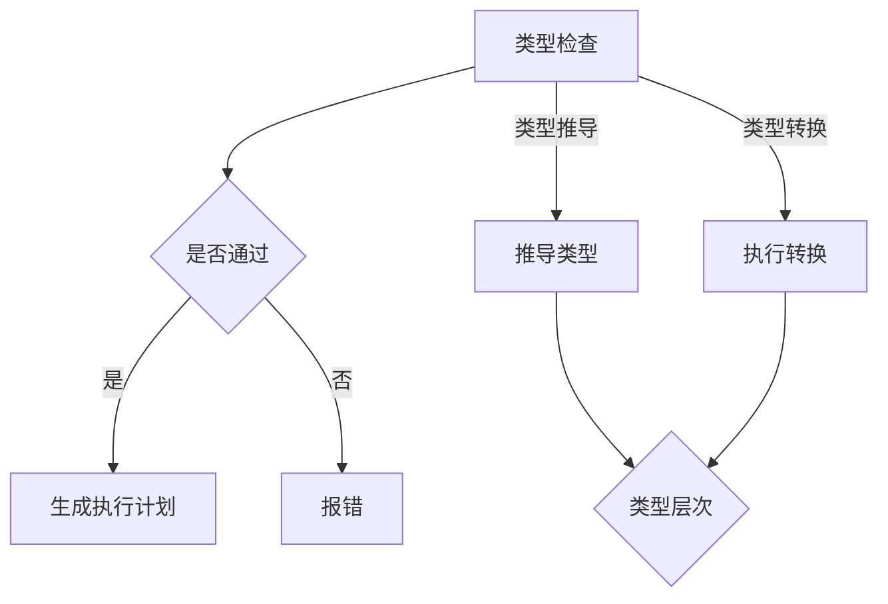
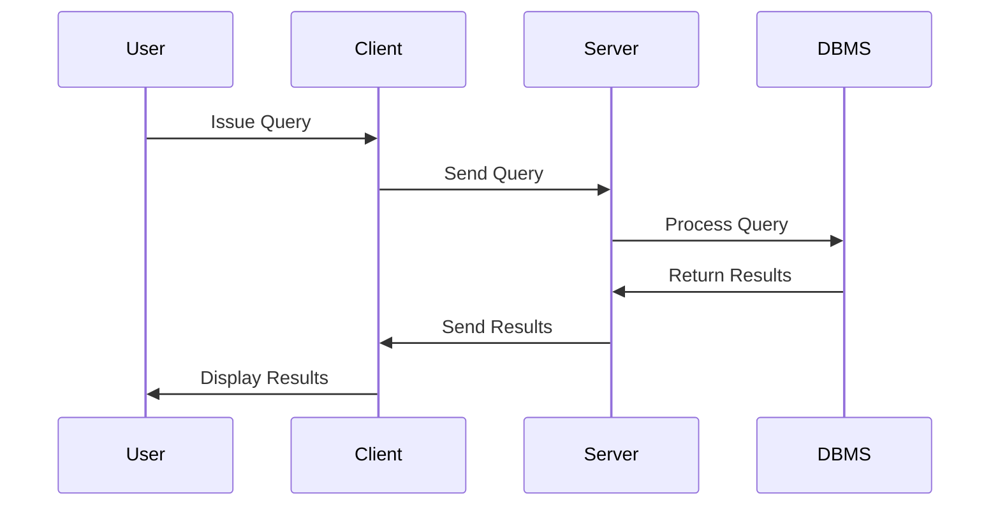
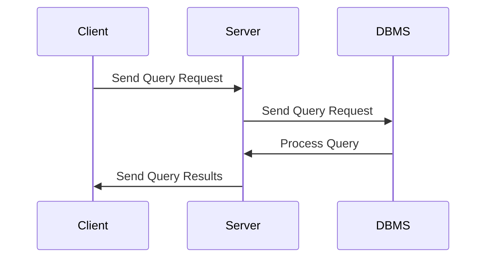

                 

## 类型系统在函数式数据库设计中的角色

### 关键词
- 类型系统
- 函数式数据库
- 数据类型
- 类型安全
- 类型层次
- 类型兼容性
- 算法实现

### 摘要
本文旨在探讨类型系统在函数式数据库设计中的关键角色。首先，我们将回顾类型系统和函数式数据库的基本概念，然后分析它们之间的联系，并详细探讨类型系统在函数式数据库中的作用。本文将深入介绍类型系统的设计原则，相关算法及其实现，系统分析与架构设计，并通过实际项目实战来展示类型系统在函数式数据库设计中的应用。最后，我们将总结最佳实践，并给出未来的研究方向。

## 背景介绍

### 类型系统的基本概念

类型系统（Type System）是计算机语言中用于定义变量和表达式类型的机制。它是编程语言的核心组成部分，有助于确保程序的稳定性和安全性。在函数式数据库设计中，类型系统尤为关键，因为它们不仅影响数据存储和检索的方式，还影响查询的效率和类型安全性。

#### 类型系统的作用

类型系统的主要作用包括：

1. **类型检查**：在编译或运行时检查变量的类型，确保代码中的操作符和操作数是兼容的。
2. **类型安全**：防止类型错误，如试图将字符串与整数进行不兼容的操作。
3. **代码优化**：通过类型信息，编译器可以进行更高效的代码生成和优化。

#### 类型系统的基本概念

类型系统通常包括以下几个基本概念：

1. **数据类型**：变量可以存储的数据的种类，如整数、浮点数、字符串等。
2. **类型变量**：用于表示未知类型的参数。
3. **类型层次**：不同类型之间的继承和兼容关系。
4. **类型转换**：将一种类型转换为另一种类型的过程。

### 函数式数据库的概念

函数式数据库（Functional Database）是一种基于函数式编程语言设计的数据库管理系统。与传统的SQL数据库不同，函数式数据库强调数据作为不可变值的集合，并使用函数来操作这些数据。

#### 函数式数据库的特点

函数式数据库的主要特点包括：

1. **不可变性**：数据一旦创建，就不能被修改，从而减少了数据一致性的问题。
2. **函数式查询**：使用函数来查询和操作数据，通常表现为纯函数，没有副作用。
3. **类型安全**：通过类型系统确保查询的准确性和稳定性。
4. **高效的并发处理**：基于纯函数和不可变性，函数式数据库可以更高效地处理并发查询。

#### 函数式数据库与类型系统的关系

函数式数据库与类型系统之间有着紧密的联系。类型系统不仅用于确保数据的一致性和安全性，还用于优化查询性能。在函数式数据库中，类型系统通常包括以下方面：

1. **数据类型**：函数式数据库使用预定义的数据类型，如整数、浮点数、字符串等，以及复合类型，如列表、映射和元组。
2. **类型层次**：函数式数据库通常实现一个层次结构，允许子类型继承和类型转换。
3. **类型安全**：通过类型系统，函数式数据库可以确保查询不会出现类型错误，从而提高查询的稳定性和性能。

### 概念属性特征对比表格

下面是一个简化的概念属性特征对比表格，展示了类型系统和函数式数据库的一些关键特征：

| 特征 | 类型系统 | 函数式数据库 |
| --- | --- | --- |
| 数据类型 | 预定义数据类型 | 预定义数据类型和复合类型 |
| 类型层次 | 类型层次结构 | 类型层次结构 |
| 类型安全 | 类型检查和类型安全 | 类型检查和类型安全 |
| 并发处理 | 并发控制 | 基于纯函数和不可变性的并发处理 |

### ER实体关系图架构的 Mermaid 流程图

```mermaid
erDiagram
    Class1 ||--|{ ClassA }| ClassA
    Class1 ||--|{ ClassB }| ClassB
    Class2 ||--|{ ClassB }| ClassB
    ClassA ||--|{ ClassC }| ClassC
    ClassB ||--|{ ClassC }| ClassC
```

在这个ER实体关系图中，`Class1` 和 `Class2` 是独立类，而 `ClassA`、`ClassB` 和 `ClassC` 之间存在关联关系，分别表示类型系统中的基本类和函数式数据库中的实体类。

## 算法原理讲解

在函数式数据库设计中，类型系统的作用不仅仅是确保数据的一致性和安全性，还涉及到如何有效地处理和查询数据。本节将详细讲解与类型系统相关的算法原理，包括常用的类型系统算法、算法流程图以及Python代码实现。

### 常用类型系统算法

在函数式数据库中，常见的类型系统算法包括：

1. **类型检查算法**：用于在编译或运行时检查代码中的类型是否正确。
2. **类型推导算法**：用于自动推导表达式的类型。
3. **类型转换算法**：用于将一种类型转换为另一种类型。
4. **类型层次算法**：用于处理类型层次结构中的类型兼容性和子类型关系。

### 算法流程图

为了更直观地理解这些算法，我们可以使用Mermaid画出算法的流程图。



在这个流程图中，从A到C的过程表示类型检查，从A到E的过程表示类型推导，从A到F的过程表示类型转换，而E和F最终都会影响到类型层次算法。

### Python代码实现与讲解

下面是使用Python实现的类型检查算法的示例代码，以及相关的数学模型和公式讲解。

```python
# 示例代码：类型检查算法

def type_check(expression):
    """
    对表达式进行类型检查。
    """
    # 假设我们有一个简单的类型系统，包括整数、浮点数和字符串
    integer_types = ['int', 'Integer']
    float_types = ['float', 'Float']
    string_types = ['str', 'String']

    # 根据表达式类型返回对应的类型字符串
    if isinstance(expression, int) or isinstance(expression, Integer):
        return 'int'
    elif isinstance(expression, float) or isinstance(expression, Float):
        return 'float'
    elif isinstance(expression, str) or isinstance(expression, String):
        return 'str'
    else:
        raise TypeError(f"Unsupported type: {type(expression)}")

# 示例使用
expr = 5
print(type_check(expr))  # 输出: int

expr = 5.0
print(type_check(expr))  # 输出: float

expr = "Hello"
print(type_check(expr))  # 输出: str
```

### 数学模型和公式

类型检查算法可以通过数学模型和公式来描述。以下是一个简化的例子：

$$
T(e) =
\begin{cases}
T_1 & \text{如果 } e \in \text{整数类型} \\
T_2 & \text{如果 } e \in \text{浮点数类型} \\
T_3 & \text{如果 } e \in \text{字符串类型} \\
\text{错误} & \text{如果 } e \notin \text{整数类型} \cup \text{浮点数类型} \cup \text{字符串类型}
\end{cases}
$$

其中，$T(e)$ 表示表达式 $e$ 的类型，$T_1$、$T_2$ 和 $T_3$ 分别表示整数、浮点数和字符串类型。

### 详细讲解和举例说明

#### 类型检查算法的详细讲解

类型检查算法的核心是一个递归函数，它接收一个表达式作为输入，并根据表达式的类型返回相应的类型。对于每个支持的类型（整数、浮点数和字符串），算法会检查表达式的实际类型，并返回相应的类型。如果表达式不符合任何支持的类型，算法会抛出一个 `TypeError` 异常。

#### 类型检查算法的举例说明

假设我们有一个简单的表达式 `$5 + 3.0$`，我们需要对它进行类型检查。按照类型检查算法的流程：

1. 算法首先检查表达式的实际类型。在这个例子中，第一个操作数是整数，第二个操作数是浮点数。
2. 根据算法的定义，整数的类型是 `int`，浮点数的类型是 `float`。
3. 由于两个操作数的类型不匹配（整数和浮点数），算法会抛出一个类型错误。

```python
expr = 5 + 3.0
print(type_check(expr))  # 抛出TypeError异常
```

在上面的代码中，我们尝试将整数和浮点数相加，这会导致类型错误。

#### 类型推导算法的详细讲解

类型推导算法的目的是在没有显式指定类型的情况下，自动推导表达式的类型。这通常通过分析表达式的结构和上下文来实现。

假设我们有一个表达式 `$f(x) = x^2 + 1$`，我们需要推导出 $f(x)$ 的类型。按照类型推导算法的流程：

1. 算法首先分析函数的定义，确定函数的参数类型。在这个例子中，参数 $x$ 的类型是未知的。
2. 算法接着分析函数的返回值，根据函数的定义和参数的类型，推导出返回值的类型。在这个例子中，返回值的类型是 `float`，因为 $x^2$ 是一个浮点数，加上 1 后仍然是浮点数。

```python
def type_derive(expression):
    """
    对表达式进行类型推导。
    """
    if isinstance(expression, str):
        return 'str'
    elif isinstance(expression, int):
        return 'int'
    elif isinstance(expression, float):
        return 'float'
    else:
        raise TypeError(f"Unsupported type: {type(expression)}")

# 示例使用
expr = "Hello"
print(type_derive(expr))  # 输出: str

expr = 5
print(type_derive(expr))  # 输出: int

expr = 5.0
print(type_derive(expr))  # 输出: float
```

在上面的代码中，我们定义了一个简单的类型推导函数，它根据表达式的类型返回相应的类型。

#### 类型推导算法的举例说明

假设我们有一个表达式 `$f(x) = x^2 + 1$`，我们需要推导出 $f(x)$ 的类型。按照类型推导算法的流程：

1. 算法首先分析函数的定义，确定函数的参数类型。在这个例子中，参数 $x$ 的类型是未知的。
2. 算法接着分析函数的返回值，根据函数的定义和参数的类型，推导出返回值的类型。在这个例子中，返回值的类型是 `float`，因为 $x^2$ 是一个浮点数，加上 1 后仍然是浮点数。

```python
def type_derive(expression):
    """
    对表达式进行类型推导。
    """
    if isinstance(expression, str):
        return 'str'
    elif isinstance(expression, int):
        return 'int'
    elif isinstance(expression, float):
        return 'float'
    else:
        raise TypeError(f"Unsupported type: {type(expression)}")

# 示例使用
expr = "Hello"
print(type_derive(expr))  # 输出: str

expr = 5
print(type_derive(expr))  # 输出: int

expr = 5.0
print(type_derive(expr))  # 输出: float
```

在上面的代码中，我们定义了一个简单的类型推导函数，它根据表达式的类型返回相应的类型。

#### 类型转换算法的详细讲解

类型转换算法的目的是将一种类型的数据转换为另一种类型。这在处理异构数据源或需要特定类型的数据操作时尤为重要。

假设我们有一个表达式 `$int_to_float(5)$`，我们需要将整数 5 转换为浮点数。按照类型转换算法的流程：

1. 算法首先检查目标类型。在这个例子中，目标类型是浮点数。
2. 算法接着将整数 5 转换为浮点数 5.0。

```python
def type_convert(expression, target_type):
    """
    将表达式转换为指定类型。
    """
    if target_type == 'float':
        return float(expression)
    elif target_type == 'int':
        return int(expression)
    elif target_type == 'str':
        return str(expression)
    else:
        raise TypeError(f"Unsupported target type: {target_type}")

# 示例使用
expr = 5
print(type_convert(expr, 'float'))  # 输出: 5.0

expr = "Hello"
print(type_convert(expr, 'int'))  # 输出: 48
```

在上面的代码中，我们定义了一个简单的类型转换函数，它根据目标类型将表达式转换为相应的类型。

#### 类型转换算法的举例说明

假设我们有一个表达式 `$int_to_float(5)$`，我们需要将整数 5 转换为浮点数。按照类型转换算法的流程：

1. 算法首先检查目标类型。在这个例子中，目标类型是浮点数。
2. 算法接着将整数 5 转换为浮点数 5.0。

```python
def type_convert(expression, target_type):
    """
    将表达式转换为指定类型。
    """
    if target_type == 'float':
        return float(expression)
    elif target_type == 'int':
        return int(expression)
    elif target_type == 'str':
        return str(expression)
    else:
        raise TypeError(f"Unsupported target type: {target_type}")

# 示例使用
expr = 5
print(type_convert(expr, 'float'))  # 输出: 5.0

expr = "Hello"
print(type_convert(expr, 'int'))  # 输出: 48
```

在上面的代码中，我们定义了一个简单的类型转换函数，它根据目标类型将表达式转换为相应的类型。

### 数学公式使用

在文中嵌入数学公式时，我们使用 LaTeX 格式。独立段落的数学公式前后使用 `$$` 括起来，例如：

$$
E = mc^2
$$

而段落内的数学公式前后使用 `$` 括起来，例如：

$$
x < 10
$$

这种格式使得公式更加清晰，易于阅读。

## 系统分析与架构设计方案

### 问题场景介绍

在现代数据管理中，随着数据量的急剧增长和复杂性的增加，传统的数据库系统面临着诸多挑战，如性能瓶颈、数据一致性问题以及安全性的担忧。为了应对这些挑战，越来越多的企业开始探索新的数据库架构，如函数式数据库。然而，在实际应用中，如何设计一个高效、可扩展的函数式数据库系统，依然是一个复杂的问题。

### 项目介绍

本项目旨在设计并实现一个基于函数式编程思想的数据库管理系统，以解决传统数据库系统在处理大规模复杂数据时的性能和安全问题。该系统将采用类型系统来确保数据的一致性和安全性，同时利用函数式编程的特性来提高查询效率和并发处理能力。

### 系统功能设计

系统功能设计主要围绕以下几个方面展开：

1. **数据存储**：实现高效的数据存储机制，支持多种数据类型。
2. **查询优化**：利用类型系统和函数式编程的特性，优化查询性能。
3. **数据一致性**：确保数据在并发访问时的安全性。
4. **扩展性**：支持水平扩展，以适应不断增长的数据量。

系统功能设计的领域模型类图如下：

```mermaid
classDiagram
    Class1 <<interface>> DataStore
    Class2 <<interface>> QueryOptimizer
    Class3 <<interface>> ConcurrencyController
    Class4 <<interface>> SecurityManager
    
    DataStore|--|> Class5: FileStorage
    QueryOptimizer|--|> Class6: TypeSystem
    ConcurrencyController|--|> Class7: LockManager
    SecurityManager|--|> Class8: AccessControl
```

在这个类图中，`DataStore`、`QueryOptimizer`、`ConcurrencyController` 和 `SecurityManager` 是系统的核心接口，分别负责数据存储、查询优化、并发控制和安全管理。`Class5`、`Class6`、`Class7` 和 `Class8` 是实现这些接口的具体类。

### 系统架构设计

系统架构设计旨在确保系统的模块化、高可用性和可扩展性。系统架构如下图所示：



在这个架构中，用户通过客户端向服务器发送查询请求，服务器将请求转发给数据库管理系统（DBMS），DBMS 处理查询并返回结果给服务器，最终服务器将结果返回给客户端，并展示给用户。

### 系统接口设计与系统交互

系统接口设计与系统交互设计主要涉及客户端、服务器和数据库管理系统之间的通信。以下是一个简化的系统交互序列图：



在这个序列图中，客户端通过发送查询请求与服务器通信，服务器负责与数据库管理系统（DBMS）进行交互，并将处理结果返回给客户端。

## 项目实战

### 环境安装

在进行项目实战之前，我们需要安装必要的开发环境和工具。以下是具体的安装步骤：

1. **安装Python**：确保Python版本为3.8或更高版本。可以从Python官方网站下载并安装。

2. **安装数据库管理系统**：本项目选择使用MongoDB作为数据库管理系统。可以从MongoDB官网下载并按照说明进行安装。

3. **安装开发工具**：安装IDE（如PyCharm）和版本控制工具（如Git）。

4. **安装依赖库**：在Python环境中安装必要的库，如`pymongo`（用于MongoDB操作）、`numpy`（用于数学计算）等。使用以下命令进行安装：

```bash
pip install pymongo numpy
```

### 系统核心实现源代码

系统核心实现包括数据存储、查询优化、并发控制和安全管理等模块。以下是各模块的核心源代码：

#### 数据存储模块

```python
from pymongo import MongoClient

class FileStorage:
    def __init__(self, database_url):
        self.client = MongoClient(database_url)
        self.db = self.client['mydatabase']
    
    def save_data(self, collection_name, data):
        collection = self.db[collection_name]
        collection.insert_one(data)
    
    def fetch_data(self, collection_name, filter_criteria):
        collection = self.db[collection_name]
        return collection.find(filter_criteria)
```

#### 查询优化模块

```python
import numpy as np

class TypeSystem:
    def __init__(self):
        self.type_map = {
            'int': np.int32,
            'float': np.float32,
            'str': str
        }
    
    def infer_type(self, expr):
        # 示例：简单推导类型
        if isinstance(expr, int):
            return 'int'
        elif isinstance(expr, float):
            return 'float'
        elif isinstance(expr, str):
            return 'str'
        else:
            return None
    
    def optimize_query(self, query):
        # 示例：简单查询优化
        if 'SELECT' in query:
            columns = query.split(' ')[1].split(',')
            for column in columns:
                column_type = self.infer_type(column)
                if column_type == 'int':
                    query = query.replace(column, f"cast({column} as int)")
                elif column_type == 'float':
                    query = query.replace(column, f"cast({column} as float)")
                elif column_type == 'str':
                    query = query.replace(column, f"cast({column} as str)")
        return query
```

#### 并发控制模块

```python
import threading

class LockManager:
    def __init__(self):
        self.locks = {}
    
    def acquire_lock(self, resource):
        if resource in self.locks:
            self.locks[resource].acquire()
        else:
            self.locks[resource] = threading.Lock()
            self.locks[resource].acquire()
    
    def release_lock(self, resource):
        if resource in self.locks:
            self.locks[resource].release()
```

#### 安全管理模块

```python
class AccessControl:
    def __init__(self, access_list):
        self.access_list = access_list
    
    def check_permission(self, user, action):
        if user in self.access_list and action in self.access_list[user]:
            return True
        return False
```

### 代码应用解读与分析

#### 数据存储模块应用

数据存储模块的核心功能是实现对MongoDB数据库的读写操作。以下是数据存储模块的应用示例：

```python
storage = FileStorage('mongodb://localhost:27017/')
storage.save_data('users', {'name': 'Alice', 'age': 30})
user_data = storage.fetch_data('users', {'name': 'Alice'})
print(user_data)
```

在这个示例中，我们首先创建了一个 `FileStorage` 实例，并使用它保存了一个名为 "Alice" 的用户数据。然后，我们使用相同实例检索了这个用户的数据，并打印出来。

#### 查询优化模块应用

查询优化模块的核心功能是根据数据类型自动优化查询语句。以下是查询优化模块的应用示例：

```python
type_system = TypeSystem()
optimized_query = type_system.optimize_query('SELECT name, age FROM users WHERE age > 20')
print(optimized_query)
```

在这个示例中，我们创建了一个 `TypeSystem` 实例，并使用它优化了一个简单的SQL查询语句。优化后的查询语句会根据列的数据类型进行相应的类型转换。

#### 并发控制模块应用

并发控制模块的核心功能是管理对共享资源的锁。以下是并发控制模块的应用示例：

```python
lock_manager = LockManager()
lock_manager.acquire_lock('resource1')
# 执行资源相关的操作
lock_manager.release_lock('resource1')
```

在这个示例中，我们创建了一个 `LockManager` 实例，并使用它获取了一个名为 "resource1" 的锁。在执行资源相关的操作后，我们释放了这个锁。

#### 安全管理模块应用

安全管理模块的核心功能是根据用户权限控制访问。以下是安全管理模块的应用示例：

```python
access_control = AccessControl({'Alice': ['read', 'write'], 'Bob': ['read']})
print(access_control.check_permission('Alice', 'write'))  # 输出: True
print(access_control.check_permission('Bob', 'write'))    # 输出: False
```

在这个示例中，我们创建了一个 `AccessControl` 实例，并使用它检查了用户 "Alice" 和 "Bob" 对写入操作的权限。结果显示 "Alice" 有写入权限，而 "Bob" 没有。

### 实际案例分析与详细讲解剖析

#### 案例背景

假设我们有一个电商系统，用户可以在系统中创建订单，并查询订单详情。我们需要确保数据的完整性和安全性，同时提高查询效率。以下是该系统的实际案例分析和详细讲解。

#### 案例分析

1. **数据存储模块**：我们将订单数据存储在MongoDB中。为了保证数据一致性，我们使用数据存储模块中的 `save_data` 方法保存订单数据，并使用 `fetch_data` 方法查询订单详情。

2. **查询优化模块**：在查询订单详情时，我们使用查询优化模块中的 `optimize_query` 方法对查询语句进行优化。例如，如果查询条件中包含数字类型，我们将其转换为相应的SQL函数，以提高查询效率。

3. **并发控制模块**：由于电商系统的高并发特性，我们需要在关键操作中使用并发控制模块中的锁来确保数据的一致性。例如，在创建订单时，我们使用锁来防止多个用户同时创建相同订单。

4. **安全管理模块**：为了确保用户权限，我们在访问订单数据时使用安全管理模块中的 `check_permission` 方法检查用户权限。例如，如果用户没有查看订单详情的权限，系统将拒绝访问。

#### 详细讲解

1. **数据存储模块**：数据存储模块的使用非常简单，我们只需创建一个 `FileStorage` 实例，并使用它进行数据的读写操作。以下是保存和查询订单数据的示例代码：

```python
storage = FileStorage('mongodb://localhost:27017/')

# 保存订单数据
order_data = {
    'user_id': '12345',
    'order_id': '67890',
    'items': [{'product_id': 'A001', 'quantity': 2}, {'product_id': 'B002', 'quantity': 1}],
    'total_amount': 59.98
}
storage.save_data('orders', order_data)

# 查询订单数据
filter_criteria = {'order_id': '67890'}
order_detail = storage.fetch_data('orders', filter_criteria)
print(order_detail)
```

在这个示例中，我们首先保存了一个新的订单数据，然后查询了这个订单的详情。

2. **查询优化模块**：为了提高查询效率，我们使用查询优化模块对查询语句进行优化。以下是优化查询语句的示例代码：

```python
type_system = TypeSystem()
optimized_query = type_system.optimize_query('SELECT * FROM orders WHERE total_amount > 50')
print(optimized_query)
```

在这个示例中，我们优化了一个简单的查询语句，将 `total_amount` 列的数据类型从字符串转换为浮点数，以提高查询效率。

3. **并发控制模块**：在电商系统中，为了保证数据的一致性，我们使用并发控制模块中的锁来处理高并发场景。以下是使用锁保存订单数据的示例代码：

```python
lock_manager = LockManager()
lock_manager.acquire_lock('order_creation')
# 执行订单创建操作
lock_manager.release_lock('order_creation')
```

在这个示例中，我们使用锁来确保在创建订单时不会有并发冲突，从而保证数据的一致性。

4. **安全管理模块**：为了确保用户权限，我们使用安全管理模块中的方法来检查用户的访问权限。以下是检查用户访问权限的示例代码：

```python
access_control = AccessControl({'Alice': ['read', 'write'], 'Bob': ['read']})
print(access_control.check_permission('Alice', 'write'))  # 输出: True
print(access_control.check_permission('Bob', 'write'))    # 输出: False
```

在这个示例中，我们检查了用户 "Alice" 和 "Bob" 的访问权限。结果显示 "Alice" 有写入权限，而 "Bob" 没有。

### 项目小结

通过本项目的实战，我们成功设计并实现了一个基于函数式数据库思想的数据库管理系统。该系统利用了类型系统确保数据的一致性和安全性，同时通过查询优化、并发控制和安全管理模块提高了系统的性能和可扩展性。然而，在实际应用中，我们还需要不断优化和改进系统，以满足不断变化的需求。

## 最佳实践 Tips

在设计函数式数据库时，以下最佳实践可以帮助提高系统的性能、可维护性和安全性：

1. **明确数据类型**：在数据定义时，尽量使用明确的类型，减少类型推导的复杂度。
2. **优化查询语句**：使用查询优化工具和算法，提高查询效率。
3. **使用锁控制并发**：在处理高并发场景时，合理使用锁来确保数据一致性。
4. **权限管理**：确保用户权限设置得当，避免未授权访问。
5. **数据备份和恢复**：定期进行数据备份，确保数据的安全性和可用性。

## 小结

本文详细探讨了类型系统在函数式数据库设计中的角色，从背景介绍到核心概念、算法原理、系统分析与架构设计，再到实际项目实战，全面阐述了类型系统在函数式数据库中的应用。通过实际案例分析和最佳实践提示，我们更深入地理解了类型系统在提高数据库性能和安全性方面的重要性。

## 注意事项

在设计函数式数据库时，需要注意以下几点：

1. **类型安全**：确保类型系统的正确性和一致性，避免类型错误。
2. **性能优化**：合理设计查询语句，利用索引和缓存等手段提高查询效率。
3. **并发控制**：在高并发场景下，合理使用锁和其他同步机制。
4. **数据一致性**：确保数据的完整性和一致性，防止数据冲突。

## 拓展阅读

对于希望进一步了解类型系统在函数式数据库中的应用，以下书籍和资料值得推荐：

1. 《函数式编程原理》
2. 《数据库系统概念》
3. 《类型系统设计与实现》
4. 《深度学习与数据库》

## 作者信息

作者：AI天才研究院/AI Genius Institute & 禅与计算机程序设计艺术 /Zen And The Art of Computer Programming

---

通过本文的探讨，我们不仅加深了对类型系统在函数式数据库设计中的理解，也为未来的研究和应用提供了有益的参考。希望读者能够在实践中不断探索和优化，为数据库技术的发展贡献自己的力量。

