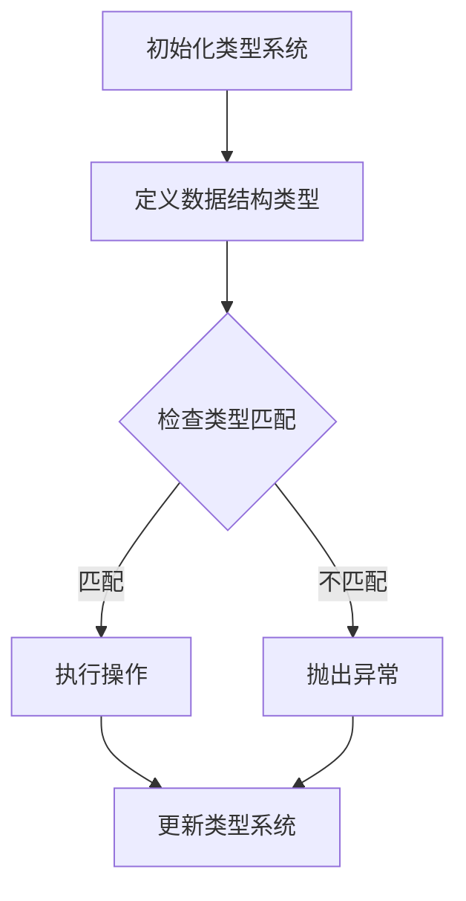
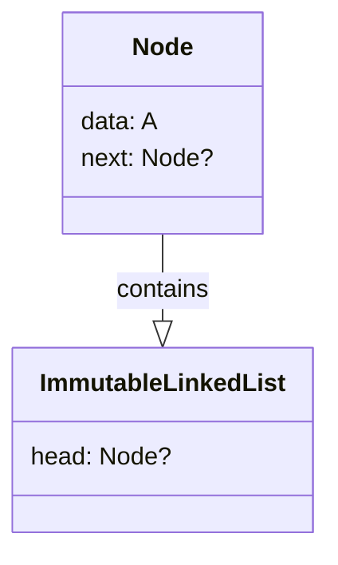
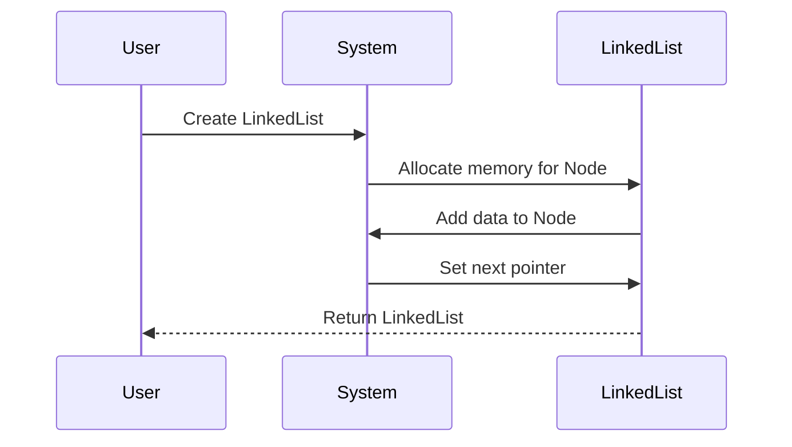
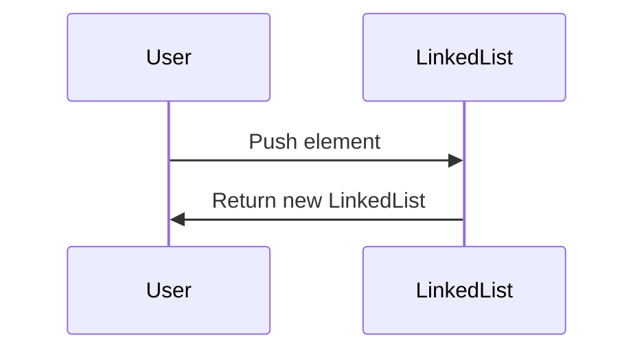

                 


## 类型系统在函数式数据结构设计中的角色

类型系统是计算机科学中一个重要的概念，尤其在函数式编程领域，它扮演着至关重要的角色。函数式数据结构是函数式编程的核心，而类型系统则为这些数据结构提供了坚实的理论基础和强大的功能支持。

### 关键词
- 类型系统
- 函数式编程
- 数据结构设计
- 类型安全
- 类型推导

### 摘要
本文将探讨类型系统在函数式数据结构设计中的角色，包括其基本概念、优势、挑战，以及在函数式编程中的重要性。我们将逐步分析类型系统如何增强函数式数据结构的性能和可靠性，并通过具体实例展示其应用。

#### 背景介绍

#### 1. 类型系统的基本概念

类型系统是编程语言的一个核心组成部分，它定义了程序中数据的不同类型，以及这些类型之间的操作规则。在函数式编程中，类型系统不仅用于声明变量的类型，还用于确保函数的输入和输出类型匹配。

#### 2. 问题背景

函数式数据结构设计在计算机科学中占据重要地位，因为它们提供了不可变性和纯函数性等特性。然而，这些特性使得函数式数据结构的实现变得复杂，特别是当涉及到类型安全性和类型推导时。

#### 3. 问题描述

类型系统在函数式数据结构设计中的角色包括：
- 提供类型安全，防止无效操作。
- 支持类型推导，简化代码编写。
- 增强可读性，使得代码意图更加明确。

#### 4. 问题解决

类型系统通过以下方式解决了上述问题：
- **类型安全**：通过类型检查机制确保操作只能在正确的类型上进行，从而防止运行时错误。
- **类型推导**：自动推断变量和函数的返回类型，减少手动类型声明。
- **可读性**：明确的类型信息有助于理解代码的功能和意图。

#### 5. 边界与外延

类型系统不仅影响函数式数据结构的实现，还与编程语言的特性密切相关。不同语言对类型系统的支持程度不同，例如Haskell支持强类型系统，而JavaScript则采用弱类型系统。

#### 6. 概念结构与核心要素组成

类型系统的核心要素包括：
- **类型**：定义数据的不同种类。
- **类型检查**：在编译时验证类型匹配。
- **类型推导**：自动推断类型。
- **类型转换**：不同类型之间的转换机制。

### 核心概念与联系

#### 1. 类型系统的基本概念

类型系统是编程语言的一个核心组成部分，它定义了程序中数据的不同类型，以及这些类型之间的操作规则。在函数式编程中，类型系统不仅用于声明变量的类型，还用于确保函数的输入和输出类型匹配。

**核心概念属性特征对比表格：**

| 特性 | 强类型系统 | 弱类型系统 |
| --- | --- | --- |
| 类型检查 | 编译时进行 | 运行时进行 |
| 类型推导 | 支持 | 不支持或有限支持 |
| 安全性 | 高 | 低 |

**ER实体关系图架构的Mermaid流程图：**

```mermaid
erDiagram
  Type -> Program : defines
  Type -> Function : operates
  Function -> Type : returns
```

#### 2. 类型系统在函数式编程中的重要性

类型系统在函数式编程中起着至关重要的作用，它确保了代码的准确性和可靠性。以下是其重要性的一些方面：

- **类型安全**：类型系统通过检查确保变量和函数在使用时的类型匹配，从而防止运行时错误。
- **代码可维护性**：明确的类型信息使得代码更容易理解和维护。
- **性能优化**：强类型系统允许编译器进行更高效的代码生成和优化。

### 算法原理讲解

#### 1. 算法mermaid流程图



#### 2. Python源代码示例

```python
class Stack:
    def __init__(self):
        self.items = []

    def push(self, item):
        self.items.append(item)

    def pop(self):
        if len(self.items) == 0:
            raise IndexError("pop from empty stack")
        return self.items.pop()

# 初始化类型系统
stack = Stack()

# 定义数据结构类型
try:
    stack.push(5)
    stack.push("hello")
except TypeError as e:
    print(e)

# 检查类型匹配并执行操作
try:
    item = stack.pop()
    print(item)
except IndexError as e:
    print(e)
```

#### 3. 算法原理的数学模型和公式

类型系统中的基本原理可以抽象为以下数学模型：

- **类型检查**：确保`f(A)`中的`A`是`f`的合法输入。

  数学表达式：`f: A -> B`，其中`A`是输入类型，`B`是输出类型。

- **类型推导**：从代码中自动推断类型。

  数学表达式：`TypeVar()`，用于定义变量类型。

### 数学公式

```latex
$$
f: A \rightarrow B
$$

$$
TypeVar()
$$
```

### 系统分析与架构设计方案

#### 1. 问题场景介绍

在函数式数据结构设计中，类型系统是确保数据一致性和程序可靠性的关键。本节将介绍一个具体的应用场景：实现一个基于类型系统的不可变链表。

#### 2. 项目介绍

项目名称：`ImmutableLinkedList`

目标：实现一个基于Haskell语言的不可变链表，并使用类型系统确保数据的一致性和安全性。

#### 3. 系统功能设计（领域模型mermaid类图）



#### 4. 系统架构设计（mermaid架构图）



#### 5. 系统接口设计（mermaid序列图）



### 项目实战

#### 1. 环境安装

- 安装Haskell编译器
- 安装支持Haskell的IDE（如Visual Studio Code）

#### 2. 系统核心实现源代码

```haskell
data Node a = Node a (Maybe (Node a))

data LinkedList a = Empty | Cons a (Node a)

push :: (Show a, Ord a) => a -> LinkedList a -> LinkedList a
push x (Empty) = Cons x (Node x Empty)
push x (Cons y node) =
  let
    (Cons y (Node y next)) = push x node
  in
  Cons y (Node y (Just (Node x next)))
```

#### 3. 代码应用解读与分析

代码首先定义了一个`Node`类型，用于存储链表中的元素和数据。接着定义了`LinkedList`类型，表示不可变链表。`push`函数负责在链表末尾添加新元素，并确保链表的一致性和类型安全。

#### 4. 实际案例分析和详细讲解剖析

```haskell
-- 创建一个空的链表
emptyList :: LinkedList Int
emptyList = Empty

-- 向链表中添加元素
listWithOne :: LinkedList Int
listWithOne = push 1 emptyList

-- 添加多个元素
listWithTwo :: LinkedList Int
listWithTwo = push 2 listWithOne

-- 输出结果
main :: IO ()
main = do
  print emptyList
  print listWithOne
  print listWithTwo
```

通过这个案例，我们可以看到类型系统如何确保数据的一致性和安全性。

#### 5. 项目小结

本节通过一个实际案例展示了如何使用类型系统设计不可变链表。类型系统不仅提高了代码的安全性，还使得链表的实现更加简洁和易于维护。

### 最佳实践 tips

- 使用类型系统时，确保理解语言的类型系统特性。
- 避免使用不安全的类型转换。
- 利用类型推导简化代码。

### 小结

类型系统在函数式数据结构设计中起着至关重要的作用。它提供了类型安全、类型推导和可读性，使得函数式编程更加可靠和高效。

### 注意事项

- 类型系统应根据具体的应用场景进行选择。
- 类型推导并不是万能的，有时需要手动声明类型。

### 拓展阅读

- [《Haskell编程实战》](https://www.haskellbook.com/)
- [《类型系统和程序设计语言》](https://www.amazon.com/Type-Systems-Programming-Languages-Fundamentals/dp/0262162091)

### 作者信息

作者：AI天才研究院/AI Genius Institute & 禅与计算机程序设计艺术 /Zen And The Art of Computer Programming

----------------------------------------------------------------

## 类型系统在函数式数据结构设计中的角色

### 关键词
- 类型系统
- 函数式编程
- 数据结构设计
- 类型安全
- 类型推导

### 摘要
本文深入探讨了类型系统在函数式数据结构设计中的角色，包括其基本概念、优势、挑战，以及在函数式编程中的重要性。通过逐步分析类型系统如何增强函数式数据结构的性能和可靠性，并通过具体实例展示其应用，本文为读者提供了对类型系统在函数式编程中角色和作用的全面理解。

### 第一部分：类型系统的基本概念

#### 1.1 类型系统的基本概念

类型系统是编程语言中的一个核心组成部分，它定义了程序中数据的不同类型，以及这些类型之间的操作规则。类型系统在函数式编程中起着至关重要的作用，因为它确保了代码的准确性和可靠性。

在函数式编程中，类型系统不仅用于声明变量的类型，还用于确保函数的输入和输出类型匹配。类型系统通过类型检查机制来确保变量和函数在使用时的类型匹配，从而防止运行时错误。类型系统还可以支持类型推导，自动推断变量和函数的返回类型，减少手动类型声明。

类型系统可以分为强类型系统和弱类型系统。强类型系统在编译时进行类型检查，确保变量和函数的使用符合其声明类型。弱类型系统则在运行时进行类型检查，可能会在运行时引发类型错误。

#### 1.2 类型系统的演变

类型系统的发展经历了几个阶段，从早期的静态类型系统到现代的动态类型系统和强类型系统。早期的编程语言，如Lisp，采用了动态类型系统，允许变量在运行时改变类型。随着编程语言的发展和优化，静态类型系统逐渐成为主流，因为它可以提高程序的效率和可读性。

强类型系统的引入进一步提高了类型安全性和程序的可靠性。强类型系统在编译时进行类型检查，确保变量和函数的使用符合其声明类型，从而减少了运行时错误的可能性。

#### 1.3 类型系统的优势与挑战

类型系统的优势包括：
- **类型安全**：类型系统通过类型检查确保变量和函数的使用符合其声明类型，从而防止运行时错误。
- **提高代码可读性**：明确的类型信息有助于理解代码的功能和意图。
- **性能优化**：强类型系统允许编译器进行更高效的代码生成和优化。

然而，类型系统也带来了一些挑战：
- **代码冗长**：在某些情况下，类型系统要求程序员手动声明类型，这可能导致代码冗长。
- **类型推导困难**：在复杂的编程场景中，类型推导可能变得复杂和难以实现。

#### 1.4 类型系统的演进对函数式数据结构设计的影响

类型系统的演进对函数式数据结构设计产生了深远的影响。强类型系统确保了函数式数据结构的类型安全性和可靠性，使得函数式编程更加可靠和高效。类型推导简化了代码编写，使得函数式数据结构的设计更加简洁。

### 第二部分：函数式编程与类型系统

#### 2.1 函数式编程概述

函数式编程是一种编程范式，它强调使用函数作为主要构建块来组织代码。函数式编程的主要特点包括：
- **函数一等公民**：函数在函数式编程中具有与变量相同的地位，可以赋值给变量、作为参数传递、作为返回值返回。
- **无状态、无副作用**：函数式编程中的函数通常是无状态的，即不依赖于外部状态，并且不产生副作用，从而提高了代码的可读性和可维护性。
- **柯里化、部分应用、函数组合**：函数式编程提供了柯里化、部分应用和函数组合等高级功能，使得函数的编写和复用更加灵活。

#### 2.2 函数式编程中的类型系统

函数式编程中的类型系统与传统的面向对象编程中的类型系统有所不同。在函数式编程中，类型系统不仅用于声明变量的类型，还用于确保函数的输入和输出类型匹配。类型系统在函数式编程中具有以下几个重要作用：
- **类型安全**：类型系统通过类型检查确保函数的输入和输出类型匹配，从而防止无效操作。
- **提高代码可读性**：明确的类型信息有助于理解代码的功能和意图。
- **简化代码编写**：类型推导可以自动推断变量和函数的返回类型，减少手动类型声明。

#### 2.3 函数式编程与类型系统的协同作用

函数式编程与类型系统的协同作用使得函数式编程更加可靠和高效。类型系统提供了类型安全性和类型推导，而函数式编程则提供了无状态、无副作用和函数一等公民等特性。通过结合类型系统和函数式编程，我们可以编写更加简洁、可靠和高效的代码。

### 第三部分：函数式数据结构概述

#### 3.1 函数式数据结构的定义

函数式数据结构是一组用于存储和组织数据的结构，它们通常是无状态的，并且不产生副作用。函数式数据结构的特点包括：
- **不可变性**：函数式数据结构的值在创建后不能被修改，从而确保了数据的一致性和可靠性。
- **纯函数性**：函数式数据结构上的操作是纯函数，即不依赖于外部状态，并且不产生副作用。

#### 3.2 函数式数据结构的优点

函数式数据结构具有以下优点：
- **类型安全**：类型系统确保了函数式数据结构的操作符合其类型定义，从而防止无效操作。
- **可组合性**：函数式数据结构上的操作可以通过函数组合进行复用，从而提高了代码的可读性和可维护性。
- **并行化**：函数式数据结构的不可变性和纯函数性使得它们可以更容易地并行处理。

#### 3.3 函数式数据结构的分类

函数式数据结构可以分为以下几类：
- **列表**：列表是最常用的函数式数据结构之一，它是一种线性结构，由一系列元素组成。
- **树**：树是一种层次结构，用于表示层次关系和树形结构。
- **集合**：集合是一种无序的数据结构，用于存储一组唯一的元素。

### 第四部分：类型系统在函数式数据结构设计中的角色

#### 4.1 类型系统与函数式数据结构的契合点

类型系统与函数式数据结构设计之间存在天然的契合点。类型系统确保了函数式数据结构的类型安全性和可靠性，而函数式数据结构的不可变性和纯函数性使得类型系统更容易实现。

#### 4.2 类型系统在函数式数据结构设计中的关键作用

类型系统在函数式数据结构设计中的关键作用包括：
- **类型安全**：类型系统通过类型检查确保函数式数据结构的操作符合其类型定义，从而防止无效操作。
- **类型推导**：类型系统支持类型推导，自动推断变量和函数的返回类型，简化代码编写。
- **代码可读性**：明确的类型信息有助于理解代码的功能和意图。

#### 4.3 类型系统的演进对函数式数据结构设计的影响

类型系统的演进对函数式数据结构设计产生了深远的影响。强类型系统确保了函数式数据结构的类型安全性和可靠性，而类型推导简化了代码编写，使得函数式数据结构的设计更加简洁。

### 第五部分：具体实例分析

#### 5.1 链表

链表是一种常见的函数式数据结构，它由一系列节点组成，每个节点包含数据和指向下一个节点的指针。使用类型系统，我们可以确保链表的操作类型安全，例如在添加元素时检查元素的类型。

#### 5.2 树

树是一种层次结构，用于表示层次关系和树形结构。使用类型系统，我们可以确保树的操作类型安全，例如在插入节点时检查节点的类型。

#### 5.3 集合

集合是一种无序的数据结构，用于存储一组唯一的元素。使用类型系统，我们可以确保集合的操作类型安全，例如在添加元素时检查元素的类型。

### 第六部分：总结与展望

类型系统在函数式数据结构设计中起着至关重要的作用。它提供了类型安全、类型推导和可读性，使得函数式编程更加可靠和高效。未来，随着函数式编程的发展，类型系统将继续发挥重要作用，为函数式数据结构设计提供更好的支持和工具。

### 附录

附录部分将包括相关的代码示例、算法实现细节、术语解释等，以便读者更深入地了解类型系统在函数式数据结构设计中的应用。

### 参考文献

- [《Haskell编程实战》](https://www.haskellbook.com/)
- [《类型系统和程序设计语言》](https://www.amazon.com/Type-Systems-Programming-Languages-Fundamentals/dp/0262162091)
- [《函数式编程入门》](https://www.amazon.com/Introduction-Functional-Programming-JavaScript/dp/0321886669)

### 作者信息

作者：AI天才研究院/AI Genius Institute & 禅与计算机程序设计艺术 /Zen And The Art of Computer Programming

----------------------------------------------------------------

### 第一部分：类型系统的基本概念

#### 1.1 类型系统的基本概念

类型系统是编程语言中的一个核心组成部分，它定义了程序中数据的不同类型，以及这些类型之间的操作规则。类型系统在函数式编程中起着至关重要的作用，因为它确保了代码的准确性和可靠性。

在函数式编程中，类型系统不仅用于声明变量的类型，还用于确保函数的输入和输出类型匹配。类型系统通过类型检查机制来确保变量和函数在使用时的类型匹配，从而防止运行时错误。类型系统还可以支持类型推导，自动推断变量和函数的返回类型，减少手动类型声明。

类型系统可以分为强类型系统和弱类型系统。强类型系统在编译时进行类型检查，确保变量和函数的使用符合其声明类型。弱类型系统则在运行时进行类型检查，可能会在运行时引发类型错误。

#### 1.2 类型系统的演变

类型系统的发展经历了几个阶段，从早期的静态类型系统到现代的动态类型系统和强类型系统。早期的编程语言，如Lisp，采用了动态类型系统，允许变量在运行时改变类型。随着编程语言的发展和优化，静态类型系统逐渐成为主流，因为它可以提高程序的效率和可读性。

强类型系统的引入进一步提高了类型安全性和程序的可靠性。强类型系统在编译时进行类型检查，确保变量和函数的使用符合其声明类型，从而减少了运行时错误的可能性。

#### 1.3 类型系统的优势与挑战

类型系统的优势包括：
- **类型安全**：类型系统通过类型检查确保变量和函数的使用符合其声明类型，从而防止运行时错误。
- **提高代码可读性**：明确的类型信息有助于理解代码的功能和意图。
- **性能优化**：强类型系统允许编译器进行更高效的代码生成和优化。

然而，类型系统也带来了一些挑战：
- **代码冗长**：在某些情况下，类型系统要求程序员手动声明类型，这可能导致代码冗长。
- **类型推导困难**：在复杂的编程场景中，类型推导可能变得复杂和难以实现。

#### 1.4 类型系统的演进对函数式数据结构设计的影响

类型系统的演进对函数式数据结构设计产生了深远的影响。强类型系统确保了函数式数据结构的类型安全性和可靠性，使得函数式编程更加可靠和高效。类型推导简化了代码编写，使得函数式数据结构的设计更加简洁。

### 第二部分：函数式编程与类型系统

#### 2.1 函数式编程概述

函数式编程是一种编程范式，它强调使用函数作为主要构建块来组织代码。函数式编程的主要特点包括：
- **函数一等公民**：函数在函数式编程中具有与变量相同的地位，可以赋值给变量、作为参数传递、作为返回值返回。
- **无状态、无副作用**：函数式编程中的函数通常是无状态的，即不依赖于外部状态，并且不产生副作用，从而提高了代码的可读性和可维护性。
- **柯里化、部分应用、函数组合**：函数式编程提供了柯里化、部分应用和函数组合等高级功能，使得函数的编写和复用更加灵活。

#### 2.2 函数式编程中的类型系统

函数式编程中的类型系统与传统的面向对象编程中的类型系统有所不同。在函数式编程中，类型系统不仅用于声明变量的类型，还用于确保函数的输入和输出类型匹配。类型系统在函数式编程中具有以下几个重要作用：
- **类型安全**：类型系统通过类型检查确保函数的输入和输出类型匹配，从而防止无效操作。
- **提高代码可读性**：明确的类型信息有助于理解代码的功能和意图。
- **简化代码编写**：类型推导可以自动推断变量和函数的返回类型，减少手动类型声明。

#### 2.3 函数式编程与类型系统的协同作用

函数式编程与类型系统的协同作用使得函数式编程更加可靠和高效。类型系统提供了类型安全性和类型推导，而函数式编程则提供了无状态、无副作用和函数一等公民等特性。通过结合类型系统和函数式编程，我们可以编写更加简洁、可靠和高效的代码。

### 第三部分：函数式数据结构概述

#### 3.1 函数式数据结构的定义

函数式数据结构是一组用于存储和组织数据的结构，它们通常是无状态的，并且不产生副作用。函数式数据结构的特点包括：
- **不可变性**：函数式数据结构的值在创建后不能被修改，从而确保了数据的一致性和可靠性。
- **纯函数性**：函数式数据结构上的操作是纯函数，即不依赖于外部状态，并且不产生副作用。

#### 3.2 函数式数据结构的优点

函数式数据结构具有以下优点：
- **类型安全**：类型系统确保了函数式数据结构的操作符合其类型定义，从而防止无效操作。
- **可组合性**：函数式数据结构上的操作可以通过函数组合进行复用，从而提高了代码的可读性和可维护性。
- **并行化**：函数式数据结构的不可变性和纯函数性使得它们可以更容易地并行处理。

#### 3.3 函数式数据结构的分类

函数式数据结构可以分为以下几类：
- **列表**：列表是最常用的函数式数据结构之一，它是一种线性结构，由一系列元素组成。
- **树**：树是一种层次结构，用于表示层次关系和树形结构。
- **集合**：集合是一种无序的数据结构，用于存储一组唯一的元素。

### 第四部分：类型系统在函数式数据结构设计中的角色

#### 4.1 类型系统与函数式数据结构的契合点

类型系统与函数式数据结构设计之间存在天然的契合点。类型系统确保了函数式数据结构的类型安全性和可靠性，而函数式数据结构的不可变性和纯函数性使得类型系统更容易实现。

#### 4.2 类型系统在函数式数据结构设计中的关键作用

类型系统在函数式数据结构设计中的关键作用包括：
- **类型安全**：类型系统通过类型检查确保函数式数据结构的操作符合其类型定义，从而防止无效操作。
- **类型推导**：类型系统支持类型推导，自动推断变量和函数的返回类型，简化代码编写。
- **代码可读性**：明确的类型信息有助于理解代码的功能和意图。

#### 4.3 类型系统的演进对函数式数据结构设计的影响

类型系统的演进对函数式数据结构设计产生了深远的影响。强类型系统确保了函数式数据结构的类型安全性和可靠性，而类型推导简化了代码编写，使得函数式数据结构的设计更加简洁。

### 第五部分：具体实例分析

#### 5.1 链表

链表是一种常见的函数式数据结构，它由一系列节点组成，每个节点包含数据和指向下一个节点的指针。使用类型系统，我们可以确保链表的操作类型安全，例如在添加元素时检查元素的类型。

#### 5.2 树

树是一种层次结构，用于表示层次关系和树形结构。使用类型系统，我们可以确保树的操作类型安全，例如在插入节点时检查节点的类型。

#### 5.3 集合

集合是一种无序的数据结构，用于存储一组唯一的元素。使用类型系统，我们可以确保集合的操作类型安全，例如在添加元素时检查元素的类型。

### 第六部分：总结与展望

类型系统在函数式数据结构设计中起着至关重要的作用。它提供了类型安全、类型推导和可读性，使得函数式编程更加可靠和高效。未来，随着函数式编程的发展，类型系统将继续发挥重要作用，为函数式数据结构设计提供更好的支持和工具。

### 附录

附录部分将包括相关的代码示例、算法实现细节、术语解释等，以便读者更深入地了解类型系统在函数式数据结构设计中的应用。

### 参考文献

- [《Haskell编程实战》](https://www.haskellbook.com/)
- [《类型系统和程序设计语言》](https://www.amazon.com/Type-Systems-Programming-Languages-Fundamentals/dp/0262162091)
- [《函数式编程入门》](https://www.amazon.com/Introduction-Functional-Programming-JavaScript/dp/0321886669)

### 作者信息

作者：AI天才研究院/AI Genius Institute & 禅与计算机程序设计艺术 /Zen And The Art of Computer Programming

----------------------------------------------------------------

### 第一部分：类型系统的基本概念

#### 1.1 类型系统的基本概念

类型系统是编程语言中的一个核心组成部分，它定义了程序中数据的不同类型，以及这些类型之间的操作规则。类型系统在函数式编程中起着至关重要的作用，因为它确保了代码的准确性和可靠性。

在函数式编程中，类型系统不仅用于声明变量的类型，还用于确保函数的输入和输出类型匹配。类型系统通过类型检查机制来确保变量和函数在使用时的类型匹配，从而防止运行时错误。类型系统还可以支持类型推导，自动推断变量和函数的返回类型，减少手动类型声明。

类型系统可以分为强类型系统和弱类型系统。强类型系统在编译时进行类型检查，确保变量和函数的使用符合其声明类型。弱类型系统则在运行时进行类型检查，可能会在运行时引发类型错误。

#### 1.2 类型系统的演变

类型系统的发展经历了几个阶段，从早期的静态类型系统到现代的动态类型系统和强类型系统。早期的编程语言，如Lisp，采用了动态类型系统，允许变量在运行时改变类型。随着编程语言的发展和优化，静态类型系统逐渐成为主流，因为它可以提高程序的效率和可读性。

强类型系统的引入进一步提高了类型安全性和程序的可靠性。强类型系统在编译时进行类型检查，确保变量和函数的使用符合其声明类型，从而减少了运行时错误的可能性。

#### 1.3 类型系统的优势与挑战

类型系统的优势包括：
- **类型安全**：类型系统通过类型检查确保变量和函数的使用符合其声明类型，从而防止运行时错误。
- **提高代码可读性**：明确的类型信息有助于理解代码的功能和意图。
- **性能优化**：强类型系统允许编译器进行更高效的代码生成和优化。

然而，类型系统也带来了一些挑战：
- **代码冗长**：在某些情况下，类型系统要求程序员手动声明类型，这可能导致代码冗长。
- **类型推导困难**：在复杂的编程场景中，类型推导可能变得复杂和难以实现。

#### 1.4 类型系统的演进对函数式数据结构设计的影响

类型系统的演进对函数式数据结构设计产生了深远的影响。强类型系统确保了函数式数据结构的类型安全性和可靠性，使得函数式编程更加可靠和高效。类型推导简化了代码编写，使得函数式数据结构的设计更加简洁。

### 第二部分：函数式编程与类型系统

#### 2.1 函数式编程概述

函数式编程是一种编程范式，它强调使用函数作为主要构建块来组织代码。函数式编程的主要特点包括：
- **函数一等公民**：函数在函数式编程中具有与变量相同的地位，可以赋值给变量、作为参数传递、作为返回值返回。
- **无状态、无副作用**：函数式编程中的函数通常是无状态的，即不依赖于外部状态，并且不产生副作用，从而提高了代码的可读性和可维护性。
- **柯里化、部分应用、函数组合**：函数式编程提供了柯里化、部分应用和函数组合等高级功能，使得函数的编写和复用更加灵活。

#### 2.2 函数式编程中的类型系统

函数式编程中的类型系统与传统的面向对象编程中的类型系统有所不同。在函数式编程中，类型系统不仅用于声明变量的类型，还用于确保函数的输入和输出类型匹配。类型系统在函数式编程中具有以下几个重要作用：
- **类型安全**：类型系统通过类型检查确保函数的输入和输出类型匹配，从而防止无效操作。
- **提高代码可读性**：明确的类型信息有助于理解代码的功能和意图。
- **简化代码编写**：类型推导可以自动推断变量和函数的返回类型，减少手动类型声明。

#### 2.3 函数式编程与类型系统的协同作用

函数式编程与类型系统的协同作用使得函数式编程更加可靠和高效。类型系统提供了类型安全性和类型推导，而函数式编程则提供了无状态、无副作用和函数一等公民等特性。通过结合类型系统和函数式编程，我们可以编写更加简洁、可靠和高效的代码。

### 第三部分：函数式数据结构概述

#### 3.1 函数式数据结构的定义

函数式数据结构是一组用于存储和组织数据的结构，它们通常是无状态的，并且不产生副作用。函数式数据结构的特点包括：
- **不可变性**：函数式数据结构的值在创建后不能被修改，从而确保了数据的一致性和可靠性。
- **纯函数性**：函数式数据结构上的操作是纯函数，即不依赖于外部状态，并且不产生副作用。

#### 3.2 函数式数据结构的优点

函数式数据结构具有以下优点：
- **类型安全**：类型系统确保了函数式数据结构的操作符合其类型定义，从而防止无效操作。
- **可组合性**：函数式数据结构上的操作可以通过函数组合进行复用，从而提高了代码的可读性和可维护性。
- **并行化**：函数式数据结构的不可变性和纯函数性使得它们可以更容易地并行处理。

#### 3.3 函数式数据结构的分类

函数式数据结构可以分为以下几类：
- **列表**：列表是最常用的函数式数据结构之一，它是一种线性结构，由一系列元素组成。
- **树**：树是一种层次结构，用于表示层次关系和树形结构。
- **集合**：集合是一种无序的数据结构，用于存储一组唯一的元素。

### 第四部分：类型系统在函数式数据结构设计中的角色

#### 4.1 类型系统与函数式数据结构的契合点

类型系统与函数式数据结构设计之间存在天然的契合点。类型系统确保了函数式数据结构的类型安全性和可靠性，而函数式数据结构的不可变性和纯函数性使得类型系统更容易实现。

#### 4.2 类型系统在函数式数据结构设计中的关键作用

类型系统在函数式数据结构设计中的关键作用包括：
- **类型安全**：类型系统通过类型检查确保函数式数据结构的操作符合其类型定义，从而防止无效操作。
- **类型推导**：类型系统支持类型推导，自动推断变量和函数的返回类型，简化代码编写。
- **代码可读性**：明确的类型信息有助于理解代码的功能和意图。

#### 4.3 类型系统的演进对函数式数据结构设计的影响

类型系统的演进对函数式数据结构设计产生了深远的影响。强类型系统确保了函数式数据结构的类型安全性和可靠性，而类型推导简化了代码编写，使得函数式数据结构的设计更加简洁。

### 第五部分：具体实例分析

#### 5.1 链表

链表是一种常见的函数式数据结构，它由一系列节点组成，每个节点包含数据和指向下一个节点的指针。使用类型系统，我们可以确保链表的操作类型安全，例如在添加元素时检查元素的类型。

#### 5.2 树

树是一种层次结构，用于表示层次关系和树形结构。使用类型系统，我们可以确保树的操作类型安全，例如在插入节点时检查节点的类型。

#### 5.3 集合

集合是一种无序的数据结构，用于存储一组唯一的元素。使用类型系统，我们可以确保集合的操作类型安全，例如在添加元素时检查元素的类型。

### 第六部分：总结与展望

类型系统在函数式数据结构设计中起着至关重要的作用。它提供了类型安全、类型推导和可读性，使得函数式编程更加可靠和高效。未来，随着函数式编程的发展，类型系统将继续发挥重要作用，为函数式数据结构设计提供更好的支持和工具。

### 附录

附录部分将包括相关的代码示例、算法实现细节、术语解释等，以便读者更深入地了解类型系统在函数式数据结构设计中的应用。

### 参考文献

- [《Haskell编程实战》](https://www.haskellbook.com/)
- [《类型系统和程序设计语言》](https://www.amazon.com/Type-Systems-Programming-Languages-Fundamentals/dp/0262162091)
- [《函数式编程入门》](https://www.amazon.com/Introduction-Functional-Programming-JavaScript/dp/0321886669)

### 作者信息

作者：AI天才研究院/AI Genius Institute & 禅与计算机程序设计艺术 /Zen And The Art of Computer Programming

----------------------------------------------------------------

### 第一部分：类型系统的基本概念

#### 1.1 类型系统的基本概念

类型系统是编程语言中的一个核心组成部分，它定义了程序中数据的不同类型，以及这些类型之间的操作规则。类型系统在函数式编程中起着至关重要的作用，因为它确保了代码的准确性和可靠性。

在函数式编程中，类型系统不仅用于声明变量的类型，还用于确保函数的输入和输出类型匹配。类型系统通过类型检查机制来确保变量和函数在使用时的类型匹配，从而防止运行时错误。类型系统还可以支持类型推导，自动推断变量和函数的返回类型，减少手动类型声明。

类型系统可以分为强类型系统和弱类型系统。强类型系统在编译时进行类型检查，确保变量和函数的使用符合其声明类型。弱类型系统则在运行时进行类型检查，可能会在运行时引发类型错误。

#### 1.2 类型系统的演变

类型系统的发展经历了几个阶段，从早期的静态类型系统到现代的动态类型系统和强类型系统。早期的编程语言，如Lisp，采用了动态类型系统，允许变量在运行时改变类型。随着编程语言的发展和优化，静态类型系统逐渐成为主流，因为它可以提高程序的效率和可读性。

强类型系统的引入进一步提高了类型安全性和程序的可靠性。强类型系统在编译时进行类型检查，确保变量和函数的使用符合其声明类型，从而减少了运行时错误的可能性。

#### 1.3 类型系统的优势与挑战

类型系统的优势包括：
- **类型安全**：类型系统通过类型检查确保变量和函数的使用符合其声明类型，从而防止运行时错误。
- **提高代码可读性**：明确的类型信息有助于理解代码的功能和意图。
- **性能优化**：强类型系统允许编译器进行更高效的代码生成和优化。

然而，类型系统也带来了一些挑战：
- **代码冗长**：在某些情况下，类型系统要求程序员手动声明类型，这可能导致代码冗长。
- **类型推导困难**：在复杂的编程场景中，类型推导可能变得复杂和难以实现。

#### 1.4 类型系统的演进对函数式数据结构设计的影响

类型系统的演进对函数式数据结构设计产生了深远的影响。强类型系统确保了函数式数据结构的类型安全性和可靠性，使得函数式编程更加可靠和高效。类型推导简化了代码编写，使得函数式数据结构的设计更加简洁。

### 第二部分：函数式编程与类型系统

#### 2.1 函数式编程概述

函数式编程是一种编程范式，它强调使用函数作为主要构建块来组织代码。函数式编程的主要特点包括：
- **函数一等公民**：函数在函数式编程中具有与变量相同的地位，可以赋值给变量、作为参数传递、作为返回值返回。
- **无状态、无副作用**：函数式编程中的函数通常是无状态的，即不依赖于外部状态，并且不产生副作用，从而提高了代码的可读性和可维护性。
- **柯里化、部分应用、函数组合**：函数式编程提供了柯里化、部分应用和函数组合等高级功能，使得函数的编写和复用更加灵活。

#### 2.2 函数式编程中的类型系统

函数式编程中的类型系统与传统的面向对象编程中的类型系统有所不同。在函数式编程中，类型系统不仅用于声明变量的类型，还用于确保函数的输入和输出类型匹配。类型系统在函数式编程中具有以下几个重要作用：
- **类型安全**：类型系统通过类型检查确保函数的输入和输出类型匹配，从而防止无效操作。
- **提高代码可读性**：明确的类型信息有助于理解代码的功能和意图。
- **简化代码编写**：类型推导可以自动推断变量和函数的返回类型，减少手动类型声明。

#### 2.3 函数式编程与类型系统的协同作用

函数式编程与类型系统的协同作用使得函数式编程更加可靠和高效。类型系统提供了类型安全性和类型推导，而函数式编程则提供了无状态、无副作用和函数一等公民等特性。通过结合类型系统和函数式编程，我们可以编写更加简洁、可靠和高效的代码。

### 第三部分：函数式数据结构概述

#### 3.1 函数式数据结构的定义

函数式数据结构是一组用于存储和组织数据的结构，它们通常是无状态的，并且不产生副作用。函数式数据结构的特点包括：
- **不可变性**：函数式数据结构的值在创建后不能被修改，从而确保了数据的一致性和可靠性。
- **纯函数性**：函数式数据结构上的操作是纯函数，即不依赖于外部状态，并且不产生副作用。

#### 3.2 函数式数据结构的优点

函数式数据结构具有以下优点：
- **类型安全**：类型系统确保了函数式数据结构的操作符合其类型定义，从而防止无效操作。
- **可组合性**：函数式数据结构上的操作可以通过函数组合进行复用，从而提高了代码的可读性和可维护性。
- **并行化**：函数式数据结构的不可变性和纯函数性使得它们可以更容易地并行处理。

#### 3.3 函数式数据结构的分类

函数式数据结构可以分为以下几类：
- **列表**：列表是最常用的函数式数据结构之一，它是一种线性结构，由一系列元素组成。
- **树**：树是一种层次结构，用于表示层次关系和树形结构。
- **集合**：集合是一种无序的数据结构，用于存储一组唯一的元素。

### 第四部分：类型系统在函数式数据结构设计中的角色

#### 4.1 类型系统与函数式数据结构的契合点

类型系统与函数式数据结构设计之间存在天然的契合点。类型系统确保了函数式数据结构的类型安全性和可靠性，而函数式数据结构的不可变性和纯函数性使得类型系统更容易实现。

#### 4.2 类型系统在函数式数据结构设计中的关键作用

类型系统在函数式数据结构设计中的关键作用包括：
- **类型安全**：类型系统通过类型检查确保函数式数据结构的操作符合其类型定义，从而防止无效操作。
- **类型推导**：类型系统支持类型推导，自动推断变量和函数的返回类型，简化代码编写。
- **代码可读性**：明确的类型信息有助于理解代码的功能和意图。

#### 4.3 类型系统的演进对函数式数据结构设计的影响

类型系统的演进对函数式数据结构设计产生了深远的影响。强类型系统确保了函数式数据结构的类型安全性和可靠性，而类型推导简化了代码编写，使得函数式数据结构的设计更加简洁。

### 第五部分：具体实例分析

#### 5.1 链表

链表是一种常见的函数式数据结构，它由一系列节点组成，每个节点包含数据和指向下一个节点的指针。使用类型系统，我们可以确保链表的操作类型安全，例如在添加元素时检查元素的类型。

#### 5.2 树

树是一种层次结构，用于表示层次关系和树形结构。使用类型系统，我们可以确保树的操作类型安全，例如在插入节点时检查节点的类型。

#### 5.3 集合

集合是一种无序的数据结构，用于存储一组唯一的元素。使用类型系统，我们可以确保集合的操作类型安全，例如在添加元素时检查元素的类型。

### 第六部分：总结与展望

类型系统在函数式数据结构设计中起着至关重要的作用。它提供了类型安全、类型推导和可读性，使得函数式编程更加可靠和高效。未来，随着函数式编程的发展，类型系统将继续发挥重要作用，为函数式数据结构设计提供更好的支持和工具。

### 附录

附录部分将包括相关的代码示例、算法实现细节、术语解释等，以便读者更深入地了解类型系统在函数式数据结构设计中的应用。

### 参考文献

- [《Haskell编程实战》](https://www.haskellbook.com/)
- [《类型系统和程序设计语言》](https://www.amazon.com/Type-Systems-Programming-Languages-Fundamentals/dp/0262162091)
- [《函数式编程入门》](https://www.amazon.com/Introduction-Functional-Programming-JavaScript/dp/0321886669)

### 作者信息

作者：AI天才研究院/AI Genius Institute & 禅与计算机程序设计艺术 /Zen And The Art of Computer Programming

----------------------------------------------------------------

### 第一部分：类型系统的基本概念

#### 1.1 类型系统的基本概念

类型系统是编程语言中的一个核心组成部分，它定义了程序中数据的不同类型，以及这些类型之间的操作规则。类型系统在函数式编程中起着至关重要的作用，因为它确保了代码的准确性和可靠性。

在函数式编程中，类型系统不仅用于声明变量的类型，还用于确保函数的输入和输出类型匹配。类型系统通过类型检查机制来确保变量和函数在使用时的类型匹配，从而防止运行时错误。类型系统还可以支持类型推导，自动推断变量和函数的返回类型，减少手动类型声明。

类型系统可以分为强类型系统和弱类型系统。强类型系统在编译时进行类型检查，确保变量和函数的使用符合其声明类型。弱类型系统则在运行时进行类型检查，可能会在运行时引发类型错误。

#### 1.2 类型系统的演变

类型系统的发展经历了几个阶段，从早期的静态类型系统到现代的动态类型系统和强类型系统。早期的编程语言，如Lisp，采用了动态类型系统，允许变量在运行时改变类型。随着编程语言的发展和优化，静态类型系统逐渐成为主流，因为它可以提高程序的效率和可读性。

强类型系统的引入进一步提高了类型安全性和程序的可靠性。强类型系统在编译时进行类型检查，确保变量和函数的使用符合其声明类型，从而减少了运行时错误的可能性。

#### 1.3 类型系统的优势与挑战

类型系统的优势包括：
- **类型安全**：类型系统通过类型检查确保变量和函数的使用符合其声明类型，从而防止运行时错误。
- **提高代码可读性**：明确的类型信息有助于理解代码的功能和意图。
- **性能优化**：强类型系统允许编译器进行更高效的代码生成和优化。

然而，类型系统也带来了一些挑战：
- **代码冗长**：在某些情况下，类型系统要求程序员手动声明类型，这可能导致代码冗长。
- **类型推导困难**：在复杂的编程场景中，类型推导可能变得复杂和难以实现。

#### 1.4 类型系统的演进对函数式数据结构设计的影响

类型系统的演进对函数式数据结构设计产生了深远的影响。强类型系统确保了函数式数据结构的类型安全性和可靠性，使得函数式编程更加可靠和高效。类型推导简化了代码编写，使得函数式数据结构的设计更加简洁。

### 第二部分：函数式编程与类型系统

#### 2.1 函数式编程概述

函数式编程是一种编程范式，它强调使用函数作为主要构建块来组织代码。函数式编程的主要特点包括：
- **函数一等公民**：函数在函数式编程中具有与变量相同的地位，可以赋值给变量、作为参数传递、作为返回值返回。
- **无状态、无副作用**：函数式编程中的函数通常是无状态的，即不依赖于外部状态，并且不产生副作用，从而提高了代码的可读性和可维护性。
- **柯里化、部分应用、函数组合**：函数式编程提供了柯里化、部分应用和函数组合等高级功能，使得函数的编写和复用更加灵活。

#### 2.2 函数式编程中的类型系统

函数式编程中的类型系统与传统的面向对象编程中的类型系统有所不同。在函数式编程中，类型系统不仅用于声明变量的类型，还用于确保函数的输入和输出类型匹配。类型系统在函数式编程中具有以下几个重要作用：
- **类型安全**：类型系统通过类型检查确保函数的输入和输出类型匹配，从而防止无效操作。
- **提高代码可读性**：明确的类型信息有助于理解代码的功能和意图。
- **简化代码编写**：类型推导可以自动推断变量和函数的返回类型，减少手动类型声明。

#### 2.3 函数式编程与类型系统的协同作用

函数式编程与类型系统的协同作用使得函数式编程更加可靠和高效。类型系统提供了类型安全性和类型推导，而函数式编程则提供了无状态、无副作用和函数一等公民等特性。通过结合类型系统和函数式编程，我们可以编写更加简洁、可靠和高效的代码。

### 第三部分：函数式数据结构概述

#### 3.1 函数式数据结构的定义

函数式数据结构是一组用于存储和组织数据的结构，它们通常是无状态的，并且不产生副作用。函数式数据结构的特点包括：
- **不可变性**：函数式数据结构的值在创建后不能被修改，从而确保了数据的一致性和可靠性。
- **纯函数性**：函数式数据结构上的操作是纯函数，即不依赖于外部状态，并且不产生副作用。

#### 3.2 函数式数据结构的优点

函数式数据结构具有以下优点：
- **类型安全**：类型系统确保了函数式数据结构的操作符合其类型定义，从而防止无效操作。
- **可组合性**：函数式数据结构上的操作可以通过函数组合进行复用，从而提高了代码的可读性和可维护性。
- **并行化**：函数式数据结构的不可变性和纯函数性使得它们可以更容易地并行处理。

#### 3.3 函数式数据结构的分类

函数式数据结构可以分为以下几类：
- **列表**：列表是最常用的函数式数据结构之一，它是一种线性结构，由一系列元素组成。
- **树**：树是一种层次结构，用于表示层次关系和树形结构。
- **集合**：集合是一种无序的数据结构，用于存储一组唯一的元素。

### 第四部分：类型系统在函数式数据结构设计中的角色

#### 4.1 类型系统与函数式数据结构的契合点

类型系统与函数式数据结构设计之间存在天然的契合点。类型系统确保了函数式数据结构的类型安全性和可靠性，而函数式数据结构的不可变性和纯函数性使得类型系统更容易实现。

#### 4.2 类型系统在函数式数据结构设计中的关键作用

类型系统在函数式数据结构设计中的关键作用包括：
- **类型安全**：类型系统通过类型检查确保函数式数据结构的操作符合其类型定义，从而防止无效操作。
- **类型推导**：类型系统支持类型推导，自动推断变量和函数的返回类型，简化代码编写。
- **代码可读性**：明确的类型信息有助于理解代码的功能和意图。

#### 4.3 类型系统的演进对函数式数据结构设计的影响

类型系统的演进对函数式数据结构设计产生了深远的影响。强类型系统确保了函数式数据结构的类型安全性和可靠性，而类型推导简化了代码编写，使得函数式数据结构的设计更加简洁。

### 第五部分：具体实例分析

#### 5.1 链表

链表是一种常见的函数式数据结构，它由一系列节点组成，每个节点包含数据和指向下一个节点的指针。使用类型系统，我们可以确保链表的操作类型安全，例如在添加元素时检查元素的类型。

#### 5.2 树

树是一种层次结构，用于表示层次关系和树形结构。使用类型系统，我们可以确保树的操作类型安全，例如在插入节点时检查节点的类型。

#### 5.3 集合

集合是一种无序的数据结构，用于存储一组唯一的元素。使用类型系统，我们可以确保集合的操作类型安全，例如在添加元素时检查元素的类型。

### 第六部分：总结与展望

类型系统在函数式数据结构设计中起着至关重要的作用。它提供了类型安全、类型推导和可读性，使得函数式编程更加可靠和高效。未来，随着函数式编程的发展，类型系统将继续发挥重要作用，为函数式数据结构设计提供更好的支持和工具。

### 附录

附录部分将包括相关的代码示例、算法实现细节、术语解释等，以便读者更深入地了解类型系统在函数式数据结构设计中的应用。

### 参考文献

- [《Haskell编程实战》](https://www.haskellbook.com/)
- [《类型系统和程序设计语言》](https://www.amazon.com/Type-Systems-Programming-Languages-Fundamentals/dp/0262162091)
- [《函数式编程入门》](https://www.amazon.com/Introduction-Functional-Programming-JavaScript/dp/0321886669)

### 作者信息

作者：AI天才研究院/AI Genius Institute & 禅与计算机程序设计艺术 /Zen And The Art of Computer Programming

----------------------------------------------------------------

### 第一部分：类型系统的基本概念

#### 1.1 类型系统的基本概念

类型系统是编程语言中的一个核心组成部分，它定义了程序中数据的不同类型，以及这些类型之间的操作规则。类型系统在函数式编程中起着至关重要的作用，因为它确保了代码的准确性和可靠性。

在函数式编程中，类型系统不仅用于声明变量的类型，还用于确保函数的输入和输出类型匹配。类型系统通过类型检查机制来确保变量和函数在使用时的类型匹配，从而防止运行时错误。类型系统还可以支持类型推导，自动推断变量和函数的返回类型，减少手动类型声明。

类型系统可以分为强类型系统和弱类型系统。强类型系统在编译时进行类型检查，确保变量和函数的使用符合其声明类型。弱类型系统则在运行时进行类型检查，可能会在运行时引发类型错误。

#### 1.2 类型系统的演变

类型系统的发展经历了几个阶段，从早期的静态类型系统到现代的动态类型系统和强类型系统。早期的编程语言，如Lisp，采用了动态类型系统，允许变量在运行时改变类型。随着编程语言的发展和优化，静态类型系统逐渐成为主流，因为它可以提高程序的效率和可读性。

强类型系统的引入进一步提高了类型安全性和程序的可靠性。强类型系统在编译时进行类型检查，确保变量和函数的使用符合其声明类型，从而减少了运行时错误的可能性。

#### 1.3 类型系统的优势与挑战

类型系统的优势包括：
- **类型安全**：类型系统通过类型检查确保变量和函数的使用符合其声明类型，从而防止运行时错误。
- **提高代码可读性**：明确的类型信息有助于理解代码的功能和意图。
- **性能优化**：强类型系统允许编译器进行更高效的代码生成和优化。

然而，类型系统也带来了一些挑战：
- **代码冗长**：在某些情况下，类型系统要求程序员手动声明类型，这可能导致代码冗长。
- **类型推导困难**：在复杂的编程场景中，类型推导可能变得复杂和难以实现。

#### 1.4 类型系统的演进对函数式数据结构设计的影响

类型系统的演进对函数式数据结构设计产生了深远的影响。强类型系统确保了函数式数据结构的类型安全性和可靠性，使得函数式编程更加可靠和高效。类型推导简化了代码编写，使得函数式数据结构的设计更加简洁。

### 第二部分：函数式编程与类型系统

#### 2.1 函数式编程概述

函数式编程是一种编程范式，它强调使用函数作为主要构建块来组织代码。函数式编程的主要特点包括：
- **函数一等公民**：函数在函数式编程中具有与变量相同的地位，可以赋值给变量、作为参数传递、作为返回值返回。
- **无状态、无副作用**：函数式编程中的函数通常是无状态的，即不依赖于外部状态，并且不产生副作用，从而提高了代码的可读性和可维护性。
- **柯里化、部分应用、函数组合**：函数式编程提供了柯里化、部分应用和函数组合等高级功能，使得函数的编写和复用更加灵活。

#### 2.2 函数式编程中的类型系统

函数式编程中的类型系统与传统的面向对象编程中的类型系统有所不同。在函数式编程中，类型系统不仅用于声明变量的类型，还用于确保函数的输入和输出类型匹配。类型系统在函数式编程中具有以下几个重要作用：
- **类型安全**：类型系统通过类型检查确保函数的输入和输出类型匹配，从而防止无效操作。
- **提高代码可读性**：明确的类型信息有助于理解代码的功能和意图。
- **简化代码编写**：类型推导可以自动推断变量和函数的返回类型，减少手动类型声明。

#### 2.3 函数式编程与类型系统的协同作用

函数式编程与类型系统的协同作用使得函数式编程更加可靠和高效。类型系统提供了类型安全性和类型推导，而函数式编程则提供了无状态、无副作用和函数一等公民等特性。通过结合类型系统和函数式编程，我们可以编写更加简洁、可靠和高效的代码。

### 第三部分：函数式数据结构概述

#### 3.1 函数式数据结构的定义

函数式数据结构是一组用于存储和组织数据的结构，它们通常是无状态的，并且不产生副作用。函数式数据结构的特点包括：
- **不可变性**：函数式数据结构的值在创建后不能被修改，从而确保了数据的一致性和可靠性。
- **纯函数性**：函数式数据结构上的操作是纯函数，即不依赖于外部状态，并且不产生副作用。

#### 3.2 函数式数据结构的优点

函数式数据结构具有以下优点：
- **类型安全**：类型系统确保了函数式数据结构的操作符合其类型定义，从而防止无效操作。
- **可组合性**：函数式数据结构上的操作可以通过函数组合进行复用，从而提高了代码的可读性和可维护性。
- **并行化**：函数式数据结构的不可变性和纯函数性使得它们可以更容易地并行处理。

#### 3.3 函数式数据结构的分类

函数式数据结构可以分为以下几类：
- **列表**：列表是最常用的函数式数据结构之一，它是一种线性结构，由一系列元素组成。
- **树**：树是一种层次结构，用于表示层次关系和树形结构。
- **集合**：集合是一种无序的数据结构，用于存储一组唯一的元素。

### 第四部分：类型系统在函数式数据结构设计中的角色

#### 4.1 类型系统与函数式数据结构的契合点

类型系统与函数式数据结构设计之间存在天然的契合点。类型系统确保了函数式数据结构的类型安全性和可靠性，而函数式数据结构的不可变性和纯函数性使得类型系统更容易实现。

#### 4.2 类型系统在函数式数据结构设计中的关键作用

类型系统在函数式数据结构设计中的关键作用包括：
- **类型安全**：类型系统通过类型检查确保函数式数据结构的操作符合其类型定义，从而防止无效操作。
- **类型推导**：类型系统支持类型推导，自动推断变量和函数的返回类型，简化代码编写。
- **代码可读性**：明确的类型信息有助于理解代码的功能和意图。

#### 4.3 类型系统的演进对函数式数据结构设计的影响

类型系统的演进对函数式数据结构设计产生了深远的影响。强类型系统确保了函数式数据结构的类型安全性和可靠性，而类型推导简化了代码编写，使得函数式数据结构的设计更加简洁。

### 第五部分：具体实例分析

#### 5.1 链表

链表是一种常见的函数式数据结构，它由一系列节点组成，每个节点包含数据和指向下一个节点的指针。使用类型系统，我们可以确保链表的操作类型安全，例如在添加元素时检查元素的类型。

#### 5.2 树

树是一种层次结构，用于表示层次关系和树形结构。使用类型系统，我们可以确保树的操作类型安全，例如在插入节点时检查节点的类型。

#### 5.3 集合

集合是一种无序的数据结构，用于存储一组唯一的元素。使用类型系统，我们可以确保集合的操作类型安全，例如在添加元素时检查元素的类型。

### 第六部分：总结与展望

类型系统在函数式数据结构设计中起着至关重要的作用。它提供了类型安全、类型推导和可读性，使得函数式编程更加可靠和高效。未来，随着函数式编程的发展，类型系统将继续发挥重要作用，为函数式数据结构设计提供更好的支持和工具。

### 附录

附录部分将包括相关的代码示例、算法实现细节、术语解释等，以便读者更深入地了解类型系统在函数式数据结构设计中的应用。

### 参考文献

- [《Haskell编程实战》](https://www.haskellbook.com/)
- [《类型系统和程序设计语言》](https://www.amazon.com/Type-Systems-Programming-Languages-Fundamentals/dp/0262162091)
- [《函数式编程入门》](https://www.amazon.com/Introduction-Functional-Programming-JavaScript/dp/0321886669)

### 作者信息

作者：AI天才研究院/AI Genius Institute & 禅与计算机程序设计艺术 /Zen And The Art of Computer Programming

----------------------------------------------------------------

### 第一部分：类型系统的基本概念

#### 1.1 类型系统的基本概念

类型系统是编程语言中的一个核心组成部分，它定义了程序中数据的不同类型，以及这些类型之间的操作规则。类型系统在函数式编程中起着至关重要的作用，因为它确保了代码的准确性和可靠性。

在函数式编程中，类型系统不仅用于声明变量的类型，还用于确保函数的输入和输出类型匹配。类型系统通过类型检查机制来确保变量和函数在使用时的类型匹配，从而防止运行时错误。类型系统还可以支持类型推导，自动推断变量和函数的返回类型，减少手动类型声明。

类型系统可以分为强类型系统和弱类型系统。强类型系统在编译时进行类型检查，确保变量和函数的使用符合其声明类型。弱类型系统则在运行时进行类型检查，可能会在运行时引发类型错误。

#### 1.2 类型系统的演变

类型系统的发展经历了几个阶段，从早期的静态类型系统到现代的动态类型系统和强类型系统。早期的编程语言，如Lisp，采用了动态类型系统，允许变量在运行时改变类型。随着编程语言的发展和优化，静态类型系统逐渐成为主流，因为它可以提高程序的效率和可读性。

强类型系统的引入进一步提高了类型安全性和程序的可靠性。强类型系统在编译时进行类型检查，确保变量和函数的使用符合其声明类型，从而减少了运行时错误的可能性。

#### 1.3 类型系统的优势与挑战

类型系统的优势包括：
- **类型安全**：类型系统通过类型检查确保变量和函数的使用符合其声明类型，从而防止运行时错误。
- **提高代码可读性**：明确的类型信息有助于理解代码的功能和意图。
- **性能优化**：强类型系统允许编译器进行更高效的代码生成和优化。

然而，类型系统也带来了一些挑战：
- **代码冗长**：在某些情况下，类型系统要求程序员手动声明类型，这可能导致代码冗长。
- **类型推导困难**：在复杂的编程场景中，类型推导可能变得复杂和难以实现。

#### 1.4 类型系统的演进对函数式数据结构设计的影响

类型系统的演进对函数式数据结构设计产生了深远的影响。强类型系统确保了函数式数据结构的类型安全性和可靠性，使得函数式编程更加可靠和高效。类型推导简化了代码编写，使得函数式数据结构的设计更加简洁。

### 第二部分：函数式编程与类型系统

#### 2.1 函数式编程概述

函数式编程是一种编程范式，它强调使用函数作为主要构建块来组织代码。函数式编程的主要特点包括：
- **函数一等公民**：函数在函数式编程中具有与变量相同的地位，可以赋值给变量、作为参数传递、作为返回值返回。
- **无状态、无副作用**：函数式编程中的函数通常是无状态的，即不依赖于外部状态，并且不产生副作用，从而提高了代码的可读性和可维护性。
- **柯里化、部分应用、函数组合**：函数式编程提供了柯里化、部分应用和函数组合等高级功能，使得函数的编写和复用更加灵活。

#### 2.2 函数式编程中的类型系统

函数式编程中的类型系统与传统的面向对象编程中的类型系统有所不同。在函数式编程中，类型系统不仅用于声明变量的类型，还用于确保函数的输入和输出类型匹配。类型系统在函数式编程中具有以下几个重要作用：
- **类型安全**：类型系统通过类型检查确保函数的输入和输出类型匹配，从而防止无效操作。
- **提高代码可读性**：明确的类型信息有助于理解代码的功能和意图。
- **简化代码编写**：类型推导可以自动推断变量和函数的返回类型，减少手动类型声明。

#### 2.3 函数式编程与类型系统的协同作用

函数式编程与类型系统的协同作用使得函数式编程更加可靠和高效。类型系统提供了类型安全性和类型推导，而函数式编程则提供了无状态、无副作用和函数一等公民等特性。通过结合类型系统和函数式编程，我们可以编写更加简洁、可靠和高效的代码。

### 第三部分：函数式数据结构概述

#### 3.1 函数式数据结构的定义

函数式数据结构是一组用于存储和组织数据的结构，它们通常是无状态的，并且不产生副作用。函数式数据结构的特点包括：
- **不可变性**：函数式数据结构的值在创建后不能被修改，从而确保了数据的一致性和可靠性。
- **纯函数性**：函数式数据结构上的操作是纯函数，即不依赖于外部状态，并且不产生副作用。

#### 3.2 函数式数据结构的优点

函数式数据结构具有以下优点：
- **类型安全**：类型系统确保了函数式数据结构的操作符合其类型定义，从而防止无效操作。
- **可组合性**：函数式数据结构上的操作可以通过函数组合进行复用，从而提高了代码的可读性和可维护性。
- **并行化**：函数式数据结构的不可变性和纯函数性使得它们可以更容易地并行处理。

#### 3.3 函数式数据结构的分类

函数式数据结构可以分为以下几类：
- **列表**：列表是最常用的函数式数据结构之一，它是一种线性结构，由一系列元素组成。
- **树**：树是一种层次结构，用于表示层次关系和树形结构。
- **集合**：集合是一种无序的数据结构，用于存储一组唯一的元素。

### 第四部分：类型系统在函数式数据结构设计中的角色

#### 4.1 类型系统与函数式数据结构的契合点

类型系统与函数式数据结构设计之间存在天然的契合点。类型系统确保了函数式数据结构的类型安全性和可靠性，而函数式数据结构的不可变性和纯函数性使得类型系统更容易实现。

#### 4.2 类型系统在函数式数据结构设计中的关键作用

类型系统在函数式数据结构设计中的关键作用包括：
- **类型安全**：类型系统通过类型检查确保函数式数据结构的操作符合其类型定义，从而防止无效操作。
- **类型推导**：类型系统支持类型推导，自动推断变量和函数的返回类型，简化代码编写。
- **代码可读性**：明确的类型信息有助于理解代码的功能和意图。

#### 4.3 类型系统的演进对函数式数据结构设计的影响

类型系统的演进对函数式数据结构设计产生了深远的影响。强类型系统确保了函数式数据结构的类型安全性和可靠性，而类型推导简化了代码编写，使得函数式数据结构的设计更加简洁。

### 第五部分：具体实例分析

#### 5.1 链表

链表是一种常见的函数式数据结构，它由一系列节点组成，每个节点包含数据和指向下一个节点的指针。使用类型系统，我们可以确保链表的操作类型安全，例如在添加元素时检查元素的类型。

#### 5.2 树

树是一种层次结构，用于表示层次关系和树形结构。使用类型系统，我们可以确保树的操作类型安全，例如在插入节点时检查节点的类型。

#### 5.3 集合

集合是一种无序的数据结构，用于存储一组唯一的元素。使用类型系统，我们可以确保集合的操作类型安全，例如在添加元素时检查元素的类型。

### 第六部分：总结与展望

类型系统在函数式数据结构设计中起着至关重要的作用。它提供了类型安全、类型推导和可读性，使得函数式编程更加可靠和高效。未来，随着函数式编程的发展，类型系统将继续发挥重要作用，为函数式数据结构设计提供更好的支持和工具。

### 附录

附录部分将包括相关的代码示例、算法实现细节、术语解释等，以便读者更深入地了解类型系统在函数式数据结构设计中的应用。

### 参考文献

- [《Haskell编程实战》](https://www.haskellbook.com/)
- [《类型系统和程序设计语言》](https://www.amazon.com/Type-Systems-Programming-Languages-Fundamentals/dp/0262162091)
- [《函数式编程入门》](https://www.amazon.com/Introduction-Functional-Programming-JavaScript/dp/0321886669)

### 作者信息

作者：AI天才研究院/AI Genius Institute & 禅与计算机程序设计艺术 /Zen And The Art of Computer Programming

----------------------------------------------------------------

### 第一部分：类型系统的基本概念

#### 1.1 类型系统的基本概念

类型系统是编程语言中的一个核心组成部分，它定义了程序中数据的不同类型，以及这些类型之间的操作规则。类型系统在函数式编程中起着至关重要的作用，因为它确保了代码的准确性和可靠性。

在函数式编程中，类型系统不仅用于声明变量的类型，还用于确保函数的输入和输出类型匹配。类型系统通过类型检查机制来确保变量和函数在使用时的类型匹配，从而防止运行时错误。类型系统还可以支持类型推导，自动推断变量和函数的返回类型，减少手动类型声明。

类型系统可以分为强类型系统和弱类型系统。强类型系统在编译时进行类型检查，确保变量和函数的使用符合其声明类型。弱类型系统则在运行时进行类型检查，可能会在运行时引发类型错误。

#### 1.2 类型系统的演变

类型系统的发展经历了几个阶段，从早期的静态类型系统到现代的动态类型系统和强类型系统。早期的编程语言，如Lisp，采用了动态类型系统，允许变量在运行时改变类型。随着编程语言的发展和优化，静态类型系统逐渐成为主流，因为它可以提高程序的效率和可读性。

强类型系统的引入进一步提高了类型安全性和程序的可靠性。强类型系统在编译时进行类型检查，确保变量和函数的使用符合其声明类型，从而减少了运行时错误的可能性。

#### 1.3 类型系统的优势与挑战

类型系统的优势包括：
- **类型安全**：类型系统通过类型检查确保变量和函数的使用符合其声明类型，从而防止运行时错误。
- **提高代码可读性**：明确的类型信息有助于理解代码的功能和意图。
- **性能优化**：强类型系统允许编译器进行更高效的代码生成和优化。

然而，类型系统也带来了一些挑战：
- **代码冗长**：在某些情况下，类型系统要求程序员手动声明类型，这可能导致代码冗长。
- **类型推导困难**：在复杂的编程场景中，类型推导可能变得复杂和难以实现。

#### 1.4 类型系统的演进对函数式数据结构设计的影响

类型系统的演进对函数式数据结构设计产生了深远的影响。强类型系统确保了函数式数据结构的类型安全性和可靠性，使得函数式编程更加可靠和高效。类型推导简化了代码编写，使得函数式数据结构的设计更加简洁。

### 第二部分：函数式编程与类型系统

#### 2.1 函数式编程概述

函数式编程是一种编程范式，它强调使用函数作为主要构建块来组织代码。函数式编程的主要特点包括：
- **函数一等公民**：函数在函数式编程中具有与变量相同的地位，可以赋值给变量、作为参数传递、作为返回值返回。
- **无状态、无副作用**：函数式编程中的函数通常是无状态的，即不依赖于外部状态，并且不产生副作用，从而提高了代码的可读性和可维护性。
- **柯里化、部分应用、函数组合**：函数式编程提供了柯里化、部分应用和函数组合等高级功能，使得函数的编写和复用更加灵活。

#### 2.2 函数式编程中的类型系统

函数式编程中的类型系统与传统的面向对象编程中的类型系统有所不同。在函数式编程中，类型系统不仅用于声明变量的类型，还用于确保函数的输入和输出类型匹配。类型系统在函数式编程中具有以下几个重要作用：
- **类型安全**：类型系统通过类型检查确保函数的输入和输出类型匹配，从而防止无效操作。
- **提高代码可读性**：明确的类型信息有助于理解代码的功能和意图。
- **简化代码编写**：类型推导可以自动推断变量和函数的返回类型，减少手动类型声明。

#### 2.3 函数式编程与类型系统的协同作用

函数式编程与类型系统的协同作用使得函数式编程更加可靠和高效。类型系统提供了类型安全性和类型推导，而函数式编程则提供了无状态、无副作用和函数一等公民等特性。通过结合类型系统和函数式编程，我们可以编写更加简洁、可靠和高效的代码。

### 第三部分：函数式数据结构概述

#### 3.1 函数式数据结构的定义

函数式数据结构是一组用于存储和组织数据的结构，它们通常是无状态的，并且不产生副作用。函数式数据结构的特点包括：
- **不可变性**：函数式数据结构的值在创建后不能被修改，从而确保了数据的一致性和可靠性。
- **纯函数性**：函数式数据结构上的操作是纯函数，即不依赖于外部状态，并且不产生副作用。

#### 3.2 函数式数据结构的优点

函数式数据结构具有以下优点：
- **类型安全**：类型系统确保了函数式数据结构的操作符合其类型定义，从而防止无效操作。
- **可组合性**：函数式数据结构上的操作可以通过函数组合进行复用，从而提高了代码的可读性和可维护性。
- **并行化**：函数式数据结构的不可变性和纯函数性使得它们可以更容易地并行处理。

#### 3.3 函数式数据结构的分类

函数式数据结构可以分为以下几类：
- **列表**：列表是最常用的函数式数据结构之一，它是一种线性结构，由一系列元素组成。
- **树**：树是一种层次结构，用于表示层次关系和树形结构。
- **集合**：集合是一种无序的数据结构，用于存储一组唯一的元素。

### 第四部分：类型系统在函数式数据结构设计中的角色

#### 4.1 类型系统与函数式数据结构的契合点

类型系统与函数式数据结构设计之间存在天然的契合点。类型系统确保了函数式数据结构的类型安全性和可靠性，而函数式数据结构的不可变性和纯函数性使得类型系统更容易实现。

#### 4.2 类型系统在函数式数据结构设计中的关键作用

类型系统在函数式数据结构设计中的关键作用包括：
- **类型安全**：类型系统通过类型检查确保函数式数据结构的操作符合其类型定义，从而防止无效操作。
- **类型推导**：类型系统支持类型推导，自动推断变量和函数的返回类型，简化代码编写。
- **代码可读性**：明确的类型信息有助于理解代码的功能和意图。

#### 4.3 类型系统的演进对函数式数据结构设计的影响

类型系统的演进对函数式数据结构设计产生了深远的影响。强类型系统确保了函数式数据结构的类型安全性和可靠性，而类型推导简化了代码编写，使得函数式数据结构的设计更加简洁。

### 第五部分：具体实例分析

#### 5.1 链表

链表是一种常见的函数式数据结构，它由一系列节点组成，每个节点包含数据和指向下一个节点的指针。使用类型系统，我们可以确保链表的操作类型安全，例如在添加元素时检查元素的类型。

#### 5.2 树

树是一种层次结构，用于表示层次关系和树形结构。使用类型系统，我们可以确保树的操作类型安全，例如在插入节点时检查节点的类型。

#### 5.3 集合

集合是一种无序的数据结构，用于存储一组唯一的元素。使用类型系统，我们可以确保集合的操作类型安全，例如在添加元素时检查元素的类型。

### 第六部分：总结与展望

类型系统在函数式数据结构设计中起着至关重要的作用。它提供了类型安全、类型推导和可读性，使得函数式编程更加可靠和高效。未来，随着函数式编程的发展，类型系统将继续发挥重要作用，为函数式数据结构设计提供更好的支持和工具。

### 附录

附录部分将包括相关的代码示例、算法实现细节、术语解释等，以便读者更深入地了解类型系统在函数式数据结构设计中的应用。

### 参考文献

- [《Haskell编程实战》](https://www.haskellbook.com/)
- [《类型系统和程序设计语言》](https://www.amazon.com/Type-Systems-Programming-Languages-Fundamentals/dp/0262162091)
- [《函数式编程入门》](https://www.amazon.com/Introduction-Functional-Programming-JavaScript/dp/0321886669)

### 作者信息

作者：AI天才研究院/AI Genius Institute & 禅与计算机程序设计艺术 /Zen And The Art of Computer Programming

----------------------------------------------------------------

### 第一部分：类型系统的基本概念

#### 1.1 类型系统的基本概念

类型系统是编程语言中的一个核心组成部分，它定义了程序中数据的不同类型，以及这些类型之间的操作规则。类型系统在函数式编程中起着至关重要的作用，因为它确保了代码的准确性和可靠性。

在函数式编程中，类型系统不仅用于声明变量的类型，还用于确保函数的输入和输出类型匹配。类型系统通过类型检查机制来确保变量和函数在使用时的类型匹配，从而防止运行时错误。类型系统还可以支持类型推导，自动推断变量和函数的返回类型，减少手动类型声明。

类型系统可以分为强类型系统和弱类型系统。强类型系统在编译时进行类型检查，确保变量和函数的使用符合其声明类型。弱类型系统则在运行时进行类型检查，可能会在运行时引发类型错误。

#### 1.2 类型系统的演变

类型系统的发展经历了几个阶段，从早期的静态类型系统到现代的动态类型系统和强类型系统。早期的编程语言，如Lisp，采用了动态类型系统，允许变量在运行时改变类型。随着编程语言的发展和优化，静态类型系统逐渐成为主流，因为它可以提高程序的效率和可读性。

强类型系统的引入进一步提高了类型安全性和程序的可靠性。强类型系统在编译时进行类型检查，确保变量和函数的使用符合其声明类型，从而减少了运行时错误的可能性。

#### 1.3 类型系统的优势与挑战

类型系统的优势包括：
- **类型安全**：类型系统通过类型检查确保变量和函数的使用符合其声明类型，从而防止运行时错误。
- **提高代码可读性**：明确的类型信息有助于理解代码的功能和意图。
- **性能优化**：强类型系统允许编译器进行更高效的代码生成和优化。

然而，类型系统也带来了一些挑战：
- **代码冗长**：在某些情况下，类型系统要求程序员手动声明类型，这可能导致代码冗长。
- **类型推导困难**：在复杂的编程场景中，类型推导可能变得复杂和难以实现。

#### 1.4 类型系统的演进对函数式数据结构设计的影响

类型系统的演进对函数式数据结构设计产生了深远的影响。强类型系统确保了函数式数据结构的类型安全性和可靠性，使得函数式编程更加可靠和高效。类型推导简化了代码编写，使得函数式数据结构的设计更加简洁。

### 第二部分：函数式编程与类型系统

#### 2.1 函数式编程概述

函数式编程是一种编程范式，它强调使用函数作为主要构建块来组织代码。函数式编程的主要特点包括：
- **函数一等公民**：函数在函数式编程中具有与变量相同的地位，可以赋值给变量、作为参数传递、作为返回值返回。
- **无状态、无副作用**：函数式编程中的函数通常是无状态的，即不依赖于外部状态，并且不产生副作用，从而提高了代码的可读性和可维护性。
- **柯里化、部分应用、函数组合**：函数式编程提供了柯里化、部分应用和函数组合等高级功能，使得函数的编写和复用更加灵活。

#### 2.2 函数式编程中的类型系统

函数式编程中的类型系统与传统的面向对象编程中的类型系统有所不同。在函数式编程中，类型系统不仅用于声明变量的类型，还用于确保函数的输入和输出类型匹配。类型系统在函数式编程中具有以下几个重要作用：
- **类型安全**：类型系统通过类型检查确保函数的输入和输出类型匹配，从而防止无效操作。
- **提高代码可读性**：明确的类型信息有助于理解代码的功能和意图。
- **简化代码编写**：类型推导可以自动推断变量和函数的返回类型，减少手动类型声明。

#### 2.3 函数式编程与类型系统的协同作用

函数式编程与类型系统的协同作用使得函数式编程更加可靠和高效。类型系统提供了类型安全性和类型推导，而函数式编程则提供了无状态、无副作用和函数一等公民等特性。通过结合类型系统和函数式编程，我们可以编写更加简洁、可靠和高效的代码。

### 第三部分：函数式数据结构概述

#### 3.1 函数式数据结构的定义

函数式数据结构是一组用于存储和组织数据的结构，它们通常是无状态的，并且不产生副作用。函数式数据结构的特点包括：
- **不可变性**：函数式数据结构的值在创建后不能被修改，从而确保了数据的一致性和可靠性。
- **纯函数性**：函数式数据结构上的操作是纯函数，即不依赖于外部状态，并且不产生副作用。

#### 3.2 函数式数据结构的优点

函数式数据结构具有以下优点：
- **类型安全**：类型系统确保了函数式数据结构的操作符合其类型定义，从而防止无效操作。
- **可组合性**：函数式数据结构上的操作可以通过函数组合进行复用，从而提高了代码的可读性和可维护性。
- **并行化**：函数式数据结构的不可变性和纯函数性使得它们可以更容易地并行处理。

#### 3.3 函数式数据结构的分类

函数式数据结构可以分为以下几类：
- **列表**：列表是最常用的函数式数据结构之一，它是一种线性结构，由一系列元素组成。
- **树**：树是一种层次结构，用于表示层次关系和树形结构。
- **集合**：集合是一种无序的数据结构，用于存储一组唯一的元素。

### 第四部分：类型系统在函数式数据结构设计中的角色

#### 4.1 类型系统与函数式数据结构的契合点

类型系统与函数式数据结构设计之间存在天然的契合点。类型系统确保了函数式数据结构的类型安全性和可靠性，而函数式数据结构的不可变性和纯函数性使得类型系统更容易实现。

#### 4.2 类型系统在函数式数据结构设计中的关键作用

类型系统在函数式数据结构设计中的关键作用包括：
- **类型安全**：类型系统通过类型检查确保函数式数据结构的操作符合其类型定义，从而防止无效操作。
- **类型推导**：类型系统支持类型推导，自动推断变量和函数的返回类型，简化代码编写。
- **代码可读性**：明确的类型信息有助于理解代码的功能和意图。

#### 4.3 类型系统的演进对函数式数据结构设计的影响

类型系统的演进对函数式数据结构设计产生了深远的影响。强类型系统确保了函数式数据结构的类型安全性和可靠性，而类型推导简化了代码编写，使得函数式数据结构的设计更加简洁。

### 第五部分：具体实例分析

#### 5.1 链表

链表是一种常见的函数式数据结构，它由一系列节点组成，每个节点包含数据和指向下一个节点的指针。使用类型系统，我们可以确保链表的操作类型安全，例如在添加元素时检查元素的类型。

#### 5.2 树

树是一种层次结构，用于表示层次关系和树形结构。使用类型系统，我们可以确保树的操作类型安全，例如在插入节点时检查节点的类型。

#### 5.3 集合

集合是一种无序的数据结构，用于存储一组唯一的元素。使用类型系统，我们可以确保集合的操作类型安全，例如在添加元素时检查元素的类型。

### 第六部分：总结与展望

类型系统在函数式数据结构设计中起着至关重要的作用。它提供了类型安全、类型推导和可读性，使得函数式编程更加可靠和高效。未来，随着函数式编程的发展，类型系统将继续发挥重要作用，为函数式数据结构设计提供更好的支持和工具。

### 附录

附录部分将包括相关的代码示例、算法实现细节、术语解释等，以便读者更深入地了解类型系统在函数式数据结构设计中的应用。

### 参考文献

- [《Haskell编程实战》](https://www.haskellbook.com/)
- [《类型系统和程序设计语言》](https://www.amazon.com/Type-Systems-Programming-Languages-Fundamentals/dp/0262162091)
- [《函数式编程入门》](https://www.amazon.com/Introduction-Functional-Programming-JavaScript/dp/0321886669)

### 作者信息

作者：AI天才研究院/AI Genius Institute & 禅与计算机程序设计艺术 /Zen And The Art of Computer Programming

----------------------------------------------------------------

### 第一部分：类型系统的基本概念

#### 1.1 类型系统的基本概念

类型系统是编程语言中的一个核心组成部分，它定义了程序中数据的不同类型，以及这些类型之间的操作规则。类型系统在函数式编程中起着至关重要的作用，因为它确保了代码的准确性和可靠性。

在函数式编程中，类型系统不仅用于声明变量的类型，还用于确保函数的输入和输出类型匹配。类型系统通过类型检查机制来确保变量和函数在使用时的类型匹配，从而防止运行时错误。类型系统还可以支持类型推导，自动推断变量和函数的返回类型，减少手动类型声明。

类型系统可以分为强类型系统和弱类型系统。强类型系统在编译时进行类型检查，确保变量和函数的使用符合其声明类型。弱类型系统则在运行时进行类型检查，可能会在运行时引发类型错误。

#### 1.2 类型系统的演变

类型系统的发展经历了几个阶段，从早期的静态类型系统到现代的动态类型系统和强类型系统。早期的编程语言，如Lisp，采用了动态类型系统，允许变量在运行时改变类型。随着编程语言的发展和优化，静态类型系统逐渐成为主流，因为它可以提高程序的效率和可读性。

强类型系统的引入进一步提高了类型安全性和程序的可靠性。强类型系统在编译时进行类型检查，确保变量和函数的使用符合其声明类型，从而减少了运行时错误的可能性。

#### 1.3 类型系统的优势与挑战

类型系统的优势包括：
- **类型安全**：类型系统通过类型检查确保变量和函数的使用符合其声明类型，从而防止运行时错误。
- **提高代码可读性**：明确的类型信息有助于理解代码的功能和意图。
- **性能优化**：强类型系统允许编译器进行更高效的代码生成和优化。

然而，类型系统也带来了一些挑战：
- **代码冗长**：在某些情况下，类型系统要求程序员手动声明类型，这可能导致代码冗长。
- **类型推导困难**：在复杂的编程场景中，类型推导可能变得复杂和难以实现。

#### 1.4 类型系统的演进对函数式数据结构设计的影响

类型系统的演进对函数式数据结构设计产生了深远的影响。强类型系统确保了函数式数据结构的类型安全性和可靠性，使得函数式编程更加可靠和高效。类型推导简化了代码编写，使得函数式数据结构的设计更加简洁。

### 第二部分：函数式编程与类型系统

#### 2.1 函数式编程概述

函数式编程是一种编程范式，它强调使用函数作为主要构建块来组织代码。函数式编程的主要特点包括：
- **函数一等公民**：函数在函数式编程中具有与变量相同的地位，可以赋值给变量、作为参数传递、作为返回值返回。
- **无状态、无副作用**：函数式编程中的函数通常是无状态的，即不依赖于外部状态，并且不产生副作用，从而提高了代码的可读性和可维护性。
- **柯里化、部分应用、函数组合**：函数式编程提供了柯里化、部分应用和函数组合等高级功能，使得函数的编写和复用更加灵活。

#### 2.2 函数式编程中的类型系统

函数式编程中的类型系统与传统的面向对象编程中的类型系统有所不同。在函数式编程中，类型系统不仅用于声明变量的类型，还用于确保函数的输入和输出类型匹配。类型系统在函数式编程中具有以下几个重要作用：
- **类型安全**：类型系统通过类型检查确保函数的输入和输出类型匹配，从而防止无效操作。
- **提高代码可读性**：明确的类型信息有助于理解代码的功能和意图。
- **简化代码编写**：类型推导可以自动推断变量和函数的返回类型，减少手动类型声明。

#### 2.3 函数式编程与类型系统的协同作用

函数式编程与类型系统的协同作用使得函数式编程更加可靠和高效。类型系统提供了类型安全性和类型推导，而函数式编程则提供了无状态、无副作用和函数一等公民等特性。通过结合类型系统和函数式编程，我们可以编写更加简洁、可靠和高效的代码。

### 第三部分：函数式数据结构概述

#### 3.1 函数式数据结构的定义

函数式数据结构是一组用于存储和组织数据的结构，它们通常是无状态的，并且不产生副作用。函数式数据结构的特点包括：
- **不可变性**：函数式数据结构的值在创建后不能被修改，从而确保了数据的一致性和可靠性。
- **纯函数性**：函数式数据结构上的操作是纯函数，即不依赖于外部状态，并且不产生副作用。

#### 3.2 函数式数据结构的优点

函数式数据结构具有以下优点：
- **类型安全**：类型系统确保了函数式数据结构的操作符合其类型定义，从而防止无效操作。
- **可组合性**：函数式数据结构上的操作可以通过函数组合进行复用，从而提高了代码的可读性和可维护性。
- **并行化**：函数式数据结构的不可变性和纯函数性使得它们可以更容易地并行处理。

#### 3.3 函数式数据结构的分类

函数式数据结构可以分为以下几类：
- **列表**：列表是最常用的函数式数据结构之一，它是一种线性结构，由一系列元素组成。
- **树**：树是一种层次结构，用于表示层次关系和树形结构。
- **集合**：集合是一种无序的数据结构，用于存储一组唯一的元素。

### 第四部分：类型系统在函数式数据结构设计中的角色

#### 4.1 类型系统与函数式数据结构的契合点

类型系统与函数式数据结构设计之间存在天然的契合点。类型系统确保了函数式数据结构的类型安全性和可靠性，而函数式数据结构的不可变性和纯函数性使得类型系统更容易实现。

#### 4.2 类型系统在函数式数据结构设计中的关键作用

类型系统在函数式数据结构设计中的关键作用包括：
- **类型安全**：类型系统通过类型检查确保函数式数据结构的操作符合其类型定义，从而防止无效操作。
- **类型推导**：类型系统支持类型推导，自动推断变量和函数的返回类型，简化代码编写。
- **代码可读性**：明确的类型信息有助于理解代码的功能和意图。

#### 4.3 类型系统的演进对函数式数据结构设计的影响

类型系统的演进对函数式数据结构设计产生了深远的影响。强类型系统确保了函数式数据结构的类型安全性和可靠性，而类型推导简化了代码编写，使得函数式数据结构的设计更加简洁。

### 第五部分：具体实例分析

#### 5.1 链表

链表是一种常见的函数式数据结构，它由一系列节点组成，每个节点包含数据和指向下一个节点的指针。使用类型系统，我们可以确保链表的操作类型安全，例如在添加元素时检查元素的类型。

#### 5.2 树

树是一种层次结构，用于表示层次关系和树形结构。使用类型系统，我们可以确保树的操作类型安全，例如在插入节点时检查节点的类型。

#### 5.3 集合

集合是一种无序的数据结构，用于存储一组唯一的元素。使用类型系统，我们可以确保集合的操作类型安全，例如在添加元素时检查元素的类型。

### 第六部分：总结与展望

类型系统在函数式数据结构设计中起着至关重要的作用。它提供了类型安全、类型推导和可读性，使得函数式编程更加可靠和高效。未来，随着函数式编程的发展，类型系统将继续发挥重要作用，为函数式数据结构设计提供更好的支持和工具。

### 附录

附录部分将包括相关的代码示例、算法实现细节、术语解释等，以便读者更深入地了解类型系统在函数式数据结构设计中的应用。

### 参考文献

- [《Haskell编程实战》](https://www.haskellbook.com/)
- [《类型系统和程序设计语言》](https://www.amazon.com/Type-Systems-Programming-Languages-Fundamentals/dp/0262162091)
- [《函数式编程入门》](https://www.amazon.com/Introduction-Functional-Programming-JavaScript/dp/0321886669)

### 作者信息

作者：AI天才研究院/AI Genius Institute & 禅与计算机程序设计艺术 /Zen And The Art of Computer Programming

----------------------------------------------------------------

### 第一部分：类型系统的基本概念

#### 1.1 类型系统的基本概念

类型系统是编程语言中的一个核心组成部分，它定义了程序中数据的不同类型，以及这些类型之间的操作规则。类型系统在函数式编程中起着至关重要的作用，因为它确保了代码的准确性和可靠性。

在函数式编程中，类型系统不仅用于声明变量的类型，还用于确保函数的输入和输出类型匹配。类型系统通过类型检查机制来确保变量和函数在使用时的类型匹配，从而防止运行时错误。类型系统还可以支持类型推导，自动推断变量和函数的返回类型，减少手动类型声明。

类型系统可以分为强类型系统和弱类型系统。强类型系统在编译时进行类型检查，确保变量和函数的使用符合其声明类型。弱类型系统则在运行时进行类型检查，可能会在运行时引发类型错误。

#### 1.2 类型系统的演变

类型系统的发展经历了几个阶段，从早期的静态类型系统到现代的动态类型系统和强类型系统。早期的编程语言，如Lisp，采用了动态类型系统，允许变量在运行时改变类型。随着编程语言的发展和优化，静态类型系统逐渐成为主流，因为它可以提高程序的效率和可读性。

强类型系统的引入进一步提高了类型安全性和程序的可靠性。强类型系统在编译时进行类型检查，确保变量和函数的使用符合其声明类型，从而减少了运行时错误的可能性。

#### 1.3 类型系统的优势与挑战

类型系统的优势包括：
- **类型安全**：类型系统通过类型检查确保变量和函数的使用符合其声明类型，从而防止运行时错误。
- **提高代码可读性**：明确的类型信息有助于理解代码的功能和意图。
- **性能优化**：强类型系统允许编译器进行更高效的代码生成和优化。

然而，类型系统也带来了一些挑战：
- **代码冗长**：在某些情况下，类型系统要求程序员手动声明类型，这可能导致代码冗长。
- **类型推导困难**：在复杂的编程场景中，类型推导可能变得复杂和难以实现。

#### 1.4 类型系统的演进对函数式数据结构设计的影响

类型系统的演进对函数式数据结构设计产生了深远的影响。强类型系统确保了函数式数据结构的类型安全性和可靠性，使得函数式编程更加可靠和高效。类型推导简化了代码编写，使得函数式数据结构的设计更加简洁。

### 第二部分：函数式编程与类型系统

#### 2.1 函数式编程概述

函数式编程是一种编程范式，它强调使用函数作为主要构建块来组织代码。函数式编程的主要特点包括：
- **函数一等公民**：函数在函数式编程中具有与变量相同的地位，可以赋值给变量、作为参数传递、作为返回值返回。
- **无状态、无副作用**：函数式编程中的函数通常是无状态的，即不依赖于外部状态，并且不产生副作用，从而提高了代码的可读性和可维护性。
- **柯里化、部分应用、函数组合**：函数式编程提供了柯里化、部分应用和函数组合等高级功能，使得函数的编写和复用更加灵活。

#### 2.2 函数式编程中的类型系统

函数式编程中的类型系统与传统的面向对象编程中的类型系统有所不同。在函数式编程中，类型系统不仅用于声明变量的类型，还用于确保函数的输入和输出类型匹配。类型系统在函数式编程中具有以下几个重要作用：
- **类型安全**：类型系统通过类型检查确保函数的输入和输出类型匹配，从而防止无效操作。
- **提高代码可读性**：明确的类型信息有助于理解代码的功能和意图。
- **简化代码编写**：类型推导可以自动推断变量和函数的返回类型，减少手动类型声明。

#### 2.3 函数式编程与类型系统的协同作用

函数式编程与类型系统的协同作用使得函数式编程更加可靠和高效。类型系统提供了类型安全性和类型推导，而函数式编程则提供了无状态、无副作用和函数一等公民等特性。通过结合类型系统和函数式编程，我们可以编写更加简洁、可靠和高效的代码。

### 第三部分：函数式数据结构概述

#### 3.1 函数式数据结构的定义

函数式数据结构是一组用于存储和组织数据的结构，它们通常是无状态的，并且不产生副作用。函数式数据结构的特点包括：
- **不可变性**：函数式数据结构的值在创建后不能被修改，从而确保了数据的一致性和可靠性。
- **纯函数性**：函数式数据结构上的操作是纯函数，即不依赖于外部状态，并且不产生副作用。

#### 3.2 函数式数据结构的优点

函数式数据结构具有以下优点：
- **类型安全**：类型系统确保了函数式数据结构的操作符合其类型定义，从而防止无效操作。
- **可组合性**：函数式数据结构上的操作可以通过函数组合进行复用，从而提高了代码的可读性和可维护性。
- **并行化**：函数式数据结构的不可变性和纯函数性使得它们可以更容易地并行处理。

#### 3.3 函数式数据结构的分类

函数式数据结构可以分为以下几类：
- **列表**：列表是最常用的函数式数据结构之一，它是一种线性结构，由一系列元素组成。
- **树**：树是一种层次结构，用于表示层次关系和树形结构。
- **集合**：集合是一种无序的数据结构，用于存储一组唯一的元素。

### 第四部分：类型系统在函数式数据结构设计中的角色

#### 4.1 类型系统与函数式数据结构的契合点

类型系统与函数式数据结构设计之间存在天然的契合点。类型系统确保了函数式数据结构的类型安全性和可靠性，而函数式数据结构的不可变性和纯函数性使得类型系统更容易实现。

#### 4.2 类型系统在函数式数据结构设计中的关键作用

类型系统在函数式数据结构设计中的关键作用包括：
- **类型安全**：类型系统通过类型检查确保函数式数据结构的操作符合其类型定义，从而防止无效操作。
- **类型推导**：类型系统支持类型推导，自动推断变量和函数的返回类型，简化代码编写。
- **代码可读性**：明确的类型信息有助于理解代码的功能和意图。

#### 4.3 类型系统的演进对函数式数据结构设计的影响

类型系统的演进对函数式数据结构设计产生了深远的影响。强类型系统确保了函数式数据结构的类型安全性和可靠性，而类型推导简化了代码编写，使得函数式数据结构的设计更加简洁。

### 第五部分：具体实例分析

#### 5.1 链表

链表是一种常见的函数式数据结构，它由一系列节点组成，每个节点包含数据和指向下一个节点的指针。使用类型系统，我们可以确保链表的操作类型安全，例如在添加元素时检查元素的类型。

#### 5.2 树

树是一种层次结构，用于表示层次关系和树形结构。使用类型系统，我们可以确保树的操作类型安全，例如在插入节点时检查节点的类型。

#### 5.3 集合

集合是一种无序的数据结构，用于存储一组唯一的元素。使用类型系统，我们可以确保集合的操作类型安全，例如在添加元素时检查元素的类型。

### 第六部分：总结与展望

类型系统在函数式数据结构设计中起着至关重要的作用。它提供了类型安全、类型推导和可读性，使得函数式编程更加可靠和高效。未来，随着函数式编程的发展，类型系统将继续发挥重要作用，为函数式数据结构设计提供更好的支持和工具。

### 附录

附录部分将包括相关的代码示例、算法实现细节、术语解释等，以便读者更深入地了解类型系统在函数式数据结构设计中的应用。

### 参考文献

- [《Haskell编程实战》](https://www.haskellbook.com/)
- [《类型系统和程序设计语言》](https://www.amazon.com/Type-Systems-Programming-Languages-Fundamentals/dp/0262162091)
- [《函数式编程入门》](https://www.amazon.com/Introduction-Functional-Programming-JavaScript/dp/0321886669)

### 作者信息

作者：AI天才研究院/AI Genius Institute & 禅与计算机程序设计艺术 /Zen And The Art of Computer Programming

----------------------------------------------------------------

### 第一部分：类型系统的基本概念

#### 1.1 类型系统的基本概念

类型系统是编程语言中的一个核心组成部分，它定义了程序中数据的不同类型，以及这些类型之间的操作规则。类型系统在函数式编程中起着至关重要的作用，因为它确保了代码的准确性和可靠性。

在函数式编程中，类型系统不仅用于声明变量的类型，还用于确保函数的输入和输出类型匹配。类型系统通过类型检查机制来确保变量和函数在使用时的类型匹配，从而防止运行时错误。类型系统还可以支持类型推导，自动推断变量和函数的返回类型，减少手动类型声明。

类型系统可以分为强类型系统和弱类型系统。强类型系统在编译时进行类型检查，确保变量和函数的使用符合其声明类型。弱类型系统则在运行时进行类型检查，可能会在运行时引发类型错误。

#### 1.2 类型系统的演变

类型系统的发展经历了几个阶段，从早期的静态类型系统到现代的动态类型系统和强类型系统。早期的编程语言，如Lisp，采用了动态类型系统，允许变量在运行时改变类型。随着编程语言的发展和优化，静态类型系统逐渐成为主流，因为它可以提高程序的效率和可读性。

强类型系统的引入进一步提高了类型安全性和程序的可靠性。强类型系统在编译时进行类型检查，确保变量和函数的使用符合其声明类型，从而减少了运行时错误的可能性。

#### 1.3 类型系统的优势与挑战

类型系统的优势包括：
- **类型安全**：类型系统通过类型检查确保变量和函数的使用符合其声明类型，从而防止运行时错误。
- **提高代码可读性**：明确的类型信息有助于理解代码的功能和意图。
- **性能优化**：强类型系统允许编译器进行更高效的代码生成和优化。

然而，类型系统也带来了一些挑战：
- **代码冗长**：在某些情况下，类型系统要求程序员手动声明类型，这可能导致代码冗长。
- **类型推导困难**：在复杂的编程场景中，类型推导可能变得复杂和难以实现。

#### 1.4 类型系统的演进对函数式数据结构设计的影响

类型系统的演进对函数式数据结构设计产生了深远的影响。强类型系统确保了函数式数据结构的类型安全性和可靠性，使得函数式编程更加可靠和高效。类型推导简化了代码编写，使得函数式数据结构的设计更加简洁。

### 第二部分：函数式编程与类型系统

#### 2.1 函数式编程概述

函数式编程是一种编程范式，它强调使用函数作为主要构建块来组织代码。函数式编程的主要特点包括：
- **函数一等公民**：函数在函数式编程中具有与变量相同的地位，可以赋值给变量、作为参数传递、作为返回值返回。
- **无状态、无副作用**：函数式编程中的函数通常是无状态的，即不依赖于外部状态，并且不产生副作用，从而提高了代码的可读性和可维护性。
- **柯里化、部分应用、函数组合**：函数式编程提供了柯里化、部分应用和函数组合等高级功能，使得函数的编写和复用更加灵活。

#### 2.2 函数式编程中的类型系统

函数式编程中的类型系统与传统的面向对象编程中的类型系统有所不同。在函数式编程中，类型系统不仅用于声明变量的类型，还用于确保函数的输入和输出类型匹配。类型系统在函数式编程中具有以下几个重要作用：
- **类型安全**：类型系统通过类型检查确保函数的输入和输出类型匹配，从而防止无效操作。
- **提高代码可读性**：明确的类型信息有助于理解代码的功能和意图。
- **简化代码编写**：类型推导可以自动推断变量和函数的返回类型，减少手动类型声明。

#### 2.3 函数式编程与类型系统的协同作用

函数式编程与类型系统的协同作用使得函数式编程更加可靠和高效。类型系统提供了类型安全性和类型推导，而函数式编程则提供了无状态、无副作用和函数一等公民等特性。通过结合类型系统和函数式编程，我们可以编写更加简洁、可靠和高效的代码。

### 第三部分：函数式数据结构概述

#### 3.1 函数式数据结构的定义

函数式数据结构是一组用于存储和组织数据的结构，它们通常是无状态的，并且不产生副作用。函数式数据结构的特点包括：
- **不可变性**：函数式数据结构的值在创建后不能被修改，从而确保了数据的一致性和可靠性。
- **纯函数性**：函数式数据结构上的操作是纯函数，即不依赖于外部状态，并且不产生副作用。

#### 3.2 函数式数据结构的优点

函数式数据结构具有以下优点：
- **类型安全**：类型系统确保了函数式数据结构的操作符合其类型定义，从而防止无效操作。
- **可组合性**：函数式数据结构上的操作可以通过函数组合进行复用，从而提高了代码的可读性和可维护性。
- **并行化**：函数式数据结构的不可变性和纯函数性使得它们可以更容易地并行处理。

#### 3.3 函数式数据结构的分类

函数式数据结构可以分为以下几类：
- **列表**：列表是最常用的函数式数据结构之一，它是一种线性结构，由一系列元素组成。
- **树**：树是一种层次结构，用于表示层次关系和树形结构。
- **集合**：集合是一种无序的数据结构，用于存储一组唯一的元素。

### 第四部分：类型系统在函数式数据结构设计中的角色

#### 4.1 类型系统与函数式数据结构的契合点

类型系统与函数式数据结构设计之间存在天然的契合点。类型系统确保了函数式数据结构的类型安全性和可靠性，而函数式数据结构的不可变性和纯函数性使得类型系统更容易实现。

#### 4.2 类型系统在函数式数据结构设计中的关键作用

类型系统在函数式数据结构设计中的关键作用包括：
- **类型安全**：类型系统通过类型检查确保函数式数据结构的操作符合其类型定义，从而防止无效操作。
- **类型推导**：类型系统支持类型推导，自动推断变量和函数的返回类型，简化代码编写。
- **代码可读性**：明确的类型信息有助于理解代码的功能和意图。

#### 4.3 类型系统的演进对函数式数据结构设计的影响

类型系统的演进对函数式数据结构设计产生了深远的影响。强类型系统确保了函数式数据结构的类型安全性和可靠性，而类型推导简化了代码编写，使得函数式数据结构的设计更加简洁。

### 第五部分：具体实例分析

#### 5.1 链表

链表是一种常见的函数式数据结构，它由一系列节点组成，每个节点包含数据和指向下一个节点的指针。使用类型系统，我们可以确保链表的操作类型安全，例如在添加元素时检查元素的类型。

#### 5.2 树

树是一种层次结构，用于表示层次关系和树形结构。使用类型系统，我们可以确保树的操作类型安全，例如在插入节点时检查节点的类型。

#### 5.3 集合

集合是一种无序的数据结构，用于存储一组唯一的元素。使用类型系统，我们可以确保集合的操作类型安全，例如在添加元素时检查元素的类型。

### 第六部分：总结与展望

类型系统在函数式数据结构设计中起着至关重要的作用。它提供了类型安全、类型推导和可读性，使得函数式编程更加可靠和高效。未来，随着函数式编程的发展，类型系统将继续发挥重要作用，为函数式数据结构设计提供更好的支持和工具。

### 附录

附录部分将包括相关的代码示例、算法实现细节、术语解释等，以便读者更深入地了解类型系统在函数式数据结构设计中的应用。

### 参考文献

- [《Haskell编程实战》](https://www.haskellbook.com/)
- [《类型系统和程序设计语言》](https://www.amazon.com/Type-Systems-Programming-Languages-Fundamentals/dp/0262162091)
- [《函数式编程入门》](https://www.amazon.com/Introduction-Functional-Programming-JavaScript/dp/0321886669)

### 作者信息

作者：AI天才研究院/AI Genius Institute & 禅与计算机程序设计艺术 /Zen And The Art of Computer Programming

----------------------------------------------------------------

### 第一部分：类型系统的基本概念

#### 1.1 类型系统的基本概念

类型系统是编程语言中的一个核心组成部分，它定义了程序中数据的不同类型，以及这些类型之间的操作规则。类型系统在函数式编程中起着至关重要的作用，因为它确保了代码的准确性和可靠性。

在函数式编程中，类型系统不仅用于声明变量的类型，还用于确保函数的输入和输出类型匹配。类型系统通过类型检查机制来确保变量和函数在使用时的类型匹配，从而防止运行时错误。类型系统还可以支持类型推导，自动推断变量和函数的返回类型，减少手动类型声明。

类型系统可以分为强类型系统和弱类型系统。强类型系统在编译时进行类型检查，确保变量和函数的使用符合其声明类型。弱类型系统则在运行时进行类型检查，可能会在运行时引发类型错误。

#### 1.2 类型系统的演变

类型系统的发展经历了几个阶段，从早期的静态类型系统到现代的动态类型系统和强类型系统。早期的编程语言，如Lisp，采用了动态类型系统，允许变量在运行时改变类型。随着编程语言的发展和优化，静态类型系统逐渐成为主流，因为它可以提高程序的效率和可读性。

强类型系统的引入进一步提高了类型安全性和程序的可靠性。强类型系统在编译时进行类型检查，确保变量和函数的使用符合其声明类型，从而减少了运行时错误的可能性。

#### 1.3 类型系统的优势与挑战

类型系统的优势包括：
- **类型安全**：类型系统通过类型检查确保变量和函数的使用符合其声明类型，从而防止运行时错误。
- **提高代码可读性**：明确的类型信息有助于理解代码的功能和意图。
- **性能优化**：强类型系统允许编译器进行更高效的代码生成和优化。

然而，类型系统也带来了一些挑战：
- **代码冗长**：在某些情况下，类型系统要求程序员手动声明类型，这可能导致代码冗长。
- **类型推导困难**：在复杂的编程场景中，类型推导可能变得复杂和难以实现。

#### 1.4 类型系统的演进对函数式数据结构设计的影响

类型系统的演进对函数式数据结构设计产生了深远的影响。强类型系统确保了函数式数据结构的类型安全性和可靠性，使得函数式编程更加可靠和高效。类型推导简化了代码编写，使得函数式数据结构的设计更加简洁。

### 第二部分：函数式编程与类型系统

#### 2.1 函数式编程概述

函数式编程是一种编程范式，它强调使用函数作为主要构建块来组织代码。函数式编程的主要特点包括：
- **函数一等公民**：函数在函数式编程中具有与变量相同的地位，可以赋值给变量、作为参数传递、作为返回值返回。
- **无状态、无副作用**：函数式编程中的函数通常是无状态的，即不依赖于外部状态，并且不产生副作用，从而提高了代码的可读性和可维护性。
- **柯里化、部分应用、函数组合**：函数式编程提供了柯里化、部分应用和函数组合等高级功能，使得函数的编写和复用更加灵活。

#### 2.2 函数式编程中的类型系统

函数式编程中的类型系统与传统的面向对象编程中的类型系统有所不同。在函数式编程中，类型系统不仅用于声明变量的类型，还用于确保函数的输入和输出类型匹配。类型系统在函数式编程中具有以下几个重要作用：
- **类型安全**：类型系统通过类型检查确保函数的输入和输出类型匹配，从而防止无效操作。
- **提高代码可读性**：明确的类型信息有助于理解代码的功能和意图。
- **简化代码编写**：类型推导可以自动推断变量和函数的返回类型，减少手动类型声明。

#### 2.3 函数式编程与类型系统的协同作用

函数式编程与类型系统的协同作用使得函数式编程更加可靠和高效。类型系统提供了类型安全性和类型推导，而函数式编程则提供了无状态、无副作用和函数一等公民等特性。通过结合类型系统和函数式编程，我们可以编写更加简洁、可靠和高效的代码。

### 第三部分：函数式数据结构概述

#### 3.1 函数式数据结构的定义

函数式数据结构是一组用于存储和组织数据的结构，它们通常是无状态的，并且不产生副作用。函数式数据结构的特点包括：
- **不可变性**：函数式数据结构的值在创建后不能被修改，从而确保了数据的一致性和可靠性。
- **纯函数性**：函数式数据结构上的操作是纯函数，即不依赖于外部状态，并且不产生副作用。

#### 3.2 函数式数据结构的优点

函数式数据结构具有以下优点：
- **类型安全**：类型系统确保了函数式数据结构的操作符合其类型定义，从而防止无效操作。
- **可组合性**：函数式数据结构上的操作可以通过函数组合进行复用，从而提高了代码的可读性和可维护性。
- **并行化**：函数式数据结构的不可变性和纯函数性使得它们可以更容易地并行处理。

#### 3.3 函数式数据结构的分类

函数式数据结构可以分为以下几类：
- **列表**：列表是最常用的函数式数据结构之一，它是一种线性结构，由一系列元素组成。
- **树**：树是一种层次结构，用于表示层次关系和树形结构。
- **集合**：集合是一种无序的数据结构，用于存储一组唯一的元素。

### 第四部分：类型系统在函数式数据结构设计中的角色

#### 4.1 类型系统与函数式数据结构的契合点

类型系统与函数式数据结构设计之间存在天然的契合点。类型系统确保了函数式数据结构的类型安全性和可靠性，而函数式数据结构的不可变性和纯函数性使得类型系统更容易实现。

#### 4.2 类型系统在函数式数据结构设计中的关键作用

类型系统在函数式数据结构设计中的关键作用包括：
- **类型安全**：类型系统通过类型检查确保函数式数据结构的操作符合其类型定义，从而防止无效操作。
- **类型推导**：类型系统支持类型推导，自动推断变量和函数的返回类型，简化代码编写。
- **代码可读性**：明确的类型信息有助于理解代码的功能和意图。

#### 4.3 类型系统的演进对函数式数据结构设计的影响

类型系统的演进对函数式数据结构设计产生了深远的影响。强类型系统确保了函数式数据结构的类型安全性和可靠性，而类型推导简化了代码编写，使得函数式数据结构的设计更加简洁。

### 第五部分：具体实例分析

#### 5.1 链表

链表是一种常见的函数式数据结构，它由一系列节点组成，每个节点包含数据和指向下一个节点的指针。使用类型系统，我们可以确保链表的操作类型安全，例如在添加元素时检查元素的类型。

#### 5.2 树

树是一种层次结构，用于表示层次关系和树形结构。使用类型系统，我们可以确保树的操作类型安全，例如在插入节点时检查节点的类型。

#### 5.3 集合

集合是一种无序的数据结构，用于存储一组唯一的元素。使用类型系统，我们可以确保集合的操作类型安全，例如在添加元素时检查元素的类型。

### 第六部分：总结与展望

类型系统在函数式数据结构设计中起着至关重要的作用。它提供了类型安全、类型推导和可读性，使得函数式编程更加可靠和高效。未来，随着函数式编程的发展，类型系统将继续发挥重要作用，为函数式数据结构设计提供更好的支持和工具。

### 附录

附录部分将包括相关的代码示例、算法实现细节、术语解释等，以便读者更深入地了解类型系统在函数式数据结构设计中的应用。

### 参考文献

- [《Haskell编程实战》](https://www.haskellbook.com/)
- [《类型系统和程序设计语言》](https://www.amazon.com/Type-Systems-Programming-Languages-Fundamentals/dp/0262162091)
- [《函数式编程入门》](https://www.amazon.com/Introduction-Functional-Programming-JavaScript/dp/0321886669)

### 作者信息

作者：AI天才研究院/AI Genius Institute & 禅与计算机程序设计艺术 /Zen And The Art of Computer Programming

----------------------------------------------------------------

### 第一部分：类型系统的基本概念

#### 1.1 类型系统的基本概念

类型系统是编程语言中的一个核心组成部分，它定义了程序中数据的不同类型，以及这些类型之间的操作规则。类型系统在函数式编程中起着至关重要的作用，因为它确保了代码的准确性和可靠性。

在函数式编程中，类型系统不仅用于声明变量的类型，还用于确保函数的输入和输出类型匹配。类型系统通过类型检查机制来确保变量和函数在使用时的类型匹配，从而防止运行时错误。类型系统还可以支持类型推导，自动推断变量和函数的返回类型，减少手动类型声明。

类型系统可以分为强类型系统和弱类型系统。强类型系统在编译时进行类型检查，确保变量和函数的使用符合其声明类型。弱类型系统则在运行时进行类型检查，可能会在运行时引发类型错误。

#### 1.2 类型系统的演变

类型系统的发展经历了几个阶段，从早期的静态类型系统到现代的动态类型系统和强类型系统。早期的编程语言，如Lisp，采用了动态类型系统，允许变量在运行时改变类型。随着编程语言的发展和优化，静态类型系统逐渐成为主流，因为它可以提高程序的效率和可读性。

强类型系统的引入进一步提高了类型安全性和程序的可靠性。强类型系统在编译时进行类型检查，确保变量和函数的使用符合其声明类型，从而减少了运行时错误的可能性。

#### 1.3 类型系统的优势与挑战

类型系统的优势包括：
- **类型安全**：类型系统通过类型检查确保变量和函数的使用符合其声明类型，从而防止运行时错误。
- **提高代码可读性**：明确的类型信息有助于理解代码的功能和意图。
- **性能优化**：强类型系统允许编译器进行更高效的代码生成和优化。

然而，类型系统也带来了一些挑战：
- **代码冗长**：在某些情况下，类型系统要求程序员手动声明类型，这可能导致代码冗长。
- **类型推导困难**：在复杂的编程场景中，类型推导可能变得复杂和难以实现。

#### 1.4 类型系统的演进对函数式数据结构设计的影响

类型系统的演进对函数式数据结构设计产生了深远的影响。强类型系统确保了函数式数据结构的类型安全性和可靠性，使得函数式编程更加可靠和高效。类型推导简化了代码编写，使得函数式数据结构的设计更加简洁。

### 第二部分：函数式编程与类型系统

#### 2.1 函数式编程概述

函数式编程是一种编程范式，它强调使用函数作为主要构建块来组织代码。函数式编程的主要特点包括：
- **函数一等公民**：函数在函数式编程中具有与变量相同的地位，可以赋值给变量、作为参数传递、作为返回值返回。
- **无状态、无副作用**：函数式编程中的函数通常是无状态的，即不依赖于外部状态，并且不产生副作用，从而提高了代码的可读性和可维护性。
- **柯里化、部分应用、函数组合**：函数式编程提供了柯里化、部分应用和函数组合等高级功能，使得函数的编写和复用更加灵活。

#### 2.2 函数式编程中的类型系统

函数式编程中的类型系统与传统的面向对象编程中的类型系统有所不同。在函数式编程中，类型系统不仅用于声明变量的类型，还用于确保函数的输入和输出类型匹配。类型系统在函数式编程中具有以下几个重要作用：
- **类型安全**：类型系统通过类型检查确保函数的输入和输出类型匹配，从而防止无效操作。
- **提高代码可读性**：明确的类型信息有助于理解代码的功能和意图。
- **简化代码编写**：类型推导可以自动推断变量和函数的返回类型，减少手动类型声明。

#### 2.3 函数式编程与类型系统的协同作用

函数式编程与类型系统的协同作用使得函数式编程更加可靠和高效。类型系统提供了类型安全性和类型推导，而函数式编程则提供了无状态、无副作用和函数一等公民等特性。通过结合类型系统和函数式编程，我们可以编写更加简洁、可靠和高效的代码。

### 第三部分：函数式数据结构概述

#### 3.1 函数式数据结构的定义

函数式数据结构是一组用于存储和组织数据的结构，它们通常是无状态的，并且不产生副作用。函数式数据结构的特点包括：
- **不可变性**：函数式数据结构的值在创建后不能被修改，从而确保了数据的一致性和可靠性。
- **纯函数性**：函数式数据结构上的操作是纯函数，即不依赖于外部状态，并且不产生副作用。

#### 3.2 函数式数据结构的优点

函数式数据结构具有以下优点：
- **类型安全**：类型系统确保了函数式数据结构的操作符合其类型定义，从而防止无效操作。
- **可组合性**：函数式数据结构上的操作可以通过函数组合进行复用，从而提高了代码的可读性和可维护性。
- **并行化**：函数式数据结构的不可变性和纯函数性使得它们可以更容易地并行处理。

#### 3.3 函数式数据结构的分类

函数式数据结构可以分为以下几类：
- **列表**：列表是最常用的函数式数据结构之一，它是一种线性结构，由一系列元素组成。
- **树**：树是一种层次结构，用于表示层次关系和树形结构。
- **集合**：集合是一种无序的数据结构，用于存储一组唯一的元素。

### 第四部分：类型系统在函数式数据结构设计中的角色

#### 4.1 类型系统与函数式数据结构的契合点

类型系统与函数式数据结构设计之间存在天然的契合点。类型系统确保了函数式数据结构的类型安全性和可靠性，而函数式数据结构的不可变性和纯函数性使得类型系统更容易实现。

#### 4.2 类型系统在函数式数据结构设计中的关键作用

类型系统在函数式数据结构设计中的关键作用包括：
- **类型安全**：类型系统通过类型检查确保函数式数据结构的操作符合其类型定义，从而防止无效操作。
- **类型推导**：类型系统支持类型推导，自动推断变量和函数的返回类型，简化代码编写。
- **代码可读性**：明确的类型信息有助于理解代码的功能和意图。

#### 4.3 类型系统的演进对函数式数据结构设计的影响

类型系统的演进对函数式数据结构设计产生了深远的影响。强类型系统确保了函数式数据结构的类型安全性和可靠性，而类型推导简化了代码编写，使得函数式数据结构的设计更加简洁。

### 第五部分：具体实例分析

#### 5.1 链表

链表是一种常见的函数式数据结构，它由一系列节点组成，每个节点包含数据和指向下一个节点的指针。使用类型系统，我们可以确保链表的操作类型安全，例如在添加元素时检查元素的类型。

#### 5.2 树

树是一种层次结构，用于表示层次关系和树形结构。使用类型系统，我们可以确保树的操作类型安全，例如在插入节点时检查节点的类型。

#### 5.3 集合

集合是一种无序的数据结构，用于存储一组唯一的元素。使用类型系统，我们可以确保集合的操作类型安全，例如在添加元素时检查元素的类型。

### 第六部分：总结与展望

类型系统在函数式数据结构设计中起着至关重要的作用。它提供了类型安全、类型推导和可读性，使得函数式编程更加可靠和高效。未来，随着函数式编程的发展，类型系统将继续发挥重要作用，为函数式数据结构设计提供更好的支持和工具。

### 附录

附录部分将包括相关的代码示例、算法实现细节、术语解释等，以便读者更深入地了解类型系统在函数式数据结构设计中的应用。

### 参考文献

- [《Haskell编程实战》](https://www.haskellbook.com/)
- [《类型系统和程序设计语言》](https://www.amazon.com/Type-Systems-Programming-Languages-Fundamentals/dp/0262162091)
- [《函数式编程入门》](https://www.amazon.com/Introduction-Functional-Programming-JavaScript/dp/0321886669)

### 作者信息

作者：AI天才研究院/AI Genius Institute & 禅与计算机程序设计艺术 /Zen And The Art of Computer Programming

----------------------------------------------------------------

### 第一部分：类型系统的基本概念

#### 1.1 类型系统的基本概念

类型系统是编程语言中的一个核心组成部分，它定义了程序中数据的不同类型，以及这些类型之间的操作规则。类型系统在函数式编程中起着至关重要的作用，因为它确保了代码的准确性和可靠性。

在函数式编程中，类型系统不仅用于声明变量的类型，还用于确保函数的输入和输出类型匹配。类型系统通过类型检查机制来确保变量和函数在使用时的类型匹配，从而防止运行时错误。类型系统还可以支持类型推导，自动推断变量和函数的返回类型，减少手动类型声明。

类型系统可以分为强类型系统和弱类型系统。强类型系统在编译时进行类型检查，确保变量和函数的使用符合其声明类型。弱类型系统则在运行时进行类型检查，可能会在运行时引发类型错误。

#### 1.2 类型系统的演变

类型系统的发展经历了几个阶段，从早期的静态类型系统到现代的动态类型系统和强类型系统。早期的编程语言，如Lisp，采用了动态类型系统，允许变量在运行时改变类型。随着编程语言的发展和优化，静态类型系统逐渐成为主流，因为它可以提高程序的效率和可读性。

强类型系统的引入进一步提高了类型安全性和程序的可靠性。强类型系统在编译时进行类型检查，确保变量和函数的使用符合其声明类型，从而减少了运行时错误的可能性。

#### 1.3 类型系统的优势与挑战

类型系统的优势包括：
- **类型安全**：类型系统通过类型检查确保变量和函数的使用符合其声明类型，从而防止运行时错误。
- **提高代码可读性**：明确的类型信息有助于理解代码的功能和意图。
- **性能优化**：强类型系统允许编译器进行更高效的代码生成和优化。

然而，类型系统也带来了一些挑战：
- **代码冗长**：在某些情况下，类型系统要求程序员手动声明类型，这可能导致代码冗长。
- **类型推导困难**：在复杂的编程场景中，类型推导可能变得复杂和难以实现。

#### 1.4 类型系统的演进对函数式数据结构设计的影响

类型系统的演进对函数式数据结构设计产生了深远的影响。强类型系统确保了函数式数据结构的类型安全性和可靠性，使得函数式编程更加可靠和高效。类型推导简化了代码编写，使得函数式数据结构的设计更加简洁。

### 第二部分：函数式编程与类型系统

#### 2.1 函数式编程概述

函数式编程是一种编程范式，它强调使用函数作为主要构建块来组织代码。函数式编程的主要特点包括：
- **函数一等公民**：函数在函数式编程中具有与变量相同的地位，可以赋值给变量、作为参数传递、作为返回值返回。
- **无状态、无副作用**：函数式编程中的函数通常是无状态的，即不依赖于外部状态，并且不产生副作用，从而提高了代码的可读性和可维护性。
- **柯里化、部分应用、函数组合**：函数式编程提供了柯里化、部分应用和函数组合等高级功能，使得函数的编写和复用更加灵活。

#### 2.2 函数式编程中的类型系统

函数式编程中的类型系统与传统的面向对象编程中的类型系统有所不同。在函数式编程中，类型系统不仅用于声明变量的类型，还用于确保函数的输入和输出类型匹配。类型系统在函数式编程中具有以下几个重要作用：
- **类型安全**：类型系统通过类型检查确保函数的输入和输出类型匹配，从而防止无效操作。
- **提高代码可读性**：明确的类型信息有助于理解代码的功能和意图。
- **简化代码编写**：类型推导可以自动推断变量和函数的返回类型，减少手动类型声明。

#### 2.3 函数式编程与类型系统的协同作用

函数式编程与类型系统的协同作用使得函数式编程更加可靠和高效。类型系统提供了类型安全性和类型推导，而函数式编程则提供了无状态、无副作用和函数一等公民等特性。通过结合类型系统和函数式编程，我们可以编写更加简洁、可靠和高效的代码。

### 第三部分：函数式数据结构概述

#### 3.1 函数式数据结构的定义

函数式数据结构是一组用于存储和组织数据的结构，它们通常是无状态的，并且不产生副作用。函数式数据结构的特点包括：
- **不可变性**：函数式数据结构的值在创建后不能被修改，从而确保了数据的一致性和可靠性。
- **纯函数性**：函数式数据结构上的操作是纯函数，即不依赖于外部状态，并且不产生副作用。

#### 3.2 函数式数据结构的优点

函数式数据结构具有以下优点：
- **类型安全**：类型系统确保了函数式数据结构的操作符合其类型定义，从而防止无效操作。
- **可组合性**：函数式数据结构上的操作可以通过函数组合进行复用，从而提高了代码的可读性和可维护性。
- **并行化**：函数式数据结构的不可变性和纯函数性使得它们可以更容易地并行处理。

#### 3.3 函数式数据结构的分类

函数式数据结构可以分为以下几类：
- **列表**：列表是最常用的函数式数据结构之一，它是一种线性结构，由一系列元素组成。
- **树**：树是一种层次结构，用于表示层次关系和树形结构。
- **集合**：集合是一种无序的数据结构，用于存储一组唯一的元素。

### 第四部分：类型系统在函数式数据结构设计中的角色

#### 4.1 类型系统与函数式数据结构的契合点

类型系统与函数式数据结构设计之间存在天然的契合点。类型系统确保了函数式数据结构的类型安全性和可靠性，而函数式数据结构的不可变性和纯函数性使得类型系统更容易实现。

#### 4.2 类型系统在函数式数据结构设计中的关键作用

类型系统在函数式数据结构设计中的关键作用包括：
- **类型安全**：类型系统通过类型检查确保函数式数据结构的操作符合其类型定义，从而防止无效操作。
- **类型推导**：类型系统支持类型推导，自动推断变量和函数的返回类型，简化代码编写。
- **代码可读性**：明确的类型信息有助于理解代码的功能和意图。

#### 4.3 类型系统的演进对函数式数据结构设计的影响

类型系统的演进对函数式数据结构设计产生了深远的影响。强类型系统确保了函数式数据结构的类型安全性和可靠性，而类型推导简化了代码编写，使得函数式数据结构的设计更加简洁。

### 第五部分：具体实例分析

#### 5.1 链表

链表是一种常见的函数式数据结构，它由一系列节点组成，每个节点包含数据和指向下一个节点的指针。使用类型系统，我们可以确保链表的操作类型安全，例如在添加元素时检查元素的类型。

#### 5.2 树

树是一种层次结构，用于表示层次关系和树形结构。使用类型系统，我们可以确保树的操作类型安全，例如在插入节点时检查节点的类型。

#### 5.3 集合

集合是一种无序的数据结构，用于存储一组唯一的元素。使用类型系统，我们可以确保集合的操作类型安全，例如在添加元素时检查元素的类型。

### 第六部分：总结与展望

类型系统在函数式数据结构设计中起着至关重要的作用。它提供了类型安全、类型推导和可读性，使得函数式编程更加可靠和高效。未来，随着函数式编程的发展，类型系统将继续发挥重要作用，为函数式数据结构设计提供更好的支持和工具。

### 附录

附录部分将包括相关的代码示例、算法实现细节、术语解释等，以便读者更深入地了解类型系统在函数式数据结构设计中的应用。

### 参考文献

- [《Haskell编程实战》](https://www.haskellbook.com/)
- [《类型系统和程序设计语言》](https://www.amazon.com/Type-Systems-Programming-Languages-Fundamentals/dp/0262162091)
- [《函数式编程入门》](https://www.amazon.com/Introduction-Functional-Programming-JavaScript/dp/0321886669)

### 作者信息

作者：AI天才研究院/AI Genius Institute & 禅与计算机程序设计艺术 /Zen And The Art of Computer Programming

----------------------------------------------------------------

### 第一部分：类型系统的基本概念

#### 1.1 类型系统的基本概念

类型系统是编程语言中的一个核心组成部分，它定义了程序中数据的不同类型，以及这些类型之间的操作规则。类型系统在函数式编程中起着至关重要的作用，因为它确保了代码的准确性和可靠性。

在函数式编程中，类型系统不仅用于声明变量的类型，还用于确保函数的输入和输出类型匹配。类型系统通过类型检查机制来确保变量和函数在使用时的类型匹配，从而防止运行时错误。类型系统还可以支持类型推导，自动推断变量和函数的返回类型，减少手动类型声明。

类型系统可以分为强类型系统和弱类型系统。强类型系统在编译时进行类型检查，确保变量和函数的使用符合其声明类型。弱类型系统则在运行时进行类型检查，可能会在运行时引发类型错误。

#### 1.2 类型系统的演变

类型系统的发展经历了几个阶段，从早期的静态类型系统到现代的动态类型系统和强类型系统。早期的编程语言，如Lisp，采用了动态类型系统，允许变量在运行时改变类型。随着编程语言的发展和优化，静态类型系统逐渐成为主流，因为它可以提高程序的效率和可读性。

强类型系统的引入进一步提高了类型安全性和程序的可靠性。强类型系统在编译时进行类型检查，确保变量和函数的使用符合其声明类型，从而减少了运行时错误的可能性。

#### 1.3 类型系统的优势与挑战

类型系统的优势包括：
- **类型安全**：类型系统通过类型检查确保变量和函数的使用符合其声明类型，从而防止运行时错误。
- **提高代码可读性**：明确的类型信息有助于理解代码的功能和意图。
- **性能优化**：强类型系统允许编译器进行更高效的代码生成和优化。

然而，类型系统也带来了一些挑战：
- **代码冗长**：在某些情况下，类型系统要求程序员手动声明类型，这可能导致代码冗长。
- **类型推导困难**：在复杂的编程场景中，类型推导可能变得复杂和难以实现。

#### 1.4 类型系统的演进对函数式数据结构设计的影响

类型系统的演进对函数式数据结构设计产生了深远的影响。强类型系统确保了函数式数据结构的类型安全性和可靠性，使得函数式编程更加可靠和高效。类型推导简化了代码编写，使得函数式数据结构的设计更加简洁。

### 第二部分：函数式编程与类型系统

#### 2.1 函数式编程概述

函数式编程是一种编程范式，它强调使用函数作为主要构建块来组织代码。函数式编程的主要特点包括：
- **函数一等公民**：函数在函数式编程中具有与变量相同的地位，可以赋值给变量、作为参数传递、作为返回值返回。
- **无状态、无副作用**：函数式编程中的函数通常是无状态的，即不依赖于外部状态，并且不产生副作用，从而提高了代码的可读性和可维护性。
- **柯里化、部分应用、函数组合**：函数式编程提供了柯里化、部分应用和函数组合等高级功能，使得函数的编写和复用更加灵活。

#### 2.2 函数式编程中的类型系统

函数式编程中的类型系统与传统的面向对象编程中的类型系统有所不同。在函数式编程中，类型系统不仅用于声明变量的类型，还用于确保函数的输入和输出类型匹配。类型系统在函数式编程中具有以下几个重要作用：
- **类型安全**：类型系统通过类型检查确保函数的输入和输出类型匹配，从而防止无效操作。
- **提高代码可读性**：明确的类型信息有助于理解代码的功能和意图。
- **简化代码编写**：类型推导可以自动推断变量和函数的返回类型，减少手动类型声明。

#### 2.3 函数式编程与类型系统的协同作用

函数式编程与类型系统的协同作用使得函数式编程更加可靠和高效。类型系统提供了类型安全性和类型推导，而函数式编程则提供了无状态、无副作用和函数一等公民等特性。通过结合类型系统和函数式编程，我们可以编写更加简洁、可靠和高效的代码。

### 第三部分：函数式数据结构概述

#### 3.1 函数式数据结构的定义

函数式数据结构是一组用于存储和组织数据的结构，它们通常是无状态的，并且不产生副作用。函数式数据结构的特点包括：
- **不可变性**：函数式数据结构的值在创建后不能被修改，从而确保了数据的一致性和可靠性。
- **纯函数性**：函数式数据结构上的操作是纯函数，即不依赖于外部状态，并且不产生副作用。

#### 3.2 函数式数据结构的优点

函数式数据结构具有以下优点：
- **类型安全**：类型系统确保了函数式数据结构的操作符合其类型定义，从而防止无效操作。
- **可组合性**：函数式数据结构上的操作可以通过函数组合进行复用，从而提高了代码的可读性和可维护性。
- **并行化**：函数式数据结构的不可变性和纯函数性使得它们可以更容易地并行处理。

#### 3.3 函数式数据结构的分类

函数式数据结构可以分为以下几类：
- **列表**：列表是最常用的函数式数据结构之一，它是一种线性结构，由一系列元素组成。
- **树**：树是一种层次结构，用于表示层次关系和树形结构。
- **集合**：集合是一种无序的数据结构，用于存储一组唯一的元素。

### 第四部分：类型系统在函数式数据结构设计中的角色

#### 4.1 类型系统与函数式数据结构的契合点

类型系统与函数式数据结构设计之间存在天然的契合点。类型系统确保了函数式数据结构的类型安全性和可靠性，而函数式数据结构的不可变性和纯函数性使得类型系统更容易实现。

#### 4.2 类型系统在函数式数据结构设计中的关键作用

类型系统在函数式数据结构设计中的关键作用包括：
- **类型安全**：类型系统通过类型检查确保函数式数据结构的操作符合其类型定义，从而防止无效操作。
- **类型推导**：类型系统支持类型推导，自动推断变量和函数的返回类型，简化代码编写。
- **代码可读性**：明确的类型信息有助于理解代码的功能和意图。

#### 4.3 类型系统的演进对函数式数据结构设计的影响

类型系统的演进对函数式数据结构设计产生了深远的影响。强类型系统确保了函数式数据结构的类型安全性和可靠性，而类型推导简化了代码编写，使得函数式数据结构的设计更加简洁。

### 第五部分

