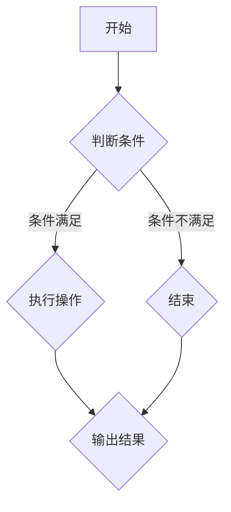
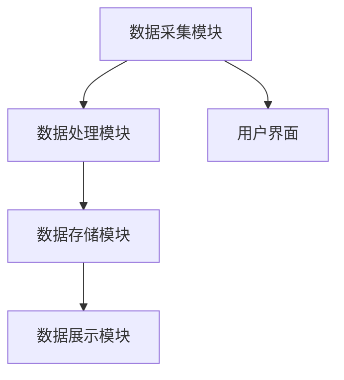
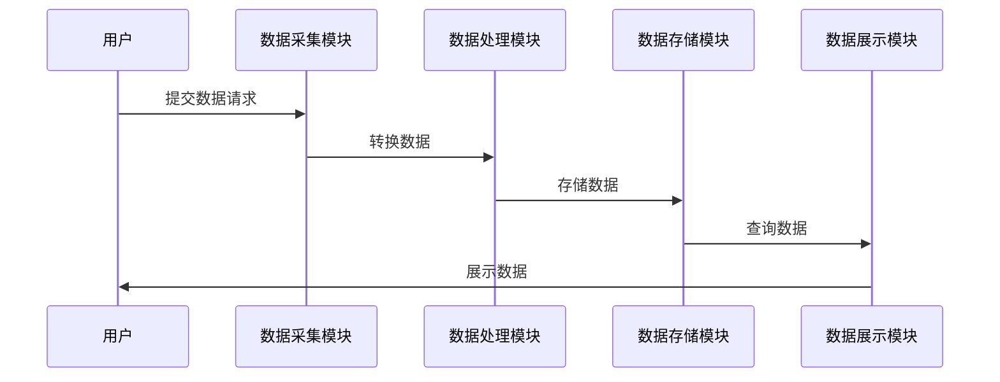

                 

# 《类型系统在函数式物联网编程中的潜在作用》

关键词：类型系统、函数式编程、物联网编程、算法原理、系统架构设计

摘要：本文将探讨类型系统在函数式物联网编程中的潜在作用，通过逐步分析类型系统的基本概念、函数式编程与物联网编程的关系，以及类型系统如何支持这些领域的开发，来阐述其在提升编程效率、保证代码安全性和可靠性方面的重要性。

## 引言

在当今快速发展的物联网（IoT）领域中，编程技术面临着前所未有的挑战。随着设备种类和数量的急剧增加，编程的复杂度也在不断提升。函数式编程作为一种强调无状态和不可变数据的编程范式，近年来在物联网开发中得到了广泛关注。然而，函数式编程中的类型系统，作为保障程序正确性和安全性的重要组成部分，常常被忽视。本文旨在深入探讨类型系统在函数式物联网编程中的潜在作用，帮助开发者更好地理解和利用类型系统，提高编程效率和代码质量。

## 第1章：问题背景与类型系统概述

### 1.1 物联网编程的挑战

物联网编程涉及多个不同类型的设备和系统，这些设备通常具有不同的数据处理能力、通信协议和资源限制。开发者在构建物联网应用时，需要处理以下挑战：

- **异构设备集成**：物联网设备种类繁多，包括传感器、智能设备、移动设备等，开发者需要设计一套能够兼容这些设备的编程框架。
- **实时数据处理**：物联网应用通常要求实时处理大量数据，开发者需要优化算法和数据结构，以满足低延迟和高吞吐量的需求。
- **安全性**：随着物联网设备的普及，安全问题也日益突出，开发者需要确保数据的安全传输和存储。

### 1.2 函数式编程的优势

函数式编程以其无状态、不可变数据和纯函数等特点，为解决物联网编程的挑战提供了一种新的思路：

- **无状态**：函数式编程中的函数不依赖于外部状态，这使得代码更加简洁、易于测试和维护。
- **不可变数据**：不可变数据可以避免状态共享和竞态条件，提高代码的安全性和可靠性。
- **纯函数**：纯函数有确定的输出，不产生副作用，使得代码更加可预测和易于调试。

### 1.3 类型系统的概念与重要性

类型系统是编程语言中用于定义数据类型和操作规则的一组机制。在函数式编程中，类型系统不仅用于表示数据的类型，还用于确保函数的输入和输出类型的一致性。类型系统的重要性体现在以下几个方面：

- **类型检查**：类型系统在编译时对代码进行类型检查，可以提前发现潜在的错误，提高代码的质量。
- **安全性和可靠性**：类型系统可以防止非法数据操作，减少程序出错的可能性。
- **代码优化**：类型系统有助于编译器进行代码优化，提高程序的执行效率。

## 第2章：核心概念与联系

### 2.1 函数式编程的关键概念

#### 函数

函数是函数式编程的核心概念，它是一种将输入映射到输出的操作。在函数式编程中，函数是一等公民，可以像普通值一样传递、存储和返回。

#### 函数组合

函数组合是将多个函数组合成一个新的函数，以实现更复杂的操作。函数组合的优势在于它可以提高代码的复用性和可读性。

#### 高阶函数

高阶函数是能够接受其他函数作为输入或返回函数作为输出的函数。高阶函数是函数式编程的重要特性之一，它使得函数的组合和抽象更加灵活。

### 2.2 物联网编程中的类型系统

在物联网编程中，类型系统用于定义设备之间的通信协议和数据格式。类型系统可以确保数据在不同设备之间的传输过程中保持一致性和可靠性。

### 2.3 类型系统与函数式编程的关联

类型系统与函数式编程之间的关联主要体现在以下几个方面：

- **类型检查**：类型系统可以确保函数的输入和输出类型一致，从而避免运行时错误。
- **不可变性**：类型系统可以确保数据不可变，从而提高代码的安全性和可靠性。
- **代码优化**：类型系统有助于编译器进行代码优化，提高程序的执行效率。

## 第3章：类型系统的算法原理

### 3.1 数据类型与类型系统

数据类型是编程语言中用于定义数据的一组规则和机制。类型系统是用于定义数据类型和操作规则的一组机制。

### 3.2 类型推导算法

类型推导算法是编译器或解释器用于自动推导变量类型的一组算法。类型推导算法可以减少手动指定类型的需要，提高代码的可读性。

### 3.3 类型安全与类型检查

类型安全是指程序在运行过程中不会因为类型错误导致崩溃或异常。类型检查是在编译时对代码进行类型检查，以提前发现潜在的错误。

## 第4章：算法mermaid流程图与Python源代码

### 4.1 使用Mermaid绘制算法流程图

Mermaid是一种基于Markdown的绘图工具，可以用于绘制算法流程图。以下是一个简单的例子：



### 4.2 Python实现与解释

以下是一个简单的Python函数，用于实现一个简单的类型检查算法：

```python
def check_type(value, expected_type):
    if isinstance(value, expected_type):
        return True
    else:
        return False

# 示例
value = 10
expected_type = int
print(check_type(value, expected_type))  # 输出：True
```

### 4.3 算法原理的数学模型与公式

类型推导算法的数学模型可以表示为：

$$
\text{类型} = \begin{cases}
T_1 & \text{如果} \, \text{值} \, \in T_1 \\
\text{错误} & \text{其他情况}
\end{cases}
$$

其中，$T_1$ 是预期的数据类型。

## 第5章：系统功能设计

### 5.1 领域模型类图

领域模型类图用于表示物联网应用中的关键实体和它们之间的关系。以下是一个简单的例子：

```mermaid
classDiagram
Device <<entity>>
Sensor <<entity>>
Actuator <<entity>>

Device o-- Sensor
Device o-- Actuator
```

### 5.2 系统功能模块划分

系统功能模块划分用于将整个系统划分为不同的功能模块，以提高代码的可维护性和可扩展性。以下是一个简单的例子：

- **数据采集模块**：负责从传感器收集数据。
- **数据处理模块**：负责处理和转换数据。
- **数据存储模块**：负责将数据存储到数据库中。
- **数据展示模块**：负责将数据以可视化的形式展示给用户。

## 第6章：系统架构设计

### 6.1 系统架构图

系统架构图用于表示系统的整体结构和各个模块之间的关系。以下是一个简单的例子：



### 6.2 系统组件交互

系统组件交互用于描述系统中各个模块之间的交互关系。以下是一个简单的例子：



## 第7章：系统接口设计和系统交互

### 7.1 系统接口设计

系统接口设计用于定义系统中各个模块的输入和输出接口。以下是一个简单的例子：

- **数据采集模块接口**：包括数据提交接口和数据查询接口。
- **数据处理模块接口**：包括数据转换接口和数据校验接口。
- **数据存储模块接口**：包括数据插入接口和数据查询接口。
- **数据展示模块接口**：包括数据展示接口和数据更新接口。

### 7.2 系统交互序列图

系统交互序列图用于描述系统中各个模块之间的交互顺序和交互内容。以下是一个简单的例子：


## 第8章：项目环境安装与配置

### 8.1 环境搭建

在开始项目开发之前，需要搭建一个合适的项目环境。以下是一个简单的环境搭建步骤：

1. 安装Python解释器。
2. 安装必要的依赖库。
3. 配置项目目录结构。

### 8.2 配置设置

配置设置包括以下内容：

1. 设置环境变量。
2. 配置数据库连接信息。
3. 配置用户权限。

## 第9章：系统核心实现源代码

### 9.1 源代码解析

系统核心实现源代码用于实现系统的核心功能。以下是一个简单的源代码解析：

```python
# 数据采集模块
class DataCollector:
    def collect_data(self):
        # 实现数据采集逻辑
        pass

# 数据处理模块
class DataProcessor:
    def process_data(self, data):
        # 实现数据处理逻辑
        pass

# 数据存储模块
class DataStorage:
    def store_data(self, data):
        # 实现数据存储逻辑
        pass

# 数据展示模块
class DataPresenter:
    def present_data(self, data):
        # 实现数据展示逻辑
        pass
```

### 9.2 代码应用解读与分析

代码应用解读与分析用于解释和评估系统核心实现源代码的应用效果。以下是一个简单的例子：

```python
# 初始化系统组件
collector = DataCollector()
processor = DataProcessor()
storage = DataStorage()
presenter = DataPresenter()

# 提交数据采集请求
data = collector.collect_data()

# 处理数据
processed_data = processor.process_data(data)

# 存储数据
storage.store_data(processed_data)

# 查询数据
query_result = storage.query_data()

# 展示数据
presenter.present_data(query_result)
```

## 第10章：实际案例分析与详细讲解

### 10.1 物联网应用实例

在本文中，我们将分析一个简单的物联网应用实例，用于监控家庭环境中的温度和湿度。

### 10.2 案例剖析

以下是一个简单的家庭环境监控系统的实现：

```python
# 数据采集模块
class TemperatureCollector:
    def collect_temperature(self):
        # 实现温度采集逻辑
        return 25

class HumidityCollector:
    def collect_humidity(self):
        # 实现湿度采集逻辑
        return 50

# 数据处理模块
class DataProcessor:
    def process_data(self, temperature, humidity):
        # 实现数据处理逻辑
        return (temperature, humidity)

# 数据存储模块
class DataStorage:
    def store_data(self, data):
        # 实现数据存储逻辑
        print(f"Temperature: {data[0]}, Humidity: {data[1]}")

# 数据展示模块
class DataPresenter:
    def present_data(self, data):
        # 实现数据展示逻辑
        print(f"Temperature: {data[0]}, Humidity: {data[1]}")

# 初始化系统组件
collector = TemperatureCollector()
humidity_collector = HumidityCollector()
processor = DataProcessor()
storage = DataStorage()
presenter = DataPresenter()

# 提交数据采集请求
temperature = collector.collect_temperature()
humidity = humidity_collector.collect_humidity()

# 处理数据
processed_data = processor.process_data(temperature, humidity)

# 存储数据
storage.store_data(processed_data)

# 查询数据
query_result = storage.query_data()

# 展示数据
presenter.present_data(query_result)
```

### 10.3 案例总结

通过这个简单的案例，我们可以看到类型系统在函数式物联网编程中的应用。类型系统确保了数据的类型一致性，提高了代码的安全性和可靠性。同时，函数式编程的优势也在这个案例中得到了体现，使得代码更加简洁和易于维护。

## 第11章：最佳实践与注意事项

### 11.1 类型系统的最佳实践

- **明确类型定义**：在编写代码时，应该明确每个变量的类型定义，避免使用隐式类型推导。
- **类型检查**：在编译或运行时进行类型检查，确保代码的正确性和安全性。
- **利用类型推导**：合理利用类型推导算法，减少手动指定类型的需要。

### 11.2 编程实践注意事项

- **遵循单一职责原则**：将代码划分为功能独立的模块，每个模块负责一项特定任务。
- **代码复用**：利用函数组合和高阶函数，提高代码的复用性和可读性。
- **单元测试**：编写单元测试，确保代码的每个部分都能按预期工作。

## 第12章：小结与拓展阅读

### 12.1 小结

本文从问题背景、核心概念、算法原理、系统设计、项目实战等方面，详细探讨了类型系统在函数式物联网编程中的潜在作用。通过本文的讨论，我们认识到类型系统在提升编程效率、保证代码安全性和可靠性方面的重要性。

### 12.2 拓展阅读

- **《函数式编程：理论与实践》**：深入了解函数式编程的核心概念和技术。
- **《物联网编程实战》**：学习如何利用函数式编程技术构建物联网应用。
- **《类型系统与编程语言设计》**：探讨类型系统在编程语言设计中的应用和影响。

## 作者信息

作者：AI天才研究院/AI Genius Institute & 禅与计算机程序设计艺术 /Zen And The Art of Computer Programming

## 结论

类型系统在函数式物联网编程中具有重要的作用，它不仅提高了代码的效率和安全性，还为开发者提供了一种新的编程范式。通过本文的讨论，我们希望读者能够更好地理解和利用类型系统，在实际开发中发挥其潜力。在未来的研究中，我们可以进一步探索类型系统与其他编程范式（如面向对象编程）的结合，以及其在更多应用场景中的潜在作用。

