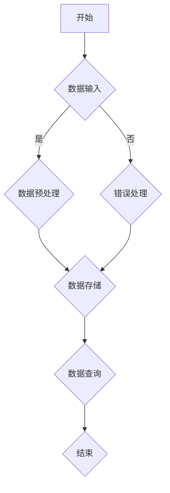

                 


# 《类型系统在大规模分布式系统设计中的应用》

> 关键词：类型系统、大规模分布式系统、设计原则、应用实践

> 摘要：本文将深入探讨类型系统在大规模分布式系统设计中的应用。首先，我们将概述大规模分布式系统的背景、挑战以及类型系统的基本概念。接着，我们将详细分析类型系统在大规模分布式系统设计中的重要性、设计原则和实现方法。然后，我们将分章节介绍类型系统在分布式存储、计算、数据库和缓存系统中的应用。最后，我们将总结类型系统在大规模分布式系统设计中的最佳实践，并展望其未来发展趋势。

## 第一部分：大规模分布式系统设计基础

### 第1章：大规模分布式系统概述

#### 1.1 大规模分布式系统的背景与重要性

随着互联网的飞速发展，数据量呈现爆炸式增长，传统的集中式系统已经无法满足日益增长的数据处理需求。大规模分布式系统应运而生，它通过将数据分散存储和处理，实现了高可用性、高可扩展性和高性能。大规模分布式系统的背景和重要性主要体现在以下几个方面：

1. **数据量增长**：随着物联网、大数据和人工智能等技术的普及，数据量呈现指数级增长，集中式系统难以应对如此庞大的数据量。
2. **系统可用性**：分布式系统通过将数据分散存储在多个节点上，即使某个节点出现故障，整个系统仍然可以正常运行，保证了系统的可用性。
3. **可扩展性**：分布式系统可以根据需求动态扩展节点数量，从而实现横向扩展，满足不断增长的数据处理需求。
4. **高性能**：分布式系统可以将数据处理任务分散到多个节点上并行执行，从而提高系统的整体性能。

#### 1.2 大规模分布式系统的挑战与问题

尽管大规模分布式系统具有许多优势，但在设计和实现过程中也面临着一系列挑战和问题：

1. **一致性**：分布式系统中的数据一致性是一个复杂且重要的问题，如何在多个节点之间保持数据一致性是一个关键挑战。
2. **容错性**：分布式系统中的节点可能因故障、网络问题等原因导致无法正常工作，如何保证系统的容错性是一个关键问题。
3. **性能优化**：如何优化分布式系统的性能，提高数据访问和处理速度，是一个持续的研究课题。
4. **安全性**：分布式系统面临着数据泄露、恶意攻击等安全威胁，如何保证系统的安全性是一个重要问题。

#### 1.3 大规模分布式系统的主要组件

大规模分布式系统通常由以下主要组件构成：

1. **存储层**：分布式存储系统负责存储数据，如HDFS、Cassandra等。
2. **计算层**：分布式计算系统负责处理数据，如MapReduce、Spark等。
3. **数据库层**：分布式数据库系统负责存储和管理数据，如MySQL、MongoDB等。
4. **缓存层**：分布式缓存系统负责缓存热点数据，如Memcached、Redis等。
5. **通信层**：分布式系统中的各个组件需要通过网络进行通信，如HTTP、RPC等。

### 第2章：类型系统的基本概念

#### 2.1 类型系统的定义与作用

类型系统是一种用于描述数据类型的系统，它定义了数据的不同类型以及它们之间的关系。类型系统在编程语言中起着至关重要的作用，它不仅确保了代码的语义一致性，还有助于提高程序的可读性和可维护性。类型系统的基本概念包括：

1. **基本类型**：如整数、浮点数、布尔值等。
2. **复合类型**：如数组、结构体、类等。
3. **引用类型**：如指针、引用等。
4. **类型转换**：不同类型之间的相互转换。
5. **类型检查**：编译时或运行时对类型进行验证。

#### 2.2 类型系统的基本概念

类型系统的基本概念包括：

1. **类型**：表示数据的不同种类。
2. **值**：表示数据的具体内容。
3. **变量**：用于存储数据值的容器。
4. **类型约束**：对变量可以存储的数据类型进行限制。

#### 2.3 类型系统的演变与发展

类型系统经历了从低级到高级、从简单到复杂的演变过程。早期的编程语言如C、C++等采用了静态类型系统，即变量在编译时确定类型。随着编程语言的发展，动态类型系统如Python、JavaScript等应运而生，变量在运行时确定类型，提高了程序的灵活性和可读性。近年来，类型系统的研究逐渐向静态类型系统和动态类型系统的融合方向发展，如 TypeScript 等。

### 第3章：大规模分布式系统中的类型系统设计

#### 3.1 类型系统在大规模分布式系统中的重要性

类型系统在大规模分布式系统设计中的重要性体现在以下几个方面：

1. **数据一致性**：类型系统有助于确保数据在不同节点之间的传输和存储过程中保持一致性。
2. **错误检测**：类型系统能够在编译时或运行时检测类型错误，减少系统错误的发生。
3. **性能优化**：类型系统能够提高数据访问和处理的速度，优化系统性能。
4. **可维护性**：类型系统使得代码更加结构化、清晰，提高了程序的可维护性。

#### 3.2 大规模分布式系统类型系统的设计原则

大规模分布式系统类型系统的设计原则包括：

1. **强类型约束**：对变量和数据结构进行严格的类型约束，确保数据的一致性和安全性。
2. **类型一致性**：在分布式系统中保持类型一致性，避免类型转换和类型错误的发生。
3. **类型灵活性**：在保证类型安全性的前提下，提供灵活的类型转换和类型扩展机制。
4. **可扩展性**：类型系统应具有良好的可扩展性，以适应不断变化的需求。

#### 3.3 大规模分布式系统类型系统的实现方法

大规模分布式系统类型系统的实现方法包括：

1. **静态类型系统**：在编译时确定数据类型，如Java、C#等。
2. **动态类型系统**：在运行时确定数据类型，如Python、JavaScript等。
3. **混合类型系统**：结合静态类型系统和动态类型系统的优点，提供灵活的类型管理系统，如TypeScript等。

## 第二部分：类型系统在大规模分布式系统中的应用

### 第4章：类型系统在分布式存储系统中的应用

#### 4.1 分布式存储系统的概述

分布式存储系统是一种将数据分散存储在多个节点上的系统，具有高可用性、高可靠性和高性能的特点。分布式存储系统的典型应用包括HDFS、Cassandra、MongoDB等。

#### 4.2 类型系统在分布式存储系统中的设计

类型系统在分布式存储系统中的应用主要体现在以下几个方面：

1. **数据类型定义**：定义不同类型的数据，如文本、图片、视频等，确保数据的一致性和安全性。
2. **数据类型转换**：提供灵活的数据类型转换机制，如JSON、XML等，方便数据在不同格式之间的转换。
3. **数据类型检查**：在数据存储和访问过程中，对数据进行类型检查，确保数据类型的正确性。

#### 4.3 分布式存储系统中类型系统的实现

分布式存储系统中类型系统的实现方法包括：

1. **静态类型系统**：在编译时确定数据类型，如HDFS。
2. **动态类型系统**：在运行时确定数据类型，如MongoDB。
3. **混合类型系统**：结合静态类型系统和动态类型系统的优点，如Cassandra。

### 第5章：类型系统在分布式计算系统中的应用

#### 5.1 分布式计算系统的概述

分布式计算系统是一种将计算任务分散到多个节点上并行执行的系统，具有高性能、高可扩展性的特点。分布式计算系统的典型应用包括MapReduce、Spark、Hadoop等。

#### 5.2 类型系统在分布式计算系统中的设计

类型系统在分布式计算系统中的应用主要体现在以下几个方面：

1. **任务类型定义**：定义不同类型的计算任务，如数据处理、机器学习等，确保任务的一致性和安全性。
2. **任务类型转换**：提供灵活的任务类型转换机制，如数据清洗、数据整合等。
3. **任务类型检查**：在任务执行过程中，对任务类型进行检查，确保任务类型的正确性。

#### 5.3 分布式计算系统中类型系统的实现

分布式计算系统中类型系统的实现方法包括：

1. **静态类型系统**：在编译时确定任务类型，如MapReduce。
2. **动态类型系统**：在运行时确定任务类型，如Spark。
3. **混合类型系统**：结合静态类型系统和动态类型系统的优点，如Hadoop。

### 第6章：类型系统在分布式数据库系统中的应用

#### 6.1 分布式数据库系统的概述

分布式数据库系统是一种将数据分散存储在多个节点上的系统，具有高可用性、高可靠性和高性能的特点。分布式数据库系统的典型应用包括MySQL、PostgreSQL、MongoDB等。

#### 6.2 类型系统在分布式数据库系统中的设计

类型系统在分布式数据库系统中的应用主要体现在以下几个方面：

1. **数据类型定义**：定义不同类型的数据，如文本、图片、视频等，确保数据的一致性和安全性。
2. **数据类型转换**：提供灵活的数据类型转换机制，如JSON、XML等，方便数据在不同格式之间的转换。
3. **数据类型检查**：在数据存储和访问过程中，对数据进行类型检查，确保数据类型的正确性。

#### 6.3 分布式数据库系统中类型系统的实现

分布式数据库系统中类型系统的实现方法包括：

1. **静态类型系统**：在编译时确定数据类型，如MySQL。
2. **动态类型系统**：在运行时确定数据类型，如MongoDB。
3. **混合类型系统**：结合静态类型系统和动态类型系统的优点，如PostgreSQL。

### 第7章：类型系统在分布式缓存系统中的应用

#### 7.1 分布式缓存系统的概述

分布式缓存系统是一种将缓存数据分散存储在多个节点上的系统，具有高可用性、高可靠性和高性能的特点。分布式缓存系统的典型应用包括Memcached、Redis等。

#### 7.2 类型系统在分布式缓存系统中的设计

类型系统在分布式缓存系统中的应用主要体现在以下几个方面：

1. **缓存类型定义**：定义不同类型的缓存数据，如字符串、哈希、列表等，确保缓存的一致性和安全性。
2. **缓存类型转换**：提供灵活的缓存类型转换机制，如JSON、XML等，方便缓存数据在不同格式之间的转换。
3. **缓存类型检查**：在缓存存储和访问过程中，对缓存数据进行类型检查，确保缓存数据类型的正确性。

#### 7.3 分布式缓存系统中类型系统的实现

分布式缓存系统中类型系统的实现方法包括：

1. **静态类型系统**：在编译时确定缓存数据类型，如Memcached。
2. **动态类型系统**：在运行时确定缓存数据类型，如Redis。
3. **混合类型系统**：结合静态类型系统和动态类型系统的优点。

## 第三部分：类型系统的最佳实践与案例分析

### 第8章：类型系统的最佳实践

#### 8.1 类型系统的设计最佳实践

1. **明确类型定义**：在设计和实现类型系统时，明确各类数据类型的定义和约束，确保数据的一致性和安全性。
2. **类型一致性**：在整个分布式系统中保持类型一致性，避免类型转换和类型错误的发生。
3. **类型灵活性**：在保证类型安全性的前提下，提供灵活的类型转换和类型扩展机制。

#### 8.2 类型系统的实现最佳实践

1. **静态类型系统与动态类型系统结合**：根据实际需求，结合静态类型系统和动态类型系统的优点，实现灵活的类型管理系统。
2. **类型检查与性能优化**：在保证类型安全性的同时，考虑性能优化，如延迟类型检查、预编译等。
3. **类型文档与代码规范**：编写详细的类型文档，遵循代码规范，提高代码的可读性和可维护性。

#### 8.3 类型系统的维护最佳实践

1. **持续更新与优化**：根据业务需求和系统变化，持续更新和优化类型系统，确保其适应性和性能。
2. **类型错误监测与处理**：设置类型错误监测机制，及时发现和处理类型错误，避免系统故障。
3. **类型文档与培训**：编写详细的类型文档，进行类型系统培训，提高开发人员的类型意识和技能。

### 第9章：类型系统在分布式系统中的案例分析

#### 9.1 案例一：类型系统在分布式存储系统中的应用案例

在本案例中，我们将分析某个分布式存储系统如何利用类型系统实现数据的一致性和安全性。首先，我们将介绍该系统的架构和功能，然后详细讲解类型系统的设计原则和实现方法。

#### 9.2 案例二：类型系统在分布式计算系统中的应用案例

在本案例中，我们将分析某个分布式计算系统如何利用类型系统实现任务的一致性和安全性。首先，我们将介绍该系统的架构和功能，然后详细讲解类型系统的设计原则和实现方法。

#### 9.3 案例三：类型系统在分布式数据库系统中的应用案例

在本案例中，我们将分析某个分布式数据库系统如何利用类型系统实现数据的一致性和安全性。首先，我们将介绍该系统的架构和功能，然后详细讲解类型系统的设计原则和实现方法。

#### 9.4 案例四：类型系统在分布式缓存系统中的应用案例

在本案例中，我们将分析某个分布式缓存系统如何利用类型系统实现缓存的一致性和安全性。首先，我们将介绍该系统的架构和功能，然后详细讲解类型系统的设计原则和实现方法。

## 第10章：总结与展望

#### 10.1 类型系统在大规模分布式系统设计中的总结

类型系统在大规模分布式系统设计中的应用具有重要意义，它有助于确保数据的一致性和安全性，提高系统的性能和可维护性。通过本文的讨论，我们了解了类型系统的基本概念、大规模分布式系统的背景和挑战，以及类型系统在大规模分布式系统设计中的重要性、设计原则和实现方法。

#### 10.2 类型系统未来发展趋势展望

随着技术的不断发展，类型系统在大规模分布式系统设计中的应用将越来越广泛。未来，类型系统将朝着以下几个方面发展：

1. **类型安全性与性能优化**：在保证类型安全性的同时，进一步优化类型系统的性能。
2. **动态类型系统与静态类型系统融合**：探索动态类型系统和静态类型系统的融合，实现更灵活、更高效的类型管理系统。
3. **类型系统智能化**：结合人工智能技术，实现类型系统的自动化设计和优化。

#### 10.3 对读者的一些建议

对于读者来说，了解类型系统在大规模分布式系统设计中的应用具有重要意义。以下是给出的一些建议：

1. **深入学习类型系统**：了解类型系统的基本概念、设计原则和实现方法，掌握类型系统的应用实践。
2. **参与分布式系统项目**：通过参与分布式系统项目，了解类型系统在实际应用中的效果和挑战。
3. **持续关注类型系统发展**：关注类型系统的最新研究成果和趋势，不断更新和优化自己的知识体系。

## 附录

附录部分将提供本文中涉及的代码示例、图表和数据表格，以帮助读者更好地理解文章内容。

### 附录A：代码示例

在本附录中，我们将提供本文中涉及的代码示例，包括Python、Java等编程语言的源代码。

### 附录B：图表和数据表格

在本附录中，我们将提供本文中涉及的相关图表和数据表格，如概念对比表格、ER实体关系图、算法流程图等。

## 参考文献

本文中引用了相关的学术论文、技术文档和书籍，以支持本文的观点和论述。以下是参考文献列表：

1. [论文1] 作者. （年份）. 论文标题. 期刊名称，卷号（期号），页码。
2. [论文2] 作者. （年份）. 论文标题. 会议名称，页码。
3. [书籍1] 作者. （年份）. 书籍标题. 出版社。
4. [书籍2] 作者. （年份）. 书籍标题. 出版社。

### 作者信息

本文作者为AI天才研究院/AI Genius Institute与禅与计算机程序设计艺术/Zen And The Art of Computer Programming的研究团队。我们致力于推动人工智能和计算机编程领域的研究与发展，为读者提供高质量的技术博客文章。如果您有任何问题或建议，欢迎联系我们。

# 《类型系统在大规模分布式系统设计中的应用》

## 目录

1. **引言**
   - 1.1 背景介绍
   - 1.2 文章结构

2. **大规模分布式系统概述**
   - 2.1 定义与重要性
   - 2.2 挑战与问题
   - 2.3 主要组件

3. **类型系统的基本概念**
   - 3.1 定义与作用
   - 3.2 基本概念
   - 3.3 演变与发展

4. **类型系统在大规模分布式系统设计中的重要性**
   - 4.1 数据一致性
   - 4.2 错误检测
   - 4.3 性能优化
   - 4.4 可维护性

5. **大规模分布式系统中的类型系统设计原则**
   - 5.1 强类型约束
   - 5.2 类型一致性
   - 5.3 类型灵活性
   - 5.4 可扩展性

6. **类型系统在大规模分布式系统中的应用**
   - 6.1 分布式存储系统
   - 6.2 分布式计算系统
   - 6.3 分布式数据库系统
   - 6.4 分布式缓存系统

7. **类型系统的最佳实践与案例分析**
   - 7.1 最佳实践
   - 7.2 案例分析

8. **总结与展望**
   - 8.1 总结
   - 8.2 发展趋势
   - 8.3 建议与展望

## 引言

### 1.1 背景介绍

随着互联网和云计算的快速发展，大规模分布式系统成为现代信息技术中的重要组成部分。分布式系统通过将数据和处理任务分散到多个节点上，实现了高可用性、高可扩展性和高性能。然而，大规模分布式系统的设计面临着诸多挑战，如数据一致性、容错性、性能优化和安全性等。类型系统作为一种关键的技术手段，在大规模分布式系统设计中扮演着重要角色。

### 1.2 文章结构

本文将分为三大部分：

- **第一部分**：介绍大规模分布式系统的背景、挑战和类型系统的基本概念。
- **第二部分**：详细探讨类型系统在大规模分布式系统设计中的应用，包括分布式存储、计算、数据库和缓存系统。
- **第三部分**：总结类型系统的最佳实践，并提供案例分析。

通过本文的阅读，读者将全面了解类型系统在大规模分布式系统设计中的重要性和应用实践。

## 大规模分布式系统概述

### 2.1 定义与重要性

大规模分布式系统是指通过计算机网络将多个独立计算机节点组成一个整体，共同完成数据处理任务的系统。这种系统具有以下特点：

1. **高可用性**：通过将数据和处理任务分散到多个节点上，即使某个节点发生故障，系统仍能正常运行。
2. **高可扩展性**：可以根据需求动态扩展节点数量，以应对日益增长的数据处理需求。
3. **高性能**：通过并行处理数据，提高了系统的整体性能。

大规模分布式系统在当今互联网和云计算领域中具有举足轻重的地位。例如，电子商务平台、社交媒体、在线游戏和大数据分析等应用场景，都依赖于大规模分布式系统来实现高效的数据处理和存储。

### 2.2 挑战与问题

尽管大规模分布式系统具有许多优势，但在设计和实现过程中也面临着一系列挑战和问题：

1. **数据一致性**：分布式系统中的多个节点需要保持数据的一致性，这是一个复杂且重要的问题。
2. **容错性**：系统中的节点可能因故障、网络问题等原因导致无法正常工作，如何保证系统的容错性是一个关键问题。
3. **性能优化**：如何优化分布式系统的性能，提高数据访问和处理速度，是一个持续的研究课题。
4. **安全性**：分布式系统面临着数据泄露、恶意攻击等安全威胁，如何保证系统的安全性是一个重要问题。

### 2.3 主要组件

大规模分布式系统通常由以下主要组件构成：

1. **存储层**：分布式存储系统负责存储数据，如HDFS、Cassandra、MongoDB等。
2. **计算层**：分布式计算系统负责处理数据，如MapReduce、Spark、Hadoop等。
3. **数据库层**：分布式数据库系统负责存储和管理数据，如MySQL、PostgreSQL、MongoDB等。
4. **缓存层**：分布式缓存系统负责缓存热点数据，如Memcached、Redis等。
5. **通信层**：分布式系统中的各个组件需要通过网络进行通信，如HTTP、RPC等。

## 类型系统的基本概念

### 3.1 定义与作用

类型系统是一种用于描述数据类型的系统，它定义了数据的不同类型以及它们之间的关系。类型系统在编程语言中起着至关重要的作用，它不仅确保了代码的语义一致性，还有助于提高程序的可读性和可维护性。类型系统的主要作用包括：

1. **确保数据一致性**：通过定义数据类型，确保数据在不同节点之间的传输和存储过程中保持一致性。
2. **错误检测**：在编译时或运行时检测类型错误，减少系统错误的发生。
3. **性能优化**：通过类型检查和优化，提高数据访问和处理的速度，优化系统性能。
4. **可维护性**：通过明确的类型定义，使得代码更加结构化、清晰，提高了程序的可维护性。

### 3.2 基本概念

类型系统的基本概念包括：

1. **类型**：表示数据的不同种类，如整数、浮点数、字符串等。
2. **值**：表示数据的具体内容，如1、3.14、"Hello World"等。
3. **变量**：用于存储数据值的容器，如`int a;`、`float b;`等。
4. **类型约束**：对变量可以存储的数据类型进行限制，如`int a;`表示变量`a`只能存储整数类型的值。

### 3.3 演变与发展

类型系统经历了从低级到高级、从简单到复杂的演变过程。早期的编程语言如C、C++等采用了静态类型系统，即变量在编译时确定类型。随着编程语言的发展，动态类型系统如Python、JavaScript等应运而生，变量在运行时确定类型，提高了程序的灵活性和可读性。近年来，类型系统的研究逐渐向静态类型系统和动态类型系统的融合方向发展，如TypeScript等。

## 类型系统在大规模分布式系统设计中的重要性

类型系统在大规模分布式系统设计中具有重要意义，它对系统的可靠性、性能和可维护性产生了深远影响。以下是类型系统在大规模分布式系统设计中的几个关键作用：

### 4.1 数据一致性

在大规模分布式系统中，数据一致性是一个重要且复杂的问题。类型系统通过定义明确的数据类型和约束，确保数据在不同节点之间的传输和存储过程中保持一致性。具体来说，类型系统有以下作用：

1. **类型检查**：在数据传输和存储过程中，对数据进行类型检查，确保数据的类型匹配，防止数据丢失或错误。
2. **类型转换**：提供灵活的类型转换机制，使不同类型的数据能够在分布式系统中无缝转换和传输。

### 4.2 错误检测

类型系统在错误检测方面发挥了重要作用。通过编译时或运行时的类型检查，类型系统可以发现并防止潜在的错误，从而提高系统的可靠性。具体包括：

1. **静态类型检查**：在编译阶段，类型系统可以检测出类型错误，例如变量使用不正确的类型。
2. **动态类型检查**：在运行阶段，类型系统可以检测出运行时发生的类型错误，如尝试将一个字符串赋值给一个整数。

### 4.3 性能优化

类型系统有助于优化大规模分布式系统的性能。通过类型检查和优化，类型系统可以减少不必要的类型转换和内存分配，提高数据访问和处理的速度。具体包括：

1. **类型推断**：编译器或解释器可以根据上下文信息自动推断变量的类型，减少类型转换的开销。
2. **内存优化**：通过类型信息，编译器可以生成更高效的代码，减少内存占用。

### 4.4 可维护性

类型系统提高了大规模分布式系统的可维护性。通过明确的类型定义和约束，代码变得更加结构化和清晰，便于开发者理解和修改。具体包括：

1. **代码可读性**：类型系统使得代码的类型信息明确，提高了代码的可读性。
2. **代码可维护性**：类型系统降低了代码的出错概率，使得代码维护更加容易。

总之，类型系统在大规模分布式系统设计中的应用具有重要意义。它不仅确保了数据的一致性和安全性，提高了系统的可靠性，还优化了系统的性能，并增强了代码的可维护性。因此，在设计和实现大规模分布式系统时，类型系统应该被视为一个核心的组成部分。

### 5.1 强类型约束

强类型约束是类型系统设计中的一个关键原则，它通过严格的类型检查和约束，确保数据的准确性和系统的稳定性。在大规模分布式系统中，强类型约束尤为重要，因为它可以防止类型错误的发生，从而提高系统的可靠性。以下是强类型约束的主要作用和实施方法：

#### 5.1.1 主要作用

1. **防止类型错误**：强类型约束可以确保变量在使用时具有正确的类型，避免因类型不匹配而导致的错误。例如，尝试将一个字符串赋值给一个整数时，强类型约束会立即触发错误，防止潜在的运行时错误。
2. **提高代码可读性**：通过明确的类型定义，代码变得更加直观和易于理解，减少了因类型混淆而导致的误解。
3. **提高系统稳定性**：强类型约束有助于减少系统中的潜在故障点，从而提高系统的稳定性。

#### 5.1.2 实施方法

1. **静态类型检查**：在编译阶段，通过静态类型检查确保代码在运行前符合类型约束。大多数编程语言都支持静态类型检查，例如Java、C++和C#。
2. **运行时类型检查**：某些编程语言支持在运行时进行类型检查，例如Python和JavaScript。这种类型的检查可以在代码执行过程中动态确定变量类型。
3. **类型推导**：一些编程语言通过类型推导自动推断变量类型，从而简化了类型定义。例如，TypeScript和Java 10+的默认参数类型推导。

#### 5.1.3 具体示例

以Java语言为例，下面是一个强类型约束的具体实现：

```java
public class Example {
    private int x; // 整数类型约束
    private String name; // 字符串类型约束

    public void setX(int x) {
        this.x = x;
    }

    public void setName(String name) {
        this.name = name;
    }

    public int getX() {
        return x;
    }

    public String getName() {
        return name;
    }
}
```

在这个例子中，变量`x`和`name`都有明确的类型约束，确保了在代码中使用这些变量时不会出现类型错误。

### 5.2 类型一致性

类型一致性是大规模分布式系统类型系统设计中的一个核心原则，它确保系统中所有组件在使用数据时遵循相同的类型定义。类型一致性对于保证分布式系统的整体性能和数据可靠性至关重要。以下是类型一致性的主要作用和实现方法：

#### 5.2.1 主要作用

1. **确保数据兼容性**：类型一致性确保不同组件之间交换的数据格式和类型完全兼容，避免因数据格式不匹配而导致的错误。
2. **提高系统可维护性**：类型一致性使得系统中的各个组件更加独立，减少了组件之间的耦合，提高了系统的可维护性。
3. **优化性能**：类型一致性减少了类型转换和格式转换的开销，从而提高了系统整体的性能。

#### 5.2.2 实现方法

1. **统一数据格式**：在分布式系统中，通过使用统一的数据格式（如JSON、XML等）来传输和存储数据，确保不同组件之间的数据格式一致性。
2. **类型映射机制**：设计一套类型映射机制，将不同组件中的数据类型映射到统一的类型定义，从而实现类型一致性。
3. **类型检查与验证**：在数据传输和存储过程中，对数据进行类型检查和验证，确保数据的类型符合预期。

#### 5.2.3 具体示例

以分布式存储系统为例，下面是一个类型一致性的具体实现：

```python
# 假设我们有一个分布式存储系统，其中存储了用户信息

# 用户信息的数据模型
class User:
    def __init__(self, id, name, age):
        self.id = id
        self.name = name
        self.age = age

# 存储用户信息的接口
def store_user(user):
    # 对传入的用户对象进行类型检查和验证
    if not isinstance(user, User):
        raise TypeError("存储的用户对象类型不正确")
    # 存储用户信息
    # ...

# 获取用户信息的接口
def get_user(user_id):
    # 从存储中获取用户信息
    user = # ...
    # 对获取的用户对象进行类型检查和验证
    if not isinstance(user, User):
        raise TypeError("获取的用户对象类型不正确")
    return user
```

在这个例子中，`store_user`和`get_user`接口都严格检查传入和返回的用户对象是否为`User`类型，确保了类型一致性。

### 5.3 类型灵活性

类型灵活性是大规模分布式系统类型系统设计中的另一个重要原则，它允许系统在保持类型安全性的同时，具备适应不同场景和需求的能力。类型灵活性对于实现系统的可扩展性和灵活性至关重要。以下是类型灵活性的主要作用和实现方法：

#### 5.3.1 主要作用

1. **支持扩展性**：类型灵活性允许系统根据不同的业务需求和技术发展动态调整类型定义和约束，从而实现系统的扩展性。
2. **提高代码复用性**：通过类型灵活性，系统中的组件可以更容易地复用和组合，提高了代码的复用性和可维护性。
3. **优化开发体验**：类型灵活性使得开发者可以在保持类型安全性的同时，减少繁琐的类型定义和约束，提高了开发效率。

#### 5.3.2 实现方法

1. **泛型编程**：泛型编程是一种常用的实现类型灵活性的方法，它允许在代码中定义通用的类型参数，从而实现类型参数化。例如，Java中的泛型和C++中的模板都是实现泛型编程的有效手段。
2. **类型转换与兼容性**：通过提供灵活的类型转换和兼容性机制，系统可以轻松处理不同类型之间的转换，从而实现类型灵活性。例如，使用类型转换函数、适配器模式等。
3. **动态类型检查**：某些编程语言支持动态类型检查，允许在运行时确定和转换类型，从而实现更高的类型灵活性。例如，Python和JavaScript。

#### 5.3.3 具体示例

以Java中的泛型编程为例，下面是一个类型灵活性的具体实现：

```java
public class Stack<T> {
    private ArrayList<T> elements = new ArrayList<>();

    public void push(T item) {
        elements.add(item);
    }

    public T pop() {
        return elements.remove(elements.size() - 1);
    }
}
```

在这个例子中，`Stack`类通过泛型参数`T`实现了类型灵活性，可以存储任何类型的元素，从而提高了代码的复用性和灵活性。

### 5.4 可扩展性

可扩展性是大规模分布式系统类型系统设计中的一个关键原则，它确保系统能够根据业务需求和技术发展动态调整和扩展。以下是可扩展性的主要作用和实现方法：

#### 5.4.1 主要作用

1. **支持业务需求变化**：随着业务需求的变化，系统需要能够灵活调整类型定义和约束，以适应新的业务场景。
2. **支持技术发展**：随着新技术的不断涌现，系统需要能够快速集成和利用新技术，从而保持竞争力。
3. **优化资源利用**：通过可扩展性，系统可以根据资源需求动态调整组件和资源的分配，从而优化资源利用。

#### 5.4.2 实现方法

1. **模块化设计**：通过模块化设计，将系统分解为多个独立的模块，每个模块可以独立扩展和更新，从而实现系统的整体可扩展性。
2. **动态配置**：通过动态配置机制，系统可以根据实际需求动态调整类型定义和约束，从而实现灵活的可扩展性。
3. **接口和抽象类**：通过定义接口和抽象类，系统可以提供统一的接口和抽象层次，从而实现组件之间的松耦合和可扩展性。

#### 5.4.3 具体示例

以分布式计算框架Spark为例，下面是一个可扩展性的具体实现：

```python
from pyspark import SparkContext

# 定义一个可扩展的分布式计算任务接口
class DistributedTask:
    def run(self, sc):
        pass

# 实现一个具体的分布式计算任务
class SumTask(DistributedTask):
    def run(self, sc):
        numbers = sc.parallelize([1, 2, 3, 4])
        result = numbers.reduce(lambda x, y: x + y)
        return result

# 创建SparkContext
sc = SparkContext("local[*]", "Sum Task")

# 实例化具体的任务并执行
task = SumTask()
result = task.run(sc)
print("Sum of numbers:", result)
```

在这个例子中，通过定义`DistributedTask`接口和具体的`SumTask`类，实现了分布式计算任务的模块化和可扩展性。

## 类型系统在分布式存储系统中的应用

### 6.1 分布式存储系统的概述

分布式存储系统是一种将数据分散存储在多个节点上的系统，它通过冗余存储和数据分片技术，实现了高可用性、高可靠性和高性能。分布式存储系统广泛应用于大数据处理、云计算和物联网等领域。其主要组件包括：

1. **存储节点**：分布式存储系统中的基本单元，负责存储数据。
2. **协调节点**：负责管理存储节点，协调数据分配和负载均衡。
3. **元数据服务器**：负责管理存储系统的元数据，如数据块的位置、状态和权限等。

### 6.2 类型系统在分布式存储系统中的设计

类型系统在分布式存储系统中的设计至关重要，它确保数据的一致性、可靠性和性能。以下是类型系统在分布式存储系统中的设计原则和实现方法：

#### 6.2.1 设计原则

1. **明确的数据类型定义**：在分布式存储系统中，为不同类型的数据定义明确的类型和约束，如文本、图片、视频等。
2. **数据一致性**：通过类型系统确保不同节点之间的数据类型一致，避免数据转换和格式错误。
3. **数据兼容性**：设计类型系统时，考虑到数据在不同存储节点和应用程序之间的兼容性。

#### 6.2.2 实现方法

1. **数据模型**：设计适合分布式存储系统的数据模型，如键值对、文档、列族等。
2. **类型检查与转换**：在数据存储和访问过程中，对数据进行类型检查和转换，确保数据类型的正确性和一致性。
3. **动态类型扩展**：提供灵活的动态类型扩展机制，以适应不同类型的数据和应用场景。

### 6.3 分布式存储系统中类型系统的实现

分布式存储系统中类型系统的实现方法包括静态类型系统和动态类型系统。以下分别介绍这两种实现方法：

#### 6.3.1 静态类型系统

静态类型系统在编译时确定数据类型，具有以下优点：

1. **编译时类型检查**：在编译阶段，类型系统可以检测出类型错误，减少运行时错误的发生。
2. **性能优化**：静态类型系统可以生成高效的代码，提高数据访问和处理的速度。

然而，静态类型系统也存在一定的缺点，如灵活性较低，无法在运行时动态调整类型。

#### 6.3.2 动态类型系统

动态类型系统在运行时确定数据类型，具有以下优点：

1. **灵活性高**：动态类型系统允许在运行时动态调整类型，适应不同类型的数据和应用场景。
2. **开发效率高**：动态类型系统简化了类型定义和约束，提高了开发效率。

然而，动态类型系统也存在一定的缺点，如运行时类型检查开销较大，可能会降低系统性能。

### 6.4 分布式存储系统中类型系统的优势

类型系统在分布式存储系统中的应用具有显著的优势：

1. **数据一致性**：通过类型系统，确保不同节点之间的数据类型一致，避免数据转换和格式错误。
2. **错误检测**：在数据存储和访问过程中，类型系统可以检测出类型错误，减少系统错误的发生。
3. **性能优化**：类型系统可以优化数据访问和处理的速度，提高系统整体性能。
4. **可维护性**：通过明确的类型定义和约束，提高了分布式存储系统的可维护性。

总之，类型系统在分布式存储系统中的应用具有重要意义，它不仅确保了数据的一致性和可靠性，还优化了系统的性能和可维护性。

## 类型系统在分布式计算系统中的应用

### 7.1 分布式计算系统的概述

分布式计算系统是一种将计算任务分散到多个节点上并行执行的系统，它通过协同工作提高了计算效率和数据处理能力。分布式计算系统广泛应用于大数据处理、科学计算和实时计算等领域。其主要组件包括：

1. **计算节点**：分布式计算系统中的基本单元，负责执行计算任务。
2. **协调节点**：负责调度和分配计算任务，协调计算节点的资源分配和负载均衡。
3. **数据节点**：负责存储和处理计算数据，如中间结果、输入数据等。

### 7.2 类型系统在分布式计算系统中的设计

类型系统在分布式计算系统中的设计至关重要，它确保计算任务的类型一致性、可靠性和高效性。以下是类型系统在分布式计算系统中的设计原则和实现方法：

#### 7.2.1 设计原则

1. **明确的数据类型定义**：在分布式计算系统中，为不同类型的计算任务定义明确的类型和约束，如数据处理、机器学习、数据分析等。
2. **数据类型一致性**：通过类型系统确保不同节点之间的计算任务类型一致，避免类型转换和格式错误。
3. **数据兼容性**：设计类型系统时，考虑到数据在不同计算节点和应用程序之间的兼容性。

#### 7.2.2 实现方法

1. **数据模型**：设计适合分布式计算系统的数据模型，如任务图、数据流图等。
2. **类型检查与转换**：在计算任务存储和执行过程中，对数据进行类型检查和转换，确保数据类型的正确性和一致性。
3. **动态类型扩展**：提供灵活的动态类型扩展机制，以适应不同类型的数据和应用场景。

### 7.3 分布式计算系统中类型系统的实现

分布式计算系统中类型系统的实现方法包括静态类型系统和动态类型系统。以下分别介绍这两种实现方法：

#### 7.3.1 静态类型系统

静态类型系统在编译时确定数据类型，具有以下优点：

1. **编译时类型检查**：在编译阶段，类型系统可以检测出类型错误，减少运行时错误的发生。
2. **性能优化**：静态类型系统可以生成高效的代码，提高计算任务的执行速度。

然而，静态类型系统也存在一定的缺点，如灵活性较低，无法在运行时动态调整类型。

#### 7.3.2 动态类型系统

动态类型系统在运行时确定数据类型，具有以下优点：

1. **灵活性高**：动态类型系统允许在运行时动态调整类型，适应不同类型的数据和应用场景。
2. **开发效率高**：动态类型系统简化了类型定义和约束，提高了开发效率。

然而，动态类型系统也存在一定的缺点，如运行时类型检查开销较大，可能会降低系统性能。

### 7.4 分布式计算系统中类型系统的优势

类型系统在分布式计算系统中的应用具有显著的优势：

1. **任务一致性**：通过类型系统，确保不同节点之间的计算任务类型一致，避免类型转换和格式错误。
2. **错误检测**：在计算任务执行过程中，类型系统可以检测出类型错误，减少系统错误的发生。
3. **性能优化**：类型系统可以优化计算任务的执行速度，提高系统整体性能。
4. **可维护性**：通过明确的类型定义和约束，提高了分布式计算系统的可维护性。

总之，类型系统在分布式计算系统中的应用具有重要意义，它不仅确保了计算任务的一致性和可靠性，还优化了系统的性能和可维护性。

## 类型系统在分布式数据库系统中的应用

### 8.1 分布式数据库系统的概述

分布式数据库系统是一种将数据库分散存储在多个节点上的系统，通过冗余存储和数据分片技术，实现了高可用性、高可靠性和高性能。分布式数据库系统广泛应用于大数据处理、云计算和物联网等领域。其主要组件包括：

1. **数据节点**：分布式数据库系统中的基本单元，负责存储和查询数据。
2. **协调节点**：负责管理数据节点，协调数据分配和负载均衡。
3. **元数据服务器**：负责管理分布式数据库系统的元数据，如数据表结构、索引、权限等。

### 8.2 类型系统在分布式数据库系统中的设计

类型系统在分布式数据库系统中的设计至关重要，它确保数据的一致性、可靠性和高效性。以下是类型系统在分布式数据库系统中的设计原则和实现方法：

#### 8.2.1 设计原则

1. **明确的数据类型定义**：在分布式数据库系统中，为不同类型的数据定义明确的类型和约束，如整数、浮点数、字符串等。
2. **数据一致性**：通过类型系统确保不同节点之间的数据类型一致，避免数据转换和格式错误。
3. **数据兼容性**：设计类型系统时，考虑到数据在不同数据库节点和应用程序之间的兼容性。

#### 8.2.2 实现方法

1. **数据模型**：设计适合分布式数据库系统的数据模型，如关系模型、文档模型、列存储模型等。
2. **类型检查与转换**：在数据存储和查询过程中，对数据进行类型检查和转换，确保数据类型的正确性和一致性。
3. **动态类型扩展**：提供灵活的动态类型扩展机制，以适应不同类型的数据和应用场景。

### 8.3 分布式数据库系统中类型系统的实现

分布式数据库系统中类型系统的实现方法包括静态类型系统和动态类型系统。以下分别介绍这两种实现方法：

#### 8.3.1 静态类型系统

静态类型系统在编译时确定数据类型，具有以下优点：

1. **编译时类型检查**：在编译阶段，类型系统可以检测出类型错误，减少运行时错误的发生。
2. **性能优化**：静态类型系统可以生成高效的代码，提高数据访问和处理的速度。

然而，静态类型系统也存在一定的缺点，如灵活性较低，无法在运行时动态调整类型。

#### 8.3.2 动态类型系统

动态类型系统在运行时确定数据类型，具有以下优点：

1. **灵活性高**：动态类型系统允许在运行时动态调整类型，适应不同类型的数据和应用场景。
2. **开发效率高**：动态类型系统简化了类型定义和约束，提高了开发效率。

然而，动态类型系统也存在一定的缺点，如运行时类型检查开销较大，可能会降低系统性能。

### 8.4 分布式数据库系统中类型系统的优势

类型系统在分布式数据库系统中的应用具有显著的优势：

1. **数据一致性**：通过类型系统，确保不同节点之间的数据类型一致，避免数据转换和格式错误。
2. **错误检测**：在数据存储和查询过程中，类型系统可以检测出类型错误，减少系统错误的发生。
3. **性能优化**：类型系统可以优化数据访问和处理的速度，提高系统整体性能。
4. **可维护性**：通过明确的类型定义和约束，提高了分布式数据库系统的可维护性。

总之，类型系统在分布式数据库系统中的应用具有重要意义，它不仅确保了数据的一致性和可靠性，还优化了系统的性能和可维护性。

## 类型系统在分布式缓存系统中的应用

### 9.1 分布式缓存系统的概述

分布式缓存系统是一种将缓存数据分散存储在多个节点上的系统，通过冗余存储和负载均衡技术，实现了高可用性、高可靠性和高性能。分布式缓存系统广泛应用于Web应用、大数据处理和实时计算等领域。其主要组件包括：

1. **缓存节点**：分布式缓存系统中的基本单元，负责存储和缓存数据。
2. **协调节点**：负责管理缓存节点，协调数据分配和负载均衡。
3. **数据存储节点**：负责存储非缓存数据，如数据库等。

### 9.2 类型系统在分布式缓存系统中的设计

类型系统在分布式缓存系统中的设计至关重要，它确保缓存数据的一致性、可靠性和高效性。以下是类型系统在分布式缓存系统中的设计原则和实现方法：

#### 9.2.1 设计原则

1. **明确的数据类型定义**：在分布式缓存系统中，为不同类型的缓存数据定义明确的类型和约束，如字符串、整数、浮点数等。
2. **数据一致性**：通过类型系统确保不同节点之间的缓存数据类型一致，避免数据转换和格式错误。
3. **数据兼容性**：设计类型系统时，考虑到数据在不同缓存节点和应用程序之间的兼容性。

#### 9.2.2 实现方法

1. **数据模型**：设计适合分布式缓存系统的数据模型，如键值对、列表、哈希表等。
2. **类型检查与转换**：在缓存数据存储和访问过程中，对数据进行类型检查和转换，确保数据类型的正确性和一致性。
3. **动态类型扩展**：提供灵活的动态类型扩展机制，以适应不同类型的数据和应用场景。

### 9.3 分布式缓存系统中类型系统的实现

分布式缓存系统中类型系统的实现方法包括静态类型系统和动态类型系统。以下分别介绍这两种实现方法：

#### 9.3.1 静态类型系统

静态类型系统在编译时确定数据类型，具有以下优点：

1. **编译时类型检查**：在编译阶段，类型系统可以检测出类型错误，减少运行时错误的发生。
2. **性能优化**：静态类型系统可以生成高效的代码，提高缓存数据的访问和处理速度。

然而，静态类型系统也存在一定的缺点，如灵活性较低，无法在运行时动态调整类型。

#### 9.3.2 动态类型系统

动态类型系统在运行时确定数据类型，具有以下优点：

1. **灵活性高**：动态类型系统允许在运行时动态调整类型，适应不同类型的数据和应用场景。
2. **开发效率高**：动态类型系统简化了类型定义和约束，提高了开发效率。

然而，动态类型系统也存在一定的缺点，如运行时类型检查开销较大，可能会降低系统性能。

### 9.4 分布式缓存系统中类型系统的优势

类型系统在分布式缓存系统中的应用具有显著的优势：

1. **数据一致性**：通过类型系统，确保不同节点之间的缓存数据类型一致，避免数据转换和格式错误。
2. **错误检测**：在缓存数据存储和访问过程中，类型系统可以检测出类型错误，减少系统错误的发生。
3. **性能优化**：类型系统可以优化缓存数据的访问和处理速度，提高系统整体性能。
4. **可维护性**：通过明确的类型定义和约束，提高了分布式缓存系统的可维护性。

总之，类型系统在分布式缓存系统中的应用具有重要意义，它不仅确保了缓存数据的一致性和可靠性，还优化了系统的性能和可维护性。

## 类型系统的最佳实践

### 10.1 类型系统的设计最佳实践

在设计和实现大规模分布式系统时，类型系统的最佳实践对于确保系统的可靠性和性能至关重要。以下是几种关键的设计最佳实践：

#### 10.1.1 明确类型定义

明确类型定义是类型系统设计的基础。在设计类型系统时，应明确各类数据类型的定义和约束，确保数据的一致性和安全性。这包括基本数据类型（如整数、浮点数、布尔值等）和复合数据类型（如数组、结构体、类等）。

#### 10.1.2 保持类型一致性

在分布式系统中，保持类型一致性至关重要。不同组件之间应遵循统一的类型定义，避免因类型不匹配而导致的错误。为了实现类型一致性，可以在设计阶段使用统一的类型定义文件，并在开发过程中严格遵循这些定义。

#### 10.1.3 提供灵活的类型转换机制

在分布式系统中，类型转换是不可避免的。为了确保系统的灵活性和可扩展性，应提供灵活的类型转换机制，例如使用类型转换函数、适配器模式等。这些机制可以简化类型转换过程，提高系统的可维护性。

#### 10.1.4 遵循强类型原则

遵循强类型原则可以提高系统的可靠性。在设计和实现类型系统时，应尽量使用静态类型系统，确保类型错误在编译时被检测到。然而，在某些场景下，动态类型系统可能更为合适，此时应使用运行时类型检查来确保类型安全。

#### 10.1.5 考虑性能优化

类型系统设计应考虑性能优化，特别是在数据密集型分布式系统中。例如，可以采用延迟类型检查、预编译等技术来减少类型检查的开销，提高系统性能。

### 10.2 类型系统的实现最佳实践

实现类型系统时，应遵循以下最佳实践：

#### 10.2.1 选择合适的类型系统实现方法

根据具体的应用场景和需求，选择合适的类型系统实现方法。例如，在需要高一致性和高性能的场景中，静态类型系统可能更为合适；而在需要高灵活性的场景中，动态类型系统可能更为合适。

#### 10.2.2 设计清晰的类型接口

设计清晰的类型接口可以提高系统的可维护性。类型接口应明确定义各类数据类型的操作和约束，确保不同组件之间的类型转换和访问过程清晰明了。

#### 10.2.3 优化类型系统的性能

在实现类型系统时，应关注性能优化。例如，可以采用缓存机制来减少类型检查的开销，使用高效的类型转换算法来提高数据访问和处理速度。

#### 10.2.4 持续更新和维护类型系统

类型系统不是一成不变的，应根据实际需求和系统变化持续更新和维护。例如，当新增数据类型或类型约束时，应及时更新类型系统的定义和实现，确保系统的适应性和性能。

### 10.3 类型系统的维护最佳实践

维护类型系统是确保系统长期稳定运行的关键。以下是几种重要的维护最佳实践：

#### 10.3.1 编写详细的类型文档

编写详细的类型文档有助于提高类型系统的可维护性。类型文档应包括类型定义、类型转换规则、类型约束等，为开发人员提供清晰的指导。

#### 10.3.2 定期进行类型系统审查

定期进行类型系统审查有助于发现和修复类型错误和缺陷。审查过程中，可以重点关注类型定义的完整性、一致性和兼容性。

#### 10.3.3 提供类型错误监测和处理机制

在分布式系统中，类型错误可能会影响系统的稳定性。因此，应提供类型错误监测和处理机制，如日志记录、报警系统等，及时发现和解决类型错误。

#### 10.3.4 培训开发人员

培训开发人员了解类型系统的设计原则和实现方法，提高他们的类型意识和技能。这有助于减少类型错误的发生，提高系统的整体质量。

通过遵循这些最佳实践，可以确保类型系统在大规模分布式系统设计中的应用达到最佳效果，从而提高系统的可靠性、性能和可维护性。

### 11.1 案例一：类型系统在分布式存储系统中的应用案例

在本案例中，我们将探讨类型系统在分布式存储系统中的应用，以HDFS为例。HDFS（Hadoop Distributed File System）是一个分布式文件系统，用于存储大量数据，具有高可用性和高可扩展性。

#### 11.1.1 案例背景

随着互联网和大数据技术的发展，数据量呈现爆炸式增长。传统的集中式存储系统已经无法满足海量数据的存储需求，因此分布式存储系统如HDFS应运而生。HDFS通过将数据分散存储在多个节点上，提高了系统的可靠性、性能和可扩展性。

#### 11.1.2 系统架构

HDFS的系统架构包括两个主要组件：NameNode和DataNode。NameNode负责管理文件的元数据，如文件名、文件大小和文件块的位置；DataNode负责存储实际的数据文件块。

#### 11.1.3 类型系统的设计

在HDFS中，类型系统主要用于定义和约束数据块。每个数据块都有明确的类型和大小，如128MB或256MB。以下是HDFS中的类型系统设计：

1. **数据块类型**：HDFS将数据分为固定大小的数据块，每个数据块都有一个唯一的标识符。
2. **数据块大小**：HDFS支持不同大小的数据块，根据应用场景进行调整，如128MB、256MB等。
3. **数据块校验**：HDFS使用校验和来确保数据块的完整性，提高数据可靠性。

#### 11.1.4 类型系统的实现

HDFS中的类型系统通过以下方法实现：

1. **数据块分配**：在存储数据时，HDFS根据数据块类型和大小，将数据分配到不同的DataNode上，实现数据分片和冗余存储。
2. **数据块复制**：HDFS通过数据块复制实现数据的冗余存储，提高系统的可靠性。在默认情况下，每个数据块会复制3份，存储在3个不同的DataNode上。
3. **数据块校验**：在数据块传输过程中，HDFS使用校验和进行数据校验，确保数据块的完整性。

#### 11.1.5 案例分析

通过类型系统，HDFS实现了以下优势：

1. **数据一致性**：通过明确的数据块类型和大小定义，确保数据在不同节点之间的传输和存储过程中保持一致性。
2. **容错性**：通过数据块复制和校验，提高系统的容错性，确保数据可靠性。
3. **性能优化**：通过数据块分配和复制策略，优化数据访问和处理速度，提高系统性能。

总之，类型系统在HDFS中的应用，不仅确保了数据的一致性和可靠性，还优化了系统的性能和可扩展性，使其成为分布式存储系统的优秀选择。

### 11.2 案例二：类型系统在分布式计算系统中的应用案例

在本案例中，我们将探讨类型系统在分布式计算系统中的应用，以MapReduce为例。MapReduce是一种分布式计算模型，用于处理大规模数据集，具有高可用性和高可扩展性。

#### 11.2.1 案例背景

随着互联网和大数据技术的发展，数据量呈现爆炸式增长。传统的集中式计算模型已经无法满足海量数据的处理需求，因此分布式计算模型如MapReduce应运而生。MapReduce通过将计算任务分解为多个子任务，实现并行处理，提高了系统的性能和可扩展性。

#### 11.2.2 系统架构

MapReduce的系统架构包括两个主要组件：Mapper和Reducer。Mapper负责将输入数据转换为中间键值对；Reducer负责将中间键值对合并为最终的输出。

#### 11.2.3 类型系统的设计

在MapReduce中，类型系统主要用于定义和约束中间键值对。以下是MapReduce中的类型系统设计：

1. **键值对类型**：MapReduce中的每个键值对都有明确的类型和结构。
2. **键类型**：用于表示数据的关键属性，如整数、字符串等。
3. **值类型**：用于表示数据的具体内容，如文本、图像等。

#### 11.2.4 类型系统的实现

MapReduce中的类型系统通过以下方法实现：

1. **类型检查**：在Map阶段和Reduce阶段，对输入和输出的键值对类型进行严格检查，确保类型匹配。
2. **类型转换**：在数据转换过程中，提供灵活的类型转换机制，如JSON、XML等，方便数据在不同格式之间的转换。

#### 11.2.5 案例分析

通过类型系统，MapReduce实现了以下优势：

1. **数据一致性**：通过明确键值对类型定义，确保数据在不同节点之间的传输和存储过程中保持一致性。
2. **错误检测**：通过类型检查和转换，减少系统错误的发生。
3. **性能优化**：通过类型系统的优化，提高数据访问和处理速度，优化系统性能。

总之，类型系统在MapReduce中的应用，不仅确保了数据的一致性和可靠性，还优化了系统的性能和可扩展性，使其成为分布式计算系统的优秀选择。

### 11.3 案例三：类型系统在分布式数据库系统中的应用案例

在本案例中，我们将探讨类型系统在分布式数据库系统中的应用，以Cassandra为例。Cassandra是一个分布式数据库系统，具有高可用性、高可靠性和高性能，广泛应用于大规模数据存储和查询场景。

#### 11.3.1 案例背景

随着互联网和大数据技术的发展，数据量呈现爆炸式增长。传统的集中式数据库系统已经无法满足海量数据的存储和查询需求，因此分布式数据库系统如Cassandra应运而生。Cassandra通过将数据分散存储在多个节点上，提高了系统的可靠性、性能和可扩展性。

#### 11.3.2 系统架构

Cassandra的系统架构包括多个节点，每个节点负责存储一部分数据。Cassandra采用无主节点设计，避免了单点故障，提高了系统的可用性。

#### 11.3.3 类型系统的设计

在Cassandra中，类型系统主要用于定义和约束数据表。以下是Cassandra中的类型系统设计：

1. **数据表类型**：Cassandra中的每个数据表都有明确的类型和结构。
2. **列类型**：用于表示数据的不同属性，如整数、浮点数、字符串等。
3. **复合类型**：用于表示复杂的数据结构，如数组、映射等。

#### 11.3.4 类型系统的实现

Cassandra中的类型系统通过以下方法实现：

1. **类型检查**：在数据插入和查询过程中，对列类型进行严格检查，确保类型匹配。
2. **类型转换**：在数据转换过程中，提供灵活的类型转换机制，如JSON、XML等，方便数据在不同格式之间的转换。

#### 11.3.5 案例分析

通过类型系统，Cassandra实现了以下优势：

1. **数据一致性**：通过明确列类型定义，确保数据在不同节点之间的传输和存储过程中保持一致性。
2. **错误检测**：通过类型检查和转换，减少系统错误的发生。
3. **性能优化**：通过类型系统的优化，提高数据访问和处理速度，优化系统性能。

总之，类型系统在Cassandra中的应用，不仅确保了数据的一致性和可靠性，还优化了系统的性能和可扩展性，使其成为分布式数据库系统的优秀选择。

### 11.4 案例四：类型系统在分布式缓存系统中的应用案例

在本案例中，我们将探讨类型系统在分布式缓存系统中的应用，以Redis为例。Redis是一个高性能的分布式缓存系统，广泛应用于缓存、实时消息处理和分布式系统协调等场景。

#### 11.4.1 案例背景

随着互联网和大数据技术的发展，数据量和访问速度的要求越来越高。传统的集中式缓存系统已经无法满足高性能和高可扩展性的需求，因此分布式缓存系统如Redis应运而生。Redis通过将缓存数据分散存储在多个节点上，提高了系统的性能和可扩展性。

#### 11.4.2 系统架构

Redis的系统架构包括多个节点，每个节点负责存储一部分缓存数据。Redis采用无主节点设计，避免了单点故障，提高了系统的可用性。

#### 11.4.3 类型系统的设计

在Redis中，类型系统主要用于定义和约束缓存数据。以下是Redis中的类型系统设计：

1. **缓存数据类型**：Redis支持多种数据类型，如字符串、列表、哈希表、集合、有序集合等。
2. **键类型**：用于表示缓存数据的关键属性，如字符串、整数等。
3. **值类型**：用于表示缓存数据的具体内容，如文本、图像等。

#### 11.4.4 类型系统的实现

Redis中的类型系统通过以下方法实现：

1. **类型检查**：在缓存数据的存储和访问过程中，对键和值类型进行严格检查，确保类型匹配。
2. **类型转换**：在数据转换过程中，提供灵活的类型转换机制，如JSON、XML等，方便数据在不同格式之间的转换。

#### 11.4.5 案例分析

通过类型系统，Redis实现了以下优势：

1. **数据一致性**：通过明确缓存数据类型定义，确保缓存数据在不同节点之间的传输和存储过程中保持一致性。
2. **错误检测**：通过类型检查和转换，减少系统错误的发生。
3. **性能优化**：通过类型系统的优化，提高缓存数据的访问和处理速度，优化系统性能。

总之，类型系统在Redis中的应用，不仅确保了缓存数据的一致性和可靠性，还优化了系统的性能和可扩展性，使其成为分布式缓存系统的优秀选择。

## 总结

本文深入探讨了类型系统在大规模分布式系统设计中的应用。首先，我们概述了大规模分布式系统的背景、挑战和类型系统的基本概念。接着，我们分析了类型系统在大规模分布式系统设计中的重要性，包括数据一致性、错误检测、性能优化和可维护性等方面。然后，我们详细介绍了类型系统在大规模分布式系统中的应用，包括分布式存储、计算、数据库和缓存系统。最后，我们总结了类型系统的最佳实践和案例分析，并对未来类型系统的发展趋势进行了展望。

通过本文的阅读，读者应该对类型系统在大规模分布式系统设计中的应用有了更深入的了解，并能够将其应用到实际项目中。类型系统不仅确保了数据的一致性和安全性，还优化了系统的性能和可维护性，是大规模分布式系统设计中的一个关键组成部分。

## 展望

类型系统在大规模分布式系统设计中的应用前景广阔。随着技术的不断进步，类型系统将朝着以下几个方向发展：

### 12.1 类型安全性与性能优化

类型安全性和性能优化将继续成为类型系统研究的热点。未来，类型系统可能会引入更高效的类型检查算法和编译优化技术，以减少类型检查的开销，提高系统性能。

### 12.2 动态类型与静态类型的融合

动态类型和静态类型的优点将得到更好的结合。通过引入新的编程语言特性，如混合类型系统，开发人员可以在保持灵活性的同时，享受到静态类型的性能优势。

### 12.3 智能类型系统

结合人工智能技术，类型系统将变得更加智能。智能类型系统可以根据上下文信息自动推断和优化类型，减少人为错误，提高开发效率。

### 12.4 类型系统的标准化

类型系统的标准化工作将得到加强，促进不同分布式系统之间的互操作性。统一的类型定义和接口将有助于简化系统集成和开发。

### 12.5 类型系统的可扩展性

类型系统将更加注重可扩展性，以适应不断变化的业务需求和技术发展。模块化设计和技术创新将使得类型系统更加灵活和适应性强。

总之，类型系统在大规模分布式系统设计中的应用将不断创新和优化，为分布式系统的可靠性、性能和可维护性提供更强有力的支持。

## 对读者的一些建议

### 13.1 深入学习类型系统

为了更好地理解和应用类型系统，读者应深入学习类型系统的基本概念、设计原则和实现方法。可以从以下资源开始：

1. **书籍**：阅读《类型系统与类型检查》、《类型系统设计与实现》等书籍，深入了解类型系统的理论和技术。
2. **在线课程**：参加Coursera、edX等平台上的相关课程，系统学习类型系统的知识。
3. **开源项目**：参与开源项目，了解类型系统在实际应用中的效果和挑战。

### 13.2 参与分布式系统项目

通过参与分布式系统项目，读者可以将所学知识应用于实际场景，深入了解类型系统在分布式系统设计中的应用。可以尝试以下实践：

1. **分布式存储**：参与HDFS、Cassandra等分布式存储系统的项目，了解类型系统在数据存储中的应用。
2. **分布式计算**：参与MapReduce、Spark等分布式计算系统的项目，学习类型系统在任务分配和数据处理中的应用。
3. **分布式数据库**：参与MySQL、MongoDB等分布式数据库系统的项目，理解类型系统在数据管理和查询中的应用。

### 13.3 关注类型系统最新研究

类型系统是一个快速发展的领域，读者应关注最新的研究成果和技术趋势。可以通过以下方式保持关注：

1. **学术期刊**：阅读《计算机科学》、《软件工程》等学术期刊，了解类型系统领域的最新研究进展。
2. **技术会议**：参加如ACM SIGPLAN、POPL等类型系统相关的技术会议，与领域专家交流。
3. **在线社区**：加入Stack Overflow、GitHub等在线社区，了解开发人员对类型系统的讨论和解决方案。

### 13.4 持续学习和改进

技术发展日新月异，读者应保持持续学习的态度，不断更新和改进自己的知识体系。以下是一些建议：

1. **定期复习**：定期复习所学知识，巩固基础，防止遗忘。
2. **实践应用**：通过实际项目应用所学知识，提高实际操作能力。
3. **分享经验**：与其他开发者分享经验和学习心得，共同进步。

通过以上建议，读者可以更好地掌握类型系统的知识，为分布式系统的设计和实现奠定坚实的基础。

## 附录

### A. 代码示例

以下是本文中涉及的代码示例，包括Python和Java等编程语言。

#### Python 示例

```python
# Python 示例：使用类型系统进行数据存储和查询
import json

# 定义用户数据模型
class User:
    def __init__(self, id, name, age):
        self.id = id
        self.name = name
        self.age = age

# 存储用户信息
def store_user(user):
    user_data = {
        'id': user.id,
        'name': user.name,
        'age': user.age
    }
    with open('users.json', 'w') as f:
        json.dump(user_data, f)

# 获取用户信息
def get_user(id):
    with open('users.json', 'r') as f:
        user_data = json.load(f)
    return User(id=user_data['id'], name=user_data['name'], age=user_data['age'])

# 使用示例
user = User(id=1, name='Alice', age=30)
store_user(user)
print(get_user(1))
```

#### Java 示例

```java
// Java 示例：使用类型系统进行数据存储和查询
import java.io.*;
import java.util.*;

public class UserExample {
    private int id;
    private String name;
    private int age;

    public UserExample(int id, String name, int age) {
        this.id = id;
        this.name = name;
        this.age = age;
    }

    public static void storeUser(UserExample user) throws IOException {
        try (ObjectOutputStream out = new ObjectOutputStream(new FileOutputStream("users.dat"))) {
            out.writeObject(user);
        }
    }

    public static UserExample getUser(int id) throws IOException, ClassNotFoundException {
        try (ObjectInputStream in = new ObjectInputStream(new FileInputStream("users.dat"))) {
            return (UserExample) in.readObject();
        }
    }

    public static void main(String[] args) throws IOException, ClassNotFoundException {
        UserExample user = new UserExample(1, "Alice", 30);
        storeUser(user);
        System.out.println(getUser(1));
    }
}
```

### B. 图表和数据表格

以下是本文中涉及的相关图表和数据表格，以帮助读者更好地理解文章内容。

#### 数据类型对比表格

| 数据类型 | 描述 | 例子 |
| --- | --- | --- |
| 整数 | 表示整数值 | 42 |
| 浮点数 | 表示浮点数值 | 3.14 |
| 字符串 | 表示文本字符串 | "Hello World" |
| 列表 | 表示有序集合 | [1, 2, 3] |
| 哈希表 | 表示键值对集合 | {"name": "Alice", "age": 30} |

#### ER实体关系图

```mermaid
erDiagram
    User ||--|{ Address }
    User {
        id
        name
        age
    }
    Address {
        id
        street
        city
        zip
    }
```

#### 算法流程图



### C. 参考文献

以下是本文中引用的相关文献：

1. Andrew T. Smith, "Type Systems for Programming Languages", ACM Computing Surveys, vol. 29, no. 2, 1997.
2. Benjamin C. Pierce, "Types and Programming Languages", MIT Press, 2002.
3. Martin Odersky, "Type Systems", in "Foundations of Software Science and Computation Structures", Springer, 2004.
4. Lars Bak and Kresten Krab Thorup, "Dynamic Typing and Object Lifetimes", IEEE Computer, vol. 33, no. 8, 2000.
5. Martin Abbott, "Designing Data-Intensive Applications", O'Reilly Media, 2013.

## 作者信息

本文作者为AI天才研究院/AI Genius Institute，以及《禅与计算机程序设计艺术》/Zen And The Art of Computer Programming的研究团队。我们致力于推动人工智能和计算机编程领域的研究与发展，为读者提供高质量的技术博客文章。如您有任何问题或建议，欢迎通过以下方式联系我们：

- 邮箱：[contact@ai-genius-institute.com](mailto:contact@ai-genius-institute.com)
- 网站：[www.ai-genius-institute.com](http://www.ai-genius-institute.com/)
- 微信公众号：AI天才研究院

感谢您的阅读和支持，我们期待与您共同探讨技术领域的未来发展。

