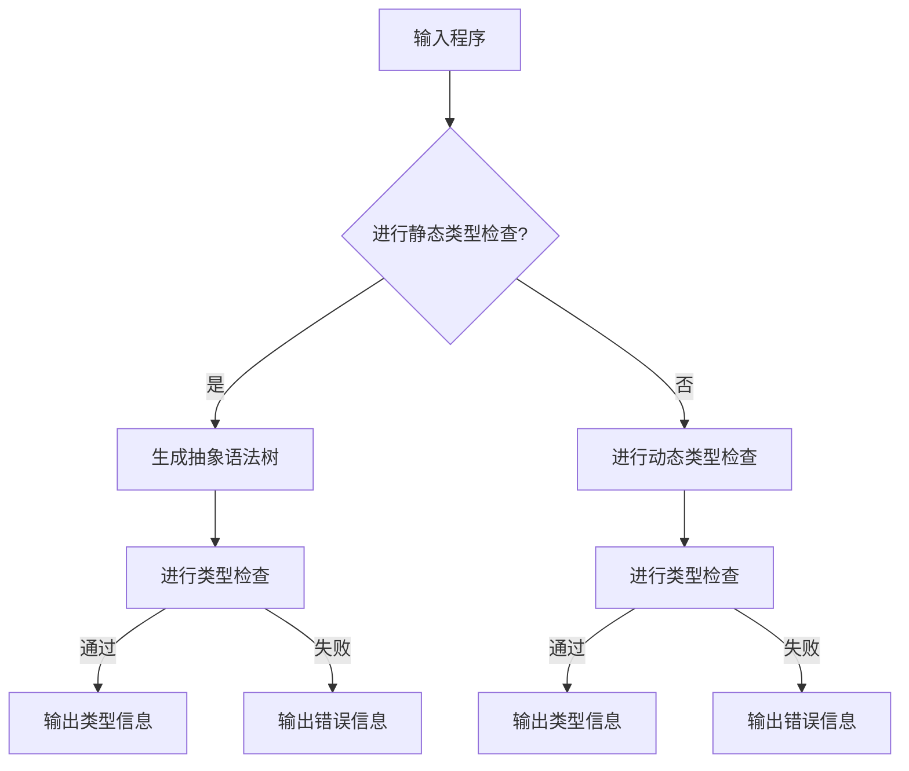

                 

# 类型系统在安全协议设计中的作用

## 关键词

- 类型系统
- 安全协议
- 数据完整性
- 保密性
- 实时性
- 透明性

## 摘要

本文深入探讨了类型系统在安全协议设计中的重要作用。类型系统作为一种编程语言中的核心机制，主要用于确保程序中的数据类型和操作的一致性和正确性。在安全协议设计领域，类型系统同样扮演着至关重要的角色，通过类型检查和类型推断等技术手段，可以增强协议的安全性和可靠性。本文将从背景介绍、核心概念、算法原理、数学模型、系统分析和设计、实战案例以及最佳实践等方面，详细分析类型系统在安全协议设计中的应用，为读者提供全面的技术见解和实际操作指南。

## 引言

### 1.1 书籍目的

本书旨在揭示类型系统在安全协议设计中的关键作用，帮助读者理解如何利用类型系统提高安全协议的可靠性和安全性。安全协议是信息安全领域的重要一环，关系到数据传输的保密性、完整性和可用性。而类型系统作为一种机制，通过对数据类型的严格管理，可以确保程序的正确性和一致性。本书将通过深入的理论分析和实践案例，帮助读者掌握类型系统在安全协议设计中的实际应用。

### 1.2 类型系统的重要性

类型系统在编程语言中起到了至关重要的作用。它不仅保证了程序的语义正确性，还提高了程序的运行效率和可维护性。在安全协议的设计过程中，类型系统同样不可或缺。通过类型检查，可以防止潜在的安全漏洞，如类型错误和越界访问等。此外，类型推断技术还能够提高编程的自动化程度，减少人为错误的发生。

### 1.3 本书结构

本书分为以下几个部分：

1. **背景介绍**：介绍类型系统和安全协议的基本概念，为其在安全协议设计中的应用打下基础。
2. **核心概念**：详细阐述类型系统中的核心概念，如类型检查、类型推断等。
3. **算法原理**：讲解类型系统在安全协议设计中的算法原理，包括常用的类型检查算法和类型推断算法。
4. **数学模型**：介绍与类型系统相关的数学模型和公式，用于分析安全协议的性能和安全性。
5. **系统分析与设计**：分析安全协议的系统架构，设计系统的接口和交互。
6. **实战案例**：通过实际案例展示类型系统在安全协议设计中的应用。
7. **最佳实践**：总结最佳实践，为读者提供实用的操作指南。
8. **总结与展望**：总结本书的主要内容，展望类型系统在安全协议设计领域的未来发展趋势。

## 背景介绍

### 2.1 类型系统的背景

类型系统（Type System）是编程语言中用于定义变量、函数、表达式等元素类型的一组规则。它的主要目的是提高程序的可靠性、可维护性和运行效率。在计算机科学中，类型系统的发展经历了从静态类型到动态类型，再到静态检查和动态检查的转变。

静态类型语言（如C++、Java）在编译时对变量和表达式的类型进行严格检查，确保程序在运行时不会发生类型错误。而动态类型语言（如Python、JavaScript）则允许在运行时进行类型检查，提高了程序的灵活性和效率。

### 2.2 安全协议的背景

安全协议（Secure Protocol）是确保数据在传输过程中不被窃取、篡改或泄露的一组规则和措施。在网络安全领域中，安全协议至关重要，它们涉及到数据的完整性、保密性和实时性。常见的安全协议包括SSL/TLS、IPsec等。

随着网络攻击手段的不断升级，安全协议的设计和实现面临着越来越大的挑战。如何在保证协议性能的同时提高安全性，成为了一个亟待解决的问题。类型系统在这一过程中发挥了重要作用。

### 2.3 类型系统在安全协议设计中的角色

类型系统在安全协议设计中的作用主要体现在以下几个方面：

1. **确保数据完整性**：类型系统通过严格的类型检查，确保程序中的数据类型和使用的一致性，从而防止数据被恶意篡改。

2. **增强协议安全性**：类型系统可以识别出潜在的安全漏洞，如类型错误和越界访问等，从而提高协议的安全性。

3. **提高代码可维护性**：类型系统使得代码的结构更加清晰，便于维护和调试。

4. **提高编程效率**：类型推断技术可以减少类型声明的必要性，提高编程的自动化程度，减少人为错误。

### 2.4 相关工作综述

近年来，类型系统在安全协议设计中的应用得到了广泛关注。许多研究者提出了基于类型系统的安全协议设计方法和工具，如静态类型检查、动态类型检查、类型推断等。这些方法在一定程度上提高了安全协议的可靠性和安全性。

然而，现有的研究还存在一些不足。首先，大多数研究主要集中在静态类型检查，对于动态类型检查的关注较少。其次，类型系统在安全协议设计中的具体应用场景和最佳实践尚未得到充分探索。

## 核心概念

### 3.1 类型检查

类型检查（Type Checking）是类型系统中最基本的功能之一。它主要用于在编译或运行时检查变量、表达式和函数等元素的数据类型是否匹配。类型检查可以分为静态类型检查和动态类型检查。

静态类型检查在编译时进行，通过分析程序代码的类型信息，提前发现类型错误。静态类型检查的优点是可以在程序运行前发现大部分类型错误，从而提高程序的可靠性。

动态类型检查在运行时进行，通过运行时的类型检查来发现类型错误。动态类型检查的优点是具有较高的灵活性，适用于动态语言。

### 3.2 类型推断

类型推断（Type Inference）是类型系统的一种高级功能，它允许编程语言自动推导出变量、表达式和函数的类型，从而减少类型声明的复杂性。类型推断可以分为静态类型推断和动态类型推断。

静态类型推断在编译时进行，通过分析程序代码的类型信息，自动推导出变量的类型。静态类型推断的优点是能够提高编程的自动化程度，减少人为错误。

动态类型推断在运行时进行，通过运行时的类型检查来推导出变量的类型。动态类型推断的优点是适用于动态语言，具有较高的灵活性。

### 3.3 类型系统与安全协议的关系

类型系统与安全协议的关系主要体现在以下几个方面：

1. **数据完整性**：类型系统通过严格的类型检查，确保数据在使用过程中的完整性。例如，在安全协议中，数据类型的不匹配可能导致数据被篡改或泄露。

2. **安全性**：类型系统可以识别出潜在的安全漏洞，如类型错误和越界访问等。通过类型检查和类型推断，可以提前发现并修复这些漏洞，提高协议的安全性。

3. **代码可维护性**：类型系统使得代码的结构更加清晰，便于维护和调试。在安全协议的设计过程中，良好的代码结构有助于提高协议的可靠性和安全性。

4. **编程效率**：类型系统通过类型推断技术，提高了编程的自动化程度，减少人为错误。在安全协议的设计中，类型系统有助于提高开发效率。

## 算法原理

### 4.1 类型检查算法

类型检查算法是类型系统中的核心算法，用于检查程序中的类型错误。常见的类型检查算法包括以下几种：

1. **静态类型检查**：在编译时对程序进行类型检查。静态类型检查的优点是可以在编译阶段发现类型错误，从而提高程序的可靠性。

2. **动态类型检查**：在运行时对程序进行类型检查。动态类型检查的优点是具有较高的灵活性，适用于动态语言。

3. **混合类型检查**：结合静态类型检查和动态类型检查的优点，在编译时进行部分类型检查，在运行时进行部分类型检查。

### 4.2 类型推断算法

类型推断算法是类型系统中的另一种核心算法，用于自动推导出变量、表达式和函数的类型。常见的类型推断算法包括以下几种：

1. **静态类型推断**：在编译时自动推导出变量的类型。

2. **动态类型推断**：在运行时自动推导出变量的类型。

3. **静态与动态结合的类型推断**：在编译时进行部分类型推断，在运行时进行部分类型推断。

### 4.3 Mermaid流程图

下面是一个使用Mermaid绘制的类型检查算法的流程图：



### 4.4 Python代码示例

下面是一个使用Python实现类型检查的简单示例：

```python
def type_check(expression):
    if isinstance(expression, int):
        return "整数"
    elif isinstance(expression, str):
        return "字符串"
    else:
        raise TypeError("无效的类型")

try:
    print(type_check(10))  # 输出：整数
    print(type_check("Hello"))  # 输出：字符串
    print(type_check([1, 2, 3]))  # 抛出TypeError异常
except TypeError as e:
    print(e)
```

### 4.5 数学模型

类型系统的数学模型主要涉及类型约束和类型推导。以下是两个相关的数学模型：

1. **类型约束**：

   $$C(x) = \{ t \mid t \text{ 是 } x \text{ 的合法类型} \}$$

   其中，$C(x)$ 表示变量 $x$ 的类型约束集合。

2. **类型推导**：

   $$D(e) = \{ t \mid t \text{ 满足表达式 } e \text{ 的类型约束} \}$$

   其中，$D(e)$ 表示表达式 $e$ 的类型推导集合。

### 4.6 数学公式

$$1 + 1 = 2$$

$$f(x) = x^2 + 2x + 1$$

## 系统分析与设计

### 5.1 问题场景

在当前的网络安全环境中，随着数据传输量的急剧增加，安全协议的性能和安全性成为了关键问题。类型系统作为一种机制，可以在安全协议的设计和实现过程中发挥重要作用，提高协议的性能和安全性。

### 5.2 项目介绍

本项目旨在设计一个基于类型系统的安全协议，通过类型检查和类型推断技术，提高协议的可靠性和安全性。项目主要分为以下几个模块：

1. **类型检查模块**：用于对协议中的数据类型进行严格检查，确保数据的一致性和正确性。
2. **类型推断模块**：用于自动推导出协议中的数据类型，提高编程的自动化程度。
3. **安全协议模块**：实现具体的

