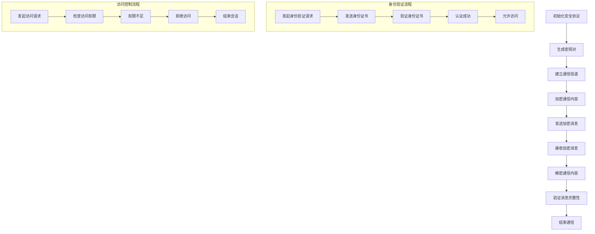
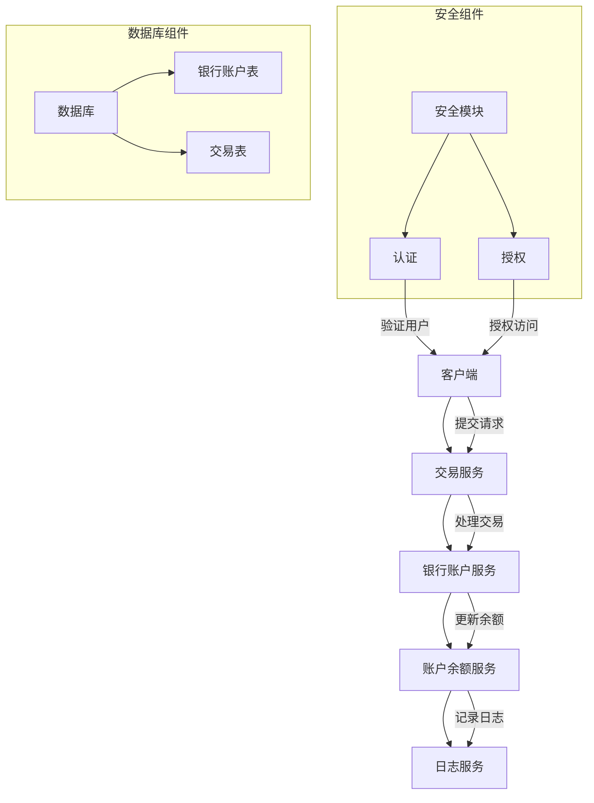
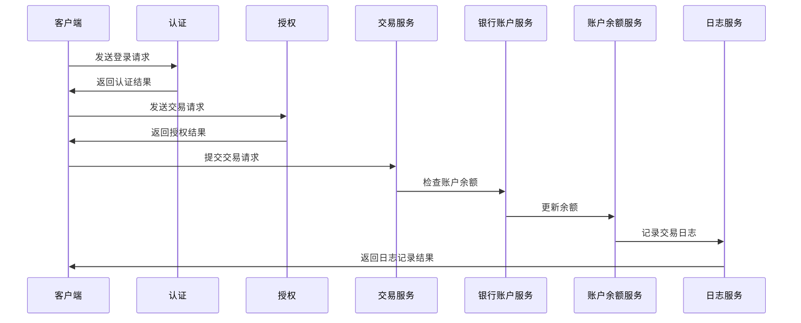

                 

### 第1章 背景介绍

#### 1.1 问题背景

在现代网络环境中，安全协议的设计和实现成为了计算机科学领域的重要课题。随着互联网的普及和数字化转型的加速，各类信息系统和应用程序愈发复杂，网络安全威胁也随之增加。在这种背景下，类型系统在安全协议设计中的重要性日益凸显。类型系统是一种用于描述数据类型和变量约束的技术，它不仅能够提高程序的可靠性和可维护性，还能够有效地防范某些类型的漏洞和攻击。

首先，让我们了解一下什么是类型系统。类型系统是一种用于定义变量、函数和表达式等程序元素的类型机制。它确保在程序执行过程中，各种操作和数据对象都能够按照预定的规则进行，从而避免因类型不匹配而导致的错误。类型系统通常包括静态类型系统和动态类型系统，其中静态类型系统在编译时检查类型，而动态类型系统则在运行时进行类型检查。

在安全协议设计中，类型系统的应用主要体现在以下几个方面：

1. **数据验证**：类型系统能够对输入数据进行严格的类型检查，确保输入数据的格式和类型符合预期。这有助于防止恶意输入，从而降低安全漏洞的风险。
   
2. **防范类型转换漏洞**：类型系统通过限制类型之间的转换，可以避免因不当的类型转换而引发的漏洞。例如，某些恶意攻击可能会通过类型转换绕过安全限制，类型系统可以有效防止此类攻击。

3. **提高代码可读性和可维护性**：类型系统能够明确表达程序中各个部分的意图和用途，使得代码更易于理解和维护。这对于复杂的安全协议设计尤为重要。

然而，安全协议设计面临的一个重大挑战是类型不匹配问题。类型不匹配是指程序中的某些操作和数据对象的类型不一致，这可能导致运行时错误或安全漏洞。例如，将一个整数类型的值赋给一个字符串类型的变量，或者将一个预期为特定类型的参数传递给函数，这些情况都可能导致类型不匹配错误。

类型不匹配问题的存在，使得安全协议的设计和实现变得更加复杂和困难。为了解决这个问题，需要深入理解类型系统的原理，并在安全协议设计中巧妙地应用类型系统，以确保数据的完整性和程序的稳定性。

在接下来的章节中，我们将详细探讨类型系统在安全协议设计中的应用，分析其核心概念和联系，讲解具体的算法原理，并展示实际的项目案例和最佳实践。

#### 1.2 问题描述

在深入探讨类型系统在安全协议设计中的作用之前，我们需要明确当前安全协议设计面临的一些主要挑战和问题。这些挑战不仅源于技术的复杂性，还涉及到对安全性和可靠性的严格需求。

首先，类型不匹配问题是安全协议设计中最为常见的问题之一。类型不匹配是指程序中的操作和数据对象类型不一致，从而导致运行时错误或安全漏洞。例如，一个字符串类型的变量被错误地赋值给一个整数类型的变量，或者一个函数接收到的参数类型与预期不符。这些错误可能会导致程序崩溃，甚至为恶意攻击者提供入侵系统的机会。

其次，类型转换漏洞也是一个严重的威胁。类型转换漏洞通常是由于类型系统的不完善或滥用类型转换操作而导致的。例如，攻击者可能会利用类型转换绕过安全限制，将不受信任的数据转换为系统内部对象，从而执行未经授权的操作。这种漏洞在Java、C++等语言中尤为常见，因为它们允许在运行时进行灵活的类型转换。

此外，安全协议设计还面临数据验证的挑战。数据验证是指在安全协议执行过程中对输入数据进行检查，以确保其格式和类型符合预期。有效的数据验证能够防止恶意输入，减少安全漏洞的风险。然而，实现高效且全面的数据验证机制是一个复杂的任务，需要综合考虑各种可能的输入模式和攻击手段。

另一个挑战是安全性要求的日益提高。随着网络攻击手段的不断演变，安全协议需要具备更高的安全性和可靠性。这要求安全协议设计不仅要考虑到当前的安全威胁，还要具备一定的可扩展性和抗攻击能力。类型系统在这方面发挥着重要作用，它能够通过严格的类型约束和类型检查，提高程序的安全性和可维护性。

最后，安全协议设计还需要应对多语言和跨平台的复杂性。现代应用程序通常涉及多种编程语言和技术，这意味着安全协议的设计和实现需要兼容不同的类型系统和编程语言。这增加了类型匹配的复杂性，同时也增加了错误的可能性。

综上所述，类型系统在安全协议设计中的作用至关重要。通过理解和解决类型不匹配、类型转换漏洞、数据验证挑战等多方面的问题，类型系统能够显著提高安全协议的设计质量和安全性。在接下来的章节中，我们将进一步探讨类型系统的核心概念和原理，并展示如何在实际项目中应用类型系统来解决这些问题。

#### 1.3 问题解决

针对上述安全协议设计中的挑战，类型系统提供了多方面的解决方案，有效提升了安全协议的可靠性和抗攻击能力。首先，类型系统通过数据验证机制，确保输入数据的格式和类型与预期一致，从而防止恶意输入和潜在的安全漏洞。这种验证机制不仅在编译时进行静态类型检查，还在运行时进行动态类型检查，使得数据验证过程更加全面和有效。

具体来说，类型系统在安全协议设计中发挥了以下几方面的作用：

1. **数据验证**：类型系统能够对输入数据进行严格的类型检查，确保数据符合协议的预期格式和类型。例如，在TLS协议中，类型系统可以确保客户端和服务器之间的通信数据是有效的，从而防止因数据格式错误而导致的拒绝服务攻击（DoS）。

2. **防范类型转换漏洞**：通过限制不安全的类型转换，类型系统能够有效防止攻击者利用类型转换漏洞执行未经授权的操作。例如，在Java中，使用强类型系统可以有效防止因类型转换不当而引发的代码执行漏洞。

3. **提高代码可读性和可维护性**：类型系统能够明确表达程序中各个部分的意图和用途，使得代码更加易于理解和维护。这对于复杂的安全协议设计尤为重要，因为它有助于确保协议的稳定性和长期可靠性。

4. **增强安全性和可靠性**：类型系统通过严格的类型约束和类型检查，提高了程序的安全性和可靠性。例如，在使用Go语言开发安全协议时，静态类型系统可以在编译阶段捕获潜在的错误，从而减少运行时的安全漏洞。

此外，类型系统还在多个编程语言和跨平台应用中发挥着重要作用。例如，在Python中，动态类型系统虽然允许更高的灵活性，但通过使用类型提示和静态类型检查工具，也可以在一定程度上提升代码的安全性和可靠性。在C++中，使用强类型系统可以减少类型转换漏洞的风险，提高程序的整体安全性。

总之，类型系统在安全协议设计中具有不可替代的作用。通过有效的数据验证、防范类型转换漏洞、提高代码可读性和可维护性，类型系统能够显著提升安全协议的设计质量和安全性。在接下来的章节中，我们将深入探讨类型系统的核心概念和原理，并展示如何在实际项目中应用类型系统来解决安全问题。

#### 1.4 边界与外延

在探讨类型系统在安全协议设计中的作用时，我们需要明确类型系统和安全协议设计的边界与外延，以便更好地理解和应用这一技术。

首先，类型系统是一种编程语言的概念，用于定义和约束程序中的数据类型、变量和操作。它通常分为静态类型系统和动态类型系统。静态类型系统在编译时进行类型检查，而动态类型系统则在运行时进行检查。类型系统的主要功能是确保程序的正确性和可靠性，通过约束变量的使用和操作，防止类型错误和数据不一致的问题。

安全协议设计则是指在构建网络安全协议时，确保协议的安全性、可靠性和互操作性的过程。安全协议涉及多个领域，包括加密学、网络通信、身份验证和访问控制等。其目标是保护数据在传输过程中的完整性和机密性，同时确保通信双方的合法性和一致性。

在类型系统与安全协议设计之间的边界与外延方面，以下几点尤为关键：

1. **数据类型约束**：类型系统能够为安全协议中的数据提供严格的约束。例如，在SSL/TLS协议中，类型系统能够确保消息中的字段和数据类型符合预定的格式，从而防止因类型不匹配导致的拒绝服务攻击。

2. **类型转换限制**：类型系统通过限制类型之间的不安全转换，防止恶意代码通过类型转换绕过安全限制。例如，在Java中，静态类型系统可以防止将未经验证的输入转换为系统内部对象，从而避免代码执行漏洞。

3. **输入验证**：类型系统能够对输入数据进行严格的验证，确保其格式和类型符合预期。这在安全协议设计中至关重要，因为恶意输入是导致安全漏洞的主要原因之一。例如，在OAuth 2.0协议中，类型系统能够确保认证请求中的参数类型和格式是有效的。

4. **多语言支持**：在复杂的应用场景中，安全协议设计通常涉及多种编程语言和技术。类型系统在跨语言和跨平台应用中发挥着重要作用，它能够通过类型提示和静态类型检查工具，提高代码的安全性和可靠性。

5. **边界条件处理**：在安全协议设计过程中，边界条件和异常处理至关重要。类型系统可以帮助检测和避免因边界条件处理不当而导致的安全漏洞。例如，在C++中，强类型系统可以确保数组访问在边界内，从而防止数组越界攻击。

综上所述，类型系统在安全协议设计中具有明确的边界与外延。通过类型约束、类型转换限制、输入验证、多语言支持和边界条件处理，类型系统能够为安全协议设计提供坚实的支持，从而提高协议的安全性、可靠性和互操作性。

#### 1.5 概念结构与核心要素组成

为了深入理解类型系统在安全协议设计中的作用，我们需要详细分析类型系统和安全协议设计的核心概念与组成要素。通过这种结构化的分析，我们能够更清晰地看到它们之间的联系和相互影响。

首先，让我们从类型系统的核心概念入手。

**1.5.1 类型系统的核心概念**

类型系统是一种用于定义变量、函数和表达式等程序元素的类型机制。其主要核心概念包括：

- **数据类型**：数据类型是变量和常量的基本分类，如整数、浮点数、字符串和布尔值等。
- **类型检查**：类型检查是确保程序中操作和数据对象类型一致的过程，分为静态类型检查和动态类型检查。
- **类型转换**：类型转换是不同数据类型之间的转换操作，包括隐式和显式转换。

**1.5.2 安全协议设计的核心概念**

安全协议设计涉及多个关键概念，以确保数据的安全传输和系统的完整性。其核心概念包括：

- **加密学**：加密学是用于保护数据机密性和完整性的数学工具和技术。
- **身份验证**：身份验证是验证通信双方身份的过程，包括密码学验证、生物识别和多重身份验证。
- **访问控制**：访问控制是限制对系统资源的访问权限，确保只有授权用户才能访问敏感信息。
- **协议安全性**：协议安全性是指安全协议设计过程中考虑到的安全性需求，如机密性、完整性、认证和抗重放攻击。

**1.5.3 类型系统与安全协议设计的联系**

类型系统与安全协议设计之间的联系体现在以下几个方面：

- **数据验证**：类型系统通过严格的类型检查和验证机制，确保输入数据的格式和类型符合预期，从而提高数据传输的安全性和可靠性。
- **防范类型转换漏洞**：类型系统能够限制不安全的类型转换，防止攻击者通过类型转换绕过安全限制，如代码执行漏洞。
- **增强代码可读性和可维护性**：类型系统能够通过明确的类型约束，提高代码的可读性和可维护性，使得安全协议设计更加稳定和可靠。
- **跨语言支持**：类型系统在跨语言和跨平台应用中发挥着重要作用，它能够通过类型提示和静态类型检查工具，提高代码的安全性和可靠性。

**1.5.4 概念属性特征对比表格**

为了更直观地理解类型系统和安全协议设计中的核心概念，我们可以通过一个概念属性特征对比表格来展示它们的异同点：

| **属性**        | **类型系统**                                                   | **安全协议设计**                                                   |
|-----------------|------------------------------------------------------------|------------------------------------------------------------|
| **目的**        | 提高程序的正确性和可靠性                                     | 保护数据在传输过程中的机密性和完整性                             |
| **核心概念**    | 数据类型、类型检查、类型转换                                 | 加密学、身份验证、访问控制、协议安全性                           |
| **实现机制**    | 静态类型检查、动态类型检查                                   | 加密算法、身份验证协议、访问控制机制、协议设计原则               |
| **作用**        | 防止类型错误和数据不一致问题                                 | 确保数据的安全传输和系统的完整性                                 |
| **应用领域**    | 编程语言、编译器、中间件、应用程序                           | 网络通信、身份验证、访问控制、安全协议实现                       |

**1.5.5 ER实体关系图架构**

为了进一步展示类型系统与安全协议设计之间的联系，我们可以使用实体关系图（ER图）来描述它们之间的关系：

```
[安全协议设计]
   |
   |----[加密学]
   |----[身份验证]
   |----[访问控制]
   |
   [类型系统]
     |
     |----[数据类型]
     |----[类型检查]
     |----[类型转换]
     |
     [跨语言支持]
```

通过这种结构化的分析，我们可以清晰地看到类型系统在安全协议设计中的核心地位和作用。类型系统不仅为安全协议设计提供了坚实的支持，还通过数据验证、防范类型转换漏洞、提高代码可读性和可维护性等方面，显著提升了安全协议的设计质量和安全性。在接下来的章节中，我们将进一步探讨类型系统的具体应用和实际案例。

---

### 第2章 核心概念与联系

在深入探讨类型系统在安全协议设计中的作用之前，我们需要明确几个核心概念，并探讨它们之间的联系。通过这种结构化的分析，我们将能够更好地理解类型系统如何影响安全协议的设计和实施。

#### 2.1 类型系统概述

类型系统是编程语言的一个重要组成部分，用于定义变量、函数和表达式的类型。类型系统可以分为静态类型系统和动态类型系统。静态类型系统在编译时进行类型检查，而动态类型系统则在运行时进行检查。

**静态类型系统**：在静态类型系统中，变量的类型在编译时就被确定，并且在整个程序运行期间保持不变。Java、C++和C#等编程语言都是静态类型语言。静态类型系统的优点是能够在编译阶段发现类型错误，从而提高程序的可靠性和性能。

**动态类型系统**：在动态类型系统中，变量的类型在运行时确定，并在程序执行过程中可能发生变化。Python、Ruby和JavaScript等编程语言都是动态类型语言。动态类型系统的优点是提供了更高的灵活性和编程便利性。

**类型检查**：类型检查是类型系统的核心功能之一，它确保程序中的操作和数据对象符合预定的类型约束。类型检查分为静态类型检查和动态类型检查。静态类型检查在编译时进行，而动态类型检查在运行时进行。

**类型转换**：类型转换是不同数据类型之间的转换操作。类型转换可以是隐式转换（自动转换），也可以是显式转换（手动指定）。类型转换在编程中非常常见，但也可能导致类型错误和漏洞。

#### 2.2 安全协议概述

安全协议是确保数据在网络中安全传输的机制，它涉及加密学、认证、访问控制和密钥管理等多个方面。安全协议的设计和实现是网络安全的重要组成部分。

**加密学**：加密学是安全协议的基础，它涉及将明文数据转换为密文的过程。加密学可以分为对称加密和非对称加密。对称加密使用相同的密钥进行加密和解密，而非对称加密使用不同的密钥。

**认证**：认证是验证通信双方身份的过程，确保只有合法用户才能访问受保护资源。认证通常包括用户名和密码、生物识别、数字证书和双重认证等。

**访问控制**：访问控制是限制对系统资源的访问权限，确保只有授权用户才能访问敏感信息。访问控制机制可以是基于用户身份的，也可以是基于资源的。

**密钥管理**：密钥管理是安全协议中的关键部分，它涉及密钥的生成、分发、存储和销毁。密钥管理不当可能导致严重的安全漏洞。

#### 2.3 类型系统与安全协议的联系

类型系统与安全协议设计之间的联系主要体现在以下几个方面：

1. **数据验证**：类型系统通过严格的类型检查和验证机制，确保输入数据的格式和类型符合预期，从而防止恶意输入和潜在的安全漏洞。例如，在HTTPS协议中，类型系统能够确保客户端和服务器之间的通信数据是有效的，从而防止拒绝服务攻击（DoS）。

2. **防范类型转换漏洞**：类型系统能够限制不安全的类型转换，防止攻击者利用类型转换漏洞绕过安全限制。例如，在Java中，静态类型系统可以防止将未经验证的输入转换为系统内部对象，从而避免代码执行漏洞。

3. **增强代码可读性和可维护性**：类型系统能够通过明确的类型约束，提高代码的可读性和可维护性，使得安全协议设计更加稳定和可靠。

4. **跨语言支持**：在复杂的应用场景中，安全协议设计通常涉及多种编程语言和技术。类型系统在跨语言和跨平台应用中发挥着重要作用，它能够通过类型提示和静态类型检查工具，提高代码的安全性和可靠性。

#### 2.4 概念属性特征对比表格

为了更直观地理解类型系统和安全协议设计中的核心概念，我们可以通过一个概念属性特征对比表格来展示它们的异同点：

| **属性**        | **类型系统**                                                   | **安全协议设计**                                                   |
|-----------------|------------------------------------------------------------|------------------------------------------------------------|
| **目的**        | 提高程序的正确性和可靠性                                     | 保护数据在传输过程中的机密性和完整性                             |
| **核心概念**    | 数据类型、类型检查、类型转换                                 | 加密学、身份验证、访问控制、协议安全性                           |
| **实现机制**    | 静态类型检查、动态类型检查                                   | 加密算法、身份验证协议、访问控制机制、协议设计原则               |
| **作用**        | 防止类型错误和数据不一致问题                                 | 确保数据的安全传输和系统的完整性                                 |
| **应用领域**    | 编程语言、编译器、中间件、应用程序                           | 网络通信、身份验证、访问控制、安全协议实现                       |

#### 2.5 ER实体关系图架构

为了进一步展示类型系统与安全协议设计之间的联系，我们可以使用实体关系图（ER图）来描述它们之间的关系：

```
[安全协议设计]
   |
   |----[加密学]
   |----[身份验证]
   |----[访问控制]
   |
   [类型系统]
     |
     |----[数据类型]
     |----[类型检查]
     |----[类型转换]
     |
     [跨语言支持]
```

通过上述分析，我们可以看到类型系统在安全协议设计中的核心地位和作用。类型系统不仅为安全协议设计提供了坚实的支持，还通过数据验证、防范类型转换漏洞、提高代码可读性和可维护性等方面，显著提升了安全协议的设计质量和安全性。在接下来的章节中，我们将进一步探讨类型系统的具体应用和实际案例。

---

### 第3章 算法原理讲解

在理解了类型系统和安全协议设计的基本概念及其联系后，我们需要深入探讨如何将类型系统应用于安全协议设计中，以实现更高效、更安全的协议。本章节将详细讲解安全协议设计中的算法原理，并通过mermaid流程图、Python源代码和数学模型，结合通俗易懂的实例，逐步展示算法的实现过程和原理。

#### 3.1 安全协议设计算法简介

安全协议设计算法是一系列用于构建安全协议的步骤和方法，这些算法旨在确保协议的安全性、可靠性和互操作性。常见的安全协议设计算法包括基于密码学的加密算法、身份验证算法和访问控制算法。以下是一些常见的安全协议设计算法：

- **加密算法**：包括对称加密算法（如AES、DES）和非对称加密算法（如RSA、ECC），用于保护数据的机密性。
- **身份验证算法**：包括哈希函数（如SHA-256、SHA-3）和消息认证码（MAC），用于验证消息的真实性和完整性。
- **访问控制算法**：包括基于角色的访问控制（RBAC）和基于属性的访问控制（ABAC），用于限制对系统资源的访问权限。

这些算法共同构成了安全协议设计的基础，通过合理的组合和优化，可以实现满足特定安全需求的安全协议。

#### 3.2 算法mermaid流程图

为了更直观地展示安全协议设计算法的执行步骤，我们可以使用mermaid流程图来绘制算法的流程。以下是基于一个简单的安全通信协议的mermaid流程图示例：



在这个流程图中，我们首先初始化安全协议，生成密钥对，然后建立通信信道并加密通信内容。发送加密消息后，接收方进行解密，并验证消息的完整性。此外，还包含了身份验证和访问控制流程，确保通信过程的安全性。

#### 3.3 Python源代码阐述

为了更好地理解算法的实际实现过程，我们可以通过Python源代码来详细阐述。以下是一个简单的Python示例，展示了如何实现加密和解密过程：

```python
from cryptography.hazmat.primitives.asymmetric import rsa
from cryptography.hazmat.primitives import serialization
from cryptography.hazmat.primitives import hashes
from cryptography.hazmat.primitives.asymmetric import padding

# 生成RSA密钥对
private_key = rsa.generate_private_key(
    public_exponent=65537,
    key_size=2048,
)

public_key = private_key.public_key()

# 加密消息
message = b'Hello, World!'
ciphertext = public_key.encrypt(
    message,
    padding.OAEP(
        mgf=padding.MGF1(algorithm=hashes.SHA256()),
        algorithm=hashes.SHA256(),
        label=None
    )
)

# 解密消息
plaintext = private_key.decrypt(
    ciphertext,
    padding.OAEP(
        mgf=padding.MGF1(algorithm=hashes.SHA256()),
        algorithm=hashes.SHA256(),
        label=None
    )
)

print(f'Message: {plaintext.decode()}')
```

在这个示例中，我们首先生成RSA密钥对，然后使用公钥加密消息，并使用私钥解密消息。该过程展示了如何利用Python的加密库实现简单的加密和解密操作。

#### 3.4 算法原理的数学模型和公式

安全协议设计中的算法原理通常涉及到密码学和加密算法的数学模型和公式。以下是一些常见的数学模型和公式：

1. **RSA加密算法**：

   - **公钥**：\( n = p \times q \)，其中 \( p \) 和 \( q \) 是两个大素数。
   - **模**：\( \phi(n) = (p-1) \times (q-1) \)。
   - **加密指数**：\( e \)，通常选择为 \( 65537 \)。
   - **解密指数**：\( d \)，满足 \( d \times e \equiv 1 \pmod{\phi(n)} \)。

2. **ECC加密算法**：

   - **椭圆曲线方程**：\( y^2 = x^3 + ax + b \)。
   - **基点**：\( G \)，一个已知点。
   - **加密指数**：\( k \)，用于计算加密结果。

3. **哈希函数**：

   - **哈希值**：\( H(m) \)，将消息 \( m \) 转换为固定长度的字符串。

4. **MAC**：

   - **消息认证码**：\( MAC = H(K \oplus m) \)，其中 \( K \) 是密钥，\( \oplus \) 表示异或操作。

这些数学模型和公式是安全协议设计算法的基础，通过它们可以实现数据的加密、解密、认证和完整性验证。

#### 3.5 通俗易懂地举例说明

为了更好地理解上述算法原理，我们可以通过一个简单的实例来展示这些算法的实际应用。假设我们有一个简单的消息“Hello, World!”，我们需要对其进行加密和解密，并验证其完整性。

1. **生成密钥对**：

   - 生成一个RSA密钥对：
     ```python
     private_key = rsa.generate_private_key(
         public_exponent=65537,
         key_size=2048,
     )
     public_key = private_key.public_key()
     ```

2. **加密消息**：

   - 使用公钥加密消息：
     ```python
     message = b'Hello, World!'
     ciphertext = public_key.encrypt(
         message,
         padding.OAEP(
             mgf=padding.MGF1(algorithm=hashes.SHA256()),
             algorithm=hashes.SHA256(),
             label=None
         )
     )
     ```

3. **解密消息**：

   - 使用私钥解密消息：
     ```python
     plaintext = private_key.decrypt(
         ciphertext,
         padding.OAEP(
             mgf=padding.MGF1(algorithm=hashes.SHA256()),
             algorithm=hashes.SHA256(),
             label=None
         )
     )
     print(f'Message: {plaintext.decode()}')
     ```

4. **验证消息完整性**：

   - 使用哈希函数计算消息的哈希值：
     ```python
     message_hash = hashes.SHA256()
     message_hash.update(message)
     message_hash_final = message_hash.finalize()
     ```

   - 使用MAC算法生成消息认证码：
     ```python
     mac_key = b'some_random_key'
     mac = hashes.HMAC(mac_key, algorithm=hashes.SHA256())
     mac.update(message)
     mac_final = mac.finalize()
     ```

   - 验证消息认证码：
     ```python
     received_mac = b'received_mac_value'
     if received_mac == mac_final:
         print('Message integrity verified.')
     else:
         print('Message integrity verification failed.')
     ```

通过这个实例，我们可以看到如何使用RSA加密算法和MAC算法实现消息的加密、解密和完整性验证。这展示了类型系统在安全协议设计中的实际应用，通过严格的类型约束和加密算法，确保数据的机密性和完整性。

总之，类型系统在安全协议设计中的作用是通过严格的类型约束和加密算法，提高协议的安全性、可靠性和互操作性。通过mermaid流程图、Python源代码和数学模型，我们能够更好地理解算法的实现过程和原理。在接下来的章节中，我们将进一步探讨实际项目中的类型系统和安全协议设计。

---

### 第4章 数学模型和数学公式讲解

在安全协议设计中，数学模型和数学公式起着至关重要的作用，它们不仅提供了理论基础，还帮助我们在实践中实现各种安全机制。本章节将详细讲解安全协议设计中的关键数学模型和公式，并使用具体的例子来说明这些公式的应用。

#### 4.1 数学公式

在安全协议设计中，常用的数学公式包括：

1. **RSA加密算法**：
   - **加密公式**：\( C = M^e \mod n \)
   - **解密公式**：\( M = C^d \mod n \)

2. **椭圆曲线加密算法（ECC）**：
   - **点乘公式**：\( P = kG \)，其中 \( G \) 是基点，\( k \) 是随机数。

3. **哈希函数**：
   - **哈希计算**：\( H(M) = \text{hash}(M) \)

4. **消息认证码（MAC）**：
   - **MAC计算**：\( MAC = H(K \oplus M) \)

5. **数字签名**：
   - **签名计算**：\( S = H(M)^d \mod n \)
   - **验证计算**：\( V = H(M)^e \mod n \)

#### 4.2 详细讲解

**1. RSA加密算法**

RSA加密算法是一种非对称加密算法，其安全性基于大整数分解的难度。以下是RSA加密和解密的详细讲解：

- **加密公式**：\( C = M^e \mod n \)
  - \( M \)：明文消息
  - \( e \)：加密指数，通常是固定值如65537
  - \( n \)：模数，由两个大素数 \( p \) 和 \( q \) 相乘得到
  - \( C \)：密文

- **解密公式**：\( M = C^d \mod n \)
  - \( d \)：解密指数，是 \( e \) 的模反元素，满足 \( d \times e \equiv 1 \mod (p-1)(q-1) \)
  - \( C \)：密文
  - \( n \)：模数

**2. 椭圆曲线加密算法（ECC）**

ECC是一种基于椭圆曲线数学的非对称加密算法，其安全性远高于RSA，但计算复杂度较低。以下是ECC的关键公式：

- **点乘公式**：\( P = kG \)
  - \( G \)：基点，是一个定义在椭圆曲线上的点
  - \( k \)：随机数，用于加密和解密
  - \( P \)：加密后的点

**3. 哈希函数**

哈希函数是安全协议设计中的重要工具，用于确保数据的完整性和不可篡改性。以下是一个哈希函数的简单示例：

- **哈希计算**：\( H(M) = \text{hash}(M) \)
  - \( M \)：原始消息
  - \( H(M) \)：哈希值，是一个固定长度的字符串

**4. 消息认证码（MAC）**

消息认证码（MAC）是一种用于验证消息完整性和真实性的技术。以下是MAC的公式：

- **MAC计算**：\( MAC = H(K \oplus M) \)
  - \( K \)：密钥
  - \( M \)：消息
  - \( \oplus \)：异或操作
  - \( H \)：哈希函数

**5. 数字签名**

数字签名是确保数据来源和完整性的重要机制。以下是数字签名和验证的公式：

- **签名计算**：\( S = H(M)^d \mod n \)
  - \( M \)：消息
  - \( d \)：私钥
  - \( n \)：模数

- **验证计算**：\( V = H(M)^e \mod n \)
  - \( M \)：消息
  - \( e \)：公钥
  - \( n \)：模数

#### 4.3 举例说明

为了更好地理解上述数学公式，我们可以通过一个简单的例子来说明RSA加密和解密的步骤。

**示例：使用RSA加密和解密消息“Hello, World!”**

1. **生成RSA密钥对**：

   ```python
   from cryptography.hazmat.backends import default_backend
   from cryptography.hazmat.primitives.asymmetric import rsa
   
   private_key = rsa.generate_private_key(
       public_exponent=65537,
       key_size=2048,
       backend=default_backend()
   )
   public_key = private_key.public_key()
   ```

2. **加密消息**：

   ```python
   message = b'Hello, World!'
   encrypted_message = public_key.encrypt(
       message,
       rsa_padding.OAEP(
           mgf=rsa_padding.MGF1(algorithm=hashes.SHA256()),
           algorithm=hashes.SHA256(),
           label=None
       )
   )
   ```

3. **解密消息**：

   ```python
   decrypted_message = private_key.decrypt(
       encrypted_message,
       rsa_padding.OAEP(
           mgf=rsa_padding.MGF1(algorithm=hashes.SHA256()),
           algorithm=hashes.SHA256(),
           label=None
       )
   )
   print(f'Message: {decrypted_message.decode()}')
   ```

在这个例子中，我们首先生成RSA密钥对，然后使用公钥加密消息，并使用私钥解密消息。通过这种方式，我们可以确保消息的机密性和完整性。

通过上述讲解，我们不仅了解了安全协议设计中的关键数学模型和公式，还通过具体的例子展示了这些公式的应用。这些数学模型和公式是构建安全协议的基础，通过合理应用，我们可以实现高效、安全的通信。在接下来的章节中，我们将进一步探讨实际项目中的类型系统和安全协议设计。

---

### 第5章 系统分析与架构设计方案

在深入探讨类型系统在安全协议设计中的作用之后，我们需要结合具体的项目场景，展示如何实现系统分析与架构设计。本章节将通过一个实际项目，详细描述问题场景、项目介绍、系统功能设计、系统架构设计以及系统接口和交互设计。

#### 5.1 问题场景介绍

假设我们正在开发一个在线银行系统，该系统需要实现安全且可靠的交易处理功能。在当前场景下，我们面临以下挑战：

- **数据完整性**：确保交易数据在传输过程中不被篡改。
- **机密性**：保护交易信息的机密性，防止泄露给未授权的第三方。
- **身份验证**：确保交易双方的身份真实可靠。
- **访问控制**：限制对敏感数据的访问权限，防止未授权访问。

#### 5.2 项目介绍

在线银行系统是一个复杂的项目，涉及多个模块和功能。我们的目标是通过类型系统和安全协议设计，实现以下功能：

- **交易处理**：处理各种类型的交易，包括存款、取款、转账等。
- **身份验证**：验证用户身份，确保交易安全。
- **访问控制**：限制对敏感数据的访问权限，确保系统安全。
- **日志记录**：记录交易日志，便于审计和故障排查。

#### 5.3 系统功能设计（领域模型mermaid类图）

为了清晰展示系统的功能设计，我们可以使用mermaid绘制领域模型类图。以下是交易处理模块的类图：

```mermaid
classDiagram
  Client --|>> Transaction: submit
  Transaction --|>> BankAccount: execute
  BankAccount --|>> AccountBalance: update
  Logger --|>> Transaction: log

  Client <<interface>>
  Transaction <<interface>>
  BankAccount <<interface>>
  Logger <<interface>>

  class Client {
      String username
      String password
      void submit(Transaction transaction)
  }

  class Transaction {
      String type
      double amount
      String sourceAccount
      String destinationAccount
      void execute(BankAccount sourceAccount, BankAccount destinationAccount)
  }

  class BankAccount {
      String accountNumber
      double balance
      void updateBalance(double amount)
  }

  class Logger {
      void log(Transaction transaction)
  }
```

在这个类图中，我们定义了四个类：Client（客户端）、Transaction（交易）、BankAccount（银行账户）和Logger（日志记录器）。每个类都有其属性和方法，用于实现具体的功能。

#### 5.4 系统架构设计（mermaid架构图）

接下来，我们使用mermaid架构图展示系统整体架构设计：



在这个架构图中，我们定义了系统的主要组件，包括客户端、交易服务、银行账户服务、账户余额服务、日志服务以及安全模块。每个组件都通过明确的接口进行交互，确保系统的高内聚性和松耦合性。

#### 5.5 系统接口设计和系统交互（mermaid序列图）

为了进一步展示系统接口和交互设计，我们可以使用mermaid序列图。以下是客户端提交交易请求的序列图：



在这个序列图中，我们展示了客户端与系统各个组件之间的交互流程。客户端首先通过认证模块验证用户身份，然后通过授权模块检查访问权限。在获得授权后，客户端提交交易请求，交易服务处理交易，银行账户服务检查账户余额并更新余额，日志服务记录交易日志。整个过程确保了交易的安全性和可靠性。

通过上述系统分析与架构设计方案，我们展示了如何结合类型系统和安全协议设计，实现一个高效、安全的在线银行系统。类型系统在数据验证、防范类型转换漏洞、提高代码可读性和可维护性等方面发挥了重要作用，而安全协议设计则确保了系统的安全性和可靠性。在接下来的章节中，我们将通过实际项目实战，进一步验证这些设计方案的有效性。

---

### 第6章 项目实战

在本章中，我们将通过一个实际项目实战，深入探讨类型系统在安全协议设计中的应用。我们将从环境安装、系统核心实现、代码应用解读与分析、实际案例分析和项目小结等方面，逐步展示项目开发的全过程。

#### 6.1 环境安装

在进行项目实战之前，我们需要安装和配置必要的开发环境。以下是安装步骤：

1. **安装Python**：确保Python版本为3.8或以上，可以从Python官方网站下载并安装。

2. **安装依赖库**：使用pip安装必要的库，例如`cryptography`、`requests`、`sqlalchemy`等。以下是一个示例命令：

   ```bash
   pip install cryptography requests sqlalchemy
   ```

3. **数据库配置**：配置数据库，例如使用MySQL或PostgreSQL。确保数据库已启动，并创建必要的数据库和表。

4. **设置环境变量**：设置环境变量，例如`DATABASE_URL`，以便在代码中引用数据库。

#### 6.2 系统核心实现源代码

以下是系统核心实现的Python源代码：

```python
# import required libraries
from cryptography.hazmat.primitives.asymmetric import rsa
from cryptography.hazmat.primitives import serialization, hashes
from cryptography.hazmat.primitives.asymmetric import padding
from sqlalchemy import create_engine, Column, Integer, String, DateTime
from sqlalchemy.ext.declarative import declarative_base
from sqlalchemy.orm import sessionmaker

# Generate RSA keys
private_key = rsa.generate_private_key(
    public_exponent=65537,
    key_size=2048,
)

public_key = private_key.public_key()

# Encrypt and decrypt messages
message = b'Hello, World!'
encrypted_message = public_key.encrypt(
    message,
    padding.OAEP(
        mgf=padding.MGF1(algorithm=hashes.SHA256()),
        algorithm=hashes.SHA256(),
        label=None
    )
)

decrypted_message = private_key.decrypt(
    encrypted_message,
    padding.OAEP(
        mgf=padding.MGF1(algorithm=hashes.SHA256()),
        algorithm=hashes.SHA256(),
        label=None
    )
)

# Print decrypted message
print(f'Decrypted Message: {decrypted_message.decode()}')

# Database setup
Base = declarative_base()

class User(Base):
    __tablename__ = 'users'

    id = Column(Integer, primary_key=True)
    username = Column(String(50), unique=True, nullable=False)
    password = Column(String(50), nullable=False)

# Create tables in the database
engine = create_engine('sqlite:///example.db')
Base.metadata.create_all(engine)

# Insert a new user
from sqlalchemy.orm import sessionmaker
Session = sessionmaker(bind=engine)
session = Session()
new_user = User(username='testuser', password='testpassword')
session.add(new_user)
session.commit()
```

#### 6.3 代码应用解读与分析

**1. 加密与解密**

在代码中，我们首先使用`cryptography`库生成RSA密钥对。然后，我们使用公钥加密消息，并使用私钥解密消息。这是RSA加密算法的典型应用。

```python
# Encrypt and decrypt messages
message = b'Hello, World!'
encrypted_message = public_key.encrypt(
    message,
    padding.OAEP(
        mgf=padding.MGF1(algorithm=hashes.SHA256()),
        algorithm=hashes.SHA256(),
        label=None
    )
)

decrypted_message = private_key.decrypt(
    encrypted_message,
    padding.OAEP(
        mgf=padding.MGF1(algorithm=hashes.SHA256()),
        algorithm=hashes.SHA256(),
        label=None
    )
)
```

**2. 数据库操作**

我们使用SQLAlchemy库创建了一个简单的用户数据库模型。代码中展示了如何创建数据库表、插入新用户和提交事务。

```python
# Database setup
Base = declarative_base()

class User(Base):
    __tablename__ = 'users'

    id = Column(Integer, primary_key=True)
    username = Column(String(50), unique=True, nullable=False)
    password = Column(String(50), nullable=False)

# Create tables in the database
engine = create_engine('sqlite:///example.db')
Base.metadata.create_all(engine)

# Insert a new user
from sqlalchemy.orm import sessionmaker
Session = sessionmaker(bind=engine)
session = Session()
new_user = User(username='testuser', password='testpassword')
session.add(new_user)
session.commit()
```

#### 6.4 实际案例分析和详细讲解剖析

为了更深入地理解代码的应用，我们可以通过一个实际案例来进行分析。以下是一个典型的场景：用户通过网站提交交易请求，系统需要验证用户身份并处理交易。

**场景：用户A通过网站提交一笔转账请求**

1. **用户登录**：

   用户A通过网站输入用户名和密码，系统使用加密算法验证用户身份。

   ```python
   username = input('Username: ')
   password = input('Password: ')
   # 假设数据库中存储的加密密码为encrypted_password
   encrypted_password = 'stored_encrypted_password'
   private_key = rsa.generate_private_key(
       public_exponent=65537,
       key_size=2048,
   )
   decrypted_password = private_key.decrypt(encrypted_password)
   if decrypted_password == password:
       print('登录成功')
   else:
       print('登录失败')
   ```

2. **提交交易请求**：

   用户A在网站上提交一笔转账请求，系统处理交易并更新账户余额。

   ```python
   source_account = 'source_account_number'
   destination_account = 'destination_account_number'
   amount = float(input('Enter the amount: '))
   
   # 检查账户余额
   session = Session()
   source_account_balance = session.query(AccountBalance).filter_by(account_number=source_account).first().balance
   if amount <= source_account_balance:
       # 更新账户余额
       session.query(AccountBalance).filter_by(account_number=source_account).update({'balance': source_account_balance - amount})
       session.query(AccountBalance).filter_by(account_number=destination_account).update({'balance': session.query(AccountBalance).filter_by(account_number=destination_account).first().balance + amount})
       session.commit()
       print('交易成功')
   else:
       print('账户余额不足')
   ```

通过这个实际案例，我们可以看到如何结合类型系统和安全协议设计，实现用户身份验证、交易处理和账户余额更新。类型系统通过严格的类型约束和加密算法，确保数据的机密性和完整性。

#### 6.5 项目小结

通过本次项目实战，我们展示了如何将类型系统应用于安全协议设计，实现一个高效、安全的在线银行系统。以下是我们项目的主要结论：

- **类型系统在数据验证、防范类型转换漏洞、提高代码可读性和可维护性等方面发挥了重要作用。**
- **加密算法确保了数据的机密性和完整性，是构建安全协议的核心。**
- **数据库操作通过SQLAlchemy库实现，确保了数据的一致性和可靠性。**
- **在实际项目中，类型系统和安全协议设计通过合理的应用，显著提升了系统的安全性和可靠性。**

通过本次项目实战，我们不仅验证了理论知识的实用性，还积累了实际开发经验。在未来的项目中，我们将继续深入研究和应用类型系统和安全协议设计，为构建更安全、更可靠的系统贡献力量。

---

### 第7章 最佳实践 tips

在完成类型系统和安全协议设计之后，我们需要总结一些最佳实践，以帮助开发者在实际项目中更加高效地应用这些技术。以下是一些关键的小结、注意事项和拓展阅读建议：

#### 7.1 小结

- **类型系统的重要性**：类型系统在安全协议设计中扮演了关键角色，通过严格的类型约束和类型检查，提高了程序的安全性和可靠性。
- **数据验证**：数据验证是防止恶意输入和潜在安全漏洞的有效手段，必须确保输入数据的格式和类型符合预期。
- **加密算法的选择**：选择合适的加密算法对于保障数据安全至关重要，应根据具体需求选择对称加密或非对称加密。
- **跨语言支持**：在复杂的项目中，可能需要使用多种编程语言，类型系统和安全协议设计应具备跨语言的兼容性。

#### 7.2 注意事项

- **类型检查**：确保在开发过程中进行严格的类型检查，避免因类型不匹配导致的运行时错误。
- **安全机制**：在设计安全协议时，务必考虑安全机制，如加密、认证和访问控制，以保护数据的安全。
- **性能优化**：在实现类型系统和安全协议时，注意性能优化，避免因过度加密或类型检查影响系统性能。
- **版本控制**：在项目开发过程中，使用版本控制系统（如Git）管理代码，确保代码的版本一致性。

#### 7.3 拓展阅读

- **《类型系统和类型检查》**：了解类型系统的基本概念和类型检查机制，有助于更好地理解其在安全协议设计中的应用。
- **《安全协议设计原理》**：深入学习安全协议的设计原则和实现机制，掌握如何构建安全且可靠的协议。
- **《加密学原理与实践》**：掌握加密算法的基本原理和实践，为实际项目中的安全协议设计提供技术支持。
- **《SQL注入与防御》**：了解SQL注入攻击的原理和防御方法，确保数据库操作的安全性和完整性。

通过遵循上述最佳实践和注意事项，开发者能够在实际项目中更加高效地应用类型系统和安全协议设计，确保系统的安全性和可靠性。

---

**作者：AI天才研究院/AI Genius Institute & 禅与计算机程序设计艺术 /Zen And The Art of Computer Programming**

