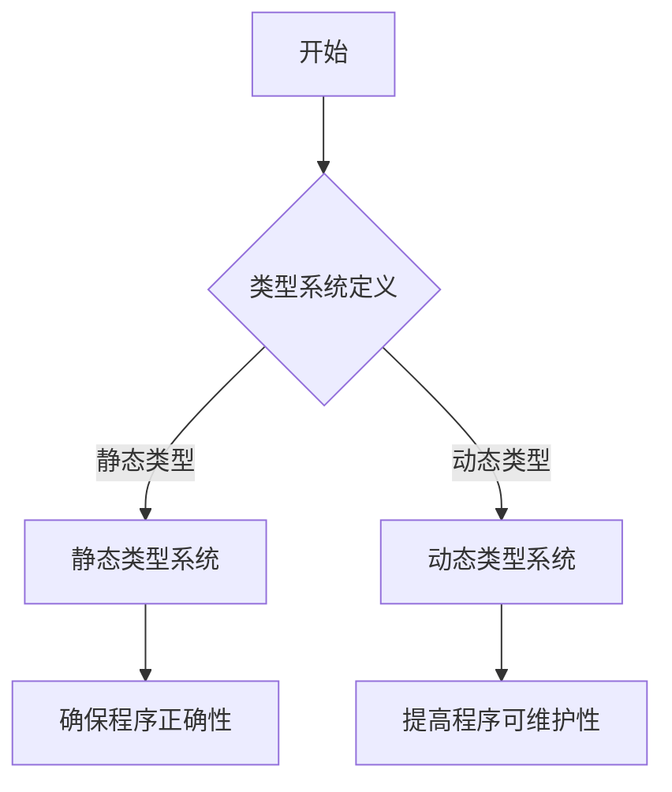

                 

# 类型系统在并行计算模型中的应用

> 关键词：并行计算、类型系统、编程语言、编程框架、类型安全

> 摘要：本文深入探讨了类型系统在并行计算模型中的应用。从并行计算的基本概念出发，我们逐步分析了类型系统在并行编程语言和框架中的实现方式，探讨了类型安全的重要性以及如何处理类型错误。接着，我们通过具体案例展示了类型系统在科学计算、数据分析和机器学习等领域的实际应用，提供了并行计算模型优化和提升的思路。本文旨在为读者提供对类型系统在并行计算中作用的全景了解。

### 第一部分：引言与背景

#### 第1章：并行计算与类型系统的基本概念

## 1.1 并行计算概述

### 1.1.1 并行计算的定义与重要性

并行计算是一种计算方法，其核心思想是将一个大任务分解成多个小任务，这些小任务可以在多个处理器上同时执行，从而加快整体计算速度。并行计算的定义可以表述为：在多个计算节点上同时执行计算任务的过程。

并行计算的重要性体现在多个方面：

1. **提高计算效率**：通过并行执行，可以显著缩短任务完成时间。
2. **解决复杂问题**：对于一些复杂的问题，如大规模数据分析、科学计算和人工智能等，并行计算提供了有效的解决方案。
3. **资源优化**：并行计算可以更好地利用计算资源，提高资源利用率。

### 1.1.2 并行计算的发展历程

并行计算的历史可以追溯到20世纪50年代。当时，计算机科学家们开始探索如何利用多处理器来提高计算效率。早期的并行计算主要是基于硬件上的并行性，如多核处理器、并行计算机等。随着计算机技术的发展，并行计算逐渐扩展到软件层面，出现了各种并行编程语言和框架。

### 1.1.3 并行计算的主要应用领域

并行计算广泛应用于以下领域：

1. **科学计算**：如气象预测、流体力学模拟、天体物理学计算等。
2. **数据分析**：如大规模数据集的处理、大数据分析等。
3. **人工智能**：如深度学习训练、强化学习等。
4. **生物信息学**：如基因序列分析、蛋白质结构预测等。

## 1.2 类型系统的基本概念

### 1.2.1 类型系统的定义

类型系统（Type System）是编程语言中的一个核心概念，用于定义变量、函数和其他数据结构所允许的类型。类型系统的作用是确保程序的正确性，通过类型检查来发现潜在的错误。

### 1.2.2 类型系统的分类

类型系统可以分为以下几类：

1. **静态类型系统**：在程序编译时，变量和函数的类型已经被确定。
2. **动态类型系统**：在程序运行时，变量和函数的类型会被动态确定。
3. **强类型系统**：类型之间的转换需要显式声明。
4. **弱类型系统**：类型之间的转换是隐式的。

### 1.2.3 类型系统的重要性

类型系统的重要性体现在以下几个方面：

1. **确保程序的正确性**：通过类型检查，可以避免许多运行时错误。
2. **提高程序的可维护性**：类型系统提供了清晰的类型约束，使得程序更易于理解和维护。
3. **优化编译过程**：类型系统可以帮助编译器进行更高效的优化。

## 1.3 并行计算与类型系统的关系

### 1.3.1 类型系统在并行计算中的角色

类型系统在并行计算中扮演着重要的角色：

1. **提高并行程序的正确性**：类型系统可以帮助检测并行程序中的类型错误，提高程序的正确性。
2. **优化并行程序的效率**：类型系统可以提供编译器优化并行程序的能力，从而提高执行效率。

### 1.3.2 并行计算对类型系统的影响

并行计算对类型系统提出了一些特殊的要求：

1. **类型安全性**：在并行计算中，类型安全至关重要，以避免数据竞争和死锁等问题。
2. **并行类型的支持**：并行计算需要特殊的类型系统来支持并行数据结构和并行算法。

### 1.3.3 类型系统在并行计算中的应用前景

随着并行计算技术的不断发展，类型系统在并行计算中的应用前景非常广阔：

1. **新编程模型**：如基于数据并行和任务并行的编程模型，需要新的类型系统支持。
2. **高性能计算**：类型系统可以帮助优化并行程序，提高计算性能。
3. **分布式系统**：类型系统在分布式系统中的应用，如分布式数据类型和分布式算法，具有很高的研究价值。

## 1.4 本书结构概述

### 1.4.1 主要内容介绍

本书主要分为三个部分：

1. **第一部分**：介绍并行计算与类型系统的基本概念，包括并行计算的定义、类型系统的分类和作用。
2. **第二部分**：详细讨论类型系统在并行编程语言和框架中的应用，包括并行编程语言中的类型系统实现、并行编程框架中的类型系统实现等。
3. **第三部分**：通过具体应用案例，展示类型系统在并行计算中的实际应用，如科学计算、数据分析和机器学习等。

### 1.4.2 各章节关系与衔接

各章节之间的关系如下：

- **第1章**为全书的基础，介绍了并行计算与类型系统的基本概念。
- **第2章和第3章**分别讨论了类型系统在并行编程语言和框架中的应用。
- **第4章**深入探讨了类型安全与类型错误处理。
- **第5章至第7章**通过具体案例展示了类型系统在并行计算中的实际应用。

### 1.4.3 阅读建议与目标读者

本书的目标读者是具有计算机科学背景的技术人员，特别是对并行计算和类型系统有兴趣的读者。以下是阅读建议：

1. **先阅读第1章**，了解并行计算和类型系统的基本概念。
2. **逐步阅读第2章至第4章**，理解类型系统在并行计算中的应用。
3. **结合具体案例**，如第5章至第7章，加深对类型系统的理解。

通过本书的学习，读者可以系统地了解并行计算与类型系统的关系，掌握类型系统在并行计算中的应用，为实际项目开发提供有力的支持。

#### 第2章：并行编程语言中的类型系统

## 2.1 并行编程语言概述

### 2.1.1 并行编程语言的定义

并行编程语言是一种专门为并行计算设计的编程语言，它提供了并行计算所需的并行构造和并行机制。与传统的串行编程语言相比，并行编程语言具有更强的并行性，能够更高效地利用多处理器和并行计算机。

### 2.1.2 主要的并行编程语言

目前，主要的并行编程语言包括：

1. **Fortran**：Fortran 是一种历史悠久的高级编程语言，广泛应用于科学计算和工程计算。Fortran 支持并行编程，通过使用 `DO` 循环和 `PARALLEL` 关键字来实现并行计算。
   
2. **OpenMP**：OpenMP 是一种用于共享内存并行编程的API，广泛应用于C、C++和Fortran语言中。OpenMP 提供了简单的并行编程模型，通过使用 `#pragma omp` 指令来标识并行区域。

3. **MPI**：Message Passing Interface (MPI) 是一种用于分布式内存并行编程的API，广泛应用于C、C++和Fortran语言中。MPI 提供了高效的通信和同步机制，通过发送和接收消息来实现并行计算。

4. **CUDA**：CUDA 是 NVIDIA 推出的一种并行编程语言，主要用于GPU计算。CUDA 提供了高效的并行编程模型，通过使用线程和网格来组织并行任务。

5. **OpenCL**：OpenCL 是一种开放的标准，用于跨平台并行编程，主要用于GPU和CPU。OpenCL 提供了丰富的并行编程功能，通过使用内核来定义并行任务。

### 2.1.3 并行编程语言的发展趋势

随着并行计算技术的不断发展，并行编程语言也在不断演变和更新。未来的趋势包括：

1. **更简单的编程模型**：新的并行编程语言正在朝着更简单、易用的编程模型发展，以降低并行编程的难度。
2. **跨平台支持**：未来的并行编程语言将更加跨平台，支持多种硬件设备，如CPU、GPU、FPGA等。
3. **更高的并行性能**：随着硬件技术的发展，并行编程语言将提供更高的并行性能，以充分利用硬件资源。

## 2.2 类型系统在并行编程语言中的实现

### 2.2.1 静态类型系统

静态类型系统在并行编程语言中是一种常见的类型系统。在静态类型系统中，变量的类型在编译时就已经确定，程序在运行之前需要通过类型检查来确保类型的一致性。

在并行编程语言中，静态类型系统的作用包括：

1. **确保并行程序的正确性**：静态类型系统可以帮助检测并行程序中的类型错误，从而确保程序的正确性。
2. **优化编译过程**：静态类型系统可以提供编译器优化并行程序的能力，从而提高执行效率。

### 2.2.2 动态类型系统

动态类型系统在并行编程语言中也得到广泛应用。在动态类型系统中，变量的类型是在程序运行时动态确定的。

动态类型系统在并行编程语言中的作用包括：

1. **灵活性**：动态类型系统提供了更高的灵活性，可以更好地适应并行程序的需求。
2. **简化编程**：动态类型系统可以简化并行编程，降低编程难度。

### 2.2.3 强类型系统与弱类型系统的比较

在并行编程语言中，强类型系统与弱类型系统也存在一定的差异。

**强类型系统**的特点包括：

1. **严格的类型检查**：强类型系统在编译时对类型进行严格的检查，确保程序的正确性。
2. **性能优化**：强类型系统可以提供更好的性能优化，因为编译器可以更准确地了解程序的行为。

**弱类型系统**的特点包括：

1. **更宽松的类型检查**：弱类型系统在编译时对类型的检查较为宽松，允许更多的类型转换。
2. **灵活性**：弱类型系统提供了更高的灵活性，但可能导致程序的正确性受到一定的影响。

## 2.3 并行编程语言的类型检查

### 2.3.1 类型检查的基本原理

类型检查是并行编程语言中的一个重要环节，用于确保程序在运行时不会出现类型错误。

类型检查的基本原理包括：

1. **类型一致性检查**：在并行程序中，不同变量之间的操作需要确保类型的一致性。
2. **类型边界检查**：在并行程序中，需要对数据的边界进行检查，以确保不会越界访问内存。

### 2.3.2 类型检查的过程

类型检查的过程可以分为以下几个步骤：

1. **语法分析**：对程序进行语法分析，构建抽象语法树（AST）。
2. **语义分析**：对AST进行语义分析，检查类型的一致性和边界。
3. **错误报告**：在类型检查过程中，如果发现类型错误，需要报告错误信息。

### 2.3.3 类型检查的工具与方法

并行编程语言中，常用的类型检查工具有：

1. **编译器内置的类型检查**：大多数并行编程语言的编译器都内置了类型检查功能。
2. **静态分析工具**：如静态代码分析工具，可以用于自动检查并行程序中的类型错误。
3. **动态分析工具**：如动态监测工具，可以在程序运行时检查类型错误。

通过有效的类型检查，可以确保并行程序的正确性和性能，为并行计算提供坚实的基础。

#### 第3章：并行编程框架中的类型系统

## 3.1 并行编程框架概述

### 3.1.1 并行编程框架的定义

并行编程框架是一种软件框架，用于简化并行程序的编写和执行。它提供了抽象的并行编程模型和工具，使开发者能够更轻松地编写并行程序，并充分利用并行硬件资源。

### 3.1.2 常见的并行编程框架

目前，常见的并行编程框架包括：

1. **MapReduce**：由Google提出，用于大规模数据处理。MapReduce 模型将数据处理分为两个阶段：Map 阶段对数据进行映射，Reduce 阶段对映射结果进行归约。
   
2. **Spark**：由Apache Software Foundation维护，是一种基于内存的分布式计算框架，提供了丰富的数据处理库和算法。
3. **Flink**：由Apache Software Foundation维护，是一种流处理和批处理一体化的分布式计算框架。
4. **Hadoop**：由Apache Software Foundation维护，是一种分布式数据处理框架，包括了MapReduce 计算模型和HDFS 文件系统。

### 3.1.3 并行编程框架的发展趋势

随着并行计算技术的不断发展，并行编程框架也在不断更新和演化。未来的趋势包括：

1. **更高层次的抽象**：并行编程框架将提供更高层次的抽象，降低并行编程的难度。
2. **更好的性能优化**：并行编程框架将提供更好的性能优化，以充分利用硬件资源。
3. **更好的兼容性**：并行编程框架将支持多种硬件平台，如CPU、GPU、FPGA等。

## 3.2 类型系统在并行编程框架中的实现

### 3.2.1 类型系统的设计原则

在并行编程框架中，类型系统的设计原则包括：

1. **一致性**：类型系统需要确保并行程序中的数据类型一致，避免类型错误。
2. **安全性**：类型系统需要确保并行程序的安全性，避免数据竞争和死锁等问题。
3. **灵活性**：类型系统需要提供足够的灵活性，以适应不同的并行编程需求。

### 3.2.2 并行编程框架中的类型表示

并行编程框架中的类型表示通常包括：

1. **基本数据类型**：如整数、浮点数、布尔值等。
2. **复杂数据类型**：如数组、列表、字典等。
3. **并行数据类型**：如分布式数组、分布式列表等。

### 3.2.3 并行编程框架中的类型安全

并行编程框架中的类型安全涉及以下几个方面：

1. **类型检查**：在并行程序执行前，对程序进行类型检查，确保类型的一致性。
2. **数据一致性**：确保并行程序中的数据在传输和操作过程中保持一致性。
3. **数据隔离**：确保并行程序中的不同数据部分之间不会发生数据竞争。

## 3.3 并行编程框架中的类型检查与类型推断

### 3.3.1 类型检查的基本原理

类型检查的基本原理包括：

1. **静态类型检查**：在程序编译时进行类型检查，确保程序在运行前没有类型错误。
2. **动态类型检查**：在程序运行时进行类型检查，通过运行时检查来确保程序的正确性。

### 3.3.2 类型推断的方法

类型推断的方法包括：

1. **显式类型声明**：开发者在编写程序时显式声明变量和函数的类型。
2. **隐式类型推断**：编译器根据程序上下文自动推断变量和函数的类型。

### 3.3.3 类型检查与类型推断的结合

在并行编程框架中，类型检查和类型推断的结合可以提供更好的编程体验和性能优化。通过结合静态类型检查和动态类型检查，可以确保并行程序的正确性，同时提高程序的执行效率。

并行编程框架中的类型检查和类型推断方法，为开发者提供了强大的支持，使并行编程更加高效、安全。通过深入理解并行编程框架中的类型系统，开发者可以更好地利用并行计算资源，实现高性能的计算任务。

#### 第4章：并行计算中的类型安全与类型错误处理

## 4.1 类型安全的基本概念

### 4.1.1 类型安全的定义

类型安全（Type Safety）是指编程语言在编译或运行时，能够确保变量、函数和数据结构的使用遵循其定义的类型。类型安全的目的是防止类型错误，从而提高程序的正确性和稳定性。

### 4.1.2 类型安全的层次

类型安全可以分为以下几个层次：

1. **静态类型安全**：在程序编译时，类型检查已经完成，程序在运行前不会出现类型错误。
2. **动态类型安全**：在程序运行时，类型检查才进行，如果有类型错误，程序会在运行时抛出异常。

### 4.1.3 类型安全的重要性

类型安全在并行计算中具有非常重要的意义：

1. **防止类型错误**：类型安全可以确保程序在执行时不会因为类型错误而导致数据损坏或程序崩溃。
2. **提高程序可靠性**：类型安全可以提高程序的可靠性，减少运行时的错误和异常。
3. **优化编译过程**：类型安全可以帮助编译器进行更高效的优化，提高程序的性能。

## 4.2 并行计算中的类型错误处理

### 4.2.1 类型错误的种类

在并行计算中，类型错误可以分为以下几种：

1. **类型不匹配**：在并行程序中，不同类型的变量进行操作时，没有进行适当的类型转换，导致类型不匹配。
2. **类型越界**：在处理数组等数据结构时，访问超出类型定义的边界，导致内存访问错误。
3. **类型转换错误**：在类型转换过程中，没有正确处理不同类型之间的兼容性问题，导致类型转换错误。

### 4.2.2 类型错误的检测与报告

类型错误的检测与报告是并行计算中非常重要的一环。以下是一些常见的检测与报告方法：

1. **编译时检测**：编译器在编译过程中，通过类型检查来发现类型错误，并在编译时报告错误。
2. **运行时检测**：程序在运行时，通过运行时检查来发现类型错误，并在运行时抛出异常。
3. **日志记录**：程序在运行过程中，将类型错误的信息记录在日志中，以便后续分析和调试。

### 4.2.3 类型错误的修复与预防

类型错误的修复与预防是并行计算中的关键步骤。以下是一些常见的修复与预防方法：

1. **明确类型声明**：在编写并行程序时，明确声明变量和函数的类型，确保类型匹配。
2. **使用类型转换**：在必要时使用类型转换，确保不同类型的变量可以安全地进行操作。
3. **边界检查**：在处理数组等数据结构时，进行边界检查，避免越界访问内存。
4. **使用类型安全库**：使用类型安全的编程库，减少类型错误的发生。
5. **代码审查和测试**：通过代码审查和测试，及时发现并修复类型错误。

## 4.3 类型系统的优化与提升

### 4.3.1 类型系统的优化策略

类型系统的优化策略包括以下几个方面：

1. **减少类型检查时间**：通过优化编译器的类型检查算法，减少类型检查的时间。
2. **提高类型推断效率**：通过改进类型推断算法，提高类型推断的效率。
3. **优化内存使用**：优化类型系统，减少内存的使用，提高程序的运行效率。

### 4.3.2 类型系统的性能提升

类型系统的性能提升可以从以下几个方面进行：

1. **减少类型检查次数**：通过优化编译器的类型检查策略，减少不必要的类型检查。
2. **并行化类型检查**：将类型检查过程并行化，利用多处理器提高类型检查的效率。
3. **优化内存分配**：优化内存分配策略，减少内存碎片和提高内存使用效率。

### 4.3.3 类型系统的未来发展方向

类型系统在未来的发展中，将面临以下挑战和机遇：

1. **支持更复杂的并行模型**：随着并行计算模型的发展，类型系统需要支持更复杂的并行模型，如异步计算、实时计算等。
2. **提高编程效率**：类型系统需要提供更高效的编程模型，降低并行编程的难度。
3. **支持跨平台编程**：类型系统需要支持跨平台的编程，如CPU、GPU、FPGA等。

通过深入理解和优化类型系统，可以确保并行计算的正确性和性能，为大规模并行计算提供坚实的基础。

#### 第5章：并行计算中的科学计算应用

## 5.1 科学计算概述

### 5.1.1 科学计算的定义

科学计算（Scientific Computing）是指利用计算机技术和算法来解决科学研究中的计算问题。科学计算涉及广泛的应用领域，包括气象预测、流体力学模拟、天体物理学计算、生物信息学计算等。

### 5.1.2 科学计算的重要性

科学计算在现代社会中扮演着重要的角色：

1. **推动科学研究**：科学计算为科学研究提供了强大的工具，使得科学家能够解决复杂的科学问题。
2. **促进技术创新**：科学计算在航空航天、能源、生物技术等领域推动了技术创新。
3. **支持决策制定**：科学计算在气象预测、自然灾害预警、城市规划等领域提供了重要的数据支持，帮助决策者做出更加科学的决策。

### 5.1.3 科学计算的基本方法

科学计算的基本方法包括：

1. **数值计算**：使用数值方法来求解科学问题，如有限元分析、数值积分、数值微分等。
2. **符号计算**：使用符号计算方法，对科学问题进行精确求解，如符号积分、符号微分等。
3. **模拟计算**：通过建立科学问题的数学模型，使用计算机模拟来验证理论模型和预测结果。

## 5.2 类型系统在科学计算中的应用

### 5.2.1 科学计算中的类型需求

在科学计算中，类型系统发挥着重要作用，主要体现在以下几个方面：

1. **数值精度**：科学计算中常常需要高精度的数值计算，类型系统提供了支持高精度数值类型的机制，如双精度浮点数（double precision floating-point）。
2. **复杂数据结构**：科学计算中需要处理大量的复杂数据结构，如多维数组、矩阵等，类型系统提供了创建和管理这些数据结构的能力。
3. **类型安全**：类型系统确保了科学计算中的数据类型一致性，防止因类型错误导致的计算错误。

### 5.2.2 类型系统在科学计算中的实现

类型系统在科学计算中的实现通常包括以下几个方面：

1. **编程语言支持**：科学计算编程语言，如Fortran、C++等，提供了丰富的类型系统支持，包括基本数据类型、复杂数据类型和用户自定义类型。
2. **数值库**：科学计算中常用的数值库，如Numpy、SciPy等，提供了丰富的类型系统支持，确保计算的正确性和性能。
3. **并行计算框架**：并行计算框架，如MPI、OpenMP等，通过类型系统提供了并行计算的支持，提高了科学计算的效率。

### 5.2.3 类型系统在科学计算中的优化

类型系统在科学计算中的优化主要体现在以下几个方面：

1. **类型转换优化**：通过优化类型转换的算法，减少计算时间和内存消耗。
2. **内存管理优化**：通过优化内存分配和回收策略，减少内存碎片和提高内存使用效率。
3. **并行计算优化**：通过优化类型系统的并行处理能力，提高并行计算的性能。

## 5.3 科学计算案例介绍

### 5.3.1 案例一：气象预测

气象预测是一个典型的科学计算问题，涉及大量的数值计算和复杂数据结构。类型系统在气象预测中的应用如下：

1. **高精度数值类型**：气象预测中需要处理高精度的数值数据，如温度、湿度、风速等，类型系统提供了双精度浮点数（double precision floating-point）的支持。
2. **复杂数据结构**：气象预测中需要处理大量的气象数据，如气象网格数据、雷达数据等，类型系统提供了多维数组、矩阵等数据结构支持。
3. **并行计算**：气象预测中的计算量巨大，类型系统通过并行计算框架提供了并行处理的支持，提高了预测效率。

### 5.3.2 案例二：流体力学模拟

流体力学模拟是一个复杂的科学计算问题，涉及大量的数值计算和物理模型。类型系统在流体力学模拟中的应用如下：

1. **数值计算方法**：类型系统支持各种数值计算方法，如有限元方法、有限体积方法等，确保计算的正确性和性能。
2. **复杂数据结构**：流体力学模拟中需要处理大量的网格数据和流体物理量，类型系统提供了多维数组、矩阵等数据结构支持。
3. **并行计算**：流体力学模拟中的计算量巨大，类型系统通过并行计算框架提供了并行处理的支持，提高了模拟效率。

### 5.3.3 案例三：生物信息学计算

生物信息学计算是一个高度复杂的科学计算问题，涉及大量的生物数据分析和计算。类型系统在生物信息学计算中的应用如下：

1. **高精度数值类型**：生物信息学计算中需要处理高精度的数值数据，如基因序列、蛋白质结构等，类型系统提供了双精度浮点数（double precision floating-point）的支持。
2. **复杂数据结构**：生物信息学计算中需要处理大量的生物数据，如基因序列、蛋白质结构等，类型系统提供了序列、树状图等数据结构支持。
3. **并行计算**：生物信息学计算中的计算量巨大，类型系统通过并行计算框架提供了并行处理的支持，提高了计算效率。

通过以上案例，我们可以看到类型系统在科学计算中的应用至关重要。类型系统不仅提供了高精度数值类型和复杂数据结构支持，还通过并行计算提高了科学计算的效率和准确性。随着科学计算技术的不断发展，类型系统将继续在科学计算领域发挥重要作用。

#### 第6章：并行计算中的数据分析应用

## 6.1 数据分析概述

### 6.1.1 数据分析的定义

数据分析（Data Analysis）是指从大量的数据中提取有价值的信息和知识的过程。数据分析涉及数据的收集、存储、处理、分析和解释等多个环节。

### 6.1.2 数据分析的重要性

数据分析在当今数据驱动的时代具有极高的重要性：

1. **商业决策**：数据分析可以帮助企业从海量数据中提取有价值的信息，支持商业决策。
2. **科学研究**：数据分析为科学研究提供了有力的工具，帮助科学家发现新的研究规律。
3. **公共管理**：数据分析在公共管理领域发挥着重要作用，如公共卫生监测、交通规划等。

### 6.1.3 数据分析的基本方法

数据分析的基本方法包括：

1. **描述性分析**：通过统计描述数据的基本特征，如均值、中位数、标准差等。
2. **推断性分析**：通过构建统计模型，对数据进行分析，如回归分析、假设检验等。
3. **预测性分析**：通过历史数据和统计模型，对未来事件进行预测，如时间序列预测、分类预测等。

## 6.2 类型系统在数据分析中的应用

### 6.2.1 数据分析中的类型需求

在数据分析中，类型系统发挥着关键作用，主要体现在以下几个方面：

1. **数据类型支持**：类型系统提供了丰富的数据类型支持，如数值类型、文本类型、日期类型等，以满足不同类型数据的需求。
2. **复杂数据结构**：类型系统支持复杂数据结构，如数组、列表、字典等，便于存储和管理大量数据。
3. **数据一致性**：类型系统确保数据在处理过程中保持一致性，防止因类型错误导致的分析结果错误。

### 6.2.2 类型系统在数据分析中的实现

类型系统在数据分析中的实现包括以下几个方面：

1. **编程语言支持**：数据分析编程语言，如Python、R等，提供了强大的类型系统支持，便于处理和分析各种类型的数据。
2. **数据处理库**：数据分析库，如Pandas、NumPy等，通过类型系统提供了高效的数据处理能力，支持大规模数据集的操作。
3. **并行计算框架**：并行计算框架，如Apache Spark、Hadoop等，通过类型系统支持并行数据处理，提高了数据分析的效率。

### 6.2.3 类型系统在数据分析中的优化

类型系统在数据分析中的优化主要体现在以下几个方面：

1. **类型转换优化**：通过优化类型转换算法，减少计算时间和内存消耗。
2. **内存管理优化**：通过优化内存分配和回收策略，减少内存碎片和提高内存使用效率。
3. **并行计算优化**：通过优化类型系统的并行处理能力，提高并行数据分析的性能。

## 6.3 数据分析案例介绍

### 6.3.1 案例一：社交媒体数据分析

社交媒体数据分析是大数据分析的一个典型应用场景。通过类型系统，可以实现以下功能：

1. **数据类型支持**：类型系统支持各种社交媒体数据类型，如文本、图片、视频等，便于存储和管理。
2. **复杂数据结构**：类型系统支持复杂数据结构，如数据框（DataFrame）和索引（Index），便于进行数据分析。
3. **并行计算**：类型系统通过并行计算框架支持大规模社交媒体数据的处理，提高了分析效率。

### 6.3.2 案例二：金融数据分析

金融数据分析在金融领域具有重要作用。通过类型系统，可以实现以下功能：

1. **数据类型支持**：类型系统支持金融数据类型，如股票价格、交易量、财务指标等，便于存储和分析。
2. **复杂数据结构**：类型系统支持复杂数据结构，如时间序列数据、矩阵等，便于进行金融模型的构建和分析。
3. **并行计算**：类型系统通过并行计算框架支持大规模金融数据的处理，提高了分析效率。

### 6.3.3 案例三：医学数据分析

医学数据分析在医疗领域具有重要意义。通过类型系统，可以实现以下功能：

1. **数据类型支持**：类型系统支持医学数据类型，如基因序列、医疗记录、影像数据等，便于存储和分析。
2. **复杂数据结构**：类型系统支持复杂数据结构，如矩阵、树状图等，便于进行医学模型的构建和分析。
3. **并行计算**：类型系统通过并行计算框架支持大规模医学数据的处理，提高了分析效率。

通过以上案例，我们可以看到类型系统在数据分析中的应用至关重要。类型系统不仅提供了丰富的数据类型和复杂数据结构支持，还通过并行计算提高了数据分析的效率和准确性。随着数据分析技术的不断发展，类型系统将继续在数据分析领域发挥重要作用。

#### 第7章：并行计算中的机器学习应用

## 7.1 机器学习概述

### 7.1.1 机器学习的定义

机器学习（Machine Learning）是一种人工智能（Artificial Intelligence，AI）的技术，通过算法和统计模型，让计算机从数据中学习和发现规律，从而能够对未知数据进行预测和决策。

### 7.1.2 机器学习的重要性

机器学习在当今社会具有极其重要的意义：

1. **数据驱动的决策**：机器学习能够从海量数据中提取有价值的信息，为决策提供支持。
2. **自动化**：通过机器学习，许多重复性和繁琐的任务可以自动化，提高工作效率。
3. **智能化**：机器学习使得计算机能够进行自我学习和优化，提升了人工智能的应用水平。

### 7.1.3 机器学习的基本方法

机器学习的基本方法可以分为以下几类：

1. **监督学习（Supervised Learning）**：通过已标记的数据进行学习，训练模型，然后用于预测未知数据。
2. **无监督学习（Unsupervised Learning）**：没有标记数据，模型需要从数据中自动发现模式和结构。
3. **强化学习（Reinforcement Learning）**：通过与环境互动，学习最佳行为策略。

## 7.2 类型系统在机器学习中的应用

### 7.2.1 机器学习中的类型需求

在机器学习中，类型系统的作用至关重要，主要体现在以下几个方面：

1. **数值类型**：机器学习算法需要处理大量的数值数据，如浮点数、整数等，类型系统提供了支持这些数值类型的能力。
2. **复杂数据结构**：机器学习算法经常需要处理复杂数据结构，如多维数组、矩阵等，类型系统提供了创建和管理这些数据结构的能力。
3. **类型安全**：类型系统确保了机器学习过程中的数据类型一致性，防止因类型错误导致的算法失效。

### 7.2.2 类型系统在机器学习中的实现

类型系统在机器学习中的实现通常包括：

1. **编程语言支持**：机器学习编程语言，如Python、R等，提供了强大的类型系统支持，便于开发复杂的机器学习算法。
2. **机器学习库**：如scikit-learn、TensorFlow、PyTorch等，通过类型系统提供了高效的机器学习工具和库。
3. **并行计算框架**：并行计算框架，如Apache Spark、Hadoop等，通过类型系统支持大规模数据的机器学习任务。

### 7.2.3 类型系统在机器学习中的优化

类型系统在机器学习中的优化主要体现在以下几个方面：

1. **类型转换优化**：通过优化类型转换算法，减少计算时间和内存消耗。
2. **内存管理优化**：通过优化内存分配和回收策略，减少内存碎片和提高内存使用效率。
3. **并行计算优化**：通过优化类型系统的并行处理能力，提高并行机器学习的性能。

## 7.3 机器学习案例介绍

### 7.3.1 案例一：图像识别

图像识别是机器学习的一个典型应用，通过训练模型来识别图像中的物体。类型系统在图像识别中的应用如下：

1. **数值类型支持**：图像数据由像素值组成，类型系统提供了支持这些数值类型的能力，如双精度浮点数。
2. **复杂数据结构**：图像数据可以通过多维数组来表示，类型系统支持多维数组的创建和管理。
3. **并行计算**：图像识别任务通常涉及大量数据处理，类型系统通过并行计算框架提供了并行处理的优化。

### 7.3.2 案例二：自然语言处理

自然语言处理（Natural Language Processing，NLP）是机器学习在文本领域的应用。类型系统在自然语言处理中的应用如下：

1. **文本类型支持**：类型系统提供了对文本数据类型的支持，如字符串类型，便于处理文本数据。
2. **复杂数据结构**：自然语言处理中常使用序列数据结构，如词序列、句子序列等，类型系统支持这些数据结构。
3. **并行计算**：自然语言处理任务通常涉及大规模文本数据，类型系统通过并行计算框架提高了处理效率。

### 7.3.3 案例三：推荐系统

推荐系统是机器学习在电子商务和社交媒体领域的应用，通过预测用户可能感兴趣的商品或内容。类型系统在推荐系统中的应用如下：

1. **数值类型支持**：推荐系统中涉及用户行为数据，如点击率、购买率等，类型系统提供了对数值类型的支持。
2. **复杂数据结构**：推荐系统中需要处理大量的用户行为数据和商品数据，类型系统支持复杂数据结构，如矩阵、字典等。
3. **并行计算**：推荐系统通常涉及大规模数据处理，类型系统通过并行计算框架提高了数据处理和分析的效率。

通过以上案例，我们可以看到类型系统在机器学习中的应用至关重要。类型系统不仅提供了数值类型和复杂数据结构的支持，还通过并行计算优化了机器学习的效率和性能。随着机器学习技术的不断发展，类型系统将继续在机器学习领域发挥重要作用。

### 总结与展望

#### 6.1 总结

本文系统地探讨了类型系统在并行计算模型中的应用。从并行计算与类型系统的基本概念出发，我们详细分析了类型系统在并行编程语言和框架中的实现方式，探讨了类型安全的重要性以及如何处理类型错误。接着，我们通过具体案例展示了类型系统在科学计算、数据分析和机器学习等领域的实际应用。本文的主要结论如下：

1. **类型系统在并行计算中的重要性**：类型系统在确保并行程序的正确性、优化编译过程和提高程序可维护性方面发挥着重要作用。
2. **并行编程语言与框架中的类型系统实现**：并行编程语言和框架通过丰富的数据类型支持和高效的类型检查，提高了并行程序的效率。
3. **类型安全与错误处理**：类型安全在并行计算中至关重要，类型错误处理机制有助于确保并行程序的正确性和稳定性。
4. **具体应用领域**：类型系统在科学计算、数据分析和机器学习等领域的应用，提高了这些领域计算任务的效率和准确性。

#### 6.2 展望

随着并行计算技术的不断发展，类型系统在并行计算中的应用前景非常广阔。以下是一些未来可能的发展方向：

1. **新编程模型**：新的并行编程模型，如基于数据并行和任务并行的模型，将需要新的类型系统支持。
2. **跨平台支持**：类型系统将需要更好地支持多种硬件平台，如CPU、GPU、FPGA等。
3. **性能优化**：类型系统将继续优化，以提高并行程序的性能和效率。
4. **类型安全提升**：类型系统的安全性将不断提升，以应对并行计算中的复杂场景和挑战。

通过不断的研究和实践，类型系统将在并行计算中发挥更加重要的作用，为高性能计算提供坚实的理论基础和工具支持。

### 最佳实践 Tips

1. **理解类型系统**：深入学习并行编程语言和框架中的类型系统，理解其工作原理和适用场景。
2. **类型安全编程**：遵循类型安全编程原则，减少类型错误的发生。
3. **优化类型使用**：合理使用类型系统，避免不必要的类型转换和内存消耗。
4. **并行计算经验**：积累并行计算的经验，了解不同并行模型的特点和适用性。

### 注意事项

1. **类型错误的影响**：类型错误可能导致程序崩溃或计算错误，因此在开发过程中要严格检查类型。
2. **并行计算资源**：合理利用并行计算资源，优化并行程序以提高性能。

### 拓展阅读

1. 《并行计算导论》（张春晓 著）：系统介绍了并行计算的基本概念和技术。
2. 《类型系统：理论与实践》（M. Ben-Ari 著）：深入探讨了类型系统的理论和实践应用。
3. 《机器学习：一种概率视角》（Kevin P. Murphy 著）：全面介绍了机器学习的基本概念和算法。

作者：AI天才研究院/AI Genius Institute & 禅与计算机程序设计艺术 /Zen And The Art of Computer Programming

### 附录

以下是文中提到的部分 Mermaid 流程图和 LaTeX 公式：



```latex
$$
1 + 1 = 2
$$

$$
x > 0
$$
```

通过这些工具，我们可以更清晰地展示算法原理和系统架构，为读者提供更好的理解和支持。希望这些资源能够帮助您进一步深入探索并行计算与类型系统的应用。

