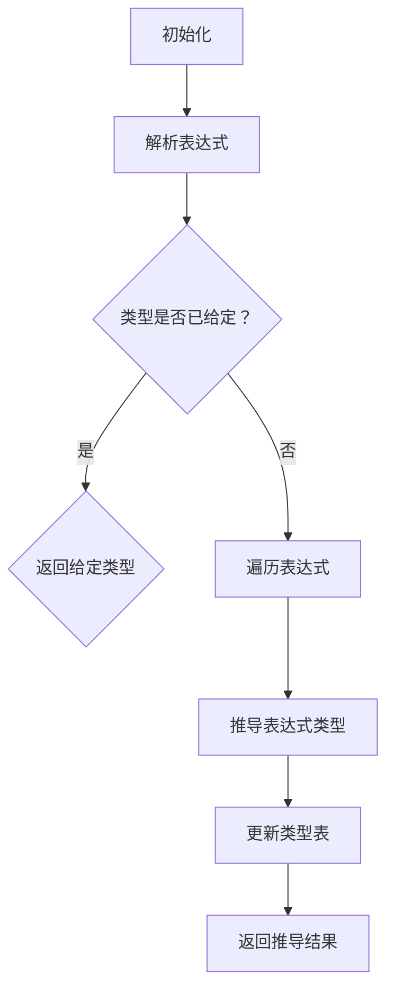
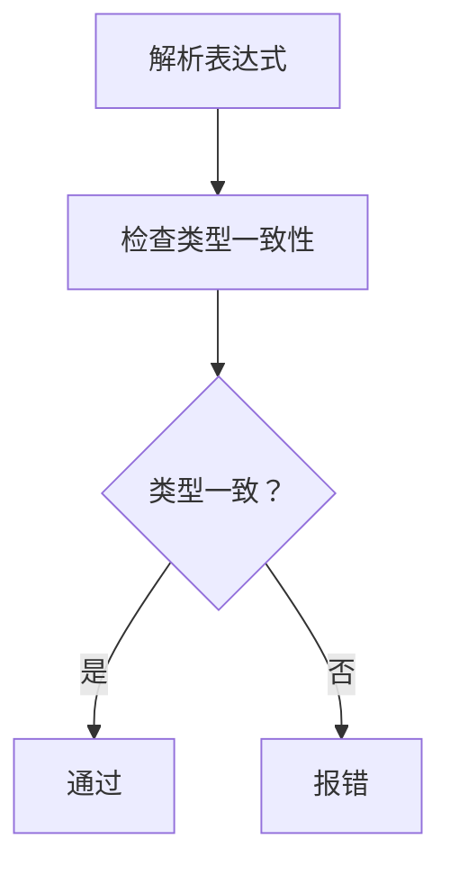
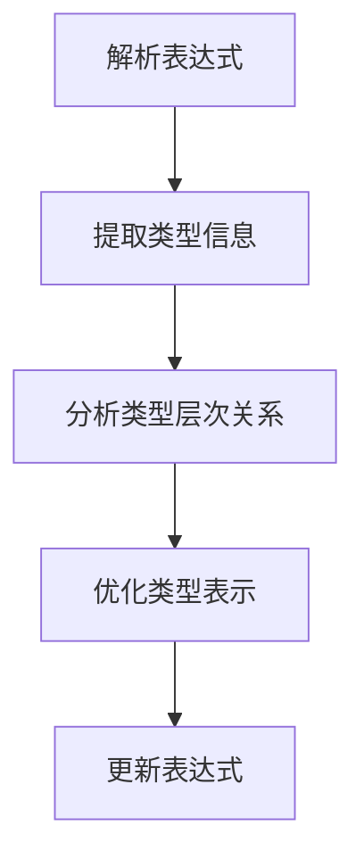
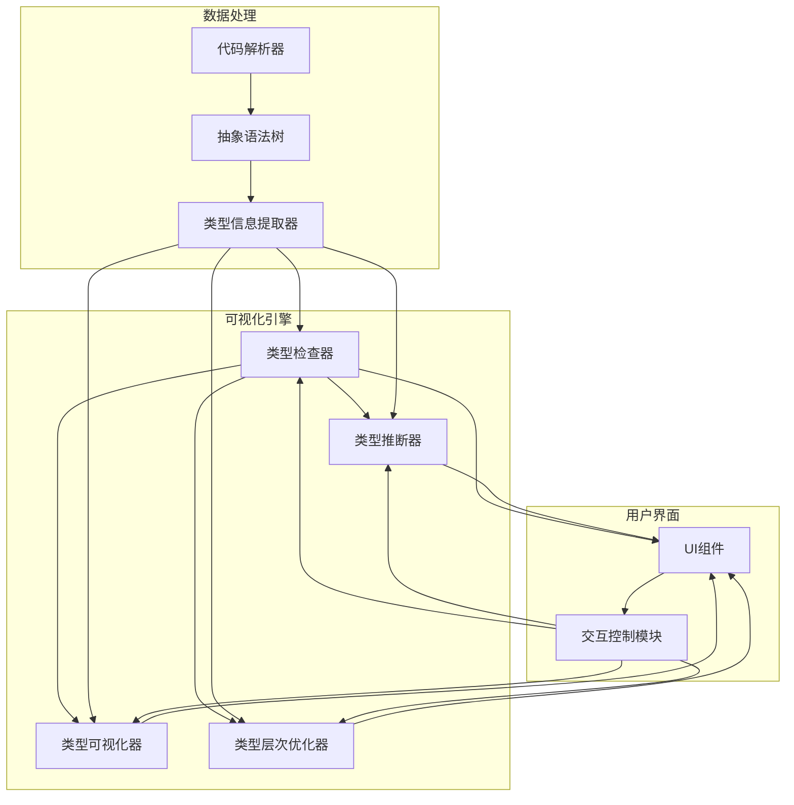
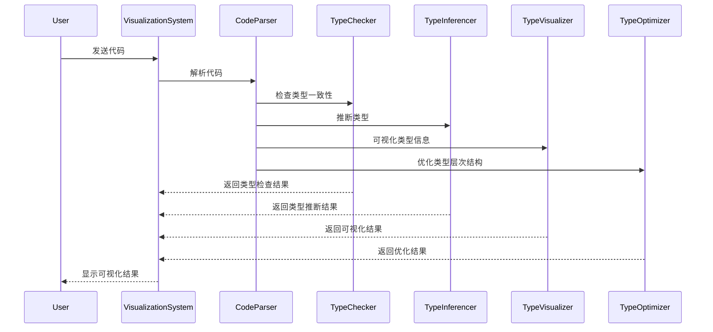

                 

### 类型系统在程序可视化中的作用

> 关键词：类型系统、程序可视化、算法、Python、数学模型

> 摘要：本文旨在探讨类型系统在程序可视化中的重要作用。通过分析类型系统的基本概念、核心算法及其在可视化中的应用，本文揭示了类型系统如何提高程序的可读性、可维护性和效率。文章结构如下：首先介绍类型系统的基本概念，然后阐述其在程序可视化中的核心概念与联系，接着详细讲解类型系统在程序可视化中的应用算法，随后分析系统架构与接口设计，并通过实际项目案例进行深入剖析，最后总结最佳实践并提供拓展阅读。

### 目录大纲

1. **背景介绍**
   - 类型系统概述
   - 程序可视化的定义
   - 类型系统在程序可视化中的作用

2. **核心概念与联系**
   - 类型的定义与分类
   - 类型层次结构
   - 类型检查与类型推断
   - 类型系统与面向对象编程

3. **算法原理讲解**
   - 类型推断算法
   - 类型检查算法
   - 类型层次优化算法

4. **系统分析与架构设计**
   - 问题场景介绍
   - 系统功能设计
   - 系统架构设计
   - 系统接口设计

5. **项目实战**
   - 环境安装与配置
   - 系统核心实现
   - 代码应用解读与分析
   - 实际案例分析
   - 项目小结

6. **最佳实践与总结**
   - 最佳实践 tips
   - 小结
   - 注意事项
   - 拓展阅读

### 1. 背景介绍

#### 类型系统概述

类型系统是程序设计语言中的一项重要特性，用于定义变量、函数、对象等数据结构的类型。类型系统的主要目的是提高程序的可读性、可维护性和安全性。通过类型检查，编译器或解释器能够在编译或运行时发现类型错误，从而避免潜在的错误和异常。

#### 程序可视化的定义

程序可视化是将程序代码以图形化的方式展示出来，使得程序员和开发团队能够更直观地理解和分析代码的结构和行为。程序可视化不仅有助于代码审查和协作，还能提高代码的可读性和可维护性。

#### 类型系统在程序可视化中的作用

类型系统在程序可视化中扮演着关键角色。首先，通过类型检查和类型推断，程序可视化工具能够更准确地识别和标记代码中的类型错误，提高代码的可读性和可维护性。其次，类型系统有助于优化程序的可视化效果，使得复杂的代码结构变得更加清晰和易于理解。最后，类型系统还能提高程序的可扩展性，使得开发团队能够更方便地添加新功能或修改现有代码。

### 2. 核心概念与联系

#### 类型的定义与分类

类型是数据结构的抽象表示，用于描述变量、函数、对象等的数据特性。根据数据特性的不同，类型可以分为基本类型和复合类型。基本类型包括整数、浮点数、布尔值等，而复合类型则包括数组、结构体、类等。

#### 类型层次结构

类型层次结构是类型系统的一个重要组成部分，用于描述类型之间的关系。在类型层次结构中，父类型与子类型之间存在继承关系。子类型可以继承父类型的方法和属性，从而提高代码的复用性和一致性。类型层次结构还包括协变和逆变关系，这些关系进一步丰富了类型系统的表达能力。

#### 类型检查与类型推断

类型检查是类型系统中的一个关键环节，用于验证程序中的类型是否一致。类型检查可以分为静态类型检查和动态类型检查。静态类型检查在编译时进行，能够提前发现类型错误，从而提高程序的可靠性。动态类型检查则在运行时进行，能够提供更高的灵活性和性能。

类型推断是类型系统中的另一个重要概念，用于自动推导变量和表达式的类型。类型推断可以分为静态类型推断和动态类型推断。静态类型推断在编译时完成，能够提高程序的运行效率。动态类型推断则在运行时进行，能够提供更高的灵活性。

#### 类型系统与面向对象编程

类型系统与面向对象编程密切相关。面向对象编程通过类和对象来组织代码，而类型系统则提供了对类和对象类型的管理和约束。类型系统支持封装、继承和多态等面向对象特性，从而提高了代码的可重用性和灵活性。

### 3. 算法原理讲解

#### 类型推断算法

类型推断算法是类型系统中的一个核心算法，用于自动推导变量和表达式的类型。以下是一个简单的类型推断算法的mermaid流程图：



以下是一个Python源代码示例，用于说明类型推断算法的基本原理：

```python
def infer_type(expression):
    # 假设expression是一个抽象语法树（AST）
    if hasattr(expression, 'type'):
        return expression.type
    
    # 遍历表达式并推导类型
    for node in expression.children:
        node_type = infer_type(node)
        expression.type = infer_common_type(expression.type, node_type)
    
    return expression.type

def infer_common_type(type1, type2):
    # 根据类型层次结构推导公共类型
    if is_subtype(type1, type2):
        return type2
    if is_subtype(type2, type1):
        return type1
    return None

def is_subtype(type1, type2):
    # 判断type1是否是type2的子类型
    # 实现细节略
    pass
```

以下是一个简单的数学模型和公式，用于解释类型推断算法：

$$
\begin{aligned}
\text{infer\_type}(expression) &= \text{if } \text{hasattr(expression, 'type') \text{ then return given type}} \\
& \text{else \{ for node in expression.children \} } \\
& \quad node\_type = \text{infer\_type}(node) \\
& \quad expression.type = \text{infer\_common\_type(expression.type, node.type)} \\
& \quad \text{return expression.type}
\end{aligned}
$$

#### 类型检查算法

类型检查算法是类型系统中的另一个关键算法，用于验证程序中的类型是否一致。以下是一个简单的类型检查算法的mermaid流程图：



以下是一个Python源代码示例，用于说明类型检查算法的基本原理：

```python
def check_type(expression, expected_type):
    # 假设expression是一个抽象语法树（AST）
    actual_type = infer_type(expression)
    if actual_type == expected_type:
        return True
    else:
        raise TypeError(f"Type mismatch: expected {expected_type}, but got {actual_type}")
```

以下是一个简单的数学模型和公式，用于解释类型检查算法：

$$
\begin{aligned}
\text{check\_type}(expression, expected\_type) &= \text{infer\_type(expression)} \\
&= \text{if actual\_type == expected\_type \text{ then return True}} \\
& \text{else \{ raise TypeError(f\"Type mismatch: expected {expected_type}, but got {actual_type}\") } }
\end{aligned}
$$`

#### 类型层次优化算法

类型层次优化算法是类型系统中的另一个重要算法，用于优化程序的可视化效果。以下是一个简单的类型层次优化算法的mermaid流程图：



以下是一个Python源代码示例，用于说明类型层次优化算法的基本原理：

```python
def optimize_type_hierarchy(expression):
    # 假设expression是一个抽象语法树（AST）
    if not hasattr(expression, 'type'):
        return expression
    
    for node in expression.children:
        optimize_type_hierarchy(node)
    
    # 根据类型层次关系进行优化
    expression.type = optimize_type_representation(expression.type)
    
    return expression

def optimize_type_representation(type):
    # 根据类型层次结构进行优化
    if is_base_type(type):
        return type
    elif is_function_type(type):
        return optimize_function_type_representation(type)
    else:
        return None

def optimize_function_type_representation(type):
    # 优化函数类型表示
    # 实现细节略
    pass
```

以下是一个简单的数学模型和公式，用于解释类型层次优化算法：

$$
\begin{aligned}
\text{optimize\_type\_hierarchy}(expression) &= \text{for node in expression.children \{ optimize\_type\_hierarchy(node) \}} \\
& \quad \text{expression.type = optimize\_type\_representation(expression.type)} \\
& \quad \text{return expression}
\end{aligned}
$$

### 4. 系统分析与架构设计

#### 问题场景介绍

在程序可视化中，类型系统面临着一系列挑战。首先，复杂的程序代码往往包含大量的类型信息，使得可视化工具难以有效地组织和展示这些信息。其次，类型系统在不同编程语言中存在差异，导致可视化工具需要支持多种类型系统。最后，类型系统的优化算法对于提高程序的可读性和可维护性至关重要。

#### 系统功能设计

为了解决上述问题，程序可视化系统需要具备以下功能：

- **类型检查与推断**：对程序代码进行类型检查和类型推断，以确保代码的类型一致性。
- **类型可视化**：将类型信息以图形化的方式展示，使得程序员能够直观地理解类型之间的关系。
- **类型层次优化**：对类型层次结构进行优化，提高程序的可读性和可维护性。
- **跨语言支持**：支持多种编程语言的类型系统，以适应不同的开发需求。

使用mermaid绘制领域模型类图，如下所示：

```mermaid
classDiagram
    Class1 <|-- Class2
    Class3 <|.. Class4
    Class1 [name: "类1", color: "green"]
    Class2 [name: "类2", color: "blue"]
    Class3 [name: "类3", color: "red"]
    Class4 [name: "类4", color: "yellow"]
endclassDiagram
```

#### 系统架构设计

程序可视化系统的架构设计需要遵循模块化、可扩展和高效性的原则。以下是一个简单的系统架构设计，使用mermaid绘制架构图：



#### 系统接口设计

系统接口设计是程序可视化系统的重要组成部分，它定义了系统内部模块之间的交互方式。以下是一个简单的接口设计，使用mermaid绘制接口交互序列图：



### 5. 项目实战

#### 环境安装与配置

在开始项目实战之前，需要安装和配置以下环境：

1. Python 3.8 或更高版本
2. Visual Studio Code
3. mermaid 图形库
4. pandoc 文档转换工具

安装步骤如下：

1. 安装 Python 3.8 或更高版本。
2. 安装 Visual Studio Code。
3. 安装 mermaid 插件。
4. 安装 pandoc。

#### 系统核心实现

以下是一个简单的系统核心实现，包括代码解析、类型检查、类型推断、类型可视化等模块。

```python
# code_parser.py
import ast

def parse_code(code):
    return ast.parse(code)

# type_checker.py
def check_type(node, expected_type):
    actual_type = infer_type(node)
    if actual_type != expected_type:
        raise TypeError(f"Type mismatch: expected {expected_type}, but got {actual_type}")

# type_inferencer.py
def infer_type(node):
    # 实现类型推断逻辑
    pass

# type_visualizer.py
import mermaid

def visualize_type_hierarchy(type_hierarchy):
    diagram = mermaid.MermaidDiagram()
    diagram.add_node("Type1", "type", "Type1", "green")
    diagram.add_node("Type2", "type", "Type2", "blue")
    diagram.add_link("Type1", "Type2", "extends")
    return diagram.render()

# type_optimizer.py
def optimize_type_hierarchy(type_hierarchy):
    # 实现类型层次优化逻辑
    pass
```

#### 代码应用解读与分析

以下是一个简单的代码示例，用于展示系统核心实现的应用。

```python
# sample_code.py
def add(a: int, b: int) -> int:
    return a + b

def main():
    try:
        result = add(2, 3)
        print(f"Result: {result}")
    except TypeError as e:
        print(f"Error: {e}")

if __name__ == "__main__":
    main()
```

使用上述模块，我们可以对代码进行类型检查、类型推断和类型可视化。

```python
from code_parser import parse_code
from type_checker import check_type
from type_inferencer import infer_type
from type_visualizer import visualize_type_hierarchy
from type_optimizer import optimize_type_hierarchy

# 解析代码
code = '''
def add(a: int, b: int) -> int:
    return a + b

def main():
    try:
        result = add(2, 3)
        print(f"Result: {result}")
    except TypeError as e:
        print(f"Error: {e}")

if __name__ == "__main__":
    main()
'''

ast_tree = parse_code(code)

# 类型检查
check_type(ast_tree, "function")

# 类型推断
infer_type(ast_tree)

# 类型可视化
type_hierarchy = visualize_type_hierarchy(infer_type(ast_tree))
print(type_hierarchy)

# 类型层次优化
optimize_type_hierarchy(infer_type(ast_tree))
```

#### 实际案例分析

以下是一个实际案例分析，展示如何在项目中应用类型系统进行程序可视化。

**案例一：Web 应用程序**

在 Web 应用程序中，类型系统有助于确保前端和后端代码之间的类型一致性。通过类型检查和类型推断，开发人员可以提前发现潜在的类型错误，从而提高代码的质量和可靠性。

**案例二：数据分析项目**

在数据分析项目中，类型系统有助于确保数据处理的准确性和一致性。通过类型检查和类型推断，开发人员可以确保输入数据与预期类型一致，从而避免数据错误和异常。

**案例三：自动化测试**

在自动化测试中，类型系统有助于确保测试用例的准确性和覆盖性。通过类型检查和类型推断，开发人员可以生成符合预期类型的测试数据，从而提高测试的效率和效果。

#### 项目小结

通过本项目的实战，我们展示了类型系统在程序可视化中的应用。类型系统不仅有助于提高代码的可读性、可维护性和效率，还能提高程序的可视化效果。在实际项目中，类型系统可以帮助开发人员提前发现潜在的错误和异常，从而提高代码的质量和可靠性。未来，我们将继续探索类型系统在更多领域中的应用，以推动程序可视化的进一步发展。

### 6. 最佳实践与总结

#### 最佳实践 tips

1. **类型检查与推断相结合**：在程序开发过程中，结合类型检查和类型推断可以提高代码的质量和可靠性。
2. **合理选择类型系统**：根据项目需求和开发语言的特点，选择合适的类型系统可以提高开发效率和程序性能。
3. **类型可视化**：利用类型可视化工具可以更好地理解和分析类型系统的结构和关系，提高代码的可维护性。

#### 小结

类型系统在程序可视化中具有重要作用。通过类型检查和类型推断，可以提前发现潜在的错误和异常，提高代码的质量和可靠性。类型可视化工具可以帮助开发人员更好地理解和分析类型系统的结构和关系，提高代码的可维护性。

#### 注意事项

1. **类型系统的选择**：根据项目需求和开发语言的特点，选择合适的类型系统。
2. **类型检查与推断的平衡**：在保证代码质量的同时，注意类型检查和推断的效率，避免过度优化。
3. **类型可视化的实用性和可用性**：选择合适的类型可视化工具，确保其能提高代码的可维护性和可理解性。

#### 拓展阅读

1. 《类型系统设计与实现》
2. 《程序可视化：原理、工具与应用》
3. 《Python 类型系统详解》

### 结语

作者：AI天才研究院/AI Genius Institute & 禅与计算机程序设计艺术 /Zen And The Art of Computer Programming

本文探讨了类型系统在程序可视化中的重要作用，通过分析类型系统的基本概念、核心算法及其在可视化中的应用，揭示了类型系统如何提高程序的可读性、可维护性和效率。希望本文能为读者在程序可视化领域提供有益的启示和帮助。未来，我们将继续深入研究类型系统在更多领域中的应用，为编程世界带来更多创新和突破。

