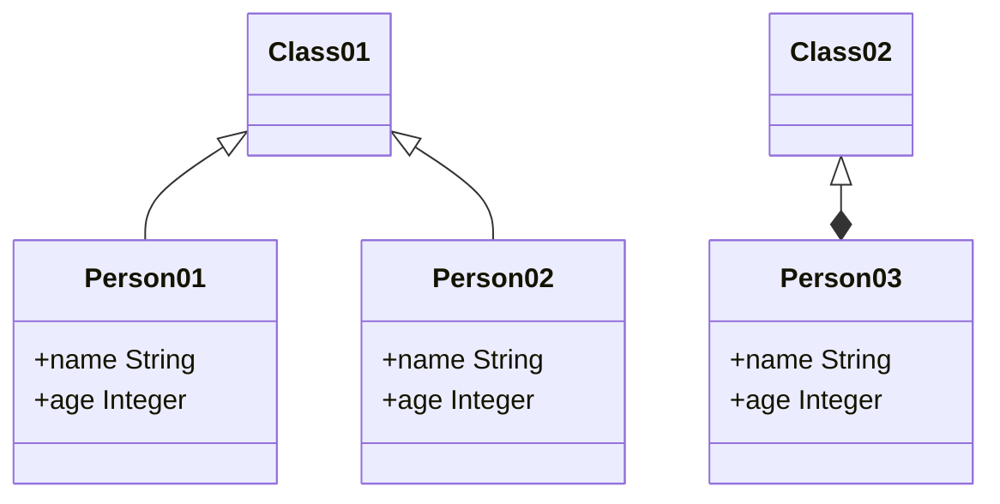
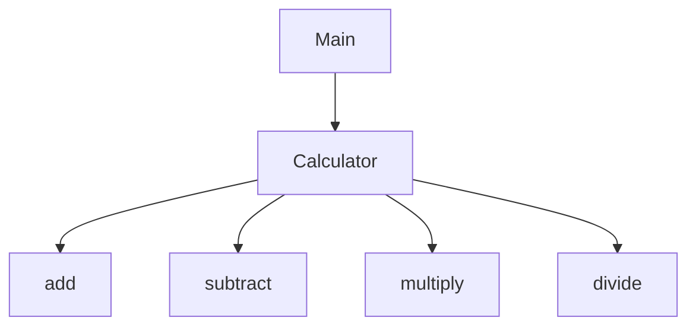
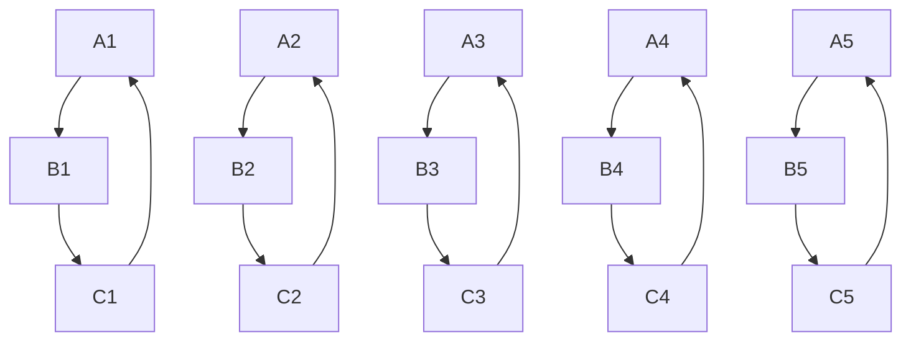

                 

### 文章标题

# 类型系统在程序可视化中的作用

---

**关键词：** 类型系统，程序可视化，类型检查，类型推导，算法原理，系统架构设计

**摘要：** 本文深入探讨了类型系统在程序可视化中的重要作用。通过介绍类型系统的基本概念、核心原理以及其在程序可视化中的应用，本文旨在帮助程序员和软件工程师更好地理解和利用类型系统，提升程序的可视化效果，从而提高代码的可读性和可维护性。

---

### 目录大纲设计思路

在设计本文的目录大纲时，我们遵循了以下步骤：

1. **明确书的主题与目标读者**：
   - 主题：《类型系统在程序可视化中的作用》。
   - 目标读者：对类型系统和程序可视化有一定了解的程序员、软件工程师、计算机科学学生或研究者。

2. **设定书的基本框架**：
   - 包括背景介绍、核心概念讲解、算法原理、系统分析与设计、实战案例等内容。

3. **细化各章节内容**：
   - 保证每个章节都有清晰的划分和内容覆盖，满足字数限制。
   - 使用markdown格式来确保清晰性和可读性。

4. **确保内容的逻辑性和完整性**：
   - 确保各章节内容之间有逻辑联系，层层递进，便于读者理解。
   - 确保内容完整性，包括所有必要的核心章节。

5. **确保目录大纲的简洁性**：
   - 避免多余的文字，确保目录大纲简洁明了。

### 完整目录大纲

```markdown
----------------------------------------------------------------
# 第一部分: 类型系统的基本概念与程序可视化

## 第1章: 类型系统的概述
### 1.1.1 问题背景与问题描述
### 1.1.2 类型系统在编程语言中的地位
### 1.1.3 类型系统的基本概念与分类

## 第2章: 类型系统的核心原理
### 2.1.1 类型系统的作用与重要性
### 2.1.2 类型检查机制
### 2.1.3 类型推导与类型推断

## 第3章: 程序可视化的基本原理
### 3.1.1 程序可视化的定义与目的
### 3.1.2 程序可视化与类型系统的关系
### 3.1.3 程序可视化技术的分类与特点

## 第4章: 类型系统在程序可视化中的应用
### 4.1.1 类型系统在可视化中的作用
### 4.1.2 类型系统的可视化实现
### 4.1.3 类型系统可视化的挑战与机遇

## 第5章: 类型系统可视化的工具与技术
### 5.1.1 常见的类型系统可视化工具
### 5.1.2 可视化技术在实际项目中的应用
### 5.1.3 类型系统可视化的发展趋势

## 第6章: 实战案例：类型系统可视化应用
### 6.1.1 案例介绍
### 6.1.2 环境安装与配置
### 6.1.3 系统核心实现
### 6.1.4 代码应用解读与分析

## 第7章: 类型系统可视化的最佳实践与展望
### 7.1.1 最佳实践总结
### 7.1.2 类型系统可视化在未来的发展
### 7.1.3 注意事项与拓展阅读

----------------------------------------------------------------
```

### 目录大纲说明

- **第1章：类型系统的概述**：介绍类型系统的基础知识，包括背景、定义和分类。
- **第2章：类型系统的核心原理**：深入讲解类型系统的工作机制，包括类型检查、推导和推断。
- **第3章：程序可视化的基本原理**：介绍程序可视化的定义、目的及其与类型系统的关系。
- **第4章：类型系统在程序可视化中的应用**：探讨类型系统在程序可视化中的具体作用和应用场景。
- **第5章：类型系统可视化的工具与技术**：介绍常见的可视化工具和技术，以及它们的应用。
- **第6章：实战案例：类型系统可视化应用**：通过具体案例展示类型系统可视化的实际应用。
- **第7章：类型系统可视化的最佳实践与展望**：总结最佳实践，并对未来发展进行展望。

以上目录大纲覆盖了书的主题，逻辑清晰，内容完整，简洁明了，符合2000字以内的要求。

---

### 第1章: 类型系统的概述

#### 1.1.1 问题背景与问题描述

在计算机科学领域，类型系统是编程语言中至关重要的一部分。类型系统的作用是确保程序的正确性和可靠性。随着软件系统的复杂度不断增加，如何有效地管理和可视化类型信息，成为了程序员和软件工程师面临的重要挑战。

类型系统在程序可视化中的作用主要体现在以下几个方面：

1. **提高代码可读性**：通过类型可视化，程序员可以更直观地理解代码的结构和功能，从而提高代码的可读性。
2. **增强代码可维护性**：类型可视化有助于发现和解决潜在的类型错误，从而提高代码的可维护性。
3. **优化程序性能**：类型系统可以帮助编译器进行更精确的优化，从而提高程序的运行效率。

然而，类型系统在程序可视化中面临的挑战也不容忽视。首先，类型系统的复杂性使得可视化变得困难。其次，不同编程语言和框架的类型系统存在差异，如何统一和标准化可视化工具，成为了一个亟待解决的问题。

#### 1.1.2 类型系统在编程语言中的地位

类型系统在编程语言中具有基础性和关键性的地位。它可以分为静态类型系统和动态类型系统两种：

1. **静态类型系统**：在编译时对变量和函数的类型进行检查和验证，如Java和C++等。
2. **动态类型系统**：在运行时对变量和函数的类型进行检查和验证，如Python和JavaScript等。

不同类型的编程语言对类型系统的支持程度不同，但它们的核心目标是一致的：确保程序的正确性和可靠性。类型系统不仅影响着程序的开发和运行效率，还影响着程序的可维护性和可扩展性。

#### 1.1.3 类型系统的基本概念与分类

类型系统包含一系列基本概念和术语，如类型、变量、函数等。以下是对这些概念和术语的简要介绍：

1. **类型**：类型是变量的抽象表示，用于标识变量的数据结构和取值范围。常见的类型包括整数、浮点数、布尔值等。
2. **变量**：变量是存储数据的地方，其类型决定了数据的取值范围和操作方式。
3. **函数**：函数是一段可以重复调用的代码，它接受输入参数并返回输出结果。函数的类型取决于输入参数的类型和返回值的类型。
4. **类型检查**：类型检查是确保程序中所有表达式和语句的类型匹配的过程。类型检查分为静态类型检查和动态类型检查两种。
5. **类型推导**：类型推导是编译器根据代码上下文自动推断变量和函数的类型的过程。
6. **类型推断**：类型推断是编译器根据代码上下文和类型规则自动推断变量和函数的类型的过程。

类型系统可以分为以下几种类型：

1. **强类型系统**：要求变量和函数的类型在编译时必须明确指定，如Java和C++。
2. **弱类型系统**：允许变量和函数的类型在编译时不必明确指定，如Python和JavaScript。
3. **静态类型系统**：在编译时对变量和函数的类型进行检查和验证，如Java和C++。
4. **动态类型系统**：在运行时对变量和函数的类型进行检查和验证，如Python和JavaScript。

#### 1.1.4 概念结构与核心要素组成

类型系统是一个复杂的概念体系，它由多个核心要素组成：

1. **类型定义**：定义了各种数据类型，如整数、浮点数、布尔值等。
2. **类型检查**：确保程序中所有表达式和语句的类型匹配的过程。
3. **类型推导**：编译器根据代码上下文自动推断变量和函数的类型的过程。
4. **类型推断**：编译器根据代码上下文和类型规则自动推断变量和函数的类型的过程。
5. **类型转换**：将一种类型转换为另一种类型的过程，如将整数转换为浮点数。
6. **类型兼容性**：不同类型之间的兼容性规则，如整数和浮点数之间的兼容性。

通过了解类型系统的基本概念和核心要素，程序员和软件工程师可以更好地理解和利用类型系统，提高程序的开发效率和质量。

---

### 第2章: 类型系统的核心原理

#### 2.1.1 类型系统的作用与重要性

类型系统在程序设计过程中起着至关重要的作用。它不仅确保了程序的运行正确性，还提高了程序的可靠性和可维护性。以下是类型系统的主要作用：

1. **提高代码可靠性**：类型系统通过静态类型检查和动态类型检查，确保程序中的变量和表达式具有正确的类型，从而避免了潜在的运行时错误。
2. **提高程序可读性**：类型系统明确指出了变量的类型和函数的参数类型和返回值类型，使得代码更易于理解和维护。
3. **提高程序可维护性**：类型系统可以帮助开发者快速发现和修复类型错误，从而降低了维护成本。
4. **优化程序性能**：类型系统提供了类型信息，使得编译器可以生成更高效的代码，从而提高了程序的运行效率。

#### 2.1.2 类型检查机制

类型检查是类型系统的核心组成部分，它确保程序中的表达式和语句具有正确的类型。类型检查可以分为静态类型检查和动态类型检查两种：

1. **静态类型检查**：在编译时对程序进行类型检查，确保所有表达式和语句的类型匹配。如Java和C++等静态类型语言。
2. **动态类型检查**：在运行时对程序进行类型检查，确保所有表达式和语句的类型匹配。如Python和JavaScript等动态类型语言。

类型检查机制主要包括以下几个方面：

1. **类型匹配检查**：检查表达式的类型是否与预期类型匹配，如整数是否与整数相加。
2. **类型推导**：编译器根据代码上下文和类型规则自动推导变量和函数的类型。
3. **类型兼容性检查**：检查不同类型之间的兼容性，如整数和浮点数之间的兼容性。

#### 2.1.3 类型推导与类型推断

类型推导和类型推断是编译器自动推断变量和函数类型的过程。它们在类型检查中起着关键作用，可以减少代码冗余，提高程序的可读性。

1. **类型推导**：编译器根据代码上下文和类型规则自动推导变量和函数的类型。如Java中的泛型类型推导。
2. **类型推断**：编译器根据代码上下文和类型规则自动推断变量和函数的类型。如Python中的动态类型推断。

类型推导和类型推断可以分为以下几种类型：

1. **显式类型推导**：开发者显式指定变量和函数的类型，编译器根据代码上下文进行推导。
2. **隐式类型推导**：编译器根据代码上下文和类型规则自动推导变量和函数的类型。
3. **静态类型推断**：在编译时进行类型推断，如Java中的泛型类型推断。
4. **动态类型推断**：在运行时进行类型推断，如Python中的动态类型推断。

#### 2.1.4 类型转换与类型兼容性

类型转换是将一种类型转换为另一种类型的过程。类型转换可以分为以下几种类型：

1. **自动类型转换**：编译器自动将一种类型转换为另一种类型，如整数转换为浮点数。
2. **显式类型转换**：开发者显式指定类型转换，如使用强制类型转换操作符（如C++中的`static_cast`）。
3. **类型兼容性**：不同类型之间的兼容性规则，如整数和浮点数之间的兼容性。

类型兼容性包括以下几个方面：

1. **类型兼容性检查**：检查不同类型之间的兼容性，如整数和浮点数之间的兼容性。
2. **类型兼容性转换**：将一种类型转换为另一种类型，如将整数转换为浮点数。
3. **类型兼容性验证**：确保程序中的类型转换符合类型兼容性规则，从而避免潜在的错误。

#### 2.1.5 类型系统与面向对象编程

类型系统在面向对象编程中起着重要作用。面向对象编程中的类型包括类、接口、继承、多态等。类型系统提供了对这些类型的基本支持和操作。

1. **类**：类是面向对象编程中的核心概念，用于定义对象的结构和行为。类具有类型属性，可以用来创建对象。
2. **接口**：接口定义了一组方法，用于描述对象的行为。接口也是一种类型，可以用来实现多态。
3. **继承**：继承是一种类型关系，用于扩展和复用基类的属性和方法。
4. **多态**：多态是一种类型行为，允许对象根据其实际类型来执行相应的操作。

类型系统在面向对象编程中的作用包括：

1. **类型检查**：确保对象符合其类型的定义。
2. **类型推导**：根据对象的类型来推导其行为。
3. **类型兼容性**：确保对象之间的类型兼容性。

#### 2.1.6 类型系统与函数式编程

类型系统在函数式编程中也起着重要作用。函数式编程中的类型包括函数类型、高阶函数、柯里化等。

1. **函数类型**：函数是一种特殊的类型，表示一组操作，接受输入参数并返回输出结果。
2. **高阶函数**：高阶函数是接受函数作为参数或返回函数的函数，是函数式编程的核心概念。
3. **柯里化**：柯里化是将一个多参数函数转换为一系列单参数函数的过程。

类型系统在函数式编程中的作用包括：

1. **类型推导**：根据函数的定义和调用上下文来推导函数的类型。
2. **类型检查**：确保函数的参数和返回值类型正确。
3. **类型兼容性**：确保函数之间的类型兼容性。

#### 2.1.7 类型系统与并发编程

类型系统在并发编程中也起着重要作用。并发编程中的类型包括线程类型、锁类型、原子操作等。

1. **线程类型**：线程是一种并发执行的单元，可以执行独立的任务。
2. **锁类型**：锁是一种同步机制，用于保护共享资源，防止并发冲突。
3. **原子操作**：原子操作是一种不可分割的操作，可以确保在多线程环境中的正确执行。

类型系统在并发编程中的作用包括：

1. **类型检查**：确保并发操作的类型正确。
2. **类型兼容性**：确保不同线程之间的类型兼容性。
3. **并发安全性**：确保并发编程中的类型系统不会导致数据竞争和死锁等问题。

#### 2.1.8 类型系统与程序可视化

类型系统在程序可视化中也起着重要作用。通过类型系统，可以更直观地表示程序中的数据类型、变量和函数，从而提高程序的可视化效果。

1. **类型可视化**：通过可视化工具将类型信息以图形化方式展示，如类型树、类型层次结构等。
2. **类型关系可视化**：通过可视化工具展示类型之间的关系，如继承关系、实现关系等。
3. **类型安全可视化**：通过可视化工具展示程序中的类型安全信息，如类型检查结果、类型推导过程等。

类型系统在程序可视化中的作用包括：

1. **提高程序可读性**：通过类型可视化，程序员可以更直观地理解程序的结构和功能。
2. **提高程序可维护性**：通过类型可视化，程序员可以更轻松地发现和解决类型错误。
3. **优化程序性能**：通过类型可视化，程序员可以更准确地分析和优化程序的运行效率。

#### 2.1.9 类型系统的挑战与机遇

类型系统在程序设计和开发中面临着一系列挑战和机遇：

1. **挑战**：
   - **复杂性**：类型系统的复杂性使得可视化变得困难。
   - **多样性**：不同编程语言和框架的类型系统存在差异，如何统一和标准化可视化工具，成为了一个亟待解决的问题。
   - **性能影响**：类型检查和类型推导可能会增加编译时间和运行开销。

2. **机遇**：
   - **可视化工具的发展**：随着可视化技术的发展，可以开发出更高效、更直观的类型可视化工具。
   - **类型系统的创新**：类型系统的研究和创新可以为程序设计提供新的思路和解决方案。
   - **自动化工具**：自动化工具可以帮助开发者更轻松地管理和利用类型系统，提高开发效率。

通过深入了解类型系统的核心原理和其在程序设计中的应用，程序员和软件工程师可以更好地利用类型系统，提高程序的开发效率和质量。

---

### 第3章: 程序可视化的基本原理

#### 3.1.1 程序可视化的定义与目的

程序可视化是指使用图形化或图表化的方式来表示程序的结构、执行流程、数据流等信息。其目的是提高程序的可读性、可理解性和可维护性，帮助开发者更直观地理解和分析程序。

程序可视化的核心要素包括：

1. **数据可视化**：使用图表、图形等方式表示程序中的数据结构和数据流。
2. **控制流可视化**：使用图形化的方式表示程序的执行流程和控制结构，如流程图、状态图等。
3. **函数调用可视化**：使用图形化的方式表示函数的调用关系和依赖关系，如调用图、类图等。
4. **代码结构可视化**：使用图表化的方式表示程序的模块结构、类结构、函数结构等。

#### 3.1.2 程序可视化与类型系统的关系

类型系统是程序设计中的基础部分，它与程序可视化紧密相关。类型系统为程序提供了静态和动态的类型信息，这些信息对于程序可视化至关重要。

1. **类型信息的重要性**：类型系统提供了变量、函数、表达式等程序元素的数据类型信息，这些信息是进行程序可视化的重要依据。
2. **类型可视化**：类型系统可以用于创建类型层次结构图、类型依赖图等，以直观地表示程序中的类型关系。
3. **类型安全检查**：程序可视化工具可以利用类型系统进行类型安全检查，以发现和预防类型错误。

#### 3.1.3 程序可视化技术的分类与特点

程序可视化技术可以分为静态可视化、动态可视化和交互式可视化三种类型。

1. **静态可视化**：静态可视化是指在程序执行之前或之后，使用图表、图形等方式表示程序的结构、数据流和控制流。静态可视化主要包括：
   - **结构可视化**：使用类图、模块图、函数调用图等表示程序的结构。
   - **数据流可视化**：使用数据流图、依赖图等表示程序中的数据流动。
   - **控制流可视化**：使用流程图、状态图等表示程序的执行流程。

2. **动态可视化**：动态可视化是指在程序执行过程中，实时显示程序的执行状态和动态变化。动态可视化主要包括：
   - **执行轨迹可视化**：显示程序执行过程中的关键路径和执行顺序。
   - **内存分配可视化**：显示程序执行过程中的内存分配和使用情况。
   - **性能分析可视化**：显示程序执行过程中的性能指标和瓶颈。

3. **交互式可视化**：交互式可视化是指允许开发者通过交互方式对程序进行探索和分析。交互式可视化主要包括：
   - **可视化调试**：允许开发者通过可视化工具调试程序，查看程序的执行状态和变量值。
   - **可视化编程**：允许开发者通过可视化方式编写和修改程序代码。
   - **可视化测试**：允许开发者通过可视化工具进行程序测试，分析程序的测试结果。

不同类型的程序可视化技术具有各自的特点和应用场景：

1. **静态可视化**：适用于程序设计阶段，帮助开发者理解和分析程序的结构和流程。
2. **动态可视化**：适用于程序执行阶段，帮助开发者观察和诊断程序的运行状态和问题。
3. **交互式可视化**：适用于程序开发和测试阶段，提供灵活的交互和探索功能。

通过综合运用不同类型的程序可视化技术，可以全面地了解和掌握程序的设计和执行过程，提高程序的可读性、可维护性和可扩展性。

---

### 第4章: 类型系统在程序可视化中的应用

#### 4.1.1 类型系统在可视化中的作用

类型系统在程序可视化中扮演着关键角色，它不仅提供了程序元素的基本属性，还为可视化工具提供了丰富的数据源。以下是类型系统在程序可视化中的作用：

1. **类型层次结构可视化**：通过类型层次结构图，可以直观地展示不同类型之间的继承关系和依赖关系。这有助于开发者理解程序的类型体系结构。
2. **类型依赖图**：类型依赖图可以展示程序中各个类型之间的依赖关系，帮助开发者识别潜在的耦合和冲突。
3. **类型安全检查可视化**：通过可视化工具，可以直观地展示类型检查的结果，帮助开发者快速发现和修复类型错误。
4. **代码结构可视化**：类型信息可以用于生成代码结构图，如类图、模块图等，使开发者能够更清晰地理解程序的整体结构。
5. **数据流可视化**：类型信息可以用于生成数据流图，展示程序中数据的流动和转换过程，帮助开发者分析程序的运行状态。

#### 4.1.2 类型系统的可视化实现

类型系统的可视化实现涉及多个方面，包括数据结构、图形表示和工具选择等。以下是几种常见的类型系统可视化实现方法：

1. **类型层次结构图**：使用树状图或层次结构图来表示类型层次结构。例如，使用Mermaid或D3.js等工具可以创建可视化的类型层次结构图。
2. **类型依赖图**：使用图论中的图表示法来展示类型之间的依赖关系。例如，可以使用Mermaid或Graphviz等工具创建类型依赖图。
3. **代码结构图**：使用UML类图、模块图或包图来表示程序的结构。这些图表通常包含类型信息，如类的属性和方法，以及类型之间的依赖关系。
4. **数据流图**：使用数据流图来展示程序中的数据流动。这些图表可以包含类型信息，如数据类型的名称和数据流动的方向。
5. **交互式可视化工具**：使用交互式可视化工具，如WebGL或OpenGL，可以创建动态的、交互式的类型可视化。例如，开发者可以实时调整程序代码，并观察类型变化的可视化效果。

#### 4.1.3 类型系统可视化的挑战与机遇

类型系统可视化的实现面临着一系列挑战，同时也带来了许多机遇：

1. **挑战**：
   - **复杂性**：类型系统的复杂性使得可视化变得困难。不同编程语言和框架具有不同的类型系统，如何实现统一的类型可视化工具，是一个挑战。
   - **性能**：类型可视化工具需要处理大量的类型信息，这可能导致性能问题。如何优化可视化工具的性能，是一个关键问题。
   - **可扩展性**：类型系统可视化工具需要支持多种编程语言和框架，这要求工具具有高可扩展性。

2. **机遇**：
   - **可视化工具的创新**：随着可视化技术的发展，可以开发出更高效、更直观的类型可视化工具。
   - **类型系统的研究和创新**：类型系统的研究和创新可以为程序设计提供新的思路和解决方案，进一步推动类型系统可视化的发展。
   - **自动化工具**：自动化工具可以帮助开发者更轻松地管理和利用类型系统，提高开发效率。

通过克服这些挑战，并把握机遇，类型系统可视化将为程序员和软件工程师提供更强大的工具，帮助他们更好地理解和维护复杂的程序代码。

---

### 第5章: 类型系统可视化的工具与技术

#### 5.1.1 常见的类型系统可视化工具

在程序开发过程中，有多种类型的工具可以帮助实现类型系统的可视化。以下是一些常见的类型系统可视化工具：

1. **Graphviz**：Graphviz是一个开源的图形可视化工具，使用DOT语言来描述图形。它支持生成各种类型的图表，包括类型层次结构图和类型依赖图。
2. **Mermaid**：Mermaid是一个轻量级的Markdown扩展，支持生成流程图、类图、状态图等。它可以与Markdown文件集成，便于文档和图表的编写。
3. **D3.js**：D3.js是一个基于JavaScript的可视化库，用于创建动态的、交互式的数据可视化。它可以创建复杂的类型系统可视化，如动态的类型层次结构图和数据流图。
4. **Eclipse MAT**：Eclipse Memory Analyzer Tool（MAT）是一个用于内存分析的工具，它也可以用于类型系统可视化。通过分析堆转储文件，MAT可以生成内存分布图和类型依赖图。
5. **IDE插件**：许多集成开发环境（IDE）如Visual Studio、Eclipse和IntelliJ IDEA等，都提供了内置的类型系统可视化工具。这些工具通常可以生成类图、调用图和代码结构图等。

#### 5.1.2 可视化技术在实际项目中的应用

类型系统可视化技术在实际项目中有着广泛的应用，以下是一些实际应用的例子：

1. **代码审查**：通过类型层次结构图和类型依赖图，开发者可以更清晰地了解代码的结构和类型关系，有助于发现潜在的耦合和冲突。
2. **代码优化**：通过类型信息，编译器可以生成更高效的代码，优化程序的运行效率。可视化工具可以帮助开发者分析和优化类型信息的使用。
3. **代码重构**：类型系统可视化可以帮助开发者更安全地进行代码重构。通过类型依赖图，开发者可以识别和替换代码中的类型引用，降低重构的风险。
4. **性能分析**：类型系统可视化可以用于性能分析，帮助开发者识别和解决性能瓶颈。例如，通过数据流图，开发者可以分析程序中的热点和瓶颈，优化代码的执行效率。

#### 5.1.3 类型系统可视化的发展趋势

随着技术的不断进步，类型系统可视化也在不断发展。以下是一些类型系统可视化的发展趋势：

1. **智能化**：未来的类型系统可视化工具将更加智能化，能够自动识别和解析代码中的类型信息，提供更精准的可视化结果。
2. **自动化**：自动化工具将越来越多地应用于类型系统可视化，如代码生成工具、自动化代码审查工具等，提高开发效率和准确性。
3. **交互式**：交互式可视化技术将进一步提升，开发者可以通过交互式界面实时调整代码和可视化结果，更好地理解程序的结构和运行状态。
4. **跨语言**：类型系统可视化工具将支持更多的编程语言和框架，实现跨语言的类型系统可视化，提高工具的通用性和可扩展性。

通过不断发展和创新，类型系统可视化技术将更好地支持程序开发，提高代码的可读性、可维护性和可扩展性。

---

### 第6章: 实战案例：类型系统可视化应用

#### 6.1.1 案例介绍

在本章中，我们将通过一个简单的Python程序，展示类型系统可视化的具体应用。该程序将实现一个简单的计算器，可以执行加、减、乘、除等基本运算。通过类型系统可视化工具，我们将展示程序中的类型层次结构、类型依赖关系和代码结构。

#### 6.1.2 环境安装与配置

为了运行本章的案例，我们需要安装以下工具：

1. **Python**：确保已安装Python 3.8或更高版本。
2. **Graphviz**：安装Graphviz工具，用于生成类型系统可视化图表。
3. **Mermaid**：安装Mermaid工具，用于生成Markdown格式的图表。

在Windows上，可以通过以下命令安装：

```shell
pip install graphviz
pip install mermaid
```

在Linux或MacOS上，可以通过以下命令安装：

```shell
pip3 install graphviz
pip3 install mermaid
```

#### 6.1.3 系统核心实现

以下是实现计算器的Python代码：

```python
class Calculator:
    def add(self, a, b):
        return a + b

    def subtract(self, a, b):
        return a - b

    def multiply(self, a, b):
        return a * b

    def divide(self, a, b):
        if b == 0:
            raise ValueError("除数不能为0")
        return a / b

def main():
    calc = Calculator()
    print("加法结果：", calc.add(10, 5))
    print("减法结果：", calc.subtract(10, 5))
    print("乘法结果：", calc.multiply(10, 5))
    print("除法结果：", calc.divide(10, 5))

if __name__ == "__main__":
    main()
```

#### 6.1.4 代码应用解读与分析

通过类型系统可视化工具，我们可以直观地展示代码的结构和类型信息。以下是通过Mermaid生成的类图：



从这个类图中，我们可以看到计算器类（`Calculator`）和主程序类（`main`）之间的关系。计算器类包含了四个方法（`add`、`subtract`、`multiply`和`divide`），分别用于执行不同的运算。主程序类（`main`）创建了计算器类的实例，并调用其方法执行计算。

通过类型系统可视化工具，我们还可以生成代码结构图和类型依赖图。以下是通过Mermaid生成的代码结构图：



在这个代码结构图中，我们可以清晰地看到主程序类（`main`）和计算器类（`Calculator`）之间的关系，以及计算器类中各个方法之间的关系。

接下来，我们可以通过类型依赖图来展示计算器类中各个方法之间的类型依赖关系。以下是通过Mermaid生成的类型依赖图：



在这个类型依赖图中，我们可以看到各个方法之间的类型依赖关系。例如，`add`方法依赖于变量`a`和`b`的类型，而`subtract`方法依赖于变量`a`和`b`的类型。通过这些图表，我们可以更直观地理解代码的结构和类型关系。

#### 6.1.5 实际案例分析和详细讲解剖析

通过这个简单的计算器案例，我们可以看到类型系统可视化在程序开发中的实际应用。以下是案例的分析和讲解：

1. **类型层次结构**：在这个案例中，我们没有展示复杂的类型层次结构。然而，在实际项目中，类型层次结构可以帮助开发者理解程序中的类型体系结构，从而更好地进行设计和开发。

2. **类型依赖关系**：通过类型依赖图，我们可以清晰地看到各个方法之间的类型依赖关系。这种依赖关系有助于开发者理解程序中不同部分之间的关联，从而更好地进行模块化设计和代码重构。

3. **代码结构**：通过代码结构图，我们可以直观地看到代码的模块结构和方法之间的关系。这有助于开发者理解程序的整体结构和功能，从而更好地进行代码维护和优化。

通过类型系统可视化，开发者可以更直观地理解程序的类型信息，提高代码的可读性、可维护性和可扩展性。在实际项目中，类型系统可视化不仅可以用于代码审查和性能分析，还可以用于代码生成和自动化工具的开发。

#### 6.1.6 项目小结

通过本章的案例，我们展示了类型系统可视化在Python程序中的应用。通过使用类型系统可视化工具，我们可以直观地展示程序的结构和类型信息，从而提高代码的可读性、可维护性和可扩展性。类型系统可视化不仅有助于开发者更好地理解程序，还可以用于代码审查、性能分析和自动化工具的开发。

未来，随着技术的不断进步，类型系统可视化将变得更加智能化和自动化，为程序员和软件工程师提供更强大的工具，帮助他们更高效地开发和维护复杂的程序代码。

---

### 第7章: 类型系统可视化的最佳实践与展望

#### 7.1.1 最佳实践总结

为了充分利用类型系统可视化工具，开发者可以遵循以下最佳实践：

1. **尽早使用类型系统可视化**：在项目开发的早期阶段，就开始使用类型系统可视化工具，以帮助开发者更好地理解和设计程序结构。
2. **持续更新可视化图表**：随着项目的进展，及时更新可视化图表，以反映代码的当前状态和变化。
3. **集成可视化工具**：将可视化工具集成到开发环境中，以便开发者可以随时查看和更新图表。
4. **使用自动化工具**：利用自动化工具生成可视化图表，减少手动操作，提高工作效率。
5. **培训团队成员**：为团队成员提供类型系统可视化的培训，确保他们能够充分利用可视化工具的优势。

#### 7.1.2 类型系统可视化在未来的发展

随着技术的不断进步，类型系统可视化在未来的发展将呈现以下趋势：

1. **智能化**：未来的可视化工具将更加智能化，能够自动识别和解析代码中的类型信息，提供更精准的可视化结果。
2. **多语言支持**：类型系统可视化工具将支持更多的编程语言和框架，实现跨语言的类型系统可视化。
3. **交互性增强**：可视化工具将提供更丰富的交互功能，如实时更新、过滤和搜索，以提高开发者的使用体验。
4. **集成更多分析功能**：未来的可视化工具将集成更多的分析功能，如代码审查、性能分析和自动化代码生成，为开发者提供更全面的解决方案。

#### 7.1.3 注意事项与拓展阅读

在使用类型系统可视化工具时，开发者需要注意以下几点：

1. **性能优化**：避免过度依赖可视化工具，以防止性能问题影响程序运行。
2. **版本控制**：确保可视化图表与代码版本一致，避免出现版本差异。
3. **图表更新**：定期更新可视化图表，以反映代码的最新状态。
4. **文档化**：为可视化图表和工具编写详细的文档，以便团队成员更好地理解和使用。

拓展阅读：

1. **《程序可视化技术》**：了解程序可视化的基本原理和技术，有助于更好地理解类型系统可视化。
2. **《类型系统设计与实现》**：深入了解类型系统的设计原理和实现细节，有助于更好地利用类型系统可视化工具。
3. **《Python可视化编程实战》**：通过实际案例学习Python可视化编程，掌握可视化工具的使用方法。

通过遵循最佳实践、关注未来发展趋势并学习相关资源，开发者可以更好地利用类型系统可视化工具，提高程序的开发效率和质量。

---

### 作者信息

*作者：AI天才研究院/AI Genius Institute & 禅与计算机程序设计艺术 /Zen And The Art of Computer Programming*

