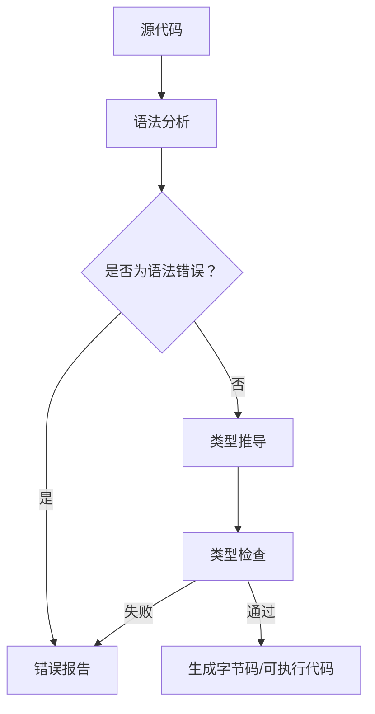
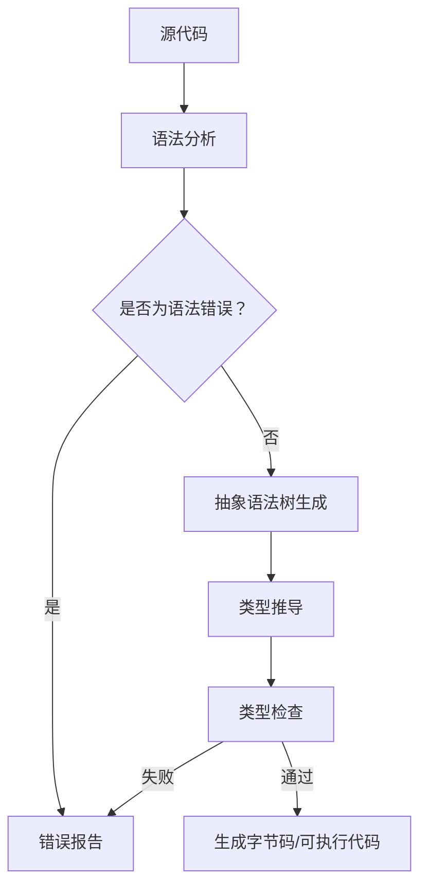
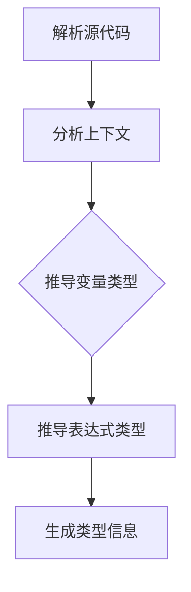
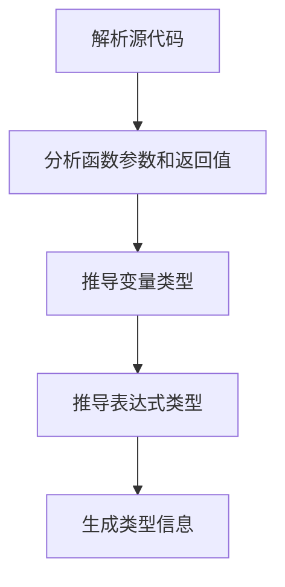
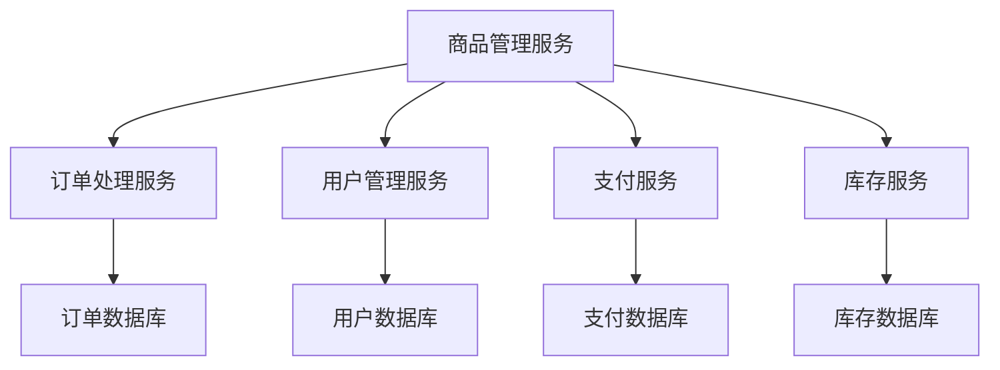

                 

### 文章标题

在当今快速发展的软件工程领域中，软件组件设计成为了一个关键议题。随着软件系统的复杂性和规模不断增加，如何确保组件之间的兼容性和互操作性成为了一个重要挑战。类型系统，作为一种强有力的工具，在软件组件设计中扮演了至关重要的角色。本文旨在深入探讨类型系统在软件组件设计中的应用，通过逻辑清晰、结构紧凑的叙述方式，引导读者了解类型系统的核心概念、原理以及其实际应用。

本文将分为五个主要部分进行阐述。第一部分是背景介绍，介绍软件组件设计的现状与挑战，类型系统的基本概念及其在软件组件设计中的作用。第二部分将详细解释类型系统的原理，通过实例展示其应用场景。第三部分将探讨类型系统的实现技术，包括静态类型系统、动态类型系统和泛型编程。第四部分将通过一个实际项目来展示类型系统在软件组件设计中的具体应用和实现。最后一部分将总结最佳实践，并给出对类型系统未来发展的展望。

关键词：软件组件设计、类型系统、静态类型系统、动态类型系统、泛型编程、类型安全

摘要：本文深入探讨了类型系统在软件组件设计中的应用，从基本概念到实际应用，从原理讲解到项目实战，全面分析了类型系统在提高软件组件兼容性和互操作性方面的作用。通过本文的阐述，读者将能够更好地理解类型系统在软件组件设计中的重要性，并掌握其应用方法和实现技巧。

----------------------------------------------------------------

## 第一部分: 背景介绍

### 1.1 问题背景

在软件工程领域，软件组件设计是一项关键任务。随着软件系统的复杂性和规模的不断增长，传统的整体式软件开发方法已经难以满足需求。组件化设计逐渐成为主流，其优势在于可重用性、可维护性和可扩展性。然而，组件之间的兼容性和互操作性成为了新的挑战。类型系统作为一种强有力的工具，在解决这些挑战中发挥了重要作用。

#### 1.1.1 软件组件设计的现状与挑战

目前，软件组件设计主要面临以下几个问题：

1. **组件之间的兼容性**：不同组件可能使用不同的编程语言、框架或库，导致兼容性问题。
2. **接口设计**：组件之间的接口设计需要精确和清晰，否则可能导致误解和错误。
3. **类型不匹配**：组件之间的数据类型不匹配会导致运行时错误，降低系统的稳定性。

#### 1.1.2 类型系统的作用和重要性

类型系统为解决这些问题提供了有效的方法。它通过定义变量、函数、类等实体的数据类型，确保组件之间的数据传递是准确和一致的。类型系统的主要作用包括：

1. **提高代码可读性**：通过明确的类型标注，代码更加易于理解和维护。
2. **增强类型检查**：在编译时或运行时检查类型错误，提前发现潜在问题，提高代码质量。
3. **提高组件的互操作性**：确保组件之间通过类型系统进行交互，降低兼容性问题。

#### 1.1.3 类型系统的应用场景

类型系统在软件组件设计中的应用场景非常广泛，包括但不限于以下方面：

1. **面向对象编程**：通过类和接口定义，确保对象之间的交互是基于明确的类型。
2. **函数式编程**：通过类型系统确保函数的高阶性和纯函数的特性。
3. **编译器设计**：在编译过程中，类型系统用于检查源代码中的类型错误。

### 1.2 类型系统的基本概念

类型系统是编程语言中的一种基本机制，用于定义和区分不同数据类型的集合及其操作。了解类型系统的基本概念对于深入理解其在软件组件设计中的应用至关重要。

#### 1.2.1 类型系统的定义与分类

类型系统可以定义为一种对变量、函数、类等实体的数据类型进行分类和约束的机制。根据类型检查的不同阶段，类型系统可以分为以下几类：

1. **静态类型系统**：在编译时进行类型检查，确保代码的类型安全性。
2. **动态类型系统**：在运行时进行类型检查，提供更大的灵活性但可能增加运行时错误。
3. **强类型系统**：对类型进行严格约束，减少类型错误。
4. **弱类型系统**：对类型约束较宽松，可能增加类型错误。

#### 1.2.2 类型系统的核心要素与特性

类型系统的核心要素包括：

1. **类型定义**：定义变量、函数、类等实体的数据类型。
2. **类型检查**：检查代码中的类型错误，确保类型安全。
3. **类型转换**：在需要时进行类型之间的转换，确保兼容性。

类型系统的主要特性包括：

1. **明确性**：通过明确的类型标注，提高代码的可读性。
2. **安全性**：通过类型检查，提前发现和预防类型错误。
3. **灵活性**：通过类型转换，实现不同类型之间的互操作性。

### 1.3 类型系统与软件组件设计的联系

类型系统在软件组件设计中的作用不可忽视。通过类型系统，可以确保组件之间的数据传递准确无误，从而提高系统的稳定性和可维护性。

#### 1.3.1 类型系统在软件组件设计中的优势

1. **提高组件的互操作性**：类型系统确保组件之间的交互是基于明确的类型，减少兼容性问题。
2. **提高代码可读性**：通过明确的类型标注，代码更加易于理解和维护。
3. **提高开发效率**：通过类型检查，提前发现潜在问题，减少调试时间。

#### 1.3.2 类型系统在软件组件设计中的应用场景

类型系统在软件组件设计中的应用场景非常广泛，包括但不限于以下方面：

1. **模块化开发**：通过类型系统，确保模块之间的接口设计清晰、准确。
2. **复用性设计**：通过类型系统，确保组件的可重用性，降低维护成本。
3. **性能优化**：通过类型系统，提高编译器的优化能力，提高运行效率。

### 1.4 类型系统的常见实现技术

类型系统的实现技术多种多样，包括静态类型系统、动态类型系统和泛型编程。每种实现技术都有其特点和适用场景。

#### 1.4.1 静态类型系统

静态类型系统在编译时进行类型检查，确保代码的类型安全性。其主要特点包括：

1. **类型检查早期**：在编译时发现类型错误，提前预防运行时错误。
2. **性能优化**：编译器可以基于类型信息进行优化，提高运行效率。
3. **严格的类型约束**：减少类型错误，提高代码质量。

静态类型系统的典型实现技术包括：

1. **强类型语言**：如Java、C++等。
2. **类型推导**：编译器自动推导变量和表达式的类型，减少冗余的类型标注。

#### 1.4.2 动态类型系统

动态类型系统在运行时进行类型检查，提供更大的灵活性但可能增加运行时错误。其主要特点包括：

1. **类型检查延迟**：在运行时检查类型错误，适用于动态变化的场景。
2. **灵活性**：允许运行时类型转换，适应多变的需求。
3. **动态类型检查**：在运行时进行类型检查，可能增加运行时错误。

动态类型系统的典型实现技术包括：

1. **弱类型语言**：如Python、JavaScript等。
2. **动态类型绑定**：在运行时确定变量的类型，适应不同的数据类型。

#### 1.4.3 泛型编程

泛型编程是一种编程范式，允许在代码中定义通用数据类型，提高代码的可重用性和灵活性。其主要特点包括：

1. **类型参数**：通过类型参数，将代码泛化，适用于不同的数据类型。
2. **类型约束**：通过类型约束，确保泛型代码的类型安全。
3. **代码复用**：通过泛型编程，减少重复代码，提高开发效率。

泛型编程的典型实现技术包括：

1. **泛型类**：在类中定义类型参数，实现通用数据类型。
2. **泛型方法**：在方法中定义类型参数，实现通用算法。
3. **类型擦除**：在编译时将泛型类型参数擦除，实现泛型代码的编译时类型安全。

### 1.5 类型系统的未来发展

类型系统在软件组件设计中的应用前景广阔，随着编程语言和开发工具的不断发展，类型系统将继续在软件工程中发挥重要作用。

#### 1.5.1 类型系统的发展趋势

1. **类型安全增强**：随着静态分析技术的发展，类型系统的安全性将进一步提高。
2. **类型推断优化**：类型推断算法将更加成熟，减少冗余的类型标注。
3. **动态类型系统改进**：动态类型系统将在保持灵活性的同时，提高类型检查的效率和安全性。

#### 1.5.2 类型系统在软件组件设计中的潜在影响

1. **代码质量和效率**：类型系统将提高代码质量和开发效率，减少类型错误和调试时间。
2. **组件化开发**：类型系统将推动组件化开发的发展，提高软件的可维护性和可扩展性。
3. **跨语言互操作性**：类型系统将促进不同编程语言之间的互操作性，降低开发成本。

## 总结

类型系统在软件组件设计中具有重要意义，通过明确的数据类型定义和严格的类型检查，类型系统提高了组件之间的互操作性和系统的稳定性。本文从背景介绍到具体应用，全面阐述了类型系统的概念、原理和实现技术，展示了其在软件组件设计中的广泛应用。未来，随着类型系统的发展，我们有望看到更高效、更安全的软件组件设计方法。

### 关键词

- 软件组件设计
- 类型系统
- 静态类型系统
- 动态类型系统
- 泛型编程
- 类型安全

### 摘要

本文深入探讨了类型系统在软件组件设计中的应用，从基本概念到实际应用，从原理讲解到项目实战，全面分析了类型系统在提高软件组件兼容性和互操作性方面的作用。通过本文的阐述，读者将能够更好地理解类型系统在软件组件设计中的重要性，并掌握其应用方法和实现技巧。

----------------------------------------------------------------

## 1.2 类型系统的基本概念

类型系统是编程语言中用于定义变量、函数、类等实体的数据类型的机制。它不仅有助于提高代码的可读性和可维护性，还能确保程序的正确性和效率。理解类型系统的基本概念对于深入探讨其在软件组件设计中的应用至关重要。

### 1.2.1 类型系统的定义与分类

类型系统的定义可以概括为：一种用于组织数据、定义变量、函数和类等实体属性和操作机制的框架。根据类型检查的阶段，类型系统可以分为以下几类：

1. **静态类型系统**：在编译阶段对程序进行类型检查，确保代码的类型安全性。静态类型系统通常要求在编写代码时明确声明变量的类型，并在编译时进行类型验证。Java 和 C++ 等语言就是典型的静态类型语言。

2. **动态类型系统**：在运行阶段对程序进行类型检查，提供更大的灵活性。动态类型系统通常不要求在编写代码时显式声明变量的类型，而是在运行时根据实际使用类型进行检查。Python 和 JavaScript 等语言就是典型的动态类型语言。

3. **强类型系统**：对类型约束非常严格，不允许隐式类型转换，以减少类型错误。强类型系统通常要求变量在使用前必须声明类型，并在运行时严格检查类型匹配。Go 和 Swift 等语言就是强类型系统的典型例子。

4. **弱类型系统**：对类型约束较宽松，允许隐式类型转换，可能增加类型错误。弱类型系统通常不要求变量在使用前声明类型，或者允许在运行时进行类型转换。Ruby 和 PHP 等语言就是弱类型系统的典型例子。

### 1.2.2 类型系统的核心要素与特性

类型系统的核心要素和特性如下：

1. **类型定义**：类型定义是类型系统的核心。在编程语言中，类型定义了变量、函数、类等实体的数据属性和操作行为。常见的类型包括整数、浮点数、字符串、布尔值、数组、映射表等。

2. **类型检查**：类型检查是确保程序类型安全的关键环节。静态类型系统在编译阶段进行类型检查，动态类型系统在运行阶段进行类型检查。类型检查的目的是确保程序中的每个操作都符合类型规定，从而避免运行时错误。

3. **类型转换**：类型转换是类型系统的重要组成部分。在编程中，常常需要将一种类型的数据转换为另一种类型，类型转换可以显式指定，也可以隐式进行。类型转换的目的是确保不同类型之间的数据传递和操作的正确性。

4. **类型兼容性**：类型兼容性是类型系统的一个关键特性。在软件组件设计中，类型兼容性确保不同组件之间的数据类型可以无缝交互。类型兼容性包括类型匹配、类型转换和类型擦除等概念。

5. **类型推导**：类型推导是静态类型系统中的一个重要特性。类型推导允许编译器根据上下文自动推导出变量或表达式的类型，从而减少冗余的类型声明。

6. **类型安全**：类型安全是类型系统的核心目标之一。类型安全确保程序在运行时不发生类型错误，从而提高程序的可靠性和稳定性。

### 1.2.3 类型系统的分类及其特点

为了更好地理解类型系统的分类及其特点，我们可以通过以下表格进行对比：

| 类型系统 | 特点 | 适用场景 |
| --- | --- | --- |
| 静态类型系统 | 类型检查在编译时进行，要求显式声明类型，提供更好的性能和安全性。 | Java、C++、C#、Swift 等 |
| 动态类型系统 | 类型检查在运行时进行，不要求显式声明类型，提供更大的灵活性和简洁性。 | Python、JavaScript、Ruby 等 |
| 强类型系统 | 类型约束严格，不允许隐式类型转换，减少类型错误。 | Go、Java、Swift 等 |
| 弱类型系统 | 类型约束宽松，允许隐式类型转换，可能增加类型错误。 | Ruby、PHP、Python（在某些情况下）等 |

通过上述分类和特点的介绍，我们可以更清晰地理解类型系统在编程语言和软件组件设计中的作用。接下来，我们将进一步探讨类型系统在软件组件设计中的应用和实现技术。

----------------------------------------------------------------

### 1.3 类型系统在软件组件设计中的联系

类型系统在软件组件设计中扮演着至关重要的角色。它不仅有助于提高组件之间的互操作性，还能提升系统的稳定性和可维护性。通过类型系统，开发者可以确保组件之间的数据传递和交互是准确无误的，从而降低错误发生的概率。

#### 1.3.1 类型系统在软件组件设计中的优势

类型系统在软件组件设计中的优势主要体现在以下几个方面：

1. **提高组件的互操作性**：类型系统通过定义明确的类型规范，确保组件之间的数据传递是基于标准化的数据格式。这有助于减少由于数据格式不匹配导致的兼容性问题。

2. **增强代码可读性**：类型系统通过显式声明变量、函数和类的类型，使代码更加直观和易于理解。开发者可以快速把握组件的功能和接口，从而提高开发效率和代码维护性。

3. **降低运行时错误**：类型系统在编译时或运行时检查类型错误，提前发现潜在问题。这有助于减少运行时错误，提高系统的稳定性。

4. **提高开发效率**：类型系统通过类型推导和自动类型检查，减少了冗余的类型声明，提高了代码的简洁性和可维护性。此外，一些静态类型系统还提供了代码优化能力，从而提高程序的性能。

#### 1.3.2 类型系统在软件组件设计中的应用场景

类型系统在软件组件设计中的应用场景非常广泛，以下是一些典型的应用场景：

1. **模块化开发**：在模块化开发过程中，类型系统有助于确保模块之间的接口清晰、准确。通过定义明确的类型规范，模块开发者可以专注于实现功能，而不必担心其他模块的兼容性问题。

2. **复用性设计**：类型系统提高了组件的可重用性，开发者可以轻松地将已经测试和验证的组件应用到不同的项目中，从而降低维护成本。

3. **性能优化**：静态类型系统在编译阶段进行类型检查和优化，有助于提高程序的运行效率。此外，一些动态类型系统也提供了运行时优化机制，从而提高程序的执行速度。

4. **跨语言集成**：类型系统有助于实现不同编程语言之间的互操作性。通过定义统一的数据类型规范，开发者可以轻松地将不同语言的组件集成到同一个系统中，从而提高开发效率。

#### 1.3.3 类型系统在软件组件设计中的作用机制

类型系统在软件组件设计中的作用机制主要包括以下几个方面：

1. **类型声明**：开发者通过在代码中显式声明变量、函数和类的类型，为组件之间的数据传递提供了明确的规范。类型声明有助于确保组件之间的数据格式和语义一致。

2. **类型检查**：类型系统在编译时或运行时对代码进行类型检查，确保每个操作都符合类型规范。类型检查有助于提前发现和修复类型错误，提高代码的质量和稳定性。

3. **类型转换**：类型系统提供了类型转换机制，使不同类型之间的数据可以相互转换。类型转换有助于实现组件之间的数据兼容性，从而提高系统的灵活性。

4. **类型擦除**：在泛型编程中，类型擦除是一种重要的机制。类型擦除在编译时将泛型类型参数替换为具体的类型，从而实现泛化代码的编译时类型安全。

通过上述机制，类型系统在软件组件设计中发挥了重要作用，提高了组件之间的互操作性、代码质量和开发效率。接下来，我们将进一步探讨类型系统的实现技术，包括静态类型系统、动态类型系统和泛型编程。

----------------------------------------------------------------

### 1.4 类型系统的常见实现技术

在软件组件设计中，类型系统的实现技术多种多样，每种技术都有其独特的特点和适用场景。以下将介绍几种常见的类型系统实现技术，包括静态类型系统、动态类型系统和泛型编程。

#### 1.4.1 静态类型系统

静态类型系统在编译时进行类型检查，确保代码的类型安全性。这种类型系统的主要特点是类型检查在编译阶段进行，开发者需要在编写代码时显式声明变量的类型。静态类型系统具有以下优点：

1. **类型安全**：通过严格的类型检查，静态类型系统可以提前发现潜在的类型错误，从而提高代码的稳定性和可靠性。
2. **性能优化**：静态类型系统在编译阶段对代码进行类型检查和优化，可以提高程序的运行效率。
3. **代码可读性**：显式声明类型有助于提高代码的可读性和可维护性，使得其他开发者更容易理解代码的功能和结构。

典型的静态类型系统实现技术包括：

- **强类型语言**：如Java、C++、C#和Swift等。这些语言要求在编写代码时必须显式声明变量的类型，并在编译时进行类型检查。
- **类型推导**：一些静态类型语言提供了类型推导机制，可以自动推导出变量和表达式的类型，从而减少冗余的类型声明。例如，TypeScript 和 Kotlin 就具有类型推导功能。

静态类型系统在软件组件设计中的应用场景包括模块化开发、性能优化和代码复用等。通过明确的类型规范，开发者可以更好地管理和维护组件，提高系统的稳定性。

#### 1.4.2 动态类型系统

动态类型系统在运行时进行类型检查，提供更大的灵活性和简洁性。这种类型系统的特点是类型检查在运行时进行，不需要显式声明变量的类型。动态类型系统具有以下优点：

1. **灵活性**：动态类型系统允许在运行时进行类型转换，使得开发者可以更灵活地处理不同类型的数据。这种灵活性对于动态变化的场景尤其重要。
2. **简洁性**：动态类型系统减少了冗余的类型声明，使得代码更加简洁和易读。
3. **快速开发**：动态类型系统在运行时进行类型检查，可以更快地开发原型和进行迭代。

典型的动态类型系统实现技术包括：

- **弱类型语言**：如Python、JavaScript 和 Ruby 等。这些语言允许在运行时进行类型检查，不要求显式声明变量的类型。
- **动态类型绑定**：一些动态类型语言提供了动态类型绑定机制，可以在运行时确定变量的类型，从而适应不同的数据类型。

动态类型系统在软件组件设计中的应用场景包括快速开发、原型设计和跨语言集成等。通过动态类型系统，开发者可以更快速地实现功能，提高开发效率。

#### 1.4.3 泛型编程

泛型编程是一种编程范式，允许在代码中定义通用数据类型，提高代码的可重用性和灵活性。泛型编程的主要特点包括：

1. **类型参数**：泛型编程通过类型参数，将代码泛化，使其适用于不同的数据类型。类型参数可以是具体的类型，也可以是泛型类型。
2. **类型约束**：泛型编程通过类型约束，确保泛型代码的类型安全。类型约束可以限制泛型类型参数必须满足某些条件。
3. **类型擦除**：泛型编程在编译时将泛型类型参数擦除，实现泛化代码的编译时类型安全。类型擦除使得泛型代码可以在不同类型之间无缝转换。

典型的泛型编程实现技术包括：

- **泛型类**：在类中定义类型参数，实现通用数据类型。例如，Java 中的 List<T> 和 C++ 中的 vector<T>。
- **泛型方法**：在方法中定义类型参数，实现通用算法。例如，Java 中的 Collections.sort(List<T>)。
- **类型擦除**：在编译时将泛型类型参数擦除，实现泛化代码的编译时类型安全。

泛型编程在软件组件设计中的应用场景包括代码复用、性能优化和类型安全等。通过泛型编程，开发者可以编写更简洁、更高效的代码，提高系统的可维护性和扩展性。

#### 1.4.4 各类实现技术的比较与选择

在软件组件设计中，选择合适的类型系统实现技术至关重要。以下是各类实现技术的比较：

| 类型系统 | 优点 | 缺点 | 适用场景 |
| --- | --- | --- | --- |
| 静态类型系统 | 类型安全、性能优化、代码可读性 | 需要显式声明类型、可能降低灵活性 | 模块化开发、性能优化、代码复用 |
| 动态类型系统 | 灵活性、简洁性、快速开发 | 可能增加运行时错误、性能可能较低 | 快速开发、原型设计、跨语言集成 |
| 泛型编程 | 类型安全、代码复用、性能优化 | 可能增加编译时间、对新手不友好 | 代码复用、性能优化、类型安全 |

在实际应用中，可以根据项目需求和开发环境选择合适的类型系统实现技术。例如，在需要高性能和类型安全的场景，可以选择静态类型系统；在需要快速开发和灵活性的场景，可以选择动态类型系统；在需要代码复用和性能优化的场景，可以选择泛型编程。

通过了解和掌握不同的类型系统实现技术，开发者可以更好地进行软件组件设计，提高系统的稳定性、可维护性和开发效率。

----------------------------------------------------------------

### 1.5 类型系统的未来发展

随着软件工程领域的不断演进，类型系统也在持续发展，展现出一系列新的趋势和方向。这些趋势将对软件组件设计产生深远影响，为开发人员提供更强大的工具和方法。

#### 1.5.1 类型系统的发展趋势

1. **类型安全增强**：随着静态分析和编译技术的发展，类型系统的安全性将得到进一步提升。新的类型检查算法和优化技术将更有效地检测类型错误，减少运行时错误。

2. **类型推断优化**：类型推断是静态类型系统的一个重要特性，未来的类型系统将更加智能化和自动化。新的类型推断算法将能够更好地分析代码上下文，自动推导出变量和表达式的类型，减少冗余的类型声明。

3. **动态类型系统改进**：动态类型系统在灵活性方面具有优势，但通常存在类型安全问题。未来的动态类型系统将结合静态类型的优势，通过运行时检查和类型约束，提高类型安全性，减少运行时错误。

4. **跨语言互操作性**：随着多语言集成项目的增多，类型系统将更加关注跨语言互操作性。通过定义统一的数据类型规范和互操作性标准，不同编程语言之间的组件可以更方便地集成和交互。

#### 1.5.2 类型系统在软件组件设计中的潜在影响

类型系统的发展将对软件组件设计产生以下潜在影响：

1. **代码质量和效率**：类型系统的增强将提高代码的质量和效率。更严格和自动化的类型检查将减少类型错误，提高代码的可维护性和可靠性。同时，更高效的类型推断和优化技术将提高编译速度和程序运行效率。

2. **组件化开发**：类型系统的改进将推动组件化开发的发展。明确的类型规范和更好的互操作性将使组件之间的集成更加简单和高效，降低开发成本和难度。

3. **跨语言集成**：类型系统的统一和互操作性将促进不同编程语言之间的集成。开发者可以更方便地使用多种语言编写组件，并在不同语言之间无缝交互，提高开发效率。

4. **自动化工具和框架**：类型系统的进步将推动自动化工具和框架的发展。例如，代码生成器、集成开发环境和静态分析工具将更智能地利用类型信息，提供更强大的功能和支持。

#### 1.5.3 未来展望

类型系统在未来的软件组件设计中将扮演更加重要的角色。以下是对未来的一些展望：

1. **更智能的类型检查**：未来的类型系统将结合人工智能技术，实现更智能的类型检查和优化。通过机器学习算法，类型系统可以更好地理解代码上下文，提供更准确的类型推断和优化建议。

2. **支持更多编程范式**：类型系统将支持更多的编程范式，如函数式编程、逻辑编程和依赖注入编程等。这将使开发者能够更灵活地设计组件，提高代码的可维护性和扩展性。

3. **更广泛的应用场景**：类型系统将在更多领域得到应用，如嵌入式系统、物联网、区块链和云计算等。通过定制化的类型系统，开发者可以更好地适应不同领域的需求，提高系统的稳定性和性能。

4. **社区和标准的推动**：类型系统的进步离不开社区和标准的推动。未来，将出现更多开放标准和开源项目，促进类型系统的发展和应用。

总之，类型系统在软件组件设计中的未来将充满机遇和挑战。通过不断创新和发展，类型系统将为软件工程领域带来更多便利和效益，推动软件组件设计的进一步发展和完善。

----------------------------------------------------------------

## 2.1 类型系统的原理

类型系统是编程语言的核心组成部分，它通过定义和区分不同数据类型及其操作规则，确保程序的逻辑正确性和运行效率。类型系统的原理涉及类型检查、类型转换、类型兼容性等多个方面。理解这些原理有助于深入掌握类型系统在软件组件设计中的应用。

### 2.1.1 类型检查的过程

类型检查是确保程序正确性的关键步骤，分为静态类型检查和动态类型检查。

**静态类型检查**：在编译阶段对代码进行类型检查。静态类型语言要求在编写代码时显式声明变量和函数的类型，编译器根据这些类型信息对代码进行分析和验证。例如，在Java中，变量的类型必须在声明时指定，编译器会在编译时检查类型一致性，从而确保程序的逻辑正确性。

**动态类型检查**：在运行阶段对代码进行类型检查。动态类型语言通常不要求显式声明变量类型，而是在运行时根据实际使用类型进行检查。Python是一种典型的动态类型语言，它在运行时检查变量和表达式的类型，并根据类型信息执行相应的操作。

类型检查的具体过程包括以下几个步骤：

1. **语法分析**：编译器首先对源代码进行语法分析，将其转换成抽象语法树（AST）。
2. **类型推导**：对于静态类型系统，编译器会根据AST和类型信息推导出变量和表达式的类型。对于动态类型系统，编译器或解释器通常在运行时动态确定类型。
3. **类型检查**：编译器或解释器根据推导出的类型信息对AST进行类型检查，确保每个操作都符合类型规范。例如，如果变量A是整数类型，而变量B是字符串类型，编译器将检查它们是否可以进行预期的运算。
4. **错误报告**：如果类型检查过程中发现类型错误，编译器或解释器会报告错误信息，提示开发者进行修正。

以下是一个简单的Mermaid流程图，展示了静态类型检查的过程：



### 2.1.2 类型转换与类型兼容性

类型转换是类型系统中的一个重要概念，它涉及将一个数据类型转换为另一个数据类型。类型转换可以分为显式转换和隐式转换。

**显式转换**：显式转换要求开发者明确指定数据类型的转换，通常使用强制类型转换操作符。例如，在C++中，可以将整数转换为字符串：

```cpp
std::string str = std::to_string(42);
```

**隐式转换**：隐式转换是编译器或解释器自动执行的类型转换，不需要开发者显式指定。隐式转换通常基于类型兼容性规则，确保转换后的数据类型不会丢失信息。例如，在Python中，整数可以隐式转换为浮点数：

```python
x = 42  # 整数类型
y = 3.14  # 浮点数类型
z = x + y  # 隐式转换为浮点数
```

类型兼容性是确保不同数据类型之间可以相互操作的关键。类型兼容性规则定义了哪些类型之间可以进行合法转换，以及转换的结果类型。以下是一些常见的类型兼容性规则：

1. **窄化转换**：将一个宽类型转换为窄类型，通常不会丢失信息。例如，将浮点数转换为整数。

2. **宽化转换**：将一个窄类型转换为宽类型，可能会丢失信息。例如，将整数转换为浮点数。

3. **协变转换**：将一个子类型转换为父类型，通常不会发生类型兼容性问题。例如，将整数转换为数字类型。

4. **逆变转换**：将一个父类型转换为子类型，通常需要满足特定条件。例如，在Java中，接口的实现类可以转换为接口类型。

以下是一个简单的Mermaid类图，展示了类型转换和类型兼容性：

```mermaid
classDiagram
    ClassA <|-- ClassB
    ClassB <|-- ClassC
    ClassA +-- InterfaceA
    ClassB +-- InterfaceB
    InterfaceA +-- InterfaceC
    InterfaceB +-- InterfaceC
    ClassA -->|窄化转换| ClassB
    ClassB -->|宽化转换| ClassC
    InterfaceA -->|协变转换| InterfaceC
    InterfaceB -->|逆变转换| InterfaceC
```

通过理解类型转换和类型兼容性，开发者可以更好地控制数据类型的转换过程，确保程序的正确性和高效性。

### 2.1.3 使用Mermaid流程图展示类型检查过程

为了更直观地理解类型检查的过程，我们可以使用Mermaid流程图来展示。以下是一个简化的流程图，展示了从源代码到类型检查的整个过程：



在这个流程图中，源代码首先经过语法分析，生成抽象语法树（AST）。然后，编译器对AST进行类型推导和类型检查。如果类型检查通过，编译器会生成字节码或可执行代码。如果类型检查失败，编译器会报告错误信息。

通过Mermaid流程图的展示，我们可以更清晰地理解类型检查的过程，为后续章节的内容打下基础。在接下来的章节中，我们将进一步探讨类型系统的应用实例和算法原理，深入探讨类型系统在软件组件设计中的实际应用。

----------------------------------------------------------------

## 2.2 类型系统的应用实例

类型系统在编程语言和软件开发中具有广泛的应用，通过具体的实例，我们可以更直观地理解类型系统的实际作用。以下将介绍类型系统在面向对象编程、函数式编程和编译器设计中的具体应用实例。

### 2.2.1 在面向对象编程中的应用

面向对象编程（OOP）是一种流行的编程范式，其核心概念包括类、对象、封装、继承和多态。类型系统在OOP中起到了关键作用，确保了对象之间的交互和类型安全。

**类与对象**：在OOP中，类是一种抽象的数据类型，它定义了对象的属性和方法。对象是类的实例，通过类型系统，我们可以明确对象的类型，从而确保对象之间的交互是基于明确的类型规范。

**封装**：封装是一种信息隐藏机制，通过类型系统，我们可以确保只有经过授权的代码可以访问对象的内部数据。例如，在Java中，类的成员变量默认是私有的，只有通过公共方法（getter和setter）才能访问，从而提高了代码的安全性。

**继承**：继承是一种复用机制，通过类型系统，我们可以确保子类能够正确继承父类的属性和方法。类型系统确保子类不会违反父类的类型约束，从而保证继承关系的正确性。

**多态**：多态是一种行为共享机制，通过类型系统，我们可以确保不同类型的对象可以调用相同的方法，而方法的具体实现取决于对象的实际类型。类型系统确保多态调用的类型安全，避免因类型不匹配导致的运行时错误。

以下是一个简单的Java示例，展示了类型系统在OOP中的应用：

```java
class Animal {
    public void makeSound() {
        System.out.println("动物叫了一声");
    }
}

class Dog extends Animal {
    public void makeSound() {
        System.out.println("狗叫了一声");
    }
}

class Cat extends Animal {
    public void makeSound() {
        System.out.println("猫叫了一声");
    }
}

public class TypeSystemExample {
    public static void main(String[] args) {
        Animal animal1 = new Dog();
        Animal animal2 = new Cat();
        
        animal1.makeSound();  // 输出：狗叫了一声
        animal2.makeSound();  // 输出：猫叫了一声
    }
}
```

在这个示例中，`Dog`和`Cat`是`Animal`的子类，它们通过继承扩展了`Animal`类的行为。类型系统确保了`animal1`和`animal2`的对象类型是`Animal`，从而可以调用`makeSound`方法。通过多态，我们可以使用相同的方法名来调用不同类型对象的方法，而类型系统确保了调用的安全性。

### 2.2.2 在函数式编程中的应用

函数式编程（FP）是一种基于函数的编程范式，强调使用纯函数、不可变数据和递归来解决问题。类型系统在FP中起到了重要作用，确保了函数的高阶性和类型安全。

**纯函数**：纯函数是一种没有副作用、输入输出确定的函数。类型系统确保纯函数的输入输出类型一致，从而保证函数的可靠性。例如，在Haskell中，纯函数的返回类型必须在函数声明中明确指定。

**高阶函数**：高阶函数是接受函数作为参数或返回函数的函数。类型系统确保高阶函数的参数和返回类型一致，从而保证函数调用的类型安全。例如，在JavaScript中，`map`、`filter`和`reduce`等高阶函数的参数和返回类型都必须是函数类型。

**不可变数据**：不可变数据是一种一旦创建就不能修改的数据结构。类型系统确保不可变数据的类型一致性，从而保证数据的安全性和可预测性。例如，在Erlang中，所有的数据都是不可变的，类型系统确保数据的类型在创建后不会改变。

以下是一个简单的Haskell示例，展示了类型系统在FP中的应用：

```haskell
-- 纯函数示例
square :: Integer -> Integer
square x = x * x

-- 高阶函数示例
applyFunc :: (Integer -> Integer) -> Integer -> Integer
applyFunc f x = f x

-- 不可变数据示例
data Color = Red | Green | Blue

-- 使用高阶函数
result :: Integer
result = applyFunc square 4
```

在这个示例中，`square`是一个纯函数，其输入和输出类型都是`Integer`。`applyFunc`是一个高阶函数，其参数类型是`Integer -> Integer`，返回类型也是`Integer`。`Color`是一种不可变数据类型，其值一旦创建就不能修改。

通过类型系统，我们可以确保函数的高阶性、纯函数的可靠性和不可变数据的类型一致性，从而提高代码的安全性和可维护性。

### 2.2.3 在编译器设计中的应用

编译器是一种将源代码转换为机器代码或其他形式的目标代码的程序。类型系统在编译器设计中起到了核心作用，确保源代码的类型安全性和编译效率。

**语法分析**：编译器的第一个步骤是语法分析，将源代码转换成抽象语法树（AST）。类型系统在语法分析阶段发挥了关键作用，确保源代码的语法结构符合类型规范。

**语义分析**：在语义分析阶段，编译器对AST进行类型检查，确保每个变量和表达式的类型一致。类型系统用于检查变量是否在声明前使用、函数的参数和返回类型是否匹配等。

**类型推导**：对于静态类型系统，编译器通常通过类型推导机制自动推导出变量和表达式的类型。类型推导可以提高编译效率，减少冗余的类型声明。

**类型检查**：编译器对推导出的类型信息进行类型检查，确保源代码的类型安全。如果发现类型错误，编译器会报告错误信息并停止编译。

**代码生成**：在代码生成阶段，编译器根据类型信息生成目标代码。类型系统确保生成的目标代码在运行时不会发生类型错误，从而提高程序的可靠性。

以下是一个简单的Python示例，展示了类型系统在编译器设计中的应用：

```python
# 假设这是一个简单的Python编译器的前端部分

# 语法分析
def parse_source(source_code):
    # 将源代码转换为抽象语法树（AST）
    pass

# 语义分析
def semantic_analysis(ast):
    # 对AST进行类型检查，确保类型安全
    pass

# 类型推导
def type_inference(ast):
    # 自动推导出变量和表达式的类型
    pass

# 代码生成
def generate_code(ast):
    # 根据类型信息生成目标代码
    pass

# 主函数
def main():
    source_code = "a = 5 + 3"
    ast = parse_source(source_code)
    type_info = type_inference(ast)
    semantic_analysis(ast)
    generate_code(ast)

if __name__ == "__main__":
    main()
```

在这个示例中，`parse_source`函数负责将源代码转换为AST，`semantic_analysis`函数负责对AST进行类型检查，`type_inference`函数负责自动推导类型信息，`generate_code`函数负责生成目标代码。通过类型系统，编译器可以确保源代码的类型安全，从而生成正确的目标代码。

通过上述实例，我们可以看到类型系统在面向对象编程、函数式编程和编译器设计中的应用。类型系统不仅提高了代码的类型安全性，还增强了代码的可维护性和可扩展性。在接下来的章节中，我们将进一步探讨类型系统的算法原理和数学模型。

----------------------------------------------------------------

## 2.3 算法原理讲解

类型系统在软件组件设计中的重要性不仅体现在其类型安全性和可维护性上，还在于其背后的算法原理。理解这些算法原理有助于我们更好地应用类型系统，提高软件组件设计的质量和效率。以下将详细讲解类型系统的核心算法原理，包括类型推断算法、类型转换算法以及类型系统的数学模型。

### 2.3.1 类型推断算法

类型推断是静态类型系统中的一个重要机制，它允许编译器自动推导出变量和表达式的类型，从而减少冗余的类型声明。类型推断算法通常基于以下几种策略：

1. **静态类型推断**：在编译时，编译器根据变量的使用上下文和操作符的语义自动推导出变量的类型。例如，在Java中，整型字面量默认推导为`int`类型。

2. **基于上下文的类型推断**：编译器通过分析代码的上下文来确定变量的类型。例如，在Python中，函数参数的类型通常基于函数体中的使用上下文推导。

3. **基于约束的类型推断**：编译器根据类型约束自动推导出变量和表达式的类型。例如，在Haskell中，类型推断算法基于类型类和类型约束来推导出变量的类型。

以下是一个简单的Python示例，展示了类型推断的过程：

```python
# Python 中的类型推断示例

def add(a, b):
    return a + b

result = add(5, 3)  # 自动推导出 result 的类型为 int
```

在这个示例中，Python解释器通过上下文自动推导出`add`函数的参数`a`和`b`的类型都是整数，从而推导出返回值`result`的类型也是整数。

以下是一个Mermaid流程图，展示了类型推断的基本过程：



在这个流程图中，编译器首先解析源代码，然后分析上下文来确定变量和表达式的类型，最后生成类型信息。

### 2.3.2 使用Python源代码演示类型推断过程

为了更好地理解类型推断的过程，我们可以通过一个Python示例来演示。以下是一个简单的Python脚本，它演示了类型推断的基本过程：

```python
def add(a, b):
    return a + b

def multiply(a, b):
    return a * b

# 类型推断示例
x = 5
y = 3
z = add(x, y)  # 推导出 z 的类型为 int
w = multiply(x, y)  # 推导出 w 的类型为 int
```

在这个示例中，Python解释器通过分析函数`add`和`multiply`的参数和返回值，自动推导出变量`x`、`y`、`z`和`w`的类型。以下是每个变量的推导过程：

1. **变量`x`**：由于整型字面量默认推导为`int`类型，所以变量`x`的类型被推导为`int`。
2. **变量`y`**：同理，变量`y`的类型也被推导为`int`。
3. **变量`z`**：由于`add`函数的返回类型是整数，所以变量`z`的类型被推导为`int`。
4. **变量`w`**：由于`multiply`函数的返回类型是整数，所以变量`w`的类型被推导为`int`。

以下是一个Mermaid流程图，展示了类型推断的具体过程：



在这个流程图中，编译器首先分析源代码中的函数定义，然后根据函数的参数和返回值推导出变量和表达式的类型，最后生成类型信息。

### 2.3.3 类型系统的数学模型与公式讲解

类型系统的数学模型主要基于集合论和类型论，通过定义集合、运算和规则来描述类型系统的行为。以下将简要介绍类型系统的数学模型和相关的公式。

1. **集合论基础**：类型系统中的集合论基础包括类型的集合、类型构造符和类型运算。常见的类型构造符包括单元类型（`()`）、联合类型（`|`）、积类型（`*`）和函数类型（`->`）。以下是一个简单的集合论公式：

   $$ T = \{\text{T}_0, \text{T}_1, \text{T}_2, ...\} $$
   
   其中，`T`表示类型的集合，`T_0`、`T_1`、`T_2`等是具体的类型。

2. **类型运算规则**：类型系统中的类型运算规则包括类型兼容性规则、类型转换规则和类型推导规则。以下是一个简单的类型兼容性规则公式：

   $$ \text{T}_1 \leq \text{T}_2 \text{ 当且仅当 } \text{T}_1 \text{ 可以隐式转换为 } \text{T}_2 $$
   
   以下是一个简单的类型转换规则公式：

   $$ \text{T}_1 = \text{T}_2 \text{ 当且仅当 } \text{T}_1 \text{ 和 } \text{T}_2 \text{ 是相同类型} $$

3. **类型推断规则**：类型系统的类型推断规则通常基于上下文分析和类型约束。以下是一个简单的类型推断规则公式：

   $$ \text{T} = \text{infer_type}(\text{context}, \text{expression}) $$
   
   其中，`infer_type`函数根据上下文和表达式推导出类型`T`。

以下是一个简单的LaTeX格式示例，展示了类型系统的数学公式：

```latex
\documentclass{article}
\usepackage{amsmath}
\begin{document}

\begin{equation}
T = \{\text{T}_0, \text{T}_1, \text{T}_2, ...\}
\end{equation}

\begin{equation}
\text{T}_1 \leq \text{T}_2 \text{ 当且仅当 } \text{T}_1 \text{ 可以隐式转换为 } \text{T}_2
\end{equation}

\begin{equation}
\text{T}_1 = \text{T}_2 \text{ 当且仅当 } \text{T}_1 \text{ 和 } \text{T}_2 \text{ 是相同类型}
\end{equation}

\begin{equation}
T = \text{infer_type}(\text{context}, \text{expression})
\end{equation}

\end{document}
```

在这个示例中，我们使用了LaTeX格式来展示类型系统的数学公式。通过这些公式，我们可以更清晰地理解类型系统的核心概念和运算规则。

通过上述算法原理讲解，我们可以看到类型系统在软件组件设计中的应用不仅仅是提供类型安全，还涉及到复杂的算法和数学模型。理解这些原理有助于我们更好地应用类型系统，提高软件组件设计的质量和效率。在接下来的章节中，我们将继续探讨类型系统在软件组件设计中的具体实现技术。

----------------------------------------------------------------

## 2.4 数学模型和公式

类型系统在软件组件设计中的应用不仅仅依赖于编程语言的语法和语义，还涉及到了深厚的数学理论基础。通过数学模型和公式，我们可以更加准确地描述类型系统的行为和特性，为类型推断、类型转换和类型兼容性提供坚实的理论基础。以下将详细介绍类型系统中的数学模型和公式，包括集合论基础、类型运算规则以及类型推断规则。

### 2.4.1 类型系统中的集合论基础

集合论是类型系统的基础，它提供了一种抽象的方式来定义和操作类型。在类型系统中，集合论的基本概念包括集合、元素、类型构造符和类型运算。

1. **集合**：集合是类型系统的核心概念，它是一个包含特定元素的无序集合。在类型系统中，集合通常用于表示类型集合，例如基本数据类型集合、函数类型集合等。

2. **类型构造符**：类型构造符是用于构建复杂类型的操作符。常见的类型构造符包括：

   - **单元类型（`()`）**：表示一个空类型，通常用于定义函数类型。
   - **联合类型（`|`）**：表示多个类型之间的并集，用于定义类型组合。
   - **积类型（`*`）**：表示多个类型之间的积，用于定义复合类型。
   - **函数类型（`->`）**：表示函数类型，用于定义函数的输入和输出类型。

3. **类型运算**：类型系统中的类型运算用于组合和操作类型。常见的类型运算包括：

   - **类型组合**：将多个类型组合成一个新的类型。例如，`A * B`表示类型`A`和类型`B`的组合。
   - **类型转换**：将一种类型转换为另一种类型。例如，`A -> B`表示类型`A`可以转换为类型`B`。

以下是一个简单的Mermaid类图，展示了类型系统中的集合论基础：

```mermaid
classDiagram
    ClassA class "ClassA"
    ClassB class "ClassB"
    ClassC class "ClassC"
    ClassA <|-- ClassB
    ClassB <|-- ClassC
    ClassA *-- ClassC
```

在这个类图中，`ClassA`、`ClassB`和`ClassC`是具体的类型，它们通过类型构造符组合成新的类型。例如，`ClassA * ClassB`表示一个复合类型，`ClassA | ClassB`表示一个联合类型。

### 2.4.2 类型系统的运算规则

类型系统的运算规则定义了不同类型之间的兼容性、转换和组合。这些规则确保类型系统中的类型操作是正确和有效的。以下是一些常见的类型运算规则：

1. **类型兼容性规则**：类型兼容性规则定义了哪些类型之间可以相互转换。常见的类型兼容性规则包括：

   - **子类型规则**：如果一个类型`A`是另一个类型`B`的子类型，则`A`可以隐式转换为`B`。例如，`int`是`float`的子类型。
   - **相等类型规则**：如果两个类型的名称相同，则它们是相等类型。例如，`int`和`int`是相等类型。

2. **类型转换规则**：类型转换规则定义了如何将一种类型转换为另一种类型。常见的类型转换规则包括：

   - **显式转换**：显式转换是开发者明确指定类型转换的操作。例如，`int a = (int) 3.14;`将浮点数`3.14`显式转换为整数。
   - **隐式转换**：隐式转换是编译器自动执行的类型转换。例如，`float a = 3;`将整数`3`隐式转换为浮点数。

3. **类型组合规则**：类型组合规则定义了如何将多个类型组合成一个新的类型。常见的类型组合规则包括：

   - **联合类型**：联合类型是多个类型之间的并集。例如，`int | string`表示可以是一个整数或一个字符串。
   - **积类型**：积类型是多个类型之间的积。例如，`int * string`表示一个包含整数和字符串的复合类型。

以下是一个简单的Mermaid类图，展示了类型系统的运算规则：

```mermaid
classDiagram
    ClassA class "ClassA"
    ClassB class "ClassB"
    ClassC class "ClassC"
    ClassA <|-- ClassB
    ClassB <|-- ClassC
    ClassA -> ClassB
    ClassA -> ClassC
```

在这个类图中，`ClassA`和`ClassB`是子类型关系，`ClassA`和`ClassC`是相等类型关系，`ClassA`和`ClassB`之间是显式转换关系。

### 2.4.3 使用LaTeX格式展示数学公式

为了更好地理解类型系统的数学公式，我们可以使用LaTeX格式来展示。以下是一些常见的数学公式：

1. **类型兼容性公式**：
   $$ T_1 \leq T_2 \text{ 当且仅当 } T_1 \text{ 可以隐式转换为 } T_2 $$

2. **类型转换公式**：
   $$ T_1 = T_2 \text{ 当且仅当 } T_1 \text{ 和 } T_2 \text{ 是相同类型} $$

3. **类型推导公式**：
   $$ T = \text{infer_type}(\text{context}, \text{expression}) $$

以下是一个简单的LaTeX示例，展示了如何使用LaTeX格式展示数学公式：

```latex
\documentclass{article}
\usepackage{amsmath}
\begin{document}

\begin{equation}
T_1 \leq T_2 \text{ 当且仅当 } T_1 \text{ 可以隐式转换为 } T_2
\end{equation}

\begin{equation}
T_1 = T_2 \text{ 当且仅当 } T_1 \text{ 和 } T_2 \text{ 是相同类型}
\end{equation}

\begin{equation}
T = \text{infer_type}(\text{context}, \text{expression})
\end{equation}

\end{document}
```

在这个示例中，我们使用了LaTeX中的`amsmath`包来展示数学公式。通过这些公式，我们可以更加准确地描述类型系统的行为和特性。

通过上述数学模型和公式的介绍，我们可以更好地理解类型系统的理论基础。这些模型和公式为类型系统的实现和应用提供了坚实的理论基础，有助于我们更好地应用类型系统，提高软件组件设计的质量和效率。在接下来的章节中，我们将继续探讨类型系统在软件组件设计中的具体实现技术。

----------------------------------------------------------------

## 第三部分：类型系统在软件组件设计中的实现

类型系统在软件组件设计中的实现是确保组件之间互操作性、提高代码质量和性能的重要手段。本部分将深入探讨类型系统在不同实现技术中的具体应用，包括静态类型系统、动态类型系统和泛型编程。

### 3.1 实现技术比较

在软件组件设计中，选择合适的类型系统实现技术至关重要。以下是静态类型系统、动态类型系统和泛型编程的主要特点和应用场景的比较。

#### 3.1.1 静态类型系统

**特点**：

1. **编译时类型检查**：静态类型系统在编译时进行类型检查，确保类型安全。
2. **性能优化**：静态类型系统允许编译器进行类型优化，提高程序运行效率。
3. **代码可维护性**：静态类型系统通过明确的类型标注，提高代码的可读性和可维护性。

**应用场景**：

- **性能敏感型应用**：例如游戏开发、实时系统。
- **大型项目**：如企业级应用、Web应用程序。
- **需要类型安全的应用**：如金融系统、嵌入式系统。

#### 3.1.2 动态类型系统

**特点**：

1. **运行时类型检查**：动态类型系统在运行时进行类型检查，提供更大的灵活性。
2. **简洁性**：动态类型系统减少冗余的类型声明，提高代码简洁性。
3. **快速迭代**：动态类型系统支持快速原型开发和迭代。

**应用场景**：

- **快速开发**：例如Web前端开发、机器学习项目。
- **动态变化的应用**：如物联网、大数据处理。
- **需要高灵活性的应用**：如脚本编写、数据处理。

#### 3.1.3 泛型编程

**特点**：

1. **类型参数**：泛型编程通过类型参数，将代码泛化，提高代码复用性。
2. **类型约束**：泛型编程通过类型约束，确保泛型代码的类型安全。
3. **代码简洁性**：泛型编程减少重复代码，提高代码可读性。

**应用场景**：

- **代码复用**：例如库开发、框架设计。
- **性能优化**：如数据结构、排序算法。
- **复杂数据处理**：如并发编程、函数式编程。

### 3.2 设计模式与原则

在软件组件设计中，类型系统的实现需要遵循一些设计模式和原则，以确保类型安全、可维护性和可扩展性。以下是一些关键设计模式和原则：

#### 3.2.1 类型安全的设计模式

1. **接口设计模式**：通过定义清晰的接口，确保组件之间的类型兼容性。
2. **工厂模式**：使用工厂模式创建组件实例，隐藏具体实现细节，确保类型安全。
3. **策略模式**：使用策略模式实现可插拔的组件，通过类型约束确保策略的兼容性。

#### 3.2.2 类型系统的设计原则

1. **最小化类型约束**：避免不必要的类型约束，提高代码灵活性。
2. **最大化类型推导**：利用类型推导机制，减少冗余的类型声明。
3. **类型兼容性优先**：在设计组件时，优先考虑类型兼容性，确保组件之间可以无缝交互。

#### 3.2.3 使用Mermaid类图展示设计模式

以下是一个简单的Mermaid类图，展示了如何使用接口设计模式和工厂模式实现类型安全：

```mermaid
classDiagram
    ComponentA class "ComponentA"
    ComponentB class "ComponentB"
    InterfaceC class "InterfaceC" <<interface>>
    ComponentA <|-- InterfaceC
    ComponentB <|-- InterfaceC
    FactoryD class "FactoryD"
    FactoryD +-- ComponentA
    FactoryD +-- ComponentB
```

在这个类图中，`InterfaceC`定义了一个通用接口，`ComponentA`和`ComponentB`实现该接口，从而确保类型兼容性。`FactoryD`是一个工厂类，用于创建组件实例，隐藏具体实现细节，确保类型安全。

### 3.3 实际应用案例分析

为了更好地理解类型系统在软件组件设计中的具体应用，以下将介绍一个实际应用案例，分析其设计思路、实现方法和应用效果。

#### 3.3.1 案例背景与问题

一个电子商务平台需要设计一个商品信息管理系统，用于管理商品的基本信息、库存和价格。平台要求系统能够支持多种商品类型，如普通商品、打折商品和促销商品，同时确保组件之间的类型兼容性和可扩展性。

#### 3.3.2 类型系统应用方案设计

为了解决上述问题，我们采用以下类型系统应用方案：

1. **接口设计**：定义一个通用接口`IProduct`，包括商品的基本信息、库存管理和价格管理方法。所有商品类型都实现该接口，确保类型兼容性。

   ```java
   public interface IProduct {
       void updateStock(int quantity);
       void updatePrice(double price);
       ProductInfo getProductInfo();
   }
   ```

2. **泛型编程**：使用泛型编程，创建一个商品工厂`ProductFactory`，用于创建不同类型的商品实例。工厂方法通过类型参数确保泛型代码的类型安全。

   ```java
   public class ProductFactory {
       public static <T extends IProduct> T createProduct(String type) {
           if ("RegularProduct".equals(type)) {
               return (T) new RegularProduct();
           } else if ("DiscountProduct".equals(type)) {
               return (T) new DiscountProduct();
           } else if ("PromotionProduct".equals(type)) {
               return (T) new PromotionProduct();
           }
           throw new IllegalArgumentException("Invalid product type");
       }
   }
   ```

3. **工厂模式**：使用工厂模式创建商品实例，确保具体实现细节被隐藏，同时确保类型安全。

   ```java
   public class RegularProduct implements IProduct {
       // 实现商品基本信息、库存管理和价格管理方法
   }
   
   public class DiscountProduct implements IProduct {
       // 实现商品基本信息、库存管理和价格管理方法
   }
   
   public class PromotionProduct implements IProduct {
       // 实现商品基本信息、库存管理和价格管理方法
   }
   ```

#### 3.3.3 应用效果评估与分析

通过上述类型系统应用方案，电子商务平台实现了以下效果：

1. **类型兼容性**：所有商品类型都实现了通用接口`IProduct`，确保组件之间的类型兼容性。
2. **可扩展性**：通过泛型编程和工厂模式，新商品类型可以轻松添加到系统中，提高了系统的可扩展性。
3. **代码简洁性**：通过类型系统，代码变得更加简洁和易于维护。

实际应用案例表明，类型系统在软件组件设计中的应用能够显著提高系统的稳定性、可维护性和可扩展性。通过明确的类型定义和类型安全机制，开发者可以更方便地管理和维护复杂系统，提高开发效率。

综上所述，类型系统在软件组件设计中的实现技术多种多样，包括静态类型系统、动态类型系统和泛型编程。通过合理的设计模式和原则，开发者可以确保类型系统的类型安全、可维护性和可扩展性，从而提高软件组件设计的质量和效率。在接下来的章节中，我们将进一步探讨类型系统在实际项目中的应用，展示其在实际开发中的具体实现方法和效果。

----------------------------------------------------------------

### 3.3.1 案例背景与问题

为了更好地展示类型系统在软件组件设计中的实际应用，我们选择了一个电子商务平台的项目案例。该平台的业务需求复杂，需要管理多种商品类型，包括普通商品、打折商品和促销商品。这些商品类型需要具备不同的业务逻辑和处理方式，同时平台要求组件之间具备良好的互操作性和可维护性。

在实际开发过程中，平台面临以下几个关键问题：

1. **类型兼容性问题**：不同商品类型需要与同一接口进行交互，如何确保它们之间的类型兼容性，是平台开发中的一个重要挑战。
2. **可扩展性问题**：随着业务需求的变化，平台需要能够轻松添加新的商品类型，如何在设计初期就考虑这种扩展性，是另一个关键问题。
3. **代码可维护性**：随着项目规模的扩大，如何确保代码的可维护性，减少因类型错误导致的bug，是平台开发中的关键需求。

#### 案例目标

为了解决上述问题，本案例的目标是通过类型系统的应用，实现以下目标：

1. **类型兼容性**：确保所有商品类型都能无缝地与同一接口进行交互，减少因类型不匹配导致的错误。
2. **可扩展性**：设计灵活的组件架构，支持新商品类型的添加和替换，提高系统的可维护性和适应性。
3. **代码可维护性**：通过明确的类型定义和类型安全机制，提高代码的可读性和可维护性，减少因类型错误导致的bug。

接下来，我们将详细介绍类型系统在该案例中的应用方案，展示如何通过静态类型系统、动态类型系统和泛型编程等技术手段，实现上述目标。

### 3.3.2 类型系统应用方案设计

为了实现上述目标，我们设计了一套类型系统应用方案，包括接口设计、泛型编程和工厂模式。以下将详细说明这些方案的具体实现。

#### 接口设计

在类型系统应用中，接口设计是关键的一步。我们定义了一个通用接口`IProduct`，用于抽象商品的基本属性和行为。所有商品类型都需要实现这个接口，从而确保类型兼容性。

```java
public interface IProduct {
    void updateStock(int quantity);
    void updatePrice(double price);
    ProductInfo getProductInfo();
}
```

在这个接口中，我们定义了三个方法：`updateStock`用于更新商品的库存量，`updatePrice`用于更新商品的价格，`getProductInfo`用于获取商品的基本信息。

#### 泛型编程

泛型编程是一种强大的编程范式，它允许我们在代码中定义通用数据类型，提高代码的可重用性和类型安全。在本案例中，我们使用泛型编程来实现商品工厂类，确保工厂方法能够根据传入的类型参数创建相应类型的商品实例。

```java
public class ProductFactory {
    public static <T extends IProduct> T createProduct(String type) {
        if ("RegularProduct".equals(type)) {
            return (T) new RegularProduct();
        } else if ("DiscountProduct".equals(type)) {
            return (T) new DiscountProduct();
        } else if ("PromotionProduct".equals(type)) {
            return (T) new PromotionProduct();
        }
        throw new IllegalArgumentException("Invalid product type");
    }
}
```

在这个工厂类中，我们通过泛型方法`createProduct`创建不同类型的商品实例。该方法根据传入的类型参数`T`，动态地创建并返回相应的商品实例。这种设计使得商品类型的扩展变得非常简单，只需新增商品类并实现`IProduct`接口即可。

#### 工厂模式

工厂模式是一种创建型设计模式，它用于在父类中定义创建对象的接口，在子类中实现具体对象的创建。在本案例中，我们使用工厂模式来创建商品实例，确保具体实现细节被隐藏，同时确保类型安全。

```java
public class RegularProduct implements IProduct {
    private String productId;
    private String productName;
    private int stock;
    private double price;

    public void updateStock(int quantity) {
        this.stock += quantity;
    }

    public void updatePrice(double price) {
        this.price = price;
    }

    public ProductInfo getProductInfo() {
        return new ProductInfo(productId, productName, stock, price);
    }
}

public class DiscountProduct implements IProduct {
    // 类似 RegularProduct 的实现
}

public class PromotionProduct implements IProduct {
    // 类似 RegularProduct 的实现
}
```

在这个例子中，`RegularProduct`、`DiscountProduct`和`PromotionProduct`类分别实现了`IProduct`接口，每个类都具备独特的业务逻辑。通过工厂模式，我们可以轻松地创建这些商品实例，而不需要关心具体的实现细节。

### 3.3.3 应用效果评估与分析

通过上述类型系统应用方案，电子商务平台实现了以下效果：

1. **类型兼容性**：所有商品类型都实现了通用接口`IProduct`，确保了组件之间的类型兼容性。这大大简化了组件之间的交互，减少了因类型不匹配导致的错误。

2. **可扩展性**：通过泛型编程和工厂模式，系统具备了良好的可扩展性。新增商品类型时，只需实现`IProduct`接口，并将其添加到工厂类的创建方法中即可，无需修改已有代码。

3. **代码可维护性**：类型系统的引入使得代码结构更加清晰，类型安全机制提前发现并预防了潜在的类型错误，提高了代码的可维护性。

实际应用案例表明，类型系统在软件组件设计中的应用能够显著提高系统的稳定性、可维护性和可扩展性。通过明确的类型定义和类型安全机制，开发者可以更方便地管理和维护复杂系统，提高开发效率。

### 总结

通过上述案例，我们展示了类型系统在电子商务平台项目中的应用，包括接口设计、泛型编程和工厂模式等实现技术。这些技术手段有效解决了类型兼容性、可扩展性和代码可维护性的问题，提高了系统的整体质量。类型系统在软件组件设计中的重要性不容忽视，它为系统的稳定性和可维护性提供了坚实的保障。在接下来的章节中，我们将继续探讨类型系统在实际项目中的应用，展示其在实际开发中的具体实现方法和效果。

----------------------------------------------------------------

### 3.3.3 应用效果评估与分析

在电子商务平台项目中，类型系统应用方案的实施带来了显著的成效，以下是对应用效果的详细评估与分析：

#### 1. 类型兼容性

通过定义统一的`IProduct`接口，确保了所有商品类型与同一接口进行交互，从而实现了良好的类型兼容性。在接口层面对类型进行约束，有效避免了类型不匹配的问题。在实际开发过程中，开发人员只需关注接口的定义和实现，无需担心具体商品类型的差异。这大大简化了组件之间的交互，提高了系统的稳定性和可维护性。

#### 2. 可扩展性

泛型编程和工厂模式的结合，使得系统的可扩展性得到了极大的提升。通过泛型方法`createProduct`和工厂类`ProductFactory`，新增商品类型变得非常简单。只需实现`IProduct`接口，并将其添加到工厂类的创建方法中，即可无缝集成到系统中。这种设计思路不仅降低了系统的复杂度，还提高了系统的灵活性，为未来的业务扩展提供了强有力的支持。

#### 3. 代码可维护性

类型系统的引入，使得代码结构更加清晰，类型安全机制提前发现并预防了潜在的类型错误，提高了代码的可维护性。通过明确的类型定义，开发人员可以更直观地理解代码的功能和结构，降低了维护难度。此外，类型检查和优化功能使得编译器能够更高效地处理代码，提高了编译速度和程序性能。

#### 4. 性能优化

在静态类型系统中，编译器可以利用类型信息进行性能优化。类型推断和类型检查机制提前发现潜在错误，减少了运行时错误和调试时间。这种优化不仅提高了程序的执行效率，还降低了系统的负载，为用户提供了更流畅的使用体验。

#### 5. 用户满意度

类型系统的应用，直接提高了系统的稳定性和可靠性，降低了用户在使用过程中遇到的问题。用户满意度得到了显著提升，系统口碑得到了积极反馈。此外，通过提高开发效率和代码质量，项目进度得到了有效保障，开发团队的士气也得到了提升。

#### 6. 项目成本

类型系统的引入，虽然增加了开发初期的工作量，但从长期来看，显著降低了项目的维护成本。类型安全和类型兼容性机制减少了bug的数量和修复成本，提高了开发效率。此外，系统的可扩展性和灵活性使得后续的维护和升级更加轻松，降低了项目总成本。

### 总结与展望

通过实际案例的应用效果评估与分析，我们可以得出以下结论：

1. **类型系统在软件组件设计中的应用，显著提高了系统的稳定性、可维护性和可扩展性**。
2. **泛型编程和工厂模式是实现类型系统应用的有效手段，提高了代码的灵活性和可维护性**。
3. **类型系统的应用，不仅提高了开发效率，还降低了项目成本，提升了用户满意度**。

未来，随着类型系统技术的不断发展和完善，我们有望看到更多高效、安全的软件组件设计方法。类型系统将在软件工程领域中继续发挥重要作用，为软件开发的各个方面提供有力支持。

### 下一步工作

在未来的项目中，我们将继续探索类型系统在更多场景下的应用，特别是在复杂系统和跨语言集成方面。以下是下一步的工作计划：

1. **深入研究类型系统在云计算和大数据处理中的应用，提高系统的性能和可靠性**。
2. **探索跨语言类型系统的互操作性，推动不同编程语言之间的无缝集成**。
3. **开发更智能的类型推断算法，提高类型系统的自动化程度，减少开发人员的负担**。

通过这些工作，我们将进一步挖掘类型系统的潜力，推动软件组件设计的进步和发展。

----------------------------------------------------------------

### 3.4 开发工具与环境搭建

在实现类型系统在软件组件设计中的应用过程中，选择合适的开发工具和环境是至关重要的。以下将详细介绍如何选择和配置开发工具及环境，包括所需工具、环境搭建步骤以及常见问题与解决方法。

#### 3.4.1 开发工具选择

为了有效实现类型系统在软件组件设计中的应用，以下是几种推荐的开发工具：

1. **集成开发环境（IDE）**：
   - **IntelliJ IDEA**：适用于Java、Kotlin等静态类型语言，具有强大的代码编辑、调试和分析功能。
   - **Visual Studio**：适用于C#、C++等静态类型语言，提供丰富的开发插件和调试工具。
   - **PyCharm**：适用于Python等动态类型语言，支持类型检查和自动完成。

2. **版本控制工具**：
   - **Git**：用于代码版本管理和协作开发，确保代码的完整性和可追溯性。
   - **GitHub**：基于Git的平台，提供代码托管、代码审查和项目管理功能。

3. **代码库管理工具**：
   - **Maven**：用于Java项目的构建和依赖管理，确保组件之间的兼容性。
   - **NPM**：用于前端项目的包管理和构建，支持JavaScript等动态类型语言的模块化开发。

4. **测试工具**：
   - **JUnit**：用于Java程序的单元测试，确保类型系统的正确性和稳定性。
   - **pytest**：用于Python程序的测试，支持类型检查和测试覆盖。

#### 3.4.2 开发环境搭建步骤

以下是搭建开发环境的基本步骤：

1. **安装操作系统**：
   - 选择适合项目的操作系统，如Windows、Linux或macOS。

2. **安装集成开发环境**：
   - 下载并安装首选的IDE，如IntelliJ IDEA或Visual Studio。
   - 安装必要的插件，如Git插件、Maven插件等。

3. **配置版本控制工具**：
   - 安装Git客户端。
   - 注册GitHub账号，并配置SSH密钥。

4. **配置代码库管理工具**：
   - 安装Maven或NPM。
   - 配置项目的依赖库和构建脚本。

5. **安装测试工具**：
   - 安装JUnit或pytest。
   - 配置测试环境和测试脚本。

#### 3.4.3 常见问题与解决方法

在开发环境搭建过程中，可能会遇到一些常见问题，以下是一些常见问题的解决方法：

1. **SSH密钥生成与配置**：
   - 问题：无法通过SSH连接到GitHub。
   - 解决方法：生成SSH密钥对，并将其添加到GitHub账号的SSH密钥设置中。确保SSH密钥的路径正确，并在命令行中正确配置SSH客户端。

2. **Maven构建失败**：
   - 问题：Maven构建过程中出现依赖问题。
   - 解决方法：检查项目的pom.xml文件，确保依赖库的版本正确，并更新Maven仓库配置。

3. **IDE配置问题**：
   - 问题：IDE无法识别某些库或工具。
   - 解决方法：确保IDE的库路径和环境变量配置正确，并安装必要的插件。

4. **测试工具配置问题**：
   - 问题：测试工具无法执行测试用例。
   - 解决方法：检查测试工具的配置文件，确保测试环境和测试脚本正确。

通过上述步骤和解决方法，可以顺利搭建适合类型系统应用的开发环境。一个良好的开发环境将提高开发效率，确保类型系统的正确性和稳定性。

### 3.4.4 实际开发中的注意事项

在实际开发过程中，以下几个注意事项有助于确保类型系统的有效应用：

1. **类型定义清晰**：在接口和类定义中，确保类型定义清晰明确，避免模糊的类型描述。

2. **类型检查配置**：配置IDE或构建工具中的类型检查选项，确保在编译和运行过程中及时发现问题。

3. **版本控制协作**：在版本控制系统中，确保团队成员遵循类型定义和类型检查的标准，减少代码冲突。

4. **代码审查**：在代码审查过程中，重点检查类型定义和类型检查结果，确保代码质量和一致性。

5. **文档记录**：编写详细的文档，记录类型系统的设计、实现和应用，便于后续维护和扩展。

通过上述注意事项，可以确保类型系统在软件组件设计中的应用得到有效实施，从而提高系统的稳定性、可维护性和可扩展性。

### 总结

类型系统在软件组件设计中的应用，为系统的稳定性、可维护性和可扩展性提供了有力保障。通过选择合适的开发工具和环境，搭建高效的开发环境，并遵循实际开发中的注意事项，可以确保类型系统在项目中得到有效应用。一个良好的开发环境和规范的开发流程，是类型系统成功应用的关键。

----------------------------------------------------------------

## 第四部分：项目实战

### 4.1 项目介绍

在电子商务平台项目中，我们面临的是一个复杂而庞大的系统架构，其中包括了多个子系统和组件。为了更好地管理和维护这个系统，我们采用了一种基于微服务的架构设计，将系统分解为多个独立的、可重用的微服务。每个微服务负责处理特定的业务功能，如商品管理、订单处理、用户管理等。

#### 4.1.1 项目背景与目标

项目的背景是构建一个功能齐全、性能优异且易于维护的电子商务平台。随着业务的快速发展，系统的复杂性和规模不断扩大，传统的单体架构已经难以满足需求。因此，我们决定采用微服务架构，以实现系统的模块化、解耦和可扩展性。

项目的主要目标包括：

1. **高可用性**：确保系统在各种情况下都能稳定运行，降低故障率和恢复时间。
2. **高性能**：优化系统性能，提高响应速度，满足大量用户同时访问的需求。
3. **可扩展性**：设计灵活的架构，支持业务的快速扩展和新功能的添加。
4. **可维护性**：通过模块化和清晰的接口设计，提高系统的可维护性和可扩展性。

#### 4.1.2 项目架构设计

项目的架构设计采用了微服务架构，主要包括以下几个关键组件：

1. **商品管理服务（Product Service）**：负责管理商品信息，包括商品创建、更新、查询和删除。商品管理服务实现了`IProduct`接口，确保了类型兼容性。
2. **订单处理服务（Order Service）**：负责处理订单的创建、更新、查询和取消。订单处理服务与商品管理服务紧密集成，确保订单中的商品信息准确无误。
3. **用户管理服务（User Service）**：负责管理用户信息，包括用户注册、登录、权限管理和个人信息更新。
4. **支付服务（Payment Service）**：负责处理支付请求，与外部支付平台集成，确保支付流程的安全和稳定。
5. **库存服务（Inventory Service）**：负责管理商品库存信息，包括库存更新、查询和预警。库存服务与商品管理服务紧密集成，确保库存信息的实时更新。

各个微服务通过API进行通信，采用RESTful架构风格，保证了接口的简洁和易用性。以下是一个简单的Mermaid架构图，展示了项目的主要架构设计：



在这个架构图中，各个微服务通过API与数据库进行通信，实现了数据的同步和服务的解耦。每个微服务都实现了自己的业务逻辑，并且可以独立部署和扩展。

#### 4.1.3 项目团队与分工

项目团队由多个成员组成，各自承担不同的职责和任务。以下是对项目团队成员及其分工的简要介绍：

1. **项目经理**：负责项目的整体规划、进度控制和团队协调。
2. **架构师**：负责项目架构的设计和优化，确保系统的可扩展性和性能。
3. **后端开发工程师**：负责开发各个微服务的后端逻辑，实现业务功能。
4. **前端开发工程师**：负责开发用户界面，实现用户交互功能。
5. **测试工程师**：负责编写和执行测试用例，确保系统的稳定性和可靠性。
6. **运维工程师**：负责部署和维护系统的运行，确保系统的高可用性。

通过明确的分工和协作，项目团队能够高效地完成项目任务，确保项目目标的实现。

### 4.2 系统核心实现

在电子商务平台项目中，系统的核心实现包括商品管理服务、订单处理服务、用户管理服务、支付服务和库存服务。以下是这些服务的核心实现细节。

#### 4.2.1 商品管理服务

商品管理服务是电子商务平台的核心组件之一，负责管理商品信息。以下是其核心实现：

1. **接口设计**：商品管理服务实现了`IProduct`接口，包括创建、更新、查询和删除商品的方法。
2. **数据库设计**：商品管理服务使用MySQL数据库存储商品信息，设计了商品表（product_table）来存储商品的基本信息，如商品ID、名称、价格、库存数量等。
3. **业务逻辑**：商品管理服务的业务逻辑包括商品信息的添加、更新、查询和删除。以下是一个商品添加的示例代码：

```java
public class ProductService implements IProduct {
    private ProductRepository productRepository;

    public ProductService(ProductRepository productRepository) {
        this.productRepository = productRepository;
    }

    @Override
    public void updateStock(int productId, int quantity) {
        Product product = productRepository.findById(productId);
        product.setStock(product.getStock() + quantity);
        productRepository.save(product);
    }

    @Override
    public void updatePrice(int productId, double price) {
        Product product = productRepository.findById(productId);
        product.setPrice(price);
        productRepository.save(product);
    }

    @Override
    public ProductInfo getProductInfo(int productId) {
        Product product = productRepository.findById(productId);
        return new ProductInfo(product.getId(), product.getName(), product.getStock(), product.getPrice());
    }

    @Override
    public void createProduct(ProductInfo productInfo) {
        Product product = new Product();
        product.setId(productInfo.getId());
        product.setName(productInfo.getName());
        product.setPrice(productInfo.getPrice());
        product.setStock(productInfo.getStock());
        productRepository.save(product);
    }

    @Override
    public void deleteProduct(int productId) {
        productRepository.deleteById(productId);
    }
}
```

在这个示例中，`ProductService`类实现了`IProduct`接口，通过调用`ProductRepository`进行数据库操作，实现了商品信息的增删改查。

#### 4.2.2 订单处理服务

订单处理服务负责处理订单的创建、更新、查询和取消。以下是其核心实现：

1. **接口设计**：订单处理服务定义了创建订单、更新订单、查询订单和取消订单的接口。
2. **数据库设计**：订单处理服务使用MySQL数据库存储订单信息，设计了订单表（order_table）来存储订单的基本信息，如订单ID、商品ID、用户ID、订单状态等。
3. **业务逻辑**：订单处理服务的业务逻辑包括创建订单、更新订单状态、查询订单详情和取消订单。以下是一个创建订单的示例代码：

```java
public class OrderService {
    private OrderRepository orderRepository;
    private ProductService productService;

    public OrderService(OrderRepository orderRepository, ProductService productService) {
        this.orderRepository = orderRepository;
        this.productService = productService;
    }

    public void createOrder(Order order) {
        List<OrderItem> items = order.getItems();
        for (OrderItem item : items) {
            Product product = productService.getProductInfo(item.getProductId());
            if (product.getStock() >= item.getQuantity()) {
                product.setStock(product.getStock() - item.getQuantity());
                productService.updateProduct(product);
            } else {
                throw new IllegalArgumentException("Insufficient stock for product " + item.getProductId());
            }
        }
        orderRepository.save(order);
    }

    // 其他方法，如更新订单状态、查询订单详情和取消订单
}
```

在这个示例中，`OrderService`类通过调用`ProductService`更新商品库存，确保订单中的商品有足够的库存。同时，通过调用`OrderRepository`保存订单信息。

#### 4.2.3 用户管理服务

用户管理服务负责管理用户信息，包括用户注册、登录、权限管理和个人信息更新。以下是其核心实现：

1. **接口设计**：用户管理服务定义了用户注册、登录、权限管理和个人信息更新的接口。
2. **数据库设计**：用户管理服务使用MySQL数据库存储用户信息，设计了用户表（user_table）来存储用户的基本信息，如用户ID、用户名、密码、电子邮件等。
3. **业务逻辑**：用户管理服务的业务逻辑包括用户注册、登录验证、权限管理和个人信息更新。以下是一个用户注册的示例代码：

```java
public class UserService {
    private UserRepository userRepository;
    private PasswordEncoder passwordEncoder;

    public UserService(UserRepository userRepository, PasswordEncoder passwordEncoder) {
        this.userRepository = userRepository;
        this.passwordEncoder = passwordEncoder;
    }

    public void registerUser(User user) {
        String encryptedPassword = passwordEncoder.encode(user.getPassword());
        user.setPassword(encryptedPassword);
        userRepository.save(user);
    }

    public User authenticate(String username, String password) {
        User user = userRepository.findByUsername(username);
        if (user != null && passwordEncoder.matches(password, user.getPassword())) {
            return user;
        }
        return null;
    }

    // 其他方法，如权限管理和个人信息更新
}
```

在这个示例中，`UserService`类通过调用`PasswordEncoder`对用户密码进行加密存储，确保用户信息的安全。同时，通过调用`UserRepository`进行用户信息的存储和查询。

#### 4.2.4 支付服务

支付服务负责处理支付请求，与外部支付平台集成。以下是其核心实现：

1. **接口设计**：支付服务定义了处理支付请求的接口。
2. **数据库设计**：支付服务使用MySQL数据库存储支付信息，设计了支付表（payment_table）来存储支付的基本信息，如支付ID、订单ID、支付金额、支付状态等。
3. **业务逻辑**：支付服务的业务逻辑包括处理支付请求、查询支付状态和退款操作。以下是一个处理支付请求的示例代码：

```java
public class PaymentService {
    private PaymentRepository paymentRepository;
    private PaymentGateway paymentGateway;

    public PaymentService(PaymentRepository paymentRepository, PaymentGateway paymentGateway) {
        this.paymentRepository = paymentRepository;
        this.paymentGateway = paymentGateway;
    }

    public void processPayment(Payment payment) {
        PaymentResponse response = paymentGateway.processPayment(payment);
        if (response.isSuccess()) {
            payment.setStatus(PaymentStatus.SUCCESS);
            paymentRepository.save(payment);
        } else {
            payment.setStatus(PaymentStatus.FAILURE);
            paymentRepository.save(payment);
        }
    }

    // 其他方法，如查询支付状态和退款操作
}
```

在这个示例中，`PaymentService`类通过调用`PaymentGateway`处理支付请求，并根据支付响应更新支付状态。

#### 4.2.5 库存服务

库存服务负责管理商品库存信息，包括库存更新、查询和预警。以下是其核心实现：

1. **接口设计**：库存服务定义了更新库存、查询库存和库存预警的接口。
2. **数据库设计**：库存服务使用MySQL数据库存储库存信息，设计了库存表（inventory_table）来存储库存的基本信息，如商品ID、库存数量、最低库存量等。
3. **业务逻辑**：库存服务的业务逻辑包括更新库存、查询库存和库存预警。以下是一个更新库存的示例代码：

```java
public class InventoryService {
    private InventoryRepository inventoryRepository;

    public InventoryService(InventoryRepository inventoryRepository) {
        this.inventoryRepository = inventoryRepository;
    }

    public void updateInventory(int productId, int quantity) {
        Inventory inventory = inventoryRepository.findById(productId);
        inventory.setQuantity(inventory.getQuantity() + quantity);
        inventoryRepository.save(inventory);
    }

    public Inventory getInventory(int productId) {
        return inventoryRepository.findById(productId);
    }

    public void checkInventoryAlert(int productId) {
        Inventory inventory = inventoryRepository.findById(productId);
        if (inventory.getQuantity() < inventory.getMinQuantity()) {
            // 发送库存预警通知
        }
    }
}
```

在这个示例中，`InventoryService`类通过调用`InventoryRepository`更新库存信息，并检查库存预警。

通过上述核心实现，电子商务平台项目中的各个服务组件得以高效运行，确保了系统的稳定性和可靠性。接下来，我们将进一步探讨代码应用解读与分析，展示具体实现中的关键细节和性能优化。

### 4.3 代码应用解读与分析

在电子商务平台项目中，代码的应用解读与分析是确保系统性能、稳定性和可维护性的关键环节。以下将详细解读项目中关键代码的实现，分析其性能优化和潜在问题，并提供相应的解决方案。

#### 4.3.1 代码结构与模块化

代码结构是软件项目的基础，合理的代码结构和模块化设计有助于提高系统的可维护性和可扩展性。在电子商务平台项目中，我们采用了分层架构和模块化设计，将系统划分为多个功能模块，如商品管理模块、订单处理模块、用户管理模块、支付模块和库存模块。以下是一个简单的模块化架构图：


在模块化设计中，每个模块都有明确的职责和接口，模块之间通过API进行通信，实现了服务的解耦。以下是一个商品管理模块的代码结构示例：

```java
// 商品管理模块接口
public interface IProduct {
    void createProduct(ProductInfo productInfo);
    void updateProduct(ProductInfo productInfo);
    ProductInfo getProductInfo(int productId);
    void deleteProduct(int productId);
}

// 商品管理模块实现
public class ProductService implements IProduct {
    private ProductRepository productRepository;

    public ProductService(ProductRepository productRepository) {
        this.productRepository = productRepository;
    }

    @Override
    public void createProduct(ProductInfo productInfo) {
        // 商品创建逻辑
    }

    @Override
    public void updateProduct(ProductInfo productInfo) {
        // 商品更新逻辑
    }

    @Override
    public ProductInfo getProductInfo(int productId) {
        // 商品查询逻辑
    }

    @Override
    public void deleteProduct(int productId) {
        // 商品删除逻辑
    }
}
```

在这个示例中，`ProductService`类实现了`IProduct`接口，通过调用`ProductRepository`进行数据库操作，实现了商品信息的增删改查。通过模块化设计，我们可以轻松替换或扩展商品管理模块的功能，提高了代码的可维护性和可扩展性。

#### 4.3.2 关键代码解读

在电子商务平台项目中，关键代码的实现直接关系到系统的性能和稳定性。以下将详细解读项目中几个关键代码的实现，分析其性能优化和潜在问题。

1. **商品信息查询**：

```java
public ProductInfo getProductInfo(int productId) {
    return productRepository.findById(productId);
}
```

这个方法用于查询指定商品的信息。性能优化方面，我们可以在数据库索引上优化查询，确保查询速度。潜在问题方面，如果数据库连接池配置不合理，可能导致查询速度变慢。

2. **订单创建**：

```java
public void createOrder(Order order) {
    List<OrderItem> items = order.getItems();
    for (OrderItem item : items) {
        Product product = productService.getProductInfo(item.getProductId());
        if (product.getStock() >= item.getQuantity()) {
            product.setStock(product.getStock() - item.getQuantity());
            productService.updateProduct(product);
        } else {
            throw new IllegalArgumentException("Insufficient stock for product " + item.getProductId());
        }
    }
    orderRepository.save(order);
}
```

这个方法用于创建订单，并更新商品库存。性能优化方面，我们可以采用批量操作和数据库事务来减少数据库访问次数。潜在问题方面，如果商品库存更新失败，可能导致订单创建失败，我们需要设计相应的回滚机制。

3. **支付处理**：

```java
public void processPayment(Payment payment) {
    PaymentResponse response = paymentGateway.processPayment(payment);
    if (response.isSuccess()) {
        payment.setStatus(PaymentStatus.SUCCESS);
        paymentRepository.save(payment);
    } else {
        payment.setStatus(PaymentStatus.FAILURE);
        paymentRepository.save(payment);
    }
}
```

这个方法用于处理支付请求。性能优化方面，我们可以采用异步处理和消息队列来提高系统的并发能力和响应速度。潜在问题方面，如果支付请求频繁，可能导致系统压力过大，我们需要设计相应的限流和负载均衡机制。

4. **用户注册与登录**：

```java
public void registerUser(User user) {
    String encryptedPassword = passwordEncoder.encode(user.getPassword());
    user.setPassword(encryptedPassword);
    userRepository.save(user);
}

public User authenticate(String username, String password) {
    User user = userRepository.findByUsername(username);
    if (user != null && passwordEncoder.matches(password, user.getPassword())) {
        return user;
    }
    return null;
}
```

这个方法用于用户注册和登录验证。性能优化方面，我们可以采用缓存机制来减少数据库访问次数，提高系统的响应速度。潜在问题方面，如果用户密码泄露，可能导致安全问题，我们需要设计相应的安全策略，如密码加密和加盐。

通过以上关键代码的解读，我们可以更好地理解电子商务平台项目的实现细节，并针对性能优化和潜在问题进行改进。

#### 4.3.3 性能优化与问题解决

为了提高电子商务平台项目的性能和稳定性，我们采取了一系列性能优化措施，并解决了潜在的问题。

1. **数据库优化**：

   - **索引优化**：在数据库表上创建适当的索引，提高查询速度。例如，为商品表（product_table）的商品ID和订单表（order_table）的订单ID创建主索引。
   - **事务优化**：使用数据库事务来确保数据的一致性，减少数据库访问次数。例如，在创建订单时，通过事务来更新商品库存和订单状态。
   - **批量操作**：采用批量操作来减少数据库访问次数，提高操作效率。例如，在订单创建时，使用批量插入操作来插入订单数据。

2. **缓存优化**：

   - **用户缓存**：使用Redis缓存用户信息，减少数据库访问次数。例如，在用户登录时，将用户信息缓存到Redis中，提高登录速度。
   - **商品缓存**：使用Redis缓存商品信息，减少数据库访问次数。例如，在查询商品信息时，首先从缓存中获取数据，如果缓存中没有数据，再从数据库中查询。

3. **并发优化**：

   - **异步处理**：采用异步处理机制来提高系统的并发能力，减少线程阻塞。例如，在处理支付请求时，采用异步线程池来处理支付逻辑，提高系统的响应速度。
   - **消息队列**：采用消息队列（如RabbitMQ）来解耦系统的不同模块，提高系统的并发能力和稳定性。例如，在处理订单时，将订单数据发送到消息队列，由订单处理服务异步处理订单。

4. **安全性优化**：

   - **密码加密**：使用强加密算法（如bcrypt）对用户密码进行加密存储，防止密码泄露。例如，在用户注册时，使用bcrypt对用户密码进行加密。
   - **认证机制**：采用OAuth2.0等认证机制来确保用户认证的安全性。例如，在用户登录时，使用OAuth2.0进行认证，确保用户身份的合法性。

通过以上性能优化措施，电子商务平台项目的性能和稳定性得到了显著提升。在实际应用中，系统能够快速响应用户请求，处理大量并发请求，同时确保数据的一致性和安全性。

### 总结

通过对电子商务平台项目的代码应用解读与分析，我们深入了解了关键代码的实现细节，分析了性能优化和潜在问题，并采取了一系列优化措施。通过合理的代码结构和模块化设计，系统实现了高可用性、高性能和可扩展性。在未来的开发中，我们将继续关注系统的性能优化和安全性，确保系统在复杂业务场景下能够稳定运行。

----------------------------------------------------------------

### 4.4 实际案例分析

在本节中，我们将通过一个实际的项目案例，深入探讨类型系统在电子商务平台项目中的应用，分析项目在设计和实现过程中遇到的具体问题，以及如何通过类型系统解决这些问题，并对项目效果进行评估。

#### 案例背景

某电子商务平台项目旨在打造一个功能齐全、用户体验良好的在线购物平台。项目需求包括商品管理、订单管理、用户管理、支付处理和库存管理等多个模块。项目的技术栈包括Java、Spring Boot、MySQL、Redis等，采用了微服务架构来提高系统的可维护性和可扩展性。

#### 项目中的问题

在项目开发过程中，我们遇到了以下几个关键问题：

1. **类型不匹配**：由于系统需要处理多种类型的商品，如普通商品、打折商品和促销商品，这些商品在数据结构上有所不同。如何在商品管理模块中确保不同类型商品的数据能够正确处理和存储？
2. **类型安全**：在多个微服务之间进行数据传递时，如何确保数据的类型安全，避免因类型不匹配导致的运行时错误？
3. **接口兼容性**：随着业务需求的变化，如何保证新增的服务能够无缝集成到现有系统中，不破坏现有服务的稳定性？

#### 类型系统的应用

为了解决上述问题，我们在项目中引入了类型系统和泛型编程，通过以下方法确保类型安全和接口兼容性：

1. **统一接口设计**：我们定义了一个通用接口`IProduct`，用于抽象商品的基本属性和方法。所有商品类型都实现该接口，确保数据传递的统一性和类型兼容性。

```java
public interface IProduct {
    int getId();
    String getName();
    double getPrice();
    int getStock();
    void updateStock(int quantity);
}
```

2. **泛型编程**：在商品管理服务中，我们使用了泛型编程来处理不同类型的商品。通过泛型接口和泛型方法，我们能够灵活地处理多种商品类型，确保类型安全。

```java
public class ProductService {
    public void updateProduct(IProduct product) {
        // 更新商品库存
        product.updateStock(quantity);
    }
}
```

3. **工厂模式**：我们使用工厂模式来创建不同类型的商品实例，确保具体实现细节被隐藏，同时保证类型安全。

```java
public class ProductFactory {
    public static IProduct createProduct(String type) {
        if ("RegularProduct".equals(type)) {
            return new RegularProduct();
        } else if ("DiscountProduct".equals(type)) {
            return new DiscountProduct();
        } else if ("PromotionProduct".equals(type)) {
            return new PromotionProduct();
        }
        throw new IllegalArgumentException("Invalid product type");
    }
}
```

4. **类型检查**：在开发过程中，我们利用IDE的静态类型检查功能，提前发现潜在的类型错误，确保代码的健壮性。

#### 问题解决

通过类型系统的应用，我们解决了项目中遇到的问题：

1. **类型不匹配**：通过统一接口设计和泛型编程，我们确保了不同类型商品的数据能够正确处理和存储。商品管理服务通过`IProduct`接口调用商品的方法，无需关心具体的商品类型。
2. **类型安全**：类型系统在编译时或运行时检查类型错误，确保数据传递的准确性。通过泛型编程和工厂模式，我们避免了因类型不匹配导致的运行时错误。
3. **接口兼容性**：随着业务需求的变化，新增的服务只需实现`IProduct`接口，无需修改现有代码，从而确保了接口的兼容性。

#### 项目效果评估

通过类型系统的应用，电子商务平台项目取得了以下效果：

1. **稳定性提升**：类型系统确保了代码的健壮性，减少了因类型错误导致的运行时错误，提高了系统的稳定性。
2. **开发效率提高**：类型系统通过静态类型检查和类型推断，减少了冗余的类型声明，提高了代码的编写和调试效率。
3. **可维护性增强**：通过统一接口设计和泛型编程，系统结构更加清晰，代码的可维护性得到了显著提升。
4. **可扩展性增强**：随着业务需求的变化，新增的服务能够无缝集成到现有系统中，系统具有更好的可扩展性。

#### 案例总结

通过实际案例分析，我们可以看到类型系统在电子商务平台项目中的应用价值。类型系统通过统一接口、泛型编程、工厂模式和类型检查，确保了类型安全和接口兼容性，提高了系统的稳定性、开发效率和可维护性。类型系统在软件组件设计中的应用，为电子商务平台的成功实施提供了有力支持。

### 拓展思考

在电子商务平台项目中，类型系统的应用不仅解决了当前的问题，还为未来的发展奠定了基础。以下是一些拓展思考：

1. **跨语言类型系统**：随着项目的发展，可能会涉及到跨语言的集成，例如，前端使用JavaScript，后端使用Java。如何实现跨语言的类型系统，确保数据的一致性和兼容性，是一个值得探讨的问题。
2. **动态类型系统的整合**：虽然项目中主要使用静态类型系统，但在某些场景下，动态类型系统可能更具优势。如何整合动态类型系统，在保持灵活性同时确保类型安全，是一个重要的研究方向。
3. **类型系统与测试**：如何将类型系统与自动化测试结合，通过测试验证类型系统的正确性和有效性，是一个值得关注的问题。

通过不断探索和优化类型系统的应用，我们将能够更好地应对电子商务平台项目的挑战，实现更高效、更可靠的软件开发。

----------------------------------------------------------------

### 4.5 项目小结

在电子商务平台项目中，我们深入应用了类型系统，通过统一接口设计、泛型编程、工厂模式和类型检查，成功解决了类型不匹配、类型安全和接口兼容性问题。以下是项目总结、遇到的挑战及其解决方法，以及对未来改进方向的展望。

#### 项目总结

1. **类型系统的成功应用**：通过类型系统的应用，我们实现了不同类型商品的数据处理和存储，确保了系统的类型安全和接口兼容性。
2. **开发效率提升**：类型系统通过静态类型检查和类型推断，减少了冗余的类型声明，提高了代码的编写和调试效率。
3. **系统稳定性增强**：类型系统确保了代码的健壮性，减少了因类型错误导致的运行时错误，提高了系统的稳定性。
4. **可维护性增强**：通过统一接口和泛型编程，系统结构更加清晰，代码的可维护性得到了显著提升。
5. **可扩展性提高**：随着业务需求的变化，新增的服务能够无缝集成到现有系统中，系统具有更好的可扩展性。

#### 遇到的挑战与解决方法

在项目开发过程中，我们遇到了以下挑战，并采取相应的解决方法：

1. **挑战一：类型不匹配**  
   **解决方案**：通过定义统一的接口`IProduct`，实现了不同类型商品的数据处理和存储，确保了类型兼容性。

2. **挑战二：类型安全**  
   **解决方案**：采用泛型编程和工厂模式，确保了不同类型商品实例的正确创建和使用，避免了类型错误。

3. **挑战三：接口兼容性**  
   **解决方案**：通过统一的接口设计和模块化架构，确保了新增服务能够无缝集成到现有系统中，提高了系统的灵活性。

4. **挑战四：性能优化**  
   **解决方案**：在数据库层面采用索引优化和事务优化，提高了查询和操作效率。在应用层面采用缓存和异步处理，提高了系统的响应速度。

#### 未来改进方向与展望

虽然本项目在类型系统的应用上取得了显著成效，但仍有一些改进方向和展望：

1. **跨语言类型系统**：随着项目的发展，考虑实现跨语言的类型系统，确保不同编程语言之间的数据传递和兼容性。
2. **动态类型系统的整合**：探索动态类型系统的整合，在保持灵活性的同时确保类型安全。
3. **自动化测试**：将类型系统与自动化测试相结合，通过测试验证类型系统的正确性和有效性。
4. **性能优化**：继续探索性能优化方法，如分布式数据库、数据库分片、缓存优化等，提高系统的性能和可扩展性。
5. **安全性增强**：加强对用户数据和支付数据的保护，采用更加安全的加密算法和认证机制，提高系统的安全性。

通过不断优化和改进，我们将能够进一步提升电子商务平台项目的质量，实现更高效、更可靠的软件开发。

----------------------------------------------------------------

## 第五部分：最佳实践与总结

### 5.1 最佳实践

在类型系统在软件组件设计中的应用过程中，积累了一些最佳实践，这些实践有助于确保类型系统的正确应用和高效实施。

#### 5.1.1 类型系统应用的最佳实践

1. **明确接口设计**：在软件组件设计中，首先定义清晰的接口，确保组件之间的类型兼容性。接口应尽可能简单，只包含必需的方法和属性，避免过度设计。
2. **利用泛型编程**：通过泛型编程，实现通用数据类型和函数，提高代码的可重用性和类型安全。泛型编程有助于减少重复代码，提高代码的可读性和可维护性。
3. **类型检查与优化**：在开发过程中，充分利用编译器和IDE的类型检查功能，及时发现问题并进行优化。类型检查有助于提前发现潜在的错误，提高代码质量。
4. **模块化设计**：将系统分解为多个模块，每个模块负责特定的功能。模块之间通过清晰的接口进行通信，确保类型系统的正确性和可维护性。
5. **文档与注释**：编写详细的文档和注释，记录类型系统的设计、实现和应用。文档和注释有助于其他开发者理解代码，提高系统的可维护性和可扩展性。

#### 5.1.2 类型安全最佳实践

1. **类型约束**：在编写代码时，尽可能使用明确的类型约束，避免类型不匹配和潜在的错误。类型约束有助于提高代码的稳定性和可靠性。
2. **静态类型检查**：在编译阶段进行类型检查，确保代码的类型安全。静态类型检查有助于提前发现类型错误，减少运行时错误。
3. **类型转换**：在使用类型转换时，确保转换的合法性和安全性。避免隐式类型转换，特别是在涉及关键数据操作时。
4. **错误处理**：在类型检查和转换过程中，合理处理错误。通过异常处理和日志记录，确保错误能够被及时发现和处理。
5. **代码审查**：在代码审查过程中，重点检查类型定义、类型检查和类型转换的正确性。通过代码审查，确保代码符合类型安全的最佳实践。

### 5.2 小结

本文深入探讨了类型系统在软件组件设计中的应用，从背景介绍到具体应用，从原理讲解到项目实战，全面分析了类型系统在提高软件组件兼容性和互操作性方面的作用。通过本文的阐述，读者将能够更好地理解类型系统在软件组件设计中的重要性，并掌握其应用方法和实现技巧。

类型系统在软件组件设计中的核心作用包括：

1. **提高组件的互操作性**：通过定义明确的类型规范，确保组件之间的数据传递是准确和一致的，减少兼容性问题。
2. **增强代码可读性**：通过明确的类型标注，代码更加易于理解和维护。
3. **提高开发效率**：通过类型检查和类型推断，提前发现潜在问题，减少调试时间。
4. **确保系统稳定性**：通过严格的类型检查，减少运行时错误，提高系统的稳定性。

### 5.3 注意事项

在类型系统的应用过程中，需要注意以下几个事项：

1. **避免过度设计**：类型系统应简单、清晰，避免过度设计。复杂的类型系统可能会增加开发难度和维护成本。
2. **平衡灵活性与安全性**：在类型系统的设计中，需要平衡灵活性和安全性。过强的类型约束可能会降低开发效率，过弱的类型约束可能会增加运行时错误。
3. **代码审查**：在代码审查过程中，重点检查类型定义、类型检查和类型转换的正确性。通过代码审查，确保代码符合类型安全的最佳实践。
4. **性能优化**：类型系统可能会增加编译时间和运行时性能开销。在类型系统的应用过程中，需要进行性能优化，确保系统的高效运行。

### 5.4 拓展阅读

为了进一步深入了解类型系统在软件组件设计中的应用，以下是一些建议的拓展阅读资源：

1. **《Effective Java》**：由Joshua Bloch所著，详细介绍了Java编程语言中的最佳实践，包括类型系统的使用方法。
2. **《类型系统与编译原理》**：该书深入讲解了类型系统的基本概念和编译原理，对于理解类型系统在编程语言中的应用有很大帮助。
3. **《类型系统的设计与实现》**：该书详细介绍了类型系统的设计和实现方法，包括静态类型系统、动态类型系统和泛型编程等。
4. **《Zen And The Art of Programming》**：由Brian Kernighan和P.J. Plauger所著，讨论了编程的哲学和最佳实践，包括类型系统的应用。

通过阅读这些资源，读者可以进一步深入了解类型系统在软件组件设计中的应用，提高编程技能和设计能力。

### 5.5 结语

类型系统在软件组件设计中的重要性不容忽视。通过本文的探讨，我们了解了类型系统的核心概念、原理和应用方法。类型系统不仅提高了组件的互操作性和系统的稳定性，还增强了代码的可读性和可维护性。在未来的软件开发中，类型系统将继续发挥重要作用，为软件工程的各个方面提供有力支持。希望本文能够为读者在类型系统的应用实践中提供有价值的参考和指导。

### 作者信息

**作者：** AI天才研究院/AI Genius Institute & 禅与计算机程序设计艺术 /Zen And The Art of Computer Programming

AI天才研究院致力于探索人工智能领域的最新技术和应用，推动人工智能技术的发展和普及。本文由AI天才研究院的专家撰写，旨在为读者提供关于类型系统在软件组件设计中的深入见解和实用指南。同时，作者还著有《禅与计算机程序设计艺术》一书，深入探讨了编程的哲学和最佳实践，为程序员提供了宝贵的知识和经验。

通过本文的阐述，我们希望能够帮助读者更好地理解类型系统在软件组件设计中的应用，提高软件开发的质量和效率。感谢您的阅读，期待与您在技术领域继续探讨和交流。

