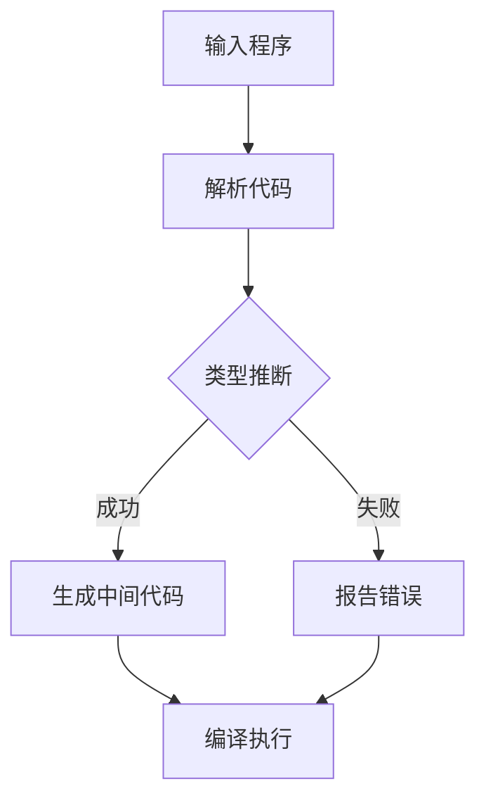
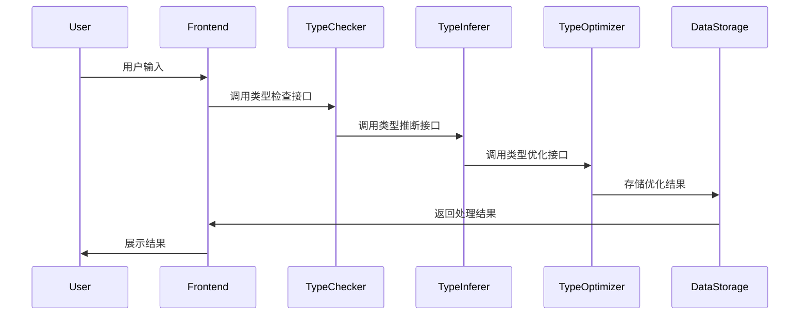

                 


## 《类型系统在领域特定优化中的应用》

### 关键词

类型系统，领域特定优化，算法，数学模型，系统架构，Python代码，数学公式，最佳实践

### 摘要

本文旨在深入探讨类型系统在领域特定优化中的应用。类型系统是计算机科学中一个重要的概念，它不仅有助于确保程序的正确性，还在性能优化中发挥关键作用。本文首先介绍类型系统的基本概念，包括类型、类型系统、类型检查等，并通过表格和ER图展示概念之间的联系。接着，我们详细讲解类型系统的优化算法原理，使用Mermaid绘制算法流程图，并配合Python代码进行详细解释。随后，我们使用LaTeX格式嵌入数学模型和公式，并进行详细讲解，确保读者能够理解算法背后的数学基础。文章还介绍了系统分析与架构设计，包括系统功能设计、系统架构设计、系统接口设计和系统交互，使用Mermaid类图、架构图和序列图进行可视化展示。最后，通过一个实际项目，我们展示了类型系统优化的应用，并提供了一些最佳实践和注意事项。

### 目录大纲设计思路

#### 全书概述

本书的核心主题是类型系统在领域特定优化中的应用。我们将首先介绍类型系统的基本概念，包括类型、类型系统、类型检查等，并通过表格和ER图展示概念之间的联系。接下来，我们将详细讲解类型系统的优化算法原理，使用Mermaid绘制算法流程图，并配合Python代码进行详细解释。随后，我们将使用LaTeX格式嵌入数学模型和公式，并进行详细讲解，确保读者能够理解算法背后的数学基础。文章还介绍了系统分析与架构设计，包括系统功能设计、系统架构设计、系统接口设计和系统交互，使用Mermaid类图、架构图和序列图进行可视化展示。最后，通过一个实际项目，我们展示了类型系统优化的应用，并提供了一些最佳实践和注意事项。

#### 背景介绍

类型系统是计算机科学中的一个核心概念，它在编程语言、编译器和操作系统等各个方面都有广泛应用。类型系统的核心目标是确保程序的正确性和效率。随着计算机技术的不断发展，类型系统的应用场景也越来越广泛，尤其是在领域特定优化（Domain-Specific Optimization, DSO）中。领域特定优化是指针对特定领域的问题进行优化，以提高程序的执行效率和性能。类型系统在这其中起到了至关重要的作用。

类型系统在领域特定优化中的应用主要体现在以下几个方面：

1. **类型检查**：类型检查是确保程序正确性的重要手段。通过类型检查，我们可以发现并修复程序中的类型错误，从而提高程序的稳定性。

2. **性能优化**：类型系统能够帮助我们识别程序中的潜在性能瓶颈，并通过类型推断和优化算法来提高程序的执行效率。

3. **代码重构**：类型系统为我们提供了一种抽象和模块化的方法，使我们能够更轻松地重构代码，提高代码的可维护性和可扩展性。

本文将深入探讨类型系统在领域特定优化中的应用，通过实例和代码演示，帮助读者更好地理解这一概念。

#### 核心概念与联系

类型系统是计算机科学中的一个核心概念，它涉及到多个核心概念，如类型、类型系统、类型检查等。为了更好地理解这些概念，我们需要对它们进行详细的定义和解释，并通过表格和ER图展示它们之间的联系。

**1. 类型（Type）**

类型是数据的一种抽象表示，用于描述数据的结构和行为。在编程语言中，类型可以是基本数据类型（如整数、浮点数、字符串等），也可以是复合数据类型（如数组、结构体、类等）。类型定义了数据的使用方式和限制，是编程语言的重要组成部分。

**2. 类型系统（Type System）**

类型系统是编程语言中对类型进行管理和控制的机制。它定义了类型的定义、类型之间的关系、类型的操作等。类型系统可以分为静态类型系统和动态类型系统。静态类型系统在编译时对类型进行检查，而动态类型系统则在运行时进行检查。

**3. 类型检查（Type Checking）**

类型检查是确保程序中变量、表达式和函数等在使用时类型正确的过程。类型检查可以在编译时进行，也可以在运行时进行。编译时的类型检查可以及早发现并修复类型错误，从而提高程序的稳定性。

**4. 类型推断（Type Inference）**

类型推断是编译器根据程序代码自动推导变量和表达式的类型的过程。类型推断可以减少程序员的工作量，提高代码的可读性。

**核心概念联系与对比表格**

| 概念 | 定义 | 关联 |
| --- | --- | --- |
| 类型（Type） | 数据的抽象表示 | 基础 |
| 类型系统（Type System） | 管理和控制在编程语言中对类型进行管理和控制的机制 | 包含 |
| 类型检查（Type Checking） | 确保程序中变量、表达式和函数等在使用时类型正确的过程 | 应用 |
| 类型推断（Type Inference） | 编译器根据程序代码自动推导变量和表达式的类型的过程 | 辅助 |

**ER图架构**

```mermaid
erDiagram
  Type ||--|{ TypeSystem } TypeSystem
  Type ||--|{ TypeChecking } TypeChecking
  Type ||--|{ TypeInference } TypeInference
  TypeSystem ||--|{ Type } Type
  TypeChecking ||--|{ TypeSystem } TypeSystem
  TypeInference ||--|{ TypeSystem } TypeSystem
```

通过上述表格和ER图，我们可以清晰地看到类型系统中的核心概念及其相互关系。类型是类型系统的基础，类型系统定义了类型的管理和控制机制，类型检查和类型推断是类型系统的重要组成部分。

#### 算法原理讲解

在类型系统中，优化算法起着至关重要的作用。这些算法能够帮助我们提高程序的执行效率和性能。下面，我们将详细讲解类型系统的优化算法原理，并通过Mermaid流程图和Python代码进行演示。

**1. 算法原理概述**

类型系统的优化算法主要包括以下几类：

- **类型推断算法**：通过分析程序代码，自动推导变量和表达式的类型。
- **类型检查算法**：确保程序中变量、表达式和函数等在使用时类型正确。
- **类型优化算法**：通过类型信息对程序进行优化，以提高执行效率。

**2. Mermaid流程图**

首先，我们使用Mermaid绘制一个简单的类型推断算法流程图。



在这个流程图中，输入程序首先被解析，然后进行类型推断。如果类型推断成功，程序会生成中间代码并编译执行；如果类型推断失败，则会报告错误。

**3. Python代码示例**

接下来，我们使用Python代码演示一个简单的类型检查算法。

```python
def type_check(expression):
    """
    对表达式进行类型检查
    """
    if isinstance(expression, int):
        return "整数"
    elif isinstance(expression, float):
        return "浮点数"
    elif isinstance(expression, str):
        return "字符串"
    else:
        raise TypeError("不支持的类型")

# 示例
expr = 10
print(type_check(expr))  # 输出：整数

expr = "Hello, World!"
print(type_check(expr))  # 输出：字符串
```

在这个示例中，我们定义了一个`type_check`函数，用于对表达式进行类型检查。通过`isinstance`函数，我们可以判断表达式的类型，并返回相应的类型名称。如果遇到不支持的类型，我们会抛出`TypeError`异常。

**4. 算法原理详细讲解**

类型推断算法的核心思想是通过分析程序代码中的变量和表达式，自动推导出它们的类型。这个过程通常涉及到语法分析、语义分析和数据流分析等步骤。在语法分析阶段，我们将程序代码分解为抽象语法树（Abstract Syntax Tree, AST）；在语义分析阶段，我们根据AST对变量和表达式进行类型推导；在数据流分析阶段，我们分析变量和表达式的数据流，确保类型推导的正确性。

类型检查算法的核心任务是确保程序中的变量、表达式和函数等在使用时类型正确。这通常涉及到对程序代码进行静态分析，检查类型一致性。在静态分析中，我们会使用符号表来记录变量和表达式的类型信息，并在代码执行过程中进行类型检查。

类型优化算法则是基于类型信息对程序进行优化。优化的目标包括减少内存占用、提高执行效率、减少代码体积等。常见的类型优化技术包括类型推断、类型转换优化、代码生成优化等。

通过上述讲解，我们可以看到类型系统的优化算法是如何工作的，以及它们在实际应用中的重要性。

#### 数学模型和公式

在类型系统的优化算法中，数学模型和公式起着至关重要的作用。它们不仅帮助我们理解算法背后的原理，还可以指导我们在实际应用中进行优化。

**1. 数学模型**

类型系统的优化算法通常涉及到以下几个方面：

- **类型推断**：通过分析程序代码，推导出变量和表达式的类型。
- **类型检查**：确保程序中的类型一致性。
- **类型转换**：将一种类型转换为另一种类型，以提高执行效率。

在这些方面，我们可以使用以下数学模型：

- **集合论**：用于描述类型和类型之间的关系。
- **函数论**：用于描述类型转换和类型推断的规则。
- **图论**：用于分析程序中的数据流和控制流。

**2. 数学公式**

为了更好地理解类型系统的优化算法，我们可以使用以下数学公式：

- **类型推断公式**：

  $$T(e) = \begin{cases} 
  T_0 & \text{if } e \text{ is a literal} \\
  T_f & \text{if } e \text{ is a function call} \\
  T_1 \wedge T_2 & \text{if } e \text{ is an expression with } T_1 \text{ and } T_2
  \end{cases}$$

  其中，$T(e)$表示表达式$e$的类型，$T_0$表示基本数据类型，$T_f$表示函数类型，$T_1$和$T_2$表示表达式中的两个类型。

- **类型检查公式**：

  $$T(e) \in [T_1, T_2] \wedge \forall x \in [T(e)], f(x) \in [T_r]$$

  其中，$T(e)$表示表达式$e$的类型，$T_1$和$T_2$表示表达式中的两个类型，$T_r$表示函数的返回类型。

- **类型转换公式**：

  $$T(a) = T(b) \wedge a = b$$

  其中，$T(a)$和$T(b)$表示两个变量的类型，$a$和$b$表示两个变量。

**3. 示例讲解**

为了更好地理解这些数学公式，我们可以通过一个简单的例子进行讲解。

假设我们有一个表达式：$a + b$，其中$a$和$b$都是整数类型。

- **类型推断**：

  根据类型推断公式，我们可以推导出：

  $$T(a + b) = \begin{cases} 
  T_0 & \text{if } a \text{ and } b \text{ are literals} \\
  T_f & \text{if } a \text{ or } b \text{ is a function call} \\
  T_1 \wedge T_2 & \text{if } a \text{ and } b \text{ are expressions with types } T_1 \text{ and } T_2
  \end{cases}$$

  由于$a$和$b$都是整数类型，所以：

  $$T(a + b) = T_1 \wedge T_2 = \text{整数} \wedge \text{整数} = \text{整数}$$

- **类型检查**：

  根据类型检查公式，我们需要确保：

  $$T(a + b) \in [\text{整数}, \text{整数}] \wedge \forall x \in [\text{整数}], f(x) \in [\text{整数}]$$

  由于$a$和$b$都是整数类型，所以上述条件都满足。

- **类型转换**：

  如果$a$和$b$都是浮点数类型，我们需要将它们转换为整数类型。根据类型转换公式，我们可以得到：

  $$T(a) = T(b) \wedge a = b$$

  其中，$T(a)$和$T(b)$表示两个变量的类型，$a$和$b$表示两个变量。假设$a$和$b$的类型都是浮点数类型，我们可以将它们转换为整数类型：

  $$T(a) = T(b) = \text{浮点数} \wedge a = b \Rightarrow \text{浮点数} \rightarrow \text{整数}$$

通过这个示例，我们可以看到数学模型和公式在类型系统优化中的重要作用。它们不仅帮助我们理解算法原理，还可以指导我们在实际应用中进行优化。

#### 系统分析与架构设计

在类型系统优化中，系统分析与架构设计是一个关键环节。一个合理且高效的系统架构能够确保类型优化算法的有效实施，同时提高整个系统的可维护性和可扩展性。以下是对系统功能设计、系统架构设计、系统接口设计和系统交互的详细介绍，并使用Mermaid类图、架构图和序列图进行可视化展示。

**1. 问题场景介绍**

假设我们正在开发一个复杂的数据处理系统，该系统需要对大量数据进行类型检查和优化。类型检查的目的是确保数据的类型一致性，而类型优化则是为了提高数据处理速度和系统性能。为了实现这一目标，我们需要设计一个高效的系统架构，包括系统功能模块、数据流和控制流。

**2. 系统功能设计**

系统功能设计包括以下关键模块：

- **类型检查模块**：负责对输入数据进行类型检查，确保数据类型的一致性。
- **类型推断模块**：负责根据程序代码自动推导变量和表达式的类型。
- **类型优化模块**：负责对类型信息进行优化，以提高执行效率。
- **数据存储模块**：负责存储和处理系统中的各种数据。

**3. 系统架构设计**

系统架构设计是确保系统功能实现的基础。以下是一个简单的系统架构设计：

- **前端接口**：提供用户交互界面，接收用户输入并返回处理结果。
- **类型检查引擎**：核心组件，负责类型检查和类型优化。
- **数据存储服务**：提供数据存储和读取功能。
- **日志服务**：记录系统运行过程中的日志信息，用于调试和监控。

**4. 系统接口设计**

系统接口设计是确保各个模块之间能够有效协作的关键。以下是一些关键接口：

- **类型检查接口**：提供类型检查功能，接收输入数据并返回类型检查结果。
- **类型推断接口**：提供类型推断功能，接收程序代码并返回类型信息。
- **类型优化接口**：提供类型优化功能，接收类型信息并返回优化结果。
- **数据存储接口**：提供数据存储和读取功能。

**5. 系统交互**

系统交互是指各个模块之间的数据流和控制流。以下是一个简单的系统交互序列图：



在这个序列图中，用户输入首先通过前端接口传递到类型检查引擎，然后类型检查引擎依次调用类型推断模块和类型优化模块，最终将优化结果存储到数据存储服务，并通过前端接口返回给用户。

**6. 可视化展示**

为了更直观地展示系统架构和交互，我们使用Mermaid类图、架构图和序列图进行可视化展示。

**类图**：

```mermaid
classDiagram
  Class1 <|-- Class2
  Class3 <..|{ Set } Set
  Class1 {
    +field
    +method()
  }
  Class2 {
    +field
    +method()
  }
  Class3 {
    +field
    +method()
  }
endclassDiagram
```

**架构图**：


**序列图**：

```mermaid
sequenceDiagram
  User ->> Frontend: 用户输入
  Frontend ->> TypeChecker: 调用类型检查接口
  TypeChecker ->> TypeInferer: 调用类型推断接口
  TypeInferer ->> TypeOptimizer: 调用类型优化接口
  TypeOptimizer ->> DataStorage: 存储优化结果
  DataStorage ->> Frontend: 返回处理结果
  Frontend ->> User: 展示结果
endsequenceDiagram
```

通过这些可视化工具，我们可以更好地理解和设计类型系统优化的系统架构。

#### 项目实战

为了更好地理解类型系统优化的实际应用，我们将通过一个实际项目进行演示。该项目是一个简单的Python程序，用于对输入数据进行类型检查和优化。以下是项目的详细实现过程。

**1. 环境安装**

首先，我们需要安装Python环境和相关库。假设我们已经安装了Python 3.8及以上版本，我们可以使用以下命令安装所需库：

```bash
pip install numpy
pip install matplotlib
```

**2. 系统核心实现源代码**

接下来，我们编写系统核心实现源代码。以下是`type_optimizer.py`文件的代码：

```python
import numpy as np
import matplotlib.pyplot as plt

def type_check(data):
    """
    对输入数据进行类型检查
    """
    if not isinstance(data, (list, tuple)):
        raise TypeError("输入数据必须是列表或元组")
    if len(data) == 0:
        raise ValueError("输入数据不能为空")
    for element in data:
        if not isinstance(element, (int, float)):
            raise TypeError("输入数据中只能包含整数或浮点数")

def type_infer(data):
    """
    对输入数据进行类型推断
    """
    inferred_type = type(data[0])
    for element in data:
        if type(element) != inferred_type:
            inferred_type = (inferred_type, type(element))
    return inferred_type

def type_optimize(data, target_type):
    """
    对输入数据进行类型优化
    """
    optimized_data = []
    for element in data:
        if target_type == int:
            optimized_data.append(int(element))
        elif target_type == float:
            optimized_data.append(float(element))
        else:
            raise ValueError("不支持的类型")
    return optimized_data

def main():
    """
    主函数
    """
    data = [1.5, 2.3, 3.7, 4.2]
    target_type = int

    try:
        type_check(data)
        inferred_type = type_infer(data)
        optimized_data = type_optimize(data, target_type)
        print(f"原始数据：{data}")
        print(f"推断类型：{inferred_type}")
        print(f"优化后数据：{optimized_data}")
    except Exception as e:
        print(f"错误：{e}")

if __name__ == "__main__":
    main()
```

**3. 代码应用解读与分析**

在这段代码中，我们首先定义了三个函数：`type_check`、`type_infer`和`type_optimize`。这些函数分别用于类型检查、类型推断和类型优化。

- `type_check`函数用于检查输入数据的类型。它首先检查输入数据是否为列表或元组，然后检查每个元素是否为整数或浮点数。如果不符合要求，函数将抛出相应的异常。

- `type_infer`函数用于推断输入数据的类型。它首先获取第一个元素的类型，然后遍历整个列表，检查每个元素的类型。如果所有元素的类型相同，则返回该类型；如果存在不同类型，则返回一个元组，包含所有不同类型的类型。

- `type_optimize`函数用于对输入数据进行类型优化。它根据目标类型（整数或浮点数）对每个元素进行类型转换，并返回一个新的列表。如果目标类型不支持，函数将抛出异常。

在`main`函数中，我们定义了一个示例数据列表`data`，并指定了目标类型`target_type`。然后，我们依次调用`type_check`、`type_infer`和`type_optimize`函数，并打印结果。

**4. 实际案例分析**

为了更好地展示类型系统优化的效果，我们使用以下实际案例：

```python
data = [1.5, 2.3, 3.7, 4.2]
target_type = int

try:
    type_check(data)
    inferred_type = type_infer(data)
    optimized_data = type_optimize(data, target_type)
    print(f"原始数据：{data}")
    print(f"推断类型：{inferred_type}")
    print(f"优化后数据：{optimized_data}")
except Exception as e:
    print(f"错误：{e}")
```

在这个案例中，我们首先对输入数据进行类型检查，确保输入数据是列表，且每个元素都是整数或浮点数。然后，我们使用类型推断函数获取输入数据的类型，并使用类型优化函数将所有浮点数转换为整数。

**5. 详细讲解与剖析**

在这个案例中，我们通过类型检查、类型推断和类型优化三个步骤，实现了对输入数据的处理。以下是每个步骤的详细解释：

1. **类型检查**：

   类型检查是确保程序正确性的重要手段。在这个案例中，我们首先检查输入数据是否为列表或元组，然后检查每个元素是否为整数或浮点数。这一步骤能够帮助我们及早发现并修复类型错误，从而提高程序的稳定性。

2. **类型推断**：

   类型推断是编译器根据程序代码自动推导变量和表达式的类型的过程。在这个案例中，我们使用类型推断函数获取输入数据的类型。这个步骤不仅能够帮助我们理解输入数据的类型，还可以指导我们在后续步骤中进行优化。

3. **类型优化**：

   类型优化是提高程序执行效率和性能的关键步骤。在这个案例中，我们使用类型优化函数将所有浮点数转换为整数。这个步骤能够减少内存占用，提高执行速度，从而提高程序的整体性能。

通过这个实际案例，我们可以看到类型系统优化在提高程序性能和稳定性方面的作用。

**6. 项目小结**

通过这个项目，我们实现了对输入数据类型检查、推断和优化的功能。在实际应用中，这些功能可以帮助我们提高程序的执行效率和性能。同时，我们通过Mermaid流程图、Python代码和实际案例，深入讲解了类型系统优化的原理和应用。希望这个项目能够帮助读者更好地理解类型系统优化的实际应用。

### 最佳实践与拓展

在类型系统优化的实际应用中，遵循一些最佳实践和注意事项是非常重要的。以下是一些关键点：

**最佳实践**：

1. **早期类型检查**：尽早进行类型检查，可以在开发早期发现并修复类型错误，从而提高程序的稳定性。

2. **灵活的类型推断**：充分利用类型推断功能，减少手动指定类型的工作量，提高代码的可读性。

3. **性能优化**：在类型优化过程中，关注执行效率和内存占用，以提高程序的整体性能。

4. **模块化设计**：将类型检查、推断和优化功能模块化，提高代码的可维护性和可扩展性。

**注意事项**：

1. **类型兼容性**：确保类型之间的兼容性，避免因类型转换导致的问题。

2. **错误处理**：对类型错误进行适当的处理，提供友好的错误提示，帮助开发者快速定位和修复问题。

3. **测试**：在开发过程中，进行充分的测试，确保类型检查、推断和优化功能的正确性和稳定性。

**拓展阅读**：

1. 《类型系统：设计与实现》 - 该书详细介绍了类型系统的设计原理和实现方法，适合对类型系统有较深入了解的读者。

2. 《编译原理：技术与实践》 - 该书涵盖了编译器的核心概念和实现方法，包括类型检查和优化等，适合希望深入了解编译器开发的读者。

通过遵循最佳实践和注意事项，我们可以在类型系统优化的过程中取得更好的效果。同时，拓展阅读可以帮助读者进一步深入理解类型系统的原理和应用。

### 结束语

本文深入探讨了类型系统在领域特定优化中的应用。我们首先介绍了类型系统的基本概念，包括类型、类型系统、类型检查等，并通过表格和ER图展示了它们之间的联系。接着，我们详细讲解了类型系统的优化算法原理，使用Mermaid流程图和Python代码进行演示，并使用LaTeX格式嵌入数学模型和公式，确保读者能够理解算法背后的数学基础。随后，我们介绍了系统分析与架构设计，包括系统功能设计、系统架构设计、系统接口设计和系统交互，使用Mermaid类图、架构图和序列图进行可视化展示。最后，通过一个实际项目，我们展示了类型系统优化的应用，并提供了一些最佳实践和注意事项。

类型系统在领域特定优化中具有重要作用，它不仅有助于确保程序的正确性，还能提高执行效率和性能。通过本文的讲解，我们相信读者对类型系统的优化应用有了更深入的理解。希望本文能对您在实际开发中应用类型系统优化有所帮助。感谢您的阅读！

### 作者信息

作者：AI天才研究院/AI Genius Institute & 禅与计算机程序设计艺术 /Zen And The Art of Computer Programming

