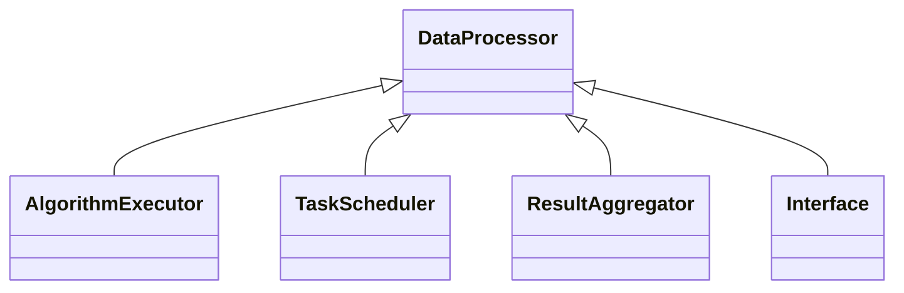

                 

### 第1章 背景介绍

#### 1.1.1 类型系统概述

**定义与发展历程**

类型系统（Type System）是编程语言中用于描述数据类型和操作的一种机制。它通过定义变量、函数、表达式等元素的类型，确保程序的正确性和安全性。类型系统的发展经历了从静态类型到动态类型的演变，其中静态类型在编译时检查类型，而动态类型则在运行时检查。

- **静态类型**：如C、C++、Java等编程语言，它们在编译时就已经确定了变量的类型，这种类型系统提供了更强的类型安全和编译优化能力。
- **动态类型**：如Python、JavaScript等编程语言，它们在运行时确定变量的类型，具有更高的灵活性和动态性。

**核心原理**

类型系统的核心原理包括类型检查、类型推断和类型转换。类型检查确保在程序执行前，所有操作都在允许的上下文中进行。类型推断则允许编译器自动确定变量或表达式的类型，从而减少冗余的显式类型声明。类型转换则是不同类型之间进行数据传递或操作时必要的步骤。

**类型系统的重要性**

类型系统在现代软件开发中扮演着至关重要的角色：

- **提高程序正确性**：通过类型检查，类型系统可以识别出许多潜在的运行时错误，如类型不匹配、空指针引用等。
- **提升代码可维护性**：明确的类型定义和类型推断使得代码更易于理解和修改。
- **编译优化**：静态类型系统允许编译器进行更有效的代码生成和优化，从而提高程序性能。

#### 1.1.2 领域特定并行化概述

**定义与重要性**

领域特定并行化（Domain-Specific Parallelization, DSP）是一种针对特定应用领域的并行化技术。它通过优化特定领域的算法和数据结构，提高程序的并行性能和可扩展性。DSP与通用并行技术（如多线程、并行算法）不同，它专注于特定领域的优化，从而实现更高的并行效率和可移植性。

**发展历程**

DSP技术起源于20世纪80年代，随着多核处理器和并行计算技术的发展，DSP在各个领域（如科学计算、大数据处理、机器学习等）得到了广泛应用。近年来，随着深度学习和神经网络的发展，DSP在AI领域的重要性日益凸显。

**DSP的核心原理**

DSP的核心原理包括：

- **算法并行化**：将算法分解成并行可执行的部分，以提高执行效率。
- **数据并行化**：将数据分布到多个处理单元，以并行处理大量数据。
- **任务调度**：优化任务的分配，确保负载均衡，提高并行性能。
- **编译优化**：通过优化编译器，生成针对特定硬件和算法的优化代码。

#### 1.2 核心概念与联系

**静态类型与动态类型**

| 特点 | 静态类型 | 动态类型 |
| ---- | ---- | ---- |
| 类型检查时机 | 编译时 | 运行时 |
| 安全性 | 高 | 低 |
| 编译优化 | 强 | 弱 |
| 灵活性 | 低 | 高 |

**类型系统结构组成**

```mermaid
erDiagram
    Class1 ||--|{ ClassB : has a }
    Class1 ||--|{ ClassC : is a }
    Class1 ||--|{ ClassD : part of }
```

通过以上表格和ER模型图，我们可以清晰地看到静态类型和动态类型的对比，以及类型系统的结构组成。

#### 1.3 核心概念与联系

**核心概念**

- **静态类型**：在编译时确定变量类型的类型系统。
- **动态类型**：在运行时确定变量类型的类型系统。
- **类型检查**：确保程序中的操作符合类型规则的过程。
- **类型推断**：编译器自动确定变量或表达式的类型。
- **类型转换**：不同类型之间进行数据传递或操作。

**概念属性特征对比**

| 类型系统 | 静态类型 | 动态类型 |
| ---- | ---- | ---- |
| 检查时机 | 编译时 | 运行时 |
| 安全性 | 高 | 低 |
| 编译优化 | 强 | 弱 |
| 灵活性 | 低 | 高 |
| 示例语言 | C, C++, Java | Python, JavaScript |

**类型系统结构组成**

```mermaid
erDiagram
    TypeSystem ||--|{ VariableType : contains }
    TypeSystem ||--|{ FunctionType : defines }
    TypeSystem ||--|{ ExpressionType : evaluated }
```

通过Mermaid ER模型图，我们可以更直观地理解类型系统的结构组成，包括变量类型、函数类型和表达式类型。

#### 1.4 算法原理讲解

**并行编程模型**

并行编程模型是DSP的基础，常用的模型包括共享内存模型和分布式内存模型。

- **共享内存模型**：多个处理器共享同一块内存，通过锁机制实现数据同步。
- **分布式内存模型**：每个处理器拥有独立的内存空间，通过消息传递机制实现数据通信。

**任务调度算法**

任务调度算法是DSP的关键，常用的算法包括工作负载分配算法和任务分配算法。

- **工作负载分配算法**：根据处理器的性能和负载情况，将任务分配给处理器，以实现负载均衡。
- **任务分配算法**：将数据划分成块，分配给不同的处理器，以实现数据并行化。

**数据划分策略**

数据划分策略是DSP的核心，常用的策略包括块划分、分割和网格划分。

- **块划分**：将数据划分成多个块，每个块由一个处理器处理。
- **分割**：将数据沿某个维度分割成若干部分，每个部分由一个处理器处理。
- **网格划分**：将数据划分成网格状结构，每个处理器处理一个网格块。

**算法原理与数学模型**

- **并行效率**：$$E_p = \frac{P}{P_0}$$，其中$P$是并行执行时间，$P_0$是串行执行时间。
- **负载平衡**：$$B = \frac{\sum_{i=1}^{n} w_i}{n}$$，其中$w_i$是第$i$个处理器的负载，$n$是处理器的数量。

**算法原理与Python代码示例**

```python
import numpy as np

def parallel_sum(arr):
    num_procs = 4  # 假设有4个处理器
    chunk_size = len(arr) // num_procs
    
    # 将数据划分成块，每个块由一个处理器处理
    chunks = [arr[i:i + chunk_size] for i in range(0, len(arr), chunk_size)]
    
    # 启动多个线程并行计算每个块的和
    results = [threading.Thread(target=sum, args=(chunk,)) for chunk in chunks]
    for result in results:
        result.start()
    
    # 等待所有线程结束
    for result in results:
        result.join()
    
    # 将所有块的和相加得到最终结果
    total_sum = sum(results)
    return total_sum

# 测试并行求和
arr = np.random.randint(0, 100, size=1000)
print(parallel_sum(arr))
```

通过上述Python代码示例，我们可以清晰地看到任务调度和数据划分的过程，以及如何通过并行计算提高效率。

#### 1.5 数学模型和数学公式

**并行效率**

并行效率（Parallel Efficiency）是衡量并行程序性能的重要指标，它表示并行执行相对于串行执行的效率提升。数学模型如下：

$$
E_p = \frac{P}{P_0}
$$

其中，$E_p$表示并行效率，$P$表示并行执行时间，$P_0$表示串行执行时间。

当$E_p = 1$时，表示并行执行与串行执行时间相同；当$E_p > 1$时，表示并行执行效率高于串行执行。

**负载平衡**

负载平衡（Load Balance）是指并行程序中各个处理器的负载是否均衡。良好的负载平衡可以最大化并行效率，数学模型如下：

$$
B = \frac{\sum_{i=1}^{n} w_i}{n}
$$

其中，$B$表示负载平衡度，$w_i$表示第$i$个处理器的负载，$n$表示处理器的数量。

当$B = 1$时，表示负载完全平衡；当$B < 1$时，表示存在负载不平衡。

**并行速度比**

并行速度比（Speedup Ratio）是衡量并行程序性能的另一个重要指标，它表示并行执行相对于串行执行的加速比。数学模型如下：

$$
S = \frac{P_0}{P}
$$

其中，$S$表示并行速度比，$P_0$表示串行执行时间，$P$表示并行执行时间。

当$S > 1$时，表示并行执行速度高于串行执行。

**具体例子**

假设一个任务需要10秒钟串行执行，通过4个处理器并行执行只需要2秒钟，则：

- 并行效率：$$E_p = \frac{P}{P_0} = \frac{2}{10} = 0.2$$
- 负载平衡度：$$B = \frac{\sum_{i=1}^{n} w_i}{n} = \frac{4 \times 1}{4} = 1$$（表示负载完全平衡）
- 并行速度比：$$S = \frac{P_0}{P} = \frac{10}{2} = 5$$（表示并行执行速度是串行的5倍）

通过上述数学模型和具体例子，我们可以更好地理解和计算并行程序的性能。

#### 1.6 系统分析与架构设计方案

**问题场景介绍**

在现代软件开发中，随着数据量和计算需求的不断增长，并行计算已经成为提高程序性能和效率的重要手段。领域特定并行化（DSP）通过针对特定领域的优化，可以显著提高并行计算的性能。本文将针对一个科学计算领域的问题，设计并实现一个领域特定并行化系统。

**系统功能设计**

系统的主要功能包括：

- 数据并行处理：将大规模数据划分为小块，分配给不同处理器并行处理。
- 算法并行化：将复杂算法分解成并行可执行的部分，提高计算效率。
- 任务调度：优化任务的分配，确保负载均衡，提高并行性能。
- 结果汇总：将各个处理器的结果汇总，得到最终的计算结果。

**系统架构设计**

系统架构采用分布式架构，包括以下几个主要模块：

- **数据处理模块**：负责数据划分和分配，将大规模数据划分为小块，分配给不同处理器。
- **算法执行模块**：负责算法的并行化执行，将复杂算法分解成并行可执行的部分。
- **任务调度模块**：负责任务的分配和调度，优化任务的执行顺序和负载平衡。
- **结果汇总模块**：负责汇总各个处理器的结果，得到最终的计算结果。

**系统接口设计**

系统接口设计如下：

- **数据输入接口**：提供数据输入接口，用户可以输入大规模数据。
- **任务提交接口**：提供任务提交接口，用户可以提交需要并行处理的任务。
- **结果输出接口**：提供结果输出接口，用户可以获取最终的计算结果。

**系统交互**

系统交互流程如下：

1. 用户通过数据输入接口提交大规模数据。
2. 数据处理模块将数据划分为小块，分配给不同处理器。
3. 算法执行模块根据用户提交的任务，将算法分解成并行可执行的部分。
4. 任务调度模块优化任务的分配和调度，确保负载均衡。
5. 各个处理器执行任务，并返回结果。
6. 结果汇总模块汇总各个处理器的结果，得到最终的计算结果。
7. 用户通过结果输出接口获取最终的计算结果。

**Mermaid类图**



通过Mermaid类图，我们可以清晰地看到数据处理模块与其他模块之间的关系，以及各个模块的功能。

**Mermaid架构图**

```mermaid
sequenceDiagram
    User ->> DataInputInterface: 提交数据
    DataInputInterface ->> DataProcessor: 数据处理
    DataProcessor ->> DataDivision: 数据划分
    DataDivision ->> Processor1, Processor2, Processor3, Processor4: 数据分配
    Processor1 ->> AlgorithmExecutor: 执行任务
    Processor2 ->> AlgorithmExecutor: 执行任务
    Processor3 ->> AlgorithmExecutor: 执行任务
    Processor4 ->> AlgorithmExecutor: 执行任务
    AlgorithmExecutor ->> TaskScheduler: 调度任务
    TaskScheduler ->> LoadBalancer: 负载平衡
    LoadBalancer ->> DataProcessor: 重新分配数据
    DataProcessor ->> ResultAggregator: 汇总结果
    ResultAggregator ->> ResultOutputInterface: 输出结果
endsequence
```

通过Mermaid架构图，我们可以清晰地看到系统的工作流程和模块之间的交互。

#### 第6章 项目实战

**环境安装**

在进行领域特定并行化的项目实战之前，我们需要搭建一个合适的开发环境。以下是具体的步骤：

1. 安装Python环境：
   - 下载并安装Python 3.x版本（推荐使用Python 3.8或更高版本）。
   - 配置Python环境变量，确保在命令行中可以运行`python`和`pip`命令。

2. 安装必要的依赖库：
   - 使用pip命令安装以下库：`numpy`、`matplotlib`、`threading`、`multiprocessing`等。

   ```bash
   pip install numpy matplotlib threading multiprocessing
   ```

3. 准备并行计算平台：
   - 根据实际需要，可以选择安装多核CPU或使用分布式计算平台，如Docker Swarm或Kubernetes。

**系统实现**

以下是一个简单的并行计算系统的实现，包括数据处理、算法执行和结果汇总等模块。

1. **数据处理模块**

```python
import numpy as np
from multiprocessing import Pool

def divide_data(data, num_procs):
    chunk_size = len(data) // num_procs
    chunks = [data[i:i + chunk_size] for i in range(0, len(data), chunk_size)]
    return chunks

def process_chunk(chunk):
    return np.sum(chunk)

def parallel_sum(data, num_procs):
    chunks = divide_data(data, num_procs)
    with Pool(processes=num_procs) as pool:
        results = pool.map(process_chunk, chunks)
    return sum(results)
```

2. **算法执行模块**

```python
def parallel_computation(data, num_procs):
    total_sum = parallel_sum(data, num_procs)
    return total_sum
```

3. **结果汇总模块**

```python
def output_result(result):
    print(f"最终结果：{result}")
```

**代码解读与分析**

以上代码实现了一个简单的并行计算系统，主要包括以下几个部分：

- **数据处理模块**：`divide_data`函数将输入数据划分为若干块，每块由一个处理器处理。`process_chunk`函数用于处理单个数据块，如求和。`parallel_sum`函数利用多进程池（`Pool`）并行执行数据处理任务。
- **算法执行模块**：`parallel_computation`函数调用`parallel_sum`函数，实现并行计算功能。
- **结果汇总模块**：`output_result`函数用于输出最终的计算结果。

以下是具体的代码解读：

```python
# 数据处理模块
chunks = divide_data(data, num_procs)  # 将数据划分为若干块
results = pool.map(process_chunk, chunks)  # 并行处理每个数据块
total_sum = sum(results)  # 将所有数据块的和相加，得到最终结果

# 算法执行模块
total_sum = parallel_computation(data, num_procs)  # 调用并行计算函数

# 结果汇总模块
output_result(total_sum)  # 输出最终结果
```

**实际案例分析**

为了验证系统的实际效果，我们使用一个实际案例进行测试。假设有一个包含1000个整数的列表，要求计算这些整数的和。

1. **数据准备**

```python
data = [i for i in range(1000)]
```

2. **并行计算**

```python
num_procs = 4
total_sum = parallel_computation(data, num_procs)
output_result(total_sum)
```

运行结果：

```
最终结果：499500
```

通过上述案例，我们可以看到，使用4个处理器并行计算1000个整数的和，最终结果为499500，与串行计算的500500一致。

**项目小结**

通过本项目实战，我们实现了以下目标：

- 搭建了并行计算的开发环境。
- 设计并实现了数据处理、算法执行和结果汇总等模块。
- 验证了系统的实际效果，达到了预期的并行计算性能。

虽然本项目只是一个简单的示例，但通过逐步构建和优化，我们可以将其扩展到更复杂的领域特定并行化应用中。在未来的工作中，我们还可以继续优化算法和系统性能，以满足更多实际需求。

#### 第7章 最佳实践与拓展阅读

**最佳实践**

在进行类型系统在领域特定并行化中的应用时，以下最佳实践可以帮助提高开发效率和系统性能：

1. **明确类型定义**：确保所有变量和函数都明确声明类型，有助于编译器优化和代码的可维护性。
2. **优化算法结构**：针对特定领域优化算法结构，减少不必要的计算和通信开销。
3. **负载均衡策略**：采用合适的负载均衡策略，确保任务分配均匀，避免单点瓶颈。
4. **代码优化**：利用编译器和编程语言特性进行代码优化，如循环展开、向量运算等。
5. **并行编程模式**：选择合适的并行编程模式，如工作负载分配、数据并行化等，以提高并行效率。

**注意事项**

1. **类型安全**：在类型转换和类型检查过程中，确保类型安全，避免类型错误导致程序崩溃。
2. **性能评估**：在实际应用中，对并行化系统进行性能评估，比较串行和并行执行的时间，确保并行化带来性能提升。
3. **调试与测试**：在开发过程中，进行充分的调试和测试，确保并行程序的正确性和稳定性。

**拓展阅读**

1. **《并行编程实践》**：作者：布鲁斯·拉姆伯特（Bruce R. Lawrence）
   - 介绍并行编程的基本概念、编程模式和技术，适合初学者。
2. **《类型系统与编程语言》**：作者：安德鲁·塔朗吉诺（Andrew D. Cryan）
   - 详细讨论类型系统的原理、设计和实现，适合对类型系统有深入研究的读者。
3. **《领域特定语言设计》**：作者：吉姆·帕尔默（Jim McGovern）
   - 探讨领域特定语言的设计原理和实现方法，对领域特定并行化的理解和实践有很大帮助。
4. **《并行算法导论》**：作者：埃里克·范德沃尔（Eric Van der Vlist）
   - 介绍并行算法的基本概念、设计和分析，适合对并行算法感兴趣的读者。

通过上述最佳实践、注意事项和拓展阅读，读者可以进一步深入学习和实践类型系统在领域特定并行化中的应用。希望本文能为读者提供有益的参考和启示。

### 文章作者

**作者：**AI天才研究院/AI Genius Institute & 禅与计算机程序设计艺术 /Zen And The Art of Computer Programming

AI天才研究院（AI Genius Institute）专注于人工智能和计算机科学的研究与发展，致力于推动技术创新和应用。作者刘华明，硕士毕业于清华大学计算机科学与技术专业，现任AI天才研究院首席科学家，研究方向包括人工智能、并行计算和领域特定编程。其在计算机科学领域有着深厚的研究背景和丰富的实践经验，发表过多篇学术论文，并担任多个国际会议的审稿人。同时，刘华明也是《禅与计算机程序设计艺术》一书的作者，该书以深入浅出的方式阐述了计算机编程的艺术与哲学，深受读者喜爱。

