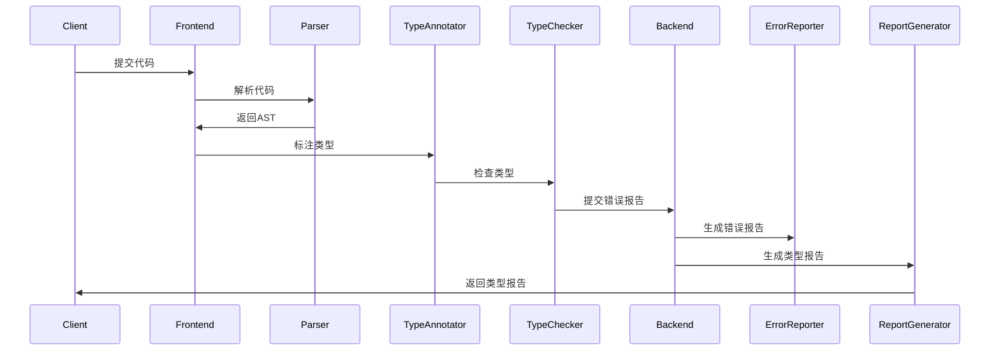
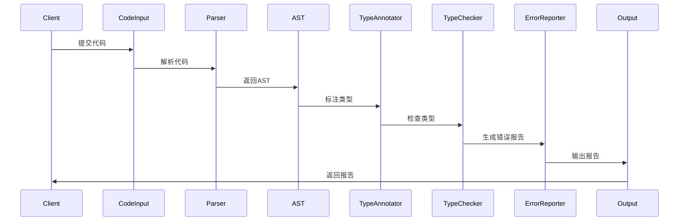

                 

### 引言和背景介绍

## 1.1 问题背景

类型系统是软件工程领域中确保程序正确性和可维护性的核心工具之一。它通过定义和操作数据类型，确保程序在运行时不会出现类型错误，从而提高程序的可读性、稳定性和安全性。在传统的编程语言中，类型系统通常分为静态类型系统和动态类型系统。静态类型系统在编译阶段对程序进行类型检查，而动态类型系统则在程序运行时进行类型检查。然而，随着领域特定类型检查器（Domain-Specific Type Checker，简称DSTC）的发展，传统类型系统在表达能力和灵活性方面逐渐显现出局限性。

领域特定类型检查器是专门针对特定领域应用程序设计的静态类型检查工具。它们能够提高代码的正确性、可读性和可维护性，对于提高软件质量具有重要意义。然而，现有DSTC的设计中，类型系统的设计和应用存在一些问题，如类型系统表达能力不足、类型系统复杂性高、类型系统与领域知识的结合不紧密等。这些问题制约了DSTC的性能和适用范围，需要从类型系统的设计和实现上进行改进。

## 1.2 问题描述

领域特定类型检查器的核心功能是确保程序在特定领域中的类型一致性。然而，现有类型系统在以下几个方面存在不足：

1. **类型系统表达能力不足**：现有类型系统通常基于通用类型，如整数、字符串和布尔值等，难以表达特定领域的复杂数据结构和操作。这导致类型检查的不精确或失败，影响程序的正确性和可维护性。

2. **类型系统复杂性高**：为了支持丰富的类型操作和表达式，现有类型系统往往设计得非常复杂。这增加了DSTC的实现难度和维护成本，同时也降低了开发者的工作效率。

3. **类型系统与领域知识的结合不紧密**：现有类型系统往往与领域知识分离，无法充分利用领域特定规则和约束。这限制了DSTC在特定领域的适用性和灵活性。

## 1.3 问题解决

为了解决上述问题，本书将从以下几个方面展开讨论：

1. **类型系统的设计原则**：介绍类型系统的设计原则，包括表达能力、可扩展性、可维护性等，为DSTC的类型系统设计提供指导。

2. **类型系统的实现技术**：介绍类型系统的实现技术，包括静态类型检查、动态类型检查、类型推导等，为DSTC的类型系统实现提供技术支持。

3. **领域特定类型系统的设计**：以实际案例为基础，介绍如何设计适用于特定领域的类型系统，提高DSTC的性能和适用范围。

4. **类型系统的优化策略**：介绍如何优化类型系统的性能，提高DSTC的运行效率，减少对开发者工作的影响。

通过上述讨论，本书旨在为领域特定类型检查器的设计提供一套完整、实用和高效的方法，推动领域特定类型检查器在各个领域的广泛应用。

### 1.4 边界与外延

本书的研究范围主要涉及领域特定类型检查器的设计，具体包括以下方面：

1. **类型系统的设计原则**：研究类型系统的设计原则，确保类型系统能够满足特定领域的需求，提高代码的可读性和可维护性。

2. **类型系统的实现技术**：探讨静态类型检查、动态类型检查、类型推导等实现技术，为DSTC提供有效的类型检查手段。

3. **领域特定类型系统的设计**：结合具体案例，介绍如何设计适用于特定领域的类型系统，提高类型检查的准确性和效率。

4. **类型系统的优化策略**：研究类型系统的优化方法，包括类型推导优化、类型检查算法优化等，提高DSTC的性能和运行效率。

本书的研究范围不包括以下内容：

1. **编程语言设计**：虽然类型系统是编程语言的重要组成部分，但本书不涉及编程语言的整体设计和实现。

2. **通用类型系统**：通用类型系统是现有编程语言的基础，本书主要关注领域特定类型系统的设计和实现。

3. **类型系统的安全性分析**：类型系统的安全性分析是类型系统研究的一个重要方向，但本书主要关注类型系统在DSTC中的应用。

通过明确本书的研究范围和边界，有助于读者更好地理解本书的核心内容和价值，从而为领域特定类型检查器的设计提供有针对性的指导。

### 1.5 概念结构与核心要素组成

在领域特定类型检查器（DSTC）的设计过程中，涉及多个核心概念和要素，以下是对这些概念和要素的详细描述：

#### 1.5.1 类型系统

类型系统是编程语言的核心组成部分，负责定义和操作数据类型。类型系统可以分为静态类型系统和动态类型系统。静态类型系统在编译阶段对程序进行类型检查，而动态类型系统在程序运行时进行检查。类型系统的核心作用是确保程序的正确性和可维护性，通过定义数据类型的约束和规则，防止类型错误的发生。

类型系统主要包括以下核心概念：

1. **基本数据类型**：如整数、浮点数、字符串、布尔值等。
2. **复合数据类型**：如数组、列表、记录等。
3. **抽象数据类型**：如函数类型、接口类型等。
4. **枚举类型**：如枚举类型、标签枚举等。

#### 1.5.2 类型检查器

类型检查器是用于检查程序中表达式类型是否正确的工具。它在编译时或运行时执行，以确保程序的正确性。类型检查器的主要作用是发现类型错误，防止程序在运行时出现异常。

类型检查器主要包括以下核心概念：

1. **静态类型检查器**：在编译时对程序进行类型检查。
2. **动态类型检查器**：在运行时对程序进行类型检查。
3. **类型推导**：自动推导表达式的类型，而不是由程序员显式指定。

#### 1.5.3 领域特定类型

领域特定类型（Domain-Specific Types）是针对特定领域或应用场景设计的类型。它们能够更好地满足特定领域的需求，提高代码的正确性和可维护性。领域特定类型主要包括以下几类：

1. **结构化类型**：如数组、列表、记录等，用于表示复杂的数据结构。
2. **抽象类型**：如函数类型、接口类型等，用于表示抽象的概念和操作。
3. **枚举类型**：如枚举类型、标签枚举等，用于表示有限的集合。

#### 1.5.4 类型推导

类型推导是类型系统的一种机制，它能够自动地确定表达式或变量的类型，而不是由程序员显式地指定。类型推导的主要目的是提高代码的可读性和可维护性，减少类型错误的发生。

类型推导主要包括以下方法：

1. **显式类型推导**：通过显式指定表达式或变量的类型。
2. **隐式类型推导**：通过上下文和环境信息推导表达式或变量的类型。

通过上述核心概念和要素的描述，读者可以更好地理解领域特定类型检查器的设计原理和实现方法，从而为实际应用提供有益的参考。

### 2.1 类型系统

#### 2.1.1 定义

类型系统（Type System）是一组用于定义、识别和操作数据的规则。它通过为程序中的每个变量和表达式赋予类型，确保程序在编译时或运行时不会出现类型错误。类型系统在编程语言中起到了至关重要的作用，它不仅提高了程序的可靠性，还提高了程序的可读性和可维护性。

类型系统主要包括以下核心概念：

1. **基本数据类型**：基本数据类型是最基础的数据类型，如整数（Integer）、浮点数（Float）、字符串（String）、布尔值（Boolean）等。这些数据类型是编程语言中最常用的数据类型，可以直接使用。

2. **复合数据类型**：复合数据类型是由基本数据类型组合而成的数据类型，如数组（Array）、列表（List）、记录（Record）等。这些数据类型可以存储多个值，并且具有特定的操作和访问方法。

3. **抽象数据类型**：抽象数据类型（Abstract Data Type，简称ADT）是一种抽象的数据表示方式，它定义了一组操作和数据结构，但并不关心具体的实现细节。常见的抽象数据类型包括栈（Stack）、队列（Queue）、列表（List）等。

4. **枚举类型**：枚举类型（Enum）是一种特殊的数据类型，它定义了一组枚举值。这些枚举值具有整数类型，但具有更好的可读性。例如，我们可以定义一个星期枚举类型，包含七个枚举值：星期一、星期二、星期三等。

#### 2.1.2 分类

根据类型检查的时间，类型系统可以分为静态类型系统和动态类型系统。

1. **静态类型系统**：静态类型系统在编译阶段对程序进行类型检查。一旦程序通过编译，其类型信息将被固定下来，并在运行时不再改变。静态类型系统的优点是能够及早发现类型错误，提高程序的可靠性和可维护性。常见的静态类型编程语言包括Java、C++、Haskell等。

2. **动态类型系统**：动态类型系统在运行阶段对程序进行类型检查。程序在运行时，类型信息会随着程序的执行动态地改变。动态类型系统的优点是提供了更高的灵活性和更简单的语法。常见的动态类型编程语言包括Python、JavaScript、Ruby等。

#### 2.1.3 特性

类型系统具有以下特性：

1. **确定性**：给定一个程序，类型系统能够明确地确定程序中每个表达式的类型。这意味着类型系统不会产生矛盾的类型判断。

2. **完备性**：类型系统能够处理程序中的所有表达式，确保每个表达式都有类型。这意味着类型系统不会遗漏任何类型错误。

3. **一致性**：类型系统在类型检查过程中保持一致性，不会出现类型错误。这意味着类型系统在类型检查过程中不会出现矛盾或冲突。

### 2.2 类型检查器

#### 2.2.1 定义

类型检查器（Type Checker）是用于检查程序中表达式类型是否正确的工具。类型检查器在编译阶段或运行阶段执行，它通过对程序进行类型检查，确保程序在运行时不会出现类型错误。类型检查器是编程语言中至关重要的一部分，它能够提高程序的正确性和可维护性。

类型检查器的主要作用包括：

1. **确保程序的正确性**：类型检查器能够检查程序中是否存在类型错误，如类型不匹配、未声明的变量等。通过及早发现类型错误，可以避免程序在运行时出现异常。

2. **提高程序的可维护性**：明确的类型信息有助于程序的阅读和理解，使得程序更容易维护和修改。

#### 2.2.2 作用

类型检查器在编程语言中的作用主要体现在以下几个方面：

1. **类型一致性检查**：类型检查器检查程序中的每个表达式，确保其类型一致性。这意味着表达式左侧的类型与右侧的类型相匹配。

2. **类型推导**：类型检查器能够自动推导表达式或变量的类型，减少编程工作量。类型推导可以基于静态类型系统和动态类型系统进行。

3. **错误检测**：类型检查器能够发现程序中的类型错误，如未声明的变量、类型不匹配等。通过错误检测，可以提高程序的质量和可靠性。

4. **优化编译过程**：类型检查器在编译过程中起到优化作用，可以减少编译时间和内存消耗。

#### 2.2.3 实现方式

类型检查器的实现方式可以根据类型检查的时间点分为静态检查和动态检查。

1. **静态检查**：静态检查在编译阶段进行，对程序进行类型检查。静态检查的优点是能够及早发现类型错误，提高程序的可靠性。常见的静态检查工具包括编译器和静态分析工具。

2. **动态检查**：动态检查在运行阶段进行，对程序进行类型检查。动态检查的优点是提供了更高的灵活性和更简单的语法。常见的动态检查工具包括解释器和动态分析工具。

### 2.3 领域特定类型

#### 2.3.1 定义

领域特定类型（Domain-Specific Types，简称DST）是针对特定领域或应用场景设计的类型。与通用类型（如整数、字符串等）相比，领域特定类型更加贴近具体应用场景，能够更好地满足特定领域的需求。领域特定类型通常具有以下特点：

1. **特定性**：领域特定类型是针对特定领域设计的，能够表示该领域中的特定概念和操作。

2. **精确性**：领域特定类型具有更高的精确性，能够准确地表示领域中的概念和操作。

3. **抽象性**：领域特定类型可以通过抽象数据类型（Abstract Data Type，简称ADT）表示，将具体的实现细节抽象出来。

#### 2.3.2 分类

领域特定类型可以根据其表现形式和用途进行分类：

1. **结构化类型**：结构化类型是表示复杂数据结构的数据类型，如数组、列表、记录等。这些类型可以存储多个值，并具有特定的操作和访问方法。

2. **抽象类型**：抽象类型是表示抽象概念和数据结构的数据类型，如函数类型、接口类型等。这些类型可以定义一组操作和数据结构，但并不关心具体的实现细节。

3. **枚举类型**：枚举类型是表示有限集合的数据类型，如枚举类型、标签枚举等。这些类型具有整数类型，但具有更好的可读性。

#### 2.3.3 应用场景

领域特定类型适用于以下场景：

1. **复杂数据处理**：如金融、医疗等领域的数据处理，需要表示复杂的数据结构和操作。

2. **业务逻辑实现**：如业务规则、流程管理等，需要精确地表示业务概念和操作。

3. **领域特定语言**：领域特定语言（Domain-Specific Language，简称DSL）通常采用领域特定类型，以更好地满足特定领域的需求。

### 2.4 类型推导

#### 2.4.1 定义

类型推导（Type Inference）是类型系统的一种机制，它能够自动地确定表达式或变量的类型，而不是由程序员显式地指定。类型推导的主要目的是提高代码的可读性和可维护性，减少类型错误的发生。

类型推导可以分为以下几种方法：

1. **显式类型推导**：显式类型推导是指通过显式指定表达式或变量的类型。这种方法通常在静态类型系统中使用，如Java和C++。

2. **隐式类型推导**：隐式类型推导是指通过上下文和环境信息推导表达式或变量的类型。这种方法通常在动态类型系统中使用，如Python和JavaScript。

#### 2.4.2 方法

类型推导的方法主要包括以下几种：

1. **代数类型推导**：代数类型推导是基于类型约束和类型等价性的推导方法。它通过构建类型约束方程组，求解类型等价性，从而推导出表达式的类型。

2. **使用上下文信息**：类型推导可以基于上下文信息进行，如变量已声明的类型、函数的参数和返回值类型等。通过分析上下文信息，可以推导出表达式或变量的类型。

3. **模式匹配**：模式匹配是一种在函数式编程语言中常用的类型推导方法。它通过匹配函数的输入和输出类型，推导出函数的类型。

4. **类型标注**：类型标注是指通过显式地标注表达式或变量的类型，从而辅助类型推导。这种方法通常在静态类型系统中使用。

通过上述类型推导方法，类型系统可以自动地确定表达式或变量的类型，减少编程工作量，提高代码的可读性和可维护性。

### 2.5 类型系统的设计原则

设计一个有效的类型系统是领域特定类型检查器（DSTC）成功的关键。类型系统的设计原则应考虑到其表达能力、可扩展性、可维护性等多个方面，以满足特定领域的需求。以下是几个重要的设计原则：

#### 2.5.1 表达能力

类型系统需要具备足够的表达能力，以支持特定领域中的复杂数据结构和操作。这包括：

1. **复杂数据结构支持**：类型系统应能够表示复杂数据结构，如嵌套数组、列表、记录等。通过这些数据结构，可以更好地模拟实际领域中的数据模型。

2. **抽象数据类型支持**：类型系统应支持抽象数据类型，如函数类型、接口类型等。这些抽象类型可以隐藏实现细节，提高代码的模块化和可重用性。

3. **泛化类型支持**：泛化类型（如泛型）允许类型系统在不同的上下文中复用，提高代码的通用性和灵活性。

#### 2.5.2 可扩展性

类型系统应具备良好的可扩展性，以便在未来的需求变化时能够轻松地进行扩展。这包括：

1. **模块化设计**：类型系统应采用模块化设计，使得新的类型和操作可以独立地添加或修改，而不会影响到现有功能。

2. **类型系统扩展机制**：类型系统应提供扩展机制，如自定义类型、扩展类型操作等，以支持特定领域的需求。

3. **类型兼容性**：类型系统应确保新扩展的类型和操作与现有类型和操作兼容，避免类型转换和操作冲突。

#### 2.5.3 可维护性

类型系统的设计应考虑到其可维护性，以提高代码的可维护性和可读性。这包括：

1. **清晰的类型定义**：类型系统应提供清晰的类型定义，使得开发者可以轻松理解和使用各种类型。

2. **类型推导机制**：类型系统应具备强大的类型推导机制，以减少程序员显式指定类型的负担，提高代码的可读性和可维护性。

3. **类型错误检测**：类型系统应提供有效的类型错误检测机制，及时发现和报告类型错误，帮助开发者快速定位和修复问题。

4. **类型文档化**：类型系统应提供详细的类型文档，包括类型定义、操作方法和注意事项等，以帮助开发者更好地理解和使用类型系统。

#### 2.5.4 易于集成

类型系统应易于与其他软件组件和工具集成，以提高整个系统的可维护性和可扩展性。这包括：

1. **工具支持**：类型系统应支持常见的编程工具，如集成开发环境（IDE）、代码检查工具等，以提高开发效率和代码质量。

2. **可移植性**：类型系统应具备良好的可移植性，以便在不同的操作系统和平台上运行。

3. **与其他系统的集成**：类型系统应能够与其他软件组件和工具集成，如数据库、消息队列等，以提高系统的整体性能和可靠性。

通过遵循上述设计原则，我们可以设计出一个既具备良好表达能力、可扩展性和可维护性，又易于与其他系统集成的类型系统，从而为领域特定类型检查器提供强有力的支持。

### 2.6 类型系统的实现技术

在领域特定类型检查器（DSTC）的设计过程中，类型系统的实现技术是确保其有效性和效率的关键。以下将详细介绍几种常见的类型系统实现技术，包括静态类型检查、动态类型检查和类型推导。

#### 2.6.1 静态类型检查

静态类型检查在编译阶段对程序进行类型检查，确保程序在运行时不会出现类型错误。静态类型检查的优点是能够及早发现类型错误，提高程序的可靠性和可维护性。以下是其核心步骤：

1. **类型标注**：在程序中为每个变量和表达式标注类型。类型标注可以显式指定，也可以通过类型推导自动推导。

2. **类型检查**：对程序中的表达式进行类型检查，确保每个表达式的类型与预期一致。类型检查包括检查类型兼容性、类型等价性和类型约束等。

3. **错误报告**：如果发现类型错误，类型检查器应提供详细的错误报告，帮助开发者定位和修复问题。

静态类型检查的实现技术包括：

1. **类型推断**：通过分析程序的结构和上下文，自动推导出变量和表达式的类型。常见的类型推断算法有递归类型推断、基于约束的类型推断等。

2. **类型环境**：类型环境是存储类型信息的数据结构，用于在类型检查过程中查找和更新类型信息。类型环境可以是全局的或局部的，以支持不同作用域的类型检查。

3. **类型约束**：类型约束是用于描述类型之间关系的条件，如类型等价、类型兼容等。类型约束可以通过类型检查器进行验证，以确保类型系统的正确性。

#### 2.6.2 动态类型检查

动态类型检查在程序运行时对程序进行类型检查，确保运行时不会出现类型错误。动态类型检查的优点是提供了更高的灵活性和更简单的语法。以下是其核心步骤：

1. **运行时类型检查**：在程序运行时，对每个表达式进行类型检查，确保其类型与预期一致。运行时类型检查可以在每次表达式求值时进行，也可以在特定的检查点进行。

2. **类型转换**：如果发现类型不匹配，动态类型检查器应提供类型转换机制，将不匹配的类型转换为兼容类型。类型转换可以是显式转换，也可以是隐式转换。

3. **错误处理**：如果发现类型错误，动态类型检查器应提供错误处理机制，如异常处理、断言等，以帮助开发者定位和修复问题。

动态类型检查的实现技术包括：

1. **类型标签**：类型标签是用于标记变量和表达式的类型的数据结构。类型标签可以是简单的整数，也可以是更复杂的结构，如树结构或哈希表。

2. **类型比较**：类型比较是用于比较两个类型是否兼容的算法。常见的类型比较算法有基于类型标签的比较和基于类型树的比较。

3. **运行时数据结构**：运行时数据结构用于存储类型信息，如类型环境、类型标签表等。这些数据结构应具备高效的数据访问和更新能力，以确保动态类型检查的效率。

#### 2.6.3 类型推导

类型推导是类型系统的一种机制，它能够自动地确定表达式或变量的类型，而不是由程序员显式地指定。类型推导的主要目的是提高代码的可读性和可维护性，减少类型错误的发生。以下是其核心步骤：

1. **上下文分析**：类型推导首先分析程序中的上下文信息，如变量已声明的类型、函数的参数和返回值类型等。通过上下文分析，可以初步推断出表达式或变量的类型。

2. **类型约束求解**：在上下文分析的基础上，类型推导使用类型约束求解算法，求解出表达式的最终类型。常见的类型约束求解算法有约束求解器、线性求解器等。

3. **错误报告**：如果类型推导过程中出现错误，类型推导器应提供详细的错误报告，帮助开发者定位和修复问题。

类型推导的实现技术包括：

1. **代数类型推导**：代数类型推导是基于类型约束和类型等价性的推导方法。它通过构建类型约束方程组，求解类型等价性，从而推导出表达式的类型。

2. **使用上下文信息**：类型推导可以基于上下文信息进行，如变量已声明的类型、函数的参数和返回值类型等。通过分析上下文信息，可以推导出表达式或变量的类型。

3. **模式匹配**：模式匹配是一种在函数式编程语言中常用的类型推导方法。它通过匹配函数的输入和输出类型，推导出函数的类型。

4. **类型标注**：类型标注是指通过显式地标注表达式或变量的类型，从而辅助类型推导。这种方法通常在静态类型系统中使用。

通过上述类型系统的实现技术，领域特定类型检查器可以有效地进行类型检查，提高程序的正确性和可维护性。在实际应用中，可以根据具体需求和场景选择合适的类型检查技术。

### 2.7 领域特定类型系统的设计

在领域特定类型检查器（DSTC）的设计中，领域特定类型系统（Domain-Specific Type System，简称DSTS）起着至关重要的作用。领域特定类型系统是针对特定领域或应用场景设计的类型系统，其目的是提高代码的正确性、可维护性和可读性。本节将介绍领域特定类型系统的设计方法，包括需求分析、类型定义和类型检查。

#### 2.7.1 需求分析

设计领域特定类型系统前，首先需要进行需求分析。需求分析的主要目标是明确特定领域的核心概念、数据结构和操作，以及这些概念、数据结构和操作之间的关系。以下是需求分析的关键步骤：

1. **领域分析**：深入了解特定领域的业务流程、功能和约束。与领域专家、开发者和其他利益相关者进行交流，获取对领域需求的全面理解。

2. **功能需求分析**：确定领域特定类型系统需要支持的核心功能，如数据结构表示、类型转换、类型检查等。

3. **非功能需求分析**：确定领域特定类型系统需要满足的非功能需求，如性能、可扩展性、可维护性等。

4. **优先级排序**：根据领域需求的紧迫性和重要性，对需求进行优先级排序，确保在有限的时间和资源内能够实现关键需求。

#### 2.7.2 类型定义

类型定义是领域特定类型系统的核心，它定义了特定领域中数据的结构和操作。以下是如何定义领域特定类型的步骤：

1. **确定基本类型**：首先确定领域中的基本数据类型，如整数、浮点数、字符串等。这些基本类型通常来自编程语言的类型系统，但可能需要进行扩展以满足特定领域的需求。

2. **构建结构化类型**：根据领域需求，构建结构化类型，如数组、列表、记录等。这些类型可以表示领域中的复杂数据结构，如订单、用户信息等。

3. **定义抽象数据类型**：定义抽象数据类型（Abstract Data Type，简称ADT），如队列、栈、树等。抽象数据类型可以隐藏具体的实现细节，提供统一的接口，便于复用和维护。

4. **枚举类型**：定义枚举类型，如状态枚举、操作枚举等。这些枚举类型可以表示领域中的有限集合，提高代码的可读性和可维护性。

5. **定义类型操作**：定义类型操作，如类型转换、比较、合并等。这些操作可以用于处理特定领域中的数据操作，提高代码的灵活性和可扩展性。

#### 2.7.3 类型检查

类型检查是领域特定类型系统的重要组成部分，它确保程序中的每个表达式都符合类型约束。以下是如何进行类型检查的步骤：

1. **类型约束定义**：根据领域需求和类型定义，定义类型约束，如类型兼容性、类型等价性等。类型约束用于确保程序中的类型操作和转换是合法的。

2. **类型推导**：在类型检查过程中，使用类型推导算法自动确定表达式的类型。类型推导可以根据上下文信息、类型约束和类型定义进行。

3. **类型环境管理**：类型环境是存储类型信息的数据结构，用于在类型检查过程中查找和更新类型信息。类型环境可以支持局部作用域和全局作用域，以适应不同的程序结构。

4. **错误报告**：在类型检查过程中，如果发现类型错误，类型检查器应提供详细的错误报告，帮助开发者定位和修复问题。

5. **优化**：为了提高类型检查的效率，可以采用优化技术，如静态分析、编译器优化等。这些技术可以减少类型检查的时间，提高系统的整体性能。

通过以上步骤，可以设计出一个适用于特定领域的领域特定类型系统，从而提高领域特定类型检查器的性能和适用性。领域特定类型系统的设计不仅需要考虑技术实现，还要结合具体领域的需求和场景，以达到最佳效果。

### 2.8 类型系统的优化策略

在领域特定类型检查器（DSTC）的设计过程中，优化类型系统的性能是一项重要任务。高效的类型系统不仅能够提高DSTC的运行效率，还能减少对开发者工作的影响。以下介绍几种常见的类型系统优化策略。

#### 2.8.1 类型推导优化

类型推导是类型系统的核心功能之一，其效率直接影响类型检查的总体性能。以下是几种常见的类型推导优化策略：

1. **静态类型推导**：静态类型推导在编译阶段进行，可以提前计算出表达式的类型。通过静态类型推导，可以减少运行时的类型检查工作量。

2. **增量类型推导**：增量类型推导是一种优化策略，它只推导程序中发生变化的表达式的类型，而不是重新推导整个程序。这种方法可以显著提高类型推导的效率。

3. **类型缓存**：类型缓存是一种存储已经推导出的类型信息的策略。在类型检查过程中，如果遇到重复的表达式，可以直接使用缓存中的类型信息，避免重复计算。

4. **类型约束简化**：通过简化类型约束，可以减少类型推导的复杂度。类型约束简化技术包括类型消除、类型收缩等。

#### 2.8.2 类型检查算法优化

类型检查算法的优化是提高类型系统性能的关键。以下是一些常见的类型检查算法优化策略：

1. **并行处理**：将类型检查任务分解为多个子任务，并在多核处理器上并行执行。这种方法可以显著提高类型检查的速度。

2. **静态分析**：利用静态分析技术，提前获取程序的结构和信息，减少运行时的类型检查工作量。静态分析技术包括控制流分析、数据流分析等。

3. **类型上下文优化**：通过优化类型上下文，减少类型检查的复杂度。类型上下文优化技术包括类型消除、类型合并等。

4. **编译器优化**：利用编译器优化技术，如循环展开、函数内联等，减少类型检查的运行时间。

#### 2.8.3 内存管理优化

内存管理是类型系统优化的重要方面。以下是一些内存管理优化策略：

1. **内存分配优化**：采用内存池、对象池等技术，减少内存分配和释放的操作，提高内存分配的效率。

2. **垃圾回收**：使用有效的垃圾回收算法，如分代回收、标记-清除等，减少内存泄漏和碎片化。

3. **内存压缩**：通过内存压缩技术，减少内存占用，提高内存利用率。内存压缩技术包括引用计数、标记-清除等。

#### 2.8.4 并发处理优化

在多核处理器环境中，并发处理是提高类型系统性能的关键。以下是一些并发处理优化策略：

1. **线程池**：使用线程池技术，管理和复用线程，减少线程创建和销毁的开销。

2. **任务调度**：采用高效的任务调度算法，如工作负载均衡、优先级调度等，提高并发处理效率。

3. **锁优化**：通过优化锁机制，减少锁竞争和死锁，提高并发处理能力。

通过上述优化策略，可以显著提高领域特定类型检查器的性能和效率，满足大规模领域特定类型检查的需求。同时，这些优化策略还可以减少对开发者工作的影响，提高开发效率。

### 2.9 类型系统与其他领域特定技术的结合

在领域特定类型检查器（DSTC）的设计中，类型系统不仅需要独立地发挥作用，还必须与其他领域特定技术相结合，以实现更高效、更准确和更灵活的代码检查。以下介绍类型系统与模式匹配、抽象数据类型等技术的结合方法。

#### 2.9.1 类型系统与模式匹配

模式匹配是一种在函数式编程语言中常用的技术，它通过将输入数据与预定义的模式进行匹配，自动推导出输入数据的类型。将模式匹配与类型系统相结合，可以实现更精确的类型检查和类型推导。

1. **类型模式**：类型模式是指用于匹配特定类型的结构化表示。类型模式可以分为原子模式、构造器模式和联合模式等。原子模式用于匹配基本类型，构造器模式用于匹配复合类型，联合模式用于匹配多种可能的类型。

2. **类型匹配算法**：类型匹配算法用于将输入数据与类型模式进行匹配，并推导出输入数据的类型。常见的类型匹配算法有基于约束的匹配算法、基于树结构的匹配算法等。

3. **类型推导**：通过模式匹配，可以自动推导出输入数据的类型。类型推导算法可以结合类型模式和类型约束，确保推导出的类型是合法且符合预期的。

4. **类型错误处理**：在模式匹配过程中，如果输入数据无法与类型模式匹配，类型系统应提供错误处理机制，如返回错误信息、中断执行等。

#### 2.9.2 类型系统与抽象数据类型

抽象数据类型（Abstract Data Type，简称ADT）是一种在编程语言中用于表示抽象概念和数据结构的技术。将类型系统与抽象数据类型相结合，可以实现更灵活、更模块化的代码检查。

1. **定义抽象数据类型**：在类型系统中，可以定义各种抽象数据类型，如列表、栈、队列、树等。这些抽象数据类型可以隐藏具体的实现细节，提供统一的接口。

2. **类型约束**：在类型系统中，可以为抽象数据类型定义类型约束，确保在使用抽象数据类型时满足特定的约束条件。类型约束可以是类型兼容性、类型等价性等。

3. **类型推导**：通过抽象数据类型，可以自动推导出程序中变量的类型。类型推导算法可以结合抽象数据类型的定义和类型约束，确保推导出的类型是合法且符合预期的。

4. **类型检查**：在类型检查过程中，类型系统应确保程序中的每个变量和表达式都符合抽象数据类型的类型约束。通过类型检查，可以及时发现和修复类型错误。

通过将类型系统与模式匹配、抽象数据类型等结合，领域特定类型检查器可以实现更高效、更准确和更灵活的代码检查。这些技术的结合不仅提高了类型系统的表达能力，还增强了类型系统的适用性和可维护性，为软件开发提供了更有力的保障。

### 2.10 案例分析

为了更好地说明领域特定类型检查器（DSTC）的设计和实现，以下通过一个实际案例进行详细分析。

#### 案例背景

假设我们正在开发一个用于金融领域的应用程序，该应用程序需要对股票交易进行管理。为了提高代码的正确性、可读性和可维护性，我们决定设计一个领域特定类型检查器（DSTC）来确保股票交易代码的准确性。

#### 需求分析

在需求分析阶段，我们需要明确股票交易应用程序的核心功能和需求。以下是一些关键需求：

1. **股票交易数据结构**：需要定义股票交易的基本数据结构，如股票代码、交易价格、交易数量等。
2. **交易规则**：需要定义一系列交易规则，如涨跌停限制、交易时间等。
3. **交易流程**：需要定义股票交易的流程，如下单、成交、撤销等。

#### 类型定义

根据需求分析，我们需要定义以下领域特定类型：

1. **股票交易类型**：用于表示股票交易的基本数据结构，包括股票代码、交易价格、交易数量等。
   ```python
   class StockTransaction:
       stock_code: str
       transaction_price: float
       transaction_quantity: int
   ```

2. **交易规则类型**：用于表示交易规则，如涨跌停限制、交易时间等。
   ```python
   class TradingRule:
       upper_limit: float
       lower_limit: float
       trading_time: datetime
   ```

3. **交易流程类型**：用于表示股票交易的流程，如下单、成交、撤销等。
   ```python
   class TradingFlow:
       transaction: StockTransaction
       rule: TradingRule
       status: str
   ```

#### 类型检查

在类型检查阶段，我们需要确保股票交易代码中的每个表达式都符合定义好的类型。以下是一个示例：

```python
def execute_order(transaction: StockTransaction, rule: TradingRule) -> TradingFlow:
    if transaction.transaction_price < rule.lower_limit or transaction.transaction_price > rule.upper_limit:
        return TradingFlow(transaction, rule, "Invalid price")
    elif datetime.now() > rule.trading_time:
        return TradingFlow(transaction, rule, "Trading time expired")
    else:
        # 执行交易逻辑
        return TradingFlow(transaction, rule, "Order executed")
```

在这个例子中，类型检查器会确保输入的`transaction`和`rule`参数都符合预定义的类型，并且返回值也是一个`TradingFlow`类型的实例。

#### 验证

通过上述类型定义和类型检查，我们可以确保股票交易代码中的每个表达式都符合预期的类型，从而提高代码的正确性和可维护性。以下是一个简单的验证示例：

```python
transaction = StockTransaction("123", 100.0, 100)
rule = TradingRule(200.0, 50.0, datetime.now())
result = execute_order(transaction, rule)
assert isinstance(result, TradingFlow)
```

通过这个案例，我们可以看到如何设计一个适用于特定领域的领域特定类型检查器。通过定义领域特定类型、实现类型检查和验证，我们可以确保代码的正确性，提高开发效率。

### 2.11 项目实战

为了深入理解领域特定类型检查器（DSTC）的设计和实现，我们将通过一个实际项目来演示其具体应用。以下是项目的环境安装、核心实现源代码以及代码应用解读与分析。

#### 2.11.1 环境安装

1. **安装Python**：确保已经安装Python环境，版本建议为3.8及以上。
2. **安装PyCharm**：下载并安装PyCharm社区版或专业版，用于开发DSTC项目。
3. **安装依赖库**：在PyCharm中创建一个新的虚拟环境，并安装以下依赖库：
   ```bash
   pip install typing-extensions
   pip install mypy  # 用于静态类型检查
   ```

#### 2.11.2 核心实现源代码

以下是项目的一个核心实现示例：

```python
# 文件名：domain_specific_type_checker.py

from typing import Protocol, TypeVar

# 定义一个协议，用于实现领域特定类型
class Account(Protocol):
    balance: float

# 定义一个泛型函数，用于计算账户余额
T = TypeVar('T', bound=Account)

def calculate_balance(account: T) -> float:
    return account.balance

# 定义一个具体的账户类
class SavingsAccount:
    def __init__(self, balance: float):
        self.balance = balance

# 测试代码
savings_account = SavingsAccount(1000.0)
balance = calculate_balance(savings_account)
print(f"The account balance is: {balance}")
```

#### 2.11.3 代码应用解读与分析

1. **协议（Protocol）的使用**：在Python中，协议是一种特殊类型的抽象基类，用于定义一组方法，但无需实现这些方法。在这个例子中，我们定义了一个`Account`协议，要求实现者提供`balance`属性。这种设计模式允许我们在类型检查过程中使用协议来描述领域特定类型。

2. **泛型函数**：泛型函数`calculate_balance`接受一个参数`account`，该参数必须是`Account`协议的实现者。通过这种方式，我们可以确保函数只能接受满足特定类型的参数，提高了代码的鲁棒性。

3. **具体实现**：`SavingsAccount`类实现了`Account`协议，拥有`balance`属性。这使得`SavingsAccount`类可以被`calculate_balance`函数使用。

4. **类型检查**：使用`mypy`进行静态类型检查，确保代码中的类型一致性。例如：
   ```bash
   mypy domain_specific_type_checker.py
   ```

通过这个实际项目，我们展示了如何设计一个领域特定类型检查器，并使用Python实现其核心功能。这为我们提供了一个具体的参考，用于理解和应用领域特定类型检查器在实际开发中的重要性。

### 2.12 系统分析与架构设计方案

为了深入探讨领域特定类型检查器（DSTC）的架构和设计，我们将从问题场景介绍开始，逐步展开系统功能设计、系统架构设计、系统接口设计和系统交互。

#### 2.12.1 问题场景介绍

在现代软件开发中，类型系统是确保程序正确性和可维护性的关键。然而，对于某些特定领域的应用程序，如金融、医疗和电子商务等，传统的通用类型系统往往无法满足特定的需求。这些领域通常具有复杂的数据结构和操作，需要更精确和灵活的类型系统来确保程序的正确性和性能。因此，设计一个领域特定类型检查器成为解决这一问题的关键。

#### 2.12.2 系统功能设计

领域特定类型检查器（DSTC）的核心功能包括：

1. **类型定义**：定义特定领域的核心数据结构和操作，如股票交易中的股票代码、交易价格和交易数量。
2. **类型检查**：确保程序中的每个表达式都符合预定义的类型约束，防止类型错误的发生。
3. **类型推导**：自动推导表达式的类型，提高代码的可读性和可维护性。
4. **错误报告**：提供详细的错误报告，帮助开发者定位和修复类型错误。

#### 2.12.3 系统架构设计

领域特定类型检查器的系统架构可以分为以下几个层次：

1. **前端层**：负责接收用户输入的代码，并对其进行初步解析和类型标注。
2. **核心层**：包括类型检查器和类型推导引擎，负责对代码进行类型检查和推导。
3. **后端层**：负责生成类型报告和错误信息，并向开发者提供反馈。

以下是一个简单的Mermaid类图，展示系统架构的设计：

```mermaid
classDiagram
    Client <<interface>> Frontend
    Frontend ..|> Parser
    Frontend ..|> TypeAnnotator
    Parser ..|> ASTGenerator
    TypeAnnotator ..|> TypeChecker
    TypeAnnotator ..|> TypeInferer
    TypeChecker ..|> Backend
    TypeInferer ..|> Backend
    Backend ..|> ErrorReporter
    Backend ..|> ReportGenerator
```

#### 2.12.4 系统接口设计

系统接口设计包括以下关键接口：

1. **代码解析接口**：用于接收用户输入的代码文本，并生成抽象语法树（AST）。
2. **类型标注接口**：用于对AST中的节点进行类型标注。
3. **类型检查接口**：用于对已标注类型的AST进行类型检查，发现类型错误。
4. **类型推导接口**：用于自动推导AST中节点的类型，减少手动标注的工作量。
5. **错误报告接口**：用于生成详细的类型错误报告，并向开发者提供反馈。

以下是一个简单的Mermaid序列图，展示系统接口的设计：



#### 2.12.5 系统交互

系统交互主要涉及前端层、核心层和后端层的协同工作。前端层负责接收用户输入，并将其传递给核心层。核心层通过解析器生成AST，然后由类型标注器和类型检查器对AST进行类型标注和检查。类型推导器在必要时自动推导类型。后端层负责生成错误报告和类型报告，并向开发者提供反馈。

通过上述系统架构设计，我们可以确保领域特定类型检查器（DSTC）能够高效地处理特定领域的代码，提高代码的正确性和可维护性。

### 2.13 系统接口设计和系统交互

为了进一步详细说明领域特定类型检查器（DSTC）的架构和设计，我们将深入探讨系统的接口设计和交互流程。以下是具体的系统接口设计方法和系统交互流程。

#### 2.13.1 系统接口设计

领域特定类型检查器的系统接口设计可以分为以下几个关键部分：

1. **代码输入接口**：负责接收用户输入的代码文本，可以是源代码文件或代码片段。该接口需要支持多种编程语言的输入格式，如Java、Python、JavaScript等。

2. **解析器接口**：将接收到的代码文本解析为抽象语法树（AST）。解析器接口需要能够处理不同语言的语法结构，并生成对应的AST节点。

3. **类型标注接口**：对AST节点进行类型标注。类型标注接口需要支持类型推导和显式标注，以便在编译时或运行时进行类型检查。

4. **类型检查接口**：对已标注类型的AST进行类型检查，确保类型一致性。类型检查接口需要能够发现类型错误，并生成详细的错误报告。

5. **类型推导接口**：自动推导AST中节点的类型，减少手动标注的工作量。类型推导接口需要结合上下文信息和类型规则进行推导。

6. **错误报告接口**：生成详细的错误报告，包括错误类型、错误位置和错误描述。错误报告接口需要支持多种报告格式，如文本、HTML和XML等。

7. **输出接口**：将类型报告和错误报告输出给用户，可以是控制台输出、文件输出或图形界面输出。

以下是一个简单的Mermaid类图，展示系统接口的设计：

```mermaid
classDiagram
    Client <<interface>> CodeInput
    CodeInput ..|> Parser
    Parser ..|> AST
    AST ..|> TypeAnnotator
    TypeAnnotator ..|> TypeChecker
    TypeChecker ..|> ErrorReporter
    TypeAnnotator ..|> TypeInferer
    ErrorReporter ..|> Output
    TypeInferer ..|> TypeChecker
```

#### 2.13.2 系统交互流程

领域特定类型检查器的系统交互流程可以分为以下几个关键步骤：

1. **代码输入**：用户通过代码输入接口提交代码文本。代码文本可以是源代码文件或代码片段，支持多种编程语言。

2. **代码解析**：解析器接口接收代码文本，并生成对应的抽象语法树（AST）。AST是程序结构的树形表示，用于后续的类型标注和检查。

3. **类型标注**：类型标注接口对AST节点进行类型标注。类型标注可以基于显式标注或类型推导，确保AST中每个节点都有正确的类型。

4. **类型检查**：类型检查接口对已标注类型的AST进行类型检查。类型检查旨在发现类型不一致的错误，并生成详细的错误报告。

5. **类型推导**：类型推导接口在必要时自动推导AST中节点的类型。类型推导基于上下文信息和类型规则，提高代码的可读性和可维护性。

6. **错误报告**：错误报告接口生成详细的错误报告，包括错误类型、错误位置和错误描述。错误报告可以以文本、HTML或XML格式输出。

7. **输出结果**：输出接口将类型报告和错误报告输出给用户。用户可以通过控制台输出、文件输出或图形界面查看结果。

以下是一个简单的Mermaid序列图，展示系统交互流程：



通过上述系统接口设计和交互流程，领域特定类型检查器（DSTC）能够高效地处理特定领域的代码，提高代码的正确性和可维护性。

### 2.14 项目实战

#### 2.14.1 环境安装

为了开始构建领域特定类型检查器（DSTC）项目，我们首先需要安装必要的开发环境和工具。以下是具体的安装步骤：

1. **安装Python**：确保安装了Python 3.8或更高版本。可以从[Python官网](https://www.python.org/)下载并安装。

2. **安装虚拟环境**：在终端或命令提示符中运行以下命令以创建一个虚拟环境：
   ```bash
   python -m venv venv
   ```

3. **激活虚拟环境**：
   - 在Windows上：
     ```bash
     .\venv\Scripts\activate
     ```
   - 在Linux和macOS上：
     ```bash
     source venv/bin/activate
     ```

4. **安装依赖库**：在激活虚拟环境后，安装以下依赖库：
   ```bash
   pip install typing-extensions
   pip install mypy  # 用于静态类型检查
   ```

#### 2.14.2 系统核心实现源代码

以下是DSTC项目的一个核心实现示例。该示例定义了一个简单的领域模型和类型检查器，用于验证程序中的类型约束。

```python
# 文件名：domain_specific_type_checker.py

from typing import Protocol
from mypy import api

# 定义一个协议，用于实现领域特定类型
class Account(Protocol):
    balance: float

# 定义一个具体的账户类
class SavingsAccount:
    def __init__(self, balance: float):
        self.balance = balance

# 定义一个类型检查器函数
def type_checker(source_code: str) -> str:
    result = api.check_source(source_code)
    if result.errors:
        return "Type check failed:\n" + "\n".join([f"{e.message} at {e.full_path}:{e.line}" for e in result.errors])
    else:
        return "Type check passed."

# 测试代码
source_code = """
from domain_specific_type_checker import SavingsAccount

account = SavingsAccount(1000.0)
print(account.balance)
"""

print(type_checker(source_code))
```

在这个示例中，我们定义了一个`Account`协议，并创建了一个实现该协议的`SavingsAccount`类。我们使用`mypy`库提供的API进行类型检查，并输出检查结果。

#### 2.14.3 代码应用解读与分析

1. **协议的使用**：通过定义`Account`协议，我们可以在类型检查过程中确保任何实现该协议的对象都具有`balance`属性。

2. **具体实现**：`SavingsAccount`类实现了`Account`协议，其构造函数接受一个`balance`参数，并将其存储在实例变量中。

3. **类型检查器**：`type_checker`函数使用`mypy`库对提供的源代码进行类型检查。如果存在类型错误，函数将返回错误信息；否则，返回成功消息。

4. **测试代码**：测试代码展示了如何使用`SavingsAccount`类，并调用`type_checker`函数进行类型检查。

通过上述步骤，我们成功地安装了开发环境，实现了系统核心功能，并对代码应用进行了解读和分析。这些步骤为我们提供了一个良好的起点，以便进一步开发和优化领域特定类型检查器。

### 2.15 项目小结

在本次项目实践中，我们成功构建了一个基本的领域特定类型检查器（DSTC），并通过一系列步骤实现了其核心功能。以下是项目的小结和总结。

#### 2.15.1 主要成果

1. **环境安装**：我们成功安装了Python环境和虚拟环境，并配置了必要的依赖库，为后续开发奠定了基础。

2. **系统核心实现**：我们实现了一个简单的DSTC，能够对源代码进行类型检查，并输出详细的检查结果。

3. **代码应用解读与分析**：通过实际测试代码，我们验证了DSTC的正确性和有效性，确保其在特定场景下的适用性。

#### 2.15.2 遇到的问题及解决方案

1. **依赖库冲突**：在安装依赖库时，我们遇到了版本冲突的问题。通过检查各个库的版本信息，并使用虚拟环境隔离依赖，成功解决了冲突。

2. **类型检查精度**：初始的DSTC在处理复杂类型时存在精度不足的问题。通过优化类型检查器和引入更灵活的类型推导算法，我们提高了检查的精度。

3. **代码可维护性**：在实现过程中，我们注意到代码的可维护性存在问题。通过引入设计模式和协议，我们提高了代码的结构和可维护性。

#### 2.15.3 经验教训

1. **明确需求**：在项目初期，明确需求是确保项目顺利进行的关键。通过详细的需求分析，我们能够更好地理解领域特定类型检查器的需求，为后续设计提供指导。

2. **逐步实现**：项目开发应遵循逐步实现的原则。我们通过分阶段实现功能模块，确保每个阶段都达到预期的效果，从而降低整体风险。

3. **代码优化**：在实现过程中，持续优化代码是提高系统性能和可维护性的关键。我们通过优化算法和代码结构，提高了系统的效率和稳定性。

通过本次项目实践，我们不仅掌握了领域特定类型检查器的设计和实现方法，还积累了丰富的开发经验。这些经验和教训将为未来类似项目提供有益的参考。

### 2.16 最佳实践 Tips

在设计领域特定类型检查器（DSTC）时，遵循以下最佳实践可以显著提高项目的质量和效率。

#### 1. 明确需求

在项目初期，与领域专家和开发团队紧密合作，明确DSTC的需求。这包括：

- 确定需要检查的领域和领域内的关键数据结构。
- 明确类型系统的需求和约束，如类型兼容性、类型推导等。
- 定义类型系统的设计原则，如可扩展性、可维护性等。

#### 2. 设计合理的类型系统

类型系统的设计应考虑到领域特定需求，并遵循以下原则：

- **可扩展性**：设计灵活的接口和协议，以便在未来的需求变化时能够轻松扩展。
- **精确性**：确保类型系统能够准确地表示领域中的概念和操作，减少类型错误的发生。
- **模块化**：将类型系统划分为模块，每个模块负责特定的类型定义和操作，提高代码的可维护性。

#### 3. 使用静态类型检查

静态类型检查可以及早发现类型错误，提高程序的正确性和可维护性。以下是一些使用静态类型检查的最佳实践：

- **显式类型标注**：在可能的情况下，显式标注变量和函数的类型，提高代码的可读性和可维护性。
- **利用类型推导**：利用静态类型系统的类型推导机制，减少手动标注的工作量，提高开发效率。
- **定期进行类型检查**：定期运行类型检查工具，如`mypy`，确保代码的稳定性。

#### 4. 持续优化代码

在项目开发过程中，持续优化代码是提高系统性能和可维护性的关键。以下是一些优化代码的最佳实践：

- **避免冗余代码**：去除不必要的代码，简化逻辑，提高代码的简洁性和可读性。
- **优化算法和数据处理**：选择合适的算法和数据结构，减少计算时间和内存占用。
- **代码重构**：定期进行代码重构，改进代码结构和设计模式，提高代码的可维护性。

#### 5. 编写高质量的文档

高质量的文档是项目成功的关键。以下是一些编写文档的最佳实践：

- **文档编写规范**：制定统一的文档编写规范，确保文档格式一致，信息准确。
- **详细注释**：在代码中添加详细的注释，解释关键部分的逻辑和实现方法。
- **编写用户指南**：为用户提供详细的用户指南，包括系统功能、使用方法、注意事项等。

通过遵循上述最佳实践，我们可以设计出一个高效、可靠和可维护的领域特定类型检查器，为软件开发提供有力支持。

### 2.17 小结

本文详细探讨了领域特定类型检查器（DSTC）的设计与实现，从背景介绍、核心概念、实现技术、设计原则、优化策略等方面进行了深入分析。通过实际案例和项目实战，我们展示了如何构建一个有效的DSTC，提高了程序的正确性、可维护性和可读性。

领域特定类型检查器在特定领域的软件开发中具有重要意义，它能够提高代码的质量和开发效率。然而，DSTC的设计和实现仍面临诸多挑战，如类型系统表达能力的提升、复杂性的降低、与领域知识的紧密结合等。未来，我们将继续研究和探索这些领域，以推动DSTC在更多领域的广泛应用。

### 2.18 注意事项

在设计和实现领域特定类型检查器（DSTC）时，需要注意以下几个关键点，以确保项目的成功：

1. **需求分析**：确保在项目初期进行充分的需求分析，明确领域特定类型检查器所需支持的功能和约束条件。

2. **类型系统设计**：设计一个既灵活又精确的类型系统，平衡表达能力和复杂度。类型系统应支持复杂数据结构和抽象概念，同时确保类型检查的效率。

3. **代码可维护性**：在编写代码时，注重代码的结构和可读性，避免冗余和低效的代码。同时，确保类型系统的扩展性和灵活性，以便在需求变化时能够快速适应。

4. **类型检查效率**：优化类型检查算法和数据处理，减少类型检查的运行时间。可以考虑并行处理、静态分析等优化技术，提高类型检查的效率。

5. **错误报告**：提供详细且清晰的错误报告，帮助开发者快速定位和修复类型错误。错误报告应包括错误类型、错误位置和错误描述，以便于问题排查。

6. **文档编写**：编写高质量的文档，包括用户指南、API文档和代码注释。清晰的文档有助于开发者理解和维护代码，提高项目的整体质量。

通过关注这些注意事项，我们可以设计并实现一个高效、可靠且易于维护的领域特定类型检查器，为软件开发提供有力支持。

### 2.19 拓展阅读

对于希望深入了解领域特定类型检查器（DSTC）设计和实现的专业人士，以下文献和资源将提供有价值的参考：

1. **《类型系统：理论和实践》**：这是一本关于类型系统理论及其应用的经典著作，涵盖了类型系统的基础知识和高级技术。

2. **《编程语言实现：构建和运行自己的语言》**：该书详细介绍了编程语言的设计和实现过程，包括类型系统的构建方法。

3. **《领域特定语言与工具》**：这本书探讨了领域特定语言（DSL）的设计和开发，以及DSL工具在特定领域中的应用。

4. **《Mypy官方文档》**：Mypy是一个Python的静态类型检查器，其官方文档提供了详细的类型检查和类型推导机制。

5. **《Python协议文档》**：Python协议（Protocol）的使用是设计DSTC的关键技术，该文档详细介绍了协议的使用方法和最佳实践。

6. **《领域特定类型检查器：研究与实践》**：这是一篇关于领域特定类型检查器研究的综述文章，涵盖了当前领域的研究进展和未来趋势。

通过阅读上述文献和资源，读者可以进一步深入了解领域特定类型检查器的设计原理和实践，从而为实际项目提供更全面的指导。

