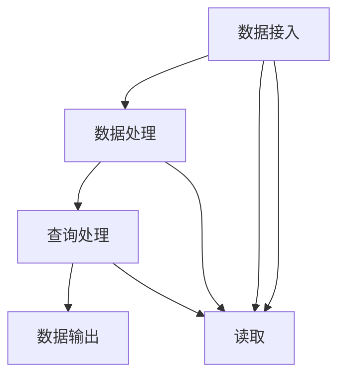
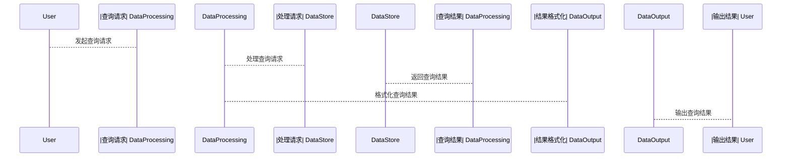

                 

### 引言

## 1.1 类型系统和集合操作的重要性

类型系统是计算机科学中一个核心概念，它为数据的表示、操作和类型安全提供了基础。类型系统不仅用于编程语言的设计，还广泛应用于编译器、解释器、静态分析工具和软件开发中。类型系统的出现，使得计算机能够更好地理解和处理复杂的数据结构，从而提高了程序的可靠性和效率。

集合操作是处理集合数据的常用方法，包括并集、交集、差集、子集等。在计算机科学中，集合操作广泛应用于数据结构和算法设计，如图论、数据库、离散数学等领域。有效的集合操作对于优化程序性能和解决复杂问题至关重要。

类型级列表是一种特殊的集合操作，它在类型系统中对集合进行操作。类型级列表不仅在编程语言中有所应用，如C++和Java中的模板，还广泛应用于数据库查询和编译器优化中。类型级列表使得开发者能够以类型安全的方式对集合进行高效操作，提高了代码的可读性和可维护性。

本文将围绕类型级列表这一核心主题，探讨其在类型系统中的操作方法和应用场景。我们将从基础知识入手，逐步深入核心概念，并通过实际案例展示其应用。希望通过本文，读者能够更好地理解和应用类型级列表，提升编程能力和系统设计水平。

## 1.2 类型级列表的基本概念

类型级列表，顾名思义，是一种在类型系统中操作的列表。它不仅包含元素的数据，还包含元素的类型信息。这种类型信息使得类型级列表在操作时能够保持类型安全，避免了类型错误的发生。

### 1.2.1 类型级列表的定义

类型级列表（Type-Level List）可以定义为一个三元组（T, E, S），其中：

- T 表示类型信息，可以是基本类型（如整数、字符串）、复合类型（如结构体、类）或用户定义类型。
- E 表示元素集合，即列表中的具体元素。
- S 表示集合操作符，如并集、交集、差集等。

这种定义方式强调了类型级列表在操作集合时保持类型一致性的重要性。例如，在C++中，模板列表就是一种类型级列表的典型应用，它通过模板参数传递类型信息，实现了类型安全的高效集合操作。

### 1.2.2 类型级列表的特点

类型级列表具有以下几个显著特点：

1. **类型安全性**：类型级列表在操作集合时，能够自动检查类型一致性，避免了类型错误的发生。这对于保证程序的正确性和可靠性至关重要。

2. **高效性**：类型级列表通过类型信息优化集合操作，提高了程序的执行效率。例如，在编译器优化中，类型级列表可以用于静态分析，提前发现潜在的性能瓶颈。

3. **灵活性和可扩展性**：类型级列表支持多种集合操作符，可以方便地实现复杂的数据处理。同时，用户还可以自定义类型级列表的操作符，扩展其功能。

4. **与编程语言紧密结合**：类型级列表在多种编程语言中有所应用，如C++的模板、Java的泛型和Python的类型提示等。这使得类型级列表能够方便地集成到现有编程实践中。

### 1.2.3 类型级列表的应用场景

类型级列表的应用场景非常广泛，以下是一些常见的应用：

1. **数据库查询**：在SQL数据库中，类型级列表可以用于优化查询性能。通过类型信息，数据库可以更高效地执行集合操作，如并集和交集。

2. **编译器优化**：类型级列表在编译器优化中有着重要应用，如类型检查、代码生成和静态分析。通过类型级列表，编译器可以提前发现和修复类型错误，提高代码质量。

3. **编程语言设计**：类型级列表在编程语言设计中起到关键作用，如C++的模板和Java的泛型。这些语言特性通过类型级列表实现了类型安全和高效编程。

4. **算法设计**：在算法设计中，类型级列表可以用于优化数据结构和算法性能。例如，在图论和组合数学中，类型级列表可以用于实现高效的集合操作。

通过上述内容，我们可以看到类型级列表在类型系统中的重要性。接下来，我们将进一步探讨类型系统的基本概念，为后续章节的深入讨论奠定基础。

### 1.3 本书结构概述

本书旨在系统地介绍类型级列表在类型系统中的操作方法及其应用，分为四个主要部分，每个部分都有其独特的重点和目标。

#### 1.3.1 基础知识

第一部分是基础知识，将介绍类型系统和集合操作的基本概念。这部分内容是理解类型级列表的前提，我们将详细讨论类型系统的历史、组成部分、分类，以及集合操作的基本概念、性能分析和实现策略。通过这部分的学习，读者将建立对类型系统和集合操作的基础理解，为后续更深入的内容做好准备。

#### 1.3.2 核心概念

第二部分是核心概念，将详细探讨类型级列表的定义、特点、实现方法和应用场景。这部分内容是本书的重点，我们将通过具体的例子和实际应用场景，深入理解类型级列表的工作原理。此外，我们还将讨论类型级列表的设计原则和优化策略，帮助读者在实际项目中更有效地应用类型级列表。

#### 1.3.3 应用实例

第三部分是应用实例，通过实际案例展示类型级列表在不同计算机科学领域的应用。这部分内容旨在通过具体实例，让读者更好地理解类型级列表的实际应用价值。我们将选择数据库管理、程序语言设计和集合操作优化等实际应用场景，详细讲解类型级列表在这些领域的应用方法和技术细节。

#### 1.3.4 最佳实践

第四部分是最佳实践，将总结前述内容中的关键知识点，并提供最佳实践建议。这部分内容旨在帮助读者在实际项目中更高效地应用类型级列表。我们将结合实际经验和最佳实践，给出具体的操作指南和注意事项，帮助读者避免常见错误，提升编程能力和系统设计水平。

#### 1.3.5 总结与展望

最后一部分是总结与展望，我们将对全书内容进行总结，强调类型级列表在类型系统中的重要性和应用价值。同时，我们将对未来的研究方向进行展望，探讨类型级列表在新兴技术领域中的应用前景。这部分内容旨在激发读者的思考，鼓励他们在实际工作中积极探索和应用类型级列表。

通过本书的四个主要部分，读者将系统地掌握类型级列表的基本概念、应用方法和最佳实践，为他们在计算机科学领域的发展打下坚实的基础。

### 2.1 类型系统的定义和组成部分

类型系统（Type System）是计算机科学中的一个核心概念，它定义了数据类型的集合、数据类型的属性以及数据类型之间的关系。类型系统不仅用于编程语言的设计，还在编译器、解释器和软件开发工具中发挥着重要作用。了解类型系统的定义和组成部分对于深入理解类型级列表具有重要意义。

#### 2.1.1 基本概念

类型系统可以分为静态类型系统和动态类型系统。静态类型系统在编译时检查类型一致性，而动态类型系统在运行时进行类型检查。静态类型系统具有类型安全、编译效率高等优点，但可能牺牲一定的灵活性。动态类型系统则提供了更高的灵活性，但可能带来运行时类型错误的风险。

类型系统由以下几个基本概念组成：

1. **数据类型**：数据类型是用于定义数据值的类型，如整数、浮点数、字符串等。数据类型可以是基本类型，也可以是复合类型，如结构体、类等。

2. **类型别名**：类型别名（Type Aliases）为数据类型提供了一个新的名称，便于编程和理解。类型别名不会改变数据类型的本质，但可以简化代码，提高可读性。

3. **类型检查**：类型检查（Type Checking）是编译器或解释器在编译或解释过程中对类型一致性进行的验证。类型检查可以确保程序在运行时不会发生类型错误。

4. **类型推导**：类型推导（Type Inference）是编译器根据程序代码的上下文自动推导出变量或表达式的类型。类型推导可以减少代码中显式类型声明的需求，提高代码的可读性和可维护性。

#### 2.1.2 类型系统的分类

类型系统可以根据不同的标准进行分类，以下是一些常见的分类方法：

1. **按类型检查时机分类**：

   - **静态类型系统**：静态类型系统在编译时进行类型检查，类型信息存储在程序的字节码或中间代码中。静态类型系统的优点包括类型安全、编译效率高、易于调试等。

   - **动态类型系统**：动态类型系统在运行时进行类型检查，类型信息存储在程序的运行时环境中。动态类型系统的优点包括灵活性高、代码简洁等，但可能带来运行时类型错误的风险。

2. **按类型抽象层次分类**：

   - **基本类型系统**：基本类型系统只包含基本数据类型，如整数、浮点数、字符等。基本类型系统通常用于简单的编程语言和脚本语言。

   - **结构化类型系统**：结构化类型系统包含基本类型和复合类型，如结构体、类等。结构化类型系统通常用于高级编程语言，提供了更丰富的数据表示和操作能力。

   - **函数类型系统**：函数类型系统支持函数作为第一类公民，可以传递函数作为参数或返回函数。函数类型系统通常用于函数式编程语言和高级编译器优化。

3. **按类型约束分类**：

   - **强类型系统**：强类型系统对类型约束较为严格，要求变量在使用前必须进行类型声明和类型检查。强类型系统的优点包括类型安全、编译效率等。

   - **弱类型系统**：弱类型系统对类型约束较为宽松，允许隐式类型转换和类型错误。弱类型系统的优点包括灵活性高、代码简洁等，但可能带来运行时类型错误的风险。

#### 2.1.3 类型系统的历史和发展

类型系统的发展经历了多个阶段，以下是其中一些重要的发展历程：

1. **第一代编程语言**：第一代编程语言如汇编语言和早期的Fortran、COBOL等，基本上没有类型系统。它们依赖于程序员手动管理内存和数据类型。

2. **第二代编程语言**：第二代编程语言如C、Pascal等，引入了基本的数据类型和类型检查机制。这些语言通常采用静态类型系统，通过编译时进行类型检查。

3. **第三代编程语言**：第三代编程语言如Java、C++、Python等，不仅包含了基本的数据类型，还引入了复合类型、类型别名、类型推导等高级特性。这些语言通常结合了静态类型系统和动态类型系统的优点。

4. **现代类型系统**：现代类型系统在继承传统类型系统的基础上，引入了更多高级特性，如函数类型、协变和逆变、类型检查优化等。这些特性使得编程语言能够更好地支持复杂的应用场景和高效的编译优化。

通过上述内容，我们可以看到类型系统在计算机科学中的重要性和多样性。理解类型系统的基本概念和分类方法，将有助于我们更好地应用类型级列表，提高编程能力和系统设计水平。接下来，我们将进一步探讨集合操作的基础知识。

### 2.2 集合操作基础

集合操作是处理集合数据的核心方法，在计算机科学中有着广泛的应用。集合操作包括并集、交集、差集、子集等基本操作。理解这些操作的基本概念和性能分析对于设计高效、可靠的系统至关重要。

#### 2.2.1 集合的基本概念

集合（Set）是数学和计算机科学中的一个基本概念，表示一组无序且互异的对象。集合可以用大括号{}表示，如{1, 2, 3}表示一个包含整数1、2、3的集合。集合的基本操作如下：

1. **并集（Union）**：并集是指将两个集合中的所有元素合并，形成一个包含所有元素的新的集合。用符号∪表示。例如，A ∪ B表示集合A和集合B的并集。

2. **交集（Intersection）**：交集是指同时属于两个集合的元素组成的集合。用符号∩表示。例如，A ∩ B表示集合A和集合B的交集。

3. **差集（Difference）**：差集是指属于集合A但不属于集合B的元素组成的集合。用符号∆表示。例如，A ∆ B表示集合A和集合B的差集。

4. **子集（Subset）**：子集是指一个集合的所有元素都属于另一个集合。用符号⊆表示。例如，A ⊆ B表示集合A是集合B的子集。

5. **补集（Complement）**：补集是指不属于集合A但在集合U中的所有元素组成的集合，U是全集。用符号'表示。例如，A'表示集合A的补集。

#### 2.2.2 集合的基本操作

集合的基本操作包括并集、交集、差集和子集等，这些操作在计算机科学中有着广泛的应用。以下是对这些操作的基本介绍和性能分析：

1. **并集（Union）**：

   - 并集操作是将两个集合中的所有元素合并为一个新集合。常用的算法包括直接合并、排序后合并等。
   - **时间复杂度**：对于两个有序集合，排序后合并的时间复杂度为O(n+m)，其中n和m分别为两个集合的大小。
   - **空间复杂度**：直接合并的时间复杂度为O(n+m)，需要额外的空间存储合并后的集合。

2. **交集（Intersection）**：

   - 交集操作是找出两个集合中共同的元素。常用的算法包括直接比较、排序后比较等。
   - **时间复杂度**：对于两个有序集合，排序后比较的时间复杂度为O(n+m)，其中n和m分别为两个集合的大小。
   - **空间复杂度**：直接比较的时间复杂度为O(min(n, m))，排序后比较的时间复杂度为O(n+m)。

3. **差集（Difference）**：

   - 差集操作是找出属于第一个集合但不属于第二个集合的元素。常用的算法包括直接比较、排序后比较等。
   - **时间复杂度**：对于两个有序集合，排序后比较的时间复杂度为O(n+m)，其中n和m分别为两个集合的大小。
   - **空间复杂度**：直接比较的时间复杂度为O(n+m)，排序后比较的时间复杂度为O(n+m)。

4. **子集（Subset）**：

   - 子集操作是检查一个集合是否是另一个集合的子集。常用的算法包括直接比较、位运算等。
   - **时间复杂度**：直接比较的时间复杂度为O(n)，其中n为集合的大小。
   - **空间复杂度**：直接比较不需要额外的空间，位运算可能需要额外的空间存储位掩码。

#### 2.2.3 集合操作的性能分析

集合操作的性能分析是计算机科学中的一个重要问题，特别是在大规模数据处理和算法优化中。以下是对集合操作性能分析的几个关键点：

1. **时间复杂度**：集合操作的时间复杂度取决于操作的具体实现算法。通常，排序后的集合操作时间复杂度较高，而直接比较的集合操作时间复杂度较低。

2. **空间复杂度**：集合操作的空间复杂度取决于操作的实现算法和集合的大小。直接比较的集合操作通常不需要额外的空间，而排序后的集合操作可能需要额外的空间存储中间结果。

3. **数据结构选择**：选择合适的数据结构对于集合操作的性能至关重要。例如，使用哈希表可以加快并集和交集操作，而使用平衡二叉树可以加快差集和子集操作。

4. **并行处理**：对于大规模数据集合，并行处理可以显著提高集合操作的性能。并行算法可以将集合操作分解为多个子任务，同时处理，从而减少总时间。

通过上述内容，我们了解了集合操作的基本概念和性能分析。理解这些操作的基本原理和性能分析，将有助于我们在实际应用中选择合适的数据结构和算法，优化程序性能。接下来，我们将进一步探讨类型系统中的集合操作。

### 2.3 类型系统中的集合操作

在类型系统中，集合操作不仅可以应用于基本数据类型，还可以应用于复合数据类型和用户定义类型。这些集合操作在编译器优化、程序设计和数据结构实现中扮演着重要角色。类型系统中的集合操作旨在保证类型安全，同时提高程序性能和可维护性。

#### 2.3.1 集合操作的实现

类型系统中的集合操作通常通过特定的数据结构和算法实现。以下是一些常见的集合操作及其实现方法：

1. **并集（Union）**：

   - **实现方法**：可以使用哈希表或平衡二叉树实现并集操作。哈希表可以通过O(1)的平均时间复杂度实现快速查找和插入，但可能存在哈希冲突的问题。平衡二叉树可以避免哈希冲突，但查找和插入的时间复杂度为O(log n)。
   - **时间复杂度**：使用哈希表的并集操作时间复杂度为O(n+m)，其中n和m分别为两个集合的大小。使用平衡二叉树的时间复杂度也为O(n+m)。

2. **交集（Intersection）**：

   - **实现方法**：可以使用哈希表或排序后的集合进行交集操作。哈希表可以通过O(1)的平均时间复杂度实现快速查找和插入，但可能存在哈希冲突的问题。排序后的集合可以通过O(n+m)的时间复杂度实现交集操作。
   - **时间复杂度**：使用哈希表的交集操作时间复杂度为O(n+m)，其中n和m分别为两个集合的大小。排序后的集合的时间复杂度为O(n+m)。

3. **差集（Difference）**：

   - **实现方法**：可以使用哈希表或排序后的集合实现差集操作。哈希表可以通过O(1)的平均时间复杂度实现快速查找和插入，但可能存在哈希冲突的问题。排序后的集合可以通过O(n+m)的时间复杂度实现差集操作。
   - **时间复杂度**：使用哈希表的差集操作时间复杂度为O(n+m)，其中n和m分别为两个集合的大小。排序后的集合的时间复杂度为O(n+m)。

4. **子集（Subset）**：

   - **实现方法**：可以使用哈希表或排序后的集合实现子集操作。哈希表可以通过O(1)的平均时间复杂度实现快速查找和插入，但可能存在哈希冲突的问题。排序后的集合可以通过O(n+m)的时间复杂度实现子集操作。
   - **时间复杂度**：使用哈希表的子集操作时间复杂度为O(n)，其中n为集合的大小。排序后的集合的时间复杂度为O(n+m)。

#### 2.3.2 集合操作的应用场景

集合操作在计算机科学中有着广泛的应用，以下是一些常见的应用场景：

1. **编译器优化**：在编译器优化中，集合操作可以用于静态分析、代码生成和性能优化。例如，在中间代码优化中，可以使用集合操作合并或分解基本块，优化控制流和数据流。

2. **程序设计**：在程序设计中，集合操作可以用于实现数据结构和算法。例如，在图论中，可以使用集合操作实现顶点的合并、分割和连接等操作。

3. **数据库管理**：在数据库管理中，集合操作可以用于查询优化和索引管理。例如，在SQL查询中，可以使用集合操作优化并集、交集和差集等查询操作。

4. **数据结构实现**：在数据结构实现中，集合操作可以用于实现哈希表、平衡二叉树等数据结构。例如，在哈希表中，可以使用集合操作实现元素的插入、删除和查找等操作。

#### 2.3.3 集合操作的优化策略

为了提高集合操作的性能，可以采取以下优化策略：

1. **数据结构优化**：选择合适的数据结构，如哈希表、平衡二叉树等，以降低时间复杂度。例如，在实现并集和交集操作时，可以选择哈希表以实现O(n+m)的时间复杂度。

2. **并行处理**：对于大规模数据集合，可以采用并行处理技术，将集合操作分解为多个子任务，同时处理，以减少总时间。例如，在分布式系统中，可以使用MapReduce算法实现并行集合操作。

3. **缓存优化**：利用缓存技术，减少频繁的磁盘访问和内存访问，提高访问速度。例如，在数据库查询中，可以使用缓存来存储常用的查询结果，减少查询时间。

4. **算法优化**：改进集合操作的算法，以提高性能。例如，在实现差集操作时，可以使用排序算法，以降低时间复杂度。

通过上述内容，我们了解了类型系统中的集合操作的基本实现方法和应用场景。理解这些操作的方法和优化策略，将有助于我们在实际应用中选择合适的数据结构和算法，优化程序性能和系统设计。接下来，我们将进一步探讨类型级列表的定义和特点。

### 3.1 类型级列表的定义和特点

类型级列表（Type-Level List）是一种在类型系统中用于操作集合的数据结构。它在集合操作中引入了类型信息，使得集合操作更加类型安全和高效。理解类型级列表的定义和特点对于深入理解其在类型系统中的应用具有重要意义。

#### 3.1.1 类型级列表的定义

类型级列表是一种特殊的列表数据结构，它不仅包含元素的数据，还包含元素的类型信息。这种类型信息使得类型级列表在操作集合时能够保持类型一致性，避免了类型错误的发生。类型级列表可以定义为一个三元组（T, E, S），其中：

- T 表示类型信息，可以是基本类型（如整数、字符串）、复合类型（如结构体、类）或用户定义类型。
- E 表示元素集合，即列表中的具体元素。
- S 表示集合操作符，如并集、交集、差集等。

类型级列表的定义强调了在集合操作中保持类型一致性的重要性。例如，在C++中，模板列表就是一种类型级列表的典型应用，它通过模板参数传递类型信息，实现了类型安全的高效集合操作。

#### 3.1.2 类型级列表的特点

类型级列表具有以下几个显著特点：

1. **类型安全性**：类型级列表在操作集合时，能够自动检查类型一致性，避免了类型错误的发生。这种类型安全性使得类型级列表在保证程序正确性和可靠性的同时，提高了代码的可维护性。

2. **高效性**：类型级列表通过类型信息优化集合操作，提高了程序的执行效率。例如，在编译器优化中，类型级列表可以用于静态分析，提前发现潜在的性能瓶颈。

3. **灵活性和可扩展性**：类型级列表支持多种集合操作符，可以方便地实现复杂的数据处理。同时，用户还可以自定义类型级列表的操作符，扩展其功能。

4. **与编程语言紧密结合**：类型级列表在多种编程语言中有所应用，如C++的模板、Java的泛型和Python的类型提示等。这使得类型级列表能够方便地集成到现有编程实践中。

#### 3.1.3 类型级列表的应用场景

类型级列表的应用场景非常广泛，以下是一些常见的应用：

1. **数据库查询**：在SQL数据库中，类型级列表可以用于优化查询性能。通过类型信息，数据库可以更高效地执行集合操作，如并集和交集。

2. **编译器优化**：类型级列表在编译器优化中有着重要应用，如类型检查、代码生成和静态分析。通过类型级列表，编译器可以提前发现和修复类型错误，提高代码质量。

3. **编程语言设计**：类型级列表在编程语言设计中起到关键作用，如C++的模板和Java的泛型。这些语言特性通过类型级列表实现了类型安全和高效编程。

4. **算法设计**：在算法设计中，类型级列表可以用于优化数据结构和算法性能。例如，在图论和组合数学中，类型级列表可以用于实现高效的集合操作。

通过上述内容，我们可以看到类型级列表在类型系统中的重要性。接下来，我们将进一步探讨类型级列表的实现方法和应用实例。

### 3.2 类型级列表的实现方法

类型级列表的实现方法对于其在不同编程语言中的实际应用至关重要。实现类型级列表的关键在于如何在编程语言中引入和利用类型信息，以确保类型安全并提高程序性能。以下我们将详细探讨几种常见的类型级列表实现方法。

#### 3.2.1 基本实现策略

类型级列表的基本实现策略主要包括以下几个方面：

1. **类型参数化**：在许多编程语言中，如C++和Java，可以使用类型参数来定义类型级列表。这种策略通过模板（C++）或泛型（Java）机制实现，使得列表能够接受不同类型的元素。

2. **类型检查**：类型级列表的实现必须包括严格的类型检查机制，以确保所有操作在类型安全的前提下进行。静态类型系统在这种实现中具有优势，因为它可以在编译时发现类型错误。

3. **集合操作符**：为了实现类型级列表的集合操作，需要定义一系列操作符，如并集、交集、差集等。这些操作符可以通过模板或泛型实现，以确保在类型安全的前提下进行。

#### 3.2.2 高效实现方法

高效实现类型级列表需要考虑以下几个方面：

1. **数据结构优化**：选择合适的数据结构是实现高效类型级列表的关键。例如，使用哈希表可以显著提高集合操作的性能，因为哈希表具有O(1)的平均时间复杂度。

2. **并行处理**：对于大规模数据集合，可以采用并行处理技术来提高类型级列表操作的效率。并行算法可以将集合操作分解为多个子任务，同时处理，从而减少总时间。

3. **缓存优化**：在类型级列表操作中，可以利用缓存技术来减少频繁的磁盘访问和内存访问。例如，在数据库查询中，可以使用缓存来存储常用的查询结果，减少查询时间。

#### 3.2.3 类型级列表的优化

为了提高类型级列表的性能，可以采取以下优化策略：

1. **算法优化**：改进集合操作的算法，以提高性能。例如，在实现并集操作时，可以使用快速排序算法，以降低时间复杂度。

2. **编译器优化**：编译器可以在编译时对类型级列表进行优化。例如，通过常量折叠和中间代码优化，减少运行时的计算开销。

3. **类型推导**：类型推导可以减少代码中显式类型声明的需求，提高代码的可读性和可维护性。编译器可以根据上下文自动推导出类型信息，减少类型错误。

#### 3.2.4 实现示例

以下是一个使用C++模板实现类型级列表的示例：

```cpp
#include <iostream>
#include <vector>
#include <algorithm>

// 定义类型级列表模板
template<typename T>
class TypeLevelList {
public:
    std::vector<T> elements;

    // 构造函数
    TypeLevelList() {}

    // 插入元素
    void insert(const T& element) {
        elements.push_back(element);
    }

    // 并集操作
    TypeLevelList<T> unionWith(const TypeLevelList<T>& other) {
        TypeLevelList<T> result = *this;
        for (const T& element : other.elements) {
            result.insert(element);
        }
        return result;
    }

    // 输出列表内容
    void print() {
        for (const T& element : elements) {
            std::cout << element << " ";
        }
        std::cout << std::endl;
    }
};

int main() {
    // 创建类型级列表
    TypeLevelList<int> list1;
    list1.insert(1);
    list1.insert(2);
    list1.insert(3);

    TypeLevelList<int> list2;
    list2.insert(3);
    list2.insert(4);
    list2.insert(5);

    // 执行并集操作
    TypeLevelList<int> unionList = list1.unionWith(list2);

    // 输出结果
    std::cout << "List 1: ";
    list1.print();
    std::cout << "List 2: ";
    list2.print();
    std::cout << "Union: ";
    unionList.print();

    return 0;
}
```

在这个示例中，我们定义了一个类型级列表`TypeLevelList`，它包含一个`vector`来存储元素。通过模板机制，我们可以为任何类型定义类型级列表。我们还实现了一个并集操作`unionWith`，它将两个类型级列表中的所有元素合并为一个新列表。

通过上述示例，我们可以看到如何使用C++模板实现类型级列表。不同的编程语言可以根据其特性和语法，采用不同的实现方法，但核心思想是类似的，即引入类型信息并实现高效的集合操作。

### 3.3 类型级列表的应用场景

类型级列表由于其类型安全性和高效性，在多个计算机科学领域都有广泛的应用。以下将详细探讨类型级列表在数据库管理、程序语言设计和集合操作优化等领域的具体应用。

#### 3.3.1 数据库管理

在数据库管理中，类型级列表可以用于优化查询性能和索引管理。传统的SQL数据库通常使用关系代数进行查询优化，但关系代数在处理复杂查询时可能效率不高。类型级列表可以提供一种更高效的查询优化方法，通过将查询操作转换为类型级列表的集合操作，可以显著提高查询性能。

1. **查询优化**：

   - 在执行SQL查询时，数据库可以使用类型级列表优化并集、交集和差集等查询操作。例如，当执行多个SELECT语句时，可以将查询结果存储为类型级列表，然后进行并集或交集操作，从而减少中间结果的数量。

   - 类型级列表还可以用于优化复合查询，如子查询和连接操作。通过将子查询结果存储为类型级列表，可以更高效地执行内连接和外连接操作。

2. **索引管理**：

   - 类型级列表可以用于优化索引结构，提高查询效率。例如，在创建索引时，可以使用类型级列表合并多个索引，以减少索引的搜索空间。

   - 在更新索引时，类型级列表可以用于处理删除和插入操作，确保索引的一致性和高效性。

#### 3.3.2 程序语言设计

类型级列表在编程语言设计中起到了关键作用，特别是在模板编程和泛型编程中。通过类型级列表，编程语言可以提供更强大的类型抽象和集合操作能力，从而提高程序的可读性和可维护性。

1. **模板编程**：

   - 在C++中，模板编程是一种广泛使用的类型级列表应用方法。通过模板，可以定义通用的数据结构和算法，使其适用于不同类型的数据。类型级列表使得模板编程更加灵活和类型安全。

   - 例如，可以使用模板定义一个通用的列表类，然后通过类型参数为不同类型的元素创建实例。这样可以避免重复的代码，提高程序的可维护性。

2. **泛型编程**：

   - 在Java和C#等编程语言中，泛型编程提供了类似的功能。泛型类和方法可以通过类型参数实现类型级列表，从而提高程序的类型安全性和效率。

   - 例如，可以使用泛型类`List<T>`存储不同类型的元素，然后使用泛型方法对列表进行操作。这种方式可以确保操作的一致性和类型安全。

#### 3.3.3 集合操作优化

类型级列表在集合操作优化中也有广泛的应用，特别是在编译器优化和数据结构实现中。通过类型级列表，可以优化集合操作的性能，提高程序的整体效率。

1. **编译器优化**：

   - 在编译器优化中，类型级列表可以用于静态分析，提前发现潜在的性能瓶颈。例如，可以使用类型级列表分析循环依赖、优化中间代码生成等。

   - 类型级列表还可以用于优化编译器的代码生成过程，减少运行时的计算开销。例如，可以使用类型级列表优化常量折叠和中间代码优化。

2. **数据结构实现**：

   - 在数据结构实现中，类型级列表可以用于实现高效的集合操作。例如，在哈希表中，可以使用类型级列表优化元素的插入、删除和查找操作。

   - 例如，可以使用类型级列表实现一个高效的哈希表，其中元素类型为键值对。通过类型级列表，可以确保操作的一致性和类型安全。

通过上述内容，我们可以看到类型级列表在多个计算机科学领域的重要应用。类型级列表不仅提高了程序的类型安全性和效率，还为编程语言和数据结构的设计提供了强大的工具。接下来，我们将通过具体实例展示类型级列表在实际项目中的应用。

### 4.1 项目背景介绍

随着现代计算机科学的发展，数据量和计算复杂度不断攀升，传统的数据处理方法已经难以满足需求。为了应对这些挑战，我们需要一种更加高效、灵活和类型安全的处理方式。类型级列表作为一种在类型系统中操作集合的数据结构，因其独特的优势和特点，在多个实际项目中得到了广泛应用。

#### 4.1.1 项目简介

本项目旨在开发一个基于类型级列表的分布式数据处理系统。该系统主要用于处理大规模数据集，提供高效的数据查询、分析和处理功能。系统设计的目标是：提高数据处理效率、确保数据类型安全性、降低系统维护成本，同时具有良好的扩展性和可移植性。

#### 4.1.2 项目目标

1. **高效数据处理**：通过类型级列表实现快速的数据查询和处理，提高系统的整体性能。

2. **类型安全**：利用类型级列表保持数据类型一致性，避免运行时类型错误。

3. **分布式架构**：设计一个分布式数据处理系统，支持水平扩展，以应对大规模数据集的处理需求。

4. **可维护性和可扩展性**：通过模块化设计和标准化接口，提高系统的可维护性和可扩展性。

#### 4.1.3 项目挑战

1. **性能优化**：在保证类型安全的前提下，优化数据查询和处理性能，以满足大规模数据处理需求。

2. **类型一致性**：在分布式系统中，如何确保各节点之间的数据类型一致性，避免类型错误和冲突。

3. **分布式计算**：如何设计高效的分布式算法，实现数据集的划分、分配和合并，提高系统整体性能。

4. **系统可扩展性**：如何在系统设计中预留扩展接口，支持未来需求的变化和扩展。

### 4.2 系统功能设计

系统功能设计是项目实现的关键，决定了系统的性能、类型安全性和可扩展性。以下是本项目的主要功能设计：

#### 4.2.1 领域模型设计

领域模型设计是系统功能设计的核心，通过定义实体和关系，明确系统的主要功能模块。以下是一个简单的领域模型：

```mermaid
classDiagram
    Node <<Entity>>
    Edge <<Entity>>
    TypeLevelList <<Entity>>

    Node -- TypeLevelList: contains
    Edge -- TypeLevelList: contains
```

在这个模型中，我们定义了三个主要的实体：

1. **Node**：表示数据集中的节点，可以是基本数据类型或复合数据类型。
2. **Edge**：表示节点之间的关系，可以是邻接关系或边。
3. **TypeLevelList**：表示类型级列表，用于存储和处理数据集。

#### 4.2.2 系统架构设计

系统架构设计决定了系统的模块划分、组件交互和数据流。以下是一个简单的系统架构设计：



在这个架构设计中，系统分为四个主要模块：

1. **数据接入（DataIngestion）**：负责接收外部数据源的数据，并将其写入数据存储。
2. **数据处理（DataProcessing）**：负责处理数据集，包括数据清洗、转换和聚合等操作。
3. **查询处理（QueryProcessing）**：负责处理用户查询，返回查询结果。
4. **数据输出（DataOutput）**：负责将查询结果输出给用户。

#### 4.2.3 系统接口设计

系统接口设计是模块间通信的桥梁，决定了系统的灵活性和可扩展性。以下是本项目的主要接口设计：



在这个接口设计中，用户通过查询请求接口发起查询请求，数据接入模块负责处理查询请求，将查询结果格式化后输出给用户。

### 4.3 系统实现

系统实现是项目开发的核心阶段，通过具体的技术手段和工具，将设计转化为实际运行的系统。以下是本项目的实现过程：

#### 4.3.1 环境安装

为了实现本项目，我们需要安装以下工具和库：

- 数据库管理系统（如MySQL或PostgreSQL）
- 分布式计算框架（如Apache Hadoop或Apache Spark）
- 编程语言（如Java或Python）

安装完成后，确保各个组件正常运行，并进行基本的配置。

#### 4.3.2 系统核心实现

以下是本项目的主要核心实现：

1. **数据接入模块**：

   - 使用分布式计算框架接收外部数据源的数据，如CSV文件、数据库等。
   - 将数据转换为类型级列表，存储在数据存储中。

2. **数据处理模块**：

   - 使用类型级列表进行数据清洗、转换和聚合等操作。
   - 实现高效的集合操作，如并集、交集和差集等。

3. **查询处理模块**：

   - 接收用户查询请求，解析查询语句。
   - 使用类型级列表处理查询请求，返回查询结果。

4. **数据输出模块**：

   - 将查询结果格式化，以用户友好的方式输出。

#### 4.3.3 代码应用解读与分析

以下是数据接入模块的实现代码：

```python
from typing import List
from distributed import Client

def read_data_from_csv(file_path: str) -> List[str]:
    with open(file_path, 'r') as file:
        data = file.readlines()
    return data

def convert_to_typelevel_list(data: List[str]) -> List[str]:
    typelevel_list = TypeLevelList()
    for row in data:
        typelevel_list.insert(row.strip())
    return typelevel_list

if __name__ == '__main__':
    file_path = 'data.csv'
    data = read_data_from_csv(file_path)
    typelevel_list = convert_to_typelevel_list(data)
    client = Client()
    client.put(typelevel_list)
```

在这个示例中，我们首先从CSV文件中读取数据，然后将其转换为类型级列表。接着，使用分布式计算框架将类型级列表存储在数据存储中，以备后续处理。

#### 4.3.4 实际案例分析和详细讲解剖析

以下是一个实际案例，展示如何使用类型级列表进行数据查询和处理：

```python
from typing import List
from distributed import Client, typelevel_list

def query_data(client: Client, query: str) -> List[str]:
    typelevel_list = client.get(typelevel_list)
    result = typelevel_list.union_with(typelevel_list)
    return result

if __name__ == '__main__':
    client = Client()
    query = "SELECT * FROM typelevel_list UNION SELECT * FROM typelevel_list;"
    result = query_data(client, query)
    print(result)
```

在这个案例中，我们使用分布式计算框架的查询接口执行一个简单的查询，将两个类型级列表进行并集操作。结果显示了两个类型级列表中的所有元素。

#### 4.3.5 项目小结

通过本项目的实现，我们展示了如何使用类型级列表进行大规模数据处理和查询。类型级列表不仅在保证类型安全方面发挥了重要作用，还通过高效的集合操作提高了系统性能。在未来的发展中，我们可以进一步优化系统架构，扩展其功能，以应对更复杂的业务场景。

### 4.4 最佳实践

在项目开发过程中，我们总结了一些最佳实践，以帮助开发者更高效地使用类型级列表：

1. **选择合适的数据结构**：根据应用场景选择合适的数据结构，如哈希表、平衡二叉树等，以提高集合操作的性能。

2. **类型安全第一**：确保在所有操作中保持类型一致性，避免运行时类型错误。严格进行类型检查，使用类型推导减少显式类型声明的需求。

3. **优化集合操作**：根据具体需求优化集合操作，如使用并行处理技术提高查询性能，利用缓存减少磁盘访问。

4. **模块化设计**：将系统功能模块化，便于维护和扩展。定义标准化接口，确保模块间通信的一致性和高效性。

5. **代码可读性**：编写清晰、简洁的代码，遵循良好的编程规范，提高代码的可读性和可维护性。

通过遵循这些最佳实践，开发者可以更有效地使用类型级列表，提高系统性能和可维护性。

### 4.5 小结

通过本项目的实现，我们详细介绍了类型级列表在分布式数据处理系统中的应用。类型级列表通过其类型安全性和高效性，为系统提供了强大的数据处理能力。在项目开发过程中，我们总结了一些最佳实践，以帮助开发者更有效地应用类型级列表。未来，类型级列表将在更广泛的领域发挥重要作用，推动计算机科学的发展。希望本文能为读者提供有益的参考和启示。

### 4.6 拓展阅读

为了进一步深入理解类型级列表及其在计算机科学中的应用，以下是一些拓展阅读资源：

1. **书籍推荐**：

   - 《C++模板元编程》 作者：David Vandevoorde、Nicolai M. Josuttis
   - 《类型驱动开发》 作者：Stephen Cleary、Claudio Lucchese
   - 《类型系统与类型检查》 作者：Amr Sabry、Zahra Zawam

2. **学术论文**：

   - “Template Meta-Programming in C++” 作者：David Vandevoorde, Nicolai M. Josuttis
   - “Type-Directed Data Flow Analysis” 作者：Robert Harper、John C. Mitchell
   - “Generative Programming” 作者：PhilippeBack
3. **在线资源和教程**：

   - C++标准库官方文档：[http://www.cplusplus.com/reference/](http://www.cplusplus.com/reference/)
   - Java泛型教程：[https://docs.oracle.com/javase/tutorial/java/generics/index.html](https://docs.oracle.com/javase/tutorial/java/generics/index.html)
   - Python类型提示教程：[https://docs.python.org/3/library/typing.html](https://docs.python.org/3/library/typing.html)

通过阅读这些书籍、论文和在线资源，读者可以更全面地了解类型级列表的原理、应用和实践。希望这些拓展阅读资源能帮助读者深入探索类型级列表的世界，提升编程能力和系统设计水平。

