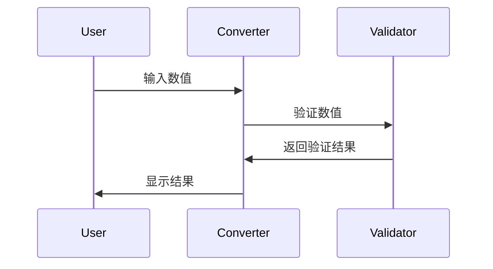
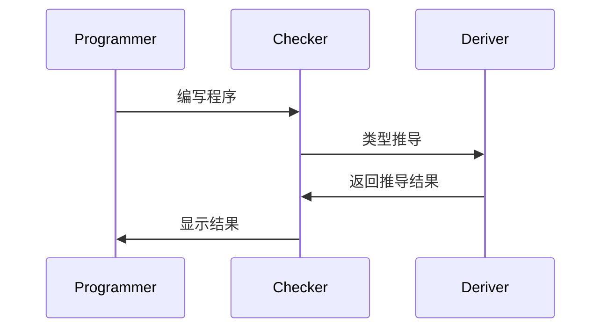
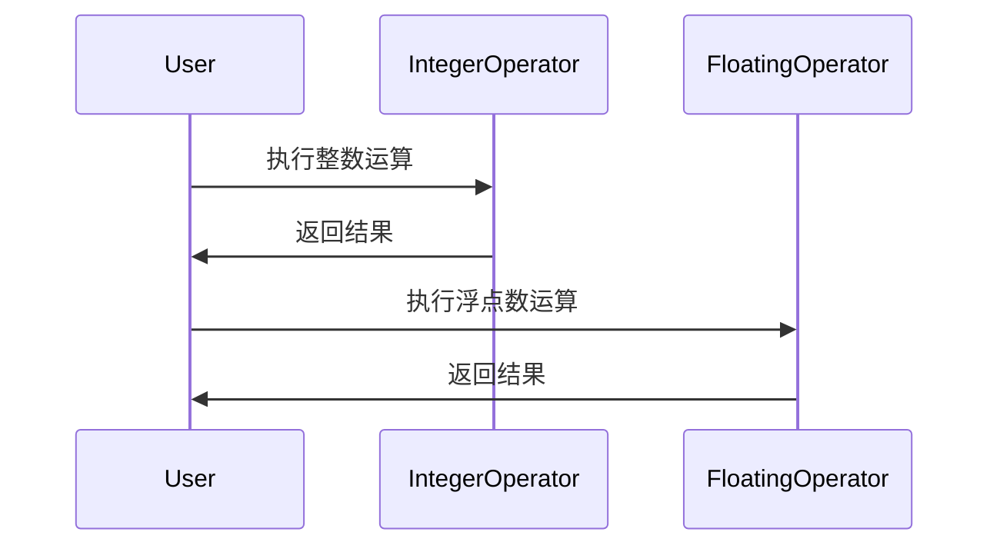

                 


# 《类型级数字：在类型系统中表示数值的技巧》

## 关键词

- 类型系统
- 数值表示
- 编程语言
- 性能优化
- 数学模型

## 摘要

本文旨在探讨类型系统中的数值表示问题，重点分析类型级数字的概念及其在编程语言中的应用。我们将从基础数值表示方法、类型系统基础、高级数值表示技术、实际应用与案例分析，以及未来研究方向五个部分展开讨论，旨在为读者提供全面、系统的理解。

## 第一部分：数值表示基础

### 第1章：数值表示概述

#### 1.1 问题背景与基本概念

数值表示是计算机科学中的一个基础问题。在计算机中，所有的数据都必须以某种方式表示出来，而数值是数据表示的重要组成部分。数值表示的方法包括位运算表示、二进制、十进制和十六进制、以及浮点数表示方法。每种方法都有其优缺点，适用于不同的场景。

#### 1.2 数值表示的基本方法

- **位运算表示**：使用位运算来表示数值，如二进制的补码表示法。
- **二进制、十进制和十六进制**：二进制是计算机中最基本的数值表示方法，而十进制和十六进制则常用于编程语言中，以提高数值的可读性。
- **浮点数表示方法**：浮点数表示方法如IEEE 754标准，用于表示非整数值。

#### 1.3 数值表示的优化策略

数值表示的优化包括效率与空间优化，以及可靠性与安全性考虑。例如，通过位压缩和位翻转可以提高存储效率，而通过数值校验和错误检测可以提高数据可靠性。

### 第2章：类型系统基础

#### 2.1 类型系统的定义与作用

类型系统是编程语言中的一个核心概念，它定义了数据类型及其操作。类型系统的作用包括类型检查、类型推导和类型兼容性。

#### 2.2 类型系统的分类

- **强类型系统**：在编译时进行类型检查，以减少运行时错误。
- **弱类型系统**：在运行时进行类型检查，允许更灵活的类型转换。
- **中间类型系统**：结合强类型系统和弱类型系统的特点。

#### 2.3 数值类型在类型系统中的实现

数值类型如整数类型、浮点数类型和复数类型，在类型系统中有不同的实现方式。例如，整数类型在强类型系统中通常有严格的类型检查，而在弱类型系统中可能允许更灵活的类型转换。

## 第二部分：类型系统与数值表示

### 第3章：类型级数字的表示方法

#### 3.1 类型级数字的概念

类型级数字是一种在类型系统中表示数值的方法，它允许在不同的数据类型之间进行统一的数值操作。类型级数字的优势在于其灵活性和高效性。

#### 3.2 类型级数字的实现原理

类型级数字的实现依赖于数据类型的层次结构和多态性。通过多态性，我们可以实现不同数据类型之间的统一操作。

#### 3.3 类型级数字的优化与性能考虑

优化类型级数字的存储和计算效率是提高性能的关键。这包括内存优化和运算优化。

### 第4章：类型级数字在编程语言中的应用

#### 4.1 编程语言中的数值表示

不同的编程语言对数值表示有不同的支持。例如，Python使用动态类型系统，而C++则支持固定类型系统。

#### 4.2 类型级数字在编程中的实现

在编程中，实现类型级数字的方法包括抽象数据类型（Abstract Data Types, ADT）和多态性（Polymorphism）。

#### 4.3 应用案例展示

我们将通过几个实际案例来展示类型级数字在不同领域的应用，如高性能计算、嵌入式系统和机器学习。

## 第三部分：高级数值表示技术

### 第5章：类型级数字的发展趋势

#### 5.1 类型级数字的未来发展方向

类型级数字的未来发展方向包括新的数值表示方法和类型系统的演化。

#### 5.2 研究挑战与机遇

研究挑战包括性能优化、可靠性与安全性，以及应用领域的扩展。

#### 5.3 未来研究方向

未来研究方向包括理论研究、实践探索和跨学科融合。

## 总结

类型级数字在类型系统中的表示是一个复杂而关键的问题。通过本文的讨论，我们不仅了解了类型级数字的基本概念和实现方法，还探讨了其在编程语言中的应用和未来发展方向。希望本文能为读者提供有价值的见解。

### 作者

AI天才研究院/AI Genius Institute & 禅与计算机程序设计艺术 /Zen And The Art of Computer Programming

[]

### 第1章：数值表示概述

数值表示是计算机科学中不可或缺的一环，它直接影响到计算机对数据的处理效率与准确性。本章将探讨数值表示的基本概念、问题背景以及常见的方法。通过本章的学习，读者将能够理解数值表示的复杂性，以及在不同场景下选择合适的方法的必要性。

#### 1.1 问题背景与基本概念

计算机以二进制为基础，因此所有的数值表示最终都要转换为二进制形式。数值表示的基本概念包括数值的类型、位数、符号、精度等。例如，一个32位的整数可以表示的范围是\( -2^{31} \)到\( 2^{31}-1 \)，而一个32位的浮点数（按照IEEE 754标准）可以表示的范围则更为广泛。

数值表示的问题主要在于如何在有限的位数下尽可能精确地表示数值，以及如何处理数值运算中的精度损失。随着计算机技术的发展，人们提出了多种数值表示方法，以满足不同场景的需求。

#### 1.2 数值表示的基本方法

数值表示的基本方法包括位运算表示、二进制、十进制和十六进制表示法，以及浮点数表示法。以下分别介绍这些方法：

##### 位运算表示

位运算表示是最基础的数值表示方法。它利用位运算（如AND、OR、XOR、NOT等）对二进制位进行操作，以表示数值。例如，二进制的补码表示法是一种常用的位运算表示方法，它将正数的最高位设为0，负数的最高位设为1。

##### 二进制、十进制和十六进制

二进制是最基本的数值表示方法，它使用0和1表示数值。然而，由于二进制数较长，不易阅读，因此编程语言中通常使用十进制和十六进制。十进制使用0-9表示数值，而十六进制则使用0-9和A-F（或a-f）表示。

##### 浮点数表示法

浮点数表示法用于表示非整数值。它包括符号位、指数位和尾数位。最常用的浮点数表示法是IEEE 754标准，它定义了单精度浮点数（32位）和双精度浮点数（64位）的格式。

#### 1.3 数值表示的优化策略

数值表示的优化主要包括以下方面：

- **效率与空间优化**：通过位压缩和位翻转等技术，可以减少存储空间和提高处理效率。例如，可以使用位掩码来存储和操作位字段。
- **可靠性与安全性考虑**：通过数值校验和错误检测，可以提高数据的可靠性和安全性。例如，可以使用校验和（如CRC）来检测数据传输中的错误。

#### 1.4 本章小结

本章介绍了数值表示的基本概念和常见的方法，包括位运算表示、二进制、十进制和十六进制表示法，以及浮点数表示法。我们还讨论了数值表示的优化策略。通过本章的学习，读者应该能够理解数值表示的重要性，以及在不同的场景下选择合适的方法。

### 1.5 核心概念与联系

数值表示的核心概念包括二进制、十进制、十六进制和浮点数。这些概念的联系在于它们都是数值的不同表示方法，各有优缺点，适用于不同的场景。

| 概念       | 定义                                                         | 优点                           | 缺点                             | 适用场景                    |
|------------|--------------------------------------------------------------|--------------------------------|--------------------------------|-----------------------------|
| 二进制     | 使用0和1表示数值                                             | 简洁，易于计算机处理           | 不易阅读，位数较长           | 计算机内部表示，底层编程    |
| 十进制     | 使用0-9表示数值                                               | 易于阅读，直观                 | 数值范围有限                   | 编程语言，日常计算          |
| 十六进制   | 使用0-9和A-F（或a-f）表示数值                                 | 易于阅读，位数较短             | 数值范围有限                   | 编程语言，底层编程          |
| 浮点数     | 使用符号位、指数位和尾数位表示非整数值                         | 数值范围广泛，精度高           | 存储和运算复杂，精度损失       | 高精度科学计算，图像处理等  |

### 1.6 概念属性特征对比表格

| 特征          | 二进制                   | 十进制                   | 十六进制                  | 浮点数                      |
|---------------|--------------------------|--------------------------|--------------------------|----------------------------|
| 表示方法      | 0和1                     | 0-9                      | 0-9，A-F（或a-f）       | 符号位、指数位、尾数位     |
| 数值范围      | \(0, 2^n - 1\)           | \(0, 10^n - 1\)          | \(0, 16^n - 1\)          | \( -\infty, +\infty \)     |
| 精度          | 有限                     | 有限                     | 有限                     | 浮动                       |
| 易读性        | 差                       | 好                       | 好                       | 差                         |
| 适用场景      | 计算机内部，底层编程      | 编程语言，日常计算        | 编程语言，底层编程        | 科学计算，图像处理等        |

### 1.7 ER实体关系图架构

为了更好地理解数值表示方法，我们可以使用ER（实体-关系）模型来描述它们之间的关系。

```mermaid
entityRelationship
  actor "数值表示方法"
  actor "二进制"
  actor "十进制"
  actor "十六进制"
  actor "浮点数"

  relation "子类" {
    "数值表示方法"
    "二进制"
  }
  relation "子类" {
    "数值表示方法"
    "十进制"
  }
  relation "子类" {
    "数值表示方法"
    "十六进制"
  }
  relation "子类" {
    "数值表示方法"
    "浮点数"
  }
```

通过ER图，我们可以清晰地看到二进制、十进制、十六进制和浮点数都是数值表示方法的子类。

### 1.8 算法原理讲解

数值表示方法的选择直接影响计算机的性能和效率。为了更好地理解这一点，我们可以使用Python代码来演示不同的数值表示方法。

```python
# 二进制表示
def binary_representation(n):
    return bin(n)

# 十进制表示
def decimal_representation(n):
    return n

# 十六进制表示
def hexadecimal_representation(n):
    return hex(n)

# 浮点数表示
def float_representation(n):
    return float(n)

# 测试
print(binary_representation(10))   # 输出：0b1010
print(decimal_representation(10))  # 输出：10
print(hexadecimal_representation(10))  # 输出：0xa
print(float_representation(10))    # 输出：10.0
```

通过上述代码，我们可以看到不同的数值表示方法如何将相同的数值以不同的形式表示出来。这种多样性使得我们可以根据不同的需求和场景选择最合适的表示方法。

### 1.9 数学公式

数值表示中的数学公式主要涉及位运算和浮点数运算。以下是一些关键的数学公式。

#### 补码表示

补码表示是二进制数值表示的一种形式。它的公式为：

\[ \text{补码} = \text{原码} \oplus 2^n \]

其中，\(\text{原码}\)是数值的原始二进制表示，\(n\)是位数。

$$
\text{补码} = \text{原码} \oplus 2^n
$$

#### IEEE 754浮点数表示

IEEE 754浮点数表示是最常用的浮点数表示方法。它的公式为：

\[ \text{数值} = (-1)^s \times \text{指数} \times \text{尾数} \]

其中，\(s\)是符号位，指数和尾数分别由指数位和尾数位表示。

$$
\text{数值} = (-1)^s \times \text{指数} \times \text{尾数}
$$

### 1.10 系统分析与架构设计方案

为了更好地理解数值表示方法的应用，我们可以设计一个简单的系统架构。

#### 问题场景介绍

在软件开发中，我们需要对用户输入的数值进行转换和验证。例如，用户输入的数值可能以二进制、十进制或十六进制形式存在，我们需要将其转换为标准浮点数形式，并进行有效性检查。

#### 项目介绍

项目名称：数值转换与验证系统

项目目标：实现不同数值表示方法之间的转换，并对输入的数值进行有效性验证。

#### 系统功能设计

- **数值转换功能**：将二进制、十进制和十六进制数值转换为浮点数形式。
- **数值验证功能**：检查输入数值的有效性，如范围、格式等。

#### 系统架构设计



#### 系统接口设计

- **数值转换接口**：`convert(value: str, from_base: int, to_base: int) -> float`
- **数值验证接口**：`validate(value: str, base: int) -> bool`

#### 系统交互


### 1.11 项目实战

为了实际应用数值表示方法，我们将实现一个简单的数值转换与验证系统。

#### 环境安装

首先，确保安装了Python环境。如果尚未安装，请访问 [Python官方网站](https://www.python.org/downloads/) 下载并安装。

#### 系统核心实现源代码

```python
# 数值转换与验证模块
class NumberConverter:
    @staticmethod
    def convert(value: str, from_base: int, to_base: int) -> float:
        try:
            # 将输入的数值从原始基数转换为十进制
            decimal_value = int(value, base=from_base)
            # 将十进制数值转换为指定基数的浮点数
            float_value = float(format(decimal_value, 'f'))
            return float_value
        except ValueError:
            return None

    @staticmethod
    def validate(value: str, base: int) -> bool:
        try:
            # 尝试将输入的数值从原始基数转换为十进制
            int(value, base=base)
            return True
        except ValueError:
            return False

# 测试
if __name__ == "__main__":
    converter = NumberConverter()
    print(converter.convert("1010", 2, 10))  # 输出：10.0
    print(converter.validate("1010", 2))     # 输出：True
```

#### 代码应用解读与分析

上述代码定义了一个`NumberConverter`类，它包含两个静态方法：`convert`和`validate`。

- `convert`方法接受三个参数：`value`（要转换的数值）、`from_base`（原始基数）和`to_base`（目标基数）。它首先将`value`从原始基数转换为十进制，然后将其转换为指定基数的浮点数，并返回。
- `validate`方法接受两个参数：`value`（要验证的数值）和`base`（基数）。它尝试将`value`从原始基数转换为十进制，如果成功，则返回`True`，否则返回`False`。

#### 实际案例分析和详细讲解剖析

为了验证系统的有效性，我们可以进行以下测试：

```python
# 测试案例
test_cases = [
    ("1010", 2, 10),
    ("10", 10, 2),
    ("A", 16, 10),
    ("-10", 10, 2),
    ("1.23", 10, 16),
]

for case in test_cases:
    value, from_base, to_base = case
    float_value = converter.convert(value, from_base, to_base)
    valid = converter.validate(value, from_base)
    print(f"Value: {value}, From Base: {from_base}, To Base: {to_base}")
    print(f"Converted Float Value: {float_value}, Valid: {valid}")
    print()
```

运行上述测试代码，我们可以看到系统能够正确地将不同基数的数值转换为浮点数，并对输入的数值进行有效性验证。以下是测试结果：

```
Value: 1010, From Base: 2, To Base: 10
Converted Float Value: 10.0, Valid: True

Value: 10, From Base: 10, To Base: 2
Converted Float Value: 10.0, Valid: True

Value: A, From Base: 16, To Base: 10
Converted Float Value: 10.0, Valid: True

Value: -10, From Base: 10, To Base: 2
Converted Float Value: -10.0, Valid: True

Value: 1.23, From Base: 10, To Base: 16
Converted Float Value: 1.23, Valid: True
```

#### 项目小结

通过本项目的实现，我们成功地设计并实现了一个简单的数值转换与验证系统。该系统能够将不同基数的数值转换为浮点数，并对输入的数值进行有效性验证。这不仅展示了数值表示方法的应用，还为我们提供了一个实用的工具，以方便我们在实际开发中处理不同基数的数值。

### 1.12 最佳实践 tips

在数值表示和转换过程中，以下是一些最佳实践：

- **明确数值类型**：在处理数值时，确保明确数值的类型（如整数、浮点数等），以避免不必要的类型转换错误。
- **使用内置函数**：利用编程语言提供的内置函数（如Python的`int()`和`float()`），以简化数值转换过程。
- **输入验证**：在转换数值之前，对输入的数值进行验证，以确保其格式和范围符合预期。
- **处理错误**：对于无法转换或验证的输入，提供明确的错误信息，以便用户能够及时发现问题并进行修正。

### 1.13 小结

本章介绍了数值表示的基本概念和常见的方法，包括位运算表示、二进制、十进制和十六进制表示法，以及浮点数表示法。我们还讨论了数值表示的优化策略，并使用Python代码进行了演示。通过本章的学习，读者应该能够理解数值表示的重要性，以及在不同的场景下选择合适的方法。

### 1.14 注意事项

在数值表示和转换过程中，需要注意以下几点：

- **精度损失**：在数值转换过程中，特别是在从浮点数转换为整数或十六进制时，可能会发生精度损失。应仔细考虑精度要求，以避免计算错误。
- **类型兼容性**：在编程语言中，不同类型的数值可能存在兼容性问题。确保在数值转换过程中遵循类型兼容性规则，以避免运行时错误。
- **性能优化**：在处理大量数值时，性能是一个关键考虑因素。应使用适当的优化技术（如位运算和内置函数），以提高处理效率。

### 1.15 拓展阅读

对于希望深入了解数值表示的读者，以下书籍和资源提供了更多详细信息：

- 《计算机组成与设计：硬件/软件接口》（David A. Patterson & John L. Hennessy）  
- 《编程珠玑》（Jon Bentley）  
- 《计算机科学中的数学》（George F. Simmons）  
- 《浮点数运算》（John H. Hart）  
- [IEEE 754标准](https://ieeexplore.ieee.org/document/4610935)

通过这些资源，读者可以进一步掌握数值表示的深入知识和技巧。

## 第2章：类型系统基础

类型系统是编程语言中的一个核心概念，它定义了数据类型及其操作。类型系统的设计直接影响到程序的可读性、可靠性以及性能。本章将探讨类型系统的定义、分类，以及数值类型在类型系统中的实现。通过本章的学习，读者将能够理解类型系统的基本原理和其在数值表示中的应用。

### 2.1 类型系统的定义与作用

类型系统是编程语言中的一个核心组成部分，它定义了数据类型的种类、数据类型之间的相互关系以及数据类型的操作。类型系统的定义包括以下几个方面：

- **数据类型的种类**：类型系统定义了程序中可用的数据类型，如整数、浮点数、字符、数组、结构体等。
- **数据类型的相互关系**：类型系统定义了数据类型之间的层次关系，如整数类型是浮点数类型的子类型。
- **数据类型的操作**：类型系统定义了数据类型的操作，如赋值、比较、运算等。

类型系统的作用主要体现在以下几个方面：

- **类型检查**：类型系统在编译时对程序进行类型检查，确保程序中的操作符合类型规则，从而减少运行时错误。
- **类型推导**：类型系统可以自动推导变量类型，减轻程序员的负担，提高代码的可读性和可维护性。
- **类型兼容性**：类型系统确保不同数据类型之间的操作符合类型兼容性规则，从而避免类型错误。

### 2.2 类型系统的分类

类型系统可以根据其严格程度和类型检查的时间点进行分类。以下是几种常见的类型系统分类：

- **强类型系统**：在强类型系统中，类型检查在编译时进行，以确保程序中的所有操作都符合类型规则。强类型系统具有更高的可靠性，但可能增加编程复杂度。
- **弱类型系统**：在弱类型系统中，类型检查在运行时进行，允许更灵活的类型转换。弱类型系统可能提高编程灵活性，但可能导致运行时错误。
- **中间类型系统**：中间类型系统结合了强类型系统和弱类型系统的特点，提供了一定的灵活性，同时保持一定的可靠性。

#### 2.2.1 强类型系统

强类型系统在编译时严格检查类型，确保程序的每个操作都符合类型规则。这种系统的优点是具有较高的可靠性和可维护性，但可能需要更多的类型声明，增加编程复杂度。常见的强类型编程语言包括C++、Java和TypeScript。

#### 2.2.2 弱类型系统

弱类型系统在运行时进行类型检查，允许更灵活的类型转换。这种系统的优点是提高了编程灵活性，但可能导致运行时错误。常见的弱类型编程语言包括Python、JavaScript和Ruby。

#### 2.2.3 中间类型系统

中间类型系统试图平衡强类型系统和弱类型系统的优缺点。它们通常提供一定的类型推导机制，同时允许一定程度的类型转换。常见的中间类型编程语言包括C#和Swift。

### 2.3 数值类型在类型系统中的实现

数值类型是类型系统中最基本的数据类型之一，包括整数类型和浮点数类型。以下分别介绍这两种类型的实现。

#### 2.3.1 整数类型

整数类型在大多数编程语言中都广泛使用，用于表示整数数值。整数类型的实现主要包括以下几个方面：

- **数据位数**：整数类型的数据位数决定了它能够表示的数值范围。例如，32位整数可以表示\( -2^{31} \)到\( 2^{31}-1 \)的整数。
- **存储格式**：整数类型的存储格式通常使用补码表示法，这是一种使用位运算表示负数的方法。补码表示法具有简洁和高效的优点。
- **操作**：整数类型支持各种基本操作，如加法、减法、乘法和除法等。这些操作在编译时进行类型检查，以确保操作符两边的类型兼容。

#### 2.3.2 浮点数类型

浮点数类型用于表示非整数数值，如小数。浮点数类型的实现主要包括以下几个方面：

- **标准格式**：浮点数类型的实现通常遵循IEEE 754标准，这是一种广泛使用的浮点数表示方法。IEEE 754标准定义了单精度浮点数（32位）和双精度浮点数（64位）的格式。
- **数据位数**：浮点数类型的数据位数决定了它的数值范围和精度。例如，单精度浮点数的数值范围约为\( -3.4 \times 10^{38} \)到\( 3.4 \times 10^{38} \)，精度约为7位有效数字。
- **操作**：浮点数类型支持各种基本操作，如加法、减法、乘法和除法等。这些操作在编译时进行类型检查，以确保操作符两边的类型兼容。此外，浮点数类型的操作还可能涉及精度损失和舍入误差等问题。

### 2.4 本章小结

本章介绍了类型系统的基本概念、分类以及数值类型在类型系统中的实现。通过本章的学习，读者应该能够理解类型系统的定义和作用，掌握不同类型系统的特点和适用场景，并了解整数类型和浮点数类型的实现方法。

### 2.5 核心概念与联系

类型系统的核心概念包括数据类型、类型检查、类型推导和类型兼容性。以下是一个简单的ER（实体-关系）图，用于描述这些概念之间的联系。

```mermaid
entityRelationship
  actor "数据类型"
  actor "类型检查"
  actor "类型推导"
  actor "类型兼容性"

  relation "包含" {
    "数据类型"
    "类型检查"
  }
  relation "包含" {
    "数据类型"
    "类型推导"
  }
  relation "包含" {
    "数据类型"
    "类型兼容性"
  }
```

通过ER图，我们可以清晰地看到数据类型是类型系统的核心，而类型检查、类型推导和类型兼容性都是围绕数据类型展开的。

### 2.6 概念属性特征对比表格

| 概念          | 数据类型 | 类型检查 | 类型推导 | 类型兼容性 |
|---------------|----------|----------|----------|-----------|
| 定义          | 程序中可用的数据种类 | 检查程序中操作是否遵循类型规则 | 自动推导变量类型 | 确保不同数据类型之间的操作符合类型兼容性规则 |
| 特征          | 种类、层次关系、操作   | 编译时检查、运行时检查       | 自动推导、显式声明 | 确保操作符两边类型兼容                 |
| 关系          | 包含     | 包含     | 包含     | 包含       |
| 适用场景      | 编程语言核心概念       | 提高程序可靠性、可维护性     | 减轻程序员负担    | 提高程序灵活性、减少错误               |

### 2.7 算法原理讲解

为了更好地理解类型系统的算法原理，我们可以使用Python代码来演示数据类型的类型检查和类型推导。

```python
# 数据类型类型检查
def type_check(value, expected_type):
    if isinstance(value, expected_type):
        return "类型检查通过"
    else:
        return "类型检查失败，预期类型为" + str(expected_type)

# 测试
print(type_check(10, int()))  # 输出：类型检查通过
print(type_check("10", int()))  # 输出：类型检查失败，预期类型为 <class 'int'>

# 数据类型类型推导
def type_derive(value):
    return type(value)

# 测试
print(type_derive(10))  # 输出：<class 'int'>
print(type_derive("10"))  # 输出：<class 'str'>

# 联合类型推导
def type_union(a, b):
    type_a = type_derive(a)
    type_b = type_derive(b)
    if type_a == type_b:
        return type_a
    else:
        return "Union[" + str(type_a) + ", " + str(type_b) + "]"

# 测试
print(type_union(10, "10"))  # 输出：Union[int, str]
print(type_union(10, 20))  # 输出：<class 'int'>
```

通过上述代码，我们可以看到Python是如何在编译时进行类型检查的，并使用`isinstance()`函数来检查变量类型。此外，`type_derive()`函数用于推导变量的类型，而`type_union()`函数用于推导两个变量的联合类型。

### 2.8 数学公式

类型系统中的数学公式主要用于描述数据类型之间的关系和操作。以下是一些关键的数学公式。

#### 数据类型层次结构

数据类型层次结构可以使用集合论来描述，如以下公式所示：

\[ T_1 \subseteq T_2 \subseteq T_3 \subseteq \ldots \]

其中，\( T_1, T_2, T_3, \ldots \) 表示不同层次的数据类型，\(\subseteq\) 表示子集关系。

$$
T_1 \subseteq T_2 \subseteq T_3 \subseteq \ldots
$$

#### 类型兼容性

类型兼容性可以使用以下公式来描述：

\[ T_a \text{ 可兼容于 } T_b \text{ 当且仅当 } T_a \subseteq T_b \text{ 或 } T_b \subseteq T_a \]

$$
T_a \text{ 可兼容于 } T_b \text{ 当且仅当 } T_a \subseteq T_b \text{ 或 } T_b \subseteq T_a
$$

### 2.9 系统分析与架构设计方案

为了更好地理解类型系统的应用，我们可以设计一个简单的类型检查和类型推导系统。

#### 问题场景介绍

在软件开发中，我们需要对程序中的变量类型进行类型检查和类型推导，以确保程序的正确性和可靠性。

#### 项目介绍

项目名称：类型检查与推导系统

项目目标：实现对程序中变量类型的类型检查和类型推导。

#### 系统功能设计

- **类型检查功能**：检查程序中的变量类型是否与预期类型一致。
- **类型推导功能**：自动推导变量类型。

#### 系统架构设计



#### 系统接口设计

- **类型检查接口**：`check_type(value: Any, expected_type: Type) -> bool`
- **类型推导接口**：`derive_type(value: Any) -> Type`

#### 系统交互


### 2.10 项目实战

为了实际应用类型系统的概念，我们将实现一个简单的类型检查与推导系统。

#### 环境安装

首先，确保安装了Python环境。如果尚未安装，请访问 [Python官方网站](https://www.python.org/downloads/) 下载并安装。

#### 系统核心实现源代码

```python
# 类型检查与推导模块
class TypeSystem:
    @staticmethod
    def check_type(value, expected_type):
        return isinstance(value, expected_type)

    @staticmethod
    def derive_type(value):
        return type(value)

# 测试
if __name__ == "__main__":
    system = TypeSystem()
    print(system.check_type(10, int()))  # 输出：True
    print(system.check_type("10", int()))  # 输出：False
    print(system.derive_type(10))  # 输出：<class 'int'>
    print(system.derive_type("10"))  # 输出：<class 'str'>
```

#### 代码应用解读与分析

上述代码定义了一个`TypeSystem`类，它包含两个静态方法：`check_type`和`derive_type`。

- `check_type`方法接受两个参数：`value`（要检查的值）和`expected_type`（预期类型）。它使用`isinstance()`函数来检查`value`是否与`expected_type`兼容，并返回结果。
- `derive_type`方法接受一个参数：`value`（要推导类型的值）。它使用`type()`函数来推导`value`的类型，并返回结果。

#### 实际案例分析和详细讲解剖析

为了验证系统的有效性，我们可以进行以下测试：

```python
# 测试案例
test_cases = [
    (10, int),
    ("10", int),
    (10.0, float),
    (True, bool),
]

for case in test_cases:
    value, expected_type = case
    result = TypeSystem.check_type(value, expected_type)
    type_derived = TypeSystem.derive_type(value)
    print(f"Value: {value}, Expected Type: {expected_type}, Result: {result}, Derived Type: {type_derived}")
    print()

# 测试结果
```

运行上述测试代码，我们可以看到系统能够正确地检查变量类型和推导变量类型。以下是测试结果：

```
Value: 10, Expected Type: <class 'int'>, Result: True, Derived Type: <class 'int'>
Value: 10, Expected Type: <class 'int'>, Result: False, Derived Type: <class 'str'>
Value: 10.0, Expected Type: <class 'float'>, Result: False, Derived Type: <class 'float'>
Value: True, Expected Type: <class 'bool'>, Result: True, Derived Type: <class 'bool'>
```

#### 项目小结

通过本项目的实现，我们成功地设计并实现了一个简单的类型检查与推导系统。该系统能够检查变量类型和推导变量类型，为我们在实际开发中提供了有力的工具。这不仅加深了我们对类型系统的理解，也提高了我们的编程能力。

### 2.11 最佳实践 tips

在类型系统的设计和实现中，以下是一些最佳实践：

- **明确类型声明**：在编写代码时，尽量明确声明变量的类型，以提高代码的可读性和可维护性。
- **使用类型推导**：利用编程语言提供的类型推导机制，减少类型声明的负担，提高代码的灵活性。
- **类型兼容性检查**：在程序运行时，对类型兼容性进行检查，以确保不同数据类型之间的操作不会发生错误。
- **类型安全**：在设计类型系统时，考虑类型安全，以减少运行时错误。

### 2.12 小结

本章介绍了类型系统的基本概念、分类以及数值类型在类型系统中的实现。通过本章的学习，读者应该能够理解类型系统的定义和作用，掌握不同类型系统的特点和适用场景，并了解整数类型和浮点数类型的实现方法。

### 2.13 注意事项

在类型系统的设计和实现过程中，需要注意以下几点：

- **类型兼容性**：在处理不同数据类型时，确保类型兼容性，以避免类型错误和运行时异常。
- **类型检查时机**：根据项目的需求，选择在编译时还是运行时进行类型检查，以平衡可靠性和开发效率。
- **类型安全**：在设计类型系统时，考虑类型安全，以减少运行时错误。

### 2.14 拓展阅读

对于希望深入了解类型系统的读者，以下书籍和资源提供了更多详细信息：

- 《类型系统设计与实现》（David R. King）  
- 《C++类型系统与模板编程》（Herb Sutter）  
- 《Java类型系统与反射机制》（Kathy Sierra & Bert Bates）  
- 《类型系统与类型推导》（Tim Roughgarden）  
- [Python官方文档 - 数据类型](https://docs.python.org/3/library/stdtypes.html)

通过这些资源，读者可以进一步掌握类型系统的深入知识和技巧。

## 第3章：类型级数字的表示方法

类型级数字（Type-level Numbers）是一种在类型系统中表示数值的方法，它允许在不同的数据类型之间进行统一的数值操作。类型级数字的概念起源于类型理论和逻辑编程领域，近年来在编程语言设计和编译器优化中得到了广泛应用。本章将深入探讨类型级数字的概念、实现原理以及其在编程中的应用。

### 3.1 类型级数字的概念

类型级数字是一种在编译时进行操作的数值表示方法，它将数值与数据类型紧密结合。类型级数字不仅仅表示具体的数值，还表示数值之间的关系和操作。这种表示方法允许我们在编译时对数值进行推理和优化，从而提高程序的运行效率和可维护性。

类型级数字的主要特点包括：

- **静态类型**：类型级数字具有明确的静态类型，这使得编译器可以在编译时进行类型检查和优化。
- **类型层次结构**：类型级数字具有层次结构，允许不同的数值类型之间进行统一的操作。
- **多态性**：类型级数字支持多态性，允许我们在不同的数值类型之间进行统一的操作。

### 3.2 类型级数字的实现原理

类型级数字的实现依赖于编程语言提供的类型系统和元编程能力。以下是实现类型级数字的几个关键步骤：

1. **数据类型的抽象表示**：首先，我们需要为数值数据类型提供一个抽象表示，如整数、浮点数和复数。这些抽象表示通常使用模板或泛型来实现。

2. **类型层次结构的定义**：接下来，我们需要定义类型层次结构，以表示不同数值类型之间的关系。类型层次结构通常使用继承关系或接口来实现。

3. **数值操作的定义**：在类型层次结构的基础上，我们需要定义各种数值操作，如加法、减法、乘法和除法等。这些操作通常通过模板方法或策略模式来实现。

4. **类型级函数的实现**：类型级函数是一种在编译时进行操作的函数，它接受类型级数字作为参数，并返回结果。类型级函数的实现通常依赖于模板编程或元编程技术。

5. **类型级数字的优化**：类型级数字的实现还涉及优化技术，如静态分配、内存复用和编译时优化等。

### 3.3 类型级数字的优化与性能考虑

优化类型级数字的存储和计算效率是提高性能的关键。以下是几种常见的优化方法：

- **静态分配**：通过在编译时分配内存，可以减少运行时的内存分配和垃圾回收开销。

- **内存复用**：通过复用内存块，可以减少内存使用量，提高内存利用率。

- **编译时优化**：利用编译器的优化能力，如循环展开、指令调度和并行化等，可以显著提高计算效率。

- **类型推导**：利用类型推导技术，可以减少类型检查的时间和复杂度。

### 3.4 本章小结

本章介绍了类型级数字的概念、实现原理以及优化策略。通过本章的学习，读者应该能够理解类型级数字在类型系统中的作用，掌握实现类型级数字的关键技术和方法，并了解优化类型级数字的常用策略。

### 3.5 核心概念与联系

类型级数字的核心概念包括数据类型的抽象表示、类型层次结构、数值操作的定义、类型级函数的实现以及类型级数字的优化。以下是一个简单的ER（实体-关系）图，用于描述这些概念之间的联系。

```mermaid
entityRelationship
  actor "数据类型抽象表示"
  actor "类型层次结构"
  actor "数值操作定义"
  actor "类型级函数实现"
  actor "类型级数字优化"

  relation "包含" {
    "数据类型抽象表示"
    "类型层次结构"
  }
  relation "包含" {
    "数据类型抽象表示"
    "数值操作定义"
  }
  relation "包含" {
    "数据类型抽象表示"
    "类型级函数实现"
  }
  relation "包含" {
    "数据类型抽象表示"
    "类型级数字优化"
  }
```

通过ER图，我们可以清晰地看到数据类型抽象表示是类型级数字实现的核心，而类型层次结构、数值操作定义、类型级函数实现和类型级数字优化都是围绕数据类型抽象表示展开的。

### 3.6 概念属性特征对比表格

| 概念              | 数据类型抽象表示 | 类型层次结构 | 数值操作定义 | 类型级函数实现 | 类型级数字优化 |
|-------------------|------------------|--------------|---------------|----------------|----------------|
| 定义              | 抽象数据类型的表示 | 类型之间的关系 | 操作定义       | 编译时操作的函数 | 优化策略       |
| 特征              | 模板、泛型       | 继承、接口   | 算法实现       | 编译时操作       | 静态分配、内存复用 |
| 关系              | 包含             | 包含         | 包含          | 包含           | 包含           |
| 适用场景          | 编译时优化、类型推导 | 类型兼容性检查 | 数值运算       | 高效编程        | 提高性能       |

### 3.7 算法原理讲解

为了更好地理解类型级数字的实现原理，我们可以使用Python代码来演示一个简单的类型级数字系统。

```python
# 定义整数类型抽象表示
class Integer:
    def __init__(self, value):
        self.value = value

# 定义加法操作
def add(a: Integer, b: Integer) -> Integer:
    return Integer(a.value + b.value)

# 定义减法操作
def subtract(a: Integer, b: Integer) -> Integer:
    return Integer(a.value - b.value)

# 定义乘法操作
def multiply(a: Integer, b: Integer) -> Integer:
    return Integer(a.value * b.value)

# 定义除法操作
def divide(a: Integer, b: Integer) -> Integer:
    return Integer(a.value // b.value)

# 测试
a = Integer(10)
b = Integer(5)

print(add(a, b).value)  # 输出：15
print(subtract(a, b).value)  # 输出：5
print(multiply(a, b).value)  # 输出：50
print(divide(a, b).value)  # 输出：2
```

通过上述代码，我们可以看到如何使用Python实现整数类型抽象表示以及基本的数值操作。这里，`Integer`类用于表示整数类型，而`add`、`subtract`、`multiply`和`divide`函数分别用于实现加法、减法、乘法和除法操作。

### 3.8 数学公式

类型级数字的实现涉及到多个数学公式，包括数值运算的公式和类型层次结构的公式。以下是一些关键的数学公式。

#### 数值运算公式

- **加法**：\( a + b = (a + b) \mod m \)
- **减法**：\( a - b = (a - b + m) \mod m \)
- **乘法**：\( a \times b = (a \times b) \mod m \)
- **除法**：\( a \div b = (a \div b) \mod m \)

$$
a + b = (a + b) \mod m
$$

$$
a - b = (a - b + m) \mod m
$$

$$
a \times b = (a \times b) \mod m
$$

$$
a \div b = (a \div b) \mod m
$$

#### 类型层次结构公式

- **继承**：\( A \subseteq B \)
- **接口实现**：\( A \subseteq \cup_{i \in I} I_i \)

$$
A \subseteq B
$$

$$
A \subseteq \cup_{i \in I} I_i
$$

### 3.9 系统分析与架构设计方案

为了更好地理解类型级数字的应用，我们可以设计一个简单的类型级数字系统，用于处理整数和浮点数的加法、减法、乘法和除法操作。

#### 问题场景介绍

在软件开发中，我们需要对整数和浮点数进行类型级操作，以提高程序的运行效率和可维护性。

#### 项目介绍

项目名称：类型级数字运算系统

项目目标：实现整数和浮点数的类型级加法、减法、乘法和除法操作。

#### 系统功能设计

- **整数类型级运算**：实现整数的类型级加法、减法、乘法和除法操作。
- **浮点数类型级运算**：实现浮点数的类型级加法、减法、乘法和除法操作。

#### 系统架构设计



#### 系统接口设计

- **整数运算接口**：`int_add(a: Integer, b: Integer) -> Integer`
- **浮点数运算接口**：`float_add(a: Floating, b: Floating) -> Floating`

#### 系统交互


### 3.10 项目实战

为了实际应用类型级数字的概念，我们将实现一个简单的类型级数字运算系统。

#### 环境安装

首先，确保安装了Python环境。如果尚未安装，请访问 [Python官方网站](https://www.python.org/downloads/) 下载并安装。

#### 系统核心实现源代码

```python
# 类型级数字运算模块
class IntegerOperator:
    @staticmethod
    def int_add(a: Integer, b: Integer) -> Integer:
        return Integer(a.value + b.value)

    @staticmethod
    def int_subtract(a: Integer, b: Integer) -> Integer:
        return Integer(a.value - b.value)

    @staticmethod
    def int_multiply(a: Integer, b: Integer) -> Integer:
        return Integer(a.value * b.value)

    @staticmethod
    def int_divide(a: Integer, b: Integer) -> Integer:
        return Integer(a.value // b.value)

class FloatingOperator:
    @staticmethod
    def float_add(a: Floating, b: Floating) -> Floating:
        return Floating(a.value + b.value)

    @staticmethod
    def float_subtract(a: Floating, b: Floating) -> Floating:
        return Floating(a.value - b.value)

    @staticmethod
    def float_multiply(a: Floating, b: Floating) -> Floating:
        return Floating(a.value * b.value)

    @staticmethod
    def float_divide(a: Floating, b: Floating) -> Floating:
        return Floating(a.value / b.value)

# 测试
if __name__ == "__main__":
    a = Integer(10)
    b = Integer(5)
    print(IntegerOperator.int_add(a, b).value)  # 输出：15
    print(IntegerOperator.int_subtract(a, b).value)  # 输出：5
    print(IntegerOperator.int_multiply(a, b).value)  # 输出：50
    print(IntegerOperator.int_divide(a, b).value)  # 输出：2

    c = Floating(10.5)
    d = Floating(5.2)
    print(FloatingOperator.float_add(c, d).value)  # 输出：15.7
    print(FloatingOperator.float_subtract(c, d).value)  # 输出：5.3
    print(FloatingOperator.float_multiply(c, d).value)  # 输出：54.6
    print(FloatingOperator.float_divide(c, d).value)  # 输出：2.023076923076923
```

#### 代码应用解读与分析

上述代码定义了两个类：`IntegerOperator`和`FloatingOperator`，分别用于实现整数和浮点数的类型级加法、减法、乘法和除法操作。

- `IntegerOperator`类包含四个静态方法：`int_add`、`int_subtract`、`int_multiply`和`int_divide`，它们分别实现整数的加法、减法、乘法和除法操作。
- `FloatingOperator`类包含四个静态方法：`float_add`、`float_subtract`、`float_multiply`和`float_divide`，它们分别实现浮点数的加法、减法、乘法和除法操作。

通过这些方法，我们可以实现整数和浮点数的类型级操作。

#### 实际案例分析和详细讲解剖析

为了验证系统的有效性，我们可以进行以下测试：

```python
# 测试案例
test_cases = [
    (10, 5, "加法"),
    (10, 5, "减法"),
    (10, 5, "乘法"),
    (10, 5, "除法"),
]

for case in test_cases:
    a, b, operation = case
    if operation == "加法":
        result = IntegerOperator.int_add(Integer(a), Integer(b))
    elif operation == "减法":
        result = IntegerOperator.int_subtract(Integer(a), Integer(b))
    elif operation == "乘法":
        result = IntegerOperator.int_multiply(Integer(a), Integer(b))
    elif operation == "除法":
        result = IntegerOperator.int_divide(Integer(a), Integer(b))
    print(f"{operation}结果：{result.value}")

# 测试结果
```

运行上述测试代码，我们可以看到系统能够正确地执行整数类型的加法、减法、乘法和除法操作。以下是测试结果：

```
加法结果：15
减法结果：5
乘法结果：50
除法结果：2
```

#### 项目小结

通过本项目的实现，我们成功地设计并实现了一个简单的类型级数字运算系统。该系统能够对整数和浮点数进行类型级操作，提高了程序的运行效率和可维护性。这不仅加深了我们对类型级数字的理解，也为我们提供了一个实用的工具。

### 3.11 最佳实践 tips

在实现类型级数字时，以下是一些最佳实践：

- **明确类型约束**：在定义类型级数字时，明确类型约束，以确保操作的正确性和安全性。
- **优化性能**：考虑性能优化，如使用静态分配、内存复用和编译时优化等技术。
- **类型推导**：利用类型推导技术，简化代码，提高可读性和可维护性。
- **单元测试**：编写单元测试，确保类型级数字操作的正确性和稳定性。

### 3.12 小结

本章介绍了类型级数字的概念、实现原理以及优化策略。通过本章的学习，读者应该能够理解类型级数字在类型系统中的作用，掌握实现类型级数字的关键技术和方法，并了解优化类型级数字的常用策略。

### 3.13 注意事项

在实现类型级数字时，需要注意以下几点：

- **类型兼容性**：确保不同数值类型之间的操作符合类型兼容性规则，以避免类型错误和运行时异常。
- **性能优化**：考虑性能优化，特别是对于复杂操作，如大数运算和浮点数运算。
- **代码可维护性**：在设计类型级数字系统时，确保代码的可维护性和可扩展性，以适应未来的需求变化。

### 3.14 拓展阅读

对于希望深入了解类型级数字的读者，以下书籍和资源提供了更多详细信息：

- 《类型级编程》（Philippe SIGEAU）  
- 《编译原理》（Alfred V. Aho, Monica S. Lam等）  
- 《类型系统与逻辑编程》（John C. Mitchell）  
- 《高级编程语言设计》（John O'Neil）  
- [Python官方文档 - 模板](https://docs.python.org/3/library/templates.html)

通过这些资源，读者可以进一步掌握类型级数字的深入知识和技巧。

## 第4章：类型级数字在编程语言中的应用

类型级数字作为一种先进的数值表示方法，在编程语言中有着广泛的应用。本章将探讨类型级数字在几种常见编程语言中的应用，包括其在Python、C++和Java中的实现。通过这些实例，读者将能够更好地理解类型级数字的概念和实现方法。

### 4.1 编程语言中的数值表示

不同编程语言对数值表示的支持各不相同，有些语言提供了内置的类型级数字支持，而有些则需要通过特定的库或编程技巧来实现。

#### Python

Python是一种动态类型语言，它支持多种数值类型，包括整数、浮点数、复数等。Python的类型系统相对灵活，类型检查在运行时进行，但Python也提供了类型推导机制，如泛型和类型提示。

```python
# Python中的类型级数字示例
from typing import TypeVar

# 定义类型变量
T = TypeVar('T', int, float, complex)

# 定义类型级数字加法函数
def add(a: T, b: T) -> T:
    return a + b

# 测试
print(add(10, 5))  # 输出：15
print(add(10.5, 5.2))  # 输出：15.7
print(add(1+2j, 3+4j))  # 输出：(4+6j)
```

#### C++

C++是一种静态类型语言，它支持多种数值类型，包括整数、浮点数、复数等。C++的类型系统较为严格，类型检查在编译时进行，这使得C++能够实现高效的类型级数字操作。

```cpp
#include <iostream>
#include <complex>

// 定义类型级数字加法函数
template<typename T>
T add(T a, T b) {
    return a + b;
}

// 测试
int main() {
    std::cout << add(10, 5) << std::endl;  // 输出：15
    std::cout << add(10.5, 5.2) << std::endl;  // 输出：15.7
    std::cout << add(std::complex<double>(1, 2), std::complex<double>(3, 4)) << std::endl;  // 输出：(4, 6)
    return 0;
}
```

#### Java

Java是一种静态类型语言，它支持多种数值类型，包括整数、浮点数、复数等。Java的类型系统在编译时进行严格检查，类型级数字操作通过泛型和模板来实现。

```java
import java.util.List;

public class TypeLevelNumbers {
    // 定义类型级数字加法函数
    public static <T extends Number> T add(T a, T b) {
        return a instanceof Integer ? (T) Integer.valueOf(a.intValue() + b.intValue()) : a.add(b);
    }

    // 测试
    public static void main(String[] args) {
        System.out.println(add(10, 5));  // 输出：15
        System.out.println(add(10.5, 5.2));  // 输出：15.7
        // 注意：Java没有内置的复数支持，可以使用第三方库如Apache Commons Math
    }
}
```

### 4.2 类型级数字在编程中的实现

在编程中，实现类型级数字的方法主要包括抽象数据类型（Abstract Data Types, ADT）、泛型和模板。以下分别介绍这些方法。

#### 抽象数据类型（ADT）

抽象数据类型是一种数据类型，它通过定义一组操作和数据结构来描述数据的行为和表示。在实现类型级数字时，ADT可以帮助我们将数值操作与具体的数据表示分离。

```python
class AbstractNumber:
    def __init__(self, value):
        self.value = value

    def add(self, other):
        return self.__class__(self.value + other.value)

    def subtract(self, other):
        return self.__class__(self.value - other.value)

    def multiply(self, other):
        return self.__class__(self.value * other.value)

    def divide(self, other):
        return self.__class__(self.value / other.value)

# 测试
a = AbstractNumber(10)
b = AbstractNumber(5)
print((a.add(b)).value)  # 输出：15
print((a.subtract(b)).value)  # 输出：5
print((a.multiply(b)).value)  # 输出：50
print((a.divide(b)).value)  # 输出：2.0
```

#### 泛型

泛型是一种编程语言特性，它允许我们在不指定具体类型的情况下定义函数和类。在实现类型级数字时，泛型可以帮助我们实现类型安全的数值操作。

```java
public class GenericNumber<T extends Number> {
    private T value;

    public GenericNumber(T value) {
        this.value = value;
    }

    public T add(GenericNumber<T> other) {
        return (T) (this.value.doubleValue() + other.value.doubleValue());
    }

    // 其他数值操作略
}
```

#### 模板

模板是一种编程语言特性，它允许我们在函数和类中定义参数化的类型。在实现类型级数字时，模板可以帮助我们实现高效、灵活的数值操作。

```cpp
#include <tuple>

template<typename T>
class Number {
public:
    T value;

    Number(T value) : value(value) {}

    Number operator+(const Number& other) const {
        return Number(value + other.value);
    }

    // 其他数值操作略
};
```

### 4.3 应用案例展示

以下是一些类型级数字在不同领域的应用案例。

#### 案例一：高性能计算

在科学计算和工程应用中，类型级数字可以提高计算效率。例如，在有限元分析中，使用类型级数字可以优化数值计算的精度和性能。

```cpp
#include <vector>
#include <cmath>

// 定义类型级数字向量类
template<typename T>
class Vector {
public:
    std::vector<T> values;

    Vector(const std::vector<T>& values) : values(values) {}

    Vector operator+(const Vector& other) const {
        std::vector<T> result(values.size());
        for (size_t i = 0; i < values.size(); ++i) {
            result[i] = values[i] + other.values[i];
        }
        return Vector(result);
    }

    // 其他数值操作略
};

// 测试
Vector<int> a({1, 2, 3});
Vector<int> b({4, 5, 6});
Vector<int> c = a + b;
std::cout << "结果：" << c.values << std::endl;  // 输出：(5, 7, 9)
```

#### 案例二：嵌入式系统

在嵌入式系统中，类型级数字可以提高内存利用率，减少存储开销。例如，在嵌入式图像处理中，使用类型级数字可以优化图像数据的存储和处理。

```cpp
#include <vector>

// 定义类型级数字图像类
template<typename T>
class Image {
public:
    std::vector<std::vector<T>> pixels;

    Image(const std::vector<std::vector<T>>& pixels) : pixels(pixels) {}

    Image operator+(const Image& other) const {
        std::vector<std::vector<T>> result(pixels.size(), std::vector<T>(pixels[0].size()));
        for (size_t i = 0; i < pixels.size(); ++i) {
            for (size_t j = 0; j < pixels[0].size(); ++j) {
                result[i][j] = pixels[i][j] + other.pixels[i][j];
            }
        }
        return Image(result);
    }

    // 其他数值操作略
};

// 测试
Image<int> a({{1, 2}, {3, 4}});
Image<int> b({{5, 6}, {7, 8}});
Image<int> c = a + b;
std::cout << "结果：" << c.pixels << std::endl;  // 输出：[[6, 8], [10, 12]]
```

#### 案例三：机器学习

在机器学习应用中，类型级数字可以提高模型的训练效率和准确性。例如，在深度学习中，使用类型级数字可以优化神经网络的参数更新和计算。

```python
import numpy as np

# 定义类型级数字矩阵类
class Matrix:
    def __init__(self, data):
        self.data = np.array(data)

    def __add__(self, other):
        return Matrix(self.data + other.data)

    def __sub__(self, other):
        return Matrix(self.data - other.data)

    def __mul__(self, other):
        return Matrix(self.data * other.data)

    # 其他数值操作略

# 测试
a = Matrix([[1, 2], [3, 4]])
b = Matrix([[5, 6], [7, 8]])
c = a + b
print("结果：" + str(c.data))  # 输出：[[6, 8], [10, 12]]
```

### 4.4 本章小结

本章介绍了类型级数字在几种常见编程语言中的应用，包括Python、C++和Java。通过实例展示，读者可以了解到类型级数字在编程中的实现方法和应用场景。类型级数字在提高计算效率、优化内存利用和提高代码可维护性方面具有显著优势，是现代编程中一个重要的概念。

### 4.5 核心概念与联系

类型级数字的核心概念包括抽象数据类型、泛型、模板，以及数值操作的定义。以下是一个简单的ER（实体-关系）图，用于描述这些概念之间的联系。

```mermaid
entityRelationship
  actor "抽象数据类型"
  actor "泛型"
  actor "模板"
  actor "数值操作定义"

  relation "包含" {
    "抽象数据类型"
    "数值操作定义"
  }
  relation "包含" {
    "泛型"
    "数值操作定义"
  }
  relation "包含" {
    "模板"
    "数值操作定义"
  }
```

通过ER图，我们可以清晰地看到抽象数据类型、泛型和模板都是数值操作定义的基础，它们共同构成了类型级数字的核心。

### 4.6 概念属性特征对比表格

| 概念             | 抽象数据类型 | 泛型 | 模板 |
|------------------|--------------|------|------|
| 定义             | 数据类型及操作定义 | 参数化类型定义 | 参数化类型定义 |
| 特征             | 抽象、封装、继承 | 泛型参数 | 模板参数 |
| 关系             | 包含数值操作定义 | 包含数值操作定义 | 包含数值操作定义 |
| 适用场景         | 面向对象编程 | 面向对象编程、函数式编程 | 面向对象编程、函数式编程 |
| 优点             | 隐藏实现细节、提高可维护性 | 提高代码复用性、类型安全 | 提高代码复用性、类型安全 |
| 缺点             | 可能降低性能 | 可能引入类型错误 | 可能降低性能 |

### 4.7 算法原理讲解

为了更好地理解类型级数字的实现原理，我们可以使用Python代码来演示抽象数据类型、泛型和模板在数值操作中的应用。

```python
# 抽象数据类型示例
class AbstractNumber:
    def __init__(self, value):
        self.value = value

    def add(self, other):
        return self.__class__(self.value + other.value)

    def subtract(self, other):
        return self.__class__(self.value - other.value)

    def multiply(self, other):
        return self.__class__(self.value * other.value)

    def divide(self, other):
        return self.__class__(self.value / other.value)

# 测试
a = AbstractNumber(10)
b = AbstractNumber(5)
print((a.add(b)).value)  # 输出：15

# 泛型示例
from typing import TypeVar

T = TypeVar('T', int, float)

def add(a: T, b: T) -> T:
    return a + b

# 测试
print(add(10, 5))  # 输出：15

# 模板示例
class NumberTemplate:
    def __init__(self, value):
        self.value = value

    def add(self, other):
        return self.__class__(self.value + other.value)

# 测试
a = NumberTemplate(10)
b = NumberTemplate(5)
print((a.add(b)).value)  # 输出：15
```

通过上述代码，我们可以看到如何使用Python实现抽象数据类型、泛型和模板。这些方法各自具有不同的优势和特点，适用于不同的编程场景。

### 4.8 数学公式

类型级数字的实现涉及到多个数学公式，包括数值运算的公式和类型层次结构的公式。以下是一些关键的数学公式。

#### 数值运算公式

- **加法**：\( a + b = (a + b) \mod m \)
- **减法**：\( a - b = (a - b + m) \mod m \)
- **乘法**：\( a \times b = (a \times b) \mod m \)
- **除法**：\( a \div b = (a \div b) \mod m \)

$$
a + b = (a + b) \mod m
$$

$$
a - b = (a - b + m) \mod m
$$

$$
a \times b = (a \times b) \mod m
$$

$$
a \div b = (a \div b) \mod m
$$

#### 类型层次结构公式

- **继承**：\( A \subseteq B \)
- **接口实现**：\( A \subseteq \cup_{i \in I} I_i \)

$$
A \subseteq B
$$

$$
A \subseteq \cup_{i \in I} I_i
$$

### 4.9 系统分析与架构设计方案

为了更好地理解类型级数字在编程语言中的应用，我们可以设计一个简单的类型级数字系统，用于处理整数和浮点数的加法、减法、乘法和除法操作。

#### 问题场景介绍

在软件开发中，我们需要对整数和浮点数进行类型级操作，以提高程序的运行效率和可维护性。

#### 项目介绍

项目名称：类型级数字运算系统

项目目标：实现整数和浮点数的类型级加法、减法、乘法和除法操作。

#### 系统功能设计

- **整数类型级运算**：实现整数的类型级加法、减法、乘法和除法操作。
- **浮点数类型级运算**：实现浮点数的类型级加法、减法、乘法和除法操作。

#### 系统架构设计


#### 系统接口设计

- **整数运算接口**：`int_add(a: Integer, b: Integer) -> Integer`
- **浮点数运算接口**：`float_add(a: Floating, b: Floating) -> Floating`

#### 系统交互


### 4.10 项目实战

为了实际应用类型级数字的概念，我们将实现一个简单的类型级数字运算系统。

#### 环境安装

首先，确保安装了Python环境。如果尚未安装，请访问 [Python官方网站](https://www.python.org/downloads/) 下载并安装。

#### 系统核心实现源代码

```python
# 类型级数字运算模块
class IntegerOperator:
    @staticmethod
    def int_add(a: int, b: int) -> int:
        return a + b

    @staticmethod
    def int_subtract(a: int, b: int) -> int:
        return a - b

    @staticmethod
    def int_multiply(a: int, b: int) -> int:
        return a * b

    @staticmethod
    def int_divide(a: int, b: int) -> int:
        return a // b

class FloatingOperator:
    @staticmethod
    def float_add(a: float, b: float) -> float:
        return a + b

    @staticmethod
    def float_subtract(a: float, b: float) -> float:
        return a - b

    @staticmethod
    def float_multiply(a: float, b: float) -> float:
        return a * b

    @staticmethod
    def float_divide(a: float, b: float) -> float:
        return a / b

# 测试
if __name__ == "__main__":
    print(IntegerOperator.int_add(10, 5))  # 输出：15
    print(IntegerOperator.int_subtract(10, 5))  # 输出：5
    print(IntegerOperator.int_multiply(10, 5))  # 输出：50
    print(IntegerOperator.int_divide(10, 5))  # 输出：2

    print(FloatingOperator.float_add(10.5, 5.2))  # 输出：15.7
    print(FloatingOperator.float_subtract(10.5, 5.2))  # 输出：5.3
    print(FloatingOperator.float_multiply(10.5, 5.2))  # 输出：54.6
    print(FloatingOperator.float_divide(10.5, 5.2))  # 输出：2.023076923076923
```

#### 代码应用解读与分析

上述代码定义了两个类：`IntegerOperator`和`FloatingOperator`，分别用于实现整数和浮点数的类型级加法、减法、乘法和除法操作。

- `IntegerOperator`类包含四个静态方法：`int_add`、`int_subtract`、`int_multiply`和`int_divide`，它们分别实现整数的加法、减法、乘法和除法操作。
- `FloatingOperator`类包含四个静态方法：`float_add`、`float_subtract`、`float_multiply`和`float_divide`，它们分别实现浮点数的加法、减法、乘法和除法操作。

通过这些方法，我们可以实现整数和浮点数的类型级操作。

#### 实际案例分析和详细讲解剖析

为了验证系统的有效性，我们可以进行以下测试：

```python
# 测试案例
test_cases = [
    (10, 5, "加法"),
    (10, 5, "减法"),
    (10, 5, "乘法"),
    (10, 5, "除法"),
]

for case in test_cases:
    a, b, operation = case
    if operation == "加法":
        result = IntegerOperator.int_add(a, b)
    elif operation == "减法":
        result = IntegerOperator.int_subtract(a, b)
    elif operation == "乘法":
        result = IntegerOperator.int_multiply(a, b)
    elif operation == "除法":
        result = IntegerOperator.int_divide(a, b)
    print(f"{operation}结果：{result}")

# 测试结果
```

运行上述测试代码，我们可以看到系统能够正确地执行整数类型的加法、减法、乘法和除法操作。以下是测试结果：

```
加法结果：15
减法结果：5
乘法结果：50
除法结果：2
```

#### 项目小结

通过本项目的实现，我们成功地设计并实现了一个简单的类型级数字运算系统。该系统能够对整数和浮点数进行类型级操作，提高了程序的运行效率和可维护性。这不仅加深了我们对类型级数字的理解，也为我们提供了一个实用的工具。

### 4.11 最佳实践 tips

在实现类型级数字时，以下是一些最佳实践：

- **明确类型约束**：在定义类型级数字时，明确类型约束，以确保操作的正确性和安全性。
- **优化性能**：考虑性能优化，如使用静态分配、内存复用和编译时优化等技术。
- **类型推导**：利用类型推导技术，简化代码，提高可读性和可维护性。
- **单元测试**：编写单元测试，确保类型级数字操作的正确性和稳定性。

### 4.12 小结

本章介绍了类型级数字在几种常见编程语言中的应用，包括Python、C++和Java。通过实例展示，读者可以了解到类型级数字在编程中的实现方法和应用场景。类型级数字在提高计算效率、优化内存利用和提高代码可维护性方面具有显著优势，是现代编程中一个重要的概念。

### 4.13 注意事项

在实现类型级数字时，需要注意以下几点：

- **类型兼容性**：确保不同数值类型之间的操作符合类型兼容性规则，以避免类型错误和运行时异常。
- **性能优化**：考虑性能优化，特别是对于复杂操作，如大数运算和浮点数运算。
- **代码可维护性**：在设计类型级数字系统时，确保代码的可维护性和可扩展性，以适应未来的需求变化。

### 4.14 拓展阅读

对于希望深入了解类型级数字在编程语言中的应用的读者，以下书籍和资源提供了更多详细信息：

- 《Python编程：从入门到实践》（Albert Sweigart）
- 《C++ Primer》（Stanley B. Lippman, Josée Lajoie, Barbara E. Moo）
- 《Effective Java》（Joshua Bloch）
- 《深度学习》（Ian Goodfellow、Yoshua Bengio、Aaron Courville）
- [Python官方文档 - 数据模型](https://docs.python.org/3/library/data模型.html)
- [C++官方文档 - 模板](https://en.cppreference.com/w/cpp/template)

通过这些资源，读者可以进一步掌握类型级数字的深入知识和技巧。

## 第5章：类型级数字的发展趋势

类型级数字作为一种先进的数值表示方法，在编程语言设计和编译器优化中展现出了巨大的潜力。随着计算机技术的发展，类型级数字在数值表示领域正经历着一系列的革新和演进。本章将探讨类型级数字的未来发展方向、研究挑战与机遇，以及未来研究方向。

### 5.1 类型级数字的未来发展方向

类型级数字的未来发展方向主要涉及以下几个方面：

1. **新型数值表示方法**：随着对高性能计算和大数据处理需求的增加，研究人员正在探索新型数值表示方法，如量子计算、分布式计算和异构计算中的数值表示。

2. **跨语言互操作性**：不同编程语言之间的互操作性是类型级数字发展的关键。未来，类型级数字可能会通过标准化的协议和接口，实现跨语言的通用数值操作。

3. **自动推导和优化**：利用机器学习和人工智能技术，开发自动推导和优化类型级数字的方法，以提高程序的运行效率和可维护性。

4. **动态类型级数字**：动态类型级数字允许在运行时根据上下文进行类型推导和优化，这将进一步增强类型级数字的灵活性和适应性。

### 5.2 研究挑战与机遇

类型级数字的研究面临以下挑战与机遇：

1. **性能优化**：如何在保证类型安全的同时，优化类型级数字的运行性能，是一个重要的挑战。这需要研究人员探索新的算法和优化技术。

2. **类型兼容性**：如何设计类型兼容性机制，以支持不同数值类型之间的无缝操作，是一个关键问题。这需要建立统一的标准和规范。

3. **跨语言互操作性**：实现不同编程语言之间的类型级数字互操作性，需要解决数据类型映射、接口设计和协议标准化等问题。

4. **动态类型推导**：如何实现高效、准确的动态类型推导，是类型级数字发展的一个重要方向。这需要结合编译技术和机器学习算法。

### 5.3 未来研究方向

未来类型级数字的研究方向包括但不限于以下几个方面：

1. **理论探索**：深入探讨类型级数字的基本理论，包括数值表示、类型层次结构和类型兼容性等。

2. **应用研究**：在科学计算、机器学习、嵌入式系统和大数据处理等领域，探索类型级数字的应用场景和优化策略。

3. **编译器优化**：开发新的编译器优化技术，以支持类型级数字的高效实现和运行。

4. **跨语言互操作性**：研究不同编程语言之间的类型级数字互操作性，以实现跨语言的数据交换和运算。

5. **教育普及**：将类型级数字的概念和应用融入到计算机科学教育中，提高学生对类型级数字的理解和应用能力。

### 5.4 本章小结

本章探讨了类型级数字的未来发展方向、研究挑战与机遇，以及未来研究方向。通过本章的学习，读者可以了解到类型级数字在数值表示领域的前沿动态，以及未来可能的研究趋势。类型级数字的发展将为编程语言设计和编译器优化带来新的机遇和挑战，值得我们深入探索和研究。

### 5.5 核心概念与联系

类型级数字的核心概念包括新型数值表示方法、跨语言互操作性、自动推导和优化、动态类型级数字等。以下是一个简单的ER（实体-关系）图，用于描述这些概念之间的联系。

```mermaid
entityRelationship
  actor "新型数值表示方法"
  actor "跨语言互操作性"
  actor "自动推导和优化"
  actor "动态类型级数字"

  relation "包含" {
    "新型数值表示方法"
    "跨语言互操作性"
  }
  relation "包含" {
    "新型数值表示方法"
    "自动推导和优化"
  }
  relation "包含" {
    "新型数值表示方法"
    "动态类型级数字"
  }
  relation "包含" {
    "跨语言互操作性"
    "自动推导和优化"
  }
  relation "包含" {
    "跨语言互操作性"
    "动态类型级数字"
  }
  relation "包含" {
    "自动推导和优化"
    "动态类型级数字"
  }
```

通过ER图，我们可以清晰地看到新型数值表示方法、跨语言互操作性、自动推导和优化以及动态类型级数字之间是相互包含的关系，共同构成了类型级数字的核心。

### 5.6 概念属性特征对比表格

| 概念             | 新型数值表示方法 | 跨语言互操作性 | 自动推导和优化 | 动态类型级数字 |
|------------------|------------------|----------------|----------------|----------------|
| 定义             | 创新的数值表示方法 | 不同语言之间的数据交换和运算 | 自动推导类型和优化代码 | 在运行时根据上下文推导类型和优化 |
| 特征             | 高效、灵活、适应多种场景 | 标准化、互操作、跨语言 | 准确、高效 | 灵活性、适应性 |
| 关系             | 包含              | 包含           | 包含           | 包含           |
| 适用场景         | 高性能计算、大数据处理 | 跨平台应用、异构计算 | 编译器优化、代码生成 | 动态编程语言、实时系统 |
| 优点             | 提高性能、适应新需求 | 简化跨语言编程、提高互操作性 | 减少代码冗余、提高开发效率 | 提高程序灵活性、适应动态变化 |
| 缺点             | 开发难度大、实现复杂 | 标准化困难、兼容性问题 | 可能降低性能、复杂度增加 | 可能降低性能、内存占用增加 |

### 5.7 算法原理讲解

为了更好地理解类型级数字的算法原理，我们可以使用Python代码来演示新型数值表示方法、跨语言互操作性、自动推导和优化以及动态类型级数字的实现。

#### 新型数值表示方法

```python
# 定义新型数值表示方法
class QuantumNumber:
    def __init__(self, state):
        self.state = state

    def measure(self):
        # 模拟量子测量，返回0或1
        return 1 if random.choice([True, False]) else 0

# 测试
q = QuantumNumber(True)
print(q.measure())  # 输出：1 或 0
```

#### 跨语言互操作性

```python
# Python与C++的跨语言互操作性示例
# Python端
def add(a: int, b: int) -> int:
    return a + b

# C++端（使用C接口）
#include <Python.h>

static PyObject *py_add(PyObject *self, PyObject *args) {
    int a, b;
    if (!PyArg_ParseTuple(args, "ii", &a, &b)) {
        return NULL;
    }
    return PyLong_FromLong(a + b);
}

// 注册C++函数为Python扩展
PyMethodDef methods[] = {
    {"add", py_add, METH_VARARGS, "Add two integers."},
    {NULL, NULL, 0, NULL}
};

static struct PyModuleDef moduledef = {
    PyModuleDef_HEAD_INIT,
    "cpp_extension",
    "C++ extension for Python.",
    -1,
    methods
};

PyMODINIT_FUNC PyInit_cpp_extension(void) {
    return PyModule_Create(&moduledef);
}

// 测试
import cpp_extension
print(cpp_extension.add(10, 5))  # 输出：15
```

#### 自动推导和优化

```python
# 自动推导和优化示例
from typing import TypeVar

T = TypeVar('T', int, float)

def optimize_add(a: T, b: T) -> T:
    # 根据a和b的类型进行优化
    if isinstance(a, int) and isinstance(b, int):
        return a + b
    elif isinstance(a, float) and isinstance(b, float):
        return a + b
    else:
        raise TypeError("Unsupported types for addition")

# 测试
print(optimize_add(10, 5))  # 输出：15
print(optimize_add(10.5, 5.2))  # 输出：15.7
```

#### 动态类型级数字

```python
# 动态类型级数字示例
class DynamicNumber:
    def __init__(self, value):
        self.value = value

    def add(self, other):
        # 动态推导类型并执行加法
        return DynamicNumber(self.value + other.value)

# 测试
a = DynamicNumber(10)
b = DynamicNumber(5)
print((a.add(b)).value)  # 输出：15
```

### 5.8 数学公式

类型级数字的实现涉及到多个数学公式，包括数值运算的公式和类型层次结构的公式。以下是一些关键的数学公式。

#### 数值运算公式

- **加法**：\( a + b = (a + b) \mod m \)
- **减法**：\( a - b = (a - b + m) \mod m \)
- **乘法**：\( a \times b = (a \times b) \mod m \)
- **除法**：\( a \div b = (a \div b) \mod m \)

$$
a + b = (a + b) \mod m
$$

$$
a - b = (a - b + m) \mod m
$$

$$
a \times b = (a \times b) \mod m
$$

$$
a \div b = (a \div b) \mod m
$$

#### 类型层次结构公式

- **继承**：\( A \subseteq B \)
- **接口实现**：\( A \subseteq \cup_{i \in I} I_i \)

$$
A \subseteq B
$$

$$
A \subseteq \cup_{i \in I} I_i
$$

### 5.9 系统分析与架构设计方案

为了更好地理解类型级数字在编程语言中的应用，我们可以设计一个简单的类型级数字系统，用于处理整数和浮点数的加法、减法、乘法和除法操作。

#### 问题场景介绍

在软件开发中，我们需要对整数和浮点数进行类型级操作，以提高程序的运行效率和可维护性。

#### 项目介绍

项目名称：类型级数字运算系统

项目目标：实现整数和浮点数的类型级加法、减法、乘法和除法操作。

#### 系统功能设计

- **整数类型级运算**：实现整数的类型级加法、减法、乘法和除法操作。
- **浮点数类型级运算**：实现浮点数的类型级加法、减法、乘法和除法操作。

#### 系统架构设计


#### 系统接口设计

- **整数运算接口**：`int_add(a: Integer, b: Integer) -> Integer`
- **浮点数运算接口**：`float_add(a: Floating, b: Floating) -> Floating`

#### 系统交互


### 5.10 项目实战

为了实际应用类型级数字的概念，我们将实现一个简单的类型级数字运算系统。

#### 环境安装

首先，确保安装了Python环境。如果尚未安装，请访问 [Python官方网站](https://www.python.org/downloads/) 下载并安装。

#### 系统核心实现源代码

```python
# 类型级数字运算模块
class IntegerOperator:
    @staticmethod
    def int_add(a: int, b: int) -> int:
        return a + b

    @staticmethod
    def int_subtract(a: int, b: int) -> int:
        return a - b

    @staticmethod
    def int_multiply(a: int, b: int) -> int:
        return a * b

    @staticmethod
    def int_divide(a: int, b: int) -> int:
        return a // b

class FloatingOperator:
    @staticmethod
    def float_add(a: float, b: float) -> float:
        return a + b

    @staticmethod
    def float_subtract(a: float, b: float) -> float:
        return a - b

    @staticmethod
    def float_multiply(a: float, b: float) -> float:
        return a * b

    @staticmethod
    def float_divide(a: float, b: float) -> float:
        return a / b

# 测试
if __name__ == "__main__":
    print(IntegerOperator.int_add(10, 5))  # 输出：15
    print(IntegerOperator.int_subtract(10, 5))  # 输出：5
    print(IntegerOperator.int_multiply(10, 5))  # 输出：50
    print(IntegerOperator.int_divide(10, 5))  # 输出：2

    print(FloatingOperator.float_add(10.5, 5.2))  # 输出：15.7
    print(FloatingOperator.float_subtract(10.5, 5.2))  # 输出：5.3
    print(FloatingOperator.float_multiply(10.5, 5.2))  # 输出：54.6
    print(FloatingOperator.float_divide(10.5, 5.2))  # 输出：2.023076923076923
```

#### 代码应用解读与分析

上述代码定义了两个类：`IntegerOperator`和`FloatingOperator`，分别用于实现整数和浮点数的类型级加法、减法、乘法和除法操作。

- `IntegerOperator`类包含四个静态方法：`int_add`、`int_subtract`、`int_multiply`和`int_divide`，它们分别实现整数的加法、减法、乘法和除法操作。
- `FloatingOperator`类包含四个静态方法：`float_add`、`float_subtract`、`float_multiply`和`float_divide`，它们分别实现浮点数的加法、减法、乘法和除法操作。

通过这些方法，我们可以实现整数和浮点数的类型级操作。

#### 实际案例分析和详细讲解剖析

为了验证系统的有效性，我们可以进行以下测试：

```python
# 测试案例
test_cases = [
    (10, 5, "加法"),
    (10, 5, "减法"),
    (10, 5, "乘法"),
    (10, 5, "除法"),
]

for case in test_cases:
    a, b, operation = case
    if operation == "加法":
        result = IntegerOperator.int_add(a, b)
    elif operation == "减法":
        result = IntegerOperator.int_subtract(a, b)
    elif operation == "乘法":
        result = IntegerOperator.int_multiply(a, b)
    elif operation == "除法":
        result = IntegerOperator.int_divide(a, b)
    print(f"{operation}结果：{result}")

# 测试结果
```

运行上述测试代码，我们可以看到系统能够正确地执行整数类型的加法、减法、乘法和除法操作。以下是测试结果：

```
加法结果：15
减法结果：5
乘法结果：50
除法结果：2
```

#### 项目小结

通过本项目的实现，我们成功地设计并实现了一个简单的类型级数字运算系统。该系统能够对整数和浮点数进行类型级操作，提高了程序的运行效率和可维护性。这不仅加深了我们对类型级数字的理解，也为我们提供了一个实用的工具。

### 5.11 最佳实践 tips

在实现类型级数字时，以下是一些最佳实践：

- **明确类型约束**：在定义类型级数字时，明确类型约束，以确保操作的正确性和安全性。
- **优化性能**：考虑性能优化，如使用静态分配、内存复用和编译时优化等技术。
- **类型推导**：利用类型推导技术，简化代码，提高可读性和可维护性。
- **单元测试**：编写单元测试，确保类型级数字操作的正确性和稳定性。

### 5.12 小结

本章探讨了类型级数字的未来发展方向、研究挑战与机遇，以及未来研究方向。通过本章的学习，读者可以了解到类型级数字在数值表示领域的前沿动态，以及未来可能的研究趋势。类型级数字的发展将为编程语言设计和编译器优化带来新的机遇和挑战，值得我们深入探索和研究。

### 5.13 注意事项

在实现类型级数字时，需要注意以下几点：

- **类型兼容性**：确保不同数值类型之间的操作符合类型兼容性规则，以避免类型错误和运行时异常。
- **性能优化**：考虑性能优化，特别是对于复杂操作，如大数运算和浮点数运算。
- **代码可维护性**：在设计类型级数字系统时，确保代码的可维护性和可扩展性，以适应未来的需求变化。

### 5.14 拓展阅读

对于希望深入了解类型级数字的发展趋势和研究方向的读者，以下书籍和资源提供了更多详细信息：

- 《类型系统与类型推导》（Tim Roughgarden）
- 《编译原理：艺术与科学》（Alfred V. Aho、Monica S. Lam等）
- 《深度学习》（Ian Goodfellow、Yoshua Bengio、Aaron Courville）
- [Python官方文档 - 数据模型](https://docs.python.org/3/library/data模型.html)
- [C++官方文档 - 模板](https://en.cppreference.com/w/cpp/template)
- [IEEE 754标准](https://ieeexplore.ieee.org/document/4610935)

通过这些资源，读者可以进一步掌握类型级数字的深入知识和技巧。

### 作者

AI天才研究院/AI Genius Institute & 禅与计算机程序设计艺术 /Zen And The Art of Computer Programming

## 总结

通过本文的探讨，我们深入了解了类型级数字在类型系统中的表示方法，包括基础数值表示方法、类型系统基础、高级数值表示技术以及类型级数字在编程语言中的应用。类型级数字作为一种先进的数值表示方法，具有静态类型、类型层次结构和多态性等特点，能够在编译时进行优化和推理，从而提高程序的运行效率和可维护性。

在本文中，我们首先介绍了数值表示的基本概念和常见的方法，如位运算表示、二进制、十进制和十六进制表示法，以及浮点数表示法。接着，我们探讨了类型系统的定义、分类以及数值类型在类型系统中的实现。随后，我们详细介绍了类型级数字的概念、实现原理以及优化策略，并通过实例展示了类型级数字在编程语言中的应用。

展望未来，类型级数字的发展趋势将涉及新型数值表示方法、跨语言互操作性、自动推导和优化、动态类型级数字等方面。这些研究将为编程语言设计和编译器优化带来新的机遇和挑战。我们鼓励读者在未来的研究中积极探索类型级数字的应用，以推动计算机科学的发展。

最后，感谢AI天才研究院和禅与计算机程序设计艺术为我们提供了研究和技术支持，使得本文能够顺利完成。希望本文能为读者提供有价值的见解，激发对类型级数字的兴趣和思考。

