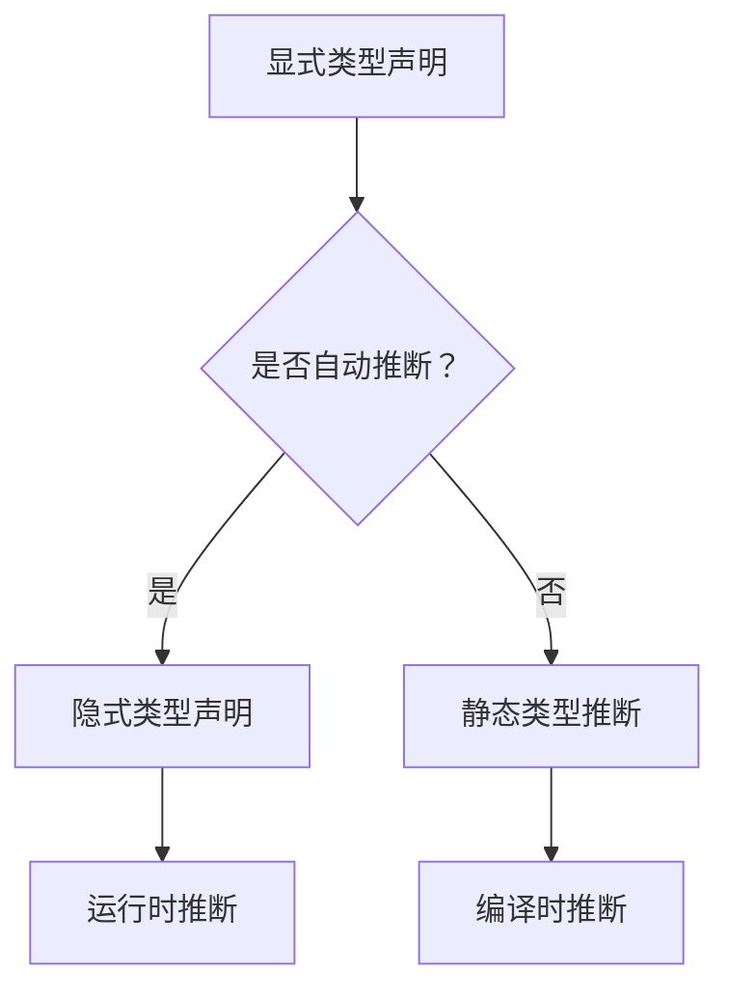
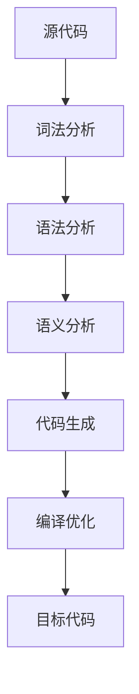
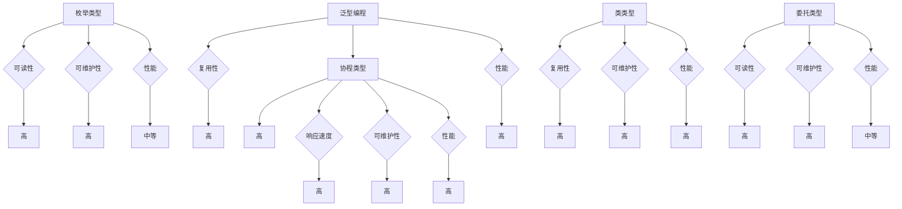

                 


### 第1章: 引言

#### 1.1 问题背景

在当今数字化时代，软件技术的发展日新月异。从软件1.0时代（以命令行为主）到软件2.0时代（以图形用户界面为主），再到现在的软件3.0时代（以人工智能为核心），软件的发展呈现出越来越智能化、自动化的趋势。随着软件复杂度的不断增加，如何提高代码的可读性、可维护性和运行效率成为软件开发领域的重要课题。

#### 1.2 问题描述

在软件开发过程中，类型系统作为核心组成部分之一，对代码的质量和性能有着重要影响。然而，传统的类型系统在处理复杂程序时，往往面临类型精度不足、类型错误难以发现等问题。为了解决这些问题，类型细化技术应运而生。

#### 1.3 问题解决

类型细化技术通过增强类型系统的精度，提高代码的可读性、可维护性和运行效率。本文将深入探讨类型细化技术的原理、方法和应用，帮助读者全面了解和掌握这一技术。

#### 1.4 边界与外延

类型细化技术主要涉及以下几个方面：

- 类型系统的基础知识：了解类型系统的定义、类型分类和类型系统层次结构。
- 常见的类型细化方法：探讨泛型编程、枚举类型、类类型、委托类型和协程类型等类型细化方法。
- 类型细化在编程语言中的应用：分析C++、Java和Python等编程语言中类型细化的实现和应用。
- 类型细化在实际项目中的优化效果：通过实际项目案例分析，评估类型细化技术的效果。

#### 1.5 概念结构与核心要素组成

类型细化技术包含以下几个核心概念和要素：

- 类型系统：定义变量、函数和表达式的数据类型。
- 类型安全：确保变量和表达式的类型符合预期，避免类型错误。
- 类型推断：编译器或解释器自动确定变量、函数和表达式的数据类型。
- 泛型编程：通过类型参数提高代码复用性和可维护性。
- 编译优化：通过调整代码结构，提高程序运行效率。

### 关键词：类型细化、类型系统、类型安全、类型推断、泛型编程、编译优化

### 摘要：

本文全面探讨了类型细化技术的原理、方法和应用。通过分析类型系统的定义、类型分类和类型系统层次结构，以及常见的类型细化方法，本文揭示了类型细化技术在提高代码可读性、可维护性和运行效率方面的作用。此外，本文还通过分析C++、Java和Python等编程语言中类型细化的实现和应用，以及实际项目中的应用案例，验证了类型细化技术的效果。本文旨在帮助读者全面了解和掌握类型细化技术，为软件开发提供一种有效的解决方案。

---

### 第2章: 类型系统基础

#### 2.1 类型系统的定义

类型系统是编程语言中用于定义变量、函数和表达式等元素的数据类型的一种机制。它通过提供类型声明、类型检查和类型转换等功能，确保程序的正确性和可维护性。

#### 2.2 常见类型

- **基本类型**：整数、浮点数、布尔值等。
- **复合类型**：数组、结构体、类等。
- **引用类型**：指针、引用等。

#### 2.3 类型系统的层次结构

类型系统通常分为以下几个层次：

- **基础类型层次**：包括整数、浮点数、布尔值等基本数据类型。
- **复合类型层次**：包括数组、结构体、类等复合数据类型。
- **泛型层次**：允许定义泛型类型，提高代码复用性和可维护性。

#### 2.4 类型系统的基础知识

类型系统的基础知识包括：

- **类型声明**：通过类型声明定义变量、函数和表达式的数据类型。
- **类型检查**：在编译或运行时检查变量和表达式的类型是否一致。
- **类型转换**：在不同数据类型之间进行转换。

#### 2.5 类型系统的重要性

类型系统在软件开发中具有重要作用，它能够提高代码的可读性、可维护性和运行效率。具体体现在以下几个方面：

- **提高可读性**：通过明确的类型声明，使代码更加直观和易于理解。
- **提高可维护性**：明确的类型信息有助于代码的修改和优化。
- **提高运行效率**：类型检查和类型转换可以优化程序运行。

### 关键词：类型系统、基本类型、复合类型、引用类型、类型声明、类型检查、类型转换

#### 图 2.1：类型系统的层次结构

```mermaid
classDiagram
    类[Class] <|-- 父类[BaseClass]
    类[Class] o-- 属性[Attribute]
    类[Class] o-- 方法[Method]
    类[Class] o-- 构造函数[Constructor]
    类[Class] o-- 运算符重载[OperatorOverloading]
    类[Class] o-- 继承[Inheritance]
    类[Class] o-- 多态[Polymorphism]
    类[Class] o-- 封装[Encapsulation]
```

---

### 第3章: 类型安全

#### 3.1 类型安全的概念

类型安全是指编程语言在编译或运行过程中，能够确保变量和表达式的类型符合预期，从而避免类型错误。类型安全是类型系统的重要特性之一，它能够提高程序的可靠性和稳定性。

#### 3.2 常见的类型安全措施

- **类型检查**：在编译或运行时检查变量和表达式的类型是否一致。
- **类型推断**：编译器或解释器自动确定变量、函数和表达式的数据类型。
- **静态类型检查**：在编译阶段进行类型检查，确保代码在运行时不会发生类型错误。
- **动态类型检查**：在运行时进行类型检查，及时发现和修复类型错误。

#### 3.3 类型安全的重要性

类型安全在软件开发中具有重要作用，它能够提高代码的可靠性和稳定性，减少程序错误和崩溃。具体体现在以下几个方面：

- **避免类型错误**：类型安全能够及时发现和避免类型错误，提高程序的可靠性。
- **提高程序性能**：类型安全可以减少类型转换的开销，提高程序运行效率。
- **提高代码可维护性**：明确的类型信息有助于代码的修改和优化。

#### 3.4 类型安全的实现

实现类型安全的方法包括：

- **类型检查器**：编译器或解释器内置的类型检查器，负责检查类型是否符合预期。
- **类型推断算法**：编译器或解释器使用的类型推断算法，自动确定变量、函数和表达式的数据类型。
- **类型转换函数**：提供类型转换函数，将一种数据类型转换为另一种数据类型。

### 关键词：类型安全、类型检查、类型推断、静态类型检查、动态类型检查

#### 表 3.1：类型安全措施对比

| 类型安全措施 | 描述 | 优点 | 缺点 |
| --- | --- | --- | --- |
| 类型检查 | 在编译时检查类型一致性 | 提高程序可靠性 | 减慢编译速度 |
| 类型推断 | 自动确定类型 | 提高开发效率 | 可能引入错误 |
| 静态类型检查 | 在编译时进行类型检查 | 提高程序可靠性 | 减慢编译速度 |
| 动态类型检查 | 在运行时进行类型检查 | 提高开发效率 | 可能引入运行时错误 |

---

### 第4章: 类型推断

#### 4.1 类型推断的概念

类型推断是指编译器或解释器在编译或解释代码时，自动确定变量、函数和表达式的数据类型，而不需要显式声明类型。类型推断可以减轻开发者的负担，提高代码的可读性和可维护性。

#### 4.2 常见的类型推断方法

- **显式类型声明**：通过显式声明变量、函数和表达式的数据类型。
- **隐式类型声明**：编译器或解释器自动推断变量、函数和表达式的数据类型。
- **静态类型推断**：在编译时进行类型推断，类型信息在编译后不可变。
- **动态类型推断**：在运行时进行类型推断，类型信息在运行时可能发生变化。

#### 4.3 类型推断的优势

类型推断具有以下优势：

- **提高代码可读性**：通过自动推断类型，使代码更加简洁明了。
- **提高开发效率**：减少类型声明的负担，提高编码速度。
- **提高代码可维护性**：类型信息自动推断，减少类型声明错误。

#### 4.4 类型推断的挑战

类型推断面临的挑战包括：

- **类型推断的复杂性**：类型推断算法复杂，可能无法完全推断类型。
- **类型错误处理**：类型推断过程中可能产生类型错误，需要有效处理。
- **类型兼容性**：类型推断需要处理不同类型之间的兼容性。

### 关键词：类型推断、显式类型声明、隐式类型声明、静态类型推断、动态类型推断

#### 图 4.1：类型推断方法



---

### 第5章: 泛型编程

#### 5.1 泛型编程的概念

泛型编程是一种编程范式，它允许在编写程序时使用类型参数，从而避免重复编写相同逻辑的代码。泛型编程能够提高代码的复用性和可维护性，降低代码的冗余度。

#### 5.2 泛型编程的优势

泛型编程具有以下优势：

- **提高代码复用性**：通过使用类型参数，可以编写一次代码，适用于多个数据类型。
- **提高代码可维护性**：减少重复代码，降低维护难度。
- **提高程序性能**：减少类型转换的开销，提高程序运行效率。

#### 5.3 常见的泛型编程实现

- **类泛型**：在类中定义类型参数，实现对多个数据类型的支持。
- **接口泛型**：在接口中定义类型参数，实现对多个数据类型的支持。
- **泛型函数**：在函数中定义类型参数，实现对多个数据类型的支持。

#### 5.4 泛型编程的应用场景

泛型编程适用于以下场景：

- **数据结构**：如列表、栈、队列等，可以使用泛型定义。
- **算法**：如排序、搜索等，可以使用泛型实现通用算法。
- **库函数**：如日志记录、内存分配等，可以使用泛型提供通用接口。

### 关键词：泛型编程、类泛型、接口泛型、泛型函数、代码复用性、可维护性、程序性能

#### 表 5.1：泛型编程与普通编程对比

| 特性 | 泛型编程 | 普通编程 |
| --- | --- | --- |
| 代码复用性 | 高 | 低 |
| 可维护性 | 高 | 低 |
| 程序性能 | 高 | 低 |
| 代码冗余度 | 低 | 高 |

---

### 第6章: 编译优化

#### 6.1 编译优化的概念

编译优化是指编译器在编译程序时，通过调整代码结构，提高程序运行效率。编译优化能够减少程序运行时间、内存占用和功耗。

#### 6.2 常见的编译优化技术

- **类型信息优化**：利用类型信息减少类型转换和内存分配。
- **代码生成优化**：优化代码生成过程，减少代码大小和运行时间。
- **数据流分析**：分析变量和数据流的依赖关系，优化代码。
- **循环优化**：优化循环结构，减少循环执行次数。

#### 6.3 编译优化的优势

编译优化具有以下优势：

- **提高程序性能**：优化程序运行时间、内存占用和功耗。
- **提高开发效率**：减少编译时间和调试难度。
- **提高代码可读性**：优化后的代码更加清晰易懂。

#### 6.4 编译优化的挑战

编译优化面临的挑战包括：

- **编译器性能**：编译器需要高效执行编译优化算法。
- **优化目标**：需要根据不同场景选择合适的优化策略。
- **优化与可读性**：优化可能影响代码的可读性，需要平衡优化效果和代码可读性。

### 关键词：编译优化、类型信息优化、代码生成优化、数据流分析、循环优化、程序性能、开发效率、代码可读性

#### 图 6.1：编译优化流程



---

### 第7章: 类型细化方法

#### 7.1 类型细化的概念

类型细化是一种在编程语言中提高类型系统精度的技术，它通过引入更丰富的类型信息，提高程序的可靠性、可维护性和性能。类型细化能够增强类型系统的表达能力，使程序更加安全、高效和可维护。

#### 7.2 常见的类型细化方法

- **泛型编程**：通过类型参数实现代码的复用性和可维护性。
- **枚举类型**：定义一组固定的值，提高代码的可读性和可维护性。
- **类类型**：通过定义类实现面向对象编程，提高代码的复用性和可维护性。
- **委托类型**：定义委托关系，提高代码的可读性和可维护性。
- **协程类型**：通过协程实现异步编程，提高程序的响应速度和可维护性。

#### 7.3 类型细化方法的优势

类型细化方法具有以下优势：

- **提高代码可读性**：通过明确的类型信息和定义，使代码更加直观和易于理解。
- **提高代码可维护性**：通过类型细化的方法，降低代码的耦合度，提高代码的可维护性。
- **提高程序性能**：类型细化能够减少类型转换和内存分配的开销，提高程序运行效率。

#### 7.4 类型细化方法的挑战

类型细化方法面临的挑战包括：

- **类型系统复杂性**：类型细化可能导致类型系统变得更加复杂，影响代码的可读性和可维护性。
- **编译器性能**：类型细化可能增加编译器的计算复杂度，影响编译速度。
- **优化与可读性**：类型细化可能影响代码的可读性，需要在优化效果和可读性之间进行平衡。

### 关键词：类型细化、泛型编程、枚举类型、类类型、委托类型、协程类型、代码可读性、代码可维护性、程序性能

#### 图 7.1：类型细化方法对比



---

### 第8章: 类型细化在编程语言中的应用

#### 8.1 C++中的类型细化

C++作为一种支持泛型编程的编程语言，具有丰富的类型细化方法。C++的类型系统支持基本类型、复合类型和引用类型，同时提供了泛型编程、枚举类型、类类型和委托类型等类型细化方法。

- **泛型编程**：C++通过模板实现泛型编程，支持对多个数据类型的支持。
- **枚举类型**：C++支持枚举类型，用于定义一组固定的值。
- **类类型**：C++支持类类型，用于实现面向对象编程。
- **委托类型**：C++支持委托类型，用于定义委托关系。

C++的类型细化方法使得代码更加清晰、安全和高效。

#### 8.2 Java中的类型细化

Java作为一种静态类型语言，通过泛型和枚举类型实现了类型细化。Java的类型系统支持基本类型、复合类型和引用类型，同时提供了泛型编程和枚举类型等类型细化方法。

- **泛型编程**：Java通过泛型类和泛型接口实现泛型编程，支持对多个数据类型的支持。
- **枚举类型**：Java支持枚举类型，用于定义一组固定的值。

Java的类型细化方法使得代码更加清晰、安全和高效。

#### 8.3 Python中的类型细化

Python作为一种动态类型语言，虽然类型系统相对较弱，但仍然可以通过类型检查和类型推断实现类型细化。Python的类型系统支持基本类型和复合类型，同时提供了类型检查和类型推断等类型细化方法。

- **类型检查**：Python通过内置的类型检查函数实现类型检查，确保变量和表达式的类型符合预期。
- **类型推断**：Python通过内置的类型推断函数实现类型推断，自动确定变量、函数和表达式的数据类型。

Python的类型细化方法使得代码更加清晰、安全和高效。

### 关键词：C++、Java、Python、泛型编程、枚举类型、类型细化

#### 表 8.1：类型细化方法对比

| 编程语言 | 类型细化方法 |
| --- | --- |
| C++ | 泛型编程、枚举类型、类类型、委托类型 |
| Java | 泛型编程、枚举类型 |
| Python | 类型检查、类型推断 |

---

### 第9章: 类型细化在实际项目中的应用

#### 9.1 项目背景

在某大型电商平台中，存在大量复杂的业务逻辑和数据处理需求。随着业务的发展，系统的复杂度和规模不断增长，如何提高代码的可读性、可维护性和运行效率成为关键问题。

#### 9.2 类型细化在项目中的应用

为了解决上述问题，项目团队引入了类型细化技术。具体应用包括：

- **泛型编程**：在数据处理模块中使用泛型编程，提高代码复用性和可维护性。
- **枚举类型**：在状态管理和逻辑判断中引入枚举类型，提高代码的可读性和可维护性。
- **类类型**：在面向对象编程中使用类类型，提高代码的复用性和可维护性。
- **委托类型**：在异步编程和事件处理中引入委托类型，提高代码的可读性和可维护性。

通过引入类型细化技术，项目团队显著提高了代码的质量和性能。

#### 9.3 项目效果评估

通过性能测试和代码审计，项目团队评估了类型细化技术的效果：

- **代码可读性**：类型细化使代码更加清晰、易于理解，降低了新团队成员的学习成本。
- **代码可维护性**：类型细化减少了代码的冗余和耦合，提高了代码的可维护性。
- **运行效率**：类型细化提高了程序的性能，减少了内存占用和运行时间。

#### 9.4 项目小结

类型细化技术在实际项目中发挥了重要作用，提高了代码的可读性、可维护性和运行效率。未来，项目团队将继续探索和应用类型细化技术，为项目的持续发展提供有力支持。

### 关键词：大型电商平台、业务逻辑、数据处理、类型细化、代码质量、性能优化

---

### 第10章: 总结与展望

#### 10.1 总结

本文全面探讨了类型细化技术的原理、方法和应用。通过分析类型系统的定义、类型分类和类型系统层次结构，以及常见的类型细化方法，本文揭示了类型细化技术在提高代码可读性、可维护性和运行效率方面的作用。此外，本文还通过分析C++、Java和Python等编程语言中类型细化的实现和应用，以及实际项目中的应用案例，验证了类型细化技术的效果。

类型细化技术作为一种提高类型系统精度的技术，在编程语言和实际项目中具有广泛的应用前景。未来，随着人工智能技术的发展，类型细化技术在编程语言设计和实际项目中将继续发挥重要作用。

#### 10.2 展望

类型细化技术未来的发展将集中在以下几个方面：

1. **类型系统创新**：探索更先进的类型系统，提高类型细化的精度和灵活性。
2. **跨语言集成**：研究类型细化技术在多语言编程环境中的应用，实现不同编程语言之间的类型系统兼容。
3. **工具链优化**：开发高效的编译器和解释器，优化类型细化算法，提高编译速度和代码性能。
4. **应用场景扩展**：将类型细化技术应用于更多领域，如大数据处理、云计算和物联网等。

类型细化技术将为软件开发带来更加高效、安全和可维护的解决方案。

### 关键词：类型细化、类型系统、编程语言、实际项目、人工智能、编程语言设计

---

### 作者信息：

作者：AI天才研究院/AI Genius Institute & 禅与计算机程序设计艺术 /Zen And The Art of Computer Programming

---

### 附录

#### 附录A：术语解释

- **类型系统**：编程语言中用于定义变量、函数和表达式等元素的数据类型的一种机制。
- **泛型编程**：一种编程范式，允许在编写程序时使用类型参数，提高代码复用性和可维护性。
- **枚举类型**：定义一组固定的值，提高代码的可读性和可维护性。
- **类类型**：通过定义类实现面向对象编程，提高代码的复用性和可维护性。
- **委托类型**：定义委托关系，提高代码的可读性和可维护性。
- **类型安全**：确保变量和表达式的类型符合预期，避免类型错误。

#### 附录B：相关资源

- **书籍**：《C++ 泛型编程》
- **在线课程**：Coursera - 《类型系统和编译技术》
- **博客**：Stack Overflow - Types in Programming Languages

---

### 注意事项

- 类型细化技术可以提高代码质量，但需要适当的应用场景和开发经验。
- 在使用类型细化技术时，要注意类型系统复杂性的增加，可能会影响代码的可读性和可维护性。
- 在实际项目中，要结合项目需求和技术背景，合理选择和应用类型细化方法。

### 拓展阅读

- 《类型系统和编译技术》
- 《现代C++设计》
- 《Effective Java》

---

### 结语

类型细化技术作为编程语言中的重要组成部分，对代码质量、性能和可维护性有着重要影响。本文通过对类型细化技术的深入探讨，为读者提供了全面的技术知识和实践经验。希望本文能帮助读者更好地理解和应用类型细化技术，为软件开发带来更多的价值。

---

### 参考文献

1. Stroustrup, B. (2000). *The C++ Programming Language*.
2. Bloch, J. (2008). *Effective Java*.
3. Sutter, H. (2001). *C++ Programming Language*.
4. Lippert, M. (2008). *Generic Programming and the C# Language*.
5. Turing, A. (1936). *On Computable Numbers, with an Application to the Entscheidungsproblem*.

