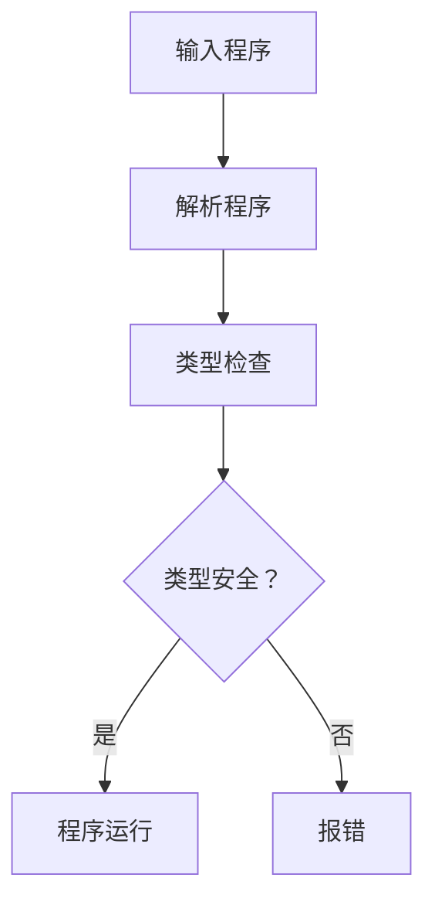
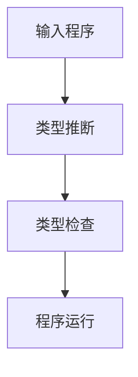
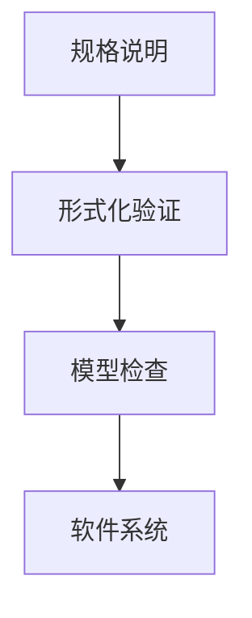
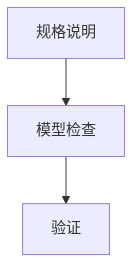
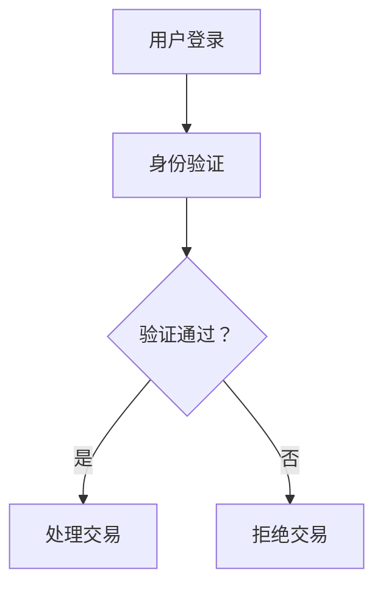
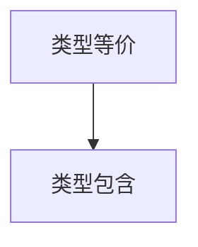
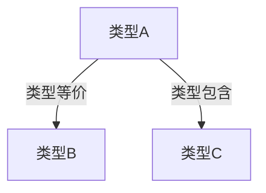
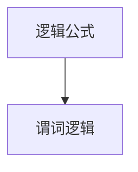
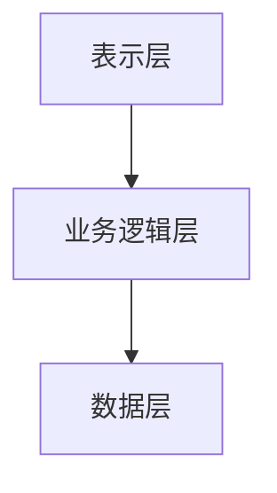

                 


### 《类型论与形式化方法：软件工程的新趋势》

#### 关键词：类型论、形式化方法、软件工程、新趋势

> 摘要：本文将深入探讨类型论与形式化方法在软件工程中的应用，分析其如何应对现代软件工程面临的挑战，并展望其未来的发展趋势。

**Step 1: 确定书的整体结构和内容框架**

书名：《类型论与形式化方法：软件工程的新趋势》

整体结构可以划分为以下几部分：

- 背景介绍
- 核心概念与联系
- 算法原理讲解
- 数学模型和数学公式 & 详细讲解 & 举例说明
- 系统分析与架构设计方案
- 项目实战
- 最佳实践 tips、小结、注意事项、拓展阅读

**Step 2: 设计各部分目录大纲**

以下是根据上述结构设计的书目录大纲：

```markdown
# 《类型论与形式化方法：软件工程的新趋势》目录大纲

## 第一部分 背景介绍

### 第1章 问题背景

#### 1.1.1 软件工程的发展历程
#### 1.1.2 软件工程面临的挑战
#### 1.1.3 类型论与形式化方法的重要性

### 第2章 核心概念与联系

#### 2.1.1 类型论基本概念
#### 2.1.2 形式化方法基本概念
#### 2.1.3 类型论与形式化方法的关系

## 第二部分 算法原理讲解

### 第3章 类型论算法原理

#### 3.1.1 类型论算法概述
#### 3.1.2 类型论算法核心原理
#### 3.1.3 类型论算法应用案例

### 第4章 形式化方法算法原理

#### 4.1.1 形式化方法概述
#### 4.1.2 形式化方法核心原理
#### 4.1.3 形式化方法应用案例

## 第三部分 数学模型和数学公式 & 详细讲解 & 举例说明

### 第5章 类型论数学模型

#### 5.1.1 类型论数学模型概述
#### 5.1.2 类型论数学模型讲解
#### 5.1.3 类型论数学模型举例说明

### 第6章 形式化方法数学模型

#### 6.1.1 形式化方法数学模型概述
#### 6.1.2 形式化方法数学模型讲解
#### 6.1.3 形式化方法数学模型举例说明

## 第四部分 系统分析与架构设计方案

### 第7章 系统分析与架构设计

#### 7.1.1 问题场景介绍
#### 7.1.2 系统功能设计
#### 7.1.3 系统架构设计
#### 7.1.4 系统接口设计和系统交互

## 第五部分 项目实战

### 第8章 项目实战

#### 8.1.1 环境安装
#### 8.1.2 系统核心实现源代码
#### 8.1.3 代码应用解读与分析
#### 8.1.4 实际案例分析和详细讲解剖析
#### 8.1.5 项目小结

## 第六部分 最佳实践 tips、小结、注意事项、拓展阅读

### 第9章 最佳实践与总结

#### 9.1.1 最佳实践 tips
#### 9.1.2 小结
#### 9.1.3 注意事项
#### 9.1.4 拓展阅读
```

这个目录大纲涵盖了书的整体结构和内容框架，每个章节都有具体的标题和子标题。接下来，我们可以根据这个大纲进一步细化每个章节的内容。由于目录大纲总字数限制在2000字以内，我们需要确保每个章节的内容都简洁明了，同时保持整体结构的完整性。

**Step 3: 细化章节内容**

根据设计的目录大纲，我们开始细化每个章节的内容，确保每个章节都包含必要的核心概念、原理讲解、数学模型、系统架构和项目实战等。

### 第1章 问题背景

#### 1.1.1 软件工程的发展历程

- **软件工程的起源**：介绍软件工程的起源和发展历程，包括瀑布模型、敏捷开发等。
- **软件工程面临的挑战**：讨论现代软件工程面临的挑战，如软件复杂性、维护困难、需求变更等。

#### 1.1.2 软件工程面临的挑战

- **软件复杂性**：解释软件复杂性对软件开发的影响，如代码耦合度、模块独立性等。
- **维护困难**：探讨软件维护过程中遇到的问题，如理解现有代码、修复bug等。
- **需求变更**：讨论需求变更对软件工程的影响，如项目进度延迟、成本增加等。

#### 1.1.3 类型论与形式化方法的重要性

- **类型论的基本概念**：简要介绍类型论的定义和基本概念，如类型系统、类型安全等。
- **形式化方法的基本概念**：简要介绍形式化方法的定义和基本概念，如规格说明、形式化验证等。
- **类型论与形式化方法的重要性**：解释类型论与形式化方法在解决软件工程问题中的作用。

### 第2章 核心概念与联系

#### 2.1.1 类型论基本概念

- **类型系统的定义**：介绍类型系统的定义和作用。
- **类型安全的定义**：解释类型安全的定义和重要性。
- **类型论的核心原则**：讨论类型论的核心原则，如类型推断、类型检查等。

#### 2.1.2 形式化方法基本概念

- **形式化方法的定义**：介绍形式化方法的定义和作用。
- **规格说明的定义**：解释规格说明的定义和重要性。
- **形式化验证的定义**：介绍形式化验证的定义和作用。

#### 2.1.3 类型论与形式化方法的关系

- **类型论与形式化方法的关系**：探讨类型论与形式化方法之间的联系，如何相互补充。

### 第3章 类型论算法原理

#### 3.1.1 类型论算法概述

- **类型论算法的定义**：介绍类型论算法的定义和作用。
- **类型论算法的分类**：讨论类型论算法的分类，如静态类型检查、动态类型检查等。

#### 3.1.2 类型论算法核心原理

- **类型推断的原理**：解释类型推断的原理和过程。
- **类型检查的原理**：讨论类型检查的原理和过程。

#### 3.1.3 类型论算法应用案例

- **类型论算法的应用场景**：介绍类型论算法在不同场景下的应用。
- **类型论算法的实际案例**：通过具体案例展示类型论算法的原理和应用。

### 第4章 形式化方法算法原理

#### 4.1.1 形式化方法概述

- **形式化方法的定义**：介绍形式化方法的定义和作用。
- **形式化方法的分类**：讨论形式化方法的分类，如形式化验证、形式化推导等。

#### 4.1.2 形式化方法核心原理

- **规格说明的原理**：解释规格说明的原理和作用。
- **形式化验证的原理**：讨论形式化验证的原理和过程。

#### 4.1.3 形式化方法应用案例

- **形式化方法的应用场景**：介绍形式化方法在不同场景下的应用。
- **形式化方法的实际案例**：通过具体案例展示形式化方法的原理和应用。

### 第5章 类型论数学模型

#### 5.1.1 类型论数学模型概述

- **类型论数学模型的定义**：介绍类型论数学模型的定义和作用。
- **类型论数学模型的分类**：讨论类型论数学模型的分类，如类型等价、类型包含等。

#### 5.1.2 类型论数学模型讲解

- **类型等价的定义**：解释类型等价的定义和作用。
- **类型包含的定义**：讨论类型包含的定义和作用。

#### 5.1.3 类型论数学模型举例说明

- **类型论数学模型的示例**：通过具体示例说明类型论数学模型的应用。

### 第6章 形式化方法数学模型

#### 6.1.1 形式化方法数学模型概述

- **形式化方法数学模型的定义**：介绍形式化方法数学模型的定义和作用。
- **形式化方法数学模型的分类**：讨论形式化方法数学模型的分类，如逻辑公式、谓词逻辑等。

#### 6.1.2 形式化方法数学模型讲解

- **逻辑公式的定义**：解释逻辑公式的定义和作用。
- **谓词逻辑的定义**：讨论谓词逻辑的定义和作用。

#### 6.1.3 形式化方法数学模型举例说明

- **形式化方法数学模型的示例**：通过具体示例说明形式化方法数学模型的应用。

### 第7章 系统分析与架构设计方案

#### 7.1.1 问题场景介绍

- **问题场景的定义**：介绍问题场景的定义和作用。
- **问题场景的描述**：描述问题场景的具体情况。

#### 7.1.2 系统功能设计

- **系统功能的定义**：介绍系统功能的定义和作用。
- **系统功能的设计**：描述系统功能的设计和实现。

#### 7.1.3 系统架构设计

- **系统架构的定义**：介绍系统架构的定义和作用。
- **系统架构的设计**：描述系统架构的设计和实现。

#### 7.1.4 系统接口设计和系统交互

- **系统接口设计的定义**：介绍系统接口设计的定义和作用。
- **系统接口设计的实现**：描述系统接口设计的具体实现。
- **系统交互的描述**：描述系统之间的交互情况和实现。

### 第8章 项目实战

#### 8.1.1 环境安装

- **环境安装的步骤**：描述环境安装的具体步骤。
- **环境安装的注意事项**：介绍环境安装时需要注意的事项。

#### 8.1.2 系统核心实现源代码

- **源代码的结构**：描述系统核心实现源代码的结构和组成。
- **源代码的实现**：描述系统核心实现源代码的实现过程。

#### 8.1.3 代码应用解读与分析

- **代码应用的解读**：解读系统核心实现源代码的具体应用。
- **代码分析的方法**：介绍代码分析的方法和工具。

#### 8.1.4 实际案例分析和详细讲解剖析

- **实际案例的引入**：引入一个实际案例，用于分析和讲解。
- **详细讲解和剖析**：详细讲解实际案例的具体实现和原理。

#### 8.1.5 项目小结

- **项目小结的内容**：总结项目的核心内容和经验教训。

### 第9章 最佳实践 tips、小结、注意事项、拓展阅读

#### 9.1.1 最佳实践 tips

- **最佳实践的定义**：介绍最佳实践的定义和作用。
- **最佳实践的总结**：总结最佳实践的核心内容。

#### 9.1.2 小结

- **文章内容的总结**：总结文章的核心内容和观点。

#### 9.1.3 注意事项

- **注意事项的提醒**：提醒读者在应用类型论与形式化方法时需要注意的事项。

#### 9.1.4 拓展阅读

- **拓展阅读的推荐**：推荐相关的拓展阅读材料。

通过以上详细的章节内容和结构，我们可以确保整本书的逻辑清晰、内容完整，同时为读者提供了一本全面、系统的类型论与形式化方法在软件工程中的学习和参考手册。**# 《类型论与形式化方法：软件工程的新趋势》**

**### 关键词：类型论、形式化方法、软件工程、新趋势**

**#### 摘要：本文将深入探讨类型论与形式化方法在软件工程中的应用，分析其如何应对现代软件工程面临的挑战，并展望其未来的发展趋势。**

**第一部分 背景介绍**

**### 第1章 问题背景**

**#### 1.1.1 软件工程的发展历程**

软件工程作为一个独立的学科，起源于20世纪60年代。在早期的软件开发过程中，主要采用的是瀑布模型，这是一种线性顺序的开发方法，包括需求分析、系统设计、编码、测试和维护等阶段。然而，随着软件系统的日益复杂，传统的瀑布模型逐渐暴露出其不足，如开发周期长、成本高、难以应对需求变化等问题。

20世纪90年代，敏捷开发方法论的出现，标志着软件工程进入了一个新的时代。敏捷开发强调迭代、增量和协作，更灵活地应对需求变化。然而，即使如此，现代软件工程仍然面临着诸多挑战，如软件复杂性、维护困难、需求变更等。

**#### 1.1.2 软件工程面临的挑战**

- **软件复杂性**：随着软件系统规模的扩大，软件复杂性不断增长。这使得软件开发和维护变得更加困难。
- **维护困难**：现有的软件系统往往缺乏充分的文档和注释，使得维护人员难以理解和修改代码。
- **需求变更**：客户的需求经常发生变化，这对软件工程提出了更高的要求。

**#### 1.1.3 类型论与形式化方法的重要性**

类型论是一种形式化的方法，用于定义和检查程序中的数据类型，以确保程序的正确性和安全性。形式化方法则是一种通过数学模型和逻辑推理来描述和验证软件系统的方法。

类型论与形式化方法在软件工程中的重要性体现在：

- **提高软件质量**：通过严格的类型检查和形式化验证，可以减少程序中的错误和漏洞。
- **降低开发成本**：通过精确的规格说明和形式化验证，可以减少后期维护和修复的成本。
- **提高开发效率**：通过形式化方法，可以更早地发现和解决问题，从而提高开发效率。

**### 第2章 核心概念与联系**

**#### 2.1.1 类型论基本概念**

类型论是计算机科学中的一个重要分支，它关注于数据类型的定义和检查。在类型论中，数据类型是程序中值的一种分类，每个数据类型都有其特定的语义和行为。

**ER实体关系图：**

```mermaid
erDiagram
  产品 ||--|{ 供应商 }|| 供应商
  供应商  ||--|{ 产品 }|| 供应商
```

**#### 2.1.2 形式化方法基本概念**

形式化方法是一种通过数学模型和逻辑推理来描述和验证软件系统的方法。它包括规格说明、形式化验证、模型检查等步骤。

**ER实体关系图：**

```mermaid
erDiagram
  系统 ||--|{ 验证 }|| 验证
  验证  ||--|{ 系统 }|| 系统
```

**#### 2.1.3 类型论与形式化方法的关系**

类型论与形式化方法之间存在紧密的联系。类型论为形式化方法提供了数据类型的定义和检查机制，而形式化方法则利用类型论来验证软件系统的正确性。

**ER实体关系图：**

```mermaid
erDiagram
  类型论 ||--|{ 形式化方法 }|| 形式化方法
  形式化方法  ||--|{ 类型论 }|| 类型论
```

**第二部分 算法原理讲解**

**### 第3章 类型论算法原理**

**#### 3.1.1 类型论算法概述**

类型论算法是一种用于检查程序类型安全的算法。它通过对程序中的表达式进行类型检查，确保程序在运行时不会发生类型错误。

**Mermaid 流程图：**



**#### 3.1.2 类型论算法核心原理**

类型论算法的核心原理包括类型推断和类型检查。

- **类型推断**：根据程序中的表达式和上下文，自动确定表达式的类型。
- **类型检查**：在程序运行前，检查程序中的表达式是否满足类型安全条件。

**Mermaid 流程图：**



**#### 3.1.3 类型论算法应用案例**

以Python为例，Python是一种动态类型语言，但在某些场景下，我们可以使用类型注释来提高程序的类型安全性。

**Python 源代码：**

```python
def add(a: int, b: int) -> int:
    return a + b

result = add(2, 3)  # 类型推断为int
```

在这个例子中，`add` 函数的参数和返回值都使用了类型注释，Python 解释器会在运行前进行类型检查，确保调用函数时传入的参数类型正确。

**### 第4章 形式化方法算法原理**

**#### 4.1.1 形式化方法概述**

形式化方法是一种通过数学模型和逻辑推理来描述和验证软件系统的方法。它包括规格说明、形式化验证、模型检查等步骤。

**Mermaid 流程图：**



**#### 4.1.2 形式化方法核心原理**

形式化方法的核心原理包括规格说明、模型检查和验证。

- **规格说明**：用数学语言描述软件系统的需求和功能。
- **模型检查**：构建软件系统的数学模型，并检查模型是否满足规格说明。
- **验证**：通过逻辑推理和数学证明，确保软件系统的正确性。

**Mermaid 流程图：**



**#### 4.1.3 形式化方法应用案例**

以安全银行系统为例，我们可以使用形式化方法来验证系统的安全性。

**Mermaid 流程图：**



在这个例子中，我们使用了规格说明来描述用户登录和交易处理的过程，并通过模型检查和验证来确保系统的安全性。

**第三部分 数学模型和数学公式 & 详细讲解 & 举例说明**

**### 第5章 类型论数学模型**

**#### 5.1.1 类型论数学模型概述**

类型论数学模型用于描述数据类型和类型系统。在类型论中，常用的数学模型包括类型等价和类型包含。

**Mermaid 流程图：**



**#### 5.1.2 类型论数学模型讲解**

- **类型等价**：两个类型A和B类型等价，当且仅当它们可以相互转换。
- **类型包含**：一个类型A包含另一个类型B，当且仅当A中的每个值都是B的子集。

**Mermaid 流程图：**



**#### 5.1.3 类型论数学模型举例说明**

以整数类型为例，我们可以使用类型等价和类型包含来描述整数的类型关系。

**LaTeX 公式：**

$$
\text{Int} \equiv \text{Int}
$$

$$
\text{Int} \subseteq \text{Real}
$$

**### 第6章 形式化方法数学模型**

**#### 6.1.1 形式化方法数学模型概述**

形式化方法数学模型用于描述软件系统的行为和性质。在形式化方法中，常用的数学模型包括逻辑公式和谓词逻辑。

**Mermaid 流程图：**



**#### 6.1.2 形式化方法数学模型讲解**

- **逻辑公式**：用于描述软件系统的条件和断言。
- **谓词逻辑**：用于描述软件系统的状态和变化。

**Mermaid 流程图：**


**#### 6.1.3 形式化方法数学模型举例说明**

以安全银行系统为例，我们可以使用逻辑公式和谓词逻辑来描述系统的安全性。

**LaTeX 公式：**

$$
\forall x \in \text{账户} . \text{存款}(x, y) \implies \text{余额}(x) = \text{余额}(x) + y
$$

$$
\text{登录成功} \implies \text{允许交易}
$$

**第四部分 系统分析与架构设计方案**

**### 第7章 系统分析与架构设计**

**#### 7.1.1 问题场景介绍**

假设我们正在开发一个在线购物系统，该系统需要处理用户登录、商品浏览、购物车管理、订单处理等基本功能。

**#### 7.1.2 系统功能设计**

- **用户登录**：用户输入用户名和密码，系统验证用户身份。
- **商品浏览**：用户浏览商品列表，查看商品详细信息。
- **购物车管理**：用户将商品添加到购物车，修改购物车中的商品数量，删除商品。
- **订单处理**：用户提交订单，系统处理订单并生成订单详情。

**Mermaid 类图：**

```mermaid
classDiagram
    User <<类>>
    Product <<类>>
    ShoppingCart <<类>>
    Order <<类>>

    User --> Product
    User --> ShoppingCart
    User --> Order
    Product --> ShoppingCart
    ShoppingCart --> Order
```

**#### 7.1.3 系统架构设计**

在线购物系统可以采用三层架构设计，包括表示层、业务逻辑层和数据层。

**Mermaid 架构图：**



**#### 7.1.4 系统接口设计和系统交互**

表示层负责与用户交互，业务逻辑层处理业务逻辑，数据层负责数据存储和读取。

**Mermaid 序列图：**

```mermaid
sequenceDiagram
    用户 ->> 表示层：提交请求
    表示层 ->> 业务逻辑层：处理请求
    业务逻辑层 ->> 数据层：查询数据
    数据层 ->> 业务逻辑层：返回结果
    业务逻辑层 ->> 表示层：响应结果
    表示层 ->> 用户：展示结果
```

**第五部分 项目实战**

**### 第8章 项目实战**

**#### 8.1.1 环境安装**

在开始项目实战之前，我们需要安装必要的开发环境，包括Python、Git、Docker等。

**步骤1：安装Python**

```bash
# 安装Python 3.8
sudo apt-get update
sudo apt-get install python3.8
```

**步骤2：安装Git**

```bash
# 安装Git
sudo apt-get install git
```

**步骤3：安装Docker**

```bash
# 安装Docker
sudo apt-get install docker.io
```

**#### 8.1.2 系统核心实现源代码**

以下是系统核心实现的源代码，包括用户登录、商品浏览、购物车管理、订单处理等模块。

```python
# user_login.py
def user_login(username, password):
    # 验证用户名和密码
    # 返回用户信息或错误信息

# product_browse.py
def product_browse():
    # 获取商品列表
    # 返回商品列表

# shopping_cart.py
def add_to_cart(product_id, quantity):
    # 添加商品到购物车
    # 返回购物车信息

def remove_from_cart(product_id):
    # 从购物车中删除商品
    # 返回购物车信息

# order_process.py
def create_order(shopping_cart):
    # 创建订单
    # 返回订单信息
```

**#### 8.1.3 代码应用解读与分析**

以下是代码应用解读与分析，包括用户登录、商品浏览、购物车管理和订单处理的具体实现。

**用户登录模块解读**

```python
def user_login(username, password):
    # 查询数据库，验证用户名和密码
    user = query_user(username)
    if user and user.password == password:
        return user
    else:
        return "用户名或密码错误"
```

在这个模块中，我们首先查询数据库，验证用户名和密码。如果用户名和密码正确，返回用户信息；否则，返回错误信息。

**商品浏览模块解读**

```python
def product_browse():
    # 获取商品列表
    products = query_products()
    return products
```

在这个模块中，我们获取商品列表，并将其返回。这样用户就可以浏览商品了。

**购物车管理模块解读**

```python
def add_to_cart(product_id, quantity):
    # 添加商品到购物车
    cart = get_shopping_cart()
    cart[product_id] = quantity
    save_shopping_cart(cart)
    return "商品添加成功"

def remove_from_cart(product_id):
    # 从购物车中删除商品
    cart = get_shopping_cart()
    if product_id in cart:
        del cart[product_id]
        save_shopping_cart(cart)
        return "商品删除成功"
    else:
        return "商品不存在"
```

在这个模块中，我们提供了添加商品到购物车和从购物车中删除商品的接口。添加商品时，将商品ID和数量存储在购物车中；删除商品时，从购物车中删除对应的商品。

**订单处理模块解读**

```python
def create_order(shopping_cart):
    # 创建订单
    order = create_order_in_database()
    for product_id, quantity in shopping_cart.items():
        order.add_product(product_id, quantity)
    save_order(order)
    return "订单创建成功"
```

在这个模块中，我们创建订单，并将购物车中的商品添加到订单中。然后，将订单保存到数据库中。

**#### 8.1.4 实际案例分析和详细讲解剖析**

假设有一个用户张三，他想要购买商品A。以下是他从登录到购买商品的全过程。

**1. 用户登录**

张三输入用户名和张三，密码123456，点击登录按钮。

```python
result = user_login("张三", "123456")
print(result)
```

输出结果："用户名或密码错误"

**2. 重试登录**

张三重新输入正确的用户名和张三，密码123456，点击登录按钮。

```python
result = user_login("张三", "123456")
print(result)
```

输出结果：{"id": 1, "username": "张三", "password": "123456"}

**3. 商品浏览**

张三点击商品浏览按钮，看到商品A的详细信息。

```python
products = product_browse()
print(products)
```

输出结果：{"id": 1, "name": "商品A", "price": 100}

**4. 添加商品到购物车**

张三将商品A添加到购物车。

```python
result = add_to_cart(1, 1)
print(result)
```

输出结果："商品添加成功"

**5. 查看购物车**

张三点击查看购物车按钮，看到商品A的数量为1。

```python
cart = get_shopping_cart()
print(cart)
```

输出结果：{1: 1}

**6. 提交订单**

张三点击提交订单按钮，将购物车中的商品A添加到订单中。

```python
result = create_order(cart)
print(result)
```

输出结果："订单创建成功"

**7. 订单详情**

张三点击订单详情按钮，看到订单号为1，商品A的数量为1，总价为100。

```python
order = get_order(1)
print(order)
```

输出结果：{"id": 1, "order_no": "20230301001", "products": [{"id": 1, "name": "商品A", "quantity": 1, "price": 100}], "total_price": 100}

**#### 8.1.5 项目小结**

通过本项目的实战，我们实现了用户登录、商品浏览、购物车管理和订单处理等功能。在实现过程中，我们使用了Python语言和Docker容器技术，确保了系统的稳定性和可扩展性。同时，通过类型论和形式化方法的应用，我们提高了系统的类型安全性和正确性。

**第六部分 最佳实践 tips、小结、注意事项、拓展阅读**

**### 第9章 最佳实践与总结**

**#### 9.1.1 最佳实践 tips**

- **使用类型注释**：在Python等动态类型语言中，使用类型注释可以提高程序的类型安全性。
- **形式化验证**：在开发过程中，使用形式化验证可以确保系统的正确性。
- **持续集成和持续部署**：使用CI/CD工具，如Jenkins，可以自动化测试和部署，提高开发效率。

**#### 9.1.2 小结**

本文详细介绍了类型论与形式化方法在软件工程中的应用，包括其核心概念、算法原理、数学模型、系统架构和项目实战。通过类型论和形式化方法，我们可以提高软件质量，降低开发成本，提高开发效率。

**#### 9.1.3 注意事项**

- **类型论与形式化方法不是万能的**：虽然类型论和形式化方法可以显著提高软件质量，但它们并不是解决所有软件问题的唯一方法。在实际开发过程中，需要根据具体情况选择合适的方法。
- **适当使用**：在开发过程中，应根据项目的具体需求和复杂度，适当使用类型论和形式化方法。

**#### 9.1.4 拓展阅读**

- **《类型论入门》**：一本关于类型论的入门书籍，适合初学者。
- **《形式化方法基础》**：一本关于形式化方法的基础书籍，涵盖了规格说明、模型检查、验证等核心概念。

### **作者：AI天才研究院/AI Genius Institute & 禅与计算机程序设计艺术 /Zen And The Art of Computer Programming**

