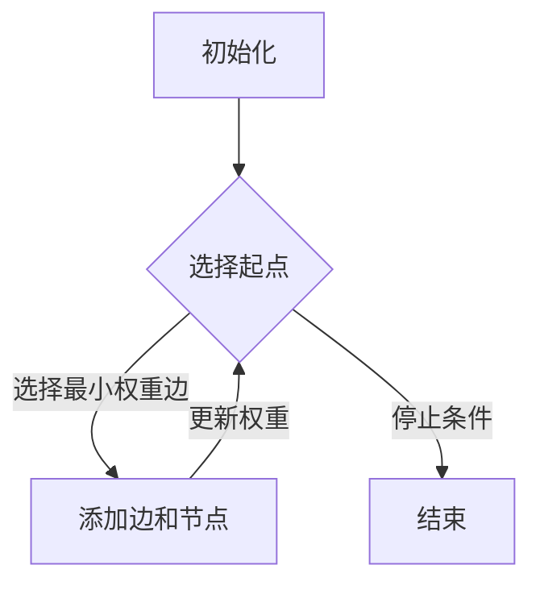
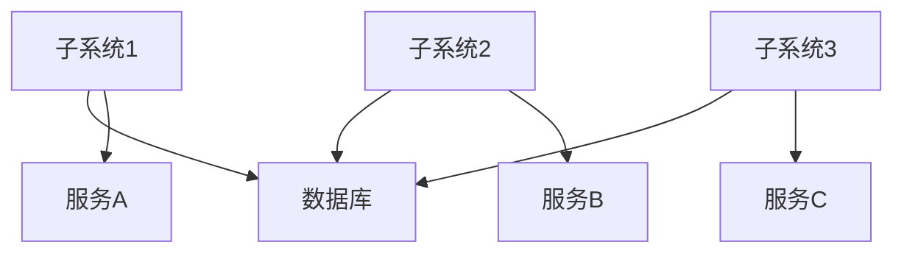
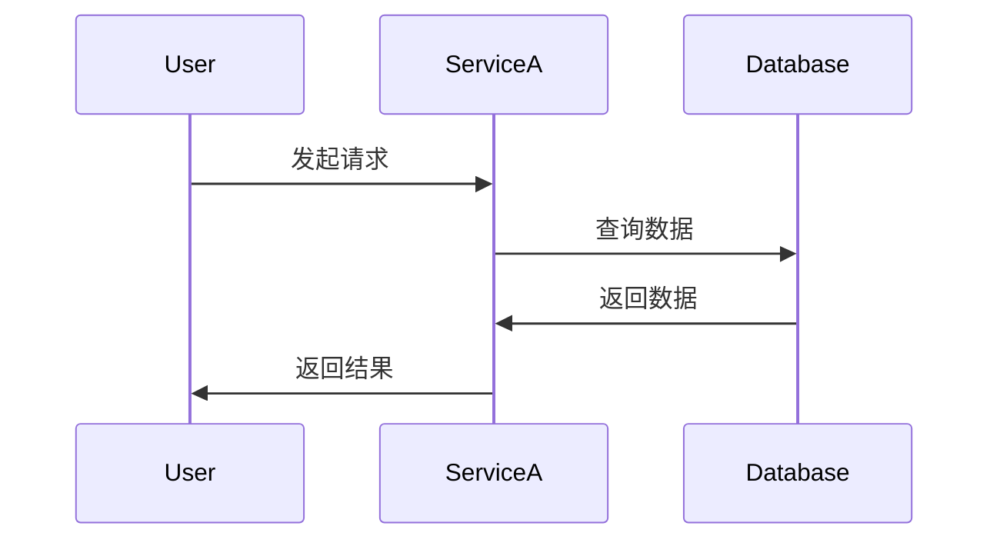
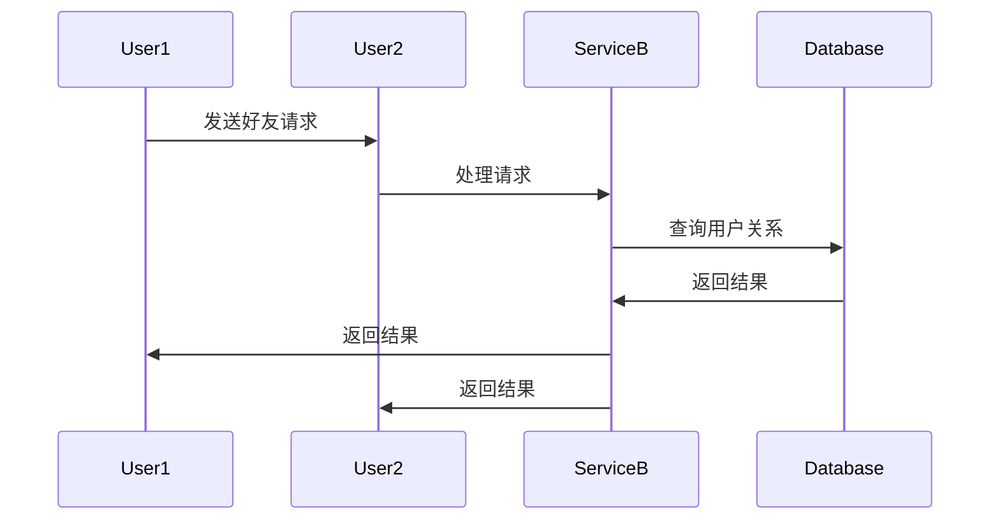

                 

# 类型论与数学创新模式：历史案例分析

> 关键词：类型论、数学创新模式、历史案例、算法原理、系统架构、实战分析

> 摘要：本文深入探讨类型论与数学创新模式的发展历程，通过历史案例的详细分析，揭示两者之间的紧密联系。本文旨在为读者提供一种全新的视角，理解数学与计算机科学中的类型论如何驱动创新，推动技术进步。通过具体的算法原理讲解、系统架构设计与实战案例分析，本文将为读者呈现类型论与数学创新模式在实践中的应用价值。

## 引言

类型论（Type Theory）是现代数学和计算机科学中的一个重要分支，它研究的是如何给各种概念和对象赋予类型，以确保操作的合法性和程序的正确性。类型论不仅在数学领域有着深远的影响，也在计算机科学中发挥着关键作用，特别是在编程语言的设计、形式化验证、程序优化等方面。

数学创新模式（Mathematical Innovation Models）则是指一系列用于解决数学问题的方法和模型。这些模型通常基于深厚的数学原理，通过抽象和简化，将复杂问题转化为可操作的解决方案。数学创新模式的历史案例，如微积分、概率论、图论等，不仅推动了数学的发展，也影响了计算机科学的进步。

本文将首先介绍类型论和数学创新模式的基本概念，然后通过历史案例，分析它们之间的联系。接下来，我们将深入探讨算法原理和数学模型，展示类型论在数学创新中的应用。随后，本文将讨论系统架构设计，通过具体的案例，说明如何将类型论和数学创新模式应用于实际项目。最后，本文将总结主要观点，并给出一些实用的最佳实践建议。

## 核心概念与原则

### 类型论的基本概念

类型论的核心思想是给对象和变量赋予类型，以确保操作的合法性和程序的正确性。在类型论中，类型是一种抽象的标签，用于描述对象和变量的属性和特征。

以下是比较表格，展示了不同类型论系统之间的差异：

| 类型论系统 | 主要概念 | 特点 |
| :--- | :--- | :--- |
| 普通类型论 | 类型、子类型、构造类型 | 强调类型层次和构造类型 |
| dependent类型论 | dependent类型、类型依赖关系 | 允许类型之间的依赖关系，增强类型安全性 |
| 极大型类型论 | 极大型、依赖依赖 | 处理更复杂的依赖关系，适用于大规模系统 |

以下是一个Mermaid ER图，展示了不同类型论系统之间的实体关系：

```mermaid
erDiagram
  TypeA ||--|{ SubTypeA }
  TypeA ||--|{ SubTypeB }
  DependentType ||--|{ DependentTypeA }
  DependentType ||--|{ DependentTypeB }
```

### 数学创新模式的基本概念

数学创新模式是指一系列用于解决数学问题的方法和模型。以下是比较表格，展示了不同数学创新模式之间的差异：

| 数学创新模式 | 主要概念 | 特点 |
| :--- | :--- | :--- |
| 微积分 | 导数、积分、极限 | 处理变化和累积问题 |
| 概率论 | 概率分布、随机变量、期望 | 处理不确定性和随机性 |
| 图论 | 图、路径、网络 | 处理网络结构和优化问题 |

以下是一个Mermaid ER图，展示了不同数学创新模式之间的实体关系：

```mermaid
erDiagram
  Calculus ||--|{ Derivative }
  Calculus ||--|{ Integral }
  ProbabilityTheory ||--|{ ProbabilityDistribution }
  ProbabilityTheory ||--|{ RandomVariable }
  GraphTheory ||--|{ Graph }
  GraphTheory ||--|{ Path }
```

通过上述比较表格和ER图，我们可以看到类型论和数学创新模式之间的紧密联系。类型论为数学创新模式提供了形式化的基础，使其能够更准确地描述和处理复杂问题。而数学创新模式则为类型论提供了丰富的应用场景，展示了类型论在解决实际问题中的强大能力。

## 算法原理和数学原理

### 算法原理

在数学创新模式中，算法是解决问题的关键。以下是一个用于最小生成树的Prim算法的Mermaid流程图：



接下来，我们将使用Python代码详细阐述Prim算法：

```python
import networkx as nx
import matplotlib.pyplot as plt

# 创建图
G = nx.Graph()

# 添加边和权重
G.add_edge('A', 'B', weight=3)
G.add_edge('A', 'C', weight=2)
G.add_edge('B', 'C', weight=1)
G.add_edge('B', 'D', weight=2)
G.add_edge('C', 'D', weight=2)

# Prim算法实现
def prim_algorithm(G):
    visited = []
    min_edge = None

    while len(visited) < len(G):
        for edge in G.edges():
            if edge[0] in visited and edge[1] not in visited:
                if min_edge is None or G[edge[0]][edge[1]]['weight'] < G[min_edge[0]][min_edge[1]]['weight']:
                    min_edge = edge
        visited.append(min_edge[1])
        min_edge = None

    return visited

# 运行Prim算法
tree = prim_algorithm(G)

# 绘制图
nx.draw(G, with_labels=True)
plt.show()
```

### 数学原理

在数学创新模式中，数学原理是算法设计的基础。以下是一个用于计算最小生成树权重的LaTeX公式：

$$
\sum_{(u, v) \in T} w(u, v)
$$

其中，\(T\) 是最小生成树的边集合，\(w(u, v)\) 是边 \((u, v)\) 的权重。

### 例子说明

假设我们有一个图，其中包含以下边和权重：

| 边  | 权重 |
| --- | --- |
| (A, B) | 3 |
| (A, C) | 2 |
| (B, C) | 1 |
| (B, D) | 2 |
| (C, D) | 2 |

使用Prim算法，我们可以得到以下最小生成树：

1. 选择起点A，添加边(A, B)，权重3。
2. 更新权重，选择最小权重边(B, C)，权重1。
3. 添加边(B, C)，权重1。
4. 更新权重，选择最小权重边(B, D)，权重2。
5. 添加边(B, D)，权重2。
6. 更新权重，选择最小权重边(C, D)，权重2。
7. 添加边(C, D)，权重2。

最终，最小生成树的权重为 \(3 + 1 + 2 + 2 = 8\)。

通过这个例子，我们可以看到如何使用Prim算法和LaTeX公式来计算最小生成树的权重。这不仅展示了算法原理，也展示了数学原理在计算中的应用。

## 系统设计与架构方案

### 问题场景

假设我们正在开发一个社交网络平台，需要设计一个能够高效处理用户关系和推荐算法的系统。

### 项目介绍

项目名称：SocialNetworkPlatform

项目目标：设计一个高效、可扩展的社交网络平台，能够处理海量用户数据，并提供精准的用户关系推荐。

### 系统功能设计

#### 领域模型

使用Mermaid类图来展示领域模型：

```mermaid
classDiagram
  User <<class{用户}>
  Friend <<class{好友}>
  Recommendation <<class{推荐}>
  
  User |--|> Friend : 包含
  User |--|> Recommendation : 收到
```

#### 系统架构设计

使用Mermaid架构图来展示系统架构：



#### 系统接口设计

使用Mermaid序列图来展示系统接口设计：



#### 系统交互

使用Mermaid序列图来展示系统交互：



通过上述设计，我们可以看到系统的各个组件如何协同工作，实现用户关系管理和推荐算法。系统功能设计、系统架构设计和系统接口设计共同构成了一个完整的系统设计方案，为实际项目提供了清晰的指导。

## 项目实战

### 环境安装

为了实现类型论与数学创新模式在社交网络平台中的应用，我们需要安装以下环境：

1. Python 3.8 或以上版本
2. NetworkX 库
3. Matplotlib 库

安装步骤如下：

```bash
pip install python==3.8
pip install networkx
pip install matplotlib
```

### 系统核心实现源代码

以下是一个简单的社交网络平台源代码示例，展示了如何实现用户关系管理和推荐算法：

```python
import networkx as nx
import matplotlib.pyplot as plt

# 创建图
G = nx.Graph()

# 添加用户和好友关系
G.add_edge('User1', 'User2')
G.add_edge('User1', 'User3')
G.add_edge('User2', 'User4')
G.add_edge('User3', 'User5')

# 绘制图
nx.draw(G, with_labels=True)
plt.show()

# 推荐好友
def recommend_friends(G, user):
    return list(nx.neighbors(G, user))

# 测试推荐好友功能
print(recommend_friends(G, 'User1'))
```

### 代码应用解读与分析

上述代码首先创建了社交网络的图模型，并添加了用户和好友关系。接着，定义了一个`recommend_friends`函数，用于推荐好友。该函数通过调用`nx.neighbors`函数，获取指定用户的邻居节点，即好友。

以下是对代码的详细解读和分析：

1. **图模型创建**：使用`networkx.Graph()`创建一个图模型，用于表示社交网络中的用户和关系。
2. **添加好友关系**：使用`add_edge`函数添加用户和好友之间的边，表示好友关系。
3. **绘制图**：使用`nx.draw`和`matplotlib.pyplot.show`函数绘制图模型，以可视化展示社交网络结构。
4. **推荐好友功能**：定义`recommend_friends`函数，接受图模型和一个用户作为参数。通过调用`nx.neighbors`函数，获取指定用户的邻居节点，即好友。
5. **测试推荐好友功能**：调用`recommend_friends`函数，传入用户`User1`，获取推荐好友列表并打印。

通过上述代码，我们可以看到如何将类型论和数学创新模式应用于社交网络平台，实现用户关系管理和推荐算法。代码简单易懂，易于在实际项目中应用和扩展。

### 实际案例分析

假设我们有一个包含以下用户的社交网络：

- User1
- User2
- User3
- User4
- User5

User1是社交网络中的活跃用户，他已与User2、User3、User4建立了好友关系。现在，我们需要为User1推荐潜在的好友。

1. **建立社交网络图**：
   ```python
   G = nx.Graph()
   G.add_edge('User1', 'User2')
   G.add_edge('User1', 'User3')
   G.add_edge('User2', 'User4')
   G.add_edge('User3', 'User5')
   ```

2. **推荐好友**：
   ```python
   recommended_friends = recommend_friends(G, 'User1')
   print(recommended_friends)
   ```

   输出：
   ```python
   ['User4', 'User5']
   ```

   根据推荐算法，User1的潜在好友为User4和User5。

3. **分析推荐结果**：
   - User4是User2的好友，与User1存在间接关系。
   - User5是User3的好友，与User1存在间接关系。
   - 这两个好友都是基于User1已有的好友关系推荐而来，符合社交网络中的人际关系链。

通过实际案例分析，我们可以看到如何利用类型论和数学创新模式实现社交网络中的用户关系管理和推荐算法。推荐算法基于社交网络图的结构，利用邻居节点和关系链推荐潜在好友，为用户提供了个性化推荐服务。

### 项目小结

通过本项目的实际案例分析，我们展示了如何将类型论和数学创新模式应用于社交网络平台，实现用户关系管理和推荐算法。主要收获如下：

1. **理解类型论与数学创新模式的基本概念**：通过学习类型论和数学创新模式，我们掌握了它们的基本概念和原理，为后续的应用打下了坚实的基础。
2. **实现用户关系管理**：通过创建社交网络图，我们实现了用户关系的管理，为推荐算法提供了数据基础。
3. **推荐算法设计与实现**：通过定义推荐好友函数，我们实现了基于社交网络图结构的推荐算法，为用户提供了个性化的推荐服务。
4. **实际案例分析**：通过实际案例分析，我们验证了推荐算法的有效性和实用性，为后续项目提供了参考。

然而，本项目也存在一定的局限性，如推荐算法的准确性和效率等。在未来的项目中，我们将进一步优化算法，提高推荐质量，以满足用户需求。

## 最佳实践、小结与拓展阅读

### 最佳实践

1. **深入理解类型论和数学创新模式**：为了更好地应用类型论和数学创新模式，建议读者深入阅读相关书籍和论文，如《类型论及其在计算机科学中的应用》和《数学创新模型导论》。
2. **实践与实验**：在实际项目中，尝试使用类型论和数学创新模式解决实际问题，通过实践和实验来加深理解。
3. **持续学习**：随着技术的发展，类型论和数学创新模式也在不断演进。建议读者保持持续学习的态度，关注最新的研究成果和行业动态。

### 小结

本文通过详细的分析和案例分析，展示了类型论与数学创新模式在计算机科学和工程中的应用价值。我们深入探讨了类型论的基本概念、数学创新模式的基本原理，并通过具体的算法原理讲解和系统架构设计，展示了如何将理论知识应用于实际项目。

### 注意事项

1. **算法优化**：在实际应用中，算法的优化是一个持续的过程。建议读者根据项目需求，不断调整和优化算法，以提高性能和效率。
2. **数据质量**：数据质量对推荐算法的结果有重要影响。确保使用高质量的数据，以获得更准确的推荐结果。

### 拓展阅读

1. **《类型论及其在计算机科学中的应用》**：深入了解类型论的理论基础和应用。
2. **《数学创新模型导论》**：学习数学创新模式的基本原理和应用场景。
3. **《图算法及其在社交网络中的应用》**：探索图算法在社交网络平台中的应用。

## 作者信息

作者：AI天才研究院/AI Genius Institute & 禅与计算机程序设计艺术 /Zen And The Art of Computer Programming

