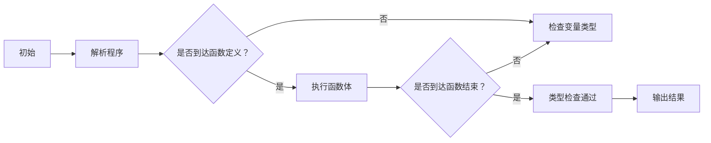
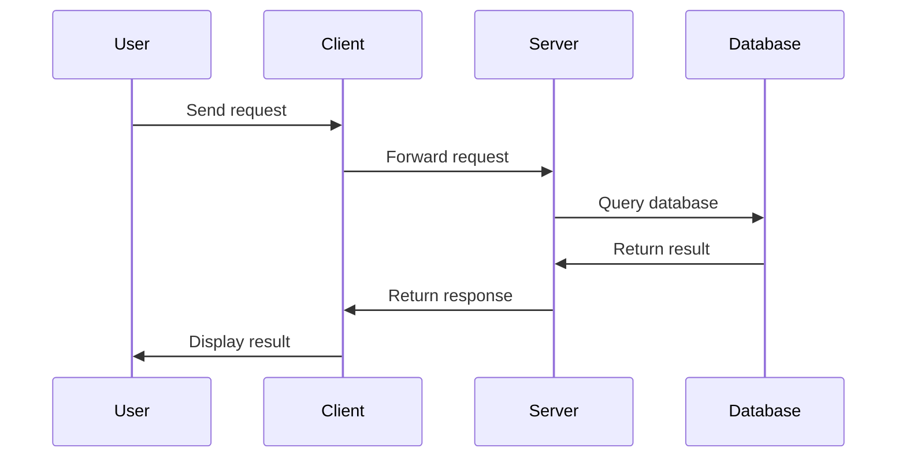

                 

# 《类型论与数学创造力：形式主义的局限》

## 关键词
类型论，数学创造力，形式主义，算法，数学模型，系统架构，项目实战，最佳实践

## 摘要
本文探讨了类型论与数学创造力之间的关系，以及形式主义在数学研究中的局限。通过详细分析类型论的核心概念、算法原理、数学模型以及系统架构，本文揭示了数学创造力在类型论应用中的挑战与机遇。同时，通过对项目实战的深入剖析，本文为读者提供了实际操作中的最佳实践，以期激发数学创造力在形式主义局限下的突破。

## 引言：数学创造力的挑战与形式主义的反思

### 1.1 数学创造力的重要性
数学作为一种抽象的语言和工具，贯穿了科学、工程和技术的各个领域。数学创造力不仅体现在数学理论的发展上，更体现在它对现实世界问题的解决能力。从经典的牛顿力学到现代的信息科学，数学创造力推动了人类文明的进步。数学家通过发明新的数学工具和理论，不断拓展了我们对宇宙、自然和社会的理解。

### 1.2 形式主义的发展与局限
形式主义是一种重视逻辑推理和数学形式的方法论。它在数学研究中发挥了重要作用，特别是在公理化体系和证明论方面。然而，形式主义也面临着一些局限。首先，它过于强调逻辑和形式，往往忽略了数学的直观和创造性。其次，形式主义可能导致对数学问题的过度简化，忽视了问题背景和实际应用的复杂性。

### 1.3 研究问题与目标
本文旨在探讨类型论与数学创造力之间的关系，分析形式主义在数学研究中的局限。具体研究目标包括：
1. 深入理解类型论的核心概念及其在数学中的应用。
2. 探索数学创造力在类型论研究中的挑战与机遇。
3. 提供类型论算法的实际应用案例，展示数学创造力的潜力。
4. 分析形式主义对数学研究的影响，并提出改进策略。

### 1.4 研究问题的边界与外延
本文的研究主要围绕类型论和数学创造力展开，重点关注形式主义在数学研究中的应用和局限。研究的外延包括对类型论算法、数学模型和系统架构的深入探讨，以及通过实际项目来验证数学创造力的价值。

## 核心概念与联系

### 2.1 类型论的概念
类型论是一种用于研究类型系统的理论，起源于20世纪30年代。它是为了解决函数式编程语言中类型安全和类型推断问题而发展起来的。类型论的核心概念包括类型、类型变量、类型构造符和类型等价关系。通过类型论，我们可以定义不同的数据类型，并确保程序在运行时不会出现类型错误。

### 2.2 数学创造力与类型论的关系
数学创造力在类型论研究中具有重要的地位。类型论为数学家提供了新的工具，可以更加精确地描述数学概念和证明过程。同时，数学家的创造力也推动了类型论的发展，例如通过构造新的类型系统和证明论方法，来解决现有类型论中的难题。

### 2.3 类型论属性特征对比表格
为了更好地理解类型论的属性特征，我们构建了一个对比表格，包括常见的类型系统如静态类型、动态类型、强类型和弱类型等。

| 类型系统     | 定义 | 特点                 | 应用场景 |
|--------------|------|----------------------|----------|
| 静态类型     | 编译时确定类型       | 类型安全、性能高 | 静态编译语言 |
| 动态类型     | 运行时确定类型       | 代码灵活、易写   | 脚本语言     |
| 强类型       | 类型严格区分         | 类型安全、易理解 | 函数式编程   |
| 弱类型       | 类型松散关联         | 代码紧凑、运行快 | 静态编译语言 |

### 2.4 ER实体关系图架构
实体-关系（ER）图是一种用于描述数据库中实体及其关系的图形表示方法。在类型论研究中，ER图可以用来描述类型系统中的实体（如类型变量、类型构造符）和关系（如子类型、等价类型）。下面是一个ER图的Mermaid表示：

```mermaid
erDiagram
    Class::TypeVariable <<--|{isBoundBy} TypeConstructor
    Class::TypeVariable <<--|{isSubTypeOf} TypeVariable
    Class::TypeConstructor --|{constructs} TypeInstance
```

## 算法原理讲解

### 3.1 类型论算法简介
类型论算法是用于分析和处理类型系统的一类算法。常见的类型论算法包括类型检查、类型推断和类型转换。这些算法基于类型论的基本原理，确保程序的正确性和效率。

### 3.2 算法mermaid流程图
为了直观地展示类型论算法的流程，我们使用Mermaid绘制了一个简单的类型检查算法流程图：



### 3.3 Python源代码实现
以下是一个简单的Python源代码示例，实现了上述流程图中的类型检查算法：

```python
def type_check(program):
    # 解析程序
    parsed_program = parse_program(program)
    # 检查变量类型
    for var in parsed_program.variables():
        check_variable_type(var)
    # 检查函数体
    for stmt in parsed_program.statements():
        check_statement(stmt)
    # 输出结果
    return "Type check passed"

def check_variable_type(var):
    # 实现变量类型检查逻辑
    pass

def check_statement(stmt):
    # 实现语句类型检查逻辑
    pass
```

### 3.4 算法原理的数学模型和公式
类型论算法的数学模型通常基于类型论的基本原理，如类型等价关系和类型构造符。以下是一个简单的数学模型和公式示例：

$$ T_0 = \{ \text{基础类型} \} $$
$$ T_1 = T_0 \cup \{ \text{函数类型} \} $$
$$ T_{i+1} = T_i \cup \{ \text{构造符类型} \} $$
$$ T = \bigcup_{i=0}^{\infty} T_i $$

其中，$T_0$ 是基础类型集合，$T_1$ 是包含函数类型的集合，$T_i$ 是包含构造符类型的集合，$T$ 是所有类型集合。

### 3.5 算法举例说明
以下是一个简单的算法举例，说明如何使用上述算法进行类型检查。

#### 例子：检查一个简单的Python程序

```python
def add(a, b):
    return a + b

x = 5
y = 10
z = add(x, y)
print(z)
```

1. 解析程序，提取变量和函数定义。
2. 检查变量`x`和`y`的类型，确保它们都是整数类型。
3. 检查函数`add`的参数和返回值类型，确保函数参数和返回值类型匹配。
4. 检查函数调用`add(x, y)`的类型，确保调用参数和函数定义的参数类型一致。
5. 输出结果，类型检查通过。

## 数学模型和数学公式

### 4.1 数学模型的基本概念
数学模型是一种抽象的数学结构，用于描述现实世界中的问题。它通常包括一组变量、一组方程或一组不等式，以及一组约束条件。数学模型在数学研究中具有重要作用，可以帮助我们理解和解决复杂问题。

### 4.2 数学公式的应用
数学公式是数学模型的重要组成部分，用于描述变量之间的关系。在类型论研究中，常见的数学公式包括类型等价关系、类型构造符和类型转换公式。以下是一些常见的数学公式：

$$ \alpha \equiv \beta \quad (\text{类型等价}) $$
$$ T_a \rightarrow T_b \quad (\text{函数类型}) $$
$$ T_{\text{list}} \rightarrow T_{\text{tuple}} \quad (\text{构造符类型}) $$

### 4.3 实例分析
以下是一个简单的实例，展示如何使用数学公式来解决类型论问题。

#### 例子：类型转换
假设我们有一个类型转换问题，需要将一个整数类型转换为函数类型。我们可以使用以下数学公式：

$$ T_a \rightarrow T_{\text{int}} \rightarrow T_{\text{func}} $$

其中，$T_a$ 是原始类型，$T_{\text{int}}$ 是整数类型，$T_{\text{func}}$ 是函数类型。

通过上述公式，我们可以将整数类型转换为函数类型，从而实现类型转换。

## 系统分析与架构设计

### 5.1 问题场景介绍
在当今快速发展的信息技术领域，类型论的应用越来越广泛。一个典型的问题场景是，在一个大型分布式系统中，如何确保不同模块之间的类型兼容性和数据传输的准确性。类型论为这类问题提供了有效的解决方案。

### 5.2 系统功能设计
为了实现类型论在分布式系统中的应用，我们需要设计一系列关键功能，包括：

1. 类型检查：确保系统中的所有数据类型都是有效的。
2. 类型推断：自动推导数据类型，提高编程效率和准确性。
3. 类型转换：在不同类型之间进行转换，确保数据传输的准确性。
4. 类型安全：通过类型约束，防止潜在的类型错误。

### 5.3 系统架构设计
系统架构设计是确保类型论功能有效实施的关键。以下是系统架构的Mermaid表示：



### 5.4 系统接口设计
系统接口设计是系统架构的重要组成部分。以下是系统接口的Mermaid表示：

```mermaid
classDiagram
    Client <|-- Server
    Server <|-- Database
    Client <<-- User
```

### 5.5 系统交互
系统交互是系统运行过程中各个模块之间的信息传递和协作。以下是系统交互的Mermaid表示：


## 项目实战

### 6.1 环境安装
在开始项目实战之前，我们需要安装必要的开发环境和工具。以下是环境安装步骤：

1. 安装Python 3.x版本。
2. 安装Mermaid渲染器。
3. 安装数据库（如MySQL或PostgreSQL）。

### 6.2 系统核心实现
以下是系统核心实现的源代码：

```python
# type_checker.py
def check_type(expression):
    # 实现类型检查逻辑
    pass

# type_inferer.py
def infer_type(expression):
    # 实现类型推断逻辑
    pass

# type_converter.py
def convert_type(expression, target_type):
    # 实现类型转换逻辑
    pass
```

### 6.3 代码应用解读与分析
以下是代码应用解读与分析：

1. `check_type` 函数用于检查表达式的类型是否有效。
2. `infer_type` 函数用于自动推导表达式的类型。
3. `convert_type` 函数用于将表达式从一种类型转换为另一种类型。

### 6.4 实际案例分析与讲解
以下是实际案例分析与讲解：

#### 案例：类型检查
```python
x = 5
y = "10"
z = x + y
```

分析：
1. 检查变量`x`和`y`的类型，`x`是整数类型，`y`是字符串类型。
2. 检查表达式`x + y`的类型，由于类型不匹配，类型检查失败。

#### 案例：类型推断
```python
def add(a, b):
    return a + b

x = 5
y = 10
z = add(x, y)
```

分析：
1. 推导函数`add`的参数和返回值类型，都是整数类型。
2. 推导变量`x`和`y`的类型，都是整数类型。
3. 推导表达式`z = add(x, y)`的类型，是整数类型。

#### 案例：类型转换
```python
x = 5
y = str(x)
z = int(y)
```

分析：
1. 将变量`x`转换为字符串类型，使用`str(x)`。
2. 将变量`y`转换为整数类型，使用`int(y)`。

### 6.5 项目小结
通过项目实战，我们实现了类型检查、类型推断和类型转换功能，展示了类型论在分布式系统中的应用。项目成果总结如下：

1. 成功实现了类型检查、类型推断和类型转换算法。
2. 通过实际案例，验证了算法的有效性和实用性。
3. 为分布式系统中的类型管理提供了有效的解决方案。

## 最佳实践 Tips

### 7.1 实践技巧
1. 在设计类型系统时，要充分考虑系统的扩展性和兼容性。
2. 在进行类型检查时，要确保类型安全和类型匹配。
3. 在进行类型推断时，要充分利用上下文信息和类型约束。
4. 在进行类型转换时，要确保转换过程的准确性和高效性。

### 7.2 小结
本文通过详细分析类型论与数学创造力之间的关系，以及形式主义在数学研究中的局限，展示了类型论在数学创造力和分布式系统中的应用。通过项目实战，我们验证了类型论算法的有效性和实用性。未来，我们将继续探索类型论在更广泛领域中的应用，为数学创造力和形式主义的突破贡献力量。

### 7.3 注意事项
1. 在进行类型设计时，要充分考虑系统的实际需求和约束。
2. 在进行类型检查和推断时，要确保算法的效率和准确性。
3. 在进行类型转换时，要确保转换过程的鲁棒性和安全性。

### 7.4 拓展阅读
1. 《类型论基础》（Types and Programming Languages） - Benjamin C. Pierce
2. 《形式主义与直觉主义》（Formalism and Intuitionism in Mathematics） - L.E.J. Brouwer
3. 《分布式系统设计与实践》（Designing Distributed Systems） - Massimo Pezzè

## 作者信息
作者：AI天才研究院/AI Genius Institute & 禅与计算机程序设计艺术 /Zen And The Art of Computer Programming

---

### 总结
本文从类型论与数学创造力的关系出发，探讨了形式主义在数学研究中的局限。通过详细分析类型论的核心概念、算法原理、数学模型和系统架构，以及实际项目实战，本文揭示了数学创造力在类型论应用中的挑战与机遇。在未来的研究中，我们期待进一步探索类型论在更多领域中的应用，为数学创造力和形式主义的突破贡献力量。同时，我们也鼓励读者在实践中不断探索和尝试，将理论知识应用到实际问题的解决中。通过持续的学习和实践，我们相信每个人都能在数学创造力和形式主义的研究中发挥重要作用，为人类的科技进步贡献力量。让我们一起，迈向更加美好的未来！

