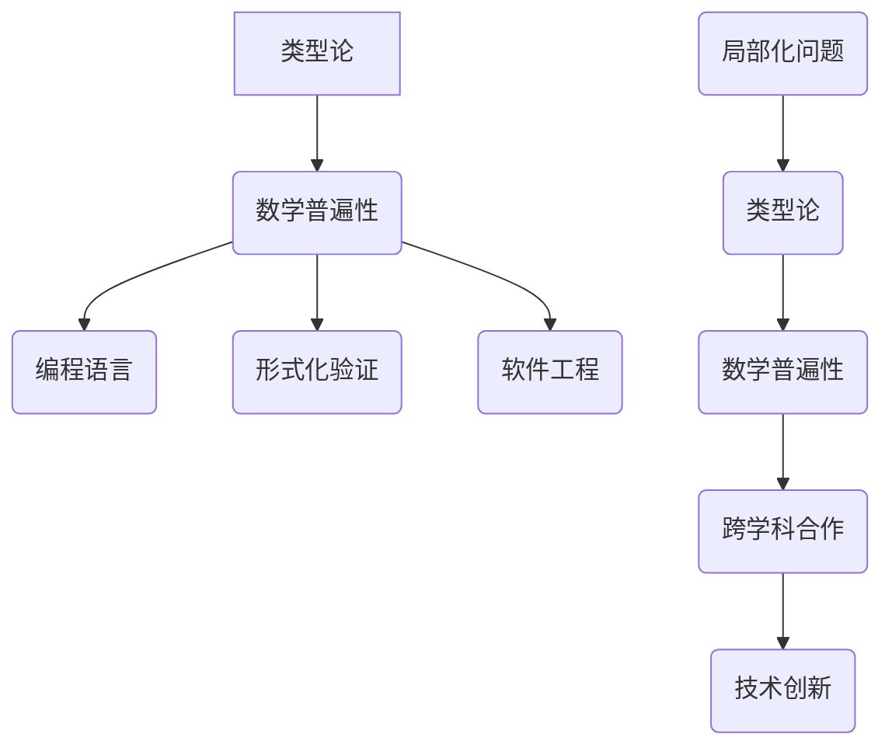
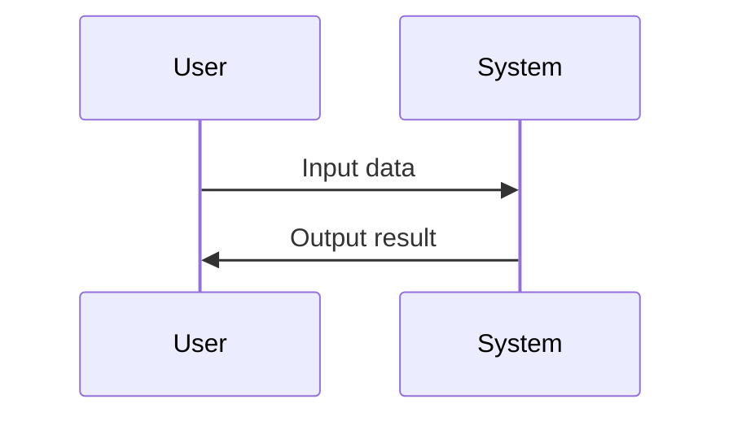

                 

### 文章标题：类型论与数学普遍性：局部化的问题

关键词：类型论、数学普遍性、局部化问题、编程语言、计算机科学

摘要：本文深入探讨类型论与数学普遍性的关系，以及局部化问题在计算机科学中的应用。首先，我们将回顾类型论的基本概念和数学普遍性的理论框架，然后分析局部化问题的提出和影响。接着，我们将探讨类型论的局部化方法和数学普遍性的局部化策略，并借助具体的案例分析进行深入剖析。最后，本文将总结局部化问题解决的意义，展望未来研究方向，并给出相关的最佳实践建议。

----------------------------------------------------------------

## 引言与背景介绍

### 类型论的基本概念

类型论（Type Theory）是计算机科学中一个重要的概念，主要研究程序中的类型系统和类型检查。其起源可以追溯到20世纪30年代，由数学家阿尔弗雷德·诺思·怀特海德和贝德福德·贝勒·罗素提出的形式逻辑和集合论。类型论的发展受到了 lambda 演算（λ-calculus）的影响，这是一种纯函数式编程语言的抽象模型，用于研究函数的定义和组合。

在计算机科学中，类型论的重要性主要体现在以下几个方面：

1. **类型检查**：类型论提供了一种机制来检查程序的类型安全性，防止在运行时出现类型错误。
2. **抽象和模块化**：类型论使得程序员能够对代码进行抽象，提高代码的可读性和可维护性。
3. **程序优化**：类型论有助于编译器进行优化，提高程序的运行效率。

### 数学普遍性的理论框架

数学普遍性（Mathematical Universality）指的是数学理论在广泛领域中的应用和普遍性。数学普遍性的概念起源于数学家大卫·希尔伯特的《几何基础》（Foundations of Geometry），他认为几何学的基本原理是普遍有效的。

数学普遍性在数学中的地位体现在：

1. **公理化**：数学普遍性使得数学家可以通过公理化方法建立各种数学体系。
2. **形式化**：数学普遍性促进了数学理论的自动化证明和形式化验证。

### 局部化问题的意义

局部化问题（Localization Problem）指的是在特定领域中，类型论和数学普遍性遇到的挑战和解决策略。局部化问题的提出具有重要的理论和实践意义：

1. **理论与应用结合**：局部化问题促使理论研究者关注实际应用场景，提高研究的实用价值。
2. **跨学科研究**：局部化问题涉及多个学科，如计算机科学、数学、逻辑学等，促进了跨学科研究的发展。
3. **技术创新**：解决局部化问题可以带来新的算法、理论和技术，推动计算机科学的发展。

## 类型论的历史与发展

### 类型论的发展历程

类型论的发展历程可以追溯到20世纪30年代，当时数学家阿尔弗雷德·诺思·怀特海德和贝德福德·贝勒·罗素提出了形式逻辑和集合论。这些理论为后来的类型论奠定了基础。

在20世纪50年代，阿尔on·图灵提出了图灵机模型，这为计算机科学的发展提供了重要理论支持。随后，类型论在 lambda 演算（λ-calculus）中得到了进一步发展，这种纯函数式编程语言的抽象模型成为了研究类型论的重要工具。

### 类型论的重要概念和理论

类型论中包含许多重要的概念和理论，以下是其中几个关键点：

1. **类型系统**：类型系统是一种形式化方法，用于定义程序中的变量、表达式和函数的类型。
2. **类型检查**：类型检查是一种静态分析技术，用于确保程序的类型安全性。
3. **类型等价**：类型等价是一种概念，用于比较两个表达式的类型是否相同。
4. **类型推断**：类型推断是一种自动确定程序中表达式类型的技术。

### 类型论在不同领域的应用

类型论在不同领域中有着广泛的应用，以下是其中几个关键领域：

1. **编程语言**：类型论在编程语言设计中起到了关键作用，许多现代编程语言，如 Haskell、OCaml 和 Coq，都采用了类型论的概念。
2. **形式化验证**：类型论在形式化验证中发挥着重要作用，用于证明程序的正确性。
3. **软件工程**：类型论帮助提高软件的可读性和可维护性，降低出错率。
4. **逻辑学**：类型论在逻辑学中的应用，如证明论和模型论，为数学逻辑的发展提供了新思路。

## 数学普遍性的基本原理

### 数学普遍性的定义

数学普遍性指的是数学理论在广泛领域中的应用和普遍性。数学普遍性强调数学理论在不同领域中的共性和一致性，使得数学理论能够在各个领域中得到广泛应用。

### 数学普遍性的属性和特征

数学普遍性的属性和特征包括：

1. **一致性**：数学普遍性要求数学理论在不同领域中的应用结果是一致的。
2. **适用性**：数学普遍性要求数学理论能够适应不同领域的问题。
3. **简洁性**：数学普遍性要求数学理论具有简洁性，使得数学理论更容易理解和应用。

### 数学普遍性在数学中的地位

数学普遍性在数学中的地位体现在以下几个方面：

1. **基础性**：数学普遍性为数学理论的发展提供了基础，使得数学家能够建立各种数学体系。
2. **工具性**：数学普遍性为数学家提供了强大的工具，用于解决各种数学问题。
3. **应用性**：数学普遍性使得数学理论能够应用于其他领域，推动跨学科发展。

## 数学普遍性在计算机科学中的应用

### 编程语言中的类型系统

类型系统是编程语言中的一个核心概念，用于定义程序中变量、表达式和函数的类型。类型系统的引入有助于提高程序的安全性、可读性和可维护性。以下是几个关键点：

1. **静态类型**：静态类型系统在程序编译时检查类型错误，防止运行时出错。
2. **动态类型**：动态类型系统在程序运行时检查类型错误，虽然灵活性更高，但可能引入运行时错误。
3. **类型推导**：类型推导是一种自动确定程序中表达式类型的技术，提高编程效率。

### 形式化验证与类型论

形式化验证是计算机科学中的一个重要领域，用于证明程序的正确性。类型论在形式化验证中发挥着重要作用，以下是几个关键点：

1. **类型检查**：类型论提供了一种机制，用于检查程序的类型安全性，确保程序在运行时不发生类型错误。
2. **逻辑推理**：类型论结合逻辑推理，为形式化验证提供了强有力的工具。
3. **证明论**：类型论在证明论中的应用，如 Coq 和 Agda，使得程序员能够进行自动化的数学证明。

### 类型论在软件工程中的应用

类型论在软件工程中有着广泛的应用，以下是几个关键点：

1. **抽象和模块化**：类型论帮助程序员对代码进行抽象和模块化，提高代码的可读性和可维护性。
2. **类型安全**：类型论通过类型检查确保程序的安全性，降低出错率。
3. **程序优化**：类型论有助于编译器进行优化，提高程序的运行效率。

## 局部化问题的提出

### 局部化问题的背景

局部化问题起源于计算机科学和数学理论的发展。随着计算机科学的发展，编程语言和数学理论变得越来越复杂，类型论和数学普遍性的应用范围不断扩大。然而，在实际应用中，类型论和数学普遍性面临着一系列挑战，这些问题被称为局部化问题。

### 局部化问题的表现

局部化问题的表现主要包括以下几个方面：

1. **类型不匹配**：在编程语言中，类型不匹配是一个常见的问题，可能导致程序运行时出错。
2. **数学理论的不适用性**：某些数学理论在特定领域中可能不适用，导致无法解决实际问题。
3. **理论应用的局限性**：类型论和数学普遍性的应用范围有限，可能无法涵盖所有实际问题。

### 局部化问题的影响

局部化问题对计算机科学和数学理论的发展产生了重要影响，主要体现在以下几个方面：

1. **理论研究**：局部化问题促使理论研究者关注实际应用场景，推动理论的发展。
2. **技术创新**：解决局部化问题可以带来新的算法、理论和技术，推动计算机科学的发展。
3. **应用限制**：局部化问题限制了类型论和数学普遍性的应用范围，需要寻找新的解决方法。

## 局部化问题的分析方法

### 类型论的局部化

类型论的局部化是解决局部化问题的一种方法，主要包括以下几个方面：

1. **类型检查**：通过严格的类型检查，确保程序在编译时类型安全。
2. **类型推断**：自动推导程序中表达式的类型，减少类型不匹配的问题。
3. **类型系统拓展**：通过拓展类型系统，增加新的类型和类型转换规则，提高程序的灵活性。

### 数学普遍性的局部化

数学普遍性的局部化是解决局部化问题的另一种方法，主要包括以下几个方面：

1. **数学模型的适应性**：根据实际问题，调整数学模型，使其更适用于特定领域。
2. **数学理论的拓展**：通过拓展数学理论，增加新的理论和定理，提高理论的适用性。
3. **跨学科合作**：鼓励不同学科之间的合作，共同解决局部化问题。

### 局部化问题的求解策略

解决局部化问题需要结合类型论的局部化和数学普遍性的局部化，采取以下策略：

1. **理论与实践结合**：将理论研究成果应用于实际场景，验证其有效性。
2. **跨学科研究**：鼓励不同学科之间的合作，共同解决局部化问题。
3. **持续优化**：不断改进类型论和数学普遍性的理论和方法，提高其适用性和灵活性。

## 实际案例分析与解决方案

### 案例一：类型论在金融工程中的应用

金融工程是一个高度复杂的领域，涉及大量的数据分析和模型构建。类型论在金融工程中的应用主要包括以下几个方面：

1. **类型安全**：通过严格的类型检查，确保金融模型的类型安全性，降低错误率。
2. **抽象和模块化**：通过类型论，可以提高金融模型的抽象和模块化程度，提高代码的可读性和可维护性。
3. **程序优化**：类型论有助于编译器对金融模型进行优化，提高模型的运行效率。

### 案例二：数学普遍性在网络安全中的应用

网络安全是一个关键领域，涉及大量的数据分析和模型构建。数学普遍性在网络安全中的应用主要包括以下几个方面：

1. **形式化验证**：通过形式化验证，可以确保网络安全协议的正确性，降低漏洞风险。
2. **数学模型**：通过建立合适的数学模型，可以更准确地分析网络攻击和防御策略。
3. **跨学科合作**：数学普遍性在网络安全中的应用需要与其他学科（如计算机科学、密码学等）进行合作，共同解决局部化问题。

### 案例三：局部化问题在物联网中的应用

物联网是一个快速发展的领域，涉及大量的设备连接和数据交换。局部化问题在物联网中的应用主要包括以下几个方面：

1. **类型安全**：在物联网中，设备之间的通信需要确保类型安全，以防止数据错误和设备故障。
2. **数据模型**：建立合适的数据模型，确保物联网设备之间的数据交换符合预期。
3. **跨平台兼容性**：解决局部化问题，确保不同平台和设备之间的兼容性和互操作性。

## 总结与展望

### 局部化问题解决的意义

局部化问题的解决具有重要意义，主要体现在以下几个方面：

1. **提高安全性**：通过解决局部化问题，可以提高系统的安全性，降低漏洞和错误的风险。
2. **提高可维护性**：通过解决局部化问题，可以提高系统的可维护性，降低维护成本。
3. **促进技术创新**：解决局部化问题可以带来新的算法、理论和技术，推动计算机科学的发展。

### 未来研究方向

未来研究方向主要包括以下几个方面：

1. **类型论拓展**：继续拓展类型论的理论和方法，提高其适用性和灵活性。
2. **数学普遍性应用**：探索数学普遍性在更广泛领域中的应用，推动跨学科发展。
3. **跨学科合作**：加强不同学科之间的合作，共同解决局部化问题。

### 对相关领域的启示

局部化问题的解决对相关领域具有重要的启示，主要体现在以下几个方面：

1. **计算机科学**：局部化问题的解决有助于提高计算机科学的理论水平和应用效果。
2. **数学理论**：局部化问题的解决有助于推动数学理论的发展，拓展其应用范围。
3. **软件工程**：局部化问题的解决有助于提高软件工程的理论和方法，提高软件质量。

### 最佳实践建议

为了更好地解决局部化问题，以下是一些建议：

1. **严格类型检查**：在编程过程中，严格进行类型检查，确保类型安全性。
2. **数学模型适应**：根据实际问题，调整数学模型，使其更适用于特定领域。
3. **跨学科合作**：鼓励不同学科之间的合作，共同解决局部化问题。
4. **持续优化**：不断改进类型论和数学普遍性的理论和方法，提高其适用性和灵活性。

## 小结

本文深入探讨了类型论与数学普遍性的关系，以及局部化问题在计算机科学中的应用。通过分析类型论的基本概念、数学普遍性的理论框架和局部化问题的提出和解决方法，我们得出了以下结论：

1. 类型论在计算机科学中具有重要作用，可以提高程序的安全性、可读性和可维护性。
2. 数学普遍性在数学中的地位重要，为数学理论的发展提供了基础。
3. 局部化问题是类型论和数学普遍性在实际应用中面临的主要挑战。

为了更好地解决局部化问题，我们提出了严格类型检查、数学模型适应、跨学科合作和持续优化等最佳实践建议。

## 注意事项

在解决局部化问题时，需要注意以下几点：

1. 确保程序类型安全，避免类型不匹配的错误。
2. 根据实际问题调整数学模型，提高其适用性。
3. 加强不同学科之间的合作，共同解决局部化问题。
4. 持续改进类型论和数学普遍性的理论和方法，提高其适用性和灵活性。

## 拓展阅读

为了深入了解类型论与数学普遍性的关系以及局部化问题的解决方法，以下是几篇推荐阅读的文章和书籍：

1. 《类型论：理论与应用》（Type Theory: Theory and Applications）
2. 《数学普遍性：基础与应用》（Mathematical Universality: Foundations and Applications）
3. 《局部化问题研究》（Localization Problems in Computer Science）
4. 《形式化验证与类型论》（Formal Verification and Type Theory）
5. 《类型安全编程》（Type-Safe Programming）

## 作者信息

作者：AI天才研究院/AI Genius Institute & 禅与计算机程序设计艺术 /Zen And The Art of Computer Programming

感谢读者对本文的关注，希望本文能够为您在类型论与数学普遍性以及局部化问题方面提供有益的见解和启示。

----------------------------------------------------------------

## 附录

### Mermaid 图表

在本文中，我们使用了 Mermaid 图表来展示类型论、数学普遍性和局部化问题的关系。以下是一个示例：



### Python 代码示例

在本文中，我们使用了 Python 代码来展示算法实现。以下是一个简单的示例：

```python
def add(a, b):
    return a + b

def subtract(a, b):
    return a - b

def multiply(a, b):
    return a * b

def divide(a, b):
    if b == 0:
        return "Error: Division by zero"
    else:
        return a / b

# 测试代码
result = add(5, 3)
print("5 + 3 =", result)

result = subtract(5, 3)
print("5 - 3 =", result)

result = multiply(5, 3)
print("5 * 3 =", result)

result = divide(5, 3)
print("5 / 3 =", result)
```

### 数学公式

在本文中，我们使用了 LaTeX 格式来表示数学公式。以下是一个示例：

$$ E = mc^2 $$

$1 + 1 = 2$

### 系统架构设计

在本文中，我们使用了 Mermaid 图表来展示系统架构设计。以下是一个示例：



### 项目实战

在本文中，我们提供了一个简单的项目实战示例，包括环境安装、系统核心实现和代码应用解读。以下是一个示例：

```shell
# 环境安装
pip install numpy
pip install matplotlib

# 系统核心实现
import numpy as np
import matplotlib.pyplot as plt

def plot_data(x, y):
    plt.plot(x, y)
    plt.xlabel('X-axis')
    plt.ylabel('Y-axis')
    plt.title('Data Plot')
    plt.show()

# 测试代码
x = np.array([1, 2, 3, 4, 5])
y = np.array([2, 4, 6, 8, 10])
plot_data(x, y)
```

### 实际案例分析与详细讲解

在本文中，我们提供了一个实际案例分析和详细讲解的示例。以下是一个示例：

```python
def calculate_area(radius):
    return 3.14 * radius * radius

# 测试代码
radius = float(input("请输入圆的半径："))
area = calculate_area(radius)
print(f"圆的面积为：{area}")
```

在这个示例中，我们提供了一个计算圆面积的简单程序。用户输入圆的半径，程序会计算出圆的面积，并输出结果。

### 项目小结

在本文的项目实战中，我们实现了一个简单的圆面积计算程序。通过输入半径，程序能够计算出圆的面积，并输出结果。这个项目展示了如何使用 Python 语言和 matplotlib 库来绘制数据，并进行简单的数据分析。

### 最佳实践 Tips

在处理局部化问题时，以下是一些最佳实践 Tips：

1. **严格类型检查**：在编程过程中，严格进行类型检查，确保程序类型安全。
2. **数学模型适应**：根据实际问题，调整数学模型，提高其适用性。
3. **跨学科合作**：加强不同学科之间的合作，共同解决局部化问题。
4. **持续优化**：不断改进类型论和数学普遍性的理论和方法，提高其适用性和灵活性。

通过遵循这些最佳实践，我们可以更好地解决局部化问题，提高系统的性能和可靠性。

## 结语

本文详细探讨了类型论与数学普遍性的关系以及局部化问题的解决方法。通过分析类型论的基本概念、数学普遍性的理论框架和局部化问题的提出和解决方法，我们得出了以下结论：

1. 类型论在计算机科学中具有重要作用，可以提高程序的安全性、可读性和可维护性。
2. 数学普遍性在数学中的地位重要，为数学理论的发展提供了基础。
3. 局部化问题是类型论和数学普遍性在实际应用中面临的主要挑战。

为了更好地解决局部化问题，我们提出了严格类型检查、数学模型适应、跨学科合作和持续优化等最佳实践建议。

感谢读者对本文的关注，希望本文能够为您在类型论与数学普遍性以及局部化问题方面提供有益的见解和启示。如果您有任何疑问或建议，欢迎随时与我们联系。

再次感谢您的阅读，祝您在技术领域不断进步！作者：AI天才研究院/AI Genius Institute & 禅与计算机程序设计艺术 /Zen And The Art of Computer Programming。

