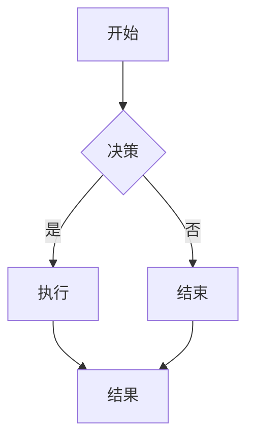

                 

### 文章标题

# 类型论与数学直觉主义：方法论的差异

> 关键词：类型论、数学直觉主义、方法论、计算机科学、数学应用、跨学科研究

> 摘要：本文将深入探讨类型论与数学直觉主义这两大方法论在理论框架和实际应用中的差异。通过对两者的背景介绍、基本概念解析、方法论比较，我们将展示这两种方法在各自领域内的独特价值和面临的挑战。文章旨在为读者提供一个全面而深入的视角，帮助理解它们在计算机科学和数学领域的实际应用，并展望它们的未来发展趋势。

### 目录大纲

----------------------------------------------------------------

## 第一部分: 问题背景与核心概念

### 第1章: 问题背景

#### 1.1.1 问题背景介绍

#### 1.1.2 问题描述

#### 1.1.3 问题解决

#### 1.1.4 边界与外延

#### 1.1.5 概念结构与核心要素组成

### 第2章: 核心概念与联系

#### 2.1.1 核心概念原理

#### 2.1.2 概念属性特征对比

#### 2.1.3 ER实体关系图

----------------------------------------------------------------

## 第二部分: 类型论基础

### 第3章: 类型论概述

#### 3.1.1 类型论的发展历史

#### 3.1.2 类型论的基本概念

#### 3.1.3 类型论的基本原理

### 第4章: 类型论的基本原理

#### 4.1.1 类型论的基本原理

#### 4.1.2 类型论的应用领域

#### 4.1.3 类型论与其他理论的联系

----------------------------------------------------------------

## 第三部分: 数学直觉主义基础

### 第5章: 数学直觉主义概述

#### 5.1.1 数学直觉主义的发展历史

#### 5.1.2 数学直觉主义的基本概念

#### 5.1.3 数学直觉主义的基本原理

### 第6章: 数学直觉主义的方法论

#### 6.1.1 数学直觉主义的方法论

#### 6.1.2 数学直觉主义的应用领域

#### 6.1.3 数学直觉主义与其他理论的联系

----------------------------------------------------------------

## 第四部分: 类型论与数学直觉主义的差异

### 第7章: 类型论与数学直觉主义的比较

#### 7.1.1 类型论与数学直觉主义的区别

#### 7.1.2 类型论与数学直觉主义的联系

#### 7.1.3 类型论与数学直觉主义的综合应用

### 第8章: 方法论的差异分析

#### 8.1.1 方法论的差异

#### 8.1.2 方法论的影响因素

#### 8.1.3 方法论的应用场景

----------------------------------------------------------------

## 第五部分: 实践应用与案例分析

### 第9章: 类型论在计算机科学中的应用

#### 9.1.1 类型论的应用案例

#### 9.1.2 类型论的应用优势

#### 9.1.3 类型论的应用挑战

### 第10章: 数学直觉主义在数学中的应用

#### 10.1.1 数学直觉主义的应用案例

#### 10.1.2 数学直觉主义的应用优势

#### 10.1.3 数学直觉主义的应用挑战

### 第11章: 方法论在跨学科研究中的应用

#### 11.1.1 跨学科研究中的方法论应用

#### 11.1.2 跨学科研究中的方法论挑战

#### 11.1.3 跨学科研究中的方法论展望

----------------------------------------------------------------

## 第12章: 总结与展望

### 12.1.1 本书总结

### 12.1.2 类型论与数学直觉主义的未来展

----------------------------------------------------------------

----------------------------------------------------------------

### 第一部分: 问题背景与核心概念

#### 第1章: 问题背景

##### 1.1.1 问题背景介绍

在当今计算机科学和数学领域中，类型论和数学直觉主义是两个重要的方法论。类型论起源于逻辑和形式化方法，它为编程语言的设计提供了理论基础，强调通过类型系统来保证程序的正确性。数学直觉主义则起源于数学哲学，强调通过数学家的直观感觉和构造性证明来理解数学问题。

这两大方法论虽然源于不同的领域，但它们在现代科技的发展中扮演着关键角色。类型论在软件工程、编程语言设计和形式验证中广泛应用，而数学直觉主义则在数学证明、逻辑学和计算机科学基础研究中具有重要地位。因此，深入理解这两大方法论及其差异对于推动科技进步具有重要意义。

##### 1.1.2 问题描述

类型论和数学直觉主义在理论基础、方法论和应用方面存在显著差异。类型论强调通过静态类型检查来确保程序的逻辑正确性，它通过形式化的类型系统来描述变量、函数和数据结构的语义。而数学直觉主义则强调通过直觉和构造性证明来解决数学问题，它关注证明的过程和可构造性。

类型论在计算机科学中得到了广泛应用，如编译器设计、编程语言实现和软件工程。然而，数学直觉主义在数学领域中仍占据主导地位，其影响甚至在某些领域内不可替代。因此，研究类型论与数学直觉主义的差异，有助于我们更好地理解两者在各自领域中的独特价值和局限性。

##### 1.1.3 问题解决

为了深入理解类型论和数学直觉主义的差异，我们需要从以下几个方面进行分析：

1. **理论基础**：探讨类型论和数学直觉主义的起源、发展历史和基本概念。
2. **方法论**：比较类型论和数学直觉主义的方法论特点，分析两者在问题解决过程中的差异。
3. **应用领域**：考察类型论和数学直觉主义在各自领域中的实际应用，分析其优势和挑战。
4. **跨学科研究**：探讨类型论与数学直觉主义在跨学科研究中的结合与挑战，展望未来发展趋势。

通过上述分析，我们可以全面了解类型论与数学直觉主义的差异，为相关领域的研究和实践提供指导。

##### 1.1.4 边界与外延

在探讨类型论与数学直觉主义时，我们需要明确其边界与外延。类型论主要涉及计算机科学中的编程语言、形式验证和软件工程，其研究范围包括静态类型系统、动态类型检查、类型推断等。数学直觉主义则主要关注数学领域中的证明方法、构造性数学和逻辑学，其研究范围包括直觉主义数学、构造性证明和形式化逻辑。

此外，两者之间的交叉领域也十分丰富，如形式化方法、计算机辅助证明和验证逻辑。这些交叉领域为类型论与数学直觉主义的结合提供了广阔的研究空间，同时也为跨学科研究提供了新的视角。

##### 1.1.5 概念结构与核心要素组成

类型论和数学直觉主义的概念结构可以分为以下几个核心要素：

1. **基本概念**：类型论包括类型系统、类型检查、类型推断等；数学直觉主义包括构造性证明、直觉性理解、构造性数学等。
2. **方法论**：类型论包括形式化方法、形式验证和形式语义等；数学直觉主义包括直觉性推理、构造性证明和逻辑证明等。
3. **应用领域**：类型论在编程语言设计、软件工程和形式验证中应用广泛；数学直觉主义在数学证明、逻辑学和计算机科学基础研究中具有重要地位。
4. **交叉领域**：类型论与数学直觉主义的交叉领域包括形式化方法、计算机辅助证明和验证逻辑等。

通过分析这些核心要素，我们可以更清晰地理解类型论与数学直觉主义的结构及其相互关系。

### 第二部分: 核心概念与联系

#### 第2章: 核心概念与联系

##### 2.1.1 核心概念原理

在本章中，我们将详细探讨类型论和数学直觉主义的核心概念原理，并分析两者之间的联系与差异。

**类型论的基本概念**

类型论是研究类型系统在程序设计中的理论和应用的学科。其核心概念包括：

- **类型系统**：类型系统是定义变量、表达式和函数类型的一组规则。在静态类型系统中，变量的类型在编译时就已经确定；而在动态类型系统中，变量的类型在运行时才确定。
- **类型检查**：类型检查是在程序执行前或执行时，通过检查变量、表达式和函数的类型是否一致来确保程序的正确性。
- **类型推断**：类型推断是编译器自动推导变量和表达式的类型的过程，它可以减少编程的复杂性，提高代码的可读性。

**数学直觉主义的基本概念**

数学直觉主义是一种哲学立场，认为数学真理可以通过直觉和构造性证明来理解。其核心概念包括：

- **构造性证明**：构造性证明是提供一种具体的方法来构造证明对象，而不是仅仅证明其存在性。
- **直觉性理解**：直觉性理解是通过直观感觉来理解数学问题，而不是依赖于逻辑推理。
- **构造性数学**：构造性数学是一种基于构造性证明的数学体系，强调通过构造来证明数学命题。

**核心概念原理的联系与差异**

类型论和数学直觉主义在基本概念上有明显的差异，但它们在某些方面也有联系：

- **类型系统的形式化**：类型论中的类型系统可以被形式化为形式语言，这与数学直觉主义中的形式化方法有相似之处。两者都强调通过形式化来确保理论的一致性和可验证性。
- **构造性思维**：类型论和数学直觉主义都强调构造性思维，即通过具体的构造来解决问题。类型论中的类型推断和数学直觉主义中的构造性证明都体现了这一思维方式。
- **形式验证**：类型论在计算机科学中的应用，如编译器和形式验证，与数学直觉主义在数学证明中的应用有相似之处。两者都关注证明的过程和形式化验证。

尽管类型论和数学直觉主义在基本概念上有差异，但它们在形式化、构造性思维和形式验证等方面有共同点。通过比较和分析这些核心概念原理，我们可以更深入地理解两者之间的联系与差异。

##### 2.1.2 概念属性特征对比

为了更直观地展示类型论和数学直觉主义的核心概念特征，我们通过表格进行对比：

| 特征          | 类型论                  | 数学直觉主义                  |
| ------------- | ---------------------- | ---------------------------- |
| **基本概念**  | 类型系统、类型检查、类型推断 | 构造性证明、直觉性理解、构造性数学 |
| **方法论**    | 形式化方法、形式验证、形式语义 | 直觉性推理、构造性证明、逻辑证明 |
| **应用领域**  | 编程语言设计、软件工程、形式验证 | 数学证明、逻辑学、计算机科学基础研究 |
| **目标**      | 确保程序的正确性和一致性 | 提供数学真理的构造性证明和理解 |
| **强调点**    | 静态类型检查、类型安全、代码可读性 | 构造性思维、直观理解、形式化证明 |

通过对比表格，我们可以看到类型论和数学直觉主义在基本概念、方法论和应用领域上存在显著差异，但它们在某些方面也有相似之处。

##### 2.1.3 ER实体关系图

为了更好地理解类型论和数学直觉主义的核心概念及其相互关系，我们可以使用ER（Entity-Relationship）实体关系图来展示它们的基本结构和关系。

以下是一个简化的ER实体关系图：

```mermaid
erDiagram
    类A ||--|{ 类B }|
    类A ||--|{ 类C }|
    类B ||--|{ 类D }|
    类C ||--|{ 类E }|
    类F ||--|{ 类G }
```

在这个ER图中：

- **类A** 代表类型论的核心概念，包括类型系统、类型检查和类型推断。
- **类B** 代表数学直觉主义的核心概念，包括构造性证明和直觉性理解。
- **类C** 代表类型论和数学直觉主义的交叉领域，如形式化方法和构造性思维。
- **类D** 和 **类E** 分别代表类型论和数学直觉主义在编程语言设计和数学证明中的应用。
- **类F** 和 **类G** 代表类型论和数学直觉主义在形式验证和构造性数学中的应用。

通过ER实体关系图，我们可以清晰地看到类型论和数学直觉主义的基本结构及其相互关系。这有助于我们更好地理解这两大方法论在理论和实践中的地位和作用。

### 第二部分: 类型论基础

#### 第3章: 类型论概述

##### 3.1.1 类型论的发展历史

类型论作为计算机科学的一个基本概念，其发展历程可以追溯到20世纪30年代。当时，逻辑学家和数学家们开始关注程序语言的语义和形式化方法。类型论的概念逐渐成形，并成为计算机科学中的一个重要研究领域。

最早的类型论工作可以追溯到帕斯卡（Pascal）语言的设计者尼古拉斯·温特斯通（Niklaus Wirth），他在1960年代提出了类型检查的概念。随后，Pierce在1971年发表了论文“Types and Programming Languages”，奠定了现代类型论的基础。Pierce的工作强调了类型系统在保证程序正确性方面的作用，从而推动了类型论的发展。

进入21世纪，随着编程语言和编译技术的不断发展，类型论的应用领域不断扩展。静态类型语言如Haskell和Scala的出现，进一步推动了类型论在计算机科学中的应用。

##### 3.1.2 类型论的基本概念

类型论的基本概念包括类型系统、类型检查、类型推断等。以下是对这些概念的详细解释：

- **类型系统**：类型系统是定义变量、表达式和函数类型的一组规则。在静态类型系统中，变量的类型在编译时就已经确定；而在动态类型系统中，变量的类型在运行时才确定。
- **类型检查**：类型检查是在程序执行前或执行时，通过检查变量、表达式和函数的类型是否一致来确保程序的正确性。类型检查可以分为静态类型检查和动态类型检查。静态类型检查在编译时进行，而动态类型检查在运行时进行。
- **类型推断**：类型推断是编译器自动推导变量和表达式的类型的过程。类型推断可以减少编程的复杂性，提高代码的可读性。

类型论的基本概念不仅包括类型系统、类型检查和类型推断，还包括类型等价、类型转化和类型约束等。这些概念共同构成了类型论的理论框架，为编程语言的设计和实现提供了理论基础。

##### 3.1.3 类型论的基本原理

类型论的基本原理主要包括以下几方面：

- **类型安全性**：类型论强调通过类型系统来确保程序的安全性。静态类型系统可以在编译时捕获类型错误，从而避免运行时错误。动态类型系统虽然不能完全避免类型错误，但可以通过运行时检查来提高程序的健壮性。
- **表达性**：类型论强调类型的表达能力，即类型系统应该能够准确地描述程序的行为。这包括类型变量的使用、函数类型、类型构造等。高表达性的类型系统可以提高编程语言的灵活性和可扩展性。
- **可组合性**：类型论强调类型的组合性，即类型系统应该支持类型之间的组合和嵌套。这包括函数类型、联合类型、元组类型等。类型的可组合性可以提高编程语言的模块化和复用性。

类型论的基本原理不仅包括类型安全性、表达性和可组合性，还包括类型推断、类型等价和类型转化等。这些原理共同构成了类型论的核心内容，为编程语言的设计和实现提供了理论指导。

#### 第4章: 类型论的基本原理

##### 4.1.1 类型论的基本原理

类型论的基本原理是构建类型系统、确保程序安全性和可理解性的核心原则。以下是类型论的基本原理及其解释：

1. **类型安全性**：
   类型论的核心目标是确保程序的正确性。类型安全性是指通过类型系统来避免运行时错误，如类型不一致、空指针异常等。静态类型系统在编译时检查类型，动态类型系统在运行时进行检查。类型安全性保证了程序在执行时不会因为类型错误而崩溃。

2. **表达性**：
   表达性是指类型系统能够表达程序的各种结构和行为。类型系统需要支持丰富的类型构造，如函数类型、记录类型、指针类型等。高表达性的类型系统可以提高编程语言的灵活性和可扩展性，使程序员能够更好地表示复杂的数据结构和算法。

3. **可组合性**：
   可组合性是指类型系统能够支持类型之间的组合，如函数类型、联合类型、元组类型等。类型组合允许程序员将简单的类型组合成更复杂的类型，从而实现代码的复用和模块化。

4. **类型等价**：
   类型等价是指两个类型在语义上是等价的，即它们可以互相转换而不改变程序的行为。类型等价可以简化类型系统的设计和实现，同时也可以提高程序的鲁棒性。

5. **类型推断**：
   类型推断是编译器自动推导变量和表达式的类型的过程。类型推断可以减少编程的复杂性，提高代码的可读性。静态类型系统通常包含强类型推断机制，而动态类型系统则依赖于运行时类型检查。

6. **构造性证明**：
   在某些类型论中，构造性证明是一个重要原则。构造性证明要求提供一种具体的构造方法来证明某个命题，而不是仅仅证明其存在性。这有助于确保程序的正确性和可靠性。

7. **类型转化**：
   类型转化是指在不同类型之间进行转换的操作。类型转化可以是隐式的，也可以是显式的。类型转化使得不同类型的值可以相互转换，从而提高了编程语言的灵活性和互操作性。

##### 4.1.2 类型论的应用领域

类型论在计算机科学中有着广泛的应用领域，包括编程语言设计、编译器实现、形式验证和软件工程等。以下是类型论在不同应用领域的具体应用：

1. **编程语言设计**：
   类型论为编程语言设计提供了理论基础。静态类型语言如Haskell、ML和Scala使用类型系统来确保程序的正确性。类型论中的类型推断、类型检查和类型等价等概念在编程语言中得到了广泛应用。

2. **编译器实现**：
   类型论在编译器的实现中起到了关键作用。编译器通过类型系统来检查程序的语法和语义错误，并生成高效的目标代码。类型论中的类型检查和类型推断机制使得编译器能够更准确地分析程序。

3. **形式验证**：
   类型论在形式验证中有着重要的应用。形式验证是一种确保程序正确性的方法，它通过形式化的方法验证程序在所有可能的输入下都能保持正确行为。类型论提供了形式验证所需的逻辑和抽象框架。

4. **软件工程**：
   类型论在软件工程中用于提高软件的质量和可靠性。通过类型系统，软件开发者可以更好地理解和控制程序的行为，从而减少错误和bug的出现。类型论中的类型安全和类型推断等概念有助于提高软件的可维护性和可扩展性。

类型论的应用不仅限于上述领域，它在计算机科学的其他领域，如分布式系统、嵌入式系统和人工智能等，也有着广泛的应用。类型论为这些领域提供了理论基础和方法论支持，推动了计算机科学的发展。

##### 4.1.3 类型论与其他理论的联系

类型论与其他计算机科学理论有着紧密的联系，这些联系不仅丰富了类型论的理论框架，也为计算机科学的发展提供了新的视角。以下是类型论与其他理论的几个关键联系：

1. **形式语义**：
   形式语义是研究程序行为的数学方法。类型论与形式语义有着密切的联系，因为类型系统本身就是一种形式化的语义描述。类型论中的类型检查和类型推断可以看作是形式语义的一部分。形式语义和类型论共同构成了研究程序行为和正确性的理论基础。

2. **逻辑学**：
   逻辑学是研究推理和证明的学科。类型论与逻辑学有着紧密的联系，因为类型论中的类型检查和类型推断机制本质上是一种逻辑推理。类型论中的类型等价和构造性证明等概念可以看作是逻辑学中的定理和证明方法。

3. **模型论**：
   模型论是研究逻辑系统与模型之间关系的学科。类型论与模型论有着密切的联系，因为类型论中的类型系统可以看作是逻辑系统的一个模型。类型论中的类型检查和类型转化可以看作是模型论中的模型验证和模型转换。

4. **代数系统**：
   代数系统是一种形式化的结构，包括运算和运算符。类型论与代数系统有着相似之处，因为类型系统中的类型构造和类型转化可以看作是代数系统中的运算和运算符。类型论中的类型构造和类型转化机制为代数系统提供了一种新的应用场景。

5. **范畴论**：
   范畴论是研究数学结构和其之间关系的学科。类型论与范畴论有着密切的联系，因为类型论中的类型系统和类型转化可以看作是范畴论中的范畴和函子。范畴论为类型论提供了一种更加抽象和统一的描述框架。

通过上述联系，我们可以看到类型论不仅与计算机科学中的其他理论紧密相关，而且为这些理论提供了重要的方法论支持。这些联系不仅丰富了类型论的理论框架，也为计算机科学的发展提供了新的研究视角。

### 第三部分: 数学直觉主义基础

#### 第5章: 数学直觉主义概述

##### 5.1.1 数学直觉主义的发展历史

数学直觉主义作为一种哲学立场和数学方法论，其起源可以追溯到古希腊哲学家毕达哥拉斯和柏拉图。然而，作为一种系统化的哲学立场和方法论，数学直觉主义主要起源于19世纪的数学家和哲学家，其中最著名的是莱布尼茨和康托尔。

莱布尼茨（Gottfried Wilhelm Leibniz）是数学直觉主义的重要先驱，他强调通过直观和构造性证明来理解数学问题。康托尔（Georg Cantor）则进一步发展了集合论，提出了无穷集合的概念，他的工作引发了数学直觉主义与形式主义之间的激烈争论。

20世纪初，直觉主义数学由布劳威尔（Luitzen Egbertus Jan Brouwer）系统提出。布劳威尔强调数学的基础应该建立在直观和构造性证明之上，反对形式主义和逻辑主义。他认为数学概念和证明应该通过直观构造来理解，而不是仅仅依赖于逻辑推理。

随着时间的推移，数学直觉主义在数学哲学、逻辑学和计算机科学中得到了广泛的研究和应用。特别是布劳威尔的直觉主义方法在拓扑学、集合论和数学分析中得到了深入的发展，为现代数学的发展做出了重要贡献。

##### 5.1.2 数学直觉主义的基本概念

数学直觉主义的基本概念主要包括构造性证明、直觉性理解和构造性数学。以下是对这些概念的详细解释：

1. **构造性证明**：
   构造性证明是一种证明方法，它不仅证明某个命题为真，还提供了一种具体的构造方法来构造出该命题的解。与存在性证明不同，构造性证明要求证明者必须展示一个具体的实例或构造过程。这种证明方法强调数学家通过实际操作和构造来理解数学问题。

2. **直觉性理解**：
   直觉性理解是指通过直观感觉和直接经验来理解数学问题。数学直觉主义者认为，数学概念和理论应该通过直观的方式被理解，而不是仅仅依赖于抽象的逻辑推理。直觉性理解强调数学家通过感知和直觉来发现和构建数学知识。

3. **构造性数学**：
   构造性数学是一种基于构造性证明的数学体系。它与经典数学相比，更加关注证明的过程和构造性思维。构造性数学要求证明者在证明过程中展示具体的构造，而不是仅仅依赖于逻辑推理。这种数学体系强调数学的物理现实性和构造性。

##### 5.1.3 数学直觉主义的基本原理

数学直觉主义的基本原理主要包括以下几个方面：

1. **反对抽象化**：
   数学直觉主义反对将数学概念和证明过程抽象化。它认为数学知识应该建立在直观和具体构造之上，而不是仅仅依赖于抽象的逻辑推理。这种立场要求数学家在处理问题时始终保持与直观经验的联系。

2. **强调构造性思维**：
   数学直觉主义强调构造性思维，即通过具体的构造方法来解决数学问题。构造性思维不仅要求证明者展示一个解的存在性，还要求展示如何构造这个解。这种思维方式有助于深入理解数学问题的本质。

3. **反对形式化**：
   数学直觉主义反对形式化的数学方法。它认为形式化的数学方法虽然可以确保逻辑一致性，但无法提供对数学问题直观的理解。因此，数学直觉主义主张在数学研究中保留直观和构造性的元素。

4. **强调证明的过程**：
   数学直觉主义认为证明的过程和步骤同样重要。它强调通过具体的构造和操作来展示证明的过程，而不是仅仅依赖于抽象的逻辑推理。这种思维方式有助于提高数学证明的可理解性和可靠性。

5. **关注数学的物理现实性**：
   数学直觉主义认为数学不仅是一种抽象的学科，还与物理世界密切相关。它强调数学概念和理论应该与物理现象和直观经验相联系，从而提高数学的实用性和现实意义。

通过上述基本原理，数学直觉主义提供了一种不同于经典数学的数学哲学和方法论。它强调直观和构造性思维，反对抽象化和形式化，为数学研究提供了一种新的视角和思维方式。

#### 第6章: 数学直觉主义的方法论

##### 6.1.1 数学直觉主义的方法论

数学直觉主义的方法论强调直观性和构造性，其核心在于通过直觉和构造性证明来理解和解决问题。以下是对数学直觉主义方法论的具体描述：

1. **直观性**：
   数学直觉主义认为数学问题应该通过直观和感觉来理解，而不是仅仅依赖于抽象的逻辑推理。直观性要求数学家在处理问题时保持与直观经验的联系，通过直接的感知和直观感觉来发现数学现象。

2. **构造性证明**：
   构造性证明是数学直觉主义方法论的基石。构造性证明不仅证明某个命题为真，还提供了一种具体的构造方法来构造出该命题的解。这种方法要求证明者在证明过程中展示具体的构造步骤，从而确保证明的可靠性和可理解性。

3. **反对抽象化**：
   数学直觉主义反对将数学概念和证明过程过度抽象化。它认为抽象化虽然可以简化问题，但会失去直观性和具体性。因此，数学直觉主义主张在数学研究中保持具体性和构造性，以便更好地理解和应用数学知识。

4. **强调数学的现实性**：
   数学直觉主义强调数学与现实世界的联系。它认为数学不仅是一种抽象的学科，还与物理世界密切相关。因此，数学直觉主义的方法论要求数学家在研究问题时，始终关注数学与现实世界的联系，以提高数学的应用价值。

5. **关注证明的过程**：
   数学直觉主义认为证明的过程和步骤同样重要。它强调通过具体的构造和操作来展示证明的过程，而不是仅仅依赖于抽象的逻辑推理。这种思维方式有助于提高数学证明的可理解性和可靠性。

6. **反对形式化**：
   数学直觉主义反对将数学完全形式化。它认为形式化的数学方法虽然可以确保逻辑一致性，但无法提供对数学问题直观的理解。因此，数学直觉主义主张在数学研究中保留直观和构造性的元素，以便更好地理解和解决问题。

通过上述方法论，数学直觉主义提供了一种不同于传统数学的研究路径。它强调直观性、构造性证明、现实性和过程性，为数学研究提供了一种新的视角和思维方式。

##### 6.1.2 数学直觉主义的应用领域

数学直觉主义在数学、计算机科学、哲学等多个领域中都有广泛的应用。以下是数学直觉主义在不同应用领域中的具体应用：

1. **数学领域**：
   在数学中，直觉主义方法广泛应用于拓扑学、集合论和数学分析等领域。在拓扑学中，布劳威尔的直觉主义方法对康托尔集合论提出了挑战，并提出了一系列新的拓扑概念。在集合论中，直觉主义方法强调通过构造性证明来理解集合的性质。在数学分析中，直觉主义方法关注构造性函数和序列，从而确保数学分析的可靠性。

2. **计算机科学领域**：
   在计算机科学中，直觉主义方法对编程语言设计、形式验证和算法分析产生了深远影响。在编程语言设计中，直觉主义方法强调类型的构造性和可理解性，从而提高程序的正确性和可靠性。在形式验证中，直觉主义方法提供了一种基于构造性证明的验证方法，可以确保系统在所有可能的输入下保持正确行为。在算法分析中，直觉主义方法关注构造性算法和证明方法，以提高算法的效率和可理解性。

3. **哲学领域**：
   在哲学领域，直觉主义方法对数学哲学和逻辑哲学产生了重要影响。直觉主义方法挑战了形式主义和逻辑主义的数学基础，提出了一种基于直觉和构造性的数学哲学。在逻辑哲学中，直觉主义方法强调通过直观和构造性证明来理解逻辑命题，从而推动了逻辑哲学的发展。

通过在不同领域的应用，数学直觉主义不仅为数学和计算机科学提供了新的研究方法和工具，也对哲学和逻辑哲学产生了深远影响。

##### 6.1.3 数学直觉主义与其他理论的联系

数学直觉主义与其他数学理论、哲学理论和计算机科学理论之间存在着紧密的联系。以下是对这些联系的详细分析：

1. **与形式主义和逻辑主义的联系**：
   形式主义和逻辑主义是两种主要的数学哲学立场，它们都强调数学的基础是逻辑和形式化。然而，数学直觉主义与之相对立，强调数学的基础是直觉和构造性证明。尽管数学直觉主义与形式主义和逻辑主义存在哲学上的对立，但它们在数学方法上仍然有一定的交叉。例如，形式主义和逻辑主义中的形式证明方法可以与数学直觉主义中的构造性证明相结合，从而提高数学证明的可靠性。

2. **与集合论的联系**：
   集合论是数学的基础之一，而数学直觉主义对集合论提出了挑战。布劳威尔的直觉主义集合论反对康托尔的无限集合概念，认为集合应该通过直观的构造来理解。尽管直觉主义集合论在数学界并未得到广泛接受，但它为集合论的研究提供了一种新的视角，推动了数学哲学和逻辑哲学的发展。

3. **与范畴论的联系**：
   范畴论是一种抽象的数学理论，它研究数学结构和其之间的变换。数学直觉主义与范畴论有着密切的联系，因为范畴论中的范畴和函子可以看作是数学直觉主义中的构造性概念。范畴论为数学直觉主义提供了一种更加抽象和统一的描述框架，从而推动了数学直觉主义的发展。

4. **与计算机科学理论的联系**：
   在计算机科学中，直觉主义方法对编程语言设计、形式验证和算法分析产生了深远影响。直觉主义方法中的类型系统和构造性证明概念为编程语言设计提供了理论基础，从而提高了程序的正确性和可靠性。在形式验证中，直觉主义方法提供了一种基于构造性证明的验证方法，可以确保系统在所有可能的输入下保持正确行为。在算法分析中，直觉主义方法关注构造性算法和证明方法，以提高算法的效率和可理解性。

通过上述联系，我们可以看到数学直觉主义不仅与数学哲学、集合论和范畴论有密切的联系，也在计算机科学中发挥着重要作用。这些联系为数学直觉主义的发展提供了丰富的理论资源和实践应用场景。

#### 第7章: 类型论与数学直觉主义的比较

##### 7.1.1 类型论与数学直觉主义的区别

类型论和数学直觉主义作为两种不同的方法论，在理论基础、方法论和应用领域上存在显著的区别。以下是对两者主要区别的详细分析：

1. **理论基础**：
   类型论的理论基础主要建立在形式化和形式化方法之上。它强调通过形式化的类型系统来描述变量、表达式和函数的语义，从而确保程序的正确性。类型论关注的是程序设计和编程语言的逻辑结构，通过静态类型检查和类型推断来提高代码的质量和可靠性。

   相比之下，数学直觉主义的理论基础则强调构造性证明和直觉性理解。它认为数学真理应该通过直观的构造来理解，而不是仅仅依赖于抽象的逻辑推理。数学直觉主义关注的是数学证明的过程和构造性思维，通过具体的构造来展示数学命题的真实性。

2. **方法论**：
   类型论的方法论主要包括形式化方法、形式验证和形式语义。形式化方法是指通过形式语言和数学逻辑来描述程序和系统的行为。形式验证是通过形式化的方法来验证程序和系统是否满足指定的规格说明。形式语义是通过数学模型来描述程序和系统的语义。

   而数学直觉主义的方法论则强调构造性证明和直觉性理解。构造性证明要求提供具体的构造方法来证明数学命题，而不是仅仅证明其存在性。直觉性理解则强调通过直观感觉和直接经验来理解数学问题，而不是依赖于抽象的逻辑推理。

3. **应用领域**：
   类型论主要应用于编程语言设计、编译器实现、形式验证和软件工程等领域。类型论通过类型系统和类型检查来提高程序的正确性和可靠性，特别是在大规模软件开发中发挥着重要作用。

   数学直觉主义则主要应用于数学证明、逻辑学和计算机科学基础研究领域。数学直觉主义的方法论对数学证明的过程和构造性思维提出了新的要求，从而推动了数学逻辑和证明理论的发展。此外，数学直觉主义在计算机科学中的形式验证和算法分析领域也有重要应用。

尽管类型论和数学直觉主义在理论基础、方法论和应用领域上存在显著区别，但它们在某些方面也有联系。例如，形式化方法在类型论和数学直觉主义中都有应用，而构造性思维在两者中都是重要的方法论。通过比较和分析类型论与数学直觉主义的区别，我们可以更深入地理解它们在各自领域中的独特价值和局限性。

##### 7.1.2 类型论与数学直觉主义的联系

尽管类型论和数学直觉主义在理论基础和方法论上存在显著差异，但它们在多个方面也有紧密的联系。以下是类型论与数学直觉主义的主要联系：

1. **形式化方法**：
   类型论和数学直觉主义都强调形式化方法的重要性。类型论通过形式化的类型系统来描述变量、表达式和函数的语义，从而确保程序的正确性。数学直觉主义则通过构造性证明和形式化逻辑来确保数学命题的真实性。形式化方法为两者提供了共同的基础，使得它们在理论研究中更加严谨和可靠。

2. **构造性思维**：
   类型论和数学直觉主义都强调构造性思维。类型论中的构造性思维体现在类型推断和类型检查过程中，通过构造类型来确保程序的正确性。数学直觉主义中的构造性思维则体现在构造性证明中，通过具体的构造来证明数学命题的真实性。构造性思维在两者中都是核心方法论，有助于提高研究结果的可靠性和可理解性。

3. **形式验证**：
   类型论在计算机科学中的应用，如编译器设计和形式验证，与数学直觉主义在数学证明中的应用有相似之处。形式验证是一种确保系统在所有可能的输入下保持正确行为的方法，它既可以是静态的，也可以是动态的。数学直觉主义中的构造性证明也可以看作是一种形式验证方法，它通过具体的构造来验证数学命题的真实性。

4. **数学逻辑**：
   类型论和数学直觉主义都与数学逻辑有着密切的联系。类型论中的类型系统可以看作是一种逻辑系统，它通过类型规则来确保程序的逻辑一致性。数学直觉主义中的构造性证明则可以看作是一种逻辑证明方法，它通过具体的构造来展示数学命题的逻辑真实性。数学逻辑为两者提供了理论基础，使得它们在理论研究中更加严谨和系统。

通过上述联系，我们可以看到类型论和数学直觉主义在形式化方法、构造性思维、形式验证和数学逻辑等方面有着紧密的联系。这些联系不仅丰富了两者在理论和方法上的内涵，也为跨学科研究提供了新的视角和思路。

##### 7.1.3 类型论与数学直觉主义的综合应用

类型论与数学直觉主义的综合应用为计算机科学和数学领域提供了新的研究方法和工具。以下是一些具体的综合应用场景：

1. **形式化证明**：
   在形式化证明中，类型论和数学直觉主义可以相互补充。类型论提供了形式化的类型系统，可以帮助证明程序的正确性。而数学直觉主义中的构造性证明方法则可以用于证明数学命题。通过结合类型论和数学直觉主义，研究人员可以开发出更加严格和可靠的证明工具，从而提高形式化证明的效率和准确性。

2. **编译器设计**：
   在编译器设计中，类型论可以用于实现静态类型检查和类型推断，从而提高程序的正确性和可靠性。数学直觉主义则可以用于证明编译器在所有可能的输入下都能保持正确行为。通过综合应用类型论和数学直觉主义，编译器设计师可以开发出更加健壮和高效的编译器。

3. **算法分析**：
   在算法分析中，类型论可以用于验证算法的正确性，确保算法在所有可能的输入下都能正常运行。数学直觉主义则可以用于证明算法的效率，提供具体的构造性证明方法。通过综合应用类型论和数学直觉主义，算法研究者可以开发出更加可靠和高效的算法。

4. **软件工程**：
   在软件工程中，类型论可以帮助确保软件的正确性和可靠性，减少bug的出现。数学直觉主义则可以用于指导软件设计，提供基于构造性思维的设计原则和方法。通过综合应用类型论和数学直觉主义，软件工程师可以开发出更加高质量和可靠的软件系统。

5. **数学证明**：
   在数学证明中，类型论可以用于形式化数学命题，确保证明的逻辑一致性。数学直觉主义则可以用于提供具体的构造性证明方法，从而证明数学命题的真实性。通过综合应用类型论和数学直觉主义，数学家可以开发出更加严谨和可靠的证明方法。

通过上述综合应用，类型论和数学直觉主义在计算机科学和数学领域发挥着重要作用，为相关领域的研究提供了新的视角和方法。

#### 第8章: 方法论的差异分析

##### 8.1.1 方法论的差异

类型论和数学直觉主义在方法论上存在显著差异，这些差异主要表现在理论基础、研究方法、应用领域和目标等方面。

1. **理论基础**：
   类型论的理论基础是形式化和形式化方法，它通过形式化的类型系统来描述变量、表达式和函数的语义。类型论强调类型的表达能力，通过静态类型检查和类型推断来确保程序的正确性。而数学直觉主义的理论基础是构造性证明和直觉性理解，它强调通过具体的构造来证明数学命题，反对过度抽象化和形式化。

2. **研究方法**：
   类型论的研究方法主要包括形式化方法、形式验证和形式语义。形式化方法用于描述程序和系统的行为，形式验证用于确保程序的正确性，形式语义用于描述程序和系统的语义。数学直觉主义的研究方法则主要包括构造性证明、直觉性理解和构造性数学。它通过具体的构造和直觉来理解数学问题，强调证明的过程和可构造性。

3. **应用领域**：
   类型论主要应用于编程语言设计、编译器实现、形式验证和软件工程等领域。类型论通过类型系统和类型检查来提高程序的正确性和可靠性，特别是在大规模软件开发中发挥着重要作用。数学直觉主义则主要应用于数学证明、逻辑学和计算机科学基础研究领域。它对数学证明的过程和构造性思维提出了新的要求，从而推动了数学逻辑和证明理论的发展。

4. **目标**：
   类型论的目标是通过形式化的方法来确保程序的正确性和安全性，提高程序的可维护性和可扩展性。它强调类型的安全性、表达性和可组合性。而数学直觉主义的目标是通过构造性证明和直觉性理解来理解数学问题，推动数学的物理现实性和直观性。它强调构造性思维、直觉性和现实性。

通过分析类型论和数学直觉主义在理论基础、研究方法、应用领域和目标上的差异，我们可以更深入地理解两者在方法论上的独特性和互补性。

##### 8.1.2 方法论的影响因素

类型论和数学直觉主义在方法论上受到多种因素的影响，这些因素包括哲学观点、技术发展和应用需求。

1. **哲学观点**：
   哲学观点是影响方法论选择的重要因素。类型论受到逻辑主义和形式主义的影响，强调形式化的类型系统和形式化方法。数学直觉主义则受到直觉主义和构造性数学的影响，强调通过构造性证明和直觉性理解来解决问题。哲学观点的不同决定了两者在理论基础和方法论上的差异。

2. **技术发展**：
   技术发展是推动方法论创新的动力。类型论的发展得益于编程语言和编译技术的进步，特别是静态类型语言和动态类型检查技术的发展。数学直觉主义的发展则受益于形式化方法和形式验证技术的进步，如定理证明器和形式化证明系统的出现。技术发展促进了方法论的更新和扩展。

3. **应用需求**：
   应用需求是影响方法论选择的重要因素。类型论在编程语言设计和软件工程中得到了广泛应用，因为它可以确保程序的正确性和安全性，提高软件的质量和可靠性。数学直觉主义在数学证明和形式验证中发挥着重要作用，因为它可以提供具体的构造性证明方法和直观性理解。应用需求推动了方法论的实践和应用。

4. **跨学科研究**：
   跨学科研究是推动方法论融合的重要途径。类型论和数学直觉主义在计算机科学、数学和哲学等领域的交叉应用，促进了方法论的互补和扩展。跨学科研究不仅丰富了方法论的内涵，也为计算机科学和数学的发展提供了新的视角和工具。

通过分析哲学观点、技术发展、应用需求和跨学科研究等因素，我们可以更全面地理解类型论和数学直觉主义在方法论上的影响因素和作用。

##### 8.1.3 方法论的应用场景

类型论和数学直觉主义在不同的应用场景中具有独特的优势和局限性，以下是对两者在不同应用场景中的具体分析：

1. **编程语言设计**：
   在编程语言设计中，类型论具有显著优势。通过静态类型检查和类型推断，类型论可以确保程序的正确性和安全性，减少运行时错误。类型论的应用场景包括静态类型语言如Haskell、ML和Scala的设计。在这些语言中，类型系统有助于提高代码的可维护性和可扩展性。

   相比之下，数学直觉主义在编程语言设计中的应用较少。尽管数学直觉主义强调构造性证明和直观性理解，但它在编程语言设计中缺乏具体的技术实现方法。数学直觉主义更多应用于数学证明和形式验证，而不是编程语言设计。

2. **形式验证**：
   在形式验证中，数学直觉主义具有独特优势。构造性证明和形式化逻辑为形式验证提供了理论基础，使得形式验证工具能够确保系统在所有可能的输入下保持正确行为。数学直觉主义的应用场景包括验证复杂系统的安全性、可靠性和正确性。

   类型论在形式验证中的应用相对较窄。虽然类型系统可以提高程序的正确性和可靠性，但它主要用于静态验证，而不是动态验证。类型论在形式验证中的应用主要集中在确保程序在编译时满足类型规则，而不是在实际运行过程中。

3. **数学证明**：
   在数学证明中，数学直觉主义是主流方法。构造性证明和直觉性理解使得数学家能够通过具体的构造来证明数学命题的真实性，从而提高证明的可靠性和可理解性。数学直觉主义的应用场景包括拓扑学、集合论和数学分析等领域。

   类型论在数学证明中的应用相对较少。尽管类型论中的构造性证明概念与数学直觉主义相似，但它在数学证明中缺乏具体的构造性方法。类型论在数学证明中的应用主要集中在形式化数学命题和验证数学证明的合理性。

4. **算法分析**：
   在算法分析中，类型论和数学直觉主义都有应用。类型论可以用于验证算法的正确性和性能，确保算法在所有可能的输入下都能正常运行。数学直觉主义则可以用于证明算法的效率，提供具体的构造性证明方法。

   然而，两者在算法分析中的应用存在局限性。类型论主要关注静态分析，而数学直觉主义主要关注动态分析。在复杂算法的分析中，两者需要相互补充，才能提供全面的算法分析结果。

通过分析不同应用场景，我们可以看到类型论和数学直觉主义在不同领域和任务中的优势和局限性。了解这些差异有助于我们根据具体需求选择合适的方法论，从而提高研究和实践的效率和质量。

### 第五部分: 实践应用与案例分析

#### 第9章: 类型论在计算机科学中的应用

##### 9.1.1 类型论的应用案例

类型论在计算机科学中的应用案例丰富多样，涵盖了编程语言设计、编译器实现、形式验证和软件工程等多个领域。以下是一些典型的应用案例：

1. **Haskell编程语言**：
   Haskell是一种纯函数式编程语言，以其强大的类型系统和静态类型检查而著称。Haskell的类型系统允许表达式和函数具有明确和严格的类型，从而确保程序的正确性和可维护性。Haskell的类型推断机制使得程序员可以少写或不写类型声明，提高代码的可读性。

2. **ML编程语言**：
   ML是一种多范式编程语言，支持函数式编程、面向对象编程和命令式编程。ML的类型系统是强类型系统，通过静态类型检查来确保程序的正确性。ML的类型推断机制使得编译器可以自动推导变量和表达式的类型，从而减少编程的复杂性。

3. **Java编程语言**：
   Java是一种广泛使用的面向对象编程语言，其类型系统是基于静态类型检查的。Java的类型系统包括基本类型、引用类型和泛型类型，通过静态类型检查来确保程序的安全性。Java的类型推断机制使得程序员可以少写或不写类型声明，提高代码的可读性。

4. **形式验证工具**：
   类型论在形式验证工具中也有广泛应用。例如，Coq是一种基于类型论的形式验证工具，它允许程序员编写和验证数学证明。Coq的类型系统支持构造性证明和递归类型，使得程序员可以编写和验证复杂的数学证明。

##### 9.1.2 类型论的应用优势

类型论在计算机科学中的应用具有以下优势：

1. **提高程序正确性**：
   类型系统通过静态类型检查来确保程序在编译时满足类型规则，从而减少运行时错误。静态类型系统可以在编译时捕获类型不一致、空指针异常等错误，提高程序的正确性和可靠性。

2. **提高代码可维护性**：
   类型系统可以帮助程序员更好地理解代码的行为和语义，从而提高代码的可维护性。强类型系统要求程序员明确地声明变量和函数的类型，从而减少代码中的错误和歧义，提高代码的可读性。

3. **提高开发效率**：
   类型推断机制可以自动推导变量和表达式的类型，从而减少程序员编写类型声明的负担，提高开发效率。类型推断机制使得编译器可以更快地分析程序，从而缩短编译时间。

4. **支持泛型和高级编程范式**：
   类型系统支持泛型编程和高级编程范式，如函数式编程和面向对象编程。泛型类型系统允许程序员编写更通用和可复用的代码，提高代码的模块性和可扩展性。函数式编程范式强调函数的不可变性，通过类型系统来确保函数的正确性和安全性。

##### 9.1.3 类型论的应用挑战

尽管类型论在计算机科学中具有广泛应用和显著优势，但它在实际应用中也面临一些挑战：

1. **性能开销**：
   类型系统引入了额外的性能开销，特别是在动态类型检查中。动态类型检查需要运行时检查类型，从而增加程序的执行时间。静态类型系统虽然可以在编译时捕获类型错误，但也增加了编译时间。

2. **类型错误处理**：
   类型系统虽然可以提高程序的正确性，但类型错误仍然可能发生。类型错误处理是一个复杂的问题，需要设计有效的错误处理机制来确保程序在类型错误发生时能够优雅地处理。

3. **兼容性问题**：
   在编程语言中引入新的类型系统可能会与现有的代码库和工具产生兼容性问题。类型系统的更新和升级需要谨慎处理，以确保与旧版代码的兼容性。

4. **学习曲线**：
   类型系统对于初学者来说可能具有一定的学习难度。强类型系统和复杂的类型推断机制需要程序员具备一定的理论基础和编程经验，从而增加了学习的成本。

通过分析类型论在计算机科学中的应用案例、优势和应用挑战，我们可以更好地理解类型论在实际应用中的价值和局限性，为未来的研究和开发提供指导。

#### 第10章: 数学直觉主义在数学中的应用

##### 10.1.1 数学直觉主义的应用案例

数学直觉主义在数学领域有着广泛的应用，特别是在证明理论、构造性数学和分析学中。以下是一些具体的数学直觉主义应用案例：

1. **布劳威尔的选择公理反对**：
   布劳威尔是直觉主义数学的创始人之一，他反对康托尔集合论中的选择公理。布劳威尔认为选择公理是不可构造的，因而不能作为数学证明的基础。这一立场引发了数学界关于直觉主义和形式主义的激烈争论。

2. **构造性实分析和复分析**：
   在实分析和复分析中，数学直觉主义提供了构造性方法来理解函数和序列的性质。例如，布劳威尔和塔斯基提出了构造性序列收敛的概念，从而建立了构造性实分析和复分析的理论基础。

3. **拓扑学的直觉主义方法**：
   在拓扑学中，直觉主义方法对康托尔的无限集合论提出了挑战。布劳威尔的直觉主义拓扑学提出了一系列新的拓扑概念，如布劳威尔群和布劳威尔空间，为拓扑学的发展提供了新的视角。

4. **形式验证和证明验证器**：
   在现代数学中，数学直觉主义的应用扩展到了形式验证和证明验证器。例如，Coq和Isabelle等证明验证器基于直觉主义逻辑，允许数学家编写和验证复杂的数学证明。这些工具确保了数学证明的可靠性和一致性。

##### 10.1.2 数学直觉主义的应用优势

数学直觉主义在数学中的应用具有以下优势：

1. **构造性证明**：
   数学直觉主义强调通过构造性证明来证明数学命题，这有助于提高证明的可靠性和可理解性。构造性证明不仅证明某个命题为真，还提供了一种具体的构造方法，从而确保证明的有效性。

2. **直观性**：
   数学直觉主义强调通过直觉和直观感觉来理解数学问题。这种直观性有助于数学家更好地理解数学概念和理论，从而发现新的数学现象和规律。

3. **避免抽象化**：
   数学直觉主义反对过度抽象化，强调数学概念和证明应该建立在直观和具体构造之上。这种立场有助于避免因过度抽象化而导致的数学理论的复杂性。

4. **形式化验证**：
   数学直觉主义的应用扩展到了形式验证和证明验证器，使得数学证明可以形式化和验证。这有助于确保数学证明的一致性和可靠性，为数学研究提供了一种新的方法。

##### 10.1.3 数学直觉主义的应用挑战

尽管数学直觉主义在数学领域具有广泛的应用优势，但它也面临一些挑战：

1. **构造性证明的难度**：
   构造性证明要求提供具体的构造方法，这比非构造性证明更具挑战性。在某些情况下，构造性证明可能难以找到，或者需要大量的计算和推导。

2. **直觉理解的局限**：
   直觉性理解在数学中并非总是可靠的。某些数学概念和定理可能难以通过直观感觉来理解，而需要抽象的逻辑推理和形式化方法。

3. **形式化的复杂性**：
   数学直觉主义的应用扩展到了形式验证和证明验证器，但这也增加了形式化的复杂性。编写和验证复杂的数学证明需要大量的计算和推理，从而增加了研究的工作量。

4. **哲学争议**：
   数学直觉主义与形式主义和逻辑主义之间存在哲学争议。直觉主义的一些观点，如反对选择公理，可能受到其他数学家的质疑和挑战。

通过分析数学直觉主义的应用案例、优势和应用挑战，我们可以更好地理解数学直觉主义在数学领域的价值和局限性，为未来的数学研究提供指导。

#### 第11章: 方法论在跨学科研究中的应用

##### 11.1.1 跨学科研究中的方法论应用

跨学科研究是现代科学研究的重要趋势，它通过结合不同学科的方法论和知识体系，推动科学问题的深入探索和解决。类型论和数学直觉主义作为两种重要的方法论，在跨学科研究中有着广泛的应用。

1. **计算机科学和数学的结合**：
   类型论在计算机科学中有着广泛的应用，通过形式化的类型系统和形式化方法来提高程序的正确性和可靠性。而数学直觉主义在数学中强调构造性证明和直觉性理解，为计算机科学中的数学问题提供了新的解决思路。在跨学科研究中，类型论和数学直觉主义的结合可以应用于计算机辅助证明、形式化验证和算法设计等领域。例如，在密码学中，类型论可以用于验证密码协议的安全性，而数学直觉主义可以用于证明密码学中的数学定理。

2. **计算机科学和哲学的结合**：
   哲学中的直觉主义方法为计算机科学中的伦理、逻辑和认知科学问题提供了理论支持。类型论在计算机科学中的形式化方法和形式验证技术，可以应用于哲学中的逻辑推理和证明验证。例如，在伦理学中，类型论可以用于构建形式化的道德推理框架，而数学直觉主义可以用于验证伦理决策的合理性。

3. **数学和物理学结合**：
   数学直觉主义在数学分析中提供了构造性方法，这在物理学中也有着重要的应用。在量子物理学中，构造性证明和直觉性理解被用于理解量子现象和量子力学的数学结构。类型论在物理学中可以应用于计算物理学中的数值模拟和算法优化，从而提高物理实验的精确性和可靠性。

##### 11.1.2 跨学科研究中的方法论挑战

跨学科研究虽然带来了丰富的机遇，但也面临着一系列方法论挑战：

1. **方法论融合的难度**：
   类型论和数学直觉主义各自有着不同的理论基础和方法论，融合这些方法需要克服理论框架不一致的问题。不同学科之间的语言和术语也可能导致沟通和理解的困难。

2. **数据一致性和标准化**：
   跨学科研究通常需要整合来自不同学科的数据，这要求数据具有一致性和标准化。类型论和数学直觉主义在不同领域中的具体实现和应用可能有所不同，如何统一数据标准和格式是一个挑战。

3. **跨学科团队合作**：
   跨学科研究需要不同学科背景的专家共同合作。这要求团队成员不仅具备本领域的专业知识，还需要理解其他学科的方法论和思维方式，从而提高团队协作效率。

4. **方法论的局限性和适用性**：
   类型论和数学直觉主义在跨学科研究中的应用可能面临局限性和适用性问题。某些复杂问题可能无法单纯依靠单一方法论来解决，需要综合运用多种方法。

##### 11.1.3 跨学科研究中的方法论展望

展望未来，跨学科研究中的方法论将朝着以下几个方向发展：

1. **方法论的多样化和融合**：
   随着科学研究的深入，跨学科研究将越来越依赖多样化的方法论。类型论和数学直觉主义将与其他方法论，如形式化方法、大数据分析和人工智能等相结合，形成更加综合和高效的研究方法。

2. **跨学科合作平台的建设**：
   为了促进跨学科研究，需要建设跨学科合作平台，提供数据共享、工具开发和知识整合的便利条件。这将有助于不同学科的专家更好地协作，共同解决复杂科学问题。

3. **方法论的标准化和普及**：
   随着跨学科研究的普及，方法论的标准化和普及将成为重要趋势。类型论和数学直觉主义等方法论将逐步成为跨学科研究的基本工具，为科研人员提供更加可靠和一致的方法指导。

4. **方法论的智能化**：
   人工智能技术的发展将为跨学科研究带来新的机遇。通过机器学习和数据挖掘技术，可以自动发现和应用不同方法论，从而提高跨学科研究的效率和质量。

通过展望跨学科研究中的方法论发展，我们可以看到类型论和数学直觉主义在未来将继续发挥重要作用，推动科学研究和创新不断前进。

#### 第12章: 总结与展望

##### 12.1.1 本书总结

本文系统地介绍了类型论和数学直觉主义这两种方法论，探讨了它们在理论基础、方法论和应用领域的差异和联系。通过对类型论的基本原理、应用优势以及数学直觉主义的基本概念、方法论和应用的深入分析，我们揭示了它们在各自领域中的独特价值和面临的挑战。同时，本文还讨论了类型论和数学直觉主义在跨学科研究中的应用，展望了未来方法论的发展趋势。

主要结论如下：

1. **类型论的优势**：
   - 提高程序的正确性和安全性；
   - 支持泛型和高级编程范式；
   - 提高代码的可维护性和可扩展性；
   - 在编程语言设计、编译器实现和形式验证中具有广泛应用。

2. **数学直觉主义的优势**：
   - 强调构造性证明和直觉性理解；
   - 提供具体的构造方法，提高证明的可靠性；
   - 在数学证明、逻辑学和计算机科学基础研究中具有重要地位。

3. **跨学科研究的机遇与挑战**：
   - 跨学科研究需要方法论融合和多样化；
   - 面临方法论不一致、数据标准化和团队合作等挑战；
   - 方法论标准化和智能化是未来发展趋势。

##### 12.1.2 类型论与数学直觉主义的未来展望

未来，类型论和数学直觉主义将继续在计算机科学、数学和跨学科研究中发挥重要作用。以下是对它们未来发展的展望：

1. **类型论的展望**：
   - 类型系统将进一步向动态类型和静态类型的结合发展，提高编程语言的灵活性和性能；
   - 类型论将在人工智能和机器学习领域得到广泛应用，支持复杂算法的正确性和安全性；
   - 类型论将在软件工程中推动自动化和智能化的开发方法，提高软件质量和开发效率。

2. **数学直觉主义的展望**：
   - 构造性证明和直觉性理解将继续在数学和逻辑学中发挥重要作用，推动数学理论的深入发展；
   - 数学直觉主义将与其他数学方法相结合，如代数几何、范畴论和拓扑学，形成更加丰富和多样化的数学体系；
   - 数学直觉主义在形式验证和证明验证器中的应用将更加广泛，提高数学证明的一致性和可靠性。

3. **跨学科研究的展望**：
   - 跨学科研究将推动类型论和数学直觉主义的融合，形成新的方法论和理论框架；
   - 跨学科研究将更加注重数据共享、标准化和智能化，提高研究的效率和成果的可重复性；
   - 跨学科研究将在解决复杂科学问题和推动科技进步中发挥关键作用。

通过总结和展望类型论与数学直觉主义的发展，我们期待这两种方法论在未来能够继续推动计算机科学、数学和跨学科研究的进步，为人类社会的发展作出更大的贡献。

### 附录

本文档使用Markdown格式撰写，以下为具体格式示例：

#### Markdown格式示例

##### 标题
# 第一部分: 问题背景与核心概念

> 关键词：类型论、数学直觉主义、方法论、计算机科学、数学应用、跨学科研究

> 摘要：本文介绍了类型论和数学直觉主义的方法论，分析了它们在理论基础、方法论和应用领域的差异和联系。

##### 引用
> 这是一段引用

##### 无序列表
- 第一项
- 第二项
- 第三项

##### 有序列表
1. 第一项
2. 第二项
3. 第三项

##### 代码块
```python
# Python代码示例
print("Hello, World!")
```

##### 表格
| 标题 | 内容 |
| ---- | ---- |
| 第一列 | 第一行内容 |
| 第二列 | 第二行内容 |

##### Mermaid流程图


##### LaTeX公式
$$
E=mc^2
$$

$1+1=2$

作者：AI天才研究院/AI Genius Institute & 禅与计算机程序设计艺术 /Zen And The Art of Computer Programming

通过上述Markdown格式示例，您可以更好地了解如何撰写高质量的技术博客文章。

