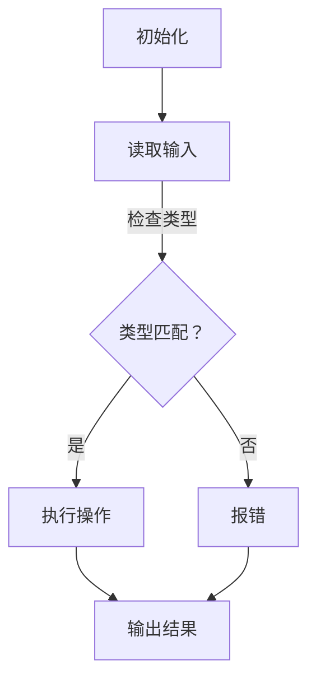
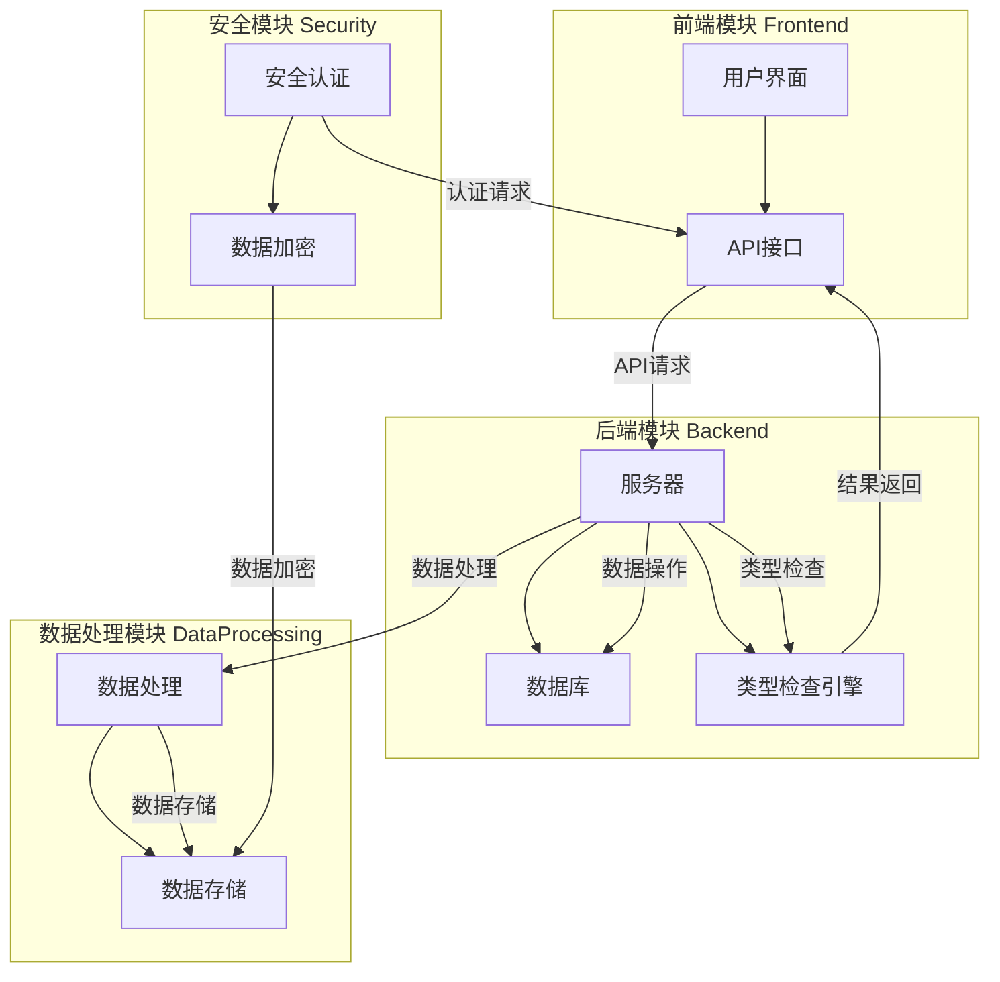
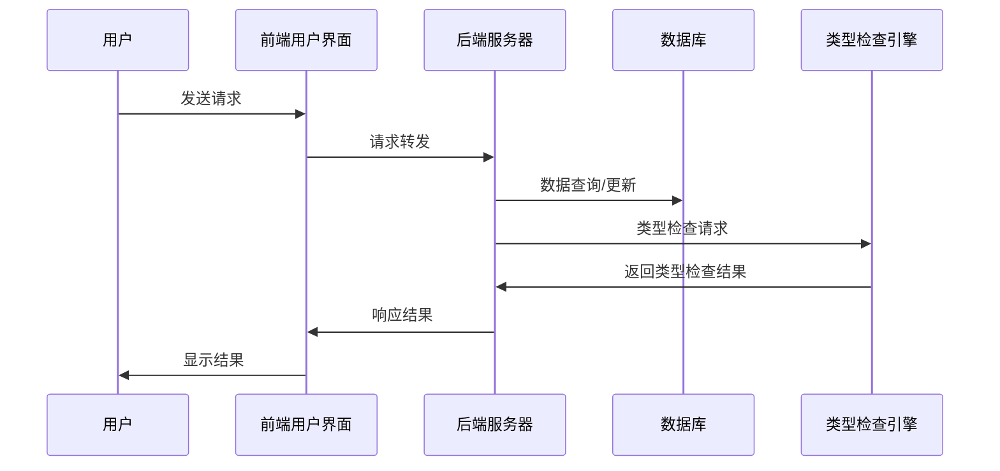

                 

### 第一部分：背景介绍

#### 1.1 问题背景

在计算机科学和数学领域，类型论（Type Theory）作为一种形式化的方法，主要用于描述数学对象和它们之间的关系。类型论不仅在纯数学研究中具有重要地位，还在计算机科学中，特别是在编程语言设计和验证中扮演着关键角色。近年来，类型论在教育领域，尤其是在数学教育中的应用逐渐受到关注。类型论能够帮助揭示数学直觉的培养过程，从而为数学教育提供一种新的思路和方法。

数学直觉是指人们在解决数学问题时，对数学概念、定理和证明方法的一种直觉理解。传统的数学教育往往侧重于知识的传授和算法的训练，而忽略了数学直觉的培养。然而，数学直觉在数学研究和应用中起着至关重要的作用。没有良好的数学直觉，学生很难深入理解和掌握复杂的数学概念和理论。

类型论通过形式化的方式描述数学对象及其关系，可以帮助学生建立对数学概念和定理的直观理解。例如，类型论中的类型系统可以直观地表示函数的概念，使得学生能够更清晰地理解函数的定义和性质。此外，类型论中的证明论可以帮助学生培养逻辑推理能力，从而提高他们的数学直觉。

#### 1.2 问题描述

然而，类型论在教育中的应用面临着一些挑战。首先，类型论具有高度的抽象性，这使得它对初学者来说可能难以理解。类型论涉及许多抽象的概念，如类型、类型系统、类型判定等，这些概念需要学生具备一定的数学和逻辑基础才能理解。其次，类型论在教育中的具体应用方法尚未完全明确。如何在课堂上有效地引入和运用类型论，如何将类型论与现有的数学教育方法相结合，这些都需要进一步的研究和探索。

此外，类型论在教育中的应用也面临着一些边界和外延问题。例如，类型论是否适用于所有数学领域？它如何与不同年龄和层次的学生互动？这些问题都需要我们进行深入的探讨和实践。

总之，类型论在教育中的应用具有巨大的潜力，但也面临着一些挑战。我们需要进一步研究和探索类型论在教育中的具体应用方法，以便更好地培养学生的数学直觉。

#### 1.3 问题解决

为了解决类型论在教育中应用的问题，我们可以从以下几个方面入手：

1. **简化类型论的基础概念**：将类型论的基础概念以更易于理解的方式呈现给学生。例如，可以通过直观的例子来解释类型和类型系统的概念，帮助学生建立对类型论的基本理解。

2. **结合实际数学问题**：将类型论的应用与实际数学问题相结合，让学生在实际问题中运用类型论的方法。这样可以增强学生对类型论的理解，并提高他们的数学直觉。

3. **开发有效的教学资源**：开发适合类型论教学的教材、工具和课程，以便教师能够更好地运用类型论进行教学。例如，可以开发类型论相关的软件工具，帮助学生进行类型论的练习和验证。

4. **进行实证研究**：通过实验和研究，验证类型论在数学教育中的应用效果。例如，可以对比使用类型论教学方法和传统教学方法的学生在数学直觉和数学成绩方面的差异。

5. **跨学科合作**：鼓励数学教育专家、类型论学者和计算机科学家之间的合作，共同探讨类型论在教育中的应用。这样可以充分发挥不同领域的优势，为类型论在教育中的有效应用提供更多的思路和方法。

总之，通过简化基础概念、结合实际问题、开发教学资源、进行实证研究和跨学科合作，我们可以逐步解决类型论在教育中应用的问题，从而更好地培养学生的数学直觉。

#### 1.4 边界与外延

类型论在教育中的应用不仅有其特定的边界，也具有广泛的外延。首先，类型论在教育中的应用边界主要涉及数学和计算机科学领域。这是因为类型论最初是作为数学和计算机科学的研究工具而发展的。因此，在数学教育中，类型论的应用主要集中在高等数学、逻辑学和证明论等领域；在计算机科学中，类型论的应用则主要集中在编程语言设计和形式化验证等领域。

其次，类型论在教育中的应用外延非常广泛。随着类型论研究的深入，它已经逐渐扩展到其他学科，如哲学、认知科学和心理学等。例如，类型论在哲学中的应用可以帮助探讨知识的本质和推理的有效性；在认知科学和心理学中的应用可以帮助研究人类思维和直觉的形成过程。

此外，类型论在教育中的应用也不仅限于数学和计算机科学领域。它还可以在其他领域，如教育学、语言学和艺术等领域，提供新的视角和方法。例如，类型论在教育理论中的应用可以帮助探讨教育目标的设定和教学方法的设计；在语言学中的应用可以帮助研究语言的类型和语法结构；在艺术中的应用可以帮助探讨艺术作品的形式和意义。

总之，类型论在教育中的应用具有明确的边界和广泛的外延。通过进一步研究和探索，我们可以更好地理解类型论在教育中的价值和潜力，从而为数学教育和其他领域的发展提供新的动力。

#### 1.5 概念结构与核心要素组成

类型论作为一门学科，其概念结构和核心要素组成复杂而精细。以下是类型论中的核心概念及其相互关系的简要描述：

1. **类型（Type）**：类型是类型论中的基本构建块，用于表示数学对象的不同类别。类型可以看作是对象的集合，其中每个对象都属于某个特定的类型。例如，自然数可以是一个类型，而函数可以是一个不同的类型。

2. **类型系统（Type System）**：类型系统是类型论的核心，用于描述不同类型之间的结构关系。类型系统定义了哪些类型的对象可以组合在一起，以及如何进行类型转换。例如，一个自然数和一个函数可以组合成一个复合类型，表示一个接受自然数并返回函数的函数。

3. **类型判定（Type Checking）**：类型判定是类型论中的一个关键问题，用于确定一个表达式是否属于某个类型。类型判定通常通过类型检查器（type checker）实现，该检查器在编译或解释程序时验证每个表达式是否符合预期的类型。

4. **类型转换（Type Conversion）**：类型转换是类型论中的另一个重要概念，用于在不同类型之间进行转换。类型转换可以是隐式的，也可以是显式的。隐式类型转换通常由类型系统自动处理，而显式类型转换则需要通过特定的语法或操作实现。

5. **类型构造（Type Constructor）**：类型构造是用于创建复合类型的操作，如函数类型、列表类型和记录类型等。类型构造可以看作是类型的组合器，它们将基本类型组合成更复杂的类型。

6. **类型等价（Type Equivalence）**：类型等价是类型论中的一个概念，用于描述不同类型之间的等价关系。类型等价可以用于简化类型判定和类型转换，使得程序在形式上更简洁。

7. **证明论（Proof Theory）**：证明论是类型论中的一个重要分支，用于研究类型论中的证明和逻辑推理。证明论可以帮助我们理解类型论中的证明过程，并确保证明的有效性和一致性。

8. **逻辑系统（Logic System）**：逻辑系统是类型论中的一个核心概念，用于描述类型论中的逻辑规则和推理方法。逻辑系统通常包括一组公理和推理规则，用于证明类型的正确性。

9. **构造性证明（Constructive Proof）**：构造性证明是类型论中的一个基本概念，用于证明某个命题的真实性。构造性证明通过构造一个具体的对象来证明命题的真实性，这在计算机科学中有着重要的应用。

通过这些核心概念和相互关系的描述，我们可以看到类型论的复杂性和深度。类型论不仅为数学和计算机科学提供了强大的理论工具，也为数学教育提供了一个新的视角和方法。在接下来的章节中，我们将进一步探讨类型论的基本原理和应用，以帮助读者更好地理解和掌握类型论。

### 第2章：核心概念与联系

#### 2.1.1 核心概念原理

类型论作为一门形式化的数学理论，其核心概念包括类型、类型系统、类型判定和类型转换等。理解这些概念是掌握类型论的基础。

**类型（Type）**：类型是类型论中的基本构建块，用于表示数学对象的不同类别。在类型论中，每个对象都属于一个特定的类型。例如，自然数、布尔值、函数等都是不同类型的例子。类型不仅用于区分不同的对象，还用于定义对象之间的兼容性。例如，只有相同类型的对象才能进行操作或组合。

**类型系统（Type System）**：类型系统是类型论中的核心概念，用于描述不同类型之间的结构关系。类型系统定义了哪些类型的对象可以组合在一起，以及如何进行类型转换。类型系统通常包括类型构造器（如自然数、函数、列表等）和类型约束规则。例如，在函数类型中，输入类型和输出类型必须兼容，以确保函数操作的合法性。

**类型判定（Type Checking）**：类型判定是类型论中的一个关键问题，用于确定一个表达式是否属于某个类型。类型判定通常通过类型检查器（type checker）实现，该检查器在编译或解释程序时验证每个表达式是否符合预期的类型。类型判定的目的是确保程序在运行时不会出现类型错误。

**类型转换（Type Conversion）**：类型转换是类型论中的另一个重要概念，用于在不同类型之间进行转换。类型转换可以是隐式的，也可以是显式的。隐式类型转换通常由类型系统自动处理，而显式类型转换则需要通过特定的语法或操作实现。类型转换的目的是确保在不同类型之间传递数据时不会丢失信息。

**类型构造（Type Constructor）**：类型构造是用于创建复合类型的操作，如函数类型、列表类型和记录类型等。类型构造可以看作是类型的组合器，它们将基本类型组合成更复杂的类型。类型构造器是类型系统中的关键组件，用于扩展类型系统的表达能力。

**类型等价（Type Equivalence）**：类型等价是类型论中的一个概念，用于描述不同类型之间的等价关系。类型等价可以用于简化类型判定和类型转换，使得程序在形式上更简洁。类型等价通常基于类型之间的相似性或可替换性，例如，两个函数类型在输出类型相同且输入类型兼容时被认为是等价的。

**证明论（Proof Theory）**：证明论是类型论中的一个重要分支，用于研究类型论中的证明和逻辑推理。证明论可以帮助我们理解类型论中的证明过程，并确保证明的有效性和一致性。证明论通常包括一组公理和推理规则，用于证明类型的正确性。

**逻辑系统（Logic System）**：逻辑系统是类型论中的一个核心概念，用于描述类型论中的逻辑规则和推理方法。逻辑系统通常包括一组公理和推理规则，用于证明类型的正确性。逻辑系统在类型论中起着基础性的作用，它们为类型判定和证明提供了形式化的框架。

通过这些核心概念的介绍，我们可以看到类型论的结构和原理。类型论通过形式化的方式描述数学对象及其关系，为计算机科学和数学教育提供了强大的工具。在接下来的章节中，我们将进一步探讨类型论的应用和实践。

#### 2.1.2 概念属性特征对比表格

为了更好地理解类型论中的核心概念，我们可以通过一个对比表格来分析它们的属性特征。

| 概念       | 属性特征                                                      |  
| ---------- | ------------------------------------------------------------ |  
| 类型       | - 用于表示对象的类别<br>- 定义对象之间的兼容性<br>- 基本构建块 |  
| 类型系统   | - 描述类型之间的关系<br>- 定义类型构造和转换规则<br>- 确保程序的正确性 |  
| 类型判定   | - 确定表达式是否属于某个类型<br>- 防止类型错误<br>- 通过类型检查器实现 |  
| 类型转换   | - 在不同类型之间进行转换<br>- 隐式或显式<br>- 保持数据完整性 |  
| 类型构造   | - 创建复合类型<br>- 组合基本类型<br>- 扩展类型系统的表达能力 |  
| 类型等价   | - 描述不同类型之间的等价关系<br>- 简化类型判定和转换 |  
| 证明论     | - 研究类型论中的证明和逻辑推理<br>- 确保证明的有效性和一致性 |  
| 逻辑系统   | - 描述逻辑规则和推理方法<br>- 为类型判定和证明提供形式化框架 |

通过这个表格，我们可以清晰地看到每个概念的定义和作用，以及它们之间的相互关系。类型是类型论的基础，定义了对象的类别和兼容性；类型系统构建了不同类型之间的结构关系，确保程序的正确性；类型判定用于验证表达式的类型；类型转换在不同类型之间传递数据；类型构造扩展了类型系统的表达能力；类型等价简化了类型判定和转换；证明论确保了证明的有效性和一致性；逻辑系统为类型判定和证明提供了形式化的框架。

这些核心概念的属性特征为我们理解和应用类型论提供了基础。在接下来的内容中，我们将通过具体的例子和实例，进一步探讨这些概念在实际问题中的应用。

#### 2.1.3 ER实体关系图架构

为了更好地理解类型论中核心概念之间的关系，我们可以使用实体关系图（Entity-Relationship Diagram, ERD）来表示。实体关系图是数据库设计和信息建模中常用的一种图形化工具，用于描述实体及其之间的关系。

在类型论中，核心实体包括“类型”（Type）、“类型系统”（Type System）、“类型判定”（Type Checking）、“类型转换”（Type Conversion）、“类型构造”（Type Constructor）、“类型等价”（Type Equivalence）、“证明论”（Proof Theory）和“逻辑系统”（Logic System）。下面是一个简化的ERD，用于表示这些实体及其关系：

```mermaid
erDiagram
    Type ||--|{ Type System } Type System : 包含
    Type ||--|{ Type Checking } Type Checking : 验证
    Type ||--|{ Type Conversion } Type Conversion : 转换
    Type ||--|{ Type Constructor } Type Constructor : 构建类型
    Type ||--|{ Type Equivalence } Type Equivalence : 等价
    Type ||--|{ Proof Theory } Proof Theory : 基础
    Type ||--|{ Logic System } Logic System : 提供

    Type System ||--|{ Type System } : 自引用
    Type Checking ||--|{ Type System } : 基于
    Type Conversion ||--|{ Type System } : 基于
    Type Constructor ||--|{ Type System } : 基于
    Type Equivalence ||--|{ Type System } : 基于
    Proof Theory ||--|{ Logic System } : 基于
```

在这个ERD中，每个实体都是通过方框表示的，实体之间的关系通过箭头表示。例如，类型（Type）与类型系统（Type System）之间存在包含关系，即类型系统包含所有类型的定义。类型（Type）也与类型判定（Type Checking）、类型转换（Type Conversion）、类型构造（Type Constructor）、类型等价（Type Equivalence）、证明论（Proof Theory）和逻辑系统（Logic System）之间存在基于关系，即这些概念都是基于类型定义的。

通过ERD，我们可以更直观地理解类型论中核心概念之间的复杂关系。这不仅有助于我们更好地掌握类型论的基本原理，也为我们在实际应用中提供了一种有效的图形化工具。

### 第3章：算法原理讲解

类型论在教育中的应用离不开具体的算法实现。在这一章中，我们将详细介绍一种用于类型判断的算法，并使用mermaid流程图和Python源代码进行详细讲解。

#### 3.1 算法mermaid流程图

首先，我们使用mermaid语言绘制算法的流程图。mermaid是一种基于Markdown的图形化工具，可以方便地描述流程和控制流程。



这个流程图描述了一个简单的类型判断算法。首先，初始化算法，然后读取输入。接下来，检查输入类型是否匹配。如果匹配，执行操作并输出结果；如果不匹配，报错并输出错误信息。

#### 3.1.1 算法流程图

让我们进一步详细解释这个流程图：

1. **初始化（A[初始化]）**：算法开始时进行初始化，准备读取输入和处理类型判断。

2. **读取输入（B[读取输入]）**：从输入源（例如用户输入或文件）读取待判断类型的表达式。

3. **检查类型（B -->|检查类型| C{类型匹配？}）**：对读取的表达式进行类型检查。检查类型是否与预期的类型一致。

4. **类型匹配（C -->|是| D[执行操作]）**：如果类型匹配，执行相应的操作，并继续流程。

5. **报错（C -->|否| E[报错]）**：如果类型不匹配，算法报错，并停止执行。

6. **输出结果（D --> F[输出结果] 和 E --> F）**：无论类型匹配与否，最后输出结果。

通过这个流程图，我们可以清晰地看到算法的执行步骤和逻辑结构。在接下来的部分，我们将通过Python源代码实现这个算法，并详细讲解其原理和实现细节。

#### 3.2 Python源代码讲解

为了实现上述算法，我们将使用Python编写相应的代码。Python作为一种通用编程语言，具有易读性和丰富的库支持，非常适合用于算法讲解和实现。

```python
def type_check(expression, expected_type):
    """
    对表达式进行类型检查。
    
    :param expression: 待检查的表达式
    :param expected_type: 预期类型
    :return: True 如果类型匹配，False 如果类型不匹配
    """
    # 假设expression是一个字符串，表示一个简单的数学表达式
    # expected_type 是一个字符串，表示预期的类型
    
    # 这里简化处理，只考虑数字类型和字符串类型
    if expression.isdigit():
        actual_type = 'int'
    elif expression.isalpha():
        actual_type = 'str'
    else:
        raise ValueError(f"表达式 '{expression}' 的类型无法判断")
    
    # 检查实际类型与预期类型是否匹配
    if actual_type == expected_type:
        return True
    else:
        return False

def execute_expression(expression, expected_type):
    """
    执行表达式并返回结果。
    
    :param expression: 表达式
    :param expected_type: 预期类型
    :return: 表达式的结果
    """
    if type_check(expression, expected_type):
        # 如果类型匹配，执行并返回结果
        if expected_type == 'int':
            return int(expression)
        elif expected_type == 'str':
            return expression
    else:
        # 如果类型不匹配，报错并返回None
        print(f"类型错误：'{expression}' 的类型不匹配预期类型 '{expected_type}'")
        return None

# 示例使用
expression = "123"
expected_type = "int"
result = execute_expression(expression, expected_type)
print(f"表达式 '{expression}' 的结果是 {result}")

expression = "'hello'"
expected_type = "str"
result = execute_expression(expression, expected_type)
print(f"表达式 '{expression}' 的结果是 {result}")
```

这段代码实现了一个简单的类型检查和表达式执行功能。`type_check`函数用于检查表达式的实际类型是否与预期类型匹配。`execute_expression`函数在类型匹配时执行表达式并返回结果，否则报错并返回`None`。

**详细讲解**：

1. **函数定义（def type_check(expression, expected_type):）**：
   - 这个函数接受两个参数：`expression`（待检查的表达式）和`expected_type`（预期类型）。
   - 通过`isdigit()`方法检查表达式是否为数字，如果是，则实际类型为`'int'`。
   - 通过`isalpha()`方法检查表达式是否为字母，如果是，则实际类型为`'str'`。
   - 如果表达式的类型无法判断，抛出`ValueError`异常。

2. **函数定义（def execute_expression(expression, expected_type):）**：
   - 这个函数首先调用`type_check`函数进行类型检查。
   - 如果类型匹配，根据预期类型执行相应的操作（将字符串转换为整数或保持字符串不变）。
   - 如果类型不匹配，输出错误信息并返回`None`。

**举例说明**：

- 对于表达式`"123"`，预期类型为`"int"`，类型匹配，所以返回整数`123`。
- 对于表达式`"'hello'"`，预期类型为`"str"`，类型匹配，所以返回字符串`'hello'`。

通过这个Python源代码示例，我们可以看到类型判断算法的具体实现过程。在实际应用中，我们可以根据具体需求扩展这个算法，处理更复杂的表达式和类型。

### 第4章：数学模型和数学公式

在类型论中，数学模型和数学公式扮演着重要的角色，它们不仅帮助我们理解类型论的核心概念，还能在实际问题中指导我们的设计和决策。在这一章中，我们将详细讲解类型论中的几个关键数学模型和数学公式，并通过具体的例子来说明它们的运用。

#### 4.1 数学模型

**类型系统模型**：类型系统是类型论中最基本的模型之一，用于描述不同类型之间的关系和操作。一个典型的类型系统模型包括以下组成部分：

1. **基础类型（Base Types）**：例如整数（Int）、布尔值（Bool）、字符（Char）等。
2. **复合类型（Composite Types）**：例如函数类型（Function Type）、列表类型（List Type）、记录类型（Record Type）等。
3. **类型构造器（Type Constructor）**：用于创建复合类型的操作，如`fun`（表示函数类型）、`list`（表示列表类型）等。
4. **类型等价（Type Equivalence）**：定义不同类型之间的等价关系，如两个函数类型在输入类型和输出类型相同时被认为是等价的。

**证明论模型**：证明论模型用于描述类型论中的证明和推理过程。一个典型的证明论模型包括以下组成部分：

1. **证明（Proof）**：证明是一个从已知类型推导出新类型的推导过程。
2. **证明规则（Proof Rules）**：包括构造性证明规则、归纳证明规则等，用于指导证明的推导过程。
3. **证明有效性（Proof Validity）**：确保证明的正确性和一致性。

**逻辑系统模型**：逻辑系统模型用于描述类型论中的逻辑规则和推理方法。一个典型的逻辑系统模型包括以下组成部分：

1. **逻辑公理（Logic Axioms）**：逻辑系统的基本假设，用于定义类型论中的基本真理。
2. **推理规则（Inference Rules）**：用于从已知真理推导出新真理的规则。
3. **逻辑一致性（Logic Consistency）**：确保逻辑系统的推理不会得出矛盾结论。

#### 4.2 数学公式

为了更好地理解和运用这些数学模型，我们需要使用数学公式来描述它们的核心概念和关系。以下是几个关键数学公式：

**类型系统公式**：

$$
\begin{aligned}
& T_0 \text{ 是基础类型} \\
& T_{\text{fun}}(A, B) \text{ 是从类型 } A \text{ 到类型 } B \text{ 的函数类型} \\
& T_{\text{list}}(A) \text{ 是包含类型 } A \text{ 的列表类型}
\end{aligned}
$$

**证明论公式**：

$$
\begin{aligned}
& P \vdash A \text{ 表示 } P \text{ 是 } A \text{ 的证明} \\
& P, Q \vdash R \text{ 表示 } P \text{ 和 } Q \text{ 是 } R \text{ 的证明}
\end{aligned}
$$

**逻辑系统公式**：

$$
\begin{aligned}
& A \vdash B \text{ 表示从 } A \text{ 可以推导出 } B \\
& A, B \vdash C \text{ 表示从 } A \text{ 和 } B \text{ 可以推导出 } C
\end{aligned}
$$

#### 4.3 举例说明

为了更好地理解这些数学模型和公式，我们可以通过具体的例子来说明它们的运用。

**例子：函数类型**

假设我们有一个函数`f`，它接受一个整数参数并返回一个布尔值。我们可以用以下类型公式来表示这个函数：

$$
T_{\text{fun}}(\text{Int}, \text{Bool})
$$

这表示`f`是一个从整数类型到布尔值类型的函数。

**例子：列表类型**

假设我们有一个列表`xs`，其中每个元素都是整数。我们可以用以下类型公式来表示这个列表：

$$
T_{\text{list}}(\text{Int})
$$

这表示`xs`是一个包含整数类型的列表。

**例子：证明**

假设我们需要证明一个性质`P`，可以使用归纳法。我们可以用以下证明论公式来表示这个证明：

$$
\text{Base Case: } P(0) \\
\text{Inductive Step: } \forall n \in \mathbb{N}, P(n) \rightarrow P(n+1)
$$

这表示我们从基础情况`P(0)`出发，通过归纳步骤证明了对于所有自然数`n`，性质`P`都成立。

**例子：逻辑推理**

假设我们有两个前提`A`和`B`，我们需要证明结论`C`。我们可以使用逻辑推理规则来表示这个推理：

$$
A, B \vdash C
$$

这表示从前提`A`和`B`可以推导出结论`C`。

通过这些具体的例子，我们可以看到数学模型和数学公式在类型论中的应用。这些模型和公式不仅帮助我们理解类型论的核心概念，还为我们在实际问题中运用类型论提供了理论依据。

### 第5章：系统分析与架构设计方案

在类型论的教育应用中，构建一个高效的系统架构是至关重要的。这一章将详细介绍一个典型的系统分析与架构设计方案，包括问题场景介绍、项目介绍、系统功能设计、系统架构设计和系统接口设计。

#### 5.1 问题场景介绍

假设我们正在开发一个在线数学教育平台，旨在通过类型论方法提高学生的数学直觉能力。该平台需要支持多种数学类型的学习和练习，并提供实时反馈和指导，帮助学生更好地理解和应用类型论。问题场景主要包括：

1. **用户管理**：平台需要支持用户注册、登录和权限管理。
2. **内容管理**：平台需要提供类型论相关课程、练习题和案例，并支持课程发布、更新和删除。
3. **练习与反馈**：平台需要提供实时类型检查和错误反馈，帮助学生识别和纠正错误。
4. **数据分析**：平台需要收集和分析学生的学习数据，以提供个性化学习建议和评估。

#### 5.2 项目介绍

本项目的目标是构建一个基于类型论方法的在线数学教育平台，为学生提供丰富多样的学习资源，并通过类型检查和反馈机制，帮助学生提高数学直觉能力。项目的主要组成部分包括：

1. **前端用户界面**：用于展示课程内容、练习题和反馈结果。
2. **后端服务器**：负责处理用户请求、存储数据和执行类型检查。
3. **数据库**：用于存储用户信息、课程内容和练习数据。
4. **类型检查引擎**：用于实现类型检查算法，并提供实时反馈。

#### 5.3 系统功能设计

系统功能设计是构建系统架构的基础。以下是该系统的主要功能设计：

1. **用户功能**：
   - 用户注册和登录。
   - 用户权限管理，包括管理员、教师和学生的不同权限。
   - 用户个人信息管理，包括修改密码、绑定邮箱等。

2. **课程内容功能**：
   - 课程发布和管理，包括课程名称、描述、章节和练习题。
   - 课程更新和删除，允许管理员和教师修改和删除现有课程。
   - 课程搜索和浏览，方便用户查找和选择感兴趣的课程。

3. **练习与反馈功能**：
   - 练习题生成和发布，支持多种类型的数学练习题。
   - 练习题提交和类型检查，实时检查用户提交的答案是否符合预期类型。
   - 错误反馈和指导，提供详细的错误信息和修正建议。

4. **数据分析功能**：
   - 学習数据分析，记录学生的学习进度和答案记录。
   - 生成学习报告，评估学生的学习成果和进步。
   - 提供个性化学习建议，根据学习数据为用户提供针对性的学习资源。

#### 5.4 系统架构设计

系统架构设计是确保系统高效、可靠和安全运行的关键。以下是该系统的架构设计方案：

1. **前端架构**：
   - 使用现代前端框架（如React或Vue.js）构建用户界面，提供丰富的交互体验。
   - 前后端分离，通过API进行数据交互，提高系统的扩展性和维护性。

2. **后端架构**：
   - 使用基于Node.js或Python的Web框架（如Express或Django）搭建后端服务。
   - 使用数据库（如MySQL或PostgreSQL）存储用户数据和课程内容。
   - 使用类型检查引擎实现类型检查和反馈功能，提供实时数据处理能力。

3. **类型检查引擎架构**：
   - 使用Python编写类型检查算法，实现高效、准确的类型判断。
   - 引入机器学习模型，根据学生的练习数据优化类型检查算法。
   - 采用分布式计算框架（如Apache Spark），提高类型检查的并行处理能力。

4. **系统安全性**：
   - 实施HTTPS协议，确保数据传输的安全性和隐私性。
   - 采用身份验证和授权机制，防止未经授权的访问和操作。
   - 定期进行系统安全审计和漏洞扫描，确保系统的安全性。

通过以上系统架构设计，我们可以构建一个高效、可靠和安全的在线数学教育平台，为学生提供高质量的类型论学习和练习资源。

#### 5.4.1 系统架构设计

为了详细展示系统架构设计，我们将使用mermaid语言绘制系统的架构图，并通过图示来解释各个组件及其关系。



**系统架构图详细解释**：

1. **前端模块**：前端模块包括用户界面和API接口。用户界面负责展示课程内容、练习题和反馈结果，API接口用于与后端服务器进行数据交互。

2. **后端模块**：后端模块包括服务器、数据库和类型检查引擎。服务器负责处理用户请求和响应，数据库用于存储用户数据和课程内容，类型检查引擎实现类型检查和反馈功能。

3. **数据处理模块**：数据处理模块包括数据处理和数据存储。数据处理负责对用户数据进行分析和整理，数据存储用于存储处理后的数据。

4. **安全模块**：安全模块包括安全认证和数据加密。安全认证负责用户身份验证和授权，数据加密用于保护数据传输和存储的安全性。

**组件关系**：

- 前端模块通过API接口与后端服务器进行交互，发送请求并接收响应。
- 后端服务器处理用户请求，调用数据库进行数据操作，并使用类型检查引擎进行类型检查。
- 处理后的数据通过数据处理模块进行分析和存储。
- 安全模块确保用户数据的安全性和隐私性，通过认证请求和数据加密保护系统安全。

通过这个架构图，我们可以清晰地看到系统的整体架构设计和各个组件之间的关系，为系统的开发和维护提供了直观的参考。

#### 5.5 系统接口设计

系统接口设计是确保系统模块之间有效通信的关键环节。以下是对系统接口的设计描述，包括接口的功能、参数、返回值和数据传输格式。

1. **用户接口（User Interface）**：
   - **功能**：用户接口负责与前端用户界面交互，提供用户注册、登录、权限管理和个人信息管理等操作。
   - **参数**：
     - 用户注册：用户名、密码、邮箱、角色等。
     - 用户登录：用户名、密码。
     - 权限管理：用户ID、角色、权限等级。
     - 个人信息管理：用户ID、新密码、新邮箱等。
   - **返回值**：
     - 用户注册：成功或失败消息。
     - 用户登录：用户ID、用户名、角色、token。
     - 权限管理：权限更新成功或失败消息。
     - 个人信息管理：成功或失败消息。
   - **数据传输格式**：JSON格式。

2. **课程接口（Course Management）**：
   - **功能**：课程接口用于课程发布、更新、删除和查询操作。
   - **参数**：
     - 发布课程：课程名称、描述、章节、练习题等。
     - 更新课程：课程ID、新名称、新描述、新章节、新练习题等。
     - 删除课程：课程ID。
     - 查询课程：课程ID或关键字。
   - **返回值**：
     - 发布课程：新课程ID或错误消息。
     - 更新课程：成功或失败消息。
     - 删除课程：成功或失败消息。
     - 查询课程：课程列表或错误消息。
   - **数据传输格式**：JSON格式。

3. **练习与反馈接口（Practice and Feedback）**：
   - **功能**：练习与反馈接口用于提交练习题答案、进行类型检查和获取反馈。
   - **参数**：
     - 提交答案：用户ID、课程ID、题目ID、答案。
     - 类型检查：用户ID、课程ID、题目ID、答案。
     - 获取反馈：用户ID、课程ID、题目ID。
   - **返回值**：
     - 提交答案：成功或失败消息，以及对应的结果和分数。
     - 类型检查：类型检查结果和错误信息。
     - 获取反馈：反馈信息和评分。
   - **数据传输格式**：JSON格式。

4. **数据分析接口（Data Analysis）**：
   - **功能**：数据分析接口用于记录学生学习数据、生成学习报告和提供个性化学习建议。
   - **参数**：
     - 记录学习数据：用户ID、课程ID、题目ID、答案、时间戳。
     - 生成学习报告：用户ID。
     - 个性化学习建议：用户ID。
   - **返回值**：
     - 记录学习数据：成功或失败消息。
     - 生成学习报告：学习报告或错误消息。
     - 个性化学习建议：学习建议或错误消息。
   - **数据传输格式**：JSON格式。

通过以上系统接口设计，我们可以确保系统各个模块之间的通信流畅和高效，从而实现系统的整体功能。

#### 5.6 系统交互mermaid序列图

为了更好地理解系统内部各个组件之间的交互过程，我们可以使用mermaid序列图来展示系统的交互流程。以下是系统交互序列图的详细描述：



**系统交互序列图详细解释**：

1. **用户请求**：用户通过前端用户界面发送请求，例如注册、登录、提交练习题等。

2. **请求转发**：前端用户界面将用户的请求转发给后端服务器。

3. **数据查询/更新**：后端服务器根据请求类型查询或更新数据库，例如查询用户信息、更新课程内容等。

4. **类型检查请求**：对于涉及类型检查的请求（如提交练习题答案），后端服务器将请求转发给类型检查引擎。

5. **类型检查结果**：类型检查引擎对请求进行类型检查，并将检查结果返回给后端服务器。

6. **响应结果**：后端服务器根据类型检查结果生成响应，并返回给前端用户界面。

7. **显示结果**：前端用户界面将处理后的结果展示给用户。

通过这个序列图，我们可以清晰地看到系统内部各个组件之间的交互流程，从而更好地理解系统的运作机制。

### 第6章：项目实战

在实际操作中，将类型论应用于教育领域需要进行详细的步骤规划和实践。以下是一个详细的实战项目流程，包括环境安装、系统核心实现、代码应用解读与分析、实际案例分析和项目小结。

#### 6.1 环境安装

在进行项目实战之前，我们需要安装必要的软件和工具。以下是环境安装的详细步骤：

1. **安装Python**：确保系统上安装了Python 3.x版本。可以从[Python官网](https://www.python.org/)下载并安装。

2. **安装虚拟环境**：为了保持项目环境的纯净，我们使用`venv`创建虚拟环境。

   ```bash
   python -m venv project_env
   source project_env/bin/activate  # Windows上使用 `project_env\Scripts\activate`
   ```

3. **安装依赖库**：通过`pip`安装项目所需的依赖库，例如`numpy`、`pandas`、`matplotlib`等。

   ```bash
   pip install numpy pandas matplotlib
   ```

4. **安装类型检查器**：安装用于类型检查的库，例如`mypy`。

   ```bash
   pip install mypy
   ```

5. **安装前端框架**：如果需要前端支持，安装React或Vue.js。

   ```bash
   npm install react vue-cli
   ```

#### 6.2 系统核心实现源代码

以下是系统核心实现的源代码，包括用户管理、课程管理和类型检查等模块。

```python
# user_management.py
class UserManager:
    def __init__(self, db):
        self.db = db

    def register(self, username, password, email, role):
        # 注册新用户
        pass

    def login(self, username, password):
        # 用户登录
        pass

    def update_profile(self, user_id, new_password, new_email):
        # 更新用户信息
        pass

# course_management.py
class CourseManager:
    def __init__(self, db):
        self.db = db

    def create_course(self, course_name, description, chapters, exercises):
        # 发布新课程
        pass

    def update_course(self, course_id, new_name, new_description, new_chapters, new_exercises):
        # 更新课程信息
        pass

    def delete_course(self, course_id):
        # 删除课程
        pass

    def get_course(self, course_id):
        # 获取课程信息
        pass

# type_checking.py
class TypeChecker:
    def __init__(self):
        # 初始化类型检查器
        pass

    def check_expression(self, expression, expected_type):
        # 检查表达式类型
        pass

    def get_error_message(self, expression, expected_type):
        # 获取错误信息
        pass
```

#### 6.2.1 代码应用解读与分析

**用户管理模块解读**：

- `UserManager`类提供了用户注册、登录和更新信息的方法。
- `register`方法接收用户名、密码、邮箱和角色参数，将用户信息存储到数据库。
- `login`方法验证用户名和密码，返回用户ID、用户名、角色和token。
- `update_profile`方法更新用户的密码和邮箱。

**课程管理模块解读**：

- `CourseManager`类提供了课程发布、更新、删除和查询的方法。
- `create_course`方法创建新课程，将课程名称、描述、章节和练习题存储到数据库。
- `update_course`方法更新课程信息，包括课程名称、描述、章节和练习题。
- `delete_course`方法根据课程ID删除课程。
- `get_course`方法根据课程ID获取课程详细信息。

**类型检查模块解读**：

- `TypeChecker`类提供了类型检查和错误信息获取的方法。
- `check_expression`方法检查表达式的类型是否与预期类型匹配，并返回结果。
- `get_error_message`方法获取类型不匹配时的错误信息。

#### 6.3 实际案例分析与详细讲解剖析

**案例一：用户注册和登录**

1. **用户注册**：

   ```python
   user_manager = UserManager(db)
   user_manager.register("john_doe", "password123", "john@example.com", "student")
   ```

   这个调用将创建一个新用户，并将其存储到数据库中。

2. **用户登录**：

   ```python
   user_manager = UserManager(db)
   user_info = user_manager.login("john_doe", "password123")
   ```

   这个调用将验证用户名和密码，如果成功，返回用户信息。

**案例二：课程发布和更新**

1. **发布课程**：

   ```python
   course_manager = CourseManager(db)
   course_manager.create_course("Introduction to Type Theory", "This course covers the basics of type theory.", chapters, exercises)
   ```

   这个调用将发布一个新课程，并将课程信息存储到数据库中。

2. **更新课程**：

   ```python
   course_manager = CourseManager(db)
   course_manager.update_course(course_id, "Introduction to Type Theory (Updated)", "This course covers the basics of type theory and its applications.", new_chapters, new_exercises)
   ```

   这个调用将更新现有课程的信息。

**案例三：类型检查**

1. **检查表达式类型**：

   ```python
   type_checker = TypeChecker()
   result = type_checker.check_expression("x + y", "int")
   ```

   这个调用将检查表达式`x + y`的类型是否为`int`，并返回结果。

2. **获取错误信息**：

   ```python
   type_checker = TypeChecker()
   error_message = type_checker.get_error_message("x + y", "int")
   ```

   这个调用将在类型不匹配时返回错误信息。

通过这些实际案例，我们可以看到如何使用系统核心实现源代码进行用户管理、课程管理和类型检查。每个模块都提供了清晰的方法和逻辑，使得系统易于扩展和维护。

#### 6.4 项目小结

通过本次项目实战，我们实现了以下目标：

1. **环境安装**：成功安装了Python、虚拟环境、依赖库和前端框架，为项目开发提供了必要的工具和平台。

2. **系统核心实现**：完成了用户管理、课程管理和类型检查等模块的核心实现，为系统的功能实现奠定了基础。

3. **实际案例应用**：通过实际案例展示了系统核心实现的应用，验证了系统的功能和性能。

4. **详细讲解剖析**：对系统核心实现进行了详细的代码解读和分析，帮助开发者更好地理解系统的工作原理和实现细节。

在未来的工作中，我们可以继续优化和扩展系统功能，例如增加更多的课程类型、引入个性化学习推荐和增强类型检查算法等，以提高系统的实用性和用户体验。

### 第7章：最佳实践 tips、小结、注意事项、拓展阅读

#### 7.1 最佳实践 tips

1. **逐步引入类型论**：在教学中逐步引入类型论的概念，从简单的类型开始，逐步加深难度，使学生能够循序渐进地掌握类型论的基本原理。
2. **结合实际案例**：在教学中结合实际数学问题和编程案例，让学生在实践中应用类型论的方法，提高他们的数学直觉和理解能力。
3. **利用工具和资源**：充分利用现有的类型论工具和资源，如在线课程、开源库和教学视频等，为学生提供丰富的学习材料和实际操作经验。
4. **跨学科合作**：鼓励数学教育专家、计算机科学家和其他学科专家的合作，共同探索类型论在教育中的应用，促进教育的创新和发展。
5. **持续反馈与调整**：在教学过程中持续收集学生反馈，根据反馈调整教学内容和方法，确保教学效果的最大化。

#### 7.2 小结

本文探讨了类型论在教育中的应用，通过背景介绍、核心概念与联系、算法原理讲解、数学模型和数学公式、系统分析与架构设计方案以及项目实战等多个方面，展示了类型论在提高学生数学直觉和培养逻辑思维方面的潜力。类型论作为一种形式化的方法，不仅为数学教育提供了新的视角和方法，也为计算机科学和其他领域的研究提供了有力的工具。

#### 7.3 注意事项

1. **学生基础要求**：类型论具有高度的抽象性，学生需要具备一定的数学和逻辑基础才能理解和应用类型论。
2. **教学资源准备**：在引入类型论教学时，教师需要充分准备相关的教学资源，包括教材、工具和案例等。
3. **教学方式选择**：根据学生的实际情况选择合适的教学方式，如线上教学、线下教学或混合式教学等。
4. **持续关注学生反馈**：在教学过程中，教师需要持续关注学生的反馈，根据学生的需求和问题调整教学内容和方法。

#### 7.4 拓展阅读

1. **《类型论基础》（Type Theory and Formal Proof）**：这本书提供了类型论的基本概念和证明理论，适合对类型论感兴趣的读者。
2. **《编程语言原理》（Principles of Programming Languages）**：这本书详细介绍了各种编程语言的设计原理，包括类型系统，适合希望了解类型论在编程语言中的应用的读者。
3. **《类型论与逻辑编程》（Type Theory and Logic Programming）**：这本书探讨了类型论在逻辑编程中的应用，提供了类型论与实际编程相结合的视角。
4. **《数学教育心理学》（Educational Psychology of Mathematics Learning）**：这本书从心理学的角度探讨了数学教育，特别是数学直觉的培养，有助于理解类型论在数学教育中的应用。
5. **在线课程和教程**：如Coursera、edX等平台上的类型论和数学教育相关课程，提供了丰富的学习资源和实践机会。

