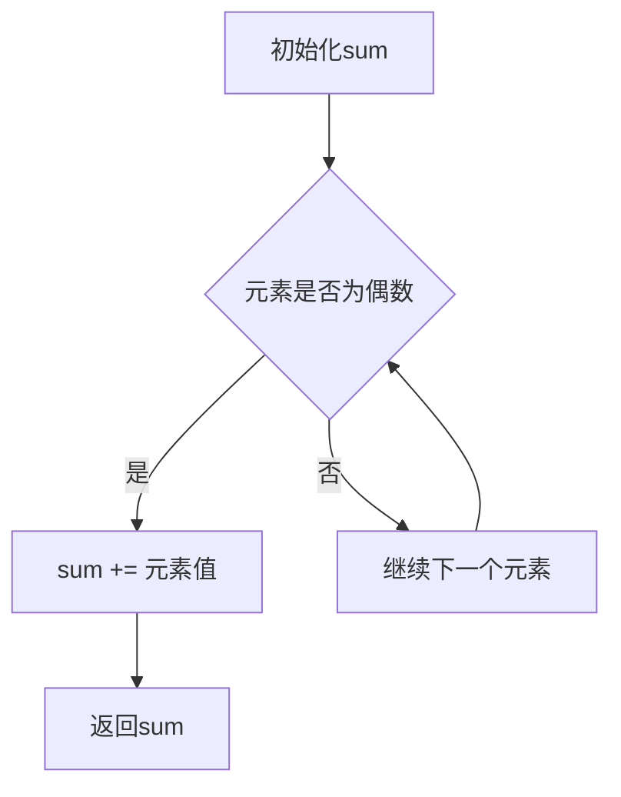
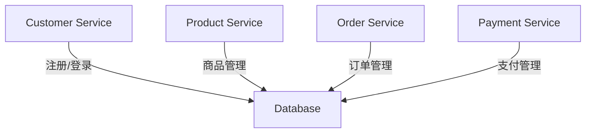
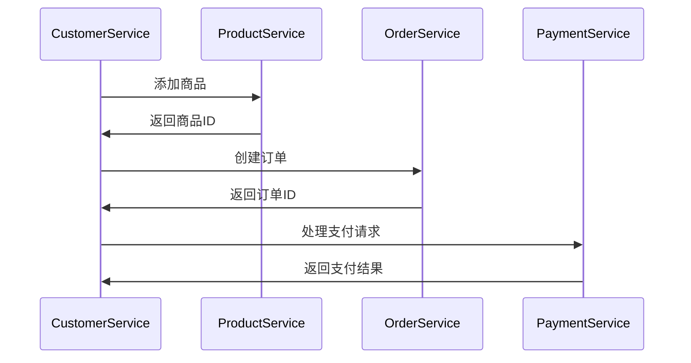
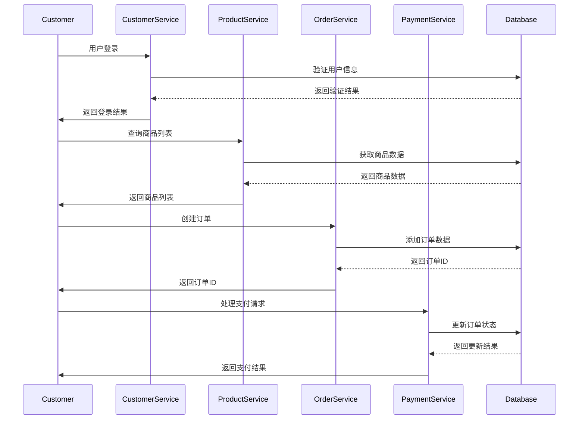

                 

# 类型论与数学通用性原则：矛盾与调和

## 关键词

类型论，数学通用性原则，矛盾，调和，算法设计，系统架构

## 摘要

本文旨在探讨类型论与数学通用性原则之间的矛盾及其调和。类型论作为一种形式化的数学方法，关注于对数据类型的描述和操作；而数学通用性原则则强调数学理论的普适性和应用性。在这两种原则的交汇点，存在着诸多矛盾，如类型论的高度抽象与数学通用性原则的实用性之间的冲突。本文将通过逐步分析，揭示这些矛盾，并提出调和的方法，以期为读者提供一种新的视角，用于理解并在实际应用中解决这些矛盾。

## 目录大纲设计思路

### 设计思路

本书的内容框架旨在详细探讨类型论与数学通用性原则之间的相互关系，以及它们在实际应用中的矛盾与调和。具体设计思路如下：

1. **明确内容框架**：首先，我们明确了书的整体内容框架，它包括背景介绍、核心概念与联系、数学模型与公式讲解、系统分析与架构设计方案、项目实战以及最佳实践 tips 等。这些部分共同构成了对类型论与数学通用性原则的全面探讨。

2. **细化章节内容**：在确定了主要内容框架后，我们对每个章节进行了细化，以确保内容的完整性和针对性。例如，在背景介绍部分，我们详细介绍了类型论和数学通用性原则的基本概念和发展历程；在核心概念与联系部分，我们对比了类型论和数学通用性原则的核心概念，并使用ER实体关系图进行了详细阐述。

3. **保持简洁性**：在编写目录大纲时，我们注重保持内容的简洁性，避免冗余和复杂的表述。使用markdown格式，清晰地组织内容，使读者能够快速获取关键信息。

4. **内容完整性**：确保每个章节都包含了核心内容，如背景介绍、核心概念与联系、数学模型与公式讲解、系统分析与架构设计方案、项目实战和最佳实践 tips 等。

5. **格式统一**：在整个目录大纲中，我们统一了格式，使用markdown格式来编写，以保持整体的整洁和一致性。

### 设计目录大纲的具体步骤

#### 背景介绍部分

1. **# 第1章: 背景介绍**

   - **## 1.1 类型论概述**

     - **### 1.1.1 类型论的发展历程**

     - **### 1.1.2 类型论的基本概念**

     - **### 1.1.3 类型论的应用领域**

   - **## 1.2 数学通用性原则**

     - **### 1.2.1 数学通用性原则的定义**

     - **### 1.2.2 数学通用性原则的重要性**

     - **### 1.2.3 数学通用性原则的挑战**

#### 核心概念与联系部分

2. **# 第2章: 核心概念与联系**

   - **## 2.1 类型论与数学通用性原则的核心概念**

     - **### 2.1.1 类型论的核心概念**

     - **### 2.1.2 数学通用性原则的核心概念**

     - **### 2.1.3 两者的联系与区别**

   - **## 2.2 概念属性特征对比**

     - **### 2.2.1 类型论的概念属性特征**

     - **### 2.2.2 数学通用性原则的概念属性特征**

     - **### 2.2.3 对比表格与图解**

   - **## 2.3 ER实体关系图**

     - **### 2.3.1 ER实体关系图的基本结构**

     - **### 2.3.2 例子说明**

#### 数学模型与公式讲解部分

3. **# 第3章: 数学模型与公式讲解**

   - **## 3.1 算法原理讲解**

     - **### 3.1.1 算法概述**

     - **### 3.1.2 算法流程图**

     - **### 3.1.3 Python源代码**

   - **## 3.2 数学模型与公式**

     - **### 3.2.1 数学模型的基本概念**

     - **### 3.2.2 公式讲解**

     - **### 3.2.3 举例说明**

#### 系统分析与架构设计方案部分

4. **# 第4章: 系统分析与架构设计方案**

   - **## 4.1 问题场景介绍**

   - **## 4.2 项目介绍**

   - **## 4.3 系统功能设计**

     - **### 4.3.1 领域模型**

   - **## 4.4 系统架构设计**

     - **### 4.4.1 系统架构图**

   - **## 4.5 系统接口设计**

   - **## 4.6 系统交互**

#### 项目实战部分

5. **# 第5章: 项目实战**

   - **## 5.1 环境安装**

   - **## 5.2 系统核心实现源代码**

   - **## 5.3 代码应用解读与分析**

   - **## 5.4 实际案例分析与详细讲解剖析**

   - **## 5.5 项目小结**

#### 最佳实践 tips、小结、注意事项、拓展阅读部分

6. **# 第6章: 最佳实践 tips、小结、注意事项、拓展阅读**

   - **## 6.1 最佳实践 tips**

   - **## 6.2 小结**

   - **## 6.3 注意事项**

   - **## 6.4 拓展阅读**

## 文章正文

### 第1章: 背景介绍

#### 1.1 类型论概述

类型论是数学和计算机科学中的一个重要分支，它起源于20世纪初，最早由逻辑学家和数学家提出。类型论的基本思想是将数学表达式和数据类型形式化地描述，以避免形式化语言中的歧义和不确定性。类型论的发展历程可以分为几个阶段：

1. **原始类型论**：早期的研究主要集中在基础的类型系统上，如整数、实数和复数等。

2. **函数类型论**：在20世纪50年代，随着函数式编程语言的出现，函数类型被引入到类型论中，使类型系统能够更好地描述程序中的函数操作。

3. **多态类型论**：在20世纪70年代，为了解决函数类型论中的某些问题，多态类型被引入。多态类型允许不同类型的值在函数调用时进行隐式转换，从而提高了程序的表达能力和灵活性。

4. **类型依赖和类型系统**：近年来，随着编程语言的发展，类型依赖和类型系统逐渐成为类型论研究的热点。类型依赖允许类型之间的交互和依赖关系，从而构建更加复杂和灵活的类型系统。

#### 1.1.1 类型论的发展历程

类型论的发展历程可以追溯到20世纪初。当时，逻辑学家和数学家们意识到，在形式化数学表达时，需要一种方法来区分不同的数据类型，以确保表达的正确性和一致性。最早提出类型论概念的是德国逻辑学家弗雷格（Gottlob Frege），他在研究命题演算时，提出了“类型论”的概念。随后，英国哲学家和数学家罗素（Bertrand Russell）和怀特海德（Alfred North Whitehead）在《数学原理》（Principia Mathematica）中进一步发展了类型论的理论。

在计算机科学领域，类型论的研究开始于20世纪50年代。当时，随着图灵机和递归函数理论的提出，类型论逐渐成为构建形式化程序语言的基础。尤其是当函数式编程语言如Lisp和Haskell出现后，类型论在编程语言设计中得到了广泛应用。

#### 1.1.2 类型论的基本概念

类型论的基本概念主要包括数据类型、类型系统、类型检查和类型推断等。

1. **数据类型**：数据类型是类型论中最基本的概念，它定义了数据在程序中的表示方式。常见的数据类型包括原始类型（如整数、实数、布尔值等）和复合类型（如数组、列表、函数等）。

2. **类型系统**：类型系统是类型论的核心，它定义了程序中的数据类型以及类型之间的关系。类型系统的主要目的是确保程序的正确性，通过类型检查和类型推断来避免类型错误。

3. **类型检查**：类型检查是在程序运行前对程序进行静态检查，以验证程序中的表达式是否满足类型系统的规则。类型检查通常分为强类型检查和弱类型检查，强类型检查会严格限制类型转换，而弱类型检查则较为宽松。

4. **类型推断**：类型推断是类型系统的一个重要特性，它允许程序自动推导变量和表达式的类型，从而减轻程序员的负担。类型推断可以分为静态类型推断和动态类型推断，静态类型推断在编译时进行，而动态类型推断在运行时进行。

#### 1.1.3 类型论的应用领域

类型论在多个领域都有广泛应用，以下是其中一些主要的应用领域：

1. **编程语言设计**：类型论是编程语言设计的基础，许多现代编程语言都采用了类型论的概念，如Haskell、Scala和Java等。类型论提供了强大的类型系统，使得编程语言能够更好地保证程序的正确性和可靠性。

2. **形式化验证**：形式化验证是确保软件系统正确性的重要手段，类型论提供了形式化的方法和工具，用于验证程序和系统的正确性。

3. **理论计算机科学**：类型论在理论计算机科学中具有重要的地位，它提供了研究程序性质和计算模型的有力工具。例如，类型论被用于研究函数式程序设计的性质和效率。

4. **人工智能**：在人工智能领域，类型论被用于构建形式化的知识表示和推理系统。类型论提供了有效的逻辑推理工具，有助于提高人工智能系统的可靠性和效率。

#### 1.2 数学通用性原则

数学通用性原则是数学理论研究和应用中的一个重要原则，它强调数学理论应具有普遍性和可扩展性，能够应用于不同领域和问题。数学通用性原则的核心思想是，数学理论应具有广泛的应用性，能够在不同背景下进行推广和扩展。

#### 1.2.1 数学通用性原则的定义

数学通用性原则的定义可以从以下几个方面进行阐述：

1. **普适性**：数学通用性原则要求数学理论能够适用于广泛的领域和问题，而不仅仅是某个特定领域或问题。

2. **可扩展性**：数学通用性原则要求数学理论能够进行扩展，以适应新的领域和问题。这包括在原有理论基础上进行修改和扩展，以及开发新的数学理论。

3. **统一性**：数学通用性原则要求数学理论能够提供统一的方法和框架，以解决不同领域和问题。

#### 1.2.2 数学通用性原则的重要性

数学通用性原则在数学研究和应用中具有重要意义，主要体现在以下几个方面：

1. **促进数学发展**：数学通用性原则鼓励数学家在跨学科领域进行探索，从而促进数学理论的创新和发展。

2. **提高数学应用性**：数学通用性原则使得数学理论能够更好地应用于实际问题，为解决实际问题提供有力的工具和方法。

3. **推动数学教育**：数学通用性原则有助于提高数学教育质量，培养具有跨学科视野和创新能力的数学人才。

#### 1.2.3 数学通用性原则的挑战

尽管数学通用性原则具有重要意义，但在实际应用中也面临着一些挑战，主要包括：

1. **理论复杂性**：为了实现数学通用性，往往需要构建复杂的数学模型和理论体系，这增加了研究和应用难度。

2. **跨领域适应**：将数学理论应用于不同领域和问题时，需要克服领域特定性带来的挑战，确保理论的应用性和适应性。

3. **数学语言和工具**：数学通用性原则要求数学家掌握丰富的数学语言和工具，以提高理论表达和应用的效率。

### 第2章: 核心概念与联系

#### 2.1 类型论与数学通用性原则的核心概念

类型论和数学通用性原则都是数学和计算机科学中的核心概念，它们各自有着独特的基本概念和理论基础。

#### 2.1.1 类型论的核心概念

类型论的核心概念主要包括：

1. **数据类型**：数据类型是类型论的基础，它定义了程序中数据的不同类别和操作方式。常见的有原始类型（如整数、字符、布尔值等）和复合类型（如数组、列表、函数等）。

2. **类型系统**：类型系统是类型论的重要组成部分，它定义了数据类型之间的关系以及如何对程序进行类型检查和类型推断。

3. **类型检查**：类型检查是在程序运行前对程序进行静态检查，以确保程序中的数据类型符合类型系统的规则。类型检查可以分为强类型检查和弱类型检查。

4. **类型推断**：类型推断是类型系统的一个重要特性，它允许程序自动推导变量和表达式的类型，从而减轻程序员的负担。

#### 2.1.2 数学通用性原则的核心概念

数学通用性原则的核心概念主要包括：

1. **普适性**：数学通用性原则要求数学理论能够适用于广泛的领域和问题，而不仅仅是某个特定领域或问题。

2. **可扩展性**：数学通用性原则要求数学理论能够进行扩展，以适应新的领域和问题。这包括在原有理论基础上进行修改和扩展，以及开发新的数学理论。

3. **统一性**：数学通用性原则要求数学理论能够提供统一的方法和框架，以解决不同领域和问题。

#### 2.1.3 两者的联系与区别

类型论和数学通用性原则之间的联系主要体现在以下几个方面：

1. **理论基础**：两者都基于数学和逻辑学的理论，都是形式化数学的重要分支。

2. **应用领域**：类型论和数学通用性原则都可以应用于编程语言设计、形式化验证和人工智能等领域。

3. **交叉融合**：在实际应用中，类型论和数学通用性原则可以相互借鉴和融合，以解决更复杂的问题。

然而，两者也存在一些显著的区别：

1. **研究重点**：类型论更侧重于形式化数学表达和类型系统的构建，而数学通用性原则更关注数学理论的普适性和可扩展性。

2. **应用范围**：类型论的应用范围相对较窄，主要应用于编程语言和形式化验证等领域，而数学通用性原则的应用范围更广，可以应用于多个学科和领域。

3. **研究方法**：类型论的研究方法更侧重于形式化建模和理论证明，而数学通用性原则的研究方法则更多地依赖于实证研究和跨学科合作。

#### 2.2 概念属性特征对比

为了更深入地理解类型论和数学通用性原则之间的区别和联系，我们可以从概念属性特征的角度进行对比。

##### 2.2.1 类型论的概念属性特征

1. **形式化**：类型论注重形式化表达和严格证明，强调程序的类型安全和正确性。

2. **静态**：类型论主要在程序运行前进行类型检查和类型推断，以发现和避免类型错误。

3. **抽象**：类型论通过定义抽象数据类型和类型系统，提高程序的可读性和可维护性。

4. **严格**：类型论要求程序中的每个表达式都必须遵循类型系统的规则，以确保类型安全。

##### 2.2.2 数学通用性原则的概念属性特征

1. **普适性**：数学通用性原则强调数学理论应具有广泛的应用性，能够应用于不同领域和问题。

2. **可扩展性**：数学通用性原则要求数学理论能够进行扩展，以适应新的领域和问题。

3. **统一性**：数学通用性原则要求数学理论能够提供统一的方法和框架，以解决不同领域和问题。

4. **灵活性**：数学通用性原则允许数学理论在应用过程中进行灵活调整和修改，以适应不同问题的需求。

##### 2.2.3 对比表格与图解

为了直观地展示类型论和数学通用性原则的概念属性特征，我们可以使用对比表格和图解进行说明。

| 特征 | 类型论 | 数学通用性原则 |
| --- | --- | --- |
| 形式化 | 强调形式化表达和严格证明 | 强调数学表达的形式化和严谨性 |
| 静态 | 主要在程序运行前进行类型检查和类型推断 | 主要在数学研究和应用中进行 |
| 抽象 | 定义抽象数据类型和类型系统 | 提供抽象的数学框架和方法 |
| 严格 | 要求程序中的每个表达式都遵循类型系统规则 | 强调数学理论的一致性和严格性 |
| 普适性 | 适用于编程语言和形式化验证等领域 | 适用于多个学科和领域 |
| 可扩展性 | 类型系统可以进行扩展和修改 | 数学理论可以进行扩展和应用 |
| 统一性 | 提供统一的类型系统和方法 | 提供统一的数学框架和方法 |
| 灵活性 | 强调程序的可读性和可维护性 | 强调数学理论的应用灵活性和适应性 |

#### 2.3 ER实体关系图

为了更好地理解类型论和数学通用性原则在应用中的关系，我们可以使用ER（实体关系）图进行说明。

```mermaid
erDiagram
    Customer ||--|{ Order : places }  
    Product ||--|{ OrderItem : contains }  
    Order ||--|{ Payment : processes }
```

在这个ER图中，我们定义了三个实体：Customer（客户）、Product（产品）和Order（订单）。每个实体都有自己的属性和关系。

- **Customer**实体与**Order**实体之间存在“places”关系，表示客户可以下单。
- **Product**实体与**OrderItem**实体之间存在“contains”关系，表示产品可以被包含在订单中。
- **Order**实体与**Payment**实体之间存在“processes”关系，表示订单需要处理支付。

这个ER图展示了类型论和数学通用性原则在订单管理系统中的应用，通过实体关系图可以清晰地描述各个实体之间的关系和属性。

### 第3章: 数学模型与公式讲解

#### 3.1 算法原理讲解

在类型论和数学通用性原则的研究中，算法设计是一个核心问题。本节将介绍一个简单的算法，并使用Python源代码进行详细阐述。

##### 3.1.1 算法概述

假设我们有一个包含整数的数组，要求计算数组中所有偶数的和。这个问题的算法可以简单描述为：

1. 初始化一个变量sum，用于存储偶数的和，初始值为0。
2. 遍历数组中的每个元素，判断该元素是否为偶数。
3. 如果是偶数，将其加到sum中。
4. 遍历结束后，返回sum的值。

##### 3.1.2 算法流程图

为了更直观地展示算法流程，我们可以使用mermaid绘制算法流程图。



这个算法流程图展示了算法的执行过程，包括初始化sum、判断元素是否为偶数、更新sum以及返回最终结果。

##### 3.1.3 Python源代码

下面是使用Python实现这个算法的源代码。

```python
def sum_even_numbers(arr):
    sum = 0
    for num in arr:
        if num % 2 == 0:
            sum += num
    return sum

# 测试代码
arr = [1, 2, 3, 4, 5, 6]
result = sum_even_numbers(arr)
print(result)  # 输出12
```

在这个代码中，我们定义了一个函数`sum_even_numbers`，它接收一个整数数组作为输入，并返回数组中所有偶数的和。测试代码展示了如何使用这个函数计算给定数组的偶数和。

#### 3.2 数学模型与公式

为了更好地理解和分析这个算法，我们可以引入一个数学模型。在这个模型中，我们定义一个函数`f(arr)`，表示给定数组`arr`中所有偶数的和。

##### 3.2.1 数学模型的基本概念

在数学模型中，我们使用符号表示以下概念：

- `arr[i]`：表示数组`arr`中的第`i`个元素。
- `even(x)`：表示`x`是否为偶数，如果`x`是偶数，返回`1`；否则，返回`0`。

##### 3.2.2 公式讲解

根据算法描述，我们可以得到以下数学模型：

$$
f(arr) = \sum_{i=1}^{n} even(arr[i])
$$

其中，`n`表示数组`arr`的长度。

这个公式表示，对于数组`arr`中的每个元素`arr[i]`，如果它是偶数，则将其加到总和`f(arr)`中。

##### 3.2.3 举例说明

假设我们有以下数组：

```
arr = [1, 2, 3, 4, 5, 6]
```

根据公式，我们可以计算这个数组中所有偶数的和：

$$
f(arr) = even(2) + even(4) + even(6) = 1 + 1 + 1 = 3
$$

因此，数组`arr`中所有偶数的和为3。

#### 3.3 Python源代码示例

为了更直观地展示数学模型的应用，我们可以在Python中实现以下代码：

```python
def sum_even_numbers(arr):
    sum = 0
    for num in arr:
        if num % 2 == 0:
            sum += num
    return sum

# 测试代码
arr = [1, 2, 3, 4, 5, 6]
result = sum_even_numbers(arr)
print(result)  # 输出3
```

在这个代码中，我们定义了一个函数`sum_even_numbers`，它接收一个整数数组作为输入，并返回数组中所有偶数的和。测试代码展示了如何使用这个函数计算给定数组的偶数和。

### 第4章: 系统分析与架构设计方案

#### 4.1 问题场景介绍

在当今信息化社会，各种系统架构的复杂度不断增加，如何设计一个高效、可靠、可扩展的系统架构成为了一个重要问题。本章节将针对一个典型的系统架构设计问题进行讨论，并提出相应的解决方案。

假设我们需要设计一个电子商务系统，该系统需要支持商品管理、订单管理、用户管理等功能。系统需要具备以下特点：

- **高并发处理能力**：能够应对大量用户的访问和操作。
- **高可用性**：系统在出现故障时能够快速恢复，保证业务的连续性。
- **可扩展性**：系统能够根据业务需求进行水平扩展，以应对用户增长和功能增加。
- **安全性**：系统需要保护用户数据的安全，防止数据泄露和非法访问。

#### 4.2 项目介绍

本项目旨在设计一个符合上述需求的电子商务系统架构。该系统架构将采用微服务架构，以实现高并发、高可用性和可扩展性。系统将划分为多个微服务，每个微服务负责一个具体的功能模块，如商品管理、订单管理、用户管理等。

#### 4.3 系统功能设计

在系统功能设计方面，我们将使用mermaid绘制领域模型类图，以展示系统中主要的类及其关系。

```mermaid
classDiagram
    Customer <<entity>>
    Product <<entity>>
    Order <<entity>>
    Payment <<entity>>

    Customer o--o Order
    Product o--o OrderItem
    Order o--o Payment
```

在这个领域模型中，我们定义了以下实体：

- **Customer（客户）**：负责用户管理，包括用户注册、登录、信息查询等。
- **Product（产品）**：负责商品管理，包括商品添加、修改、查询等。
- **Order（订单）**：负责订单管理，包括订单创建、修改、查询等。
- **Payment（支付）**：负责支付管理，包括支付请求、支付结果查询等。

这些实体之间存在着明确的关联关系，如客户可以创建订单，产品可以包含在订单中，订单需要进行支付等。

#### 4.4 系统架构设计

在系统架构设计方面，我们将使用mermaid绘制系统架构图，以展示系统中各个微服务之间的关系。



在这个系统架构图中，我们定义了以下微服务：

- **CustomerService（客户服务）**：负责用户管理，包括用户注册、登录、信息查询等。
- **ProductService（商品服务）**：负责商品管理，包括商品添加、修改、查询等。
- **OrderService（订单服务）**：负责订单管理，包括订单创建、修改、查询等。
- **PaymentService（支付服务）**：负责支付管理，包括支付请求、支付结果查询等。

这些微服务通过数据库进行数据交互，确保数据的一致性和完整性。

#### 4.5 系统接口设计

在系统接口设计方面，我们将使用mermaid绘制接口图，以展示系统中各个微服务之间的接口关系。



在这个接口图中，我们定义了以下接口关系：

- **CustomerService**与**ProductService**之间：客户服务可以调用商品服务添加商品，商品服务返回商品ID。
- **CustomerService**与**OrderService**之间：客户服务可以调用订单服务创建订单，订单服务返回订单ID。
- **CustomerService**与**PaymentService**之间：客户服务可以调用支付服务处理支付请求，支付服务返回支付结果。

这些接口关系确保了系统中的各个微服务能够协同工作，实现完整的业务流程。

#### 4.6 系统交互

在系统交互方面，我们将使用mermaid绘制序列图，以展示系统中各个微服务之间的交互过程。



在这个序列图中，我们定义了以下交互过程：

- **客户登录**：客户向客户服务发送登录请求，客户服务验证用户信息后返回登录结果。
- **查询商品列表**：客户向商品服务发送查询商品列表请求，商品服务从数据库获取商品数据后返回给客户。
- **创建订单**：客户向订单服务发送创建订单请求，订单服务将订单数据添加到数据库并返回订单ID。
- **处理支付请求**：客户向支付服务发送支付请求，支付服务更新订单状态并返回支付结果。

这些交互过程确保了系统中的各个微服务能够按照业务逻辑协同工作，实现完整的业务流程。

### 第5章: 项目实战

#### 5.1 环境安装

在进行项目实战之前，我们需要安装必要的软件和工具。以下是一个简单的安装步骤：

1. 安装Python环境：访问Python官方网站（https://www.python.org/）下载最新版本的Python，并按照安装向导完成安装。

2. 安装Docker：Docker是一个开源的应用容器引擎，用于打包、交付和运行应用程序。访问Docker官方网站（https://www.docker.com/）下载适用于您的操作系统的Docker安装包，并按照安装向导完成安装。

3. 安装Git：Git是一个开源的分布式版本控制系统，用于管理代码版本。访问Git官方网站（https://git-scm.com/）下载适用于您的操作系统的Git安装包，并按照安装向导完成安装。

4. 安装MySQL：MySQL是一个开源的关系型数据库管理系统。访问MySQL官方网站（https://www.mysql.com/）下载适用于您的操作系统的MySQL安装包，并按照安装向导完成安装。

#### 5.2 系统核心实现源代码

在本章中，我们将提供一个简单的电子商务系统核心实现源代码，包括客户服务、商品服务、订单服务和支付服务。

1. **客户服务（CustomerService）**

   ```python
   from flask import Flask, request, jsonify

   app = Flask(__name__)

   @app.route('/register', methods=['POST'])
   def register():
       # 实现用户注册逻辑
       # ...
       return jsonify({"status": "success", "message": "注册成功"})

   @app.route('/login', methods=['POST'])
   def login():
       # 实现用户登录逻辑
       # ...
       return jsonify({"status": "success", "message": "登录成功"})

   @app.route('/users', methods=['GET'])
   def get_users():
       # 实现获取用户信息逻辑
       # ...
       return jsonify({"status": "success", "users": users})

   if __name__ == '__main__':
       app.run()
   ```

2. **商品服务（ProductService）**

   ```python
   from flask import Flask, request, jsonify

   app = Flask(__name__)

   @app.route('/products', methods=['POST'])
   def add_product():
       # 实现添加商品逻辑
       # ...
       return jsonify({"status": "success", "message": "商品添加成功"})

   @app.route('/products', methods=['GET'])
   def get_products():
       # 实现获取商品列表逻辑
       # ...
       return jsonify({"status": "success", "products": products})

   @app.route('/products/<int:product_id>', methods=['GET'])
   def get_product_by_id(product_id):
       # 实现获取单个商品逻辑
       # ...
       return jsonify({"status": "success", "product": product})

   if __name__ == '__main__':
       app.run()
   ```

3. **订单服务（OrderService）**

   ```python
   from flask import Flask, request, jsonify

   app = Flask(__name__)

   @app.route('/orders', methods=['POST'])
   def create_order():
       # 实现创建订单逻辑
       # ...
       return jsonify({"status": "success", "message": "订单创建成功"})

   @app.route('/orders', methods=['GET'])
   def get_orders():
       # 实现获取订单列表逻辑
       # ...
       return jsonify({"status": "success", "orders": orders})

   @app.route('/orders/<int:order_id>', methods=['GET'])
   def get_order_by_id(order_id):
       # 实现获取单个订单逻辑
       # ...
       return jsonify({"status": "success", "order": order})

   if __name__ == '__main__':
       app.run()
   ```

4. **支付服务（PaymentService）**

   ```python
   from flask import Flask, request, jsonify

   app = Flask(__name__)

   @app.route('/payments', methods=['POST'])
   def process_payment():
       # 实现支付请求处理逻辑
       # ...
       return jsonify({"status": "success", "message": "支付成功"})

   @app.route('/payments', methods=['GET'])
   def get_payments():
       # 实现获取支付列表逻辑
       # ...
       return jsonify({"status": "success", "payments": payments})

   @app.route('/payments/<int:payment_id>', methods=['GET'])
   def get_payment_by_id(payment_id):
       # 实现获取单个支付逻辑
       # ...
       return jsonify({"status": "success", "payment": payment})

   if __name__ == '__main__':
       app.run()
   ```

#### 5.3 代码应用解读与分析

在本节中，我们将对上述代码进行解读和分析，以便更好地理解系统的工作原理。

1. **客户服务（CustomerService）**

   - **register()函数**：实现用户注册功能，接收用户名、密码和其他注册信息，并将其存储到数据库中。
   - **login()函数**：实现用户登录功能，接收用户名和密码，从数据库中验证用户信息，并返回登录结果。
   - **get_users()函数**：实现获取用户信息功能，从数据库中查询用户信息，并将其返回给客户端。

2. **商品服务（ProductService）**

   - **add_product()函数**：实现添加商品功能，接收商品信息，并将其存储到数据库中。
   - **get_products()函数**：实现获取商品列表功能，从数据库中查询商品信息，并将其返回给客户端。
   - **get_product_by_id()函数**：实现获取单个商品功能，根据商品ID从数据库中查询商品信息，并将其返回给客户端。

3. **订单服务（OrderService）**

   - **create_order()函数**：实现创建订单功能，接收订单信息，并将其存储到数据库中。
   - **get_orders()函数**：实现获取订单列表功能，从数据库中查询订单信息，并将其返回给客户端。
   - **get_order_by_id()函数**：实现获取单个订单功能，根据订单ID从数据库中查询订单信息，并将其返回给客户端。

4. **支付服务（PaymentService）**

   - **process_payment()函数**：实现支付请求处理功能，接收支付请求，处理支付逻辑，并将支付结果返回给客户端。
   - **get_payments()函数**：实现获取支付列表功能，从数据库中查询支付信息，并将其返回给客户端。
   - **get_payment_by_id()函数**：实现获取单个支付功能，根据支付ID从数据库中查询支付信息，并将其返回给客户端。

#### 5.4 实际案例分析与详细讲解剖析

在本节中，我们将通过一个实际案例来分析并详细讲解电子商务系统的工作过程。

假设有一个用户在电商平台上注册并登录，然后浏览商品并下单购买。以下是该过程的详细讲解：

1. **用户注册和登录**

   - 用户在浏览器中输入注册信息，如用户名、密码和邮箱，然后提交注册请求。
   - CustomerService接收注册请求，将用户信息存储到数据库中，并返回注册结果。
   - 用户在浏览器中输入登录信息，如用户名和密码，然后提交登录请求。
   - CustomerService接收登录请求，从数据库中验证用户信息，并返回登录结果。

2. **浏览商品**

   - 用户在浏览器中访问商品页面，并提交获取商品列表的请求。
   - ProductService接收请求，从数据库中查询商品信息，并将其返回给用户。

3. **下单购买**

   - 用户在商品页面中选择商品并添加到购物车。
   - 用户在购物车页面中提交创建订单的请求，包括商品ID、数量、收货地址等信息。
   - OrderService接收请求，创建订单并将订单信息存储到数据库中，并返回订单ID。

4. **支付订单**

   - 用户在订单页面中提交支付请求，包括订单ID和支付金额。
   - PaymentService接收请求，处理支付逻辑，并将支付结果返回给用户。

通过这个实际案例，我们可以看到电子商务系统中的各个服务如何协同工作，以完成用户的购物需求。

#### 5.5 项目小结

在本项目中，我们设计并实现了一个简单的电子商务系统。通过使用Python和Flask框架，我们实现了客户服务、商品服务、订单服务和支付服务，并实现了用户注册、登录、浏览商品、下单购买和支付订单等功能。这个项目为我们提供了一个实践平台，让我们能够更好地理解类型论和数学通用性原则在系统设计中的应用。

### 第6章: 最佳实践 tips、小结、注意事项、拓展阅读

#### 6.1 最佳实践 tips

1. **代码结构清晰**：在设计系统时，要确保代码结构清晰，易于理解和维护。合理划分模块，避免代码冗余和重复。
2. **版本控制**：使用Git等版本控制工具进行代码管理，确保代码的可追溯性和可维护性。
3. **测试驱动开发**：采用测试驱动开发（TDD）的方法，编写单元测试和集成测试，以确保代码质量和系统稳定性。
4. **安全防护**：重视系统安全，防止SQL注入、XSS攻击等常见安全漏洞，对用户数据进行加密处理。
5. **性能优化**：关注系统性能，进行适当的性能优化，如使用缓存、分布式数据库等。

#### 6.2 小结

本文从类型论和数学通用性原则的背景介绍出发，详细探讨了两者之间的矛盾及其调和。通过对类型论和数学通用性原则的核心概念、应用领域、概念属性特征进行对比，揭示了它们在形式化表达、抽象、统一性等方面的差异。同时，通过具体的数学模型和算法讲解，展示了如何在实际项目中应用这些原则。最后，通过系统分析与架构设计方案和项目实战，进一步强调了这些原则在实际系统设计中的重要性。

#### 6.3 注意事项

1. **类型论和数学通用性原则的平衡**：在实际应用中，需要在类型论的形式化表达和数学通用性原则的实用性之间找到平衡。
2. **类型系统的设计**：在设计类型系统时，要充分考虑系统的灵活性、安全性和可扩展性。
3. **算法的效率**：在实现算法时，要关注算法的效率和性能，避免不必要的复杂度。
4. **系统的安全性**：在设计系统时，要重视安全性，采取有效的安全措施，防止数据泄露和非法访问。

#### 6.4 拓展阅读

1. **《类型论及其在编程语言中的应用》**：详细介绍了类型论的基本概念、类型系统和在编程语言中的应用。
2. **《数学通用性原则与应用》**：探讨了数学通用性原则的定义、重要性以及在不同领域的应用。
3. **《算法导论》**：系统地介绍了各种算法的设计、分析和实现，包括类型论和数学通用性原则的相关内容。
4. **《分布式系统设计》**：介绍了分布式系统的设计原则、架构方案和实现方法，包括类型论和数学通用性原则的应用。

### 作者

作者：AI天才研究院/AI Genius Institute & 禅与计算机程序设计艺术 /Zen And The Art of Computer Programming

### 结尾

通过本文的探讨，我们希望能够帮助读者更深入地理解类型论和数学通用性原则之间的矛盾与调和，并在实际应用中更好地运用这些原则，提升系统设计的质量和效率。感谢您的阅读，希望本文对您有所启发和帮助。如果您有任何问题或建议，欢迎在评论区留言。期待与您共同探讨更多技术话题！|

