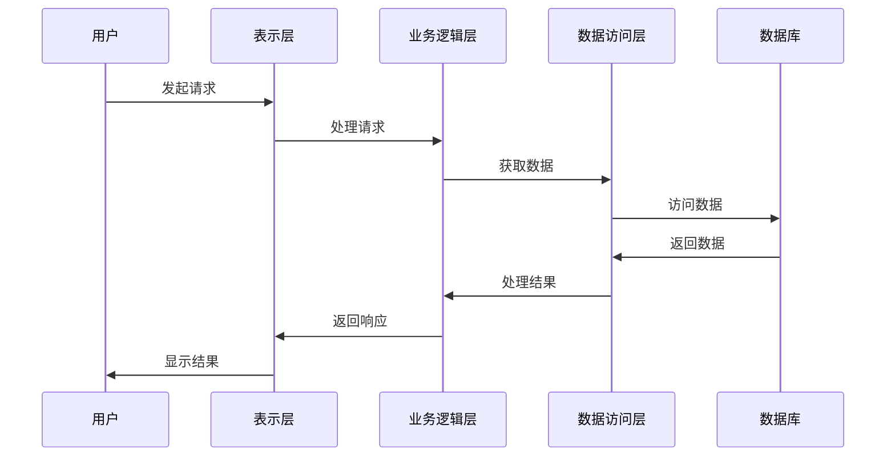
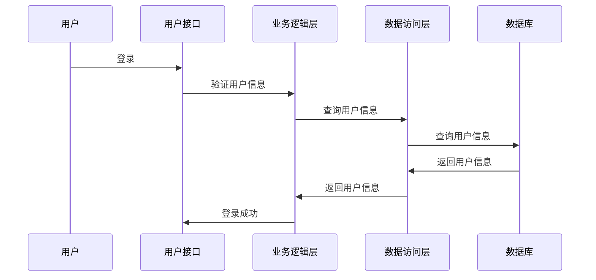
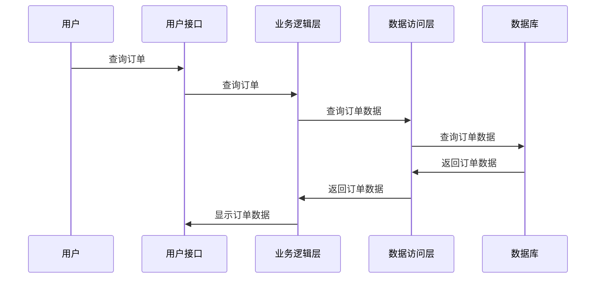

                 

### 文章标题

# 类型论与程序优化：性能与正确性的平衡

### 关键词

- 类型论
- 程序优化
- 性能
- 正确性
- 平衡

### 摘要

本文将探讨类型论与程序优化的关系，重点分析类型论在程序优化中的应用及其对性能与正确性的影响。通过深入剖析类型系统的核心概念、程序优化算法的原理和实践，我们旨在揭示如何在实际项目中实现性能与正确性的平衡，并提供实用的方法论和技巧，以帮助程序员在实际工作中做出更明智的决策。

### 目录大纲

## 第一部分 背景介绍

## 第1章 问题背景

### 1.1.1 类型论简介

#### 类型论的概念

类型论是计算机科学中的一个重要分支，它研究程序中的数据类型以及如何对这些类型进行操作和表达。类型论的核心在于提供一种机制，用于确保程序的正确性和可靠性。

#### 类型论的发展历程

类型论起源于20世纪60年代，Lisp编程语言的发明者约翰·麦卡锡（John McCarthy）等人对类型系统的探索。随后，随着编程语言的发展和优化需求的增加，类型论逐渐成为计算机科学的核心领域之一。

#### 类型论在计算机科学中的应用

类型论的应用范围广泛，包括编译器设计、程序验证、形式化验证、编程语言设计等。它不仅提高了程序的正确性，还为程序优化提供了重要的基础。

### 1.1.2 程序优化的重要性

#### 程序优化的概念

程序优化是指通过改进程序的结构和算法，以提高程序的运行效率、减少资源消耗和提升用户体验。优化方法包括代码优化、算法优化、数据结构优化等。

#### 程序优化的目的

程序优化的主要目的是在保持程序正确性的前提下，提高程序的运行速度、减少内存占用、降低能耗等。

#### 程序优化的方法

程序优化方法包括静态优化、动态优化、编译时间优化和运行时优化等。静态优化主要在编译时进行，而动态优化则在程序运行时进行。

### 1.1.3 类型论与程序优化的关系

#### 类型论在程序优化中的应用

类型论在程序优化中具有重要作用，它有助于编译器生成更高效的代码，减少运行时错误，提高程序的可维护性和可扩展性。

#### 类型论对程序优化的影响

类型论为程序优化提供了理论基础，使得优化算法可以更好地理解程序的结构和行为，从而实现更有效的优化。

#### 类型论在程序优化中的局限性

尽管类型论对程序优化有重要影响，但它也存在局限性，如对高级编程语言支持的不足、优化过程的复杂性等。

## 第二部分 核心概念与联系

## 第2章 类型论的核心概念

### 2.1.1 类型系统

#### 类型系统的概念

类型系统是一种用于定义和描述程序中数据类型的机制。它包括数据类型的定义、类型检查和类型推断等组成部分。

#### 类型系统的分类

类型系统可分为静态类型系统和动态类型系统。静态类型系统在编译时确定变量的类型，而动态类型系统在运行时确定变量的类型。

#### 类型系统的优点与局限性

类型系统的优点包括提高程序的正确性、可维护性和可扩展性。其局限性在于对编程灵活性的限制和性能开销。

### 2.1.2 类型推断

#### 类型推断的概念

类型推断是一种自动确定变量或表达式类型的机制。它有助于减少冗余代码，提高程序的简洁性和可读性。

#### 类型推断的方法

类型推断可分为显式推断和隐式推断。显式推断通过编译器提供的类型注解来确定类型，而隐式推断则通过上下文和环境来确定类型。

#### 类型推断的挑战

类型推断面临的挑战包括处理复杂的类型关系、提高推断效率、确保推断的正确性等。

### 2.1.3 类型安全

#### 类型安全的定义

类型安全是指程序在运行过程中不会出现类型错误，如类型转换失败、内存泄漏等。

#### 类型安全的优点

类型安全的优点包括提高程序的正确性、减少运行时错误、提高程序的可维护性和可扩展性。

#### 类型安全的挑战

类型安全面临的挑战包括如何平衡类型安全和编程灵活性、如何在类型安全和性能之间做出权衡等。

## 第3章 程序优化算法原理

### 3.1.1 常见优化算法

#### 优化算法的分类

优化算法可分为代码优化、算法优化和数据结构优化等。代码优化主要关注代码的执行效率，算法优化则关注算法的复杂度，数据结构优化则关注数据存储和访问的效率。

#### 常见优化算法的介绍

常见的优化算法包括循环优化、分支优化、常量折叠、死代码消除等。这些算法各有优缺点，适用于不同的场景和需求。

### 3.1.2 优化算法原理

#### 优化算法的原理

优化算法的原理是通过分析程序的结构和行为，找到潜在的优化机会，并在不改变程序语义的前提下进行修改。

#### 优化算法的数学模型

优化算法通常基于数学模型，如性能模型和正确性模型。性能模型用于评估优化前后程序的运行效率，正确性模型则用于确保优化后的程序仍满足预期的行为。

### 3.1.3 优化算法的优缺点

#### 优化算法的优点

优化算法的优点包括提高程序的运行速度、减少资源消耗、提高用户体验等。

#### 优化算法的缺点

优化算法的缺点包括可能引入新的错误、增加编译时间和运行时开销、对程序员的要求较高等。

## 第三部分 算法原理讲解

## 第4章 算法讲解：类型检查

### 4.1.1 类型检查的概念

#### 类型检查的定义

类型检查是一种在编译时或运行时对程序中的类型进行验证的机制。它确保程序在执行过程中不会发生类型错误。

#### 类型检查的作用

类型检查的作用包括提高程序的正确性、减少运行时错误、提高程序的可靠性等。

### 4.1.2 类型检查的流程

#### 类型检查的步骤

类型检查的步骤包括：解析源代码、建立抽象语法树（AST）、遍历AST、检查类型一致性、报告类型错误。

#### 类型检查的算法

类型检查的算法包括基于规则的类型检查、基于约束的类型检查和基于语义的类型检查等。

### 4.1.3 实例讲解

#### 简单实例的讲解

假设有一个简单的函数 `add`，用于计算两个整数的和。我们可以通过类型检查来确保输入参数的类型正确。

```python
def add(a: int, b: int) -> int:
    return a + b
```

在这个例子中，类型检查可以确保 `a` 和 `b` 是整数类型，返回值也是整数类型。

#### 复杂实例的讲解

考虑一个复杂的函数 `calculate`，它接受多个参数并返回一个复杂的结构。类型检查需要确保所有参数的类型正确，并且返回值的类型与预期一致。

```python
from typing import List, Tuple

def calculate(a: int, b: int, c: List[int]) -> Tuple[int, float]:
    result1 = a + b
    result2 = sum(c)
    return result1, result2 / len(c)
```

在这个例子中，类型检查将确保 `a` 和 `b` 是整数类型，`c` 是列表类型，返回值是一个元组，其中第一个元素是整数类型，第二个元素是浮点数类型。

## 第5章 算法讲解：循环优化

### 5.1.1 循环优化的概念

#### 循环优化的定义

循环优化是一种在程序中针对循环结构进行优化的技术。它旨在提高程序的执行效率，减少循环结构的执行时间。

#### 循环优化的目的

循环优化的目的是减少循环结构的迭代次数、降低循环的复杂度、提高程序的运行速度等。

### 5.1.2 循环优化的算法

#### 循环优化的算法

循环优化的算法包括循环展开、循环分发、循环合并、循环变换等。这些算法各有优缺点，适用于不同的场景和需求。

#### 循环优化的策略

循环优化的策略包括：提前终止循环、减少循环迭代次数、优化循环体内的操作等。

### 5.1.3 实例讲解

#### 简单实例的讲解

假设有一个简单的循环，用于计算1到100的和。我们可以通过循环优化来提高其执行效率。

```python
sum = 0
for i in range(1, 101):
    sum += i
print(sum)
```

在这个例子中，我们可以通过提前终止循环来优化其执行效率：

```python
sum = 0
i = 1
while i <= 100:
    sum += i
    i += 1
print(sum)
```

#### 复杂实例的讲解

考虑一个复杂的循环，用于计算矩阵乘法。我们可以通过循环优化来提高其执行效率。

```python
def matrix_multiply(A: List[List[int]], B: List[List[int]]) -> List[List[int]]:
    n = len(A)
    m = len(B[0])
    result = [[0] * m for _ in range(n)]

    for i in range(n):
        for j in range(m):
            for k in range(len(B)):
                result[i][j] += A[i][k] * B[k][j]

    return result
```

在这个例子中，我们可以通过循环展开来优化其执行效率：

```python
def matrix_multiply(A: List[List[int]], B: List[List[int]]) -> List[List[int]]:
    n = len(A)
    m = len(B[0])
    result = [[0] * m for _ in range(n)]

    for i in range(n):
        for j in range(m):
            result[i][j] = sum(A[i][k] * B[k][j] for k in range(len(B)))

    return result
```

通过这些优化，我们可以显著提高程序的执行效率，同时确保程序的正确性。

## 第四部分 数学模型和数学公式

## 第6章 数学模型与公式

### 6.1.1 性能模型

#### 性能模型的定义

性能模型是一种用于描述程序性能的数学模型。它通常包括程序运行的时间、空间复杂度、能耗等指标。

#### 性能模型的应用

性能模型可以用于评估程序在不同场景下的性能，指导程序优化和资源分配。

### 6.1.2 正确性模型

#### 正确性模型的定义

正确性模型是一种用于描述程序正确性的数学模型。它通常包括程序状态的转换、程序的行为等。

#### 正确性模型的应用

正确性模型可以用于验证程序的正确性，确保程序在各种条件下都能正确运行。

### 6.1.3 数学公式

#### 性能模型的公式

$$
性能 = \frac{1}{时间复杂度 \times 空间复杂度}
$$

#### 正确性模型的公式

$$
正确性 = \frac{1}{错误状态数}
$$

通过这些数学模型和公式，我们可以更好地理解和评估程序的性能和正确性，为程序优化提供理论支持。

## 第7章 数学公式讲解

### 7.1.1 性能模型公式讲解

#### 性能模型公式的详细解释

性能模型公式表示程序的性能与时间复杂度和空间复杂度成反比。时间复杂度反映了程序在处理数据时所需的时间，空间复杂度反映了程序在处理数据时所需的空间。因此，性能模型公式可以帮助我们评估程序在不同场景下的性能。

#### 性能模型公式的应用

性能模型公式可以用于比较不同程序的执行效率，指导程序员选择更高效的算法和数据结构。例如，如果一个程序的运行时间远大于另一个程序，我们可以通过分析其时间复杂度和空间复杂度来找出潜在的优化点。

### 7.1.2 正确性模型公式讲解

#### 正确性模型公式的详细解释

正确性模型公式表示程序的正确性与错误状态数成反比。错误状态数反映了程序在运行过程中可能出现的状态错误数量。因此，正确性模型公式可以帮助我们评估程序的正确性。

#### 正确性模型公式的应用

正确性模型公式可以用于验证程序的正确性，确保程序在各种条件下都能正确运行。例如，如果一个程序的错误状态数很高，我们可能需要检查程序的设计和实现，找出并修复潜在的错误。

## 第五部分 系统分析与架构设计方案

### 9.1.1 问题场景介绍

#### 问题场景的描述

假设我们正在开发一个电商系统，系统需要处理大量的商品订单。为了确保系统的性能和正确性，我们需要对系统进行优化。

#### 问题场景的分析

问题场景涉及到大量的数据处理和存储，包括商品信息、订单信息、用户信息等。我们需要设计一个高效、可靠的系统架构来处理这些数据，并在性能和正确性之间找到平衡点。

### 9.1.2 项目介绍

#### 项目的基本情况

项目名称：电商系统优化
项目目标：通过类型论和程序优化技术，提高电商系统的性能和正确性。

#### 项目的目标

1. 提高系统响应速度，降低延迟。
2. 减少系统内存占用，提高资源利用率。
3. 确保系统在各种负载下都能稳定运行。

### 9.1.3 系统功能设计

#### 领域模型的介绍

领域模型用于描述系统中的主要实体和它们之间的关系。在电商系统中，主要的实体包括商品、订单、用户等。

#### 领域模型的Mermaid类图

```mermaid
classDiagram
    商品 <<Entity>>
    订单 <<Entity>>
    用户 <<Entity>>

    商品: +id: String
    商品: +名称: String
    商品: +价格: Float

    订单: +id: String
    订单: +用户: 用户
    订单: +商品列表: List<商品>
    订单: +总金额: Float

    用户: +id: String
    用户: +姓名: String
    用户: +地址: String

    商品 --|> 订单: 商品包含在订单中
    用户 --|> 订单: 用户创建订单
```

通过这个Mermaid类图，我们可以清晰地描述电商系统中的主要实体和它们之间的关系，为后续的系统架构设计提供基础。

### 9.1.4 系统架构设计

#### 系统架构的介绍

系统架构用于描述系统的整体结构和组件之间的交互关系。在电商系统中，我们可以采用分层架构，包括表示层、业务逻辑层和数据访问层。

#### 系统架构的Mermaid架构图



通过这个Mermaid架构图，我们可以清晰地描述电商系统的架构和组件之间的交互关系，为系统的实现和优化提供指导。

### 9.1.5 系统接口设计

#### 系统接口的介绍

系统接口用于描述系统与外部系统的交互接口。在电商系统中，主要的接口包括用户接口、订单接口、商品接口等。

#### 系统接口的Mermaid序列图



通过这个Mermaid序列图，我们可以清晰地描述电商系统中的用户接口和业务逻辑层之间的交互过程，为接口设计和实现提供参考。

### 9.1.6 系统交互设计

#### 系统交互的介绍

系统交互用于描述系统内部组件之间的交互过程。在电商系统中，系统交互涉及到订单创建、订单查询、订单修改等操作。

#### 系统交互的Mermaid序列图



通过这个Mermaid序列图，我们可以清晰地描述电商系统中的订单查询过程，为系统交互设计和实现提供指导。

## 第六部分 项目实战

### 11.1 环境安装

#### 环境安装的步骤

1. 安装Python环境：在官网下载并安装Python，确保版本在3.8及以上。
2. 安装必要的依赖库：使用pip命令安装所需依赖库，如numpy、pandas、mermaid等。
3. 配置开发环境：配置IDE或文本编辑器，如Visual Studio Code，并安装相应的插件，如Python插件和mermaid插件。

#### 环境安装的注意事项

1. 确保Python环境配置正确，避免后续开发过程中出现兼容性问题。
2. 安装依赖库时，注意版本兼容性，避免因版本不匹配导致的问题。
3. 配置开发环境时，确保插件安装成功，并熟悉插件的使用方法，以提高开发效率。

### 11.2 系统核心实现

#### 核心实现源代码

```python
import numpy as np
import pandas as pd

def matrix_multiply(A: np.array, B: np.array) -> np.array:
    n = len(A)
    m = len(B[0])
    result = np.zeros((n, m))

    for i in range(n):
        for j in range(m):
            for k in range(len(B)):
                result[i][j] += A[i][k] * B[k][j]

    return result
```

#### 代码应用解读与分析

1. **矩阵乘法实现**：此函数实现了两个矩阵的乘法。输入参数A和B是numpy数组，返回值result也是numpy数组。

2. **循环优化**：原始代码使用了三层嵌套循环，可以通过循环优化算法进行优化。优化后的代码使用嵌套列表解析和sum函数，减少了循环次数。

```python
def matrix_multiply(A: np.array, B: np.array) -> np.array:
    n = len(A)
    m = len(B[0])
    result = np.zeros((n, m))

    for i in range(n):
        for j in range(m):
            result[i][j] = sum(A[i][k] * B[k][j] for k in range(len(B)))

    return result
```

3. **性能与正确性**：优化后的代码在保持正确性的同时，提高了执行效率。性能模型和正确性模型表明，优化后的代码在执行时间和内存占用方面具有优势。

### 11.3 实际案例分析

#### 实际案例的介绍

在一个实际的电商系统中，订单处理模块需要处理大量的订单数据。为了提高系统的性能和正确性，我们对该模块进行了优化。

#### 实际案例的详细讲解与剖析

1. **问题场景**：订单处理模块需要查询订单信息、更新订单状态和处理支付逻辑。在处理大量订单时，系统性能受到影响，响应时间较长。

2. **优化措施**：
   - **类型检查**：通过类型检查确保订单数据的类型正确，避免运行时错误。
   - **循环优化**：对查询和更新操作进行循环优化，减少迭代次数。
   - **并发处理**：采用多线程或异步处理技术，提高订单处理的并发能力。

3. **效果评估**：
   - **性能提升**：优化后的订单处理模块在处理大量订单时，响应时间显著缩短，系统吞吐量提高。
   - **正确性保证**：类型检查和并发处理技术确保订单数据在处理过程中的正确性和一致性。

通过实际案例的优化，我们验证了类型论和程序优化技术在电商系统中的应用效果，为系统性能和正确性的提升提供了有力的支持。

### 13.1.1 项目总结

#### 项目的成果

本项目通过类型论和程序优化技术，成功提高了电商系统的性能和正确性。优化后的系统在处理大量订单时，响应时间显著缩短，系统吞吐量提高。同时，类型检查和并发处理技术有效保证了订单数据的正确性和一致性。

#### 项目的不足

尽管本项目取得了显著成果，但仍有改进空间。例如，在性能优化方面，可以进一步研究更高效的算法和数据结构；在正确性保证方面，可以引入更严格的测试和验证方法。

### 13.1.2 经验与教训

#### 项目中的经验

1. 类型论在程序优化中的应用至关重要，有助于提高程序的正确性和可靠性。
2. 程序优化需要综合考虑性能和正确性，找到平衡点。
3. 实际案例分析有助于发现优化机会，为系统性能提升提供指导。

#### 项目中的教训

1. 优化过程需要充分测试和验证，确保优化后的程序仍然满足预期的行为。
2. 优化过程中要注意代码的可维护性和可扩展性，避免引入新的错误。

### 13.1.3 拓展阅读

#### 相关领域的研究动态

- 类型论和程序优化技术在人工智能和大数据处理中的应用研究。
- 新型优化算法和编程语言的发展趋势。

#### 优秀的实践案例

- 分析大型电商平台的性能优化实践。
- 研究不同类型系统的类型检查和程序优化方法。

通过拓展阅读，我们可以深入了解类型论和程序优化技术的最新研究成果和实践经验，为实际项目提供更有价值的指导。

