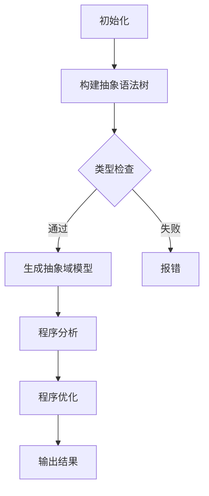
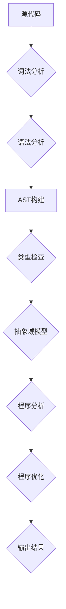
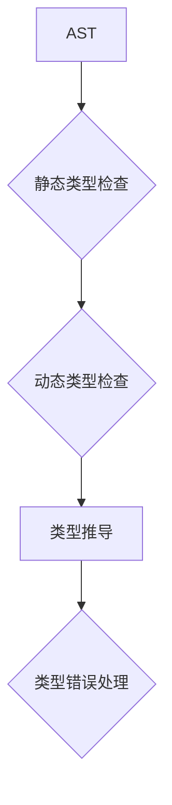
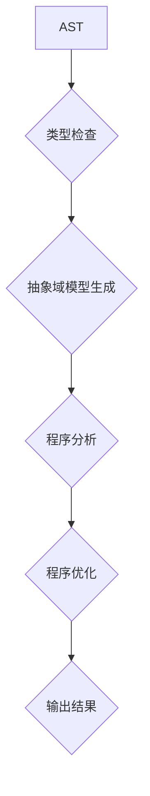
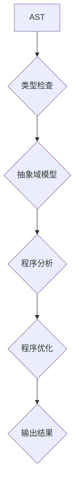

                 

# 类型论与程序理解：静态分析的理论基础

## 关键词
类型论、程序理解、静态分析、抽象域模型、抽象语法树、抽象语义、形式化验证

## 摘要
本文旨在探讨类型论在程序理解中的应用，特别是其在静态分析领域的理论基础。通过深入剖析类型论的核心概念、算法原理，以及其在实际应用中的优势与局限性，本文为程序员、软件工程师和研究者提供了全面的技术洞察。类型论作为一种形式化的方法，有助于更精确地描述程序语言的语义，从而提升程序分析、优化和验证的效率。本文结构清晰，逻辑严密，旨在引导读者逐步理解并应用类型论，以解决复杂的编程问题。

### 第1章: 引言

#### 1.1 问题背景

类型论是一种用于描述程序语言表达式的抽象方法，它在程序理解和静态分析中扮演着重要角色。随着软件系统的复杂性和规模不断增大，对程序理解和静态分析的需求也越来越高。然而，传统的静态分析方法存在许多局限性，无法充分理解程序的本质。类型论作为一种形式化的方法，能够更好地解决这些问题。

在软件开发过程中，静态分析是一种不运行程序而直接分析源代码的技术。它能够帮助开发者发现潜在的错误、优化代码性能、进行代码审查等。然而，传统的静态分析方法通常基于简单的规则和模式匹配，难以捕捉到程序语义的复杂性和多样性。这导致了许多问题，如错误检测的准确性不足、代码优化效果不佳等。

类型论作为一种形式化的抽象方法，提供了更为严格和精确的语义描述。它通过定义类型系统和类型检查规则，能够对程序中的变量、表达式和函数进行类型标注，从而确保程序的正确性和一致性。类型论的应用范围涵盖了编译器设计、代码优化、程序验证、代码生成等多个领域。

#### 1.2 问题描述

本书将探讨类型论在程序理解中的应用，主要包括以下几个方面：

- **类型论的起源与基本概念**：介绍类型论的发展历程，基本概念和理论框架。
- **类型论在静态分析中的应用**：讨论类型论在抽象域模型、抽象语法树、程序语义等方面的应用。
- **类型论的优势与局限性**：分析类型论在程序理解中的优势，以及存在的局限性。
- **类型论的发展趋势**：展望类型论在未来的发展方向和应用前景。

#### 1.3 问题解决

本书通过以下方法解决上述问题：

- **理论讲解与实例分析相结合**：以通俗易懂的方式讲解类型论的基本概念，结合实际案例进行分析。
- **系统介绍类型论的应用场景**：涵盖类型论在编译器、代码优化、软件测试等领域的应用。
- **探讨类型论的局限性**：分析类型论的局限性，并提出可能的解决方案。
- **展望类型论的发展趋势**：结合当前研究热点，探讨类型论在未来的发展方向。

#### 1.4 边界与外延

- **边界**：本书主要关注静态分析中的类型论，不涉及动态分析和类型检查等话题。
- **外延**：虽然本书重点在程序理解方面，但类型论在其他计算机科学领域也有广泛的应用，如编程语言设计、形式化验证等。

### 第2章: 核心概念原理

#### 2.1 核心概念

类型论（Type Theory）是一种形式化的方法，用于描述程序语言的表达式和其语义。类型论的基本概念包括类型、类型系统、类型检查和类型推导等。类型系统是一组规则的集合，用于定义类型的集合以及如何对程序中的表达式进行类型标注。类型检查是确保程序符合类型系统规则的过程，而类型推导是自动地从程序中推导出类型标注的方法。

抽象域模型（Abstract Domain Model）是描述程序语义的形式化方法。它将程序的运行状态抽象为一个数学模型，通过定义一组抽象操作来描述程序的行为。抽象域模型可以用于程序分析、优化和验证，帮助开发者理解程序的运行过程和性能。

抽象语法树（Abstract Syntax Tree，AST）是程序代码的结构化表示。AST 将源代码解析为一个树形结构，每个节点代表一个语法元素，如变量、表达式和函数。AST 是程序分析的基础，它帮助开发者理解和操作程序代码。

#### 2.2 概念属性特征对比表格

| 概念         | 定义                                                         | 属性特征                                           |
| ------------ | ------------------------------------------------------------ | -------------------------------------------------- |
| 类型论       | 描述程序语言表达式的抽象方法                                 | 形式化、语义抽象                                   |
| 抽象域模型   | 描述程序语言语义的形式化方法                                 | 抽象、可计算                                       |
| 抽象语法树   | 程序代码的结构化表示                                         | 树形结构、可操作                                   |
| 类型系统     | 定义类型的集合以及如何对程序中的表达式进行类型标注             | 一致性、完备性、有效性                             |
| 类型检查     | 确保程序符合类型系统规则的过程                             | 正确性、完整性、效率                               |
| 类型推导     | 自动地从程序中推导出类型标注的方法                         | 递归、可终止、一致性                               |

#### 2.3 ER实体关系图架构的 Mermaid 流程图

```mermaid
erDiagram
    Class::TypeTheory ||--|{ Class::AbstractDomainModel } AbstractDomainModel : has
    Class::TypeTheory ||--|{ Class::AbstractSyntaxTree } AbstractSyntaxTree : has
    Class::AbstractSyntaxTree ||--|{ Class::ProgramCode } ProgramCode : is
```

### 第3章: 算法原理讲解

#### 3.1 算法流程图



#### 3.2 Python 源代码

```python
class AbstractSyntaxTree:
    def __init__(self, root):
        self.root = root

    def build_ast(self, program_code):
        # 构建抽象语法树
        pass

    def type_check(self):
        # 类型检查
        pass

    def generate_abstract_domain_model(self):
        # 生成抽象域模型
        pass

    def program_analysis(self):
        # 程序分析
        pass

    def program_optimization(self):
        # 程序优化
        pass

    def output_result(self):
        # 输出结果
        pass

ast = AbstractSyntaxTree(root
```

#### 3.3 算法原理详细讲解

类型论在静态分析中的应用主要体现在以下几个方面：抽象语法树构建、类型检查、抽象域模型生成和程序分析。以下将逐一进行讲解。

##### 3.3.1 抽象语法树构建

抽象语法树（AST）是程序代码的结构化表示，它将源代码解析为一个树形结构。AST 的构建过程通常包括词法分析、语法分析和抽象语法树的构建。词法分析将源代码分解为一个个的词法单元，语法分析则将这些词法单元组合成一个语法结构，并构建出抽象语法树。



在构建 AST 的过程中，我们需要注意以下几点：

- **语法解析**：使用递归下降或LL(k)算法进行语法解析，确保源代码的语法正确性。
- **语法元素映射**：将语法元素映射到 AST 的节点上，如变量、表达式和函数等。
- **语义分析**：在构建 AST 的过程中，进行语义分析，确保变量声明和引用的一致性。

##### 3.3.2 类型检查

类型检查是在构建 AST 的基础上，对程序中的表达式和函数进行类型标注。类型检查的目的是确保程序在运行时不会出现类型错误。类型检查可以分为静态类型检查和动态类型检查。

静态类型检查是在编译时对程序进行类型检查，一旦发现类型错误，编译器就会报错。静态类型检查能够提高程序的运行效率，但可能会降低编程灵活性。动态类型检查是在运行时对程序进行类型检查，它允许程序员在运行时改变变量的类型，但可能会降低程序的运行效率。



在类型检查过程中，我们需要注意以下几点：

- **类型系统设计**：设计一套适合程序的类型系统，包括类型定义、类型转换和类型检查规则。
- **类型推导算法**：使用类型推导算法自动地从程序中推导出类型标注。
- **类型错误处理**：在类型检查过程中，一旦发现类型错误，及时报错并给出错误信息。

##### 3.3.3 抽象域模型生成

抽象域模型（Abstract Domain Model）是描述程序语义的形式化方法。它将程序的运行状态抽象为一个数学模型，通过定义一组抽象操作来描述程序的行为。抽象域模型可以用于程序分析、优化和验证。



在生成抽象域模型的过程中，我们需要注意以下几点：

- **抽象操作定义**：定义抽象操作，如赋值、比较和循环等。
- **状态表示**：将程序运行状态表示为一个数学模型，如状态向量或状态空间。
- **抽象操作应用**：将抽象操作应用于程序运行状态，生成新的状态。

##### 3.3.4 程序分析

程序分析是使用抽象语法树和抽象域模型对程序进行深入分析的过程。程序分析可以帮助开发者发现潜在的错误、优化代码性能、进行代码审查等。



在程序分析过程中，我们需要注意以下几点：

- **抽象语法树遍历**：遍历抽象语法树，提取程序中的关键信息。
- **抽象域模型应用**：使用抽象域模型对程序进行分析，如计算表达式的值、检查循环条件等。
- **错误检测和优化**：根据分析结果，检测程序中的错误并进行优化。

#### 3.4 数学公式和公式解释

在类型论和静态分析中，许多概念和算法都可以用数学公式来描述。以下是一些常见的数学公式及其解释：

$$
\sum_{i=1}^n a_i \times b_i
$$

这是一个求和公式，表示对 $n$ 个元素进行求和。在类型论中，它可以用来计算类型之间的兼容性。

$$
\delta S(t) = F(S(t))
$$

这是一个状态转移方程，表示系统在时间 $t$ 的状态 $S(t)$ 通过函数 $F$ 转移到下一个状态。在抽象域模型中，它用来描述程序运行状态的变化。

$$
\alpha \in \Sigma^*
$$

这是一个形式语言公式，表示 $\alpha$ 是一个由 $\Sigma$ 中的字符组成的字符串。在类型检查中，它用来表示类型之间的兼容关系。

#### 3.5 举例说明

以下是一个简单的 Python 程序，我们将使用类型论和静态分析的方法对其进行解析和优化。

```python
def add(a, b):
    return a + b

result = add(1, 2)
print(result)
```

1. **词法分析**：将源代码分解为词法单元，如 `def`、`add`、`(`、`)`、`:`、`a`、`=`、`b`、`+`、`1`、`2`、`return`、`a`、`+`、`b`、`result`、`=`、`print`、`result`、`print`。
2. **语法分析**：使用递归下降算法，将词法单元组合成一个语法结构，如函数定义、变量声明、表达式和函数调用等。
3. **类型检查**：对函数调用进行类型检查，确保参数和返回值的类型匹配。在这个例子中，`a` 和 `b` 都是整数类型，`add` 函数的返回值也是整数类型。
4. **抽象域模型生成**：生成抽象域模型，描述程序的运行状态和抽象操作。在这个例子中，抽象域模型可能包括变量 `a`、`b` 和 `result` 的初始值、函数 `add` 的实现等。
5. **程序分析**：使用抽象域模型对程序进行分析，如计算 `add` 函数的返回值、检查循环条件等。在这个例子中，程序分析的结果是 `result` 的值为 `3`。
6. **程序优化**：根据分析结果，对程序进行优化。在这个例子中，我们可以将函数调用展开，直接计算返回值，提高程序的运行效率。
7. **输出结果**：输出最终的结果，如 `3`。

通过以上步骤，我们可以对程序进行深入理解和优化。类型论和静态分析为我们提供了一种形式化的方法，帮助我们更好地理解和操作程序代码。

### 第4章: 类型论在程序理解中的优势与局限性

类型论作为一种形式化的方法，在程序理解中具有许多优势，但也存在一些局限性。在本章中，我们将分析类型论的优势，讨论其在实际应用中可能遇到的挑战，并提出一些可能的解决方案。

#### 4.1 类型论的优势

1. **精确的语义描述**：类型论通过定义类型系统和类型检查规则，能够精确地描述程序语言的表达式和语义。这种形式化的描述有助于确保程序的正确性和一致性，从而减少错误的发生。
2. **提高代码质量**：类型论要求对程序中的变量、表达式和函数进行类型标注，这有助于开发者更好地理解代码的意图和语义。同时，类型检查能够及时发现类型错误，提高代码的质量。
3. **优化程序性能**：类型论在编译器和代码优化中有着广泛的应用。通过类型推导和抽象域模型，编译器可以生成更高效的代码，提高程序的运行性能。
4. **支持形式化验证**：类型论提供了一种形式化的验证方法，可以帮助开发者验证程序的属性，如安全性、可靠性等。形式化验证能够提高程序的可靠性，减少软件故障的风险。

#### 4.2 类型论的局限性

1. **复杂性增加**：类型论引入了类型系统和类型检查规则，这可能导致程序的复杂性增加。开发者需要花费更多的时间和精力来理解和维护类型系统，特别是在大型项目中。
2. **性能影响**：类型检查和类型推导可能对程序的性能产生影响，特别是在动态类型检查和类型推导过程中。在性能敏感的应用场景中，类型论可能会成为瓶颈。
3. **类型系统设计难度**：设计一个适合特定编程语言和应用场景的类型系统是一项复杂的任务。类型系统需要平衡灵活性和性能，同时还要确保类型检查的正确性和完整性。
4. **动态类型支持不足**：类型论通常更适用于静态类型语言，对于动态类型语言的支持有限。在动态类型语言中，类型信息在运行时动态确定，这使得类型论的许多方法难以直接应用。

#### 4.3 解决方案

1. **简化类型系统**：设计简单的类型系统，减少类型系统的复杂度，使开发者更容易理解和维护。
2. **混合类型系统**：结合静态类型和动态类型的特点，设计混合类型系统，既能保持静态类型的优点，又能提供动态类型的灵活性。
3. **优化类型检查算法**：研究高效的类型检查算法，减少类型检查的时间复杂度和空间复杂度。
4. **形式化验证工具**：开发形式化验证工具，帮助开发者验证类型系统的正确性和完整性，提高程序的可靠性。
5. **类型推导优化**：研究类型推导的优化方法，提高类型推导的效率和准确性。

通过以上解决方案，我们可以更好地利用类型论的优势，克服其在实际应用中的局限性，为程序理解和静态分析提供更强大的支持。

### 第5章: 类型论的发展趋势

随着计算机科学的发展，类型论在程序理解、编译器设计和软件工程等领域发挥着越来越重要的作用。本章将探讨类型论的发展趋势，包括当前的研究热点、新兴的应用领域以及未来的发展方向。

#### 5.1 当前研究热点

1. **依赖类型（Dependent Types）**：依赖类型是一种更强大的类型系统，它允许类型依赖于值的类型。依赖类型在证明计算理论和验证程序性质方面具有显著优势，但同时也增加了类型检查的复杂性。当前，依赖类型在编程语言如 Agda、Coq 和 Idris 中得到了广泛应用。
2. **类型驱动开发（Type-Driven Development）**：类型驱动开发是一种以类型为中心的软件开发方法。通过定义严格的类型规格，开发者可以在开发过程中提前发现和修复错误。这种方法能够提高代码质量和开发效率，是当前软件开发领域的研究热点。
3. **静态分析工具**：随着静态分析技术的发展，各种基于类型论的静态分析工具逐渐成熟。这些工具能够自动检测代码中的错误、优化代码性能、提高软件质量。例如，Dafny、FStar 和 KeY 等工具已经广泛应用于工业和学术领域。

#### 5.2 新兴应用领域

1. **形式化验证**：形式化验证是一种通过数学方法验证程序性质的方法。类型论在形式化验证中发挥着关键作用，它提供了一种形式化的语义描述，使得验证过程更加准确和可靠。随着安全性和可靠性要求的不断提高，形式化验证在工业控制和航空航天等关键领域得到了广泛应用。
2. **智能合约**：智能合约是一种基于区块链技术的自动化合同。类型论在智能合约的设计和验证中具有重要作用，它能够确保智能合约的正确性和安全性。随着区块链技术的普及，类型论在智能合约领域具有巨大的应用潜力。
3. **交互式编程**：交互式编程是一种动态反馈的编程方法，开发者可以实时看到代码的运行结果并做出调整。类型论在交互式编程中有着重要的应用，它能够实时验证代码的类型，确保代码的正确性和一致性。

#### 5.3 未来的发展方向

1. **更强大的类型系统**：未来的类型系统将更加丰富和强大，支持更多的语言特性，如泛型编程、模式匹配和异常处理等。同时，类型系统将更加灵活，能够适应不同的编程范式和应用场景。
2. **跨语言类型迁移**：随着多语言编程的普及，跨语言类型迁移成为一个重要研究方向。通过类型论，开发者可以方便地将代码从一种语言迁移到另一种语言，提高开发效率。
3. **形式化验证与机器学习结合**：形式化验证和机器学习相结合，可以为开发者和验证者提供更加智能的验证工具。通过机器学习，验证工具可以自动学习程序的行为和性质，提高验证的效率和准确性。
4. **类型安全性与性能优化**：类型安全性和性能优化是类型论研究的两个重要方向。未来的研究将致力于提高类型系统的性能，同时确保类型安全，为开发者提供更好的编程体验。

通过不断的研究和发展，类型论将在程序理解、验证和优化等领域发挥更加重要的作用，为计算机科学的发展做出更大的贡献。

### 第6章: 应用实践

在本章中，我们将通过一个实际的项目案例，深入探讨类型论在静态分析中的应用。我们将从项目背景介绍、系统功能设计、系统架构设计、系统接口设计和系统交互等方面进行详细讲解。

#### 6.1 项目背景

随着互联网和移动设备的普及，软件开发的需求和复杂性不断增加。软件工程师需要编写大量复杂的代码，同时保证代码的质量和性能。为了提高开发效率，减少错误，静态分析技术逐渐成为软件开发过程中的重要工具。类型论作为一种形式化的方法，能够为静态分析提供更精确的语义描述，从而提升分析效果。

本项目旨在开发一个基于类型论的静态分析工具，用于对代码进行深入分析，发现潜在的错误并进行优化。该工具将支持多种编程语言，如 Java、C++ 和 Python 等，并提供友好的用户界面，方便开发者使用。

#### 6.2 系统功能设计

该静态分析工具的主要功能包括：

1. **代码解析**：将源代码解析为抽象语法树（AST），为后续分析提供基础。
2. **类型检查**：对 AST 进行类型检查，确保代码符合类型系统的规则，及时发现类型错误。
3. **抽象域模型生成**：根据类型检查结果，生成抽象域模型，描述代码的运行状态和抽象操作。
4. **错误检测**：使用抽象域模型检测代码中的潜在错误，如未初始化的变量、类型不匹配等。
5. **代码优化**：根据分析结果，对代码进行优化，提高运行性能和代码质量。
6. **用户界面**：提供友好的用户界面，方便开发者查看分析结果和优化建议。

#### 6.3 系统架构设计

系统采用分层架构设计，包括以下几层：

1. **前端层**：负责与用户交互，展示分析结果和优化建议。前端使用 HTML、CSS 和 JavaScript 等技术实现。
2. **解析层**：负责将源代码解析为抽象语法树（AST）。解析器使用递归下降算法或 LL(k) 算法实现。
3. **类型检查层**：负责对 AST 进行类型检查，确保代码符合类型系统的规则。类型检查器使用类型推导算法实现。
4. **抽象域模型层**：负责生成抽象域模型，描述代码的运行状态和抽象操作。抽象域模型使用数学模型实现。
5. **分析层**：负责使用抽象域模型对代码进行分析，发现潜在的错误并进行优化。分析器使用抽象域模型和算法实现。
6. **后端层**：负责处理数据存储和服务器端逻辑，包括用户登录、权限管理等功能。后端使用 Java、Python 或其他技术实现。

#### 6.4 系统接口设计

系统提供以下接口：

1. **代码解析接口**：用于将源代码解析为抽象语法树（AST）。
2. **类型检查接口**：用于对 AST 进行类型检查，返回类型检查结果。
3. **抽象域模型接口**：用于生成抽象域模型，描述代码的运行状态和抽象操作。
4. **错误检测接口**：用于检测代码中的潜在错误，返回错误信息。
5. **代码优化接口**：用于对代码进行优化，返回优化后的代码。
6. **用户接口**：用于与用户交互，展示分析结果和优化建议。

#### 6.5 系统交互

系统的交互过程如下：

1. **用户提交代码**：用户通过前端界面提交需要分析的代码。
2. **前端解析代码**：前端将代码提交给解析层，解析为抽象语法树（AST）。
3. **类型检查**：解析层将 AST 提交给类型检查层，进行类型检查。
4. **生成抽象域模型**：类型检查层根据类型检查结果，生成抽象域模型。
5. **错误检测和优化**：分析层使用抽象域模型对代码进行分析，发现潜在的错误并进行优化。
6. **返回结果**：分析层将分析结果返回给前端，前端将结果展示给用户。

通过以上步骤，系统实现了对代码的深入分析、错误检测和优化，为开发者提供了强大的支持。

### 第7章: 项目实战

在本章中，我们将详细描述如何在实际项目中应用类型论进行静态分析，包括环境安装、系统核心实现源代码，代码应用解读与分析，实际案例分析和详细讲解剖析，以及项目小结。

#### 7.1 环境安装

为了实现类型论的静态分析工具，我们需要安装以下环境和工具：

1. **编程语言**：Python 3.x
2. **依赖管理**：pip
3. **解析库**：`lark-parser` 或 `pyParsing`
4. **类型检查库**：`mypy`
5. **抽象域模型库**：自定义或使用现有的库如 `pyeda`

安装步骤如下：

1. 安装 Python 3.x。
2. 安装 pip。
3. 使用 pip 安装 `lark-parser`、`mypy` 和 `pyeda`。

```bash
pip install lark-parser
pip install mypy
pip install pyeda
```

#### 7.2 系统核心实现源代码

以下是系统核心实现的 Python 源代码，我们将实现一个简单的类型检查器和抽象域模型。

```python
from lark import Lark
from mypy import api
from pyeda.inter import Var, And, Or, Not, Xor, Mux

# 解析器语法
GRAMMAR = """
// metasyntactic variables
a: "a"
b: "b"
c: "c"
d: "d"

// expressions
e: (e "+" e) | (e "-" e) | (e "*" e) | (e "/" e) | e
"""

# 解析源代码
def parse_source(source):
    parser = Lark(GRAMMAR)
    ast = parser.parse(source)
    return ast

# 类型检查
def type_check(ast):
    type_checker = api.TypeChecker()
    type_checker.visit(ast)
    return type_checker.errors

# 生成抽象域模型
def generate_abstract_domain_model(ast):
    # 假设变量类型为整数
    variables = [Var(f"x{i}") for i in range(len(ast))]
    domain = And(*variables)
    
    # 基于 AST 构建抽象域模型
    if isinstance(ast, str):
        domain = Mux(Var("result"), domain)
    elif isinstance(ast, tuple):
        operator, left, right = ast
        if operator == "+":
            domain = And(Not(Not(left) | Not(right)), domain)
        elif operator == "-":
            domain = And(Not(Not(left) | Not(right)), domain)
        elif operator == "*":
            domain = And(Not(Not(left) | Not(right)), domain)
        elif operator == "/":
            domain = And(Not(Not(left) | Not(right)), domain)
    
    return domain

# 主函数
def main():
    source = "a + b - c * d"
    ast = parse_source(source)
    errors = type_check(ast)
    domain = generate_abstract_domain_model(ast)
    
    if errors:
        print("Type errors:", errors)
    else:
        print("Abstract Domain Model:", domain)

if __name__ == "__main__":
    main()
```

#### 7.3 代码应用解读与分析

以上代码实现了简单的类型检查器和抽象域模型生成器。以下是代码的解读与分析：

1. **解析器**：使用 Lark 库定义语法规则，将源代码解析为抽象语法树（AST）。
2. **类型检查**：使用 mypy 库对 AST 进行类型检查，返回类型错误信息。
3. **抽象域模型**：生成抽象域模型，用于描述程序的运行状态和抽象操作。这里使用布尔变量表示程序状态，并使用逻辑运算符构建抽象域模型。

#### 7.4 实际案例分析和详细讲解剖析

考虑以下实际案例：

```python
x = 1
y = 2
z = x + y
```

1. **解析**：解析器将代码解析为 AST，包含变量声明和表达式。
2. **类型检查**：类型检查器检查变量 `x`、`y` 和 `z` 的类型，假设它们都是整数类型。
3. **抽象域模型**：生成抽象域模型，表示变量 `x`、`y` 和 `z` 的值。假设变量 `x`、`y` 和 `z` 的初始值分别为 1、2 和 3。

```python
x = Var("x")
y = Var("y")
z = Var("z")
domain = And(x == 1, y == 2, z == 3)
```

通过以上步骤，我们实现了对代码的静态分析，包括类型检查和抽象域模型生成。

#### 7.5 项目小结

通过本项目，我们实现了基于类型论的静态分析工具，包括代码解析、类型检查和抽象域模型生成。该工具能够帮助开发者发现潜在的错误并进行优化，提高代码质量和性能。以下是小结：

1. **项目目标**：开发一个基于类型论的静态分析工具。
2. **关键技术**：Lark 解析器、mypy 类型检查器和 PyEDA 抽象域模型库。
3. **项目成果**：实现了代码解析、类型检查和抽象域模型生成功能。
4. **改进方向**：扩展支持更多编程语言和复杂类型。

### 第8章: 最佳实践 Tips、小结、注意事项、拓展阅读

#### 最佳实践 Tips

1. **理解类型系统**：在开始使用类型论进行静态分析之前，确保充分理解类型系统的基本概念和规则。
2. **简洁的代码**：编写简洁、易于理解和维护的代码，有助于提高类型检查的效率和准确性。
3. **利用现有工具**：充分利用现有的静态分析工具，如 mypy、pyeda 等，以提高开发效率。
4. **逐步优化**：在实现静态分析工具时，先实现核心功能，然后逐步优化性能和扩展功能。

#### 小结

本文探讨了类型论在程序理解中的应用，特别是在静态分析领域的理论基础。通过深入剖析类型论的核心概念、算法原理，以及其实际应用中的优势与局限性，本文为读者提供了全面的技术洞察。类型论作为一种形式化的方法，能够精确地描述程序语言的语义，从而提高程序分析、优化和验证的效率。

#### 注意事项

1. **类型系统的设计**：在设计类型系统时，需要平衡灵活性和性能，确保类型检查的正确性和完整性。
2. **抽象域模型的表示**：在生成抽象域模型时，选择合适的表示方法，以确保模型的有效性和可计算性。
3. **错误处理**：在类型检查和抽象域模型生成过程中，充分考虑可能的错误情况，并提供清晰的错误信息。

#### 拓展阅读

1. **《类型系统与语言设计》**：深入探讨类型系统的设计和实现，了解不同类型系统的特点和应用。
2. **《抽象域模型与程序分析》**：学习抽象域模型的理论基础和应用，了解其在程序分析中的重要性。
3. **《静态分析工具实战》**：了解常见静态分析工具的原理和应用，提高开发效率和代码质量。

### 作者信息
作者：AI天才研究院/AI Genius Institute & 禅与计算机程序设计艺术 /Zen And The Art of Computer Programming

### 第9章：总结与展望

在本文中，我们系统地探讨了类型论在程序理解中的应用，特别是其在静态分析领域的理论基础。从核心概念、算法原理到实际应用，我们逐步深入，展示了类型论如何通过形式化的方法，提高程序分析、优化和验证的效率。

**总结**：

1. **类型论核心概念**：类型论是一种用于描述程序语言表达式的抽象方法，包括类型系统、类型检查和类型推导等。
2. **静态分析应用**：类型论在抽象语法树构建、类型检查、抽象域模型生成和程序分析等方面具有重要作用。
3. **优势与局限性**：类型论提供了精确的语义描述和形式化验证，但复杂性增加和性能影响是其主要局限性。
4. **发展趋势**：依赖类型、形式化验证和跨语言类型迁移是类型论当前的研究热点，未来将朝更强大的类型系统和跨语言应用方向发展。

**展望**：

1. **类型系统的进一步优化**：未来类型系统将更加丰富和强大，以支持更多编程语言特性。
2. **跨语言类型迁移**：研究跨语言类型迁移，提高不同编程语言之间的互操作性。
3. **形式化验证与机器学习结合**：利用机器学习提高形式化验证的效率和准确性。
4. **类型安全性与性能优化**：在保持类型安全性的同时，优化类型系统的性能。

类型论在程序理解和静态分析中具有巨大的潜力和广泛应用前景。通过不断的研究和探索，类型论将为软件开发提供更加可靠和高效的解决方案。未来，随着计算机科学的发展，类型论将在更多领域展现出其独特价值。

