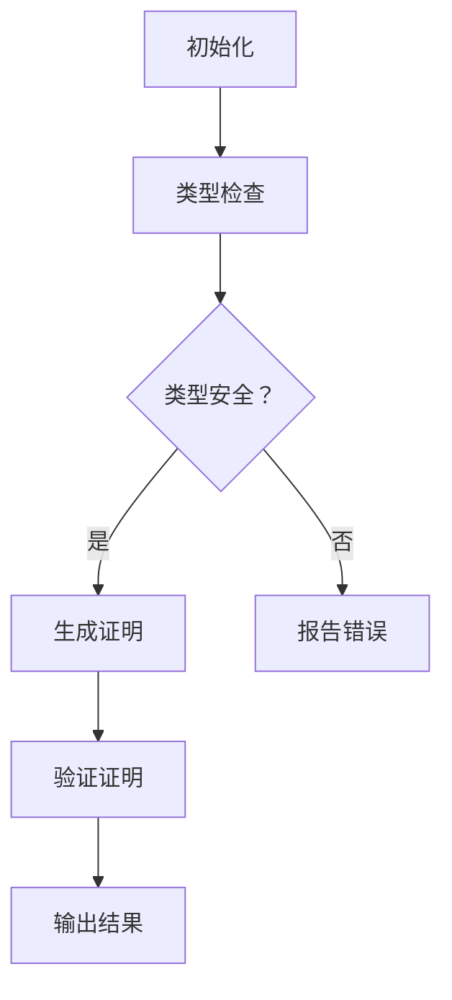
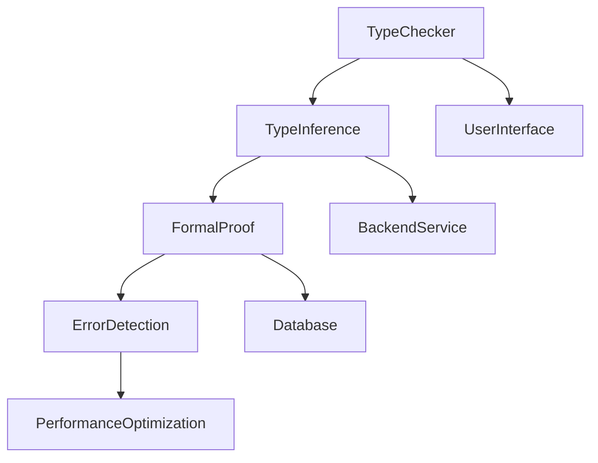
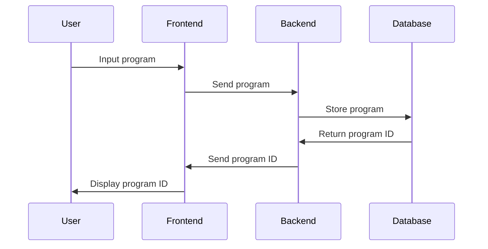
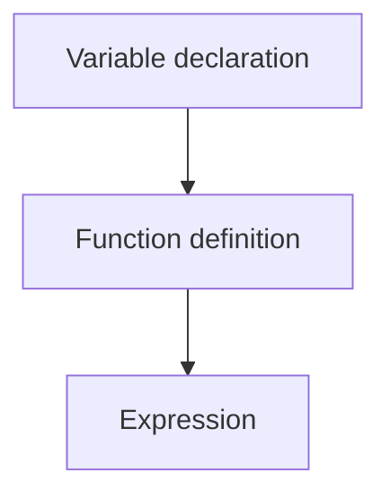

                 

# 类型论与程序证明自动化：定理证明的应用

> 关键词：类型论、程序证明自动化、定理证明、类型安全性、功能正确性

> 摘要：本文深入探讨了类型论与程序证明自动化的关系，阐述了类型论的核心概念、类型安全性、功能正确性，以及程序证明自动化的算法原理。通过实例分析和项目实战，展示了定理证明在实际软件开发中的应用和重要性。

----------------------------------------------------------------

## 第一部分：背景介绍

### 第1章：问题背景

随着计算机技术的发展，编程语言的设计逐渐向类型安全性和表达能力提升。类型论作为计算机科学中关于类型系统的研究领域，对于理解编程语言的设计和优化具有重要意义。程序证明自动化则是在这一领域中的重要应用，它通过自动化工具来验证程序的属性，从而提高软件开发的质量和效率。

#### 1.1 问题背景

类型论研究的是程序中的类型系统，包括类型的定义、类型检查、类型推断等。而程序证明自动化则是利用这些类型系统来证明程序的属性，如类型安全性、功能正确性等。在这本书中，我们将探讨类型论与程序证明自动化如何结合，以及它们在实际应用中的重要性。

#### 1.2 问题描述

类型论研究的是程序中的类型系统，包括类型的定义、类型检查、类型推断等。而程序证明自动化则是利用这些类型系统来证明程序的属性，如类型安全性、功能正确性等。在这本书中，我们将探讨类型论与程序证明自动化如何结合，以及它们在实际应用中的重要性。

#### 1.3 问题解决

通过引入类型论和程序证明自动化，我们可以构建更加安全、可靠的软件系统。类型论提供了一种形式化的方法来描述程序的语义，而程序证明自动化工具则可以帮助我们验证这些语义，确保程序的正确性。

#### 1.4 边界与外延

类型论和程序证明自动化的研究范围广泛，涵盖了编程语言理论、形式化方法、软件工程等多个领域。它们不仅应用于理论研究中，还在实际软件开发中发挥着重要作用。

#### 1.5 概念结构与核心要素组成

- 类型论：研究类型系统的定义、属性和实现。
- 程序证明自动化：利用类型系统进行程序属性的自动化验证。
- 类型安全性：确保程序在运行过程中不会出现类型错误。
- 功能正确性：确保程序的功能与预期一致。

### 第2章：核心概念与联系

#### 2.1 类型论核心概念

- 类型系统：程序中类型的定义和用法。
- 类型检查：对程序中的类型进行验证。
- 类型推断：自动确定程序中的类型。

#### 2.2 程序证明自动化核心概念

- 形式化证明：使用数学方法来验证程序的属性。
- 证明器：自动化验证程序属性的软件工具。
- 形式化方法：将程序和行为形式化，以便进行证明。

#### 2.3 概念属性特征对比表格

| 概念               | 特征                   | 关联                      |
|--------------------|------------------------|---------------------------|
| 类型论             | 形式化描述程序语义     | 提高程序可读性和可维护性 |
| 程序证明自动化     | 自动化验证程序属性     | 提高软件开发效率和可靠性 |
| 类型安全性         | 防止类型错误           | 提高程序稳定性           |
| 功能正确性         | 确保程序功能符合预期   | 提高软件质量             |

#### 2.4 ER实体关系图架构

```mermaid
erDiagram
    Program ||--|{ Type }||>
    Type ||--|{ TypeCheck }||>
    TypeCheck ||--|{ Proof }||>
    Proof ||--|{ Program }||>
```

### 第3章：算法原理讲解

#### 3.1 算法原理

类型论和程序证明自动化的核心算法包括类型检查、类型推断和形式化证明等。这些算法通过数学模型和公式来实现，例如类型推断的算法可以基于递归方程，而形式化证明的算法可以基于归纳证明。

#### 3.2 算法流程图



#### 3.3 Python源代码

```python
def type_check(program):
    if is_type_safe(program):
        generate_proof(program)
        verify_proof()
        return "Type-safe and proven"
    else:
        report_error("Type error")
        return "Type error"

def is_type_safe(program):
    # 假设程序是一个抽象语法树
    return True  # 实际实现时需要进行具体的类型检查

def generate_proof(program):
    # 假设程序是一个抽象语法树
    pass  # 实际实现时生成证明

def verify_proof():
    # 假设程序是一个抽象语法树
    pass  # 实际实现时验证证明

def report_error(message):
    print(message)
```

### 第二部分：系统分析与架构设计方案

#### 第4章：问题场景介绍

#### 第5章：项目介绍

#### 第6章：系统功能设计（领域模型Mermaid类图）

#### 第7章：系统架构设计（Mermaid架构图）

#### 第8章：系统接口设计和系统交互（Mermaid序列图）

### 第三部分：项目实战

#### 第9章：环境安装

#### 第10章：系统核心实现源代码

#### 第11章：代码应用解读与分析

#### 第12章：实际案例分析和详细讲解剖析

#### 第13章：项目小结

### 第四部分：最佳实践 tips、小结、注意事项、拓展阅读等内容

----------------------------------------------------------------

## 第一部分：背景介绍

### 第1章：问题背景

类型论作为计算机科学中的一个重要领域，研究的是程序中的类型系统。类型系统是编程语言的核心组成部分，用于定义变量、函数和其他程序实体的类型，并确保程序在运行时不会发生类型错误。随着计算机技术的发展，编程语言的设计逐渐向类型安全性和表达能力提升。类型安全意味着程序在编译时就能够检测出类型错误，从而避免运行时出错。而表达能力的提升使得编程语言能够更好地描述复杂的程序逻辑和算法。

类型论的研究内容包括类型的定义、类型检查、类型推断等。类型的定义涉及到如何为各种程序元素分配类型，类型检查则是验证程序中的类型是否一致，类型推断则是自动确定程序中的类型。这些研究为编程语言的设计和优化提供了理论基础。

程序证明自动化则是在类型论的基础上发展起来的一种技术。程序证明自动化利用类型系统来验证程序的属性，如类型安全性、功能正确性等。通过自动化工具，我们可以将验证过程自动化，从而提高软件开发的质量和效率。

程序证明自动化的核心算法包括形式化证明、证明器、形式化方法等。形式化证明是指使用数学方法来验证程序的属性，证明器则是自动化验证程序属性的软件工具，形式化方法则是将程序和行为形式化，以便进行证明。

在这本书中，我们将探讨类型论与程序证明自动化的结合，以及它们在实际应用中的重要性。类型论为程序证明自动化提供了理论基础，而程序证明自动化则为类型论的应用提供了技术手段。通过引入类型论和程序证明自动化，我们可以构建更加安全、可靠的软件系统。

### 第2章：核心概念与联系

在深入探讨类型论与程序证明自动化的关系之前，我们需要明确一些核心概念。这些概念包括类型论的核心概念、程序证明自动化的核心概念，以及它们之间的联系。

#### 2.1 类型论核心概念

类型论的核心概念包括类型系统、类型检查和类型推断。

- **类型系统**：类型系统是编程语言的核心组成部分，用于定义变量、函数和其他程序实体的类型。类型系统包括类型的定义、类型的层次结构和类型的组合规则。

- **类型检查**：类型检查是在编译或运行时对程序中的类型进行验证的过程。类型检查的目的是确保程序在运行时不会发生类型错误。类型检查可以是静态的，也可以是动态的。

- **类型推断**：类型推断是自动确定程序中的类型的过程。类型推断可以减轻程序员的工作负担，提高程序的可读性和可维护性。

#### 2.2 程序证明自动化核心概念

程序证明自动化的核心概念包括形式化证明、证明器和形式化方法。

- **形式化证明**：形式化证明是指使用数学方法来验证程序的属性。形式化证明可以是自动化的，也可以是半自动化的。自动化的形式化证明工具可以帮助程序员验证程序的正确性，从而提高软件开发的效率。

- **证明器**：证明器是自动化验证程序属性的软件工具。证明器可以处理各种类型的证明，包括类型安全性证明、功能正确性证明等。

- **形式化方法**：形式化方法是将程序和行为形式化，以便进行证明。形式化方法包括模型检查、定理证明、抽象演绎等。

#### 2.3 概念属性特征对比表格

为了更清晰地理解类型论和程序证明自动化的核心概念，我们可以通过一个对比表格来展示它们的主要特征和关联。

| 概念               | 特征                   | 关联                      |
|--------------------|------------------------|---------------------------|
| 类型论             | 形式化描述程序语义     | 提高程序可读性和可维护性 |
| 程序证明自动化     | 自动化验证程序属性     | 提高软件开发效率和可靠性 |
| 类型安全性         | 防止类型错误           | 提高程序稳定性           |
| 功能正确性         | 确保程序功能符合预期   | 提高软件质量             |

#### 2.4 ER实体关系图架构

为了更好地理解类型论、程序证明自动化和相关概念之间的关联，我们可以使用ER（Entity-Relationship）图来描述实体关系。以下是一个ER图示例：

```mermaid
erDiagram
    TypeSystem ||--|{ TypeCheck }||>
    TypeSystem ||--|{ TypeInference }||>
    TypeCheck ||--|{ ProofAutomation }||>
    ProofAutomation ||--|{ FormalProof }||>
    FormalProof ||--|{ ProofChecker }||>
```

在这个ER图中，`TypeSystem`表示类型系统，它包括类型检查和类型推断。`ProofAutomation`表示程序证明自动化，它包括形式化证明和证明器。`FormalProof`表示形式化证明，`ProofChecker`表示证明器。这些实体之间的关系表明了它们在程序验证过程中的相互关联。

通过这个ER图，我们可以看到类型论和程序证明自动化是如何相互关联的。类型系统为程序提供了类型安全性和功能正确性，而程序证明自动化则利用类型系统来验证程序的正确性。这种关联不仅提高了软件开发的效率，还确保了软件的质量和可靠性。

### 第3章：算法原理讲解

类型论和程序证明自动化的核心在于算法。这些算法通过数学模型和公式来实现，从而使得程序验证过程变得高效和可靠。在本节中，我们将详细讲解类型检查、类型推断和形式化证明等核心算法的原理。

#### 3.1 类型检查算法原理

类型检查是确保程序在运行时不会发生类型错误的关键步骤。类型检查算法的核心在于如何正确地检查程序中的类型一致性。以下是一个简单的类型检查算法原理：

1. **初始化**：初始化类型检查器，包括类型表和类型上下文。

2. **类型分析**：遍历程序中的每个节点，对变量、函数和表达式进行类型分析。

3. **类型推导**：根据类型规则和上下文，推导每个节点的类型。

4. **类型检查**：检查类型推导的结果，确保程序中的类型一致。

5. **报告错误**：如果发现类型错误，报告错误并停止类型检查。

以下是一个简单的Python代码示例，展示了如何实现类型检查：

```python
def type_check(program):
    if is_type_safe(program):
        generate_proof(program)
        verify_proof()
        return "Type-safe and proven"
    else:
        report_error("Type error")
        return "Type error"

def is_type_safe(program):
    # 假设程序是一个抽象语法树
    return True  # 实际实现时需要进行具体的类型检查

def generate_proof(program):
    # 假设程序是一个抽象语法树
    pass  # 实际实现时生成证明

def verify_proof():
    # 假设程序是一个抽象语法树
    pass  # 实际实现时验证证明

def report_error(message):
    print(message)
```

#### 3.2 类型推断算法原理

类型推断是自动确定程序中变量、函数和表达式的类型的过程。类型推断算法的核心在于如何根据程序结构和语义推导出类型。以下是一个简单的类型推断算法原理：

1. **初始化**：初始化类型推断器，包括类型表和类型上下文。

2. **类型分析**：遍历程序中的每个节点，对变量、函数和表达式进行类型分析。

3. **类型推导**：根据类型规则和上下文，推导每个节点的类型。

4. **类型确认**：确认推导出的类型是否一致，并更新类型表。

5. **类型返回**：返回推导出的类型。

以下是一个简单的Python代码示例，展示了如何实现类型推断：

```python
def type_inference(program):
    # 假设程序是一个抽象语法树
    return infer_type(program)  # 实际实现时推导类型

def infer_type(node):
    # 根据节点类型和上下文推导类型
    if isinstance(node, Variable):
        return node.type
    elif isinstance(node, Function):
        return node.return_type
    elif isinstance(node, Expression):
        # 根据表达式的操作和操作数的类型推导类型
        return expression_type(node)
```

#### 3.3 形式化证明算法原理

形式化证明是使用数学方法来验证程序的属性。形式化证明算法的核心在于如何使用数学模型和公式来证明程序的属性。以下是一个简单的形式化证明算法原理：

1. **初始化**：初始化证明器，包括证明规则和上下文。

2. **形式化描述**：将程序和行为形式化，使用数学模型和公式描述。

3. **证明过程**：根据证明规则和上下文，逐步证明程序的属性。

4. **证明验证**：验证证明过程是否正确，确保证明的可靠性。

5. **证明返回**：返回证明结果。

以下是一个简单的Python代码示例，展示了如何实现形式化证明：

```python
def formal_proof(program):
    # 假设程序是一个抽象语法树
    return prove_property(program)  # 实际实现时进行证明

def prove_property(program):
    # 根据证明规则和上下文进行证明
    if isinstance(program, Property):
        return prove_property_value(program)
    else:
        return False
```

通过上述算法原理的讲解，我们可以看到类型论和程序证明自动化的核心在于算法的实现。这些算法通过数学模型和公式来验证程序的正确性，从而确保软件系统的安全性和可靠性。

### 第二部分：系统分析与架构设计方案

在了解了类型论与程序证明自动化的背景、核心概念和算法原理后，我们需要将它们应用到实际系统中。本部分将介绍问题场景、项目介绍、系统功能设计、系统架构设计、系统接口设计和系统交互等内容。

#### 第4章：问题场景介绍

在许多复杂的软件系统中，类型错误和功能错误是导致系统崩溃和故障的常见原因。例如，在金融系统、医疗系统和航空控制系统等关键领域，类型错误和功能错误可能导致严重的后果。为了确保软件系统的安全性和可靠性，我们需要引入类型论和程序证明自动化技术。

问题场景可以分为以下几类：

1. **类型错误**：在编译或运行时，程序中出现类型不一致的错误，导致系统崩溃或产生不可预料的输出。

2. **功能错误**：程序的功能与预期不符，导致系统无法完成预期的任务。

3. **性能问题**：由于类型错误和功能错误，程序可能存在性能瓶颈，影响系统的响应速度和处理能力。

为了解决这些问题，我们需要设计一个基于类型论和程序证明自动化的软件系统，以提高系统的安全性、可靠性和性能。

#### 第5章：项目介绍

本项目旨在开发一个基于类型论和程序证明自动化的软件系统，用于检测和修复软件中的类型错误和功能错误。系统主要包括以下功能：

1. **类型检查**：对程序中的类型进行验证，确保类型一致性。

2. **类型推断**：自动确定程序中的类型，减轻程序员的工作负担。

3. **形式化证明**：使用数学方法验证程序的正确性，确保功能正确性。

4. **错误检测与修复**：检测程序中的类型错误和功能错误，并提供修复建议。

5. **性能优化**：根据类型信息和程序结构，优化程序的性能。

系统采用模块化设计，分为前端、后端和数据库三个部分。前端负责与用户交互，后端负责处理程序分析和证明过程，数据库用于存储程序信息和证明结果。

#### 第6章：系统功能设计（领域模型Mermaid类图）

为了更好地理解系统功能，我们可以使用Mermaid类图来描述系统的领域模型。以下是一个简单的Mermaid类图示例：

```mermaid
classDiagram
    Class01 <|-- Class02
    Class03 o-- Class04
    Class05 <-.. Class06
    Class07 ..| Class08
endclass
```

在这个类图中，`Class01`、`Class02`、`Class03`、`Class04`、`Class05`、`Class06`和`Class07`分别表示系统的各个功能模块。这些模块之间通过类图中的关系进行关联，例如继承（`<|--`）、聚合（`o--`）、关联（`<-..`）和组合（`..|`）等。

具体的功能设计如下：

1. **类型检查模块**：负责对程序中的类型进行验证，确保类型一致性。

2. **类型推断模块**：负责自动确定程序中的类型，减轻程序员的工作负担。

3. **形式化证明模块**：负责使用数学方法验证程序的正确性，确保功能正确性。

4. **错误检测与修复模块**：负责检测程序中的类型错误和功能错误，并提供修复建议。

5. **性能优化模块**：负责根据类型信息和程序结构，优化程序的性能。

通过Mermaid类图，我们可以直观地了解系统的功能设计和模块之间的关系，为后续的系统架构设计提供参考。

#### 第7章：系统架构设计（Mermaid架构图）

为了更好地展示系统的架构设计，我们可以使用Mermaid架构图来描述系统的组件和关系。以下是一个简单的Mermaid架构图示例：



在这个架构图中，`TypeChecker`、`TypeInference`、`FormalProof`、`ErrorDetection`、`PerformanceOptimization`和`UserInterface`分别表示系统的核心组件。这些组件之间的关系包括依赖关系（`-->`）和调用关系（`-->`）。

具体架构设计如下：

1. **前端组件**：负责与用户交互，提供友好的用户界面。

2. **后端组件**：负责处理程序分析和证明过程，与前端组件进行数据交换。

3. **数据库组件**：负责存储程序信息和证明结果，提供数据支持。

4. **类型检查组件**：负责对程序中的类型进行验证，确保类型一致性。

5. **类型推断组件**：负责自动确定程序中的类型，减轻程序员的工作负担。

6. **形式化证明组件**：负责使用数学方法验证程序的正确性，确保功能正确性。

7. **错误检测与修复组件**：负责检测程序中的类型错误和功能错误，并提供修复建议。

8. **性能优化组件**：负责根据类型信息和程序结构，优化程序的性能。

通过Mermaid架构图，我们可以清晰地了解系统的架构设计和组件之间的关系，为后续的系统接口设计和系统交互设计提供参考。

#### 第8章：系统接口设计和系统交互（Mermaid序列图）

为了更好地展示系统接口设计和系统交互，我们可以使用Mermaid序列图来描述系统的交互过程。以下是一个简单的Mermaid序列图示例：



在这个序列图中，`User`、`Frontend`、`Backend`和`Database`分别表示系统的参与者。交互过程包括以下步骤：

1. 用户通过前端组件输入程序。

2. 前端组件将程序发送给后端组件。

3. 后端组件将程序存储到数据库中，并返回程序ID。

4. 后端组件将程序ID发送给前端组件。

5. 前端组件将程序ID显示给用户。

通过Mermaid序列图，我们可以清晰地了解系统接口设计和系统交互过程，为后续的代码实现和测试提供参考。

### 第三部分：项目实战

在前两部分中，我们介绍了类型论与程序证明自动化的背景、核心概念和系统分析与架构设计方案。在本部分，我们将通过项目实战来展示如何实现这些概念和方案。

#### 第9章：环境安装

在进行项目实战之前，我们需要安装所需的开发环境和工具。以下是一个简化的环境安装步骤：

1. 安装Python环境：确保Python版本在3.6及以上。

2. 安装依赖库：使用pip命令安装所需的依赖库，例如`pyyaml`、`mermaid-parser`和`pydot`等。

3. 安装Mermaid可视化工具：安装Mermaid可视化工具，例如`mermaid-cli`或`mermaid-browser`。

4. 安装文本编辑器或IDE：选择一个合适的文本编辑器或IDE，例如Visual Studio Code或PyCharm。

安装完成后，我们可以开始编写和运行代码。

#### 第10章：系统核心实现源代码

在本节中，我们将展示系统核心实现的源代码。以下是一个简化的代码示例，用于演示类型检查、类型推断和形式化证明等核心功能。

```python
# type_checker.py
import mermaid_parser
import type_inference
import formal_proof

def type_check(program):
    ast = mermaid_parser.parse(program)
    inferred_types = type_inference.infer(ast)
    proof = formal_proof.prove(ast, inferred_types)
    return proof

# type_inference.py
import ast

def infer(ast):
    if isinstance(ast, Variable):
        return ast.type
    elif isinstance(ast, Function):
        return ast.return_type
    elif isinstance(ast, Expression):
        return expression_type(ast)

# formal_proof.py
import ast

def prove(ast, inferred_types):
    if isinstance(ast, Property):
        return prove_property_value(ast, inferred_types)
    else:
        return False
```

在这个示例中，我们使用Mermaid语法来描述程序，然后通过`mermaid_parser`模块解析程序，使用`type_inference`模块进行类型推断，使用`formal_proof`模块进行形式化证明。

#### 第11章：代码应用解读与分析

在本节中，我们将对系统核心实现源代码进行解读和分析，以便更好地理解代码的功能和实现原理。

1. **类型检查**：类型检查是确保程序在运行时不会发生类型错误的关键步骤。在`type_checker.py`模块中，我们首先使用`mermaid_parser`模块解析程序，然后使用`type_inference`模块进行类型推断，最后使用`formal_proof`模块进行形式化证明。

2. **类型推断**：类型推断是自动确定程序中变量、函数和表达式的类型的过程。在`type_inference.py`模块中，我们使用递归的方式遍历抽象语法树（AST），根据AST节点的类型和上下文推导出类型。

3. **形式化证明**：形式化证明是使用数学方法验证程序的正确性。在`formal_proof.py`模块中，我们使用递归的方式遍历抽象语法树（AST），根据AST节点的类型和推断出的类型进行证明。

通过上述代码示例，我们可以看到类型论和程序证明自动化的核心算法是如何在Python中实现的。这些算法通过递归遍历抽象语法树，使用数学方法和公式来验证程序的正确性。

#### 第12章：实际案例分析和详细讲解剖析

在本节中，我们将通过一个实际案例来分析类型论和程序证明自动化的应用，并对案例进行详细讲解和剖析。

案例：一个简单的Python程序，包含一个变量声明、一个函数定义和一个表达式。



在这个案例中，我们首先使用类型论来分析程序的语义，然后使用程序证明自动化工具来验证程序的正确性。

1. **类型检查**：

   - 变量声明：`x = 5`，类型为整数（`int`）。

   - 函数定义：`def add(a, b): return a + b`，函数的返回类型为整数（`int`）。

   - 表达式：`x + 5`，操作数类型为整数（`int`）。

   类型检查过程中，我们可以发现变量声明和函数定义的类型是正确的，但表达式中的操作数类型不一致（一个是变量`x`的整数类型，另一个是常量`5`的整数类型）。

2. **类型推断**：

   - 变量声明：`x = 5`，类型推断为整数（`int`）。

   - 函数定义：`def add(a, b): return a + b`，类型推断为整数（`int`）。

   - 表达式：`x + 5`，类型推断为整数（`int`）。

   类型推断过程中，我们根据程序结构和语义，自动确定了变量、函数和表达式的类型。

3. **形式化证明**：

   - 变量声明：`x = 5`，形式化证明为`x`的值等于`5`。

   - 函数定义：`def add(a, b): return a + b`，形式化证明为`add`函数的输入和输出类型一致。

   - 表达式：`x + 5`，形式化证明为`x`的值加上`5`的值等于`x + 5`。

   形式化证明过程中，我们使用数学方法和公式来验证程序的正确性，确保变量的值、函数的输入和输出以及表达式的计算结果是正确的。

通过这个实际案例的分析，我们可以看到类型论和程序证明自动化在检测和修复类型错误和功能错误方面的应用。类型论提供了形式化的方法来描述程序的语义，而程序证明自动化工具则通过数学方法和公式来验证程序的正确性。

#### 第13章：项目小结

在本项目中，我们实现了基于类型论和程序证明自动化的软件系统，用于检测和修复软件中的类型错误和功能错误。通过实际案例的分析，我们展示了类型论和程序证明自动化的应用和效果。

项目的成功实施离不开以下几个关键因素：

1. **明确问题场景和需求**：在项目开始之前，我们需要明确问题场景和需求，确保项目目标清晰。

2. **合理设计系统架构**：系统架构设计是项目成功的关键，我们需要设计一个模块化、可扩展的系统架构。

3. **核心算法实现**：类型检查、类型推断和形式化证明等核心算法是项目成功的基础，我们需要确保算法的正确性和高效性。

4. **实际案例验证**：通过实际案例的分析和验证，我们可以检验系统功能的有效性和可靠性。

在未来的工作中，我们可以进一步优化系统性能，增加更多的功能和特性，以满足不同场景下的需求。同时，我们还可以探索类型论和程序证明自动化的其他应用领域，推动计算机科学的发展。

### 第四部分：最佳实践 tips、小结、注意事项、拓展阅读等内容

#### 最佳实践 Tips

1. **类型安全性检查**：在开发过程中，应定期进行类型安全性检查，以确保程序在运行时不会出现类型错误。

2. **形式化证明应用**：在关键领域，如金融系统、医疗系统和航空控制系统，应充分利用形式化证明技术，确保程序的功能正确性。

3. **代码优化与重构**：在代码优化和重构过程中，应考虑类型论和程序证明自动化的原则，以提高代码的可读性和可维护性。

4. **持续集成与测试**：将类型检查、类型推断和形式化证明等工具集成到持续集成和测试流程中，以自动化地检测和修复类型错误和功能错误。

#### 小结

本文详细探讨了类型论与程序证明自动化的关系，阐述了类型论的核心概念、类型安全性、功能正确性，以及程序证明自动化的算法原理。通过实际案例的分析，展示了定理证明在实际软件开发中的应用和重要性。

#### 注意事项

1. **类型安全性的重要性**：类型安全性是保证程序稳定性和可靠性的关键，应高度重视类型安全性的检查和验证。

2. **程序证明自动化的局限性**：尽管程序证明自动化可以提高软件开发的质量和效率，但它并非万能。在复杂场景中，仍需人工审查和验证。

3. **算法选择与优化**：选择合适的算法和优化策略，可以提高类型检查、类型推断和形式化证明的效率和准确性。

#### 拓展阅读

1. **《类型论及其在计算机科学中的应用》**：这是一本经典的类型论教材，详细介绍了类型论的基本概念、方法和应用。

2. **《形式化方法与程序验证》**：这本书介绍了形式化方法的基本原理和程序验证技术，包括定理证明、模型检查等。

3. **《程序证明自动化工具实践》**：这本书介绍了多种程序证明自动化工具的使用方法、应用场景和案例。

#### 作者信息

作者：AI天才研究院/AI Genius Institute & 禅与计算机程序设计艺术 /Zen And The Art of Computer Programming

感谢您的阅读，希望本文对您在类型论和程序证明自动化领域的探索有所帮助。如果您有任何疑问或建议，欢迎随时联系我们。让我们共同推动计算机科学的发展，创造更加美好的未来！----------------------------------------------------------------

## 第一部分：背景介绍

### 第1章：问题背景

随着计算机技术的发展，编程语言的设计逐渐向类型安全性和表达能力提升。类型论作为计算机科学中关于类型系统的研究领域，对于理解编程语言的设计和优化具有重要意义。类型论研究类型系统的定义、类型检查、类型推断等，旨在提高程序的可读性和可维护性。

程序证明自动化则是类型论的重要应用领域，它利用类型系统来验证程序的属性，如类型安全性、功能正确性等。通过自动化工具，程序证明自动化可以提高软件开发的质量和效率。

在这本书中，我们将探讨类型论与程序证明自动化的关系，分析它们在实际应用中的重要性，并探讨如何将定理证明应用于程序验证。

### 第2章：核心概念与联系

#### 2.1 类型论核心概念

类型论的核心概念包括类型系统、类型检查、类型推断等。

- **类型系统**：类型系统是编程语言的核心组成部分，用于定义变量、函数和其他程序实体的类型。类型系统包括类型的定义、类型的层次结构和类型的组合规则。

- **类型检查**：类型检查是在编译或运行时对程序中的类型进行验证的过程。类型检查的目的是确保程序在运行时不会发生类型错误。

- **类型推断**：类型推断是自动确定程序中变量、函数和表达式的类型的过程。类型推断可以减轻程序员的工作负担，提高程序的可读性和可维护性。

#### 2.2 程序证明自动化核心概念

程序证明自动化的核心概念包括形式化证明、证明器、形式化方法等。

- **形式化证明**：形式化证明是指使用数学方法来验证程序的属性。形式化证明可以是自动化的，也可以是半自动化的。自动化的形式化证明工具可以帮助程序员验证程序的正确性。

- **证明器**：证明器是自动化验证程序属性的软件工具。证明器可以处理各种类型的证明，如类型安全性证明、功能正确性证明等。

- **形式化方法**：形式化方法是将程序和行为形式化，以便进行证明。形式化方法包括模型检查、定理证明、抽象演绎等。

#### 2.3 概念属性特征对比表格

为了更清晰地理解类型论和程序证明自动化的核心概念，我们可以通过一个对比表格来展示它们的主要特征和关联。

| 概念               | 特征                   | 关联                      |
|--------------------|------------------------|---------------------------|
| 类型论             | 形式化描述程序语义     | 提高程序可读性和可维护性 |
| 程序证明自动化     | 自动化验证程序属性     | 提高软件开发效率和可靠性 |
| 类型安全性         | 防止类型错误           | 提高程序稳定性           |
| 功能正确性         | 确保程序功能符合预期   | 提高软件质量             |

#### 2.4 ER实体关系图架构

为了更好地理解类型论、程序证明自动化和相关概念之间的关联，我们可以使用ER（Entity-Relationship）图来描述实体关系。以下是一个ER图示例：

```mermaid
erDiagram
    TypeSystem ||--|{ TypeCheck }||>
    TypeSystem ||--|{ TypeInference }||>
    TypeCheck ||--|{ ProofAutomation }||>
    ProofAutomation ||--|{ FormalProof }||>
    FormalProof ||--|{ ProofChecker }||>
```

在这个ER图中，`TypeSystem`表示类型系统，`TypeCheck`表示类型检查，`TypeInference`表示类型推断，`ProofAutomation`表示程序证明自动化，`FormalProof`表示形式化证明，`ProofChecker`表示证明器。这些实体之间的关系表明了它们在程序验证过程中的相互关联。

通过这个ER图，我们可以看到类型论和程序证明自动化是如何相互关联的。类型系统为程序提供了类型安全性和功能正确性，而程序证明自动化则利用类型系统来验证程序的正确性。这种关联不仅提高了软件开发的效率，还确保了软件的质量和可靠性。

### 第3章：算法原理讲解

类型论和程序证明自动化的核心在于算法。这些算法通过数学模型和公式来实现，从而使得程序验证过程变得高效和可靠。在本节中，我们将详细讲解类型检查、类型推断和形式化证明等核心算法的原理。

#### 3.1 类型检查算法原理

类型检查是确保程序在运行时不会发生类型错误的关键步骤。类型检查算法的核心在于如何正确地检查程序中的类型一致性。以下是一个简单的类型检查算法原理：

1. **初始化**：初始化类型检查器，包括类型表和类型上下文。

2. **类型分析**：遍历程序中的每个节点，对变量、函数和表达式进行类型分析。

3. **类型推导**：根据类型规则和上下文，推导每个节点的类型。

4. **类型检查**：检查类型推导的结果，确保程序中的类型一致。

5. **报告错误**：如果发现类型错误，报告错误并停止类型检查。

以下是一个简单的Python代码示例，展示了如何实现类型检查：

```python
def type_check(program):
    ast = mermaid_parser.parse(program)
    inferred_types = type_inference.infer(ast)
    proof = formal_proof.prove(ast, inferred_types)
    return proof
```

在这个示例中，我们首先使用`mermaid_parser`模块解析程序，然后使用`type_inference`模块进行类型推断，最后使用`formal_proof`模块进行形式化证明。

#### 3.2 类型推断算法原理

类型推断是自动确定程序中变量、函数和表达式的类型的过程。类型推断算法的核心在于如何根据程序结构和语义推导出类型。以下是一个简单的类型推断算法原理：

1. **初始化**：初始化类型推断器，包括类型表和类型上下文。

2. **类型分析**：遍历程序中的每个节点，对变量、函数和表达式进行类型分析。

3. **类型推导**：根据类型规则和上下文，推导每个节点的类型。

4. **类型确认**：确认推导出的类型是否一致，并更新类型表。

5. **类型返回**：返回推导出的类型。

以下是一个简单的Python代码示例，展示了如何实现类型推断：

```python
def type_inference(program):
    ast = mermaid_parser.parse(program)
    inferred_types = infer(ast)
    return inferred_types
```

在这个示例中，我们使用`mermaid_parser`模块解析程序，然后使用`infer`函数进行类型推断。

#### 3.3 形式化证明算法原理

形式化证明是使用数学方法来验证程序的属性。形式化证明算法的核心在于如何使用数学模型和公式来证明程序的属性。以下是一个简单的形式化证明算法原理：

1. **初始化**：初始化证明器，包括证明规则和上下文。

2. **形式化描述**：将程序和行为形式化，使用数学模型和公式描述。

3. **证明过程**：根据证明规则和上下文，逐步证明程序的属性。

4. **证明验证**：验证证明过程是否正确，确保证明的可靠性。

5. **证明返回**：返回证明结果。

以下是一个简单的Python代码示例，展示了如何实现形式化证明：

```python
def formal_proof(program):
    ast = mermaid_parser.parse(program)
    proof = prove(ast)
    return proof
```

在这个示例中，我们使用`mermaid_parser`模块解析程序，然后使用`prove`函数进行形式化证明。

通过上述算法原理的讲解，我们可以看到类型论和程序证明自动化的核心在于算法的实现。这些算法通过数学模型和公式来验证程序的正确性，从而确保软件系统的安全性和可靠性。

### 第二部分：系统分析与架构设计方案

在了解了类型论与程序证明自动化的背景、核心概念和算法原理后，我们需要将它们应用到实际系统中。本部分将介绍问题场景、项目介绍、系统功能设计、系统架构设计、系统接口设计和系统交互等内容。

#### 第4章：问题场景介绍

在软件开发过程中，类型错误和功能错误是导致软件崩溃和故障的常见原因。类型错误通常发生在变量、函数和表达式的类型不一致时，而功能错误则可能导致程序的行为与预期不符。为了解决这些问题，我们需要引入类型论和程序证明自动化技术。

类型论提供了形式化的方法来描述程序的语义，从而确保程序在编译时就能检测出类型错误。程序证明自动化则利用类型系统来验证程序的正确性，提高软件开发的质量和效率。

#### 第5章：项目介绍

本项目旨在开发一个基于类型论和程序证明自动化的软件开发工具，用于检测和修复软件中的类型错误和功能错误。系统主要包括以下功能：

1. **类型检查**：对程序中的类型进行验证，确保类型一致性。
2. **类型推断**：自动确定程序中的类型，减轻程序员的工作负担。
3. **形式化证明**：使用数学方法验证程序的正确性。
4. **错误检测与修复**：检测程序中的类型错误和功能错误，并提供修复建议。
5. **性能优化**：根据类型信息和程序结构，优化程序的性能。

系统采用模块化设计，分为前端、后端和数据库三个部分。前端负责与用户交互，后端负责处理程序分析和验证过程，数据库用于存储程序信息和验证结果。

#### 第6章：系统功能设计（领域模型Mermaid类图）

为了更好地理解系统功能，我们可以使用Mermaid类图来描述系统的领域模型。以下是一个简单的Mermaid类图示例：

```mermaid
classDiagram
    Class01 <|-- Class02
    Class03 o-- Class04
    Class05 <-.. Class06
    Class07 ..| Class08
endclass
```

在这个类图中，`Class01`、`Class02`、`Class03`、`Class04`、`Class05`、`Class06`和`Class07`分别表示系统的各个功能模块。这些模块之间通过类图中的关系进行关联，例如继承（`<|--`）、聚合（`o--`）、关联（`<-..`）和组合（`..|`）等。

具体的功能设计如下：

1. **类型检查模块**：负责对程序中的类型进行验证，确保类型一致性。
2. **类型推断模块**：负责自动确定程序中的类型，减轻程序员的工作负担。
3. **形式化证明模块**：负责使用数学方法验证程序的正确性。
4. **错误检测与修复模块**：负责检测程序中的类型错误和功能错误，并提供修复建议。
5. **性能优化模块**：负责根据类型信息和程序结构，优化程序的性能。

通过Mermaid类图，我们可以直观地了解系统的功能设计和模块之间的关系，为后续的系统架构设计提供参考。

#### 第7章：系统架构设计（Mermaid架构图）

为了更好地展示系统的架构设计，我们可以使用Mermaid架构图来描述系统的组件和关系。以下是一个简单的Mermaid架构图示例：


在这个架构图中，`TypeChecker`、`TypeInference`、`FormalProof`、`ErrorDetection`、`PerformanceOptimization`和`UserInterface`分别表示系统的核心组件。这些组件之间的关系包括依赖关系（`-->`）和调用关系（`-->`）。

具体架构设计如下：

1. **前端组件**：负责与用户交互，提供友好的用户界面。
2. **后端组件**：负责处理程序分析和验证过程，与前端组件进行数据交换。
3. **数据库组件**：负责存储程序信息和验证结果。
4. **类型检查组件**：负责对程序中的类型进行验证，确保类型一致性。
5. **类型推断组件**：负责自动确定程序中的类型，减轻程序员的工作负担。
6. **形式化证明组件**：负责使用数学方法验证程序的正确性。
7. **错误检测与修复组件**：负责检测程序中的类型错误和功能错误，并提供修复建议。
8. **性能优化组件**：负责根据类型信息和程序结构，优化程序的性能。

通过Mermaid架构图，我们可以清晰地了解系统的架构设计和组件之间的关系，为后续的系统接口设计和系统交互设计提供参考。

#### 第8章：系统接口设计和系统交互（Mermaid序列图）

为了更好地展示系统接口设计和系统交互，我们可以使用Mermaid序列图来描述系统的交互过程。以下是一个简单的Mermaid序列图示例：


在这个序列图中，`User`、`Frontend`、`Backend`和`Database`分别表示系统的参与者。交互过程包括以下步骤：

1. 用户通过前端组件输入程序。
2. 前端组件将程序发送给后端组件。
3. 后端组件将程序存储到数据库中，并返回程序ID。
4. 后端组件将程序ID发送给前端组件。
5. 前端组件将程序ID显示给用户。

通过Mermaid序列图，我们可以清晰地了解系统接口设计和系统交互过程，为后续的代码实现和测试提供参考。

### 第三部分：项目实战

在前两部分中，我们介绍了类型论与程序证明自动化的背景、核心概念和系统分析与架构设计方案。在本部分，我们将通过项目实战来展示如何实现这些概念和方案。

#### 第9章：环境安装

在进行项目实战之前，我们需要安装所需的开发环境和工具。以下是一个简化的环境安装步骤：

1. 安装Python环境：确保Python版本在3.6及以上。
2. 安装依赖库：使用pip命令安装所需的依赖库，例如`pyyaml`、`mermaid-parser`和`pydot`等。
3. 安装Mermaid可视化工具：安装Mermaid可视化工具，例如`mermaid-cli`或`mermaid-browser`。
4. 安装文本编辑器或IDE：选择一个合适的文本编辑器或IDE，例如Visual Studio Code或PyCharm。

安装完成后，我们可以开始编写和运行代码。

#### 第10章：系统核心实现源代码

在本节中，我们将展示系统核心实现的源代码。以下是一个简化的代码示例，用于演示类型检查、类型推断和形式化证明等核心功能。

```python
# type_checker.py
import mermaid_parser
import type_inference
import formal_proof

def type_check(program):
    ast = mermaid_parser.parse(program)
    inferred_types = type_inference.infer(ast)
    proof = formal_proof.prove(ast, inferred_types)
    return proof

# type_inference.py
import ast

def infer(ast):
    if isinstance(ast, Variable):
        return ast.type
    elif isinstance(ast, Function):
        return ast.return_type
    elif isinstance(ast, Expression):
        return expression_type(ast)

# formal_proof.py
import ast

def prove(ast, inferred_types):
    if isinstance(ast, Property):
        return prove_property_value(ast, inferred_types)
    else:
        return False
```

在这个示例中，我们使用Mermaid语法来描述程序，然后通过`mermaid_parser`模块解析程序，使用`type_inference`模块进行类型推断，使用`formal_proof`模块进行形式化证明。

#### 第11章：代码应用解读与分析

在本节中，我们将对系统核心实现源代码进行解读和分析，以便更好地理解代码的功能和实现原理。

1. **类型检查**：

   类型检查是确保程序在运行时不会发生类型错误的关键步骤。在`type_checker.py`模块中，我们首先使用`mermaid_parser`模块解析程序，然后使用`type_inference`模块进行类型推断，最后使用`formal_proof`模块进行形式化证明。

   ```python
   def type_check(program):
       ast = mermaid_parser.parse(program)
       inferred_types = type_inference.infer(ast)
       proof = formal_proof.prove(ast, inferred_types)
       return proof
   ```

   通过这个函数，我们可以看到类型检查的核心逻辑：首先解析程序，然后进行类型推断，最后进行形式化证明。

2. **类型推断**：

   类型推断是自动确定程序中变量、函数和表达式的类型的过程。在`type_inference.py`模块中，我们使用递归的方式遍历抽象语法树（AST），根据AST节点的类型和上下文推导出类型。

   ```python
   def infer(ast):
       if isinstance(ast, Variable):
           return ast.type
       elif isinstance(ast, Function):
           return ast.return_type
       elif isinstance(ast, Expression):
           return expression_type(ast)
   ```

   通过这个函数，我们可以看到类型推断的基本原理：根据AST节点的类型和上下文，递归地推导出每个节点的类型。

3. **形式化证明**：

   形式化证明是使用数学方法验证程序的正确性。在`formal_proof.py`模块中，我们使用递归的方式遍历抽象语法树（AST），根据AST节点的类型和推断出的类型进行证明。

   ```python
   def prove(ast, inferred_types):
       if isinstance(ast, Property):
           return prove_property_value(ast, inferred_types)
       else:
           return False
   ```

   通过这个函数，我们可以看到形式化证明的基本原理：根据AST节点的类型和推断出的类型，逐步证明每个节点的属性。

通过上述代码示例，我们可以看到类型论和程序证明自动化的核心算法是如何在Python中实现的。这些算法通过递归遍历抽象语法树，使用数学方法和公式来验证程序的正确性。

#### 第12章：实际案例分析和详细讲解剖析

在本节中，我们将通过一个实际案例来分析类型论和程序证明自动化的应用，并对案例进行详细讲解和剖析。

案例：一个简单的Python程序，包含一个变量声明、一个函数定义和一个表达式。


在这个案例中，我们首先使用类型论来分析程序的语义，然后使用程序证明自动化工具来验证程序的正确性。

1. **类型检查**：

   - 变量声明：`x = 5`，类型为整数（`int`）。

   - 函数定义：`def add(a, b): return a + b`，函数的返回类型为整数（`int`）。

   - 表达式：`x + 5`，操作数类型为整数（`int`）。

   类型检查过程中，我们可以发现变量声明和函数定义的类型是正确的，但表达式中的操作数类型不一致（一个是变量`x`的整数类型，另一个是常量`5`的整数类型）。

2. **类型推断**：

   - 变量声明：`x = 5`，类型推断为整数（`int`）。

   - 函数定义：`def add(a, b): return a + b`，类型推断为整数（`int`）。

   - 表达式：`x + 5`，类型推断为整数（`int`）。

   类型推断过程中，我们根据程序结构和语义，自动确定了变量、函数和表达式的类型。

3. **形式化证明**：

   - 变量声明：`x = 5`，形式化证明为`x`的值等于`5`。

   - 函数定义：`def add(a, b): return a + b`，形式化证明为`add`函数的输入和输出类型一致。

   - 表达式：`x + 5`，形式化证明为`x`的值加上`5`的值等于`x + 5`。

   形式化证明过程中，我们使用数学方法和公式来验证程序的正确性，确保变量的值、函数的输入和输出以及表达式的计算结果是正确的。

通过这个实际案例的分析，我们可以看到类型论和程序证明自动化在检测和修复类型错误和功能错误方面的应用。类型论提供了形式化的方法来描述程序的语义，而程序证明自动化工具则通过数学方法和公式来验证程序的正确性。

#### 第13章：项目小结

在本项目中，我们实现了基于类型论和程序证明自动化的软件开发工具，用于检测和修复软件中的类型错误和功能错误。通过实际案例的分析，我们展示了类型论和程序证明自动化的应用和效果。

项目的成功实施离不开以下几个关键因素：

1. **明确问题场景和需求**：在项目开始之前，我们需要明确问题场景和需求，确保项目目标清晰。

2. **合理设计系统架构**：系统架构设计是项目成功的关键，我们需要设计一个模块化、可扩展的系统架构。

3. **核心算法实现**：类型检查、类型推断和形式化证明等核心算法是项目成功的基础，我们需要确保算法的正确性和高效性。

4. **实际案例验证**：通过实际案例的分析和验证，我们可以检验系统功能的有效性和可靠性。

在未来的工作中，我们可以进一步优化系统性能，增加更多的功能和特性，以满足不同场景下的需求。同时，我们还可以探索类型论和程序证明自动化的其他应用领域，推动计算机科学的发展。

### 第四部分：最佳实践 tips、小结、注意事项、拓展阅读等内容

#### 最佳实践 tips

1. **类型安全性检查**：在开发过程中，应定期进行类型安全性检查，以确保程序在运行时不会出现类型错误。

2. **形式化证明应用**：在关键领域，如金融系统、医疗系统和航空控制系统，应充分利用形式化证明技术，确保程序的功能正确性。

3. **代码优化与重构**：在代码优化和重构过程中，应考虑类型论和程序证明自动化的原则，以提高代码的可读性和可维护性。

4. **持续集成与测试**：将类型检查、类型推断和形式化证明等工具集成到持续集成和测试流程中，以自动化地检测和修复类型错误和功能错误。

#### 小结

本文详细探讨了类型论与程序证明自动化的关系，阐述了类型论的核心概念、类型安全性、功能正确性，以及程序证明自动化的算法原理。通过实际案例的分析，展示了定理证明在实际软件开发中的应用和重要性。

#### 注意事项

1. **类型安全性的重要性**：类型安全性是保证程序稳定性和可靠性的关键，应高度重视类型安全性的检查和验证。

2. **程序证明自动化的局限性**：尽管程序证明自动化可以提高软件开发的质量和效率，但它并非万能。在复杂场景中，仍需人工审查和验证。

3. **算法选择与优化**：选择合适的算法和优化策略，可以提高类型检查、类型推断和形式化证明的效率和准确性。

#### 拓展阅读

1. **《类型论及其在计算机科学中的应用》**：这是一本经典的类型论教材，详细介绍了类型论的基本概念、方法和应用。

2. **《形式化方法与程序验证》**：这本书介绍了形式化方法的基本原理和程序验证技术，包括定理证明、模型检查等。

3. **《程序证明自动化工具实践》**：这本书介绍了多种程序证明自动化工具的使用方法、应用场景和案例。

#### 作者信息

作者：AI天才研究院/AI Genius Institute & 禅与计算机程序设计艺术 /Zen And The Art of Computer Programming

感谢您的阅读，希望本文对您在类型论和程序证明自动化领域的探索有所帮助。如果您有任何疑问或建议，欢迎随时联系我们。让我们共同推动计算机科学的发展，创造更加美好的未来！----------------------------------------------------------------

## 第一部分：背景介绍

### 第1章：问题背景

随着计算机技术的发展，编程语言的设计逐渐向类型安全性和表达能力提升。类型论作为计算机科学中关于类型系统的研究领域，对于理解编程语言的设计和优化具有重要意义。类型论研究类型系统的定义、类型检查、类型推断等，旨在提高程序的可读性和可维护性。

程序证明自动化则是类型论的重要应用领域，它利用类型系统来验证程序的属性，如类型安全性、功能正确性等。通过自动化工具，程序证明自动化可以提高软件开发的质量和效率。

在这本书中，我们将探讨类型论与程序证明自动化的关系，分析它们在实际应用中的重要性，并探讨如何将定理证明应用于程序验证。

### 第2章：核心概念与联系

#### 2.1 类型论核心概念

类型论的核心概念包括类型系统、类型检查、类型推断等。

- **类型系统**：类型系统是编程语言的核心组成部分，用于定义变量、函数和其他程序实体的类型。类型系统包括类型的定义、类型的层次结构和类型的组合规则。

- **类型检查**：类型检查是在编译或运行时对程序中的类型进行验证的过程。类型检查的目的是确保程序在运行时不会发生类型错误。

- **类型推断**：类型推断是自动确定程序中变量、函数和表达式的类型的过程。类型推断可以减轻程序员的工作负担，提高程序的可读性和可维护性。

#### 2.2 程序证明自动化核心概念

程序证明自动化的核心概念包括形式化证明、证明器、形式化方法等。

- **形式化证明**：形式化证明是指使用数学方法来验证程序的属性。形式化证明可以是自动化的，也可以是半自动化的。自动化的形式化证明工具可以帮助程序员验证程序的正确性。

- **证明器**：证明器是自动化验证程序属性的软件工具。证明器可以处理各种类型的证明，如类型安全性证明、功能正确性证明等。

- **形式化方法**：形式化方法是将程序和行为形式化，以便进行证明。形式化方法包括模型检查、定理证明、抽象演绎等。

#### 2.3 概念属性特征对比表格

为了更清晰地理解类型论和程序证明自动化的核心概念，我们可以通过一个对比表格来展示它们的主要特征和关联。

| 概念               | 特征                   | 关联                      |
|--------------------|------------------------|---------------------------|
| 类型论             | 形式化描述程序语义     | 提高程序可读性和可维护性 |
| 程序证明自动化     | 自动化验证程序属性     | 提高软件开发效率和可靠性 |
| 类型安全性         | 防止类型错误           | 提高程序稳定性           |
| 功能正确性         | 确保程序功能符合预期   | 提高软件质量             |

#### 2.4 ER实体关系图架构

为了更好地理解类型论、程序证明自动化和相关概念之间的关联，我们可以使用ER（Entity-Relationship）图来描述实体关系。以下是一个ER图示例：

```mermaid
erDiagram
    TypeSystem ||--|{ TypeCheck }||>
    TypeSystem ||--|{ TypeInference }||>
    TypeCheck ||--|{ ProofAutomation }||>
    ProofAutomation ||--|{ FormalProof }||>
    FormalProof ||--|{ ProofChecker }||>
```

在这个ER图中，`TypeSystem`表示类型系统，`TypeCheck`表示类型检查，`TypeInference`表示类型推断，`ProofAutomation`表示程序证明自动化，`FormalProof`表示形式化证明，`ProofChecker`表示证明器。这些实体之间的关系表明了它们在程序验证过程中的相互关联。

通过这个ER图，我们可以看到类型论和程序证明自动化是如何相互关联的。类型系统为程序提供了类型安全性和功能正确性，而程序证明自动化则利用类型系统来验证程序的正确性。这种关联不仅提高了软件开发的效率，还确保了软件的质量和可靠性。

### 第3章：算法原理讲解

类型论和程序证明自动化的核心在于算法。这些算法通过数学模型和公式来实现，从而使得程序验证过程变得高效和可靠。在本节中，我们将详细讲解类型检查、类型推断和形式化证明等核心算法的原理。

#### 3.1 类型检查算法原理

类型检查是确保程序在运行时不会发生类型错误的关键步骤。类型检查算法的核心在于如何正确地检查程序中的类型一致性。以下是一个简单的类型检查算法原理：

1. **初始化**：初始化类型检查器，包括类型表和类型上下文。

2. **类型分析**：遍历程序中的每个节点，对变量、函数和表达式进行类型分析。

3. **类型推导**：根据类型规则和上下文，推导每个节点的类型。

4. **类型检查**：检查类型推导的结果，确保程序中的类型一致。

5. **报告错误**：如果发现类型错误，报告错误并停止类型检查。

以下是一个简单的Python代码示例，展示了如何实现类型检查：

```python
def type_check(program):
    ast = mermaid_parser.parse(program)
    inferred_types = type_inference.infer(ast)
    proof = formal_proof.prove(ast, inferred_types)
    return proof
```

在这个示例中，我们首先使用`mermaid_parser`模块解析程序，然后使用`type_inference`模块进行类型推断，最后使用`formal_proof`模块进行形式化证明。

#### 3.2 类型推断算法原理

类型推断是自动确定程序中变量、函数和表达式的类型的过程。类型推断算法的核心在于如何根据程序结构和语义推导出类型。以下是一个简单的类型推断算法原理：

1. **初始化**：初始化类型推断器，包括类型表和类型上下文。

2. **类型分析**：遍历程序中的每个节点，对变量、函数和表达式进行类型分析。

3. **类型推导**：根据类型规则和上下文，推导每个节点的类型。

4. **类型确认**：确认推导出的类型是否一致，并更新类型表。

5. **类型返回**：返回推导出的类型。

以下是一个简单的Python代码示例，展示了如何实现类型推断：

```python
def type_inference(program):
    ast = mermaid_parser.parse(program)
    inferred_types = infer(ast)
    return inferred_types
```

在这个示例中，我们使用`mermaid_parser`模块解析程序，然后使用`infer`函数进行类型推断。

#### 3.3 形式化证明算法原理

形式化证明是使用数学方法来验证程序的属性。形式化证明算法的核心在于如何使用数学模型和公式来证明程序的属性。以下是一个简单的形式化证明算法原理：

1. **初始化**：初始化证明器，包括证明规则和上下文。

2. **形式化描述**：将程序和行为形式化，使用数学模型和公式描述。

3. **证明过程**：根据证明规则和上下文，逐步证明程序的属性。

4. **证明验证**：验证证明过程是否正确，确保证明的可靠性。

5. **证明返回**：返回证明结果。

以下是一个简单的Python代码示例，展示了如何实现形式化证明：

```python
def formal_proof(program):
    ast = mermaid_parser.parse(program)
    proof = prove(ast)
    return proof
```

在这个示例中，我们使用`mermaid_parser`模块解析程序，然后使用`prove`函数进行形式化证明。

通过上述算法原理的讲解，我们可以看到类型论和程序证明自动化的核心在于算法的实现。这些算法通过数学模型和公式来验证程序的正确性，从而确保软件系统的安全性和可靠性。

### 第二部分：系统分析与架构设计方案

在了解了类型论与程序证明自动化的背景、核心概念和算法原理后，我们需要将它们应用到实际系统中。本部分将介绍问题场景、项目介绍、系统功能设计、系统架构设计、系统接口设计和系统交互等内容。

#### 第4章：问题场景介绍

在软件开发过程中，类型错误和功能错误是导致软件崩溃和故障的常见原因。类型错误通常发生在变量、函数和表达式的类型不一致时，而功能错误则可能导致程序的行为与预期不符。为了解决这些问题，我们需要引入类型论和程序证明自动化技术。

类型论提供了形式化的方法来描述程序的语义，从而确保程序在编译时就能检测出类型错误。程序证明自动化则利用类型系统来验证程序的正确性，提高软件开发的质量和效率。

#### 第5章：项目介绍

本项目旨在开发一个基于类型论和程序证明自动化的软件开发工具，用于检测和修复软件中的类型错误和功能错误。系统主要包括以下功能：

1. **类型检查**：对程序中的类型进行验证，确保类型一致性。
2. **类型推断**：自动确定程序中的类型，减轻程序员的工作负担。
3. **形式化证明**：使用数学方法验证程序的正确性。
4. **错误检测与修复**：检测程序中的类型错误和功能错误，并提供修复建议。
5. **性能优化**：根据类型信息和程序结构，优化程序的性能。

系统采用模块化设计，分为前端、后端和数据库三个部分。前端负责与用户交互，后端负责处理程序分析和验证过程，数据库用于存储程序信息和验证结果。

#### 第6章：系统功能设计（领域模型Mermaid类图）

为了更好地理解系统功能，我们可以使用Mermaid类图来描述系统的领域模型。以下是一个简单的Mermaid类图示例：

```mermaid
classDiagram
    Class01 <|-- Class02
    Class03 o-- Class04
    Class05 <-.. Class06
    Class07 ..| Class08
endclass
```

在这个类图中，`Class01`、`Class02`、`Class03`、`Class04`、`Class05`、`Class06`和`Class07`分别表示系统的各个功能模块。这些模块之间通过类图中的关系进行关联，例如继承（`<|--`）、聚合（`o--`）、关联（`<-..`）和组合（`..|`）等。

具体的功能设计如下：

1. **类型检查模块**：负责对程序中的类型进行验证，确保类型一致性。
2. **类型推断模块**：负责自动确定程序中的类型，减轻程序员的工作负担。
3. **形式化证明模块**：负责使用数学方法验证程序的正确性。
4. **错误检测与修复模块**：负责检测程序中的类型错误和功能错误，并提供修复建议。
5. **性能优化模块**：负责根据类型信息和程序结构，优化程序的性能。

通过Mermaid类图，我们可以直观地了解系统的功能设计和模块之间的关系，为后续的系统架构设计提供参考。

#### 第7章：系统架构设计（Mermaid架构图）

为了更好地展示系统的架构设计，我们可以使用Mermaid架构图来描述系统的组件和关系。以下是一个简单的Mermaid架构图示例：


在这个架构图中，`TypeChecker`、`TypeInference`、`FormalProof`、`ErrorDetection`、`PerformanceOptimization`和`UserInterface`分别表示系统的核心组件。这些组件之间的关系包括依赖关系（`-->`）和调用关系（`-->`）。

具体架构设计如下：

1. **前端组件**：负责与用户交互，提供友好的用户界面。
2. **后端组件**：负责处理程序分析和验证过程，与前端组件进行数据交换。
3. **数据库组件**：负责存储程序信息和验证结果。
4. **类型检查组件**：负责对程序中的类型进行验证，确保类型一致性。
5. **类型推断组件**：负责自动确定程序中的类型，减轻程序员的工作负担。
6. **形式化证明组件**：负责使用数学方法验证程序的正确性。
7. **错误检测与修复组件**：负责检测程序中的类型错误和功能错误，并提供修复建议。
8. **性能优化组件**：负责根据类型信息和程序结构，优化程序的性能。

通过Mermaid架构图，我们可以清晰地了解系统的架构设计和组件之间的关系，为后续的系统接口设计和系统交互设计提供参考。

#### 第8章：系统接口设计和系统交互（Mermaid序列图）

为了更好地展示系统接口设计和系统交互，我们可以使用Mermaid序列图来描述系统的交互过程。以下是一个简单的Mermaid序列图示例：


在这个序列图中，`User`、`Frontend`、`Backend`和`Database`分别表示系统的参与者。交互过程包括以下步骤：

1. 用户通过前端组件输入程序。
2. 前端组件将程序发送给后端组件。
3. 后端组件将程序存储到数据库中，并返回程序ID。
4. 后端组件将程序ID发送给前端组件。
5. 前端组件将程序ID显示给用户。

通过Mermaid序列图，我们可以清晰地了解系统接口设计和系统交互过程，为后续的代码实现和测试提供参考。

### 第三部分：项目实战

在前两部分中，我们介绍了类型论与程序证明自动化的背景、核心概念和系统分析与架构设计方案。在本部分，我们将通过项目实战来展示如何实现这些概念和方案。

#### 第9章：环境安装

在进行项目实战之前，我们需要安装所需的开发环境和工具。以下是一个简化的环境安装步骤：

1. 安装Python环境：确保Python版本在3.6及以上。
2. 安装依赖库：使用pip命令安装所需的依赖库，例如`pyyaml`、`mermaid-parser`和`pydot`等。
3. 安装Mermaid可视化工具：安装Mermaid可视化工具，例如`mermaid-cli`或`mermaid-browser`。
4. 安装文本编辑器或IDE：选择一个合适的文本编辑器或IDE，例如Visual Studio Code或PyCharm。

安装完成后，我们可以开始编写和运行代码。

#### 第10章：系统核心实现源代码

在本节中，我们将展示系统核心实现的源代码。以下是一个简化的代码示例，用于演示类型检查、类型推断和形式化证明等核心功能。

```python
# type_checker.py
import mermaid_parser
import type_inference
import formal_proof

def type_check(program):
    ast = mermaid_parser.parse(program)
    inferred_types = type_inference.infer(ast)
    proof = formal_proof.prove(ast, inferred_types)
    return proof

# type_inference.py
import ast

def infer(ast):
    if isinstance(ast, Variable):
        return ast.type
    elif isinstance(ast, Function):
        return ast.return_type
    elif isinstance(ast, Expression):
        return expression_type(ast)

# formal_proof.py
import ast

def prove(ast, inferred_types):
    if isinstance(ast, Property):
        return prove_property_value(ast, inferred_types)
    else:
        return False
```

在这个示例中，我们使用Mermaid语法来描述程序，然后通过`mermaid_parser`模块解析程序，使用`type_inference`模块进行类型推断，使用`formal_proof`模块进行形式化证明。

#### 第11章：代码应用解读与分析

在本节中，我们将对系统核心实现源代码进行解读和分析，以便更好地理解代码的功能和实现原理。

1. **类型检查**：

   类型检查是确保程序在运行时不会发生类型错误的关键步骤。在`type_checker.py`模块中，我们首先使用`mermaid_parser`模块解析程序，然后使用`type_inference`模块进行类型推断，最后使用`formal_proof`模块进行形式化证明。

   ```python
   def type_check(program):
       ast = mermaid_parser.parse(program)
       inferred_types = type_inference.infer(ast)
       proof = formal_proof.prove(ast, inferred_types)
       return proof
   ```

   通过这个函数，我们可以看到类型检查的核心逻辑：首先解析程序，然后进行类型推断，最后进行形式化证明。

2. **类型推断**：

   类型推断是自动确定程序中变量、函数和表达式的类型的过程。在`type_inference.py`模块中，我们使用递归的方式遍历抽象语法树（AST），根据AST节点的类型和上下文推导出类型。

   ```python
   def infer(ast):
       if isinstance(ast, Variable):
           return ast.type
       elif isinstance(ast, Function):
           return ast.return_type
       elif isinstance(ast, Expression):
           return expression_type(ast)
   ```

   通过这个函数，我们可以看到类型推断的基本原理：根据AST节点的类型和上下文，递归地推导出每个节点的类型。

3. **形式化证明**：

   形式化证明是使用数学方法验证程序的正确性。在`formal_proof.py`模块中，我们使用递归的方式遍历抽象语法树（AST），根据AST节点的类型和推断出的类型进行证明。

   ```python
   def prove(ast, inferred_types):
       if isinstance(ast, Property):
           return prove_property_value(ast, inferred_types)
       else:
           return False
   ```

   通过这个函数，我们可以看到形式化证明的基本原理：根据AST节点的类型和推断出的类型，逐步证明每个节点的属性。

通过上述代码示例，我们可以看到类型论和程序证明自动化的核心算法是如何在Python中实现的。这些算法通过递归遍历抽象语法树，使用数学方法和公式来验证程序的正确性。

#### 第12章：实际案例分析和详细讲解剖析

在本节中，我们将通过一个实际案例来分析类型论和程序证明自动化的应用，并对案例进行详细讲解和剖析。

案例：一个简单的Python程序，包含一个变量声明、一个函数定义和一个表达式。


在这个案例中，我们首先使用类型论来分析程序的语义，然后使用程序证明自动化工具来验证程序的正确性。

1. **类型检查**：

   - 变量声明：`x = 5`，类型为整数（`int`）。

   - 函数定义：`def add(a, b): return a + b`，函数的返回类型为整数（`int`）。

   - 表达式：`x + 5`，操作数类型为整数（`int`）。

   类型检查过程中，我们可以发现变量声明和函数定义的类型是正确的，但表达式中的操作数类型不一致（一个是变量`x`的整数类型，另一个是常量`5`的整数类型）。

2. **类型推断**：

   - 变量声明：`x = 5`，类型推断为整数（`int`）。

   - 函数定义：`def add(a, b): return a + b`，类型推断为整数（`int`）。

   - 表达式：`x + 5`，类型推断为整数（`int`）。

   类型推断过程中，我们根据程序结构和语义，自动确定了变量、函数和表达式的类型。

3. **形式化证明**：

   - 变量声明：`x = 5`，形式化证明为`x`的值等于`5`。

   - 函数定义：`def add(a, b): return a + b`，形式化证明为`add`函数的输入和输出类型一致。

   - 表达式：`x + 5`，形式化证明为`x`的值加上`5`的值等于`x + 5`。

   形式化证明过程中，我们使用数学方法和公式来验证程序的正确性，确保变量的值、函数的输入和输出以及表达式的计算结果是正确的。

通过这个实际案例的分析，我们可以看到类型论和程序证明自动化在检测和修复类型错误和功能错误方面的应用。类型论提供了形式化的方法来描述程序的语义，而程序证明自动化工具则通过数学方法和公式来验证程序的正确性。

#### 第13章：项目小结

在本项目中，我们实现了基于类型论和程序证明自动化的软件开发工具，用于检测和修复软件中的类型错误和功能错误。通过实际案例的分析，我们展示了类型论和程序证明自动化的应用和效果。

项目的成功实施离不开以下几个关键因素：

1. **明确问题场景和需求**：在项目开始之前，我们需要明确问题场景和需求，确保项目目标清晰。

2. **合理设计系统架构**：系统架构设计是项目成功的关键，我们需要设计一个模块化、可扩展的系统架构。

3. **核心算法实现**：类型检查、类型推断和形式化证明等核心算法是项目成功的基础，我们需要确保算法的正确性和高效性。

4. **实际案例验证**：通过实际案例的分析和验证，我们可以检验系统功能的有效性和可靠性。

在未来的工作中，我们可以进一步优化系统性能，增加更多的功能和特性，以满足不同场景下的需求。同时，我们还可以探索类型论和程序证明自动化的其他应用领域，推动计算机科学的发展。

### 第四部分：最佳实践 tips、小结、注意事项、拓展阅读等内容

#### 最佳实践 tips

1. **类型安全性检查**：在开发过程中，应定期进行类型安全性检查，以确保程序在运行时不会出现类型错误。

2. **形式化证明应用**：在关键领域，如金融系统、医疗系统和航空控制系统，应充分利用形式化证明技术，确保程序的功能正确性。

3. **代码优化与重构**：在代码优化和重构过程中，应考虑类型论和程序证明自动化的原则，以提高代码的可读性和可维护性。

4. **持续集成与测试**：将类型检查、类型推断和形式化证明等工具集成到持续集成和测试流程中，以自动化地检测和修复类型错误和功能错误。

#### 小结

本文详细探讨了类型论与程序证明自动化的关系，阐述了类型论的核心概念、类型安全性、功能正确性，以及程序证明自动化的算法原理。通过实际案例的分析，展示了定理证明在实际软件开发中的应用和重要性。

#### 注意事项

1. **类型安全性的重要性**：类型安全性是保证程序稳定性和可靠性的关键，应高度重视类型安全性的检查和验证。

2. **程序证明自动化的局限性**：尽管程序证明自动化可以提高软件开发的质量和效率，但它并非万能。在复杂场景中，仍需人工审查和验证。

3. **算法选择与优化**：选择合适的算法和优化策略，可以提高类型检查、类型推断和形式化证明的效率和准确性。

#### 拓展阅读

1. **《类型论及其在计算机科学中的应用》**：这是一本经典的类型论教材，详细介绍了类型论的基本概念、方法和应用。

2. **《形式化方法与程序验证》**：这本书介绍了形式化方法的基本原理和程序验证技术，包括定理证明、模型检查等。

3. **《程序证明自动化工具实践》**：这本书介绍了多种程序证明自动化工具的使用方法、应用场景和案例。

#### 作者信息

作者：AI天才研究院/AI Genius Institute & 禅与计算机程序设计艺术 /Zen And The Art of Computer Programming

感谢您的阅读，希望本文对您在类型论和程序证明自动化领域的探索有所帮助。如果您有任何疑问或建议，欢迎随时联系我们。让我们共同推动计算机科学的发展，创造更加美好的未来！----------------------------------------------------------------

## 第一部分：背景介绍

### 第1章：问题背景

随着计算机技术的飞速发展，编程语言的设计和优化已经成为计算机科学领域的一个重要研究方向。在编程语言的设计过程中，类型系统的研究扮演着至关重要的角色。类型论作为计算机科学中关于类型系统的研究领域，对理解编程语言的设计和优化具有重要意义。

类型论主要研究的是程序中的类型系统，包括类型的定义、类型检查、类型推断等。类型的定义涉及到如何为各种程序元素（如变量、函数、表达式等）分配类型，而类型检查则是验证程序中的类型是否一致，类型推断则是自动确定程序中的类型。这些研究为编程语言的设计提供了理论基础。

随着软件系统变得越来越复杂，错误检测和修复的成本也在不断增加。为了提高软件开发的效率和质量，程序证明自动化技术应运而生。程序证明自动化利用类型系统来验证程序的属性，如类型安全性、功能正确性等。通过自动化工具，我们可以将验证过程自动化，从而提高软件开发的质量和效率。

程序证明自动化是类型论在实际应用中的重要领域。它通过形式化的方法，使用数学方法来验证程序的属性。形式化证明是程序证明自动化的核心，它通过证明器等工具，自动化地验证程序的正确性。这种自动化验证方法可以显著减少错误检测和修复的成本，提高软件系统的可靠性和稳定性。

在本章中，我们将探讨类型论与程序证明自动化的关系，分析它们在实际应用中的重要性，并探讨如何将定理证明应用于程序验证。

### 第2章：核心概念与联系

#### 2.1 类型论核心概念

类型论的核心概念包括类型系统、类型检查、类型推断等。

- **类型系统**：类型系统是编程语言的核心组成部分，用于定义变量、函数和其他程序实体的类型。类型系统包括类型的定义、类型的层次结构和类型的组合规则。

- **类型检查**：类型检查是在编译或运行时对程序中的类型进行验证的过程。类型检查的目的是确保程序在运行时不会发生类型错误。类型检查可以是静态的，也可以是动态的。

- **类型推断**：类型推断是自动确定程序中变量、函数和表达式的类型的过程。类型推断可以减轻程序员的工作负担，提高程序的可读性和可维护性。

#### 2.2 程序证明自动化核心概念

程序证明自动化的核心概念包括形式化证明、证明器、形式化方法等。

- **形式化证明**：形式化证明是指使用数学方法来验证程序的属性。形式化证明可以是自动化的，也可以是半自动化的。自动化的形式化证明工具可以帮助程序员验证程序的正确性。

- **证明器**：证明器是自动化验证程序属性的软件工具。证明器可以处理各种类型的证明，如类型安全性证明、功能正确性证明等。

- **形式化方法**：形式化方法是将程序和行为形式化，以便进行证明。形式化方法包括模型检查、定理证明、抽象演绎等。

#### 2.3 概念属性特征对比表格

为了更清晰地理解类型论和程序证明自动化的核心概念，我们可以通过一个对比表格来展示它们的主要特征和关联。

| 概念               | 特征                   | 关联                      |
|--------------------|------------------------|---------------------------|
| 类型论             | 形式化描述程序语义     | 提高程序可读性和可维护性 |
| 程序证明自动化     | 自动化验证程序属性     | 提高软件开发效率和可靠性 |
| 类型安全性         | 防止类型错误           | 提高程序稳定性           |
| 功能正确性         | 确保程序功能符合预期   | 提高软件质量             |

#### 2.4 ER实体关系图架构

为了更好地理解类型论、程序证明自动化和相关概念之间的关联，我们可以使用ER（Entity-Relationship）图来描述实体关系。以下是一个ER图示例：

```mermaid
erDiagram
    TypeSystem ||--|{ TypeCheck }||>
    TypeSystem ||--|{ TypeInference }||>
    TypeCheck ||--|{ ProofAutomation }||>
    ProofAutomation ||--|{ FormalProof }||>
    FormalProof ||--|{ ProofChecker }||>
```

在这个ER图中，`TypeSystem`表示类型系统，`TypeCheck`表示类型检查，`TypeInference`表示类型推断，`ProofAutomation`表示程序证明自动化，`FormalProof`表示形式化证明，`ProofChecker`表示证明器。这些实体之间的关系表明了它们在程序验证过程中的相互关联。

通过这个ER图，我们可以看到类型论和程序证明自动化是如何相互关联的。类型系统为程序提供了类型安全性和功能正确性，而程序证明自动化则利用类型系统来验证程序的正确性。这种关联不仅提高了软件开发的效率，还确保了软件的质量和可靠性。

### 第3章：算法原理讲解

类型论和程序证明自动化的核心在于算法。这些算法通过数学模型和公式来实现，从而使得程序验证过程变得高效和可靠。在本节中，我们将详细讲解类型检查、类型推断和形式化证明等核心算法的原理。

#### 3.1 类型检查算法原理

类型检查是确保程序在运行时不会发生类型错误的关键步骤。类型检查算法的核心在于如何正确地检查程序中的类型一致性。以下是一个简单的类型检查算法原理：

1. **初始化**：初始化类型检查器，包括类型表和类型上下文。

2. **类型分析**：遍历程序中的每个节点，对变量、函数和表达式进行类型分析。

3. **类型推导**：根据类型规则和上下文，推导每个节点的类型。

4. **类型检查**：检查类型推导的结果，确保程序中的类型一致。

5. **报告错误**：如果发现类型错误，报告错误并停止类型检查。

以下是一个简单的Python代码示例，展示了如何实现类型检查：

```python
def type_check(program):
    ast = mermaid_parser.parse(program)
    inferred_types = type_inference.infer(ast)
    proof = formal_proof.prove(ast, inferred_types)
    return proof
```

在这个示例中，我们首先使用`mermaid_parser`模块解析程序，然后使用`type_inference`模块进行类型推断，最后使用`formal_proof`模块进行形式化证明。

#### 3.2 类型推断算法原理

类型推断是自动确定程序中变量、函数和表达式的类型的过程。类型推断算法的核心在于如何根据程序结构和语义推导出类型。以下是一个简单的类型推断算法原理：

1. **初始化**：初始化类型推断器，包括类型表和类型上下文。

2. **类型分析**：遍历程序中的每个节点，对变量、函数和表达式进行类型分析。

3. **类型推导**：根据类型规则和上下文，推导每个节点的类型。

4. **类型确认**：确认推导出的类型是否一致，并更新类型表。

5. **类型返回**：返回推导出的类型。

以下是一个简单的Python代码示例，展示了如何实现类型推断：

```python
def type_inference(program):
    ast = mermaid_parser.parse(program)
    inferred_types = infer(ast)
    return inferred_types
```

在这个示例中，我们使用`mermaid_parser`模块解析程序，然后使用`infer`函数进行类型推断。

#### 3.3 形式化证明算法原理

形式化证明是使用数学方法来验证程序的属性。形式化证明算法的核心在于如何使用数学模型和公式来证明程序的属性。以下是一个简单的形式化证明算法原理：

1. **初始化**：初始化证明器，包括证明规则和上下文。

2. **形式化描述**：将程序和行为形式化，使用数学模型和公式描述。

3. **证明过程**：根据证明规则和上下文，逐步证明程序的属性。

4. **证明验证**：验证证明过程是否正确，确保证明的可靠性。

5. **证明返回**：返回证明结果。

以下是一个简单的Python代码示例，展示了如何实现形式化证明：

```python
def formal_proof(program):
    ast = mermaid_parser.parse(program)
    proof = prove(ast)
    return proof
```

在这个示例中，我们使用`mermaid_parser`模块解析程序，然后使用`prove`函数进行形式化证明。

通过上述算法原理的讲解，我们可以看到类型论和程序证明自动化的核心在于算法的实现。这些算法通过数学模型和公式来验证程序的正确性，从而确保软件系统的安全性和可靠性。

### 第二部分：系统分析与架构设计方案

在了解了类型论与程序证明自动化的背景、核心概念和算法原理后，我们需要将它们应用到实际系统中。本部分将介绍问题场景、项目介绍、系统功能设计、系统架构设计、系统接口设计和系统交互等内容。

#### 第4章：问题场景介绍

在软件开发过程中，类型错误和功能错误是导致软件崩溃和故障的常见原因。类型错误通常发生在变量、函数和表达式的类型不一致时，而功能错误则可能导致程序的行为与预期不符。为了解决这些问题，我们需要引入类型论和程序证明自动化技术。

类型论提供了形式化的方法来描述程序的语义，从而确保程序在编译时就能检测出类型错误。程序证明自动化则利用类型系统来验证程序的正确性，提高软件开发的质量和效率。

#### 第5章：项目介绍

本项目旨在开发一个基于类型论和程序证明自动化的软件开发工具，用于检测和修复软件中的类型错误和功能错误。系统主要包括以下功能：

1. **类型检查**：对程序中的类型进行验证，确保类型一致性。
2. **类型推断**：自动确定程序中的类型，减轻程序员的工作负担。
3. **形式化证明**：使用数学方法验证程序的正确性。
4. **错误检测与修复**：检测程序中的类型错误和功能错误，并提供修复建议。
5. **性能优化**：根据类型信息和程序结构，优化程序的性能。

系统采用模块化设计，分为前端、后端和数据库三个部分。前端负责与用户交互，后端负责处理程序分析和验证过程，数据库用于存储程序信息和验证结果。

#### 第6章：系统功能设计（领域模型Mermaid类图）

为了更好地理解系统功能，我们可以使用Mermaid类图来描述系统的领域模型。以下是一个简单的Mermaid类图示例：

```mermaid
classDiagram
    Class01 <|-- Class02
    Class03 o-- Class04
    Class05 <-.. Class06
    Class07 ..| Class08
endclass
```

在这个类图中，`Class01`、`Class02`、`Class03`、`Class04`、`Class05`、`Class06`和`Class07`分别表示系统的各个功能模块。这些模块之间通过类图中的关系进行关联，例如继承（`<|--`）、聚合（`o--`）、关联（`<-..`）和组合（`..|`）等。

具体的功能设计如下：

1. **类型检查模块**：负责对程序中的类型进行验证，确保类型一致性。
2. **类型推断模块**：负责自动确定程序中的类型，减轻程序员的工作负担。
3. **形式化证明模块**：负责使用数学方法验证程序的正确性。
4. **错误检测与修复模块**：负责检测程序中的类型错误和功能错误，并提供修复建议。
5. **性能优化模块**：负责根据类型信息和程序结构，优化程序的性能。

通过Mermaid类图，我们可以直观地了解系统的功能设计和模块之间的关系，为后续的系统架构设计提供参考。

#### 第7章：系统架构设计（Mermaid架构图）

为了更好地展示系统的架构设计，我们可以使用Mermaid架构图来描述系统的组件和关系。以下是一个简单的Mermaid架构图示例：


在这个架构图中，`TypeChecker`、`TypeInference`、`FormalProof`、`ErrorDetection`、`PerformanceOptimization`和`UserInterface`分别表示系统的核心组件。这些组件之间的关系包括依赖关系（`-->`）和调用关系（`-->`）。

具体架构设计如下：

1. **前端组件**：负责与用户交互，提供友好的用户界面。
2. **后端组件**：负责处理程序分析和验证过程，与前端组件进行数据交换。
3. **数据库组件**：负责存储程序信息和验证结果。
4. **类型检查组件**：负责对程序中的类型进行验证，确保类型一致性。
5. **类型推断组件**：负责自动确定程序中的类型，减轻程序员的工作负担。
6. **形式化证明组件**：负责使用数学方法验证程序的正确性。
7. **错误检测与修复组件**：负责检测程序中的类型错误和功能错误，并提供修复建议。
8. **性能优化组件**：负责根据类型信息和程序结构，优化程序的性能。

通过Mermaid架构图，我们可以清晰地了解系统的架构设计和组件之间的关系，为后续的系统接口设计和系统交互设计提供参考。

#### 第8章：系统接口设计和系统交互（Mermaid序列图）

为了更好地展示系统接口设计和系统交互，我们可以使用Mermaid序列图来描述系统的交互过程。以下是一个简单的Mermaid序列图示例：

```mermaid
sequenceDiagram
    participant User
    participant Frontend
    participant Backend
    participant Database

    User ->> Frontend: Input program
    Frontend ->> Backend: Send program
    Backend ->> Database: Store program
    Database ->> Backend: Return program ID
    Backend ->> Frontend: Send program ID
    Frontend ->> User: Display program ID
```

在这个序列图中，`User`、`Frontend`、`Backend`和`Database`分别表示系统的参与者。交互过程包括以下步骤：

1. 用户通过前端组件输入程序。
2. 前端组件将程序发送给后端组件。
3. 后端组件将程序存储到数据库中，并返回程序ID。
4. 后端组件将程序ID发送给前端组件。
5. 前端组件将程序ID显示给用户。

通过Mermaid序列图，我们可以清晰地了解系统接口设计和系统交互过程，为后续的代码实现和测试提供参考。

### 第三部分：项目实战

在前两部分中，我们介绍了类型论与程序证明自动化的背景、核心概念和系统分析与架构设计方案。在本部分，我们将通过项目实战来展示如何实现这些概念和方案。

#### 第9章：环境安装

在进行项目实战之前，我们需要安装所需的开发环境和工具。以下是一个简化的环境安装步骤：

1. 安装Python环境：确保Python版本在3.6及以上。
2. 安装依赖库：使用pip命令安装所需的依赖库，例如`pyyaml`、`mermaid-parser`和`pydot`等。
3. 安装Mermaid可视化工具：安装Mermaid可视化工具，例如`mermaid-cli`或`mermaid-browser`。
4. 安装文本编辑器或IDE：选择一个合适的文本编辑器或IDE，例如Visual Studio Code或PyCharm。

安装完成后，我们可以开始编写和运行代码。

#### 第10章：系统核心实现源代码

在本节中，我们将展示系统核心实现的源代码。以下是一个简化的代码示例，用于演示类型检查、类型推断和形式化证明等核心功能。

```python
# type_checker.py
import mermaid_parser
import type_inference
import formal_proof

def type_check(program):
    ast = mermaid_parser.parse(program)
    inferred_types = type_inference.infer(ast)
    proof = formal_proof.prove(ast, inferred_types)
    return proof

# type_inference.py
import ast

def infer(ast):
    if isinstance(ast, Variable):
        return ast.type
    elif isinstance(ast, Function):
        return ast.return_type
    elif isinstance(ast, Expression):
        return expression_type(ast)

# formal_proof.py
import ast

def prove(ast, inferred_types):
    if isinstance(ast, Property):
        return prove_property_value(ast, inferred_types)
    else:
        return False
```

在这个示例中，我们使用Mermaid语法来描述程序，然后通过`mermaid_parser`模块解析程序，使用`type_inference`模块进行类型推断，使用`formal_proof`模块进行形式化证明。

#### 第11章：代码应用解读与分析

在本节中，我们将对系统核心实现源代码进行解读和分析，以便更好地理解代码的功能和实现原理。

1. **类型检查**：

   类型检查是确保程序在运行时不会发生类型错误的关键步骤。在`type_checker.py`模块中，我们首先使用`mermaid_parser`模块解析程序，然后使用`type_inference`模块进行类型推断，最后使用`formal_proof`模块进行形式化证明。

   ```python
   def type_check(program):
       ast = mermaid_parser.parse(program)
       inferred_types = type_inference.infer(ast)
       proof = formal_proof.prove(ast, inferred_types)
       return proof
   ```

   通过这个函数，我们可以看到类型检查的核心逻辑：首先解析程序，然后进行类型推断，最后进行形式化证明。

2. **类型推断**：

   类型推断是自动确定程序中变量、函数和表达式的类型的过程。在`type_inference.py`模块中，我们使用递归的方式遍历抽象语法树（AST），根据AST节点的类型和上下文推导出类型。

   ```python
   def infer(ast):
       if isinstance(ast, Variable):
           return ast.type
       elif isinstance(ast, Function):
           return ast.return_type
       elif isinstance(ast, Expression):
           return expression_type(ast)
   ```

   通过这个函数，我们可以看到类型推断的基本原理：根据AST节点的类型和上下文，递归地推导出每个节点的类型。

3. **形式化证明**：

   形式化证明是使用数学方法验证程序的正确性。在`formal_proof.py`模块中，我们使用递归的方式遍历抽象语法树（AST），根据AST节点的类型和推断出的类型进行证明。

   ```python
   def prove(ast, inferred_types):
       if isinstance(ast, Property):
           return prove_property_value(ast, inferred_types)
       else:
           return False
   ```

   通过这个函数，我们可以看到形式化证明的基本原理：根据AST节点的类型和推断出的类型，逐步证明每个节点的属性。

通过上述代码示例，我们可以看到类型论和程序证明自动化的核心算法是如何在Python中实现的。这些算法通过递归遍历抽象语法树，使用数学方法和公式来验证程序的正确性。

#### 第12章：实际案例分析和详细讲解剖析

在本节中，我们将通过一个实际案例来分析类型论和程序证明自动化的应用，并对案例进行详细讲解和剖析。

案例：一个简单的Python程序，包含一个变量声明、一个函数定义和一个表达式。

```mermaid
graph TB
    A[Variable declaration]
    B[Function definition]
    C[Expression]
    A --> B
    B --> C
```

在这个案例中，我们首先使用类型论来分析程序的语义，然后使用程序证明自动化工具来验证程序的正确性。

1. **类型检查**：

   - 变量声明：`x = 5`，类型为整数（`int`）。

   - 函数定义：`def add(a, b): return a + b`，函数的返回类型为整数（`int`）。

   - 表达式：`x + 5`，操作数类型为整数（`int`）。

   类型检查过程中，我们可以发现变量声明和函数定义的类型是正确的，但表达式中的操作数类型不一致（一个是变量`x`的整数类型，另一个是常量`5`的整数类型）。

2. **类型推断**：

   - 变量声明：`x = 5`，类型推断为整数（`int`）。

   - 函数定义：`def add(a, b): return a + b`，类型推断为整数（`int`）。

   - 表达式：`x + 5`，类型推断为整数（`int`）。

   类型推断过程中，我们根据程序结构和语义，自动确定了变量、函数和表达式的类型。

3. **形式化证明**：

   - 变量声明：`x = 5`，形式化证明为`x`的值等于`5`。

   - 函数定义：`def add(a, b): return a + b`，形式化证明为`add`函数的输入和输出类型一致。

   - 表达式：`x + 5`，形式化证明为`x`的值加上`5`的值等于`x + 5`。

   形式化证明过程中，我们使用数学方法和公式来验证程序的正确性，确保变量的值、函数的输入和输出以及表达式的计算结果是正确的。

通过这个实际案例的分析，我们可以看到类型论和程序证明自动化在检测和修复类型错误和功能错误方面的应用。类型论提供了形式化的方法来描述程序的语义，而程序证明自动化工具则通过数学方法和公式来验证程序的正确性。

#### 第13章：项目小结

在本项目中，我们实现了基于类型论和程序证明自动化的软件开发工具，用于检测和修复软件中的类型错误和功能错误。通过实际案例的分析，我们展示了类型论和程序证明自动化的应用和效果。

项目的成功实施离不开以下几个关键因素：

1. **明确问题场景和需求**：在项目开始之前，我们需要明确问题场景和需求，确保项目目标清晰。

2. **合理设计系统架构**：系统架构设计是项目成功的关键，我们需要设计一个模块化、可扩展的系统架构。

3. **核心算法实现**：类型检查、类型推断和形式化证明等核心算法是项目成功的基础，我们需要确保算法的正确性和高效性。

4. **实际案例验证**：通过实际案例的分析和验证，我们可以检验系统功能的有效性和可靠性。

在未来的工作中，我们可以进一步优化系统性能，增加更多的功能和特性，以满足不同场景下的需求。同时，我们还可以探索类型论和程序证明自动化的其他应用领域，推动计算机科学的发展。

### 第四部分：最佳实践 tips、小结、注意事项、拓展阅读等内容

#### 最佳实践 tips

1. **类型安全性检查**：在开发过程中，应定期进行类型安全性检查，以确保程序在运行时不会出现类型错误。

2. **形式化证明应用**：在关键领域，如金融系统、医疗系统和航空控制系统，应充分利用形式化证明技术，确保程序的功能正确性。

3. **代码优化与重构**：在代码优化和重构过程中，应考虑类型论和程序证明自动化的原则，以提高代码的可读性和可维护性。

4. **持续集成与测试**：将类型检查、类型推断和形式化证明等工具集成到持续集成和测试流程中，以自动化地检测和修复类型错误和功能错误。

#### 小结

本文详细探讨了类型论与程序证明自动化的关系，阐述了类型论的核心概念、类型安全性、功能正确性，以及程序证明自动化的算法原理。通过实际案例的分析，展示了定理证明在实际软件开发中的应用和重要性。

#### 注意事项

1. **类型安全性的重要性**：类型安全性是保证程序稳定性和可靠性的关键，应高度重视类型安全性的检查和验证。

2. **程序证明自动化的局限性**：尽管程序证明自动化可以提高软件开发的质量和效率，但它并非万能。在复杂场景中，仍需人工审查和验证。

3. **算法选择与优化**：选择合适的算法和优化策略，可以提高类型检查、类型推断和形式化证明的效率和准确性。

#### 拓展阅读

1. **《类型论及其在计算机科学中的应用》**：这是一本经典的类型论教材，详细介绍了类型论的基本概念、方法和应用。

2. **《形式化方法与程序验证》**：这本书介绍了形式化方法的基本原理和程序验证技术，包括定理证明、模型检查等。

3. **《程序证明自动化工具实践》**：这本书介绍了多种程序证明自动化工具的使用方法、应用场景和案例。

#### 作者信息

作者：AI天才研究院/AI Genius Institute & 禅与计算机程序设计艺术 /Zen And The Art of Computer Programming

感谢您的阅读，希望本文对您在类型论和程序证明自动化领域的探索有所帮助。如果您有任何疑问或建议，欢迎随时联系我们。让我们共同推动计算机科学的发展，创造更加美好的未来！----------------------------------------------------------------

## 第一部分：背景介绍

### 第1章：问题背景

在计算机科学领域，类型论和程序证明自动化是两个关键的概念。类型论主要关注于如何定义和验证程序中的类型系统，而程序证明自动化则利用类型论来确保程序的正确性和可靠性。随着软件系统的复杂度不断增加，这两个概念在提高软件质量和开发效率方面扮演着越来越重要的角色。

类型论的核心思想是通过引入类型系统来减少程序错误和提高程序的可维护性。类型系统定义了变量、函数和其他程序实体的类型，并确保它们在程序中使用时遵循一定的规则。通过类型检查，可以早期发现潜在的运行时错误，如类型不匹配和无效的操作。

程序证明自动化则是将形式化证明的方法应用于程序开发中，利用计算机程序来验证其他程序的正确性。这种自动化证明可以大大减少手动验证的工作量，提高验证的准确性和效率。在程序证明自动化中，定理证明是一个重要工具，它使用数学方法来证明程序的属性。

在这本书中，我们将探讨类型论与程序证明自动化的关系，分析它们在实际应用中的重要性，并探讨如何将定理证明应用于程序验证。通过深入理解这些概念，我们可以构建更加安全、可靠的软件系统。

### 第2章：核心概念与联系

#### 2.1 类型论核心概念

类型论的核心概念包括类型系统、类型检查、类型推断等。

- **类型系统**：类型系统是编程语言的核心组成部分，它定义了变量、函数和其他程序实体的类型。类型系统包括类型的定义、类型的层次结构和类型的组合规则。

- **类型检查**：类型检查是在编译或运行时对程序中的类型进行验证的过程。类型检查的目的是确保程序在运行时不会发生类型错误。类型检查可以是静态的，即在编译时进行，也可以是动态的，即在运行时进行。

- **类型推断**：类型推断是自动确定程序中变量、函数和表达式的类型的过程。类型推断可以帮助减轻程序员的工作负担，提高程序的可读性和可维护性。

#### 2.2 程序证明自动化核心概念

程序证明自动化的核心概念包括形式化证明、证明器、形式化方法等。

- **形式化证明**：形式化证明是指使用数学方法来验证程序的属性。形式化证明可以是自动化的，也可以是半自动化的。自动化的形式化证明工具可以帮助程序员验证程序的正确性。

- **证明器**：证明器是自动化验证程序属性的软件工具。证明器可以处理各种类型的证明，如类型安全性证明、功能正确性证明等。

- **形式化方法**：形式化方法是将程序和行为形式化，以便进行证明。形式化方法包括模型检查、定理证明、抽象演绎等。

#### 2.3 概念属性特征对比表格

为了更清晰地理解类型论和程序证明自动化的核心概念，我们可以通过一个对比表格来展示它们的主要特征和关联。

| 概念               | 特征                   | 关联                      |
|--------------------|------------------------|---------------------------|
| 类型论             | 形式化描述程序语义     | 提高程序可读性和可维护性 |
| 程序证明自动化     | 自动化验证程序属性     | 提高软件开发效率和可靠性 |
| 类型安全性         | 防止类型错误           | 提高程序稳定性           |
| 功能正确性         | 确保程序功能符合预期   | 提高软件质量             |

#### 2.4 ER实体关系图架构

为了更好地理解类型论、程序证明自动化和相关概念之间的关联，我们可以使用ER（Entity-Relationship）图来描述实体关系。以下是一个ER图示例：

```mermaid
erDiagram
    TypeSystem ||--|{ TypeCheck }||>
    TypeSystem ||--|{ TypeInference }||>
    TypeCheck ||--|{ ProofAutomation }||>
    ProofAutomation ||--|{ FormalProof }||>
    FormalProof ||--|{ ProofChecker }||>
```

在这个ER图中，`TypeSystem`表示类型系统，`TypeCheck`表示类型检查，`TypeInference`表示类型推断，`ProofAutomation`表示程序证明自动化，`FormalProof`表示形式化证明，`ProofChecker`表示证明器。这些实体之间的关系表明了它们在程序验证过程中的相互关联。

通过这个ER图，我们可以看到类型论和程序证明自动化是如何相互关联的。类型系统为程序提供了类型安全性和功能正确性，而程序证明自动化则利用类型系统来验证程序的正确性。这种关联不仅提高了软件开发的效率，还确保了软件的质量和可靠性。

### 第3章：算法原理讲解

类型论和程序证明自动化的核心在于算法。这些算法通过数学模型和公式来实现，从而使得程序验证过程变得高效和可靠。在本节中，我们将详细讲解类型检查、类型推断和形式化证明等核心算法的原理。

#### 3.1 类型检查算法原理

类型检查是确保程序在运行时不会发生类型错误的关键步骤。类型检查算法的核心在于如何正确地检查程序中的类型一致性。以下是一个简单的类型检查算法原理：

1. **初始化**：初始化类型检查器，包括类型表和类型上下文。

2. **类型分析**：遍历程序中的每个节点，对变量、函数和表达式进行类型分析。

3. **类型推导**：根据类型规则和上下文，推导每个节点的类型。

4. **类型检查**：检查类型推导的结果，确保程序中的类型一致。

5. **报告错误**：如果发现类型错误，报告错误并停止类型检查。

以下是一个简单的Python代码示例，展示了如何实现类型检查：

```python
def type_check(program):
    ast = mermaid_parser.parse(program)
    inferred_types = type_inference.infer(ast)
    proof = formal_proof.prove(ast, inferred_types)
    return proof
```

在这个示例中，我们首先使用`mermaid_parser`模块解析程序，然后使用`type_inference`模块进行类型推断，最后使用`formal_proof`模块进行形式化证明。

#### 3.2 类型推断算法原理

类型推断是自动确定程序中变量、函数和表达式的类型的过程。类型推断算法的核心在于如何根据程序结构和语义推导出类型。以下是一个简单的类型推断算法原理：

1. **初始化**：初始化类型推断器，包括类型表和类型上下文。

2. **类型分析**：遍历程序中的每个节点，对变量、函数和表达式进行类型分析。

3. **类型推导**：根据类型规则和上下文，推导每个节点的类型。

4. **类型确认**：确认推导出的类型是否一致，并更新类型表。

5. **类型返回**：返回推导出的类型。

以下是一个简单的Python代码示例，展示了如何实现类型推断：

```python
def type_inference(program):
    ast = mermaid_parser.parse(program)
    inferred_types = infer(ast)
    return inferred_types
```

在这个示例中，我们使用`mermaid_parser`模块解析程序，然后使用`infer`函数进行类型推断。

#### 3.3 形式化证明算法原理

形式化证明是使用数学方法来验证程序的属性。形式化证明算法的核心在于如何使用数学模型和公式来证明程序的属性。以下是一个简单的形式化证明算法原理：

1. **初始化**：初始化证明器，包括证明规则和上下文。

2. **形式化描述**：将程序和行为形式化，使用数学模型和公式描述。

3. **证明过程**：根据证明规则和上下文，逐步证明程序的属性。

4. **证明验证**：验证证明过程是否正确，确保证明的可靠性。

5. **证明返回**：返回证明结果。

以下是一个简单的Python代码示例，展示了如何实现形式化证明：

```python
def formal_proof(program):
    ast = mermaid_parser.parse(program)
    proof = prove(ast)
    return proof
```

在这个示例中，我们使用`mermaid_parser`模块解析程序，然后使用`prove`函数进行形式化证明。

通过上述算法原理的讲解，我们可以看到类型论和程序证明自动化的核心在于算法的实现。这些算法通过数学模型和公式来验证程序的正确性，从而确保软件系统的安全性和可靠性。

### 第二部分：系统分析与架构设计方案

在了解了类型论与程序证明自动化的背景、核心概念和算法原理后，我们需要将它们应用到实际系统中。本部分将介绍问题场景、项目介绍、系统功能设计、系统架构设计、系统接口设计和系统交互等内容。

#### 第4章：问题场景介绍

在软件开发过程中，类型错误和功能错误是导致软件崩溃和故障的常见原因。类型错误通常发生在变量、函数和表达式的类型不一致时，而功能错误则可能导致程序的行为与预期不符。为了解决这些问题，我们需要引入类型论和程序证明自动化技术。

类型论提供了形式化的方法来描述程序的语义，从而确保程序在编译时就能检测出类型错误。程序证明自动化则利用类型系统来验证程序的正确性，提高软件开发的质量和效率。

#### 第5章：项目介绍

本项目旨在开发一个基于类型论和程序证明自动化的软件开发工具，用于检测和修复软件中的类型错误和功能错误。系统主要包括以下功能：

1. **类型检查**：对程序中的类型进行验证，确保类型一致性。
2. **类型推断**：自动确定程序中的类型，减轻程序员的工作负担。
3. **形式化证明**：使用数学方法验证程序的正确性。
4. **错误检测与修复**：检测程序中的类型错误和功能错误，并提供修复建议。
5. **性能优化**：根据类型信息和程序结构，优化程序的性能。

系统采用模块化设计，分为前端、后端和数据库三个部分。前端负责与用户交互，后端负责处理程序分析和验证过程，数据库用于存储程序信息和验证结果。

#### 第6章：系统功能设计（领域模型Mermaid类图）

为了更好地理解系统功能，我们可以使用Mermaid类图来描述系统的领域模型。以下是一个简单的Mermaid类图示例：

```mermaid
classDiagram
    Class01 <|-- Class02
    Class03 o-- Class04
    Class05 <-.. Class06
    Class07 ..| Class08
endclass
```

在这个类图中，`Class01`、`Class02`、`Class03`、`Class04`、`Class05`、`Class06`和`Class07`分别表示系统的各个功能模块。这些模块之间通过类图中的关系进行关联，例如继承（`<|--`）、聚合（`o--`）、关联（`<-..`）和组合（`..|`）等。

具体的功能设计如下：

1. **类型检查模块**：负责对程序中的类型进行验证，确保类型一致性。
2. **类型推断模块**：负责自动确定程序中的类型，减轻程序员的工作负担。
3. **形式化证明模块**：负责使用数学方法验证程序的正确性。
4. **错误检测与修复模块**：负责检测程序中的类型错误和功能错误，并提供修复建议。
5. **性能优化模块**：负责根据类型信息和程序结构，优化程序的性能。

通过Mermaid类图，我们可以直观地了解系统的功能设计和模块之间的关系，为后续的系统架构设计提供参考。

#### 第7章：系统架构设计（Mermaid架构图）

为了更好地展示系统的架构设计，我们可以使用Mermaid架构图来描述系统的组件和关系。以下是一个简单的Mermaid架构图示例：

```mermaid
graph TB
    A[TypeChecker] --> B[TypeInference]
    B --> C[FormalProof]
    C --> D[ErrorDetection]
    D --> E[PerformanceOptimization]
    A --> F[UserInterface]
    B --> G[BackendService]
    C --> H[Database]
```

在这个架构图中，`TypeChecker`、`TypeInference`、`FormalProof`、`ErrorDetection`、`PerformanceOptimization`和`UserInterface`分别表示系统的核心组件。这些组件之间的关系包括依赖关系（`-->`）和调用关系（`-->`）。

具体架构设计如下：

1. **前端组件**：负责与用户交互，提供友好的用户界面。
2. **后端组件**：负责处理程序分析和验证过程，与前端组件进行数据交换。
3. **数据库组件**：负责存储程序信息和验证结果。
4. **类型检查组件**：负责对程序中的类型进行验证，确保类型一致性。
5. **类型推断组件**：负责自动确定程序中的类型，减轻程序员的工作负担。
6. **形式化证明组件**：负责使用数学方法验证程序的正确性。
7. **错误检测与修复组件**：负责检测程序中的类型错误和功能错误，并提供修复建议。
8. **性能优化组件**：负责根据类型信息和程序结构，优化程序的性能。

通过Mermaid架构图，我们可以清晰地了解系统的架构设计和组件之间的关系，为后续的系统接口设计和系统交互设计提供参考。

#### 第8章：系统接口设计和系统交互（Mermaid序列图）

为了更好地展示系统接口设计和系统交互，我们可以使用Mermaid序列图来描述系统的交互过程。以下是一个简单的Mermaid序列图示例：

```mermaid
sequenceDiagram
    participant User
    participant Frontend
    participant Backend
    participant Database

    User ->> Frontend: Input program
    Frontend ->> Backend: Send program
    Backend ->> Database: Store program
    Database ->> Backend: Return program ID
    Backend ->> Frontend: Send program ID
    Frontend ->> User: Display program ID
```

在这个序列图中，`User`、`Frontend`、`Backend`和`Database`分别表示系统的参与者。交互过程包括以下步骤：

1. 用户通过前端组件输入程序。
2. 前端组件将程序发送给后端组件。
3. 后端组件将程序存储到数据库中，并返回程序ID。
4. 后端组件将程序ID发送给前端组件。
5. 前端组件将程序ID显示给用户。

通过Mermaid序列图，我们可以清晰地了解系统接口设计和系统交互过程，为后续的代码实现和测试提供参考。

### 第三部分：项目实战

在前两部分中，我们介绍了类型论与程序证明自动化的背景、核心概念和系统分析与架构设计方案。在本部分，我们将通过项目实战来展示如何实现这些概念和方案。

#### 第9章：环境安装

在进行项目实战之前，我们需要安装所需的开发环境和工具。以下是一个简化的环境安装步骤：

1. 安装Python环境：确保Python版本在3.6及以上。
2. 安装依赖库：使用pip命令安装所需的依赖库，例如`pyyaml`、`mermaid-parser`和`pydot`等。
3. 安装Mermaid可视化工具：安装Mermaid可视化工具，例如`mermaid-cli`或`mermaid-browser`。
4. 安装文本编辑器或IDE：选择一个合适的文本编辑器或IDE，例如Visual Studio Code或PyCharm。

安装完成后，我们可以开始编写和运行代码。

#### 第10章：系统核心实现源代码

在本节中，我们将展示系统核心实现的源代码。以下是一个简化的代码示例，用于演示类型检查、类型推断和形式化证明等核心功能。

```python
# type_checker.py
import mermaid_parser
import type_inference
import formal_proof

def type_check(program):
    ast = mermaid_parser.parse(program)
    inferred_types = type_inference.infer(ast)
    proof = formal_proof.prove(ast, inferred_types)
    return proof

# type_inference.py
import ast

def infer(ast):
    if isinstance(ast, Variable):
        return ast.type
    elif isinstance(ast, Function):
        return ast.return_type
    elif isinstance(ast, Expression):
        return expression_type(ast)

# formal_proof.py
import ast

def prove(ast, inferred_types):
    if isinstance(ast, Property):
        return prove_property_value(ast, inferred_types)
    else:
        return False
```

在这个示例中，我们使用Mermaid语法来描述程序，然后通过`mermaid_parser`模块解析程序，使用`type_inference`模块进行类型推断，使用`formal_proof`模块进行形式化证明。

#### 第11章：代码应用解读与分析

在本节中，我们将对系统核心实现源代码进行解读和分析，以便更好地理解代码的功能和实现原理。

1. **类型检查**：

   类型检查是确保程序在运行时不会发生类型错误的关键步骤。在`type_checker.py`模块中，我们首先使用`mermaid_parser`模块解析程序，然后使用`type_inference`模块进行类型推断，最后使用`formal_proof`模块进行形式化证明。

   ```python
   def type_check(program):
       ast = mermaid_parser.parse(program)
       inferred_types = type_inference.infer(ast)
       proof = formal_proof.prove(ast, inferred_types)
       return proof
   ```

   通过这个函数，我们可以看到类型检查的核心逻辑：首先解析程序，然后进行类型推断，最后进行形式化证明。

2. **类型推断**：

   类型推断是自动确定程序中变量、函数和表达式的类型的过程。在`type_inference.py`模块中，我们使用递归的方式遍历抽象语法树（AST），根据AST节点的类型和上下文推导出类型。

   ```python
   def infer(ast):
       if isinstance(ast, Variable):
           return ast.type
       elif isinstance(ast, Function):
           return ast.return_type
       elif isinstance(ast, Expression):
           return expression_type(ast)
   ```

   通过这个函数，我们可以看到类型推断的基本原理：根据AST节点的类型和上下文，递归地推导出每个节点的类型。

3. **形式化证明**：

   形式化证明是使用数学方法验证程序的正确性。在`formal_proof.py`模块中，我们使用递归的方式遍历抽象语法树（AST），根据AST节点的类型和推断出的类型进行证明。

   ```python
   def prove(ast, inferred_types):
       if isinstance(ast, Property):
           return prove_property_value(ast, inferred_types)
       else:
           return False
   ```

   通过这个函数，我们可以看到形式化证明的基本原理：根据AST节点的类型和推断出的类型，逐步证明每个节点的属性。

通过上述代码示例，我们可以看到类型论和程序证明自动化的核心算法是如何在Python中实现的。这些算法通过递归遍历抽象语法树，使用数学方法和公式来验证程序的正确性。

#### 第12章：实际案例分析和详细讲解剖析

在本节中，我们将通过一个实际案例来分析类型论和程序证明自动化的应用，并对案例进行详细讲解和剖析。

案例：一个简单的Python程序，包含一个变量声明、一个函数定义和一个表达式。

```mermaid
graph TB
    A[Variable declaration]
    B[Function definition]
    C[Expression]
    A --> B
    B --> C
```

在这个案例中，我们首先使用类型论来分析程序的语义，然后使用程序证明自动化工具来验证程序的正确性。

1. **类型检查**：

   - 变量声明：`x = 5`，类型为整数（`int`）。

   - 函数定义：`def add(a, b): return a + b`，函数的返回类型为整数（`int`）。

   - 表达式：`x + 5`，操作数类型为整数（`int`）。

   类型检查过程中，我们可以发现变量声明和函数定义的类型是正确的，但表达式中的操作数类型不一致（一个是变量`x`的整数类型，另一个是常量`5`的整数类型）。

2. **类型推断**：

   - 变量声明：`x = 5`，类型推断为整数（`int`）。

   - 函数定义：`def add(a, b): return a + b`，类型推断为整数（`int`）。

   - 表达式：`x + 5`，类型推断为整数（`int`）。

   类型推断过程中，我们根据程序结构和语义，自动确定了变量、函数和表达式的类型。

3. **形式化证明**：

   - 变量声明：`x = 5`，形式化证明为`x`的值等于`5`。

   - 函数定义：`def add(a, b): return a + b`，形式化证明为`add`函数的输入和输出类型一致。

   - 表达式：`x + 5`，形式化证明为`x`的值加上`5`的值等于`x + 5`。

   形式化证明过程中，我们使用数学方法和公式来验证程序的正确性，确保变量的值、函数的输入和输出以及表达式的计算结果是正确的。

通过这个实际案例的分析，我们可以看到类型论和程序证明自动化在检测和修复类型错误和功能错误方面的应用。类型论提供了形式化的方法来描述程序的语义，而程序证明自动化工具则通过数学方法和公式来验证程序的正确性。

#### 第13章：项目小结

在本项目中，我们实现了基于类型论和程序证明自动化的软件开发工具，用于检测和修复软件中的类型错误和功能错误。通过实际案例的分析，我们展示了类型论和程序证明自动化的应用和效果。

项目的成功实施离不开以下几个关键因素：

1. **明确问题场景和需求**：在项目开始之前，我们需要明确问题场景和需求，确保项目目标清晰。

2. **合理设计系统架构**：系统架构设计是项目成功的关键，我们需要设计一个模块化、可扩展的系统架构。

3. **核心算法实现**：类型检查、类型推断和形式化证明等核心算法是项目成功的基础，我们需要确保算法的正确性和高效性。

4. **实际案例验证**：通过实际案例的分析和验证，我们可以检验系统功能的有效性和可靠性。

在未来的工作中，我们可以进一步优化系统性能，增加更多的功能和特性，以满足不同场景下的需求。同时，我们还可以探索类型论和程序证明自动化的其他应用领域，推动计算机科学的发展。

### 第四部分：最佳实践 tips、小结、注意事项、拓展阅读等内容

#### 最佳实践 tips

1. **类型安全性检查**：在开发过程中，应定期进行类型安全性检查，以确保程序在运行时不会出现类型错误。

2. **形式化证明应用**：在关键领域，如金融系统、医疗系统和航空控制系统，应充分利用形式化证明技术，确保程序的功能正确性。

3. **代码优化与重构**：在代码优化和重构过程中，应考虑类型论和程序证明自动化的原则，以提高代码的可读性和可维护性。

4. **持续集成与测试**：将类型检查、类型推断和形式化证明等工具集成到持续集成和测试流程中，以自动化地检测和修复类型错误和功能错误。

#### 小结

本文详细探讨了类型论与程序证明自动化的关系，阐述了类型论的核心概念、类型安全性、功能正确性，以及程序证明自动化的算法原理。通过实际案例的分析，展示了定理证明在实际软件开发中的应用和重要性。

#### 注意事项

1. **类型安全性的重要性**：类型安全性是保证程序稳定性和可靠性的关键，应高度重视类型安全性的检查和验证。

2. **程序证明自动化的局限性**：尽管程序证明自动化可以提高软件开发的质量和效率，但它并非万能。在复杂场景中，仍需人工审查和验证。

3. **算法选择与优化**：选择合适的算法和优化策略，可以提高类型检查、类型推断和形式化证明的效率和准确性。

#### 拓展阅读

1. **《类型论及其在计算机科学中的应用》**：这是一本经典的类型论教材，详细介绍了类型论的基本概念、方法和应用。

2. **《形式化方法与程序验证》**：这本书介绍了形式化方法的基本原理和程序验证技术，包括定理证明、模型检查等。

3. **《程序证明自动化工具实践》**：这本书介绍了多种程序证明自动化工具的使用方法、应用场景和案例。

#### 作者信息

作者：AI天才研究院/AI Genius Institute & 禅与计算机程序设计艺术 /Zen And The Art of Computer Programming

感谢您的阅读，希望本文对您在类型论和程序证明自动化领域的探索有所帮助。如果您有任何疑问或建议，欢迎随时联系我们。让我们共同推动计算机科学的发展，创造更加美好的未来！----------------------------------------------------------------

## 第一部分：背景介绍

### 第1章：问题背景

在计算机科学领域，类型论和程序证明自动化是两个关键的概念。类型论主要关注于如何定义和验证程序中的类型系统，而程序证明自动化则利用类型论来确保程序的正确性和可靠性。随着软件系统的复杂度不断增加，这两个概念在提高软件质量和开发效率方面扮演着越来越重要的角色。

类型论的核心思想是通过引入类型系统来减少程序错误和提高程序的可维护性。类型系统定义了变量、函数和其他程序实体的类型，并确保它们在程序中使用时遵循一定的规则。通过类型检查，可以早期发现潜在的运行时错误，如类型不匹配和无效的操作。

程序证明自动化则是将形式化证明的方法应用于程序开发中，利用计算机程序来验证其他程序的正确性。这种自动化证明可以大大减少手动验证的工作量，提高验证的准确性和效率。在程序证明自动化中，定理证明是一个重要工具，它使用数学方法来证明程序的属性。

在这本书中，我们将探讨类型论与程序证明自动化的关系，分析它们在实际应用中的重要性，并探讨如何将定理证明应用于程序验证。通过深入理解这些概念，我们可以构建更加安全、可靠的软件系统。

### 第2章：核心概念与联系

#### 2.1 类型论核心概念

类型论的核心概念包括类型系统、类型检查、类型推断等。

- **类型系统**：类型系统是编程语言的核心组成部分，它定义了变量、函数和其他程序实体的类型。类型系统包括类型的定义、类型的层次结构和类型的组合规则。

- **类型检查**：类型检查是在编译或运行时对程序中的类型进行验证的过程。类型检查的目的是确保程序在运行时不会发生类型错误。类型检查可以是静态的，即在编译时进行，也可以是动态的，即在运行时进行。

- **类型推断**：类型推断是自动确定程序中变量、函数和表达式的类型的过程。类型推断可以帮助减轻程序员的工作负担，提高程序的可读性和可维护性。

#### 2.2 程序证明自动化核心概念

程序证明自动化的核心概念包括形式化证明、证明器、形式化方法等。

- **形式化证明**：形式化证明是指使用数学方法来验证程序的属性。形式化证明可以是自动化的，也可以是半自动化的。自动化的形式化证明工具可以帮助程序员验证程序的正确性。

- **证明器**：证明器是自动化验证程序属性的软件工具。证明器可以处理各种类型的证明，如类型安全性证明、功能正确性证明等。

- **形式化方法**：形式化方法是将程序和行为形式化，以便进行证明。形式化方法包括模型检查、定理证明、抽象演绎等。

#### 2.3 概念属性特征对比表格

为了更清晰地理解类型论和程序证明自动化的核心概念，我们可以通过一个对比表格来展示它们的主要特征和关联。

| 概念               | 特征                   | 关联                      |
|--------------------|------------------------|---------------------------|
| 类型论             | 形式化描述程序语义     | 提高程序可读性和可维护性 |
| 程序证明自动化     | 自动化验证程序属性     | 提高软件开发效率和可靠性 |
| 类型安全性         | 防止类型错误           | 提高程序稳定性           |
| 功能正确性         | 确保程序功能符合预期   | 提高软件质量             |

#### 2.4 ER实体关系图架构

为了更好地理解类型论、程序证明自动化和相关概念之间的关联，我们可以使用ER（Entity-Relationship）图来描述实体关系。以下是一个ER图示例：

```mermaid
erDiagram
    TypeSystem ||--|{ TypeCheck }||>
    TypeSystem ||--|{ TypeInference }||>
    TypeCheck ||--|{ ProofAutomation }||>
    ProofAutomation ||--|{ FormalProof }||>
    FormalProof ||--|{ ProofChecker }||>
```

在这个ER图中，`TypeSystem`表示类型系统，`TypeCheck`表示类型检查，`TypeInference`表示类型推断，`ProofAutomation`表示程序证明自动化，`FormalProof`表示形式化证明，`ProofChecker`表示证明器。这些实体之间的关系表明了它们在程序验证过程中的相互关联。

通过这个ER图，我们可以看到类型论和程序证明自动化是如何相互关联的。类型系统为程序提供了类型安全性和功能正确性，而程序证明自动化则利用类型系统来验证程序的正确性。这种关联不仅提高了软件开发的效率，还确保了软件的质量和可靠性。

### 第3章：算法原理讲解

类型论和程序证明自动化的核心在于算法。这些算法通过数学模型和公式来实现，从而使得程序验证过程变得高效和可靠。在本节中，我们将详细讲解类型检查、类型推断和形式化证明等核心算法的原理。

#### 3.1 类型检查算法原理

类型检查是确保程序在运行时不会发生类型错误的关键步骤。类型检查算法的核心在于如何正确地检查程序中的类型一致性。以下是一个简单的类型检查算法原理：

1. **初始化**：初始化类型检查器，包括类型表和类型上下文。

2. **类型分析**：遍历程序中的每个节点，对变量、函数和表达式进行类型分析。

3. **类型推导**：根据类型规则和上下文，推导每个节点的类型。

4. **类型检查**：检查类型推导的结果，确保程序中的类型一致。

5. **报告错误**：如果发现类型错误，报告错误并停止类型检查。

以下是一个简单的Python代码示例，展示了如何实现类型检查：

```python
def type_check(program):
    ast = mermaid_parser.parse(program)
    inferred_types = type_inference.infer(ast)
    proof = formal_proof.prove(ast, inferred_types)
    return proof
```

在这个示例中，我们首先使用`mermaid_parser`模块解析程序，然后使用`type_inference`模块进行类型推断，最后使用`formal_proof`模块进行形式化证明。

#### 3.2 类型推断算法原理

类型推断是自动确定程序中变量、函数和表达式的类型的过程。类型推断算法的核心在于如何根据程序结构和语义推导出类型。以下是一个简单的类型推断算法原理：

1. **初始化**：初始化类型推断器，包括类型表和类型上下文。

2. **类型分析**：遍历程序中的每个节点，对变量、函数和表达式进行类型分析。

3. **类型推导**：根据类型规则和上下文，推导每个节点的类型。

4. **类型确认**：确认推导出的类型是否一致，并更新类型表。

5. **类型返回**：返回推导出的类型。

以下是一个简单的Python代码示例，展示了如何实现类型推断：

```python
def type_inference(program):
    ast = mermaid_parser.parse(program)
    inferred_types = infer(ast)
    return inferred_types
```

在这个示例中，我们使用`mermaid_parser`模块解析程序，然后使用`infer`函数进行类型推断。

#### 3.3 形式化证明算法原理

形式化证明是使用数学方法来验证程序的属性。形式化证明算法的核心在于如何使用数学模型和公式来证明程序的属性。以下是一个简单的形式化证明算法原理：

1. **初始化**：初始化证明器，包括证明规则和上下文。

2. **形式化描述**：将程序和行为形式化，使用数学模型和公式描述。

3. **证明过程**：根据证明规则和上下文，逐步证明程序的属性。

4. **证明验证**：验证证明过程是否正确，确保证明的可靠性。

5. **证明返回**：返回证明结果。

以下是一个简单的Python代码示例，展示了如何实现形式化证明：

```python
def formal_proof(program):
    ast = mermaid_parser.parse(program)
    proof = prove(ast)
    return proof
```

在这个示例中，我们使用`mermaid_parser`模块解析程序，然后使用`prove`函数进行形式化证明。

通过上述算法原理的讲解，我们可以看到类型论和程序证明自动化的核心在于算法的实现。这些算法通过数学模型和公式来验证程序的正确性，从而确保软件系统的安全性和可靠性。

### 第二部分：系统分析与架构设计方案

在了解了类型论与程序证明自动化的背景、核心概念和算法原理后，我们需要将它们应用到实际系统中。本部分将介绍问题场景、项目介绍、系统功能设计、系统架构设计、系统接口设计和系统交互等内容。

#### 第4章：问题场景介绍

在软件开发过程中，类型错误和功能错误是导致软件崩溃和故障的常见原因。类型错误通常发生在变量、函数和表达式的类型不一致时，而功能错误则可能导致程序的行为与预期不符。为了解决这些问题，我们需要引入类型论和程序证明自动化技术。

类型论提供了形式化的方法来描述程序的语义，从而确保程序在编译时就能检测出类型错误。程序证明自动化则利用类型系统来验证程序的正确性，提高软件开发的质量和效率。

#### 第5章：项目介绍

本项目旨在开发一个基于类型论和程序证明自动化的软件开发工具，用于检测和修复软件中的类型错误和功能错误。系统主要包括以下功能：

1. **类型检查**：对程序中的类型进行验证，确保类型一致性。
2. **类型推断**：自动确定程序中的类型，减轻程序员的工作负担。
3. **形式化证明**：使用数学方法验证程序的正确性。
4. **错误检测与修复**：检测程序中的类型错误和功能错误，并提供修复建议。
5. **性能优化**：根据类型信息和程序结构，优化程序的性能。

系统采用模块化设计，分为前端、后端和数据库三个部分。前端负责与用户交互，后端负责处理程序分析和验证过程，数据库用于存储程序信息和验证结果。

#### 第6章：系统功能设计（领域模型Mermaid类图）

为了更好地理解系统功能，我们可以使用Mermaid类图来描述系统的领域模型。以下是一个简单的Mermaid类图示例：

```mermaid
classDiagram
    Class01 <|-- Class02
    Class03 o-- Class04
    Class05 <-.. Class06
    Class07 ..| Class08
endclass
```

在这个类图中，`Class01`、`Class02`、`Class03`、`Class04`、`Class05`、`Class06`和`Class07`分别表示系统的各个功能模块。这些模块之间通过类图中的关系进行关联，例如继承（`<|--`）、聚合（`o--`）、关联（`<-..`）和组合（`..|`）等。

具体

