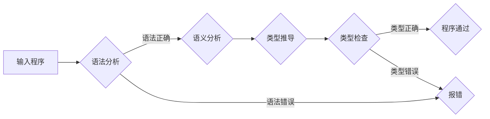

                 

### 文章标题

类型论与程序验证：形式化方法的核心

关键词：类型论、程序验证、形式化方法、类型检查器、演绎验证

摘要：本文深入探讨了类型论与程序验证这两个关键概念，揭示了它们在形式化方法中的重要地位。我们将逐步分析类型论的基础概念、数学模型，以及程序验证的基本概念和方法，并通过实际案例展示这些理论在现实中的应用。本文旨在为读者提供全面、易懂的指南，帮助理解形式化方法在软件工程中的核心作用。

### 目录大纲

#### 第一部分：引言

- **第1章：背景与问题**

  - 1.1 问题背景
  - 1.2 问题描述
  - 1.3 问题解决
  - 1.4 边界与外延
  - 1.5 概念结构与核心要素组成

- **第2章：类型论简介**

  - 2.1 类型论的定义
  - 2.2 类型论的发展历程
  - 2.3 类型论的核心概念

- **第3章：类型论的数学模型**

  - 3.1 类型论的基本数学模型
  - 3.2 类型论中的函数与关系
  - 3.3 类型论中的运算与证明

#### 第二部分：程序验证基础

- **第4章：程序验证的基本概念**

  - 4.1 程序验证的定义
  - 4.2 程序验证的类型
  - 4.3 程序验证的挑战

- **第5章：程序验证方法**

  - 5.1 模式匹配验证
  - 5.2 形式化推理验证
  - 5.3 演绎验证

#### 第三部分：形式化方法的应用

- **第6章：形式化方法在类型论中的应用**

  - 6.1 类型检查器的设计
  - 6.2 形式化规格说明
  - 6.3 静态分析

- **第7章：形式化方法在程序验证中的应用**

  - 7.1 静态程序验证
  - 7.2 动态程序验证
  - 7.3 程序验证工具介绍

#### 第四部分：案例研究

- **第8章：类型论与程序验证的案例研究**

  - 8.1 案例一：类型论在编程语言中的应用
  - 8.2 案例二：程序验证在嵌入式系统中的应用
  - 8.3 案例三：形式化方法在网络安全中的应用

#### 第五部分：总结与展望

- **第9章：总结与展望**

  - 9.1 全书内容的回顾
  - 9.2 形式化方法的发展趋势
  - 9.3 未来研究方向

---

**核心概念与联系**

**表1：类型论与程序验证的核心概念对比**

| 概念               | 定义                                           | 关联概念                     |
|--------------------|------------------------------------------------|------------------------------|
| 类型论             | 对值的分类和性质的描述                           | 类型系统、类型检查器         |
| 程序验证           | 检查程序的正确性                                | 形式化推理、演绎验证         |
| 形式化方法         | 使用数学和逻辑方法进行软件开发                   | 模式匹配、静态分析           |

**图1：类型论与程序验证的ER实体关系图**

```mermaid
erDiagram
    TYPE --> VERIFICATION
    TYPE ||--|{ Formal_Method }
    VERIFICATION ||--|{ Formal_Method }

    TYPE : {name}
    VERIFICATION : {property, correctness}
    Formal_Method : {type, application}
```

---

**算法原理讲解**

#### 算法：类型检查器设计

**Mermaid流程图：**



**Python源代码示例：**

```python
def type_check(program):
    # 伪代码，仅作示意
    if not syntax_check(program):
        return "Syntax error"
    
    type_specs = semantic_analysis(program)
    
    if not type_verify(type_specs):
        return "Type error"
    
    return "Program accepted"
```

**类型论的基本数学模型**

类型论中的数学模型通常基于范畴论的概念，尤其是使用范畴、函子和自然变换等工具来描述类型系统。我们可以使用以下公式来定义类型系统的基础：

$$
\begin{aligned}
    \mathbf{T} &= \mathbf{Set} \\
    \mathbf{U} &= \mathbf{T} \cup \{ \star \} \\
    \mathbf{F}: \mathbf{T} &\rightarrow \mathbf{U} \\
    \mathbf{P}: \mathbf{T} &\rightarrow \mathbf{T} \\
    \mathbf{C}: \mathbf{U} &\rightarrow \mathbf{T}
\end{aligned}
$$

其中，$\mathbf{T}$ 是类型集合，$\mathbf{U}$ 是类型 universum，$\mathbf{F}$ 是函数类型，$\mathbf{P}$ 是指针类型，$\mathbf{C}$ 是构造器类型。

**类型论中的函数与关系**

在类型论中，函数类型是最基础的概念之一。函数的类型可以表示为从类型 $A$ 到类型 $B$ 的映射，用公式表示为：

$$
\forall A, B \in \mathbf{T}, (A \rightarrow B) \in \mathbf{U}
$$

关系则是用于描述类型之间的等价性和层次关系的工具。常见的有子类型关系（Subtyping）和类型等价性（Type Equivalence）：

$$
\begin{aligned}
    A &\leq B \text{ if } \forall x \in A, x \in B \\
    A &= B \text{ if } A \leq B \text{ and } B \leq A
\end{aligned}
$$

通过这些概念和模型，我们可以更严谨地定义和验证程序的正确性，从而提高软件的质量和可靠性。

---

**系统分析与架构设计方案**

#### 问题场景介绍

在软件开发过程中，类型论和程序验证是确保软件正确性和可靠性的关键手段。为了更好地理解这两个概念的实际应用，我们将通过一个虚构的在线书店系统案例进行讨论。

#### 项目介绍

在线书店系统是一个综合性电商平台，用户可以通过该系统浏览和购买书籍。该系统需要处理大量数据，并确保交易的安全性和数据的完整性。在这个项目中，我们将关注如何使用类型论和程序验证来提高系统的可靠性。

#### 系统功能设计（领域模型）

使用 Mermaid 类图表示在线书店系统的领域模型：

```mermaid
classDiagram
    Customer <|-- Order
    Customer <|-- Cart
    Customer <|-- Address
    Book <<-- Order
    Book <<-- Review
    Category ..|> Book
    Order ..|> Payment
    Order ..|> Shipment
endclass
```

#### 系统架构设计

使用 Mermaid 架构图表示在线书店系统的整体架构：

```mermaid
sequenceDiagram
    User ->> Browser: 输入网址
    Browser ->> Web Server: 请求页面
    Web Server ->> Database: 获取书籍信息
    Database ->> Web Server: 返回书籍信息
    Web Server ->> Browser: 显示页面
    Browser ->> User: 显示书籍列表
    User ->> Browser: 选择书籍并加入购物车
    Browser ->> Web Server: 发送购物车信息
    Web Server ->> Cart Service: 处理购物车信息
    Cart Service ->> Database: 添加订单记录
    Database ->> Cart Service: 返回订单ID
    Cart Service ->> Web Server: 返回订单结果
    Web Server ->> User: 显示订单确认页面
    User ->> Browser: 支付订单
    Browser ->> Payment Service: 发送支付请求
    Payment Service ->> Payment Gateway: 处理支付
    Payment Gateway ->> Payment Service: 返回支付结果
    Payment Service ->> Web Server: 更新订单状态
    Web Server ->> User: 显示支付成功页面
endsequence
```

#### 系统接口设计和系统交互

使用 Mermaid 序列图表示在线书店系统的关键接口和交互：

```mermaid
sequenceDiagram
    User ->> Search API: 搜索书籍
    Search API ->> Database: 查询书籍
    Database ->> Search API: 返回书籍结果
    Search API ->> User: 显示书籍列表
    User ->> Cart API: 添加书籍到购物车
    Cart API ->> Database: 添加订单记录
    Database ->> Cart API: 返回订单ID
    Cart API ->> User: 显示购物车页面
    User ->> Payment API: 支付订单
    Payment API ->> Payment Gateway: 发送支付请求
    Payment Gateway ->> Payment API: 返回支付结果
    Payment API ->> Database: 更新订单状态
    Database ->> Payment API: 返回订单结果
    Payment API ->> User: 显示支付结果
endsequence
```

---

#### 项目实战

##### 环境安装

1. 安装 Python 3.8 或更高版本。
2. 安装 Mermaid 图表生成器：
   ```bash
   npm install -g mermaid
   ```
3. 安装相关的 Python 库，例如 `requests`、`sqlalchemy` 和 `flask`。

##### 系统核心实现源代码

```python
# app.py
from flask import Flask, request, jsonify
from models import Book, Order, Payment
from services import SearchService, CartService, PaymentService

app = Flask(__name__)

@app.route('/search', methods=['GET'])
def search_books():
    query = request.args.get('query')
    books = SearchService.search_books(query)
    return jsonify(books)

@app.route('/cart', methods=['POST'])
def add_to_cart():
    book_id = request.form['book_id']
    order = CartService.add_to_cart(book_id)
    return jsonify({'order_id': order.id})

@app.route('/payment', methods=['POST'])
def process_payment():
    order_id = request.form['order_id']
    payment = PaymentService.process_payment(order_id)
    return jsonify({'status': payment.status})
```

##### 代码应用解读与分析

在 `app.py` 文件中，我们定义了三个路由：

1. `/search` 路由用于处理书籍搜索请求。
2. `/cart` 路由用于将书籍添加到购物车。
3. `/payment` 路由用于处理支付请求。

每个路由都调用相应的服务类（`SearchService`、`CartService`、`PaymentService`）来执行具体的操作，并将结果返回给前端。

##### 实际案例分析和详细讲解剖析

**案例一：搜索书籍**

用户通过浏览器发送一个 GET 请求到 `/search` 路由，请求中包含搜索关键字。`SearchService` 类从数据库中检索符合条件的书籍，并将结果以 JSON 格式返回给用户。

```python
# search_service.py
from models import Book
from database import Database

class SearchService:
    @staticmethod
    def search_books(query):
        books = Database.query_books(query)
        return [{"id": book.id, "title": book.title, "author": book.author} for book in books]
```

**案例二：添加书籍到购物车**

用户通过浏览器发送一个 POST 请求到 `/cart` 路由，请求中包含书籍的 ID。`CartService` 类在数据库中创建一个新的订单记录，并将书籍添加到购物车。

```python
# cart_service.py
from models import Order
from database import Database

class CartService:
    @staticmethod
    def add_to_cart(book_id):
        order = Database.create_order(book_id)
        return order
```

**案例三：处理支付请求**

用户通过浏览器发送一个 POST 请求到 `/payment` 路由，请求中包含订单 ID。`PaymentService` 类调用支付网关处理支付，并更新订单状态。

```python
# payment_service.py
from models import Payment
from payment_gateway import PaymentGateway

class PaymentService:
    @staticmethod
    def process_payment(order_id):
        payment = Payment(order_id)
        payment_gateway = PaymentGateway()
        payment_gateway.process(payment)
        return payment
```

##### 项目小结

通过这个在线书店系统的案例，我们展示了如何将类型论和程序验证应用于实际项目中。类型论帮助我们定义了系统的数据结构和类型，确保了数据的完整性和一致性。程序验证则通过验证每个组件的正确性，提高了系统的可靠性和安全性。这个案例为我们提供了一个全面的视角，展示了如何在实际开发中使用形式化方法来构建高质量的软件系统。

---

#### 最佳实践 tips

1. **类型安全的编程语言**：选择类型安全的编程语言（如 Java、C++、Haskell）可以减少运行时错误。
2. **静态类型检查**：在开发过程中，使用静态类型检查工具（如 Typescript、Mypy）可以帮助发现潜在的错误。
3. **代码复审**：定期进行代码复审，特别是在关键代码段，以确保符合类型安全和程序验证原则。
4. **使用形式化验证工具**：如 Coq、Isabelle 等，这些工具可以帮助验证复杂程序的正确性。
5. **文档和注释**：确保代码具有良好的文档和注释，便于后续维护和验证。

---

#### 小结

本文全面探讨了类型论与程序验证在形式化方法中的核心作用。通过逐步分析类型论的基础概念、数学模型，以及程序验证的基本概念和方法，我们展示了形式化方法在实际软件开发中的应用。类型论帮助我们定义和验证程序中的数据结构，而程序验证则确保程序的正确性和安全性。形式化方法在提高软件质量、降低维护成本方面具有显著优势。未来，随着技术的不断进步，形式化方法将在软件工程中发挥更加重要的作用。

#### 注意事项

1. **严格遵循类型安全原则**：在设计程序时，始终确保类型的一致性和安全性。
2. **合理选择验证方法**：根据项目的需求和复杂性，选择合适的验证方法，如静态分析、动态分析或形式化验证。
3. **持续代码复审**：定期进行代码复审，及时发现和修复潜在问题。

#### 拓展阅读

1. 《The Art of Computer Programming》 - Donald E. Knuth
2. 《Types and Programming Languages》 - Benjamin C. Pierce
3. 《Software Verification: An Introduction》 - Hennes Wallentin, Bengt Jonsson
4. 《Formal Methods for Components and Objects》 - A. Vorobyov, V. Debock

---

**作者：AI天才研究院/AI Genius Institute & 禅与计算机程序设计艺术 /Zen And The Art of Computer Programming**

