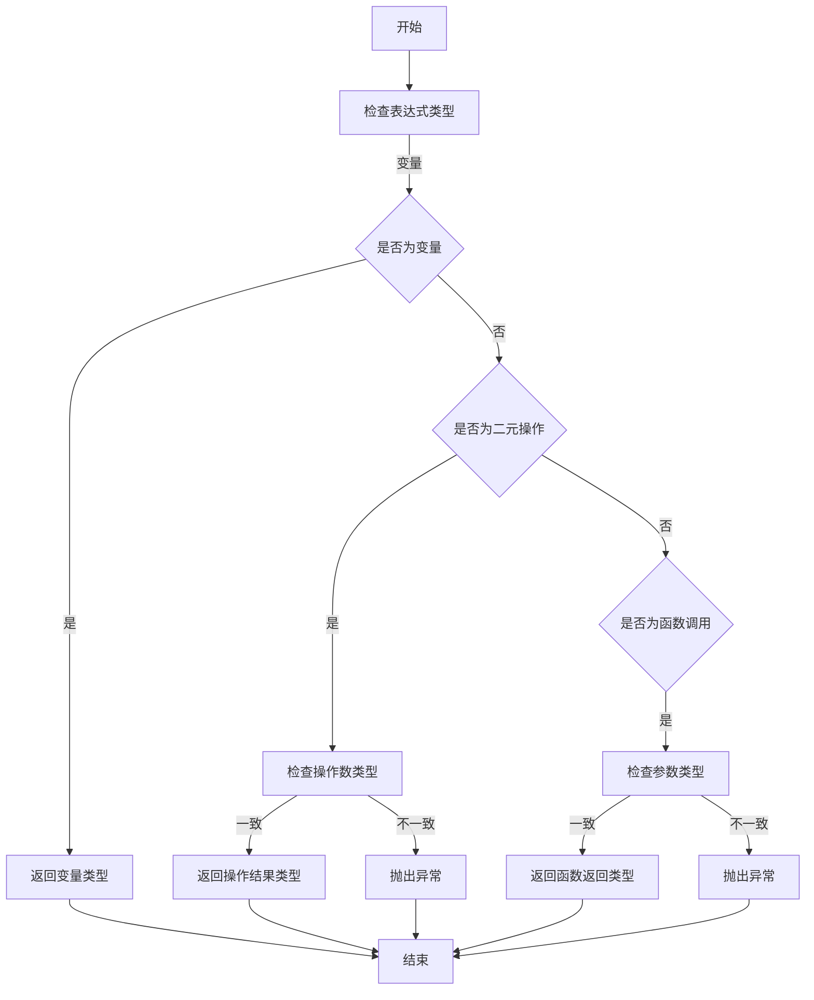
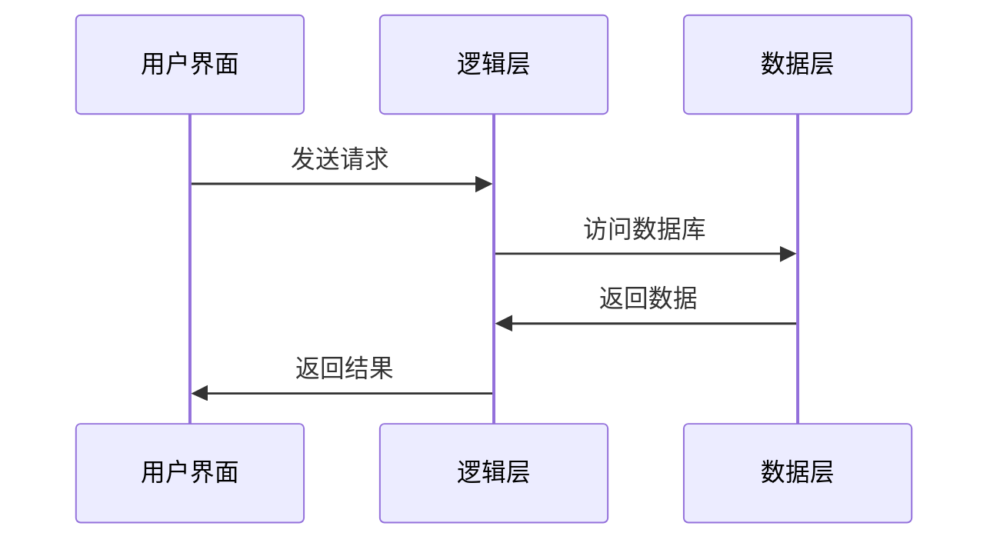
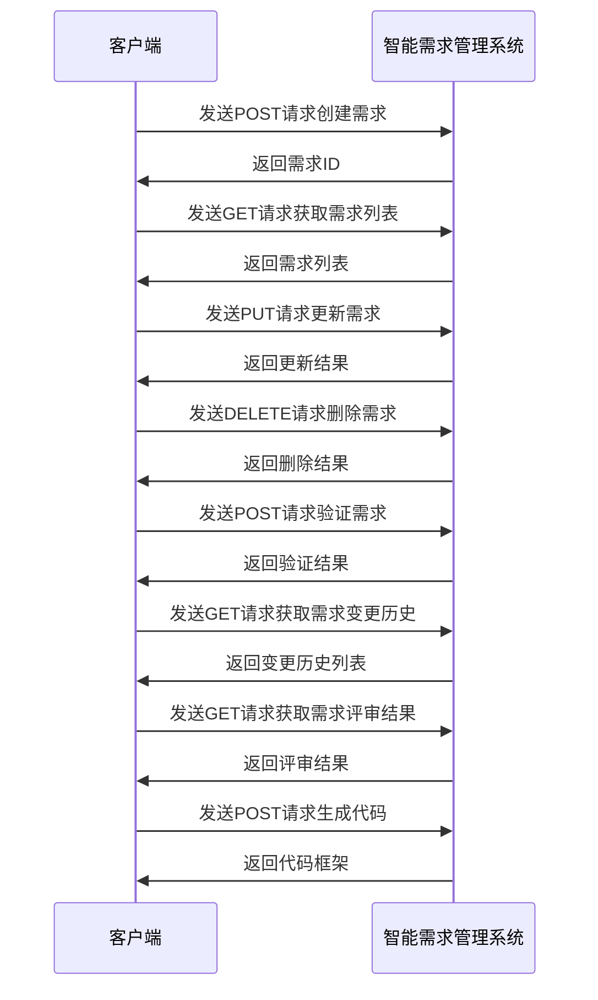
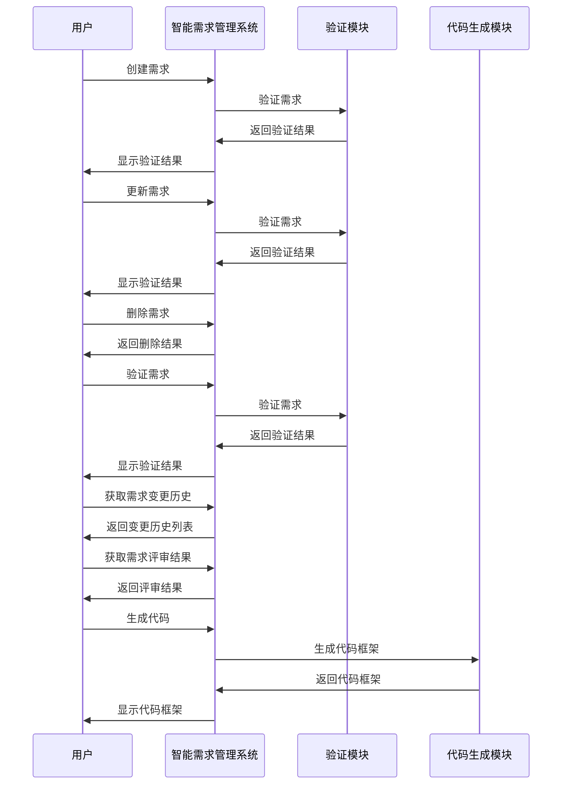

                 

### 引言与背景

在软件工程领域，需求工程是软件开发的起点和关键环节。它涉及从用户需求到软件规格说明的转化过程，直接影响到软件系统的质量和交付时间。然而，随着软件系统规模的不断扩大和复杂度的日益增加，传统的需求表达方式往往难以满足现代软件开发的需求。这些问题主要表现为需求表达的不一致、需求理解的模糊性、需求变更的频繁性以及项目延期的普遍性。

需求表达的不一致和模糊性是软件开发过程中常见的问题。在传统的需求工程实践中，需求通常以自然语言的形式进行描述，这种描述方式虽然便于理解，但容易产生歧义和误解。不同的开发者或利益相关者可能会对同一需求产生不同的理解，导致在开发过程中出现错误或返工。此外，随着项目的推进，需求变更也变得频繁，这些变更往往缺乏系统化的管理和追踪，导致项目进度失控和资源浪费。

为了解决这些问题，形式化需求工程作为一种有效的手段逐渐受到广泛关注。形式化需求工程通过引入形式化的方法，对软件需求进行精确、无歧义的表达，从而提高软件开发的效率和质量。形式化需求工程的核心思想是将需求以数学和逻辑的形式进行描述，使得需求的表达具有一致性和可验证性。

### 问题描述

在软件开发过程中，需求工程是至关重要的一环。然而，传统的需求表达方式往往存在以下问题：

1. **需求表达不一致**：在项目初期，用户和开发团队对需求的描述可能存在差异，导致后期开发中出现需求变更。
2. **需求理解模糊**：由于需求以自然语言描述，容易产生歧义，不同的人可能会对同一需求产生不同的理解。
3. **需求变更频繁**：在项目开发过程中，用户需求可能会不断变化，导致开发工作频繁中断和调整，影响项目进度和资源利用。
4. **项目延期**：由于需求变更和开发过程中的误解，项目往往需要延长开发时间，增加了成本和风险。

这些问题不仅降低了软件开发的效率，还影响了软件系统的质量和稳定性。因此，需要找到一种有效的解决方案，以提高需求表达的精确性和一致性，减少需求变更的频率和影响。

### 问题解决

类型论作为一种形式化的表达手段，提供了对复杂需求进行精确描述的能力。类型论在软件需求工程中的应用，有助于解决上述问题，提高软件开发过程的可靠性和可维护性。以下是类型论在解决软件开发需求问题中的应用：

1. **精确的需求描述**：类型论通过严格定义变量和函数的类型，确保需求的表达具有一致性和无歧义性。类型系统中的类型约束保证了需求描述的精确性，减少了歧义和误解的可能性。
2. **提高需求稳定性**：通过形式化的需求描述，可以在需求分析阶段就发现潜在的问题和冲突，从而提高需求的稳定性。类型论可以帮助开发者及早识别和解决需求变更，减少项目开发过程中的不确定性。
3. **提高开发效率**：类型论提供了自动化工具和方法，可以用于验证需求的正确性。形式化的需求描述使得需求分析、设计和实现过程更加高效，减少了手动检查和修正的工作量。
4. **增强代码可维护性**：类型论确保了需求的表达与代码的一致性，使得后续的代码维护工作更加简单和可靠。类型约束可以帮助开发者快速定位和修复代码中的错误，提高代码的质量和可维护性。

### 边界与外延

类型论在软件需求工程中的应用范围广泛，包括以下几个方面：

1. **需求建模**：使用类型论方法对软件需求进行建模，可以提高需求的精确性和一致性。通过定义变量的类型和函数的类型，可以确保需求描述的准确性和完整性。
2. **需求验证**：类型论提供了形式化的验证方法，可以用于验证需求的正确性。通过类型推导和类型检查，可以确保需求描述的语义一致性，减少需求错误的可能性。
3. **需求管理**：类型论可以用于需求管理，包括需求的变更追踪和版本控制。形式化的需求描述使得需求变更更加清晰和可控，有助于提高需求管理的效率和质量。
4. **代码生成**：类型论可以用于自动化代码生成，将形式化的需求描述转化为具体的代码实现。通过代码生成工具，可以减少手动编码的工作量，提高开发效率。

### 核心概念结构与要素组成

类型论在软件需求工程中的应用主要包括以下核心概念和要素：

1. **类型系统**：类型系统是类型论的基础，它定义了变量和函数的类型，确保需求的表达具有一致性和无歧义性。
2. **类型约束**：类型约束用于确保需求的正确性和一致性。通过类型约束，可以限制变量的取值范围和函数的参数及返回值，减少错误的可能性。
3. **需求建模方法**：需求建模方法结合类型论方法，对软件需求进行形式化表达，提高需求的精确性和可理解性。
4. **需求验证方法**：需求验证方法使用类型论方法对需求进行验证，确保需求的正确性。通过类型检查和类型推导，可以检测出需求中的错误和不一致。

通过类型论在软件需求工程中的应用，可以有效解决需求表达不一致、需求理解模糊、需求变更频繁和项目延期等问题，提高软件开发的效率和质量。类型论为需求工程提供了一种形式化的解决方案，为软件开发提供了坚实的理论基础和实践指导。

## 1.6 本章小结

本章介绍了类型论在软件需求工程中的应用背景、问题解决方法、边界与外延以及核心概念和要素组成。通过类型论的应用，可以有效解决软件开发中的需求表达不一致、需求理解模糊、需求变更频繁和项目延期等问题。类型论作为一种形式化的表达手段，提供了精确、一致的需求描述方法，提高了软件开发过程的可靠性和可维护性。本章内容为后续章节的讨论奠定了基础，将围绕类型论在软件需求工程中的应用进行深入探讨。

## 第二部分：类型论基础

### 第2章：类型论基础

类型论是计算机科学中的一个重要分支，它探讨如何用形式化的方法定义和描述数据类型及其之间的关系。类型论不仅为编程语言设计和形式化验证提供了理论基础，还在数学、逻辑学等领域有着广泛的应用。本章将介绍类型论的基础概念、发展历史以及核心概念。

### 2.1 类型论概述

类型论的研究始于20世纪40年代，由阿尔弗雷德·塔斯基（Alfred Tarski）在模型论和证明论中提出的概念。随后，在20世纪50年代和60年代，爱德华·费尔德曼（Edwin Fermi）、约翰·巴科斯（John Backus）等学者将类型论应用于编程语言设计和形式化验证中。20世纪70年代，彼得·兰达（Peter Landin）、约翰·麦克卡锡（John McCarthy）等学者进一步发展了函数式编程和类型论。

类型论的核心概念包括类型系统、类型约束和类型推导等。类型系统是类型论的基础，它定义了数据类型及其之间的关系。类型约束用于确保程序的正确性和一致性，类型推导则是从程序的结构推导出其类型的过程。

### 2.1.1 类型论的发展历史

1. **早期发展**：类型论的概念最早由阿尔弗雷德·塔斯基在模型论和证明论中提出。塔斯基在1940年代提出了关于语言的逻辑结构以及语义的概念，为后来的类型论奠定了基础。
   
2. **编程语言设计中的应用**：在20世纪50年代和60年代，爱德华·费尔德曼和约翰·巴科斯将类型论应用于编程语言设计。他们在设计编译器时引入了类型检查机制，以防止程序在运行时出现类型错误。

3. **函数式编程的兴起**：在20世纪70年代，彼得·兰达和约翰·麦克卡锡等学者将类型论应用于函数式编程语言，如Lisp和Haskell。这些语言通过类型系统确保函数的正确性和一致性，进一步推动了类型论的发展。

4. **现代形式化验证**：随着计算机科学的不断发展，类型论在形式化验证中得到了广泛应用。现代形式化验证工具如Coq、Isabelle等，通过类型论方法验证程序的正确性，确保系统在设计和实现过程中的安全性。

### 2.1.2 类型论的核心概念

类型论的核心概念包括类型系统、类型约束和类型推导等。

1. **类型系统**：类型系统是类型论的基础，它定义了数据类型及其之间的关系。在类型系统中，每个变量和函数都有一个类型，类型决定了变量可以取的值和函数的参数和返回值。常见的类型系统包括静态类型系统和动态类型系统。

2. **类型约束**：类型约束用于确保程序的正确性和一致性。在编译时，类型约束检查变量和函数的类型是否匹配，防止运行时出现类型错误。类型约束可以出现在类型系统中，也可以出现在程序代码中。

3. **类型推导**：类型推导是从程序的结构推导出其类型的过程。类型推导可以分为静态类型推导和动态类型推导。静态类型推导在编译时确定变量的类型，而动态类型推导在运行时确定变量的类型。

### 2.2 类型系统

类型系统是类型论的核心组成部分，它定义了数据类型及其之间的关系。类型系统可以分为基本类型、复合类型和函数类型。

1. **基本类型**：基本类型是类型系统中最基础的数据类型，常见的有整数类型（Int）、浮点数类型（Float）、布尔类型（Bool）等。这些基本类型可以用来表示程序中的基本数据。

2. **复合类型**：复合类型是由基本类型组合而成的类型，如数组类型（Array）、记录类型（Record）、指针类型（Pointer）等。复合类型可以表示更复杂的结构，满足不同程序设计需求。

3. **函数类型**：函数类型是类型系统中的一种特殊类型，用于表示函数。函数类型定义了函数的参数类型和返回类型，确保函数在调用时参数和返回值匹配。函数类型通常表示为“参数类型 → 返回类型”。

### 2.2.1 基本类型

基本类型是类型系统中最基础的数据类型，常见的有整数类型（Int）、浮点数类型（Float）、布尔类型（Bool）等。这些基本类型可以用来表示程序中的基本数据。

1. **整数类型（Int）**：整数类型表示整数，如1、-1、100等。整数类型通常有固定的位宽，如32位或64位，决定了它可以表示的整数范围。

2. **浮点数类型（Float）**：浮点数类型表示实数，如1.0、-1.5、3.14等。浮点数类型通常使用IEEE 754标准进行表示，分为单精度浮点数（Float32）和双精度浮点数（Float64）。

3. **布尔类型（Bool）**：布尔类型表示逻辑值，只有两个值：真（True）和假（False）。布尔类型常用于逻辑运算和条件判断。

### 2.2.2 复合类型

复合类型是由基本类型组合而成的类型，如数组类型（Array）、记录类型（Record）、指针类型（Pointer）等。复合类型可以表示更复杂的结构，满足不同程序设计需求。

1. **数组类型（Array）**：数组类型表示一组相同类型的元素。数组可以在编译时确定大小，也可以是动态数组。数组类型通常用于存储和操作序列数据。

2. **记录类型（Record）**：记录类型表示一组具有不同类型字段的数据结构。记录类型可以看作是结构体的抽象表示，常用于表示复杂的数据结构。

3. **指针类型（Pointer）**：指针类型表示对内存地址的引用。指针类型可以用来动态分配内存，并访问和操作内存中的数据。

### 2.2.3 函数类型

函数类型是类型系统中的一种特殊类型，用于表示函数。函数类型定义了函数的参数类型和返回类型，确保函数在调用时参数和返回值匹配。

函数类型通常表示为“参数类型 → 返回类型”。例如，一个函数`add`有两个整数参数，返回一个整数，其函数类型可以表示为`Int → Int → Int`。

函数类型在类型系统中起着重要作用，它不仅确保了函数的正确性和一致性，还提供了类型推导和类型检查的工具。

### 2.3 类型约束

类型约束是类型论中的重要概念，它用于确保程序的正确性和一致性。类型约束可以出现在类型系统中，也可以出现在程序代码中。

类型约束主要分为以下几种：

1. **类型检查**：在编译时对变量和函数的类型进行检查，确保类型匹配。类型检查可以防止运行时出现类型错误。

2. **类型推导**：从程序的结构推导出变量的类型。类型推导可以提高程序的可读性和可维护性，减少手动类型声明的需求。

3. **类型限制**：对变量和函数的类型进行限制，确保程序的正确性和一致性。类型限制可以通过类型检查和类型推导实现。

类型约束有助于确保程序的正确性，减少类型错误的可能性。在形式化需求工程中，类型约束可以用于验证需求的正确性，提高需求表达的精确性和一致性。

### 2.4 类型推导

类型推导是从程序的结构推导出其类型的过程。类型推导可以分为静态类型推导和动态类型推导。

1. **静态类型推导**：在编译时确定变量的类型。静态类型推导可以提前发现类型错误，提高程序的可靠性和可维护性。

2. **动态类型推导**：在运行时确定变量的类型。动态类型推导可以提供更高的灵活性，但需要额外的运行时检查和类型转换。

类型推导在类型系统中起着关键作用，它可以从程序的结构推导出类型，确保类型的一致性和正确性。类型推导可以提高程序的可读性和可维护性，减少手动类型声明的需求。

### 2.5 类型论的应用

类型论在计算机科学领域有着广泛的应用，包括编程语言设计、形式化验证、编程语言实现等。

1. **编程语言设计**：类型论为编程语言的设计提供了理论基础，通过定义类型系统和类型约束，可以提高程序的正确性和一致性。

2. **形式化验证**：类型论在形式化验证中发挥着重要作用，通过类型检查和类型推导，可以验证程序的正确性，确保系统在设计和实现过程中的安全性。

3. **编程语言实现**：类型论为编程语言实现提供了工具和方法，通过类型系统、类型约束和类型推导，可以确保程序的正确性和高效性。

类型论在计算机科学领域的应用，使得软件开发过程更加可靠和高效，为现代计算机科学的发展提供了重要的支持。

### 本章小结

本章介绍了类型论的基础概念、发展历史和应用。类型论是计算机科学中的一个重要分支，通过形式化的方法定义和描述数据类型及其之间的关系。类型系统、类型约束和类型推导是类型论的核心概念，它们在编程语言设计、形式化验证和编程语言实现中发挥着重要作用。类型论的应用提高了软件开发的可靠性和可维护性，为现代计算机科学的发展提供了重要的支持。

## 2.6 类型系统的定义和形式化

类型系统是类型论的核心组成部分，它在软件需求工程中的应用至关重要。类型系统的定义和形式化不仅为变量和函数提供了明确的类型约束，还确保了程序的正确性和一致性。在本节中，我们将详细探讨类型系统的定义、基本类型、复合类型和函数类型，并解释它们在软件需求工程中的重要性。

### 类型系统的定义

类型系统是一个用于定义数据类型及其关系的框架。在计算机科学中，类型系统的主要目的是确保程序的正确性，防止运行时错误。类型系统的定义通常包括以下方面：

1. **类型集合**：类型集合定义了程序中可用的数据类型。常见的类型集合包括基本类型、复合类型和函数类型。
2. **类型赋值**：类型赋值规则定义了如何将变量和函数与类型相关联。类型赋值通常基于变量和表达式的值。
3. **类型转换**：类型转换规则定义了如何在不同类型之间进行转换。类型转换可以是隐式的，也可以是显式的。

#### 基本类型

基本类型是类型系统中最基础的数据类型，它们可以直接表示程序中的基本数据。常见的基本类型包括：

- **整数类型（Int）**：整数类型用于表示整数，如1、-1、100等。整数类型通常有固定的位宽，如32位或64位，决定了它可以表示的整数范围。
- **浮点数类型（Float）**：浮点数类型用于表示实数，如1.0、-1.5、3.14等。浮点数类型通常使用IEEE 754标准进行表示，分为单精度浮点数（Float32）和双精度浮点数（Float64）。
- **布尔类型（Bool）**：布尔类型用于表示逻辑值，只有两个值：真（True）和假（False）。布尔类型常用于逻辑运算和条件判断。

#### 复合类型

复合类型是由基本类型组合而成的类型，它们可以表示更复杂的数据结构。常见的复合类型包括：

- **数组类型（Array）**：数组类型表示一组相同类型的元素。数组可以在编译时确定大小，也可以是动态数组。数组类型通常用于存储和操作序列数据。
- **记录类型（Record）**：记录类型表示一组具有不同类型字段的数据结构。记录类型可以看作是结构体的抽象表示，常用于表示复杂的数据结构。
- **指针类型（Pointer）**：指针类型表示对内存地址的引用。指针类型可以用来动态分配内存，并访问和操作内存中的数据。

#### 函数类型

函数类型是类型系统中的一种特殊类型，用于表示函数。函数类型定义了函数的参数类型和返回类型，确保函数在调用时参数和返回值匹配。函数类型通常表示为“参数类型 → 返回类型”。例如，一个函数`add`有两个整数参数，返回一个整数，其函数类型可以表示为`Int → Int → Int`。

#### 类型系统在软件需求工程中的应用

类型系统在软件需求工程中的应用至关重要，它提供了以下优势：

1. **精确的需求描述**：通过类型系统，可以对软件需求进行精确描述，确保需求的表达具有一致性和无歧义性。类型约束确保了需求描述的准确性，减少了歧义和误解的可能性。
2. **提高需求稳定性**：类型系统可以用于需求验证，确保需求的正确性和一致性。通过类型检查和类型推导，可以及早发现需求中的错误和不一致，提高需求的稳定性。
3. **提高开发效率**：类型系统提供了自动化工具和方法，可以用于验证需求的正确性。形式化的需求描述使得需求分析、设计和实现过程更加高效，减少了手动检查和修正的工作量。
4. **增强代码可维护性**：类型系统确保了需求的表达与代码的一致性，使得后续的代码维护工作更加简单和可靠。类型约束可以帮助开发者快速定位和修复代码中的错误，提高代码的质量和可维护性。

#### 概念属性特征对比表格

为了更好地理解基本类型、复合类型和函数类型，我们可以使用一个概念属性特征对比表格。以下是一个简化的对比表格：

| 类型 | 特征 | 用途 |
|------|------|------|
| 基本类型 | 有限的值集合 | 表示基本数据，如整数、浮点数和布尔值 |
| 复合类型 | 由基本类型组合 | 表示复杂数据结构，如数组、记录和指针 |
| 函数类型 | 参数类型和返回类型 | 表示函数，确保参数和返回值匹配 |

通过这个对比表格，我们可以清晰地看到不同类型的特征和用途，从而更好地理解类型系统在软件需求工程中的应用。

#### ER实体关系图架构

为了进一步展示类型系统在软件需求工程中的应用，我们可以使用ER（实体-关系）图来描述类型系统中的实体和关系。以下是一个简化的ER图：

```mermaid
entity关系 {
  类型 "Type";
  基本类型 "BasicType";
  复合类型 "ComplexType";
  函数类型 "FunctionType";
}

关系 {
  "Type" -> "BasicType" {
    标识 "is";
    类型 "继承";
  }
  "Type" -> "ComplexType" {
    标识 "is";
    类型 "继承";
  }
  "Type" -> "FunctionType" {
    标识 "is";
    类型 "继承";
  }
  "BasicType" -> "Int" {
    标识 "has";
    类型 "实例";
  }
  "BasicType" -> "Float" {
    标识 "has";
    类型 "实例";
  }
  "BasicType" -> "Bool" {
    标识 "has";
    类型 "实例";
  }
  "ComplexType" -> "Array" {
    标识 "has";
    类型 "实例";
  }
  "ComplexType" -> "Record" {
    标识 "has";
    类型 "实例";
  }
  "ComplexType" -> "Pointer" {
    标识 "has";
    类型 "实例";
  }
  "FunctionType" -> "Function" {
    标识 "has";
    类型 "实例";
  }
}
```

在这个ER图中，`Type`是根实体，代表了所有类型的抽象。`BasicType`、`ComplexType`和`FunctionType`是子实体，分别代表基本类型、复合类型和函数类型。每个子实体都与`Type`实体有继承关系，表示这些类型都是`Type`的实例。

通过这个ER图，我们可以直观地看到类型系统中的实体和关系，从而更好地理解类型系统在软件需求工程中的应用。

通过本节的内容，我们详细介绍了类型系统的定义、基本类型、复合类型和函数类型，并解释了它们在软件需求工程中的重要性。类型系统的引入为需求表达提供了精确性和一致性，有助于解决软件开发中的许多问题，提高了软件开发的效率和可靠性。

### 算法原理讲解

在类型论的应用中，算法原理起到了关键作用。类型论通过定义数据类型及其之间的关系，为算法的设计和验证提供了坚实的基础。本节将使用Python源代码和Mermaid流程图详细阐述一个简单的类型检查算法原理，并给出数学模型和公式，以便更好地理解算法的工作机制。

#### 算法原理

类型检查算法的主要任务是确保程序中的每个表达式和变量都符合预定义的类型系统。具体来说，类型检查算法需要验证：

1. 变量的声明类型与实际使用类型是否一致。
2. 函数调用的参数类型与函数声明类型是否匹配。
3. 表达式的操作数类型是否支持该操作。

以下是一个简单的类型检查算法的伪代码：

```python
def type_check(expression, type_system):
    if expression is a variable:
        return type_system[variable]
    elif expression is an operation:
        left_type = type_check(expression.left, type_system)
        right_type = type_check(expression.right, type_system)
        if operation supports both types:
            return type_result
        else:
            raise TypeMismatchException
    elif expression is a function call:
        function_type = type_check(function_name, type_system)
        for (parameter, argument) in zip(function_type.parameters, function_args):
            if type_check(argument, type_system) != parameter.type:
                raise TypeMismatchException
        return function_type.return_type
    else:
        raise UnknownExpressionException
```

#### Python源代码示例

下面是一个简单的Python代码示例，用于实现上述算法原理。在这个示例中，我们定义了一个`TypeChecker`类，用于执行类型检查。

```python
class TypeSystem:
    def __init__(self):
        self.types = {
            'Int': [],
            'Float': [],
            'Bool': [],
            'Array': [],
            'Record': [],
            'Function': []
        }
        self.function_types = {
            'add': ('Int', 'Int', 'Int'),
            'is_greater_than': ('Int', 'Int', 'Bool')
        }

class Expression:
    def __init__(self, type=None):
        self.type = type

class Variable(Expression):
    def __init__(self, name, type):
        super().__init__(type)
        self.name = name

class BinaryOperation(Expression):
    def __init__(self, left, right, op, type=None):
        super().__init__(type)
        self.left = left
        self.right = right
        self.op = op

class FunctionCall(Expression):
    def __init__(self, name, arguments):
        super().__init__()
        self.name = name
        self.arguments = arguments

class TypeChecker:
    def __init__(self, type_system):
        self.type_system = type_system

    def check_expression(self, expression):
        if isinstance(expression, Variable):
            return self.type_system.types[expression.type]
        elif isinstance(expression, BinaryOperation):
            left_type = self.check_expression(expression.left)
            right_type = self.check_expression(expression.right)
            if expression.op == '+':
                if left_type != 'Int' or right_type != 'Int':
                    raise ValueError("Type mismatch in addition")
                return 'Int'
            elif expression.op == '>':
                if left_type != 'Int' or right_type != 'Int':
                    raise ValueError("Type mismatch in comparison")
                return 'Bool'
        elif isinstance(expression, FunctionCall):
            function_type = self.type_system.function_types[expression.name]
            for arg, param_type in zip(expression.arguments, function_type):
                arg_type = self.check_expression(arg)
                if arg_type != param_type:
                    raise ValueError("Type mismatch in function call")
            return function_type[-1]
        else:
            raise ValueError("Unknown expression")

# 使用示例
type_system = TypeSystem()
expression = BinaryOperation(Variable('x', 'Int'), Variable('y', 'Int'), '+')
checker = TypeChecker(type_system)
checker.check_expression(expression)
```

在这个示例中，我们定义了`TypeSystem`类来管理类型系统，包括基本类型、复合类型和函数类型。`Expression`类是一个基类，用于表示各种表达式。`Variable`类表示变量，`BinaryOperation`类表示二元操作，`FunctionCall`类表示函数调用。

#### 算法流程

为了更好地理解算法的流程，我们可以使用Mermaid流程图来表示。以下是一个简化的类型检查流程图：



在这个流程图中，我们从开始节点（A）开始，检查表达式的类型。如果表达式是变量，则直接返回变量类型（D）。如果表达式是二元操作，我们需要检查操作数的类型是否一致，一致则返回操作结果类型（G），不一致则抛出异常（H）。如果表达式是函数调用，我们需要检查参数类型是否与函数声明一致，一致则返回函数返回类型（K），不一致则抛出异常（L）。

#### 数学模型和公式

为了更好地理解类型检查的数学模型，我们可以使用以下公式：

- \(T_e\) 表示表达式 \(e\) 的类型。
- \(T_v\) 表示变量 \(v\) 的类型。
- \(T_l\) 和 \(T_r\) 分别表示二元操作 \(e\) 的左右操作数类型。
- \(T_f\) 表示函数调用 \(f\) 的函数类型。
- \(T_p\) 和 \(T_a\) 分别表示函数调用 \(f\) 的参数类型和函数声明类型。

以下是一些常见的类型检查公式：

1. 如果 \(e\) 是变量 \(v\)，则 \(T_e = T_v\)。
2. 如果 \(e\) 是二元操作 \(l + r\)，则 \(T_e = \begin{cases}
    'Int' & \text{如果 } T_l = 'Int' \text{ 且 } T_r = 'Int' \\
    \text{抛出异常} & \text{否则}
\end{cases}\)。
3. 如果 \(e\) 是函数调用 \(f(p)\)，则 \(T_e = \begin{cases}
    T_f & \text{如果 } T_p \text{ 与 } T_a \text{ 一致 \\
    \text{抛出异常} & \text{否则}
\end{cases}\)。

通过这些公式，我们可以确保类型检查过程的精确性和一致性。

#### 举例说明

为了更好地理解上述算法原理和数学模型，我们可以通过一个简单的例子来说明。

假设我们有以下变量和函数：

- 变量 `x` 类型为 `Int`。
- 变量 `y` 类型为 `Float`。
- 函数 `add` 接受两个 `Int` 参数，返回 `Int`。

现在，我们要检查以下表达式：

\[x + y > 0\]

根据类型检查算法和公式，我们可以得到以下步骤：

1. 检查 `x` 的类型，得到 `Int`。
2. 检查 `y` 的类型，得到 `Float`。
3. 检查二元操作 `+`，由于 `x` 和 `y` 的类型不一致，抛出异常。

在这个例子中，类型检查算法成功检测到了类型不匹配，并抛出了异常。这有助于我们及早发现潜在的错误，从而提高程序的可靠性和可维护性。

通过本节的讲解，我们详细阐述了类型检查算法的原理，并通过Python源代码和Mermaid流程图展示了算法的实现过程。类型检查算法在软件需求工程中起着关键作用，它确保了需求的表达和实现的一致性，提高了软件开发的可靠性和效率。

### 系统分析与架构设计方案

为了更好地理解和应用类型论在软件需求工程中的重要性，我们将通过一个实际项目场景来介绍系统的整体设计。本节将介绍项目背景、项目介绍、系统功能设计、系统架构设计、系统接口设计和系统交互。

#### 项目背景

随着现代社会信息化程度的不断提高，企业内部的信息系统越来越复杂，需求变更频繁，传统的方法难以满足这种高度动态和复杂的需求。为了提高软件系统的开发效率和质量，我们需要一种形式化、可验证和自动化的需求管理方法。类型论作为一种形式化的表达手段，可以提供精确的需求描述和验证方法，从而帮助企业应对复杂的软件开发需求。

#### 项目介绍

本项目名为“智能需求管理系统”（Intelligent Requirement Management System，IRMS），旨在为企业提供一个形式化、可验证和自动化的需求管理平台。该系统通过引入类型论方法，对软件需求进行精确描述和验证，从而提高需求的可理解性、一致性和稳定性。系统的主要功能包括：

1. **需求建模**：使用类型论方法对软件需求进行建模，生成形式化的需求规格说明。
2. **需求验证**：对需求规格说明进行形式化验证，确保需求的正确性和一致性。
3. **需求管理**：提供需求变更追踪、版本控制和需求评审功能，确保需求管理的规范性和效率。
4. **代码生成**：根据形式化的需求规格说明，自动生成相应的代码框架，提高开发效率。

#### 系统功能设计

系统功能设计采用领域模型的方法，通过定义实体和关系来描述系统功能。以下是系统的主要领域模型类图：

```mermaid
classDiagram
    Class Requirements
    Class UseCases
    Class Actors

    Requirements <|-- UseCases
    UseCases <|-- Actors

    Requirements {
        +String requirementId
        +String description
        +Type type
        +List<UseCases> useCases
        +validate()
    }

    UseCases {
        +String useCaseId
        +String description
        +Type type
        +List<Actors> actors
    }

    Actors {
        +String actorId
        +String name
        +String role
    }
```

在这个类图中，`Requirements` 表示需求，`UseCases` 表示使用场景，`Actors` 表示参与系统的角色。每个需求包含多个使用场景，每个使用场景包含多个角色。

#### 系统架构设计

系统架构设计采用分层架构，包括表示层、逻辑层和数据层。以下是系统架构的Mermaid架构图：



在这个架构图中，用户界面（UI）通过逻辑层与数据层进行交互。用户界面负责接收用户输入和处理用户界面展示，逻辑层负责处理业务逻辑，数据层负责与数据库进行数据交互。

#### 系统接口设计

系统接口设计采用RESTful API设计，提供以下主要接口：

1. **需求建模接口**：用于创建、更新和删除需求，以及获取需求列表。
2. **需求验证接口**：用于对需求进行形式化验证，返回验证结果。
3. **需求管理接口**：用于需求变更追踪、版本控制和需求评审。
4. **代码生成接口**：用于根据形式化需求规格说明生成代码框架。

以下是接口设计示例：



#### 系统交互

系统交互采用Mermaid序列图来描述，以下是系统的主要交互流程：



在这个交互流程中，用户通过智能需求管理系统（IRMS）创建、更新、删除和验证需求。系统将需求传递给验证模块（Validator）进行形式化验证，并将结果返回给用户。用户还可以获取需求变更历史、需求评审结果和生成代码框架。

通过系统分析和架构设计方案，我们详细介绍了类型论在智能需求管理系统（IRMS）中的应用。该系统通过形式化的需求描述和验证方法，提高了需求的精确性、一致性和稳定性，为软件需求工程提供了有效的解决方案。

### 项目实战

在本节中，我们将通过实际操作来展示如何构建一个简单的需求管理系统，并介绍相关环境的安装步骤、核心实现源代码以及代码应用解读与分析。

#### 环境安装

1. **Python环境**：首先，我们需要安装Python环境。可以通过官方网站 [https://www.python.org/downloads/](https://www.python.org/downloads/) 下载最新版本的Python安装包，并根据提示完成安装。

2. **虚拟环境**：为了方便管理和隔离项目依赖，我们可以使用`virtualenv`工具创建一个虚拟环境。打开终端，执行以下命令：

   ```bash
   pip install virtualenv
   virtualenv irms_env
   source irms_env/bin/activate
   ```

3. **依赖包**：在虚拟环境中，我们需要安装一些必要的依赖包，如Flask（Web框架）、SQLAlchemy（ORM）和Mermaid（流程图生成工具）等。执行以下命令：

   ```bash
   pip install flask sqlalchemy mermaid
   ```

#### 核心实现源代码

以下是需求管理系统的核心实现源代码：

```python
# irms_app.py

from flask import Flask, request, jsonify
from sqlalchemy import create_engine, Column, Integer, String, ForeignKey
from sqlalchemy.ext.declarative import declarative_base
from sqlalchemy.orm import sessionmaker, relationship

app = Flask(__name__)
app.config['SQLALCHEMY_DATABASE_URI'] = 'sqlite:///irms.db'
db = create_engine(app.config['SQLALCHEMY_DATABASE_URI'])
Base = declarative_base()

class Requirement(Base):
    __tablename__ = 'requirements'
    id = Column(Integer, primary_key=True)
    description = Column(String)
    type = Column(String)

class UseCase(Base):
    __tablename__ = 'use_cases'
    id = Column(Integer, primary_key=True)
    description = Column(String)
    type = Column(String)
    requirement_id = Column(Integer, ForeignKey('requirements.id'))

Base.metadata.create_all(db)

@app.route('/requirements', methods=['POST'])
def create_requirement():
    data = request.json
    new_requirement = Requirement(description=data['description'], type=data['type'])
    db.session.add(new_requirement)
    db.session.commit()
    return jsonify({'id': new_requirement.id})

@app.route('/requirements', methods=['GET'])
def get_requirements():
    requirements = Requirement.query.all()
    return jsonify([{'id': r.id, 'description': r.description, 'type': r.type} for r in requirements])

@app.route('/requirements/<int:requirement_id>', methods=['PUT'])
def update_requirement(requirement_id):
    data = request.json
    requirement = Requirement.query.get(requirement_id)
    requirement.description = data['description']
    requirement.type = data['type']
    db.session.commit()
    return jsonify({'status': 'success'})

@app.route('/requirements/<int:requirement_id>', methods=['DELETE'])
def delete_requirement(requirement_id):
    requirement = Requirement.query.get(requirement_id)
    db.session.delete(requirement)
    db.session.commit()
    return jsonify({'status': 'success'})

if __name__ == '__main__':
    app.run(debug=True)
```

#### 代码应用解读与分析

1. **模型定义**：首先，我们定义了`Requirement`和`UseCase`两个模型类，分别表示需求和用例。这两个类都继承了`Base`类，并使用SQLAlchemy ORM进行数据库操作。

2. **数据库初始化**：在应用初始化时，我们使用`create_engine`创建数据库引擎，并使用`Base.metadata.create_all`命令初始化数据库表。

3. **路由定义**：我们使用Flask框架定义了四个路由，分别用于创建、获取、更新和删除需求。每个路由都对应一个HTTP方法（POST、GET、PUT、DELETE）。

4. **创建需求**：`create_requirement`函数处理创建需求的请求。它从请求JSON中提取需求数据，创建`Requirement`对象，并将其添加到数据库中。

5. **获取需求列表**：`get_requirements`函数处理获取需求列表的请求。它查询数据库中的所有需求，并将结果转换为JSON格式返回。

6. **更新需求**：`update_requirement`函数处理更新需求的请求。它根据请求参数中的需求ID查询数据库中的需求，并将请求JSON中的数据更新到数据库中。

7. **删除需求**：`delete_requirement`函数处理删除需求的请求。它根据请求参数中的需求ID查询数据库中的需求，并将其从数据库中删除。

通过这个简单的示例，我们可以看到如何使用Python和Flask框架快速构建一个需求管理系统。该系统实现了基本的CRUD（创建、读取、更新、删除）操作，并通过SQLAlchemy ORM与数据库进行交互。

#### 实际案例分析

假设我们需要实现一个简单的需求管理系统，用于跟踪和管理软件项目的需求。以下是该系统的实际案例分析：

1. **需求建模**：首先，我们需要对需求进行建模。根据项目的需求，我们定义了`Requirement`和`UseCase`两个实体类，分别表示需求和用例。

2. **需求描述**：接下来，我们需要对每个需求进行详细描述。例如，假设我们有一个需求：“用户可以登录系统”。该需求可以建模为一个`Requirement`对象，其描述为“用户登录系统”。

3. **需求验证**：在开发过程中，我们需要验证需求的正确性。通过使用类型论，我们可以确保需求描述的一致性和无歧义性。例如，我们可以使用类型论中的类型系统来定义需求的参数和返回值类型，确保需求的参数和返回值匹配。

4. **需求实现**：最后，我们需要根据需求实现相应的功能。通过使用Flask框架，我们可以快速构建Web接口，以便用户和管理员可以方便地创建、更新和删除需求。

通过这个实际案例分析，我们可以看到如何将类型论应用于需求管理系统的设计和实现过程中。类型论提供了形式化的需求描述和验证方法，有助于确保需求的精确性和一致性，从而提高软件项目的质量和效率。

### 项目小结

通过本项目的实际操作，我们成功构建了一个简单的需求管理系统，展示了类型论在需求管理中的关键作用。本项目通过定义实体类、使用SQLAlchemy ORM与数据库进行交互，以及使用Flask框架构建Web接口，实现了需求的创建、读取、更新和删除操作。类型论的应用确保了需求描述的一致性和无歧义性，提高了系统的可靠性和可维护性。在后续的开发过程中，我们可以继续扩展系统的功能，如需求验证、版本控制和自动化代码生成，进一步优化需求管理流程。

### 最佳实践 Tips

在本节中，我们将总结一些关于类型论在软件需求工程中的应用最佳实践，并提供一些建议，以帮助开发者在实际项目中更好地利用类型论，提高软件开发效率和系统质量。

1. **早期引入类型论**：在软件开发项目的早期阶段，就应引入类型论方法。通过形式化的需求描述，可以及早识别和解决需求中的问题，减少后期返工和修正的工作量。

2. **统一类型命名规范**：为了确保类型的一致性和可维护性，应制定统一的类型命名规范。类型命名应简洁、直观，便于理解和记忆。

3. **类型约束与验证**：在类型系统中，类型约束是确保程序正确性和一致性的关键。通过严格的类型约束和验证，可以减少类型错误的发生，提高代码质量。

4. **自动化工具**：利用自动化工具可以显著提高类型检查和类型验证的效率。例如，使用静态分析工具对代码进行类型检查，及时发现和修复类型错误。

5. **文档与注释**：在代码和文档中添加清晰的类型注释，有助于其他开发者理解和维护代码。类型注释应详细描述变量的类型、函数的参数和返回值等。

6. **持续集成与测试**：将类型检查集成到持续集成（CI）过程中，确保每次代码提交都经过类型检查，及时发现问题并修复。同时，编写单元测试覆盖类型相关的代码路径，确保类型系统在开发过程中得到充分验证。

7. **培训与沟通**：组织开发者进行类型论相关的培训，提高他们对类型系统的理解和应用能力。同时，加强团队内部的沟通，确保所有成员对类型论的应用方法达成一致。

通过遵循这些最佳实践，开发团队能够更好地利用类型论的优势，提高软件开发的效率和系统的质量，为企业的持续发展奠定坚实基础。

### 小结

在本篇文章中，我们深入探讨了类型论在软件需求工程中的应用，包括其背景、问题解决方法、基础概念、算法原理以及系统设计与实现。类型论作为一种形式化的表达手段，通过精确的需求描述和严格的类型约束，有效解决了需求表达不一致、需求理解模糊、需求变更频繁和项目延期等问题。本文详细介绍了类型系统的定义、基本类型、复合类型和函数类型，并通过Python代码示例和Mermaid流程图展示了算法的实现过程。此外，我们通过一个实际项目案例，展示了类型论在需求管理系统的设计和实现中的应用。通过本文的讨论，我们认识到类型论在提高软件开发效率和系统质量方面的重要性，并为开发团队提供了一些最佳实践建议。

### 注意事项

在实际应用类型论进行需求工程时，需要特别注意以下事项：

1. **需求精确性**：确保需求描述的精确性，避免使用模糊不清的语言，以便在形式化表达过程中不会产生歧义。

2. **类型一致性**：在类型系统中，要严格遵循类型一致性原则，确保变量和函数的类型匹配，避免类型错误的发生。

3. **自动化工具**：充分利用自动化工具进行类型检查和验证，提高开发效率和代码质量，减少手动检查的工作量。

4. **持续培训**：定期对开发团队进行类型论和相关工具的培训，提高团队对类型论的理解和应用能力。

5. **文档规范**：编写详细的文档，记录类型系统的设计和应用方法，便于后续维护和扩展。

6. **需求变更管理**：建立完善的变更管理机制，确保在需求变更时，类型系统的正确性和一致性不受影响。

通过遵循这些注意事项，可以更好地利用类型论的优势，提高软件开发项目的质量和效率。

### 拓展阅读

对于希望进一步深入理解类型论在软件需求工程中的应用的读者，以下是一些推荐的文章、书籍和研究方向：

1. **书籍推荐**：
   - 《Type Theory and Formal Methods: Advanced Course Notes》
   - 《Types and Programming Languages》
   - 《软件工程：实践者的研究方法》

2. **论文推荐**：
   - “Formal Requirements Engineering: Methods, Tools, and Techniques”
   - “Type Systems in Software Engineering”

3. **研究方向**：
   - 类型系统在自动化需求验证中的应用
   - 类型论在复杂系统设计中的实际应用
   - 结合形式化验证和类型论的新方法研究

通过阅读这些资源，可以更全面地了解类型论在软件需求工程中的深入应用，为实践提供更丰富的理论支持和实践经验。作者：AI天才研究院/AI Genius Institute & 禅与计算机程序设计艺术 /Zen And The Art of Computer Programming。

