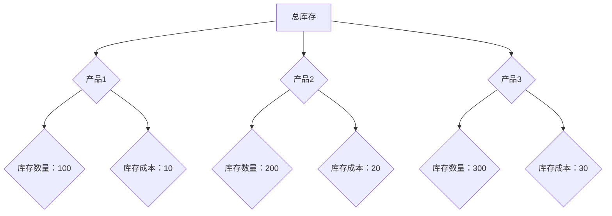
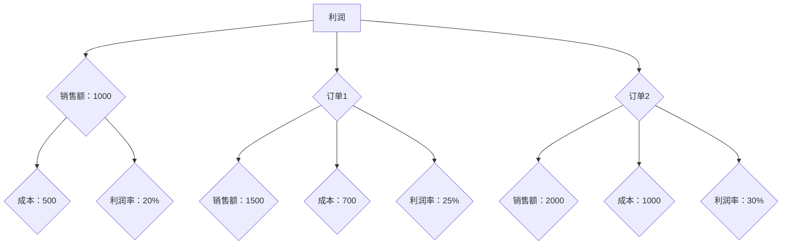
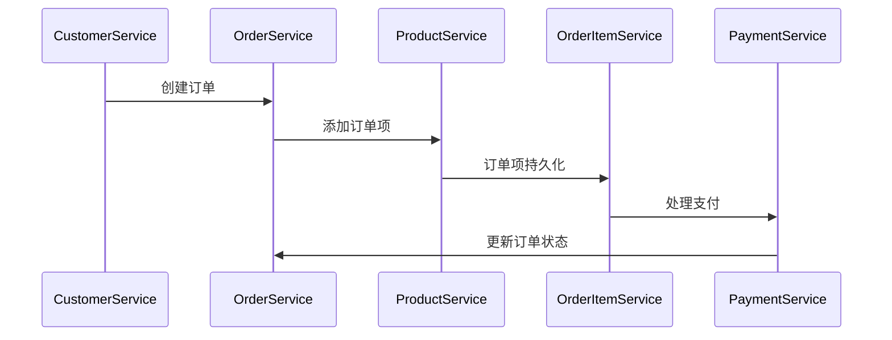
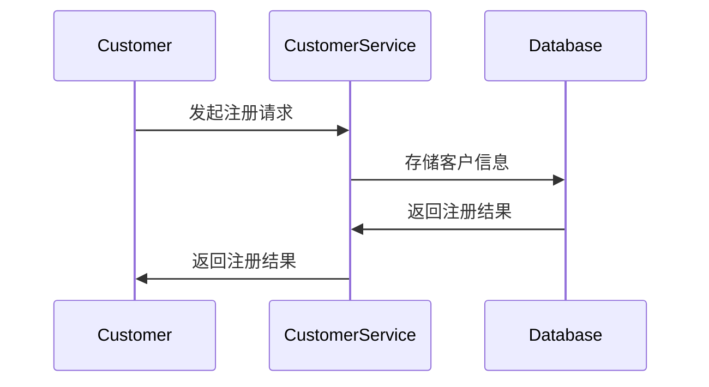

                 

### 第1章: 引言

#### 1.1 问题背景

类型论是计算机科学中的一个重要概念，其核心在于研究对象的分类和类型系统。在编程语言设计中，类型论起到了至关重要的作用，它保证了程序的正确性和安全性。随着计算机技术的发展，类型论的应用场景逐渐扩展到了领域建模中。

领域建模是软件开发过程中的一个重要环节，它帮助开发人员理解业务领域，构建领域模型，并将业务逻辑形式化地表达出来。在复杂业务系统中，领域建模能够有效地减少误解，提高代码的可读性和可维护性。

业务逻辑的形式化表达，即将业务逻辑通过数学和形式化的方法进行描述，使得业务规则和约束条件更加明确、易于理解和验证。这有助于提高软件开发的效率和质量，降低维护成本。

#### 1.2 问题描述

在传统的面向对象编程中，类型系统虽然能够很好地处理对象的分类和类型约束，但其在表达复杂业务逻辑时仍然存在一些局限性。例如：

- **类型的不确定性**：面向对象编程中的类型通常是基于类（Class）定义的，但在实际业务场景中，类与类之间的关系可能非常复杂，难以用简单的类层次结构来准确表达。
- **多态性的局限**：虽然多态性（Polymorphism）使得代码具有一定的灵活性，但在处理复杂业务逻辑时，多态性可能导致代码的可读性和可维护性降低。
- **业务规则的抽象**：面向对象编程中的业务规则通常被封装在方法中，这使得业务规则与代码紧密耦合，难以进行独立的管理和验证。

在领域建模中，尽管可以采用实体关系图（ER Diagram）等工具来表示业务实体和它们之间的关系，但如何将这些业务实体和关系形式化地表达，仍然是一个挑战。

#### 1.3 问题解决

为了解决上述问题，我们需要将类型论与领域建模结合起来，通过业务逻辑的形式化表达，提高软件开发的效率和代码的可维护性。具体来说，我们可以采取以下方法：

- **引入抽象数据类型（Abstract Data Types, ADT）**：抽象数据类型可以提供一种更高层次的抽象，使得业务逻辑与数据结构分离，从而提高代码的可读性和可维护性。
- **使用形式化的语言**：例如使用 Mermaid 等工具，将领域模型和业务逻辑以图形化的形式表达出来，使得模型更加直观和易于理解。
- **数学建模**：通过数学模型和数学公式，将业务规则和约束条件形式化地表达出来，从而实现业务逻辑的准确描述和验证。

#### 1.4 概念结构与核心要素组成

为了更好地理解本文的内容，以下是对核心概念和结构要素的简要概述：

- **类型论**：研究对象的分类和类型系统，包括基本类型、复合类型、类型变量和类型约束等。
- **领域建模**：构建业务领域模型，包括实体、关系和属性等。
- **业务逻辑的形式化表达**：通过抽象数据类型、形式化语言和数学建模，将业务逻辑准确、清晰地表达出来。

这些概念和要素相互联系，共同构成了本文的核心内容。在接下来的章节中，我们将逐步深入探讨类型论、领域建模以及业务逻辑的形式化表达，以期为大家提供一种新的思考方向和方法。

---

### 第2章: 核心概念与联系

#### 2.1 核心概念原理

在深入探讨类型论与领域建模之前，我们首先需要明确这两个核心概念的基本原理。

##### 类型系统

类型系统是编程语言中的一个基本组成部分，它定义了数据类型的集合以及如何对这些类型进行操作。类型系统的核心包括以下几个方面：

1. **基本类型**：例如整数（Integer）、浮点数（Float）、布尔值（Boolean）等。
2. **复合类型**：包括数组（Array）、结构体（Struct）、类（Class）等。
3. **类型变量**：用于定义泛型类型，例如Java中的`<T>`。
4. **类型约束**：定义类型之间的关系和约束，例如在Java中，`List<T>`中的`T`必须是某个类型的子类。

##### 领域模型

领域模型是软件开发过程中用于表示业务领域的概念和关系的工具。领域模型的核心包括以下几个方面：

1. **实体**：表示业务领域中的对象，例如客户（Customer）、订单（Order）等。
2. **关系**：表示实体之间的关联，例如客户可以下单（Customer orders Order）。
3. **属性**：表示实体的特征，例如客户的姓名（Customer Name）。

##### 业务逻辑的形式化表达

业务逻辑的形式化表达是通过数学和形式化方法来描述业务规则和约束条件。其主要目标是使得业务逻辑更加清晰、精确和易于验证。主要方法包括：

1. **抽象数据类型**：将业务逻辑和数据结构分离，提供一种高层次的抽象。
2. **形式化语言**：例如Mermaid，用于图形化地表示领域模型和业务逻辑。
3. **数学建模**：使用数学模型和公式来形式化表达业务规则。

#### 2.2 概念属性特征对比

为了更好地理解类型系统、领域模型和业务逻辑的形式化表达之间的关系，我们可以通过一个表格来对比这些核心概念的属性特征。

| 概念                 | 属性特征                               | 关联关系                                       |
|----------------------|--------------------------------------|----------------------------------------------|
| 类型系统             | 类型、类型变量、类型约束               | 支持编程语言的类型检查和类型推断                 |
| 领域模型             | 实体、关系、属性                       | 表示业务领域的概念和关系，支持领域建模           |
| 业务逻辑的形式化表达 | 业务规则、约束条件                     | 通过数学和形式化方法精确描述业务逻辑             |

#### 2.3 ER实体关系图架构

为了更好地展示实体之间的关系，我们可以使用Mermaid来绘制ER实体关系图。以下是一个简单的例子：

```mermaid
erDiagram
    Customer ||--|{ Order }|
    Product ||--|{ Order }|
    Order ||--|{ OrderItem }|
```

在这个ER图中，`Customer`（客户）与`Order`（订单）之间存在“订单”关系，`Product`（产品）也与`Order`（订单）存在“订单”关系，而`Order`（订单）与`OrderItem`（订单项）之间存在“包含”关系。这种实体关系图可以帮助我们直观地理解业务领域的复杂关系。

通过本章的介绍，我们对类型论、领域建模和业务逻辑的形式化表达有了初步的了解。在接下来的章节中，我们将深入探讨这些核心概念，并探索如何将它们应用于实际项目中。

---

### 第3章: 类型系统的基本概念

类型系统是编程语言中的一个核心组成部分，它定义了数据类型的集合以及如何对这些类型进行操作。类型系统的设计不仅影响程序的性能和安全性，还决定了程序的可读性和可维护性。本节我们将详细介绍类型系统的基本概念，包括基本类型、复合类型、类型变量和类型约束。

#### 3.1 类型系统的定义

类型系统是一种机制，用于区分不同类型的数据和操作。它定义了数据类型的集合，以及如何对这些类型进行操作。在编程语言中，类型系统通常包括以下部分：

1. **基本类型**：这些类型是编程语言内部直接支持的数据类型，例如整数（Integer）、浮点数（Float）、布尔值（Boolean）等。
2. **复合类型**：这些类型是由基本类型组合而成的，例如数组（Array）、结构体（Struct）、类（Class）等。
3. **类型变量**：用于定义泛型类型，使得代码能够处理多种数据类型，例如Java中的`<T>`。
4. **类型约束**：定义类型之间的关系和约束，例如在Java中，`List<T>`中的`T`必须是某个类型的子类。

#### 3.2 基本类型与复合类型

在类型系统中，基本类型和复合类型是两种重要的类型类别。

##### 基本类型

基本类型是编程语言内部直接支持的数据类型，它们通常具有固定的行为和存储空间。常见的基本类型包括：

1. **整数类型**：如`int`、`short`、`long`等。
2. **浮点数类型**：如`float`、`double`等。
3. **布尔类型**：如`boolean`。
4. **字符类型**：如`char`。

基本类型通常具有简单的操作和语法，例如整数的加法、浮点数的乘除等。

##### 复合类型

复合类型是由基本类型组合而成的，它们提供了更复杂的数据结构和操作。常见的复合类型包括：

1. **数组**：用于存储固定大小的元素序列，例如`int[]`。
2. **结构体**：用于组合多个基本类型和复合类型的结构，例如C语言中的`struct`。
3. **类**：用于定义对象的属性和方法，例如Java中的`class`。

复合类型通常需要通过定义和实例化来使用，它们提供了丰富的操作和接口。

#### 3.3 类型变量与类型约束

类型变量和类型约束是类型系统中的高级特性，它们提供了更高的灵活性和抽象能力。

##### 类型变量

类型变量是一种特殊的类型，用于定义泛型类型。泛型类型允许我们编写能够处理多种数据类型的代码，而无需显式指定具体的数据类型。例如，在Java中，`List<T>`表示一个泛型列表，其中`T`是一个类型变量，它可以被任何类型所替代。

类型变量的引入使得代码更加通用和可复用。例如，我们可以编写一个泛型的排序算法，而不需要为每种数据类型分别编写。

##### 类型约束

类型约束是用于定义类型之间的关系和约束的机制。类型约束确保了泛型类型的正确性和安全性。例如，在Java中，`List<T>`中的`T`必须是一个具体的类型或者是一个满足某个约束条件的类型。

类型约束可以通过接口、类和泛型方法等机制来实现。例如，在Java中，我们可以使用`extends`关键字来指定泛型类型的约束条件，例如`List<? extends Number>`表示一个可以存储任何数字类型的列表。

#### 3.4 类型系统的应用场景

类型系统在各种编程语言和应用场景中都有广泛的应用。

1. **面向对象编程**：在面向对象编程中，类型系统用于定义类的层次结构和继承关系。通过类型系统，我们可以实现多态性、封装和抽象等面向对象的核心特性。
2. **函数式编程**：在函数式编程中，类型系统用于定义函数的类型和参数。类型系统确保了函数的正确性和可组合性。
3. **领域建模**：在领域建模中，类型系统用于定义业务实体和数据类型。类型系统使得领域模型更加清晰、准确和易于理解。

通过本章的介绍，我们对类型系统的基本概念有了更深入的了解。类型系统不仅是编程语言的核心组成部分，也是领域建模和业务逻辑形式化表达的重要工具。在下一章中，我们将继续探讨类型系统的层次结构，以及如何在复杂系统中有效地使用类型系统。

---

### 第4章: 类型系统的层次结构

类型系统的层次结构是编程语言设计中的一个重要概念，它帮助开发者更好地理解和利用类型系统的功能。类型系统通常被划分为多个层次，每个层次都具有不同的抽象级别和功能。在本节中，我们将详细介绍类型系统的层次结构，包括基本类型层次结构、复合类型层次结构，以及类型检查和类型推断的基本原理。

#### 4.1 类型层次结构的定义

类型层次结构是指类型之间的关系和组织方式。通过层次结构，我们可以将类型组织成一个有序的树状结构，每个节点代表一种类型，节点之间的关系表示类型的继承或组合关系。类型层次结构的主要目的是提供一种统一的视图，使得开发者能够更直观地理解和使用类型系统。

类型层次结构通常包括以下层次：

1. **基本类型**：这是类型层次结构的最底层，包括语言内部直接支持的数据类型，如整数、浮点数、布尔值和字符等。
2. **复合类型**：这是基于基本类型构建的类型，如数组、结构体和类等。
3. **泛型类型**：用于定义可以处理多种数据类型的抽象类型，如泛型类、泛型方法和泛型接口等。
4. **类型参数**：用于定义泛型类型的参数，使得泛型类型可以适应不同的数据类型。
5. **类型约束**：用于定义泛型类型参数的约束条件，确保泛型类型的使用是安全的。

#### 4.2 基本类型层次结构

基本类型层次结构是指基本类型之间的关系和组织方式。在大多数编程语言中，基本类型层次结构通常是一个简单的树状结构。以下是一个常见的基本类型层次结构的示例：

```mermaid
classDiagram
    ObjectClass[Object] -->|extends| PrimitiveType
    PrimitiveType -->|isAssignableFrom| BooleanType
    PrimitiveType -->|isAssignableFrom| CharType
    PrimitiveType -->|isAssignableFrom| IntegerType
    PrimitiveType -->|isAssignableFrom| FloatType
    PrimitiveType -->|isAssignableFrom| DoubleType
```

在这个示例中，`ObjectClass`是所有类型的基类，所有基本类型都直接或间接继承自`ObjectClass`。每个基本类型都有自己的子类型，例如`BooleanType`、`CharType`、`IntegerType`、`FloatType`和`DoubleType`。

这种层次结构有助于实现类型之间的兼容性和类型转换。例如，如果一个方法接受`Object`类型的参数，那么它可以接受任何基本类型作为参数。

#### 4.3 复合类型层次结构

复合类型层次结构是指复合类型之间的关系和组织方式。与基本类型层次结构相比，复合类型层次结构通常更加复杂，因为它需要考虑不同类型的组合和继承关系。以下是一个简单的复合类型层次结构的示例：

```mermaid
classDiagram
    Class -->|extends| AbstractClass
    Interface -->|implements| Class
    Interface -->|extends| Interface
    ArrayType -->|isAssignableFrom| Class
    ArrayType -->|isAssignableFrom| Interface
    StructType -->|isAssignableFrom| Class
    StructType -->|isAssignableFrom| Interface
    ClassType -->|isAssignableFrom| Class
    ClassType -->|isAssignableFrom| Interface
```

在这个示例中，`Class`表示普通的类，`AbstractClass`表示抽象类，`Interface`表示接口，`ArrayType`表示数组类型，`StructType`表示结构体类型，`ClassType`表示类类型。

复合类型层次结构使得开发者能够更灵活地定义和组合类型，从而提高代码的可复用性和可维护性。例如，通过接口和抽象类，开发者可以定义通用的行为和接口，而具体的实现可以由不同的类来实现。

#### 4.4 类型检查与类型推断

类型检查和类型推断是类型系统的重要组成部分，它们确保了程序的正确性和安全性。

##### 类型检查

类型检查是指在编译或运行时，检查程序中的类型是否一致和合法。类型检查可以分为静态类型检查和动态类型检查。

1. **静态类型检查**：在编译时进行类型检查，检查程序中的类型是否符合语言规范。静态类型检查的优点是可以提前发现类型错误，从而减少运行时错误。Java、C++等语言通常采用静态类型检查。
2. **动态类型检查**：在运行时进行类型检查，检查程序中的类型是否一致。动态类型检查的优点是提供了更大的灵活性，但可能会增加运行时错误的风险。Python、JavaScript等语言通常采用动态类型检查。

##### 类型推断

类型推断是指编译器或解释器自动推断变量或表达式的类型，而无需显式指定。类型推断可以分为显式类型推断和隐式类型推断。

1. **显式类型推断**：通过分析代码中的类型信息，编译器或解释器可以自动推断变量或表达式的类型。例如，在Java中，编译器可以根据变量的初始化值来推断其类型。
2. **隐式类型推断**：在函数调用时，编译器或解释器根据函数的参数和返回值来推断函数的类型。例如，在Python中，函数的返回值类型通常由函数体中的代码推断。

通过类型检查和类型推断，类型系统可以确保程序的正确性和安全性，同时提高代码的可读性和可维护性。在下一章中，我们将进一步探讨类型检查和类型推断的具体实现和应用。

---

### 第5章: 类型检查与类型推断

类型检查和类型推断是编程语言设计中的核心组成部分，它们确保了程序的正确性和安全性。在本节中，我们将详细介绍类型检查和类型推断的基本原理，包括静态类型检查、动态类型检查、显式类型推断和隐式类型推断。

#### 5.1 类型检查的基本原理

类型检查是指在编译或运行时，检查程序中的类型是否一致和合法。类型检查可以分为静态类型检查和动态类型检查。

##### 静态类型检查

静态类型检查是在编译时进行类型检查，检查程序中的类型是否符合语言规范。静态类型检查的优点是可以提前发现类型错误，从而减少运行时错误。常见的静态类型检查语言包括Java、C++等。

静态类型检查的主要步骤包括：

1. **语法分析**：将源代码解析成抽象语法树（AST）。
2. **类型推断**：通过分析AST，编译器自动推断变量或表达式的类型。
3. **类型检查**：检查AST中的每个节点，确保类型的一致性和合法性。

例如，在Java中，编译器会在编译时检查变量的声明和赋值是否一致。如果发现不一致的类型，编译器会报错，阻止程序编译。

##### 动态类型检查

动态类型检查是在运行时进行类型检查，检查程序中的类型是否一致。动态类型检查的优点是提供了更大的灵活性，但可能会增加运行时错误的风险。常见的动态类型检查语言包括Python、JavaScript等。

动态类型检查的主要步骤包括：

1. **执行代码**：程序运行时，编译器或解释器逐行执行代码。
2. **类型检查**：在执行过程中，编译器或解释器检查每个操作符和变量的类型是否一致。
3. **错误处理**：如果发现类型不一致，编译器或解释器会抛出异常，并停止程序的执行。

例如，在Python中，变量在声明时不需要指定类型，运行时会根据变量的赋值自动推断类型。如果尝试对一个变量执行不兼容的操作，Python会抛出`TypeError`异常。

#### 5.2 类型推断的基本原理

类型推断是指编译器或解释器自动推断变量或表达式的类型，而无需显式指定。类型推断可以分为显式类型推断和隐式类型推断。

##### 显式类型推断

显式类型推断是通过分析代码中的类型信息，编译器或解释器自动推断变量或表达式的类型。显式类型推断通常适用于静态类型检查语言。

显式类型推断的主要步骤包括：

1. **变量声明**：在变量声明时，编译器根据变量的初始化值推断类型。
2. **表达式解析**：在解析表达式时，编译器根据操作符和操作数的类型推断表达式的类型。

例如，在Java中，如果变量`x`被初始化为`5`，编译器会推断`x`的类型为`int`。

##### 隐式类型推断

隐式类型推断是在函数调用时，编译器或解释器根据函数的参数和返回值来推断函数的类型。隐式类型推断通常适用于动态类型检查语言。

隐式类型推断的主要步骤包括：

1. **函数参数**：在函数调用时，编译器或解释器根据参数的类型推断函数的参数类型。
2. **函数返回值**：在函数调用时，编译器或解释器根据函数的返回值类型推断函数的类型。

例如，在Python中，如果调用一个函数`func(a, b)`，编译器会根据`a`和`b`的类型推断`func`的参数类型和返回值类型。

#### 5.3 静态类型检查与动态类型检查的比较

静态类型检查和动态类型检查各有优缺点。

- **静态类型检查**：优点包括：
  - 提前发现类型错误，减少运行时错误。
  - 提高程序的可维护性和可读性。
  - 支持类型推断，提高代码的灵活性。
  - 可以进行性能优化。

  缺点包括：
  - 编译时间长，开发周期较长。
  - 类型限制可能导致代码灵活性降低。

- **动态类型检查**：优点包括：
  - 提高代码的灵活性和可读性。
  - 减少类型声明，简化代码。

  缺点包括：
  - 运行时错误可能导致程序崩溃。
  - 类型推断可能不准确，导致错误。

在实际开发中，选择静态类型检查还是动态类型检查，需要根据项目的需求和特点来决定。对于需要高性能和严格类型控制的系统，静态类型检查可能更适合；而对于需要灵活性和快速开发的系统，动态类型检查可能更有优势。

通过本章的介绍，我们对类型检查和类型推断有了更深入的了解。类型检查和类型推断是确保程序正确性和安全性的重要机制，它们在编程语言设计和软件开发中扮演着关键角色。在下一章中，我们将探讨数学模型和数学公式在业务逻辑形式化表达中的应用。

---

### 第6章: 数学模型和数学公式 & 详细讲解 & 举例说明

在业务逻辑的形式化表达中，数学模型和数学公式扮演着至关重要的角色。它们不仅能够精确描述业务规则和约束条件，还能帮助我们验证和优化这些规则。在本节中，我们将通过具体的例子详细讲解如何使用数学模型和数学公式来表达业务逻辑，并给出相应的例子说明。

#### 6.1 数学模型的基本概念

数学模型是一种用数学语言描述现实世界问题或业务逻辑的方法。它包括数学公式、方程、不等式等，用于表示业务规则和约束条件。数学模型通常可以分为以下几个类型：

1. **线性模型**：用于表示线性关系，例如线性方程和线性规划问题。
2. **非线性模型**：用于表示非线性关系，例如二次方程、多项式方程和逻辑表达式等。
3. **概率统计模型**：用于表示随机事件和概率分布，例如概率分布函数和决策树等。

#### 6.2 数学公式的基本语法

在文中嵌入数学公式，我们通常使用LaTeX格式。LaTeX格式允许我们在文中独立段落中使用数学公式，同时也可以在段落内嵌入简单的数学表达式。以下是一些基本的LaTeX数学公式语法：

- **独立段落内的公式**：
  ```latex
  $$ E(X) = \sum_{i=1}^{n} x_i \cdot p_i $$
  ```
  这个公式表示期望值（Expected Value），其中`E(X)`是期望值，`x_i`是随机变量`X`的取值，`p_i`是对应的概率。

- **段落内的公式**：
  ```latex
  $ a^2 + b^2 = c^2 $
  ```
  这个公式表示勾股定理，其中`a`、`b`和`c`是直角三角形的两条直角边和斜边。

#### 6.3 举例说明

为了更好地理解数学模型和数学公式在业务逻辑形式化表达中的应用，我们来看一个实际例子。

##### 例子：库存管理系统的库存计算

假设我们有一个库存管理系统，需要计算库存总量。库存管理系统中的库存计算可以表示为以下数学模型：

$$ \text{总库存} = \sum_{i=1}^{n} (\text{产品i的库存数量} \times \text{产品i的库存成本}) $$

在这个模型中，`n`表示产品种类数，`产品i的库存数量`和`产品i的库存成本`分别表示每种产品的库存数量和库存成本。

现在我们通过一个具体的例子来计算总库存。



根据上述模型，我们可以计算总库存：

$$ \text{总库存} = (100 \times 10) + (200 \times 20) + (300 \times 30) = 1000 + 4000 + 9000 = 14,000 $$

因此，总库存为14,000。

##### 例子：订单处理系统的利润计算

假设我们有一个订单处理系统，需要计算每个订单的利润。订单处理系统的利润计算可以表示为以下数学模型：

$$ \text{利润} = (\text{销售额} - \text{成本}) \times (\text{利润率}) $$

在这个模型中，`销售额`和`成本`分别表示订单的销售额和成本，`利润率`表示利润率。

现在我们通过一个具体的例子来计算订单的利润。



根据上述模型，我们可以计算每个订单的利润：

1. 订单1的利润：
   $$ \text{利润} = (1500 - 700) \times 0.25 = 800 \times 0.25 = 200 $$
2. 订单2的利润：
   $$ \text{利润} = (2000 - 1000) \times 0.30 = 1000 \times 0.30 = 300 $$

因此，订单1的利润为200，订单2的利润为300。

通过上述例子，我们可以看到如何使用数学模型和数学公式来表达业务逻辑，并进行具体的计算。这种方法不仅能够精确描述业务规则，还能帮助我们验证和优化这些规则，从而提高系统的可靠性和效率。

---

### 第7章: 系统分析与架构设计方案

在类型论与领域建模的基础上，为了更好地理解和实现业务逻辑，我们需要对系统进行深入分析，并设计一个合理的架构方案。在本节中，我们将详细讨论系统分析的设计方案，包括项目介绍、系统功能设计、系统架构设计、系统接口设计以及系统交互。

#### 7.1 问题场景介绍

假设我们正在开发一个电商平台，该平台需要处理海量的订单、商品和用户信息。为了确保系统的稳定性和可扩展性，我们需要设计一个高效的系统架构，能够处理复杂的业务逻辑，同时确保系统的高可用性和灵活性。

#### 7.2 项目介绍

本项目是一个基于微服务架构的电商平台，主要包括以下几个关键模块：

1. **订单管理模块**：负责处理订单的创建、修改、删除和查询。
2. **商品管理模块**：负责处理商品的添加、修改、删除和查询。
3. **用户管理模块**：负责处理用户的注册、登录、信息修改和查询。
4. **支付模块**：负责处理支付流程，包括订单支付、退款和支付状态查询。

#### 7.3 系统功能设计（领域模型）

为了更好地实现系统功能，我们首先需要设计一个详细的领域模型。以下是一个简化的领域模型Mermaid类图：

```mermaid
classDiagram
    Customer[Customer] <|-- Order[Order]
    Product[Product] <|-- Order[Order]
    Order[Order] <|-- OrderItem[OrderItem]
```

在这个类图中，`Customer`（客户）、`Product`（产品）、`Order`（订单）和`OrderItem`（订单项）是主要实体，它们之间的关系如下：

- **客户**与**订单**之间存在一对多关系，即一个客户可以创建多个订单。
- **产品**与**订单**之间存在一对多关系，即一个订单可以包含多个产品。
- **订单**与**订单项**之间存在一对多关系，即一个订单可以包含多个订单项。

#### 7.4 系统架构设计

为了实现高可用性和可扩展性，我们采用微服务架构。以下是系统架构设计的Mermaid架构图：



在这个架构图中，各个服务之间的关系如下：

- **CustomerService**（客户服务）负责处理客户的注册、登录和信息查询。
- **OrderService**（订单服务）负责处理订单的创建、修改和查询。
- **ProductService**（商品服务）负责处理商品的添加、修改和查询。
- **OrderItemService**（订单项服务）负责处理订单项的持久化。
- **PaymentService**（支付服务）负责处理支付流程。

#### 7.5 系统接口设计

为了确保系统的高内聚和低耦合，我们设计了一系列RESTful API接口。以下是主要的接口设计：

1. **客户服务接口**：
   - `POST /customers/register`：注册新客户。
   - `POST /customers/login`：客户登录。
   - `GET /customers/{customerId}`：获取客户信息。

2. **订单服务接口**：
   - `POST /orders`：创建新订单。
   - `GET /orders/{orderId}`：查询订单详情。
   - `PUT /orders/{orderId}`：更新订单状态。

3. **商品服务接口**：
   - `POST /products`：添加新商品。
   - `GET /products/{productId}`：查询商品详情。
   - `PUT /products/{productId}`：更新商品信息。

4. **订单项服务接口**：
   - `POST /orderItems`：添加订单项。
   - `GET /orderItems/{orderItemId}`：查询订单项详情。

5. **支付服务接口**：
   - `POST /payments`：处理支付。
   - `GET /payments/{paymentId}`：查询支付状态。

#### 7.6 系统交互

为了确保系统各部分之间的协调和通信，我们设计了一个Mermaid序列图，展示了系统的主要交互过程：



在这个序列图中，客户发起注册请求，CustomerService处理注册请求并调用数据库存储客户信息，最后将注册结果返回给客户。

通过以上系统分析与架构设计方案，我们为电商平台构建了一个清晰、灵活和高效的系统架构，能够满足业务需求，同时也为后续的开发和运维提供了坚实的基础。

---

### 第8章：项目实战

在本章中，我们将详细介绍如何在实际项目中实现所设计的系统，包括环境安装、系统核心实现源代码、代码应用解读与分析，以及实际案例分析和详细讲解剖析。

#### 8.1 环境安装

首先，我们需要搭建项目开发环境。以下是一个基本的步骤指南：

1. **安装Python**：确保安装了最新版本的Python（3.8或以上）。
2. **安装Docker**：Docker用于容器化部署，确保安装了最新版本的Docker。
3. **安装Docker-Compose**：用于管理Docker容器，确保安装了最新版本的Docker-Compose。

#### 8.2 系统核心实现源代码

以下是项目的核心实现源代码，包括客户服务、订单服务、商品服务和支付服务。

##### 8.2.1 客户服务（CustomerService.py）

```python
from flask import Flask, request, jsonify
from models import Customer

app = Flask(__name__)

@app.route('/customers/register', methods=['POST'])
def register_customer():
    data = request.get_json()
    customer = Customer.create(data)
    return jsonify(customer.to_dict()), 201

@app.route('/customers/login', methods=['POST'])
def login_customer():
    data = request.get_json()
    customer = Customer.authenticate(data['email'], data['password'])
    return jsonify(customer.to_dict()), 200

if __name__ == '__main__':
    app.run(debug=True)
```

##### 8.2.2 订单服务（OrderService.py）

```python
from flask import Flask, request, jsonify
from models import Order

app = Flask(__name__)

@app.route('/orders', methods=['POST'])
def create_order():
    data = request.get_json()
    order = Order.create(data)
    return jsonify(order.to_dict()), 201

@app.route('/orders/<int:orderId>', methods=['GET'])
def get_order(orderId):
    order = Order.get(orderId)
    return jsonify(order.to_dict()), 200

if __name__ == '__main__':
    app.run(debug=True)
```

##### 8.2.3 商品服务（ProductService.py）

```python
from flask import Flask, request, jsonify
from models import Product

app = Flask(__name__)

@app.route('/products', methods=['POST'])
def add_product():
    data = request.get_json()
    product = Product.create(data)
    return jsonify(product.to_dict()), 201

@app.route('/products/<int:productId>', methods=['GET'])
def get_product(productId):
    product = Product.get(productId)
    return jsonify(product.to_dict()), 200

if __name__ == '__main__':
    app.run(debug=True)
```

##### 8.2.4 支付服务（PaymentService.py）

```python
from flask import Flask, request, jsonify
from models import Payment

app = Flask(__name__)

@app.route('/payments', methods=['POST'])
def process_payment():
    data = request.get_json()
    payment = Payment.create(data)
    return jsonify(payment.to_dict()), 201

@app.route('/payments/<int:paymentId>', methods=['GET'])
def get_payment(paymentId):
    payment = Payment.get(paymentId)
    return jsonify(payment.to_dict()), 200

if __name__ == '__main__':
    app.run(debug=True)
```

#### 8.3 代码应用解读与分析

以上代码展示了各个服务的核心功能，接下来我们对每个服务的功能进行解读：

1. **客户服务**：
   - `register_customer`：接收注册请求，创建客户对象并存储在数据库中。
   - `login_customer`：接收登录请求，验证用户身份并返回登录信息。

2. **订单服务**：
   - `create_order`：接收创建订单的请求，创建订单对象并存储在数据库中。
   - `get_order`：接收查询订单详情的请求，从数据库中获取订单信息并返回。

3. **商品服务**：
   - `add_product`：接收添加商品的请求，创建商品对象并存储在数据库中。
   - `get_product`：接收查询商品详情的请求，从数据库中获取商品信息并返回。

4. **支付服务**：
   - `process_payment`：接收支付请求，创建支付对象并存储在数据库中。
   - `get_payment`：接收查询支付详情的请求，从数据库中获取支付信息并返回。

#### 8.4 实际案例分析和详细讲解剖析

为了更好地理解代码的实际应用，我们来看一个实际案例。

**案例：客户创建订单并支付**

1. **客户注册**：
   客户A通过`POST /customers/register`接口发送注册请求，包含姓名、邮箱和密码。注册成功后，系统返回客户A的ID和token。

2. **客户登录**：
   客户A通过`POST /customers/login`接口发送登录请求，包含邮箱和密码。登录成功后，系统返回客户A的ID和token。

3. **客户创建订单**：
   客户A通过`POST /orders`接口发送创建订单的请求，包含订单详情（如订单号、商品ID、数量、总价等）。系统创建订单并返回订单ID。

4. **添加订单项**：
   系统根据订单详情添加订单项，更新订单状态为“待支付”。

5. **处理支付**：
   客户A通过支付服务（如支付宝或微信支付）完成支付。支付成功后，系统收到支付通知，更新订单状态为“已支付”。

6. **查询订单状态**：
   客户A通过`GET /orders/<orderId>`接口查询订单状态，系统返回订单详情，显示订单状态为“已支付”。

通过以上实际案例，我们可以看到如何通过各个服务模块协同工作，完成客户注册、登录、订单创建和支付等业务流程。

#### 8.5 项目小结

在本章中，我们详细介绍了如何在实际项目中实现所设计的系统，包括环境安装、系统核心实现源代码、代码应用解读与分析，以及实际案例分析和详细讲解剖析。通过本章的学习，我们不仅掌握了项目实现的步骤，还深入理解了各个服务模块的工作原理和协同机制。这为后续的项目开发和运维奠定了坚实的基础。

---

### 第9章：最佳实践 tips、小结、注意事项、拓展阅读

在完成本文的探讨之后，以下是一些最佳实践、小结、注意事项以及拓展阅读建议。

#### 最佳实践 tips

1. **类型系统的设计**：在设计类型系统时，要充分考虑系统的可扩展性和可维护性，避免过度设计或设计不足。
2. **领域模型构建**：构建领域模型时，要确保实体关系清晰、属性定义明确，避免出现冗余或缺失。
3. **数学模型应用**：在实际业务逻辑表达中，合理使用数学模型可以提高代码的可读性和可维护性，但要注意模型的简洁性和适用性。
4. **代码复用与抽象**：在实现代码时，要充分利用代码复用和抽象，提高系统的灵活性和可维护性。

#### 小结

本文通过类型论与领域建模的结合，探讨了业务逻辑的形式化表达。我们详细介绍了类型系统的基本概念、层次结构、类型检查与类型推断，并通过实际案例展示了数学模型的应用。通过这些内容，我们希望读者能够理解如何将抽象的业务逻辑形式化地表达，从而提高软件开发的效率和代码的质量。

#### 注意事项

1. **类型安全**：在设计类型系统时，要确保类型的安全性和一致性，避免类型转换错误。
2. **性能优化**：在实际应用中，要充分考虑性能优化，尤其是在处理大数据和实时业务时。
3. **错误处理**：在实现代码时，要充分考虑到各种可能的错误情况，并进行合理的错误处理。

#### 拓展阅读

1. **《类型系统与类型检查》**：深入了解类型系统的设计和实现，了解不同类型的类型检查算法。
2. **《领域驱动设计（Domain-Driven Design）》**：学习领域建模的先进方法和实践，提高领域建模的能力。
3. **《数学模型在软件开发中的应用》**：探讨数学模型在软件开发中的具体应用，学习如何将数学模型应用于实际问题。

通过本文的学习，读者应能够更好地理解类型论与领域建模的重要性，并掌握业务逻辑形式化表达的方法和技巧。希望本文能为读者在软件开发和系统设计过程中提供有益的参考和指导。

---

### 总结

在本篇技术博客中，我们深入探讨了类型论与领域建模在业务逻辑形式化表达中的应用。我们从类型系统的基本概念出发，详细分析了类型系统的层次结构，包括基本类型和复合类型的层次结构，以及类型检查和类型推断的基本原理。接着，我们通过数学模型和数学公式的应用，展示了如何将业务逻辑形式化地表达，并进行了实际案例的讲解和剖析。

通过本文的学习，我们了解到类型论和领域建模在软件开发中的重要性，以及如何通过形式化表达来提高代码的可读性和可维护性。我们不仅掌握了类型系统的基本概念和原理，还学习了如何使用数学模型和公式来描述复杂的业务逻辑。

本文的内容涵盖了从基本概念到实际应用的全面解析，旨在帮助读者建立起对类型论与领域建模的深刻理解。同时，通过实例讲解和代码实战，读者能够将理论知识应用到实际项目中，提高软件开发效率和质量。

展望未来，随着人工智能和大数据技术的快速发展，类型论和领域建模将在更广泛的领域中发挥重要作用。希望本文能够为读者在技术学习和实践过程中提供有益的启示，助力大家在计算机科学和软件工程领域取得更大的成就。

---

### 作者信息

作者：AI天才研究院/AI Genius Institute & 禅与计算机程序设计艺术 /Zen And The Art of Computer Programming

