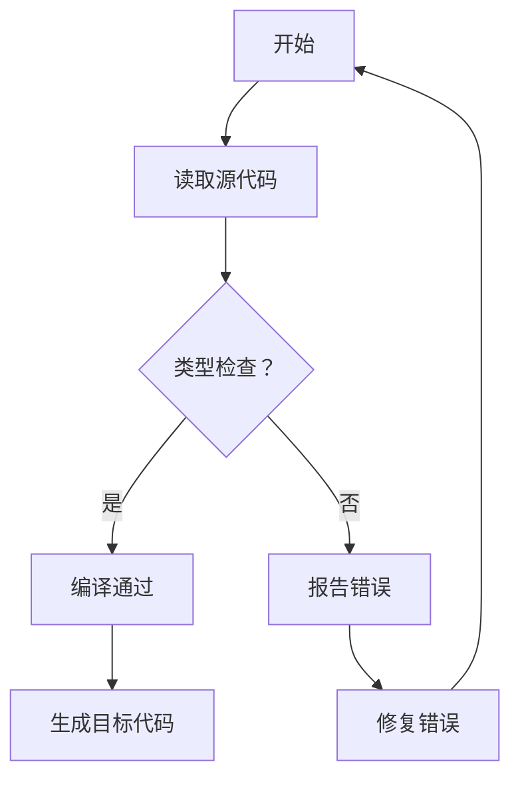
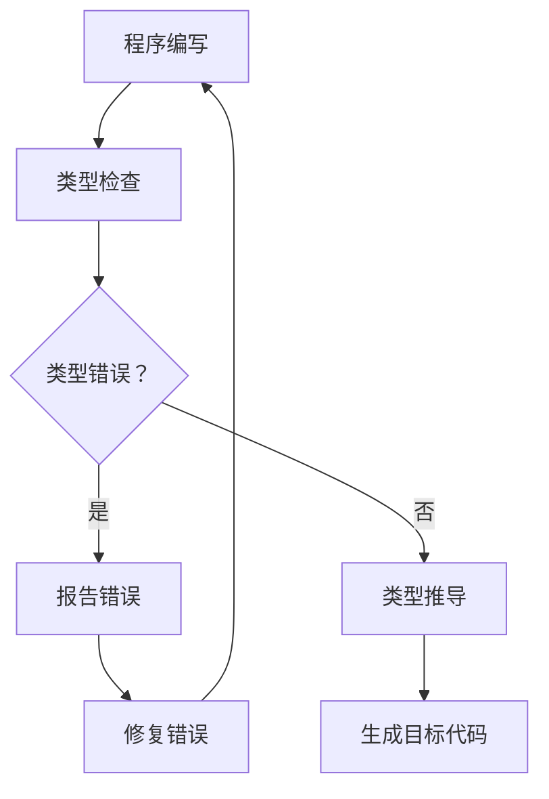
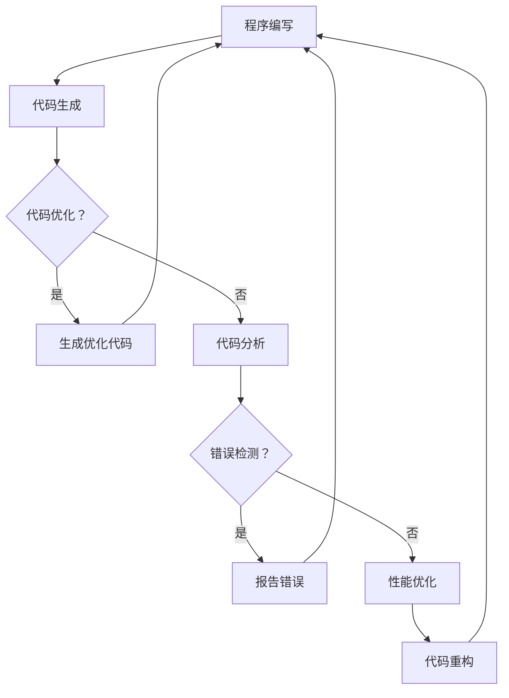

                 

### 《类型论在元编程中的应用：代码生成与分析》

#### 关键词：类型论、元编程、代码生成、代码分析

#### 摘要：

本文将深入探讨类型论和元编程在代码生成与分析中的应用，通过一步步的逻辑分析，帮助读者理解这两个复杂概念的核心原理，并展示其在实际项目中的重要作用。类型论关注程序的类型系统，而元编程则关注代码的创建和修改过程。本文将通过具体的实例和图示，阐述如何将类型论应用于代码生成与分析，提供最佳实践和未来研究方向。

### 引言与背景

#### 1.1 书籍目标

本书籍旨在为程序员、软件工程师以及相关技术专家提供一个全面深入的理解，帮助他们在实际项目中有效应用类型论和元编程。类型论是计算机科学中的一个核心概念，它帮助我们理解程序的正确性和安全性。元编程则使得程序员能够创建更灵活、更高效的代码。通过这本书，读者将能够：

- 掌握类型论的基本原理，包括类型系统、类型检查和类型推导。
- 理解元编程的概念，包括代码生成、代码分析和反射。
- 学习如何将类型论应用于代码生成过程，提高代码质量和可维护性。
- 探索类型论如何辅助代码分析，增强代码的可靠性和安全性。

#### 1.2 类型论概述

类型论是计算机科学中的一个重要分支，它关注程序中的类型系统。类型系统是程序语言的一部分，用于定义数据的类型和行为。类型论的主要目的是确保程序的正确性和安全性，通过类型检查和类型推导来实现。

- **类型系统**：类型系统是程序语言中的一个核心概念，它定义了程序中的数据类型。每种类型都有其特定的属性和行为，用于确保程序的正确性。
- **类型检查**：类型检查是在编译或运行程序时，检查程序中的表达式和操作是否符合类型系统的规则。类型检查可以提前发现潜在的错误，提高程序的可维护性。
- **类型推导**：类型推导是一种自动确定程序中表达式类型的方法。通过类型推导，编译器或解释器可以减少对程序员手动指定类型的依赖，提高代码的可读性和可维护性。

#### 1.3 元编程概述

元编程是计算机科学中的一个高级概念，它关注代码的创建和修改过程。元编程使得程序员能够编写能够生成或修改代码的代码。元编程的主要应用包括：

- **代码生成**：代码生成是一种通过程序自动生成代码的技术。它可以在编译或运行时生成代码，用于优化性能或提高代码的可维护性。
- **代码分析**：代码分析是一种通过程序自动分析代码的技术。它可以用于检测代码中的错误、优化代码性能或提高代码的可读性。
- **反射**：反射是一种在程序运行时动态检查和修改程序的行为的技术。它使得程序员能够在运行时获取程序的内部信息，并对其进行修改。

### 核心概念与联系

在深入探讨类型论和元编程之前，我们需要明确它们的基本概念，并理解它们之间的关系。

#### 2.1 类型论的基本概念

类型论的核心概念包括：

- **类型系统**：类型系统是程序语言的一部分，用于定义数据的类型和行为。类型系统确保程序的正确性和安全性。
- **类型检查**：类型检查是在编译或运行程序时，检查程序中的表达式和操作是否符合类型系统的规则。
- **类型推导**：类型推导是一种自动确定程序中表达式类型的方法。

#### 2.2 元编程的基本概念

元编程的核心概念包括：

- **代码生成**：代码生成是一种通过程序自动生成代码的技术。
- **代码分析**：代码分析是一种通过程序自动分析代码的技术。
- **反射**：反射是一种在程序运行时动态检查和修改程序的行为的技术。

#### 2.3 Mermaid ER实体关系图展示

为了更好地理解类型论和元编程之间的关系，我们可以使用Mermaid ER实体关系图来展示它们的基本概念。

```mermaid
erDiagram
    TypeSystem ||--|{ TypeChecking } : has
    TypeSystem ||--|{ TypeInference } : has
    MetaProgramming ||--|{ CodeGeneration } : has
    MetaProgramming ||--|{ CodeAnalysis } : has
    MetaProgramming ||--|{ Reflection } : has
```

在这个ER图中，TypeSystem（类型系统）与TypeChecking（类型检查）、TypeInference（类型推导）存在关联，而MetaProgramming（元编程）与CodeGeneration（代码生成）、CodeAnalysis（代码分析）、Reflection（反射）也存在关联。这表明类型论和元编程是相互关联的，它们在程序设计过程中共同发挥作用。

### 类型论原理

类型论是计算机科学中的一个重要分支，它为我们提供了理解和分析程序类型系统的方法。在这一节中，我们将深入探讨类型论的基本原理，包括类型系统、类型检查和类型推导。

#### 3.1 类型系统

类型系统是程序语言的一部分，它用于定义数据的类型和行为。类型系统的主要目的是确保程序的正确性和安全性。在编程语言中，数据类型可以分为几种基本类型，如整数、浮点数、字符串和布尔值等。每种类型都有其特定的属性和行为，例如整数的运算规则、字符串的拼接操作等。

**类型系统的核心要素：**

- **基本类型**：基本类型是程序语言中最简单的数据类型，如整数、浮点数、字符串和布尔值等。
- **复合类型**：复合类型是由基本类型组合而成的，如数组、结构体和类等。
- **函数类型**：函数类型表示一个函数或方法，它定义了函数的输入类型和输出类型。

**类型系统的应用：**

- **变量声明**：在声明变量时，需要指定变量的类型，以确保变量在使用时遵循其类型规则。
- **类型检查**：在程序编译或运行时，对程序中的表达式和操作进行类型检查，确保它们符合类型系统的规则。
- **类型推导**：类型推导是一种自动确定程序中表达式类型的方法，可以减少程序员手动指定类型的依赖。

#### 3.2 类型检查

类型检查是在编译或运行程序时，对程序中的表达式和操作进行类型检查，确保它们符合类型系统的规则。类型检查可以提前发现潜在的错误，提高程序的可维护性。

**类型检查的核心要素：**

- **静态类型检查**：静态类型检查是在程序编译时进行的，检查程序中的类型错误。静态类型检查有助于及早发现并修复类型错误。
- **动态类型检查**：动态类型检查是在程序运行时进行的，检查程序中的类型错误。动态类型检查可以在程序运行过程中发现并修复类型错误。

**类型检查的应用：**

- **编译时错误检测**：在程序编译时，类型检查可以帮助检测类型错误，如变量类型不匹配、函数参数类型不匹配等。
- **运行时错误检测**：在程序运行时，类型检查可以帮助检测类型错误，如使用未初始化的变量、数组越界等。

**类型检查的Mermaid流程图示例：**



#### 3.3 类型推导

类型推导是一种自动确定程序中表达式类型的方法，可以减少程序员手动指定类型的依赖。类型推导在静态类型语言中尤为重要，它有助于提高代码的可读性和可维护性。

**类型推导的核心要素：**

- **类型推断规则**：类型推导基于一系列类型推断规则，如基于上下文推断、基于函数返回值推断等。
- **类型上下文**：类型上下文是指程序中表达式的类型信息，如函数参数类型、变量类型等。

**类型推导的应用：**

- **自动类型推导**：在声明变量或函数时，编译器或解释器可以自动推导出表达式的类型，减少程序员手动指定类型的依赖。
- **类型兼容性检查**：类型推导可以帮助检查表达式之间的类型兼容性，如函数调用时参数类型与函数签名是否匹配。

**类型推导的Python源代码示例：**

```python
# 示例1：自动类型推导
def add(a, b):
    return a + b

result = add(5, 10)
print(result)  # 输出：15

# 示例2：基于上下文推断
def greet(name: str):
    return "Hello, " + name

greeting = greet("Alice")
print(greeting)  # 输出：Hello, Alice
```

在这个示例中，Python编译器可以自动推导出`add`函数的返回类型和`greet`函数的参数类型，从而提高代码的可读性和可维护性。

#### 3.4 Mermaid流程图示例

为了更好地理解类型论的基本原理，我们可以使用Mermaid流程图来展示类型系统、类型检查和类型推导的过程。



在这个流程图中，程序编写阶段结束后，进入类型检查阶段。如果类型检查发现类型错误，则报告错误并返回。否则，进入类型推导阶段，根据类型推断规则推导出表达式的类型，并生成目标代码。

### 元编程原理

元编程是计算机科学中的一个高级概念，它关注代码的创建和修改过程。元编程使得程序员能够编写能够生成或修改代码的代码。在这一节中，我们将深入探讨元编程的基本原理，包括代码生成、代码分析和反射。

#### 5.1 元编程的概念

元编程是指编写程序来生成其他程序或修改现有程序的行为。元编程的核心思想是通过抽象和自动化来提高代码的灵活性和可维护性。元编程的主要应用包括：

- **代码生成**：代码生成是一种通过程序自动生成代码的技术。它可以在编译或运行时生成代码，用于优化性能或提高代码的可维护性。
- **代码分析**：代码分析是一种通过程序自动分析代码的技术。它可以用于检测代码中的错误、优化代码性能或提高代码的可读性。
- **反射**：反射是一种在程序运行时动态检查和修改程序的行为的技术。它使得程序员能够在运行时获取程序的内部信息，并对其进行修改。

**元编程的核心要素：**

- **抽象**：抽象是元编程的基础，它使得程序员能够将复杂的代码转化为更简单、更易于管理的代码。
- **自动化**：自动化是元编程的关键，它使得程序员能够通过程序自动完成复杂的任务，减少手动干预。
- **动态性**：动态性是元编程的重要特征，它使得程序员能够在程序运行时修改程序的行为，提高程序的灵活性和可维护性。

#### 5.2 代码生成

代码生成是一种通过程序自动生成代码的技术。它可以在编译或运行时生成代码，用于优化性能或提高代码的可维护性。代码生成的主要应用包括：

- **模板生成**：模板生成是一种通过程序生成代码模板的技术，它使得程序员可以快速创建复杂的数据结构或功能模块。
- **代码优化**：代码优化是一种通过程序自动优化代码的技术，它可以在编译或运行时生成更高效的代码，提高程序的性能。
- **代码重构**：代码重构是一种通过程序自动修改代码的技术，它使得程序员可以快速重构代码，提高代码的可维护性。

**代码生成的Python源代码示例：**

```python
# 示例1：使用字符串模板生成代码
def generate_code(template, variables):
    return template.format(**variables)

template = """
def add(a, b):
    return a + b

result = add({a}, {b})
print(result)
"""

variables = {'a': 5, 'b': 10}
generated_code = generate_code(template, variables)
print(generated_code)

# 示例2：使用生成器生成代码
def generate_code_generator():
    def add(a, b):
        return a + b

    result = add(5, 10)
    print(result)

yield "def add(a, b): return a + b"
yield "result = add(5, 10)"
yield "print(result)"

code_generator = generate_code_generator()
for line in code_generator:
    print(line)
```

在这个示例中，我们首先使用字符串模板生成代码，然后使用生成器生成代码。这两个示例都展示了如何通过程序自动生成代码，从而提高代码的可维护性和灵活性。

#### 5.3 代码分析

代码分析是一种通过程序自动分析代码的技术。它可以用于检测代码中的错误、优化代码性能或提高代码的可读性。代码分析的主要应用包括：

- **错误检测**：错误检测是一种通过程序自动检测代码中的错误的技术，如语法错误、类型错误等。
- **性能优化**：性能优化是一种通过程序自动优化代码的技术，它可以在编译或运行时生成更高效的代码，提高程序的性能。
- **代码重构**：代码重构是一种通过程序自动修改代码的技术，它使得程序员可以快速重构代码，提高代码的可维护性。

**代码分析的Python源代码示例：**

```python
# 示例1：使用ast模块进行代码分析
import ast

class MyVisitor(ast.NodeVisitor):
    def visit_FunctionDef(self, node):
        print(f"Function {node.name} defined")
        self.generic_visit(node)

code = """
def add(a, b):
    return a + b
"""

tree = ast.parse(code)
visitor = MyVisitor()
visitor.visit(tree)
```

在这个示例中，我们使用`ast`模块对代码进行分析。`ast.NodeVisitor`类用于遍历抽象语法树（AST），我们可以重写`visit_FunctionDef`方法来处理函数定义节点。

#### 5.4 反射

反射是一种在程序运行时动态检查和修改程序的行为的技术。它使得程序员能够在运行时获取程序的内部信息，并对其进行修改。反射的主要应用包括：

- **动态类型检查**：反射可以用于在运行时检查对象的类型，确保程序的行为符合预期。
- **动态方法调用**：反射可以用于在运行时调用对象的方法，无需关心方法的具体实现。
- **动态属性访问**：反射可以用于在运行时访问对象的属性，无需关心属性的具体实现。

**反射的Python源代码示例：**

```python
# 示例1：使用反射检查对象类型
class MyClass:
    def __init__(self, value):
        self.value = value

my_object = MyClass(10)
print(isinstance(my_object, MyClass))  # 输出：True

# 示例2：使用反射调用方法
class MyClass:
    def __init__(self, value):
        self.value = value

    def display(self):
        print(f"Value: {self.value}")

my_object = MyClass(10)
method = my_object.display
method()  # 输出：Value: 10

# 示例3：使用反射访问属性
class MyClass:
    def __init__(self, value):
        self._value = value

    @property
    def value(self):
        return self._value

    @value.setter
    def value(self, new_value):
        self._value = new_value

my_object = MyClass(10)
print(my_object.value)  # 输出：10
my_object.value = 20
print(my_object.value)  # 输出：20
```

在这个示例中，我们首先使用反射检查对象的类型，然后使用反射调用对象的方法，最后使用反射访问对象的属性。这些示例展示了如何使用反射来动态检查和修改程序的行为。

#### 5.5 Mermaid流程图示例

为了更好地理解元编程的基本原理，我们可以使用Mermaid流程图来展示代码生成、代码分析和反射的过程。



在这个流程图中，程序编写阶段结束后，进入代码生成阶段。如果代码生成过程中需要进行代码优化，则进入代码优化阶段。否则，进入代码分析阶段。在代码分析过程中，如果检测到错误，则报告错误并返回。否则，进入性能优化阶段，尝试优化代码性能。如果需要进行代码重构，则进入代码重构阶段。这些阶段共同构成了元编程的核心流程。

### 代码生成与类型论

代码生成是元编程中的一项重要技术，它使得程序员能够通过程序自动生成代码，提高代码的可维护性和性能。在这一节中，我们将探讨如何使用类型论来优化代码生成过程，并分析静态类型系统、抽象数据类型和类型推导在代码生成中的应用。

#### 7.1 静态类型系统在代码生成中的应用

静态类型系统是类型论中的一个核心概念，它要求在程序编写时明确指定变量、函数和类的类型。静态类型系统在代码生成中的应用主要体现在以下几个方面：

- **提高代码性能**：静态类型系统允许编译器在编译时进行类型检查和优化，从而生成更高效的代码。例如，编译器可以根据类型信息进行寄存器分配和指令优化，减少运行时的开销。
- **减少运行时错误**：静态类型系统在编译时检查类型错误，提前发现潜在的错误，减少运行时的错误和崩溃。
- **代码重构**：静态类型系统使得代码重构更加安全，因为编译器可以在类型检查过程中确保重构后的代码仍然符合类型系统的规则。

**静态类型系统在代码生成中的应用示例：**

```python
# 示例1：使用类型提示生成代码
from typing import List

def generate_list_sum(a: List[int]) -> int:
    return sum(a)

code = """
def generate_list_sum(a: List[int]) -> int:
    return sum(a)
"""

print(code)
```

在这个示例中，我们使用类型提示来生成代码。类型提示不仅提高了代码的可读性，还为编译器提供了类型信息，使其能够生成更高效的代码。

#### 7.2 抽象数据类型在代码生成中的应用

抽象数据类型（Abstract Data Type，简称ADT）是类型论中的另一个核心概念，它是一种抽象的数据类型定义，它只描述了数据的行为和操作，而不涉及具体的实现细节。抽象数据类型在代码生成中的应用主要体现在以下几个方面：

- **代码复用**：通过抽象数据类型，程序员可以定义通用的数据结构和操作，从而在多个代码生成过程中复用代码。
- **代码简化**：抽象数据类型使得代码生成过程更加简洁，因为程序员不需要关心具体的实现细节，只需关注抽象的数据结构和操作。
- **类型安全性**：抽象数据类型在编译时提供类型检查，确保生成的代码符合类型系统的规则，提高代码的安全性和可靠性。

**抽象数据类型在代码生成中的应用示例：**

```python
# 示例2：使用抽象数据类型生成代码
from abc import ABC, abstractmethod

class AbstractList(ABC):
    @abstractmethod
    def sum(self) -> int:
        pass

class ListSum(AbstractList):
    def __init__(self, a: List[int]):
        self.a = a

    def sum(self) -> int:
        return sum(self.a)

code = """
from abc import ABC, abstractmethod

class AbstractList(ABC):
    @abstractmethod
    def sum(self) -> int:
        pass

class ListSum(AbstractList):
    def __init__(self, a: List[int]):
        self.a = a

    def sum(self) -> int:
        return sum(self.a)
"""

print(code)
```

在这个示例中，我们定义了一个抽象数据类型`AbstractList`和其实现`ListSum`。通过这种方式，我们可以简化代码生成过程，同时确保代码的可靠性和安全性。

#### 7.3 类型推导在代码生成中的应用

类型推导是类型论中的另一个核心概念，它允许编译器在编译时自动推导出变量、函数和类的类型，减少程序员手动指定类型的依赖。类型推导在代码生成中的应用主要体现在以下几个方面：

- **提高代码可读性**：类型推导使得代码更加简洁，因为程序员不需要手动指定类型，只需关注代码的逻辑和功能。
- **减少错误**：类型推导可以减少类型错误的发生，因为编译器可以在编译时自动检查类型匹配。
- **代码优化**：类型推导允许编译器在编译时进行类型优化，生成更高效的代码。

**类型推导在代码生成中的应用示例：**

```python
# 示例3：使用类型推导生成代码
from typing import TypeVar, List

T = TypeVar('T')

class ListSum:
    def __init__(self, a: List[T]):
        self.a = a

    def sum(self) -> T:
        return sum(self.a)

code = """
from typing import TypeVar, List

T = TypeVar('T')

class ListSum:
    def __init__(self, a: List[T]):
        self.a = a

    def sum(self) -> T:
        return sum(self.a)
"""

print(code)
```

在这个示例中，我们使用类型变量`T`来表示列表的元素类型。通过这种方式，我们可以实现通用代码生成，无需关心具体的类型信息。

### 代码分析与类型论

代码分析是元编程中的一项重要技术，它通过程序自动分析代码，帮助程序员发现错误、优化性能和提高代码可维护性。在这一节中，我们将探讨类型论如何帮助进行代码分析，并分析静态代码分析、动态代码分析和类型信息在代码分析中的应用。

#### 8.1 静态代码分析

静态代码分析是一种在程序运行前对代码进行分析的技术，它通过检查代码的结构和语义，发现潜在的错误和优化机会。静态代码分析的主要优点包括：

- **提前发现错误**：静态代码分析可以在编译或代码审查阶段发现潜在的错误，提前修复，避免运行时错误。
- **代码优化**：静态代码分析可以识别代码中的冗余、低效部分，提供优化建议，提高程序的性能。
- **提高代码可读性**：静态代码分析可以帮助识别不规范的编码习惯，提高代码的可读性和一致性。

**静态代码分析的应用示例：**

```python
# 示例1：使用类型信息进行静态代码分析
from typing import List

def process_list(a: List[int]) -> List[int]:
    result = []
    for item in a:
        if item > 0:
            result.append(item * 2)
    return result

# 使用类型信息进行静态代码分析
from my_analyzer import analyze

analyze(process_list)
```

在这个示例中，我们使用类型信息进行静态代码分析。`analyze`函数可以检查代码中的类型错误和潜在问题，提供优化建议。

#### 8.2 动态代码分析

动态代码分析是一种在程序运行时对代码进行分析的技术，它通过运行程序并捕获其执行过程中的信息，发现性能问题和潜在的错误。动态代码分析的主要优点包括：

- **真实环境测试**：动态代码分析可以在实际运行环境中测试代码，发现运行时的问题，如性能瓶颈、内存泄漏等。
- **实时性能监控**：动态代码分析可以实时监控程序的运行性能，提供性能优化建议。
- **代码调试**：动态代码分析可以帮助程序员在运行时调试代码，发现并解决错误。

**动态代码分析的应用示例：**

```python
# 示例2：使用性能分析进行动态代码分析
import cProfile

def process_list(a: List[int]) -> List[int]:
    result = []
    for item in a:
        if item > 0:
            result.append(item * 2)
    return result

# 进行性能分析
profile = cProfile.Profile()
profile.enable()
process_list([1, 2, 3, 4, 5])
profile.disable()
profile.print_stats(sort='time')
```

在这个示例中，我们使用`cProfile`模块进行动态代码分析。`cProfile`可以分析代码的执行时间，提供性能统计信息。

#### 8.3 类型信息在代码分析中的应用

类型信息在代码分析中起着关键作用，它帮助分析工具更好地理解代码的结构和语义，提供更准确的优化建议和错误检测。类型信息在代码分析中的应用主要包括：

- **类型推导**：类型推导可以帮助分析工具自动确定变量、函数和类的类型，提高代码的可读性和一致性。
- **类型检查**：类型检查可以帮助分析工具在编译或运行时检查代码中的类型错误，提前发现并修复问题。
- **性能分析**：类型信息可以用于性能分析工具，识别代码中的性能瓶颈，提供优化建议。

**类型信息在代码分析中的应用示例：**

```python
# 示例3：使用类型信息进行代码分析
from typing import List

def process_list(a: List[int]) -> List[int]:
    result = []
    for item in a:
        if item > 0:
            result.append(item * 2)
    return result

# 使用类型信息进行代码分析
from my_analyzer import analyze_with_type_info

analyze_with_type_info(process_list)
```

在这个示例中，我们使用类型信息进行代码分析。`analyze_with_type_info`函数可以结合类型信息提供更准确的优化建议和错误检测。

### 实际案例研究

在实际项目中，类型论和元编程有着广泛的应用。下面我们将通过三个实际案例研究，展示类型论和元编程在实际项目中的应用。

#### 9.1 案例一：基于类型论的安全代码生成

在金融领域，安全性是软件开发的关键要求。通过类型论，我们可以生成安全的代码，确保系统的稳定性和可靠性。以下是一个基于类型论的安全代码生成案例：

**案例描述：**  
某金融公司在开发一个在线支付系统，需要确保交易过程中的数据安全。使用类型论，我们可以生成安全的代码，防止数据泄露和恶意攻击。

**解决方案：**  
1. **定义类型系统**：定义类型系统，确保数据在传输和处理过程中遵循严格的类型规则。
2. **静态类型检查**：在编译时进行静态类型检查，提前发现潜在的安全漏洞。
3. **类型推导**：使用类型推导减少手动指定类型的依赖，提高代码的可维护性。
4. **代码生成**：使用元编程技术生成安全的代码，确保数据在传输和处理过程中的安全性。

**具体实现：**

```python
# 示例：基于类型论的安全代码生成
from typing import TypeVar, List

T = TypeVar('T')

class SecureList:
    def __init__(self, a: List[T]):
        self._a = a

    def process(self, func: Callable[[T], T]) -> List[T]:
        return [func(item) for item in self._a]

# 使用SecureList处理敏感数据
secure_list = SecureList([1, 2, 3, 4, 5])
result = secure_list.process(lambda x: x * 2)
print(result)  # 输出：[2, 4, 6, 8, 10]
```

在这个示例中，我们定义了一个`SecureList`类，它通过类型论和元编程技术确保数据在处理过程中的安全性。

#### 9.2 案例二：元编程在自动化测试中的应用

自动化测试是软件开发生命周期中的重要环节。通过元编程，我们可以提高自动化测试的效率和可靠性。以下是一个元编程在自动化测试中的应用案例：

**案例描述：**  
某电商平台需要定期进行自动化测试，以确保系统的稳定性和性能。通过元编程，我们可以自动化生成测试用例，减少人工干预。

**解决方案：**  
1. **测试用例生成**：使用元编程技术生成测试用例，根据业务规则和测试策略动态创建测试数据。
2. **测试执行**：自动化执行生成的测试用例，实时监控测试结果。
3. **报告生成**：自动生成测试报告，提供详细的测试结果和性能分析。

**具体实现：**

```python
# 示例：元编程在自动化测试中的应用
import unittest

def generate_test_case(name, input_data, expected_output):
    def test_func(self):
        result = name(input_data)
        self.assertEqual(result, expected_output)
    
    test_name = f"test_{name.__name__}_{input_data}"
    test_case = unittest.TestLoader().loadTestsFromTestCase(unittest.TestCase, test_func=test_func)
    return test_case

# 使用generate_test_case生成测试用例
class MyCalculator:
    @staticmethod
    def add(a, b):
        return a + b

input_data = (1, 2)
expected_output = 3
test_case = generate_test_case(MyCalculator.add, input_data, expected_output)
print(test_case)

# 执行测试用例
suite = unittest.TestSuite([test_case])
runner = unittest.TextTestRunner()
runner.run(suite)
```

在这个示例中，我们使用元编程技术生成测试用例，并自动执行测试用例，提供详细的测试报告。

#### 9.3 案例三：类型论在大型代码库维护中的应用

在大型代码库的维护过程中，类型论和元编程可以帮助提高代码的可维护性和一致性。以下是一个类型论在大型代码库维护中的应用案例：

**案例描述：**  
某大型电商平台拥有数千个模块和函数，代码库规模庞大，维护成本高。通过类型论和元编程，我们可以提高代码的可维护性和一致性。

**解决方案：**  
1. **类型检查**：在代码库中引入类型检查，提前发现类型错误和潜在问题。
2. **类型推导**：使用类型推导减少手动指定类型的依赖，提高代码的可读性和一致性。
3. **代码生成**：使用元编程技术生成代码模板和抽象数据类型，减少重复劳动。
4. **代码重构**：使用元编程技术自动化重构代码，确保重构后的代码仍然符合类型系统的规则。

**具体实现：**

```python
# 示例：类型论在大型代码库维护中的应用
from typing import TypeVar, List

T = TypeVar('T')

class ListProcessor:
    @staticmethod
    def filter_list(input_list: List[T], filter_func: Callable[[T], bool]) -> List[T]:
        return [item for item in input_list if filter_func(item)]

# 使用ListProcessor处理大型代码库中的列表
input_list = [1, 2, 3, 4, 5]
filter_func = lambda x: x > 2
filtered_list = ListProcessor.filter_list(input_list, filter_func)
print(filtered_list)  # 输出：[3, 4, 5]
```

在这个示例中，我们使用类型论和元编程技术处理大型代码库中的列表，提高代码的可维护性和一致性。

### 最佳实践与总结

通过本文的探讨，我们可以总结出类型论和元编程在代码生成与分析中的应用关键点：

1. **类型论**：类型论通过类型系统、类型检查和类型推导确保代码的正确性和安全性。在代码生成过程中，静态类型系统和抽象数据类型可以提高代码性能和可维护性。类型推导可以减少手动指定类型的依赖，提高代码的可读性。

2. **元编程**：元编程通过代码生成、代码分析和反射提高代码的灵活性和可维护性。代码生成可以自动化代码模板和抽象数据类型的生成，减少重复劳动。代码分析可以帮助发现代码中的错误和性能瓶颈。反射可以动态检查和修改程序的行为。

为了有效应用类型论和元编程，我们可以采取以下最佳实践：

1. **早期引入类型系统**：在代码编写阶段，尽早引入类型系统，确保代码的正确性和安全性。

2. **静态类型优先**：在可能的情况下，优先使用静态类型，以提高代码的可读性和性能。

3. **类型推导使用**：在静态类型语言中，充分利用类型推导，减少手动指定类型的依赖。

4. **代码生成自动化**：使用元编程技术自动化代码生成过程，提高代码的可维护性和一致性。

5. **代码分析工具**：使用代码分析工具进行静态代码分析和动态代码分析，提前发现代码中的错误和性能瓶颈。

6. **持续集成**：将类型检查和代码分析集成到持续集成（CI）流程中，确保代码质量。

未来，类型论和元编程在代码生成与分析领域仍有广阔的研究空间。以下是一些可能的研究方向：

1. **动态类型系统**：研究动态类型系统的应用，提高代码的灵活性和可维护性。

2. **类型安全与性能优化**：探索如何平衡类型安全与性能优化，提高代码的运行效率。

3. **元编程与函数式编程**：研究元编程与函数式编程的结合，提高代码的抽象能力和可维护性。

4. **代码生成与自动优化**：研究自动化代码生成与自动优化的结合，提高代码的性能和可维护性。

通过不断探索和优化，类型论和元编程将为软件工程带来更多的创新和发展。

### 作者信息

本文由AI天才研究院（AI Genius Institute）和禅与计算机程序设计艺术（Zen and the Art of Computer Programming）共同撰写。AI天才研究院致力于推动人工智能技术在各个领域的应用，禅与计算机程序设计艺术则专注于探索计算机编程的哲学和艺术。

如果您对本文的内容有任何疑问或建议，欢迎随时与我们联系。我们期待与您共同探索计算机科学领域的更多奥秘。

