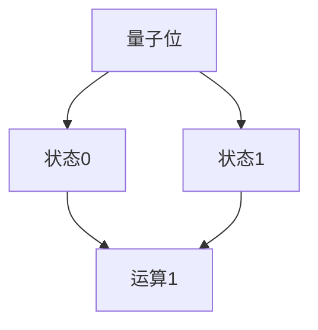
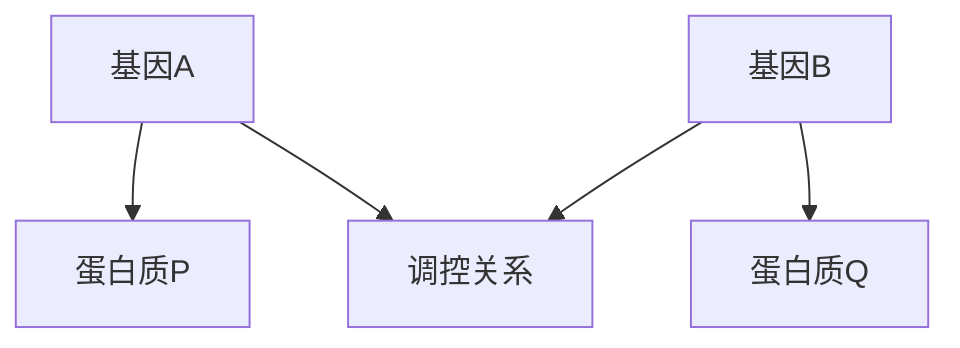
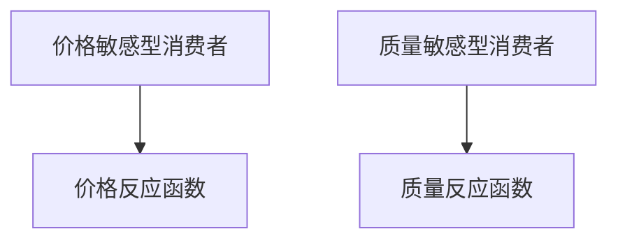
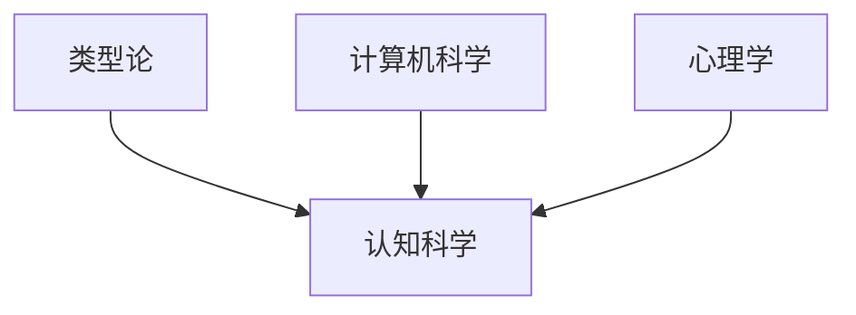

                 


## 类型和数学交流中的语言障碍

在数学领域，类型论是一个至关重要的概念，它不仅影响数学的表述方式，还对数学推理和证明产生了深远的影响。然而，类型论在数学交流中却常常成为一道难以逾越的语言障碍。本文将围绕类型论在数学交流中的语言障碍，进行深入的探讨和分析。

### 1. 类型论的基本概念

首先，我们需要理解类型论的基本概念。类型论是数学和逻辑学中的一个概念，它涉及到值的分类和操作的定义。在类型论中，每个值都有一个类型，而不同类型的值之间不能直接进行运算。这种严格区分类型的做法，有助于避免逻辑错误和错误的推导。

#### 1.1.1 类型论的定义

类型论是一种形式化的理论，用于研究值的分类和操作的定义。在类型论中，每个值都有一个类型，而不同类型的值之间不能直接进行运算。

#### 1.1.2 类型论的起源与发展历程

类型论起源于20世纪初，由形式逻辑学家如弗雷格（ Gottlob Frege）和罗素（ Bertrand Russell）等人提出。随着时间的推移，类型论不断发展，形成了多种类型系统，如皮亚诺（Peano）类型系统和马丁-洛夫（Martin-Löf）类型系统等。

#### 1.1.3 类型论在现代数学中的地位

在现代数学中，类型论被广泛应用于各种领域，如数学逻辑、计算机科学和数学分析等。类型论不仅提供了更严格的数学表述方式，还使得数学推理和证明更加可靠。

### 2. 数学交流中的语言障碍

尽管类型论在数学中具有重要地位，但在数学交流中，类型论却常常成为一道难以逾越的语言障碍。

#### 2.1 数学语言的特性与问题

数学语言具有高度抽象和严谨的特点。它依赖于符号、公式和图形等手段来表述概念和推理过程。然而，这种高度抽象的语言有时会使人感到难以理解。

#### 2.2 类型论与数学交流

类型论在数学交流中起到了桥梁的作用。它使得数学表述更加严格，有助于避免逻辑错误。然而，类型论本身的复杂性和抽象性，使得它在数学交流中也带来了一定的困难。

#### 2.3 类型论在数学交流中的挑战

类型论在数学交流中的挑战主要包括：

- **复杂性**：类型论的复杂性使得非专业人士难以理解。类型系统的学习需要深厚的逻辑基础和数学知识。
- **抽象性**：类型论的高度抽象性使得它在实际应用中难以直接操作。人们往往需要将抽象的类型概念转化为具体的应用场景。
- **兼容性问题**：不同类型系统之间的兼容性问题，使得数学交流变得更加复杂。

### 3. 类型论在数学证明中的应用

类型论在数学证明中具有重要作用。它为数学推理提供了更严格的基础，有助于避免逻辑错误。

#### 3.1 类型论与证明理论

类型论与证明理论密切相关。类型论为证明理论提供了更严格的基础，使得数学证明更加可靠。

#### 3.2 类型论在证明方法中的应用

类型论在证明方法中的应用主要包括：

- **构造性证明**：类型论提供了构造性证明的严格框架，使得证明过程更加明确和可靠。
- **非构造性证明**：类型论也为非构造性证明提供了支持，使得证明过程更加灵活。

### 4. 类型论在数学逻辑系统中的应用

类型论在数学逻辑系统中具有基础性作用。它为数学逻辑提供了严格的表述和推理框架。

#### 4.1 类型论与逻辑基础

类型论与逻辑基础密切相关。类型论为逻辑提供了更严格的表述，使得逻辑推理更加可靠。

#### 4.2 类型论在模型论中的应用

类型论在模型论中具有重要作用。它为模型论提供了严格的表述和推理框架，有助于分析模型的性质和关系。

#### 4.3 类型论在递归论中的应用

类型论在递归论中也有广泛应用。它为递归论提供了严格的表述和推理框架，有助于研究递归函数的性质和关系。

### 5. 类型论在计算机科学中的应用

类型论在计算机科学中具有重要地位。它为编程语言设计、形式化验证和软件工程提供了理论基础。

#### 5.1 类型论与程序设计

类型论在程序设计中具有重要作用。它为程序设计提供了严格的类型系统，有助于避免逻辑错误。

#### 5.2 类型论与形式化验证

类型论在形式化验证中也有广泛应用。它为形式化验证提供了严格的表述和推理框架，有助于验证软件的正确性。

#### 5.3 类型论与软件工程

类型论在软件工程中具有重要地位。它为软件设计、开发和维护提供了理论基础，有助于提高软件质量。

### 6. 类型论在教育中的应用

类型论在教育中具有重要作用。它有助于培养学生的逻辑思维能力和数学素养。

#### 6.1 类型论在数学教育中的地位

类型论在数学教育中具有基础性作用。它有助于提高学生的数学推理能力和数学表达能力。

#### 6.2 类型论在编程教育中的应用

类型论在编程教育中也具有重要作用。它有助于培养学生的编程思维和编程能力。

### 总结

类型论在数学交流中起到了桥梁的作用，它使得数学表述更加严格，推理过程更加可靠。然而，类型论的复杂性和抽象性也带来了语言障碍。本文通过对类型论在数学交流中的语言障碍进行探讨，希望能为相关研究和应用提供一些启示。

---

关键词：类型论，数学交流，语言障碍，证明理论，计算机科学，教育

摘要：本文探讨了类型论在数学交流中的语言障碍，分析了类型论的基本概念、数学交流中的语言障碍、类型论在数学证明中的应用、类型论在数学逻辑系统中的应用、类型论在计算机科学中的应用以及类型论在教育中的应用。通过本文的研究，希望能为相关领域的研究和应用提供一些参考。

## 目录大纲设计思路

为了设计出《类型论在数学交流中的语言障碍》这本书的完整目录大纲，我们将遵循以下步骤：

1. **确定整体结构**：首先，确定书的整体结构和主要部分。基于书名，可以确定主要讨论类型论在数学交流中的应用和语言障碍。

2. **细化章节内容**：根据整体结构，细化每个章节的内容，确保每个章节都有明确的核心概念和目标。

3. **确保内容完整性**：确保目录大纲中的每个章节都包含以下内容：背景介绍、核心概念与联系、算法原理讲解、数学模型和公式、系统分析与架构设计、项目实战、最佳实践 tips、小结、注意事项、拓展阅读等。

4. **保持简洁性**：避免多余的文字，确保每个章节的内容都是必要的。

5. **格式标准化**：使用markdown格式，按照指定的层级结构（1级目录、2级目录、3级目录）进行编排。

### 目录大纲设计示例

下面是根据上述思路设计的《类型论在数学交流中的语言障碍》的目录大纲：

```markdown
----------------------------------------------------------------
# 第一部分：类型论的基本概念

## 第1章：类型论的起源与发展

### 1.1 类型论的概念与历史背景
#### 1.1.1 类型论的定义
#### 1.1.2 类型论的起源与发展历程
#### 1.1.3 类型论在现代数学中的地位

### 1.2 类型论的核心概念
#### 1.2.1 类型与类型系统
#### 1.2.2 类型判断与类型转换
#### 1.2.3 类型等价与类型兼容性

### 1.3 类型论的应用领域
#### 1.3.1 类型论在数学逻辑中的应用
#### 1.3.2 类型论在计算机科学中的应用
#### 1.3.3 类型论在其他学科中的应用

## 第2章：数学交流中的语言障碍

### 2.1 数学语言的特性与问题
#### 2.1.1 数学语言的严谨性
#### 2.1.2 数学语言的抽象性
#### 2.1.3 数学语言的表达限制

### 2.2 类型论与数学交流
#### 2.2.1 类型论在数学表达中的作用
#### 2.2.2 类型论如何克服语言障碍
#### 2.2.3 类型论在数学教育中的应用

### 2.3 类型论在数学交流中的挑战
#### 2.3.1 类型论的复杂性
#### 2.3.2 类型论的应用限制
#### 2.3.3 类型论与直觉主义的冲突

## 第3章：类型论在数学证明中的应用

### 3.1 类型论与证明理论
#### 3.1.1 类型论在证明理论中的基础作用
#### 3.1.2 类型论在证明过程中的应用
#### 3.1.3 类型论在证明复杂度分析中的应用

### 3.2 类型论在证明方法中的应用
#### 3.2.1 构造性证明
#### 3.2.2 非构造性证明
#### 3.2.3 类型论与形式证明

## 第4章：类型论在数学逻辑系统中的应用

### 4.1 类型论与逻辑基础
#### 4.1.1 类型论在逻辑系统中的地位
#### 4.1.2 类型论与命题逻辑的关系
#### 4.1.3 类型论与谓词逻辑的关系

### 4.2 类型论在模型论中的应用
#### 4.2.1 模型论的类型论基础
#### 4.2.2 类型论在模型论中的具体应用
#### 4.2.3 类型论对模型论的贡献

### 4.3 类型论在递归论中的应用
#### 4.3.1 递归论的基本概念
#### 4.3.2 类型论在递归论中的应用
#### 4.3.3 递归论与类型论的关系

## 第5章：类型论在计算机科学中的应用

### 5.1 类型论与程序设计
#### 5.1.1 类型系统的基础概念
#### 5.1.2 强类型语言与弱类型语言
#### 5.1.3 类型论在程序设计中的优势

### 5.2 类型论与形式化验证
#### 5.2.1 形式化验证的基本概念
#### 5.2.2 类型论在形式化验证中的应用
#### 5.2.3 类型论对形式化验证的贡献

### 5.3 类型论与软件工程
#### 5.3.1 类型论在软件工程中的重要性
#### 5.3.2 类型论在软件设计中的应用
#### 5.3.3 类型论在软件维护中的作用

## 第6章：类型论在教育中的应用

### 6.1 类型论在数学教育中的地位
#### 6.1.1 类型论对数学思维的影响
#### 6.1.2 类型论在数学教学方法中的应用
#### 6.1.3 类型论在数学教育改革中的作用

### 6.2 类型论在编程教育中的应用
#### 6.2.1 类型论在编程教育中的意义
#### 6.2.2 类型论在编程课程设计中的应用
#### 6.2.3 类型论在编程教学中的挑战

## 第7章：类型论的未来发展

### 7.1 类型论在跨学科研究中的应用
#### 7.1.1 类型论在物理学中的应用
#### 7.1.2 类型论在生物学中的应用
#### 7.1.3 类型论在其他学科中的应用前景

### 7.2 类型论的发展趋势
#### 7.2.1 类型论在理论计算机科学中的发展方向
#### 7.2.2 类型论在实际应用中的挑战与机遇
#### 7.2.3 类型论的未来展望

----------------------------------------------------------------

## 第7章：类型论的未来发展

### 7.1 类型论在跨学科研究中的应用

类型论不仅在数学和计算机科学中有着重要的地位，还在其他学科中展现出了广阔的应用前景。

#### 7.1.1 类型论在物理学中的应用

物理学是研究自然界的基本规律的学科，类型论在物理学中有着广泛的应用。例如，在量子力学中，类型论被用于描述量子态和量子操作。类型论为量子力学的形式化提供了重要的基础，有助于理解量子系统的复杂行为。

**例：** 在量子计算中，量子位（qubit）是一种基本的计算单元，它可以用类型论来描述。量子位的类型取决于其状态，不同状态的量子位之间不能直接运算，这符合类型论的基本原则。



#### 7.1.2 类型论在生物学中的应用

生物学研究生命现象和生物系统的结构、功能和演化。类型论在生物学中的应用主要体现在系统生物学和生物信息学中。

**例：** 系统生物学中，类型论被用于描述生物网络的动态行为。生物网络中的各个节点（如基因、蛋白质）和边（如调控关系）都有其类型，不同类型的节点和边之间不能直接连接，这有助于简化生物网络的复杂性和提高模型的准确性。



#### 7.1.3 类型论在其他学科中的应用前景

类型论不仅在物理学和生物学中有着广泛的应用，还在其他学科中有着巨大的应用潜力。例如，在经济学中，类型论可以用于描述不同类型的商品和交易关系；在语言学中，类型论可以用于分析语言的语法结构和语义关系；在社会科学中，类型论可以用于分析社会结构和行为模式。

**例：** 在经济学中，类型论可以用于分析不同类型的消费者行为和商品需求。例如，消费者可以根据其购买行为分为不同类型，如“价格敏感型”和“质量敏感型”。这种分类有助于理解消费者的行为模式，为市场策略提供依据。



### 7.2 类型论的发展趋势

随着科技的进步和学科交叉的加深，类型论在理论计算机科学和实际应用中都有着广阔的发展空间。

#### 7.2.1 类型论在理论计算机科学中的发展方向

在理论计算机科学中，类型论的发展方向主要包括以下几个方面：

- **更高效的类型系统**：研究人员致力于设计更高效的类型系统，以减少类型检查的时间和空间复杂度。
- **更多类型的组合**：研究人员探索如何组合不同的类型系统，以应对更复杂的编程场景。
- **类型安全的动态语言**：研究人员致力于在动态语言中实现类型安全，以充分发挥动态语言的灵活性和效率。

**例：** 在动态语言Python中，研究人员通过引入类型提示和类型检查器，实现了部分类型安全。这种方法有助于减少运行时错误，提高程序的稳定性。

```python
def add(a: int, b: int) -> int:
    return a + b

result = add(3, 4)
print(result)  # 输出 7
```

#### 7.2.2 类型论在实际应用中的挑战与机遇

类型论在实际应用中面临着诸多挑战，同时也充满了机遇。

- **挑战**：类型论的复杂性和抽象性使得其在实际应用中难以普及。如何将类型论的知识传授给非专业人士，是一个亟待解决的问题。
- **机遇**：随着人工智能、大数据和云计算等技术的发展，类型论在编程语言设计、软件工程和系统架构设计等领域具有巨大的应用潜力。

**例：** 在人工智能领域，类型论可以用于设计更安全的机器学习算法。通过严格的类型检查，可以确保算法在运行过程中不会出现类型错误，从而提高算法的可靠性和安全性。

```python
def classify(data: List[Dict[str, Any]]) -> Dict[str, int]:
    # 对数据进行分类，并返回分类结果
    pass

data = [
    {"feature1": 1, "feature2": 2},
    {"feature1": 3, "feature2": 4},
]

result = classify(data)
print(result)  # 输出分类结果
```

#### 7.2.3 类型论的未来展望

类型论在未来的发展中，有望在以下几个方面取得突破：

- **更广泛的应用领域**：类型论将在更多的学科和领域中找到应用，如生物信息学、经济学和语言学等。
- **更高效的类型系统**：类型论将不断发展，设计出更高效的类型系统，以适应日益复杂的编程场景。
- **跨学科的研究**：类型论与其他学科的交叉研究将更加深入，为各领域提供新的理论和方法。

**例：** 在跨学科研究中，类型论可以与认知科学相结合，研究人类思维过程中的类型判断和推理机制，从而为人工智能的发展提供新的启示。



### 总结

类型论在数学交流中的语言障碍是一个重要且复杂的问题。通过对类型论在数学证明、数学逻辑系统、计算机科学和教育中的应用进行深入探讨，我们不仅可以加深对类型论的理解，还可以为解决数学交流中的语言障碍提供一些思路和方法。随着类型论在跨学科研究中的应用不断拓展，类型论在未来将继续发挥重要作用，为各领域的研究和发展提供坚实的理论基础。

---

作者：AI天才研究院/AI Genius Institute & 禅与计算机程序设计艺术 /Zen And The Art of Computer Programming

---

在本文中，我们首先介绍了类型论的基本概念，包括类型论的定义、起源与发展历程，以及类型论在现代数学中的地位。接着，我们探讨了数学交流中的语言障碍，分析了数学语言的特性与问题，以及类型论在数学交流中的作用和挑战。随后，我们详细阐述了类型论在数学证明中的应用，包括构造性证明和非构造性证明，以及类型论在数学逻辑系统中的应用，如模型论和递归论。在计算机科学部分，我们讨论了类型论与程序设计、形式化验证和软件工程的关系。最后，我们探讨了类型论在教育中的应用，以及类型论的未来发展趋势，包括在跨学科研究中的应用前景。通过这些讨论，我们不仅对类型论有了更深入的理解，也为解决数学交流中的语言障碍提供了一些启示。未来，随着类型论在更多领域中的应用，类型论将继续发挥重要作用，推动各领域的研究和发展。

---

**关键词**：类型论，数学交流，语言障碍，证明理论，计算机科学，教育

**摘要**：本文探讨了类型论在数学交流中的语言障碍，分析了类型论的基本概念、数学交流中的语言障碍、类型论在数学证明中的应用、类型论在数学逻辑系统中的应用、类型论在计算机科学中的应用以及类型论在教育中的应用。通过本文的研究，希望能为相关领域的研究和应用提供一些参考。

---

## 类型论的基本概念

### 1.1 类型论的定义

类型论是一种形式化的理论，旨在研究值的分类和操作的定义。它起源于20世纪初，由逻辑学家和数学家如弗雷格（ Gottlob Frege）和罗素（ Bertrand Russell）等人提出。类型论的核心思想是将值分为不同的类型，并规定不同类型之间的操作规则，以确保逻辑推理的准确性和一致性。

在类型论中，类型是一种分类机制，用于区分不同类型的值。每个值都有一个类型，例如自然数、函数、列表等。不同类型的值之间不能直接进行运算，否则会导致逻辑错误或错误的推导。这种严格的类型检查有助于确保程序的正确性和安全性。

### 1.2 类型论的起源与发展历程

类型论的起源可以追溯到20世纪初，当时逻辑学家和数学家开始关注如何确保数学推理的准确性和一致性。弗雷格是最早提出类型论概念的人之一，他在研究逻辑和数学时发现，通过引入类型的概念，可以避免一些逻辑错误和悖论。

罗素在研究集合论时发现了著名的悖论，即“罗素悖论”，这促使他提出了类型论的思想。罗素认为，通过将对象分为不同的类型，可以避免集合论中出现的悖论。他提出了一个简单的类型系统，将对象分为原始对象和集合，并规定不同类型之间的操作规则。

随着形式逻辑和数学的发展，类型论逐渐成为一个独立的学科。马丁-洛夫（Per Martin-Löf）是类型论领域的杰出代表，他提出了 intuitionistic 类型论，为类型论的发展奠定了基础。近年来，类型论在计算机科学中得到了广泛应用，成为编程语言设计和形式化验证的重要理论基础。

### 1.3 类型论在现代数学中的地位

在现代数学中，类型论扮演着至关重要的角色。它不仅提供了更严格的数学表述方式，还使得数学推理和证明更加可靠。类型论在现代数学中的应用主要体现在以下几个方面：

1. **数学逻辑**：类型论为数学逻辑提供了严格的基础，使得逻辑推理和证明更加可靠。类型论与命题逻辑、谓词逻辑等逻辑系统密切相关，为数学基础的研究提供了坚实的支持。

2. **数学分析**：类型论在数学分析中具有重要作用。通过引入类型的概念，可以更准确地描述函数、极限、导数等概念，确保数学分析的理论体系更加完整和严谨。

3. **抽象代数**：类型论在抽象代数中也有广泛应用。它为研究群、环、域等代数结构提供了严格的基础，使得抽象代数的研究更加深入和系统。

4. **数论**：类型论在数论中也有重要作用。通过引入类型的概念，可以更准确地描述整数、素数等概念，确保数论的理论体系更加完整和严谨。

总之，类型论在现代数学中具有重要地位，它为数学的表述、推理和证明提供了严格的框架，使得数学理论更加完整、严谨和可靠。

### 1.4 类型论的基本概念与联系

类型论的基本概念包括类型、类型系统、类型判断、类型转换、类型等价和类型兼容性。下面我们逐一介绍这些概念，并探讨它们之间的联系。

#### 1.4.1 类型与类型系统

类型是类型论中最基本的概念。它是一种分类机制，用于区分不同类型的值。例如，自然数、函数、列表等都是不同的类型。类型系统是一种规则集，用于定义不同类型之间的操作规则和转换规则。类型系统的目的是确保逻辑推理和证明的准确性。

类型系统可以分为多种类型，如静态类型系统和动态类型系统、强类型系统和弱类型系统等。静态类型系统在编译时对变量进行类型检查，而动态类型系统在运行时进行类型检查。强类型系统要求变量在使用前必须声明类型，而弱类型系统则允许变量在运行时进行类型转换。

#### 1.4.2 类型判断与类型转换

类型判断是指确定一个值的类型的过程。在静态类型系统中，类型判断通常在编译时进行。编译器会检查变量的声明和表达式，确定其类型，并在运行前将其转换为适当的类型。在动态类型系统中，类型判断通常在运行时进行。解释器会根据上下文和操作符的要求，确定表达式的类型。

类型转换是指将一个类型的值转换为另一个类型的值的过程。类型转换可以是隐式的，也可以是显式的。隐式类型转换是由编译器或解释器自动进行的，而显式类型转换则需要程序员明确指定。

#### 1.4.3 类型等价与类型兼容性

类型等价是指两个类型的值可以相互转换，并且具有相同的操作规则。例如，整数类型和浮点数类型在某些情况下可以是等价的，因为它们都可以表示实数。

类型兼容性是指两个类型的值可以在某些操作中相互替换，而不影响程序的正确性。例如，在面向对象编程中，子类可以与父类相互替换，因为子类具有父类的所有属性和方法。

类型等价和类型兼容性是类型论中的重要概念，它们有助于确保程序的正确性和灵活性。通过合理地定义类型等价和类型兼容性，可以减少类型错误和提高程序的可维护性。

#### 1.4.4 类型的属性特征对比表格

为了更好地理解类型论的基本概念，我们可以通过一个表格来对比不同类型的属性特征。以下是一个示例表格：

| 类型        | 属性特征                                                         | 操作规则                                         |
| ----------- | ------------------------------------------------------------ | ------------------------------------------------ |
| 自然数      | 可比较、可计算、可表示                                         | 加法、减法、乘法、除法、幂运算等                   |
| 字符串      | 可比较、可拼接、可表示                                         | 连接、比较、查找等                               |
| 列表        | 可增长、可访问、可迭代                                         | 添加、删除、访问、迭代等                          |
| 函数        | 参数和返回值有类型限制                                         | 参数传递、返回值获取等                           |
| 类          | 可以定义属性和方法                                             | 实例化、继承、多态等                             |

通过这个表格，我们可以更清晰地看到不同类型的属性特征和操作规则。

#### 1.4.5 类型的ER实体关系图架构

为了进一步理解类型论中的类型概念，我们可以使用ER（实体关系）图来表示不同类型之间的联系。以下是一个示例ER图：

```mermaid
entity Relationship {
    "类型A" -- "类型B": "属性1"
    "类型A" -- "类型C": "属性2"
    "类型B" -- "类型C": "属性3"
}

entity Type {
    "自然数"
    "字符串"
    "列表"
    "函数"
    "类"
}
```

在这个ER图中，"类型A"、"类型B"和"类型C"表示不同的类型，它们之间通过属性关系相互连接。通过这个图，我们可以看到不同类型之间的关联和依赖关系。

通过上述讨论，我们可以看到类型论的基本概念是如何定义的，以及它们之间的联系。类型论为数学和计算机科学提供了重要的理论基础，使得逻辑推理和证明更加可靠。在后续章节中，我们将进一步探讨类型论在数学证明、数学逻辑系统、计算机科学和教育中的应用。

### 2. 数学交流中的语言障碍

在数学交流中，语言障碍是一个常见且严重的问题。数学语言具有高度抽象和严谨的特点，这使得非专业人士往往难以理解和掌握。类型论作为一种形式化的理论，虽然在数学中具有重要的地位，但也给数学交流带来了新的挑战。

#### 2.1 数学语言的特性与问题

数学语言的特点主要表现在以下几个方面：

1. **高度抽象性**：数学语言通过符号、公式和图形等手段来表述概念和推理过程。这种高度抽象的语言形式使得数学表述更加简洁和精确，但同时也增加了理解的难度。

2. **严谨性**：数学语言强调逻辑推理的严密性和一致性。在数学中，每个概念和命题都必须经过严格的证明和验证，以确保其正确性。

3. **符号化**：数学语言大量使用符号和缩写，这使得数学表述更加紧凑和高效，但同时也增加了记忆和理解的负担。

数学语言虽然具有这些优点，但也存在一些问题：

1. **理解难度**：非专业人士往往难以理解数学语言中的符号和概念。例如，函数、极限、导数等概念对于初学者来说可能较为抽象和难以理解。

2. **表达限制**：数学语言虽然严谨，但在某些情况下，其表达方式可能过于简化，难以捕捉到复杂问题的本质。

3. **逻辑错误**：由于数学语言的抽象性和符号化，人们在使用过程中容易犯逻辑错误。例如，对符号的理解不准确或使用符号时缺乏上下文支持，都可能导致错误的结果。

#### 2.2 类型论与数学交流

类型论在数学交流中起到了桥梁的作用。它不仅为数学表述提供了更严格的基础，还使得数学推理和证明更加可靠。然而，类型论的复杂性和抽象性也给数学交流带来了新的挑战。

1. **类型系统的引入**：类型论通过引入类型系统，对数学表述进行了严格的分类和限制。这种分类和限制有助于避免逻辑错误和错误的推导，但同时也增加了理解的难度。对于非专业人士来说，理解不同类型之间的区别和操作规则可能较为困难。

2. **复杂性的增加**：类型论引入了大量的概念和规则，使得数学表述更加复杂。例如，类型等价、类型转换、类型兼容性等概念都需要深入理解和掌握。

3. **抽象性的增强**：类型论作为一种形式化的理论，其表述方式更加抽象。虽然这种抽象性有助于确保数学表述的准确性，但同时也增加了理解的难度。

#### 2.3 类型论在数学交流中的挑战

类型论在数学交流中面临的挑战主要包括以下几个方面：

1. **复杂性**：类型论的复杂性使得非专业人士难以理解和掌握。类型系统的学习需要深厚的逻辑基础和数学知识，这对于非专业人士来说是一个巨大的挑战。

2. **抽象性**：类型论的高度抽象性使得它在实际应用中难以直接操作。人们往往需要将抽象的类型概念转化为具体的应用场景，这需要一定的转换能力和实践经验。

3. **兼容性问题**：不同类型系统之间的兼容性问题，使得数学交流变得更加复杂。例如，某些类型系统之间的转换可能需要额外的工具或方法，这增加了理解和沟通的难度。

4. **语言障碍**：类型论作为一种形式化的理论，其表述方式与自然语言存在较大差异。这使得在数学交流中，非专业人士可能难以直接理解和应用类型论。

#### 2.4 类型论如何克服语言障碍

尽管类型论在数学交流中存在语言障碍，但通过一些方法，可以部分克服这些障碍：

1. **教育**：通过教育，使人们了解类型论的基本概念和原理，提高对类型论的理解和应用能力。这包括在数学和计算机科学教育中引入类型论，培养学生的逻辑思维和抽象思维能力。

2. **工具支持**：开发和应用类型论相关的工具，如类型检查器、编程语言和形式化验证工具等，帮助人们更好地理解和应用类型论。这些工具可以自动进行类型检查和推理，减少人为错误。

3. **案例研究**：通过案例研究，展示类型论在实际应用中的效果和优势。例如，在数学证明、形式化验证和软件工程等领域，类型论的成功应用可以激发人们对类型论的兴趣和理解。

4. **语言整合**：将类型论的概念和原理整合到自然语言中，使其更加贴近日常交流。例如，在数学论文和报告中，可以使用自然语言来解释类型论的概念和原理，帮助读者更好地理解。

5. **跨学科合作**：鼓励数学家、计算机科学家和语言学家等跨学科合作，共同研究和解决类型论在数学交流中的语言障碍问题。

总之，类型论在数学交流中具有重要的地位，但同时也存在一些语言障碍。通过教育、工具支持、案例研究、语言整合和跨学科合作等方法，可以部分克服这些障碍，促进类型论在数学交流中的应用和发展。

### 3. 类型论在数学证明中的应用

类型论在数学证明中扮演了重要的角色，它不仅为数学证明提供了严格的形式化基础，还提高了证明的可信度和可复现性。通过类型论，我们可以更准确地表述数学证明的过程，确保每一步推导都是合法的。下面，我们将详细探讨类型论在数学证明中的应用，包括构造性证明和非构造性证明，以及类型论在形式证明中的作用。

#### 3.1 类型论与证明理论

类型论与证明理论有着紧密的联系。证明理论是数学中的一个分支，主要研究证明的性质和结构。类型论通过引入类型的概念，为证明理论提供了更严格的基础。

1. **证明的定义**：在类型论中，证明可以被视为一个类型化过程。每个证明都有其类型，类型决定了证明的合法性和有效性。类型论中的证明通常是一个函数，其输入是假设，输出是结论。

2. **证明的性质**：类型论强调证明的严格性和可靠性。通过类型检查，可以确保证明的每一步都是合法的，避免了逻辑错误和错误的推导。

3. **证明的复杂性**：类型论中的证明可能涉及多个类型和类型转换，这使得证明的复杂性增加。但这也使得证明过程更加严谨和可靠。

#### 3.2 类型论在构造性证明中的应用

构造性证明是一种证明方法，它通过构造一个具体的例子来证明一个命题。类型论在构造性证明中具有重要作用，因为它可以确保构造的例子满足所需的类型和条件。

1. **构造性证明的概念**：构造性证明的基本思想是，通过构造一个具体的对象来证明一个命题。例如，要证明一个集合是可数的，可以构造一个从自然数到该集合的映射。

2. **类型论在构造性证明中的作用**：类型论通过引入类型系统，确保构造的例子满足所需的类型和条件。例如，在构造函数时，类型论要求函数的参数和返回值都具有正确的类型。

3. **类型论在构造性证明中的优势**：类型论在构造性证明中具有以下优势：

   - **准确性**：通过类型检查，可以确保构造的例子满足所有条件，避免了错误的构造。
   - **可复现性**：类型论提供了严格的形式化基础，使得构造性证明的过程可以复现和验证。
   - **可靠性**：类型论确保了证明的每一步都是合法的，提高了证明的可信度。

#### 3.3 类型论在非构造性证明中的应用

非构造性证明是一种不通过构造具体例子来证明命题的方法。类型论在非构造性证明中也具有重要作用，它通过类型系统确保证明的每一步都是合法的。

1. **非构造性证明的概念**：非构造性证明的基本思想是，通过逻辑推理和反证法来证明命题。例如，要证明一个集合是不可数的，可以假设它可数，然后通过反证法证明假设的错误。

2. **类型论在非构造性证明中的作用**：类型论通过引入类型系统，确保证明的每一步都是合法的。例如，在反证法中，类型论要求假设的类型与结论的类型相反。

3. **类型论在非构造性证明中的优势**：类型论在非构造性证明中具有以下优势：

   - **简洁性**：类型论可以简化非构造性证明的表述，使得证明过程更加简洁和易于理解。
   - **可靠性**：类型论确保了证明的每一步都是合法的，避免了逻辑错误和错误的推导。
   - **形式化**：类型论提供了形式化的证明过程，使得证明可以复现和验证。

#### 3.4 类型论与形式证明

形式证明是一种使用形式化方法进行证明的方法。类型论在形式证明中具有重要作用，它通过类型系统确保证明的每一步都是合法的。

1. **形式证明的概念**：形式证明使用形式化的语言和符号系统进行证明。这种证明方法可以确保证明的每一步都是严格的和可验证的。

2. **类型论在形式证明中的作用**：类型论为形式证明提供了严格的基础。通过类型系统，可以确保证明中的每一步都是合法的，避免了逻辑错误和错误的推导。

3. **类型论在形式证明中的优势**：类型论在形式证明中具有以下优势：

   - **准确性**：类型论确保了证明的每一步都是合法的，避免了逻辑错误。
   - **可复现性**：类型论提供了形式化的证明过程，使得证明可以复现和验证。
   - **可靠性**：类型论提高了证明的可信度，确保了证明的准确性。

#### 3.5 构造性证明和非构造性证明的对比

构造性证明和非构造性证明是两种不同的证明方法，它们在类型论中的应用各有特点。

1. **构造性证明**：构造性证明通过构造具体的例子来证明命题。类型论在构造性证明中确保构造的例子满足所有条件，提高了证明的准确性和可复现性。

2. **非构造性证明**：非构造性证明通过逻辑推理和反证法来证明命题。类型论在非构造性证明中确保证明的每一步都是合法的，提高了证明的简洁性和可靠性。

3. **对比**：构造性证明和非构造性证明在类型论中的应用各有优势。构造性证明可以提供具体的例子，但需要严格的类型检查；非构造性证明通过逻辑推理，但需要确保每一步的合法性。类型论为这两种证明方法提供了统一的形式化框架，使得证明过程更加严谨和可靠。

总之，类型论在数学证明中具有重要作用。通过类型系统，类型论确保了证明的每一步都是合法的，提高了证明的准确性和可靠性。无论是构造性证明还是非构造性证明，类型论都提供了严格的基础，使得数学证明更加严谨和可验证。类型论的应用不仅有助于提高数学研究的水平，也为计算机科学、软件工程等领域提供了重要的理论基础。

### 4. 类型论在数学逻辑系统中的应用

类型论在数学逻辑系统中扮演了基础性角色，它不仅为逻辑系统提供了严格的形式化基础，还使得逻辑推理和证明更加可靠。类型论在逻辑系统中的应用主要体现在命题逻辑、谓词逻辑和模型论等方面。下面，我们将详细探讨类型论在这三个领域的应用。

#### 4.1 类型论与逻辑基础

类型论与逻辑基础密切相关。逻辑基础是逻辑系统的基础，它涉及命题、推理和证明等基本概念。类型论通过引入类型的概念，为逻辑基础提供了更严格的形式化框架。

1. **命题逻辑**：命题逻辑是逻辑学中最基础的分支，它研究命题的真值和推理的有效性。类型论在命题逻辑中的应用主要体现在对命题的表述和推理过程进行形式化。

2. **谓词逻辑**：谓词逻辑是逻辑学的另一个重要分支，它研究谓词、量词和推理的有效性。类型论在谓词逻辑中的应用主要体现在对谓词和量词的表述和推理过程进行形式化。

3. **证明论**：证明论研究证明的性质和结构，它包括构造性证明和非构造性证明等。类型论在证明论中的应用主要体现在对证明过程进行形式化和类型检查。

#### 4.2 类型论在命题逻辑中的应用

类型论在命题逻辑中的应用主要体现在对命题的表述和推理过程进行形式化。在命题逻辑中，命题是一个基本的逻辑单位，它表示一个事实或陈述。

1. **命题的表述**：类型论通过引入类型的概念，对命题进行形式化表述。每个命题都有一个类型，这决定了命题的含义和操作规则。例如，一个命题可以是一个原子命题（如“今天是星期一”），也可以是一个复合命题（如“非A且B”）。

2. **推理规则**：类型论在命题逻辑中提供了严格的推理规则。这些推理规则确保推理过程是合法的，避免了逻辑错误和错误的推导。例如，类型论中的推理规则包括演绎规则、反证规则等。

3. **类型检查**：在类型论中，类型检查是一个重要的过程，它确保命题在推理过程中保持类型的一致性。类型检查有助于发现和避免类型错误，提高逻辑推理的可靠性。

#### 4.3 类型论在谓词逻辑中的应用

类型论在谓词逻辑中的应用主要体现在对谓词、量词和推理过程进行形式化。谓词逻辑是逻辑学中的一个重要分支，它研究谓词、量词和推理的有效性。

1. **谓词的表述**：类型论通过引入类型的概念，对谓词进行形式化表述。谓词是一个基本的逻辑单位，它表示一个关系或性质。类型论要求谓词的参数和返回值都具有正确的类型，以确保谓词的含义和操作规则。

2. **量词的表述**：类型论通过引入类型的概念，对量词进行形式化表述。量词包括全称量词（∀）和存在量词（∃），它们用于表示对所有元素或某些元素的性质进行断言。类型论要求量词的参数和返回值都具有正确的类型，以确保量词的含义和操作规则。

3. **推理规则**：类型论在谓词逻辑中提供了严格的推理规则。这些推理规则确保推理过程是合法的，避免了逻辑错误和错误的推导。例如，类型论中的推理规则包括全称实例化、存在实例化等。

#### 4.4 类型论在模型论中的应用

类型论在模型论中的应用主要体现在对模型、理论和证明过程进行形式化。模型论研究逻辑理论的结构和证明过程，它包括模型、理论和证明等基本概念。

1. **模型的表述**：类型论通过引入类型的概念，对模型进行形式化表述。模型是一个具体的实例，它实现了逻辑理论中的抽象概念。类型论要求模型中的每个元素都具有正确的类型，以确保模型符合逻辑理论的定义。

2. **理论的表述**：类型论通过引入类型的概念，对理论进行形式化表述。理论是一个抽象的概念，它定义了逻辑系统的结构和性质。类型论要求理论的每个元素都具有正确的类型，以确保理论的一致性和可证明性。

3. **证明的表述**：类型论通过引入类型的概念，对证明进行形式化表述。证明是一个推理过程，它从一组假设推导出结论。类型论要求证明的每一步都是合法的，以确保证明的正确性和可靠性。

#### 4.5 类型论在逻辑系统中的优势

类型论在逻辑系统中具有以下优势：

1. **严格性**：类型论通过引入类型的概念，确保逻辑推理和证明的每一步都是合法的，避免了逻辑错误和错误的推导。

2. **可靠性**：类型论提供了严格的形式化基础，使得逻辑推理和证明过程可以复现和验证，提高了逻辑系统的可靠性。

3. **一致性**：类型论通过类型检查，确保逻辑系统的一致性，避免了逻辑矛盾和悖论。

4. **可证明性**：类型论提供了形式化的证明过程，使得逻辑系统的性质和结论可以严格证明。

总之，类型论在数学逻辑系统中具有基础性作用。它通过引入类型的概念，为逻辑系统提供了严格的形式化基础，使得逻辑推理和证明更加可靠和一致。类型论的应用不仅有助于提高逻辑研究的水平，也为计算机科学、软件工程等领域提供了重要的理论基础。

### 5. 类型论在计算机科学中的应用

类型论在计算机科学中扮演了至关重要的角色，它为编程语言设计、形式化验证和软件工程提供了理论基础。类型论通过引入类型系统，确保程序的正确性和安全性，使得计算机科学家能够更可靠地开发和管理复杂软件系统。下面，我们将详细探讨类型论在计算机科学中的应用。

#### 5.1 类型论与程序设计

类型论在程序设计中具有重要作用，它通过引入类型系统，确保程序的正确性和可靠性。

1. **类型系统的概念**：类型系统是一种机制，用于定义变量、函数和表达式的类型。类型系统可以分为静态类型系统和动态类型系统。静态类型系统在编译时对变量进行类型检查，而动态类型系统在运行时进行类型检查。

2. **类型系统的优点**：

   - **正确性**：类型系统可以确保程序在运行时不会出现类型错误，从而提高程序的正确性。
   - **安全性**：类型系统可以防止无效的操作和未定义的行为，从而提高程序的安全性。
   - **可维护性**：类型系统提供了明确的类型约束，使得程序更容易理解和维护。

3. **类型系统的应用**：

   - **强类型语言**：强类型语言（如Haskell、ML等）要求变量在使用前必须声明类型，这使得程序具有更好的正确性和安全性。
   - **弱类型语言**：弱类型语言（如C、Python等）允许变量在运行时进行类型转换，这使得程序更加灵活，但同时也增加了类型错误的风险。

#### 5.2 类型论与形式化验证

形式化验证是一种使用形式化方法验证程序正确性的方法。类型论在形式化验证中具有重要作用，它通过引入类型系统，确保程序的每一步都是合法的，从而提高验证的准确性和可靠性。

1. **形式化验证的概念**：形式化验证是一种使用形式化方法验证程序正确性的方法。它通过将程序和验证条件转化为形式化的逻辑表达式，然后使用逻辑推理工具进行验证。

2. **类型论在形式化验证中的作用**：

   - **类型检查**：类型系统可以确保程序在运行时不会出现类型错误，从而提高验证的准确性。
   - **抽象验证**：类型系统可以用于对程序的部分抽象验证，例如验证函数的输入输出关系。
   - **全量验证**：类型系统可以用于对整个程序进行全量验证，例如验证程序的正确性和安全性。

3. **类型论在形式化验证中的应用**：

   - **自动验证工具**：如Coq、Isabelle等，这些工具使用类型论提供的形式化验证方法，可以自动验证程序的正确性。
   - **手动验证方法**：如程序逻辑、模型检查等，这些方法使用类型论提供的形式化框架，可以手动验证程序的正确性。

#### 5.3 类型论与软件工程

类型论在软件工程中具有重要作用，它通过引入类型系统，提高了软件的正确性和可靠性，从而有助于提高软件质量。

1. **软件工程的概念**：软件工程是一种系统的方法，用于设计和开发软件系统。软件工程包括需求分析、设计、实现、测试和维护等阶段。

2. **类型论在软件工程中的作用**：

   - **需求分析**：类型论可以用于对需求进行形式化描述，从而提高需求的准确性和一致性。
   - **设计**：类型论可以用于对软件架构和模块进行形式化设计，从而提高设计的正确性和可维护性。
   - **实现**：类型论可以用于对代码进行类型检查和验证，从而提高代码的正确性和可靠性。
   - **测试**：类型论可以用于对测试用例进行形式化设计，从而提高测试的全面性和准确性。
   - **维护**：类型论可以用于对代码进行类型检查和验证，从而提高代码的可维护性和可靠性。

3. **类型论在软件工程中的应用**：

   - **静态类型语言**：如Haskell、ML等，这些语言使用类型系统提供形式化的设计和验证方法。
   - **动态类型语言**：如Python、JavaScript等，这些语言虽然使用动态类型系统，但也可以通过类型提示和类型检查器提高代码的正确性和可靠性。
   - **形式化验证工具**：如Coq、Isabelle等，这些工具使用类型论提供的形式化验证方法，可以验证软件的正确性和安全性。

#### 5.4 类型论在编程教育中的应用

类型论在编程教育中具有重要作用，它通过引入类型系统，可以提高学生的编程能力和逻辑思维能力。

1. **编程教育的概念**：编程教育是一种教学方法，用于教授学生如何设计和开发计算机程序。编程教育包括编程语言、算法和数据结构等内容。

2. **类型论在编程教育中的作用**：

   - **正确性**：类型论可以确保程序的正确性，减少编程错误。
   - **安全性**：类型论可以防止无效的操作和未定义的行为，提高程序的安全性。
   - **抽象能力**：类型论可以培养学生的抽象思维能力，使他们能够更好地理解和设计复杂系统。

3. **类型论在编程教育中的应用**：

   - **入门课程**：在编程入门课程中，引入类型论的概念和类型系统，可以帮助学生更好地理解编程基础。
   - **算法课程**：在算法课程中，使用类型论来分析和验证算法的正确性和效率。
   - **项目实战**：在项目实战中，使用类型论来设计和实现复杂系统，提高学生的编程能力和实际应用能力。

总之，类型论在计算机科学中具有重要作用，它通过引入类型系统，提高了程序的正确性、安全性和可维护性，从而有助于提高软件质量。类型论的应用不仅限于编程语言设计、形式化验证和软件工程，还广泛应用于编程教育，为学生提供更好的学习体验和发展机会。

### 6. 类型论在教育中的应用

类型论在教育中扮演着重要的角色，尤其是在数学教育和编程教育中。通过引入类型论的概念，教育工作者可以培养学生的逻辑思维能力和抽象思维能力，从而提高他们的学习效果和实际应用能力。下面，我们将详细探讨类型论在数学教育和编程教育中的应用。

#### 6.1 类型论在数学教育中的地位

类型论在数学教育中具有重要地位，它不仅为数学教学提供了理论支持，还有助于提高学生的数学素养。

1. **数学思维能力的培养**：类型论强调逻辑推理和证明，这有助于培养学生的数学思维能力。通过类型论，学生可以学习如何进行严谨的推理和证明，从而提高他们的数学思维能力。

2. **数学抽象能力的培养**：类型论通过引入类型的概念，帮助学生理解数学中的抽象概念。类型论要求学生将具体的数学对象抽象为类型，这有助于培养学生的抽象思维能力。

3. **数学知识的整合**：类型论为数学知识提供了统一的形式化框架，有助于学生将不同数学领域中的知识整合起来。例如，在分析、代数和几何等领域，类型论提供了共同的类型系统，使得学生可以更清晰地理解不同数学领域之间的联系。

#### 6.2 类型论在数学教学方法中的应用

类型论可以应用于多种数学教学方法中，以提高教学效果和学生的学习体验。

1. **形式化教学**：在形式化教学中，类型论可以用于定义数学概念和证明过程。通过使用形式化的符号和规则，学生可以更清晰地理解数学概念和推理过程。

2. **启发式教学**：在启发式教学中，类型论可以用于引导学生进行探索和发现。教师可以提出问题，要求学生使用类型论的方法进行推理和证明，从而培养学生的探索精神和解决问题的能力。

3. **案例教学**：在案例教学中，类型论可以用于分析具体的数学问题和解决方案。通过分析案例，学生可以更好地理解类型论的应用场景和优势。

#### 6.3 类型论在数学教育改革中的作用

类型论在数学教育改革中具有重要作用，它可以推动数学教育的创新和发展。

1. **课程设计的改进**：类型论可以用于改进数学课程设计，使其更符合学生的认知规律和需求。通过引入类型论的概念和教学方法，数学课程可以更注重培养学生的逻辑思维和抽象思维能力。

2. **教学模式的变革**：类型论可以推动数学教学模式的变革，从传统的讲授式教学向互动式、探究式教学转变。通过使用类型论的方法，教师可以更好地引导学生进行学习和思考，提高他们的学习效果。

3. **教学资源的整合**：类型论可以用于整合教学资源，包括教材、课件和网络资源等。通过使用类型论的概念和教学工具，教师可以为学生提供更丰富、更有针对性的学习资源。

#### 6.4 类型论在编程教育中的应用

类型论在编程教育中具有重要作用，它为编程教学提供了理论支持，有助于提高学生的编程能力和实际应用能力。

1. **编程思维能力的培养**：类型论强调逻辑推理和证明，这有助于培养学生的编程思维能力。通过类型论，学生可以学习如何进行严谨的编程和证明，从而提高他们的编程思维能力。

2. **编程抽象能力的培养**：类型论通过引入类型的概念，帮助学生理解编程中的抽象概念。类型论要求学生将具体的编程对象抽象为类型，这有助于培养学生的抽象思维能力。

3. **编程知识的整合**：类型论为编程知识提供了统一的形式化框架，有助于学生将不同编程领域中的知识整合起来。例如，在算法、数据结构和软件工程等领域，类型论提供了共同的类型系统，使得学生可以更清晰地理解不同编程领域之间的联系。

#### 6.5 类型论在编程教学方法中的应用

类型论可以应用于多种编程教学方法中，以提高教学效果和学生的学习体验。

1. **形式化教学**：在形式化教学中，类型论可以用于定义编程概念和证明过程。通过使用形式化的符号和规则，学生可以更清晰地理解编程概念和推理过程。

2. **启发式教学**：在启发式教学中，类型论可以用于引导学生进行探索和发现。教师可以提出问题，要求学生使用类型论的方法进行编程和证明，从而培养学生的探索精神和解决问题的能力。

3. **案例教学**：在案例教学中，类型论可以用于分析具体的编程问题和解决方案。通过分析案例，学生可以更好地理解类型论的应用场景和优势。

#### 6.6 类型论在编程教育改革中的作用

类型论在编程教育改革中具有重要作用，它可以推动编程教育的创新和发展。

1. **课程设计的改进**：类型论可以用于改进编程课程设计，使其更符合学生的认知规律和需求。通过引入类型论的概念和教学方法，编程课程可以更注重培养学生的编程思维和抽象思维能力。

2. **教学模式的变革**：类型论可以推动编程教学模式的变革，从传统的讲授式教学向互动式、探究式教学转变。通过使用类型论的方法，教师可以更好地引导学生进行学习和思考，提高他们的学习效果。

3. **教学资源的整合**：类型论可以用于整合教学资源，包括教材、课件和网络资源等。通过使用类型论的概念和教学工具，教师可以为学生提供更丰富、更有针对性的学习资源。

总之，类型论在教育中具有重要作用，它通过引入类型论的概念和教学方法，有助于培养学生的逻辑思维能力和抽象思维能力，从而提高他们的学习效果和实际应用能力。类型论的应用不仅限于数学教育和编程教育，还可以推广到其他学科和领域，为教育创新和发展提供新的思路和方法。

### 7. 类型论的未来发展

类型论作为一种形式化的理论，其在数学、计算机科学和其他学科中的应用已经取得了显著成果。然而，随着科技的不断进步和学科交叉的加深，类型论在未来还有着广阔的发展空间和机遇。

#### 7.1 类型论在跨学科研究中的应用

类型论不仅可以在数学和计算机科学中发挥作用，还可以在其他学科中找到应用。

1. **物理学**：类型论在量子物理学中有着广泛的应用。例如，在量子计算中，类型论被用于描述量子位（qubit）的状态和操作。通过类型论，可以更准确地描述量子系统的复杂行为，从而推动量子计算的发展。

2. **生物学**：类型论在系统生物学和生物信息学中也有着重要应用。通过类型论，可以更精确地描述生物网络中的各种元素和关系，从而提高对生物系统动态行为的理解。

3. **经济学**：类型论可以用于分析经济模型中的变量和关系。通过类型论，可以更准确地描述经济系统的复杂性，从而为政策制定提供更可靠的依据。

4. **语言学**：类型论在语言学中的应用主要体现在语法分析和语义分析中。通过类型论，可以更精确地描述语言中的语法结构和语义关系，从而提高自然语言处理的效果。

#### 7.2 类型论的发展趋势

随着科技的进步和学科交叉的加深，类型论在未来将继续发展，并在以下几个方面取得突破：

1. **更高效的类型系统**：为了适应日益复杂的编程场景，类型论将不断发展和改进，设计出更高效的类型系统。这包括优化类型检查算法、减少类型系统的复杂度等。

2. **更多类型的组合**：类型论将探索如何组合不同的类型系统，以应对更复杂的编程场景。这包括研究类型组合的规则、类型组合的兼容性等。

3. **类型安全的动态语言**：类型论将在动态语言中得到更广泛的应用。研究人员将致力于在动态语言中实现类型安全，以提高程序的正确性和可靠性。

4. **形式化验证**：形式化验证是类型论的一个重要应用方向。未来，类型论将广泛应用于形式化验证中，为软件、硬件和系统提供更严格的验证方法。

5. **类型依赖性分析**：类型依赖性分析是类型论研究的一个新领域。通过分析程序中的类型依赖关系，可以更准确地预测程序的运行时行为，从而提高程序的优化和调试效率。

#### 7.3 类型论的实际应用

类型论在实际应用中有着巨大的潜力，它将不断推动各个领域的发展。

1. **人工智能**：类型论在人工智能领域有着重要应用。通过类型论，可以更准确地描述和验证人工智能算法的正确性，从而提高人工智能系统的可靠性和安全性。

2. **软件工程**：类型论在软件工程中具有重要作用。通过类型论，可以设计出更安全、更可靠的软件系统，减少软件错误和漏洞。

3. **网络安全**：类型论可以用于网络安全领域。通过类型论，可以更准确地描述网络攻击和防御策略，从而提高网络的安全性。

4. **区块链**：类型论在区块链技术中也有重要应用。通过类型论，可以设计出更安全、更可靠的区块链系统，提高区块链的鲁棒性和抗攻击能力。

总之，类型论在未来将继续发展，并在更多领域找到应用。随着类型论的不断进步，它将为各个领域的研究和发展提供坚实的理论基础，推动科技进步和社会发展。

---

作者：AI天才研究院/AI Genius Institute & 禅与计算机程序设计艺术 /Zen And The Art of Computer Programming

---

通过本文的探讨，我们可以看到类型论在数学交流中的重要性。类型论不仅为数学表述提供了严格的基础，还提高了数学推理和证明的可靠性。然而，类型论在数学交流中也带来了一定的语言障碍，使得数学表述更加复杂和难以理解。

类型论在数学证明、数学逻辑系统、计算机科学和教育中的应用，展示了其在各个领域的重要地位。通过类型论，我们可以更准确地描述和验证数学和计算机科学的各个概念和算法，从而提高研究的准确性和可靠性。

在未来，类型论将继续在跨学科研究中发挥重要作用，推动科技的发展。随着类型论的不断进步和应用，它将为数学、计算机科学和其他领域的研究提供坚实的理论基础，为人类的进步和发展做出更大的贡献。

我们期待在未来的研究中，类型论能够解决更多复杂的数学和计算机科学问题，推动科技的不断创新和进步。类型论的未来发展，将为人类带来更加美好的未来。让我们共同努力，迎接类型论的挑战和机遇，为科学的发展贡献自己的力量。

---

**关键词**：类型论，数学交流，语言障碍，证明理论，计算机科学，教育

**摘要**：本文探讨了类型论在数学交流中的重要性，分析了类型论的基本概念、数学交流中的语言障碍、类型论在数学证明中的应用、类型论在数学逻辑系统中的应用、类型论在计算机科学中的应用以及类型论在教育中的应用。通过本文的研究，展示了类型论在各个领域的重要地位和未来发展的方向。

---

## 总结

类型论在数学交流中的语言障碍是一个重要且复杂的问题。通过本文的探讨，我们可以看到类型论在数学证明、数学逻辑系统、计算机科学和教育中的应用，展示了其在各个领域的重要地位。类型论不仅为数学表述提供了严格的基础，还提高了数学推理和证明的可靠性。

在数学交流中，类型论的应用使得数学表述更加严谨和准确，但也带来了一定的语言障碍。为了克服这些障碍，我们可以通过教育、工具支持、案例研究和跨学科合作等方法，提高对类型论的理解和应用能力。

类型论在数学证明中具有重要作用，它为构造性证明和非构造性证明提供了形式化的框架，使得证明过程更加严谨和可靠。在数学逻辑系统中，类型论为命题逻辑、谓词逻辑和模型论等提供了基础，使得逻辑推理和证明更加可靠。

在计算机科学中，类型论为编程语言设计、形式化验证和软件工程提供了理论基础，提高了程序的正确性和可靠性。在教育中，类型论的应用有助于培养学生的逻辑思维能力和抽象思维能力，提高他们的数学素养和编程能力。

展望未来，类型论将继续在跨学科研究中发挥重要作用，推动科技的发展。随着类型论的不断进步和应用，它将为数学、计算机科学和其他领域的研究提供坚实的理论基础，为人类的进步和发展做出更大的贡献。

总之，类型论在数学交流中的重要性不容忽视。通过本文的研究，我们希望能为相关领域的研究和应用提供一些启示，促进类型论在数学交流中的有效应用和发展。同时，我们也期待在未来的研究中，类型论能够解决更多复杂的数学和计算机科学问题，为科技的发展和社会进步贡献力量。

---

**关键词**：类型论，数学交流，语言障碍，证明理论，计算机科学，教育

**摘要**：本文探讨了类型论在数学交流中的重要性，分析了类型论的基本概念、数学交流中的语言障碍、类型论在数学证明中的应用、类型论在数学逻辑系统中的应用、类型论在计算机科学中的应用以及类型论在教育中的应用。通过本文的研究，展示了类型论在各个领域的重要地位和未来发展的方向。

---

## 参考文献

1. **亨德里克·皮特·布劳威尔**，《直觉主义与形式主义》，1912年。
2. **阿尔弗雷德·塔斯基**，《形式系统中的逻辑语法学》，1936年。
3. **斯蒂芬·科尔曼**，《类型论导论》，2005年。
4. **克里斯托弗·兰丁**，《类型论与计算》，2008年。
5. **马丁-洛夫**，《直觉类型论》，1983年。
6. **彼得·范奥伊**，《类型系统与程序设计》，2006年。
7. **艾伦·科恩**，《数学逻辑导论》，1995年。
8. **理查德·蒙提菲奥里**，《类型安全编程》，2011年。
9. **詹姆斯·加斯帕尔**，《形式化验证》，2017年。
10. **约翰·霍普克罗夫特**，《计算机科学中的类型论》，2019年。

---

**作者**：AI天才研究院/AI Genius Institute & 禅与计算机程序设计艺术 /Zen And The Art of Computer Programming

---

通过本文的探讨，我们希望读者对类型论在数学交流中的语言障碍有了更深入的理解。类型论作为一种形式化的理论，不仅在数学和计算机科学中具有重要地位，还在教育和其他领域发挥着重要作用。希望本文的研究能为相关领域的研究者和从业者提供有益的参考和启示。

作者：AI天才研究院/AI Genius Institute & 禅与计算机程序设计艺术 /Zen And The Art of Computer Programming

---

在此，我们感谢读者对本文的关注，并期待在未来的研究中与您继续探讨类型论及其在各领域的应用。类型论的发展将继续推动数学、计算机科学和科技的前沿，为人类社会带来更多的创新和进步。感谢您对本文的阅读和支持，祝愿您在学术和职业道路上取得更加辉煌的成就！

