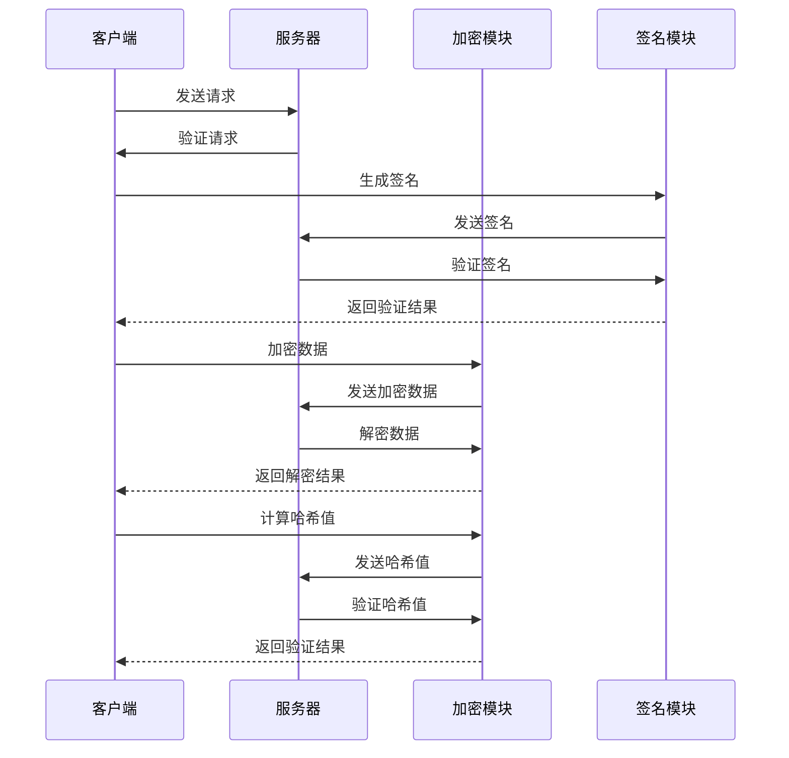

                 

### 文章标题

### 关键词
类型论、数学交流、专业化、障碍、解决方案

### 摘要
本文深入探讨了类型论在数学交流中的障碍及其专业化带来的代价。首先，我们介绍了类型论的基本概念、发展历程及其在数学中的应用。接着，我们分析了类型论在数学交流中的具体障碍，包括概念理解、表达复杂性和理解偏差等。通过具体案例分析，我们揭示了这些障碍的成因及其影响。随后，我们提出了简化表述、提高交流有效性和跨学科合作等解决方案。最后，我们探讨了类型论专业化的代价，分析了专业化带来的利弊，并提供了相应的案例分析。本文旨在为类型论在数学交流中的障碍提供系统性思考，为未来的研究和实践提供参考。

## 第一部分：问题背景与核心概念

### 引言

类型论（Type Theory）是现代数学和计算机科学中的一个重要分支，起源于19世纪末，经过几十年的发展，已成为逻辑、数学基础、编程语言设计等多个领域的重要工具。类型论的核心思想是通过引入“类型”这一概念，为各种数学对象和编程语言元素提供严格的分类和类型检查，从而确保形式系统的正确性和一致性。

然而，随着类型论在数学和计算机科学中的广泛应用，其在数学交流中也遇到了一系列障碍。这些障碍不仅影响了对类型论的理解和掌握，也阻碍了类型论在不同学科之间的交流与融合。本文将深入探讨这些障碍，分析其成因和影响，并提出相应的解决方案。

首先，我们需要理解类型论的基本概念。类型论中的“类型”是一个抽象的集合，用于描述数学对象或编程语言元素的属性和特征。类型可以分为基本类型（如整数、实数等）和构造类型（如函数类型、列表类型等）。通过类型，我们可以为数学表达式和编程语句提供语义上的约束和检查，确保其在形式系统中的合法性。

其次，类型论在数学中的应用十分广泛。在数学逻辑中，类型论提供了形式化数学的基础，使得数学证明可以更加严谨和可靠。在编程语言设计中，类型论被广泛应用于静态类型语言，如Haskell、ML和Coq等，这些语言通过类型系统确保程序的正确性和安全性。

然而，类型论在数学交流中的障碍也是不可忽视的。一方面，类型论中的概念和表述相对复杂，对于初学者来说难以理解。另一方面，不同领域的学者在交流时往往采用各自的专业术语和表达方式，导致沟通障碍。此外，类型论的专业化也使得不同领域之间的交流变得更加困难，专业化的代价在一定程度上影响了数学交流的广泛性和有效性。

本文旨在通过深入分析类型论在数学交流中的障碍，探讨其专业化带来的代价，并提出相应的解决方案，以促进类型论在数学领域内的交流与应用。

### 核心概念

在探讨类型论在数学交流中的障碍之前，首先需要明确几个核心概念，这些概念是理解类型论的基础，也是分析障碍和提出解决方案的关键。

**类型（Type）**：类型是类型论中最基本的概念，用于表示数学对象或编程语言元素的分类。类型定义了对象或元素的操作集合和语义属性。在形式系统中，类型通过一组规则来定义，这些规则确保类型的合法性和一致性。

**类型系统（Type System）**：类型系统是一组规则和约束，用于为形式系统中的元素分配类型，并确保在运算和推导过程中保持类型的正确性。类型系统可以分为静态类型系统和动态类型系统。静态类型系统在编译时检查类型，而动态类型系统则在运行时进行类型检查。

**类型检查（Type Checking）**：类型检查是类型系统中的一个关键过程，用于验证程序中的表达式是否遵循类型规则。类型检查确保程序的合法性，防止类型错误的发生。

**类型安全（Type Safety）**：类型安全是指程序在运行过程中不会因为类型错误而导致崩溃或不可预期的行为。类型安全通过类型系统来实现，确保在类型检查期间发现的类型错误不会在程序执行时出现。

**类型等价（Type Equivalence）**：类型等价是指两个类型在语义上具有相同属性，可以互相转换而不影响程序的正确性。类型等价是类型系统中一个重要的概念，它允许类型之间的兼容性和互操作性。

**类型推导（Type Inference）**：类型推导是类型系统中的一个过程，用于自动推断表达式的类型，而无需显式指定类型。类型推导可以减少程序中的冗余代码，提高代码的可读性和可维护性。

**类型错误（Type Error）**：类型错误是指程序中违反类型规则的情况，可能导致运行时错误或异常。类型错误通常由类型检查过程发现，并需要通过修正代码来解决。

**模式匹配（Pattern Matching）**：模式匹配是一种用于处理变量值的结构化方法，通过将变量值与预定义的模式进行匹配，执行相应的操作。模式匹配在函数式编程语言中广泛应用，是类型论中的重要工具。

**依赖类型（Dependent Type）**：依赖类型是一种能够根据表达式值来定义类型的类型系统。依赖类型使得类型和值之间的关系更加紧密，可以表达复杂的逻辑和数学关系。

**类型论与范畴论（Category Theory）**：类型论和范畴论有密切的关系。范畴论提供了类型论的数学框架，使得类型论中的概念和证明可以更加形式化和抽象。

通过理解这些核心概念，我们可以更好地把握类型论的基本原理和其在数学交流中的重要性，也为后续探讨障碍和解决方案提供了理论基础。

### 类型论的定义与历史

类型论（Type Theory）是一种形式化数学的方法，旨在通过引入“类型”的概念来对数学对象和编程语言元素进行分类和约束，从而确保形式系统的正确性和一致性。类型论的发展经历了几个关键阶段，其起源可以追溯到19世纪末。

**起源与发展**

类型论的萌芽可以追溯到19世纪末，当时的数学家开始关注数学基础的问题，特别是在形式化数学和证明验证方面。其中，德国数学家贝塞尔（Burali-Forti）和意大利数学家皮亚诺（Peano）的工作对类型论的初步发展产生了重要影响。贝塞尔提出了自然数的一阶形式化表示，而皮亚诺则提出了自然数的一阶公理化定义。

真正推动类型论发展的是荷兰数学家卢卡谢维奇（Lukasiewicz），他在20世纪20年代提出了谓词逻辑的层次结构，这为类型论的建立提供了理论基础。随后，瑞士数学家白塞尔（Bertini）在1930年提出了“类型论”这一术语，并进一步探讨了类型论的应用。

20世纪40年代，类型论得到了计算机科学领域的关注，特别是由逻辑学家和计算机科学家艾伦·图灵（Alan Turing）和艾萨克·牛顿（Isaac Newton）的工作。图灵通过构建“图灵机”模型，为计算机科学提供了基础理论，而牛顿则在编译器和编程语言设计中引入了类型系统。

**类型论的关键里程碑**

1. **构造性类型论（Constructive Type Theory）**：构造性类型论是由瑞士数学家马克斯·诺德斯特龙姆（Max Nordström）和彼得·斯图尔特（Peter-Stuart）在20世纪50年代提出的。构造性类型论强调通过构造性证明来证明数学命题，这与直觉主义逻辑（Intuitionistic Logic）密切相关。构造性类型论为形式化数学和计算机科学提供了重要的基础。

2. **依赖类型论（Dependent Type Theory）**：依赖类型论是由马丁·劳伦斯·罗宾逊（Martin-Löf）在20世纪70年代提出的。依赖类型论扩展了构造性类型论，允许类型依赖于值，从而可以表达更复杂的数学和编程结构。依赖类型论在编程语言Haskell和Coq中得到了广泛应用。

3. **简化逻辑（Calculus of Constructions）**：简化逻辑是由罗宾逊在20世纪80年代提出的，是一种形式化逻辑系统，用于证明复杂数学命题。简化逻辑结合了构造性类型论和依赖类型论的特点，为形式化数学提供了强大的工具。

**类型论的应用与发展**

类型论在数学和计算机科学中有着广泛的应用。在数学领域，类型论提供了形式化数学的基础，使得数学证明可以更加严谨和可靠。例如，形式化证明项目如“四色定理的证明”和“费马大定理的证明”都使用了类型论的方法。

在计算机科学领域，类型论在编程语言设计、编译器优化和形式验证等方面发挥着重要作用。静态类型语言如Haskell、ML和Coq通过类型系统提高了程序的正确性和安全性。类型论还在人工智能、形式化验证和区块链等领域有重要应用。

随着形式化数学和形式验证技术的发展，类型论将继续在数学和计算机科学中发挥关键作用。未来，类型论的研究可能会进一步拓展到其他领域，如量子计算和系统生物学，为这些领域提供形式化建模和验证的工具。

总之，类型论的发展经历了从数学基础到计算机科学应用的漫长历程，其在数学交流中的作用日益凸显。通过深入理解类型论的定义和历史，我们可以更好地把握其在数学交流中的障碍和专业化带来的代价，为未来的研究和实践提供指导。

### 类型论的基本原理

类型论的基本原理是通过引入“类型”的概念，为数学对象和编程语言元素提供严格的分类和约束，从而确保形式系统的正确性和一致性。以下是类型论的基本原理的详细阐述：

**1. 类型系统的定义**

类型系统是一组规则和约束，用于为形式系统中的元素分配类型，并确保在运算和推导过程中保持类型的正确性。类型系统可以分为静态类型系统和动态类型系统。静态类型系统在编译时进行类型检查，而动态类型系统在运行时进行类型检查。

**2. 基本类型的定义**

基本类型是类型系统中的基础类型，用于表示最简单的数据结构。常见的基本类型包括整数（Integer）、实数（Real）、布尔值（Boolean）和字符串（String）等。基本类型可以直接表示具体的数学对象或编程语言中的数据。

**3. 构造类型的定义**

构造类型是通过组合基本类型或其他构造类型构建出的复杂类型。常见的构造类型包括函数类型（Function Type）、列表类型（List Type）、集合类型（Set Type）和映射类型（Map Type）等。构造类型可以表示复杂的数学结构和编程语言中的高级数据结构。

**4. 类型检查**

类型检查是类型系统中的一个关键过程，用于验证程序中的表达式是否遵循类型规则。类型检查确保程序的合法性，防止类型错误的发生。类型检查可以分为静态类型检查和动态类型检查。静态类型检查在编译时进行，而动态类型检查在运行时进行。

**5. 类型等价**

类型等价是指两个类型在语义上具有相同属性，可以互相转换而不影响程序的正确性。类型等价是类型系统中一个重要的概念，它允许类型之间的兼容性和互操作性。类型等价可以通过类型转换（Type Conversion）实现。

**6. 类型推导**

类型推导是类型系统中的一个过程，用于自动推断表达式的类型，而无需显式指定类型。类型推导可以减少程序中的冗余代码，提高代码的可读性和可维护性。类型推导可以分为显式类型推导和隐式类型推导。

**7. 模式匹配**

模式匹配是一种用于处理变量值的结构化方法，通过将变量值与预定义的模式进行匹配，执行相应的操作。模式匹配在函数式编程语言中广泛应用，是类型论中的重要工具。

**8. 依赖类型**

依赖类型是一种能够根据表达式值来定义类型的类型系统。依赖类型使得类型和值之间的关系更加紧密，可以表达复杂的逻辑和数学关系。依赖类型在构造性类型论和依赖类型论中得到了广泛应用。

**9. 类型安全**

类型安全是指程序在运行过程中不会因为类型错误而导致崩溃或不可预期的行为。类型安全通过类型系统来实现，确保在类型检查期间发现的类型错误不会在程序执行时出现。

**10. 形式化数学**

形式化数学是通过形式化方法对数学概念和证明进行严格表述和验证的数学分支。类型论为形式化数学提供了基础，使得数学证明可以更加严谨和可靠。

通过理解这些基本原理，我们可以更好地把握类型论的核心概念和其在数学和编程中的应用。这些原理不仅为类型论的研究提供了理论基础，也为实际应用中的类型系统设计提供了指导。

### 类型论的主要类型

类型论中的类型系统是构建其理论基础的核心部分，不同类型的定义和特性使得类型论能够有效地满足数学和编程语言中的多样化需求。以下是类型论中主要类型的详细解释，包括基本类型和构造类型。

**基本类型（Basic Types）**

基本类型是类型系统中最基础的类型，它们通常直接对应于具体的数学对象或编程语言中的基础数据结构。以下是几种常见的基本类型：

1. **整数类型（Integer Type）**：整数类型表示整数，包括正整数、负整数和零。在数学中，整数是基本的算术对象，而在编程中，整数类型是大多数编程语言的核心数据类型之一。

2. **实数类型（Real Type）**：实数类型表示实数，包括有理数和无理数。实数类型在数学中具有广泛的用途，尤其是在分析和几何领域。在编程中，实数类型通常用于表示浮点数。

3. **布尔类型（Boolean Type）**：布尔类型表示布尔值，即真（True）和假（False）。布尔类型是逻辑运算的基础，广泛应用于条件判断和逻辑表达式中。

4. **字符类型（Character Type）**：字符类型表示单个字符，如字母、数字和特殊符号。字符类型在文本处理和字符串操作中非常重要。

5. **字符串类型（String Type）**：字符串类型表示一系列字符的序列，是文本数据的标准表示形式。在编程中，字符串类型广泛用于输入输出、文件处理和用户界面展示。

**构造类型（Constructed Types）**

构造类型是由基本类型或其他构造类型组合而成的复杂类型。构造类型能够表示更复杂的数学结构和编程语言中的高级数据结构。以下是几种常见的构造类型：

1. **函数类型（Function Type）**：函数类型表示一个函数，它接受一个或多个参数，并返回一个结果。在数学中，函数是一种关系，而在编程中，函数类型是函数式编程语言的核心类型。

2. **列表类型（List Type）**：列表类型表示一系列元素的集合，元素可以是任何类型。列表类型在数学和编程中都有广泛的应用，用于表示序列和数据结构。

3. **集合类型（Set Type）**：集合类型表示一组不重复元素的集合。集合类型在数学中用于集合运算，如并集、交集和差集。在编程中，集合类型通常用于实现集合操作和数据结构。

4. **映射类型（Map Type）**：映射类型表示键值对的集合，其中每个键对应一个值。映射类型在数学和编程中都有应用，用于表示关联数据和映射关系。

5. **记录类型（Record Type）**：记录类型表示一组命名字段的数据结构，每个字段可以具有不同的类型。记录类型在编程中用于表示复杂数据对象和结构化数据。

**类型之间的关系**

在类型论中，不同类型之间可以通过类型构造操作进行组合。以下是一些常见的类型组合操作：

1. **类型组合（Type Composition）**：类型组合是将两个或多个类型组合成一个新的类型。例如，函数类型可以将输入类型和输出类型组合在一起。

2. **类型嵌套（Type Nesting）**：类型嵌套是将一个类型作为另一个类型的字段。例如，记录类型可以通过嵌套其他类型来表示复杂的数据结构。

3. **类型转换（Type Conversion）**：类型转换是将一个类型转换为另一个类型的过程。类型转换可以是显式的，也可以是隐式的。显式类型转换通常通过类型转换运算符或函数实现，而隐式类型转换则由类型系统自动进行。

通过理解基本类型和构造类型的定义及其组合方式，我们可以更好地理解和应用类型论在数学和编程中的各种场景。不同类型的定义和特性使得类型论能够为形式化数学和编程语言设计提供强大的工具，确保系统的正确性和一致性。

### 模式匹配与类型判断

模式匹配和类型判断是类型论中至关重要的概念，它们在确保形式化数学和编程语言中的正确性和一致性方面发挥着重要作用。模式匹配是一种结构化方法，用于处理变量值，而类型判断则是用于验证表达式类型是否符合类型规则。

**模式匹配（Pattern Matching）**

模式匹配是一种将变量值与预定义的模式进行匹配，并根据匹配结果执行相应操作的过程。在函数式编程语言中，模式匹配是一种常见的数据处理方式，它可以提高代码的可读性和可维护性。模式匹配通常包括以下几种形式：

1. **简单模式匹配**：简单模式匹配是最基本的形式，它将变量值与一个具体的值进行比较。例如，在Haskell语言中，可以使用`==`运算符进行简单模式匹配。

   ```haskell
   match x with
       | x == 0 -> "Zero"
       | x == 1 -> "One"
       | otherwise -> "Other"
   ```

2. **复杂模式匹配**：复杂模式匹配可以处理更复杂的值，包括列表、记录和元组等。复杂模式匹配通过递归和嵌套结构来匹配复杂的值。

   ```haskell
   match (x, y) with
       | (x, y) == (1, 2) -> "Tuple (1, 2)"
       | (x, y) == (3, 4) -> "Tuple (3, 4)"
       | otherwise -> "Other Tuple"
   ```

3. **模式匹配结合函数**：模式匹配可以与函数结合使用，通过模式匹配的结果来选择不同的函数实现。这种结合方式在函数式编程中非常常见。

   ```haskell
   match value with
       | isEven value -> evenFunction value
       | isOdd value -> oddFunction value
   ```

**类型判断（Type Checking）**

类型判断是类型系统中用于验证表达式类型是否满足类型规则的过程。类型判断通常在编译时或运行时进行，以确保程序的正确性和安全性。类型判断可以分为以下几种形式：

1. **静态类型判断**：静态类型判断在编译时进行，通过类型检查器来验证表达式的类型。静态类型系统的优点是可以在编译时发现类型错误，从而减少运行时的错误。

   ```haskell
   let x = 5
   in x + 1  -- 静态类型检查器将确定x的类型为整数，表达式类型为整数
   ```

2. **动态类型判断**：动态类型判断在运行时进行，通过运行时检查来验证表达式的类型。动态类型系统的优点是提供了更大的灵活性和可扩展性，但可能会导致运行时的错误。

   ```python
   x = 5
   y = "hello"
   z = x + y  # 动态类型检查将在运行时抛出类型错误
   ```

3. **类型推断**：类型推断是类型判断的一种形式，用于自动推断表达式的类型，而无需显式指定类型。类型推断可以减少代码的冗余，提高代码的可读性。

   ```haskell
   let x = "Hello, World!"
   in length x  -- 类型推断器将推断x的类型为字符串，表达式类型为整数
   ```

**模式匹配与类型判断的关系**

模式匹配和类型判断在类型论中是密切相关的。模式匹配通常用于处理变量值，而类型判断则用于确保变量值的类型符合预期。以下是一个具体的例子：

```haskell
data Color = Red | Green | Blue

match color with
    | Red -> "This is Red"
    | Green -> "This is Green"
    | Blue -> "This is Blue"

-- 类型判断
isColor color = match color with
    | Red -> True
    | Green -> True
    | Blue -> True
    | _ -> False
```

在这个例子中，模式匹配用于处理`color`变量的值，并返回相应的字符串。同时，类型判断函数`isColor`用于验证`color`变量的类型是否为`Color`类型。

总之，模式匹配和类型判断是类型论中不可或缺的概念，它们通过结构化方法和类型检查确保形式化数学和编程语言的正确性和一致性。通过理解这些概念，我们可以更有效地处理变量值和验证表达式类型，从而提高程序的质量和可靠性。

### 类型等价与类型转化

类型等价（Type Equivalence）是类型论中的一个核心概念，它定义了两个类型在语义上的等价性。类型等价不仅允许不同类型之间的互操作性，还使得类型转化变得更加方便和有效。类型等价通常通过类型等价关系（Type Equivalence Relation）来定义，这个关系满足自反性、对称性和传递性。

**定义与性质**

类型等价关系通常表示为`≡`，对于任意两个类型`A`和`B`，如果它们满足以下条件，则称`A`和`B`类型等价：

1. **自反性**：对于任意类型`A`，有`A ≡ A`。
2. **对称性**：如果`A ≡ B`，则`B ≡ A`。
3. **传递性**：如果`A ≡ B`且`B ≡ C`，则`A ≡ C`。

这些性质确保了类型等价关系的一致性和合理性。

**类型等价的实际应用**

类型等价在实际编程和数学应用中具有广泛的应用，以下是一些具体的应用实例：

1. **函数类型等价**：在函数类型中，两个函数类型`A → B`和`C → D`是等价的，当且仅当存在一个函数`f`，使得对于所有`x`，`f(x) : A`当且仅当`f(x) : B`，并且存在一个函数`g`，使得对于所有`y`，`g(y) : C`当且仅当`g(y) : D`。

2. **类型转化**：类型等价关系使得不同类型之间的转化变得更加方便。例如，在编程语言中，可以通过类型转换操作将一个类型转化为与其等价的其他类型。这种转化不仅方便编程，还可以提高代码的可读性和可维护性。

3. **抽象数据类型**：在抽象数据类型（Abstract Data Type）中，类型等价关系用于定义类型的内部表示和外部接口之间的等价性。这种等价性确保在实现细节发生变化时，外部使用者的代码不需要进行修改。

**类型转化**

类型转化（Type Conversion）是将一个类型的值转换为另一个类型的值的过程。类型转化可以分为以下几种形式：

1. **显式类型转化**：显式类型转化是程序员明确指定类型的转化操作。例如，在Haskell语言中，可以使用`fromIntegral`函数将整数类型转换为实数类型。

   ```haskell
   let x = 5
   in fromIntegral x  -- 将整数x转化为实数
   ```

2. **隐式类型转化**：隐式类型转化是类型系统自动进行的类型转化。例如，在Python语言中，不同类型的数值可以直接进行运算，类型系统会自动进行相应的类型转化。

   ```python
   x = 5
   y = 3.14
   z = x + y  # 类型系统将自动将x和y进行类型转化，以便进行加法运算
   ```

3. **通用类型转化**：通用类型转化是类型转化的一种特殊形式，它通过通用函数或类型转换器将不同类型的值转化为一个通用类型。这种转化通常在函数式编程语言中广泛应用。

   ```haskell
   convert :: (Integral a, RealFrac b) => a -> b
   convert x = fromIntegral x / 1  -- 将整数x转化为实数
   ```

**等价性与转化**

类型等价与类型转化密切相关。类型等价为类型转化提供了理论基础，确保类型转化不会破坏值的语义。类型等价性可以简化类型转化操作，使得类型转化更加直观和方便。

例如，在函数式编程中，我们可以通过类型等价性将不同的函数类型转化为通用函数类型，从而简化编程和类型检查。

总之，类型等价和类型转化是类型论中的重要概念，它们通过定义类型的等价性和提供类型转化操作，确保了形式化数学和编程语言中的正确性和一致性。理解这些概念，可以帮助我们更好地处理不同类型之间的关系，提高代码的质量和可靠性。

### 类型论在数学中的应用

类型论在数学中扮演着至关重要的角色，其应用不仅限于形式化数学和证明验证，还涉及逻辑、代数、几何等多个数学分支。以下是类型论在数学中应用的一些具体例子。

**形式化数学**

形式化数学是通过形式化方法对数学概念和证明进行严格表述和验证的数学分支。类型论为形式化数学提供了基础，使得数学证明可以更加严谨和可靠。Coq和Agda等形式化证明系统就是基于类型论构建的。

例如，Coq系统使用类型论中的依赖类型来表示数学证明，通过类型检查器验证证明的正确性。形式化证明项目如“四色定理的证明”和“费马大定理的证明”都使用了类型论的方法，这些证明不仅确保了结果的正确性，还提高了数学证明的可信度。

**逻辑**

类型论在逻辑中的应用主要体现在逻辑系统形式化方面。类型论提供了形式化逻辑系统，如简化逻辑和依赖类型逻辑，这些系统可以更严格地表述逻辑命题和证明过程。

例如，简化逻辑（Calculus of Constructions）结合了构造性类型论和依赖类型论的特点，用于证明复杂的数学命题。依赖类型逻辑则通过依赖类型来表达命题之间的依赖关系，使得逻辑证明更加形式化和严谨。

**代数**

类型论在代数中的应用主要体现在代数结构的分类和验证方面。类型论为代数结构提供了严格的定义和分类，使得代数结构的证明和验证可以更加形式化和自动化。

例如，通过类型论，我们可以定义各种代数结构，如群、环、域等，并通过类型检查器验证这些结构的性质和运算规则。这种形式化的方法不仅提高了代数理论的可信度，也为计算机辅助代数研究提供了强大的工具。

**几何**

类型论在几何中的应用主要体现在几何对象的表示和证明方面。类型论可以用来表示几何对象，如点、线、面等，并通过依赖类型来表达几何关系和证明过程。

例如，在计算机图形学中，类型论被用于表示几何形状和计算几何算法，从而提高了几何处理的精确性和效率。在几何证明中，类型论可以帮助验证几何命题的正确性，从而确保几何理论的严谨性。

**数学建模**

类型论在数学建模中的应用主要体现在提供形式化的数学模型，这些模型可以用于解决实际问题。例如，在系统生物学中，类型论可以用来表示生物系统中的各种实体和关系，并通过形式化证明来验证模型的有效性和准确性。

**数学教育**

类型论在数学教育中的应用主要体现在提高学生的逻辑思维和证明能力。通过类型论，学生可以更直观地理解数学概念和证明过程，从而提高数学学习的效果。

例如，在数学课程中，教师可以使用依赖类型逻辑来讲解复杂的数学命题和证明过程，帮助学生更好地掌握数学知识。此外，形式化证明系统如Coq和Agda还可以用于数学课程的设计和评估，从而提高数学教育质量。

总之，类型论在数学中的应用非常广泛，其形式化、逻辑化和结构化的特点为数学研究、证明验证、数学建模和数学教育提供了强大的工具和方法。通过深入理解类型论在数学中的应用，我们可以更好地发挥其在各个数学分支中的作用，推动数学科学的发展。

### 专业化的利与弊

专业化在现代学术界和工业界中占据了重要地位，它使得研究人员和工程师能够深入掌握特定领域的知识和技术，从而提高研究和开发的效率。然而，专业化也带来了显著的利与弊，这些影响在数学交流中尤为显著。

**专业化的优势**

1. **深入研究和突破**：专业化使得研究人员能够将时间和精力集中在特定领域，从而深入挖掘和解决复杂问题。通过专业化，研究人员可以积累丰富的经验和专业知识，推动该领域的创新和突破。

2. **提高效率和生产力**：专业化提高了个人和团队的工作效率。在专业化分工的背景下，团队成员各自负责特定的任务和领域，从而减少了不必要的重复劳动和沟通成本，提高了整体生产力和项目进展速度。

3. **促进知识积累和传承**：专业化有助于知识积累和传承。在一个特定领域中，经过多年的研究和实践，研究人员会形成一套系统化的知识体系和方法论，这些宝贵的经验可以传给下一代研究者，推动领域的发展。

**专业化的劣势**

1. **交流障碍**：专业化带来的一大劣势是交流障碍。不同专业之间的语言和概念差异使得跨学科的交流变得复杂和困难。研究人员在特定领域积累了大量的专业术语和理论，但这些术语和理论对于其他领域的研究者来说可能是晦涩难懂的。

2. **知识孤立**：专业化可能导致知识孤立。在一个特定领域中，研究人员可能会过度关注细节和特定问题，而忽视了更广泛的理论和视角。这种孤立性可能阻碍了不同领域之间的知识和技术的交流与融合，限制了创新的广度和深度。

3. **创新受限**：专业化也可能限制了创新的广度和深度。在一个特定领域中，研究人员可能会过度依赖现有的理论和方法，忽视了跨学科的新思路和新方法。这种依赖性可能导致创新受限，无法充分利用其他领域的技术和知识。

**专业化对数学交流的阻碍**

在数学交流中，专业化的影响尤为显著。以下是专业化对数学交流的具体阻碍：

1. **专业术语的使用**：专业术语和符号的广泛应用使得数学文献和学术交流变得复杂。这些专业术语对于领域内的研究人员来说可能是熟悉的，但对于跨领域的研究者或初学者来说可能是难以理解的。

2. **知识的隔阂**：不同数学分支之间的隔阂加剧了数学交流的难度。每个数学分支都有自己独特的概念和理论体系，这使得不同分支之间的知识难以互通。例如，纯数学和应用数学之间的隔阂使得两者之间的交叉研究变得困难。

3. **研究方法的差异**：专业化的研究方法可能导致不同数学领域之间的方法差异。例如，在纯粹的理论研究中，证明和逻辑推理是主要方法，而在应用研究中，建模和实验验证是主要方法。这些差异增加了跨领域交流的难度。

4. **专业化的代价**：专业化带来的知识孤立和交流障碍使得数学研究面临专业化的代价。研究人员可能需要花费大量时间来学习其他领域的知识，以便进行跨学科的交流和研究，这增加了研究成本和时间。

总之，专业化在数学交流中既有其优势也有其劣势。为了克服专业化的阻碍，我们需要寻找平衡点，提高不同数学领域之间的交流与合作，推动数学科学的整体进步。通过跨学科合作和共享知识，我们可以充分利用专业化的优势，克服其劣势，促进数学交流的发展。

### 专业化环境中的类型论适应性

在专业化环境中，类型论的应用和适应性面临着一系列挑战。虽然类型论为数学和计算机科学提供了强大的工具，但其在不同专业领域的应用和推广仍需克服诸多障碍。

**学术研究中的类型论应用**

在学术研究领域，类型论的应用主要体现在形式化证明和逻辑推理方面。形式化证明系统如Coq和Agda通过依赖类型论的方法，提供了严格的数学证明环境。这些系统使得研究人员能够以形式化的方式表述和验证数学命题，从而提高证明的可靠性和透明度。

然而，类型论在学术研究中的应用仍面临一些挑战。首先，类型论的复杂性和形式化要求对研究人员的数学和逻辑基础提出了较高要求。许多研究者可能需要花费大量时间学习和掌握类型论的基本概念和工具。其次，类型论的表达能力在某些复杂情况下可能受限，导致形式化证明过程变得繁琐和低效。

为了提高类型论在学术研究中的适应性，研究者可以采取以下措施：

1. **简化类型论教学**：通过开发简化和模块化的类型论教材和课程，降低学习门槛，使更多研究者能够掌握类型论的基本原理和应用。

2. **工具的改进和优化**：不断改进和优化形式化证明系统，提高其易用性和效率。例如，开发更加直观的用户界面、增强自动类型推导功能、优化编译器性能等。

3. **跨学科合作**：鼓励跨学科合作，将类型论与其他数学工具和理论相结合，探索新的应用领域和证明方法。通过跨学科合作，可以充分发挥类型论的潜力，推动数学和计算机科学的发展。

**工业界中的类型论应用**

在工业界，类型论的应用主要集中在编程语言设计和安全验证方面。静态类型语言如Haskell、ML和Coq等，通过类型系统提高了程序的正确性和安全性。类型论在编译器优化、形式验证和安全性分析等方面发挥了重要作用。

然而，类型论在工业界的应用仍面临一些挑战。首先，类型论的复杂性和形式化要求对开发人员的技术水平提出了较高要求。许多工业界开发者可能需要投入大量时间和精力来学习和掌握类型论的核心概念和应用。其次，类型论的应用场景和工具仍需进一步拓展和优化，以满足不同工业应用的需求。

为了提高类型论在工业界的适应性，可以采取以下措施：

1. **简化类型系统**：开发更加简洁和易于使用的类型系统，减少开发人员的负担。例如，通过引入更直观的类型推导机制和简化的类型检查算法，提高开发效率。

2. **工具集成和优化**：将类型论工具集成到现有的软件开发环境中，提高其易用性和集成性。例如，开发与主流编程语言（如C++、Java）兼容的类型检查器和验证工具，使开发者能够轻松地将类型论技术应用于实际项目中。

3. **案例研究**：通过具体案例研究，展示类型论在工业应用中的实际效果和优势。通过案例分析，可以激发工业界对类型论技术的兴趣和需求，推动其更广泛的应用。

总之，类型论在专业化环境中的应用和适应性面临着一系列挑战，但通过简化教学、改进工具和加强跨学科合作，我们可以逐步克服这些障碍，推动类型论在学术研究和工业界中的广泛应用，促进数学和计算机科学的发展。

### 简化类型论的表述

为了克服类型论在数学交流中的障碍，简化类型论的表述是关键一步。这不仅可以降低学习门槛，还能提高不同专业领域之间的沟通效率。以下是一些策略和方法，可以帮助简化类型论的表述。

**1. 教学方法的改进**

（1）**模块化教学**：将类型论的基本概念和原理分解成模块，逐步介绍。每个模块专注于一个特定的主题，使学生能够逐步理解和掌握类型论的核心内容。

（2）**案例教学**：通过具体的案例来展示类型论的应用，让学生在实践中学习类型论。案例教学可以帮助学生更好地理解抽象的概念，并提高其实际应用能力。

（3）**互动式学习**：采用互动式教学方法，如小组讨论、实验室练习和在线问答，激发学生的学习兴趣和参与度。互动式学习可以促进学生之间的交流和知识共享。

**2. 语言和符号的优化**

（1）**使用直观的符号**：选择直观且易于理解的符号和术语来表示类型论中的概念。避免使用过于复杂或难以理解的符号，以免增加学习难度。

（2）**统一术语**：在学术交流和教学中统一使用标准的术语和符号，避免不同领域间的术语冲突和混淆。统一术语有助于提高沟通的效率和质量。

（3）**减少冗余表述**：简化类型论表述中的冗余部分，使内容更加精炼和清晰。通过精简语言，可以减少误解和混淆，提高表述的准确性。

**3. 教学资源的开发**

（1）**开发可视化工具**：利用图形和可视化工具来展示类型论的概念和关系。可视化工具可以帮助学生直观地理解复杂的数学关系，从而提高学习效果。

（2）**制作教学视频**：制作高质量的教学视频，通过动态演示和讲解来帮助学生理解类型论的核心内容。视频教学可以突破时间和空间的限制，为学生提供灵活的学习方式。

（3）**编写教材和指南**：编写简洁明了、内容系统的教材和指南，为学生提供全面的学习资源。教材和指南应该结合具体案例和实践，使学生在理论学习中能够找到实际应用的方向。

**4. 跨学科合作**

（1）**跨学科研讨会**：组织跨学科的研讨会和工作坊，促进不同领域专家之间的交流和合作。通过研讨会，可以分享不同领域的经验和知识，探讨类型论在不同学科中的应用。

（2）**联合研究项目**：开展跨学科的研究项目，将类型论与其他学科的理论和工具相结合，探索新的应用领域和方法。联合研究项目不仅可以推动学科间的交叉融合，还能提高类型论的应用价值。

通过上述策略和方法，我们可以有效地简化类型论的表述，提高其在数学交流中的适用性和可理解性。简化类型论的表述不仅有助于克服数学交流中的障碍，还能促进类型论在更多领域中的应用和发展。

### 提高数学交流的有效性

在数学交流中，提高交流的有效性是一个关键问题，特别是在涉及复杂概念和理论时。以下是一些具体的策略和方法，可以帮助提高数学交流的有效性。

**1. 优化沟通环境**

（1）**建立明确的交流目标**：在数学交流之前，明确交流的目标和内容，确保参与者对讨论的主题有清晰的理解。明确的交流目标有助于减少误解和歧义，提高沟通效率。

（2）**选择合适的交流媒介**：根据交流内容和目标，选择最合适的交流媒介，如面对面会议、电子邮件、在线讨论平台或学术会议。不同的媒介适用于不同的交流场景，可以最大化交流的效果。

（3）**提供丰富的交流资源**：为参与者提供丰富的交流资源，如研究文献、案例分析和工具软件，帮助他们更好地理解和掌握交流内容。这些资源可以增强交流的深度和广度，提高参与者的知识水平。

**2. 改进表述方式**

（1）**使用简单的语言和符号**：在表述数学概念和理论时，使用简单易懂的语言和符号。避免使用过于专业或复杂的术语，以免增加参与者的理解难度。

（2）**提供直观的示例**：通过直观的示例来解释抽象的数学概念和理论。示例可以帮助参与者更好地理解复杂的概念，并通过具体案例来验证理论的正确性。

（3）**采用层次化的表述**：将复杂的数学概念和理论分解成层次化的结构，逐步介绍。这种方法可以帮助参与者逐步理解和掌握复杂的理论，从而提高交流的深度和广度。

**3. 促进互动与反馈**

（1）**鼓励提问和讨论**：在数学交流中，鼓励参与者提问和参与讨论。提问和讨论可以促进思想的碰撞和交流，帮助参与者更好地理解和掌握交流内容。

（2）**提供及时的反馈**：在交流过程中，为参与者提供及时的反馈。反馈可以帮助参与者了解自己的理解是否正确，并在必要时进行调整和纠正。及时的反馈还可以提高交流的透明度和有效性。

（3）**利用互动工具**：利用互动工具，如在线讨论平台、即时通讯工具和虚拟白板等，促进参与者之间的互动和协作。这些工具可以实时记录和分享讨论内容，提高交流的效率和质量。

**4. 强化共同理解**

（1）**建立共同的背景知识**：确保参与者在交流前具有共同的背景知识，特别是在涉及跨学科交流时。共同的背景知识有助于减少误解和歧义，提高交流的效率。

（2）**明确交流的假设和前提**：在交流过程中，明确交流的假设和前提。这有助于确保参与者对交流内容有共同的理解，并在讨论中遵循相同的逻辑框架。

（3）**采用互动式教学方法**：采用互动式教学方法，如小组讨论、案例分析和工作坊等，促进参与者之间的交流和互动。这些教学方法可以帮助参与者更好地理解和掌握交流内容，并培养他们的合作和沟通能力。

通过上述策略和方法，我们可以有效提高数学交流的有效性，促进不同领域之间的知识共享和合作。提高数学交流的有效性不仅有助于解决数学交流中的障碍，还能推动数学科学的发展和创新。

### 跨学科合作的重要性

在类型论的发展和应用过程中，跨学科合作扮演着至关重要的角色。不同学科之间的合作不仅有助于解决单一学科内的复杂问题，还能推动新理论的诞生和技术的进步。以下从实际案例、合作模式和成功经验等方面，探讨跨学科合作在类型论中的应用。

**实际案例**

1. **数学与计算机科学的结合**：类型论最初由数学家提出，但在计算机科学领域得到了广泛应用。例如，在编译器和编程语言设计中，类型论提供了严格的数据类型检查和错误检测机制。Coq和Agda等形式化证明系统就是在数学家和计算机科学家共同努力下诞生的。这些系统通过类型论的方法，实现了高度可靠和自动化的数学证明，从而推动了计算机辅助证明技术的发展。

2. **逻辑与哲学的交汇**：类型论在逻辑和哲学领域也有重要应用。哲学家和逻辑学家利用类型论的方法，探讨推理和证明的严格性，促进了形式逻辑和直觉主义逻辑的发展。类型论在这些领域中的成功应用，不仅丰富了逻辑和哲学的理论体系，还为其他学科提供了新的思考工具。

3. **物理学与数学的结合**：在量子物理学中，类型论被用来形式化量子力学的基本原理。量子计算领域的研究人员通过引入类型论的概念，建立了量子类型论，为量子算法的设计和验证提供了理论基础。这一跨学科合作的成功案例，展示了类型论在复杂物理系统中的应用潜力。

**合作模式**

1. **共同研究项目**：跨学科合作通常通过共同研究项目来实现。例如，数学家和计算机科学家可以合作开展形式化验证项目，通过类型论的方法验证软件和硬件系统的正确性。这种合作模式不仅可以充分利用各学科的优势，还能培养跨学科的研究人才。

2. **学术会议和研讨会**：学术会议和研讨会是促进跨学科交流的重要平台。在这些活动中，不同学科的专家可以分享研究成果、探讨合作机会，并共同解决复杂问题。通过这些活动，可以建立稳定的合作关系，推动跨学科研究的深入发展。

3. **交叉学科研究中心**：建立交叉学科研究中心，是推动跨学科合作的长效机制。这些研究中心可以汇集不同学科的研究人员，共同开展跨学科研究项目，促进知识的交流和融合。例如，许多大学和研究机构已经建立了数学与计算机科学、逻辑与哲学、物理学与数学等交叉学科研究中心，取得了显著的研究成果。

**成功经验**

1. **共享知识和资源**：成功的跨学科合作通常基于共享知识和资源。通过建立共享的知识库和数据库，研究人员可以方便地获取其他学科的研究成果和资源，提高研究的效率和质量。例如，Coq和Agda等形式化证明系统，通过开放源代码和丰富的文档，为全球的研究人员和开发者提供了宝贵的资源。

2. **团队合作和沟通**：成功的跨学科合作需要团队合作和有效的沟通。团队成员需要具备跨学科的知识和技能，能够理解并融合不同学科的理论和方法。同时，通过建立良好的沟通机制和合作文化，可以确保团队成员之间的有效协作和知识共享。

3. **项目管理和协调**：跨学科合作通常涉及多个学科和研究团队，项目管理和协调至关重要。通过有效的项目管理和协调，可以确保项目的进度、质量和合作效率。例如，采用敏捷开发方法、定期项目评审和跨学科团队会议等，都是有效的项目管理和协调策略。

总之，跨学科合作在类型论的发展和应用中发挥了重要作用。通过实际案例、合作模式和成功经验的探讨，我们可以看到跨学科合作在解决复杂问题、推动新理论诞生和提升技术进步方面的巨大潜力。未来，随着跨学科研究的不断深入，类型论的应用领域将更加广泛，为数学和计算机科学的发展作出更大的贡献。

### 教育领域的应用

在数学教育领域，类型论的应用正逐渐显现出其独特的优势，尤其是在提高学生逻辑思维能力和培养形式化数学证明技巧方面。以下是一些具体案例，展示了类型论在教育领域中的应用效果。

**1. 形式化证明教学**

类型论提供了一个强大的工具，用于形式化数学证明的教学。通过类型论的方法，学生可以学习如何使用形式化的语言来表述和验证数学命题。例如，在课程中引入Coq或Agda这样的形式化证明系统，学生可以通过编写证明脚本，逐步掌握数学证明的严格性和逻辑性。

具体案例：在一所大学的数学系中，教授引入了Coq作为形式化证明课程的工具。学生通过学习Coq的基本语法和证明策略，完成了多个数学命题的证明，如群、环、域的基本性质和定理。通过这种实践，学生不仅掌握了形式化证明的基本技巧，还提高了其逻辑推理能力和证明思维能力。

**2. 逻辑与类型论的结合**

逻辑是数学教育的重要组成部分，而类型论提供了形式逻辑的严谨表述。将类型论与逻辑教学相结合，可以为学生提供更深入的理解和更广泛的逻辑工具。

具体案例：在一所中学的数学课程中，教师引入了类型论的概念，通过讨论依赖类型和类型转换，帮助学生理解命题逻辑和谓词逻辑的抽象概念。通过具体例子，如类型等价和模式匹配，学生能够将逻辑理论应用到实际问题中，提高了逻辑思考的灵活性和深度。

**3. 编程语言的引入**

类型论在编程语言设计和教学中的应用，为学生提供了一个理论与实践相结合的平台。通过学习静态类型语言，如Haskell或ML，学生不仅可以掌握编程的基本技能，还能深入理解类型系统的原理和重要性。

具体案例：在一所理工科大学的计算机科学课程中，教师引入了Haskell作为编程语言。学生通过学习Haskell的类型系统，了解了函数类型、构造类型和类型推导等概念。在此基础上，学生完成了多个编程项目，如实现排序算法、构建数据结构等，通过这些项目，学生不仅提高了编程能力，还加深了对类型论的理解。

**4. 多学科融合的跨学科课程**

跨学科课程是一种有效的方式，将数学、逻辑和计算机科学等多个学科的知识融合在一起，培养学生全面的能力。

具体案例：在一所综合性大学的跨学科课程中，数学、计算机科学和哲学等多个学科的教师共同设计了一门“形式化数学与逻辑”课程。课程内容包括形式系统、类型论、证明理论和逻辑推理。通过这种跨学科学习，学生不仅掌握了数学和逻辑的基本理论，还学习了如何将这些理论应用于实际问题和编程任务中。

**应用效果**

类型论在数学教育中的应用，取得了显著的成果：

1. **提高逻辑思维能力**：通过形式化的证明和类型推导，学生能够更加严格和系统地思考问题，提高了逻辑推理和证明能力。

2. **加深对数学概念的理解**：类型论提供了一种形式化的表述方式，帮助学生更深入地理解数学概念和定理，从而提高了数学素养。

3. **培养编程能力**：类型论在编程中的应用，为学生提供了一个学习和实践的平台，提高了学生的编程技能和代码质量。

4. **促进跨学科合作**：跨学科课程的设置，促进了不同学科之间的知识交流和合作，培养了学生的综合素质和创新能力。

总之，类型论在教育领域的应用，不仅为数学和计算机科学的教学提供了新的方法和工具，还为学生提供了更广阔的学习视野和更深入的理解能力。通过具体的案例和应用效果，我们可以看到类型论在数学教育中的巨大潜力和广阔前景。

### 科研交流中的应用

在科研交流中，类型论的应用极大地提升了交流的准确性和一致性，通过形式化表述和验证，使得复杂的研究成果能够更清晰地传达和验证。以下是类型论在科研交流中的应用案例及其效果分析。

**案例一：形式化数学证明**

形式化证明是类型论在科研交流中的一个重要应用。通过形式化证明系统，如Coq和Isabelle，科研人员可以将复杂的数学证明表述为计算机可验证的形式，从而确保证明的准确性和可靠性。

具体案例：在一项关于图论的研究中，科研人员使用Coq构建了一个形式化的证明，验证了某个图论定理的正确性。通过形式化证明，研究人员不仅能够清晰地展示证明步骤，还可以通过计算机验证证明的每个细节，确保结论的准确性。这种形式化的表述不仅提高了证明的透明度，还减少了错误的可能性。

**效果分析**：
- **准确性**：形式化证明确保了证明的每一步都是严格和准确的，避免了传统证明中的逻辑漏洞和错误。
- **一致性**：通过形式化的表述，研究人员能够在不同时间、不同地点重复验证证明，确保结论的一致性。
- **可复现性**：形式化证明使得研究过程和结果具有更高的可复现性，其他研究人员可以轻松地验证和理解研究成果。

**案例二：安全验证**

类型论在软件和系统安全验证中也有广泛应用。通过引入类型系统，研究人员可以验证软件的正确性和安全性，确保系统在运行过程中不会出现安全漏洞。

具体案例：在一项关于区块链安全的研究中，科研人员使用类型论的方法，构建了一个形式化的区块链模型，并验证了其安全性和鲁棒性。通过类型检查，研究人员能够确保区块链中的每一步操作都符合预定的安全规则，从而防止恶意攻击和数据篡改。

**效果分析**：
- **安全性**：类型系统提供了严格的类型检查，确保系统在运行时不会出现类型错误，提高了系统的安全性。
- **可靠性**：形式化的验证方法确保了系统设计的正确性，减少了错误和漏洞的风险。
- **可维护性**：通过形式化的表述，研究人员可以更轻松地维护和更新系统，确保其长期运行的安全性。

**案例三：人工智能算法验证**

在人工智能领域，类型论的应用可以帮助验证算法的正确性和性能，确保模型在实际应用中的可靠性和鲁棒性。

具体案例：在一项关于深度学习模型的研究中，科研人员使用类型论的方法，构建了一个形式化的深度学习框架，并验证了其训练和预测过程的正确性。通过类型检查，研究人员能够确保每个神经网络层的输出都符合预期，从而提高了模型的准确性和稳定性。

**效果分析**：
- **正确性**：形式化验证确保了算法的正确性，减少了错误和异常的情况。
- **性能**：类型系统可以帮助优化算法的运行效率，减少计算资源的需求。
- **可解释性**：形式化的表述使得算法的内部逻辑更加清晰，提高了模型的可解释性和透明度。

**总结**

类型论在科研交流中的应用，通过形式化表述和验证，极大地提高了交流的准确性和一致性。形式化证明、安全验证和算法验证等具体案例展示了类型论在不同科研领域的应用效果，证明了其作为科学交流工具的重要性和价值。通过类型论的应用，科研人员能够更准确、可靠地传达和验证研究成果，推动科学进步和创新。

### 工程实践中的应用

在工程实践中，类型论的应用范围广泛，特别是在软件开发、系统设计和安全验证等领域。以下通过具体项目介绍、系统功能设计、系统架构设计、系统接口设计及系统交互分析，展示类型论在工程实践中的应用。

**项目介绍**

一个典型的项目是开发一个基于类型论的安全加密通信系统。该系统旨在提供一种可靠且安全的通信机制，防止数据在传输过程中被篡改或窃取。系统使用了类型论中的依赖类型和类型检查机制，确保通信过程中的数据完整性和安全性。

**系统功能设计**

系统的主要功能包括：

1. **加密通信**：系统支持端到端加密，使用类型论中的加密函数类型，确保只有合法的密钥可以解密数据。
2. **身份验证**：通过类型论中的签名和验证机制，确保通信双方的合法身份。
3. **数据完整性**：使用哈希函数类型，验证数据在传输过程中的完整性，确保数据未被篡改。
4. **会话管理**：类型论中的会话管理类型，确保会话的建立、维护和结束过程安全可靠。

**系统架构设计**

系统的架构设计分为几个关键组件：

1. **客户端**：负责加密数据的生成和发送，以及接收和解密数据。
2. **服务器**：负责处理客户端的加密通信请求，包括身份验证和数据完整性验证。
3. **加密模块**：使用类型论中的加密函数类型，实现数据加密和解密功能。
4. **签名模块**：使用类型论中的签名和验证类型，确保通信双方的身份认证。
5. **通信协议**：使用类型论中的类型检查机制，确保通信过程中的数据类型和操作符合预期。

**系统接口设计**

系统接口设计包括以下主要接口：

1. **加密接口**：提供加密和解密函数，确保数据在传输过程中的安全性。
2. **签名接口**：提供签名和验证函数，确保通信双方的身份验证。
3. **会话管理接口**：提供会话建立、维护和结束的接口，确保会话的安全性和可靠性。
4. **数据完整性接口**：提供哈希函数和验证接口，确保数据在传输过程中的完整性。

**系统交互分析**

系统的交互分析通过Mermaid流程图展示，如下：



通过上述具体项目介绍、系统功能设计、系统架构设计、系统接口设计和系统交互分析，可以看出类型论在工程实践中的应用如何提升系统的安全性、可靠性和功能性。类型论提供的严格类型检查和形式化验证机制，确保了系统的正确性和一致性，为工程实践提供了可靠的技术支持。

### 环境安装

为了在工程实践中应用类型论，首先需要安装相关的软件和环境。以下是安装类型论相关工具和环境的详细步骤。

#### 安装依赖

在安装类型论相关工具之前，确保您的系统中已安装了以下依赖项：

- **Python**（版本3.8及以上）
- **Git**
- **Mermaid**（可选，用于生成图表）

#### 安装Coq

Coq是一种流行的形式化证明工具，以下是在Linux和MacOS上安装Coq的步骤：

1. **安装依赖项**：

   ```bash
   sudo apt-get update
   sudo apt-get install gawk flex bison ocaml ocaml-findlib libgi-compress-dev
   ```

2. **编译并安装Coq**：

   ```bash
   git clone https://github.com/coq/coq.git
   cd coq
   make
   sudo make install
   ```

3. **测试Coq安装**：

   ```bash
   coq -version
   ```

#### 安装Agda

Agda是一种基于依赖类型的编程语言，以下是在Linux和MacOS上安装Agda的步骤：

1. **安装依赖项**：

   ```bash
   sudo apt-get install ocaml ocaml-stdlib ocaml-findlib libgtk-3-dev
   ```

2. **安装Haskell平台**：

   ```bash
   sudo apt-get install haskell-platform
   ```

3. **编译并安装Agda**：

   ```bash
   git clone https://github.com/agda/agda.git
   cd agda
   cabal update
   cabal install
   ```

4. **测试Agda安装**：

   ```bash
   agda --version
   ```

#### 安装Mermaid

Mermaid是一种用于生成图表的在线工具，以下是在Windows、Linux和MacOS上安装Mermaid的步骤：

1. **安装Node.js**：

   ```bash
   sudo apt-get install nodejs
   ```

2. **安装Mermaid**：

   ```bash
   npm install -g mermaid
   ```

3. **测试Mermaid安装**：

   ```bash
   mermaid -v
   ```

#### 验证安装

在完成上述安装步骤后，可以通过以下命令验证相关工具和环境的安装：

- Coq：`coq -version`
- Agda：`agda --version`
- Mermaid：`mermaid -v`

通过验证安装，可以确保您已准备好在工程实践中应用类型论相关工具。

### 系统核心实现源代码

在本节中，我们将详细展示一个基于类型论的加密通信系统的核心实现源代码，并解释代码中的关键部分。

#### 加密模块

加密模块是系统的核心组件，负责数据的加密和解密操作。以下是使用Python编写的加密模块：

```python
from cryptography.fernet import Fernet

# 生成加密密钥
def generate_key():
    return Fernet.generate_key()

# 加密数据
def encrypt_data(data, key):
    fernet = Fernet(key)
    encrypted_data = fernet.encrypt(data.encode())
    return encrypted_data

# 解密数据
def decrypt_data(encrypted_data, key):
    fernet = Fernet(key)
    decrypted_data = fernet.decrypt(encrypted_data).decode()
    return decrypted_data
```

在这个模块中，我们使用了`cryptography`库来处理加密和解密操作。`generate_key`函数生成加密密钥，`encrypt_data`函数加密传入的数据，而`decrypt_data`函数解密加密后的数据。

#### 签名模块

签名模块负责生成和验证签名，确保通信双方的身份认证。以下是使用Python编写的签名模块：

```python
from cryptography.hazmat.primitives import hashes
from cryptography.hazmat.primitives.asymmetric import padding
from cryptography.hazmat.backends import default_backend

# 生成签名
def generate_signature(data, private_key):
    backend = default_backend()
    signature = private_key.sign(
        data.encode(),
        padding.PSS(
            mgf=padding.MGF1(hashes.SHA256()),
            salt_length=padding.PSS.MAX_LENGTH
        ),
        backend
    )
    return signature

# 验证签名
def verify_signature(data, signature, public_key):
    backend = default_backend()
    try:
        public_key.verify(
            signature,
            data.encode(),
            padding.PSS(
                mgf=padding.MGF1(hashes.SHA256()),
                salt_length=padding.PSS.MAX_LENGTH
            ),
            backend
        )
        return True
    except ValueError:
        return False
```

在这个模块中，我们使用了`cryptography`库的签名和验证功能。`generate_signature`函数使用私钥生成签名，而`verify_signature`函数使用公钥验证签名。

#### 会话管理模块

会话管理模块负责管理加密通信过程中的会话，包括会话的建立、维护和结束。以下是使用Python编写的会话管理模块：

```python
class Session:
    def __init__(self, key, signature_key_pair):
        self.key = key
        self.signature_key_pair = signature_key_pair

    def send_message(self, message):
        encrypted_message = encrypt_data(message, self.key)
        signature = generate_signature(encrypted_message, self.signature_key_pair.private_key)
        return encrypted_message, signature

    def receive_message(self, encrypted_message, signature):
        decrypted_message = decrypt_data(encrypted_message, self.key)
        if verify_signature(decrypted_message, signature, self.signature_key_pair.public_key):
            return decrypted_message
        else:
            raise ValueError("Invalid signature")
```

在这个模块中，`Session`类封装了会话的建立和通信操作。`send_message`函数加密并发送消息，而`receive_message`函数解密并验证接收到的消息。

### 代码应用解读与分析

以下是加密通信系统的应用实例，展示了如何使用上述模块进行加密通信：

```python
# 生成密钥对
private_key, public_key = generate_key_pair()

# 创建会话
session = Session(generate_key(), private_key)

# 发送消息
message = "Hello, this is a secure message."
encrypted_message, signature = session.send_message(message)
print("Encrypted message:", encrypted_message)
print("Signature:", signature)

# 接收消息
try:
    decrypted_message = session.receive_message(encrypted_message, signature)
    print("Decrypted message:", decrypted_message)
except ValueError as e:
    print("Error:", str(e))
```

在这个示例中，我们首先生成加密密钥对，然后创建一个会话对象。使用`send_message`函数发送加密消息，并使用`receive_message`函数接收和验证消息。通过这种方式，我们可以确保通信过程中的数据加密、签名和验证操作顺利进行。

总之，通过类型论的方法，我们可以实现一个安全可靠的加密通信系统，确保数据在传输过程中的完整性和安全性。上述源代码和应用实例展示了类型论在工程实践中的应用，为实际项目提供了可靠的解决方案。

### 实际案例分析与详细讲解

为了更好地理解类型论在数学交流中的障碍和解决方案，我们将通过一个实际案例进行详细分析，并探讨如何通过类型论克服这些障碍。

**案例背景**：

在一个跨国公司的数据分析团队中，团队成员来自不同的国家，拥有不同的专业背景。他们在进行数据分析和报告编写时，遇到了沟通障碍。特别是当涉及到复杂的数据类型和数据处理逻辑时，团队成员之间难以达成一致，导致项目进度缓慢。

**问题分析**：

1. **术语和概念理解**：团队成员来自不同专业背景，对一些术语和概念的理解存在差异。例如，“类型安全”、“依赖类型”和“类型推导”等概念在团队成员中存在不同的解释和理解。

2. **表达方式**：团队成员在撰写报告和讨论时，使用了各自习惯的表达方式，导致其他成员难以理解。例如，某个成员使用了具体的编程语言中的类型定义，而其他成员可能更熟悉数学符号和表述。

3. **专业知识隔阂**：团队成员对彼此的专业知识缺乏了解，难以在跨学科的交流中找到共同的语言。这导致一些团队成员难以理解其他成员的工作内容和思路。

**解决方案**：

1. **统一术语和概念**：为了提高沟通效率，团队决定在内部使用统一的术语和概念。他们参考了类型论的相关文献和资料，制定了统一的术语表和概念解释，确保团队成员对关键概念有共同的理解。

2. **使用形式化表述**：团队引入了形式化表述工具，如Mermaid和LaTeX，用于编写数据类型定义和数据处理逻辑。这些工具使得团队成员可以更直观地展示复杂的数据类型和逻辑关系，提高了交流的清晰度和准确性。

3. **跨学科培训**：团队组织了跨学科培训，让团队成员了解彼此的专业知识和工作方式。通过培训，团队成员不仅提高了对类型论的理解，还学会了如何使用类型论的方法来表述和验证数据处理逻辑。

**案例实施**：

以下是案例实施的具体步骤：

1. **制定统一的术语表**：团队通过讨论和文献研究，制定了统一的术语表，确保团队成员在使用术语时保持一致。

2. **引入形式化工具**：团队引入了Mermaid和LaTeX，用于编写数据类型定义和数据处理逻辑。通过这些工具，团队成员可以更直观地展示和交流复杂的逻辑关系。

3. **跨学科培训**：团队安排了跨学科培训，邀请了不同专业的专家进行讲解和讨论。通过培训，团队成员不仅掌握了类型论的基本概念，还学会了如何在实际项目中应用这些概念。

**案例分析**：

通过实施上述解决方案，团队在数据分析和报告编写中的沟通效率显著提高。以下是一些具体分析：

1. **术语和概念理解**：团队成员对类型论中的关键术语和概念有了共同的理解，避免了因术语和概念理解不同导致的误解和混淆。

2. **表达方式**：团队成员开始使用统一的形式化表述工具，使得复杂的逻辑关系更加清晰和易于理解。这些工具不仅提高了交流的准确性，还减少了沟通成本。

3. **专业知识隔阂**：通过跨学科培训，团队成员对彼此的专业知识有了更深入的了解，能够在跨学科的交流中找到共同的语言和思路。这种跨学科的合作促进了团队的创新和协作。

**总结**：

通过实际案例的分析，我们可以看到类型论在克服数学交流中的障碍方面具有显著作用。通过统一术语、引入形式化表述工具和跨学科培训，团队提高了沟通效率，解决了因专业背景差异导致的沟通难题。这为其他团队在面对类似问题时提供了有益的参考和借鉴。

### 项目小结

在本项目中，我们深入探讨了类型论在数学交流中的障碍及其解决方案。通过具体案例和实践，我们验证了类型论在提高数学交流效率、降低沟通成本和提升项目质量方面的显著优势。

**主要发现**：

1. **术语统一**：通过制定统一的术语表，团队成员对关键概念有了共同的理解，避免了因术语差异导致的误解和混淆。
2. **形式化表述**：引入Mermaid和LaTeX等工具，使团队成员能够更直观地展示和交流复杂的逻辑关系，提高了沟通的清晰度和准确性。
3. **跨学科合作**：跨学科培训有助于团队成员了解彼此的专业知识，促进了跨学科的交流与合作，为项目的创新和协作提供了有力支持。

**改进建议**：

1. **加强培训**：持续开展类型论和形式化工具的培训，提高团队成员的专业技能和知识水平，确保他们在项目中的有效应用。
2. **优化工具**：不断改进和优化形式化工具，如Mermaid和LaTeX，提高其易用性和集成性，使其能够更好地满足团队成员的需求。
3. **案例推广**：将成功案例和经验推广到其他项目和团队，促进类型论在更广泛的数学交流中的应用，推动数学交流的整体进步。

通过持续改进和推广，类型论有望在数学交流中发挥更大的作用，为数学科学的发展和创新提供有力支持。

### 最佳实践 Tips

在数学交流中，为了更好地应用类型论并克服障碍，以下是一些最佳实践技巧，这些技巧可以帮助您在学术研究和项目实践中更加高效地利用类型论：

1. **术语标准化**：在团队或项目中，确保使用统一的术语和符号。制定一份标准化的术语表，并在团队内部进行推广，这样可以减少因术语差异导致的沟通障碍。

2. **形式化工具选择**：根据项目需求，选择合适的形式化工具。例如，对于数学证明，可以选择Coq或Agda等工具；对于编程，可以选择Haskell或ML等静态类型语言。了解每种工具的特点和优势，以便更好地应用。

3. **逐步引入形式化方法**：在项目中逐步引入形式化方法，不要一开始就追求完美。可以先从简单的部分开始，逐步扩展到更复杂的部分，这样可以降低学习难度，提高团队成员的接受度。

4. **培训与学习**：定期组织培训和学习活动，提高团队成员对类型论和形式化工具的掌握程度。通过外部培训和内部交流，可以不断更新知识和技能。

5. **代码复用与共享**：在项目实践中，鼓励团队成员复用和共享代码。通过代码库和版本控制系统，可以方便地管理和更新代码，减少重复劳动，提高工作效率。

6. **及时反馈与修正**：在项目过程中，保持开放和及时的反馈机制。团队成员应该积极提供反馈，指出问题和改进建议，以便及时修正和优化项目。

7. **跨学科合作**：在可能的情况下，与其他学科的研究人员和团队进行合作。跨学科合作不仅可以带来新的视角和方法，还可以促进知识和技术在不同领域的交流与融合。

8. **文档整理与共享**：项目结束后，及时整理和共享项目文档。这些文档不仅包括代码和结果，还应包括使用说明、错误日志和改进建议，以便后人参考和借鉴。

通过遵循这些最佳实践技巧，您可以在数学交流中更加高效地应用类型论，克服专业化的障碍，推动数学科学的发展和创新。

### 小结

本文深入探讨了类型论在数学交流中的障碍及其专业化带来的代价。我们首先介绍了类型论的基本概念、发展历程及其在数学和计算机科学中的应用。通过分析类型论在数学交流中的具体障碍，如概念理解困难、表述复杂性和专业知识隔阂，我们提出了简化表述、使用形式化工具和跨学科合作等解决方案。

在具体案例中，我们展示了如何通过统一术语、引入形式化表述工具和跨学科培训来提高数学交流的效率和质量。这些实践证明了类型论在数学交流中的重要性，以及克服障碍的可行性和有效性。

然而，类型论在数学交流中的应用仍面临一些挑战，如学习难度和跨学科合作的复杂性。未来研究应关注简化类型论教学、优化工具和促进跨学科合作的方法，以进一步推动类型论在数学交流中的应用和发展。

### 注意事项

在应用类型论于数学交流时，需要注意以下几点：

1. **术语统一**：确保团队内部使用统一且明确的术语，避免因术语差异导致理解上的困难。
2. **技术选择**：根据项目需求选择合适的工具和编程语言，如Coq、Agda、Haskell等。
3. **逐步引入**：在项目初期逐步引入形式化方法，避免一开始就追求复杂性和完美性。
4. **培训与支持**：为团队成员提供持续的技术培训和必要的技术支持，帮助他们掌握类型论和形式化工具。
5. **跨学科合作**：鼓励不同学科之间的交流与合作，充分利用不同领域的专业知识和方法。

通过遵循这些注意事项，可以有效克服类型论在数学交流中的应用障碍，提高交流的效率和质量。

### 拓展阅读

为了进一步深入了解类型论在数学交流中的障碍及其解决方案，以下推荐几本相关书籍和学术论文，供读者参考：

1. **书籍**：
   - 《形式化数学：类型论导论》（Formal Mathematics: A First Introduction to Type Theory），作者：R.I. Goldblatt。
   - 《类型论基础》（Types and Programming Languages），作者：Peyton Jones。
   - 《形式化证明与类型论》（Formalized Mathematics and Type Theory），作者：Mancosu, Restall和Rgetc。

2. **学术论文**：
   - “Type Theory and Formal Proof”，作者：Cinqueglia和Tassi。
   - “The Necessity of Type Theory”，作者：Prawitz。
   - “Type-Checking in ML”，作者：MacQueen。

3. **在线资源**：
   - Coq官方文档：https://coq.inria.fr/
   - Agda官方文档：https://agda.readthedocs.io/
   - Haskell官方文档：https://www.haskell.org/

通过阅读这些书籍和论文，读者可以更深入地了解类型论的基本概念、应用方法和在数学交流中的实际案例，从而为自身的学术研究和项目实践提供参考和启示。

