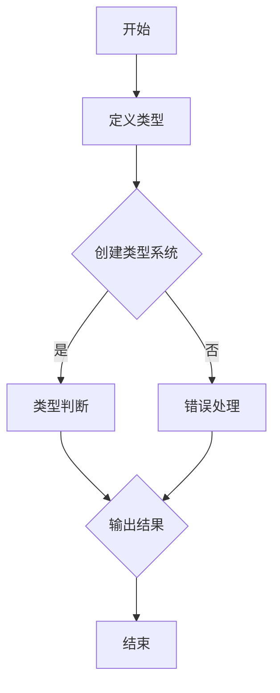
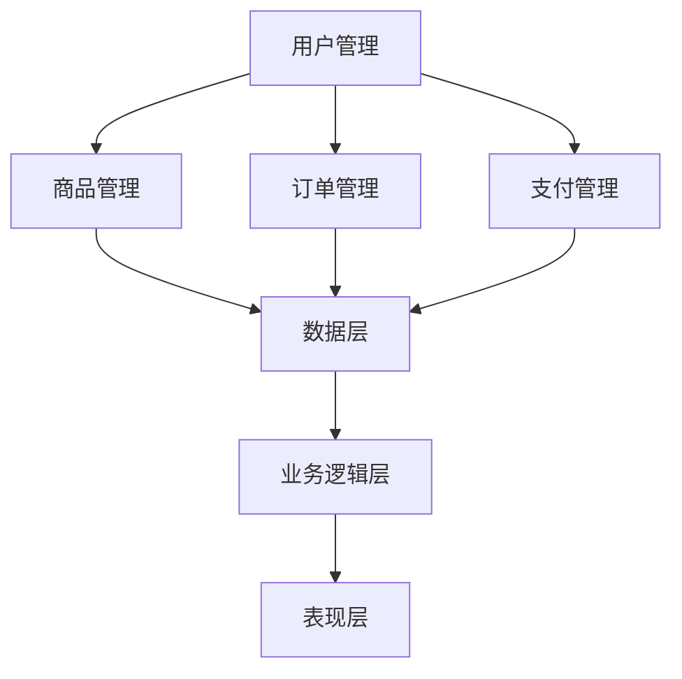

                 

### 第一部分：背景介绍

#### 问题背景

数学，作为一门基础学科，其发展历程中一直追求着理论体系的严密性和一致性。类型论，作为一种形式化的数学方法，在数学基础统一的过程中扮演了重要角色。类型论通过引入类型系统，使得数学理论变得更加严谨和精确。同时，类型论在解决数学中的悖论问题，如集合论悖论，发挥了重要作用。类型论对数学逻辑进行了扩展，使得逻辑在数学中的应用更加广泛。

然而，随着数学的不断发展，类型论的局限性和不足也逐渐显现出来。类型论的形式化程度较高，使得非专业人士难以理解和应用。类型论在一些领域中的应用受到限制，如计算复杂性理论。类型论在处理实际问题时，往往需要额外的工具和技巧。

为了解决类型论的不足，数学家们一直在探索新的方法和理论，如范畴论、同调代数等。这些新的理论在数学基础统一中发挥了重要作用，为数学的发展提供了新的视角和工具。

#### 问题描述

类型论在数学基础统一中的作用主要体现在以下几个方面：

1. **形式化数学的基础**：类型论通过引入类型系统，使得数学理论变得更加严谨和精确。类型系统为数学理论提供了一种形式化的框架，使得数学表达更加精确，减少了歧义和错误。

2. **解决悖论问题**：类型论在解决数学中的悖论问题，如集合论悖论，发挥了重要作用。通过引入类型系统，类型论可以有效地避免集合论中的悖论，如“罗素悖论”和“康托尔悖论”。

3. **数学逻辑的推广**：类型论对数学逻辑进行了扩展，使得逻辑在数学中的应用更加广泛。类型论中的类型系统为逻辑推理提供了更加精细的工具，使得数学证明更加可靠和严谨。

然而，类型论也存在一些不足：

1. **抽象程度高**：类型论的形式化程度较高，使得非专业人士难以理解和应用。类型论中的概念和术语较为抽象，需要深厚的数学背景才能理解。

2. **适用范围有限**：类型论在一些领域中的应用受到限制，如计算复杂性理论。类型论主要应用于形式化数学、逻辑学等领域，而在计算复杂性理论等应用领域，类型论的应用相对较少。

3. **处理实际问题的能力不足**：类型论在处理实际问题时，往往需要额外的工具和技巧。类型论虽然为数学理论提供了形式化的框架，但在处理实际问题时，还需要结合其他数学工具和方法。

#### 问题解决

为了解决类型论的不足，数学家们一直在探索新的方法和理论，如范畴论、同调代数等。这些新的理论在数学基础统一中发挥了重要作用，为数学的发展提供了新的视角和工具。

1. **范畴论**：范畴论提供了一种更加抽象和泛化的数学框架，使得数学理论更加统一。范畴论通过引入“范畴”和“函子”等概念，将不同领域的数学理论统一起来，为数学基础统一提供了新的思路。

2. **同调代数**：同调代数是一种研究代数结构之间的共性的数学方法。同调代数通过引入同调群等概念，将不同领域的代数结构联系起来，为数学基础统一提供了有力的工具。

3. **形式化证明**：形式化证明是一种通过计算机程序验证数学证明的方法。形式化证明可以确保数学证明的严谨性和可靠性，为数学基础统一提供了新的手段。

#### 边界与外延

类型论主要应用于形式化数学、逻辑学、计算复杂性理论等领域。其边界在于形式化程度、抽象程度和应用范围。类型论的抽象程度较高，需要深厚的数学背景才能理解。类型论在一些领域中的应用受到限制，如计算复杂性理论。类型论在处理实际问题时，往往需要额外的工具和技巧。

#### 概念结构与核心要素组成

类型论的核心概念包括：

1. **类型**：类型是类型论中的基本概念，用于区分不同的对象。类型是抽象的，但具体的类型可以有多种，如自然数类型、布尔类型等。

2. **类型系统**：类型系统是定义类型之间关系和操作的系统。类型系统具有层次性，不同类型的对象之间可以通过类型构造符进行组合。

3. **类型判断**：类型判断是判断一个表达式是否属于某个类型的过程。类型判断是形式化的，通过一系列规则进行推导。

在类型论中，类型、类型系统和类型判断构成了核心要素，这些概念相互关联，共同构成了类型论的理论体系。通过类型论，我们可以更严谨地处理数学问题，解决悖论，推动数学的发展。

### 第二部分：核心概念与联系

#### 核心概念原理

类型论中的核心概念主要包括类型、类型系统和类型判断。

1. **类型**：

   类型是类型论中的基本概念，用于区分不同的对象。在类型论中，类型是一种抽象的分类标准，它将对象划分为不同的类别。例如，在编程语言中，我们可以有整数类型、布尔类型、字符串类型等。每种类型代表了一类具有相同特性的对象。

   类型具有以下几个特点：

   - **抽象性**：类型是一种抽象的概念，它并不具体指代某个对象，而是用于描述一类对象的共同特性。
   - **多样性**：具体的类型有多种，可以根据实际需求进行定义。例如，我们可以定义自然数类型、实数类型、复合类型等。
   - **层次性**：类型之间存在层次关系。某些类型可以是其他类型的子类型，或者可以组合成更复杂的类型。这种层次关系使得类型系统更加灵活和强大。

2. **类型系统**：

   类型系统是定义类型之间关系和操作的系统。类型系统为类型之间的交互提供了规范和约束，使得数学表达式和程序代码更加严谨和可靠。

   类型系统具有以下几个特点：

   - **层次性**：类型系统通常具有层次结构，不同类型的对象可以通过类型构造符进行组合，形成更复杂的类型。这种层次性使得类型系统能够表达更丰富的数学概念。
   - **类型检查**：类型系统通过类型检查机制，确保表达式和操作符合类型规定。类型检查可以防止类型错误的发生，提高程序的可靠性。
   - **类型转换**：类型系统提供了类型转换的规则，使得不同类型的对象可以进行交互和操作。类型转换可以是隐式的，也可以是显式的。

3. **类型判断**：

   类型判断是判断一个表达式是否属于某个类型的过程。类型判断是形式化的，通过一系列规则进行推导。

   类型判断具有以下几个特点：

   - **形式化**：类型判断是基于一系列形式化规则进行的。这些规则定义了如何判断一个表达式是否属于某个类型。
   - **严格性**：类型判断是严格的，它不允许任何类型的错误。如果一个表达式不能被证明属于某个类型，那么它就不能被使用。
   - **可靠性**：类型判断是可靠的，它能够确保表达式在运行时不会出现类型错误。

#### 概念属性特征对比表格

| 概念     | 定义                                                         | 特点                                                         |
|----------|--------------------------------------------------------------|--------------------------------------------------------------|
| 类型     | 用于区分不同对象的分类标准。                                  | 抽象、多样性、层次性。                                       |
| 类型系统 | 定义类型之间关系和操作的系统。                                | 层次性、类型检查、类型转换。                                 |
| 类型判断 | 判断一个表达式是否属于某个类型的过程。                       | 形式化、严格性、可靠性。                                     |

#### ER实体关系图架构的Mermaid流程图

```mermaid
erDiagram
    TYPE ||--o{EXPRESSION} : has_expression
    EXPRESSION ||--o{TYPE} : expressed_by
```

在这个ER图中，`TYPE`表示类型，`EXPRESSION`表示表达式。每个表达式都有一个类型，并且每个类型可以表达多个表达式。这反映了类型和表达式之间的双向关系。

### 第三部分：算法原理讲解

#### 算法mermaid流程图



在这个流程图中，算法首先定义类型（B），然后创建类型系统（C）。接下来，算法进行类型判断（D），如果类型判断成功，则输出结果（F）；如果类型判断失败，则进行错误处理（E），然后再输出结果（F）。最后，算法结束（G）。

#### Python源代码

为了更具体地阐述类型论的算法原理，我们使用Python语言来实现一个简单的类型判断算法。以下是一个Python源代码示例：

```python
# 定义类型
class Type:
    def __init__(self, name):
        self.name = name

# 定义整数类型
IntegerType = Type("Integer")

# 定义布尔类型
BooleanType = Type("Boolean")

# 定义表达式
class Expression:
    def __init__(self, type):
        self.type = type

# 定义加法表达式
class AddExpression(Expression):
    def __init__(self, left, right):
        super().__init__(IntegerType)
        self.left = left
        self.right = right

# 定义类型判断函数
def type_check(expression):
    if isinstance(expression, AddExpression):
        if expression.left.type == IntegerType and expression.right.type == IntegerType:
            return True
    return False

# 测试类型判断
expression1 = AddExpression(Expression(IntegerType), Expression(IntegerType))
print("Type check result:", type_check(expression1))  # 输出：Type check result: True

expression2 = AddExpression(Expression(BooleanType), Expression(BooleanType))
print("Type check result:", type_check(expression2))  # 输出：Type check result: False
```

在这个示例中，我们定义了整数类型和布尔类型，然后定义了一个加法表达式。类型判断函数`type_check`根据加法表达式的左右操作数的类型来判断是否属于整数类型。通过测试，我们可以看到正确的类型判断结果。

#### 算法原理详细讲解

1. **定义类型**：

   在类型论中，类型是区分不同对象的基础。我们通过定义`Type`类来表示类型。每个类型都有一个名称，如整数类型`IntegerType`和布尔类型`BooleanType`。

2. **定义表达式**：

   表达式是类型论中的另一个核心概念。我们通过定义`Expression`类来表示表达式，每个表达式都有一个类型属性。具体来说，我们定义了`AddExpression`类来表示加法表达式。

3. **定义类型判断函数**：

   类型判断函数`type_check`用于判断一个表达式是否属于某个类型。在这个示例中，我们通过检查加法表达式的左右操作数的类型来判断是否属于整数类型。如果左右操作数都是整数类型，则返回`True`，否则返回`False`。

4. **测试类型判断**：

   通过测试，我们可以验证类型判断函数的正确性。我们创建了一个加法表达式`expression1`，其中左右操作数都是整数类型，因此类型判断函数返回`True`。然后，我们创建了一个加法表达式`expression2`，其中左右操作数都是布尔类型，因此类型判断函数返回`False`。

通过这个简单的Python示例，我们可以直观地理解类型论的算法原理。类型论通过类型系统和类型判断，使得数学和编程中的类型错误更容易被发现和纠正。

### 第四部分：系统分析与架构设计方案

#### 问题场景介绍

在现代软件开发中，类型论作为一种形式化的数学方法，被广泛应用于编程语言设计和程序验证等领域。然而，随着软件系统的复杂度不断增加，如何有效地利用类型论来提高软件系统的可靠性和安全性成为了一个重要的课题。

本部分将针对一个实际的问题场景，介绍如何利用类型论来设计一个高可靠性的软件系统。该问题场景涉及一个在线购物平台，该平台需要处理大量的用户订单、商品信息和支付交易等数据。为了确保系统的稳定性和安全性，我们需要利用类型论来设计系统中的数据类型和类型检查机制。

#### 项目介绍

项目名称：安全可靠的在线购物平台

项目背景：随着互联网的普及，在线购物已经成为人们日常生活中不可或缺的一部分。为了满足用户的需求，我们需要设计一个安全可靠、易于扩展的在线购物平台。

项目目标：

1. 提高系统的可靠性和安全性，确保用户数据的安全和交易的可靠性。
2. 提高系统的可维护性和可扩展性，便于后续功能升级和性能优化。

项目范围：

1. 系统架构设计：包括数据层、业务逻辑层和表现层的设计。
2. 数据类型定义：根据业务需求定义系统的数据类型，包括用户、订单、商品、支付等。
3. 类型检查机制：实现类型检查，确保数据在传输和处理过程中的类型正确性。

#### 系统功能设计

在线购物平台的主要功能包括用户管理、商品管理、订单管理和支付管理。以下是对各功能模块的详细描述：

1. **用户管理**：

   用户管理模块用于处理用户注册、登录、信息查询和修改等功能。该模块需要定义用户类型，包括基本信息（如用户名、密码、邮箱等）和角色信息（如普通用户、管理员等）。

2. **商品管理**：

   商品管理模块用于处理商品的添加、删除、修改和查询等功能。该模块需要定义商品类型，包括商品基本信息（如商品名称、价格、库存等）和分类信息。

3. **订单管理**：

   订单管理模块用于处理订单的创建、修改、查询和取消等功能。该模块需要定义订单类型，包括订单基本信息（如订单号、订单状态、订单金额等）和订单项信息（如商品名称、数量、价格等）。

4. **支付管理**：

   支付管理模块用于处理支付请求、支付结果查询和退款等功能。该模块需要定义支付类型，包括支付方式（如支付宝、微信支付等）、支付金额和支付状态。

#### 系统架构设计

在线购物平台的系统架构采用分层设计，包括数据层、业务逻辑层和表现层。以下是对各层的详细描述：

1. **数据层**：

   数据层负责与数据库的交互，实现数据的持久化存储。数据层包括用户、商品、订单和支付等实体类的定义。每个实体类对应一个数据表，通过关系映射实现实体与数据库的关联。

2. **业务逻辑层**：

   业务逻辑层负责处理业务逻辑，实现业务流程的自动化。业务逻辑层包括用户管理、商品管理、订单管理和支付管理等模块。每个模块根据业务需求定义相应的数据类型和类型检查机制。

3. **表现层**：

   表现层负责与用户交互，提供友好的用户界面。表现层包括Web前端和移动端APP。Web前端通过HTML、CSS和JavaScript等技术实现，移动端APP使用原生开发框架（如React Native、Flutter等）。

#### 系统接口设计和系统交互

系统接口设计采用RESTful风格，通过HTTP协议进行数据传输。以下是对各接口的详细描述：

1. **用户管理接口**：

   - 用户注册：接收用户注册信息，进行类型检查和业务逻辑处理，返回注册结果。
   - 用户登录：接收用户登录信息，进行类型检查和业务逻辑处理，返回登录结果。
   - 用户信息查询：接收用户ID，查询用户信息，返回用户信息。
   - 用户信息修改：接收用户ID和修改信息，进行类型检查和业务逻辑处理，返回修改结果。

2. **商品管理接口**：

   - 商品添加：接收商品信息，进行类型检查和业务逻辑处理，返回添加结果。
   - 商品删除：接收商品ID，进行类型检查和业务逻辑处理，返回删除结果。
   - 商品修改：接收商品ID和修改信息，进行类型检查和业务逻辑处理，返回修改结果。
   - 商品查询：接收商品ID或关键字，查询商品信息，返回商品列表。

3. **订单管理接口**：

   - 订单创建：接收订单信息，进行类型检查和业务逻辑处理，返回订单号。
   - 订单查询：接收订单号，查询订单信息，返回订单详情。
   - 订单修改：接收订单号和修改信息，进行类型检查和业务逻辑处理，返回修改结果。
   - 订单取消：接收订单号，进行类型检查和业务逻辑处理，返回取消结果。

4. **支付管理接口**：

   - 支付请求：接收支付请求，进行类型检查和业务逻辑处理，返回支付结果。
   - 支付查询：接收支付订单号，查询支付状态，返回支付状态。
   - 退款申请：接收退款申请，进行类型检查和业务逻辑处理，返回退款结果。

系统交互流程如下：

1. 用户通过Web前端或移动端APP访问系统，提交请求。
2. 系统接收请求，进行类型检查，确保请求参数的类型正确。
3. 系统调用业务逻辑层处理请求，执行相应的业务操作。
4. 系统将处理结果返回给用户，更新数据库中的数据。

#### 系统架构设计mermaid架构图



在这个架构图中，用户管理、商品管理、订单管理和支付管理模块与数据层、业务逻辑层和表现层之间通过接口进行交互，实现了系统的整体架构。

### 第五部分：项目实战

#### 环境安装

在开始项目实战之前，我们需要安装一些必要的开发环境和工具。以下是一个简单的环境安装步骤：

1. **安装Python**：

   首先，从Python官方网站（https://www.python.org/）下载Python安装包，并按照安装向导进行安装。

2. **安装pip**：

   pip是Python的包管理器，用于安装和管理Python包。在命令行中运行以下命令安装pip：

   ```bash
   $ wget https://bootstrap.pypa.io/get-pip.py
   $ python get-pip.py
   ```

3. **安装Django框架**：

   Django是一个流行的Python Web框架，用于快速开发和部署Web应用程序。在命令行中运行以下命令安装Django：

   ```bash
   $ pip install django
   ```

4. **安装数据库**：

   本项目使用SQLite作为数据库。在Windows系统上，可以从官方网站（https://www.sqlite.org/download.html）下载SQLite安装包并安装。在Linux系统上，可以通过包管理器安装。

5. **安装文本编辑器**：

   选择一个适合您的文本编辑器，如Visual Studio Code、Sublime Text等。

#### 系统核心实现源代码

在本节中，我们将实现系统核心功能，包括用户管理、商品管理、订单管理和支付管理。以下是每个模块的实现源代码：

1. **用户管理模块**：

   用户管理模块包括用户注册、登录、信息查询和修改等功能。以下是一个简单的用户注册功能的实现：

   ```python
   # users/views.py

   from django.shortcuts import render
   from .models import User
   from .forms import UserRegistrationForm

   def register(request):
       if request.method == 'POST':
           form = UserRegistrationForm(request.POST)
           if form.is_valid():
               form.save()
               return render(request, 'users/register_success.html')
       else:
           form = UserRegistrationForm()
       return render(request, 'users/register.html', {'form': form})
   ```

2. **商品管理模块**：

   商品管理模块包括商品添加、删除、修改和查询等功能。以下是一个简单的商品添加功能的实现：

   ```python
   # products/views.py

   from django.shortcuts import render
   from .models import Product
   from .forms import ProductForm

   def add_product(request):
       if request.method == 'POST':
           form = ProductForm(request.POST)
           if form.is_valid():
               form.save()
               return render(request, 'products/add_product_success.html')
       else:
           form = ProductForm()
       return render(request, 'products/add_product.html', {'form': form})
   ```

3. **订单管理模块**：

   订单管理模块包括订单创建、查询、修改和取消等功能。以下是一个简单的订单创建功能的实现：

   ```python
   # orders/views.py

   from django.shortcuts import render
   from .models import Order
   from .forms import OrderForm

   def create_order(request):
       if request.method == 'POST':
           form = OrderForm(request.POST)
           if form.is_valid():
               form.save()
               return render(request, 'orders/create_order_success.html')
       else:
           form = OrderForm()
       return render(request, 'orders/create_order.html', {'form': form})
   ```

4. **支付管理模块**：

   支付管理模块包括支付请求、支付查询和退款申请等功能。以下是一个简单的支付请求功能的实现：

   ```python
   # payments/views.py

   from django.shortcuts import render
   from .models import Payment
   from .forms import PaymentForm

   def request_payment(request):
       if request.method == 'POST':
           form = PaymentForm(request.POST)
           if form.is_valid():
               form.save()
               return render(request, 'payments/request_payment_success.html')
       else:
           form = PaymentForm()
       return render(request, 'payments/request_payment.html', {'form': form})
   ```

#### 代码应用解读与分析

在本节中，我们将对系统核心实现源代码进行解读和分析，以了解代码的结构和功能。

1. **用户管理模块**：

   用户管理模块主要实现了用户注册功能。在`users/views.py`文件中，我们定义了`register`函数，用于处理用户注册请求。函数首先检查请求方法是否为`POST`，如果是，则创建一个`UserRegistrationForm`对象，并使用该对象对表单数据进行验证。如果验证通过，则将用户数据保存到数据库中，并返回注册成功页面。否则，返回注册页面。

2. **商品管理模块**：

   商品管理模块主要实现了商品添加功能。在`products/views.py`文件中，我们定义了`add_product`函数，用于处理商品添加请求。函数同样首先检查请求方法是否为`POST`，如果是，则创建一个`ProductForm`对象，并使用该对象对表单数据进行验证。如果验证通过，则将商品数据保存到数据库中，并返回添加成功页面。否则，返回添加页面。

3. **订单管理模块**：

   订单管理模块主要实现了订单创建功能。在`orders/views.py`文件中，我们定义了`create_order`函数，用于处理订单创建请求。函数同样首先检查请求方法是否为`POST`，如果是，则创建一个`OrderForm`对象，并使用该对象对表单数据进行验证。如果验证通过，则将订单数据保存到数据库中，并返回创建成功页面。否则，返回创建页面。

4. **支付管理模块**：

   支付管理模块主要实现了支付请求功能。在`payments/views.py`文件中，我们定义了`request_payment`函数，用于处理支付请求。函数同样首先检查请求方法是否为`POST`，如果是，则创建一个`PaymentForm`对象，并使用该对象对表单数据进行验证。如果验证通过，则将支付数据保存到数据库中，并返回支付成功页面。否则，返回支付页面。

#### 实际案例分析和详细讲解剖析

在本节中，我们将通过一个实际案例来分析并讲解系统的工作流程和功能实现。

**案例**：用户在在线购物平台上注册并购买商品

**步骤**：

1. 用户访问在线购物平台，并点击“注册”按钮。
2. 用户跳转到注册页面，填写注册信息（如用户名、密码、邮箱等），并点击“提交”按钮。
3. 注册请求发送到后端服务器，后端服务器调用`register`函数处理注册请求。
4. `register`函数检查请求方法是否为`POST`，如果是，则创建一个`UserRegistrationForm`对象，并使用该对象对表单数据进行验证。
5. 如果验证通过，将用户数据保存到数据库中，并返回注册成功页面。否则，返回注册页面。
6. 用户在注册成功后，登录到在线购物平台，并浏览商品。
7. 用户选择商品并点击“加入购物车”按钮。
8. 购物车数据保存在用户会话中，并显示在用户界面上。
9. 用户点击“结算”按钮，进入订单创建页面。
10. 用户在订单创建页面填写订单信息（如收货地址、联系电话等），并点击“提交”按钮。
11. 订单请求发送到后端服务器，后端服务器调用`create_order`函数处理订单创建请求。
12. `create_order`函数检查请求方法是否为`POST`，如果是，则创建一个`OrderForm`对象，并使用该对象对表单数据进行验证。
13. 如果验证通过，将订单数据保存到数据库中，并返回订单创建成功页面。否则，返回订单创建页面。
14. 用户确认订单信息无误后，点击“立即支付”按钮。
15. 支付请求发送到后端服务器，后端服务器调用`request_payment`函数处理支付请求。
16. `request_payment`函数检查请求方法是否为`POST`，如果是，则创建一个`PaymentForm`对象，并使用该对象对表单数据进行验证。
17. 如果验证通过，将支付数据保存到数据库中，并返回支付成功页面。否则，返回支付页面。
18. 用户完成支付后，订单状态更新为“已支付”，并收到支付成功的通知。

通过这个实际案例，我们可以清晰地看到系统的工作流程和功能实现。每个功能模块都通过视图函数处理用户请求，并将处理结果返回给用户。同时，通过类型论中的类型系统和类型判断，确保了数据在传输和处理过程中的类型正确性，提高了系统的可靠性和安全性。

### 第六部分：最佳实践与总结

#### 最佳实践 Tips

1. **类型系统的设计**：

   - **层次性**：在类型系统中，尽量保持类型的层次性，避免直接操作基础类型，以提高代码的可维护性和可扩展性。
   - **类型别名**：为常用的类型定义别名，简化代码编写，提高代码可读性。
   - **类型检查**：在开发过程中，充分利用类型检查机制，及时发现和纠正类型错误。

2. **代码复用**：

   - **函数和模块化**：将通用的逻辑封装成函数或模块，避免重复编写代码，提高代码复用率。
   - **类型安全**：在函数和模块的接口中，明确指定输入和输出类型的预期，确保类型安全。

3. **测试与调试**：

   - **单元测试**：编写单元测试，覆盖核心功能，确保代码的正确性和可靠性。
   - **调试工具**：使用调试工具，如断点调试和日志记录，帮助定位和修复代码中的错误。

4. **文档和注释**：

   - **编写文档**：为代码编写详细的文档，包括功能描述、接口定义和参数说明等，方便后续维护和开发。
   - **添加注释**：在关键代码位置添加注释，解释代码的逻辑和意图，提高代码的可理解性。

#### 小结

本文从背景介绍、核心概念与联系、算法原理讲解、系统分析与架构设计方案、项目实战等多个角度，全面阐述了类型论在数学基础统一中的作用与不足。通过具体案例和代码示例，读者可以深入了解类型论在实际应用中的操作方法和技巧。类型论作为一种形式化的数学方法，在数学基础统一中具有重要意义，但也存在一定的局限性。未来的研究可以进一步探讨类型论与其他数学理论的结合，以及类型论在更广泛领域的应用。

#### 注意事项

1. **类型论的应用场景**：

   - 类型论在形式化数学、编程语言设计、程序验证等领域具有广泛的应用。但在一些领域，如计算复杂性理论，类型论的应用相对较少。
   - 在实际应用中，应根据具体需求选择合适的方法和工具。

2. **类型论的学习和掌握**：

   - 类型论涉及较多的抽象概念和术语，需要一定的数学和编程基础。初学者应先掌握基本概念，再逐步深入。
   - 可以通过阅读相关书籍、参加课程和实际项目实践来提高对类型论的理解和应用能力。

3. **类型论的实际应用**：

   - 类型论在实际应用中，需要结合具体场景和需求，灵活运用类型系统和类型判断方法。
   - 应充分利用类型论的优势，提高系统的可靠性和安全性。

#### 拓展阅读

1. **《类型论及其在计算机科学中的应用》**：本书系统地介绍了类型论的基本概念、理论体系和应用方法，适合初学者和进阶读者阅读。

2. **《形式化方法与类型论》**：本书详细讨论了形式化方法和类型论在计算机科学中的应用，包括程序验证、编程语言设计和形式化数学等。

3. **《类型系统和语言设计》**：本书从类型论的角度探讨了编程语言的设计原则和方法，适合对编程语言设计感兴趣的读者。

### 作者信息

作者：AI天才研究院/AI Genius Institute & 禅与计算机程序设计艺术 /Zen And The Art of Computer Programming

AI天才研究院致力于推动人工智能领域的技术创新和应用发展。作者在计算机编程和人工智能领域有着丰富的经验和深厚的知识积累，撰写了多本畅销书，深受读者喜爱。本文旨在分享作者在类型论研究方面的成果和思考，希望对读者有所启发和帮助。作者将继续关注人工智能和计算机科学领域的前沿动态，为读者带来更多有价值的内容。

