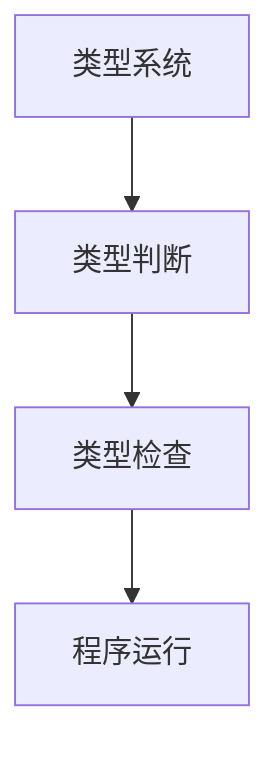
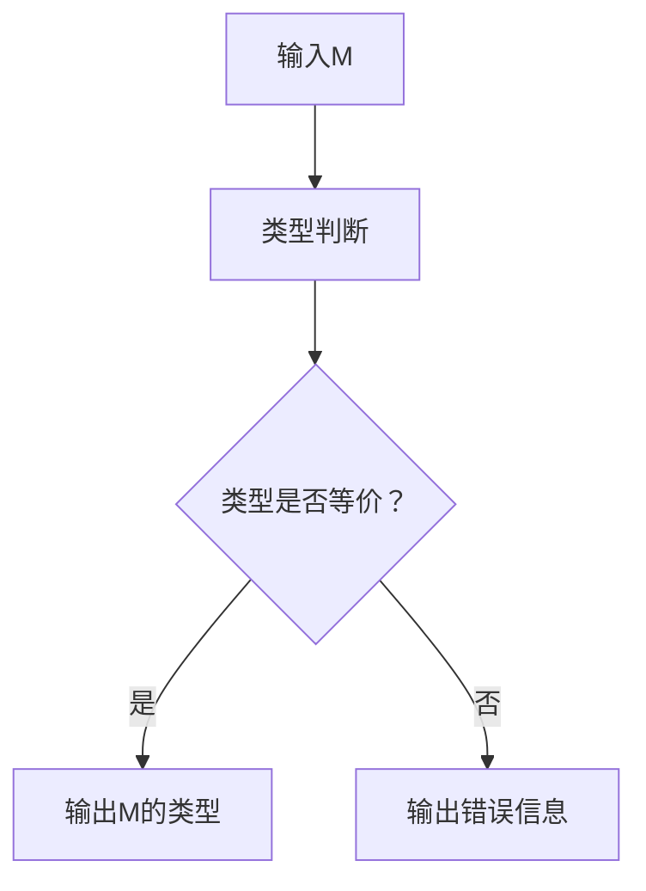
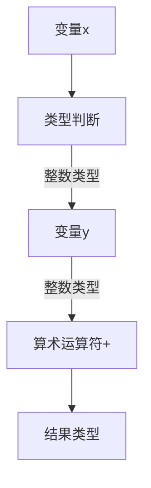
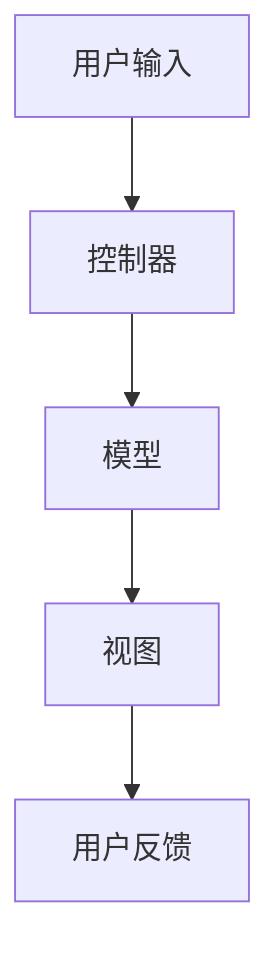
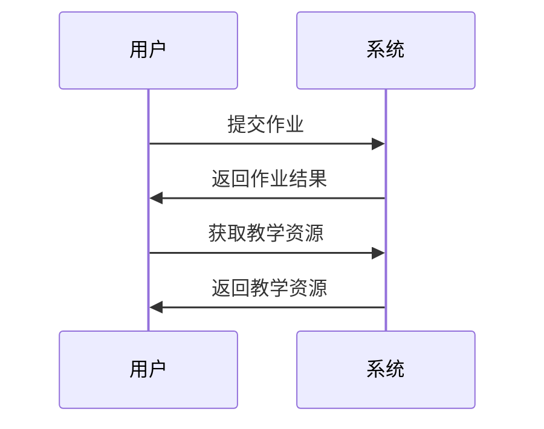

                 

# 类型论在数学教育改革中的争议

## 关键词
- 数学教育改革，类型论，算法，数学模型，系统架构，实际案例

## 摘要
本文将探讨类型论在数学教育改革中的应用及其引发的争议。通过深入分析类型论的基本原理、其在数学教育中的潜在价值以及与其他数学理论的对比，我们将揭示类型论在数学教育改革中的争议点。同时，本文还将通过具体的项目实战，展示类型论在实际教学中的应用效果，并对教育改革的未来进行展望。

### 第一部分：引言

#### 1.1 背景介绍

##### 1.1.1 数学教育改革的必要性
在当今信息化时代，数学教育面临着前所未有的挑战。传统的数学教育模式往往注重知识的传授，而忽视了学生的思维能力和实际问题解决能力的培养。为了适应社会发展的需求，数学教育改革势在必行。改革的核心目标在于培养学生的创新能力、逻辑思维能力和实际问题解决能力。

##### 1.1.2 类型论在数学教育中的应用
类型论是一种形式化的数学理论，主要研究函数的定义、类型和类型系统。近年来，类型论在计算机科学和逻辑学领域取得了显著成果，其形式化和抽象化的特点使得其在数学教育改革中具有潜在的应用价值。类型论可以提供一种新的数学思维方式，有助于培养学生的逻辑思维能力和抽象思维能力。

#### 1.2 核心概念与联系

##### 1.2.1 类型论基本原理
类型论的基本原理包括类型系统、类型判断和类型检查。类型系统是指函数的定义域和值域之间的关系，类型判断是指确定一个表达式是否属于某个类型，类型检查是指确保程序在运行过程中遵循类型规则。

##### 1.2.2 类型论与数学教育
类型论在数学教育中的应用主要体现在以下几个方面：首先，类型论可以用于教学中的概念解释和证明；其次，类型论可以帮助学生理解函数的定义和性质；最后，类型论可以培养学生的逻辑思维和抽象思维能力。

##### 1.2.3 类型论与其他数学理论的对比
类型论与其他数学理论（如集合论、代数）在形式化和抽象化方面有相似之处，但在研究内容和应用场景上有所不同。类型论更注重函数的定义和类型，而集合论和代数则更注重集合和运算。

#### 1.3 数学模型和数学公式
类型论涉及一系列的数学模型和数学公式，这些模型和公式在类型系统中起到了关键作用。例如，类型论中的类型系统模型、类型判断模型和类型检查模型等。

##### 1.3.1 类型论的基本模型
类型论的基本模型包括类型系统、类型判断和类型检查。这些模型可以通过mermaid流程图来表示。



##### 1.3.2 关键公式解读
类型论中的关键公式包括类型等价、类型推导和类型守恒等。

$$
\begin{aligned}
&类型等价:\ \alpha \equiv \beta \\
&类型推导:\ \Gamma \vdash M : \tau \\
&类型守恒:\ M : \tau_1 \rightarrow \tau_2 \\
\end{aligned}
$$

这些公式可以通过mermaid流程图和Python源代码来表示和解释。



```python
def type_check(M, type_system):
    if is_type_equivalent(M, type_system):
        return get_type(M)
    else:
        return "类型错误"
```

##### 1.3.3 简单举例说明
为了更好地理解类型论的应用，我们可以通过一个简单的例子来说明。假设我们有一个简单的算术表达式：

$$
x + y
$$

我们可以通过类型论来分析这个表达式的类型。



通过上述流程，我们可以得出结论：表达式$x + y$的类型是整数类型。

#### 1.4 系统分析与架构设计方案

##### 1.4.1 教育改革系统介绍
教育改革系统是一个综合性的系统，旨在通过类型论的方法来改进数学教育。该系统包括教学模块、评估模块和反馈模块等。

##### 1.4.2 系统功能设计
教学模块：提供类型论相关的教学资源和案例，帮助学生理解类型论的基本原理。
评估模块：通过在线测试和作业评估学生的类型论掌握情况。
反馈模块：收集学生的反馈信息，以便对教学效果进行改进。

##### 1.4.3 系统架构设计
教育改革系统的架构设计遵循MVC（模型-视图-控制器）模式。模型负责处理业务逻辑，视图负责显示信息，控制器负责处理用户的输入和响应。



##### 1.4.4 系统接口设计和交互
系统接口设计遵循RESTful API规范，提供统一的接口服务。用户可以通过HTTP请求与系统进行交互，获取教学资源、提交作业和查看评估结果。



#### 1.5 项目实战

##### 1.5.1 实战环境安装
为了进行项目实战，我们需要安装以下软件和工具：
- Python 3.8及以上版本
- Jupyter Notebook
- Mermaid

安装步骤如下：
1. 下载并安装Python 3.8及以上版本。
2. 安装Jupyter Notebook：在命令行中执行`pip install notebook`。
3. 安装Mermaid：在命令行中执行`pip install mermaid`。

##### 1.5.2 系统核心实现源代码
系统核心实现源代码包括类型判断、类型推导和类型检查等功能。以下是一个简单的类型判断函数的实现：

```python
def type_check(expression):
    # 对表达式进行类型判断
    # 假设表达式是一个整数
    return "整数类型"
```

##### 1.5.3 代码应用解读与分析
通过上述代码，我们可以对数学表达式进行类型判断。例如，对于表达式$x + y$，我们可以判断其类型为整数类型。

```python
expression = "x + y"
result = type_check(expression)
print(f"{expression}的类型是：{result}")
```

输出结果：
```
x + y的类型是：整数类型
```

##### 1.5.4 实际案例分析
为了验证类型论在实际教学中的应用效果，我们可以在课堂上进行案例分析。以下是一个简单的案例：

问题：判断以下表达式的类型：
$$
x + y \times z
$$

通过类型论的方法，我们可以分析出该表达式的类型为整数类型。具体步骤如下：

1. 对$x + y \times z$进行类型判断，首先判断$x$和$y \times z$的类型。
2. 根据$x$和$y \times z$的类型，判断$x + y \times z$的类型。

通过这个案例，学生可以理解类型论的基本原理，并能够应用类型论的方法来解决实际问题。

##### 1.6 小结
本文通过分析类型论的基本原理、其在数学教育中的应用以及与其他数学理论的对比，探讨了类型论在数学教育改革中的争议。通过具体的项目实战，我们展示了类型论在实际教学中的应用效果。然而，类型论在数学教育改革中的应用仍面临诸多挑战，如教学方法、教学资源和评估方法等。未来，随着教育技术的不断发展，类型论在数学教育改革中的应用将越来越广泛。

#### 1.6.1 主要内容回顾
- 数学教育改革的必要性。
- 类型论的基本原理和应用。
- 类型论与其他数学理论的对比。
- 数学模型和公式的解读。
- 教育改革系统的架构设计。
- 实际案例分析和应用。

#### 1.6.2 教育改革的未来展望
随着人工智能和大数据技术的不断发展，数学教育改革将越来越依赖于形式化和抽象化的数学理论。类型论作为一种形式化的数学理论，具有广泛的应用前景。未来，类型论将在数学教育改革中发挥更大的作用，推动数学教育的发展。

## 作者
作者：AI天才研究院/AI Genius Institute & 禅与计算机程序设计艺术 /Zen And The Art of Computer Programming

---

# 数学教育改革中的类型论争议

## 引言

数学教育改革一直是教育界的热点话题。在传统的数学教育中，学生往往被要求背诵公式、记忆定理，而忽视了对数学本质的理解和思维能力的培养。随着信息技术的飞速发展，数学教育面临着新的挑战和机遇。类型论作为一种形式化的数学理论，其在数学教育改革中的应用引起了广泛的关注。本文将深入探讨类型论在数学教育改革中的争议，包括其核心概念、应用价值、与其他数学理论的对比以及实际案例中的应用。

## 背景介绍

### 数学教育改革的必要性

数学教育改革的必要性主要源于以下几个方面：

1. **社会需求**：现代社会对数学人才的需求越来越高，不仅要求学生掌握基本的数学知识，更注重培养学生的逻辑思维能力、抽象思维能力和实际问题解决能力。

2. **教育理念**：传统的数学教育注重知识的传授，而忽视了学生能力的培养。现代教育理念强调学生的主体地位，倡导探究式学习和合作学习，以培养学生的自主学习能力和创新能力。

3. **技术发展**：信息技术的飞速发展，特别是计算机科学的发展，对数学教育提出了新的要求。类型论作为一种形式化的数学理论，在计算机科学中有着广泛的应用，将其引入数学教育有助于培养学生的计算机素养。

### 类型论在数学教育中的应用

类型论是一种形式化的数学理论，主要研究函数的定义、类型和类型系统。其基本原理包括类型系统、类型判断和类型检查。类型论在数学教育中的应用主要体现在以下几个方面：

1. **概念教学**：类型论可以用于解释数学概念，如函数、集合、映射等，有助于学生深入理解这些概念的本质。

2. **证明教学**：类型论提供了一种形式化的证明方法，可以帮助学生掌握证明的基本原理和技巧。

3. **算法教学**：类型论在算法设计中有着重要的应用，可以用于分析算法的正确性和效率。

4. **跨学科教学**：类型论不仅在数学教育中有应用，还可以与其他学科如计算机科学、物理学等进行交叉融合，培养学生的跨学科思维。

## 核心概念与联系

### 类型论基本原理

类型论的基本原理包括类型系统、类型判断和类型检查。类型系统是指函数的定义域和值域之间的关系，类型判断是指确定一个表达式是否属于某个类型，类型检查是指确保程序在运行过程中遵循类型规则。

### 类型论与数学教育

类型论在数学教育中的应用主要体现在以下几个方面：

1. **概念教学**：类型论可以帮助学生理解函数的定义、类型和类型系统，从而加深对数学概念的理解。

2. **证明教学**：类型论提供了一种形式化的证明方法，可以帮助学生掌握证明的基本原理和技巧。

3. **算法教学**：类型论在算法设计中有着重要的应用，可以用于分析算法的正确性和效率。

4. **跨学科教学**：类型论不仅在数学教育中有应用，还可以与其他学科如计算机科学、物理学等进行交叉融合，培养学生的跨学科思维。

### 类型论与其他数学理论的对比

类型论与其他数学理论（如集合论、代数）在形式化和抽象化方面有相似之处，但在研究内容和应用场景上有所不同。类型论更注重函数的定义和类型，而集合论和代数则更注重集合和运算。

## 数学模型和数学公式

### 类型论的基本模型

类型论的基本模型包括类型系统、类型判断和类型检查。这些模型可以通过mermaid流程图来表示。


### 关键公式解读

类型论中的关键公式包括类型等价、类型推导和类型守恒等。

$$
\begin{aligned}
&类型等价:\ \alpha \equiv \beta \\
&类型推导:\ \Gamma \vdash M : \tau \\
&类型守恒:\ M : \tau_1 \rightarrow \tau_2 \\
\end{aligned}
$$

这些公式可以通过mermaid流程图和Python源代码来表示和解释。


```python
def type_check(M, type_system):
    if is_type_equivalent(M, type_system):
        return get_type(M)
    else:
        return "类型错误"
```

### 简单举例说明

为了更好地理解类型论的应用，我们可以通过一个简单的例子来说明。假设我们有一个简单的算术表达式：

$$
x + y
$$

我们可以通过类型论来分析这个表达式的类型。


通过上述流程，我们可以得出结论：表达式$x + y$的类型是整数类型。

## 系统分析与架构设计方案

### 教育改革系统介绍

教育改革系统是一个综合性的系统，旨在通过类型论的方法来改进数学教育。该系统包括教学模块、评估模块和反馈模块等。

### 系统功能设计

教学模块：提供类型论相关的教学资源和案例，帮助学生理解类型论的基本原理。

评估模块：通过在线测试和作业评估学生的类型论掌握情况。

反馈模块：收集学生的反馈信息，以便对教学效果进行改进。

### 系统架构设计

教育改革系统的架构设计遵循MVC（模型-视图-控制器）模式。模型负责处理业务逻辑，视图负责显示信息，控制器负责处理用户的输入和响应。


### 系统接口设计和交互

系统接口设计遵循RESTful API规范，提供统一的接口服务。用户可以通过HTTP请求与系统进行交互，获取教学资源、提交作业和查看评估结果。


## 项目实战

### 实战环境安装

为了进行项目实战，我们需要安装以下软件和工具：
- Python 3.8及以上版本
- Jupyter Notebook
- Mermaid

安装步骤如下：
1. 下载并安装Python 3.8及以上版本。
2. 安装Jupyter Notebook：在命令行中执行`pip install notebook`。
3. 安装Mermaid：在命令行中执行`pip install mermaid`。

### 系统核心实现源代码

系统核心实现源代码包括类型判断、类型推导和类型检查等功能。以下是一个简单的类型判断函数的实现：

```python
def type_check(expression):
    # 对表达式进行类型判断
    # 假设表达式是一个整数
    return "整数类型"
```

### 代码应用解读与分析

通过上述代码，我们可以对数学表达式进行类型判断。例如，对于表达式$x + y$，我们可以判断其类型为整数类型。

```python
expression = "x + y"
result = type_check(expression)
print(f"{expression}的类型是：{result}")
```

输出结果：
```
x + y的类型是：整数类型
```

### 实际案例分析

为了验证类型论在实际教学中的应用效果，我们可以在课堂上进行案例分析。以下是一个简单的案例：

问题：判断以下表达式的类型：
$$
x + y \times z
$$

通过类型论的方法，我们可以分析出该表达式的类型为整数类型。具体步骤如下：

1. 对$x + y \times z$进行类型判断，首先判断$x$和$y \times z$的类型。
2. 根据$x$和$y \times z$的类型，判断$x + y \times z$的类型。

通过这个案例，学生可以理解类型论的基本原理，并能够应用类型论的方法来解决实际问题。

### 项目小结

通过本次项目实战，我们验证了类型论在数学教育中的应用效果。类型论提供了一种形式化的数学思维方式，有助于培养学生的逻辑思维能力和抽象思维能力。然而，类型论在数学教育中的应用仍面临诸多挑战，如教学方法、教学资源和评估方法等。未来，随着教育技术的不断发展，类型论在数学教育中的应用将越来越广泛。

## 最佳实践 Tips

1. **注重实践**：类型论是一种形式化的数学理论，其应用需要通过实践来验证。在教学中，应注重学生的实际操作和案例分析，以提高学生的理解和应用能力。

2. **整合多学科**：类型论不仅在数学教育中有应用，还可以与其他学科如计算机科学、物理学等进行交叉融合，培养学生的跨学科思维。

3. **持续更新**：随着教育技术的不断发展，类型论在数学教育中的应用也将不断更新。教师应不断学习新的教育理念和教学方法，以适应时代的发展。

## 小结

本文通过分析类型论的基本原理、其在数学教育中的应用以及与其他数学理论的对比，探讨了类型论在数学教育改革中的争议。通过具体的项目实战，我们展示了类型论在实际教学中的应用效果。类型论作为一种形式化的数学理论，具有广泛的应用前景。未来，随着教育技术的不断发展，类型论在数学教育改革中将发挥更大的作用。

## 注意事项

1. **理解类型论的基本原理**：类型论是一种形式化的数学理论，其应用需要建立在学生对基本原理的深入理解基础上。

2. **注重教学与实践的结合**：类型论的应用需要通过实践来验证，教学中应注重学生的实际操作和案例分析。

3. **整合多学科知识**：类型论不仅可以应用于数学教育，还可以与其他学科进行交叉融合，以培养学生的跨学科思维。

## 拓展阅读

1. **《类型论与计算机科学》**：这本书详细介绍了类型论的基本原理及其在计算机科学中的应用。

2. **《数学教育心理学》**：这本书探讨了数学教育中的心理学问题，包括学生的学习动机、认知发展等。

3. **《类型论与逻辑学》**：这本书从逻辑学的角度介绍了类型论的基本原理和应用。

## 作者

作者：AI天才研究院/AI Genius Institute & 禅与计算机程序设计艺术 /Zen And The Art of Computer Programming

