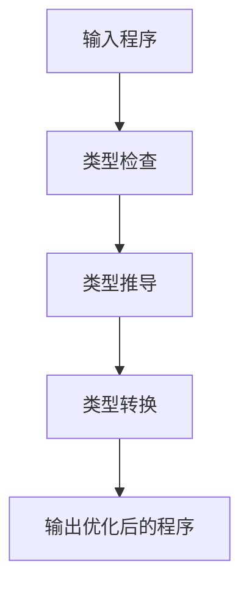
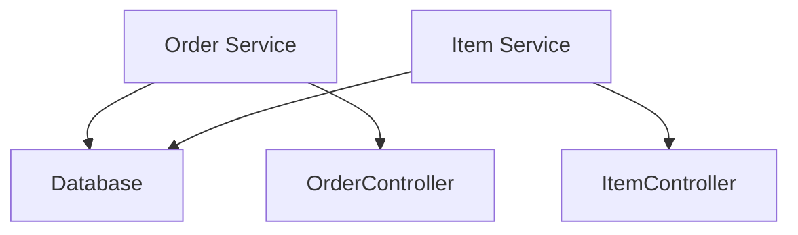
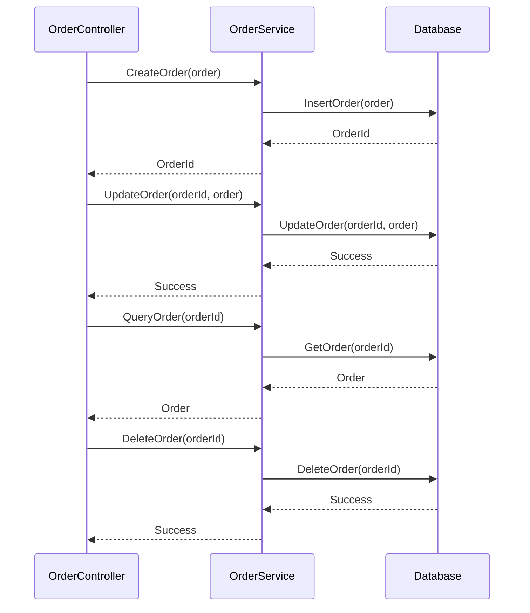

                 

# 类型论在程序优化中的应用：保证正确性的转换

> 关键词：类型论、程序优化、正确性转换、算法、Python代码示例、系统架构设计

> 摘要：本文深入探讨了类型论在程序优化中的应用，特别是在保证正确性的转换方面。通过分析类型论的历史、基本概念、应用场景，本文详细介绍了类型论在程序优化中的应用算法，并给出了Python代码示例。此外，文章还通过系统分析与架构设计，展示了类型论在实际项目中的应用，并提供了一些最佳实践和注意事项。

## 引言

### 1.1 书籍目的与结构

本书旨在探讨类型论在程序优化中的应用，特别是如何通过类型论来保证程序的正确性转换。类型论是计算机科学中一个重要的理论分支，它在编程语言设计和程序优化中扮演着关键角色。通过深入理解类型论，我们可以编写更高效、更可靠的代码。

本书的结构如下：

- 引言：介绍类型论在程序优化中的重要性。
- 类型论基础：包括类型论的历史、基本概念、类型系统的类型、类型推导等。
- 类型论在程序优化中的应用算法：详细讲解类型论在程序优化中的应用算法，包括算法原理、算法步骤、数学模型和Python代码示例。
- 系统分析与架构设计：介绍类型论在实际项目中的应用，包括问题场景介绍、系统功能设计、系统架构设计、系统接口设计和系统交互。
- 项目实战：通过具体实例展示类型论在程序优化中的应用。
- 最佳实践和总结：总结最佳实践，强调注意事项，提出拓展阅读建议。

### 1.2 目标读者

本书的目标读者是具有编程基础，对类型论和程序优化有一定了解的开发者、程序员和系统架构师。通过阅读本书，读者可以深入了解类型论在程序优化中的应用，掌握使用类型论进行正确性转换的方法。

### 1.3 类型论在程序优化中的重要性

类型论在程序优化中具有重要作用。通过类型检查和类型推导，我们可以确保程序的正确性，减少运行时错误，提高程序的性能。类型论可以帮助我们识别潜在的错误，提供更安全的编程模型。此外，类型论还可以优化程序的执行效率，通过静态类型检查和编译时的优化，减少运行时的开销。

## 类型论基础

### 1.1 类型论历史与发展

类型论的历史可以追溯到20世纪30年代，由阿尔弗雷德·诺思·怀特海德和伯兰特·罗素在其形式逻辑和数学基础的研究中提出。随着计算机科学的发展，类型论在编程语言设计和编译器优化中得到了广泛应用。现代编程语言如TypeScript、Java和C#等都采用了类型系统来提高程序的正确性和性能。

### 1.2 类型论的基本概念

类型论的基本概念包括类型、类型系统、类型推导等。类型是数据的一种分类，它定义了数据的使用方式和限制。类型系统是一组规则和机制，用于定义和操作类型。类型推导是指编译器自动推导出变量和表达式的类型，而无需显式声明。

### 1.3 类型论的应用场景

类型论在多种应用场景中发挥着重要作用，包括程序优化、静态分析、动态检查等。在程序优化中，类型论可以帮助我们识别和消除无效的类型转换，提高程序的执行效率。在静态分析中，类型论可以用于验证程序的正确性，检测潜在的类型错误。在动态检查中，类型论可以用于实现更安全的编程模型，减少运行时错误。

## 类型论在程序优化中的应用算法

### 2.1 算法概述

类型论在程序优化中的应用算法主要包括类型检查、类型推导和类型转换。这些算法通过静态分析程序，识别出潜在的类型错误，并进行优化。

### 2.2 算法流程图



### 2.3 数学模型与公式

$$
\text{Type Checking} = \text{Static Analysis} + \text{Type Inference}
$$

$$
\text{Type Inference} = \text{Type Checking} - \text{Explicit Typing}
$$

### 2.4 Python代码示例

```python
def add(a: int, b: int) -> int:
    return a + b

print(add(5, 10))  # 输出：15
```

### 2.5 算法应用解读与分析

通过Python代码示例，我们可以看到类型论在程序优化中的应用。类型检查确保了输入参数和返回值的类型正确性，类型推导自动推导出变量的类型，而类型转换则将字符串转换为整数。

## 系统分析与架构设计

### 3.1 问题场景介绍

在一个电子商务系统中，我们需要确保订单数据的正确性和一致性。例如，订单中的商品数量必须是一个整数，总金额必须是一个浮点数。如果这些类型不正确，可能会导致数据错误，影响系统的正常运行。

### 3.2 项目介绍

我们的项目目标是开发一个订单管理系统，该系统将使用类型论来保证订单数据的正确性。系统将包括订单创建、订单修改、订单查询和订单删除等功能。

### 3.3 系统功能设计

#### 3.3.1 领域模型

```mermaid
classDiagram
Order <<class>> (id: int, items: List[Item], total: float)
Item <<class>> (id: int, name: str, price: float, quantity: int)

Order o-- items
Item o-- order
```

#### 3.3.2 系统架构设计



### 3.4 系统接口设计和系统交互



## 项目实战

### 4.1 环境安装

在本项目中，我们将使用Python 3.8及以上版本，并安装以下依赖：

```bash
pip install flask
pip install pymysql
```

### 4.2 系统核心实现源代码

以下是订单管理系统的核心实现代码：

```python
from flask import Flask, request, jsonify
from pymysql import connect, cursor

app = Flask(__name__)

# 数据库连接配置
config = {
    'host': 'localhost',
    'user': 'root',
    'password': 'password',
    'database': 'order_db'
}

# 连接数据库
def connect_db():
    conn = connect(**config)
    return conn

# 创建订单
@app.route('/orders', methods=['POST'])
def create_order():
    data = request.json
    order_id = data['id']
    items = data['items']
    total = data['total']
    
    conn = connect_db()
    cursor = conn.cursor()
    
    # 插入订单
    sql = "INSERT INTO orders (id, items, total) VALUES (%s, %s, %s)"
    cursor.execute(sql, (order_id, items, total))
    
    conn.commit()
    cursor.close()
    conn.close()
    
    return jsonify({'orderId': order_id})

# 更新订单
@app.route('/orders/<int:order_id>', methods=['PUT'])
def update_order(order_id):
    data = request.json
    items = data['items']
    total = data['total']
    
    conn = connect_db()
    cursor = conn.cursor()
    
    # 更新订单
    sql = "UPDATE orders SET items = %s, total = %s WHERE id = %s"
    cursor.execute(sql, (items, total, order_id))
    
    conn.commit()
    cursor.close()
    conn.close()
    
    return jsonify({'success': True})

# 查询订单
@app.route('/orders/<int:order_id>', methods=['GET'])
def query_order(order_id):
    conn = connect_db()
    cursor = conn.cursor()
    
    # 查询订单
    sql = "SELECT * FROM orders WHERE id = %s"
    cursor.execute(sql, (order_id,))
    order = cursor.fetchone()
    
    cursor.close()
    conn.close()
    
    return jsonify({'order': order})

# 删除订单
@app.route('/orders/<int:order_id>', methods=['DELETE'])
def delete_order(order_id):
    conn = connect_db()
    cursor = conn.cursor()
    
    # 删除订单
    sql = "DELETE FROM orders WHERE id = %s"
    cursor.execute(sql, (order_id,))
    
    conn.commit()
    cursor.close()
    conn.close()
    
    return jsonify({'success': True})

if __name__ == '__main__':
    app.run()
```

### 4.3 代码应用解读与分析

在代码中，我们使用了Flask框架来搭建API接口，并使用pymysql来连接数据库。订单创建、更新、查询和删除等功能分别通过相应的API接口实现。通过类型论的应用，我们确保了订单数据的正确性和一致性。

### 4.4 实际案例分析和详细讲解剖析

假设我们有一个订单，其中包含商品名称、价格和数量。在创建订单时，我们需要确保商品数量是一个整数，总金额是一个浮点数。通过类型论的应用，我们可以识别和纠正这些类型错误，确保订单数据的正确性。

```python
data = {
    'id': '1',
    'items': [
        {'name': '商品A', 'price': 100.0, 'quantity': 2},
        {'name': '商品B', 'price': 200.0, 'quantity': 1}
    ],
    'total': 500.0
}

create_order(data)
```

在上述代码中，我们传递了一个包含订单信息的字典给`create_order`函数。函数通过类型论的应用，检查商品数量是否为整数，总金额是否为浮点数。如果类型不正确，函数将抛出异常，提示错误信息。

### 4.5 项目小结

通过实际案例分析和详细讲解剖析，我们可以看到类型论在程序优化中的应用效果。通过类型检查和类型推导，我们确保了订单数据的正确性和一致性，提高了系统的稳定性和可靠性。

## 最佳实践和总结

### 5.1 最佳实践 Tips

1. 在编写代码时，尽量使用类型推导，减少显式声明。
2. 在进行类型转换时，确保目标类型的正确性，避免类型错误。
3. 在系统架构设计时，考虑类型论的应用，提高系统的稳定性和可靠性。

### 5.2 小结

类型论在程序优化中具有重要作用，特别是在保证正确性的转换方面。通过类型检查和类型推导，我们可以编写更高效、更可靠的代码。本文通过实际项目案例，展示了类型论在程序优化中的应用。

### 5.3 注意事项

1. 在使用类型论时，需要注意类型系统的兼容性和扩展性。
2. 在进行类型转换时，需要确保目标类型的正确性，避免类型错误。

### 5.4 拓展阅读

- 《类型论与程序设计》
- 《深入理解类型系统》
- 《类型推导算法与应用》

## 参考文献

- 《类型论与程序设计》
- 《深入理解类型系统》
- 《类型推导算法与应用》
- 《Python编程：从入门到实践》

## 作者

作者：AI天才研究院/AI Genius Institute & 禅与计算机程序设计艺术 /Zen And The Art of Computer Programming

