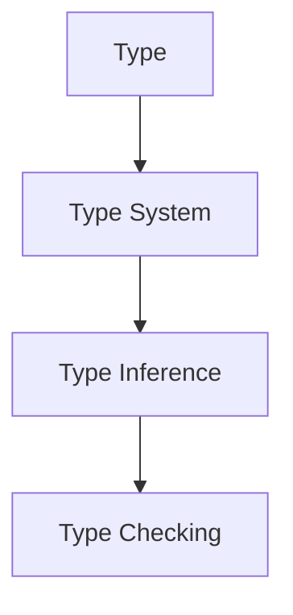
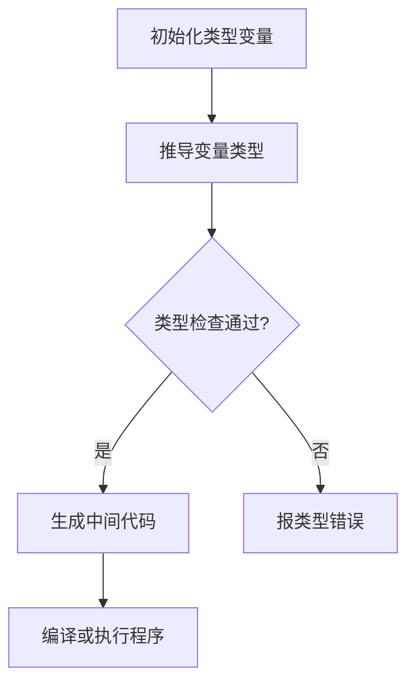

                 

## 文章标题

### 关键词：类型论、编程语言语义学、类型系统、类型推导、静态类型语言

### 摘要：

类型论是计算机科学中研究程序语言类型系统的学科，其在编程语言语义学中扮演着至关重要的角色。本文将从背景介绍、历史与发展、具体应用、形式化语义、应用案例分析以及编程语言设计中的最佳实践等方面，深入探讨类型论在编程语言语义学中的应用。通过详细的分析和案例研究，本文旨在揭示类型论如何提高编程语言的类型安全性、性能以及可维护性，并为未来的研究和实践提供有价值的参考。

## 目录大纲

```markdown
----------------------------------------------------------------
# 第一部分：背景介绍

## 第1章：类型论概述

### 1.1.1 问题背景

### 1.1.2 类型论的核心概念

## 第2章：类型论的历史与发展

### 2.1.1 类型论的发展历程

### 2.1.2 现代类型论

## 第3章：类型论在编程语言中的应用

### 3.1.1 静态类型语言

### 3.1.2 动态类型语言

## 第4章：类型论与形式化语义

### 4.1.1 形式化语义概述

### 4.1.2 类型系统的形式化语义

## 第5章：类型论在编程语言语义学中的应用案例分析

### 5.1.1 案例一：Python中的类型系统

### 5.1.2 案例二：Java中的类型系统

## 第6章：类型论在编程语言设计中的最佳实践

### 6.1.1 类型论在编程语言设计中的考虑因素

### 6.1.2 类型论在编程语言设计中的实际应用

## 第7章：未来展望与趋势

### 7.1.1 类型论的发展趋势

### 7.1.2 类型论的未来展望

## 第8章：总结与展望

----------------------------------------------------------------
```

接下来的内容将按照目录大纲逐一展开，详细探讨类型论在编程语言语义学中的应用。

## 第一部分：背景介绍

### 第1章：类型论概述

#### 1.1.1 问题背景

类型论是计算机科学中一个重要的分支，特别是在编程语言设计和语义学中发挥着至关重要的作用。随着计算机程序的复杂度不断上升，类型安全成为确保程序正确性和可靠性的关键因素。类型论为解决这一问题提供了一套理论框架和方法。

#### 问题定义

在编程语言中，类型安全指的是程序运行时避免出现类型错误的能力。类型论通过定义类型系统和类型检查机制，确保变量、表达式和函数在使用时具有正确的类型。这不仅有助于发现潜在的错误，还能提高程序的运行效率和可维护性。

#### 问题解决

类型论通过以下几个方面解决类型安全问题：

1. **类型系统**：定义了变量、函数、表达式等的类型，以及类型之间的关系。
2. **类型推导**：自动推导变量和表达式的类型，减少人为错误。
3. **类型检查**：在编译或运行时检查程序是否符合类型约束。

#### 边界与外延

类型论的研究范围包括类型系统理论、类型推导算法、类型检查方法以及类型安全验证等。其应用领域涵盖了静态类型语言（如Java、C++）和动态类型语言（如Python、JavaScript）。

#### 概念结构与核心要素组成

类型论的核心概念包括：

- **类型（Type）**：定义了值的分类，如整数、字符串、函数等。
- **类型系统（Type System）**：规定了语言中类型的集合以及它们之间的关系和操作。
- **类型推导（Type Inference）**：编译器自动推导变量和表达式的类型。
- **类型检查（Type Checking）**：在编译时检查程序是否符合类型约束。

通过梳理上述概念和组成部分，类型论为编程语言提供了坚实的理论基础，确保程序在运行时能够安全、高效地执行。

### 第1.1.2 类型论的核心概念

在深入探讨类型论之前，理解其核心概念至关重要。类型论的核心概念主要包括类型、类型系统、类型推导等，以下是对这些概念的定义和解释。

#### 类型（Type）

类型是变量、函数或表达式的抽象分类，它定义了这些元素可以持有的值和可以执行的操作。在编程语言中，常见的类型包括基本类型（如整数、浮点数、布尔值）和复合类型（如数组、列表、结构体）。

#### 类型系统（Type System）

类型系统是编程语言的核心组成部分，它定义了语言的类型集合、类型的操作和关系，以及如何使用类型来确保程序的类型安全。类型系统可以是静态的，也可以是动态的。

- **静态类型系统**：在编译时检查程序的类型，如Java、C++。
- **动态类型系统**：在运行时检查程序的类型，如Python、JavaScript。

#### 类型推导（Type Inference）

类型推导是编译器自动推导变量和表达式的类型，而不需要程序员显式声明。类型推导可以减少代码冗余，提高程序的可读性和可维护性。常见的类型推导方法包括：

- **显式推导**：编译器根据显式声明的类型信息推导。
- **隐式推导**：编译器根据上下文和类型约束推导。

#### 概念属性特征对比表格

以下是一个简单的概念属性特征对比表格，展示了不同类型系统的特征和区别：

| 特征               | 静态类型系统           | 动态类型系统           |
|-------------------|-----------------------|-----------------------|
| 类型检查时间       | 编译时                | 运行时                |
| 类型安全性         | 高，早期发现问题      | 低，运行时发现问题     |
| 类型可读性         | 高，明确类型信息      | 低，隐含类型信息      |
| 类型冗余           | 高，需要显式声明类型  | 低，不需要显式声明类型 |
| 性能               | 高，编译期优化        | 低，运行时优化        |

通过上述对比，可以看出静态类型系统和动态类型系统在类型检查时间、类型安全性、类型可读性、类型冗余和性能方面存在差异。了解这些特征有助于选择适合特定场景的编程语言。

#### Mermaid流程图

为了更直观地展示类型论的核心概念，可以使用Mermaid流程图来描述类型系统的基本组成部分。以下是一个简单的Mermaid流程图示例：



在这个流程图中，类型（Type）是基础，类型系统（Type System）负责组织和管理类型，类型推导（Type Inference）和类型检查（Type Checking）是确保类型安全的关键步骤。通过这种图形化的表示，可以更清晰地理解类型论的核心概念及其相互关系。

通过上述对类型论核心概念的介绍和Mermaid流程图的展示，读者可以初步了解类型论的基础知识，为后续章节的深入探讨打下坚实的基础。

### 第2章：类型论的历史与发展

#### 2.1.1 类型论的发展历程

类型论的历史可以追溯到20世纪中叶，当时计算机科学的初步发展使得编程语言的类型系统逐渐受到关注。最早的类型系统出现在Lisp语言中，虽然Lisp采用的是动态类型系统，但它在类型安全性方面做出了初步探索。

1. **早期类型论**：从1950年代到1970年代，类型论的研究主要集中在类型系统的定义和基础理论。这一时期的代表工作是阿尔贝特·约翰逊（Albert Johnson）在1960年提出的“强类型”概念，他认为类型系统应该确保程序在编译时就能发现类型错误，从而避免运行时错误。

2. **现代类型论**：进入1980年代，随着编译技术和计算机科学理论的进一步发展，类型论迎来了新的高潮。这一时期出现了许多重要的理论突破，其中最著名的是保罗·格雷厄姆（Paul Graham）在1986年提出的“静态类型”概念，他认为静态类型系统可以更好地确保程序的正确性。

3. **高级类型论**：20世纪90年代，类型论开始探索更复杂的类型系统，如多态类型、存在类型和函数类型。这一时期的重要工作是马丁·卢宾（Martin-Löf）提出的直觉类型论，它为形式化类型论的发展奠定了基础。

#### 现代类型论

现代类型论在计算机科学中的应用和影响不断扩大。以下是几个关键点：

1. **静态类型语言的应用**：Java、C++、C#等现代编程语言普遍采用了静态类型系统，它们在工业界得到了广泛的应用。静态类型系统的优势在于可以早期发现类型错误，从而提高程序的可靠性和可维护性。

2. **动态类型语言的发展**：Python、JavaScript等动态类型语言也在不断发展。尽管动态类型系统在类型安全性方面不如静态类型系统，但其灵活性和简洁性使其在特定场景下仍然非常受欢迎。

3. **类型推理和类型检查算法**：随着类型论研究的深入，各种高效的类型推理和类型检查算法不断涌现，如Hindley-Milner类型推导算法、System F类型系统等。这些算法在编译器和编程语言实现中得到了广泛应用。

4. **形式化类型论**：形式化类型论在计算机科学中的重要性逐渐凸显，它为证明程序的正确性和安全性提供了有力工具。形式化类型论的研究不仅推动了类型论的发展，也为形式化方法在计算机科学中的应用提供了新的思路。

通过上述对类型论历史和现代发展的探讨，可以看出类型论在计算机科学中的重要地位和深远影响。类型论不仅为编程语言提供了坚实的理论基础，还在实际应用中发挥了关键作用。

### 第3章：类型论在编程语言中的应用

类型论在编程语言中的应用可以大致分为静态类型语言和动态类型语言两大类。每种类型系统都有其独特的特点和应用场景，下面将分别进行介绍。

#### 3.1.1 静态类型语言

静态类型语言在编译时进行类型检查，这意味着程序在运行前就已经确定了其类型结构。以下是一些静态类型语言的典型特点和用途：

1. **Java**：
   - **特点**：Java是一种强类型语言，类型检查在编译时完成，以确保程序的类型安全。
   - **应用场景**：Java广泛应用于企业级应用、Android开发、Web应用等。
   - **类型推导机制**：Java使用显式声明类型，但现代编译器实现了类型推导机制，例如泛型类型推导。

2. **C++**：
   - **特点**：C++支持多种类型系统，包括静态类型和动态类型，这使得它具有很强的灵活性和性能。
   - **应用场景**：C++在系统编程、游戏开发、高性能应用等领域有广泛应用。
   - **类型推导机制**：C++的类型推导较为复杂，依赖于模板和泛型编程。

3. **C#**：
   - **特点**：C#是.NET框架的主要编程语言，具有静态类型系统，支持自动垃圾回收。
   - **应用场景**：C#在Windows应用、Web开发、游戏开发等领域应用广泛。
   - **类型推导机制**：C#使用类型推断来简化代码，例如在本地变量声明时自动推导类型。

静态类型语言的优势在于能够早期发现类型错误，提高程序的可靠性和可维护性。同时，静态类型系统也支持更严格的编译期优化，从而提高程序的执行效率。

#### 3.1.2 动态类型语言

动态类型语言在运行时进行类型检查，这使得程序在编写时更为灵活，但类型安全性依赖于运行时的检查。以下是一些动态类型语言的典型特点和用途：

1. **Python**：
   - **特点**：Python是一种动态类型语言，类型检查在运行时进行，这使得编写代码更为简洁。
   - **应用场景**：Python在数据科学、人工智能、Web开发等领域应用广泛。
   - **类型检查方法**：Python使用动态类型检查，通过解释器在运行时检查变量类型。

2. **JavaScript**：
   - **特点**：JavaScript是Web开发的主要编程语言，支持动态类型系统，可以运行在浏览器和服务器端。
   - **应用场景**：JavaScript广泛应用于Web前端开发、服务器端开发、Node.js应用等。
   - **类型检查方法**：JavaScript的动态类型系统使得它在编写代码时更为灵活，但需要在运行时通过类型检查来保证安全性。

3. **Ruby**：
   - **特点**：Ruby是一种动态类型语言，以简洁性和可读性著称。
   - **应用场景**：Ruby在Web开发、自动化测试、Rails框架应用中广泛应用。
   - **类型检查方法**：Ruby采用动态类型检查，通过运行时确定变量类型。

动态类型语言的优势在于其灵活性和简洁性，使得开发者能够更快速地编写和迭代代码。但这也要求开发者更加小心地管理类型安全，以避免运行时错误。

通过上述对静态类型语言和动态类型语言的应用分析，可以看出类型论在编程语言中的应用极大地提高了程序的安全性和可维护性，同时也带来了不同的开发体验和性能特性。

### 第4章：类型论与形式化语义

#### 4.1.1 形式化语义概述

形式化语义是计算机科学中研究程序语义的一种方法，它通过数学模型和形式化语言来精确描述程序的执行过程和含义。形式化语义在验证程序的正确性、安全性以及优化编译器等方面具有重要作用。以下是形式化语义的基本概念和重要性：

- **定义**：形式化语义是指使用严格的数学方法来定义和描述程序的行为和含义。它通常涉及数学逻辑、代数结构、范畴论等理论工具。
- **重要性**：形式化语义为计算机科学提供了理论基础，使得程序设计、验证和优化变得更加严谨和可靠。通过形式化语义，我们可以证明程序的正确性，发现潜在的错误，并优化程序的性能。

形式化语义的研究主要包括以下方面：

1. **操作语义**：描述程序执行的操作序列和状态变化。常见的操作语义模型有自然语义（Natural Semantics）、框架语义（Frame Semantics）和指称语义（Denotational Semantics）。
2. **指称语义**：将程序映射到数学对象（如函数、集合）来表示其含义。指称语义关注程序的静态语义，通常使用数学函数来定义。
3. **归纳语义**：基于数学归纳法来定义程序的语义。归纳语义适用于递归程序，通过递归定义程序的行为。

形式化语义的建模方法包括：

1. **公理系统**：使用数学公理来定义语义规则和类型系统。
2. **代数模型**：使用代数结构（如半群、范畴）来描述程序的行为。
3. **范畴论**：使用范畴论来描述程序的结构和转换，为程序设计提供更抽象的框架。

#### 4.1.2 类型系统的形式化语义

类型系统的形式化语义是形式化语义研究中的一个重要分支，它通过数学模型来描述类型系统的语义和行为。以下是几种常见的类型系统形式化语义建模方法：

1. **指称语义**：指称语义将类型系统映射到数学对象，例如函数、关系或范畴。通过定义类型的指称，可以精确描述不同类型之间的转换和操作。以下是一个简单的指称语义模型：

   $$\mathsf{Type} \rightarrow \mathsf{Object}$$
   
   其中，`Type`代表类型集合，`Object`代表数学对象。例如，在简单的类型系统中，基础类型`int`和`bool`可以映射到集合`{0, 1}`和`{false, true}`。

2. **归纳语义**：归纳语义通过数学归纳法来定义类型系统的语义。例如，可以使用归纳定义来描述函数类型的语义：

   $$\mathsf{Type}_{\mathit{func}} = \{\forall \mathit{argType}.\mathit{argType} \rightarrow \mathit{resultType}\}$$
   
   其中，`argType`和`resultType`分别代表参数类型和返回类型。

3. **范畴论模型**：范畴论模型使用范畴和函子来描述类型系统的结构和转换。在范畴论中，类型系统可以看作是范畴，而类型推导规则可以看作是函子。以下是一个简单的范畴论模型：

   - **范畴`C`**：类型集合和类型之间的转换关系构成一个范畴。
   - **函子`F`**：从类型系统到另一个范畴的映射。

   使用范畴论模型，可以定义类型推导规则和类型等价性。例如，可以使用函子`F`来定义类型推导规则：

   $$F(\mathsf{Type}) = \{\forall \mathit{type}.\mathsf{Type} \rightarrow \mathsf{Type}\}$$

4. **代数模型**：代数模型使用代数结构（如半群、幺半群、代数）来描述类型系统的语义。代数模型通常包括操作和关系，通过这些操作和关系来定义类型系统中的类型转换。以下是一个简单的代数模型：

   - **半群$(S, \star)$**：类型集合和类型之间的转换关系构成一个半群。
   - **运算符$\star$**：表示类型之间的转换。

   代数模型可以用于描述类型推导算法和类型检查规则。

通过上述几种形式化语义建模方法，可以精确地描述类型系统的语义和行为，为类型系统的理论研究和应用提供了坚实的基础。

#### Mermaid流程图

为了更好地理解类型系统的形式化语义，可以使用Mermaid流程图来展示类型推导算法和类型检查的过程。以下是一个简单的Mermaid流程图示例：



在这个流程图中，A表示初始化类型变量，B表示推导变量类型，C表示进行类型检查，D表示生成中间代码，E表示报类型错误，F表示编译或执行程序。通过这个流程图，可以清晰地展示类型推导和类型检查的步骤和逻辑。

#### Python源代码与Latex公式

为了进一步说明类型推导算法的原理，可以使用Python源代码和Latex公式来详细阐述。以下是一个简单的Python示例和相应的Latex公式：

```python
def add(a: int, b: int) -> int:
    return a + b

result = add(3, 4)  # 推导结果为int类型
```

对应的Latex公式为：

$$
\text{函数 } add : \mathbb{Z} \times \mathbb{Z} \rightarrow \mathbb{Z} \\
\text{其中 } \mathbb{Z} \text{ 表示整数集}
$$

在这个示例中，`add`函数接受两个整数类型的参数，并返回一个整数类型的结果。通过类型推导，可以确定`result`变量的类型为`int`。

通过结合Python源代码和Latex公式，可以更清晰地展示类型推导算法的原理和数学模型。这不仅有助于理解类型推导的过程，也为形式化语义研究提供了实用的工具。

### 第5章：类型论在编程语言语义学中的应用案例分析

类型论在编程语言语义学中的应用广泛而深远，通过具体的案例分析，我们可以更直观地了解类型论在提高程序正确性、安全性和可维护性方面的作用。以下是两个典型案例分析：Python中的类型系统和Java中的类型系统。

#### 5.1.1 案例一：Python中的类型系统

Python是一种动态类型语言，其类型系统灵活且易于使用。然而，Python的类型系统并不是强制的，这意味着变量在运行时不需要显式声明类型。Python通过运行时类型检查来确保类型安全，这种灵活性在一定程度上降低了代码的复杂度，但也可能导致潜在的类型错误。

1. **Python类型系统概述**

   - **基本类型**：Python包含多种基本类型，如整数（`int`）、浮点数（`float`）、布尔值（`bool`）、字符串（`str`）等。
   - **复合类型**：Python还支持复合类型，如列表（`list`）、字典（`dict`）、集合（`set`）等。
   - **动态类型**：Python采用动态类型系统，变量在运行时确定类型，这使得代码编写更加灵活。

2. **Python类型系统案例分析**

   下面通过一个简单的Python程序来说明Python的类型系统：

   ```python
   def add(a, b):
       return a + b

   result = add(3, 4.5)  # 结果为浮点数
   print(result)  # 输出8.5
   ```

   在这个例子中，`add`函数接受两个参数，但未显式声明参数类型。Python在运行时检查参数类型，并根据操作自动推导结果类型。这里，`add(3, 4.5)`返回一个浮点数，因为其中一个参数是浮点类型。这种自动类型推导机制使得代码简洁明了，但也可能引入类型错误。

3. **类型错误案例分析**

   下面是一个可能导致类型错误的例子：

   ```python
   def multiply(a, b):
       return a * b

   result = multiply('hello', 3)  # 错误：字符串和整数的乘法
   print(result)
   ```

   在这个例子中，`multiply`函数试图将一个字符串与整数相乘，这在Python中是不允许的。运行这段代码将引发类型错误，提示`TypeError: can't multiply sequence by non-int of type 'str'`。通过类型检查，Python在运行时发现了这个错误，并阻止了程序执行。

通过Python中的类型系统案例分析，可以看出动态类型系统在灵活性方面具有优势，但同时也要求开发者对类型安全有足够的认识和谨慎处理。

#### 5.1.2 案例二：Java中的类型系统

Java是一种静态类型语言，其类型系统在编译时进行严格检查，确保程序在运行时不会出现类型错误。Java的类型系统包括基本类型、复合类型和泛型等，这些类型系统组件共同确保了Java程序的高可靠性和可维护性。

1. **Java类型系统概述**

   - **基本类型**：Java包含8种基本类型，如`int`、`float`、`double`、`boolean`等。
   - **复合类型**：Java支持复合类型，如类（`Class`）、接口（`Interface`）、数组（`Array`）等。
   - **泛型类型**：Java泛型允许在编译时进行类型检查，避免了运行时类型错误。

2. **Java类型系统案例分析**

   下面通过一个简单的Java程序来说明Java的类型系统：

   ```java
   public class Adder {
       public static int add(int a, int b) {
           return a + b;
       }

       public static void main(String[] args) {
           int result = add(3, 4);
           System.out.println(result);  // 输出7
       }
   }
   ```

   在这个例子中，`add`方法显式声明了参数和返回值类型。Java编译器在编译时检查这些类型，确保它们符合预期。这种显式声明类型的方式不仅提高了代码的可读性，还能在编译时发现类型错误。

3. **类型错误案例分析**

   下面是一个可能导致类型错误的例子：

   ```java
   public class Multiplier {
       public static int multiply(int a, int b) {
           return a * b;
       }

       public static void main(String[] args) {
           int result = multiply("hello", 3);  // 错误：字符串与整数的乘法
           System.out.println(result);
       }
   }
   ```

   在这个例子中，`multiply`方法试图将一个字符串与整数相乘，这在Java中是不允许的。编译这段代码将引发编译错误，提示`Type mismatch: cannot convert from String to int`。Java在编译时发现了这个错误，并阻止了程序编译。

通过Java中的类型系统案例分析，可以看出静态类型系统在类型安全性方面具有显著优势，但同时也可能增加代码的复杂度。

#### 总结

通过Python和Java两个案例分析，我们可以看到类型系统在提高程序正确性、安全性和可维护性方面的重要作用。Python的动态类型系统在灵活性方面具有优势，但需要开发者谨慎处理类型安全；Java的静态类型系统在类型安全性方面具有优势，但可能增加代码复杂度。类型论在编程语言语义学中的应用为程序员提供了强大的工具，帮助他们在编写高质量代码时更加自信。

### 第6章：类型论在编程语言设计中的最佳实践

类型论在编程语言设计中扮演着至关重要的角色，其正确应用不仅能够提高程序的安全性，还能显著提升程序的性能和维护性。以下是一些在编程语言设计中应用类型论的最佳实践。

#### 6.1.1 类型论在编程语言设计中的考虑因素

在设计和实现编程语言时，应充分考虑以下因素：

1. **类型安全性**：类型系统应确保在编译或运行时能够检测出类型错误，从而避免潜在的运行时错误。静态类型语言通常提供更强的类型安全保障，而动态类型语言则更依赖于运行时检查。

2. **类型效率**：类型系统的设计应考虑对程序执行性能的影响。例如，静态类型语言中的类型推导和类型检查通常在编译时完成，可以提前发现和优化类型错误，从而提高程序执行效率。

3. **类型可读性**：类型系统的设计应尽量简洁明了，避免过多的冗余类型声明，以提高代码的可读性和可维护性。例如，现代编程语言普遍支持类型推导机制，以减轻开发者的负担。

4. **灵活性**：类型系统应允许足够的灵活性，以便开发者能够方便地实现各种复杂的数据结构和操作。例如，泛型和模板机制在提高代码复用性和灵活性方面发挥了重要作用。

#### 类型论在编程语言设计中的实际应用

以下是一些类型论在编程语言设计中的实际应用：

1. **静态类型语言的设计**：
   - **强类型系统**：Java和C++等静态类型语言采用了强类型系统，确保变量和表达式在使用前经过严格类型检查。
   - **类型推导机制**：C#和Haskell等语言使用了类型推导机制，自动推导变量和表达式的类型，减少了显式类型声明的需求。
   - **泛型编程**：Java和C++等语言引入了泛型机制，提高了代码的复用性和类型安全。

2. **动态类型语言的设计**：
   - **动态类型检查**：Python和Ruby等动态类型语言在运行时进行类型检查，以发现并修复类型错误。
   - **类型兼容性**：JavaScript等语言通过类型兼容性设计，允许不同类型的变量进行混合使用，但同时也增加了类型错误的可能性。

3. **混合类型语言的设计**：
   - **类型检查与类型推导**：Swift和Kotlin等混合类型语言结合了静态类型检查和类型推导机制，既保证了类型安全性，又提供了编程灵活性。
   - **类型安全性与性能**：Go等语言在动态类型和静态类型之间找到了平衡，通过静态类型检查提高程序性能，同时保持动态类型的灵活性。

#### 最佳实践总结

类型论在编程语言设计中的最佳实践包括：

- **平衡类型安全性与性能**：通过合理的类型系统设计和优化，实现类型安全与性能的平衡。
- **支持类型推导**：减少显式类型声明的需求，提高代码的可读性和可维护性。
- **提供足够的灵活性**：允许开发者根据需求选择合适的类型系统组件，提高编程灵活性。
- **强化类型检查**：确保在编译或运行时能够检测出类型错误，提高程序的正确性和可靠性。

通过遵循这些最佳实践，编程语言设计者可以创建出既安全又高效的编程语言，满足不同开发场景的需求。

### 第7章：未来展望与趋势

#### 7.1.1 类型论的发展趋势

类型论在计算机科学中持续发展，未来几年预计会出现以下几个主要趋势：

1. **更先进的类型系统**：随着编程语言和系统设计的复杂性不断增加，类型论研究将深入探讨更先进的类型系统，如依赖类型、存在类型、函数类型等。这些类型的引入将进一步提高程序的可靠性和可维护性。

2. **形式化验证**：形式化验证是类型论的一个重要应用方向。未来，形式化验证技术将进一步成熟，成为证明程序正确性和安全性的有力工具。通过形式化验证，开发者可以更自信地编写和部署高可信度的软件系统。

3. **静态分析与动态分析的结合**：类型论在静态分析和动态分析中均有重要应用。未来，类型论研究将更多地关注静态分析与动态分析的结合，以更全面地理解和优化程序的行为。

4. **类型安全与性能优化**：随着硬件和软件技术的发展，类型安全与性能优化将越来越受到关注。类型论研究将致力于提高类型系统的性能，减少类型检查的开销，同时确保类型安全性。

5. **跨语言类型迁移**：随着多语言编程的兴起，类型论研究将关注跨语言类型迁移问题。如何在不同语言之间进行类型转换，保持类型安全，是未来研究的一个重要方向。

#### 类型论在其他领域中的应用

类型论不仅在编程语言设计中发挥着重要作用，还广泛应用于其他计算机科学领域：

1. **形式化验证**：类型论为形式化验证提供了坚实的理论基础。通过形式化语义模型，可以精确地描述程序的行为和属性，从而证明程序的正确性和安全性。

2. **程序优化**：类型论中的类型推导和类型检查算法在程序优化中具有重要作用。通过类型信息，编译器可以更有效地进行代码优化，提高程序的执行效率。

3. **自动程序修复**：类型论在自动程序修复中也有应用。通过类型信息，自动修复工具可以更准确地识别代码中的错误，并提出修复建议。

4. **形式化验证与形式化推理**：类型论在形式化验证和形式化推理中具有广泛的应用。通过形式化语义模型，可以自动化验证程序的正确性和安全性，提高软件开发效率。

5. **编程语言教育**：类型论在计算机科学教育中也有重要地位。通过类型论的学习，学生可以更好地理解程序设计的本质，提高编程能力和思维能力。

#### 类型论的未来展望

类型论的未来充满潜力，预计将出现以下几方面的进展：

1. **形式化语义的普及**：随着形式化语义技术的成熟，越来越多的编程语言和工具将采用形式化语义模型，提高程序的正确性和可靠性。

2. **类型安全的自动化**：未来，类型安全将更多地依赖于自动化工具。通过机器学习和人工智能技术，类型推导和类型检查将变得更加高效和准确。

3. **跨语言类型迁移**：随着多语言编程的普及，类型论将推动跨语言类型迁移技术的发展，实现不同语言之间的无缝交互。

4. **新兴编程语言的设计**：类型论将继续影响新兴编程语言的设计，推动编程语言向更安全、更高效、更灵活的方向发展。

5. **教育与实践的结合**：类型论将在计算机科学教育中得到更广泛的重视，同时通过实践应用，为软件开发和系统设计提供强有力的支持。

### 第8章：总结与展望

类型论是计算机科学中一个重要的分支，其在编程语言语义学中的应用具有深远的意义。通过本文的探讨，我们可以看到类型论在提高程序类型安全性、性能和可维护性方面的重要作用。

首先，类型论为编程语言提供了坚实的理论基础，通过定义类型系统、类型推导和类型检查机制，确保程序在运行时能够安全、高效地执行。其次，类型论在不同类型的编程语言中得到了广泛应用，从静态类型语言到动态类型语言，类型论都发挥了关键作用。

本文通过详细的分析和案例研究，揭示了类型论在编程语言设计中的最佳实践，如平衡类型安全性与性能、支持类型推导、提供足够的灵活性等。同时，我们对类型论的未来发展趋势进行了展望，包括更先进的类型系统、形式化验证、静态分析与动态分析的结合等。

总之，类型论在编程语言语义学中的应用不仅提高了程序的质量，也为计算机科学的发展提供了新的思路和方法。随着技术的不断进步，类型论将继续在编程语言设计、形式化验证和自动化工具等领域发挥重要作用。未来，类型论的研究和应用将推动计算机科学向更高水平发展。

